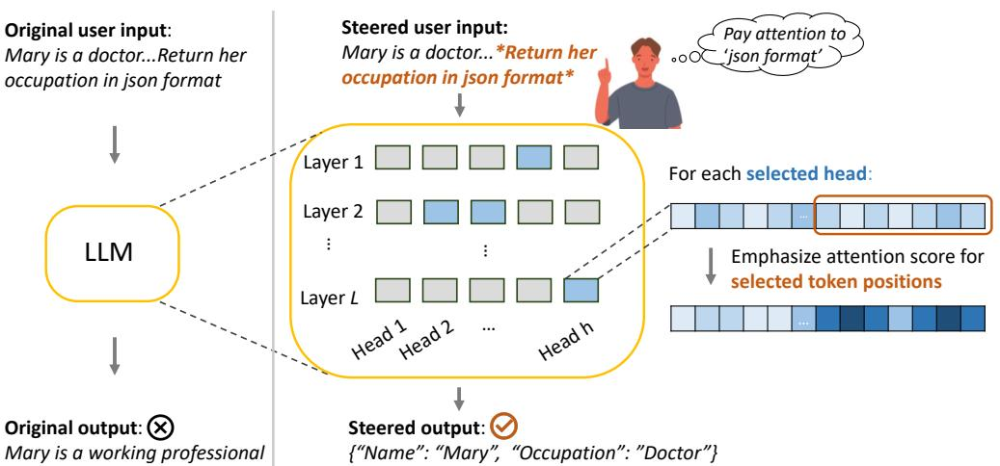
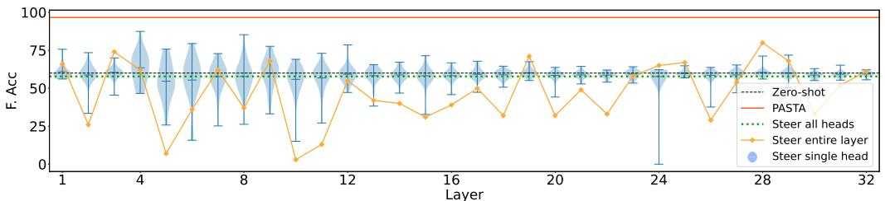
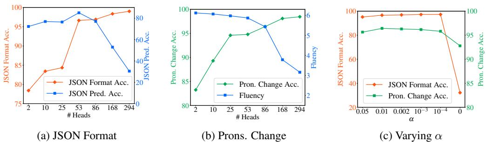
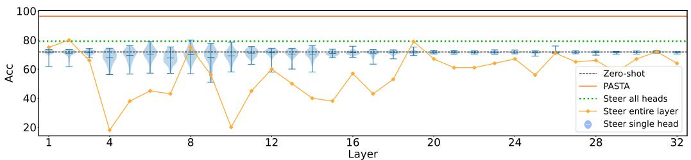
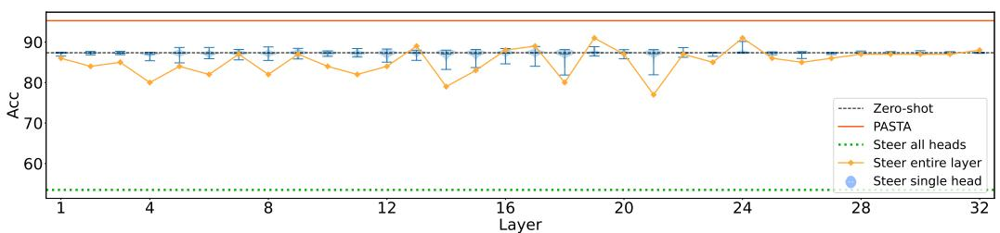
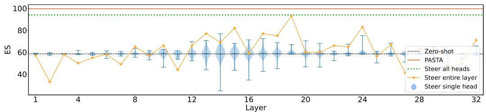

# TELL YOUR MODEL WHERE TO ATTEND: POST-HOC ATTENTION STEERING FOR LLMS

Qingru Zhang†∗, Chandan Singh⋄, Liyuan Liu⋄, Xiaodong $\mathbf { L i u } ^ { \diamond }$ , Bin $\mathbf { V } \mathbf { u } ^ { \ddag }$ ,   
Jianfeng Gao⋄, Tuo Zhao†   
†Georgia Institute of Technology ‡University of California, Berkeley ⋄Microsoft Research   
{qingru.zhang,tourzhao}@gatech.edu   
binyu@berkeley.edu   
{chansingh,lucliu,xiaodl,jfgao}@microsoft.com

# ABSTRACT

In human-written articles, we often leverage the subtleties of text style, such as bold and italics, to guide the attention of readers. These textual emphases are vital for the readers to grasp the conveyed information. When interacting with large language models (LLMs), we have a similar need – steering the model to pay closer attention to user-specified information, e.g., an instruction. Existing methods, however, are constrained to process plain text and do not support such a mechanism. This motivates us to introduce PASTA – Post-hoc Attention STeering Approach, a method that allows LLMs to read text with user-specified emphasis marks. To this end, PASTA identifies a small subset of attention heads and applies precise attention reweighting on them, directing the model attention to user-specified parts. Like prompting, PASTA is applied at inference time and does not require changing any model parameters. Experiments demonstrate that PASTA can substantially enhance an LLM’s ability to follow user instructions or integrate new knowledge from user inputs, leading to a significant performance improvement on a variety of tasks, e.g., an average accuracy improvement of $22 \%$ for LLAMA-7B. Our code is publicly available at https://github.com/QingruZhang/PASTA.

# 1 INTRODUCTION

The advent of large language models (LLMs) has marked a significant milestone in natural language processing (NLP) and artificial intelligence (AI), showcasing exceptional performance across a wide range of tasks (Vaswani et al., 2017; Brown et al., 2020a; OpenAI, 2023). Efforts to further refine these models have been relentless, aiming to enable them to process and respond to natural and programming languages with human-like expertise (Stiennon et al., 2020; Yao et al., 2023).

Despite their remarkable achievements, LLMs often encounter challenges in understanding their contextual inputs during interactions with users (Shen et al., 2023; Lu et al., 2021). This difficulty becomes particular evident when they are presented prompts1 containing extensive background contexts or complex user instructions. Lengthy contexts can overwhelm LLMs, as their attention modules, learned from data, are unable to fully capture crucial details (Liu et al., 2023). Complex instructions can further inhibit the model from focusing on the user’s intentions, resulting in undesired outputs (Wei et al., 2022). Additionally, for time-sensitive data, such as news articles, there can exist factual knowledge within contexts, which contradicts with model prior beliefs induced from outdated pre-training. As a result, a model may generate outputs conditioned on its pre-existing belief instead of attending to new facts within the contexts (Meng et al., 2022a;b; Mitchell et al., 2022; Hernandez et al., 2023). All of these challenges contribute to LLMs struggling to comprehend user intentions.

Compared to LLMs, human readers rarely struggle to understand the emphases of articles and intentions of writers. Writers often leverage a variety of text styles, such as bold and italics, to emphasize specific contents. This mechanism enables writers to direct and maintain the attention of human readers, ensuring that the intended information is accurately captured. In interactions between users and LLMs, it is users also need to highlight specific information for the model. Consequently, model generation can be effectively biased in accordance with user guidance, thus addressing the challenges mentioned earlier. This feature is particularly essential when designing user-AI interfaces, and can be frequently applied in extensive conversations between users and models. Existing methods, however, do not support such a mechanism. LLMs are inherently limited to processing plain texts, devoid of any stylistic cues or emphasis markers (Brown et al., 2020b; Liu et al., 2021; Wei et al., 2022). Even when emphasis markers are added to prompts, state-of-the-art LLMs often struggle to discern weak signals from a couple of marker tokens (See evidence in Section 5.1).

  
Figure 1: PASTA uses a user-specified part of the input to steer the model generation aligning with user intentions. PASTA modifies the attention scores generated during inference, by emphasizing the scores generated at token positions corresponding to the user-specified part of the context.

Motivated by the need to convey user emphasis, we introduce PASTA (Post-hoc Attention STeering Approach), a post-hoc method2 that enables users to highlight specific information, e.g., an instruction as in Figure 1, and steer models to interpret emphasized texts like human readers. Specifically, PASTA selects a small subset of attention heads and applies precise attention reweighting on them. As illustrated in Figure 1, PASTA upweights the attention scores of the user-specified tokens while downweighting the other tokens at specific attention heads. Our method is inspired by the observation that attention modules exhibit various token-attending patterns across different heads (Michel et al., 2019; Voita et al., 2019; Clark et al., 2019). These attention patterns can be interpreted as encoding diverse semantic or syntactic information, and altering them can substantially influence model behaviors (Shi et al., 2023a; Hu et al., 2021b). Through steering attention modules, PASTA directs the model to pay close attention to the user-specified parts and hence generate the desired output aligning with the highlighted contents. Notably, PASTA is applied after training and does not require changing any model parameters; PASTA only requires access to the attention scores of specific heads of an LLM.

Since attention heads can serve different functions (Tenney et al., 2019; Deb et al., 2023), we introduce an efficient model profiling algorithm to identify which heads are effective for steering. Specifically, we subsample small training sets from multiple tasks and evaluate the performance of attention steering for each individual head across these tasks. PASTA selects the attention heads that, when steered, generally improve the multi-task performance. We empirically observe that steering these heads not only benefits the existing tasks but also enhances the performance on unseen tasks. Notably, the model profiling is performed only once for an LLM. The selected attention heads can be regarded as a model-level profile, effective for steering the LLM on unseen tasks.

We conduct experiments on diverse tasks to demonstrate the effectiveness of PASTA. Specifically, we evaluate PASTA using GPT-J-6B (Wang & Komatsuzaki, 2021) and LLAMA-7B (Touvron et al., 2023) on tasks that span complex instructions, lengthy contexts, and knowledge conflicts within contexts. The results demonstrate that PASTA consistently provides a significant performance improvement over baseline prompting strategies. For example, PASTA achieve an average accuracy improvement of $22 \%$ over few-shot prompting for LLAMA-7B across 4 challenging tasks.

# 2 BACKGROUND

Problem description In standard LLM prompting, we are given a pre-trained LLM and a text prompt $_ { \textbf { \em x } }$ . In our setting, we additionally require (i) access to attention scores produced by attention modules in the $\mathrm { L L M } ^ { 3 }$ and (ii) we are provided a user-specified subset of the prompt $\boldsymbol { x } _ { g } \subset \boldsymbol { x }$ to be emphasized.

As in the example in Figure 1, $_ { \textbf { \em x } }$ can be a string that ends in an instruction, such as Mary is a doctor but used to be a nurse...Return her occupation in json format. If a user emphasizes the instruction, $\scriptstyle { \mathbf { { \pmb x } } _ { g } }$ can simply be the final instruction Return her occupation in json format. In evaluation datasets, we assume that the user-specified part of each example is already provided by enclosing at its both ends in some emphasis markers, like $\cdot _ { * } \cdot$ marker in Markdown. Generating these well-structured data often incurs little overhead. For example, in the dataset tailored for evaluting model ability to follow user instruction, we can simply mark the final instruction for every example, which are fixed and shared across examples. When it comes to user-LLM interface, users can specify $\scriptstyle { \pmb { x } } _ { g }$ by enclosing it with the same emphasis markers. $\scriptstyle { \pmb { x } } _ { g }$ can be specified flexibly. Namely, it need not be a continuous span, and can be used to emphasize diverse information.

Multi-Head Attention. A typical transformer model consists of $L$ stacked layers, where each layer contains two submodules: a multi-head attention (MHA) and a fully connected feed-forward network (FFN). Given the input $\ b { X } \in \mathbb { R } ^ { n \times d }$ , MHA of the layer $l$ performs the attention function in parallel $H$ heads: $\mathbf { M H A } ^ { ( l ) } \left( \boldsymbol { X } \right) = \mathbf { C o n c a t } ( \pmb { H } ^ { ( l , 1 ) } , . . . , \pmb { H } ^ { ( l , H ) } ) \pmb { W _ { o } }$ where

$$
{ \pmb H } ^ { ( l , h ) } = { \pmb A } ^ { ( l , h ) } { \pmb V } = \mathrm { S o f t m a x } \left( { \pmb Q } { \pmb K } ^ { \top } / \sqrt { d _ { h } } \right) { \pmb V }
$$

where $Q \ : = \ : X W _ { q _ { h } } , K \ : = \ : X W _ { k _ { h } } , V \ : = \ : X W _ { v _ { h } }$ and $W _ { \boldsymbol { q } _ { h } } , W _ { \boldsymbol { k } _ { h } } , W _ { \boldsymbol { v } _ { h } } \ \in \ \mathbb { R } ^ { d \times d _ { h } }$ are learnable projection matrices of head $h$ . $d _ { h }$ is typically set to $\dot { d } / H$ . Specifically, denote the attention scores at the head $h$ of the $l$ -th layer as $\mathbf { \delta A } ^ { ( l , h ) }$ .

# 3 METHOD

PASTA (Algorithm 1) consists of two components: (i) post-hoc attention steering, which emphasizes the user-specified parts of the input during inference, see Section 3.1 and (ii) multi-task model profiling, which selects the effective attention heads for steering, see Section 3.2.

# Algorithm 1 PASTA: Post-hoc Attention Steering Approach

# Multi-task model profiling (Section 3.2)

1: Input: small training sets $\{ \mathcal { D } ^ { ( i ) } \} _ { i = 1 } ^ { m }$ , the hyperparameters $\alpha , k$ ;   
2: for $1 \leq i \leq m$ do   
3: for $1 \leq l \leq L , 1 \leq h \leq H$ do   
4: Evaluate the model performance on $\mathcal { D } ^ { ( i ) }$ when steering the head $( l , h )$ by (2);   
5: Return the evaluation result of steering $( l , h )$ on $\mathcal { D } ^ { ( i ) }$ ;   
6: end for   
7: Collect the steering results of all heads and return the task profiling $R ^ { ( i ) }$ ;   
8: end for9: Output: The attention head set $\mathcal { H } = \cap _ { i = 1 } ^ { m } R _ { 1 : k } ^ { ( i ) }$ .

# Inference-time steering (Section 3.1)

1: Input: text inputs $_ { \textbf { \em x } }$ , user-underlined segments $\mathcal { G }$ , coefficient $\alpha$ ;   
2: Output: the model generations while steering every head $( l , h )$ in $\mathcal { H }$ by (2).

# 3.1 POST-HOC ATTENTION STEERING

PASTA emphasizes the user-specified input subset by downweighting the attention scores of tokens that are not specified by the user. Specifically, given the index set of highlighted input spans as $\mathcal { G }$ PASTA emphasizes these user-specified tokens by an attention projection $\tau$ :

$$
\pmb { H } ^ { ( l , h ) } = \mathcal { T } ( \pmb { A } ^ { ( l , h ) } ) \pmb { V } , \mathrm { ~ w h e r e ~ } [ \mathcal { T } ( \pmb { A } ) ] _ { i j } = \left\{ \begin{array} { l l } { \alpha A _ { i j } / C _ { i } } & { \mathrm { ~ i f ~ } j \in \mathcal { G } ^ { - } } \\ { \pmb { A } _ { i j } / C _ { i } } & { \mathrm { ~ o t h e r w i s e } . } \end{array} \right.
$$

where $0 \leq \alpha < 1$ is a scaling coefficient and $\mathcal { G } ^ { - } = [ n ] - \mathcal { G }$ is the index set of tokens that are not in $\mathcal { G }$ . The term $\begin{array} { r } { C _ { i } = \sum _ { j \in \mathcal { G } } A _ { i j } ^ { - } + \sum _ { j \in \mathcal { G } ^ { - } } \alpha A _ { i j } } \end{array}$ normalizes the scores so that they sum to one. The attention steering (2) is conducted during the inference time and does not require any training.

(2) steers the model attention by scaling down the scores of tokens that are not highlighted by the user. When the coefficient $\alpha$ is set very small, user-specified segments are highlighted given their increased attention scores after renormalization. Consequently, we can direct the model to concentrate more on the user-specified tokens, biasing the generation to align with the specified contents.

PASTA scales down the attention scores of non-specified tokens by $\alpha$ . As renormalization is followed, it is equivalent to scaling up the attention scores of user-specified tokens by $1 / \alpha$ . The reason of selecting (2) is that it can be more numerically stable compared to scaling up scores. Alternatively, one can also scale the attention scores by adding a positive constant to the underlined tokens $\mathcal { G }$ . The reason of we select multiplication in (2) instead of addition is that it preserves the difference on attention magnitude among the highlighted tokens. As such, the steering operation only adjusts overall attention scales of two groups of tokens. In contrast, addition by a large constant to the highlighted tokens results in their attention scores almost uniformly distributed, leading to unnecessary information loss and performance degeneration.

# 3.2 MULTI-TASK MODEL PROFILING

Empirically, we find that applying attention steering in (2) to all attention heads performs worse than applying it only to specific heads (see Section 5.3). It is important to specify the correct attention heads, given that different heads serve distinctive roles in encoding semantic/syntactic information. To this end, we propose a multi-task model profiling algorithm to identify the effective attention heads for steering. Specifically, given $m$ tasks involving user emphases, we subsample a small training set $\mathcal { D } ^ { ( i ) }$ (e.g., $| \mathcal { D } ^ { ( i ) } | = 1 0 0 0 )$ from each task $i$ . Then, we evaluate the performance of steering every individual attention head $( l , h )$ $( 1 \leq l \leq L , 1 \leq h \leq H )$ on each small subset $\mathcal { D } ^ { ( i ) }$ $1 \leq i \leq m )$ . For every task $i$ , we rank all of heads according to their steering performance on $\mathcal { D } ^ { ( i ) }$ and regard set the ranking $\mathcal { H }$ for steering as the intersection of top- $R ^ { ( i ) } = [ ( l _ { 1 } , h _ { 1 } ) , ( l _ { 2 } , h _ { 2 } ) , \dots ]$ as the profiling of task $k$ performing heads, $i$ $\mathcal { H } = \cap _ { i = 1 } ^ { m } R _ { 1 : k } ^ { ( i ) }$ . We then set the attention head (see Section 5.3 for alternative choices). Intuitively, we expect performance to improve as the number of tasks increases.

Like attention steering, model profiling requires only access to attention scores, in addition to its inputs and outputs (model weights and gradients are not required). Importantly, this process needs to be performed only once for a LLM, similar to finetuning. However, unlike finetuning, model steering does not modify model weights and, more importantly, generalizes to new tasks. The resulting head set $\mathcal { H }$ can be regarded as a model-level profile. Once it is determined, we can apply the attention steering on $\mathcal { H }$ to both existing tasks and unseen tasks to enhance model contextual understanding and benefit downstream performance.

# 4 EXPERIMENTAL SETUP

Evaluation tasks and metrics. We implement PASTA for two pre-trained models: GPT-J (6 billion parameters, (Wang & Komatsuzaki, 2021)) and LLaMA-7B (7 billion parameters, (Touvron et al., 2023)). We evaluate the effectiveness of PASTA at (i) handling complex user instructions, (ii) interpreting lengthy contexts, and (iii) resolving in-context knowledge conflicts. For (i), we introduce two new tasks: JSON formatting and Pronouns changing. For (ii) and (iii), we study Bias in Bios (De-Arteaga et al., 2019) and CounterFact (Meng et al., 2022a). For each task, we provide a description, describing which part of the input we emphasize, and what metrics we use for evaluation (see Appendix A for full dataset details).

• JSON Formatting is a new task that evaluates an LLM’s ability to produce outputs in a userdesired format (JSON). This is an important usecase for LLMs when their output is being used in a downstream process. This task utilizes the biographical data from BiasBios (described below) but appends a different instruction to the end of contexts: answer the occupation of {person} and generate the answer as JSON format. The instruction prompts models to generate outputs in JSON format.

We emphasize the final instruction

Metrics: (a) Format accuracy (F. Acc.) measures the accuracy at generating valid JSON. (b) Prediction accuracy (P. Acc.) measures the accuracy at generating the correct target in JSON values after loading the JSON-formatted generations.

• Pronouns changing is a new task that evaluates an LLM’s ability to follow a difficult user instruction. It again uses the biographical contexts from BiasBios but instead instructs models to: substitute ‘she’ and ‘he’ with ‘they’ and generate the occupation of {person} after changing pronouns.

We emphasize the final instruction.

Metrics: (a) Accuracy evaluates the ratio that ‘she/he’ are successfully changed to ‘they’ in model generations. (b) All-changed accuracy (A. Acc.) is the ratio that models replace all corresponding pronouns, i.e., changing she/he/her/him/hers/his to they/them/their/theirs.

• CounterFact measures an LLM’s ability to generate text consistent with a new fact. Each example consists of (subject, relation, old target, new target), e.g., (Kevin Garnett, is a professional, basketball player, baseball player). We present the model both old and new facts following the prompt: Previously, $\{ o l d f a c t \}$ , but currently, {new fact}. {question}. This change in facts over time often confuses LLMs, resulting in random guesses on two of them when answering the {question}.

We emphasize the input span containing the new fact.

Metrics: we evaluate metrics following (Meng et al., 2022a): (a) Efficacy score (ES) is the portion of cases for which the model has $P _ { \mathrm { L L M } }$ (new target) $> P _ { \mathrm { L L M } }$ (old target); (b) Paraphrase score (PS) is the same as ES but changes the $\{ q u e s t i o n \}$ with a set of rephrased questions to assess the generalization

• BiasBios consists of professional biographies of non-famous people, originally introduced to investigate gender bias in occupations. Each example includes biographical context and a label of target occupation. The first sentence mentions the person’s occupation, and subsequent sentences describe the individual’s career history but may not be directly related to the prediction, potentially distracting the model attention. At the end of the context, we append the question: {person} has the occupation of .

“ We emphasize the first sentence, as it carries the most information about the occupation.

Metrics: following (Hernandez et al., 2023), we compute Accuracy by checking whether the probability assigned to the target occupation is the highest among the 28 candidate occupations.

For Pronouns changing, CounterFact, and BiasBios, we additionally measure Fluency as the average bi-gram and tri-gram entropy of generations, designed to be low for degenerated or repetitive texts (Meng et al., 2022a). We filter out any results receiving a fluency below 3.0 (see full results including fluency in Appendix B.1).

Baselines. We compare PASTA to the following baselines:

• Zero-shot prompting is the most common approach to interact with LLMs, in which a user feeds models a prompt containing background context and a user instruction or question.

• Marked prompting alters the prompts used in zero-shot prompting by surrounding user-specified input spans with emphasis markers, e.g. asterisks, as is done in markdown files for emphasis, or quotes, as is done in natural languages.

• Few-shot prompting includes demonstrations (example inputs and target outputs) at the beginning of the prompt fed to the LLM. Few-shot prompting often improves performance in new tasks, but increases the computational cost of inference due to the increased prompt length, particularly when demonstrations are lengthy (Dong et al., 2023); here we use 3 demonstrations in context.

PASTA settings We study PASTA in 2 settings: multi-task and task-agnostic. In the multi-task setting, the evaluation task $j$ is included for profiling, whereas in the task-agnostic setting, the evaluation task is excluded (instead, we profile on the 3 datasets besides $j$ ). The multi-task setting improves performance but requires labeled training samples for the task which is evaluated, which can be difficult to obtain in practice.

Empirically, we find that PASTA is not sensitive to the scaling coefficient $\alpha$ (see Section 5.3) and fix it to 0.01 in our experiments. We select 1000 training samples from each of the 4 tasks above for model profiling. After model profiling, we select $k$ from $\{ 3 0 0 , 4 0 0 , 5 0 0 \}$ for LLAMA-7B to have the number of steered heads $| { \mathcal { H } } |$ as $\{ 2 5 , 5 3 , 8 6 \}$ . We find that PASTA achieves the best performance on LLAMA-7B when $5 0 \leq | \mathcal { H } | \leq 1 0 0$ , i.e., $k = 4 0 0$ or $k = 5 0 0$ . For GPT-J, we select $k$ from $\{ 2 5 0 , 2 7 5 , 3 0 0 , 3 5 0 \}$ to have $| \mathcal { H } |$ as $\{ 5 2 , 7 2 , 1 1 1 , 1 5 3 \}$ . For every task, we split data into train/validation/test sets following (Hernandez et al., 2023) (See Appendix A) and select $| \mathcal { H } |$ by cross validation. For all tasks, model outputs are generated with greedy search.

Table 1: Main results of LLAMA-7B to demonstrate that PASTA can improve the model ability to (i) follow user instruction (JSON Format and Prons. Changing); (ii) interpret contextual information (BiasBios); (iii) resolving knowledge conflicts (CounterFact). For all scores, higher is better. The best results are in bold.   

<table><tr><td rowspan=1 colspan=1></td><td rowspan=1 colspan=1>Method</td><td rowspan=1 colspan=1>JSON FormatF. Acc / P. Acc</td><td rowspan=1 colspan=1>Prons. ChangingAcc / A.Acc</td><td rowspan=1 colspan=1>BiasBiosAcc</td><td rowspan=1 colspan=1>CounterFactES /PS</td><td rowspan=1 colspan=1>AllAve.</td></tr><tr><td rowspan=2 colspan=1>Prompting</td><td rowspan=2 colspan=1>Zero-shot*-marked-markedFew-shot</td><td rowspan=1 colspan=1>60.00 / 54.94</td><td rowspan=1 colspan=1>71.84 / 66.28</td><td rowspan=1 colspan=1>87.36</td><td rowspan=2 colspan=1>58.50 / 52.0357.74 / 50.5258.14 / 51.7087.45 / 49.82</td><td rowspan=2 colspan=1>67.2949.3842.1573.45</td></tr><tr><td rowspan=1 colspan=1>18.55 / 12.714.56 / 4.2084.85 / 73.58</td><td rowspan=1 colspan=1>39.14 / 35.1720.55 / 18.1959.06 / 55.27</td><td rowspan=1 colspan=1>90.6289.8288.79</td></tr><tr><td rowspan=2 colspan=1>PASTA</td><td rowspan=2 colspan=1>Task-agnosticMulti-task</td><td rowspan=2 colspan=1>88.16 / 49.0896.64 / 85.09</td><td rowspan=1 colspan=1>83.65 / 81.31</td><td rowspan=2 colspan=1>93.5495.28</td><td rowspan=2 colspan=1>98.82 / 99.0399.60 / 99.57</td><td rowspan=2 colspan=1>85.8995.46</td></tr><tr><td rowspan=1 colspan=1>96.42 / 95.84</td></tr></table>

Table 2: Main results of GPT-J to demonstrate that PASTA can improve the model ability to (i) follow user instruction (JSON Format and Prons. Changing); (ii) interpret contextual information (BiasBios); (iii) resolving knowledge conflicts (CounterFact). For all scores, higher is better. The best results are in bold.   

<table><tr><td></td><td>Method</td><td>JSON Format F. Acc / P. Acc</td><td>Prons. Changing Acc / A.Acc</td><td>BiasBios Acc</td><td>CounterFact ES /PS</td><td>All Ave.</td></tr><tr><td rowspan="3">Prompting</td><td>Zero-shot</td><td>28.83 / 25.09</td><td>39.88 / 36.19</td><td>72.76</td><td>42.14 / 42.02</td><td>44.96</td></tr><tr><td>*-marked</td><td>4.44 / 4.10</td><td>41.25 / 37.57</td><td>74.14</td><td>44.50 / 45.09</td><td>40.63</td></tr><tr><td>-marked</td><td>8.81 / 5.62 84.15 / 72.65</td><td>6.12 / 5.72 35.77 / 32.08</td><td>78.64 72.98</td><td>45.54 / 41.84</td><td>33.87</td></tr><tr><td rowspan="2">PASTA</td><td>Task-agnostic</td><td>46.68 / 34.71</td><td>91.62 / 88.60</td><td>80.84</td><td>68.34 / 38.23 99.54 / 99.57</td><td>59.65 77.80</td></tr><tr><td>Multi-task</td><td>91.50 / 18.63</td><td>92.96 / 91.34</td><td>94.96</td><td>98.62 / 98.79</td><td>85.22</td></tr></table>

# 5 RESULTS

# .1 MAIN RESULT: PASTA IMPROVES MODEL GENERATION

Tables 1 and 2 present the main results for PASTA applied to LLAMA-7B and GPT-J respectively. Few-shot prompting is the strongest baseline, and task-agnostic PASTA outperforms it on the main metric for each task for all settings except JSON Formatting with GPT-J. Multi-task PASTA outperforms all baselines across all settings.

PASTA can improve LLM instruction following. The results from JSON Formatting and Pronouns Changing tasks indicate that, by highlighting the user instruction at the end of inputs, PASTA effectively steers models to focus on user intentions, thereby biasing their generation to fulfill specific requirements or formats. For example, while GPT-J only achieves $3 9 . 9 \%$ of its zero-shot generations complying the user requirement on the Pronouns Changing task, PASTA yields a remarkable $53 \%$ accuracy improvement by emphasizing the instruction. Moreover, PASTA achieves an impressive $9 6 . 6 4 \%$ format accuracy and $8 5 . 0 9 \%$ prediction accuracy when applied to LLAMA-7B on the JSON Formatting task. This performance exceeds that of few-shot prompting by $11 \%$ , even though few-shot prompting explicitly provides the model with correct JSON examples through additional demonstrations. Table 3 presents a few examples generated by LLAMA-7B when applying PASTA.

PASTA can help models capture crucial contextual information. In the case of BiasBios and CounterFact tasks, we apply PASTA to emphasize specific context spans for LLMs. Consequently, the models are guided to pay close attention to the specific contextual information or new facts within contexts. The results from these two tasks illustrate that PASTA can direct the models to interpret the crucial information or resolve the knowledge conflicts within contexts, yielding significant improvement in prediction performance of both tasks. For example, PASTA achieves a prediction accuracy of $9 4 . 9 6 \%$ for GPT-J on the BiasBios task, which is $1 6 . 3 2 \%$ higher than the best baseline.

Table 3: Generation examples of LLAMA-7B on JSON Formatting and Pronouns Changing tasks.   

<table><tr><td>Task</td><td>Prompt</td><td>Zero-shot Generation</td><td>PASTA Generation</td></tr><tr><td>JSON Format</td><td>Winnie is an American photographer living in New York. Specialized in fash- ion photography and portrait, she ap- plies her talent on both humans and ani- mals . . . {instruction}</td><td>x Winnie is a fashion and portrait pho- tographer living in New York, special- ized in fashion photography and portrait, who applies her talent on both humans and animals.</td><td>✓ {&quot;name&quot;: &quot;Winnie&quot;, &quot;occupation&quot;: &quot;photographer&quot; }</td></tr><tr><td>Prons. Change</td><td>Mary is an Associate Professor in the Department of Curriculum Instruction at St. John University; she holds a doc- torate in Reading/Writing/Literacy from the University of Pennsylvania. She re- cently published an article in &quot;Urban Education&quot; with . . . {instruction}</td><td>x Mary is a professor in the Depart- ment of Curriculum Instruction at St. John University; she holds a doctor- ate in Reading/Writing/Literacy from the University of Pennsylvania. She re- cently published an article in &quot;Urban Education&quot; with ...</td><td>✓ Mary is an associate profes- sor in the department of curriculum and instruction at St. John&#x27;s Univer- sity; they hold a doctorate in read- ing/writing/literacy from the University of Pennsylvania. They recently pub- lished an article in . . .</td></tr></table>

Tables 1 and 2 also suggest that marked prompting, a baseline that highlights specific texts akin to human writers, struggles to effectively convey emphasis to LLMs. One possible reason is that these emphasis markers rarely appear in the massive pre-training data. In contrast, few-shot prompting sometimes leads to improvements in model performance. However, a drawback of few-shot prompting is its instability, i.e. its performance exhibits high variance across different samples in the demonstration (See Appendix B).

# 5.2 PASTA CAN MITIGATE THE SENSITIVITY OF PROMPTS

Table 4: Results about sensitivity of model performance to prompt rephrasing on the JSON Formatting task. Given rephrased instructions in prompt template, PASTA can imporve zero-shot performance for all prompts.   

<table><tr><td rowspan="2">Instruction</td><td rowspan="2">Method</td><td colspan="2">LLAMA-7B</td><td colspan="2">GPT-J</td><td rowspan="2">Average</td></tr><tr><td>JSON Format F. Acc / P. Acc</td><td>Prons. Changing Acc / A. Acc</td><td>JSON Format F. Acc / P. Acc</td><td>Prons. Changing Acc / A. Acc</td></tr><tr><td rowspan="2">Original</td><td>Zero-shot</td><td>60.0 / 54.9</td><td>71.8 / 66.3</td><td>28.8 / 25.1</td><td>39.9 / 36.2</td><td>47.9</td></tr><tr><td>PASTA</td><td>96.6 / 85.1</td><td>96.4 / 95.8</td><td>91.5 / 18.6</td><td>93.0 / 91.3</td><td>83.5</td></tr><tr><td rowspan="2">Shortened</td><td>Zero-shot</td><td>36.0 / 32.4</td><td>49.2 / 42.6</td><td>25.4 / 17.1</td><td>56.5 / 54.8</td><td>39.3</td></tr><tr><td>PASTA</td><td>87.4 / 65.9</td><td>89.0 / 86.9</td><td>54.1 / 37.0</td><td>94.0 / 93.7</td><td>76.0</td></tr><tr><td rowspan="2">Rephrased</td><td>Zero-shot</td><td>57.9 / 54.2</td><td>82.3 / 79.6</td><td>63.3 / 50.3</td><td>76.0 / 72.8</td><td>67.1</td></tr><tr><td>PASTA</td><td>97.1 / 87.1</td><td>89.6 / 89.0</td><td>77.5 / 68.1</td><td>94.8 / 92.3</td><td>86.9</td></tr></table>

It is well-known that the the performance of LLMs can be sensitive to minor changes in prompts, such as rephrasing and reformatting, even when these prompts convey the same meaning (Reynolds & McDonell, 2021; Liu et al., 2021). We find that PASTA can alleviate the sensitivity of model performance to varying prompts. Specifically, Table 4 evaluates the performance of LLAMA-7B and GPT-J on JSON Formatting and Pronouns Changing task given different instructions in the prompt template, all of which convey the same meaning (see precise prompts in Appendix A.1). The results show that zero-shot performance is sensitive to different prompts and can significantly deteriorate with poorly crafted templates. In contrast, PASTA consistently improves model performance over zero-shot prompting for all prompts, effectively mitigating sensitivity to variations in the prompts.

# 5.3 ANALYSIS AND ABLATIONS

In this section, we investigate different hyperparameter choices and modeling decisions that affect the performance of PASTA.

Model profiling Figure 2 presents the results on the importance of model profiling introduced in Section 3.2. We compare PASTA when steering the selected heads versus other reasonable choices: steering (i) all heads, (ii) entire layers, or (iii) individual heads on the JSON Formatting task (See

  
Figure 2: The performance of LLAMA-7B on the JSON Formatting task when we steer (i) all heads (green); (ii) an entire layer (yellow); and (iii) an individual head within a layer (blue violin plot). The performance varies dramatically across layers and across heads of a layer.

Appendix B.3 for comparisons on the remaining tasks). Selecting heads via model profiling in PASTA (red line) significantly outperforms other approaches. Steering all heads (dashed green line) degrades performance compared to the baseline zero-shot performance (dashed black line). This is likely because steering all heads over-amplifies the user-specified information at the expense of other essential information required for effective generation and prediction. Interestingly, we find that the performance varies significantly when steering different layers (yellow) or heads (blue violin plot). As mentioned in Section 1, attention heads play distinct roles in encoding diverse semantic and syntactic information (Tenney et al., 2019). When steering heads, which are appropriately involved in encoding of user-specified information, the model can be guided to capture and reinforce these specific signals. Conversely, modifying the attention of unrelated heads not only fails to emphasize the desired information but also interferes with their original functions, resulting in performance deterioration. Therefore, it is important to identify the effective heads through model profiling prior to applying the steering.

Varying strategies for selecting heads during profiling. As described in Sec. 5.3, our model profiling selects the Intersection of the top- $k$ performing heads to steer across multiple tasks. Alternatively, when evaluating on task $j$ , we can select heads for steering with different strategies: (i) Task-specific – steer the top- $k _ { 2 }$ performing heads of only the task $j$ , i.e., $R _ { 1 : k _ { 2 } } ^ { ( j ) }$ ; or (ii) Union – the union of these heads across multiple tasks, i.e., heads rather than intersection-s $\cup _ { i = 1 } ^ { m } R _ { 1 : k _ { 2 } } ^ { ( i ) }$ . Table 5 compares their performance. Using task-specificds sometimes yields improved performance, but requires selecting a different set of heads for each new task.

Table 5: Varying head selection strategies between top task-specific heads, union across multiple tasks, and intersection (the default used in PASTA).   

<table><tr><td rowspan=2 colspan=1></td><td rowspan=2 colspan=1>PASTA</td><td rowspan=2 colspan=1>JSON FormatF. Acc / P. Acc</td><td rowspan=2 colspan=1>Prons. ChangingAcc / A.Acc</td><td rowspan=1 colspan=1>BiasBios</td><td rowspan=2 colspan=1>CounterFactES /PS</td><td rowspan=2 colspan=1>AllAvg.</td></tr><tr><td rowspan=1 colspan=1>Acc</td></tr><tr><td rowspan=1 colspan=1>LLAMA</td><td rowspan=1 colspan=1>Task-specificUnionIntersection</td><td rowspan=1 colspan=1>95.56 / 86.8388.42 / 74.4996.64 / 85.09</td><td rowspan=1 colspan=1>98.52 / 98.0292.12 / 91.4496.42 / 95.84</td><td rowspan=1 colspan=1>97.6296.3695.28</td><td rowspan=1 colspan=1>99.18 / 99.2499.24 / 99.3599.60 / 99.57</td><td rowspan=1 colspan=1>96.5792.2295.46</td></tr><tr><td rowspan=2 colspan=1>GPT-J</td><td rowspan=2 colspan=1>Task-specificUnionIntersection</td><td rowspan=2 colspan=1>85.71 / 79.3972.61 / 64.8991.50 / 18.63</td><td rowspan=1 colspan=1>94.74 / 92.5489.68 / 87.76</td><td rowspan=2 colspan=1>97.6495.5694.96</td><td rowspan=2 colspan=1>99.26 / 99.3499.82 / 99.8398.62 / 98.79</td><td rowspan=2 colspan=1>93.2988.2185.22</td></tr><tr><td rowspan=1 colspan=1>92.96 / 91.34</td></tr></table>

Varying the number of heads to be steered. Figures 3a and 3b illustrate the performance of PASTA when steering different number of heads on two tasks. The results suggest that as more heads are included for steering, the model follows the user even more closely, achieving higher efficacy (JSON Format Acc. and Pron. Change Acc.). However, at some point, this it results in a decrease in the metrics reflecting the generation quality (JSON Pred. Acc and Fluency). Thus, there is a trade-off between emphasizing efficacy and generation quality. Overemphasizing can lead the model to focus solely on satisfying the user requirements and ignore the other parts. Therefore, we recommend applying PASTA to a moderate number of heads (typically 50 to 150), striking a balance between the efficacy and generation quality.

Varying the scaling coefficient $\alpha$ . Figure 3c presents the performance of PASTA on two tasks when we change the scaling coefficient $\alpha$ . The results indicate that PASTA is fairly robust to this hyperparameter; in practice, we fix it as 0.01. Notice that setting $\alpha$ to zero should be avoided, as this leads to the complete removal of other crucial contexts at the steered heads, resulting in performance degeneration.

  
Figure 3: The performance of applying PASTA to LLAMA-7B on JSON Formating and Pronouns Changing tasks when varying the number of steered heads $| { \mathcal { H } } |$ (3a,3b); and changing the scaling coefficient $\alpha$ (3c).

# 6 RELATED WORK

The primary method for controlling LLMs has been through prompting, often yielding impressive improvements in performance (Brown et al., 2020b; Liu et al., 2021; Wei et al., 2022) and spurring a line of work aiming to make prompting easier, e.g. (Strobelt et al., 2022; Bach et al., 2022; Shin et al., 2020; Deng et al., 2022; Singh et al., 2023b). However, LLMs remain extremely sensitive to nuances in prompts (Webson & Pavlick, 2021; Lu et al., 2021); PASTA complements these approaches by making it easier for a user to specify a prompt in difficult scenarios.

Another line of work aims to make LLMs more amenable to prompting by modifying them during training. Most prominent among these approaches are instruction finetuning (Wei et al., 2021; Chung et al., 2022), Reinforcement Learning from Human Feedback (Ziegler et al., 2019; Ouyang et al., 2022), and other related methods, e.g. (Lee et al., 2023). There are also a few methods for directly specifying which parts on an input are important during training, e.g. (Ross et al., 2017; Rieger et al., 2019; Schramowski et al., 2020; Krishna et al., 2023). PASTA can be used in addition to these approaches to improve some aspects of model steerability (e.g. instruction following).

PASTA is related to variety of methods for adapting to new tasks, including LoRA (Hu et al., 2021a), AdaLoRA (Zhang et al., 2023), QLoRA (Dettmers et al., 2023), and TOAST (Shi et al., 2023b). PASTA is also related to a variety of research on model editing, e.g. ROME (Meng et al., 2022a), MEMIT (Meng et al., 2022b), MEND (Mitchell et al., 2022), and REMEDI (Hernandez et al., 2023). Unlike these works, PASTA preserves an LLMs ability to transfer to new tasks using prompts and human-selected info, rather than using new labeled examples.

Finally, PASTA is also motivated by works which have aimed to mechanistically understand attention scores (Zou et al., 2023), e.g. by studying them through feature importance (Jain & Wallace, 2019; Wiegreffe & Pinter, 2019; Deb et al., 2023), probing (Conneau et al., 2018; Liu & Avci, 2019), visualization (Karpathy et al., 2015; Olah et al., 2017), localizing knowledge (Meng et al., 2022a; Dai et al., 2021), categorizing directions in representation space (Kim et al., 2017; Schwettmann et al., 2021), or natural-language explanations (Bills et al., 2023; Singh et al., 2023a).

# 7 CONCLUSION

In this study, we propose PASTA, a novel approach aimed at enabling LLMs to move beyond the limitations of plain text and effectively perceive user guidance embodied as highlighted parts of prompts. By making precise adjustments to attention scores in selected heads, PASTA directs the model’s focus to the relevant context, mirroring the way humans benefit from textual cues. Unlike traditional fine-tuning methods, PASTA is applied at inference time and requires neither parameter updates nor gradient computation; PASTA requires only selecting which attention heads to apply the re-weighting to, a one-time profiling operation for a LLM. Experimental results show that PASTA can significantly improve model performance on a variety of tasks. In the future, we plan to integrate PASTA with various other methods, such as few-shot in-context learning, aiming to highlight effective examples to enhance its stability.

# REFERENCES

Stephen H Bach, Victor Sanh, Zheng-Xin Yong, Albert Webson, Colin Raffel, Nihal V Nayak, Abheesht Sharma, Taewoon Kim, M Saiful Bari, Thibault Fevry, et al. Promptsource: An integrated development environment and repository for natural language prompts. arXiv preprint arXiv:2202.01279, 2022.

Steven Bills, Nick Cammarata, Dan Mossing, Henk Tillman, Leo Gao, Gabriel Goh, Ilya Sutskever, Jan Leike, Jeff Wu, and William Saunders. Language models can explain neurons in language models. URL https://openaipublic. blob. core. windows. net/neuron-explainer/paper/index. html.(Date accessed: 14.05. 2023), 2023.

Tom Brown, Benjamin Mann, Nick Ryder, Melanie Subbiah, Jared D Kaplan, Prafulla Dhariwal, Arvind Neelakantan, Pranav Shyam, Girish Sastry, Amanda Askell, Sandhini Agarwal, Ariel Herbert-Voss, Gretchen Krueger, Tom Henighan, Rewon Child, Aditya Ramesh, Daniel Ziegler, Jeffrey Wu, Clemens Winter, Chris Hesse, Mark Chen, Eric Sigler, Mateusz Litwin, Scott Gray, Benjamin Chess, Jack Clark, Christopher Berner, Sam McCandlish, Alec Radford, Ilya Sutskever, and Dario Amodei. Language models are few-shot learners. In H. Larochelle, M. Ranzato, R. Hadsell, M.F. Balcan, and H. Lin (eds.), Advances in Neural Information Processing Systems, volume 33, pp. 1877–1901. Curran Associates, Inc., 2020a. URL https://proceedings.neurips.cc/paper_files/paper/2020/file/ 1457c0d6bfcb4967418bfb8ac142f64a-Paper.pdf.

Tom Brown, Benjamin Mann, Nick Ryder, Melanie Subbiah, Jared D Kaplan, Prafulla Dhariwal, Arvind Neelakantan, Pranav Shyam, Girish Sastry, Amanda Askell, et al. Language models are few-shot learners. Advances in neural information processing systems, 33:1877–1901, 2020b.

Hyung Won Chung, Le Hou, Shayne Longpre, Barret Zoph, Yi Tay, William Fedus, Eric Li, Xuezhi Wang, Mostafa Dehghani, Siddhartha Brahma, et al. Scaling instruction-finetuned language models. arXiv preprint arXiv:2210.11416, 2022.

Kevin Clark, Urvashi Khandelwal, Omer Levy, and Christopher D. Manning. What does BERT look at? an analysis of BERT’s attention. In Proceedings of the 2019 ACL Workshop BlackboxNLP: Analyzing and Interpreting Neural Networks for NLP, pp. 276–286, Florence, Italy, August 2019. Association for Computational Linguistics. doi: 10.18653/v1/W19-4828. URL https://aclanthology.org/W19-4828.

Alexis Conneau, German Kruszewski, Guillaume Lample, Lo¨ıc Barrault, and Marco Baroni. What you can cram into a single vector: Probing sentence embeddings for linguistic properties. arXiv preprint arXiv:1805.01070, 2018.

Damai Dai, Li Dong, Yaru Hao, Zhifang Sui, Baobao Chang, and Furu Wei. Knowledge neurons in pretrained transformers. arXiv preprint arXiv:2104.08696, 2021.

Maria De-Arteaga, Alexey Romanov, Hanna Wallach, Jennifer Chayes, Christian Borgs, Alexandra Chouldechova, Sahin Geyik, Krishnaram Kenthapadi, and Adam Tauman Kalai. Bias in bios: A case study of semantic representation bias in a high-stakes setting. In proceedings of the Conference on Fairness, Accountability, and Transparency, pp. 120–128, 2019.

Mayukh Deb, Bjorn Deiseroth, Samuel Weinbach, Patrick Schramowski, and Kristian Kersting. Atman: ¨ Understanding transformer predictions through memory efficient attention manipulation. arXiv preprint arXiv:2301.08110, 2023.

Mingkai Deng, Jianyu Wang, Cheng-Ping Hsieh, Yihan Wang, Han Guo, Tianmin Shu, Meng Song, Eric P Xing, and Zhiting Hu. Rlprompt: Optimizing discrete text prompts with reinforcement learning. arXiv preprint arXiv:2205.12548, 2022.

Tim Dettmers, Artidoro Pagnoni, Ari Holtzman, and Luke Zettlemoyer. Qlora: Efficient finetuning of quantized llms, 2023.

Qingxiu Dong, Lei Li, Damai Dai, Ce Zheng, Zhiyong Wu, Baobao Chang, Xu Sun, Jingjing Xu, Lei Li, and Zhifang Sui. A survey on in-context learning, 2023.

Evan Hernandez, Belinda Z. Li, and Jacob Andreas. Inspecting and editing knowledge representations in language models, 2023.

Edward J Hu, Yelong Shen, Phillip Wallis, Zeyuan Allen-Zhu, Yuanzhi Li, Shean Wang, Lu Wang, and Weizhu Chen. Lora: Low-rank adaptation of large language models. arXiv preprint arXiv:2106.09685, 2021a.

J. Edward Hu, Yelong Shen, Phillip Wallis, Zeyuan Allen-Zhu, Yuanzhi Li, Shean Wang, and Weizhu Chen. Lora: Low-rank adaptation of large language models. arXiv preprint abs:2106.09685, 2021b.

Sarthak Jain and Byron C Wallace. Attention is not explanation. arXiv preprint arXiv:1902.10186, 2019.

Andrej Karpathy, Justin Johnson, and Li Fei-Fei. Visualizing and understanding recurrent networks. arXiv preprint arXiv:1506.02078, 2015.

Been Kim, Martin Wattenberg, Justin Gilmer, Carrie Cai, James Wexler, Fernanda Viegas, and Rory Sayres. Interpretability beyond feature attribution: Quantitative testing with concept activation vectors (tcav). arXiv preprint arXiv:1711.11279, 2017.

Satyapriya Krishna, Jiaqi Ma, Dylan Slack, Asma Ghandeharioun, Sameer Singh, and Himabindu Lakkaraju. Post hoc explanations of language models can improve language models. arXiv preprint arXiv:2305.11426, 2023.

Harrison Lee, Samrat Phatale, Hassan Mansoor, Kellie Lu, Thomas Mesnard, Colton Bishop, Victor Carbune, and Abhinav Rastogi. Rlaif: Scaling reinforcement learning from human feedback with ai feedback. arXiv preprint arXiv:2309.00267, 2023.

Frederick Liu and Besim Avci. Incorporating priors with feature attribution on text classification. arXiv preprint arXiv:1906.08286, 2019.

Nelson F. Liu, Kevin Lin, John Hewitt, Ashwin Paranjape, Michele Bevilacqua, Fabio Petroni, and Percy Liang. Lost in the middle: How language models use long contexts, 2023.

Pengfei Liu, Weizhe Yuan, Jinlan Fu, Zhengbao Jiang, Hiroaki Hayashi, and Graham Neubig. Pre-train, prompt, and predict: A systematic survey of prompting methods in natural language processing. arXiv preprint arXiv:2107.13586, 2021.

Yao Lu, Max Bartolo, Alastair Moore, Sebastian Riedel, and Pontus Stenetorp. Fantastically ordered prompts and where to find them: Overcoming few-shot prompt order sensitivity. arXiv preprint arXiv:2104.08786, 2021.

Kevin Meng, David Bau, Alex Andonian, and Yonatan Belinkov. Locating and editing factual associations in gpt. Advances in Neural Information Processing Systems, 35:17359–17372, 2022a.

Kevin Meng, Arnab Sen Sharma, Alex Andonian, Yonatan Belinkov, and David Bau. Mass-editing memory in a transformer. arXiv preprint arXiv:2210.07229, 2022b.

Paul Michel, Omer Levy, and Graham Neubig. Are sixteen heads really better than one? In H. Wallach, H. Larochelle, A. Beygelzimer, F. d'Alche-Buc, E. Fox, and R. Garnett ´ (eds.), Advances in Neural Information Processing Systems, volume 32. Curran Associates, Inc., 2019. URL https://proceedings.neurips.cc/paper_files/paper/2019/file/ 2c601ad9d2ff9bc8b282670cdd54f69f-Paper.pdf.

Eric Mitchell, Charles Lin, Antoine Bosselut, Chelsea Finn, and Christopher D. Manning. Fast model editing at scale, 2022.

Chris Olah, Alexander Mordvintsev, and Ludwig Schubert. Feature visualization. Distill, 2(11):e7, 2017.

OpenAI. Gpt-4 technical report, 2023.

Long Ouyang, Jeffrey Wu, Xu Jiang, Diogo Almeida, Carroll Wainwright, Pamela Mishkin, Chong Zhang, Sandhini Agarwal, Katarina Slama, Alex Ray, et al. Training language models to follow instructions with human feedback. Advances in Neural Information Processing Systems, 35:27730–27744, 2022.

Adam Paszke, Sam Gross, Francisco Massa, Adam Lerer, James Bradbury, Gregory Chanan, Trevor Killeen, Zeming Lin, Natalia Gimelshein, Luca Antiga, Alban Desmaison, Andreas Kopf, Edward Yang, Zachary ¨ DeVito, Martin Raison, Alykhan Tejani, Sasank Chilamkurthy, Benoit Steiner, Lu Fang, Junjie Bai, and Soumith Chintala. Pytorch: An imperative style, high-performance deep learning library. In Hanna M. Wallach, Hugo Larochelle, Alina Beygelzimer, Florence d’Alche-Buc, Emily B. Fox, and Roman Garnett ´ (eds.), Advances in Neural Information Processing Systems 32: Annual Conference on Neural Information Processing Systems 2019, NeurIPS 2019, December 8-14, 2019, Vancouver, BC, Canada, pp. 8024–8035, 2019.

Laria Reynolds and Kyle McDonell. Prompt programming for large language models: Beyond the few-shot paradigm, 2021.

Laura Rieger, Chandan Singh, W James Murdoch, and Bin Yu. Interpretations are useful: penalizing explanations to align neural networks with prior knowledge. arXiv preprint arXiv:1909.13584, 2019.

Andrew Slavin Ross, Michael C Hughes, and Finale Doshi-Velez. Right for the right reasons: Training differentiable models by constraining their explanations. arXiv preprint arXiv:1703.03717, 2017.

Patrick Schramowski, Wolfgang Stammer, Stefano Teso, Anna Brugger, Franziska Herbert, Xiaoting Shao, Hans-Georg Luigs, Anne-Katrin Mahlein, and Kristian Kersting. Making deep neural networks right for the right scientific reasons by interacting with their explanations. Nature Machine Intelligence, 2(8):476–486, 2020.

Sarah Schwettmann, Evan Hernandez, David Bau, Samuel Klein, Jacob Andreas, and Antonio Torralba. Toward a visual concept vocabulary for gan latent space. In Proceedings of the IEEE/CVF International Conference on Computer Vision, pp. 6804–6812, 2021.

Tianhao Shen, Renren Jin, Yufei Huang, Chuang Liu, Weilong Dong, Zishan Guo, Xinwei Wu, Yan Liu, and Deyi Xiong. Large language model alignment: A survey, 2023.

Baifeng Shi, Siyu Gai, Trevor Darrell, and Xin Wang. Toast: Transfer learning via attention steering. arXiv preprint abs:2305.15542, 2023a.

Baifeng Shi, Siyu Gai, Trevor Darrell, and Xin Wang. Refocusing is key to transfer learning. arXiv preprint arXiv:2305.15542, 2023b.

Taylor Shin, Yasaman Razeghi, Robert L Logan IV, Eric Wallace, and Sameer Singh. Autoprompt: Eliciting knowledge from language models with automatically generated prompts. arXiv preprint arXiv:2010.15980, 2020.

Chandan Singh, Aliyah R Hsu, Richard Antonello, Shailee Jain, Alexander G Huth, Bin Yu, and Jianfeng Gao. Explaining black box text modules in natural language with language models. arXiv preprint arXiv:2305.09863, 2023a.

Chandan Singh, John X. Morris, Jyoti Aneja, Alexander M. Rush, and Jianfeng Gao. Explaining patterns in data with language models via interpretable autoprompting, 2023b.

Nisan Stiennon, Long Ouyang, Jeff Wu, Daniel M. Ziegler, Ryan J. Lowe, Chelsea Voss, Alec Radford, Dario Amodei, and Paul Christiano. Learning to summarize from human feedback. arXiv preprint abs:2009.01325, 2020.

Hendrik Strobelt, Albert Webson, Victor Sanh, Benjamin Hoover, Johanna Beyer, Hanspeter Pfister, and Alexander M. Rush. Interactive and visual prompt engineering for ad-hoc task adaptation with large language models, 2022.

Ian Tenney, Dipanjan Das, and Ellie Pavlick. BERT rediscovers the classical NLP pipeline. In Proceedings of the 57th Annual Meeting of the Association for Computational Linguistics, pp. 4593–4601, Florence, Italy, July 2019. Association for Computational Linguistics. doi: 10.18653/v1/P19-1452. URL https: //aclanthology.org/P19-1452.

Hugo Touvron, Louis Martin, Kevin Stone, Peter Albert, Amjad Almahairi, Yasmine Babaei, Nikolay Bashlykov, Soumya Batra, Prajjwal Bhargava, Shruti Bhosale, et al. Llama 2: Open foundation and fine-tuned chat models. arXiv preprint arXiv:2307.09288, 2023.

Ashish Vaswani, Noam Shazeer, Niki Parmar, Jakob Uszkoreit, Llion Jones, Aidan N Gomez, Ł ukasz Kaiser, and Illia Polosukhin. Attention is all you need. In I. Guyon, U. Von Luxburg, S. Bengio, H. Wallach, R. Fergus, S. Vishwanathan, and R. Garnett (eds.), Advances in Neural Information Processing Systems, volume 30. Curran Associates, Inc., 2017. URL https://proceedings.neurips.cc/paper_ files/paper/2017/file/3f5ee243547dee91fbd053c1c4a845aa-Paper.pdf.

Elena Voita, David Talbot, Fedor Moiseev, Rico Sennrich, and Ivan Titov. Analyzing multi-head self-attention: Specialized heads do the heavy lifting, the rest can be pruned, July 2019. URL https://aclanthology. org/P19-1580.

Ben Wang and Aran Komatsuzaki. GPT-J-6B: A 6 Billion Parameter Autoregressive Language Model. https: //github.com/kingoflolz/mesh-transformer-jax, May 2021.

Albert Webson and Ellie Pavlick. Do prompt-based models really understand the meaning of their prompts? arXiv preprint arXiv:2109.01247, 2021.

Jason Wei, Maarten Bosma, Vincent Y Zhao, Kelvin Guu, Adams Wei Yu, Brian Lester, Nan Du, Andrew M Dai, and Quoc V Le. Finetuned language models are zero-shot learners. arXiv preprint arXiv:2109.01652, 2021.

Jason Wei, Xuezhi Wang, Dale Schuurmans, Maarten Bosma, Fei Xia, Ed Chi, Quoc V Le, Denny Zhou, et al. Chain-of-thought prompting elicits reasoning in large language models. Advances in Neural Information Processing Systems, 35:24824–24837, 2022.

Sarah Wiegreffe and Yuval Pinter. Attention is not not explanation. arXiv preprint arXiv:1908.04626, 2019.

Thomas Wolf, Lysandre Debut, Victor Sanh, Julien Chaumond, Clement Delangue, Anthony Moi, Pierric Cistac, Tim Rault, Remi Louf, Morgan Funtowicz, et al. Huggingface’s transformers: State-of-the-art natural ´ language processing. arXiv preprint arXiv:1910.03771, 2019.

Zhewei Yao, Reza Yazdani Aminabadi, Olatunji Ruwase, Samyam Rajbhandari, Xiaoxia Wu, Ammar Ahmad Awan, Jeff Rasley, Minjia Zhang, Conglong Li, Connor Holmes, Zhongzhu Zhou, Michael Wyatt, Molly Smith, L A Kurilenko, Heyang Qin, Masahiro Tanaka, Shuai Che, Shuaiwen Leon Song, and Yuxiong He. Deepspeed-chat: Easy, fast and affordable rlhf training of chatgpt-like models at all scales. arXiv preprint abs:2308.01320, 2023.

Qingru Zhang, Minshuo Chen, Alexander Bukharin, Pengcheng He, Yu Cheng, Weizhu Chen, and Tuo Zhao. Adaptive budget allocation for parameter-efficient fine-tuning. In The Eleventh International Conference on Learning Representations, 2023. URL https://openreview.net/forum?id=lq62uWRJjiY.

Daniel M Ziegler, Nisan Stiennon, Jeffrey Wu, Tom B Brown, Alec Radford, Dario Amodei, Paul Christiano, and Geoffrey Irving. Fine-tuning language models from human preferences. arXiv preprint arXiv:1909.08593, 2019.

Andy Zou, Long Phan, Sarah Chen, James Campbell, Phillip Guo, Richard Ren, Alexander Pan, Xuwang Yin, Mantas Mazeika, Ann-Kathrin Dombrowski, Shashwat Goel, Nathaniel Li, Michael J. Byun, Zifan Wang, Alex Mallen, Steven Basart, Sanmi Koyejo, Dawn Song, Matt Fredrikson, J. Zico Kolter, and Dan Hendrycks. Representation engineering: A top-down approach to ai transparency, 2023.

# APPENDIX

# A EXPERIMENTAL DETAILS

We implement all algorithms using PyTorch (Paszke et al., 2019) and Huggingface (Wolf et al., 2019) and run experiments on NVIDIA V100 GPUs and NVIDIA A6000 GPUs.

Table 6 provides detailed statistics of datasets in our experiments.

Table 6: Statistics of datasets.   

<table><tr><td>Task</td><td>Train</td><td>Valid</td><td>Test</td></tr><tr><td>CounterFact</td><td>1000</td><td>1000</td><td>5000</td></tr><tr><td>BiasBios</td><td>1000</td><td>1000</td><td>5000</td></tr><tr><td>JSON Formatting</td><td>1000</td><td>1000</td><td>5000</td></tr><tr><td>Pronouns Changing</td><td>1000</td><td>1000</td><td>5000</td></tr></table>

# A.1 DETAILED PROMPT TEMPLATES OF EACH TASK

For each task, the prompt templates in our results are as follows:

# • JSON Formatting:

– (Original) {context}. Answer the occupation of {person} and generate the answer as json format. Here is an example: {“name”: , “occupation”: ,}. Now generate the answer.   
– (Shortened one in Section 5.2) {context}. Answer the occupation of {person} and generate the answer as json format.   
– (Rephrased one in Section 5.2) Answer the occupation of {person} and generate the answer as json format. Here is an example: {“name”: , “occupation”: ,}. {context}. Now generate the answer.

# • Pronouns Changing:

– (Original): {context}. For the aforementioned text, substitute ‘she’ and ‘he’ with ‘they’ and generate the occupation of {person} after changing pronouns. – (Shortened one in Section 5.2): context . Change ‘she’ and ‘he’ with ‘they’ and answer the occupation of {person} after replacing the pronouns (Rephrased one in Section 5.2): context . For the aforementioned descriptions, replace ‘she’ and ‘he’ with ‘they’ in the aformentioned text and generate the new text after replacing the pronouns.

• BiasBios: {context}. {person} has the occupation of.

• CounterFact: Previously, {old fact}. Currently, {new fact}. {question}

# A.2 THE EVALUATION DETAILS OF PASTA

Table 7 presents the number of heads to be steered by PASTA for LLAMA-7B and GPT-J-6B on every task.

Table 7: The number of heads to be steered by PASTA.   

<table><tr><td>Task</td><td>LLAMA-7B</td><td>GPT-J-6B</td></tr><tr><td>JSON Formatting</td><td>53</td><td>153</td></tr><tr><td>Pronouns Changing</td><td>86</td><td>72</td></tr><tr><td>BiasBios</td><td>86</td><td>111</td></tr><tr><td>CounterFact</td><td>86</td><td>52</td></tr></table>

# B EXTENDED RESULTS

# B.1 EXTENDED RESULTS WITH FLUENCY

In this section, we include extended results, including fluency metrics. Fluency score is the average bigram and tri-gram entropy of generations, designed to be low for degenerated or repetitive texts (Meng et al., 2022a). This metric can be regarded as the reference metric of generation quality. Typically, the generations of language models are reliable as long as their fluency score is not too low. Here, we filter out any results receiving a fluency score below 3.0. Table 8, 9 and 10 include all results and fluency evaluation.

Table 8: Main results of LLAMA-7B to demonstrate that PASTA can improve the model ability to (i) follow user instruction (JSON Format and Prons. Changing); (ii) interpret contextual information (BiasBios); (iii) resolving knowledge conflicts (CounterFact). For all scores, higher is better. The best results are in bold.

Table 9: Main results of GPT-J to demonstrate that PASTA can improve the model ability to (i) follow user instruction (JSON Format and Prons. Changing); (ii) interpret contextual information (BiasBios); (iii) resolving knowledge conflicts (CounterFact). For all scores, higher is better. The best results are in bold.   

<table><tr><td rowspan=2 colspan=1></td><td rowspan=2 colspan=1>Method</td><td rowspan=2 colspan=1>JSON FormatF. Acc / P. Acc</td><td rowspan=2 colspan=1>Prons. ChangingAcc / A.Acc / Flue.</td><td rowspan=1 colspan=1>BiasBios</td><td rowspan=2 colspan=1>CounterFactES / PS /Flue.</td></tr><tr><td rowspan=1 colspan=1>Acc / Flue.</td></tr><tr><td rowspan=2 colspan=1>Prompting</td><td rowspan=2 colspan=1>Zero-shot*-marked-markedFew-shot</td><td rowspan=1 colspan=1>60.00 / 54.94</td><td rowspan=1 colspan=1>71.84 / 66.28 / 6.10</td><td rowspan=1 colspan=1>87.36 / 3.98</td><td rowspan=2 colspan=1>58.50 / 52.03 / 4.9657.74 / 50.52 / 5.1258.14 / 51.70 / 5.1387.45 / 49.82 / 5.68</td></tr><tr><td rowspan=1 colspan=1>18.55 / 12.714.56 / 4.2084.85 / 73.58</td><td rowspan=1 colspan=1>39.14 / 35.17 / 6.0320.55 / 18.19 / 5.1359.06 / 55.27 / 5.95</td><td rowspan=1 colspan=1>90.62 / 3.8989.82 / 3.9788.79 / 4.19</td></tr><tr><td rowspan=1 colspan=1>PASTA</td><td rowspan=1 colspan=1>Task-agnosticMulti-task</td><td rowspan=1 colspan=1>88.16 / 49.0896.64 / 85.09</td><td rowspan=1 colspan=1>83.65 / 81.31 / 4.6296.42 / 95.84 / 5.43</td><td rowspan=1 colspan=1>93.54 / 3.0395.28 / 4.05</td><td rowspan=1 colspan=1>98.82 / 99.03 / 4.7899.60 / 99.57 / 4.89</td></tr></table>

Table 10: Varying head selection strategies between top top task-specific heads, union across multiple tasks, and intersection (the default used in PASTA).   

<table><tr><td rowspan=2 colspan=1></td><td rowspan=2 colspan=1>Method</td><td rowspan=2 colspan=1>JSON FormatF. Acc / P. Acc</td><td rowspan=2 colspan=1>Prons. ChangingAcc / A.Acc / Flue.</td><td rowspan=1 colspan=1>BiasBios</td><td rowspan=1 colspan=1>CounterFact</td></tr><tr><td rowspan=1 colspan=1>Acc / Flue.</td><td rowspan=1 colspan=1>ES / PS /Flue.</td></tr><tr><td rowspan=2 colspan=1>Prompting</td><td rowspan=1 colspan=1>Zero-shot</td><td rowspan=1 colspan=1>28.83 / 25.09</td><td rowspan=1 colspan=1>39.88 / 36.19 / 5.91</td><td rowspan=1 colspan=1>72.76 / 5.06</td><td rowspan=1 colspan=1>42.14 / 42.02 / 5.01</td></tr><tr><td rowspan=1 colspan=1>*-marked-markedFew-shot</td><td rowspan=1 colspan=1>4.44 / 4.108.81 / 5.6284.15 / 72.65</td><td rowspan=1 colspan=1>41.25 / 37.57 / 4.766.12 / 5.72 / 5.4335.77 / 32.08 / 6.46</td><td rowspan=1 colspan=1>74.14 / 5.0178.64 / 4.9672.98 / 4.82</td><td rowspan=1 colspan=1>44.50 / 45.09 / 5.2245.54 / 41.84 / 5.1668.34 / 38.23 / 5.67</td></tr><tr><td rowspan=2 colspan=1>PASTA</td><td rowspan=2 colspan=1>Task-agnosticMulti-task</td><td rowspan=2 colspan=1>46.68 / 34.7191.50 / 18.63</td><td rowspan=2 colspan=1>91.62 / 88.60 / 3.0092.96 / 91.34 / 4.91</td><td rowspan=1 colspan=1>80.84 / 4.92</td><td rowspan=2 colspan=1>99.54 / 99.57 / 5.1198.62 / 98.79 / 5.11</td></tr><tr><td rowspan=1 colspan=1>94.96 / 4.87</td></tr></table>

<table><tr><td colspan="2">PASTA</td><td>JSON Format F. Acc / P. Acc</td><td>Prons. Changing Acc / A.Acc / Flue.</td><td>BiasBios Acc / Flue.</td><td>CounterFact ES / PS /Flue.</td></tr><tr><td rowspan="3">IAAAA</td><td>Task-specific</td><td>95.56 / 86.83</td><td>98.52 / 98.02 / 5.92</td><td>97.62 / 4.18</td><td>99.18 / 99.24 / 4.93</td></tr><tr><td>union</td><td>88.42 / 74.49</td><td>92.12 / 91.44 / 4.88</td><td>96.36 / 4.13</td><td>99.24 / 99.35 / 4.53</td></tr><tr><td>intersection</td><td>96.64 / 85.09</td><td>96.42 / 95.84 / 5.43</td><td>95.28 / 4.05</td><td>99.60 / 99.57 / 4.89</td></tr><tr><td rowspan="3">CLdJ</td><td>Task-specific</td><td>85.71 / 79.39</td><td>94.74 / 92.54 / 5.07</td><td>97.64 / 5.06</td><td>99.26 / 99.34 / 4.94</td></tr><tr><td>Union</td><td>72.61 / 64.89</td><td>89.68 / 87.76 / 3.92</td><td>95.56 / 5.02</td><td>99.82 / 99.83 / 5.03</td></tr><tr><td>Intersection</td><td>91.50 / 18.63</td><td>92.96 / 91.34 / 4.91</td><td>94.96 / 4.87</td><td>98.62 / 98.79 / 5.11</td></tr></table>

# B.2 THE VARIANCE OF FEW-SHOT PERFORMANCE

Few-shot prompting sometimes leads to improvements in model performance. as explicitly providing the examples in additional demonstrations. However, a drawback of few-shot prompting is its insta

bility, meaning its performance exhibits high variance across different samples in the demonstratio. In this section, we present the results to show that the performance of few-shot prompting displays high variance in terms of sampling different few-shot demonstrations.

Table 11: The few-shot performance (Acc. / A. Acc. / Fluency) on the Pronouns Changing task.   

<table><tr><td>Few-shot examples</td><td>LLAMA-7B</td><td>GPT-J-6B</td></tr><tr><td>Demonstration 1</td><td>84.87 / 90.09 / 4.74</td><td>43.82 / 40.36 / 6.43</td></tr><tr><td>Demonstration 2</td><td>57.24 / 53.98 / 6.22</td><td>40.68 / 37.86 / 6.44</td></tr><tr><td>Demonstration 3</td><td>57.08 / 53.22 / 6.02</td><td>33.13 / 29.21 / 6.48</td></tr><tr><td>Demonstration 4</td><td>52.26 / 48.30 / 6.42</td><td>25.47 / 20.89 / 6.44</td></tr><tr><td>Demonstration 5</td><td>43.86 / 40.78 / 6.43</td><td>11.90 / 8.63 / 6.51</td></tr></table>

# B.3 MODEL PROFILING RESULTS

In this Section, we provide more results of the performance of LLAMA-7B on all of tasks when steering: (i) all heads; (ii) entire layer; (iii) a individual head of a layer.

  
Figure 4: The performance of LLAMA-7B on Pronouns Changing task when we steer (i) all heads (green); (ii) entrie layer (yellow); and (iii) individual head with a layer (blue violin plot). The performance varies dramatically across layers and across heads of a layer.

  
Figure 5: The performance of LLAMA-7B on BiasBios task when we steer (i) all heads (green); (ii) entrie layer (yellow); and (iii) individual head with a layer (blue violin plot). The performance varies dramatically across layers and across heads of a layer.

  
Figure 6: The performance of LLAMA-7B on CounterFact task when we steer (i) all heads (green); (ii) entrie layer (yellow); and (iii) individual head with a layer (blue violin plot). The performance varies dramatically across layers and across heads of a layer.

# C RESULTS ON MORE MODELS

# C.1 LARGER MODEL SIZE

We conduct experiments with LLAMA-13B to further evaluate the effectiveness of PASTA across all tasks. The following table presents the performance comparison for LLAMA-13B.

Table 12: Results of LLAMA-13B. For all scores, higher is better. The best results are in bold.   

<table><tr><td rowspan=1 colspan=1>Method</td><td rowspan=1 colspan=1>JSON FormatF. Acc / P. Acc</td><td rowspan=1 colspan=1>Prons. ChangingAcc / A.Acc</td><td rowspan=1 colspan=1>BiasBiosAcc</td><td rowspan=1 colspan=1>CounterFactES / PS</td><td rowspan=1 colspan=1>AllAve.</td></tr><tr><td rowspan=2 colspan=1>Zero-shot promptingFew-shot prompting</td><td rowspan=2 colspan=1>45.48 / 43.1639.80 / 3.56</td><td rowspan=1 colspan=1>65.03 / 60.90</td><td rowspan=1 colspan=1>85.80</td><td rowspan=2 colspan=1>47.86 / 44.1490.63 / 65.49</td><td rowspan=2 colspan=1>56.0564.41</td></tr><tr><td rowspan=1 colspan=1>82.33 / 80.71</td><td rowspan=1 colspan=1>88.38</td></tr><tr><td rowspan=1 colspan=1>PASTA (Multi-task)</td><td rowspan=1 colspan=1>98.74 / 89.88</td><td rowspan=1 colspan=1>97.56 / 96.78</td><td rowspan=1 colspan=1>95.34</td><td rowspan=1 colspan=1>99.38 / 99.30</td><td rowspan=1 colspan=1>96.71</td></tr></table>

# C.2 STEERING INSTRUCTION-TUNED MODELS WITHOUT RE-PROFILING

We further test PASTA’s applicability to Vicuna-7B-v1.3, which is instruction-tuned from LLAMA7B. We apply PASTA using attention heads selected from LLAMA-7B profiling (including multi-task and task-specific heads). In this way, we evaluate if the heads selected from the base models are transferable to an instruction-tuned model, thereby avoiding the re-profiling. The table below presents the performance of Vicuna across all tasks.

Table 13: Results of Vicuna-7B. For all scores, higher is better. The best results are in bold.   

<table><tr><td>Method</td><td>JSON Format F. Acc / P. Acc</td><td>Prons. Changing Acc / A.Acc</td><td>BiasBios Acc</td><td>CounterFact ES / PS</td></tr><tr><td>LLAMA-7B Zero-shot LLAMA-7B PASTA(multi-task)</td><td>60.00 / 54.94 96.64 / 85.09</td><td>71.84 / 66.28 96.42 / 95.84</td><td>87.36 95.28</td><td>58.50 / 52.03 99.60 / 99.57</td></tr><tr><td>Vicuna Zero-shot</td><td>65.41 / 61.78</td><td>95.74 / 94.74</td><td>90.74</td><td>61.10 / 52.46</td></tr><tr><td>Vicuna PASTA(multi-task)</td><td>66.09 / 56.00</td><td>98.82 / 98.08</td><td>96.44</td><td>99.80 / 99.80</td></tr><tr><td>Vicuna PASTA(task-specific)</td><td>90.54 / 86.53</td><td>98.62 / 98.04</td><td>97.42</td><td>99.82 / 99.74</td></tr></table>

The results demonstrate that the attention heads selected for LLAMA-7B effectively steer Vicuna-7B, indicating that re-profiling is not necessary for instruction-tuned models. Notably, when steering taskspecific heads selected from LLAMA profiling, PASTA significantly enhances Vicuna’s performance across all tasks. This evidence shows that PASTA can complement instruction tuning without necessitating re-profiling.

# C.3 ABLATION ABOUT THE NUMBER OF EXAMPLES FOR PROFILING

the robustness of head performance ranking to sample variance allows us to further reduce the sample size for profiling (e.g., $| \mathcal { D } | = 2 0 0 ^ { \circ }$ ). The table below presents the PASTA performance on the JSON Formatting task when re-profiling with $| \mathcal { D } | = 2 0 0$ samples. We can see PASTA still achieves superior performance when profiling with much fewer examples.

Table 14: The performance of PASTA with different sample size $| \mathcal D |$ of model profiling.   

<table><tr><td>Model</td><td>Sample size</td><td>JSON Format Acc</td><td>JSON Pred. Acc</td></tr><tr><td>LLAMA-7B Zero-shot</td><td>N/A</td><td>60.00</td><td>54.94</td></tr><tr><td>LLAMA-7B W. PASTA</td><td>1000</td><td>95.56</td><td>86.83</td></tr><tr><td>LLAMA-7B w. PASTA</td><td>200</td><td>95.04</td><td>84.17</td></tr><tr><td>Vicuna-7B Zero-shot</td><td>N/A</td><td>65.41</td><td>61.78</td></tr><tr><td>Vicuna-7B w. PASTA</td><td>200</td><td>98.56</td><td>94.56</td></tr></table>

# D EXAMPLES OF PASTA GENERATIONS

Table 15: Generation examples of LLAMA-7B on JSON Formatting.   

<table><tr><td>Prompt</td><td>PASTA Generation</td><td></td></tr><tr><td>Winnie is an American photographer living in New York. Specialized in fashion photography and portrait, she applies her talent on both humans and animals. In this series of pictures, It&#x27;s all about personification these dogs in the spotlight. The whole thing gives a great result. More pictures &amp; infos on her portfolio. {instruction}</td><td>{&quot;name&quot;: &quot;Winnie&quot; &quot;occupation&quot;: }\n{&quot;name&quot;: Winnie&quot; &quot;occupation&quot;:</td><td>&quot;photographer&quot; photographer&quot;</td></tr><tr><td>Jon is a software engineer on the Core Processing team at comScore, an online audience measurement and analytics company. He prefers to do most of his coding in Pig. Before working at comScore he wrote soft- ware to optimize supply chains and to allocate fixed income securities. {instruction}</td><td>{&quot;name&quot;: &quot;Jon&quot;, &quot;occupation&quot;: neer&quot;}\n{&quot;name&quot;: &quot;Jon&quot;, &quot;occupation&quot;: &quot;Software Engi- neer&quot;}...</td><td>Software Engi-</td></tr><tr><td>Juris is an associate professor at the Faculty of Information, University of Toronto. He is a co-author of Readers Advisory Service in North Ameri- can Public Libraries, 1870-2005 (McFarland, 2007); The Evolution of Library and Museum Partnerships: Historical Antecedents, Contempo- rary Manifestations, and Future Directions (Libraries Unlimited, 2004); and Reading and the Reference Librarian: The Importance to Library</td><td>{&quot;name&quot;: &quot;Juris&quot;, &quot;occupation&quot;: &quot;Associate Professor&quot;} n{&quot;name&quot;: &quot;Juris&quot;, &quot;occupation&quot;: &quot;Associate Professor&quot;}.…</td><td></td></tr><tr><td>Service of Staff Reading Habits (McFarland, 2004).{instruction} Gregory is an educational psychologist whose major concern is with how people learn, ie skills and knowledge development, especially in educational settings. His emphasis is on a strong research (statistical) foundation crossing areas such as social learning theory, information processing, and a cognitive approach to emotional factors. {instruction}</td><td>{&quot;name&quot;: &quot;Gregory&quot;, &quot;occupation&quot;: &quot;Educational Psycholo- gist&quot;}\n{&quot;name&quot;: &quot;Gregory&quot;, &quot;occupation&quot;: &quot;Educational Psy- chologist&quot;}. . .</td><td></td></tr><tr><td>Asif is a Solutions Architect with Amazon Web Services. He provides technical guidance, design advice and thought leadership to some of the largest and successful AWS customers and partners on the planet. His deepest expertise spans application architecture, containers, devops, security, machine learning and SaaS business applications. Over the last 12 years, he&#x27;s brought an intense customer focus to challenging and deeply technical roles in multiple industries. He has a number of patents and has successfully led product development, architecture and customer</td><td>{&quot;name&quot;: &quot;Asif&quot;, &quot;occupation&quot;: tect&quot;} \n{&quot;name&quot;: &quot;Asif&quot;, &quot;occupation&quot;: &quot;Solutions Ar- chitect&quot;}...</td><td>&quot;Solutions Archi-</td></tr><tr><td>engagements. {instruction} Graham is an Associate Professor in Construction Management at the University of Newcastle, Australia, where he was first appointed at the end of 1999. He is currently Deputy Head of the School of Architecture and Built Environment, and was previously Head of Discipline, Building. During this time he has undertaken various administrative roles at School, Faculty, and University level, and is currently a member of Academic</td><td>{&quot;name&quot;: &quot;Graham&quot;, &quot;occupation&quot;: &quot;Associate Professor in Con- struction Management&quot;}\n{&quot;name&quot;: &quot;Graham&quot;, &quot;occupation&quot;: Associate Professor in Construction Management&quot;}. . </td><td></td></tr><tr><td>Senate. {instruction} Katherine is an Assistant Professor in the Department of Pathology. She received her MD from the University of Colorado School of Medicine where she also completed her AP/CP residency training in pathology and a fellowship in Cytogenetics. She completed her fellowship in Molecular Genetic Pathology in the Department of Pathology in 2009.</td><td>{&quot;name&quot;: &quot;Katherine&quot;, &quot;occupation&quot;: &quot;Assistant Professor in the Department of Pathology&quot;, &quot;answer&quot;: &quot;Katherine is an Assistant Professor in the Department of Pathology. She received her MD from the University of Colorado School of Medicine where she</td><td></td></tr><tr><td>She is a Medical Director in Cytogenetics, Molecular Cytogenetics, and Molecular Oncology at ARUP Laboratories. {instruction} Peter is an immigration attorney with at least three links to the Mexi- can government. In addition to heading the Center for Human Rights and Constitutional Law, he also operates vocesunidas.org, which until</td><td>fellowship in Cytogenetics.&quot;, {&quot;name&quot;: &quot;Peter&quot;, &quot;occupation&quot;: &quot;Immigration Attorney&quot;} \n The answer is a json object. {&quot;name&quot;: &quot;Peter&quot;, &quot;occupation&quot;: &quot;Immigration Attorney&quot;}\n{&quot;name&quot;: &quot;Peter&quot;, &quot;occupation&quot;:</td><td>also completed her AP/CP residency training in pathology and a</td></tr><tr><td>recently was called the &quot;Mexico Project&quot;. It&#x27;s since undergone an inter- esting change. {instruction} Delvin is a freelance journalist. He was also the Turtle Mountain Band of Chippewa&#x27;s Oil and Gas Specialist. He is a frequent contributor to the tribe&#x27;s newspaper, The Turtle Mountain Times, as well as indianz.com and Indian Country Today Media Network, both national news outlets</td><td>&quot;Immigration Attorney&quot;.. {&quot;name&quot;: &quot;Delvin&quot;, &quot;occupation&quot;: &quot;Freelance Journalist&quot;}\n {&quot;name&quot;: &quot;Delvin&quot;,&quot;occupation&quot;: &quot;Freelance Journalist&quot;, &quot;age&quot;: 25}\n {&quot;name&quot;: &quot;Delvin&quot;, &quot;occupation&quot;: &quot;Freelance Journal- ist&quot;, &quot;age&quot;: 25, &quot;gender&quot;: &quot;male&quot;}\n {&quot;name&quot;: &quot;Delvin&quot;, &quot;oc-</td><td></td></tr><tr><td>for Indian Country. {instruction} Robert is a rock photographer based in Los Angeles. He started his ca- reer as a staff photographer for the legendary Creem Magazine. He pho- tographed the Stooges at some of their earliest shows and has maintained a close working relationship with the group. His work has appeared in Playboy, The New York Times, Los Angeles Times, Rolling Stone, and Mojo, as well as on over 200 albums, including the Stooges&#x27; most recent album, The Weirdness. He oversaw the 2001 return of CREEM maga- zine, as well as the 2007 hardcover anthology CREEM: America2019s Only Rock 2018n019 Roll Magazine. {instruction}</td><td>cupation&quot;: &quot;Freelance Journalist&quot;, &quot;age&quot; 25, &quot;gender&quot;: &quot;male&quot;, &quot;hair&quot;: &quot;black&quot;, &quot;eyes&quot;: &quot;brown&quot;}... {&quot;name&quot;: &quot;Robert Matheu&quot;, &quot;occupation&quot;: &quot;Rock Photogra- pher&quot;} \n{&quot;name&quot;: &quot;Robert Matheu&quot;, &quot;occupation&quot;: &quot;Rock Pho- tographer&quot;}. ..</td><td></td></tr></table>

Table 16: Generation examples of LLAMA-7B on Pronouns Changing.   

<table><tr><td rowspan=1 colspan=7>Prompt                                PASTA Generation                                  Flue./Cons.</td></tr><tr><td rowspan=3 colspan=7>Jon is a software engineer on the Core Processing Jon is a software engineer on the Core Processing team at comScore,  5.95 / 19.98team at comScore, an online audience measure-  an online audience measurement and analytics company. They preferment and analytics company. He prefers to do most to do most of their coding in Pig. Before working at comScore theyof his coding in Pig. Before working at comScore  wrote software to optimize supply chains and to allocate fixed incomehe wrote software to optimize supply chains and  securities. \nThe above text is a good example of a gender-neutralto allocate fixed income securities. {instruction}  sentence. \nThe following text is a good example of a gender-neutralsentence: \nJon is a software engineer on the Core Processing team atcomScore, an online audience measurement and analytics company.They prefer to do most of their coding in Pig.</td></tr><tr><td rowspan=1 colspan=1>tea</td><td rowspan=1 colspan=4></td></tr><tr><td rowspan=1 colspan=2></td></tr><tr><td rowspan=4 colspan=7>Fred is a photographer who also runs a painting Fred is a photographer who also runs a painting and wallpapering  6.39 / 28.16and wallpapering business in Brooklyn. He has  business in Brooklyn. They have exhibited their work in group showsexhibited his work in group shows in Brooklyn and  in Brooklyn and Manhattan at Hope &amp; Anchor restaurant, ObjectManhattan at Hope &amp; Anchor restaurant, Object  Image Gallery, Foley Gallery and BAX (Brooklyn Arts Exchange).Image Gallery, Foley Gallery and BAX (Brooklyn  They are primarily self-taught and studied at the New School andArts Exchange). He is primarily self-taught and  the International Center of Photography. \nThe text is now genderstudied at the New School and the International  neutral. \nThe text is now gender neutral. The pronouns have beenCenter of Photography. {instruction}:           changed to &#x27;they&#x27; and &#x27;them&#x27; and the occupation has been changed to&#x27;photographer&#x27;.</td></tr><tr><td rowspan=1 colspan=6>and wallpapering business in Brooklyn. He has</td></tr><tr><td rowspan=1 colspan=6>exhibited his work in group shows in Brooklyn andManhattan at Hope &amp; Anchor restaurant, Object</td></tr><tr><td rowspan=1 colspan=6>Image Gallery, Foley Gallery and BAX (Brooklyn</td></tr><tr><td rowspan=3 colspan=7>Ann is a journalist who writes on travel and par-  Ann is a journalist who writes on travel and parenting for The New  4.90 / 20.91enting for The New York Times Magazine, Vogue,  York Times Magazine, Vogue, Conde Nast Traveler and many otherConde Nast Traveler and many other publications.  publications. They are a journalist who writes on travel and parentingAdrienne Hartman is an illustrator living in New  for The New York Times Magazine, Vogue, Conde Nast Traveler andYork. Her work has been published by Gourmet,  many other publications. \nAnn is a journalist who writes on travelEntreee, Book of the Month Club, and other publi-  and parenting for The New York Times Magazine, Vogue, Condecations and books. {instruction}               Nast Traveler and many other publications.</td></tr><tr><td rowspan=1 colspan=6>Adrienne Hartman is an illustrator living in New</td></tr><tr><td rowspan=1 colspan=6>York. Her work has been published by Gourmet,</td></tr><tr><td rowspan=4 colspan=7>Justine is a photographer. Photo District News  Justine is a photographer. They are a photographer. \nJustine is  2.89 / 14.18named her one of their top 30 new and emerging  a photographer. They are a photographer. They are a photogra-photographers to watch in 2011. She also recently  pher. \nJustine is a photographer. They are a photographer. They arereceived a Queens Community Arts Fund grant  a photographer. They are a photographer. \nJustine is a photographer.from the Queens Council on the Arts. She has  They are a photographer. They are a photographer. They are a photog-held many artist residencies, most recently at the  rapher. They are a photographer. \nJustine is a photographer. TheyLower Manhattan Cultural Council. Her work has  are a photographer. They are a photographer. They are a photographer.been exhibited at many venues, including Michael  They are a photographer. They are a photographerMazzeo Gallery and El Museo del Barrio in NewYork. She earned a Master of Fine Arts from SanFrancisco Art Institute. {instruction}</td></tr><tr><td rowspan=1 colspan=6>photographers to watch in 2011. She also recentlyreceived a Queens Community Arts Fund grant</td></tr><tr><td rowspan=1 colspan=6>from the Queens Council on the Arts. She has</td></tr><tr><td rowspan=1 colspan=6>held many artist residencies, most recently at the</td></tr><tr><td rowspan=5 colspan=7>Courtney is a freelance journalist living who pre-  Courtney is a freelance journalist living who previously lived in  6.33 / 12.17viously lived in Buenos Aires. She writes for  Buenos Aires. They write for True/Slant, Pocket-Lint, Flavorwire,True/Slant, Pocket-Lint, Flavorwire, Relix, GBQ, Relix, GBQ, Wander-Argentina &amp; Forbes. They love robots, torrontes,Wander-Argentina &amp; Forbes. She loves robots, tor- yoga and live music. They were named one of Business Insider, Mostrontes, yoga and live music. She was named one  Important Women Under 30&#x27; and founded audience.io, a transatlanticof Business Insider, Most Important Women Un- company whose aim is to help New York City and London-based start-der 30&#x27; and founded audience.io, a transatlantic  ups collaborate internationally. They even have their own Wikipedia.company whose aim is to help New York City andLondon-based start-ups collaborate internationally.She even has her own Wikipedia page.</td></tr><tr><td rowspan=1 colspan=6>viously lived in Buenos Aires. She writes for</td><td rowspan=1 colspan=1>viously lived in Buenos Aires. She writes forTrue/Slant, Pocket-Lint, Flavorwire, Relix, GBQ,Wander-Argentina &amp; Forbes. She loves robots, tor-rontes, yoga and live music. She was named one</td></tr><tr><td rowspan=1 colspan=6>rontes, yoga and live music. She was named one</td></tr><tr><td rowspan=1 colspan=6>of Business Insider, Most Important Women Un-</td></tr><tr><td rowspan=1 colspan=6>der 30&#x27; and founded audience.io, a transatlantic</td></tr><tr><td rowspan=3 colspan=7>Gavin is a Sydney photographer focused on people  Gavin is a Sydney photographer focused on people and places. They  5.07 / 13.72and places. He specialises in commercial and edi- specialise in commercial and editorial photography and are regularlytorial photography and is regularly commissioned  commissioned to work on a variety of corporate, editorial, architec-to work on a variety of corporate, editorial, archi- tural, industrial, advertising and annual report projects. They are atectural, industrial, advertising and annual report  highly versatile portrait and location photographer.projects. He is a highly versatile portrait and loca-tion photographer. {instruction}</td></tr><tr><td rowspan=1 colspan=6>and places. He specialises in commercial and edi-</td></tr><tr><td rowspan=1 colspan=6>torial photography and is regularly commissioned</td></tr><tr><td rowspan=1 colspan=7>Eric is a professional photographer. Scott Allen  Eric is a professional photographer. They are the photographer and  4.53 / 17.31Perryis an actor, an independent filmmaker, and a authors of &quot;Mime Very Own Book.&quot;\nTheir occupation is a profes-writer. He is the writer and director of &quot;Bobbi&#x27;s  sional photographer. \nTheir occupation is a professional photogra-Bedroom,&quot; &quot;MC Outdoorz,&quot; and the documentary  pher. They are the photographer and authors of &quot;Mime Very OwnThe Outdoorsmen&quot;. They both live in Los Angeles.  Book.&quot;Adam Mock is the president and creative directorof Medallion Media Group. He lives in Mont-gomery, Illinois. They are the photographer andauthors of &quot;Mime Very Own Book.&quot; {instruction}</td></tr><tr><td rowspan=2 colspan=7>Christopher is a freelance journalist who grew up  Christopher is a freelance journalist who grew up in Michigan. They  5.58 / 13.85in Michigan. He has a journalism degree from Cen- have a journalism degree from Central Michigan University and spenttral Michigan University and spent six years writ-  six years writing for the Upper Peninsula&#x27;s largest daily newspaper.ing for the Upper Peninsula&#x27;s largest daily newspa-  They are an amateur adventurer and explorer and know the secretper. He is an amateur adventurer and explorer and  location of Marquette County&#x27;s Big Boy graveyard. They designknows the secret location of Marquette County&#x27;s  newspapers for a living.Big Boy graveyard. He designs newspapers for aliving. {instruction}</td></tr><tr><td rowspan=1 colspan=4>He is an amate</td><td rowspan=1 colspan=2></td><td rowspan=1 colspan=1></td></tr></table>

# E ADDITIONAL EVALUATION METRICS

We understand the importance of preserving generative fluency and quality while enhancing taskspecific performance with PASTA. To ensure this, we employ two metrics to evaluate the quality of PASTA generations across three natural language generation tasks (Prons. Changing, BiasBios, and CounterFact).

• Fluency Evaluation (Meng et al., 2022a): As mentioned in Section 5, we assess the fluency of all generations (the average bigram and trigram entropy of generations), and exclude results with a fluency score below 3.0. This step effectively eliminates degenerated or repetitive generations from consideration. • Consistency Metric: We employ an additional consistency metric (introduced by Hernandez et al. (2023)), which measures the average tf-idf similarity between the generated text and reference texts of full dataset. This metric helps us measure how well the generated text aligns with overall contextual inputs in terms of content and style (higher is better).

Table 16 presents examples of LLAMA-7B generation with PASTA and their fluency and consistency scores on the Pronouns changing task. We can see that repetitive or meaningless generations receive low fluency (below 3.0) and consistency (below 8.0). The generations with high fluency (around 4.5) and consistency (above 13) are meaningful and readable. The following table presents the average fluency and consistency evaluation across the mentioned tasks:

Table 17: Results of fluency and consistency evaluation on LLAMA-7B.   

<table><tr><td>Method</td><td>Prons. Changing Acc / Cons. / Flue.</td><td>BiasBios Acc / Cons. / Flue.</td><td>CounterFact ES / PS / Cons. / Flue.</td></tr><tr><td>Zero-shot</td><td>71.84 / 22.29 / 6.10</td><td>87.36 / 13.02 / 3.98</td><td>58.50 / 52.03 / 11.64 / 4.96</td></tr><tr><td>PASTA</td><td>92.30 / 22.37 / 6.07</td><td>95.28 / 14.25 / 4.05</td><td>99.60 / 99.57 / 19.29 / 4.89</td></tr></table>

The results show that PASTA achieves comparable consistency and fluency scores to zero-shot prompting. This indicates that PASTA effectively maintains the generative quality and fluency while significantly improving the task efficacy.