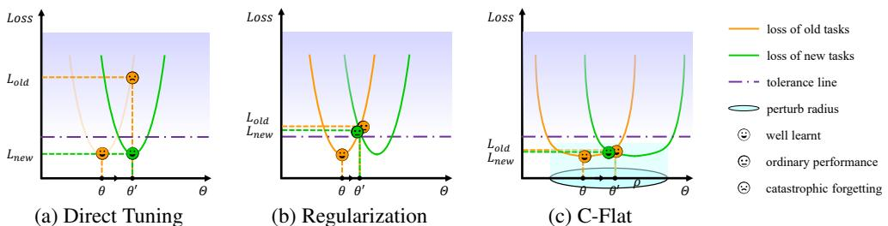
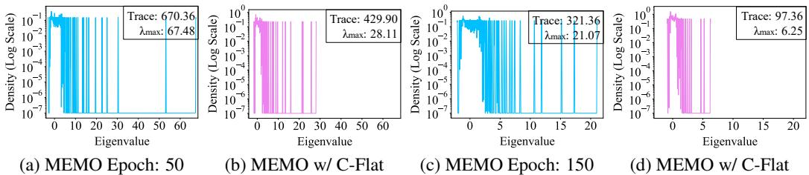
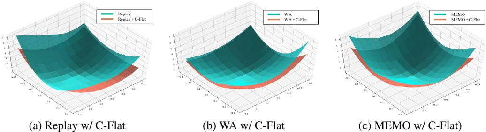
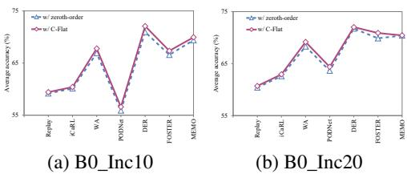
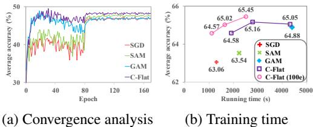
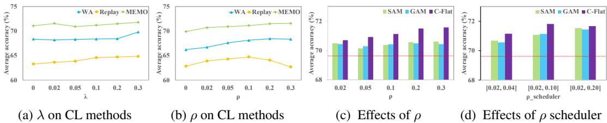
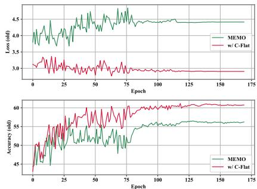
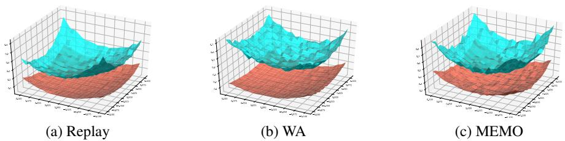
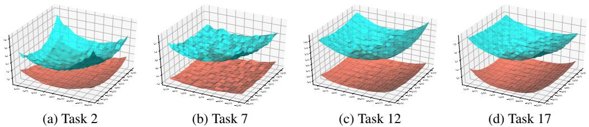

# Make Continual Learning Stronger via C-Flat

Ang Bian∗1, Wei $\mathbf { L i ^ { * 1 , 2 } }$ , Hangjie Yuan 3,4, Chengrong $\mathbf { Y u } ^ { 1 }$ , Mang Wang5 Zixiang $\mathbf { Z } \mathbf { h } \mathbf { a } \mathbf { 0 } ^ { 6 }$ , Aojun ${ { \bf L } } { \bf u } ^ { 1 }$ , Pengliang $\mathbf { J i } ^ { 7 }$ , Tao Feng† 2 1Sichuan University 2Tsinghua University 3DAMO Academy, Alibaba Group 4Zhejiang University 5ByteDance 6Xi’an Jiaotong University 7Carnegie Mellon University hj.yuan@zju.edu.cn, {ymjiii98, fengtao.hi}@gmail.com

# Abstract

How to balance the learning ’sensitivity-stability’ upon new task training and memory preserving is critical in CL to resolve catastrophic forgetting. Improving model generalization ability within each learning phase is one solution to help CL learning overcome the gap in the joint knowledge space. Zeroth-order loss landscape sharpness-aware minimization is a strong training regime improving model generalization in transfer learning compared with optimizer like SGD. It has also been introduced into CL to improve memory representation or learning efficiency. However, zeroth-order sharpness alone could favors sharper over flatter minima in certain scenarios, leading to a rather sensitive minima rather than a global optima. To further enhance learning stability, we propose a Continual Flatness (C-Flat) method featuring a flatter loss landscape tailored for CL. C-Flat could be easily called with only one line of code and is plug-and-play to any CL methods. A general framework of C-Flat applied to all CL categories and a thorough comparison with loss minima optimizer and flat minima based CL approaches is presented in this paper, showing that our method can boost CL performance in almost all cases. Code is available at https://github.com/WanNaa/C-Flat.

C-Flat: just a line of code suffices for its utilization.

1 f r o m i m p o r t C _ F l a t   
2   
3 # i n i t i a l i z e o p t i m i z e r f o r CL .   
4 C _ F l a t _ o p t i m i z e r $=$ C _ F l a t ( p a r a m s , b a s e _ o p t i m i z e r , m o d e l , a r g s )

# 1 Introduction

Why study Continual Learning (CL)? CL is generally acknowledged as a necessary attribute for Artificial General Intelligence (AGI) [22, 55, 40, 67]. In the open world, CL holds the potential for substantial benefits across many applications: e.g. vision model needs to learn a growing image set [17, 61, 62], or, embodied model needs to incrementally add skills to their repertoire [12].

Challenges. A good CL model is expected to keep the memory of all seen tasks upon learning new knowledge [22]. However, due to the limited access to previous data, the learning phase is naturally sensitive to the current task, hence resulting in a major challenge in CL called catastrophic forgetting [9], which refers to the drastic performance drop on past knowledge after learning new knowledge. This learning sensitivity-stability dilemma is critical in CL, requiring model with strong generalization ability [16] to overcome the knowledge gaps between sequentially arriving tasks.

Current solutions. A series of works [43, 44, 33, 25] are proposed to improve learning stability by extending data space with dedicated selected and stored exemplars from old tasks, or frozen some network blocks or layers that are strongly related to previous knowledge [68, 24, 69, 57, 24].

Another group of works seeks to preserve model generalization with regularisation onto the training procedure itself [32, 18, 31]. Diverse weight [45, 28, 2] or gradient alignment [22, 9, 35, 26] strategies are designed to encourage the training to efficiently extracting features for the current data space without forgetting.

Loss landscape sharpness optimization [23, 19, 65, 70] as an efficient training regime for model generalization starts to gain attentions [27, 63]. Ordinary loss minima based optimizer like SGD can easily lead to suboptimal results [4, 37, 13]. To prevent this, zeroth-order sharpness-aware minimization seeking neighborhood-flat minima [20] has been proven a strong optimizer to improve model generalization ability, especially in transferring learning tasks. It is also introduced into some CL works [49, 30] with dedicated designs to improve old knowledge representation or fewshot learning efficiency. However, given the limited application scenarios[10, 49], the zeroth-order sharpness used in the current work is proved to favor sharper minima than a flat solution [70]. It means zeroth-order only can still lead to a fast gradient descent to the suboptimal in new data space than a more generalizable result for the joint old and new knowledge space.

Our solution. Inspired by these works, a beyond zeroth-order sharpness continual optimization method is proposed as demonstrated in 1, where loss landscape flatness is emphasized to strengthen model generalization ability. Thus, the model can always converge to a flat minima in each phase, and then smoothly migrate to the global optimal of the joint knowledge space of the current and next tasks, and hence resolve the catastrophic forgetting in CL. We dub this method Continual Flatness (C-Flat or $C \flat$ ) Moreover, C-Flat is a general method that can be easily plug-and-play into any CL approach with only one line of code, to improve CL.

Contribution. A simple and flexible CL-friendly optimization method C-Flat is proposed, which Makes Continual Learning Stronger.

A framework of C-Flat covering diverse CL method categories is demonstrated. Experiment results prove that Flatter is Better in nearly all cases.

To the best of our knowledge, this work is the first to conduct a thorough comparison of CL approaches with loss landscape aware optimization, and thus can serve as a baseline in CL.

# 2 Related work

Continual learning methods roughly are categorized into three groups: Memory-based methods write experience in memory to alleviate forgetting. Some work [43, 44, 25, 51] design different sampling strategies to establish limited budgets in a memory buffer for rehearsal. However, these methods require access to raw past data, which is discouraged in practice due to privacy concerns. Instead, recently a series of works [10, 34, 46, 33, 50] elaborately construct special subspace of old tasks as the memory. Regularization-based methods aim to realize consolidation of the previous knowledge by introducing additional regularization terms in the loss function. Some works [32, 29, 6] enforce the important weights in the parameter space [45, 28, 2], feature representations [5, 21], or the logits outputs [32, 42] of the current model function to be close to that of the old one. Expansionbased methods dedicate different incremental model structures towards each task to minimize forgetting [68, 39]. Some work [48, 24, 60] exploit modular network architectures (dynamically extending extra components [57, 69], or freeze partial parameters [36, 1]) to overcome forgetting. Trivially, methods in this category implicitly shift the burden of storing numerous raw data into the retention of model [68].

Gradient-based solutions are a main group in CL, including shaping loss landscape, tempering the tug-of-war of gradient, and other learning dynamics [22, 9, 41]. One promising solution is to modify the gradients of different tasks and hence overcome forgetting [7, 38], e.g., aligning the gradients of current and old one [15, 18], or, learning more efficient in the case of conflicting objectives [47, 56, 14]. Other solutions [10, 49] focus on characterizing the generalization from the loss landscape perspectives to improve CL performance and yet are rarely explored.

  
Figure 1: Illustration of C-Flat overcoming catastrophe forgetting by fine-tuning the old model parameter to flat minima of new task. a) loss minima for current task only can cause catastrophe forgetting on previous ones. b) balanced optima aligned by regularization leads to unsatisfying results for both old and new tasks. c) C-Flat seeks global optima for all tasks with flattened loss landscape.

Sharpness minimization in CL Many recent works [23, 19, 4] are proposed to optimize neural networks in standard training scenarios towards flat minima. Wide local minima were considered an important regularization in CL to enforce the similarity of important parameters learned from past tasks [6]. Sharpness-aware seeking for loss landscape flat minima starts to gain more attention in CL, especially SAM based zeroth order sharpness is well discussed. An investigation [41] proves SAM can help with addressing forgetting in CL, and [8] proposed a combined SAM for few-shot CL. SAM is also used for boosting the performance of specific methods like DFGP [58] and FS-DGPM [10] designed for GPM. SAM-CL [52] series with loss term gradient alignment for memory-based CL. These efforts kicked off the study of flat minima in CL, however, zeroth-order sharpness may not be enough for flatter optimal [70]. Thus, flatness with a global optima and universal CL framework is further studied.

# 3 Method

Our solution addresses the learning sensitivity-stability dilemma in CL by improving model generalization for joint learning knowledge obtained from different catalogues domains or tasks. Moreover, a general but stronger optimization method enhanced by the latest gradient landscape flatness is proposed as a ’plug-and-play’ tool for any CL approach.

Loss landscape flatness. Let $B ( \theta , \rho ) = \{ \theta ^ { \prime } : \| \theta ^ { \prime } - \theta \| < \rho \}$ denotes the neighborhood of $\theta$ with radius $\rho > 0$ in the Euclidean space $\Theta \subset \mathbb { R } ^ { d }$ , the zeroth-order sharpness at point $\theta$ is commonly defined by the maximal training loss difference within its neighborhood $B ( \theta , \rho )$ :

$$
R _ { \rho } ^ { 0 } ( \theta ) = \operatorname* { m a x } \{ \ell _ { S } ( \theta ^ { \prime } ) - \ell _ { S } ( \theta ) : \theta ^ { \prime } \in B ( \theta , \rho ) \} .
$$

where $\ell _ { S } ( \theta )$ denotes the loss of an arbitrary model with parameter $\theta$ on any dataset $S$ with an oracle loss function $\ell ( \cdot )$ . The zeroth-order sharpness $R _ { \rho } ^ { 0 } ( \theta )$ regularization can be directly applied to restrain the maximal neighborhood training loss:

$$
\ell _ { S } ^ { R _ { \rho } ^ { 0 } } ( \theta ) = \ell _ { S } ( \theta ) + R _ { \rho } ^ { 0 } ( \theta ) = \operatorname* { m a x } \{ \ell _ { S } ( \theta ^ { \prime } ) : \theta ^ { \prime } \in B ( \theta , \rho ) \} ,
$$

However, for some fixed $\rho$ , local minima with a lower loss does not always have a lower major hessian eigenvalue [70], which equals to the neighborhood curvature. It means that zeroth-order sharpness optimizer may goes to a sharper suboptimal than to the direction of a flatter global optimal with better generalization ability.

Recently, first-order gradient landscape flatness is proposed as a measurement of the maximal neighborhood gradient norm, which reflects landscape curvature, to better describe the smoothness of the loss landscape:

$$
R _ { \rho } ^ { 1 } ( \theta ) = \rho \cdot \operatorname* { m a x } \{ \| \nabla \ell _ { S } ( \theta ^ { \prime } ) \| _ { 2 } : \theta ^ { \prime } \in B ( \theta , \rho ) \} .
$$

Unlike zeroth-order sharpness that force the training converging to a local minimal, first-order flatness alone constraining on the neighborhood smoothness can not lead to an optimal with minimal loss. To maximize the generalization ability of loss landscape sharpness for continual learning task, we

propose a zeroth-first-order sharpness aware optimizer C-Flat for CL. Considering the data space, model or blocks to be trained are altered regarding the training phase and CL method, (as detailed in the next subsection), we define the the C-Flat loss as follows:

$$
\begin{array} { r l } & { \ell _ { S ^ { T } } ^ { C } ( f ^ { T } ( \theta ^ { T } ) ) = \ell _ { S ^ { T } } ( f ^ { T } ( \theta ^ { T } ) ) + R _ { \rho , S ^ { T } } ^ { 0 } ( f ^ { T } ( \theta ^ { T } ) ) + \lambda \cdot R _ { \rho , S ^ { T } } ^ { 1 } ( f ^ { T } ( \theta ^ { T } ) ) } \\ & { \qquad = \ell _ { S ^ { T } } ^ { R _ { \rho } ^ { 0 } } ( f ^ { T } ( \theta ^ { T } ) ) + \lambda \cdot R _ { \rho , S ^ { T } } ^ { 1 } ( f ^ { T } ( \theta ^ { T } ) ) , } \end{array}
$$

with the minimization objective:

$$
\begin{array} { r } { \operatorname* { m i n } _ { \theta ^ { T } } \{ \operatorname* { m a x } \{ \ell _ { S ^ { T } } ( f ^ { T } ( \theta _ { 0 } ^ { T } ) ) + \lambda \rho \cdot \| \nabla \ell _ { S ^ { T } } ( f ^ { T } ( \theta _ { 1 } ^ { T } ) ) \| _ { 2 } \} : \theta _ { 0 } ^ { T } , \theta _ { 1 } ^ { T } \in B ( \theta ^ { T } , \rho ) \} } \end{array}
$$

$\ell _ { S } ^ { R _ { \rho } ^ { 0 } } ( \theta )$ is constructed to replace the original CL loss, while $R _ { \rho } ^ { 1 } ( \theta )$ further regularizes the smoothness of the neighborhood, and hyperparameter $\lambda$ is to balance the influence of $R _ { \rho } ^ { 1 }$ as an additional regularization to loss function $\ell$ . Hence, the local minima within a flat and smooth neighborhood is calculated for a generalized model possessing both old and new knowledge.

Optimization. In our work, the two regularization terms in the proposed C-Flat are resolved correspondgradient of $\ell _ { S } ^ { R _ { \rho } ^ { 0 } }$ in eachat point $\theta ^ { T }$ ation. Assuming the loss function can be approximated by $\ell ( \cdot )$ is differentiable and bounded, the

$$
\nabla \ell _ { S } ^ { R _ { \rho } ^ { 0 } } ( \theta ^ { T } ) \approx \nabla \ell _ { S } ( \theta _ { 0 } ^ { T } ) \ \mathrm { w i t h } \ \theta _ { 0 } ^ { T } = \theta ^ { T } + \rho \cdot \frac { \nabla \ell _ { S } ( \theta ^ { T } ) } { \| \nabla \ell _ { S } ( \theta ^ { T } ) \| _ { 2 } }
$$

And the gradient of the first-order flatness regularization $\nabla R _ { \rho } ^ { 1 } ( \theta ^ { T } )$ can be approximated by

$$
\begin{array} { r l } & { \nabla R _ { \rho } ^ { 1 } ( \theta ^ { T } ) \approx \rho \cdot \nabla \| \nabla \ell _ { S } ( \theta _ { 1 } ^ { T } ) \| _ { 2 } } \\ { \mathrm { w i t h } \quad } & { \theta _ { 1 } ^ { T } = \theta ^ { T } + \rho \cdot \frac { \nabla \| \nabla \ell _ { S } ( \theta ^ { T } ) \| _ { 2 } } { \| \nabla \| \nabla \ell _ { S } ( \theta ^ { T } ) \| _ { 2 } \| _ { 2 } } } \\ { \mathrm { w h e r e } \quad } & { \nabla \| \nabla \ell _ { S } ( \theta ^ { T } ) \| _ { 2 } = \nabla ^ { 2 } \ell _ { S } ( \theta ^ { T } ) \cdot \frac { \nabla \ell _ { S } ( \theta ^ { T } ) } { \| \nabla \ell _ { S } ( \theta ^ { T } ) \| _ { 2 } } . } \end{array}
$$

The optimization is detailed in Appendix algorithm 1. Note that $\nabla \ell$ is the gradient of $\ell$ with respect to $\theta$ through this paper, and instead of the expensive computation of Hessian matrix $\nabla ^ { 2 } \ell$ , Hessian-vector product calculation is used in our algorithm, where the time and especially space complexity are greatly reduced to $o ( n )$ using 1 forward and 1 backward propagation. Thus, the overall calculation in one iteration takes 2 forward and 4 backward propagation in total.

Theoretical analysis. Given $R _ { \rho } ^ { 0 } ( \theta )$ measuring the maximal limit of the training loss difference, the first-order flatness is its upper bound by nature. Denoting $\theta + \epsilon \in B ( \theta , \rho )$ the local maximum point, a constant $\epsilon ^ { * } \in [ 0 , \epsilon ]$ exists according to the mean value theorem that

$$
\begin{array} { r l } & { \quad R _ { \rho } ^ { 0 } ( \theta ) = m a x \{ \ell _ { S } ( \theta ^ { \prime } ) - \ell _ { S } ( \theta ) : \theta ^ { \prime } \in B ( \theta , \rho ) \} } \\ & { = \ell _ { S } ( \theta + \epsilon ) - \ell _ { S } ( \theta ) = \left( \nabla \ell _ { S } ( \theta + \epsilon ^ { * } ) \right) ^ { T } \cdot \epsilon \le \| \nabla \ell _ { S } ( \theta + \epsilon ^ { * } ) \| _ { 2 } \cdot \| \epsilon \| _ { 2 } } \\ & { \qquad \le m a x \{ \| \nabla \ell _ { S } ( \theta ^ { \prime } ) \| _ { 2 } : \theta ^ { \prime } \in B ( \theta , \rho ) \} \cdot \rho = R _ { \rho } ^ { 1 } ( \theta ) . } \end{array}
$$

Assuming the loss function is twice differentiable, bounded by $M$ , obeys the triangle inequality, its gradient has bounded variance $\sigma ^ { 2 }$ , and both the loss function and its second-order gradient are $\beta$ −Lipschitz smooth, we can prove that, according to [3, 63], C-Flat converges in all tasks with $\eta \le 1 / \beta , \rho \le 1 / 4 \beta$ , and $\eta _ { i } ^ { T } = \bar { \eta } / \sqrt { i } , \rho _ { i } ^ { T } = \rho / \sqrt [ 4 ] { i }$ for epoch $i$ in any task $T$ ,

$$
\begin{array} { r l } & { \displaystyle \frac { 1 } { n ^ { T } } \sum _ { i = 1 } ^ { n ^ { T } } \mathbb { E } [ \| \nabla \ell _ { S ^ { T } } ^ { C } ( f ^ { T } ( \theta ^ { T } ) ) \| ^ { 2 } ] \leq \frac { 2 } { n ^ { T } } \sum _ { i = 1 } ^ { n ^ { T } } \mathbb { E } [ \| \nabla \ell _ { S ^ { T } } ^ { R _ { p } ^ { 0 } } ( f ^ { T } ( \theta ^ { T } ) ) \| ^ { 2 } ] } \\ & { + \displaystyle \frac { 2 } { n ^ { T } } \sum _ { i = 1 } ^ { n ^ { T } } \mathbb { E } [ \| \lambda R _ { \rho , S ^ { T } } ^ { 1 } ( f ^ { T } ( \theta ^ { T } ) ) \| ^ { 2 } ] \leq \frac { 8 M \beta } { \sqrt { n ^ { T } } } + \frac { 1 6 \sigma ^ { 2 } } { 3 b \sqrt { n ^ { T } } } + \frac { 3 2 \lambda ^ { 2 } ( 2 \sqrt { n ^ { T } } - 1 ) } { \beta ^ { 2 } n ^ { T } } . } \end{array}
$$

where $n ^ { T }$ is the total iteration numbers of task $T$ , and $b$ is the batch size.

Upper Bound. Let $\nabla ^ { 2 } \ell _ { S } ( \theta ^ { * } )$ denotes the Hessian matrix at local minimum $\theta ^ { * }$ , its maximal eigenvalue $\lambda _ { m a x } ^ { \textrm { * } } ( \nabla ^ { 2 } \ell _ { S } ( \theta ^ { * } ) )$ is a proper measure of the landscape curvature. The first-order flatness is proven to be related to the maximal eigenvalue of the Hessian matrix as $R _ { \rho } ^ { 1 } ( \theta ^ { * } ) = \rho ^ { 2 } \cdot \lambda _ { m a x } ( \nabla ^ { 2 } \dot { \ell _ { S } } ( \theta ^ { * } ) )$ , thus the C-Flat regularization can also be used as an index of model generalization ability, with the following upper bound:

$$
R _ { \rho } ^ { C } ( \theta ^ { * } ) = R _ { \rho } ^ { 0 } ( \theta ^ { * } ) + \lambda R _ { \rho } ^ { 1 } ( \theta ^ { * } ) \leq ( 1 + \lambda ) \rho ^ { 2 } \cdot \lambda _ { m a x } ( \nabla ^ { 2 } \ell _ { S } ( \theta ^ { * } ) ) .
$$

# 3.1 A Unified CL Framework Using C-Flat

This subsection presents an unified CL framework using C-Flat with applications covering Class Incremental Learning (CIL) approaches. To keep focus, the scope of our study is limited in CIL task, which is the most intractable CL scenarios that seek for a lifelong learning model for sequentially arriving class-agnostic data. Most CIL approaches belong to three main families, Memory-based, Regularization-based and Expansion-based methods.

Memory-based methods store samples from the previous phases within the memory limit, or produce pseudo-samples by generative approaches to extend the current training data space, thus a memory replay strategy is used to preserve the seen class features with $\hat { S ^ { T } } = S ^ { T } \cup S a m p l e ^ { t < T }$ . iCaRL is one of the early works. It learns classifiers and a feature representation simultaneously, and preserves the first few most representative exemplars according to Nearest-Mean-of-Exemplars Classification. Thus a loss function lSˆT $\ell _ { \hat { S ^ { T } } } = \ell _ { \hat { S ^ { T } } } ^ { C E } + \bar { \ell } _ { \hat { S ^ { T } } } ^ { K L }$ combining both cross entropy for the current task and a knowledge distillation loss for the previous classes is introduced to balance the learning sensitivity and model generalization to the previous tasks.

Solution: for memory-based method, including, the C-Flat can be easily applied to these scenarios by reconstruct the oracle loss function with its zeroth- and first-order flatness measurement as eq. 11, and trained with algorithm 1 using data set extended with the previous exemplars.

$$
\ell _ { \hat { S } ^ { T } } ^ { C } ( \theta ^ { T } ) = \ell _ { \hat { S } ^ { T } } ^ { R _ { \rho } ^ { 0 } } ( \theta ^ { T } ) + \lambda \cdot \ell _ { \hat { S } ^ { T } } ^ { R _ { \rho } ^ { 1 } } ( \theta ^ { T } ) .
$$

Regularization-based methods seeks for a apply regularization on the model develop to preserver the learnt knowledge. For instance, WA introduces weight aligning on the final inference part to balance the old and new classes. Denoting $\phi$ the feature learning layers of the model, $\psi = [ \bar { \psi } ^ { o l d } , \psi ^ { n e w } ]$ the decision head for all classes consisting of two branches for the old and new seen data classes, the output is corrected to $f ( x ) = [ \psi ^ { o l d } ( \phi ( \stackrel { \smile } { x } ) ) , \gamma \cdot \psi ^ { n e w } ( \phi ( x ) ) ]$ , where $\gamma$ is the fraction of average norm of $\psi ^ { o l d } , \psi ^ { n e w }$ of all classes.

Gradient Projection Memory (GPM) is another main regularization based group, introducing explicit align the gradient direction to new knowledge learning. It stores a minimum set of bases of the Core Gradient Space as Gradient Projection Memory, thus gradient steps are only taken in its orthogonal direction to learn the new features without forgetting the core information from the previous phases. FS-DGPM further improves this method by updating model parameter along the aligned orthogonal gradient at the zeroth-order sharpness minima in dynamic GMP space.

Solution: for regularization-based approaches, the same plug-and-play strategy can be used to reconstruct the loss function as eq. 11, and optimized by algorithm 1.

An alternative solution for the gradient-based methods like GPM and the improved FS-DGPM, is to introduce C-Flat optimization at the gradient alignment stage, so that the orthogonal gradient at a flatter minima is used to ensure that the training can cross over the knowledge gap between different data categories. The implementation of our C-Flat-GPM is detailed in Appendix algorithm 2.

Expansion-based methods explicitly construct task-specific parameters to resolve the new class learning and inference problem. For instance, Memory-efficient Expandable Model (Memo) decomposes the embedding module into deep layers and shallow layers that $\phi = \phi _ { f } ( \phi _ { g } )$ , where $\phi _ { f } , \phi _ { g }$ correspond to the specialized block for different tasks and the generalized block that can be shared during training phases. An additional block $\phi _ { f } ^ { n e w }$ is added to the deep layers for specified feature extraction for the new classes, where the model can be reconstructed as $f ^ { T } = \psi ^ { T } ( [ \phi _ { f } ^ { T - 1 } ( \phi _ { g } ) , \phi _ { f } ^ { n e w } ( \phi _ { g } ) ] )$ . Thus the new model training is focusing on the task specified component while the shared shallow layers are frozen with loss function lMemoˆ $\mathring { \ell _ { S ^ { T } } } = \ell _ { \dot { S ^ { T } } } ^ { C E } ( \psi ^ { \bar { T } } ( [ \phi _ { f } ^ { T - 1 } ( \phi _ { g } ) , \phi _ { f } ^ { n e w } ( \phi _ { g } ) ] ) ) \}$ .

Table 1: Average accuracy $( \% )$ across all phases using 7 state-of-art methods (span all sorts of CL) w/ and w/o C-Flat plugged in. Maximum/Average Return in the last row represents the maximum/average boost of C-Flat towards all methods in each column.   

<table><tr><td rowspan="2">Method</td><td colspan="2">Technology</td><td colspan="3">CIFAR-100</td><td colspan="2">ImageNet-100</td><td rowspan="2">Tiny-ImageNet B0_Inc40</td></tr><tr><td>Reg.</td><td>Mem. Exp.</td><td>B0_Inc5</td><td>B0_Inc10</td><td>B0_Inc20</td><td>B50_Inc10</td><td>B50_Inc25</td></tr><tr><td>Replay [44]</td><td></td><td>•</td><td>58.83</td><td>58.87</td><td>62.82</td><td>63.89</td><td>72.18</td><td>43.31</td></tr><tr><td>w/ C-Flat</td><td></td><td></td><td>59.98 ↑</td><td>59.42 ↑</td><td>64.71 ↑</td><td>63.60 ↓</td><td>73.37 ↑</td><td>44.95 ↑</td></tr><tr><td>iCaRL [43]</td><td></td><td>•</td><td>58.66</td><td>59.76</td><td>61.13</td><td>64.78</td><td>77.25</td><td>45.70</td></tr><tr><td>w/ C-Flat</td><td></td><td></td><td>59.13 ↑</td><td>60.40 ↑</td><td>62.93 ↑</td><td>65.01↑</td><td>76.22 ↓</td><td>46.08 ↑</td></tr><tr><td>WA [64]</td><td>•</td><td></td><td>63.36</td><td>66.76</td><td>68.04</td><td>73.17</td><td>80.81</td><td>55.69</td></tr><tr><td>w/ C-Flat</td><td></td><td></td><td>65.70 ↑</td><td>67.79 ↑</td><td>69.16 ↑</td><td>73.56 ↑</td><td>83.84 ↑</td><td>56.06 ↑</td></tr><tr><td>PODNet [11]</td><td>•</td><td>•</td><td>48.05</td><td>56.01</td><td>63.45</td><td>83.66</td><td>85.95</td><td>54.24</td></tr><tr><td>w/ C-Flat</td><td></td><td></td><td>49.70 ↑</td><td>56.58 ↑</td><td>64.37 ↑</td><td>84.31 ↑</td><td>86.85 ↑</td><td>55.13 ↑</td></tr><tr><td>DER [57]</td><td></td><td>•</td><td>69.99</td><td>71.01</td><td>71.40</td><td>85.17</td><td>87.10</td><td>58.63</td></tr><tr><td>w/ C-Flat</td><td></td><td></td><td>71.11 ↑</td><td>72.08 ↑</td><td>72.01 ↑</td><td>86.64 ↑</td><td>87.96 ↑</td><td>60.14 ↑</td></tr><tr><td>FOSTER [54]</td><td>•</td><td>•</td><td>63.15</td><td>66.73</td><td>69.70</td><td>84.54</td><td>87.81</td><td>58.80</td></tr><tr><td>w/ C-Flat</td><td></td><td></td><td>63.58 ↑</td><td>67.34 ↑</td><td>70.89 ↑</td><td>85.40 ↑</td><td>87.81 -</td><td>58.88 ↑</td></tr><tr><td>MEMO [68]</td><td></td><td>•</td><td>67.42</td><td>69.82</td><td>69.91</td><td>67.28</td><td>83.09</td><td>58.15</td></tr><tr><td>w/ C-Flat</td><td></td><td></td><td>67.56 ↑</td><td>69.94 ↑</td><td>71.79 ↑</td><td>69.34 ↑</td><td>83.41 ↑</td><td>58.97↑</td></tr><tr><td>Average Return</td><td></td><td></td><td>+1.04%</td><td>+0.66%</td><td>+1.34%</td><td>+0.62%</td><td>+0.90%</td><td>+0.81%</td></tr><tr><td>Maximum Return</td><td></td><td></td><td>+2.34%</td><td>+1.07%</td><td>+1.89%</td><td>+2.06%</td><td>+3.03%</td><td>+1.64%</td></tr></table>

Foster uses KL-based loss function to regularize the three combinations of old and new blocks for a stable performance on the previous data. It also introduces an effective redundant parameters and feature pruning strategy to maintain the single backbone model using knowledge distillation. DER follows the same framework, and introduces an auxiliary classifier and related loss item to encourage the model to learn diverse and discriminate features for novel concepts.

Solution: for expansion-based approaches, the plug-and-play strategy is still available. The CFlat loss can be reformed with the reconstructed model as eq. 12. Thus C-Flat optimization using algorithm 1 is applied onto the first stage, where the new constructed block are optimized, while the generalized blocks are kept frozen. The final model is obtained after post-processing.

$$
\begin{array} { r l } & { \ell _ { \hat { S ^ { T } } } ^ { C } ( f ^ { T } ) = \ell _ { \hat { S ^ { T } } } ^ { R _ { \rho } ^ { 0 } } ( [ \psi ^ { o l d } , \psi ^ { n e w } ] ( [ \phi _ { f } ^ { T - 1 } ( \phi _ { g } ) , \phi _ { f } ^ { n e w } ( \phi _ { g } ) ] ) ) } \\ & { + \lambda \cdot \ell _ { \hat { S ^ { T } } } ^ { R _ { \rho } ^ { 1 } } ( [ \psi ^ { o l d } , \psi ^ { n e w } ] ( [ \phi _ { f } ^ { T - 1 } ( \phi _ { g } ) , \phi _ { f } ^ { n e w } ( \phi _ { g } ) ] ) ) . } \end{array}
$$

To conclude, C-Flat can be easily applied to any CL method with reconstructed loss function, and thus trained with the corresponding optimize as shown in algorithm 1. Dedicated design using C-Flat like for the GPM family is also possible wherever flat minima is required.

# 4 Analysis

# 4.1 Experimental Setup

Datasets. We evaluate the performance on CIFAR-100, ImageNet-100 and Tiny-ImageNet. Adherence to [66, 67], the random seed for class-order shuffling is fixed at 1993. Subsequently, we follow two typical class splits in CIL: (i) Divide all $\lVert Y _ { b } \rVert$ classes equally into $B$ phases, denoted as B0_Incy; (ii) Treat half of the total classes as initial phases, followed by an equally division of the remaining classes into incremental phases, denoted as B50_Incy. In both settings, $y$ denotes that learns $y$ new classes per task.

Baselines. To evaluate the efficacy of our method, we plug it into 7 top-performing baselines across each CL category: Replay [44] and iCaRL [43] are classical replay-based methods, using raw data as memory cells. PODNet [11] is akin to iCaRL, incorporating knowledge distillation to constraint the logits of pooled representations. WA [64] corrects prediction bias via regularizing discrimination and fairness. DER [57], FOSTER [54] and MEMO [68] are network expansion methods, dedicate modular architectures towards each task by extending sub-network or freezing partial parameters. The aforementioned methods span three categories in CL [9, 53]: Memory-based methods, Regularization-based methods and Expansion-based methods.

  
Figure 2: The Hessian eigenvalues and the traces at epochs 50, and 150 on B0_Inc10 setting (MEMO, CIFAR-100) w/ and w/o C-Flat plugged in.

Network and training details. For a given dataset, we study all methods using the same network architecture following repo [66, 67], i.e. ResNet-32 for CIFAR and ResNet-18 for ImageNet. If not specified otherwise, the hyper-parameters for all models adhere to the settings in the open-source library [66, 67]. Each task are initialized with the same $\rho$ and $\eta$ , which drops with iterations according to the scheduler from [70]. To ensure a fair comparison, all models are trained with a vanilla-SGD optimizer [71]. And the proposed method is plugged into the SGD.

# 4.2 Make Continual Learning Stronger

Table 1 empirically demonstrates the superiority of our method: Makes Continual Learning Stronger. In this experiment, we plug C-Flat into 7 state-of-the-art methods that cover the full range of CL methods. From Table 1, we observe that (i) C-Flat presents consistent outperformance on all models, spanning Memory-based methods, Regularization-based methods, and Expansion-based methods. This superiority is indicative of the plug-and-play feature inherent in our method, allowing effortless installation with all sorts of CL paradigms. (ii) Across multiple benchmark datasets, including CIFAR-100, ImageNet-100, and Tiny-ImageNet, C-Flat exhibits consistent improvement. This underscores its generalization ability and effectiveness against diverse data distributions. (iii) CFlat presents consistent boosting across multiple incremental scenarios, encompassing B0_Inc5, B0_Inc10, B0_Inc20, B50_Inc10, B50_Inc25, and $\mathrm { B 0 \_ I n c 4 0 }$ . This consistent boosting reaffirms robustness of C-Flat for various CL scenarios. To sum up, C-Flat advances baselines across each CL category, serves as a valuable addition to CL, offering a versatile solution that can complement existing methods.

# 4.3 Hessian Eigenvalues and Hessian Traces

Hessian eigenvalues. Equation 10 delineates the connection between fist-order flatness and Hessian eigenvalues in CL. Broadly, Hessian eigenvalues serve as a metric for assessing the flatness of a function. Thus we report Hessian eigenvalue distributions in Figure 2 for empirical analysis. As shown in Figure 2, models trained with vanilla-SGD exhibit higher maximal Hessian eigenvalues (67.48/21.07 at epochs 50/150 in Figure 2a and Figure 2c), while our method induces a significant drop in Hessian eigenvalues to 28.11/6.25 at epochs 50/150 in Figure 2b and Figure 2d) during CL, leading to flatter minima. Consequently, the performance of CL is tangibly enhanced.

Hessian traces. We calculate the empirical Fisher information matrix as an estimation of the Hessian and leverage the trace of this to quantify the flatness of the approximation loss at the convergence point. As depicted in Figure 2, we observe that a substantial reduction in the Hessian trace when employing our method compared with vanilla-SGD (670.36/321.36 drops to 429.90/97.36 at epochs 50/150 in Figure 2b and Figure 2d). This observation suggests that our method induces a flatter minimum. These findings not only align with but also substantiate the theoretical insights presented in the methodology section.

  
Figure 3: The parametric loss landscapes of Replay (Mem.), WA (Reg.) and MEMO (Exp.) are plotted by perturbing the model parameters at the end of training (CIFAR-100, B0_Inc10) across the first two Hessian eigenvectors.

  
Figure 4: C-Flat vs. Zero-order flatness

  
Figure 5: Analysis of computation overhead

# 4.4 Visualization of Landscapes

More intuitively, we present a detailed visualization of landscape. PyHessian [59] is used to draw the loss landscape of models. To simplify, we choose one typical method from each category of CL methods (Replay, Wa, MEMO) for testing. Figure 3 clearly illustrates that, by applying C-Flat, the loss landscape becomes much flatter than that of the vanilla method. This trend consistently holds across various categories of CL methods, providing strong empirical support for C-Flat, and confirms our intuition.

# 4.5 Revisiting Zeroth-order Flatness

Table 2: Revisiting FS-DGPM series using C-Flat.   

<table><tr><td>Method</td><td>La-GPM</td><td>FS-GPM</td><td>DGPM</td><td>La-DGPM</td><td>FS-DGPM</td></tr><tr><td>Oracle</td><td>72.90</td><td>73.12</td><td>72.66</td><td>72.85</td><td>73.14</td></tr><tr><td>w/C-Flat</td><td>73.66</td><td>73.57</td><td>73.01</td><td>73.64</td><td>73.72</td></tr><tr><td>Boost</td><td>+0.76</td><td>+0.45</td><td>+0.35</td><td>+0.79</td><td>+0.58</td></tr></table>

Limited work [10, 49] proved that the zeroth-order sharpness leads to flat minima boosted CL. Here, we employ a zeroth-order optimizer [19] instead of vanilla-SGD to verify the performance of C-Flat. As shown in Figure 4, CFlat (purple line) stably outperforms the zeroth-order sharpness (blue line) on all baselines. We empirically demonstrated that flatter is better for CL.

Former work FS-DGPM [10] regulates the gradient direction with flat minima to promote CL. The FS (Flattening Sharpness) term derived from FS-DGPM is a typical zeroth-order flatness. We revisit the FS-DGPM series (including La/FS-GPM, DGPM, La/FS-DGPM) [10, 46] to evaluate performance using C-Flat instead of FS (see aigorithm 2). Table 2 yields two conclusions: (i) C-Flat boosts the GPM [46] baseline as a pluggable regularization term. This not only extends the frontiers of CL methods, incorporating gradient-based solutions, but also reaffirms the remarkable versatility of C-Flat. (ii) Throughout all series of FS-DGPM, C-Flat seamlessly supersedes FS and achieves significantly better performance. This indicates that C-Flat consistently exceeds zeroth-order sharpness. Hence, reconfirming that C-Flat is indeed a simple yet potential CL method that deserves to be widely spread within the CL community.

  
Figure 6: Ablation study about $\lambda$ and $\rho$ . (a) and (b) represents the effect of $\lambda$ and $\rho$ on different CL methods (WA, Replay, MEMO). (c) and (d) represents the effect of $\rho$ and $\rho$ scheduler on MEMO with different optimizers (SGD (red line), SAM, GAM, C-Flat).

# 4.6 Computation Overhead

To assess the efficiency of C-Flat, we provides a thorough analysis from the convergence speed and running time with CIFAR-100/B0_Inc20 on Replay. As shown in Figure 5, C-Flat is compared with SGD and other flatness-aware optimiziters. We train C-Flat optimizers on CL benchmarks with $20 \%$ , $50 \%$ , $100 \%$ of iterations and approximately $60 \%$ of epochs, while holding the other optimizers at $100 \%$ . Figure 5a first shows that C-Flat converges fastest and has the highest accuracy (purple line), meaning few iterations/epochs with C-Flat is enough to improve CL. Figure 5b shows i) Compared with SGD, with only $20 \%$ of iterations and $60 \%$ of epochs (pink line) using C-Flat, CL performance is improved using slightly less time; ii) C-Flat surpasses GAM with similar time as SAM when setting the iterations/epochs ratio to $50 \% / 6 0 \%$ ; iii) Models trained with C-Flat for 100 epochs outperform those trained with other optimizers for 170 epochs. To sum up, we show that C-Flat outperforms current optimizers with fewer iterations and epochs. This indicates the efficiency of C-Flat.

To discuss practicality better, we provided a tier guideline, which categorizes C-Flat into L1 to L3 levels, as shown in Table 3, L1 denotes the low-speed version of C-Flat, with a slightly lower speed than SAM and the best performance; L2 follows next; L3 denotes the highspeed version of C-Flat, with a faster speed than SGD and a performance close to L2.

Table 3: A tier guideline of C-Flat.   

<table><tr><td>Level</td><td>Speed</td><td>Boost (SGD/SAM)</td></tr><tr><td>L1</td><td>SGD &gt; SAM &gt; C-Flat</td><td>+2.39%/+1.91%</td></tr><tr><td>L2</td><td>SGD &gt; C-Flat &gt; SAM</td><td>+1.52%/+1.04%</td></tr><tr><td>L3</td><td>C-Flat &gt; SGD</td><td>+1.51%/+1.03%</td></tr></table>

# 4.7 Ablation Study

We perform ablation study in two cases: (i) the influence of $\lambda$ and $\rho$ on different CL methods; (ii) the influence of $\rho$ and its scheduler on different optimizers.

We first present the performance of C-Flat with varying $\lambda$ and $\rho$ . As described in Eq. 13, $\lambda$ controls the strength of the C-Flat penalty (when $\lambda$ is equal to 0, this means that first-order flatness is not implemented). As shown in Figure 6a, compared with vanilla optimizer, C-Flat shows remarkable improvement with varying $\lambda$ . Moreover, $\rho$ controls the step length of gradient ascent. As shown in Figure 6b, C-Flat with $\rho$ larger than 0 outperforms C-Flat without gradient ascent, showing that C-Flat benefits from the gradient ascent.

For each CL task $T$ , same learning rate $\eta ^ { T }$ and neighborhood size $\rho ^ { T }$ initialization are used. By default, $\rho _ { i } ^ { T } \in [ \rho _ { - } , \rho _ { + } ]$ is set as a constant, which decays with respect to the learning rate $\eta _ { i } ^ { T } \in [ \eta _ { - } , \eta _ { + } ]$ by $\begin{array} { r } { \rho _ { i } ^ { T } = \rho _ { - } + \frac { ( \rho _ { + } - \rho _ { - } ) } { \eta _ { + } - \eta _ { - } } ( \eta _ { i } ^ { T } - \eta _ { - } ) } \end{array}$ . Figure $_ \mathrm { 6 c }$ and Figure 6d present a comparison on $\rho$ initialization and $\{ \rho _ { - } , \rho _ { + } \}$ scheduler. C-Flat outperforms across various settings, and is not oversensitive to hyperparameters in a reasonable range.

# 4.8 Beyond Not-forgetting

As is known to all, forward, and in particular backward transfer, are the desirable conditions for CL [22]. Here, we thoroughly examine the performance of C-Flat in both aspects. Forward Transfer (FT) means better performance on each subsequent task. Backward Transfer (BT) means better performance on previous tasks, when revisited. We count the performance of new and old tasks on several CL benchmarks before and after using C-Flat. As observed in Table 7, C-Flat consistently improves the learning performance of both new and old tasks. This observation indicates that C-Flat empowers these baselines with robust forward and backward transfer capabilities, that is learning a task should improve related tasks, both past and future. But, thus far, achieving a baseline that maintains perfect recall (by forgetting nothing) remains elusive. Should such a baseline emerge, C-Flat stands poised to empower it with potent backward transfer, potentially transcending the limitations of mere not-forgetting.

Figure 7: Analysis of BT and FT. RR refers to Relative Return on w/o and w/ C-Flat.   

<table><tr><td rowspan="2">Method</td><td colspan="3">CIFAR-100/ B0_Inc5</td><td rowspan="2">RR</td></tr><tr><td></td><td>w/o C-Flat</td><td>w/C-Flat</td></tr><tr><td rowspan="2">iCaRL [43]</td><td>old</td><td>36.36</td><td>37.12</td><td>BT+2.10%</td></tr><tr><td>new</td><td>80.25</td><td>82.20</td><td>FT+2.43%</td></tr><tr><td rowspan="2">PODNet [11]</td><td>old</td><td>46.32</td><td>47.44</td><td>BT+2.42%</td></tr><tr><td>new</td><td>62.65</td><td>64.75</td><td>FT+3.35%</td></tr><tr><td rowspan="2">FOSTER [54]</td><td>old</td><td>58.50</td><td>61.35</td><td>BT+2.85%</td></tr><tr><td>new</td><td>62.05</td><td>63.05</td><td>FT+1.61%</td></tr></table>

  
Figure 8: Loss and forgetting of old tasks.

Moreover, one of our contributions is to prove the positive effect of low curvature on overcoming forgetting. Intuitively, we visualized the change in loss and forgetting of old tasks in CL. Figure 8 shows the lower loss or less forgetting (red line) for old tasks during CL. This is an enlightening finding.

# 5 Conclusion

This paper presents a versatile optimization framework, C-Flat, to confront forgetting. Empirical results demonstrate C-Flat’s consistently outperform on all sorts of CL methods, showcasing its plug-and-play feature. Moreover, the exploration of Hessian eigenvalues and traces reaffirms the efficacy of C-Flat in inducing flatter minima to enhance CL. In essence, C-Flat emerges as a simple yet powerful addition to the CL toolkit, making continual learning stronger.

# 6 Acknowledgments

This work was supported in part by the Chunhui Cooperative Research Project from the Ministry of Education of China under Grand HZKY20220560, in part by the National Natural Science Foundation of China under Grant W2433165, and in part by the National Natural Science Foundation of Sichuan Province under Grant 2023YFWZ0009.

# References

[1] Davide Abati, Jakub Tomczak, Tijmen Blankevoort, Simone Calderara, Rita Cucchiara, and Babak Ehteshami Bejnordi. Conditional channel gated networks for task-aware continual learning. In CVPR, 2020.   
[2] Afra Feyza Akyürek, Ekin Akyürek, Derry Tanti Wijaya, and Jacob Andreas. Subspace regularizers for few-shot class incremental learning. ICLR, 2022.   
[3] Maksym Andriushchenko and Nicolas Flammarion. Towards understanding sharpness-aware minimization. In ICML, 2022.   
[4] Carlo Baldassi, Fabrizio Pittorino, and Riccardo Zecchina. Shaping the learning landscape in neural networks around wide flat minima. Proceedings of the National Academy of Sciences, 2020.   
[5] Prashant Bhat, Bahram Zonooz, and Elahe Arani. Task-aware information routing from common representation space in lifelong learning. ICLR, 2023.   
[6] Sungmin Cha, Hsiang Hsu, Taebaek Hwang, Flavio P Calmon, and Taesup Moon. Cpr: classifier-projection regularization for continual learning. ICLR, 2021.   
[7] Arslan Chaudhry, Marc’Aurelio Ranzato, Marcus Rohrbach, and Mohamed Elhoseiny. Efficient lifelong learning with a-gem. arXiv preprint arXiv:1812.00420, 2018.   
[8] Runhang Chen, Xiao-Yuan Jing, Fei Wu, and Haowen Chen. Sharpness-aware gradient guidance for few-shot class-incremental learning. Knowl. Based Syst., 299:112030, 2024.   
[9] Matthias Delange, Rahaf Aljundi, Marc Masana, Sarah Parisot, Xu Jia, Ales Leonardis, Greg Slabaugh, and Tinne Tuytelaars. A continual learning survey: Defying forgetting in classification tasks. IEEE Transactions on Pattern Analysis and Machine Intelligence, 2021.   
[10] Danruo Deng, Guangyong Chen, Jianye Hao, Qiong Wang, and Pheng-Ann Heng. Flattening sharpness for dynamic gradient projection memory benefits continual learning. NeurIPS, 34, 2021.   
[11] Arthur Douillard, Matthieu Cord, Charles Ollion, Thomas Robert, and Eduardo Valle. Podnet: Pooled outputs distillation for small-tasks incremental learning. In ECCV, 2020.   
[12] Danny Driess, Fei Xia, Mehdi SM Sajjadi, Corey Lynch, Aakanksha Chowdhery, Brian Ichter, Ayzaan Wahid, Jonathan Tompson, Quan Vuong, Tianhe Yu, et al. Palm-e: An embodied multimodal language model. arXiv preprint arXiv:2303.03378, 2023.   
[13] Jiawei Du, Daquan Zhou, Jiashi Feng, Vincent Tan, and Joey Tianyi Zhou. Sharpness-aware training for free. NeurIPS, 2022.   
[14] Yunshu Du, Wojciech M Czarnecki, Siddhant M Jayakumar, Mehrdad Farajtabar, Razvan Pascanu, and Balaji Lakshminarayanan. Adapting auxiliary losses using gradient similarity. arXiv preprint arXiv:1812.02224, 2018.   
[15] Mehrdad Farajtabar, Navid Azizan, Alex Mott, and Ang Li. Orthogonal gradient descent for continual learning. In International Conference on Artificial Intelligence and Statistics, pages 3762–3773. PMLR, 2020.   
[16] Tao Feng, Kaifan Ji, Ang Bian, Chang Liu, and Jianzhou Zhang. Identifying players in broadcast videos using graph convolutional network. Pattern Recognition, 124:108503, 2022.   
[17] Tao Feng, Mang Wang, and Hangjie Yuan. Overcoming catastrophic forgetting in incremental object detection via elastic response distillation. In CVPR, 2022.   
[18] Tao Feng, Hangjie Yuan, Mang Wang, Ziyuan Huang, Ang Bian, and Jianzhou Zhang. Progressive learning without forgetting. arXiv preprint arXiv:2211.15215, 2022.   
[19] Pierre Foret, Ariel Kleiner, Hossein Mobahi, and Behnam Neyshabur. Sharpness-aware minimization for efficiently improving generalization. arXiv preprint arXiv:2010.01412, 2020.   
[20] Pierre Foret, Ariel Kleiner, Hossein Mobahi, and Behnam Neyshabur. Sharpness-aware minimization for efficiently improving generalization. In ICLR, 2021.   
[21] Qiankun Gao, Chen Zhao, Bernard Ghanem, and Jian Zhang. R-dfcil: Relation-guided representation learning for data-free class incremental learning. In ECCV, 2022.   
[22] Raia Hadsell, Dushyant Rao, Andrei A Rusu, and Razvan Pascanu. Embracing change: Continual learning in deep neural networks. Trends in cognitive sciences, 24(12):1028–1040, 2020.   
[23] Haowei He, Gao Huang, and Yang Yuan. Asymmetric valleys: Beyond sharp and flat local minima. NeurIPS, 32, 2019.   
[24] Zhiyuan Hu, Yunsheng Li, Jiancheng Lyu, Dashan Gao, and Nuno Vasconcelos. Dense network expansion for class incremental learning. In CVPR, 2023.   
[25] Kishaan Jeeveswaran, Prashant Bhat, Bahram Zonooz, and Elahe Arani. Birt: Bio-inspired replay in vision transformers for continual learning. ICML, 2023.   
[26] Xisen Jin, Arka Sadhu, Junyi Du, and Xiang Ren. Gradient-based editing of memory examples for online task-free continual learning. NeurIPS, 2021.   
[27] Nitish Shirish Keskar, Dheevatsa Mudigere, Jorge Nocedal, Mikhail Smelyanskiy, and Ping Tak Peter Tang. On large-batch training for deep learning: Generalization gap and sharp minima. arXiv preprint arXiv:1609.04836, 2016.   
[28] Do-Yeon Kim, Dong-Jun Han, Jun Seo, and Jaekyun Moon. Warping the space: Weight space rotation for class-incremental few-shot learning. In ICLR, 2022.   
[29] James Kirkpatrick, Razvan Pascanu, Neil Rabinowitz, Joel Veness, Guillaume Desjardins, Andrei A Rusu, Kieran Milan, John Quan, Tiago Ramalho, Agnieszka Grabska-Barwinska, et al. Overcoming catastrophic forgetting in neural networks. PNAS, 2017.   
[30] Yajing Kong, Liu Liu, Huanhuan Chen, Janusz Kacprzyk, and Dacheng Tao. Overcoming catastrophic forgetting in continual learning by exploring eigenvalues of hessian matrix. IEEE Transactions on Neural Networks and Learning Systems, 2023.   
[31] Tatsuya Konishi, Mori Kurokawa, Chihiro Ono, Zixuan Ke, Gyuhak Kim, and Bing Liu. Parameter-level soft-masking for continual learning. arXiv preprint arXiv:2306.14775, 2023.   
[32] Zhizhong Li and Derek Hoiem. Learning without forgetting. IEEE Trans. Pattern Anal. Mach. Intell., 40(12):2935–2947, 2018.   
[33] Huiwei Lin, Baoquan Zhang, Shanshan Feng, Xutao Li, and Yunming Ye. Pcr: Proxy-based contrastive replay for online class-incremental continual learning. In CVPR, 2023.   
[34] Sen Lin, Li Yang, Deliang Fan, and Junshan Zhang. Trgp: Trust region gradient projection for continual learning. arXiv preprint arXiv:2202.02931, 2022.   
[35] Hao Liu and Huaping Liu. Continual learning with recursive gradient optimization. ICLR, 2022.   
[36] Yaoyao Liu, Bernt Schiele, and Qianru Sun. Adaptive aggregation networks for class-incremental learning. In CVPR, 2021.   
[37] Yong Liu, Siqi Mai, Xiangning Chen, Cho-Jui Hsieh, and Yang You. Towards efficient and scalable sharpness-aware minimization. In CVPR, 2022.   
[38] David Lopez-Paz and Marc’Aurelio Ranzato. Gradient episodic memory for continual learning. NeurIPS, 2017.   
[39] Aojun Lu, Tao Feng, Hangjie Yuan, Xiaotian Song, and Yanan Sun. Revisiting neural networks for continual learning: An architectural perspective. IJCAI, 2024.   
[40] Marc Masana, Xialei Liu, Bartłomiej Twardowski, Mikel Menta, Andrew D Bagdanov, and Joost Van De Weijer. Class-incremental learning: survey and performance evaluation on image classification. IEEE Transactions on Pattern Analysis and Machine Intelligence, 2022.   
[41] Sanket Vaibhav Mehta, Darshan Patil, Sarath Chandar, and Emma Strubell. An empirical investigation of the role of pre-training in lifelong learning. J. Mach. Learn. Res., 24:214:1–214:50, 2023.   
[42] Youngmin Oh, Donghyeon Baek, and Bumsub Ham. Alife: Adaptive logit regularizer and feature replay for incremental semantic segmentation. NeurIPS, 2022.   
[43] Sylvestre-Alvise Rebuffi, Alexander Kolesnikov, Georg Sperl, and Christoph H Lampert. icarl: Incremental classifier and representation learning. In CVPR, 2017.   
[44] David Rolnick, Arun Ahuja, Jonathan Schwarz, Timothy Lillicrap, and Gregory Wayne. Experience replay for continual learning. In NeurIPS, volume 32, 2019.   
[45] Tim GJ Rudner, Freddie Bickford Smith, Qixuan Feng, Yee Whye Teh, and Yarin Gal. Continual learning via sequential function-space variational inference. In ICML, 2022.   
[46] Gobinda Saha, Isha Garg, and Kaushik Roy. Gradient projection memory for continual learning. In International Conference on Learning Representations, 2020.   
[47] Ozan Sener and Vladlen Koltun. Multi-task learning as multi-objective optimization. NeurIPS, 2018.   
[48] Joan Serrà, Didac Suris, Marius Miron, and Alexandros Karatzoglou. Overcoming catastrophic forgetting with hard attention to the task. In ICML, pages 4555–4564, 2018.   
[49] Guangyuan Shi, Jiaxin Chen, Wenlong Zhang, Li-Ming Zhan, and Xiao-Ming Wu. Overcoming catastrophic forgetting in incremental few-shot learning by finding flat minima. NeurIPS, 2021.   
[50] Wenju Sun, Qingyong Li, Jing Zhang, Wen Wang, and Yangli-ao Geng. Decoupling learning and remembering: A bilevel memory framework with knowledge projection for task-incremental learning. In CVPR, 2023.   
[51] Zhicheng Sun, Yadong Mu, and Gang Hua. Regularizing second-order influences for continual learning. In CVPR, 2023.   
[52] Lam Tran Tung, Viet Nguyen Van, Phi Nguyen Hoang, and Khoat Than. Sharpness and gradient aware minimization for memory-based continual learning. In Proceedings of the 12th International Symposium on Information and Communication Technology, SOICT 2023, Ho Chi Minh, Vietnam, December 7-8, 2023, pages 189–196. ACM, 2023.   
[53] Gido M van de Ven, Tinne Tuytelaars, and Andreas S Tolias. Three types of incremental learning. Nature Machine Intelligence, pages 1185–1197, 2022.   
[54] Fu-Yun Wang, Da-Wei Zhou, Han-Jia Ye, and De-Chuan Zhan. Foster: Feature boosting and compression for class-incremental learning. In European conference on computer vision, pages 398–414, 2022.   
[55] Liyuan Wang, Xingxing Zhang, Hang Su, and Jun Zhu. A comprehensive survey of continual learning: Theory, method and application. arXiv preprint arXiv:2302.00487, 2023.   
[56] Zirui Wang and Yulia Tsvetkov. Gradient vaccine: Investigating and improving multi-task optimization in massively multilingual models. In Proceedings of the International Conference on Learning Representations (ICLR), 2021.   
[57] Shipeng Yan, Jiangwei Xie, and Xuming He. DER: dynamically expandable representation for class incremental learning. In CVPR, pages 3014–3023, 2021.   
[58] Enneng Yang, Li Shen, Zhenyi Wang, Shiwei Liu, Guibing Guo, and Xingwei Wang. Data augmented flatness-aware gradient projection for continual learning. In IEEE/CVF International Conference on Computer Vision, ICCV 2023, Paris, France, October 1-6, 2023, pages 5607–5616. IEEE, 2023.   
[59] Zhewei Yao, Amir Gholami, Kurt Keutzer, and Michael W Mahoney. Pyhessian: Neural networks through the lens of the hessian. In 2020 IEEE international conference on big data (Big data), pages 581–590. IEEE, 2020.   
[60] Jaehong Yoon, Saehoon Kim, Eunho Yang, and Sung Ju Hwang. Scalable and order-robust continual learning with additive parameter decomposition. In International Conference on Learning Representations, 2020.   
[61] Hangjie Yuan, Jianwen Jiang, Samuel Albanie, Tao Feng, Ziyuan Huang, Dong Ni, and Mingqian Tang. Rlip: Relational language-image pre-training for human-object interaction detection. In NeurIPS, 2022.   
[62] Hangjie Yuan, Shiwei Zhang, Xiang Wang, Samuel Albanie, Yining Pan, Tao Feng, Jianwen Jiang, Dong Ni, Yingya Zhang, and Deli Zhao. Rlipv2: Fast scaling of relational language-image pre-training. In ICCV, 2023.   
[63] Xingxuan Zhang, Renzhe Xu, Han Yu, Hao Zou, and Peng Cui. Gradient norm aware minimization seeks first-order flatness and improves generalization. In CVPR 2023, pages 20247–20257, 2023.   
[64] Bowen Zhao, Xi Xiao, Guojun Gan, Bin Zhang, and Shu-Tao Xia. Maintaining discrimination and fairness in class incremental learning. In CVPR, 2020.   
[65] Qihuang Zhong, Liang Ding, Li Shen, Peng Mi, Juhua Liu, Bo Du, and Dacheng Tao. Improving sharpness-aware minimization with fisher mask for better generalization on language models. arXiv preprint arXiv:2210.05497, 2022.   
[66] Da-Wei Zhou, Fu-Yun Wang, Han-Jia Ye, and De-Chuan Zhan. Pycil: A python toolbox for classincremental learning, 2023.   
[67] Da-Wei Zhou, Qi-Wei Wang, Zhi-Hong Qi, Han-Jia Ye, De-Chuan Zhan, and Ziwei Liu. Deep classincremental learning: A survey. arXiv preprint arXiv:2302.03648, 2023.   
[68] Da-Wei Zhou, Qi-Wei Wang, Han-Jia Ye, and De-Chuan Zhan. A model or 603 exemplars: Towards memory-efficient class-incremental learning. ICLR, 2023.   
[69] Kai Zhu, Wei Zhai, Yang Cao, Jiebo Luo, and Zheng-Jun Zha. Self-sustaining representation expansion for non-exemplar class-incremental learning. In CVPR, 2022.   
[70] Juntang Zhuang, Boqing Gong, Liangzhe Yuan, Yin Cui, Hartwig Adam, Nicha Dvornek, Sekhar Tatikonda, James Duncan, and Ting Liu. Surrogate gap minimization improves sharpness-aware training. arXiv preprint arXiv:2203.08065, 2022.   
[71] Martin Zinkevich. Online convex programming and generalized infinitesimal gradient ascent. In Machine Learning, Proceedings of the Twentieth International Conference (ICML), 2003.

# A Appendix

# A.1 Overview

In this supplementary material, we first present more intuitive visualizations of C-Flat, elucidating the loss landscape from local viewpoint (Appendix A.5.1) and each task during CL (Appendix A.5.2). Next, we provide more details on the accuracy and runtime trade-offs of other CL methods with our C-Flat (Appendix A.6)

# A.2 C-Flat

We summarize the pseudo code of C-Flat in algorithm 1.

# Algorithm 1 C-Flat Optimization

Input: Training phase $T$ , training data $S ^ { T }$ , model $f ^ { T - 1 }$ with parameter $\theta ^ { T - 1 }$ from last phase if $T > 1$ , batch size $b$ , oracle loss function $\ell$ , learning rate $\eta > 0$ , neighborhood size $\rho$ , trade-off coefficient $\lambda$ , small constant $\epsilon$ .

Output: Model trained at the current time $T$ with C-Flat.

# Initialization:

if $\mathrm { T } { = } 1$ : then Randomly Initialize parameter $\theta ^ { T = 1 } , \eta ^ { T = 1 } = \eta , \rho ^ { T = 1 } = \rho .$ else

Reconstruct the model and training set if necessary,

Initialize model parameter $\theta ^ { T }$ according to the training strategy, like randomly initialization or $\theta ^ { T } = \theta ^ { T - 1 }$ in pre-trained model based approaches, $\eta ^ { T } = \eta , \rho ^ { T } = \rho$ ,

Frozen part of the parameter if required.

end if Optimization:

while $\theta ^ { T }$ not converge, do

Sample batch $B ^ { \widetilde { T } }$ of $b$ random instances from $S ^ { T }$

Compute batch’s loss gradient $g _ { B ^ { T } } = \nabla \ell _ { B ^ { T } } ( f ^ { T } ( \theta ^ { T } ) )$

Compute $R _ { \rho } ^ { 0 }$ perturbation: $\begin{array} { r } { \epsilon _ { 0 } = \rho ^ { T } \cdot \frac { | g _ { B ^ { T } } | } { \| g _ { B ^ { T } } \| _ { 2 } + \epsilon } } \end{array}$

Approximate zeroth-order gradient: $g _ { 0 } = \bigtriangledown \ell _ { B ^ { T } } \big ( f ^ { T } ( \theta ^ { T } + \epsilon _ { 0 } ) \big )$

Compute hessian vector product: hBT = ▽2lBT (θ) · ▽lBT (fT (θT ))∥▽lBT (f T (θT ))∥2+ϵ

Compute $R _ { \rho } ^ { 1 }$ perturbation: $\begin{array} { r } { \epsilon _ { 1 } = \rho ^ { T } \cdot \frac { h _ { B ^ { T } } } { \parallel h _ { B ^ { T } } \parallel _ { 2 } + \epsilon } } \end{array}$

Approximate first-order gradient: g1 = ▽2lBT (f T (θT + ϵ1)) · ▽lBT (fT (θT +ϵ1))∥▽lBT (f T (θT +ϵ1))∥2+ϵ

Update: Model parameter: $\theta ^ { T } = \theta ^ { T } - \eta ^ { T } \big ( g _ { 0 } + \lambda g _ { 1 } \big )$ ; Update training parameters $\eta ^ { T }$ , $\rho ^ { T }$ according to a scheduler that the values drop with iterations; end while

Post-Processing on Model and Training data if required.

return Model $f ^ { T }$ with parameter $\bar { \theta } ^ { T }$

# A.3 C-Flat-GPM

We summarize the pseudo code of C-Flat for GPM family in algorithm 2.

# A.4 Convergency Proof

Assumptions 1: the loss function is twice differentiable, bounded by $M$ , with bounded variance $\sigma ^ { 2 }$ , and obeys the triangle inequality. Both the loss function and its second-order gradient are √ √ $\beta$ −Lipschitz smooth. $\eta \le 1 / \beta , \rho \le 1 / 4 \beta$ , and $\eta _ { i } ^ { T } = \eta / \sqrt { i }$ , $\rho _ { i } ^ { T } = \rho / \sqrt [ 4 ] { i }$ for epoch $i$ in any task $T$ .

# Algorithm 2 C-Flat for GPM-family at $T > 1$

Input: Training set $\hat { S ^ { T } }$ , parameter $\theta ^ { T } = \theta ^ { T - 1 }$ , loss $\ell$ , learning rate $\eta _ { 1 } , \eta _ { 2 }$ , basis matrix $\mathbb { M }$ and   
significance $\Lambda$ from replay buffer.   
while $\theta ^ { T }$ not converge, do Sample batch $B ^ { \widetilde { T } }$ Compute perturbation $\epsilon _ { c }$ using C-Flat optimization Update basis significance: $\Lambda \stackrel { - } { = } \Lambda - \eta _ { 1 } \cdot \bigtriangledown \Lambda \ell _ { B ^ { T } } \big ( \theta ^ { T } + \epsilon _ { c } \big )$ Update model parameter: $\theta ^ { T } = \theta ^ { T } - \eta _ { 2 } \cdot \left( I - \mathbb { M } \Lambda M \right) \bigtriangledown \ell _ { B ^ { T } } \big ( \theta ^ { T } + \epsilon _ { c } \big )$ Update $M$ and replay buffer.   
end while return Model parameter $\theta ^ { T }$

Claim 1: with Assumptions 1, the convergency of zeroth-sharpness with batch size $b$ is guaranteed [3] by

$$
\frac { 1 } { n } \sum _ { i = 1 } ^ { n } \mathbb { E } [ \| \nabla \ell ^ { R _ { \rho } ^ { 0 } } \| ^ { 2 } ] \leq \frac { 4 \beta } { \sqrt { n ^ { T } } } [ \ell ( \theta ) - \ell ( \theta ^ { * } ) ] + \frac { 8 \sigma ^ { 2 } } { 3 b \sqrt { n ^ { T } } }
$$

hence, the zeroth-order part of C-Flat is bounded:

$$
\frac { 1 } { n ^ { T } } \sum _ { i = 1 } ^ { n ^ { T } } \mathbb { E } [ \| \nabla \ell _ { S ^ { T } } ^ { R _ { \rho } ^ { 0 } } ( f ^ { T } ( \theta ^ { T } ) ) \| ^ { 2 } ] \le \frac { 4 \beta } { \sqrt { n ^ { T } } } [ \ell _ { S ^ { T } } ( f ^ { T } ( \theta ^ { T } ) ) ] + \frac { 8 \sigma ^ { 2 } } { 3 b \sqrt { n ^ { T } } } \le \frac { 4 M \beta } { \sqrt { n ^ { T } } } + \frac { 8 \sigma ^ { 2 } } { 3 b \sqrt { n ^ { T } } }
$$

Lemma 1: let $\xi _ { t r } ( \theta ) = \ell _ { t r } ( f ^ { T } ( \theta ) , f ^ { T } ( \theta ^ { * } ) )$ , with Assumptions 1, the first-order part is bounded by

$$
\begin{array} { r } { \displaystyle \frac { 1 } { n ^ { T } } \sum _ { i = 1 } ^ { n ^ { T } } \mathbb { E } [ \| \nabla \ell _ { S ^ { T } } ^ { R _ { \rho } ^ { 1 } } ( \ell ^ { T } ( \theta ^ { T } ) ) \| ^ { 2 } ] \leq \displaystyle \frac { 1 } { n ^ { T } } \sum _ { i = 1 } ^ { n ^ { T } } \mathbb { E } [ \| \nabla \xi _ { t r } ( \theta ^ { T } + \epsilon _ { 1 } ) - \nabla \xi _ { t r } ( \theta ^ { T } ) ) \| ^ { 2 } ] } \\ { \leq \displaystyle \frac { \beta ^ { 2 } } { n ^ { T } } \sum _ { i = 1 } ^ { n ^ { T } } \mathbb { E } [ \| \epsilon _ { 1 } \| ^ { 2 } ] \leq \displaystyle \frac { \beta ^ { 2 } \eta ^ { 2 } } { n ^ { T } } \sum _ { i = 1 } ^ { n ^ { T } } \mathbb { E } [ \| \rho _ { i } ^ { T } \| ^ { 2 } ] \leq \displaystyle \frac { \rho ^ { 2 } } { n ^ { T } } \sum _ { i = 1 } ^ { n ^ { T } } \mathbb { E } [ i ^ { - 2 } ] \leq \displaystyle \frac { 1 6 ( 2 \sqrt { n ^ { T } } - 1 ) } { \beta ^ { 2 } n ^ { T } } } \end{array}
$$

Theorem 1: with Assumptions 1, by combining the zeroth- and first-order parts, we can prove C-Flat converges in all tasks that,

$$
\begin{array} { r l } & { \displaystyle \frac { 1 } { n ^ { T } } \sum _ { i = 1 } ^ { n ^ { T } } \mathbb { E } [ \| \nabla \ell _ { S ^ { T } } ^ { C } ( f ^ { T } ( \theta ^ { T } ) ) \| ^ { 2 } ] \leq \frac { 2 } { n ^ { T } } \sum _ { i = 1 } ^ { n ^ { T } } \mathbb { E } [ \| \nabla \ell _ { S ^ { T } } ^ { R _ { p } ^ { 0 } } ( f ^ { T } ( \theta ^ { T } ) ) \| ^ { 2 } ] } \\ & { + \displaystyle \frac { 2 } { n ^ { T } } \sum _ { i = 1 } ^ { n ^ { T } } \mathbb { E } [ \| \lambda R _ { \rho , S ^ { T } } ^ { 1 } ( f ^ { T } ( \theta ^ { T } ) ) \| ^ { 2 } ] \leq \frac { 8 M \beta } { \sqrt { n ^ { T } } } + \frac { 1 6 \sigma ^ { 2 } } { 3 b \sqrt { n ^ { T } } } + \frac { 3 2 \lambda ^ { 2 } ( 2 \sqrt { n ^ { T } } - 1 ) } { \beta ^ { 2 } n ^ { T } } . } \end{array}
$$

# A.5 More Visualizations of C-Flat

In this section, we present additional visualization of the loss landscape involving two cases using PyHessian [59]: (i) Changes in the loss landscape from localized viewpoints; (ii) Changes in the loss landscape across each task during CL.

# A.5.1 Landscapes in a Local Viewpoint

First, we present a more detailed visualization through changes in the local region of the loss landscape. We set a minimal radius threshold. At this threshold, more detailed changes are displayed. Similarly, we choose three typical method (Replay [44], WA [64], MEMO [68]) from each category of CL methods for visualization. As shown in Fig. 9, in a tiny view, C-Flat contributes to a flatter surface, a change that more intuitively reveals the mechanism of C-Flat.

  
Figure 9: The visualizations of loss landscapes in a local viewpoint (Replay, WA and MEMO)

# A.5.2 Landscapes Across Each Task

Second, we further visualize the loss landscape of more tasks using PyHessian for more intuitive explanations during CL. To simplify, we choose one CL method (Replay [44]) for visualization on task 2, 7, 12 and 17 with 5 task intervals. As shown in Fig. 10 (a) to (d), the loss landscape all becomes much flatter than that of the vanilla method across each task. This trend provides strong empirical support for C-Flat.

  
Figure 10: The visualizations of loss landscapes during CL.

# A.6 Overhead of C-Flat

To enhance the computing efficiency, we apply C-Flat in a limited number of iterations within each epoch. Remarkably, we observe that without executing C-Flat in every iteration can also significantly boost the performance of CL (All cases derived from C-Flat improves CL performance). As illustrated in Table 4, $10 \%$ C-Flat iterations is enough to improve CL performances, and around $50 \%$ C-Flat iterations is enough to approach and even exceed the impact of a full C-Flat training. As a consequence, the overhead of $50 \%$ C-Flat is at least $30 \%$ shorter compared with the full C-Flat training. These observations holds potential for light C-Flat boosted CL applications.

Table 4: Accuracy and training speed of training with different ratios of iterations using C-Flat. Superscripts denotes the ratio of iterations in each epoch is trained with $100 \%$ , $50 \%$ , $20 \%$ and $10 \%$ .   

<table><tr><td>Method</td><td>C-Flat1</td><td>C-Flat0.5</td><td>C-Flat0.2</td><td>C-Flat0.1</td><td>Oracle</td></tr><tr><td>Replay [44]</td><td>61.02 (100%)</td><td>60.98 (67%)</td><td>60.63 (40 %)</td><td>60.48 (34%)</td><td>60.28</td></tr><tr><td>iCaRL [43]</td><td>63.04 (100%)</td><td>62.94 (65%)</td><td>62.78 (41%)</td><td>62.75 (35%)</td><td>62.74</td></tr><tr><td>WA [64]</td><td>68.67 (100%)</td><td>68.20 (59%)</td><td>67.96 (38%)</td><td>68.02 (31%)</td><td>67.75</td></tr><tr><td>PODNet [11]</td><td>64.35 (100%)</td><td>63.82 (60%)</td><td>63.27 (39%)</td><td>63.80 (34%)</td><td>63.05</td></tr><tr><td>DER [57]</td><td>72.25 (100%)</td><td>71.82 (59%)</td><td>71.82 (39%)</td><td>71.44 (31%)</td><td>71.52</td></tr><tr><td>FOSTER [54]</td><td>70.24 (100 %)</td><td>70.43 (70%)</td><td>69.99 (52%)</td><td>69.71 (47%)</td><td>69.30</td></tr><tr><td>MEMO [68]</td><td>69.97 (100%)</td><td>70.03 (64%)</td><td>70.48 (41%)</td><td>69.90 (32%)</td><td>69.71</td></tr></table>

# NeurIPS Paper Checklist

# 1. Claims

Question: Do the main claims made in the abstract and introduction accurately reflect the paper’s contributions and scope?

Answer: [Yes]

Justification: We have clearly stated the contributions and scope in the abstract and introduction. And our claims match experimental results conducted in various settings.

Guidelines:

• The answer NA means that the abstract and introduction do not include the claims made in the paper.   
• The abstract and/or introduction should clearly state the claims made, including the contributions made in the paper and important assumptions and limitations. A No or NA answer to this question will not be perceived well by the reviewers.   
• The claims made should match theoretical and experimental results, and reflect how much the results can be expected to generalize to other settings.   
• It is fine to include aspirational goals as motivation as long as it is clear that these goals are not attained by the paper.

# 2. Limitations

Question: Does the paper discuss the limitations of the work performed by the authors?

Answer: [Yes]

Justification: We have discussed the limitations of our work.

Guidelines:

• The answer NA means that the paper has no limitation while the answer No means that the paper has limitations, but those are not discussed in the paper.   
• The authors are encouraged to create a separate "Limitations" section in their paper.   
• The paper should point out any strong assumptions and how robust the results are to violations of these assumptions (e.g., independence assumptions, noiseless settings, model well-specification, asymptotic approximations only holding locally). The authors should reflect on how these assumptions might be violated in practice and what the implications would be. The authors should reflect on the scope of the claims made, e.g., if the approach was only tested on a few datasets or with a few runs. In general, empirical results often depend on implicit assumptions, which should be articulated. The authors should reflect on the factors that influence the performance of the approach. For example, a facial recognition algorithm may perform poorly when image resolution is low or images are taken in low lighting. Or a speech-to-text system might not be used reliably to provide closed captions for online lectures because it fails to handle technical jargon.   
• The authors should discuss the computational efficiency of the proposed algorithms and how they scale with dataset size.   
• If applicable, the authors should discuss possible limitations of their approach to address problems of privacy and fairness.   
• While the authors might fear that complete honesty about limitations might be used by reviewers as grounds for rejection, a worse outcome might be that reviewers discover limitations that aren’t acknowledged in the paper. The authors should use their best judgment and recognize that individual actions in favor of transparency play an important role in developing norms that preserve the integrity of the community. Reviewers will be specifically instructed to not penalize honesty concerning limitations.

# 3. Theory Assumptions and Proofs

Question: For each theoretical result, does the paper provide the full set of assumptions and a complete (and correct) proof?

Answer: [NA]

Justification: There is no new theoretical result in our paper.

Guidelines:

• The answer NA means that the paper does not include theoretical results.   
• All the theorems, formulas, and proofs in the paper should be numbered and crossreferenced.   
• All assumptions should be clearly stated or referenced in the statement of any theorems.   
• The proofs can either appear in the main paper or the supplemental material, but if they appear in the supplemental material, the authors are encouraged to provide a short proof sketch to provide intuition.   
• Inversely, any informal proof provided in the core of the paper should be complemented by formal proofs provided in appendix or supplemental material.   
• Theorems and Lemmas that the proof relies upon should be properly referenced.

# 4. Experimental Result Reproducibility

Question: Does the paper fully disclose all the information needed to reproduce the main experimental results of the paper to the extent that it affects the main claims and/or conclusions of the paper (regardless of whether the code and data are provided or not)?

Answer: [Yes]

Justification: We have detailed the settings of our proposed method and experiments.

Guidelines:

• The answer NA means that the paper does not include experiments.   
• If the paper includes experiments, a No answer to this question will not be perceived well by the reviewers: Making the paper reproducible is important, regardless of whether the code and data are provided or not.   
• If the contribution is a dataset and/or model, the authors should describe the steps taken to make their results reproducible or verifiable.   
Depending on the contribution, reproducibility can be accomplished in various ways. For example, if the contribution is a novel architecture, describing the architecture fully might suffice, or if the contribution is a specific model and empirical evaluation, it may be necessary to either make it possible for others to replicate the model with the same dataset, or provide access to the model. In general. releasing code and data is often one good way to accomplish this, but reproducibility can also be provided via detailed instructions for how to replicate the results, access to a hosted model (e.g., in the case of a large language model), releasing of a model checkpoint, or other means that are appropriate to the research performed.   
• While NeurIPS does not require releasing code, the conference does require all submissions to provide some reasonable avenue for reproducibility, which may depend on the nature of the contribution. For example (a) If the contribution is primarily a new algorithm, the paper should make it clear how to reproduce that algorithm. (b) If the contribution is primarily a new model architecture, the paper should describe the architecture clearly and fully. (c) If the contribution is a new model (e.g., a large language model), then there should either be a way to access this model for reproducing the results or a way to reproduce the model (e.g., with an open-source dataset or instructions for how to construct the dataset). (d) We recognize that reproducibility may be tricky in some cases, in which case authors are welcome to describe the particular way they provide for reproducibility. In the case of closed-source models, it may be that access to the model is limited in some way (e.g., to registered users), but it should be possible for other researchers to have some path to reproducing or verifying the results.

# 5. Open access to data and code

Question: Does the paper provide open access to the data and code, with sufficient instructions to faithfully reproduce the main experimental results, as described in supplemental material?

Answer: [Yes]

Justification: We have provided details for reproduction in Appendix. Code will be publicly available upon publication.

Guidelines:

• The answer NA means that paper does not include experiments requiring code.   
• Please see the NeurIPS code and data submission guidelines (https://nips.cc/ public/guides/CodeSubmissionPolicy) for more details.   
• While we encourage the release of code and data, we understand that this might not be possible, so “No” is an acceptable answer. Papers cannot be rejected simply for not including code, unless this is central to the contribution (e.g., for a new open-source benchmark).   
• The instructions should contain the exact command and environment needed to run to reproduce the results. See the NeurIPS code and data submission guidelines (https: //nips.cc/public/guides/CodeSubmissionPolicy) for more details.   
• The authors should provide instructions on data access and preparation, including how to access the raw data, preprocessed data, intermediate data, and generated data, etc.   
• The authors should provide scripts to reproduce all experimental results for the new proposed method and baselines. If only a subset of experiments are reproducible, they should state which ones are omitted from the script and why.   
• At submission time, to preserve anonymity, the authors should release anonymized versions (if applicable).   
• Providing as much information as possible in supplemental material (appended to the paper) is recommended, but including URLs to data and code is permitted.

# 6. Experimental Setting/Details

Question: Does the paper specify all the training and test details (e.g., data splits, hyperparameters, how they were chosen, type of optimizer, etc.) necessary to understand the results?

Answer: [Yes]

Justification: We have detailed all key experimental settings in the main paper, and hyperparameters of all employed CL methods adhere to the settings in the open-source libraries unless specifically stated.

Guidelines:

• The answer NA means that the paper does not include experiments. • The experimental setting should be presented in the core of the paper to a level of detail that is necessary to appreciate the results and make sense of them. • The full details can be provided either with the code, in appendix, or as supplemental material.

# 7. Experiment Statistical Significance

Question: Does the paper report error bars suitably and correctly defined or other appropriate information about the statistical significance of the experiments?

Answer: [No]

Justification: We do not use error bars, but present extensive experiment results across CL methods, datasets, incremental settings, and architectures.

Guidelines:

• The answer NA means that the paper does not include experiments.   
• The authors should answer "Yes" if the results are accompanied by error bars, confidence intervals, or statistical significance tests, at least for the experiments that support the main claims of the paper.   
• The factors of variability that the error bars are capturing should be clearly stated (for example, train/test split, initialization, random drawing of some parameter, or overall run with given experimental conditions).   
• The method for calculating the error bars should be explained (closed form formula, call to a library function, bootstrap, etc.)   
• The assumptions made should be given (e.g., Normally distributed errors).   
• It should be clear whether the error bar is the standard deviation or the standard error of the mean.   
• It is OK to report 1-sigma error bars, but one should state it. The authors should preferably report a 2-sigma error bar than state that they have a $96 \%$ CI, if the hypothesis of Normality of errors is not verified.   
• For asymmetric distributions, the authors should be careful not to show in tables or figures symmetric error bars that would yield results that are out of range (e.g. negative error rates).   
• If error bars are reported in tables or plots, The authors should explain in the text how they were calculated and reference the corresponding figures or tables in the text.

# 8. Experiments Compute Resources

Question: For each experiment, does the paper provide sufficient information on the computer resources (type of compute workers, memory, time of execution) needed to reproduce the experiments?

Answer: [Yes]

Justification: We have details this information in the main paper.

Guidelines:

• The answer NA means that the paper does not include experiments.   
• The paper should indicate the type of compute workers CPU or GPU, internal cluster, or cloud provider, including relevant memory and storage.   
• The paper should provide the amount of compute required for each of the individual experimental runs as well as estimate the total compute.   
• The paper should disclose whether the full research project required more compute than the experiments reported in the paper (e.g., preliminary or failed experiments that didn’t make it into the paper).

# 9. Code Of Ethics

Question: Does the research conducted in the paper conform, in every respect, with the NeurIPS Code of Ethics https://neurips.cc/public/EthicsGuidelines?

Answer: [Yes]

Justification: There are no ethical issues involved in this paper.

Guidelines:

• The answer NA means that the authors have not reviewed the NeurIPS Code of Ethics.   
• If the authors answer No, they should explain the special circumstances that require a deviation from the Code of Ethics.   
• The authors should make sure to preserve anonymity (e.g., if there is a special consideration due to laws or regulations in their jurisdiction).

# 10. Broader Impacts

Question: Does the paper discuss both potential positive societal impacts and negative societal impacts of the work performed?

Answer: [NA]

Justification: This paper is just a basic study on continual learning, and does not directly address societal impacts to the best of our knowledge.

Guidelines:

• The answer NA means that there is no societal impact of the work performed. • If the authors answer NA or No, they should explain why their work has no societal impact or why the paper does not address societal impact.

• Examples of negative societal impacts include potential malicious or unintended uses (e.g., disinformation, generating fake profiles, surveillance), fairness considerations (e.g., deployment of technologies that could make decisions that unfairly impact specific groups), privacy considerations, and security considerations. The conference expects that many papers will be foundational research and not tied to particular applications, let alone deployments. However, if there is a direct path to any negative applications, the authors should point it out. For example, it is legitimate to point out that an improvement in the quality of generative models could be used to generate deepfakes for disinformation. On the other hand, it is not needed to point out that a generic algorithm for optimizing neural networks could enable people to train models that generate Deepfakes faster. The authors should consider possible harms that could arise when the technology is being used as intended and functioning correctly, harms that could arise when the technology is being used as intended but gives incorrect results, and harms following from (intentional or unintentional) misuse of the technology.   
• If there are negative societal impacts, the authors could also discuss possible mitigation strategies (e.g., gated release of models, providing defenses in addition to attacks, mechanisms for monitoring misuse, mechanisms to monitor how a system learns from feedback over time, improving the efficiency and accessibility of ML).

# 11. Safeguards

Question: Does the paper describe safeguards that have been put in place for responsible release of data or models that have a high risk for misuse (e.g., pretrained language models, image generators, or scraped datasets)?

Answer: [NA]

Justification: We have not released any data or models that have risk for misuse.

Guidelines:

• The answer NA means that the paper poses no such risks.   
• Released models that have a high risk for misuse or dual-use should be released with necessary safeguards to allow for controlled use of the model, for example by requiring that users adhere to usage guidelines or restrictions to access the model or implementing safety filters.   
• Datasets that have been scraped from the Internet could pose safety risks. The authors should describe how they avoided releasing unsafe images.   
• We recognize that providing effective safeguards is challenging, and many papers do not require this, but we encourage authors to take this into account and make a best faith effort.

# 12. Licenses for existing assets

Question: Are the creators or original owners of assets (e.g., code, data, models), used in the paper, properly credited and are the license and terms of use explicitly mentioned and properly respected?

Answer: [Yes]

Justification: we have cited all original papers that produced the code packages and datasets used in our work.

Guidelines:

• The answer NA means that the paper does not use existing assets.   
• The authors should cite the original paper that produced the code package or dataset.   
• The authors should state which version of the asset is used and, if possible, include a URL.   
• The name of the license (e.g., CC-BY 4.0) should be included for each asset.   
• For scraped data from a particular source (e.g., website), the copyright and terms of service of that source should be provided.   
• If assets are released, the license, copyright information, and terms of use in the package should be provided. For popular datasets, paperswithcode.com/datasets has curated licenses for some datasets. Their licensing guide can help determine the license of a dataset.   
• For existing datasets that are re-packaged, both the original license and the license of the derived asset (if it has changed) should be provided.   
• If this information is not available online, the authors are encouraged to reach out to the asset’s creators.

# 13. New Assets

Question: Are new assets introduced in the paper well documented and is the documentation provided alongside the assets?

Answer: [NA]

Justification: We have not introduced any new asset.

Guidelines:

• The answer NA means that the paper does not release new assets.   
• Researchers should communicate the details of the dataset/code/model as part of their submissions via structured templates. This includes details about training, license, limitations, etc.   
• The paper should discuss whether and how consent was obtained from people whose asset is used.   
• At submission time, remember to anonymize your assets (if applicable). You can either create an anonymized URL or include an anonymized zip file.

# 14. Crowdsourcing and Research with Human Subjects

Question: For crowdsourcing experiments and research with human subjects, does the paper include the full text of instructions given to participants and screenshots, if applicable, as well as details about compensation (if any)?

Answer: [NA]

Justification: Our paper does not involve crowdsourcing nor research with human subjects.

Guidelines:

• The answer NA means that the paper does not involve crowdsourcing nor research with human subjects.   
• Including this information in the supplemental material is fine, but if the main contribution of the paper involves human subjects, then as much detail as possible should be included in the main paper.   
• According to the NeurIPS Code of Ethics, workers involved in data collection, curation, or other labor should be paid at least the minimum wage in the country of the data collector.

# 15. Institutional Review Board (IRB) Approvals or Equivalent for Research with Human Subjects

Question: Does the paper describe potential risks incurred by study participants, whether such risks were disclosed to the subjects, and whether Institutional Review Board (IRB) approvals (or an equivalent approval/review based on the requirements of your country or institution) were obtained?

Answer: [NA]

Justification: Our paper does not involve crowdsourcing nor research with human subjects.

Guidelines:

• The answer NA means that the paper does not involve crowdsourcing nor research with human subjects.   
• Depending on the country in which research is conducted, IRB approval (or equivalent) may be required for any human subjects research. If you obtained IRB approval, you should clearly state this in the paper.   
• We recognize that the procedures for this may vary significantly between institutions and locations, and we expect authors to adhere to the NeurIPS Code of Ethics and the guidelines for their institution.   
• For initial submissions, do not include any information that would break anonymity (if applicable), such as the institution conducting the review.