# CLIF: Complementary Leaky Integrate-and-Fire Neuron for Spiking Neural Networks

Yulong Huang \* 1 Xiaopeng Lin \* 1 Hongwei Ren 1 Haotian $\mathbf { F u } ^ { 1 }$ Yue Zhou 1 Zunchang Liu 1 Biao Pan 2 Bojun Cheng 1

# Abstract

# 1. Introduction

Spiking neural networks (SNNs) are promising brain-inspired energy-efficient models. Compared to conventional deep Artificial Neural Networks (ANNs), SNNs exhibit superior efficiency and capability to process temporal information. However, it remains a challenge to train SNNs due to their undifferentiable spiking mechanism. The surrogate gradients method is commonly used to train SNNs, but often comes with an accuracy disadvantage over ANNs counterpart. We link the degraded accuracy to the vanishing of gradient on the temporal dimension through the analytical and experimental study of the training process of Leaky Integrate-and-Fire (LIF) Neuron-based SNNs. Moreover, we propose the Complementary Leaky Integrate-and-Fire (CLIF) Neuron. CLIF creates extra paths to facilitate the backpropagation in computing temporal gradient while keeping binary output. CLIF is hyperparameter-free and features broad applicability. Extensive experiments on a variety of datasets demonstrate CLIF’s clear performance advantage over other neuron models. Furthermore, the CLIF’s performance even slightly surpasses superior ANNs with identical network structure and training conditions. The code is available at https://github.com/HuuYuLong/ComplementaryLIF.

Spiking Neural Networks (SNNs) (Maass, 1997) have captivated the attention of both academic and industrial communities in recent years (Tavanaei et al., 2019; Roy et al., 2019; Mehonic & Kenyon, 2022; Schuman et al., 2022). Drawing inspiration from the biological neuron, SNNs adopt the spiking neuron, like the leaky integrate and fire (LIF) model, utilizing spike-based communication for information transmission (Teeter et al., 2018). This fundamental characteristic equips SNNs with the capacity to effectively process information across both temporal and spatial dimensions, excelling in areas of low latency and low power consumption (Schuman et al., 2022). Compared to conventional deep Artificial Neural Networks (ANNs), SNNs exhibit superior efficiency and capability to process temporal information, presenting significant implementation potential in edge device applications for real-time applications (Roy et al., 2019; Mehonic & Kenyon, 2022; Shen et al., 2024).

Despite the advantages of SNNs, the training of SNNs presents a substantial challenge due to the inherently undifferentiable spiking mechanism. Many scholars have intensively explored this problem, three mainstream training methods have been proposed: the bio-inspired training method (Kheradpisheh et al., 2018), the ANN-to-SNN conversion method (Deng & Gu, 2020) and the surrogate gradient (SG) method (Li et al., 2021a; Wang et al., 2022b; Jiang et al., 2023). The bio-inspired training method bypasses undifferentiable problems by calculating the gradients with respect to the spike time (Zhang et al., 2018; Dong et al., 2023). The ANN-to-SNN method utilizes pre-trained ANN models to approximate the ReLU function with the spike neuron model (Li et al., 2021a; Jiang et al., 2023). The SG method uses surrogate gradients to approximate the gradients of non-differentiable spike functions during backpropagation (Neftci et al., 2019). This method solves the problem of non-differentiable spike functions, facilitating the direct trainable ability of SNNs (Xu et al., 2023).

Each method is attractive in certain aspects but also process certain limitations. SG and ANN-to-SNN methods provide great applicability across various neural network architectures, such as spike-driven MLP (Li et al., 2022),

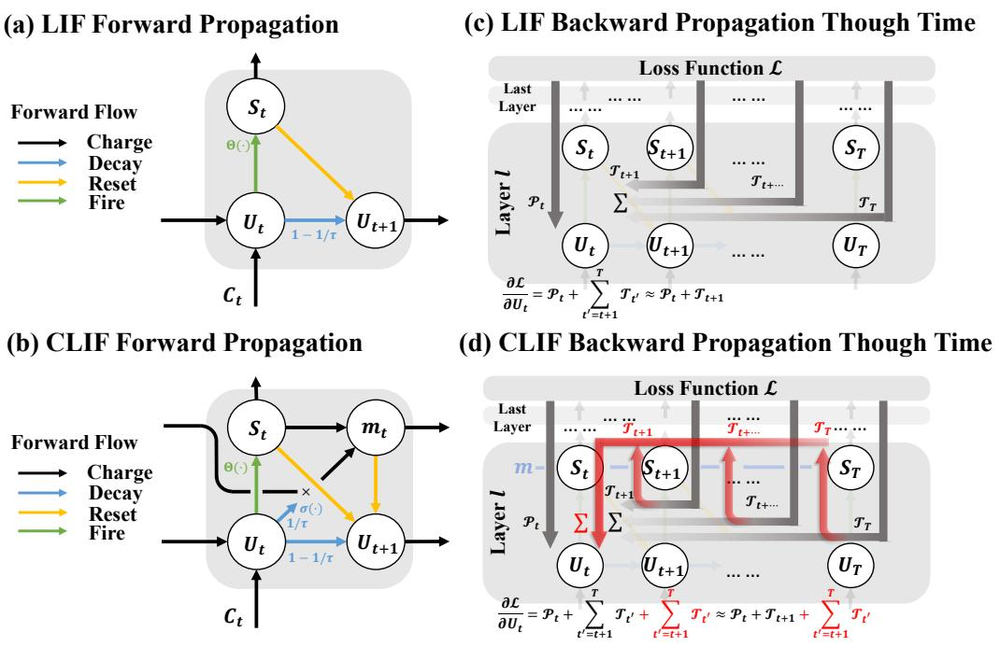  
Figure 1. (a) Illustration of the LIF neuron model with forward propagation data flow (b) Illustration of the CLIF neuron model with forward propagation data flow (c) Illustration of the LIF’s gradient error ∂L∂ul[t] flow during BPTT. Each path is represented by an arrow. Lighter color in the arrow indicates more decay of gradient error. (d) Illustration of the CLIF’s gradient error flow during BPTT. Compared to (c), the additional temporal gradient error is highlighted in red.

SRNN (Zhang & Li, 2021), SCNN (Fang et al., 2021a) and Transformer backbone (Zhou et al., 2022; Yao et al., 2024). In contrast, bio-inspired training is challenging to be effectively applied to deeper network configurations (Kheradpisheh et al., 2018). SG can reach satisfactory performance within limited timestep, whereas ANN-to-SNN requires a large number of timestep and more spikes to achieve comparable accuracy to the network trained by the SG method (Deng et al., 2020). As such, SG-based SNNs are more attractive in edge scenarios where the inference power is critical (Roy et al., 2019). Nevertheless, the SG method necessitates the use of inaccurate approximations for computing the gradients, leading to imprecise gradient update values and thus diminishing accuracy (Wang et al., 2023).

In this study, we rethink the SNN training process and introduce complementary leaky integrate and fire (CLIF) neuron. The LIF and CLIF neuron model is illustrated in Figure.1(a) and (b). We introduce a complementary membrane potential $( m [ t ] )$ in CLIF neuron. The complementary potential captures and maintains information related to the decay of the membrane potential. CLIF creates extra paths to facilitate the data flow in temporal gradient computation, as intuitively seen in Figure.1 (c) and (d). Our experiments demonstrate that for SNNs with vanilla LIF neurons, employing a limited number of temporal gradients can yield comparable accuracy to those achieved by using gradients across much more temporal steps. Our theoretical analysis reveals such limitation is linked to the vanishing of certain temporal gradients. Experiments show CLIF can boost the SNN performance significantly in both static images and dynamic event streams. Impressively, even with moderate timestep to keep SNN’s low power advantage, CLIF-based SNN achieves comparable or even superior performance to ANN counterpart with identical network structure and training conditions. Our main contributions are:

• We propose the CLIF neuron model to efficiently and accurately extract temporal gradients. The model has zero hyper-parameters and can interchange with LIF neuron in many mainstream SNNs. • We demonstrate that CLIF effectively boosts the SNN performance by simply replacing LIF with CLIF. For different SNNs architectures like spiking VGG and Resnet, up to $2 \%$ accuracy improvement is observed. • We conduct extensive experiments and discover that even with moderate timestep to keep the low power advantage, CLIF-based SNNs achieve comparable performance to ANNs with identical network structure and training conditions.

# 2. Related Work

In SG method, gradients of non-differentiable spike functions are approximated by some surrogate gradients during backpropagation, this method enables SNNs to be trained directly by BPTT (Werbos, 1990). However, the inaccurate approximations for computing the gradients cause imprecise gradient update (Wang et al., 2023), and degradation in accuracy. Moreover, as the BPTT method requires iteration of recursive computation over timestep, the training cost grows substantially over large timestep (Wu et al., 2018).

To improve the accuracy of the SG method, many efforts have been made. Some studies have advanced the surrogate functions. ASGL method (Wang et al., 2023) introduced an adaptive smoothing gradient to reduce gradient noise. LocalZO (Mukhoty et al., 2023) proposed the zeroth-order method to estimate the gradients for neuron. SML method (Deng et al., 2023) introduces ANNs module to reduce the gradient noise accumulation when training. Alternatively, enhanced neuron dynamics could also yield in higher SNNs accuracy. For example, PLIF (Fang et al., 2021b), LTMD (Wang et al., 2022a) and GLIF (Yao et al., 2022) introduced learnability in membrane potential, neuron threshold, and different channels, respectively. Nevertheless, even with those efforts, there is still a performance gap between SNNs and ANNs when implemented with identical network architecture. To enhance the training efficiency, several efficient training methods have been proposed. For instance, e-prop (Bellec et al., 2020) entirely discards the temporal gradients, and only uses the gradients of spatial dimension for training. SLTT (Meng et al., 2023) also discards the gradient of the temporal dimension, but randomly chooses a few gradient paths along the spatial dimension. Surprisingly, even after discarding the gradients in the temporal dimension, these methods still obtain comparable performance to the original BPTT approach. We investigate further such counterintuitive phenomena through experiments and conclude the temporal gradient decays too rapidly over multiple timesteps. Details about this observation are given in methods.

To tackle the rapid temporal gradient decay in SNNs, (Lotfi Rezaabad & Vishwanath, 2020) and (Xu et al., 2024) proposed spiking LSTM and spiking ConvLSTM in respectively. Spiking (Conv)LSTM inherits LSTM’s advantage and avoids rapid temporal gradient decay. However, Spiking (Conv)LSTM comes with a significant number of training parameters compared to LIF within each neuron, complicating the network structuring and increasing training effort. Moreover, Spiking (Conv)LSTM restricts the neuron from the critical operation of decay and reset. (Dampfhoffer et al., 2022a; 2023) proposed spikeGRU preserves the reset process of spike neuron. The SpikeGRU also inherits the gating mechanism of GRU to avoid fast temporal gradient decay, and still keep the number of training parameters.

(Fang et al., 2024) increased the parallel connection with trainable parameters between the spiking neurons to learn the long-term dependencies. However, this method also restricts the neuron from reset operation and increases the computation complexity. As such, both methods lose the generosity of SNNs and dilute the high efficiency and low power consumption advantage of SNNs.

In parallel, several bio-inspired models have been developed, transitioning from biological concepts to neuronal model implementations, with the goal of addressing longterm dependency learning issues. For example, the AHP neuron (Rao et al., 2022) inspired by after-hyperpolarizing currents, the TC-LIF model (Zhang et al., 2024) inspired by the Prinsky-Rinzel pyramidal neuron and the ELM model (Spieler et al., 2023) inspired by the cortical neuron. However, few works demonstrate the potential to apply bioinspired neuron models on large and complex networks. In summary, the methods to improve the temporal gradients not only add significant training complexity but also cannot be generalized to various network backbones.

# 3. Preliminary

The specific notations used in this paper are described in the Appendix.A.

# 3.1. SNN Neuron Model

In the field of SNNs, the most common neuron model is the Leaky Integrate-and-Fire (LIF) model with iterative expression, as detailed in (Wu et al., 2018). At each time step $t$ , the neurons in the $l$ -th layer integrate the postsynaptic current $c ^ { l } [ t ]$ with their previous membrane potential $\boldsymbol { \mathbf { \mathit { u } } } ^ { \bar { l } } [ t - 1 ]$ , the mathematical expression is illustrated in Eq.(1):

$$
{ \pmb u } ^ { l } [ t ] = ( 1 - \frac { 1 } { \tau } ) { \pmb u } ^ { l } [ t - 1 ] + c ^ { l } [ t ] ,
$$

where $\tau$ is the membrane time constant. $\tau > 1$ as the discrete step size is 1. The postsynaptic current $c ^ { l } [ t ] =$ $\mathbf { \Delta } W ^ { l } * s ^ { l - 1 } [ t ]$ is calculated as the product of weights $\boldsymbol { W } ^ { l }$ and spikes from the preceding layer $s ^ { l - 1 } [ t ]$ , simulating synaptic functionality, with $^ *$ indicating either a fully connect or convolution’s synaptic operation.

Neurons will generate spikes $s ^ { l } [ t ]$ by Heaviside function when membrane potential ${ \pmb u } ^ { l } [ t ]$ exceeds the threshold $V _ { \mathrm { t h } }$ as shown in Eq.(2):

$$
\begin{array} { r } { \pmb { s } ^ { l } [ t ] = \Theta ( \pmb { u } ^ { l } [ t ] - V _ { \mathrm { t h } } ) = \left\{ \begin{array} { l l } { 1 , } & { \mathrm { i f } ~ \pmb { u } ^ { l } [ t ] \geq V _ { \mathrm { t h } } } \\ { 0 , } & { \mathrm { o t h e r w i s e } } \end{array} \right. . } \end{array}
$$

After the spike, the neuron will reset its membrane potential. Two ways are prominent in Eq.(3):

$$
\begin{array} { r } { \pmb { u } ^ { l } [ t ] = \left\{ \pmb { u } ^ { l } [ t ] - V _ { \mathrm { t h } } \pmb { s } ^ { l } [ t ] , \right. \left. \begin{array} { l l } { \mathrm { s o f t r e s e t } } \\ { \pmb { u } ^ { l } [ t ] \odot \left( 1 - \pmb { s } ^ { l } [ t ] \right) , } \end{array} \right. \left. \begin{array} { l l } { \mathrm { h a r d r e s e t } } \end{array} . \right. } \end{array}
$$

In this work, we chose the soft reset process because it will keep more temporal information (Meng et al., 2023).

# 3.2. SNN Training with Surrogate Gradient

In the SG method, gradients are computed through BPTT (Wu et al., 2018). This involves considering the temporal dimension, where the gradients at $l$ -th layer for all timestep $T$ are calculated as Eq.(4):

$$
\nabla _ { \mathbf { W } ^ { l } } \mathcal { L } = \sum _ { t = 1 } ^ { T } \frac { \partial \mathcal { L } } { \partial \mathbf { \Psi } ^ { l } [ t ] } \frac { \partial \mathbf { \Psi } ^ { a ^ { l } } [ t ] } { \partial \mathbf { W } ^ { l } } , l = \mathrm { L } , \mathrm { L } - 1 , \cdots , 1 ,
$$

where $\mathcal { L }$ represents the loss function. We define the $\frac { \partial \mathcal { L } } { \partial \pmb { u } ^ { l } [ t ] }$ as the gradient error in this paper, the gradient error can be evaluated recursively:

$$
\frac { \partial \mathcal { L } } { \partial \pmb { u } ^ { l } [ t ] } = \frac { \partial \mathcal { L } } { \partial \pmb { s } ^ { l } [ t ] } \frac { \partial \pmb { s } ^ { l } [ t ] } { \partial \pmb { u } ^ { l } [ t ] } + \sum _ { t ^ { \prime } = t + 1 } ^ { T } \frac { \partial \mathcal { L } } { \partial \pmb { s } ^ { l } [ t ^ { \prime } ] } \frac { \partial \pmb { s } ^ { l } [ t ^ { \prime } ] } { \partial \pmb { u } ^ { l } [ t ^ { \prime } ] } \prod _ { t ^ { \prime \prime } = 1 } ^ { t ^ { \prime } - t } \epsilon ^ { l } [ t ^ { \prime } - t ^ { \prime \prime } ] ,
$$

where the $\epsilon ^ { l } [ t ]$ for LIF model can be defined as follows in Eq.(6):

$$
\epsilon ^ { l } [ t ] \equiv \frac { \partial \mathbf { { \boldsymbol { u } } } ^ { l } [ t + 1 ] } { \partial \mathbf { { \boldsymbol { u } } } ^ { l } [ t ] } + \frac { \partial \mathbf { { \boldsymbol { u } } } ^ { l } [ t + 1 ] } { \partial \mathbf { { \boldsymbol { s } } } ^ { l } [ t ] } \frac { \partial \mathbf { { \boldsymbol { s } } } ^ { l } [ t ] } { \partial \mathbf { { \boldsymbol { u } } } ^ { l } [ t ] } .
$$

In particular, for different layers, we have Eq.(7):

$$
\frac { \partial \mathcal { L } } { \partial s ^ { l } [ t ] } = \left\{ \begin{array} { l l } { \frac { \partial \mathcal { L } } { \partial s ^ { l } [ t ] } } & { \mathrm { ~ i f ~ } l = \mathrm { L } } \\ { \frac { \partial \mathcal { L } } { \partial u ^ { l + 1 } [ t ] } \frac { \partial u ^ { l + 1 } [ t ] } { \partial s ^ { l } [ t ] } } & { \mathrm { ~ i f ~ } l = \mathrm { L } - 1 , \cdots , 1 } \end{array} , \right.
$$

where the $\begin{array} { r c l } { \frac { \partial \pmb { u } ^ { l + 1 } [ t ] } { \partial \pmb { s } ^ { l } [ t ] } } & { = } & { ( \pmb { W } ^ { l + 1 } ) ^ { \top } } \end{array}$ . The detailed derivations can be found in the Appendix.B. In addition, the non-differentiable problem is solved by approximating $\begin{array} { r } { \frac { \partial \pmb { s } ^ { l } [ t ] } { \partial \pmb { u } ^ { l } [ t ] } \approx \mathbb { H } \left( \pmb { u } ^ { l } [ t ] \right) } \end{array}$ with the surrogate function $\mathbb { H } ( \cdot )$ (Neftci et al., 2019). In this work, we chose the rectangle function (Wu et al., 2019; Su et al., 2023):

$$
\frac { \partial s ^ { l } [ t ] } { \partial \pmb { u } ^ { l } [ t ] } \approx \mathbb { H } \left( \pmb { u } ^ { l } [ t ] \right) = \frac { 1 } { \alpha } \mathbb { 1 } \left( \left| \pmb { u } ^ { l } [ t ] - V _ { \mathrm { t h } } \right| < \frac { \alpha } { 2 } \right) ,
$$

where $\mathbb { 1 } ( \cdot )$ served as the indicator function. Following (Meng et al., 2023), the hyperparameter $\alpha$ is set to $V _ { \mathrm { t h } }$ In this case, Eq.(6) can be rewritten as:

$$
\epsilon ^ { l } [ t ] = \gamma \left( 1 - V _ { \mathrm { t h } } \mathbb { H } \left( \boldsymbol { u } ^ { l } [ t ] \right) \right)
$$

where $\begin{array} { r } { \gamma \triangleq 1 - \frac { 1 } { \tau } } \end{array}$ , resulting $\gamma \in ( 0 , 1 )$ .

# 4. Method

# 4.1. Limitation of LIF-based SNN with SG

We investigate the limitation of SG training method with LIF-based SNN through both experimental and theoretical analysis.

Experimental Observation: To investigate the relationship between temporal parameters and training performance, we conduct two experiments on LIF-based SNNs using the BPTT method. Our experimental setup utilizes a simple convolutional 5-layer SNN model, suitable to conduct analysis with multiple runs with various parameters.

In the first experiment, we introduce variable $k \in [ 1 , T ]$ When calculating the error in the backpropagation, the gradients from further timestep beyond $\mathbf { k }$ are discarded $( [ k + 1 , T ] )$ . Figure.5 in Appendix C. highlight the backpropagation example with $k = 2$ .

Figure.2(a) demonstrates how the network accuracy is influenced by time constant $( \tau )$ and BPTT timestep $( k )$ . It appears that the gradient from further timestep could not contribute to the backpropagation training process, as increasing $k$ above 2 does not substantially enhance the accuracy. We repeat this experiment on a few different datasets with different network backbones, all leading to the same conclusion. Experiment results from other datasets are given in Appendix C.

Figure.2(b) plots the classification accuracy over increasing timestep for both vanilla LIF and our proposed CLIF. The average and standard error are calculated from the results using 4 different random seeds. The accuracy of the vanilla LIF peaks at $T = 3 2$ and then declines as the number of timesteps increases. This indicates the temporal gradient from LIF over larger timestep cannot be properly processed. In contrast, the CLIF model demonstrates a sustained improvement of performance over increasing timestep, showcasing CLIF’s effectiveness in learning over longer timestep.

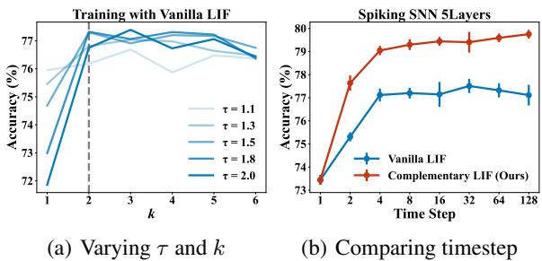  
Figure 2. The performance of LIF based a 5-layer SNN for CIFAR10 dataset: (a) The accuracy is influenced by time constant $( \tau )$ and BPTT timestep $( k )$ (detaching all gradients from $k + 1$ to T during training). We set the timestep to 6. (b) Accuracy over increasing timestep for both vanilla LIF and our proposed CLIF.

Theoretical Analysis: Figure.2 reveals LIF’s limitation of exploiting temporal information over a long period. This phenomenon is further investigated analytically. We separate the gradients into spatial $\mathcal { P } ^ { l } [ t ]$ component and temporal component $\sum T ^ { l } [ t ]$ , as shown in

$$
\frac { \partial \mathcal { L } } { \partial \mathbf { \boldsymbol { u } } ^ { l } [ t ] } = \mathcal { P } ^ { l } [ t ] + \sum _ { t ^ { \prime } = t + 1 } ^ { T } \mathcal { T } ^ { l } [ t , t ^ { \prime } ] ,
$$

where $\mathcal { P } ^ { l } [ t ]$ and $\mathcal { T } ^ { l } [ t , t ^ { \prime } ]$ can be further expanded as:

$$
\mathcal { P } ^ { l } [ t ] = \frac { \partial \mathcal { L } } { \partial \pmb { s } ^ { l } [ t ] } \frac { \partial \pmb { s } ^ { l } [ t ] } { \partial \pmb { u } ^ { l } [ t ] } ,
$$

$$
\mathcal { T } ^ { l } [ t , t ^ { \prime } ] = \frac { \partial \mathcal { L } } { \partial s ^ { l } [ t ^ { \prime } ] } \frac { \partial s ^ { l } [ t ^ { \prime } ] } { \partial { \pmb u } ^ { l } [ t ^ { \prime } ] } \prod _ { t ^ { \prime \prime } = 1 } ^ { t ^ { \prime } - t } \epsilon ^ { l } [ t ^ { \prime } - t ^ { \prime \prime } ] ,
$$

where the $t ^ { \prime } \in [ t { + } 1 , T ]$ . By substituting Eq.(9) into Eq.(12), we obtain:

$$
\frac { \partial \mathcal { L } } { \partial s ^ { l } [ t ^ { \prime } ] } \frac { \partial s ^ { l } [ t ^ { \prime } ] } { \partial { \pmb u } ^ { l } [ t ^ { \prime } ] } \underbrace { \gamma ^ { ( t ^ { \prime } - t ) } } _ { \mathrm { P a r t I } } \prod _ { t ^ { \prime \prime } = 1 } ^ { t ^ { \prime } - t } \underbrace { \left( 1 - V _ { \mathrm { t h } } \mathbb { H } \left( { \pmb u } ^ { l } [ t ^ { \prime } - t ^ { \prime \prime } ] \right) \right) } _ { \mathrm { P a r t I I } } .
$$

The temporal gradient error is a production of two parts. For Part I, When the difference between $t ^ { \prime }$ and $t$ is substantial, Part I gets very close to zero. The $\gamma$ is defined as $1 { - } \frac { 1 } { \tau }$ , $t$ denotes the time constant $\in \ [ 1 , + \mathrm { i n f } )$ . Typically, $\gamma$ is between 0.09 and 0.5. For example, in (Meng et al., 2023; Deng et al., 2021; Xiao et al., 2022) they set $\tau = 1 . 1$ , 1.3, 1.5, 2.0. For large $t ^ { \prime } - t$ , $\gamma ^ { ( t ^ { \prime } - t ) }$ could barely contribute to the $\epsilon$ . This could explain our observation in Figure.2(a).

Part II can be expressed as:

$$
\begin{array} { r } { 1 - V _ { \mathrm { t h } } \mathbb { H } \left( \pmb { u } ^ { l } [ t ] \right) = \left\{ \begin{array} { l l } { 0 } & { \mathrm { ~ i f ~ } \frac { 1 } { 2 } V _ { \mathrm { t h } } < \pmb { u } ^ { l } [ t ] < \frac { 3 } { 2 } V _ { \mathrm { t h } } } \\ { 1 } & { \mathrm { ~ o t h e r w i s e } } \end{array} \right. . } \end{array}
$$

More in-depth discussions and proofs of this equation are available in the Appendix.D. From Eq.(14), it can be seen part II has binary values of 0 or 1. More specifically, as long as the neuron fires at least once within the temporal range of $( t + 1 , T )$ , part $\mathrm { I I } = 0$ and the corresponding temporal gradient error will vanish and cannot contribute to the backpropagation training process. This is an unavoidable issue in vanilla-LIF models.

The vanishing of part II is also demonstrated experimentally. For example, in the special case with timestep $T = 2$ , part I equal to $\gamma$ we could examine the influence of part II and the experiment results are given in Section.5.1.

To summarize, Eq.(12) demonstrates the temporal gradient vanishing due to the vanishing $\epsilon$ in two folds: the multiplication of gamma at large $t ^ { \prime } - t$ and the neuron spike between $t ^ { \prime }$ and $t$ . We define this as the temporal gradient vanishing problem persists with the vanilla-LIF model.

# 4.2. The Design of Complementary LIF Model

To address the temporal gradient errors vanishing problem, we design the Complementary LIF (CLIF) model inspired by biological principles (See detailed in Appendix.E). Besides membrane potential, we introduce another state, termed ”Complementary potential”. To maintain the efficiency advantage of SNN as well as the broad applicability of our neuron model, our model contains no learnable parameters.

Decay of Complementary membrane potential: Between each timestep, the membrane potential is decayed by $\scriptstyle { \frac { 1 } { \tau } } u ^ { l } [ t ]$ We design our Complementary potential to compensate for the membrane potential decay as follows:

$$
m ^ { l } [ t ] = m ^ { l } [ t - 1 ] \odot \sigma \left( \frac { 1 } { \tau } { \boldsymbol u } ^ { l } [ t ] \right) .
$$

We choose the Sigmoid function as $\sigma$ , As $\sigma \in ( 0 , 1 )$ and the Complementary potential also decays. Nevertheless, the more the membrane potential decays, the less the Complementary potential decays. This design aims to preserve the decayed portion of the membrane potential into Complementary membrane potential.

Increase of Complementary membrane potential: Within each timestep, the Complementary membrane potential is increased by firing

$$
\begin{array} { r } { \pmb { m } ^ { l } [ t ] = \pmb { m } ^ { l } [ t ] + s ^ { l } [ t ] . } \end{array}
$$

If the neuron has fired recently, the membrane potential $m ^ { l } [ t ]$ gets larger.

Redesign Reset process: We revisit the Vanilla LIF model as defined by equation Eq.(1)-(3), focusing particularly on LIF’s reset process:

$$
\begin{array} { r } { \pmb { u } ^ { l } [ t ] = \pmb { u } ^ { l } [ t ] - \pmb { s } ^ { l } [ t ] \odot V _ { \mathrm { t h } } . } \end{array}
$$

The redesigned reset process is given in Eq.(18). Compared to the soft reset in Eq.(17), each time the neuron fires, the membrane potential is subtracted by another term $\sigma ( m ^ { l } [ t ] )$ related to the Complementary potential:

$$
\begin{array} { r } { \pmb { u } ^ { l } [ t ] = \pmb { u } ^ { l } [ t ] - \pmb { s } ^ { l } [ t ] \odot \left( V _ { \mathrm { t h } } + \sigma ( \pmb { m } ^ { l } [ t ] ) \right) . } \end{array}
$$

If the neuron fires recently, the membrane potential $m ^ { l } [ t ]$ gets larger, and the membrane potential ${ \pmb u } ^ { l } [ t ]$ will be subtracted more, suppressing the neuron’s firing rate. This mechanism achieves spike frequency adaptation, similar to the hyper-polarization process in real biological neurons (McCORMICK & Pape, 1990; Sanchez-Vives & McCormick, 2000). However, unlike classic spike frequency adaptation mechanisms, the adaptation of CLIF depends not only on recently firing activity but also on the recent membrane potential. This means that CLIF can capture more temporal information.

Algorithm 1 Core function for CLIF model   

<table><tr><td>Input: Input c, Current Time Step t, time constant T,</td></tr><tr><td>threshold Vth Output: Spike s if t = 0 then</td></tr><tr><td>Initial upre and mpre with all zero end if</td></tr><tr><td>u = (1 − 1 )upre + c leaky &amp; integrate s = Θ(u − Vth) fire</td></tr><tr><td>m = mpre  σ (1u) + s</td></tr><tr><td>upre = u − s  (Vth + σ(m)) reset</td></tr><tr><td>mpre = m Return s spike output</td></tr></table>

Summarizing the above principles, the CLIF model can be derived as following:

$$
\left\{ \begin{array} { l l } { \displaystyle u ^ { l } [ t ] = ( 1 - \frac { 1 } { \tau } ) u ^ { l } [ t - 1 ] + c ^ { l } [ t ] , } \\ { \displaystyle s ^ { l } [ t ] = \Theta ( \pmb { u } ^ { l } [ t ] - V _ { \mathrm { t h } } ) , } \\ { \displaystyle m ^ { l } [ t ] = m ^ { l } [ t - 1 ] \odot \sigma \left( \frac { 1 } { \tau } \pmb { u } ^ { l } [ t ] \right) + s ^ { l } [ t ] , } \\ { \displaystyle u ^ { l } [ t ] = \pmb { u } ^ { l } [ t ] - s ^ { l } [ t ] \odot \left( V _ { \mathrm { t h } } + \sigma ( m ^ { l } [ t ] ) \right) . } \end{array} \right.
$$

The pseudo-code for the CLIF model is shown in Algorithm.1. The simplicity of CLIF is reflected in the fact that we only add two lines of code to LIF neuron model.

# 4.3. Dynamic and Theoretical Analysis

To validate the effectiveness of the CLIF model, we examine the CLIF model through both case studies and theoretical analysis.

In the case study, we explore the dynamic properties of both LIF and CLIF models. CLIF features spike frequency adaptation and exhibits a lower firing rate compared to the LIF neuron. This phenomenon is similar to the refractory period or hyperpolarization in the biological neuron (SanchezVives & McCormick, 2000). More specifically, when the input spikes get dense, the complementary potential gets high, the reset process gets more substantial, as shown in Eq.(18). The more detailed dynamic analysis are illustrated in the Appendix.F.

In the theoretical Analysis, we separate the gradient error into spatial and temporal components in Eq.(20). The details of this derivation are given in Appendix.G). This separation demonstrates that CLIF not only contains all temporal gradients in LIF but also contains extra temporal gradient terms. We believe these additional temporal terms contribute to the improved performance of CLIF.

$$
\begin{array} { r l r } {  { \frac { \partial \mathcal { L } } { \partial \boldsymbol { u } ^ { l } [ t ] } = \mathcal { P } _ { \mathrm { M } } ^ { l } [ t ] + \sum _ { t ^ { \prime } = t + 1 } ^ { T } \mathcal { T } _ { \mathrm { M 1 } } ^ { l } [ t , t ^ { \prime } ] } } \\ & { } & { + ( \sum _ { t ^ { \prime } = t + 1 } ^ { T } \mathcal { T } _ { \mathrm { M 2 } } ^ { l } [ t , t ^ { \prime } ] ) \boldsymbol { \psi } ^ { l } [ t ] , } \end{array}
$$

where $\mathcal { P } _ { \mathrm { M } } ^ { l } [ t ]$ and $\mathcal { T } _ { \mathrm { M } } ^ { l } [ t ]$ presents the Spatial and Temporal parts of CLIF’s Gradient Errors in respectively. Meanwhile, the M1 and M2 indicate that the Temporal term is divided into two parts.

Firstly, the spatial term of CLIF’s gradient errors $\mathcal { P } _ { \mathrm { M } } ^ { l } [ t ]$ in Eq.(20) is identical to the counterpart in LIF neuron in Eq.(11). The detailed derivation and proof are given in Appendix.G.

Secondly, for the temporal term of CLIF’s gradient errors, the first temporal part $\mathcal { T } _ { \mathrm { M 1 } } ^ { l } [ t , t ^ { \prime } ]$ expands as:

$$
\mathcal { T } _ { \mathrm { M 1 } } ^ { l } = \bigg ( \frac { \partial \mathcal { L } } { \partial s ^ { l } [ t ^ { \prime } ] } \frac { \partial s ^ { l } [ t ^ { \prime } ] } { \partial { \pmb { u } } ^ { l } [ t ^ { \prime } ] } + \frac { \partial \mathcal { L } } { \partial m ^ { l } [ t ^ { \prime } ] } \psi ^ { l } [ t ^ { \prime } ] \bigg ) \prod _ { t ^ { \prime \prime } = 1 } ^ { t ^ { \prime } - t } \xi ^ { l } [ t ^ { \prime } - t ^ { \prime \prime } ] ,
$$

where the $\pmb { \xi } ^ { l } [ t ]$ is defined as:

$$
\pmb { \xi } ^ { l } [ t ] = \mathbf { \epsilon } ^ { l } [ t ] + \frac { \partial \pmb { u } ^ { l } [ t + 1 ] } { \partial \pmb { m } ^ { l } [ t ] } \pmb { \psi } ^ { l } [ t ] ,
$$

this term can be simplified to a product involving the constant term $\gamma$ , the same as Eq.(13). The issue discussed in Part I of Section.4.1, regarding the vanishing of temporal gradients, also applies here. Where $\psi ^ { l } [ t ]$ is non-negative (see Appendix.G). $\psi ^ { l } [ t ]$ is defined as:

$$
{ \boldsymbol { \psi } } ^ { l } [ t ] \equiv { \frac { \partial { \boldsymbol { m } } ^ { l } [ t ] } { \partial { \boldsymbol { u } } ^ { l } [ t ] } } + { \frac { \partial { \boldsymbol { m } } ^ { l } [ t ] } { \partial { \boldsymbol { s } } ^ { l } [ t ] } } { \frac { \partial { \boldsymbol { s } } ^ { l } [ t ] } { \partial { \boldsymbol { u } } ^ { l } [ t ] } } .
$$

Finally, for the other temporal item of CLIF’s gradient errors, $\mathcal { T } _ { \mathrm { M 2 } } ^ { l } [ t , t ^ { \prime } ]$ , can be expressed as:

$$
\mathcal { T } _ { \mathrm { M 2 } } ^ { l } [ t , t ^ { \prime } ] = \frac { \partial \mathcal { L } } { \partial \pmb { u } ^ { l } [ t ^ { \prime } ] } \frac { \partial \pmb { u } ^ { l } [ t ^ { \prime } ] } { \partial \pmb { m } ^ { l } [ t ^ { \prime } - 1 ] } \prod _ { t ^ { \prime \prime } = 2 } ^ { t ^ { \prime } - t } \pmb { \rho } ^ { l } [ t ^ { \prime } - t ^ { \prime \prime } ] .
$$

This term indicates that additional Temporal Gradient Errors components are generated. We believe this additional part contributes to the performance improvements. As $\mathcal { T } _ { \mathrm { M 2 } } ^ { l }$ does not decay as fast as $\Pi \xi$ over timestep, this phenomenon could be observed in dynamic analysis in the Appendix.F. Therefore, this item of gradient errors contributes to compensate for the vanishing of temporal gradients in LIF, leading to a further reduction in the loss. This assertion is also verifiable in Figure.3(a) in the Experiment.

Table 1. Comparing the state-of-the-art methods on static image datasets. The asterisk $( * )$ indicates the utilization of data augmentation strategies, including auto-augmentation and/or CutMix, our implementation directly following (Fang et al., 2024). The implemented ReLU-based ANN shares identical structures and hyper-parameters with SNN.   

<table><tr><td>Dataset</td><td>Method</td><td>Spiking Network</td><td>Neuron Model</td><td>Timestep</td><td>Accuracy(%)</td></tr><tr><td rowspan="10">CA-RAO</td><td>ANN/ANN*</td><td>ResNet-18</td><td>ReLU</td><td>1</td><td>95.62 / 96.65</td></tr><tr><td>Dspike (Li et al., 2021b) NIPS PLIF (Fang et al., 2021)</td><td>Modified ResNet-18</td><td>LIF</td><td>6</td><td>93.50</td></tr><tr><td>DSR (Meng et al., 2022)CVPR</td><td>PLIF Net</td><td>PLIF</td><td>6</td><td>94.25</td></tr><tr><td></td><td>RreAct-ResNet-18</td><td>LIF</td><td>20</td><td>95.40</td></tr><tr><td>GLIF (Yao et al., 2022)NIPS</td><td>ResNet-18</td><td>GLIF</td><td>6</td><td>94.88</td></tr><tr><td>KLIF (Jiang &amp; Zhang, 2023) ArXiv</td><td>Modified PLIF Net</td><td>KLIF</td><td>10</td><td>92.52</td></tr><tr><td>PSN* (a t l. 2</td><td>Modified PLIF Net</td><td>PSN</td><td>4</td><td>95.32</td></tr><tr><td>SML (Deng et al., 2023)ICL</td><td>ResNet-18</td><td>LIF</td><td>6</td><td>95.12</td></tr><tr><td>ASGL* (Wang et al., 202) CL</td><td>ResNet-18</td><td>LIF</td><td>4</td><td>95.35</td></tr><tr><td>Ours / Ours*</td><td>ResNet-18</td><td>CLIF</td><td>4</td><td>94.89 / 96.01</td></tr><tr><td rowspan="8">CTA-RAD</td><td></td><td></td><td></td><td>6 8</td><td>95.41 / 96.45 95.68 / 96.69</td></tr><tr><td>ANN /ANN</td><td>ResNet-18</td><td>ReLU</td><td>1</td><td>78.14 / 80.89</td></tr><tr><td>Dspike (Li et al., 2021b)&#x27;NIPS</td><td>Modified ResNet-18</td><td>LIF</td><td>6</td><td>74.24</td></tr><tr><td>DSR (Meng et al., 2022)CVPR</td><td>RreAct-ResNet-18</td><td>LIF</td><td>20</td><td>78.50</td></tr><tr><td>GLIF (Yao et al., 2022)NIPS</td><td>ResNet-18</td><td>GLIF</td><td>6</td><td>77.28</td></tr><tr><td>SML (Deng et al., 2023)CML</td><td>ResNet-18</td><td>LIF</td><td>6</td><td>78.00</td></tr><tr><td>ASGL* (Wang et al., 2023) C</td><td>ResNet-18</td><td>LIF</td><td>4</td><td>77.74</td></tr><tr><td>Ours / Ours*</td><td></td><td></td><td>4</td><td>77.00 / 79.69</td></tr><tr><td rowspan="5"></td><td></td><td>ResNet-18</td><td>CLIF</td><td>6</td><td>78.36 / 80.58</td></tr><tr><td>ANN</td><td>VGG-13</td><td>ReLU</td><td>8</td><td>78.99 / 80.89</td></tr><tr><td>Online LTL (Yang et al., 2022) NIPS</td><td>VGG-13</td><td>LIF</td><td>1 6</td><td>59.77 55.37</td></tr><tr><td>Joint A-SNN (Guo et al., 2023)Patern Recognit</td><td>VGG-16</td><td>LIF</td><td>4</td><td>55.39</td></tr><tr><td>ASGL (Wang et al., 2023) )C</td><td>VGG-13</td><td>LIF</td><td>8</td><td>56.81</td></tr><tr><td>Ti-n</td><td>Ours</td><td>VGG-13</td><td>CLIF</td><td>4 6</td><td>63.16 64.13</td></tr></table>

# 5. Experiment

To validate the effectiveness of the proposed CLIF neuron, we conduct a set of ablation studies. These studies are designed to evaluate the underlying principles of the CLIF model, to examine the effect of various timestep, and to conduct comparative analyses between the CLIF model and other neuron models. Following the ablation study, we extend our experiments to cover a diverse range of data types, including static image datasets and neuromorphic eventbased datasets. Details on the experimental implementation are provided in the Appendix.I.

# 5.1. Ablation and Analysis

We conduct two experiments to compare LIF and CLIF: the loss of CLIF versus LIF via training epochs, and the accuracy of CLIF versus LIF via timestep. For a fair comparison, except for the control variable, the same optimizer setting, random seed, architecture, loss function, weight initialization and all hyperparameters are employed.

Exchange of Neuron Models In the first ablation study, we use the Spiking Resnet18 with 6 timestep by BPTT training. The training of the network begins with LIF neuron and later transitions to CLIF neurons at a designated epoch. As shown in Figure.3(a), a few epochs after Exchange to CLIF, the loss decreases significantly compared to LIF. Moreover, the decay of loss over training epochs is much faster when training with CLIF than LIF.

We extend the loss comparison to various tasks and network backbones (see Appendix.H). In all experiments, CLIF neuron’s loss converges faster than LIF’s, the converged loss is also lower. As such, one can conclude that CLIF neurons are more effective in capturing error information both precisely and efficiently, suggesting the higher training accuracy and efficiency of CLIF.

Table 2. Comparing the SOTA neuronal models by using neuromorphic datasets. The footnote in the table indicates implementation directly in open source code by only modifying neurons: 1(Yao et al., 2024), 2(Fang et al., 2024) with data augmentation. ’T’ denotes the number of the timestep employed.   

<table><tr><td>Dataset</td><td>Method</td><td>Spiking Network</td><td>Neuron Model</td><td>T</td><td>Accuracy(%)</td></tr><tr><td rowspan="5">DVS-Gesture</td><td>PLIF (Fang et al., 2021b)&#x27;ccv</td><td>PLIF Net</td><td>PLIF</td><td>20</td><td>97.57</td></tr><tr><td>KLIF (Jiang &amp; Zhang, 2023) ArXiv</td><td>Modified PLIF Net</td><td>KLIF</td><td>12</td><td>94.10</td></tr><tr><td rowspan="3">Ours</td><td rowspan="2">Spiking-Vgg11</td><td>LIF</td><td rowspan="2">20</td><td>97.57</td></tr><tr><td>CLIF</td><td></td><td>97.92</td></tr><tr><td rowspan="2">Spike-Driven-Transformer1</td><td>LIF CLIF</td><td rowspan="2">16</td><td>98.26 99.31</td></tr><tr><td rowspan="6"></td><td>PLIF (Fang et al., 2021b) </td><td>PLIF Net</td><td>PIF</td><td>20</td></tr><tr><td>KLIF (Jiang &amp; Zhang, 2023) ArXiv</td><td>Modified PLIF Net</td><td>KLIF</td><td>15</td><td>74.80 70.90</td></tr><tr><td>GLIF (Yao et al., 2022) NIP</td><td>7B-wideNet</td><td>GLIF</td><td>16</td><td>78.10</td></tr><tr><td>PSN (Fang et al., 2024)NIPS</td><td>VGGSNN</td><td>PSN</td><td>10</td><td>85.90</td></tr><tr><td></td><td>Spiking-Vgg11</td><td>LIF</td><td>16</td><td>78.05</td></tr><tr><td>Ours</td><td>VGGSNN2</td><td>CLIF LIF CLIF</td><td>10</td><td>79.00 84.90</td></tr></table>

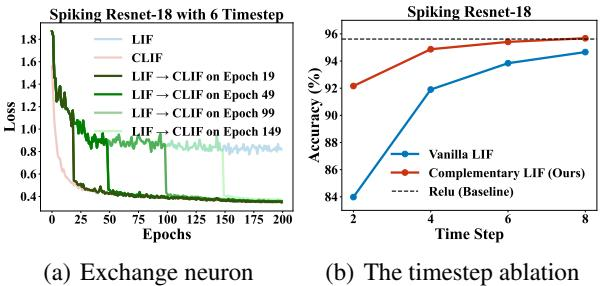  
Figure 3. (a) Loss function vs epochs. Each color presents a case of either LIF, CLIF, or exchanging from LIF to CLIF at a given epoch during training. (b) Comparison of the accuracy of LIF and CLIF at various timestep. Both experiments are evaluated on the CIFAR10 task with Spiking ResNet-18.

Temporal Ablation To demonstrate CLIF’s efficacy in capturing temporal gradient errors over longer period, we verify the performance comparison between CLIF and LIF with various timestep. The ablation study is conducted in CIFAR10 task with Resnet-18 as the backbone network. The results are illustrated in Figure.3(b). When the timestep is 1, CLIF and LIF cannot make any temporal gradient over membrane potential and yield identical accuracy of $9 2 . 7 \%$ (not shown in the figure). At higher timestep, CLIF always outperforms LIF neuron in accuracy. Specifically, at the timestep of 2 the vanilla LIF model encounters the problem of temporal gradient vanishing, as detailed in Part II of the theoretical analysis (Section 4.1). Remarkably, even with just two timestep, the performance of CLIF is already significantly better than LIF, this also verifies that CLIF can better capture the temporal gradient error information.

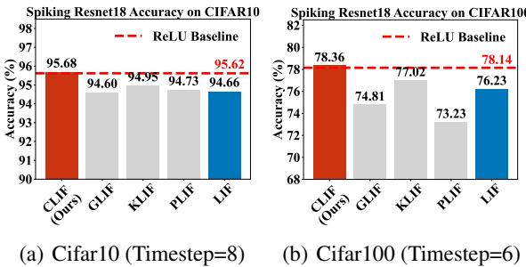  
Figure 4. Comparative accuracy of Spiking ResNet-18. Panels (a) CIFAR10 using 8 timestep (b) CIFAR100 using 6 timestep with different neuron.

# 5.2. Comparison and Quantitative analysis

We conduct two sets of comparison experiments to ascertain the effectiveness of CLIF: comparison with Different Neurons, and comparison with SOTA methods.

Comparison with Different Neuron In order to verify whether CLIF is more effective than existing methods, we self-implement and compare vanilla-LIF (Wu et al., 2018), PLIF (Fang et al., 2021b), KLIF (Jiang & Zhang, 2023) and GLIF (Yao et al., 2022). Except for the neuron models, all other experimental conditions are kept identical, including the backbone architecture, random seeds and hyperparameters. CLIF exhibits superior performance over other neuron benchmarks in the CIFAR10 and CIFAR100 datasets, as shown in Figure.4(a) and (b). PLIF and GLIF include additional training parameters, so additional hyperparameters tuning and more training epochs are required to converge.

Moreover, CLIF can achieve slightly better performance with ReLU-based ANNs.

Comparison with SOTA methods We compare our approach with state-of-the-art methods in two categories of datasets: static dataset (CIFAR10/100 and Tiny-ImageNet), as summarized in Table.1 and neuromorphic dataset (DVSGesture and CIFAR10-DVS), as summarized in Table.2. We not only explore the diversity of datasets but also the diversity in network backbone, including ResNet, VGG and Transformer. We also compare the fire rate and energy consumption of LIF, CLIF and ReLU. In short, CLIF has lower fire rate and similar energy consumption as LIF. Detailed statistics of fire rate and power consumption are described in the Appendix.J.

Static Image Datasets Table.1, reveals that CLIF always outperforms its LIF counterpart and surpasses all other SNNs neuron models within the same network backbone. CLIF achieves $9 6 . 6 9 \%$ accuracy on CIFAR-10 and $8 0 . 8 9 \%$ on CIFAR-100 datasets, not only outperforming other SNN models but also slightly outperforming ReLU-based ANNs counterpart. In Tiny-ImageNet, CLIF achieves $6 4 . 1 3 \%$ accuracy with 6 timestep, significantly better than the other SNNs and ANN within the same network backbone. These results demonstrate CLIF’s competitiveness with existing neuron models.

Neuromorphic Datasets To validate that our method can handle spatio-temporal error backpropagation properly, we conduct experiments on different neuromorphic datasets of DVS-Gesture (Amir et al., 2017) and DVSCIFAR10 (Li et al., 2017). The results are summarized in Table 3. For DVS Gesture, CLIF accuracy is $9 7 . 9 2 \%$ with SpikingVGG11 as backbone and $9 9 . 3 1 \%$ with Spike-Driven Transformer (Yao et al., 2024) as the backbone, surpassing LIF based model by $0 . 3 5 \%$ and $1 . 0 5 \%$ , respectively. On the DVSCIFAR10 dataset, CLIF accuracy is $7 9 . 0 0 \%$ with Spiking-VGG11 as the backbone and $8 6 . 1 0 \%$ with VGGSNN as the backbone, surpassing LIF based model by $0 . 9 5 \%$ and $1 . 2 0 \%$ , respectively. It is worth noting that CLIF features the highest accuracy of $8 6 . 1 0 \%$ in all methods in this dataset. This is achieved by simply replacing the neuron model with CLIF in the network architecture.

achieves comparable performance with ANNs with identical architecture and hyperparameters. Furthermore, the CLIF model is characterized by its generalizability and versatility, it can apply to various backbones, and it’s interchangeable with vanilla LIF neuron. Nevertheless, due to the mathematical complexity of the CLIF’s neuron equations, a more thorough analysis of the temporal gradient errors and the neuron’s dynamic behavior remains to be performed in the future.

# Acknowledgments

This work was supported in part by The Hong Kong University of Science and Technology (Guangzhou) Joint Funding Program under Grant 2023A03J0154 and Grant 2023A03J0013, as well as from the Young Scientists Fund of the National Natural Science Foundation of China (Grant 62305278).

# Impact Statement

This work was supported in part by the Young Scientists Fund of the National Natural Science Foundation of China (Grant 62305278), by the Guangzhou Municipal Science and Technology Project under Grant 2023A03J0013 and Grant 2024A04J4535.

# References

Amir, A., Taba, B., Berg, D., Melano, T., McKinstry, J., Di Nolfo, C., Nayak, T., Andreopoulos, A., Garreau, G., Mendoza, M., et al. A low power, fully event-based gesture recognition system. In Proceedings of the IEEE conference on computer vision and pattern recognition, pp. 7243–7252, 2017.   
Bellec, G., Scherr, F., Subramoney, A., Hajek, E., Salaj, D., Legenstein, R., and Maass, W. A solution to the learning dilemma for recurrent networks of spiking neurons. Nature communications, 11(1):3625, 2020.   
Benda, J. and Herz, A. V. A universal model for spikefrequency adaptation. Neural computation, 15(11):2523– 2564, 2003.   
Cubuk, E. D., Zoph, B., Mane, D., Vasudevan, V., and Le, Q. V. Autoaugment: Learning augmentation strategies from data. In Proceedings of the IEEE/CVF conference on computer vision and pattern recognition, pp. 113–123, 2019.   
Dampfhoffer, M., Mesquida, T., Valentian, A., and Anghel, L. Investigating current-based and gating approaches for accurate and energy-efficient spiking recurrent neural networks. In International Conference on Artificial Neural Networks, pp. 359–370. Springer, 2022a.

# 6. Conclusion

In this work, we investigate the vanishing of temporal gradient effort and propose the CLIF model with richer temporal gradient. CLIF features Complementary membrane potential on top of the conventional membrane potential and creates extra paths in temporal gradient computation while keeping binary output. CLIF shows experimentally clear performance advantage over other neuron models in various tasks with different network backbones. Moreover, CLIF

Dampfhoffer, M., Mesquida, T., Valentian, A., and Anghel, L. Are snns really more energy-efficient than anns? an in-depth hardware-aware study. IEEE Transactions on Emerging Topics in Computational Intelligence, 7(3):731– 741, 2022b.

Dampfhoffer, M., Mesquida, T., Hardy, E., Valentian, A., and Anghel, L. Leveraging sparsity with spiking recurrent neural networks for energy-efficient keyword spotting. In ICASSP 2023-2023 IEEE International Conference on Acoustics, Speech and Signal Processing (ICASSP), pp. 1–5. IEEE, 2023.

Deng, L., Wu, Y., Hu, X., Liang, L., Ding, Y., Li, G., Zhao, G., Li, P., and Xie, Y. Rethinking the performance comparison between snns and anns. Neural networks, 121: 294–307, 2020.

Deng, S. and Gu, S. Optimal conversion of conventional artificial neural networks to spiking neural networks. In International Conference on Learning Representations, 2020.

Deng, S., Li, Y., Zhang, S., and Gu, S. Temporal efficient training of spiking neural network via gradient reweighting. In International Conference on Learning Representations, 2021.

Deng, S., Lin, H., Li, Y., and Gu, S. Surrogate module learning: Reduce the gradient error accumulation in training spiking neural networks. In International Conference on Machine Learning, pp. 7645–7657. PMLR, 2023.

DeVries, T. and Taylor, G. W. Improved regularization of convolutional neural networks with cutout. arXiv preprint arXiv:1708.04552, 2017.

Dong, Y., Zhao, D., Li, Y., and Zeng, Y. An unsupervised stdp-based spiking neural network inspired by biologically plausible learning rules and connections. Neural Networks, 2023.

Fang, W., Yu, Z., Chen, Y., Huang, T., Masquelier, T., and Tian, Y. Deep residual learning in spiking neural networks. Advances in Neural Information Processing Systems, 34:21056–21069, 2021a.

Fang, W., Yu, Z., Chen, Y., Masquelier, T., Huang, T., and Tian, Y. Incorporating learnable membrane time constant to enhance learning of spiking neural networks. In Proceedings of the IEEE/CVF international conference on computer vision, pp. 2661–2671, 2021b.

Fang, W., Chen, Y., Ding, J., Yu, Z., Masquelier, T., Chen, D., Huang, L., Zhou, H., Li, G., and Tian, Y. Spikingjelly: An open-source machine learning infrastructure platform for spike-based intelligence. Science Advances, 9(40): eadi1480, 2023.

Fang, W., Yu, Z., Zhou, Z., Chen, D., Chen, Y., Ma, Z., Masquelier, T., and Tian, Y. Parallel spiking neurons with high efficiency and ability to learn long-term dependencies. Advances in Neural Information Processing Systems, 36, 2024.

Guo, Y., Peng, W., Chen, Y., Zhang, L., Liu, X., Huang, X., and Ma, Z. Joint a-snn: Joint training of artificial and spiking neural networks via self-distillation and weight factorization. Pattern Recognition, 142:109639, 2023.

Han, S., Pool, J., Tran, J., and Dally, W. Learning both weights and connections for efficient neural network. Advances in neural information processing systems, 28, 2015.

Jiang, C. and Zhang, Y. Klif: An optimized spiking neuron unit for tuning surrogate gradient slope and membrane potential. arXiv preprint arXiv:2302.09238, 2023.

Jiang, H., Anumasa, S., De Masi, G., Xiong, H., and Gu, B. A unified optimization framework of ann-snn conversion: towards optimal mapping from activation values to firing rates. In International Conference on Machine Learning, pp. 14945–14974. PMLR, 2023.

Kheradpisheh, S. R., Ganjtabesh, M., Thorpe, S. J., and Masquelier, T. Stdp-based spiking deep convolutional neural networks for object recognition. Neural Networks, 99:56–67, 2018.

Klausberger, T. and Somogyi, P. Neuronal diversity and temporal dynamics: the unity of hippocampal circuit operations. Science, 321(5885):53–57, 2008.

Krizhevsky, A., Hinton, G., et al. Learning multiple layers of features from tiny images. 2009.

Lemaire, E., Cordone, L., Castagnetti, A., Novac, P.-E., Courtois, J., and Miramond, B. An analytical estimation of spiking neural networks energy efficiency. In International Conference on Neural Information Processing, pp. 574–587. Springer, 2022.

Letinic, K., Zoncu, R., and Rakic, P. Origin of gabaergic neurons in the human neocortex. Nature, 417(6889): 645–649, 2002.

Li, H., Liu, H., Ji, X., Li, G., and Shi, L. Cifar10-dvs: an event-stream dataset for object classification. Frontiers in neuroscience, 11:309, 2017.

Li, W., Chen, H., Guo, J., Zhang, Z., and Wang, Y. Braininspired multilayer perceptron with spiking neurons. In Proceedings of the IEEE/CVF Conference on Computer Vision and Pattern Recognition, pp. 783–793, 2022.

Li, Y., Deng, S., Dong, X., Gong, R., and Gu, S. A free lunch from ann: Towards efficient, accurate spiking neural networks calibration. In International conference on machine learning, pp. 6316–6325. PMLR, 2021a.

Li, Y., Guo, Y., Zhang, S., Deng, S., Hai, Y., and Gu, S. Differentiable spike: Rethinking gradient-descent for training spiking neural networks. Advances in Neural Information Processing Systems, 34:23426–23439, 2021b.

Lotfi Rezaabad, A. and Vishwanath, S. Long short-term memory spiking networks and their applications. In International Conference on Neuromorphic Systems 2020, pp. 1–9, 2020.

Maass, W. Networks of spiking neurons: the third generation of neural network models. Neural networks, 10(9): 1659–1671, 1997.

McCORMICK, D. A. and Pape, H.-C. Properties of a hyperpolarization-activated cation current and its role in rhythmic oscillation in thalamic relay neurones. The Journal of physiology, 431(1):291–318, 1990.

Mehonic, A. and Kenyon, A. J. Brain-inspired computing needs a master plan. Nature, 604(7905):255–260, 2022.

Meng, Q., Xiao, M., Yan, S., Wang, Y., Lin, Z., and Luo, Z.- Q. Training high-performance low-latency spiking neural networks by differentiation on spike representation. In Proceedings of the IEEE/CVF Conference on Computer Vision and Pattern Recognition, pp. 12444–12453, 2022.

Meng, Q., Xiao, M., Yan, S., Wang, Y., Lin, Z., and Luo, Z.- Q. Towards memory-and time-efficient backpropagation for training spiking neural networks. In Proceedings of the IEEE/CVF International Conference on Computer Vision, pp. 6166–6176, 2023.

Mukhoty, B., Bojkovic, V., de Vazelhes, W., Zhao, X., De Masi, G., Xiong, H., and Gu, B. Direct training of snn using local zeroth order method. In Thirty-seventh Conference on Neural Information Processing Systems, 2023.

Neftci, E. O., Mostafa, H., and Zenke, F. Surrogate gradient learning in spiking neural networks: Bringing the power of gradient-based optimization to spiking neural networks. IEEE Signal Processing Magazine, 36(6):51–63, 2019.

Rankin, C. H., Abrams, T., Barry, R. J., Bhatnagar, S., Clayton, D. F., Colombo, J., Coppola, G., Geyer, M. A., Glanzman, D. L., Marsland, S., et al. Habituation revisited: an updated and revised description of the behavioral characteristics of habituation. Neurobiology of learning and memory, 92(2):135–138, 2009.

Rao, A., Plank, P., Wild, A., and Maass, W. A long shortterm memory for ai applications in spike-based neuromorphic hardware. Nature Machine Intelligence, 4(5): 467–479, 2022.

Rathi, N. and Roy, K. Diet-snn: A low-latency spiking neural network with direct input encoding and leakage and threshold optimization. IEEE Transactions on Neural Networks and Learning Systems, 2021.

Roy, K., Jaiswal, A., and Panda, P. Towards spike-based machine intelligence with neuromorphic computing. Nature, 575(7784):607–617, 2019.

Sanchez-Vives, M. V. and McCormick, D. A. Cellular and network mechanisms of rhythmic recurrent activity in neocortex. Nature neuroscience, 3(10):1027–1034, 2000.

Schuman, C. D., Kulkarni, S. R., Parsa, M., Mitchell, J. P., Date, P., and Kay, B. Opportunities for neuromorphic computing algorithms and applications. Nature Computational Science, 2(1):10–19, 2022.

Shen, J., Ni, W., Xu, Q., and Tang, H. Efficient spiking neural networks with sparse selective activation for continual learning. In Proceedings of the AAAI Conference on Artificial Intelligence, volume 38, pp. 611–619, 2024.

Spieler, A., Rahaman, N., Martius, G., Scholkopf, B., and ¨ Levina, A. The expressive leaky memory neuron: an efficient and expressive phenomenological neuron model can solve long-horizon tasks. In The Twelfth International Conference on Learning Representations, 2023.

Su, Q., Chou, Y., Hu, Y., Li, J., Mei, S., Zhang, Z., and Li, G. Deep directly-trained spiking neural networks for object detection. In Proceedings of the IEEE/CVF International Conference on Computer Vision, pp. 6555–6565, 2023.

Tavanaei, A., Ghodrati, M., Kheradpisheh, S. R., Masquelier, T., and Maida, A. Deep learning in spiking neural networks. Neural networks, 111:47–63, 2019.

Teeter, C., Iyer, R., Menon, V., Gouwens, N., Feng, D., Berg, J., Szafer, A., Cain, N., Zeng, H., Hawrylycz, M., et al. Generalized leaky integrate-and-fire models classify multiple neuron types. Nature communications, 9(1):709, 2018.

Wang, S., Cheng, T. H., and Lim, M.-H. Ltmd: Learning improvement of spiking neural networks with learnable thresholding neurons and moderate dropout. Advances in Neural Information Processing Systems, 35:28350– 28362, 2022a.

Wang, Y., Zhang, M., Chen, Y., and Qu, H. Signed neuron with memory: Towards simple, accurate and highefficient ann-snn conversion. In International Joint Conference on Artificial Intelligence, 2022b.

Wang, Z., Jiang, R., Lian, S., Yan, R., and Tang, H. Adaptive smoothing gradient learning for spiking neural networks. In International Conference on Machine Learning, pp. 35798–35816. PMLR, 2023.

Werbos, P. J. Backpropagation through time: what it does and how to do it. Proceedings of the IEEE, 78(10):1550– 1560, 1990.

Wu, Y., Deng, L., Li, G., Zhu, J., and Shi, L. Spatiotemporal backpropagation for training high-performance spiking neural networks. Frontiers in neuroscience, 12: 331, 2018.

Wu, Y., Deng, L., Li, G., Zhu, J., Xie, Y., and Shi, L. Direct training for spiking neural networks: Faster, larger, better. In Proceedings of the AAAI conference on artificial intelligence, volume 33, pp. 1311–1318, 2019.

Xiao, M., Meng, Q., Zhang, Z., He, D., and Lin, Z. Online training through time for spiking neural networks. Advances in Neural Information Processing Systems, 35: 20717–20730, 2022.

Xu, Q., Li, Y., Shen, J., Liu, J. K., Tang, H., and Pan, G. Constructing deep spiking neural networks from artificial neural networks with knowledge distillation. In Proceedings of the IEEE/CVF Conference on Computer Vision and Pattern Recognition, pp. 7886–7895, 2023.

Xu, Q., Gao, Y., Shen, J., Li, Y., Ran, X., Tang, H., and Pan, G. Enhancing adaptive history reserving by spiking convolutional block attention module in recurrent neural networks. Advances in Neural Information Processing Systems, 36, 2024.

Yang, Q., Wu, J., Zhang, M., Chua, Y., Wang, X., and Li, H. Training spiking neural networks with local tandem learning. Advances in Neural Information Processing Systems, 35:12662–12676, 2022.

Yao, M., Hu, J., Zhou, Z., Yuan, L., Tian, Y., Xu, B., and Li, G. Spike-driven transformer. Advances in Neural Information Processing Systems, 36, 2024.

Yao, X., Li, F., Mo, Z., and Cheng, J. Glif: A unified gated leaky integrate-and-fire neuron for spiking neural networks. Advances in Neural Information Processing Systems, 35:32160–32171, 2022.

Zenke, F. and Ganguli, S. Superspike: Supervised learning in multilayer spiking neural networks. Neural computation, 30(6):1514–1541, 2018.

Zhang, S., Yang, Q., Ma, C., Wu, J., Li, H., and Tan, K. C. Tc-lif: A two-compartment spiking neuron model for long-term sequential modelling. In Proceedings of the AAAI Conference on Artificial Intelligence, volume 38, pp. 16838–16847, 2024.

Zhang, T., Zeng, Y., Zhao, D., and Xu, B. Brain-inspired balanced tuning for spiking neural networks. In IJCAI, volume 7, pp. 1653–1659. Stockholm, 2018.

Zhang, W. and Li, P. Skip-connected self-recurrent spiking neural networks with joint intrinsic parameter and synaptic weight training. Neural computation, 33(7): 1886–1913, 2021.

Zhou, Z., Zhu, Y., He, C., Wang, Y., Shuicheng, Y., Tian, Y., and Yuan, L. Spikformer: When spiking neural network meets transformer. In The Eleventh International Conference on Learning Representations, 2022.

# A. Notation in the Paper

Throughout the paper and this Appendix, we use the following notations, which mainly follow this work(Wang et al., 2023). We follow the conventions representing vectors and matrices with bold italic letters and bold capital letters respectively, such as $\pmb { s }$ and $W$ . For this symbol $W ^ { \top }$ represents transposing the matrix. For a function $f ( \pmb { x } ) : \mathbb { R } ^ { d _ { 1 } }  \mathbb { R } ^ { d _ { 2 } }$ , we use $\nabla _ { \pmb { x } } f$ instead of ∂f t o represent the $1 ^ { \mathrm { t h } }$ derivative gradients of $f$ with respect to the variable $x$ in the absence of ambiguity. For two vectors $\mathbf { \pmb { u } _ { 1 } }$ and $\mathbf { \delta } \mathbf { u } _ { 2 }$ , we use $\mathbf { \pmb { u } _ { 1 } } \odot \mathbf { \pmb { u } _ { 2 } }$ to represent the element-wise product.

# B. LIF-Based BPTT with Surrogate Gradient

This section is mainly referenced from (Wu et al., 2018; Meng et al., 2023). Firstly, we recall the LIF model Eq.(1) - (3). We then rewrite the LIF model with soft reset mechanism:

$$
{ \pmb u } ^ { l } [ t ] = ( 1 - \frac { 1 } { \tau } ) \left( { \pmb u } ^ { l } [ t - 1 ] - V _ { \mathrm { t h } } { \pmb s } ^ { l } [ t - 1 ] \right) + { \pmb W } ^ { l } { \pmb s } ^ { l - 1 } [ t ] ,
$$

$$
s ^ { l } [ t ] = \Theta ( \pmb { u } ^ { l } [ t ] - V _ { \mathrm { t h } } ) = \left\{ \begin{array} { l l } { 1 , } & { \mathrm { i f } ~ \pmb { u } ^ { l } [ t ] \geq V _ { \mathrm { t h } } } \\ { 0 , } & { \mathrm { o t h e r w i s e } } \end{array} \right.
$$

$\gamma$ is defined as $\begin{array} { r } { \gamma \equiv 1 - \frac { 1 } { \tau } } \end{array}$ , then we recall the gradient in Eq.(4)-(6):

$$
\nabla _ { \mathbf { } W ^ { l } } \mathcal { L } = \sum _ { t = 1 } ^ { T } \frac { \partial \mathcal { L } } { \partial \mathbf { } \mathbf { } u ^ { l } [ t ] } \frac { \partial \mathbf { } u ^ { l } [ t ] } { \partial \mathbf { } W ^ { l } } , l = \mathrm { L } , \mathrm { L } - 1 , \cdots , 1 ,
$$

where $\mathcal { L }$ represents the loss function. For the left part we recursively evaluate:

$$
\frac { \partial \mathcal { L } } { \partial \pmb { u } ^ { l } [ t ] } = \frac { \partial \mathcal { L } } { \partial \pmb { s } ^ { l } [ t ] } \frac { \partial \pmb { s } ^ { l } [ t ] } { \partial \pmb { u } ^ { l } [ t ] } + \frac { \partial \mathcal { L } } { \partial \pmb { u } ^ { l } [ t + 1 ] } \pmb { \epsilon } ^ { l } [ t ] ,
$$

where $\epsilon ^ { l } [ t ]$ for LIF model can be defined as follows:

$$
\epsilon ^ { l } [ t ] \equiv \frac { \partial \mathbf { { \boldsymbol { u } } } ^ { l } [ t + 1 ] } { \partial \mathbf { { \boldsymbol { u } } } ^ { l } [ t ] } + \frac { \partial \mathbf { { \boldsymbol { u } } } ^ { l } [ t + 1 ] } { \partial \mathbf { { \boldsymbol { s } } } ^ { l } [ t ] } \frac { \partial \mathbf { { \boldsymbol { s } } } ^ { l } [ t ] } { \partial \mathbf { { \boldsymbol { u } } } ^ { l } [ t ] } ,
$$

Proof of the Eq.(5) and Eq.(7).

Proof. Firstly, we only consider the effect of the temporal dimension in Eq.(28). When $t = T$ , where Eq.(28) deduce as:

$$
\frac { \partial \mathcal { L } } { \partial \mathbf { \boldsymbol { u } } ^ { l } [ T ] } = \frac { \partial \mathcal { L } } { \partial \mathbf { \boldsymbol { s } } ^ { l } [ T ] } \frac { \partial \mathbf { \boldsymbol { s } } ^ { l } [ T ] } { \partial \mathbf { \boldsymbol { u } } ^ { l } [ T ] } .
$$

When $1 \leq t < T$ , with the chain rule, the Eq.(28) can be further calculated recursively:

$$
\begin{array} { r l } { \frac { \partial \mathcal { L } } { \partial \kappa } \frac { \partial \mathcal { L } } { | \partial \kappa | | } - \frac { \partial \mathcal { L } } { \partial \kappa ^ { \prime } | | \partial \kappa ^ { \prime } | | } + \frac { \partial \mathcal { L } } { \partial \kappa | \left( t + 1 \right) } \epsilon _ { [ \downarrow ] } ^ { \prime } } & { } \\ { - \frac { \partial \mathcal { L } } { \partial \kappa ^ { \prime } | | \partial \kappa ^ { \prime } | | } \frac { \partial \mathcal { L } } { | \partial \kappa ^ { \prime } | | } + \left( \frac { \partial \mathcal { L } } { \partial \kappa ^ { \prime } [ \varepsilon + 1 ] } \frac { \partial \kappa ^ { \prime } [ t + 1 ] } { \partial \kappa ^ { \prime } [ \varepsilon + 1 ] } + \frac { \partial \mathcal { L } } { \partial \kappa ^ { \prime } [ \varepsilon + 2 ] } \epsilon ^ { \prime } | t + 1 ] \right) \epsilon ^ { \prime } | | } & { } \\ { - \frac { \partial \mathcal { L } } { \partial \kappa | \partial \kappa ^ { \prime } | | } \frac { \partial \mathcal { L } } { | \partial \kappa ^ { \prime } | | } + \frac { \partial \mathcal { L } } { \partial \kappa | \left( t + 1 \right) } \frac { \partial \epsilon ^ { \prime } | \partial \kappa | } { \partial \kappa ^ { \prime } | \left( t + 1 \right) } } & { = \frac { \partial \mathcal { L } } { | \partial \kappa ^ { \prime } | | \partial \kappa | } \epsilon _ { [ \downarrow ] } ^ { \prime } } & { } \\  - \frac { \partial \mathcal { L } } { \partial \kappa ^ { \prime } | | \partial \kappa ^ { \prime } | | } \frac { \partial \mathcal { L } } { | \partial \kappa ^ { \prime } | | } + \frac { \partial \mathcal { L } } { \partial \kappa | \left( t + 1 \right) } \frac { \partial \epsilon ^ { \prime } | \partial \kappa | } { \partial \kappa ^ { \prime } | \left( t + 1 \right) } \epsilon _ { [ \downarrow ] } ^ { \prime } + \frac { \partial \mathcal { L } } { \partial \kappa ^ { \prime } | \left( t + 2 \right) } \epsilon ^ { \prime }  \end{array}
$$$$
\begin{array} { r l } & { - \frac { \partial C } { \partial \varphi ^ { k } [ \frac { \partial } { \partial u ^ { k } } ] } \frac { \partial ^ { k } [ \xi ] } { \partial u ^ { k } ( \xi ) } + \frac { \partial \mathcal { L } } { \partial \varphi ^ { k } ( \xi + 1 ) } \frac { \partial ^ { k } [ \xi + 1 ] } { \partial u ^ { k } [ \xi + 1 ] } \mathrm { t } [ \mathrm { t } ] + \frac { \partial C } { \partial u ^ { k } [ \xi + 2 ] } \mathrm { t } ^ { k } [ \mathrm { t } ] } \\ & { - \frac { \partial C } { \partial \varphi ^ { k } [ \xi ] } \frac { \partial ^ { k } [ \xi ] } { \partial u ^ { k } [ \xi ] } + \frac { \partial \mathcal { L } } { \partial \varphi ^ { k } ( \xi + 1 ) } \frac { \partial ^ { k } [ \xi + 1 ] } { \partial u ^ { k } [ \xi + 1 ] } \mathrm { t } ^ { k } [ \mathrm { t } ] + \left[ \frac { \partial C } { \partial \varphi ^ { k } [ \xi + 2 ] } \frac { \partial \sin ^ { k } [ \xi + 2 ] } { \partial u ^ { k } [ \xi + 2 ] } + \frac { \partial C } { \partial u ^ { k } [ \xi + 3 ] } \right] } \\ & { - \frac { \partial C } { \partial \varphi ^ { k } [ \xi ] } \frac { \partial ^ { k } [ \xi ] } { \partial u ^ { k } [ \xi ] } + \frac { \partial \mathcal { L } } { \partial \varphi ^ { k } ( \xi + 1 ) } \frac { \partial ^ { k } [ \xi + 1 ] } { \partial u ^ { k } [ \xi + 1 ] } \mathrm { t } ^ { k } [ \mathrm { t } ] - \frac { \partial C } { \partial \varphi ^ { k } [ \xi ] } \frac { \partial \sin [ \xi + 2 ] } { \partial u ^ { k } [ \xi + 2 ] } \mathrm { t } ^ { k } [ \mathrm { t } ] } \\ &  - \frac { \partial \mathcal { L } } { \partial \varphi ^ { k } [ \xi ] } \frac { \partial ^ { k } [ \xi ] } { \partial u ^ { k } [ \xi ] } + \frac { \partial \mathcal { L } }  \partial \varphi ^ { k } ( \xi + 1 ) \end{array}
$$

after iterative expansion, we can inductively summarize the Eq.(30) and (31) to obtain this formula Eq.(32):

$$
\frac { \partial \mathcal { L } } { \partial u ^ { l } [ t ] } = \frac { \partial \mathcal { L } } { \partial s ^ { l } [ t ] } \frac { \partial s ^ { l } [ t ] } { \partial { u } ^ { l } [ t ] } + \sum _ { t ^ { \prime } = t + 1 } ^ { T } \frac { \partial \mathcal { L } } { \partial s ^ { l } [ t ^ { \prime } ] } \frac { \partial s ^ { l } [ t ^ { \prime } ] } { \partial { u } ^ { l } [ t ^ { \prime } ] } \prod _ { t ^ { \prime \prime } = 1 } ^ { t ^ { \prime } - t } \epsilon ^ { l } [ t ^ { \prime } - t ^ { \prime \prime } ] .
$$

Secondly, under the $t \in [ 1 , T ]$ situation, we consider the different layer. For last layer, we substitute $l = L$ into Eq.(32) as:

$$
\frac { \partial \mathcal { L } } { \partial u ^ { L } [ t ] } = \frac { \partial \mathcal { L } } { \partial s ^ { L } [ t ] } \frac { \partial s ^ { L } [ t ] } { \partial u ^ { L } [ t ] } + \sum _ { t ^ { \prime } = t + 1 } ^ { T } \frac { \partial \mathcal { L } } { \partial s ^ { L } [ t ^ { \prime } ] } \frac { \partial s ^ { L } [ t ^ { \prime } ] } { \partial u ^ { L } [ t ^ { \prime } ] } \prod _ { t ^ { \prime \prime } = 1 } ^ { t ^ { \prime } - t } \epsilon ^ { L } [ t ^ { \prime } - t ^ { \prime \prime } ] .
$$

For the intermediate layer $l = L - 1 , . . . , 1$ , according to the chain rule, the $\frac { \partial \mathcal { L } } { \partial \pmb { u } ^ { l } [ t ] }$ can be obtained from the previous layer $\frac { \partial \mathcal { L } } { \partial \pmb { u } ^ { l + 1 } [ t ] }$ , the Eq.(32) can be shown in:

$$
\begin{array} { c } { \displaystyle \frac { \partial \mathcal { L } } { \partial \boldsymbol { u } ^ { l } [ t ] } = \frac { \partial \mathcal { L } } { \partial \boldsymbol { u } ^ { l + 1 } [ t ] } \frac { \partial \boldsymbol { u } ^ { l + 1 } [ t ] } { \partial \boldsymbol { s } ^ { l } [ t ] } \frac { \partial \boldsymbol { s } ^ { l } [ t ] } { \partial \boldsymbol { u } ^ { l } [ t ] } } \\ { \displaystyle + \sum _ { t ^ { \prime } = t + 1 } ^ { T } \frac { \partial \mathcal { L } } { \partial \boldsymbol { u } ^ { l + 1 } [ t ^ { \prime } ] } \frac { \partial \boldsymbol { u } ^ { l + 1 } [ t ^ { \prime } ] } { \partial \boldsymbol { s } ^ { l } [ t ^ { \prime } ] } \frac { \partial \boldsymbol { s } ^ { l } [ t ^ { \prime } ] } { \partial \boldsymbol { u } ^ { l } [ t ^ { \prime } ] } \prod _ { t ^ { \prime \prime } = 1 } ^ { t ^ { \prime } - t } \epsilon ^ { l } [ t ^ { \prime } - t ^ { \prime \prime } ] . } \end{array}
$$

Finally, combining Eq.(32)-(34), we conclude the following equations:

$$
\frac { \partial \mathcal { L } } { \partial \pmb { u } ^ { l } [ t ] } = \frac { \partial \mathcal { L } } { \partial \pmb { s } ^ { l } [ t ] } \frac { \partial \pmb { s } ^ { l } [ t ] } { \partial \pmb { u } ^ { l } [ t ] } + \sum _ { t ^ { \prime } = t + 1 } ^ { T } \frac { \partial \mathcal { L } } { \partial \pmb { s } ^ { l } [ t ^ { \prime } ] } \frac { \partial \pmb { s } ^ { l } [ t ^ { \prime } ] ] } { \partial \pmb { u } ^ { l } [ t ^ { \prime } ] } \prod _ { t ^ { \prime \prime } = 1 } ^ { t ^ { \prime } - t } \pmb { \epsilon } ^ { l } [ t ^ { \prime } - t ^ { \prime \prime } ] ,
$$

where

$$
\frac { \partial \mathcal { L } } { \partial s ^ { l } [ t ] } = \left\{ \begin{array} { l l } { \frac { \partial \mathcal { L } } { \partial s ^ { L } [ t ] } } & { \mathrm { ~ i f ~ } l = \mathrm { L } } \\ { \frac { \partial \mathcal { L } } { \partial u ^ { l + 1 } [ t ] } \frac { \partial u ^ { l + 1 } [ t ] } { \partial s ^ { l } [ t ] } } & { \mathrm { ~ i f ~ } l = \mathrm { L } - 1 , \cdots , 1 } \end{array} , \right.
$$

The Eq.(35) and Eq.(36) is the same as Eq.(5) and Eq.(7).

# C. The Details of Experimental Observation

The network accuracy is influenced by the time constant $( \tau )$ and BPTT timestep $( k )$ . Besides the 5-layer NN in Figure.6, we also evaluate CIFFAR10 with Spiking ResNet18 and DVSGesture with Spiking VGG11. Similar to 5layer SNN, the gradient from further timestep could not contribute to the backpropagation training process, as increasing $k$ above 3 does not substantially enhance the accuracy. The training settings are shown in Table.4:

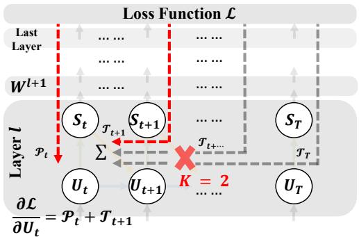  
Figure 5. Illustration of the LIF neuron based SNN’s gradient error flow during BPTT. In this example ${ \bf k } { = } 2$ : only the backpropagation from the first two timestep is considered (illustrated by the two red dashed arrows), and backpropagation along further timestep is discarded.

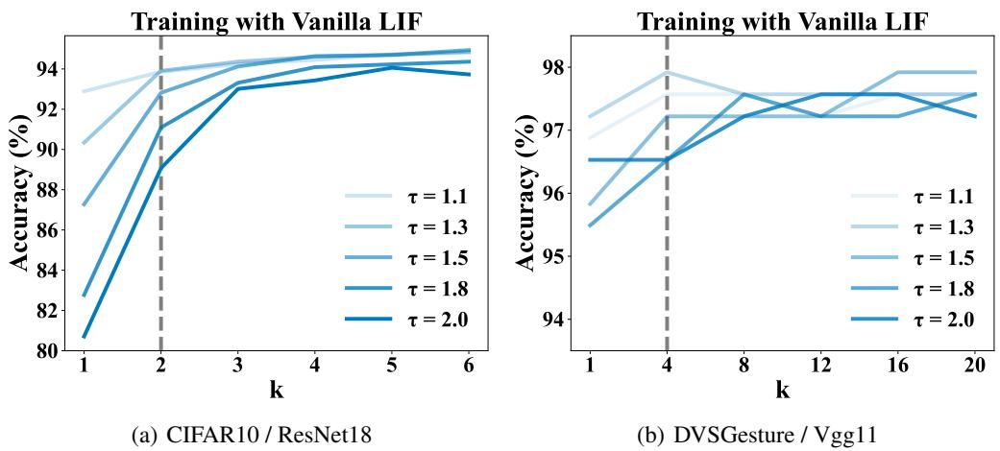  
Figure 6. Performance of LIF with BPTT training, varying $\tau$ and $k$ (detach all gradients except $0 \sim k$ ), on (a) CIFAR10 / ResNet18 (Timestep $= 6$ ) and (b) DVS Gesture / $\mathrm { V g g 1 1 }$ (Timestep $= 2 0$ ). The detailed results as shown in Table.C, and the experiment hyperparameter as shown in Table.4.

Table 3. Left table is the CIFAR10 accuracy performance $( \% )$ , Right table is the DVS Gesture accuracy performance $( \% )$ . The random seeds are uniformly fixed across all instances.   

<table><tr><td>τ k</td><td>1.1</td><td>1.3</td><td>1.5</td><td>1.8</td><td>2</td><td>τ k</td><td>1.1</td><td>1.3</td><td>1.5</td><td>1.8</td><td>2</td></tr><tr><td>1</td><td>92.89</td><td>90.34</td><td>87.27</td><td>82.77</td><td>80.71</td><td>1</td><td>96.88</td><td>97.22</td><td>95.83</td><td>95.49</td><td>96.53</td></tr><tr><td>2</td><td>93.86</td><td>93.91</td><td>92.82</td><td>91.09</td><td>89.07</td><td>4</td><td>97.57</td><td>97.92</td><td>97.22</td><td>96.53</td><td>96.53</td></tr><tr><td>3</td><td>94.24</td><td>94.36</td><td>94.12</td><td>93.31</td><td>93.01</td><td>8</td><td>97.57</td><td>97.57</td><td>97.22</td><td>97.57</td><td>97.22</td></tr><tr><td>4</td><td>94.45</td><td>94.61</td><td>94.64</td><td>94.09</td><td>93.43</td><td>12</td><td>97.22</td><td>97.57</td><td>97.22</td><td>97.22</td><td>97.57</td></tr><tr><td>5</td><td>94.73</td><td>94.69</td><td>94.7</td><td>94.23</td><td>94.06</td><td>16</td><td>97.57</td><td>97.57</td><td>97.92</td><td>97.22</td><td>97.57</td></tr><tr><td>6</td><td>94.80</td><td>94.86</td><td>94.94</td><td>94.36</td><td>93.73</td><td>20</td><td>97.57</td><td>97.57</td><td>97.92</td><td>97.57</td><td>97.22</td></tr></table>

Table 4. Training Parameters   

<table><tr><td>Parameter Datasets</td><td>CIFAR10</td><td>DVS Gesture</td></tr><tr><td>Networks</td><td>Spiking ResNet18</td><td>Spiking Vgg11</td></tr><tr><td>Time Steps (T)</td><td>6</td><td>20</td></tr><tr><td>Epochs (e)</td><td>200</td><td>300</td></tr><tr><td>Batch Size (bs)</td><td>128</td><td>16</td></tr><tr><td>Optimizer</td><td>SGD</td><td>SGD</td></tr><tr><td>Learning Rate (lr)</td><td>0.1</td><td>0.1</td></tr><tr><td>Weight Decay (wd)</td><td>5 × 10-5</td><td>5 × 10−4</td></tr><tr><td>Dropout Rate</td><td>0.0</td><td>0.4</td></tr></table>

# D. Detailed Discussion on Temporal Gradient Errors

Eq.(9) can be substituted into formula Eq.(12) yields:

$$
\mathcal { T } ^ { l } [ t , t ^ { \prime } ] = \frac { \partial \mathcal { L } } { \partial s ^ { l } [ t ^ { \prime } ] } \frac { \partial s ^ { l } [ t ^ { \prime } ] } { \partial u ^ { l } [ t ^ { \prime } ] } \underbrace { \gamma ^ { ( t ^ { \prime } - t ) } } _ { \mathrm { P a r t I } } \prod _ { t ^ { \prime \prime } = 1 } ^ { t ^ { \prime } - t } \underbrace { \left( 1 - V _ { \mathrm { t h } } \mathbb { H } \left( u ^ { l } [ t ^ { \prime } - t ^ { \prime \prime } ] \right) \right) } _ { \mathrm { P a r t I } } ,
$$

In this case, the $\epsilon$ still converges to 0 after continuous multiplication. The detailed proof is shown below.

We construct the function $\begin{array} { r } { f _ { \epsilon } ( n ) = \prod _ { t = 1 } ^ { n } \epsilon ^ { l } [ t ] , n = 1 , 2 , . . . _ { ! } } \end{array}$ , to proof $\begin{array} { r } { \operatorname* { l i m } _ { n \to + \infty } f _ { \epsilon } ( n ) = 0 } \end{array}$ .

Proof.

$$
\begin{array} { l } { \displaystyle \underset { n \to + \infty } { \operatorname* { l i m } } f _ { \epsilon } ( n ) = \displaystyle \operatorname* { l i m } _ { n \to + \infty } \prod _ { t = 1 } ^ { n } \epsilon ^ { l } [ t ] } \\ { \displaystyle \ = \underset { n \to + \infty } { \operatorname* { l i m } } \prod _ { t = 1 } ^ { n } \gamma \left( 1 - s ^ { l } [ t ] \odot \mathbb { H } \left( u ^ { l } [ t ] \right) \right) } \\ { \displaystyle \ = \underset { n \to + \infty } { \operatorname* { l i m } } \gamma ^ { n } \prod _ { t = 1 } ^ { n } \left( 1 - s ^ { l } [ t ] \odot \mathbb { H } \left( u ^ { l } [ t ] \right) \right) } \\ { \displaystyle \ = 0 } \end{array}
$$

where the $\gamma$ is a constant and $0 < \gamma < 1$ , resulting $\scriptstyle \operatorname* { l i m } _ { n \to + \infty } \gamma ^ { n } = 0$ .

$$
\begin{array} { r } { 1 - V _ { \mathrm { t h } } \mathbb { H } ( \mathbf { u } ^ { l } \left[ t \right] ) = \left\{ \begin{array} { l l } { 1 - \frac { V _ { \mathrm { t h } } } { \alpha } , } & { \mathrm { i f ~ } V _ { \mathrm { t h } } - \frac { \alpha } { 2 } \leq u ^ { l } [ t ] \leq V _ { \mathrm { t h } } + \frac { \alpha } { 2 } } \\ { 1 , } & { \mathrm { o t h e r w i s e } } \end{array} \right. . } \end{array}
$$

In Part II, we further deduce as shown in Eq.(39), drawing from Eq.(6). The second term also tends toward zero, influenced by the hyperparameter $\alpha$ . To prevent spatial gradient explosion, $\alpha$ is typically set to be larger than or equal to $V _ { \mathrm { t h } }$ (Wu et al., 2019). When $\alpha > V _ { \mathrm { t h } }$ , the result is $\begin{array} { r } { 0 < \bar { 1 } - \frac { V _ { \mathrm { t h } } } { \alpha } < \bar { 1 } } \end{array}$ , which causes the temporal gradients to converge to zero more quickly due to the continuous product. However, many studies retain the default value of $\alpha = V _ { \mathrm { t h } } = 1$ (Deng et al., 2021). When $\alpha = V _ { \mathrm { t h } }$ , if the membrane potential is within the range of $\begin{array} { r } { ( V _ { \mathrm { t h } } - \frac { \alpha } { 2 } , V _ { \mathrm { t h } } + \frac { \alpha } { 2 } ) } \end{array}$ , then $\begin{array} { r } { 1 - \frac { V _ { \mathrm { t h } } } { \alpha } } \end{array}$ equals. In other words, if a spike is generated (or $u \approx V _ { \mathrm { t h } } ,$ ) once within the range of $( t + 1 , T )$ , the temporal gradient will be 0 in such cases. This signifies a pervasive challenge with temporal gradients in the vanilla LIF model, persisting even with short timestep.

# E. Detailed Discussion on Inspired Biological Principles

The design inspiration for CLIF neurons primarily comes from the adaptive learning characteristics observed in the biological nervous system, particularly the mechanisms of neural adaptability and dynamic regulation of membrane potential (Benda & Herz, 2003). In biology, neurons adjust their electrophysiological properties to adapt to different environmental stimuli. This capability is crucial for the effective processing of information by neurons, preventing excessive excitability (Klausberger & Somogyi, 2008; Rankin et al., 2009). A key biological mechanism is regulation through the activity of GABAergic neurons, which release GABA onto the postsynaptic membrane of the target neuron, leading to hyperpolarization and inhibition of excessive action potential production (Letinic et al., 2002).

The CLIF model simulates this hyperpolarization process and the regulation of action potential generation by resetting a greater amount of membrane potential after each firing, attempting to replicate this type of adaptive regulation characteristic of biological neurons in a computational model.

# F. Dynamic Analysis of CLIF neuron

In this section, we first discuss the firing dynamic behavior of the CLIF, and then we discuss the auto-correlation for the membrane potential. Finally, we discuss the dynamic difference between the CLIF and the current-based, adaptive threshold model.

Firstly, we analyze the fire rate and auto-correlation of CLIF according to the same Poisson random input. The firing dynamic behavior under the different timestep for the single CLIF neuron is shown in Figure.7. We can find that compared with LIF neurons, CLIF neuron has extra refractory periods resulting lower fire rate.

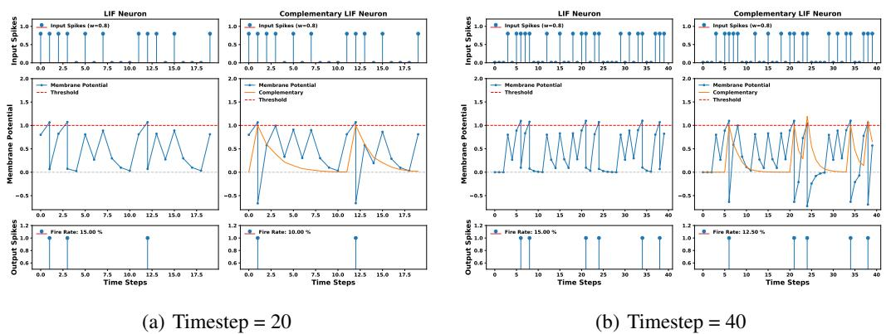  
Figure 7. The dynamic behavior of a single LIF and CLIF neuron at different timestep.

Secondly, we calculate the auto-correlation function using $\begin{array} { r } { R _ { x } [ k ] = { \frac { 1 } { N } } \sum _ { n = 0 } ^ { N - 1 } x [ n ] \cdot x [ n - k ] } \end{array}$ . The results are shown in We can observe that the auto-correlation value of the complementary membrane potential decays slower, and its period is longer. This suggests that CLIF can capture more and longer correlations in the temporal dimension than LIF.

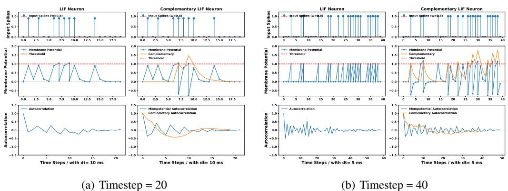  
Figure 8. The autocorrelation of a single LIF and CLIF neuron at different timestep.

Finally, CLIF shares more similarities to the Adaptive Threshold model (Bellec et al., 2020) than to the Current-Base model (Zenke & Ganguli, 2018). As for synaptic input current for both CLIF and adaptive threshold model take the form of $W s [ t ]$ , different from current-base model $\begin{array} { r } { \dot { I _ { \mathrm { s y n } } } [ t ] = \frac { 1 } { \tau } I _ { \mathrm { s y n } } [ t - 1 ] + W s [ t ] } \end{array}$ , adaptive threshold model uses a latent variable to adjust the neurons’ firing thresholds, whereas CLIF uses a latent variable (the complementary membrane potential) to adjust neurons reset strength.

# G. The Gradients of CLIF Neuron

The CLIF model can be rewritten as:

$$
\begin{array} { c } { { \pmb u ^ { l } [ t ] = \gamma \left( \pmb u ^ { l } [ t - 1 ] - \pmb s ^ { l } [ t - 1 ] \odot \left( V _ { \mathrm { t h } } + \sigma ( \pmb m ^ { l } [ t - 1 ] ) \right) \right) + W ^ { l } s ^ { l - 1 } [ t ] } } \\ { { \pmb s ^ { l } [ t ] = \Theta ( \pmb u ^ { l } [ t ] - V _ { \mathrm { t h } } ) } } \\ { { \pmb m ^ { l } [ t ] = \pmb m ^ { l } [ t - 1 ] \odot \sigma \left( \frac { 1 } { \tau } \pmb u ^ { l } [ t ] \right) + \pmb s ^ { l } [ t ] } } \end{array}
$$

where defined $\begin{array} { r } { \gamma \equiv 1 - \frac { 1 } { \tau } } \end{array}$ , then the gradients at $l$ layer is calculated as:

$$
\nabla _ { \mathbf { } W ^ { l } } \mathcal { L } = \sum _ { t = 1 } ^ { T } \frac { \partial \mathcal { L } } { \partial \mathbf { } \mathbf { } u ^ { l } [ t ] } \frac { \partial \mathbf { } u ^ { l } [ t ] } { \partial \mathbf { } W ^ { l } } , l = \mathrm { L } , \mathrm { L } - 1 , \cdots , 1 .
$$

Where the right part could be deduced as:

$$
\frac { \partial { \pmb u } ^ { l } [ t ] } { \partial { \pmb W } ^ { l } } = { \pmb s } ^ { l - 1 } [ t ]
$$

For the left part, we recursively evaluate:

$$
\frac { \partial \mathcal { L } } { \partial u ^ { l } [ t ] } = \frac { \partial \mathcal { L } } { \partial s ^ { l } [ t ] } \frac { \partial s ^ { l } [ t ] } { \partial u ^ { l } [ t ] } + \frac { \partial \mathcal { L } } { \partial u ^ { l } [ t + 1 ] } \left( \epsilon ^ { l } [ t ] + \frac { \partial u ^ { l } [ t + 1 ] } { \partial m ^ { l } [ t ] } \psi ^ { l } [ t ] \right) _ { , } + \quad \quad \quad \frac { \partial \mathcal { L } } { \partial m ^ { l } [ t ] } \psi ^ { l } [ t ] ,
$$

| {z }Temporal Gradients of Complementary

The eligibility, this terminology mainly refers to e-prop (Bellec et al., 2020), STBP (Wu et al., 2018). From the LIF model, the equation can be deduced as:

$$
\epsilon ^ { l } [ t ] \equiv \frac { \partial { \pmb u } ^ { l } [ t + 1 ] } { \partial { \pmb u } ^ { l } [ t ] } + \frac { \partial { \pmb u } ^ { l } [ t + 1 ] } { \partial { \pmb s } ^ { l } [ t ] } \frac { \partial { \pmb s } ^ { l } [ t ] } { \partial { \pmb u } ^ { l } [ t ] }
$$

The Complementary will also introduce the $\psi ^ { l } [ t ]$ :

$$
\begin{array} { r l } & { \psi ^ { l } [ t ] \equiv \underbrace { \partial m ^ { l } [ t ] } _ { \geq 0 } + \underbrace { \partial m ^ { l } [ t ] } _ { \geq s ^ { l } [ t ] } \frac { \partial s ^ { l } [ t ] } { \partial { u ^ { l } } [ t ] } } \\ & { \qquad = \underbrace { \frac { 1 } { \tau } m ^ { l } [ t - 1 ] } _ { \geq 0 } \odot \underbrace { \sigma ^ { \prime } \left( \frac { 1 } { \tau } { u ^ { l } [ t ] } \right) } _ { \in ( 0 , 1 ) } + \underbrace { { \mathbb H } \left( { u ^ { l } [ t ] } \right) } _ { \geq 0 } } \end{array}
$$

Besides, the Complementary gradient line will introduce the recursively part:

$$
\frac { \partial \mathcal { L } } { \partial m ^ { l } [ t ] } = \frac { \partial \mathcal { L } } { \partial \boldsymbol { u } ^ { l } [ t + 1 ] } \frac { \partial \boldsymbol { u } ^ { l } [ t + 1 ] } { \partial \boldsymbol { m } ^ { l } [ t ] } + \frac { \partial \mathcal { L } } { \partial \boldsymbol { m } ^ { l } [ t + 1 ] } \left( \frac { \partial \boldsymbol { m } ^ { l } [ t + 1 ] } { \partial \boldsymbol { m } ^ { l } [ t ] } + \psi ^ { l } [ t + 1 ] \frac { \partial \boldsymbol { u } ^ { l } [ t + 1 ] } { \partial \boldsymbol { m } ^ { l } [ t ] } \right)
$$

To better understand the eligibility in Eq.45 and Eq.48, we can refer to the following Figure.9:

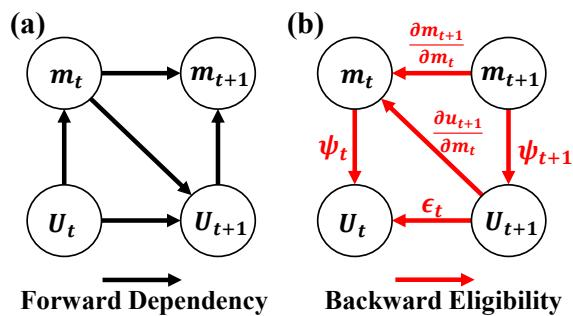  
Figure 9. The abstract expression of (a) forward dependency and (b) backward eligibility trace for CLIF neuron.

Merging the Eq.45 and Eq.48 as matrix computing process:

$$
\begin{array} { r l } { \cdot } & { - \psi ^ { l } [ t ] \Bigg ] ~ \left[ \frac { \partial \mathcal { L } } { \partial u ^ { l } [ t ] } \right] ~ = ~ \left[ \epsilon ^ { l } [ t ] + \frac { \partial u ^ { l } [ t + 1 ] } { \partial m ^ { l } [ t ] } \psi ^ { l } [ t ] \right. ~ 0 } \\ { \left. ~ 0 ~ \right. ~ } & { \left. 1 ~ \right] ~ \left[ \frac { \partial \mathcal { L } } { \partial m ^ { l } [ t ] } \right] ~ = ~ \left[ \epsilon ^ { l } [ t ] + \frac { \partial u ^ { l } [ t + 1 ] } { \partial m ^ { l } [ t ] } \frac { \partial m ^ { l } [ t + 1 ] } { \partial m ^ { l } [ t ] } + \psi ^ { l } [ t + 1 ] \frac { \partial u ^ { l } [ t + 1 ] } { \partial m ^ { l } [ t ] } \right] ~ \left[ \frac { \partial \mathcal { L } } { \partial m ^ { l } [ t + 1 ] } \right] ~ + ~ \left[ \frac { \partial \mathcal { L } } { \partial s } \right] ~ \psi ^ { l } [ t ] ~ \psi ^ { l } [ t ] ~ \psi ^ { l } ( t + 1 ) ~ } \end{array}
$$

where the blue part is the original gradient of the LIF neuron, and the other parts are introduced by Complementary.

Firstly, we first recursively expand the Eq.48:

$$
\begin{array} { r l } & { \quad \frac { \partial C } { \partial \alpha } \frac { \partial \alpha ^ { [ i ] } ( t + 1 ) } { \partial \alpha ^ { [ i ] } } + \underbrace { \frac { \partial C } { \partial \alpha ^ { [ i ] } } } _ { \partial \alpha ^ { [ j ] } } \frac { \partial \alpha ^ { [ j ] } ( t + 2 ) } { \partial \alpha ^ { [ i ] } ( t + 1 ) } - \underbrace { \frac { \partial C } { \partial \alpha ^ { [ j ] } } \frac { \partial ^ { j } [ k _ { + } ] } { \partial \alpha ^ { [ j ] } } } _ { \le \alpha \alpha ^ { [ i ] } ( t + 1 ) } \rho ^ { j [ j ] } } \\ &  - \underbrace { \beta C } _ { \partial \alpha ^ { [ j ] } } \frac { \partial \alpha ^ { [ i ] } [ t + 1 ] } { \partial \alpha ^ { [ j ] } [ t ] ! } + \underbrace { \frac { \partial C } { \partial \alpha ^ { [ j ] } } \frac { \partial \alpha ^ { [ i ] } [ t + 2 ] } { \partial \alpha ^ { [ j ] } [ t ] ! } + \frac { \partial ^ { [ j ] } C } { \partial \alpha ^ { [ j ] } [ t ] ! } + \underbrace { \frac { \partial C } { \partial \alpha ^ { [ j ] } } \frac { \partial ^ { j } [ k _ { + } ] } { \partial \alpha ^ { [ j ] } } } _ { \le \alpha ^ { [ j ] } \alpha ^ { [ i ] } + 1 } \rho ^ { j [ j ] } } \\ &  \qquad - \underbrace { \beta C } _ { \partial \alpha ^ { [ i ] } ( t + 1 ) } \frac { \partial \alpha ^ { [ i ] } [ t + 1 ] } { \partial \alpha ^ { [ j ] } [ t ] ! } + \underbrace  \frac { \partial C } { \partial \alpha ^ { [ j ] } } \frac { \partial \alpha ^ { [ i ] } [ t + 2 ] } { \partial \alpha ^ { [ j ] } [ t ] ! } + \underbrace { \frac { \partial C } { \partial \alpha ^ { [ j ] } } \frac { \partial \alpha ^ { [ i ] } [ t + 3 ] } { \partial \alpha ^ { [ j ] } [ t ] ! } } _ { \le \alpha ^ { [ j ] } ( t + 1 ) } \rho ^ { j [ j ] } [ 1 \ + 1 ] \rho ^  \end{array}
$$

By mathematical induction, we can deduce that:

$$
\frac { \partial \mathcal { L } } { \partial \boldsymbol { m } ^ { l } [ t ] } = \sum _ { t ^ { \prime } = t + 1 } ^ { T } \frac { \partial \mathcal { L } } { \partial \boldsymbol { u } ^ { l } [ t ^ { \prime } ] } \frac { \partial \boldsymbol { u } ^ { l } [ t ^ { \prime } ] } { \partial \boldsymbol { m } ^ { l } [ t ^ { \prime } - 1 ] } \prod _ { t ^ { \prime \prime } = 2 } ^ { t ^ { \prime } - t } \rho ^ { l } [ t ^ { \prime } - t ^ { \prime \prime } ]
$$

Secondly, we recursively expand the Eq.(45):

$$
\begin{array} { r l } & { \frac { \partial \mathcal { L } } { \partial \boldsymbol { u } ^ { \prime } [ \boldsymbol { t } ] } = \underbrace { \frac { \partial \mathcal { L } } { \partial s ^ { L } [ \boldsymbol { t } ] } \frac { \partial s ^ { L } [ \boldsymbol { t } ] } { \partial \boldsymbol { u } ^ { L } [ \boldsymbol { t } ] } } _ { S y \mathrm { a n i a l } \downarrow \mathrm { ( } \pi \mathrm { f } \mathrm { f l } \mathrm { e } \mathrm { i } \mathrm { e n t } \mathrm { ( } \boldsymbol { t } ^ { \prime } \mathrm { I } + 1 \mathrm { \Gamma } ( \epsilon ^ { \prime } [ \boldsymbol { t } | \boldsymbol { t } ] + \frac { \partial \boldsymbol { u } ^ { \prime } [ \boldsymbol { t } + 1 ] } { \partial m ^ { L } [ \boldsymbol { t } ] } \psi ^ { \prime } [ \boldsymbol { t } ] ) } + \underbrace { \frac { \partial \mathcal { L } } { \partial m ^ { L } [ \boldsymbol { t } ] } \psi ^ { \prime } [ \boldsymbol { t } ] } _ { \tau \mathrm { r e m e a l i c } \mathrm { f l } \mathrm { e n t } \mathrm { r e m e a r s t a n y } } } \\ & { \quad = \frac { \partial \mathcal { L } } { \partial s ^ { L } [ \boldsymbol { t } ] } \frac { \partial s ^ { L } [ \boldsymbol { t } ] } { \partial \boldsymbol { u } ^ { L } [ \boldsymbol { t } ] } + \underbrace { \frac { \partial \mathcal { L } } { \partial \boldsymbol { u } ^ { \prime } [ \boldsymbol { t } ] } ( \epsilon ^ { L } [ \boldsymbol { t } | \boldsymbol { t } ] + \frac { \partial \boldsymbol { u } ^ { \prime } [ \boldsymbol { t } + 1 ] } { \partial m ^ { L } [ \boldsymbol { t } ] } \psi ^ { \prime } [ \boldsymbol { t } ] ) } _ { \mathrm { c y n a m s t } } + \frac { \partial \mathcal { L } } { \partial m ^ { L } [ \boldsymbol { t } ] } \psi ^ { \prime } [ \boldsymbol { t } ] } \\ &  \quad \quad - \frac { \partial \mathcal { L } } { \partial s ^ { L } [ \boldsymbol { t } ] } \frac { \partial s ^ { L } [ \boldsymbol { t } ] } { \partial \boldsymbol { u } ^ { L } [ \boldsymbol { t } ] } + ( \frac { \partial \mathcal { L } } \end{array}
$$

$$
\begin{array} { r l } & { \mathcal { D } \overline { { u } } \overline { { u } } [ \overline { { t } } ] + \frac { \partial \overline { { u } } [ \Gamma ] } { \partial \overline { { u } } [ \Gamma ] } \{ \begin{array} { l } { c \overline { { u } } [ \bar { t } ] + \frac { \partial \overline { { u } } [ \Gamma ] } { \partial \overline { { u } } [ \Gamma ] } \overline { { { \epsilon } } } [ \bar { t } ] \} + \overline { { \partial \overline { { u } } [ \Gamma ] } } \overline { { { \epsilon } } } [ \bar { t } ] } \\ { \mathcal { D } \overline { { u } } [ \bar { t } ] } \end{array} } \\ & { \mathcal { D } \delta \overline { { c } } [ \overline { { t } } ] + ( \begin{array} { l } { \partial \overline { { u } } [ \bar { t } ] + \frac { \partial \overline { { u } } [ \Gamma ] } { \partial \mathcal { E } } [ \bar { t } ] + 1 } \\ { \partial \overline { { u } } [ \Gamma ] + 1 } \end{array} ) \delta \overline { { c } } [ \bar { t } ] + \frac { \partial \overline { { c } } [ \bar { t } ] } { \partial \overline { { u } } [ \Gamma ] } \{ \begin{array} { l } { \partial \overline { { u } } [ \bar { t } ] + \partial \overline { { c } } [ \bar { t } ] } \\ { \partial \overline { { u } } [ \Gamma ] + \partial \overline { { c } } [ \bar { t } ] } \end{array} \} \delta \overline { { c } } [ \bar { t } ] + \frac { \partial \overline { { c } } [ \bar { t } ] } { \partial \overline { { u } } [ \Gamma ] } } \\ &  \mathcal { D } \delta \overline { { c } } [ \overline { { t } } ] + \frac { \partial \overline { { c } } [ \Gamma ] } { \partial \overline { { u } } [ \Gamma ] } \{ \begin{array} { l }  c \overline { { u } } [ \bar { t } ] + \frac { \partial \overline { { c } } [ \Gamma ] } { \partial \overline { { u } } [ \Gamma ] } \{ \begin{array} { l }  c \overline { { u } } [ \bar { t } ] + \overline { { c } } [  \end{array} \end{array} \end{array}
$$

Note that similar items in Eq.(52) can be merged as:

$$
\begin{array} { r l } & { \quad \frac { \partial C } { \partial \alpha ^ { \prime } } \frac { \partial \xi ^ { \prime } [ \xi ] } { \partial \alpha ^ { \prime } \Gamma ( \frac { \partial \xi } { \partial \xi } ) } + \frac { \partial C } { \partial \alpha ^ { \prime } \Gamma ( \frac { \partial \xi } { \partial \xi } ) } \psi _ { 1 } ^ { * } \dag +  \frac { \partial C } { \partial \alpha ^ { \prime } \Gamma ( 1 + | \alpha | ^ { 2 } | \Gamma ( \frac { \partial \xi } { \partial \xi } ) \Gamma ( \frac { \partial \xi } { \partial \xi } ) \Gamma ( \frac { \partial \xi } { \partial \xi } ) } + \frac { \partial C } { \partial \alpha ^ { \prime } \Gamma ( \frac { \partial \xi } { \partial \xi } ) } \psi _ { 1 } ^ { * } | - \psi _ { 1 } ^ { * } |  \xi ^ { \prime } |  } \\ & { \quad + \cdots ( \frac { \partial C } { \partial \alpha ^ { \prime } \Gamma ( \frac { \partial \xi } { \partial \xi } ) } \frac { \partial \xi } { \partial \alpha ^ { \prime } \Gamma ( \frac { \partial \xi } { \partial \xi } ) } + \frac { \partial C } { \partial \alpha ^ { \prime } \Gamma ( \frac { \partial \xi } { \partial \xi } ) } \psi _ { 1 } ^ { * } | \Gamma ) \xi ^ { \prime } | \Gamma - 1 \xi ^ { \prime } - 2 | \xi - 5 | \xi - 1 | \xi ^ { \prime } | \xi | } \\ &  \quad - \frac { \partial C } { \partial \alpha ^ { \prime } \Gamma ( \frac { \partial \xi } { \partial \xi } ) } \frac { \partial \xi } { \partial \alpha ^ { \prime } \Gamma ( \frac { \partial \xi } { \partial \xi } ) } \frac { \partial \xi } { \partial \alpha ^ { \prime } \Gamma ( \frac { \partial \xi } { \partial \xi } ) } \frac { \partial \xi } { \partial \alpha ^ { \prime } \Gamma ( \frac { \partial \xi } { \partial \xi } ) } [ \ \end{array}
$$

Here again, the gradient of the original LIF neuron is plotted in blue. We can intuitively see that the temporal gradient contributions from the Complementary component are more significant than those from LIF. Even in the worst case all of $\Pi \pmb { \xi }  0$ , $\frac { \partial \mathcal { L } } { \partial m ^ { l } [ t ] }$ also provides the sum of all temporal gradients as shown in Figure.(51), like shortcut at temporal dimension.

# H. The Loss Comparing between LIF and CLIF

Following Figure.3 we extend the loss comparison to various tasks and network backbones. The results are shown in Figure.10, CLIF neuron’s loss converges faster than LIF’s, the converged loss is also lower. This tendency demonstrates the advantage of the CLIF neuron model.

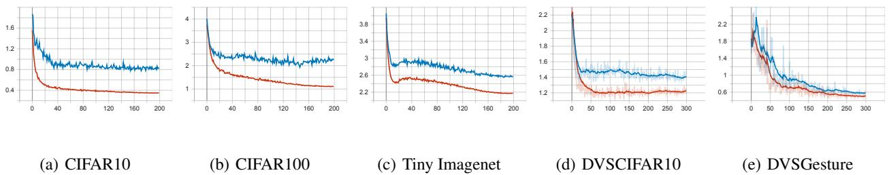  
Figure 10. Testing loss curves of the training process of LIF-based and CLIF-based for each tasks.

# I. Experiment Description and Dataset Pre-processing

Unless otherwise specified or for the purpose of comparative experiments, the experiments in this paper adhere to the following settings and data preprocessing: all our self-implementations use Rectangle surrogate functions with $\alpha = V _ { \mathrm { t h } } = 1$ , and the decay constant $\tau$ is set to 2.0. All random seed settings are 2022. For all loss functions, we use the TET (Deng et al., 2021) with a 0.05 loss lambda, as implemented in (Meng et al., 2023). The following are the detailed default setups and dataset descriptions.

Table 5. Training hyperparameters   

<table><tr><td>Dataset</td><td>Optimizer</td><td>Weight Dacay</td><td>Batch Size</td><td>Epoch</td><td>Learning Rate</td></tr><tr><td>CIFAR10</td><td>SGD</td><td>5e-5</td><td>128</td><td>200</td><td>0.1</td></tr><tr><td>CIFAR100</td><td>SGD</td><td>5e-4</td><td>128</td><td>200</td><td>0.1</td></tr><tr><td>Tiny ImageNet</td><td>SGD</td><td>5e-4</td><td>256</td><td>300</td><td>0.1</td></tr><tr><td>DVSCIFAR10</td><td>SGD</td><td>5e-4</td><td>128</td><td>300</td><td>0.05</td></tr><tr><td>DVSGesture</td><td>SGD</td><td>5e-4</td><td>16</td><td>300</td><td>0.1</td></tr></table>

CIFAR-10/100 The CIFAR-10 and CIFAR-100 datasets (Krizhevsky et al., 2009) contain $6 0 { , } 0 0 0 \ 3 2 { \times } 3 2$ color images in 10 and 100 different classes respectively, with each dataset comprising 50,000 training samples and 10,000 testing samples. We normalize the image data to ensure that input images have zero mean and unit variance. For data preprocessing, we directly follow this work (Meng et al., 2023). We apply random cropping with padding of 4 pixels on each border of the image, random horizontal flipping, and cutout (DeVries & Taylor, 2017). Direct encoding (Rathi & Roy, 2021) is employed to encode the image pixels into time series, wherein pixel values are applied repeatedly to the input layer at each timestep. For the CIFAR classification task, we use Spiking-Resnet18 as the backbone.

Tiny-ImageNet Tiny-ImageNet contains 200 categories and $1 0 0 , 0 0 0 6 4 \times 6 4$ colored images for training, which is a more challenging static image dataset than CIFAR datasets. To augment Tiny-ImageNet datasets, we take the same AutoAugment (Cubuk et al., 2019) as used in this work (Wang et al., 2023), but we do not adopt Cutout (DeVries & Taylor, 2017). For the Tiny-ImageNet classification task, we use Spiking-VGG13 as the backbone.

DVSCIFAR10 The DVS-CIFAR10 dataset (Li et al., 2017) is a neuromorphic dataset converted from CIFAR-10 using a DVS camera. It contains 10,000 event-based images with pixel dimensions expanded to $1 2 8 \times 1 2 8$ . The event-to-frame integration is handled with the SpikingJelly (Fang et al., 2023) framework. We do not apply any data augmentation for DVSCIFAR10 and the Spiking-VGG11 is used as the backbone to compare the performance.

DVSGesture The DVS128 Gesture dataset (Amir et al., 2017) is a challenging neuromorphic dataset that records 11 gestures performed by 29 different participants under three lighting conditions. The dataset comprises 1,342 samples with an average duration of $6 . 5 \pm 1 . 7$ s and all samples are split into a training set (1208 samples) and a test set (134 samples). We follow the method described in (Fang et al., 2021b) to integrate the events into frames. The event-to-frame integration is handled with the SpikingJelly (Fang et al., 2023) framework. We do not applied any data augmentation for DVSGesture and the Spiking-VGG11 is used as the backbone to compare the performance.

# J. Evaluation of Fire Rate and Energy Consumption

We calculate the fire rate as well as the energy efficiency of all models for five tasks. As shown in Figure.11, the average fire rate of the CLIF model is lower than that of the LIF model. This lower fire rate results in fewer synaptic operations, as evidenced in Table.6.

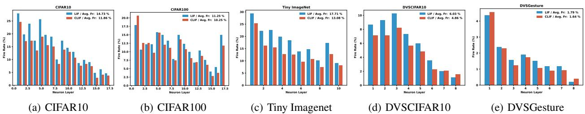  
Figure 11. The fire rate statistics after training of LIF-based and CLIF-based for each tasks.

For the evaluation of energy consumption, we follow the convention of the neuromorphic computing community by counting the total synaptic operations (SOP) to estimate the computation overhead of SNN models and compare it to the energy consumption of the ANN counterpart, as done in (Zhou et al., 2022; Yao et al., 2024). Specifically, the SOP with MAC presented in ANNs is constant given a specified structure. However, the SOP in SNN varies with spike sparsity. For SNNs, since the input is binary, the synaptic operation is mostly accumulation (ACs) instead of multiply and accumulation (MACs). ACs is defined as

$$
A C _ { s } = \sum _ { t = 1 } ^ { T } \sum _ { l = 1 } ^ { L - 1 } \sum _ { i = 1 } ^ { N ^ { l } } f _ { i } ^ { l } s _ { i } ^ { l } [ t ]
$$

where fan-out $f _ { i } ^ { l }$ is the number of outgoing connections to the subsequent layer, and $N ^ { l }$ is the neuron number of the $l$ -th layer. For ANNs, the similar synaptic operation MACs with more expensive multiply-accumulate is defined as:

$$
M A C _ { s } = \sum _ { l = 1 } ^ { L - 1 } \sum _ { i = 1 } ^ { N ^ { l } } f _ { i } ^ { l }
$$

Here, we select all the testing datasets and estimate the average SOP for SNNs. Meanwhile, we measure 32-bit floating-point ACs by $0 . 9 \mathrm { p J }$ per operation and 32-bit floating-point MAC by $4 . 6 \mathrm { p J }$ per operation, as done in (Han et al., 2015). All the results are summarized in the Table.6, SNN has a significant energy consumption advantage over ANNs. Notably, the ACs operation of CLIF are considerably less than those of LIF, attributable to the lower fire rate. In contrast, the MAC operations of CLIF exceed those of LIF due to the increased number of floating-point operations, a result of the Complementary component introduced in CLIF. The final results indicate that CLIF achieves comparable performance to ANNs models while maintaining similar total energy efficiency to LIF.

Table 6. The energy consumption of synaptic operation for different tasks with the whole testing datasets.   

<table><tr><td></td><td>Neuron</td><td>T</td><td>Parameters(M)</td><td>ACs (M)</td><td>MACs (M)</td><td>SOP Energy (μJ)</td></tr><tr><td rowspan="3">CIFAR10 (ResNet18)</td><td>ReLU</td><td>1</td><td>11.2</td><td>0</td><td>557.65</td><td>2565.19</td></tr><tr><td>CLIF</td><td>6</td><td>11.2</td><td>68.66</td><td>5.12</td><td>85.346</td></tr><tr><td>LIF</td><td>6</td><td>11.2</td><td>84.86</td><td>2.89</td><td>89.668</td></tr><tr><td rowspan="3">CIFAR100 (ResNet18)</td><td>ReLU</td><td>1</td><td>11.2</td><td>0</td><td>557.7</td><td>2565.42</td></tr><tr><td>CLIF</td><td>6</td><td>11.2</td><td>55.58</td><td>5.16</td><td>73.758</td></tr><tr><td>LIF</td><td>6</td><td>11.2</td><td>60.28</td><td>2.93</td><td>67.73</td></tr><tr><td rowspan="3">Tiny ImageNet (VGG13)</td><td>ReLU</td><td>1</td><td>14.4</td><td>0</td><td>922.56</td><td>4243.776</td></tr><tr><td>CLIF</td><td>6</td><td>14.4</td><td>102.1</td><td>282.83</td><td>1392.908</td></tr><tr><td>LIF</td><td>6</td><td>14.4</td><td>135.25</td><td>278.84</td><td>1404.389</td></tr><tr><td rowspan="2">DVSGesture (VGG11)</td><td>CLIF</td><td>20</td><td>9.5</td><td>19.16</td><td>1090</td><td>5031.244</td></tr><tr><td>LIF</td><td>20</td><td>9.5</td><td>25.09</td><td>1080</td><td>4990.581</td></tr><tr><td rowspan="2">DVSCIFAR10 (VGG11)</td><td>CLIF</td><td>10</td><td>9.5</td><td>12.02</td><td>153.87</td><td>718.62</td></tr><tr><td>LIF</td><td>10</td><td>9.5</td><td>14.65</td><td>152.5</td><td>714.685</td></tr></table>

To comprehensively and fairly evaluate the energy consumption (Dampfhoffer et al., 2022b), we recalculated and analyzed the energy consumption of the proposed CLIF neuron in more detail in Table 7. We considered memory read and write operations, as well as the data addressing process, as done in (Lemaire et al., 2022). As shown in Table 7, the memory accesses are actually the dominant factor in energy consumption for SNN. Although the hidden states of LIF and CLIF contribute significantly to the read and write energy consumption of the membrane potential, the sparsity of spikes also greatly reduces the parameters and synaptic operations. Therefore, the energy consumption of LIF and CLIF is still much lower than that of ANN. The detailed computing process can be found in the open-source code.

Table 7. The total energy consumption for different tasks. The neuron and time step are the same as those in Table 6.   

<table><tr><td rowspan="2"></td><td colspan="3">Mem. Read &amp; Write</td><td rowspan="2">Synaptic &amp; Neuron Op. (mJ)</td><td rowspan="2">Addr. (μJ)</td><td rowspan="2">Total (mJ)</td></tr><tr><td>Membrane Potential (mJ)</td><td>Parameters (mJ)</td><td>In / Out (mJ)</td></tr><tr><td rowspan="3">CIFAR10</td><td>0</td><td>54.9688</td><td>54.9357</td><td>1.7573</td><td>0.1145</td><td>111.6619</td></tr><tr><td>22.9987</td><td>11.4994</td><td>0.0013</td><td>0.0190</td><td>12.1394</td><td>34.5304</td></tr><tr><td>55.5172</td><td>9.2529</td><td>0.0007</td><td>0.0389</td><td>19.5184</td><td>64.8293</td></tr><tr><td rowspan="3">CIFAR100</td><td>0</td><td>54.9735</td><td>54.9357</td><td>1.7574</td><td>0.1145</td><td>111.6667</td></tr><tr><td>16.8666</td><td>8.4337</td><td>0.0004</td><td>0.0171</td><td>8.8427</td><td>25.3267</td></tr><tr><td>46.8265</td><td>7.8048</td><td>0.0004</td><td>0.0380</td><td>16.4053</td><td>54.6861</td></tr><tr><td rowspan="3">TinyImagenet</td><td>0</td><td>91.9065</td><td>91.3834</td><td>2.9379</td><td>0.1686</td><td>186.2279</td></tr><tr><td>37.7700</td><td>18.9076</td><td>0.0050</td><td>1.1754</td><td>19.8379</td><td>57.8778</td></tr><tr><td>84.8900</td><td>14.1756</td><td>0.0028</td><td>1.0986</td><td>29.7983</td><td>100.1968</td></tr><tr><td rowspan="2">DVSCIFAR10</td><td>5.7398</td><td>2.8701</td><td>0.0003</td><td>0.0212</td><td>2.9340</td><td>8.6343</td></tr><tr><td>14.0891</td><td>2.3484</td><td>0.0002</td><td>0.0451</td><td>4.7976</td><td>16.4876</td></tr><tr><td rowspan="2">DVSGesture</td><td>13.9212</td><td>6.9606</td><td>0.0003</td><td>0.1682</td><td>7.0728</td><td>21.0574</td></tr><tr><td>38.3082</td><td>6.3848</td><td>0.0003</td><td>0.4794</td><td>12.9767</td><td>45.1856</td></tr></table>

In addition, it is feasible to train a model using CLIF and subsequently deploy it or inference with LIF. We take pre-trained models of CLIF and LIF (Resnet18 with $\mathrm { T } { = } 6$ ) to perform inference on the CIFAR10 and CIFAR100 tasks. To compensate for CLIF’s enhanced reset process, we employ a hard reset with a bias as a hyperparameter. As can be seen in Table, this approach leads to an inference accuracy that surpasses that of a model directly trained with LIF.

Table 8. Directly convert the pre-trained CLIF/LIF model to an LIF neuron for inference.   

<table><tr><td rowspan=1 colspan=1>CIFAR10</td><td rowspan=1 colspan=1>Soft Reset Hard Reset</td></tr><tr><td rowspan=1 colspan=1>Reset Value</td><td rowspan=1 colspan=1>None          0        -0.02    -0.04    -0.06     -0.08     -0.1</td></tr><tr><td rowspan=1 colspan=1>CLIF pretrained (95.41%)</td><td rowspan=1 colspan=1>92.95 %    93.41 %   94.18 % 94.54 % 95.08 % 94.84 % 94.72 %</td></tr><tr><td rowspan=1 colspan=1>LIF pretrained (94.51%)</td><td rowspan=1 colspan=1>94.51 %    84.05 %   76.68 % 66.08 % 52.16 %  38.00 % 27.04 %</td></tr><tr><td rowspan=1 colspan=1>CIFAR100</td><td rowspan=1 colspan=1>Soft Reset Hard Reset</td></tr><tr><td rowspan=1 colspan=1>Reset Value</td><td rowspan=1 colspan=1>None          0        -0.02    -0.04    -0.06    -0.08     -0.1</td></tr><tr><td rowspan=1 colspan=1>CLIF pretrained (78.36 %)</td><td rowspan=1 colspan=1>68.72 %    73.04 %   74.64 % 76.63 % 76.55 % 77.00 % 76.54 %</td></tr><tr><td rowspan=1 colspan=1>LIF pretrained (76.23 %)</td><td rowspan=1 colspan=1>76.23 %    47.74 %   37.04 % 27.56 % 19.83 % 13.22 %  8.77 %</td></tr></table>