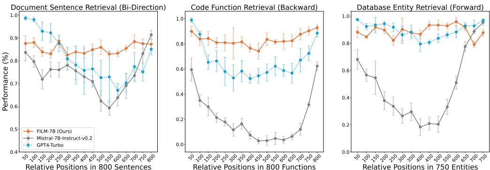
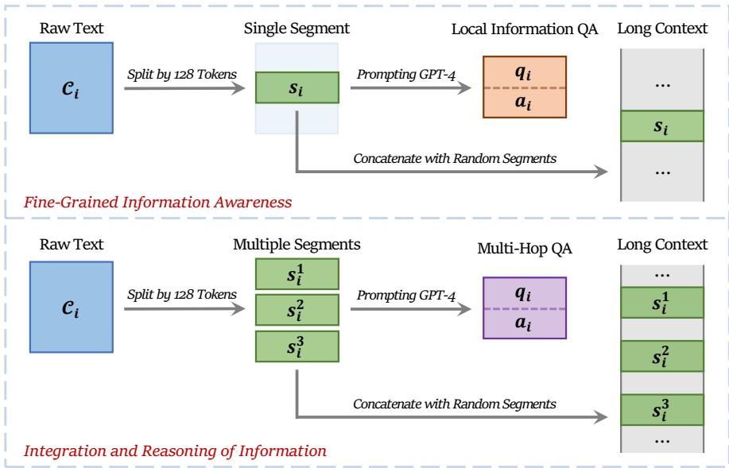
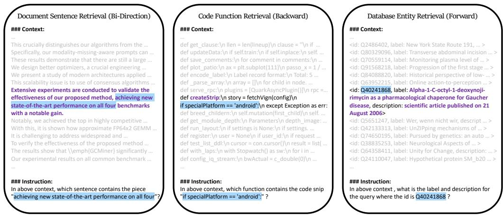
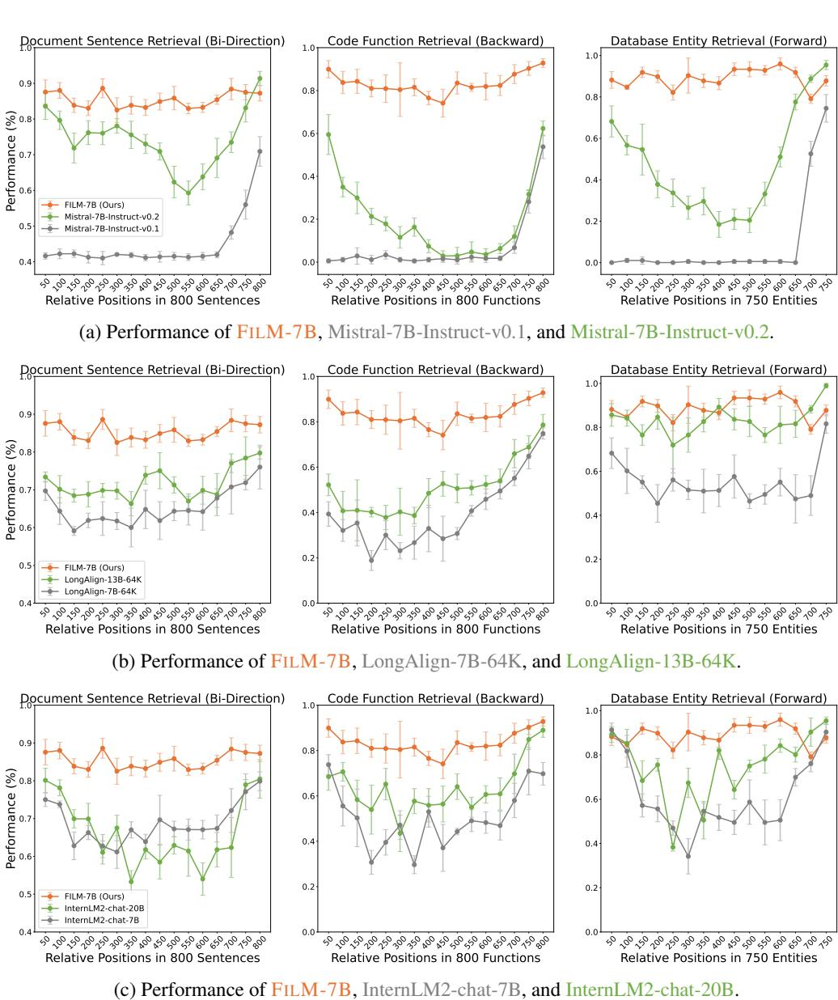
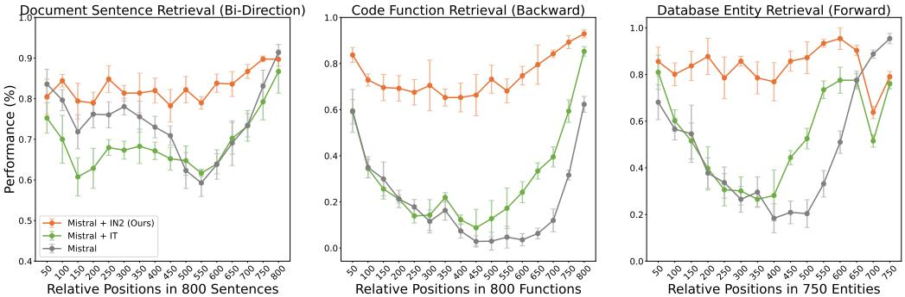
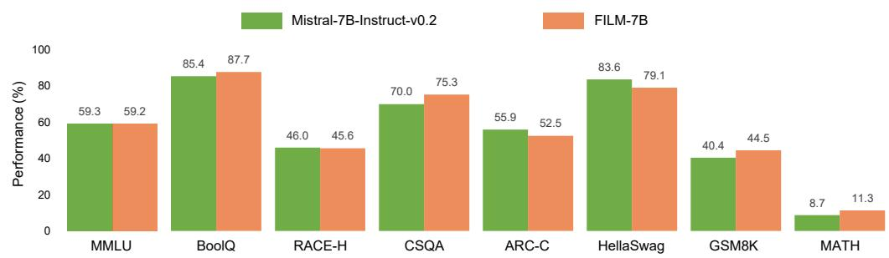
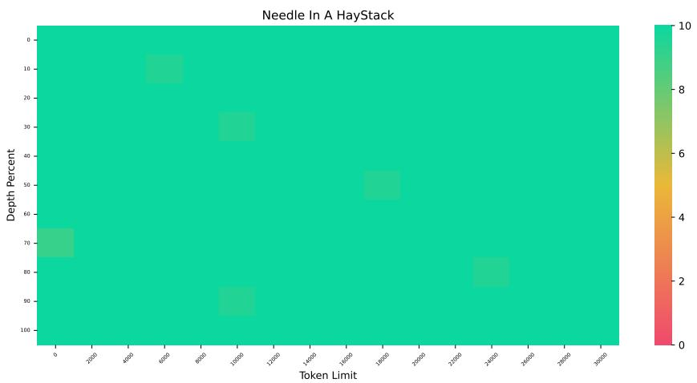
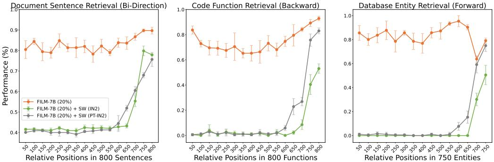
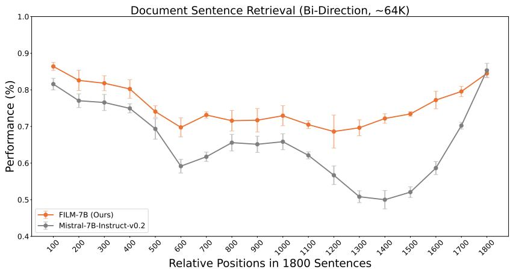

# Make Your LLM Fully Utilize the Context

Shengnan $\mathbf { A } \mathbf { n } ^ { * \diamondsuit , \ast }$ , Zexiong $\mathbf { M } \mathbf { a } ^ { * \bigcirc , * }$ , Zeqi $\mathbf { L i n } ^ { \dagger \mathbf { \delta } }$ , Nanning Zheng†♢, Jian-Guang Lou♣, Weizhu Chen♣ ♢National Key Laboratory of Human-Machine Hybrid Augmented Intelligence, National Engineering Research Center of Visual Information and Applications, Institute of Artificial Intelligence and Robotics, Xi’an Jiaotong University ♣Microsoft ♡Peking University

♢{an1006634493@stu,nnzheng@mail}.xjtu.edu.cn, ♡mazexiong@stu.pku.edu.cn, $\clubsuit$ {Zeqi.Lin,jlou,wzchen}@microsoft.com

# Abstract

While many contemporary large language models (LLMs) can process lengthy input, they still struggle to fully utilize information within the long context, known as the lost-in-the-middle challenge. We hypothesize that it stems from insufficient explicit supervision during the long-context training, which fails to emphasize that any position in a long context can hold crucial information. Based on this intuition, our study presents INformation-INtensive (IN2) training, a purely data-driven solution to overcome lost-in-the-middle. Specifically, IN2 training leverages a synthesized long-context question-answer dataset, where the answer requires (1) fine-grained information awareness on a short segment $\mathord { \sim } 1 2 8$ tokens) within a synthesized long context (4K−32K tokens), and (2) the integration and reasoning of information from two or more short segments. Through applying this information-intensive training on Mistral-7B, we present FILM-7B (FILlin-the-Middle). To thoroughly assess the ability of FILM-7B for utilizing long contexts, we design three probing tasks that encompass various context styles (document, code, and structured-data context) and information retrieval patterns (forward, backward, and bi-directional retrieval). The probing results demonstrate that FILM-7B can robustly retrieve information from different positions in its 32K context window. Beyond these probing tasks, FILM-7B significantly improves the performance on real-world long-context tasks (e.g., $2 3 . 5 \substack {  2 6 . 9 }$ F1 score on NarrativeQA), while maintaining a comparable performance on short-context tasks (e.g., $5 9 . 3  5 9 . 2 $ accuracy on MMLU).

# 1 Introduction

To a great mind, nothing is little.

—Arthur Conan Doyle

  
Figure 1: Performance of FILM-7B, Mistral-7B-Instruct-v0.2, and GPT4-Turbo on our three probing tasks. FILM-7B significantly overcomes the problem of information loss in the middle of the context.

tokens, thereby enabling these models to process extensive context as input. This extended training context window can enhance many real-world downstream tasks such as long-context question answering (Kocisk ˇ y et al., 2018; Dasigi et al., 2021; Bai et al., 2023) and summarization (Fabbri \` et al., 2019; Huang et al., 2021; Zhong et al., 2021).

However, recent studies have revealed that these long-context LLMs struggle to effectively and robustly utilize all the information provided in the context, known as the lost-in-the-middle challenge (Liu et al., 2024b; Xu et al., 2023). It implies that while the LLM can comprehend the information at the beginning and end of the long context, it often overlooks the information in the middle. This challenge could significantly hinder the development of long-context LLMs, as they even often fail to pass simple probing tasks such as Needle-in-the-Haystack and passkey retrieval (Mohtashami & Jaggi, 2024). Consequently, a pressing research question arises: how can we make long-context LLMs fully utilize the information in the long context?

We hypothesize that the root cause of lost-in-the-middle stems from the unintentional bias hidden in the general training data. In auto-regressive pre-training, the loss on predicting the next token is more likely to be influenced by a few nearby pre-tokens rather than long-distance tokens (Sharan et al., 2018; Sun et al., 2021). For supervised fine-tuning and alignment, the system message, which strongly influences the generation of the response, is typically presented at the beginning of the context (Touvron et al., 2023; Cai et al., 2024). As a result, the general training process may inadvertently introduce a position bias, suggesting that important information is always located at the beginning and end of the context.

Based on this hypothesis, our work introduces INformation-INtensive (IN2) training to explicitly teach the model that the crucial information can be intensively present throughout the context, not just at the beginning and end. IN2 training is a purely data-driven solution that utilizes a synthesized long-context question-answer dataset. The long context (ranging from 4K to 32K tokens) is concatenated from many short segments $\mathord { \sim } 1 2 8$ tokens), and the question-answer (QA) pairs ask for the information contained in one or more segments which are randomly placed in the long context. Specifically, we generate two types of questions, requiring (1) fine-grained information awareness on exactly one short segment, and (2) the integration and reasoning of information from two or more segments. These QA pairs are generated by prompting GPT-4-Turbo (OpenAI, 2023b) with the designed instructions and the raw segments.

By applying this information-intensive training on Mistral-7B (Jiang et al., 2023), we present FILM7B (FILl-in-the-Middle). To thoroughly assess the long-context information awareness of FILM-7B, we design three probing tasks encompassing various context styles (document, code, and structureddata context) and information retrieval patterns (forward, backward, and bi-directional retrieval). The probing results (Figure 1) demonstrate that IN2 training significantly overcomes the lost-in-themiddle problem for the backbone model. Moreover, it can enhance the open-source model to achieve comparable or even more robust performance compared with proprietary LLMs such as GPT-4-Turbo.

Beyond these probing tasks, the performance of FILM-7B on real-world long-context tasks also exhibits significant improvements (e.g., $2 3 . 5 \substack {  2 6 . 9 }$ F1 score on NarrativeQA (Kocisk ˇ y et al., 2018)). \` This demonstrates that the post-training on synthesized long-context data can be generalized to real-world scenarios. Moreover, FILM-7B maintains a comparable performance on short-context tasks compared with the vanilla backbone model (e.g., $5 9 . 3  5 9 . 2 $ accuracy on MMLU (Hendrycks et al., 2020)). This indicates that the short-context capability of FILM-7B is not compromised during training. Our further analysis explores how the sliding window strategy and the choice of RoPE base $\theta$ influence the performance of IN2 training.

  
Figure 2: The data construction process for IN2 training, aimed at enhancing the fine-grained information awareness (upper), and the integration and reasoning of information (lower).

# 2 Information-Intensive Training

This section introduces the construction of the dataset for IN2 training and the detailed training process of our model FILM-7B.

# 2.1 Training Data Construction

Overview. The IN2 training aims to explicitly teach the model that any position in a long context can contain crucial information. To achieve this goal, we construct a long-context question-answer training dataset $\mathbb { D } = \{ \mathcal { L } _ { i } , q _ { i } , a _ { i } \}$ , where the answer $a _ { i }$ to the question $q _ { i }$ requires the information contained in some short segments that are randomly placed in the whole long context $\mathcal { L } _ { i }$ .

Figure 2 illustrates an overview of the data construction process. Specifically, the training data $\mathbb { D }$ is constructed based on a general natural language corpus $\mathbb { C }$ . Given a raw text $\mathcal { C } _ { i } \in \mathbb { C }$ , we first generate a question-answer pair $( q _ { i } , a _ { i } )$ using a powerful LLM, then synthesize a long context $\mathcal { L } _ { i }$ that includes the necessary information from $\mathcal { C } _ { i }$ and other randomly sampled texts from $\mathbb { C }$ . We generate two types of question-answer pairs that require (1) the awareness of fine-grained information in the long context, and (2) the integration and reasoning of information appearing at different positions in the long context. We take the realnewslike subset from the C4 corpus (Raffel et al., 2020) as $\mathbb { C }$ and take GPT-4-Turbo (OpenAI, 2023b) as the LLM to generate QA pairs.

Fine-grained information awareness. We consider a 128-token segment as the minimum information unit of the context3. Given a raw text $\mathcal { C } _ { i }$ , we first randomly extract a 128-token segment $s _ { i }$ from it, then generate the $q _ { i } , a _ { i }$ and $\mathcal { L } _ { i }$ accordingly,

$$
( q _ { i } , a _ { i } ) \sim \mathrm { P r o m p t i n g } ( s _ { i } , I _ { f } ; \mathrm { L L M } ) , \quad \mathcal { L } _ { i } = \oplus \{ \mathrm { S h u f f e } ( s _ { i } , [ r _ { j } ] ) \} ,
$$

  
Figure 3: Three tasks in VAL Probing. The retrieval patterns are determined by the relative positions between the retrieval keywords and the information to be retrieved.

where $( q _ { i } , a _ { i } )$ is sampled by prompting the powerful LLM with the segment $s _ { i }$ and the instruction $I _ { f }$ , $\mathbb { \oplus \{ \cdot \} }$ represents the concatenation of the contained segments, and $\left[ r _ { j } \right]$ are randomly sampled from 128-token segments in $\mathbb { C }$ . Note that $I _ { f }$ instructs the LLM to make the question-answer pair highly specific to the information provided in $s _ { i }$ .

Integration and reasoning of information. Beyond utilizing each single segment, we consider to generate question-answer pairs for information contained in two or more segments. Following the setting of the minimum information unit above, we split a full text $\mathcal { C } _ { i }$ into a set of 128-token segments $[ s _ { i } ]$ , then generate the $q _ { i } , a _ { i }$ and $\mathcal { L } _ { i }$ accordingly,

$$
( q _ { i } , a _ { i } ) \sim \mathrm { P r o m p t i n g } ( [ s _ { i } ] , I _ { r } ; \mathrm { L L M } ) , \quad \mathcal { L } _ { i } = \oplus \{ \mathrm { S h u f f e } ( [ s _ { i } ] , [ r _ { j } ] ) \} ,
$$

where $I _ { r }$ instructs the LLM to generate a multi-hop question-answer pair that requires the information within at least two segments in $\left[ s _ { i } \right]$ . All segments in $[ s _ { i } ]$ and $[ r _ { j } ]$ are jointly shuffled, so the required segments may appear far apart in the context.

Context length balance and data mixture. To prevent length bias during IN2 training, we ensure the length of the long context $\mathcal { L } _ { i }$ is evenly distributed from 4K to 32K tokens. Such a length balance strategy can be implemented with restricted sampling on $[ r _ { j } ]$ , according to Equation 1 and 2. To alleviate catastrophic forgetting on short-context capabilities, we retain ${ \sim } 1 0 \%$ question-answer pairs with the original texts $\mathcal { C } _ { i }$ instead of converting them into a longer context, and add some general instruction-tuning data from the OpenOrca (Lian et al., 2023) dataset.

Overall, our dataset for IN2 training contains 1.1M long-context data for the fine-grained information awareness $( \sim 6 3 \% )$ , 300K long-context data for the integration and reasoning of information $( \sim 1 7 \% )$ , 150K short-context question-answer data $( \sim 9 \% )$ , and 200K general instruction-tuning data $( \sim 1 1 \% )$ . Appendix I contains the handcraft instructions for data generation. Appendix H illustrates some examples of our constructed long-context QA data. Appendix A describes the filtering strategy to avoid data contamination for evaluation.

# 2.2 Training Details

Using the training data constructed above, we further fine-tune the Mistral-7B-Instruct- $\mathrm { v 0 } . 2 ^ { 4 }$ (Jiang et al., 2023) to get our FILM-7B (FILl-in-the-Middle). We perform IN2 training in the instructiontuning paradigm: the long contexts and questions are used as instructions, and the loss on the answer parts are used to update the model. Appendix I contains the system template used for formatting the training data. For hyper-parameters, we set the global batch size as 128 and conduct one-epoch training with $\mathord { \sim } 1 4 \mathrm { K }$ training steps. We use the cosine learning rate decay with a 1e-6 maximum learning rate and $3 \%$ warm-up steps. The training process is conducted on 16 nodes of $8 \mathrm { x } 8 0 \mathrm { G }$ A100 GPUs with the full sharding strategy and cpu offload strategy implemented by pytorch FSDP (Zhao et al., 2023). One entire training process (for a single FILM-7B model) consumes ${ \sim } 3 0 0$ GPU days.

  
Figure 4: Performance of FILM-7B on VAL Probing and the comparisons with (a) Mistral, (b) LongAlign, and (c) InternLM2. The $\mathbf { X }$ -axis is the relative position in the context ${ \sim } 3 2 \mathrm { K }$ tokens).

# 3 Long-Context Probing

In this section, we first show the preliminary evaluation of FILM-7B on the Needle-in-the-Haystack and discuss about the inadequacies of this probing task. Subsequently, to comprehensively evaluate the long-context information awareness of FILM-7B, we introduce VArious Long-context (VAL) Probing. This includes three tasks that cover various context styles (document, code, and structureddata context) and information retrieval patterns (forward, backward, and bi-directional retrieval).

Table 1: Quantified performances of various models on VAL Probing.   

<table><tr><td rowspan="2">Model</td><td colspan="2">Document</td><td colspan="2">Code</td><td colspan="2">Database</td><td colspan="2">All</td></tr><tr><td>Avg</td><td>Gap↓</td><td>Avg</td><td>Gap↓</td><td>Avg</td><td>Gap↓</td><td>Avg</td><td>Gap</td></tr><tr><td>Mistral-7B-Instruct-v0.1 (Jiang et al., 2023)</td><td>44.8</td><td>29.9</td><td>6.8</td><td>53.2</td><td>8.8</td><td>74.5</td><td>20.1</td><td>52.5</td></tr><tr><td>Mistral-7B-Instruct-v0.2 (Jiang et al., 2023)</td><td>74.2</td><td>32.1</td><td>20.3</td><td>59.5</td><td>47.5</td><td>77.0</td><td>47.3</td><td>56.2</td></tr><tr><td>LongAlign-7B-64K (Bai et al., 2024)</td><td>65.3</td><td>16.9</td><td>39.3</td><td>56.0</td><td>55.0</td><td>36.2</td><td>53.2</td><td>36.4</td></tr><tr><td>LongAlign-13B-64K (Bai et al., 2024)</td><td>71.7</td><td>13.4</td><td>50.8</td><td>40.8</td><td>82.9</td><td>27.0</td><td>68.5</td><td>27.1</td></tr><tr><td>InternLM2-chat-7B (Cai et al., 2024)</td><td>68.8</td><td>18.7</td><td>50.2</td><td>44.1</td><td>61.2</td><td>57.1</td><td>60.1</td><td>40.0</td></tr><tr><td>InternLM2-chat-20B (Cai et al., 2024)</td><td>66.4</td><td>27.2</td><td>63.4</td><td>45.5</td><td>74.9</td><td>57.2</td><td>68.2</td><td>43.3</td></tr><tr><td>GPT-4-Turbo (OpenAI, 2023b)</td><td>81.3</td><td>31.7</td><td>66.1</td><td>46.5</td><td>89.6</td><td>18.0</td><td>79.0</td><td>32.1</td></tr><tr><td>FILM-7B (ours)</td><td>85.4</td><td>6.1</td><td>83.3</td><td>18.7</td><td>89.0</td><td>16.8</td><td>85.9</td><td>13.9</td></tr></table>

# 3.1 Near-Perfect Performance on Needle-in-the-Haystack: Are We There Yet?

The Needle-in-the-Haystack (Ivgi et al., 2023; Liu et al., 2024b) is widely used to assess how robustly a model utilizes information positioned in the long context. It reveals that even some powerful proprietary LLMs, such as GPT-4 and Claude 2.1 (Anthropic, 2023), struggle to fully exploit the information within the long context.

We use the Needle-in-the-Haystack task5 to preliminarily evaluate the long-context capability of FILM-7B. Appendix B demonstrates that FILM-7B has achieved near-perfect performance on this task. This result is not surprising as recent open-source LLMs, such as LongAlign (Bai et al., 2024) and InternLM2 (Cai et al., 2024), have also shown near-perfect performance on this task.

However, the near-perfect performance on Needle-in-the-Haystack may overestimate the long-context capabilities of LLMs (Lei et al., 2024; Hsieh et al., 2024). Specifically, we have the following two concerns:

• Needle-in-the-Haystack employs a document-style context, which LLMs could be quite familiar with due to the pre-training on natural language corpora.   
• The forward retrieval pattern in Needle-in-the-Haystack may simplify the difficulty of information seeking in the long context.

The “forward retrieval” means that the information being retrieved directly follows the retrieval keyword in a long context. For example, the default question used in Needle-in-the-Haystack is "What is the best thing to do in San Francisco?" and the answer is contained in "The best thing to do in San Francisco is eat a sandwich and sit in Dolores Park on a sunny day." The retrieved information "eat a sandwich and ..." just follows the retrieval keywords "best thing to do in San Francisco". According to the mechanism of induction head (Olsson et al., 2022), such a following-up copying is an easily learned pattern for LLMs, thus less challenging for evaluating long context utilization (just like the observation of “reversal curse” (Berglund et al., 2024)).

Given these considerations, we suggest that performances on Needle-in-the-Haystack may not adequately reflect the long-context capabilities of LLMs. Therefore, we propose VAL Probing for a more comprehensive evaluation involving various context styles and retrieval patterns.

# 3.2 VAL Probing

Our retrieval-based VAL Probing considers three context styles (document, code, and structured-data context) and three retrieval patterns (forward, backward, and bi-directional retrieval). Each context in VAL Probing contains ${ \sim } 3 2 \mathrm { K }$ tokens, and each task contains ${ \sim } 3 \mathrm { K }$ examples. Figure 3 briefly illustrates the contexts and retrieval instructions in VAL Probing.

Document Sentence Retrieval (Bi-Direction). The contexts consist of numerous natural language sentences, and the instruction aims to retrieve a single sentence containing a given piece. The sentences are sampled from the abstracts of papers on arXiv6. This task follows the bi-directional retrieval pattern, as the expected retrieval results contain words both before and after the given piece in the context. The evaluation metric is the word-level recall score.

  
Figure 5: Compare the performance of IN2 training and general instruction tuning (IT). Both two training process takes the same number of training instances $20 \%$ of the full data size, 300K examples). Compare with Mistral $^ +$ IN2 training, the gains from normal instruction tuning are marginal and unstable.

Table 2: Quantified comparison between IN2 training and normal instruction tuning.   

<table><tr><td rowspan="2">Model</td><td colspan="2">Document</td><td colspan="2">Code</td><td colspan="2">Database</td><td colspan="2">All</td></tr><tr><td>Avg</td><td>Gap↓</td><td>Avg</td><td>Gap↓</td><td>Avg</td><td>Gap↓</td><td>Avg</td><td>Gap↓</td></tr><tr><td>Mistral-7B-Instruct-v0.2 (Jiang et al., 2023)</td><td>74.2</td><td>32.1</td><td>20.3</td><td>59.5</td><td>47.5</td><td>77.0</td><td>47.3</td><td>56.2</td></tr><tr><td>+ Normal Instruction Tuning (Lian et al., 2023)</td><td>69.0</td><td>25.9</td><td>30.2</td><td>76.5</td><td>53.4</td><td>54.4</td><td>50.9</td><td>52.3</td></tr><tr><td>+ Information-Intensive Training (ours)</td><td>82.9</td><td>11.5</td><td>74.5</td><td>27.7</td><td>83.5</td><td>31.6</td><td>80.3</td><td>23.6</td></tr></table>

Code Function Retrieval (Backward). The contexts consist of Python functions, and the instruction aims to retrieve the function name for a given line of code within the function definition. The raw code functions are sampled from the StarCoder (Li et al., 2023c) dataset7. We randomly select three lines of definitions for each function. This task follows the backward retrieval pattern, as the function name always precedes the definition. The evaluation metric is the exact-match accuracy.

Database Entity Retrieval (Forward). The contexts contain lists of structured entities, each with three fields: ID, label, and description. The query aims to retrieve the label and description for a given ID. The entities are sampled from Wikidata 8. This task follows the forward retrieval pattern, as the label and description follow the ID. We take a relaxed exact-match accuracy as the metric: a 1 score is given if either the label or the description is exactly matched in the response, otherwise a 0 score.

# 4 Experiments and Analysis

We assess the long-context capability of FILM-7B on both probing tasks and real-world long-context tasks. Moreover, we investigate if the performance in short-context scenarios is affected.

# 4.1 Experimental Setup

Models. We mainly compare FILM-7B with long-context open-source models that have been trained with $\ge 3 2 \mathrm { K }$ context windows, including the Mistral (Jiang et al., 2023), LongChat (Li et al., 2023a), ChatGLM (Du et al., 2022), LongAlign (Bai et al., 2024), LongWanjuan (Lv et al., 2024), Yi (AI et al., 2024) and InternLM2 (Cai et al., 2024). We utilize the instruct/chat versions of these models as most of our evaluation tasks are under the zero-shot instruction-following paradigm. We also draw comparisons with popular proprietary LLMs such as GPT-3.5-Turbo (OpenAI, 2023a) and

Table 3: Performances of various models on real-world long-context tasks. Results of models with ∗ are reported in Bai et al. (2023) and Lv et al. (2024).   

<table><tr><td>Model</td><td colspan="9">NarrativeQA Qasper MultiFQA HotpotQA 2WikiMQA MuSiQue GovReport QMSum MultiNews Avg</td></tr><tr><td colspan="9">Close-Source</td></tr><tr><td>GPT-4-Turbo (OpenAI, 2023b)</td><td>33.0</td><td>50.7</td><td>52.7 68.5</td><td>64.3</td><td></td><td>49.1</td><td>33.9</td><td>25.4</td><td>44.7</td></tr><tr><td>GPT-3.5-Turbo* (OpenAI, 2023a)</td><td>23.6</td><td>43.3 52.3</td><td>51.6</td><td>37.7</td><td>26.9</td><td>29.5</td><td>23.4</td><td>26.7</td><td>35.0</td></tr><tr><td colspan="9">Open-Source</td></tr><tr><td>LongChat-v1.5-7B-32K* (Li et al., 2023a)</td><td>16.9</td><td>27.7 41.4</td><td>31.5</td><td>20.6</td><td>9.7</td><td>30.8</td><td>22.7</td><td>26.4</td><td>25.3</td></tr><tr><td>ChatGLM2-6B-32K* (Du et al., 2022)</td><td>21.1</td><td>31.5 46.2</td><td>25.3</td><td>20.8</td><td>9.8</td><td>32.4</td><td>24.0</td><td>26.5</td><td>26.4</td></tr><tr><td>LongAlign-7B-64K (Bai et al., 2024)</td><td>18.7</td><td>33.8 49.1</td><td>28.6</td><td>23.4</td><td>12.5</td><td>30.6</td><td>23.7</td><td>27.5</td><td>27.5</td></tr><tr><td>Mistral-7B-Instruct-v0.1 (Jiang et al., 2023)</td><td>19.6</td><td>33.2 38.8</td><td>42.9</td><td>31.2</td><td>17.4</td><td>27.5</td><td>22.4</td><td>26.6</td><td>28.9</td></tr><tr><td>Mistral-7B-Instruct-v0.2 (Jiang et al., 2023)</td><td>23.5</td><td>33.8 45.9</td><td>42.4</td><td>24.3</td><td>20.8</td><td>33.3</td><td>24.8</td><td>26.8</td><td>30.6</td></tr><tr><td>Yi-6B-200K* (AI et al., 2024)</td><td>12.4</td><td>26.4 36.8</td><td>46.6</td><td>40.4</td><td>25.8</td><td>29.3</td><td>20.7</td><td>27.1</td><td>29.5</td></tr><tr><td>ChatGLM3-6B-32K* (Du et al., 2022)</td><td>9.2</td><td>43.1 50.9</td><td>55.3</td><td>43.7</td><td>38.9</td><td>36.0</td><td>24.7</td><td>27.4</td><td>36.6</td></tr><tr><td>InternLM2-chat-7B (Cai et al., 2024)</td><td>24.4</td><td>35.4 50.2</td><td>52.4</td><td>48.2</td><td>30.5</td><td>33.6</td><td>25.3</td><td>29.0</td><td>36.5</td></tr><tr><td>InternLM2-7B-LongWanjuan* (Lv et al., 2024)</td><td>29.9</td><td>39.6</td><td>50.2 53.7</td><td>42.3</td><td>32.1 39.0</td><td>33.0</td><td>25.5</td><td>27.8</td><td>37.1</td></tr><tr><td>FILM-7B (ours)</td><td>26.9</td><td>42.2</td><td>56.0</td><td>62.1</td><td>47.0</td><td>33.8</td><td>25.1</td><td>26.9</td><td>39.9</td></tr></table>

Table 4: Model performances on few-shot learning tasks.   

<table><tr><td>Model</td><td></td><td></td><td>TREC TriviaQA SAMSum Average</td><td></td></tr><tr><td>GPT4-Turbo (OpenAI, 2023b)</td><td>77.0</td><td>91.7</td><td>39.7</td><td>69.5</td></tr><tr><td>Mistral-7B-Instruct-v0.2 (Jiang et al., 2023)</td><td>71.0</td><td>84.5</td><td>35.8</td><td>63.8</td></tr><tr><td>FILM-7B (ours)</td><td>76.0</td><td>90.0</td><td>39.5</td><td>68.5</td></tr></table>

GPT-4-Turbo (OpenAI, 2023b). All models and tasks employ greedy decoding. For probing tasks, we primarily compare FILM-7B with LongAlign and InternLM2 series, as these models have shown near-perfect performances on Needle-in-the-Haystack.

Real-world long-context tasks. We take 9 tasks from the LongBench (Bai et al., 2023) collection to evaluate the long-context capability on real-world scenarios. These tasks encompass long-document question answering (NarrativeQA (Kocisk ˇ y et al., 2018), Qasper (Dasigi et al., 2021) and Multi- \` FieldQA (MultiFQA) (Bai et al., 2023), multi-document multi-hop reasoning (HotpotQA (Yang et al., 2018), 2WikiMultihopQA (2WikiMQA) (Ho et al., 2020) and MuSiQue (Trivedi et al., 2022)), and long-context summarization (GovReport (Huang et al., 2021), QMSum (Zhong et al., 2021) and MultiNews (Fabbri et al., 2019)). We employ the middle truncation strategy in LongBench to limit the input within 32K tokens. We report ROUGE-L (Lin, 2004) for summarization tasks and F1 scores for other tasks. The evaluation metrics are computed using the official evaluation scripts 9.

Despite these QA and summarization tasks, we also conduct evaluations on few-shot learning tasks, in which the contexts could also be extremely lengthy if there are many "few-shot" examples presented in the context. We take three in-context learning tasks from LongBench, including TREC (Li & Roth, 2002) for few-shot classification, TriviaQA (Joshi et al., 2017) for few-shot QA, and SAMSum (Gliwa et al., 2019) for few-shot summarization.

Short-context tasks. We select 8 short-context tasks commonly used for evaluating the general capabilities of models. These include MMLU (Hendrycks et al., 2020), BoolQ (Clark et al., 2019), RACE-High (RACE-H) (Lai et al., 2017), CommonsenseQA (CSQA) (Talmor et al., 2019), ARCChallenge (ARC-C) (Clark et al., 2018), HellaSwag (Zellers et al., 2019), GSM8K (Cobbe et al., 2021), and MATH (Hendrycks et al., 2021). We use 5-shot for MMLU, 8-shot for GSM8K, 4-shot for MATH, and 0-shot for other tasks. We utilize the lm_eval (Gao et al., 2024) for the evaluations on MMLU, BoolQ, RACE-H, ARC-C and HellaSwag, and use the evaluation scripts from An et al. (2024) for other tasks.

# 4.2 Main Results and Analysis

FILM-7B significantly mitigates the lost-in-the-middle problem. Figure 4a presents the probing results for both FILM-7B and the backbone model, Mistral-7B-Instruct-v0.2. In all three probing tasks within VAL Probing, the vanilla Mistral model experiences substantial information loss at the middle positions in the long contexts. In contrast, our FILM-7B model consistently exhibits robust performance across different positions within the whole context. This stark comparison illustrates that the lost-in-the-middle problem can be effectively addressed using our IN2 training.

  
Figure 6: Performances of FILM-7B and the backbone model on short-context tasks.

FILM-7B achieves performance comparable to, or even outperforming, that of GPT-4-Turbo. Figure 1 illustrates the comparison between FILM-7B and GPT-4-Turbo on our probing tasks. Beyond a qualitative comparison between the performance curves of two models, we quantify the long-context performances on VAL Probing using two metrics:

• Average score (Avg). We compute the average performances across the entire context length, reflecting the overall long-context utilization.   
• Min-max gap (Gap). We calculate the differences between the maximum and minimum performances in Figure 3. A smaller performance gap signifies greater robustness across different positions.

Table 1 presents the quantified performances on VAL Probing. It reveals that FILM-7B has comparable performance with GPT-4-Turbo on the database probing task, and exhibits better robustness in document and code probing tasks. These results indicate a great potential for the development of open-source long-context models to close the gap with proprietary models.

IN2 training can effectively alleviate the lost-in-the-middle problem, while the normal instruction tuning cannot. Considering that FILM-7B additionally uses instruction-tuning-style data for post-training, to further demonstrate the effectiveness of IN2 training, here we present more controlled experiments to compare IN2 training and normal instruction tuning under the same training data size. Specifically, for both IN2 training and normal instruction tuning, we take the same backbone model (i.e., Mistral-7B-Instruct-v0.2) and the same number of post-training instances $20 \%$ of our full data size, ${ \sim } 3 0 0 \mathrm { K }$ examples). The data for normal instruction tuning are randomly sampled from OpenOrca (Lian et al., 2023). Comparisons shown in Figure 5 shows the performance curves on VAL Probing after two training processes, and Table 2 contains the quantified results. These comparisons clearly demonstrate that IN2 training can effectively alleviate the lost-in-the-middle problem while the normal instruction tuning cannot.

VAL Probing presents a more challenging test suite for long-context models. Figure 4b and 4c show the probing results of LongAlign and InternLM2, two state-of-the-art long-context models. Despite their extended training context windows, these models still encounter the lost-in-the-middle problem. This is particularly noteworthy given their near-perfect performance on the Needle-in-theHaystack task. This comparison suggests that VAL Probing provides a more challenging evaluation for long-context models.

In particular, the results on document and database tasks in VAL Probing demonstrate clear comparisons with Needle-in-the-Haystack. Compared to Needle-in-the-Haystack which uses forward retrieval on natural language context, the document task employs natural language context but with bi-directional retrieval, and the database task uses forward retrieval but with structured-data context. These comparisons highlight that both context styles and retrieval patterns significantly contribute to the hardness of the probing tasks.

Training on synthesized long-context data effectively generalizes to real-world scenarios. Table 3 and 4 contain the results on various real-world long-context tasks. It shows that FILM-7B also significantly improves the performance of the backbone model in real-world long-context scenarios. Moreover, it also achieves SOTA-level10 performances on these tasks among ${ \sim } 7 \mathrm { B }$ size open-source models. Notably, the long contexts used in IN2 training are all synthesized from short segments. These improvements suggest that the long-context capabilities learned from the synthesized data can be successfully applied to real-world tasks.

FILM-7B maintains the performance on short-context tasks. Figure 6 illustrates the performances of FILM-7B and the vanilla backbone model on short-context tasks. It reveals that the overall performances on short-context tasks are almost comparable with minor variances. These results confirm that FILM-7B does not compromise the short-context capabilities of the backbone model.

Analysis on training strategies. We are specifically interested in investigating the impact of the following two training strategies: applying the sliding window and adjusting the position encoding. Due to the page limitation, we provide these further ablations and analysis in Appendix C.

# 5 Related Work

Long-context LLMs. Recent research has significantly contributed to the exploration of training large models with extended context windows (Jiang et al., 2023; Du et al., 2022; Li et al., 2023a; Team et al., 2023; Team, 2023; Xiong et al., 2023; Song et al., 2023; Tworkowski et al., 2024; AI et al., 2024; Cai et al., 2024). There are primarily two directions in the development of long-context LLMs. (1) Data engineering, which emphasizes the construction of long-context data for training the LLMs. This includes data balancing (Fu et al., 2024), data order arrangement (Shi et al., 2023), instruction data collection (Bai et al., 2024), and data quality measurement (Lv et al., 2024). Our IN2 training can be categorized into this field. (2) Effective and efficient training, which investigates methods to optimize the training of a long-context model. This encompasses the design of position encoding (Chen et al., 2023a; Liu et al., 2023; Peng et al., 2023b; Ding et al., 2024), batching strategy (Bai et al., 2024), parameter-efficient training (Chen et al., 2023b), and the development of new model architectures (Peng et al., 2023a; Gu & Dao, 2023).

Long-context evaluations. Existing benchmarks for evaluating long-context models can be divided into two categories. (1) Real-world benchmarks that assess general long-context capabilities (e.g., long-context QA, summarization, and language modeling), such as NarrativeQA (Kocisk ˇ y et al., \` 2018), LongBench (Bai et al., 2023), ZeroSCROLLS (Shaham et al., 2023), L-Eval (An et al., 2023), Loogle (Li et al., 2023b), $\infty$ Bench (Zhang et al., 2024), and a series of work on perplexity evaluation (Beltagy et al., 2020; Roy et al., 2021; Press et al., 2021; Chen et al., $2 0 2 3 \mathrm { a }$ ; Liu et al., 2023; Peng et al., 2023b; Chen et al., 2023b; Ding et al., 2024; Mohtashami & Jaggi, 2024). (2) Probing tasks that provide a more concise reflection of the long-context utilization across different context lengths and positions. These include Needle-in-the-Haystack, passkey retrieval (Mohtashami & Jaggi, 2024), synthesized document QA (Liu et al., 2024b), S3Eval (Lei et al., 2024), Discovery (Li et al., 2024), RULER (Hsieh et al., 2024), and the VAL Probing proposed in this study. Among these probing tasks, our VAL Probing is the first to explicitly incorporate a variety of retrieval patterns.

# 6 Conclusion

This work introduces IN2 training to overcome the lost-in-the-middle problem. By applying IN2 training on the open-source model, our FILM-7B exhibits significant improvements on probing tasks and real-world long-context tasks while does not compromise the short-context performance.

# Acknowledgments

We thank all the anonymous reviewers for their valuable comments. Shengnan An and Nanning Zheng were supported in part by NSFC under grant No. 62088102.

# References

Marah Abdin, Sam Ade Jacobs, Ammar Ahmad Awan, Jyoti Aneja, Ahmed Awadallah, Hany Awadalla, Nguyen Bach, Amit Bahree, Arash Bakhtiari, Harkirat Behl, Alon Benhaim, Misha Bilenko, Johan Bjorck, Sébastien Bubeck, Martin Cai, Caio César Teodoro Mendes, Weizhu Chen, Vishrav Chaudhary, Parul Chopra, Allie Del Giorno, Gustavo de Rosa, Matthew Dixon, Ronen Eldan, Dan Iter, Amit Garg, Abhishek Goswami, Suriya Gunasekar, Emman Haider, Junheng Hao, Russell J. Hewett, Jamie Huynh, Mojan Javaheripi, Xin Jin, Piero Kauffmann, Nikos Karampatziakis, Dongwoo Kim, Mahoud Khademi, Lev Kurilenko, James R. Lee, Yin Tat Lee, Yuanzhi Li, Chen Liang, Weishung Liu, Eric Lin, Zeqi Lin, Piyush Madan, Arindam Mitra, Hardik Modi, Anh Nguyen, Brandon Norick, Barun Patra, Daniel Perez-Becker, Thomas Portet, Reid Pryzant, Heyang Qin, Marko Radmilac, Corby Rosset, Sambudha Roy, Olatunji Ruwase, Olli Saarikivi, Amin Saied, Adil Salim, Michael Santacroce, Shital Shah, Ning Shang, Hiteshi Sharma, Xia Song, Masahiro Tanaka, Xin Wang, Rachel Ward, Guanhua Wang, Philipp Witte, Michael Wyatt, Can Xu, Jiahang Xu, Sonali Yadav, Fan Yang, Ziyi Yang, Donghan Yu, Chengruidong Zhang, Cyril Zhang, Jianwen Zhang, Li Lyna Zhang, Yi Zhang, Yue Zhang, Yunan Zhang, and Xiren Zhou. Phi-3 technical report: A highly capable language model locally on your phone, 2024.   
01. AI, :, Alex Young, Bei Chen, Chao Li, Chengen Huang, Ge Zhang, Guanwei Zhang, Heng Li, Jiangcheng Zhu, Jianqun Chen, Jing Chang, Kaidong Yu, Peng Liu, Qiang Liu, Shawn Yue, Senbin Yang, Shiming Yang, Tao Yu, Wen Xie, Wenhao Huang, Xiaohui Hu, Xiaoyi Ren, Xinyao Niu, Pengcheng Nie, Yuchi Xu, Yudong Liu, Yue Wang, Yuxuan Cai, Zhenyu Gu, Zhiyuan Liu, and Zonghong Dai. Yi: Open foundation models by 01.ai, 2024.   
Chenxin An, Shansan Gong, Ming Zhong, Mukai Li, Jun Zhang, Lingpeng Kong, and Xipeng Qiu. L-eval: Instituting standardized evaluation for long context language models. arXiv preprint arXiv:2307.11088, 2023.   
Shengnan An, Zexiong Ma, Zeqi Lin, Nanning Zheng, Jian-Guang Lou, and Weizhu Chen. Learning from mistakes makes llm better reasoner, 2024.   
Anthropic. Model card and evaluations for claude models, 2023. URL https://www-files. anthropic.com/production/images/Model-Card-Claude-2.pdf.   
Yushi Bai, Xin Lv, Jiajie Zhang, Hongchang Lyu, Jiankai Tang, Zhidian Huang, Zhengxiao Du, Xiao Liu, Aohan Zeng, Lei Hou, et al. Longbench: A bilingual, multitask benchmark for long context understanding. arXiv preprint arXiv:2308.14508, 2023.   
Yushi Bai, Xin Lv, Jiajie Zhang, Yuze He, Ji Qi, Lei Hou, Jie Tang, Yuxiao Dong, and Juanzi Li. Longalign: A recipe for long context alignment of large language models. arXiv preprint arXiv:2401.18058, 2024.   
Iz Beltagy, Matthew E Peters, and Arman Cohan. Longformer: The long-document transformer. arXiv preprint arXiv:2004.05150, 2020.   
Lukas Berglund, Meg Tong, Max Kaufmann, Mikita Balesni, Asa Cooper Stickland, Tomasz Korbak, and Owain Evans. The reversal curse: Llms trained on "a is b" fail to learn "b is a", 2024. URL https://arxiv.org/abs/2309.12288.   
Zheng Cai, Maosong Cao, Haojiong Chen, Kai Chen, Keyu Chen, Xin Chen, Xun Chen, Zehui Chen, Zhi Chen, Pei Chu, et al. Internlm2 technical report. arXiv preprint arXiv:2403.17297, 2024.   
Shouyuan Chen, Sherman Wong, Liangjian Chen, and Yuandong Tian. Extending context window of large language models via positional interpolation. arXiv preprint arXiv:2306.15595, 2023a.   
Yukang Chen, Shengju Qian, Haotian Tang, Xin Lai, Zhijian Liu, Song Han, and Jiaya Jia. Longlora: Efficient fine-tuning of long-context large language models. In The Twelfth International Conference on Learning Representations, 2023b.

Christopher Clark, Kenton Lee, Ming-Wei Chang, Tom Kwiatkowski, Michael Collins, and Kristina Toutanova. Boolq: Exploring the surprising difficulty of natural yes/no questions. In Proceedings of the 2019 Conference of the North American Chapter of the Association for Computational Linguistics: Human Language Technologies, Volume 1 (Long and Short Papers), pp. 2924–2936, 2019.

Peter Clark, Isaac Cowhey, Oren Etzioni, Tushar Khot, Ashish Sabharwal, Carissa Schoenick, and Oyvind Tafjord. Think you have solved question answering? try arc, the ai2 reasoning challenge. arXiv preprint arXiv:1803.05457, 2018.

Karl Cobbe, Vineet Kosaraju, Mohammad Bavarian, Mark Chen, Heewoo Jun, Lukasz Kaiser, Matthias Plappert, Jerry Tworek, Jacob Hilton, Reiichiro Nakano, et al. Training verifiers to solve math word problems. arXiv preprint arXiv:2110.14168, 2021.

Pradeep Dasigi, Kyle Lo, Iz Beltagy, Arman Cohan, Noah A Smith, and Matt Gardner. A dataset of information-seeking questions and answers anchored in research papers. In Proceedings of the 2021 Conference of the North American Chapter of the Association for Computational Linguistics: Human Language Technologies, pp. 4599–4610, 2021.

Yiran Ding, Li Lyna Zhang, Chengruidong Zhang, Yuanyuan Xu, Ning Shang, Jiahang Xu, Fan Yang, and Mao Yang. Longrope: Extending llm context window beyond 2 million tokens. arXiv preprint arXiv:2402.13753, 2024.

Zhengxiao Du, Yujie Qian, Xiao Liu, Ming Ding, Jiezhong Qiu, Zhilin Yang, and Jie Tang. Glm: General language model pretraining with autoregressive blank infilling. In Proceedings of the 60th Annual Meeting of the Association for Computational Linguistics (Volume 1: Long Papers), pp. 320–335, 2022.

Alexander Fabbri, Irene Li, Tianwei She, Suyi Li, and Dragomir Radev. Multi-news: A large-scale multi-document summarization dataset and abstractive hierarchical model. In Proceedings of the 57th Annual Meeting of the Association for Computational Linguistics, pp. 1074. Association for Computational Linguistics, 2019.

Yao Fu, Rameswar Panda, Xinyao Niu, Xiang Yue, Hannaneh Hajishirzi, Yoon Kim, and Hao Peng. Data engineering for scaling language models to $1 2 8 \mathrm { k }$ context, 2024.

Leo Gao, Jonathan Tow, Baber Abbasi, Stella Biderman, Sid Black, Anthony DiPofi, Charles Foster, Laurence Golding, Jeffrey Hsu, Alain Le Noac’h, Haonan Li, Kyle McDonell, Niklas Muennighoff, Chris Ociepa, Jason Phang, Laria Reynolds, Hailey Schoelkopf, Aviya Skowron, Lintang Sutawika, Eric Tang, Anish Thite, Ben Wang, Kevin Wang, and Andy Zou. A framework for few-shot language model evaluation, 07 2024. URL https://zenodo.org/records/12608602.

Bogdan Gliwa, Iwona Mochol, Maciej Biesek, and Aleksander Wawer. Samsum corpus: A humanannotated dialogue dataset for abstractive summarization. EMNLP-IJCNLP 2019, pp. 70, 2019.

Albert Gu and Tri Dao. Mamba: Linear-time sequence modeling with selective state spaces, 2023.

Dan Hendrycks, Collin Burns, Steven Basart, Andy Zou, Mantas Mazeika, Dawn Song, and Jacob Steinhardt. Measuring massive multitask language understanding. In International Conference on Learning Representations, 2020.

Dan Hendrycks, Collin Burns, Saurav Kadavath, Akul Arora, Steven Basart, Eric Tang, Dawn Song, and Jacob Steinhardt. Measuring mathematical problem solving with the math dataset. In Thirty-fifth Conference on Neural Information Processing Systems Datasets and Benchmarks Track (Round 2), 2021.

Xanh Ho, Anh-Khoa Duong Nguyen, Saku Sugawara, and Akiko Aizawa. Constructing a multi-hop qa dataset for comprehensive evaluation of reasoning steps. In Proceedings of the 28th International Conference on Computational Linguistics, pp. 6609–6625, 2020.

Cheng-Ping Hsieh, Simeng Sun, Samuel Kriman, Shantanu Acharya, Dima Rekesh, Fei Jia, and Boris Ginsburg. Ruler: What’s the real context size of your long-context language models?, 2024.

Luyang Huang, Shuyang Cao, Nikolaus Parulian, Heng Ji, and Lu Wang. Efficient attentions for long document summarization. In 2021 Conference of the North American Chapter of the Association for Computational Linguistics: Human Language Technologies, NAACL-HLT 2021, pp. 1419–1436. Association for Computational Linguistics (ACL), 2021.

Maor Ivgi, Uri Shaham, and Jonathan Berant. Efficient long-text understanding with short-text models. Transactions of the Association for Computational Linguistics, 11:284–299, 2023. doi: 10.1162/tacl_a_00547. URL https://aclanthology.org/2023.tacl-1.17.

Albert Q Jiang, Alexandre Sablayrolles, Arthur Mensch, Chris Bamford, Devendra Singh Chaplot, Diego de las Casas, Florian Bressand, Gianna Lengyel, Guillaume Lample, Lucile Saulnier, et al. Mistral 7b. arXiv preprint arXiv:2310.06825, 2023.

Mandar Joshi, Eunsol Choi, Daniel S Weld, and Luke Zettlemoyer. Triviaqa: A large scale distantly supervised challenge dataset for reading comprehension. In Proceedings of the 55th Annual Meeting of the Association for Computational Linguistics (Volume 1: Long Papers), pp. 1601– 1611, 2017.

Tomáš Kocisk ˇ y, Jonathan Schwarz, Phil Blunsom, Chris Dyer, Karl Moritz Hermann, Gábor Melis, \` and Edward Grefenstette. The narrativeqa reading comprehension challenge. Transactions of the Association for Computational Linguistics, 6:317–328, 2018.

Guokun Lai, Qizhe Xie, Hanxiao Liu, Yiming Yang, and Eduard Hovy. Race: Large-scale reading comprehension dataset from examinations. In Proceedings of the 2017 Conference on Empirical Methods in Natural Language Processing, pp. 785–794, 2017.

Fangyu Lei, Qian Liu, Yiming Huang, Shizhu He, Jun Zhao, and Kang Liu. S3eval: A synthetic, scalable, systematic evaluation suite for large language models, 2024.

Dacheng Li, Rulin Shao, Anze Xie, Ying Sheng, Lianmin Zheng, Joseph Gonzalez, Ion Stoica, Xuezhe Ma, and Hao Zhang. How long can context length of open-source LLMs truly promise? In NeurIPS 2023 Workshop on Instruction Tuning and Instruction Following, 2023a. URL https: //openreview.net/forum?id=LywifFNXV5.

Jiaqi Li, Mengmeng Wang, Zilong Zheng, and Muhan Zhang. Loogle: Can long-context language models understand long contexts? arXiv preprint arXiv:2311.04939, 2023b.

Raymond Li, Yangtian Zi, Niklas Muennighoff, Denis Kocetkov, Chenghao Mou, Marc Marone, Christopher Akiki, LI Jia, Jenny Chim, Qian Liu, et al. Starcoder: may the source be with you! Transactions on Machine Learning Research, 2023c.

Tianle Li, Ge Zhang, Quy Duc Do, Xiang Yue, and Wenhu Chen. Long-context llms struggle with long in-context learning, 2024.

Xin Li and Dan Roth. Learning question classifiers. In COLING 2002: The 19th International Conference on Computational Linguistics, 2002.

Wing Lian, Bleys Goodson, Eugene Pentland, Austin Cook, Chanvichet Vong, and "Teknium". Openorca: An open dataset of gpt augmented flan reasoning traces. https://https:// huggingface.co/Open-Orca/OpenOrca, 2023.

Chin-Yew Lin. Rouge: A package for automatic evaluation of summaries. In Text summarization branches out, pp. 74–81, 2004.

Hao Liu, Wilson Yan, Matei Zaharia, and Pieter Abbeel. World model on million-length video and language with blockwise ringattention, 2024a.

Nelson F Liu, Kevin Lin, John Hewitt, Ashwin Paranjape, Michele Bevilacqua, Fabio Petroni, and Percy Liang. Lost in the middle: How language models use long contexts. Transactions of the Association for Computational Linguistics, 12:157–173, 2024b.

Xiaoran Liu, Hang Yan, Chenxin An, Xipeng Qiu, and Dahua Lin. Scaling laws of rope-based extrapolation. In The Twelfth International Conference on Learning Representations, 2023.

Kai Lv, Xiaoran Liu, Qipeng Guo, Hang Yan, Conghui He, Xipeng Qiu, and Dahua Lin. Longwanjuan: Towards systematic measurement for long text quality. arXiv preprint arXiv:2402.13583, 2024.

Amirkeivan Mohtashami and Martin Jaggi. Random-access infinite context length for transformers. Advances in Neural Information Processing Systems, 36, 2024.

Catherine Olsson, Nelson Elhage, Neel Nanda, Nicholas Joseph, Nova DasSarma, Tom Henighan, Ben Mann, Amanda Askell, Yuntao Bai, Anna Chen, Tom Conerly, Dawn Drain, Deep Ganguli, Zac Hatfield-Dodds, Danny Hernandez, Scott Johnston, Andy Jones, Jackson Kernion, Liane Lovitt, Kamal Ndousse, Dario Amodei, Tom Brown, Jack Clark, Jared Kaplan, Sam McCandlish, and Chris Olah. In-context learning and induction heads, 2022.

OpenAI. Gpt-3.5 turbo fine-tuning and api updates, 2023a. URL https://openai.com/blog/ gpt-3-5-turbo-fine-tuning-and-\api-updates.

OpenAI. Gpt-4 technical report, 2023b.

Bo Peng, Eric Alcaide, Quentin Anthony, Alon Albalak, Samuel Arcadinho, Stella Biderman, Huanqi Cao, Xin Cheng, Michael Chung, Leon Derczynski, et al. Rwkv: Reinventing rnns for the transformer era. In Findings of the Association for Computational Linguistics: EMNLP 2023, pp. 14048–14077, 2023a.

Bowen Peng, Jeffrey Quesnelle, Honglu Fan, and Enrico Shippole. Yarn: Efficient context window extension of large language models. In The Twelfth International Conference on Learning Representations, 2023b.

Ofir Press, Noah Smith, and Mike Lewis. Train short, test long: Attention with linear biases enables input length extrapolation. In International Conference on Learning Representations, 2021.

Colin Raffel, Noam Shazeer, Adam Roberts, Katherine Lee, Sharan Narang, Michael Matena, Yanqi Zhou, Wei Li, and Peter J Liu. Exploring the limits of transfer learning with a unified text-to-text transformer. Journal of machine learning research, 21(140):1–67, 2020.

Aurko Roy, Mohammad Saffar, Ashish Vaswani, and David Grangier. Efficient content-based sparse attention with routing transformers. Transactions of the Association for Computational Linguistics, 9:53–68, 2021.

Baptiste Roziere, Jonas Gehring, Fabian Gloeckle, Sten Sootla, Itai Gat, Xiaoqing Ellen Tan, Yossi Adi, Jingyu Liu, Tal Remez, Jérémy Rapin, et al. Code llama: Open foundation models for code. arXiv preprint arXiv:2308.12950, 2023.

Uri Shaham, Maor Ivgi, Avia Efrat, Jonathan Berant, and Omer Levy. Zeroscrolls: A zero-shot benchmark for long text understanding. In Findings of the Association for Computational Linguistics: EMNLP 2023, pp. 7977–7989, 2023.

Vatsal Sharan, Sham Kakade, Percy Liang, and Gregory Valiant. Prediction with a short memory. In Proceedings of the 50th Annual ACM SIGACT Symposium on Theory of Computing, pp. 1074–1087, 2018.

Weijia Shi, Sewon Min, Maria Lomeli, Chunting Zhou, Margaret Li, Xi Victoria Lin, Noah A Smith, Luke Zettlemoyer, Wen-tau Yih, and Mike Lewis. In-context pretraining: Language modeling beyond document boundaries. In The Twelfth International Conference on Learning Representations, 2023.

Woomin Song, Seunghyuk Oh, Sangwoo Mo, Jaehyung Kim, Sukmin Yun, Jung-Woo Ha, and Jinwoo Shin. Hierarchical context merging: Better long context understanding for pre-trained llms. In The Twelfth International Conference on Learning Representations, 2023.

Simeng Sun, Kalpesh Krishna, Andrew Mattarella-Micke, and Mohit Iyyer. Do long-range language models actually use long-range context? In Proceedings of the 2021 Conference on Empirical Methods in Natural Language Processing, pp. 807–822, 2021.

Alon Talmor, Jonathan Herzig, Nicholas Lourie, and Jonathan Berant. CommonsenseQA: A question answering challenge targeting commonsense knowledge. In Proceedings of the 2019 Conference of the North American Chapter of the Association for Computational Linguistics: Human Language Technologies, Volume 1 (Long and Short Papers), pp. 4149–4158, Minneapolis, Minnesota, June 2019. Association for Computational Linguistics. doi: 10.18653/v1/N19-1421. URL https: //aclanthology.org/N19-1421.

MosaicML NLP Team et al. Introducing mpt-30b: Raising the bar for open-source foundation models, 2023.

Together Team. Together 32k, 2023. URL https://huggingface.co/togethercomputer/ LLaMA-2-7B-32K.

Together.AI. Llama-2-7b-32k-instruct — and fine-tuning for llama-2 models with together api, 2023. URL https://www.together.ai/blog/llama-2-7b-32k-instruct.

Hugo Touvron, Louis Martin, Kevin Stone, Peter Albert, Amjad Almahairi, Yasmine Babaei, Nikolay Bashlykov, Soumya Batra, Prajjwal Bhargava, Shruti Bhosale, et al. Llama 2: Open foundation and fine-tuned chat models. arXiv preprint arXiv:2307.09288, 2023.

Harsh Trivedi, Niranjan Balasubramanian, Tushar Khot, and Ashish Sabharwal. Musique: Multihop questions via single-hop question composition. Transactions of the Association for Computational Linguistics, 10:539–554, 2022.

Szymon Tworkowski, Konrad Staniszewski, Mikołaj Pacek, Yuhuai Wu, Henryk Michalewski, and Piotr Miłos. Focused transformer: Contrastive training for context scaling. ´ Advances in Neural Information Processing Systems, 36, 2024.

Wenhan Xiong, Jingyu Liu, Igor Molybog, Hejia Zhang, Prajjwal Bhargava, Rui Hou, Louis Martin, Rashi Rungta, Karthik Abinav Sankararaman, Barlas Oguz, Madian Khabsa, Han Fang, Yashar Mehdad, Sharan Narang, Kshitiz Malik, Angela Fan, Shruti Bhosale, Sergey Edunov, Mike Lewis, Sinong Wang, and Hao Ma. Effective long-context scaling of foundation models, 2023.

Peng Xu, Wei Ping, Xianchao Wu, Lawrence McAfee, Chen Zhu, Zihan Liu, Sandeep Subramanian, Evelina Bakhturina, Mohammad Shoeybi, and Bryan Catanzaro. Retrieval meets long context large language models. In The Twelfth International Conference on Learning Representations, 2023.

Zhilin Yang, Peng Qi, Saizheng Zhang, Yoshua Bengio, William Cohen, Ruslan Salakhutdinov, and Christopher D Manning. Hotpotqa: A dataset for diverse, explainable multi-hop question answering. In Proceedings of the 2018 Conference on Empirical Methods in Natural Language Processing, pp. 2369–2380, 2018.

Rowan Zellers, Ari Holtzman, Yonatan Bisk, Ali Farhadi, and Yejin Choi. Hellaswag: Can a machine really finish your sentence? In Proceedings of the 57th Annual Meeting of the Association for Computational Linguistics, pp. 4791–4800, 2019.

Xinrong Zhang, Yingfa Chen, Shengding Hu, Zihang Xu, Junhao Chen, Moo Khai Hao, Xu Han, Zhen Leng Thai, Shuo Wang, Zhiyuan Liu, and Maosong Sun. ∞bench: Extending long context evaluation beyond 100k tokens, 2024.

Yanli Zhao, Andrew Gu, Rohan Varma, Liang Luo, Chien-Chin Huang, Min Xu, Less Wright, Hamid Shojanazeri, Myle Ott, Sam Shleifer, et al. Pytorch fsdp: experiences on scaling fully sharded data parallel. arXiv preprint arXiv:2304.11277, 2023.

Ming Zhong, Da Yin, Tao Yu, Ahmad Zaidi, Mutethia Mutuma, Rahul Jha, Ahmed Hassan, Asli Celikyilmaz, Yang Liu, Xipeng Qiu, et al. Qmsum: A new benchmark for query-based multidomain meeting summarization. In Proceedings of the 2021 Conference of the North American Chapter of the Association for Computational Linguistics: Human Language Technologies, pp. 5905–5921, 2021.

# A Data Filtering Strategy

To avoid data contamination for the evaluation stage in Section 4, we apply a pre-filtering strategy during sampling the raw texts for constructing the dataset of IN2 training. Specifically, during sampling $\mathcal { C } _ { i }$ for generating data, if the sampled $\mathcal { C } _ { i }$ has a 10-gram overlap with any example in all of our evaluation data (including probing tasks, real-world tasks and short-context tasks), it will not be used for neither generating question-answer pairs nor serving as the random segments $[ r _ { j } ]$ .

# B Performance on Needle-in-the-Haystack

  
Figure 7: Performances of FILM-7B on Needle-in-the-Haystack.

Figure 7 shows the performance of FILM-7B on Needle-in-the-Haystack. It shows that FILM-7B has achieved near-perfect performance on Needle-in-the-Haystack within its 32K context window.

# C Training Strategy Analysis

Experimental results in Section 4.2 demonstrate the feasibility of IN2 training. We aim to explore further into enhancing the effectiveness and efficiency of IN2 training, particularly from the perspective of training strategies. We are specifically interested in investigating the impact of the following two training strategies: applying the sliding window and adjusting the position encoding. Considering the high cost of training, the following experiments use $20 \%$ of all training examples.

Models using sliding windows cannot effectively capture the long distance information. Our experiments involving Mistral models, as shown in Figure 4a, reveal that the performance of Mistral7B-Instruct-v0.1 is awful when the information is positioned at a long distance. It’s worth noting that Mistral-7B-Instruct-v0.1 employs the sliding window strategy while Mistral-7B-Instruct-v0.2 does not. Consequently, we are interested in determining whether our IN2 training can still alleviate the lost-in-the-middle problem under the sliding window strategy. We conduct the following two experiments with a 4K sliding window during training:

• Apply the sliding window in both pre-training and IN2 training. We take the Mistral-7BInstruct- $\cdot \mathrm { v } 0 . 1$ as the backbone model and conduct IN2 training with the same window size (4K).

• Apply the sliding window only during the IN2 training. We take the Mistral-7B-Instruct-v0.2 as the backbone model and additionally apply a 4K sliding window during IN2 training.

Figure 8 illustrates the performances of models with sliding windows. It shows that in both two settings with sliding windows, the performances drop dramatically when the distance between the retrieval question and information is longer than the sliding window size. It reveals that the sliding window strategy greatly hurts the long-context capability of models.

  
Figure 8: Performance of FILM-7B with a 4K sliding window (SW). PT-IN2: apply the sliding window in both pre-training and IN2 training. IN2: apply the sliding window only in IN2 training.

Table 5: Performance of FILM-7B with different RoPE base $\theta$ during IN2 training.   

<table><tr><td rowspan="2">Model</td><td rowspan="2">RoPE Base θ</td><td colspan="2">Document</td><td colspan="2">Code</td><td colspan="2">Database</td><td colspan="2">All</td></tr><tr><td>Avg</td><td>Gap↓</td><td>Avg</td><td>Gap↓</td><td>Avg</td><td>Gap↓</td><td>Avg</td><td>Gap</td></tr><tr><td rowspan="4">FILM-7B (20%)</td><td>1.0 × 106(default)</td><td>82.9</td><td>11.5</td><td>74.5</td><td>27.7</td><td>83.5</td><td>31.6</td><td>80.3</td><td>23.6</td></tr><tr><td>2.0 × 106</td><td>83.9</td><td>9.3</td><td>79.8</td><td>27.1</td><td>87.7</td><td>13.2</td><td>83.8</td><td>16.5</td></tr><tr><td>1.0 × 107</td><td>83.7</td><td>7.6</td><td>81.7</td><td>18.4</td><td>89.4</td><td>16.8</td><td>84.9</td><td>14.3</td></tr><tr><td>1.0 × 108</td><td>84.6</td><td>6.6</td><td>81.4</td><td>22.3</td><td>87.7</td><td>13.2</td><td>84.6</td><td>14.0</td></tr></table>

Training with higher information intensity requires a larger RoPE base $\theta$ . The training stage in Section 2 follows the RoPE settings configured for the backbone model. Previous studies on context extension suggest that training with an extended context length necessitates a larger RoPE base $\theta$ (Roziere et al., 2023; Xiong et al., 2023; Cai et al., 2024). In the case of our IN2 training, the context length remains unchanged, but the information density is significantly changed to be more uniform. There is a high-level similarity between context-extension training and our IN2 training: both aim to enhance the model’s capability to perceive information from a wider range of input positions compared to the previous training stages. Consequently, we carry out experiments to investigate whether the experience from context-extension training could also benefit our IN2 training. Table 5 shows the results with increasing the RoPE base $\theta$ from $1 . 0 \times 1 0 ^ { 6 }$ to $1 . 0 \times 1 0 ^ { 8 }$ . It shows that increasing the default RoPE base $\theta$ of the backbone model leads to better performances on VAL Probing. We suggest to use a 10 times of the default RoPE base $\theta$ to conduct IN2 training.

# D Implementation and Reasons for Segmentation

Algorithm 1 illustrates how we segment a raw text into ${ \sim } 1 2 8$ -token segments. We set the ${ \sim } 1 2 8$ -token segment as the minimum information unit due to the following consideration:

• If the segment contains too few tokens (e.g., 16 tokens or 32 tokens), it might not contain enough information for asking a meaningful question.   
• If we set a large threshold for segmentation (e.g., 1024 tokens or 4096 tokens), most raw texts will just contain one segment11, thus affecting the construction of QA pairs that require the integration and reasoning of information.   
• Moreover, we do not just use a full raw text to generate a question with GPT-4, as we are concerned about whether GPT-4 will also more focus on the head and the tail of the text. It could result in a local bias for training: the answers are always placed on the boundaries between two segments containing consecutive information text.

# Algorithm 1 Implementation of Raw Text Segmentation

# Given:

$\mathcal { C } _ { i }$ : The raw text;   
Tokjenizer(·): The tokenizer of the model;   
$l = 1 2 8$ : The minimal length of each segment;   
Return:   
$\boldsymbol { S } _ { i } = [ s _ { i } ^ { 1 } , s _ { i } ^ { 2 } , . . . ]$ : A set of segments;   
1: $S _ { i } = [ ]$   
2: $\mathcal { P } _ { i } = \mathrm { S p l i t } ( \mathcal { C } _ { i } , \mathrm { \Lambda } ^ { \mathrm { * } } ) \mathrm { ~ }$   
3: temp_list $= [ ]$   
4: temp_length ${ } = 0$   
5: for $\mathbf { \bar { \boldsymbol { p } } } _ { i } ^ { j } \in \bar { \mathcal { P } } _ { i }$ do   
6: length $\mathsf { \Pi } _ { \mathsf { l } } = \mathrm { L e n } ( \mathrm { T o k e n i z e r } ( p _ { i } ^ { j } ) )$ temp_list.append $( p _ { i } ^ { j }$ ) temp_length $+ =$ length   
7: if temp_length $> = l$ then   
8: temp_segment $=$ ’\n’.join(temp_list)   
9: $\boldsymbol { S } _ { i }$ .append(temp_segment)   
10: temp_list $= [ ]$   
11: temp_length ${ } = 0$   
12: else   
13: continue   
14: end if   
15: end for   
16: if temp_list is not empty then   
17: temp_list $\mathbf { \Omega } = [ S _ { i }$ . $\mathsf { p o p } ( ) ] +$ temp_list   
18: temp_segment $\mathbf { \tau } = \mathbf { \dot { \tau } } \backslash \mathbf { n } ^ { \prime }$ .join(temp_list)   
19: $\boldsymbol { S } _ { i }$ .append(temp_segment)   
20: end if   
21: return $\boldsymbol { S } _ { i }$

Table 6: Performance of FILM-7B with different training data sizes for IN2 training.   

<table><tr><td rowspan="2">Model</td><td rowspan="2">Data Size</td><td colspan="2">Document</td><td colspan="2">Code</td><td colspan="2">Database</td><td colspan="2">All</td></tr><tr><td>Avg</td><td>Gap↓</td><td>Avg</td><td>Gap↓</td><td>Avg</td><td>Gap↓</td><td>Avg</td><td>Gap</td></tr><tr><td rowspan="5">FILM-7B</td><td>100%</td><td>85.4</td><td>6.1</td><td>83.3</td><td>18.7</td><td>89.0</td><td>16.8</td><td>85.9</td><td>13.9</td></tr><tr><td>50%</td><td>84.2</td><td>13.3</td><td>80.5</td><td>21.5</td><td>89.7</td><td>15.3</td><td>84.8</td><td>16.7</td></tr><tr><td>20%</td><td>82.9</td><td>11.5</td><td>74.5</td><td>27.7</td><td>83.5</td><td>31.6</td><td>80.3</td><td>23.6</td></tr><tr><td>10%</td><td>84.3</td><td>11.3</td><td>75.2</td><td>31.8</td><td>82.3</td><td>32.7</td><td>80.6</td><td>25.3</td></tr><tr><td>1%</td><td>76.2</td><td>18.8</td><td>63.3</td><td>48.0</td><td>70.9</td><td>36.7</td><td>70.1</td><td>34.5</td></tr></table>

Based on the above considerations, we use the ${ \sim } 1 2 8$ -token segment. Due to the high cost on data generation, we do not conduct further ablations on this design choice.

# E Data Scaling Trend

Table 6 shows the performance of FILM-7B with different training data sizes for IN2 training. Generally, with the data size increasing, the average performance increases and the performance variance in different positions decreases. Such trends are more significant on code and document probing tasks. Note that the training data for IN2 training are almost from natural language corpus. It indicates that increasing the training data size can better help the generalization of long-context capability on different context styles.

# F Performance on RULER Benchmark

RULER (Hsieh et al., 2024) is a synthetic benchmark that evaluates the effective context length of the long-context LLMs. It revealed that while all existing long-context models with $\leq 7 \mathrm { B }$ sizes claim context size of $3 2 \mathrm { k }$ tokens or greater (except for Llama3), none of them can effectively handle sequence length of 32K by exceeding a qualitative threshold, Llama2-7b performance at 4K $( 8 5 . 6 \% )$

Table 7: Performances $( \% )$ of $\leq 7 \mathrm { B }$ models on RULER benchmark. The performance exceeding the threshold (i.e., Llama2-7B on 4K length) is underlined.   

<table><tr><td>Model</td><td>Claimed</td><td>Effective</td><td>4K</td><td>8K</td><td>16K</td><td>32K</td><td>64K</td><td>128K</td><td>Avg.</td></tr><tr><td>Llama2-7B (Touvron et al., 2023)</td><td>4K</td><td></td><td>85.6</td><td>-</td><td>-</td><td>-</td><td>-</td><td>-</td><td>-</td></tr><tr><td>LongChat-7B (Li et al., 2023a)</td><td>32K</td><td>&lt;4K</td><td>84.7</td><td>79.9</td><td>70.8</td><td>59.3</td><td>0.0</td><td>0.0</td><td>49.1</td></tr><tr><td>Together-7B (Together.AI, 2023)</td><td>32K</td><td>4K</td><td>88.2</td><td>81.1</td><td>69.4</td><td>63.0</td><td>0.0</td><td>0.0</td><td>50.3</td></tr><tr><td>Phi3-3B (Abdin et al., 2024)</td><td>128K</td><td>4K</td><td>86.7</td><td>78.1</td><td>75.6</td><td>70.3</td><td>58.9</td><td>43.3</td><td>68.8</td></tr><tr><td>LWM-7B (Liu et al., 2024a)</td><td>1M</td><td>&lt;4K</td><td>82.3</td><td>78.4</td><td>73.7</td><td>69.1</td><td>68.1</td><td>65.0</td><td>72.8</td></tr><tr><td>ChatGLM3-6B (Du et al., 2022)</td><td>128K</td><td>4K</td><td>87.8</td><td>83.4</td><td>78.6</td><td>69.9</td><td>56.0</td><td>42.0</td><td>69.6</td></tr><tr><td>Mistral-7B (Jiang et al., 2023)</td><td>32K</td><td>16K</td><td>93.6</td><td>91.2</td><td>87.2</td><td>75.4</td><td>49.0</td><td>13.8</td><td>68.4</td></tr><tr><td>FILM-7B (ours)</td><td>32K</td><td>32K</td><td>92.8</td><td>88.2</td><td>88.1</td><td>86.9</td><td>70.1</td><td>27.1</td><td>75.5</td></tr></table>

  
Figure 9: Performance of FILM-7B on 64K context length. The position embeddings are extended through YaRN.

Table 7 shows that FILM-7B is the first $\leq 7 \mathrm { B }$ size model that achieves 32K effective context length. Note that for the evaluation on ${ > } 3 2 \mathrm { K }$ lengths (i.e., 64K and 128K), we use YaRN (Peng et al., 2023b) to extend the position embeddings without further fine-tuning.

# G Position Extension Suffers Lost-in-the-Middle

Some existing studies focused on how to extend the context window without further training, such as YaRN (Peng et al., 2023b). We tried to extend the context window of FILM-7B from 32K to 64K with Yarn and evaluated whether the model can still overcome lost-in-the-middle problem under the extended context length. Figure 9 shows that although FILM-7B outperforms vanilla Mistral-7B on the extended 64K context window, both two models severely suffer the lost-in-the-middle problem. Such an observation indicates that simply extending the position embeddings of the model may not make the model fully utilize the extended context window.

# H Training Examples for IN2 Training

# Example 1: Fine-Grained Information Awareness (1)

# Segment:

Last summer I took a cross-country road trip with a group of people driving different types of electric vehicles. It was an amazing experience, and our trip, our adventures, and our misadventures were portrayed in the documentary Kick Gas. That experience gave me the idea to take my own road trip to experience the freedom of traveling alone on an electric motorcycle. My goals were simple: ride the great motorcycle roads of America, meet other electric motorcycle riders, and visit friends ...

# Question:

What were the primary goals of the individual’s solo road trip on an electric motorcycle?

# Answer:

The individual’s primary goals for the solo road trip on an electric motorcycle were to ride the great motorcycle roads of America, meet other electric motorcycle riders, and visit friends.

# Example 2: Fine-Grained Information Awareness (2)

# Segment:

Another addition to the kernel is the ar5523 driver, which was started over five years ago for the Atheros USB chipset of the same name. Extensions for supporting more chips and WLAN adapters were added to a number of other drivers; the brcmsmac WLAN driver, for example, now supports the BCM43224 Broadcom chip, while the rt2800usb RaLink driver supports the Sweex LW323 USB WLAN adapter ...

# Question:

What new addition to the kernel supports the BCM43224 Broadcom chip?

# Answer:

The new addition to the kernel that supports the BCM43224 Broadcom chip is the brcmsmac WLAN driver.

# Example 3: Fine-Grained Information Awareness (3)

# Segment:

The Arlington County Board plans to vote Saturday afternoon on giving Amazon $\$ 23$ million and other incentives to build a headquarters campus in Crystal City, but only after hearing scores of northern Virginia residents and advocates testify for or against the project. The five-member board is expected to support the plan, which was announced amid much hoopla on Nov. 13. The proposed county incentives are part of an agreement in which Amazon would occupy significant office space and bring at least 25,000 high-paying jobs to Arlington in coming years. Opponents hope to postpone the vote until after additional public hearings, where they want representatives of the online retail giant to answer questions directly from anyone in the community.

# Question:

What is the Arlington County Board’s plan regarding Amazon’s proposed headquarters in Crystal City?

# Answer:

The Arlington County Board is planning to vote on providing Amazon with $\$ 23$ million and other incentives to construct a headquarters campus in Crystal City. However, this vote will only take place after listening to the opinions of numerous residents and advocates from northern Virginia. The board, which consists of five members, is anticipated to endorse this plan. The proposal includes Amazon occupying a significant amount of office space and introducing at least 25,000 high-paying jobs to Arlington in the forthcoming years.

# Example 4: Integration and Reasoning of Information (1)

# Segment 1:

Cloud Cruiser’s utilization analytics application enables users to manage and optimize public, private and hybrid cloud usage and spending ...

# Segment 2:

This reduces the risk of organizations investing too much or too little in IT, eliminates unused capacity and frees up valuable IT resources for new value-adding projects ...

# Segment 3:

As a Cloud Cruiser customer, we have seen firsthand the value that Cloud Cruiser’s technology creates by enabling HPE Flexible Capacity to meter and bill for usage of on-premise IT infrastructure in a pay-as-you-go model ...

# Question:

What benefits does the acquisition of Cloud Cruiser bring to HPE and its Flexible Capacity business?

# Answer:

The acquisition of Cloud Cruiser enriches HPE’s Flexible Capacity business by providing a utilization analytics application that allows users to manage and optimize their cloud usage and spending. Cloud Cruiser’s software also facilitates the metering and billing for customers’ IT consumption. This enables HPE to offer its customers an on-premise physical IT infrastructure at the cost of cloud services, effectively a rental agreement. Moreover, it reduces the risk of organizations either under or over investing in IT, eliminates unused capacity, and frees up IT resources for new projects ...

# Example 5: Integration and Reasoning of Information (2)

# Segment 1:

Julie Annette Wasden, 45, of 38 Roles St., Haines City, was charged with retail theft at Beall’s at 5998 Cypress Gardens Blvd ...   
Segment 2:   
Katherine D. Collazo Santos, 18, of 108 Hilltop Drive, Winter Haven, was charged with retail theft at Macy’s at 700 Third St., S.W. ...   
Question:   
Who was charged with retail theft at Beall’s and who was charged with the same crime at Macy’s? Answer:   
Julie Annette Wasden and Katherine D. Collazo Santos

# Example 6: Integration and Reasoning of Information (3)

# Segment 1:

A court presided by Magistrate Joseph Mifsud explained in its judgement of 17 August, 2016 in The Police v Eebis Getu, that the charges of a false criminal report and calumnious accusations may be factually similar, however, from a legal point of view they are two separate and distinct charges. The accused, Eebis Getu was charged with having filed a false police report and with not obeying a legitimate order. She admitted these charges ...

# Segment 2:

In passing judgement the court took into consideration that the accused admitted to the charges immediately and also that she did what she did in order to be with her husband in Malta. Magistrate Mifsud referred to what Pope Francis said last June, where today2019s information technology brings suffering of others ˘ instantly, but we also become immune to tragedies and sufferings ...

# Question:

What were the two charges Eebis Getu admitted to, and what was her reason for committing these actions according to the court’s judgement?

# Answer:

Filing a false police report and not obeying a legitimate order; to be with her husband in Malta.

# I Prompts For Data Generation and Training

# Example 7: Prompt For Equation 1

Generate one question and the answer from the given context. The question should be highly specific to the information provided in the context. It should not be a general question that suits any context. Rules to follow when generate the question:

1. The question should be fully answerable from information present in given context.   
2. Make sure the question is clear and unambiguous.   
3. Phrases like ’based on the provided context’, ’according to the context’, etc, are not allowed to appear in the question.   
Rules to follow when generate the answer:   
1. The answer must use the information provided in the context.   
2. Do not just copy words from the context. Answer the question in your own words.

### Context ###: $s _ { i }$ ### Question ###: {completion}

# Example 8: Prompt For Equation 2

Generate one question and the answer from the given context. The context contains several pieces. Answering the question should require the reader to make multiple logical connections or inferences using $^ { \ast \ast }$ at least two pieces\*\*.

Rules to follow when generate the question:   
1. The question should be fully answerable from information present in given context.   
2. Make sure the question is clear and unambiguous.   
3. Phrases like ’based on the provided context’, ’according to the context’, etc, are not allowed to appear in the question.   
Rules to follow when generate the answer:   
1. The answer must use the information provided in the context.   
2. Do not just copy words from the context. Answer the question in your own words.

### Context ###: # Piece 1: $s _ { i } ^ { 1 }$ # Piece 2: $s _ { i } ^ { 2 }$ ... ### Question ###: {completion}

# Example 9: Training Template

# Input:

[INST] Below is a context and an instruction. Based on the information provided in the context, write a response for the instruction.

### Context: $\mathcal { L } _ { i }$

### Instruction: qi [/INST]

# Output:

$a _ { i }$

# J Limitations

The main limitation of this work lies in the insufficient analysis on the choices of training hyperparameters (e.g., learning rate, batch size, training steps and warm-up rate), data construction settings (e.g., data size and data mixture rate) and backbone models (e.g., model sizes and model architectures).

We just take the commonly used settings for IN2 training without further searching and analyzing.   
Intuitively, we believe the change of these settings will not affect the feasibility of IN2 training.

# K Broader Impacts

This work used pre-trained large language models (i.e., GPT-4 and Mistral-7B) during data construction and training. Therefore, our model may inherit the potential risks of these pre-trained large language models in terms of ethical and safety issues.

# NeurIPS Paper Checklist

# 1. Claims

Question: Do the main claims made in the abstract and introduction accurately reflect the paper’s contributions and scope?

Answer: [Yes]

Justification: Our main claims made in the abstract and introduction accurately reflect the paper’s contributions and scope.

Guidelines:

• The answer NA means that the abstract and introduction do not include the claims made in the paper.   
• The abstract and/or introduction should clearly state the claims made, including the contributions made in the paper and important assumptions and limitations. A No or NA answer to this question will not be perceived well by the reviewers.   
• The claims made should match theoretical and experimental results, and reflect how much the results can be expected to generalize to other settings.   
• It is fine to include aspirational goals as motivation as long as it is clear that these goals are not attained by the paper.

# 2. Limitations

Question: Does the paper discuss the limitations of the work performed by the authors?

Answer: [Yes]

Justification: The limitations are discussed in Appendix J.

Guidelines:

• The answer NA means that the paper has no limitation while the answer No means that the paper has limitations, but those are not discussed in the paper.   
• The authors are encouraged to create a separate "Limitations" section in their paper.   
• The paper should point out any strong assumptions and how robust the results are to violations of these assumptions (e.g., independence assumptions, noiseless settings, model well-specification, asymptotic approximations only holding locally). The authors should reflect on how these assumptions might be violated in practice and what the implications would be.   
• The authors should reflect on the scope of the claims made, e.g., if the approach was only tested on a few datasets or with a few runs. In general, empirical results often depend on implicit assumptions, which should be articulated.   
• The authors should reflect on the factors that influence the performance of the approach. For example, a facial recognition algorithm may perform poorly when image resolution is low or images are taken in low lighting. Or a speech-to-text system might not be used reliably to provide closed captions for online lectures because it fails to handle technical jargon.   
• The authors should discuss the computational efficiency of the proposed algorithms and how they scale with dataset size.   
• If applicable, the authors should discuss possible limitations of their approach to address problems of privacy and fairness.   
While the authors might fear that complete honesty about limitations might be used by reviewers as grounds for rejection, a worse outcome might be that reviewers discover limitations that aren’t acknowledged in the paper. The authors should use their best judgment and recognize that individual actions in favor of transparency play an important role in developing norms that preserve the integrity of the community. Reviewers will be specifically instructed to not penalize honesty concerning limitations.

# 3. Theory Assumptions and Proofs

Question: For each theoretical result, does the paper provide the full set of assumptions and a complete (and correct) proof?

Answer: [NA]

Justification: The paper does not include theoretical results.

# Guidelines:

• The answer NA means that the paper does not include theoretical results.   
• All the theorems, formulas, and proofs in the paper should be numbered and cross-referenced.   
• All assumptions should be clearly stated or referenced in the statement of any theorems.   
• The proofs can either appear in the main paper or the supplemental material, but if they appear in the supplemental material, the authors are encouraged to provide a short proof sketch to provide intuition.   
• Inversely, any informal proof provided in the core of the paper should be complemented by formal proofs provided in appendix or supplemental material.   
• Theorems and Lemmas that the proof relies upon should be properly referenced.

# 4. Experimental Result Reproducibility

Question: Does the paper fully disclose all the information needed to reproduce the main experimental results of the paper to the extent that it affects the main claims and/or conclusions of the paper (regardless of whether the code and data are provided or not)?

Answer: [Yes]

Justification: Section 2, 3 and 4 fully disclose all the information needed to reproduce our experiments.

Guidelines:

• The answer NA means that the paper does not include experiments.   
• If the paper includes experiments, a No answer to this question will not be perceived well by the reviewers: Making the paper reproducible is important, regardless of whether the code and data are provided or not.   
• If the contribution is a dataset and/or model, the authors should describe the steps taken to make their results reproducible or verifiable.   
• Depending on the contribution, reproducibility can be accomplished in various ways. For example, if the contribution is a novel architecture, describing the architecture fully might suffice, or if the contribution is a specific model and empirical evaluation, it may be necessary to either make it possible for others to replicate the model with the same dataset, or provide access to the model. In general. releasing code and data is often one good way to accomplish this, but reproducibility can also be provided via detailed instructions for how to replicate the results, access to a hosted model (e.g., in the case of a large language model), releasing of a model checkpoint, or other means that are appropriate to the research performed.   
• While NeurIPS does not require releasing code, the conference does require all submissions to provide some reasonable avenue for reproducibility, which may depend on the nature of the contribution. For example   
(a) If the contribution is primarily a new algorithm, the paper should make it clear how to reproduce that algorithm.   
(b) If the contribution is primarily a new model architecture, the paper should describe the architecture clearly and fully.   
(c) If the contribution is a new model (e.g., a large language model), then there should either be a way to access this model for reproducing the results or a way to reproduce the model (e.g., with an open-source dataset or instructions for how to construct the dataset).   
(d) We recognize that reproducibility may be tricky in some cases, in which case authors are welcome to describe the particular way they provide for reproducibility. In the case of closedsource models, it may be that access to the model is limited in some way (e.g., to registered users), but it should be possible for other researchers to have some path to reproducing or verifying the results.

# 5. Open access to data and code

Question: Does the paper provide open access to the data and code, with sufficient instructions to faithfully reproduce the main experimental results, as described in supplemental material?

Answer: [No]

Justification: The model and evaluation data will be released. Due to internal data release policies, the training data will not be released soon.

# Guidelines:

• The answer NA means that paper does not include experiments requiring code.   
• Please see the NeurIPS code and data submission guidelines (https://nips.cc/public/ guides/CodeSubmissionPolicy) for more details.   
• While we encourage the release of code and data, we understand that this might not be possible, so “No” is an acceptable answer. Papers cannot be rejected simply for not including code, unless this is central to the contribution (e.g., for a new open-source benchmark).   
• The instructions should contain the exact command and environment needed to run to reproduce the results. See the NeurIPS code and data submission guidelines (https://nips.cc/public/ guides/CodeSubmissionPolicy) for more details.   
• The authors should provide instructions on data access and preparation, including how to access the raw data, preprocessed data, intermediate data, and generated data, etc.   
• The authors should provide scripts to reproduce all experimental results for the new proposed method and baselines. If only a subset of experiments are reproducible, they should state which ones are omitted from the script and why.   
• At submission time, to preserve anonymity, the authors should release anonymized versions (if applicable).   
• Providing as much information as possible in supplemental material (appended to the paper) is recommended, but including URLs to data and code is permitted.

# 6. Experimental Setting/Details

Question: Does the paper specify all the training and test details (e.g., data splits, hyperparameters, how they were chosen, type of optimizer, etc.) necessary to understand the results?

Answer: [Yes]

Justification: Section 2 and 4 provide all the training and test details.

Guidelines:

• The answer NA means that the paper does not include experiments.   
• The experimental setting should be presented in the core of the paper to a level of detail that is necessary to appreciate the results and make sense of them.   
• The full details can be provided either with the code, in appendix, or as supplemental material.

# 7. Experiment Statistical Significance

Question: Does the paper report error bars suitably and correctly defined or other appropriate information about the statistical significance of the experiments?

Answer: [Yes]

Justification: We show the error bars for the results on probing tasks. For other tasks, there is only one final performance for each task as we use greedy decoding for evaluation.

Guidelines:

• The answer NA means that the paper does not include experiments.   
• The authors should answer "Yes" if the results are accompanied by error bars, confidence intervals, or statistical significance tests, at least for the experiments that support the main claims of the paper.   
• The factors of variability that the error bars are capturing should be clearly stated (for example, train/test split, initialization, random drawing of some parameter, or overall run with given experimental conditions).   
• The method for calculating the error bars should be explained (closed form formula, call to a library function, bootstrap, etc.)   
• The assumptions made should be given (e.g., Normally distributed errors).   
• It should be clear whether the error bar is the standard deviation or the standard error of the mean.   
• It is OK to report 1-sigma error bars, but one should state it. The authors should preferably report a 2-sigma error bar than state that they have a $96 \%$ CI, if the hypothesis of Normality of errors is not verified.

• For asymmetric distributions, the authors should be careful not to show in tables or figures symmetric error bars that would yield results that are out of range (e.g. negative error rates). • If error bars are reported in tables or plots, The authors should explain in the text how they were calculated and reference the corresponding figures or tables in the text.

# 8. Experiments Compute Resources

Question: For each experiment, does the paper provide sufficient information on the computer resources (type of compute workers, memory, time of execution) needed to reproduce the experiments?

Answer: [Yes]

Justification: See Section 2.

Guidelines:

• The answer NA means that the paper does not include experiments.   
• The paper should indicate the type of compute workers CPU or GPU, internal cluster, or cloud provider, including relevant memory and storage.   
• The paper should provide the amount of compute required for each of the individual experimental runs as well as estimate the total compute.   
• The paper should disclose whether the full research project required more compute than the experiments reported in the paper (e.g., preliminary or failed experiments that didn’t make it into the paper).

# 9. Code Of Ethics

Question: Does the research conducted in the paper conform, in every respect, with the NeurIPS Code of Ethics https://neurips.cc/public/EthicsGuidelines?

Answer: [Yes]

Justification: This work conforms with the NeurIPS Code of Ethics.

Guidelines:

• The answer NA means that the authors have not reviewed the NeurIPS Code of Ethics.   
• If the authors answer No, they should explain the special circumstances that require a deviation from the Code of Ethics.   
• The authors should make sure to preserve anonymity (e.g., if there is a special consideration due to laws or regulations in their jurisdiction).

# 10. Broader Impacts

Question: Does the paper discuss both potential positive societal impacts and negative societal impacts of the work performed?

Answer: [Yes]

Justification: See Section K.

Guidelines:

• The answer NA means that there is no societal impact of the work performed.   
• If the authors answer NA or No, they should explain why their work has no societal impact or why the paper does not address societal impact.   
Examples of negative societal impacts include potential malicious or unintended uses (e.g., disinformation, generating fake profiles, surveillance), fairness considerations (e.g., deployment of technologies that could make decisions that unfairly impact specific groups), privacy considerations, and security considerations.   
• The conference expects that many papers will be foundational research and not tied to particular applications, let alone deployments. However, if there is a direct path to any negative applications, the authors should point it out. For example, it is legitimate to point out that an improvement in the quality of generative models could be used to generate deepfakes for disinformation. On the other hand, it is not needed to point out that a generic algorithm for optimizing neural networks could enable people to train models that generate Deepfakes faster.   
• The authors should consider possible harms that could arise when the technology is being used as intended and functioning correctly, harms that could arise when the technology is being used as intended but gives incorrect results, and harms following from (intentional or unintentional) misuse of the technology.   
• If there are negative societal impacts, the authors could also discuss possible mitigation strategies (e.g., gated release of models, providing defenses in addition to attacks, mechanisms for monitoring misuse, mechanisms to monitor how a system learns from feedback over time, improving the efficiency and accessibility of ML).

# 11. Safeguards

Question: Does the paper describe safeguards that have been put in place for responsible release of data or models that have a high risk for misuse (e.g., pretrained language models, image generators, or scraped datasets)?

Answer: [Yes]

Justification: We provide the usage guidelines and disclaimers in our github repo (not released now).

Guidelines:

• The answer NA means that the paper poses no such risks.   
• Released models that have a high risk for misuse or dual-use should be released with necessary safeguards to allow for controlled use of the model, for example by requiring that users adhere to usage guidelines or restrictions to access the model or implementing safety filters.   
• Datasets that have been scraped from the Internet could pose safety risks. The authors should describe how they avoided releasing unsafe images.   
• We recognize that providing effective safeguards is challenging, and many papers do not require this, but we encourage authors to take this into account and make a best faith effort.

# 12. Licenses for existing assets

Question: Are the creators or original owners of assets (e.g., code, data, models), used in the paper, properly credited and are the license and terms of use explicitly mentioned and properly respected?

Answer: [Yes]

Justification: The paper and the github repo (not released now) include all necessary citations, URLs, acknowledgements and licenses.

Guidelines:

• The answer NA means that the paper does not use existing assets.   
• The authors should cite the original paper that produced the code package or dataset.   
• The authors should state which version of the asset is used and, if possible, include a URL.   
• The name of the license (e.g., CC-BY 4.0) should be included for each asset.   
• For scraped data from a particular source (e.g., website), the copyright and terms of service of that source should be provided.   
• If assets are released, the license, copyright information, and terms of use in the package should be provided. For popular datasets, paperswithcode.com/datasets has curated licenses for some datasets. Their licensing guide can help determine the license of a dataset.   
• For existing datasets that are re-packaged, both the original license and the license of the derived asset (if it has changed) should be provided.   
• If this information is not available online, the authors are encouraged to reach out to the asset’s creators.

# 13. New Assets

Question: Are new assets introduced in the paper well documented and is the documentation provided alongside the assets?

Answer: [Yes]

Justification: The model and probing tasks (to be released) are incorporated with detailed documentations.

Guidelines:

The answer NA means that the paper does not release new assets.   
• Researchers should communicate the details of the dataset/code/model as part of their submissions via structured templates. This includes details about training, license, limitations, etc.   
• The paper should discuss whether and how consent was obtained from people whose asset is used.   
• At submission time, remember to anonymize your assets (if applicable). You can either create an anonymized URL or include an anonymized zip file.

# 14. Crowdsourcing and Research with Human Subjects

Question: For crowdsourcing experiments and research with human subjects, does the paper include the full text of instructions given to participants and screenshots, if applicable, as well as details about compensation (if any)?

Answer: [NA]

Justification: The paper does not involve crowdsourcing nor research with human subjects.

Guidelines:

• The answer NA means that the paper does not involve crowdsourcing nor research with human subjects.   
• Including this information in the supplemental material is fine, but if the main contribution of the paper involves human subjects, then as much detail as possible should be included in the main paper.   
• According to the NeurIPS Code of Ethics, workers involved in data collection, curation, or other labor should be paid at least the minimum wage in the country of the data collector.

# 15. Institutional Review Board (IRB) Approvals or Equivalent for Research with Human Subjects

Question: Does the paper describe potential risks incurred by study participants, whether such risks were disclosed to the subjects, and whether Institutional Review Board (IRB) approvals (or an equivalent approval/review based on the requirements of your country or institution) were obtained?

Answer: [NA]

Justification: The paper does not involve crowdsourcing nor research with human subjects.

Guidelines:

• The answer NA means that the paper does not involve crowdsourcing nor research with human subjects.   
• Depending on the country in which research is conducted, IRB approval (or equivalent) may be required for any human subjects research. If you obtained IRB approval, you should clearly state this in the paper.   
• We recognize that the procedures for this may vary significantly between institutions and locations, and we expect authors to adhere to the NeurIPS Code of Ethics and the guidelines for their institution.   
• For initial submissions, do not include any information that would break anonymity (if applicable), such as the institution conducting the review.