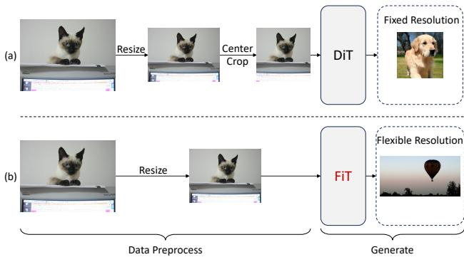
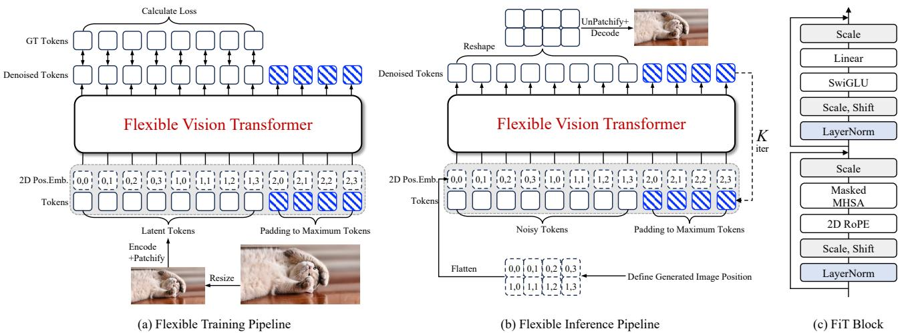
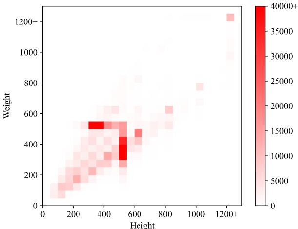
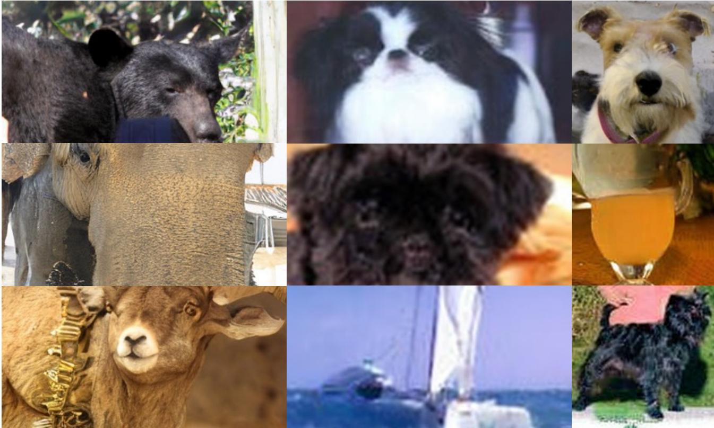
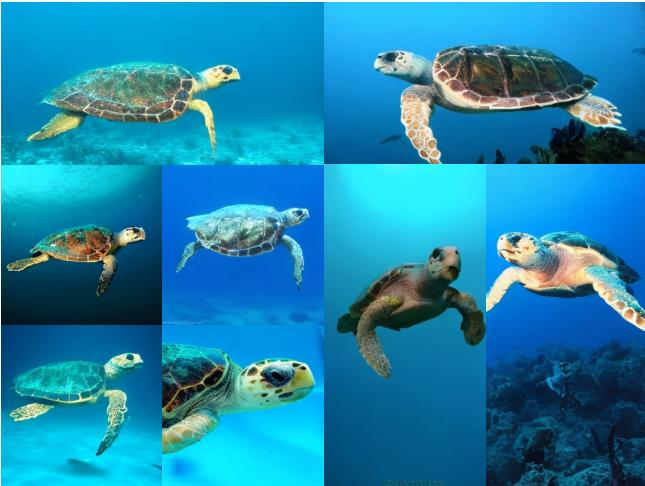
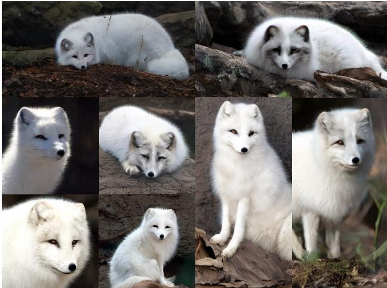
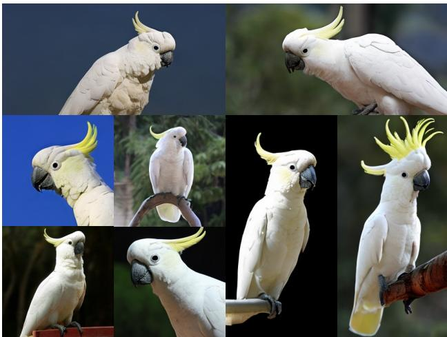
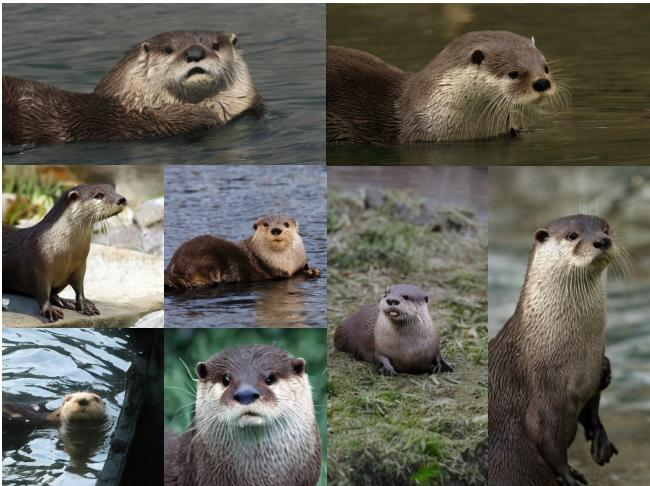
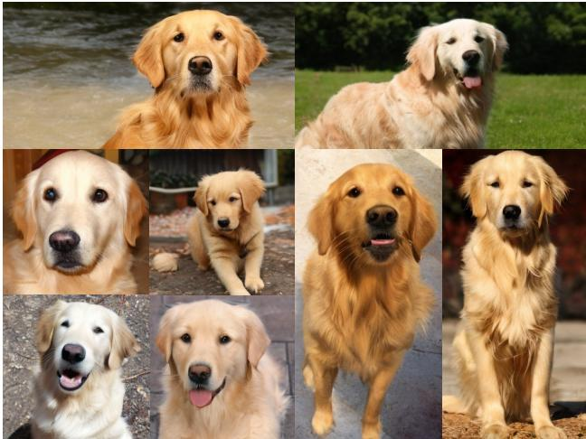

# FiT: Flexible Vision Transformer for Diffusion Model

Zeyu Lu 1 2 \* Zidong Wang 1 3 \* Di Huang 1 4 Chengyue Wu 5 Xihui Liu 5 Wanli Ouyang 1 Lei Bai 1

  
Figure 1: Selected samples from FiT-XL/2 models at resolutions of $2 5 6 \times 2 5 6$ , $2 2 4 \times 4 4 8$ and $4 4 8 \times 2 2 4$ . FiT is capable of generating images at unrestricted resolutions and aspect ratios.

# Abstract

Nature is infinitely resolution-free. In the context of this reality, existing diffusion models, such as Diffusion Transformers, often face challenges when processing image resolutions outside of their trained domain. To overcome this limitation, we present the Flexible Vision Transformer (FiT), a transformer architecture specifically designed for generating images with unrestricted resolutions and aspect ratios. Unlike traditional methods that perceive images as static-resolution grids, FiT conceptualizes images as sequences of dynamically-sized tokens. This perspective enables a flexible training strategy that effortlessly adapts to diverse aspect ratios during both training and inference phases, thus promoting resolution generalization and eliminating biases induced by image cropping. Enhanced by a meticulously adjusted network structure and the integration of training-free extrapolation techniques, FiT exhibits remarkable flexibility in resolution extrapolation generation. Comprehensive experiments demonstrate the exceptional performance of FiT across a broad range of resolutions. Repository available at https://github.com/whlzy/FiT.

# 1. Introduction

Current image generation models struggle with generalizing across arbitrary resolutions. The Diffusion Transformer (DiT) (Peebles & Xie, 2023) family, while excelling within certain resolution ranges, falls short when dealing with images of varying resolutions. This limitation stems from the fact that DiT can not utilize dynamic resolution images during its training process, hindering its ability to adapt to different token lengths or resolutions effectively.

To overcome this limitation, we introduce the Flexible Vision Transformer (FiT), which is adept at generating images at unrestricted resolutions and aspect ratios. The key motivation is a novel perspective on image data modeling: rather than treating images as static grids of fixed dimensions, FiT conceptualizes images as sequences of variablelength tokens. This approach allows FiT to dynamically adjust the sequence length, thereby facilitating the generation of images at any desired resolution without being constrained by pre-defined dimensions. By efficiently managing variable-length token sequences and padding them to a maximum specified length, FiT unlocks the potential for resolution-independent image generation. FiT represents this paradigm shift through significant advancements in flexible training pipeline, network architecture, and inference processes.

Flexible Training Pipeline. FiT uniquely preserves the original image aspect ratio during training, by viewing the image as a sequence of tokens. This unique perspective allows FiT to adaptively resize high-resolution images to fit within a predefined maximum token limit, ensuring that no image, regardless of its original resolution, is cropped or disproportionately scaled. This method ensures that the integrity of the image resolution is maintained, as shown in Figure 2, facilitating the ability to generate high-fidelity images at various resolutions. To the best of our knowledge, FiT is the first transformer-based generation model to maintain diverse image resolutions throughout training.

Network Architecture. The FiT model evolves from the DiT architecture but addresses its limitations in resolution extrapolation. One essential network architecture adjustment to handle diverse image sizes is the adoption of 2D Rotary Positional Embedding (RoPE) (Su et al., 2024), inspired by its success in enhancing large language models (LLMs) for length extrapolation (Liu et al., 2023). We also introduce Swish-Gated Linear Unit (SwiGLU) (Shazeer, 2020) in place of the traditional Multilayer Perceptron (MLP) and replace DiT’s Multi-Head Self-Attention (MHSA) with Masked MHSA to efficiently manage padding tokens within our flexible training pipeline.

Inference Process. While large language models employ token length extrapolation techniques (Peng et al., 2023;

  
Figure 2: Pipeline comparison between (a) DiT and (b) FiT.

LocalLLaMA) for generating text of arbitrary lengths, a direct application of these technologies to FiT yields suboptimal results. We tailor these techniques for 2D RoPE, thereby enhancing FiT’s performance across a spectrum of resolutions and aspect ratios.

Our highest Gflop FiT-XL/2 model, after training for only 1.8 million steps on ImageNet-256 (Deng et al., 2009) dataset, outperforms all state-of-the-art CNN and transformer models by a significant margin across resolutions of $1 6 0 \times 3 2 0$ , $1 2 8 \times 3 8 4$ , $3 2 0 \times 3 2 0$ , $2 2 4 \times 4 4 8$ , and $1 6 0 \times 4 8 0$ The performance of FiT-XL/2 significantly advances further with our training-free resolution extrapolation method. Compared to the baseline DiT-XL/2 training for 7 million steps, FiT-XL/2 lags slightly at the resolution of $2 5 6 \times 2 5 6$ but significantly surpasses it at all other resolutions.

In summary, our contributions lie in the novel introduction of FiT, a flexible vision transformer tailored for diffusion models, capable of generating images at any resolution and aspect ratio. We present three innovative design features in FiT, including a flexible training pipeline that eliminates the need for cropping, a unique transformer architecture for dynamic token length modeling, and a training-free resolution extrapolation method for arbitrary resolution generation. Strict experiments demonstrate that the FiT-XL/2 model achieves state-of-the-art performance across a variety of resolution and aspect ratio settings.

# 2. Related Work

Diffusion Models. Denoising Diffusion Probabilistic Models (DDPMs) (Ho et al., 2020; Saharia et al., 2022; Radford et al., 2021) and score-based models (Hyvarinen &¨ Dayan, 2005; Song et al., 2020b) have exhibited remarkable progress in the context of image generation tasks (Lu et al., 2024b; Ling et al., 2024; Rombach et al., 2022; Saharia et al., 2022; Meng et al., 2021; Ramesh et al., 2022; Ruiz et al., 2023; Poole et al., 2022; Gong et al., 2024). The Denoising Diffusion Implicit Model (DDIM) Song et al. (2020a), offers An accelerated sampling procedure. Latent

Diffusion Models (LDMs) (Rombach et al., 2022) establishes a new benchmark of training deep generative models to reverse a noise process in the latent space, through the use of VQ-VAE (Esser et al., 2021).

Transformer Models. The Transformer model (Vaswani et al., 2017), has successfully supplanted domain-specific architectures in a variety of fields including, but not limited to, language (Brown et al., 2020; Chowdhery et al., 2023a), vision (Dosovitskiy et al., 2020), and multi-modality (Team et al., 2023). In vision perception research, most efforts (Touvron et al., 2019; 2021; Liu et al., 2021; 2022) that focus on resolution are aimed at accelerating pretraining using a fixed, low resolution. On the other hand, NaViT (Dehghani et al., 2023) implements the ’Patch n’ Pack’ technique to train ViT using images at their natural, ’native’ resolution. Notably, transformers have been also explored in the denoising diffusion probabilistic models (Ho et al., 2020) to synthesize images. DiT (Peebles & Xie, 2023) is the seminal work that utilizes a vision transformer as the backbone of LDMs and can serve as a strong baseline. Based on DiT architecture, MDT (Gao et al., 2023) introduces a masked latent modeling approach, which requires two forward-runs in training and inference. U-ViT (Bao et al., 2023) treats all inputs as tokens and incorporates U-Net architectures into the ViT backbone of LDMs. DiffiT (Hatamizadeh et al., 2023) introduces a time-dependent self-attention module into the DiT backbone to adapt to different stages of the diffusion process. We follow the LDM paradigm of the above methods and further propose a novel flexible image synthesis pipeline.

Length Extrapolation in LLMs. RoPE (Rotary Position Embedding) (Su et al., 2024) is a novel positional embedding that incorporates relative position information into absolute positional embedding. It has recently become the dominant positional embedding in a wide range of LLM (Large Language Model) designs (Chowdhery et al., 2023b; Touvron et al., 2023a;b). Although RoPE enjoys valuable properties, such as the flexibility of sequence length, its performance drops when the input sequence surpasses the training length. Many approaches have been proposed to solve this issue. PI (Position Interpolation) (Chen et al., 2023) linearly down-scales the input position indices to match the original context window size, while NTK-aware (LocalLLaMA) changes the rotary base of RoPE. YaRN (Yet another RoPE extensioN) (Peng et al., 2023) is an improved method to efficiently extend the context window. RandomPE (Ruoss et al., 2023) sub-samples an ordered set of positions from a much larger range of positions than originally observed in training or inference. xPos (Sun et al., 2022) incorporates long-term decay into RoPE and uses blockwise causal attention for better extrapolation performance. Our work delves deeply into the implementation of RoPE in vision generation and on-the-fly resolution extrapolation methods.

# 3. Flexible Vision Transformer for Diffusion

# 3.1. Preliminary

1-D RoPE (Rotary Positional Embedding) (Su et al., 2024) is a type of position embedding that unifies absolute and relative PE, exhibiting a certain degree of extrapolation capability in LLMs. Given the $\mathbf { m }$ -th key and $\mathbf { n }$ -th query vector as $\mathbf { q } _ { m } , \mathbf { k } _ { n } \in \mathbb { R } ^ { | D | }$ , 1-D RoPE multiplies the bias to the key or query vector in the complex vector space:

$$
f _ { q } ( \mathbf { q } _ { m } , m ) = e ^ { i m \Theta } \mathbf { q } _ { m } , \quad f _ { k } ( \mathbf { k } _ { n } , n ) = e ^ { i n \Theta } \mathbf { k } _ { n }
$$

where $\Theta = \operatorname { D i a g } ( \theta _ { 1 } , \cdot \cdot \cdot , \theta _ { | D | / 2 } )$ is rotary frequency matrix with $\theta _ { d } = b ^ { - 2 d / | D | }$ and rotary base $b = 1 0 0 0 0$ . In real space, given $l = | D | / 2$ , the rotary matrix $e ^ { i m \Theta }$ equals to:

$$
\left[ \begin{array} { c c c c c c } { \cos m \theta _ { 1 } } & { - \sin m \theta _ { 1 } } & { \cdots } & { 0 } & { 0 } \\ { \sin m \theta _ { 1 } } & { \cos m \theta _ { 1 } } & { \cdots } & { 0 } & { 0 } \\ { \vdots } & { \vdots } & { \ddots } & { \vdots } & { \vdots } \\ { 0 } & { 0 } & { \cdots } & { \cos m \theta _ { l } } & { - \sin m \theta _ { l } } \\ { 0 } & { 0 } & { \cdots } & { \sin m \theta _ { l } } & { \cos m \theta _ { l } } \end{array} \right]
$$

The attention score with 1-D RoPE is calculated as:

$$
A _ { n } = \operatorname { R e } \langle f _ { q } ( \mathbf { q } _ { m } , m ) , f _ { k } ( \mathbf { k } _ { n } , n ) \rangle
$$

NTK-aware Interpolation (LocalLLaMA) is a trainingfree length extrapolation technique in LLMs. To handle the larger context length $L _ { \mathrm { t e s t } }$ than maximum training length $L _ { \mathrm { t r a i n } }$ , it modifies the rotary base of 1-D RoPE as follows:

$$
b ^ { \prime } = b \cdot s ^ { \frac { | D | } { | D | - 2 } } ,
$$

where the scale factor $s$ is defined as:

$$
s = \operatorname* { m a x } ( \frac { L _ { t e s t } } { L _ { t r a i n } } , 1 . 0 ) .
$$

YaRN (Yet another RoPE extensioN) Interpolation (Peng et al., 2023) introduces the ratio of dimension $d$ as $r ( d ) =$ $L _ { \mathrm { t r a i n } } / ( 2 \pi b ^ { 2 d / | D | } )$ , and modifies the rotary frequency as:

$$
\theta _ { d } ^ { \prime } = \left( 1 - \gamma ( r ( d ) ) \right) \frac { \theta _ { d } } { s } + \gamma ( r ( d ) ) \theta _ { d } ,
$$

where $s$ is the aforementioned scale factor, and $\gamma ( r ( d ) )$ is a ramp function with extra hyper-parameters $\alpha , \beta$ :

$$
\gamma ( r ) = { \left\{ \begin{array} { l l } { 0 , } & { { \mathrm { i f ~ } } r < \alpha } \\ { 1 , } & { { \mathrm { i f ~ } } r > \beta } \\ { { \frac { r - \alpha } { \beta - \alpha } } , } & { { \mathrm { o t h e r w i s e } } . } \end{array} \right. }
$$

Besides, it incorporates a 1D-RoPE scaling term as:

$$
f _ { q } ^ { \prime } ( \mathbf { q } _ { m } , m ) = \frac { 1 } { \sqrt { t } } f _ { q } ( \mathbf { q } _ { m } , m ) , f _ { k } ^ { \prime } ( \mathbf { k } _ { n } , n ) = \frac { 1 } { \sqrt { t } } f _ { k } ( \mathbf { k } _ { n } , n ) ,
$$

where $\begin{array} { r } { \frac { 1 } { \sqrt { t } } = 0 . 1 \ln ( s ) + 1 } \end{array}$

  
Figure 3: Overview of (a) flexible training pipeline, (b) flexible inference pipeline, and (c) FiT block.

# 3.2. Flexible Training and Inference Pipeline

# 3.3. Flexible Vision Transformer Architecture

Modern deep learning models, constrained by the characteristics of GPU hardware, are required to pack data into batches of uniform shape for parallel processing. Due to the diversity in image resolutions, as shown in Fig. 4, DiT resizes and crops the images to a fixed resolution $2 5 6 \times 2 5 6$ While resizing and cropping as a means of data augmentation is a common practice, this approach introduces certain biases into the input data. These biases will directly affect the final images generated by the model, including blurring effects from the transition from low to high resolution and information lost due to the cropping (more failure samples can be found in Appendix G).

To this end, we propose a flexible training and inference pipeline, as shown in Fig. 3 (a, b). In the preprocessing phase, we avoid cropping images or resizing low-resolution images to a higher resolution. Instead, we only resize highresolution images to a predetermined maximum resolution limit, $H W \leqslant 2 5 6 ^ { 2 }$ . In the training phase, FiT first encodes an image into latent codes with a pre-trained VAE encoder. By patchfiying latent codes to latent tokens, we can get sequences with different lengths $L$ . To pack these sequences into a batch, we pad all these sequences to the maximum token length $L _ { m a x }$ using padding tokens. Here we set $L _ { m a x } = 2 5 6$ to match the fixed token length of DiT. The same as the latent tokens, we also pad the positional embeddings to the maximum length for packing. Finally, we calculate the loss function only for the denoised output tokens, while discarding all other padding tokens. In the inference phase, we firstly define the position map of the generated image and sample noisy tokens from the Gaussian distribution as input. After completing $K$ iterations of the denoising process, we reshape and unpatchfiy the denoised tokens according to the predefined position map to get the final generated image.

Building upon the flexible training pipeline, our goal is to find an architecture that can stably train across various resolutions and generate images with arbitrary resolutions and aspect ratios, as shown in Figure 3 (c). Motivated by some significant architectural advances in LLMs, we conduct a series of experiments to explore architectural modifications based on DiT, see details in Section 4.2.

Replacing MHSA with Masked MHSA. The flexible training pipeline introduces padding tokens for flexibly packing dynamic sequences into a batch. During the forward phase of the transformer, it is crucial to facilitate interactions among noised tokens while preventing any interaction between noised tokens and padding tokens. The Multi-Head Self-Attention (MHSA) mechanism of original DiT is incapable of distinguishing between noised tokens and padding tokens. To this end, we use Masked MHSA to replace the standard MHSA. We utilize the sequence mask $M$ for Masked Attention, where noised tokens are assigned the value of 0, and padding tokens are assigned the value of negative infinity (-inf ), which is defined as follows:

$$
\operatorname { e d } \mathrm { A t t n . } ( Q _ { i } , K _ { i } , V _ { i } ) = \mathrm { S o f t m a x } \left( \frac { Q _ { i } K _ { i } ^ { T } } { \sqrt { d _ { k } } } + M \right) V _ { i }
$$

where $Q _ { i }$ , $K _ { i }$ , $V _ { i }$ are the query, key, and value matrices for the $i$ -th head.

Replacing Absolute PE with 2D RoPE. We observe that vision transformer models with absolute positional embedding fail to generalize well on images beyond the training resolution, as in Sections 4.3 and 4.5. Inspired by the success of 1D-RoPE in LLMs for length extrapolation (Liu et al., 2023), we utilize 2D-RoPE to facilitate the resolution generalization in vision transformer models. Formally, we calculate the 1-D RoPE for the coordinates of height and width separately. Then such two 1-D RoPEs are concatenated in the last dimension. Given 2-D coordinates of width and height as $\{ ( w , h ) \Big | 1 \leqslant w \leqslant W , 1 \leqslant h \leqslant H \}$ , the 2-D RoPE is defined as:

$$
\begin{array} { r l } & { f _ { q } ( \mathbf q _ { m } , h _ { m } , w _ { m } ) = [ e ^ { i h _ { m } \Theta } \mathbf q _ { m } \parallel e ^ { i w _ { m } \Theta } \mathbf q _ { m } ] , } \\ & { f _ { k } ( \mathbf k _ { n } , h _ { n } , w _ { n } ) = [ e ^ { i h _ { n } \Theta } \mathbf k _ { n } \parallel e ^ { i w _ { n } \Theta } \mathbf k _ { n } ] , } \end{array}
$$

where $\Theta = \operatorname { D i a g } ( \theta _ { 1 } , \cdot \cdot \cdot , \theta _ { | D | / 4 } )$ , and $\parallel$ denotes concatenate two vectors in the last dimension. Note that we divide the $| D |$ -dimension space into $| D | / 4$ -dimension subspace to ensure the consistency of dimension, which differs from $| D | / 2$ -dimension subspace in 1-D RoPE. Analogously, the attention score with 2-D RoPE is:

$$
A _ { n } = \operatorname { R e } \langle f _ { q } ( \mathbf { q } _ { m } , h _ { m } , w _ { m } ) , f _ { k } ( { \mathbf { k } } _ { n } , h _ { n } , w _ { n } ) \rangle .
$$

It is noteworthy that there is no cross-term between $h$ and $w$ in 2D-RoPE and attention score $A _ { n }$ , so we can further decouple the rotary frequency as $\Theta _ { h }$ and $\Theta _ { w }$ , resulting in the decoupled 2D-RoPE, which will be discussed in Section 3.4 and more details can be found in Appendix E.

Replacing MLP with SwiGLU. We follow recent LLMs like LLaMA (Touvron et al., 2023a;b), and replace the MLP in FFN with SwiGLU, which is defined as follows:

$$
\begin{array} { r } { \mathrm { S w i G L U } ( x , W , V ) = \mathrm { S i L U } ( x W ) \otimes ( x V ) } \\ { \mathrm { F F N } ( x ) = \mathrm { S w i G L U } ( x , W _ { 1 } , W _ { 2 } ) W _ { 3 } } \end{array}
$$

where $\otimes$ denotes Hadmard Product, $W _ { 1 }$ , $W _ { 2 }$ , and $W _ { 3 }$ are the weight matrices without bias, $\operatorname { S i L U } ( x ) = x \otimes \sigma ( x )$ . Here we will use SwiGLU as our choice in each FFN block.

# 3.4. Training Free Resolution Extrapolation

We denote the inference resolution as $( H _ { \mathrm { t e s t } } , W _ { \mathrm { t e s t } } )$ . Our FiT can handle various resolutions and aspect ratios during√ training, so we denote training resolution as $L _ { \mathrm { t r a i n } } = \sqrt { L _ { \mathrm { m a x } } }$

By changing the scale factor in Equation (5) to $s =$ $\operatorname* { m a x } ( \operatorname* { m a x } ( H _ { \mathrm { t e s t } } , W _ { \mathrm { t e s t } } ) / L _ { t r a i n } , 1 . 0 )$ , we can directly implement the positional interpolation methods in large language model extrapolation on 2D-RoPE, which we call vanilla NTK and YaRN implementation. Furthermore, we propose vision RoPE interpolation methods by using the decoupling attribute in decoupled 2D-RoPE. We modify Equation (10) to:

$$
\begin{array} { r l } & { \hat { f } _ { q } ( \mathbf { q } _ { m } , h _ { m } , w _ { m } ) = [ e ^ { i h _ { m } \Theta _ { h } } \mathbf { q } _ { m } \parallel e ^ { i w _ { m } \Theta _ { w } } \mathbf { q } _ { m } ] , } \\ & { \hat { f } _ { k } ( \mathbf { k } _ { n } , h _ { n } , w _ { n } ) = [ e ^ { i h _ { n } \Theta _ { h } } \mathbf { k } _ { n } \parallel e ^ { i w _ { n } \Theta _ { w } } \mathbf { k } _ { n } ] , } \end{array}
$$

where $\begin{array} { r } { \Theta _ { h } = \{ \theta _ { d } ^ { h } = b _ { h } ^ { - 2 d / | D | } , 1 \leqslant d \leqslant \frac { | D | } { 2 } \} } \end{array}$ and $\Theta _ { w } =$ −2d/|D|w , 1 ⩽ d ⩽ |D|2 } are calculated separately.

Accordingly, the scale factor of height and width is defined separately as

$$
s _ { h } = \operatorname* { m a x } ( \frac { H _ { \mathrm { t e s t } } } { L _ { \mathrm { t r a i n } } } , 1 . 0 ) , \quad s _ { w } = \operatorname* { m a x } ( \frac { W _ { \mathrm { t e s t } } } { L _ { \mathrm { t r a i n } } } , 1 . 0 ) .
$$

Definition 3.1. The Definition of VisionNTK Interpolation is a modification of NTK-aware Interpolation by using Equation (13) with the following rotary base.

$$
b _ { h } = b \cdot s _ { h } ^ { \frac { | D | } { | D | - 2 } } , \quad b _ { w } = b \cdot s _ { w } ^ { \frac { | D | } { | D | - 2 } } ,
$$

where $b = 1 0 0 0 0$ is the same with Equation (1)

Definition 3.2. The Definition of VisionYaRN Interpolation is a modification of YaRN Interpolation by using Equation (13) with the following rotary frequency.

$$
\begin{array} { r l } & { \theta _ { d } ^ { h } = ( 1 - \gamma ( r ( d ) ) \frac { \theta _ { d } } { s _ { h } } + \gamma ( r ( d ) ) \theta _ { d } , } \\ & { \theta _ { d } ^ { w } = ( 1 - \gamma ( r ( d ) ) \frac { \theta _ { d } } { s _ { w } } + \gamma ( r ( d ) ) \theta _ { d } , } \end{array}
$$

where $\gamma ( r ( d ) )$ is the same with Equation (6).

It is worth noting that VisionNTK and VisionYaRN are training-free positional embedding interpolation approaches, used to alleviate the problem of position embedding out of distribution in extrapolation. When the aspect ratio equals one, they are equivalent to the vanilla implementation of NTK and YaRN. They are especially effective in generating images with arbitrary aspect ratios, see Section 4.3.

# 4. Experiments

# 4.1. FiT Implementation

We present the implementation details of FiT, including model architecture, training details, and evaluation metrics.

Model architecture. We follow DiT-B and DiT-XL to set the same layers, hidden size, and attention heads for base model FiT-B and xlarge model FiT-XL. As DiT reveals stronger synthesis performance when using a smaller patch size, we use a patch size $\mathsf { p } { = } 2$ , denoted by FiT-B/2 and FiT-XL/2. FiT adopts the same off-the-shelf pre-trained VAE (Esser et al., 2021) as DiT provided by the Stable Diffusion (Rombach et al., 2022) to encode/decode the image/latent tokens. The VAE encoder has a downsampling ratio of $1 / 8$ and a feature channel dimension of 4. An image of size $1 6 0 \times 3 2 0 \times 3$ is encoded into latent codes of size $2 0 \times 4 0 \times 4$ . The latent codes of size $2 0 \times 4 0 \times 4$ are patchified into latent tokens of length $L = 1 0 \times 2 0 = 2 0 0$ .

Training details. We train class-conditional latent FiT models under predetermined maximum resolution limitation, $H W \leqslant 2 5 6 ^ { 2 }$ (equivalent to token length $L  \leq 2 5 6$ ), on the ImageNet (Deng et al., 2009) dataset. We down-resize the

Table 1: Benchmarking class-conditional image generation with in-distribution resolution on ImageNet dataset. “-G” denotes the results with classifier-free guidance. $^ \dagger$ : MDT-G adpots an improved classifier-free guidance strategy (Gao et al., 2023): $\begin{array} { r } { w _ { t } = ( 1 - \cos \pi ( \frac { t } { t _ { m a x } } ) ^ { s } ) w / 2 } \end{array}$ , where $w = 3 . 8$ is the maximum guidance scale and $s = 4$ is the controlling factor. ∗: FiT-XL/2-G adopts VisionNTK for resolution extrapolation.   

<table><tr><td rowspan="2">Method</td><td rowspan="2">Train Cost</td><td colspan="5">256×256 (1:1) sFID↓</td><td colspan="5">160×320 (1:2)</td><td rowspan="2"></td><td colspan="5">128×384 (1:3)</td></tr><tr><td>FID↓</td><td></td><td>IS↑</td><td>Prec.↑</td><td>Rec.↑</td><td>FID↓</td><td>sFID↓</td><td>IS↑</td><td>Prec.↑</td><td>Rec.↑</td><td>FID↓</td><td>sFID↓</td><td>IS↑</td><td>Prec.↑</td><td>Rec.↑</td></tr><tr><td>BigGAN-deep</td><td>-</td><td>6.95</td><td>7.36</td><td>171.4</td><td>0.87</td><td>0.28</td><td></td><td></td><td></td><td></td><td></td><td></td><td></td><td></td><td></td><td></td><td>-</td></tr><tr><td>StyleGAN-XL</td><td></td><td>2.30</td><td>4.02</td><td>265.12</td><td>0.78</td><td>0.53</td><td></td><td></td><td></td><td></td><td></td><td>-</td><td></td><td></td><td></td><td></td><td>-</td></tr><tr><td>MaskGIT</td><td>1387k×256</td><td>6.18</td><td>-</td><td>182.1</td><td>0.80</td><td>0.51</td><td></td><td></td><td></td><td></td><td></td><td></td><td></td><td></td><td></td><td></td><td>-</td></tr><tr><td>CDM</td><td></td><td>4.88</td><td>-</td><td>158.71</td><td></td><td>-</td><td></td><td></td><td></td><td></td><td></td><td></td><td>-</td><td></td><td></td><td></td><td>-</td></tr><tr><td>U-ViT-H/2-G (cfg=1.4)</td><td>500k×1024</td><td>2.35</td><td>5.68</td><td>265.02</td><td>0.82</td><td>0.57</td><td></td><td>6.93 12.64</td><td></td><td>175.08</td><td>0.67</td><td>0.63</td><td>196.84</td><td>95.90</td><td>7.54</td><td>0.06</td><td>0.27</td></tr><tr><td>ADM-G,U</td><td>1980k×256</td><td>3.94</td><td>6.14</td><td>215.84</td><td>0.83</td><td>0.53</td><td></td><td>10.26 12.28</td><td></td><td>126.99</td><td>0.67</td><td>0.59</td><td>56.52</td><td>43.21</td><td>32.19</td><td>0.30</td><td>0.50</td></tr><tr><td>LDM-4-G (cfg=1.5)</td><td>178k×1200</td><td>3.60</td><td>5.12</td><td>247.67</td><td>0.87</td><td>0.48</td><td>10.04</td><td>11.47</td><td></td><td>119.56</td><td>0.65</td><td>0.61</td><td>29.67</td><td>26.33</td><td>57.71</td><td>0.44</td><td>0.61</td></tr><tr><td>MDT-G† (cfg=3.8,s=4)</td><td>6500k×256</td><td>1.79</td><td>4.57</td><td>283.01</td><td>0.81</td><td>0.61</td><td>135.6</td><td>73.08</td><td>9.35</td><td></td><td>0.15</td><td>0.20</td><td>124.9</td><td>70.69</td><td>13.38</td><td>0.13</td><td>0.42</td></tr><tr><td>DiT-XL/2-G (cfg=1.50)</td><td>7000k×256</td><td>2.27</td><td>4.60</td><td>278.24</td><td>0.83</td><td>0.57</td><td>20.14</td><td>30.50</td><td>97.28</td><td></td><td>0.49</td><td>0.67</td><td>107.2</td><td>68.89</td><td>15.48</td><td>0.12</td><td>0.52</td></tr><tr><td>FiT-XL/2-G* (cfg=1.50)</td><td>1800k×256</td><td>4.27</td><td>9.99</td><td>249.72</td><td>0.84</td><td>0.51</td><td>5.74</td><td>10.05</td><td>190.14</td><td></td><td>0.74</td><td>0.55</td><td>16.81</td><td>20.62</td><td>110.93</td><td>0.57</td><td>0.52</td></tr></table>

<table><tr><td rowspan="2">Method</td><td rowspan="2">Train Cost</td><td rowspan="2">FID↓ sFID↓</td><td colspan="4">320×320 (1:1)</td><td colspan="6">224×448 (1:2) sFID↓</td><td colspan="4">160×480 (1:3)</td></tr><tr><td></td><td>IS↑</td><td>Prec.↑</td><td>Rec.↑</td><td>FID↓</td><td></td><td>IS↑</td><td>Prec.↑</td><td>Rec.↑</td><td>FID↓</td><td>sFID↓</td><td>IS↑</td><td>Prec.↑</td><td>Rec.↑</td></tr><tr><td>U-ViT-H/2-G (cfg=1.4)</td><td>500k×1024</td><td>7.65</td><td>16.30</td><td>208.01</td><td>0.72</td><td>0.54</td><td>67.10</td><td>42.92</td><td>45.54</td><td>0.30</td><td>0.49</td><td>95.56</td><td>44.45</td><td>24.01</td><td>0.19</td><td>0.47</td></tr><tr><td>ADM-G,U</td><td>1980x256</td><td>9.39</td><td>9.01</td><td>161.95</td><td>0.74</td><td>0.50</td><td>11.34</td><td>14.50</td><td>146.00</td><td>0.71</td><td>0.49</td><td>23.92</td><td>25.55</td><td>80.73</td><td>0.57</td><td>0.51</td></tr><tr><td>LDM-4-G (cfg=1.5)</td><td>178k×1200</td><td>6.24</td><td>13.21</td><td>220.03</td><td>0.83</td><td>0.44</td><td>8.55</td><td>17.62</td><td>186.25</td><td>0.78</td><td>0.44</td><td>19.24</td><td>20.25</td><td>99.34</td><td>0.59</td><td>0.50</td></tr><tr><td>MDT-G† (cfg=3.8,s=4)</td><td>6500kx256</td><td>383.5</td><td>136.5</td><td>4.24</td><td>0.01</td><td>0.04</td><td>365.9</td><td>142.8</td><td>4.91</td><td>0.01</td><td>0.05</td><td>276.7</td><td>138.1</td><td>7.20</td><td>0.03</td><td>0.09</td></tr><tr><td>DiT-XL/2-G (cfg=1.50)</td><td>7000k×x256</td><td>9.98</td><td>23.57</td><td>225.72</td><td>0.73</td><td>0.48</td><td>94.94</td><td>56.06</td><td>35.75</td><td>0.23</td><td>0.46</td><td>140.2</td><td>79.60</td><td>14.70</td><td>0.094</td><td>0.45</td></tr><tr><td>FiT-XL/2-G* (cfg=1.50)</td><td>180kx256</td><td>5.42</td><td>15.41</td><td>252.65</td><td>0.81</td><td>0.47</td><td>7.90</td><td>19.63</td><td>215.29</td><td>0.75</td><td>0.47</td><td>15.72</td><td>22.57</td><td>132.76</td><td>0.62</td><td>0.47</td></tr></table>

Table 2: Benchmarking class-conditional image generation with out-of-distribution resolution on ImageNet dataset. “-G” denotes the results with classifier-free guidance. †: MDT-G adopts an aforementioned improved classifier-free guidance strategy. ∗: FiT-XL/2-G adopts VisionNTK for resolution extrapolation. Our FiT model achieves state-of-the-art performance across all the resolutions and aspect ratios, demonstrating a strong extrapolation capability.

high-resolution images to meet the $H W \leqslant 2 5 6 ^ { 2 }$ limitation while maintaining the aspect ratio. We follow DiT to use Horizontal Flip Augmentation. We use the same training setting as DiT: a constant learning rate of $1 \times 1 0 ^ { - 4 }$ using AdamW (Loshchilov & Hutter, 2017), no weight decay, and a batch size of 256. Following common practice in the generative modeling literature, we adopt an exponential moving average (EMA) of model weights over training with a decay of 0.9999. All results are reported using the EMA model. We retain the same diffusion hyper-parameters as DiT.

Evaluation details and metrics. We evaluate models with some commonly used metrics, i.e. Fre’chet Inception Distance (FID) (Heusel et al., 2017), sFID (Nash et al., 2021), Inception Score (IS) (Salimans et al., 2016), improved Precision and Recall (Kynka¨anniemi et al. ¨ , 2019). For fair comparisons, we follow DiT to use the TensorFlow evaluation from ADM (Dhariwal & Nichol, 2021) and report FID-50K with 250 DDPM sampling steps. FID is used as the major metric as it measures both diversity and fidelity. We additionally report IS, sFID, Precision, and Recall as secondary metrics. For FiT architecture experiment (Section 4.2) and resolution extrapolation ablation experiment (Section 4.3), we report the results without using classifierfree guidance (Ho & Salimans, 2021).

Evaluation resolution. Unlike previous work that mainly conducted experiments on a fixed aspect ratio of $1 : 1$ , we conducted experiments on different aspect ratios, which are

$1 : 1 , 1 : 2$ , and $1 : 3$ , respectively. On the other hand, we divide the experiment into resolution within the training distribution and resolution out of the training distribution. For the resolution in distribution, we mainly use $2 5 6 \times 2 5 6$ (1:1), $1 6 0 \times 3 2 0$ (1:2), and $1 2 8 \times 3 8 4$ (1:3) for evaluation, with 256, 200, 192 latent tokens respectively. All token lengths are smaller than or equal to 256, leading to respective resolutions within the training distribution. For the resolution out of distribution, we mainly use $3 2 0 \times 3 2 0$ (1:1), $2 2 4 \times 4 4 8$ (1:2), and $1 6 0 \times 4 8 0$ (1:3) for evaluation, with 400, 392, 300 latent tokens respectively. All token lengths are larger than 256, resulting in the resolutions out of training distribution. Through such division, we holistically evaluate the image synthesis and resolution extrapolation ability of FiT at various resolutions and aspect ratios.

# 4.2. FiT Architecture Design

In this part, we conduct an ablation study to verify the architecture designs in FiT. We report the results of various variant FiT-B/2 models at 400K training steps and use FID50k, sFID, IS, Precision, and Recall as the evaluation metrics. We conduct experiments at three different resolutions: $2 5 6 \times 2 5 6$ , $1 6 0 \times 3 2 0$ , and $2 2 4 \times 4 4 8$ . These resolutions are chosen to encompass different aspect ratios, as well as to include resolutions both in and out of the distribution.

Flexible training vs. Fixed training. Flexible training pipeline significantly improves the performance across var

Table 3: Ablation results from DiT-B/2 to FiT-B/2 at 400K training steps without using classifier-free guidance.   

<table><tr><td rowspan="2">Arch.</td><td rowspan="2">Pos. Embed.</td><td rowspan="2">FFN</td><td rowspan="2">Train</td><td rowspan="2">FID↓ sFID↓</td><td colspan="4">256×256 (i.d.) IS↑</td><td colspan="5">160×320 (i.d.)</td><td colspan="5">224×448 (o.0.d.)</td></tr><tr><td></td><td></td><td>Prec.↑</td><td>Rec.↑</td><td>FID↓</td><td>sFID↓</td><td>IS↑</td><td>Prec.↑</td><td></td><td>Rec.↑ FID↓</td><td>sFID↓</td><td>IS↑</td><td>ec.</td><td>Rec.↑</td></tr><tr><td>DiT-B</td><td>Abs. PE</td><td>MLP</td><td>Fixed</td><td>44.83</td><td>8.49</td><td>32.05</td><td>0.48</td><td>0.63</td><td>91.32</td><td>66.66</td><td>14.02</td><td>0.21</td><td>0.45</td><td>109.1</td><td>110.71</td><td>14.00</td><td>0.18</td><td>0.31</td></tr><tr><td>Config A</td><td>Abs. PE</td><td>MLP</td><td>Flexible</td><td>43.34</td><td>11.11</td><td>32.23</td><td>0.48</td><td>0.61</td><td>50.51</td><td>10.36</td><td>25.26</td><td>0.42</td><td>0.60</td><td>52.55</td><td>16.05</td><td>28.69</td><td>0.42</td><td>0.58</td></tr><tr><td>CConfig B</td><td>Abs. PE</td><td>SwiGLU</td><td>Flexible</td><td>41.75</td><td>11.53</td><td>34.55</td><td>0.49</td><td>0.61</td><td>48.66</td><td>10.65</td><td>26.76</td><td>0.41</td><td>0.60</td><td>52.34</td><td>17.73</td><td>30.01</td><td>0.41</td><td>0.57</td></tr><tr><td> Config C</td><td>Abs. PE + 2D RoPE</td><td>MLP</td><td>Flexible</td><td>39.11</td><td>10.79</td><td>36.35</td><td>0.51</td><td>0.61</td><td>46.71</td><td>10.32</td><td>27.65</td><td>0.44</td><td>0.61</td><td>46.60</td><td>15.84</td><td>33.99</td><td>0.46</td><td>0.58</td></tr><tr><td>Coonfig D</td><td>2D RoPE</td><td>MLP</td><td>Flexible</td><td>37.29</td><td>10.62</td><td>38.34</td><td>0.53</td><td>0.61</td><td>45.06</td><td>9.82</td><td>28.87</td><td>0.43</td><td>0.62</td><td>46.16</td><td>23.72</td><td>35.28</td><td>0.46</td><td>0.55</td></tr><tr><td>FT-B </td><td>2D RoPE</td><td>SwiGLU</td><td>Flexible</td><td>36.36</td><td>11.08</td><td>40.69</td><td>0.52</td><td>0.62</td><td>43.96</td><td>10.26</td><td>30.45</td><td>0.43</td><td>0.62</td><td>44.67</td><td>24.09</td><td>37.10</td><td>0.49</td><td>0.53</td></tr></table>

<table><tr><td rowspan="2">Method</td><td colspan="5">320×320 (1:1)</td><td colspan="5">224×448 (1:2)</td><td colspan="5">160× 480 (1:3)</td></tr><tr><td>FID↓</td><td>sFID↓</td><td>IS↑</td><td>Prec.↑</td><td>Rec.↑</td><td>FID↓</td><td>sFID↓</td><td>IS↑</td><td>Prec.↑</td><td>Rec.↑</td><td>FID↓</td><td>sFID↓</td><td>IS↑</td><td>Prec.↑</td><td>Rec.↑</td></tr><tr><td>DiT-B</td><td>95.47</td><td>108.68</td><td>18.38</td><td>0.26</td><td>0.40</td><td>109.1</td><td>110.71</td><td>14.00</td><td>0.18</td><td>0.31</td><td>143.8</td><td>122.81</td><td>8.93</td><td>0.073</td><td>0.20</td></tr><tr><td>DiT-B + EI</td><td>81.48</td><td>62.25</td><td>20.97</td><td>0.25</td><td>0.47</td><td>133.2</td><td>72.53</td><td>11.11</td><td>0.11</td><td>0.29</td><td>160.4</td><td>93.91</td><td>7.30</td><td>0.054</td><td>0.16</td></tr><tr><td>DiT-B + PI</td><td>72.47</td><td>54.02</td><td>24.15</td><td>0.29</td><td>0.49</td><td>133.4</td><td>70.29</td><td>11.73</td><td>0.11</td><td>0.29</td><td>156.5</td><td>93.80</td><td>7.80</td><td>0.058</td><td>0.17</td></tr><tr><td>FiT-B</td><td>61.35</td><td>30.71</td><td>31.01</td><td>0.41</td><td>0.53</td><td>44.67</td><td>24.09</td><td>37.1</td><td>0.49</td><td>0.52</td><td>56.81</td><td>22.07</td><td>25.25</td><td>0.38</td><td>0.49</td></tr><tr><td>FiT-B + PI</td><td>65.76</td><td>65.45</td><td>29.32</td><td>0.32</td><td>0.45</td><td>175.42</td><td>114.39</td><td>8.45</td><td>0.14</td><td>0.06</td><td>224.83</td><td>123.45</td><td>5.89</td><td>0.02</td><td>0.06</td></tr><tr><td>FiT-B + YaRN</td><td>44.76</td><td>38.04</td><td>44.70</td><td>0.51</td><td>0.51</td><td>82.19</td><td>75.48</td><td>29.68</td><td>0.40</td><td>0.29</td><td>104.06</td><td>72.97</td><td>20.76</td><td>0.21</td><td>0.31</td></tr><tr><td>FiT-B + NTK</td><td>57.31</td><td>31.31</td><td>33.97</td><td>0.43</td><td>0.55</td><td>45.24</td><td>29.38</td><td>38.84</td><td>0.47</td><td>0.52</td><td>59.19</td><td>26.54</td><td>26.01</td><td>0.36</td><td>0.49</td></tr><tr><td>FiT-B + VisionYaRN</td><td>44.76</td><td>38.04</td><td>44.70</td><td>0.51</td><td>0.51</td><td>41.92</td><td>42.79</td><td>45.87</td><td>0.50</td><td>0.48</td><td>62.84</td><td>44.82</td><td>27.84</td><td>0.36</td><td>0.42</td></tr><tr><td>FiT-B + VisionNTK</td><td>57.31</td><td>31.31</td><td>33.97</td><td>0.43</td><td>0.55</td><td>43.84</td><td>26.25</td><td>39.22</td><td>0.48</td><td>0.52</td><td>56.76</td><td>24.18</td><td>26.40</td><td>0.37</td><td>0.49</td></tr></table>

Table 4: Benchmarking class-conditional image generation with out-of-distribution resolution on ImageNet. The FiT-B/2 and DiT-B/2 at 400K training steps are adopted in this experiment. Metrics are calculated without using classifier-free guidance. YaRN and NTK mean the vanilla implementation of such two methods. Our FiT-B/2 demonstrates stable extrapolation performance, which can be further improved combined with VisionNTK and VisionYaRN methods.

ious resolutions. This improvement is evident not only within the in-distribution resolutions but also extends to resolutions out of the training distribution, as shown in Tab. 3. Config A is the original DiT-B/2 model only with flexible training, which slightly improves the performance (-1.49 FID) compared with DiT-B/2 with fixed resolution training at $2 5 6 \times 2 5 6$ resolution. Config A demonstrates a significant performance improvement through flexible training. Compared to DiT-B/2, FID scores are reduced by 40.81 and 56.55 at resolutions $1 6 0 \times 3 2 0$ and $2 2 4 \times 4 4 8$ , respectively.

SwiGLU vs. MLP. SwiGLU slightly improves the performance across various resolutions, compared to MLP. Config B is the FiT-B/2 flexible training model replacing MLP with SwiGLU. Compared to Config A, Config B demonstrates notable improvements across various resolutions. Specifically, for resolutions of $2 5 6 \times 2 5 6$ , $1 6 0 \times 3 2 0$ , and $2 2 4 \times 4 4 8$ Config B reduces the FID scores by 1.59, 1.85, and 0.21 in Tab. 3, respectively. So FiT uses SwiGLU in FFN.

2D RoPE vs. Absolute PE. 2D RoPE demonstrates greater efficiency compared to absolute position encoding, and it possesses significant extrapolation capability across various resolutions. Config D is the FiT-B/2 flexible training model replacing absolute PE with 2D RoPE. For resolutions within the training distribution, specifically $2 5 6 \times 2 5 6$ and $1 6 0 \times$ 320, Config D reduces the FID scores by 6.05, and 5.45 in Tab. 3, compared to Config A. For resolution beyond the training distribution, $2 2 4 \times 4 4 8$ , Config D shows significant extrapolation capability $\left( - 6 . 3 9 \mathrm { F I D } \right)$ compared to Config A. Config C retains both absolute PE and 2D RoPE. However, in a comparison between Config C and Config D, we observe that Config C performs worse. For resolutions of $2 5 6 \mathrm { x } 2 5 6$ 160x320, and $2 2 4 \mathbf { x } 4 4 8$ , Config C increases FID scores of 1.82, 1.65, and 0.44, respectively, compared to Config D. Therefore, only 2D RoPE is used for positional embedding in our implementation.

Putting it together. FiT demonstrates significant and comprehensive superiority across various resolution settings, compared to original DiT. FiT has achieved state-of-the-art performance across various configurations. Compared to DiT-B/2, FiT-B/2 reduces the FID score by 8.47 on the most common resolution of $2 5 6 \times 2 5 6$ in Tab. 3. Furthermore, FiT-B/2 has made significant performance gains at resolutions of $1 6 0 \times 3 2 0$ and $2 2 4 \times 4 4 8$ , decreasing the FID scores by 47.36 and 64.43, respectively.

# 4.3. FiT Resolution Extrapolation Design

In this part, we adopt the DiT-B/2 and FiT-B/2 models at 400K training steps to evaluate the extrapolation performance on three out-of-distribution resolutions: $3 2 0 \times 3 2 0$ , $2 2 4 \times 4 4 8$ and $1 6 0 \times 4 8 0$ . Direct extrapolation does not perform well on larger resolution out of training distribution. So we conduct a comprehensive benchmarking analysis focused on positional embedding interpolation methods.

PI and EI. PI (Position Interpolation) and EI (Embedding Interpolation) are two baseline positional embedding interpolation methods for resolution extrapolation. PI linearly down-scales the inference position coordinates to match the original coordinates. EI resizes the positional embedding with bilinear interpolation1. Following ViT (Dosovitskiy et al., 2020), EI is used for absolute positional embedding.

NTK and YaRN. We set the scale factor to $s =$ $\operatorname* { m a x } ( \operatorname* { m a x } ( H _ { \mathrm { t e s t } } , W _ { \mathrm { t e s t } } ) / \sqrt { 2 5 6 } )$ and adopt the vanilla implementation of the two methods, as in Section 3.1. For YaRN, we set $\alpha = 1 , \beta = 3 2$ in Equation (7).

VisionNTK and VisionYaRN. These two methods are defined detailedly in Definitions 3.1 and 3.2. Note that when the aspect ratio equals one, the VisionNTK and VisionYaRN are equivalent to NTK and YaRN, respectively.

Analysis. We present in Tab. 4 that our FiT-B/2 shows stable performance when directly extrapolating to larger resolutions. When combined with PI, the extrapolation performance of FiT-B/2 at all three resolutions decreases. When combined with YaRN, the FID score reduces by 16.77 on $3 2 0 \times 3 2 0$ , but the performance on $2 2 4 \times 4 4 8$ and $1 6 8 \times$ 480 descends. Our VisionYaRN solves this dilemma and reduces the FID score by 40.27 on $2 2 4 \times 4 4 8$ and by 41.22 at $1 6 0 \times 4 8 0$ compared with YaRN. NTK interpolation method demonstrates stable extrapolation performance but increases the FID score slightly at $2 2 4 \times 4 4 8$ and $1 6 0 \times 4 8 0$ resolutions. Our VisionNTK method alleviates this problem and exceeds the performance of direct extrapolation at all three resolutions. In conclusion, our FiT-B/2 has a strong extrapolation ability, which can be further enhanced when combined with VisionYaRN and VisionNTK methods.

However, DiT-B/2 demonstrates poor extrapolation ability. When combined with PI, the FID score achieves 72.47 at $3 2 0 \times 3 2 0$ resolution, which still falls behind our FiT-B/2. At $2 2 4 \times 4 4 8$ and $1 6 0 \times 4 8 0$ resolutions, PI and EI interpolation methods cannot improve the extrapolation performance.

# 4.4. FiT In-Distribution Resolution Results

Following our former analysis, we train our highest Gflops model, FiT-XL/2, for $1 . 8 \mathbf { M }$ steps. We conduct experiments to evaluate the performance of FiT at three different in distribution resolutions: $2 5 6 \times 2 5 6$ , $1 6 0 \times 3 2 0$ , and $1 2 8 \times 3 8 4$ . We show samples from the FiT in Fig 1, and we compare against some state-of-the-art class-conditional generative models: BigGAN (Brock et al., 2018), StyleGAN-XL (Sauer et al., 2022), MaskGIT (Chang et al., 2022), CDM (Ho et al., 2022), U-ViT (Bao et al., 2023), ADM (Dhariwal & Nichol, 2021), LDM (Rombach et al., 2022), MDT (Gao et al., 2023), and DiT (Peebles & Xie, 2023). When generating images of $1 6 0 \times 3 2 0$ and $1 2 8 \times 3 8 4$ resolution, we adopt PI on the positional embedding of the DiT model, as stated in Section 4.3. EI is employed in the positional embedding of U-ViT and MDT models, as they use learnable positional embedding. ADM and LDM can directly synthesize images with resolutions different from the training resolution.

As shown in Tab. 1, FiT-XL/2 outperforms all prior diffusion models, decreasing the previous best FID-50K of 6.93 achieved by U-ViT-H/2-G to 5.74 at $1 6 0 \times 3 2 0$ resolution. For $1 2 8 \times 3 8 4$ resolution, FiT-XL/2 shows significant superiority, decreasing the previous SOTA FID-50K of 29.67 to 16.81. The FID score of FiT-XL/2 increases slightly at $2 5 6 \times 2 5 6$ resolution, compared to other models that have undergone longer training steps.

# 4.5. FiT Out-Of-Distribution Resolution Results

We evaluate our FiT-XL/2 on three different out-ofdistribution resolutions: $3 2 0 \times 3 2 0$ , $2 2 4 \times 4 4 8$ , and $1 6 0 \times 4 8 0$ and compare against some SOTA class-conditional generative models: U-ViT, ADM, LDM-4, MDT, and DiT. PI is employed in DiT, while EI is adopted in U-ViT and MDT, as in Section 4.4. U-Net-based methods, such as ADM and LDM-4 can directly generate images with resolution out of distribution. As shown in Table 2, FiT-XL/2 achieves the best FID-50K and IS, on all three resolutions, indicating its outstanding extrapolation ability. In terms of other metrics, as sFID, FiT-XL/2 demonstrates competitive performance.

LDMs with transformer backbones are known to have difficulty in generating images out of training resolution, such as DiT, U-ViT, and MDT. More seriously, MDT has almost no ability to generate images beyond the training resolution. We speculate this is because both learnable absolute PE and learnable relative PE are used in MDT. DiT and U-ViT show a certain degree of extrapolation ability and achieve FID scores of 9.98 and 7.65 respectively at $3 2 0 \mathrm { x } 3 2 0$ resolution. However, when the aspect ratio is not equal to one, their generation performance drops significantly, as $2 2 4 \times 4 4 8$ and $1 6 0 \times 4 8 0$ resolutions. Benefiting from the advantage of the local receptive field of the Convolution Neural Network, ADM and LDM show stable performance at these out-ofdistribution resolutions. Our FiT-XL/2 solves the problem of insufficient extrapolation capabilities of the transformer in image synthesis. At $3 2 0 \times 3 2 0$ , $2 2 4 \times 4 4 8$ , and $1 6 0 \times 4 8 0$ resolutions, FiT-XL/2 exceeds the previous SOTA LDM on FID-50K by 0.82, 0.65, and 3.52 respectively.

# 5. Conclusion

In this work, we aim to contribute to the ongoing research on flexible generating arbitrary resolutions and aspect ratio. We propose Flexible Vision Transformer (FiT) for diffusion model, a refined transformer architecture with flexible training pipeline specifically designed for generating images with arbitrary resolutions and aspect ratios. FiT surpasses all previous models, whether transformer-based or CNN-based, across various resolutions. With our resolution extrapolation method, VisionNTK, the performance of FiT has been significantly enhanced further.

# Acknowledgements

This work is partially supported by Shanghai Artificial Inteligence Laboratory and the National Key RD Program of China(NO.2022ZD0160101).

# Impact Statement

This paper presents work whose goal is to advance the field of Generation Model. There are many potential societal consequences of our work, none which we feel must be specifically highlighted here. The primary social issue of our paper is the potential risk associated with applying our findings to large-scale text-to-image generation systems. Such applications might lead to the production of overly realistic images, which could include the propagation of disinformation or the reinforcement of stereotypes and harmful biases (Lu et al., 2024a). Additionally, another social issue in this study is the inability to guarantee that the generated images will not be related to the images in the training dataset, which presents possible copyright concerns. Despite these potential problems, the paper has significant strengths and potential impact. Comprehensive experiments demonstrate the exceptional performance of FiT across a broad range of resolutions, showcasing its effectiveness both within and beyond its training resolution distribution This paper not only contributes to the academic discussion but also paves the way for practical applications in image and potentially video generation (Brooks et al., 2024).

# References

Bao, F., Nie, S., Xue, K., Cao, Y., Li, C., Su, H., and Zhu, J. All are worth words: A vit backbone for diffusion models. In IEEE/CVF Conference on Computer Vision and Pattern Recognition, 2023.   
Brock, A., Donahue, J., and Simonyan, K. Large scale gan training for high fidelity natural image synthesis. arXiv preprint arXiv:1809.11096, 2018.   
Brooks, T., Peebles, B., Holmes, C., DePue, W., Guo, Y., Jing, L., Schnurr, D., Taylor, J., Luhman, T., Luhman, E., Ng, C., Wang, R., and Ramesh, A. Video generation models as world simulators. 2024. Accessed: 2024-5-1.   
Brown, T., Mann, B., Ryder, N., Subbiah, M., Kaplan, J. D., Dhariwal, P., Neelakantan, A., Shyam, P., Sastry, G., Askell, A., et al. Language models are few-shot learners. Advances in Neural Information Processing Systems, 2020.   
Chang, H., Zhang, H., Jiang, L., Liu, C., and Freeman, W. T. Maskgit: Masked generative image transformer. In Proceedings of the IEEE/CVF Conference on Computer Vision and Pattern Recognition, 2022.   
Chen, S., Wong, S., Chen, L., and Tian, Y. Extending context window of large language models via positional interpolation. arXiv preprint arXiv:2306.15595, 2023.   
Chowdhery, A., Narang, S., Devlin, J., Bosma, M., Mishra, G., Roberts, A., Barham, P., Chung, H. W., Sutton, C., Gehrmann, S., et al. Palm: Scaling language modeling with pathways. Journal of Machine Learning Research, 2023a.   
Chowdhery, A., Narang, S., Devlin, J., Bosma, M., Mishra, G., Roberts, A., and et al, P. B. Palm: Scaling language modeling with pathways. Journal of Machine Learning Research, 2023b.   
Dehghani, M., Mustafa, B., Djolonga, J., Heek, J., Minderer, M., Caron, M., Steiner, A., Puigcerver, J., Geirhos, R., Alabdulmohsin, I., et al. Patch n’pack: Navit, a vision transformer for any aspect ratio and resolution. arXiv   
preprint arXiv:2307.06304, 2023.   
Deng, J., Dong, W., Socher, R., Li, L.-J., Li, K., and Fei-Fei, L. Imagenet: A large-scale hierarchical image database. In IEEE/CVF Conference on Computer Vision and Pattern Recognition, 2009.   
Dhariwal, P. and Nichol, A. Diffusion models beat gans on image synthesis. Advances in Neural Information Processing Systems, 2021.   
Dosovitskiy, A., Beyer, L., Kolesnikov, A., Weissenborn, D., Zhai, X., Unterthiner, T., Dehghani, M., Minderer, M., Heigold, G., Gelly, S., et al. An image is worth 16x16 words: Transformers for image recognition at scale. arXiv   
preprint arXiv:2010.11929, 2020.   
Esser, P., Rombach, R., and Ommer, B. Taming transformers for high-resolution image synthesis. In IEEE/CVF Conference on Computer Vision and Pattern Recognition, 2021.   
Gao, S., Zhou, P., Cheng, M.-M., and Yan, S. Masked diffusion transformer is a strong image synthesizer. arXiv preprint arXiv:2303.14389, 2023.   
Gong, J., Bai, L., Ye, P., Xu, W., Liu, N., Dai, J., Yang, X., and Ouyang, W. Cascast: Skillful high-resolution precipitation nowcasting via cascaded modelling. arXiv   
preprint arXiv:2402.04290, 2024.   
Hatamizadeh, A., Song, J., Liu, G., Kautz, J., and Vahdat, A. Diffit: Diffusion vision transformers for image generation. arXiv preprint arXiv:2312.02139, 2023.   
Heusel, M., Ramsauer, H., Unterthiner, T., Nessler, B., and Hochreiter, S. Gans trained by a two time-scale update rule converge to a local nash equilibrium. Advances in Neural Information Processing Systems, 2017.

Ho, J. and Salimans, T. Classifier-free diffusion guidance. In NeurIPS 2021 Workshop on Deep Generative Models and Downstream Applications, 2021.

Ho, J., Jain, A., and Abbeel, P. Denoising diffusion probabilistic models. Advances in Neural Information Processing Systems, 2020.

Ho, J., Saharia, C., Chan, W., Fleet, D. J., Norouzi, M., and Salimans, T. Cascaded diffusion models for high fidelity image generation. Journal of Machine Learning Research, 2022.

Hyvarinen, A. and Dayan, P. Estimation of non-normalized ¨ statistical models by score matching. Journal of Machine Learning Research, 2005.

Kynka¨anniemi, T., Karras, T., Laine, S., and Lehtinen, ¨ J.and Aila, T. Improved precision and recall metric for assessing generative models. Advances in Neural Information Processing Systems, 2019.

Li, C., Huang, D., Lu, Z., Xiao, Y., Pei, Q., and Bai, L. A survey on long video generation: Challenges, methods, and prospects. arXiv preprint arXiv:2403.16407, 2024.

Lin, T.-Y., Maire, M., Belongie, S., Hays, J., Perona, P., Ramanan, D., Dollar, P., and Zitnick, C. L. Microsoft coco: ´ Common objects in context. In European Conference on Computer Vision, 2014.

Ling, F., Lu, Z., Luo, J.-J., Bai, L., Behera, S. K., Jin, D., Pan, B., Jiang, H., and Yamagata, T. Diffusion modelbased probabilistic downscaling for 180-year east asian climate reconstruction. npj Climate and Atmospheric Science, 2024.

Liu, X., Yan, H., Zhang, S., An, C., Qiu, X., and Lin, D. Scaling laws of rope-based extrapolation. arXiv preprint arXiv:2310.05209, 2023.

Liu, Z., Lin, Y., Cao, Y., Hu, H., Wei, Y., Zhang, Z., Lin, S., and Guo, B. Swin transformer: Hierarchical vision transformer using shifted windows. In IEEE/CVF Conference on Computer Vision and Pattern Recognition, 2021.

Liu, Z., Mao, H., Wu, C.-Y., Feichtenhofer, C., Darrell, T., and Xie, S. A convnet for the 2020s. In IEEE/CVF Conference on Computer Vision and Pattern Recognition, 2022.

LocalLLaMA. Ntk-aware scaled rope allows llama models to have extended $( \mathrm { 8 k } + )$ context size without any fine-tuning and minimal perplexity degradation. https://www.reddit.com/r/LocalLLaMA/ comments/14lz7j5/ntkaware_scaled_ rope_allows_llama_models_to_have/. Accessed: 2024-2-1.

Loshchilov, I. and Hutter, F. Decoupled weight decay regularization. arXiv preprint arXiv:1711.05101, 2017.

Lu, Z., Jiang, J., Huang, J., Wu, G., and Liu, X. Glama: Joint spatial and frequency loss for general image inpainting. In IEEE/CVF Conference on Computer Vision and Pattern Recognition, 2022.

Lu, Z., Huang, D., Bai, L., Qu, J., Wu, C., Liu, X., and Ouyang, W. Seeing is not always believing: Benchmarking human and model perception of ai-generated images. Advances in Neural Information Processing Systems, 2024a.

Lu, Z., Wu, C., Chen, X., Wang, Y., Bai, L., Qiao, Y., and Liu, X. Hierarchical diffusion autoencoders and disentangled image manipulation. In IEEE/CVF Winter Conference on Applications of Computer Vision, 2024b.

Meng, C., He, Y., Song, Y., Song, J., Wu, J., Zhu, J.-Y., and Ermon, S. Sdedit: Guided image synthesis and editing with stochastic differential equations. arXiv preprint arXiv:2108.01073, 2021.

Nash, C., Menick, J., Dieleman, S., and Battaglia, P. W. Generating images with sparse representations. arXiv preprint arXiv:2103.03841, 2021.

Peebles, W. and Xie, S. Scalable diffusion models with transformers. In IEEE/CVF International Conference on Computer Vision, 2023.

Peng, B., Quesnelle, J., Fan, H., and Shippole, E. Yarn: Efficient context window extension of large language models. arXiv preprint arXiv:2309.00071, 2023.

Poole, B., Jain, A., Barron, J. T., and Mildenhall, B. Dreamfusion: Text-to-3d using 2d diffusion. arXiv preprint arXiv:2209.14988, 2022.

Radford, A., Kim, J. W., Hallacy, C., Ramesh, A., Goh, G., Agarwal, S., Sastry, G., Askell, A., Mishkin, P., Clark, J., et al. Learning transferable visual models from natural language supervision. In International Conference on Machine Learning, 2021.

Ramesh, A., Dhariwal, P., Nichol, A., Chu, C., and Chen, M. Hierarchical text-conditional image generation with clip latents. arXiv preprint arXiv:2204.06125, 2022.

Rombach, R., Blattmann, A., Lorenz, D., Esser, P., and Ommer, B. High-resolution image synthesis with latent diffusion models. In IEEE/CVF Conference on Computer Vision and Pattern Recognition, 2022.

Ruiz, N., Li, Y., Jampani, V., Pritch, Y., Rubinstein, M., and Aberman, K. Dreambooth: Fine tuning text-toimage diffusion models for subject-driven generation. In

IEEE/CVF Conference on Computer Vision and Pattern Recognition, 2023.

Ruoss, A., Deletang, G., Genewein, T., Grau-Moya, J., ´ Csordas, R., Bennani, M., Legg, S., and Veness, J. Ran- ´ domized positional encodings boost length generalization of transformers. arXiv preprint arXiv:2305.16843, 2023.

Saharia, C., Chan, W., Saxena, S., Li, L., Whang, J., Denton, E. L., Ghasemipour, K., Gontijo Lopes, R., Karagol Ayan, B., Salimans, T., et al. Photorealistic text-to-image diffusion models with deep language understanding. Advances in Neural Information Processing Systems, 2022.

Salimans, T., Goodfellow, I., Zaremba, W., Cheung, V., Radford, A., and Chen, X. Improved techniques for training gans. Advances in Neural Information Processing Systems, 2016.

Sauer, A., Schwarz, K., and Geiger, A. Stylegan-xl: Scaling stylegan to large diverse datasets. In ACM SIGGRAPH 2022 conference proceedings, 2022.

Sharma, P., Ding, N., Goodman, S., and Soricut, R. Conceptual captions: A cleaned, hypernymed, image alt-text dataset for automatic image captioning. In Association for Computational Linguistics, 2018.

Shazeer, N. Glu variants improve transformer. arXiv preprint arXiv:2002.05202, 2020.

Song, J., Meng, C., and Ermon, S. Denoising diffusion implicit models. arXiv preprint arXiv:2010.02502, 2020a.

Song, Y., Sohl-Dickstein, J., Kingma, D. P., Kumar, A., Ermon, S., and Poole, B. Score-based generative modeling through stochastic differential equations. arXiv preprint arXiv:2011.13456, 2020b.

Su, J., Ahmed, M., Lu, Y., Pan, S., Bo, W., and Liu, Y. Roformer: Enhanced transformer with rotary position embedding. Neurocomputing, 2024.

Sun, Y., Dong, L., Patra, B., Ma, S., Huang, S., Benhaim, A., Chaudhary, V., Song, X., , and Wei, F. A length-extrapolatable transformer. arXiv preprint arXiv:2212.10554, 2022.

Team, G., Anil, R., Borgeaud, S., Wu, Y., Alayrac, J.-B., Yu, J., Soricut, R., Schalkwyk, J., Dai, A. M., Hauth, A., et al. Gemini: a family of highly capable multimodal models. arXiv preprint arXiv:2312.11805, 2023.

Touvron, H., Vedaldi, A., Douze, M., and Jegou, H. Fixing ´ the train-test resolution discrepancy. Advances in Neural Information Processing Systems, 2019.

Touvron, H., Cord, M., Douze, M., Massa, F., Sablayrolles, A., and Jegou, H. Training data-efficient image trans-´ formers & distillation through attention. In International Conference on Machine Learning, 2021.

Touvron, H., Lavril, T., Izacard, G., Martinet, X., Lachaux, M.-A., Lacroix, T., and et al, B. R. Llama: Open and efficient foundation language models. arXiv preprint arXiv:2302.13971, 2023a.

Touvron, H., Martin, L., Stone, K., Albert, P., Almahairi, A., Babaei, Y., and et al, N. B. Llama 2: Open foundation and fine-tuned chat models. arXiv preprint arXiv:2307.09288, 2023b.

Vaswani, A., Shazeer, N., Parmar, N., Uszkoreit, J., Jones, L., Gomez, A. N., Kaiser, Ł., and Polosukhin, I. Attention is all you need. Advances in Neural Information Processing Systems, 2017.

Wang, X., Chen, G., Qian, G., Gao, P., Wei, X.-Y., Wang, Y., Tian, Y., and Gao, W. Large-scale multi-modal pretrained models: A comprehensive survey. Machine Intelligence Research, 2023.

Xiong, W., Liu, J., Molybog, I., Zhang, H., Bhargava, P., Hou, R., Martin, L., Rungta, R., Sankararaman, K. A., Oguz, B., et al. Effective long-context scaling of foundation models. arXiv preprint arXiv:2309.16039, 2023.

Yu, J., Lin, Z., Yang, J., Shen, X., Lu, X., and Huang, T. S. Generative image inpainting with contextual attention. In IEEE/CVF Conference on Computer Vision and Pattern Recognition, 2018.

# A. Experimentin Setups

We provide detailed network configurations and performance of all models, which are listed in Tab. 5.

Table 5: Network configurations and performance of all models.   

<table><tr><td>Models</td><td>Layers</td><td>Dim.</td><td>Head Num.</td><td>Patch Size</td><td>Max Token Length</td><td>Training Steps</td><td>Batch Size</td><td>Learning Rate</td><td>FID-50K</td></tr><tr><td>DiT-B/2</td><td>12</td><td>768</td><td>12</td><td>2</td><td>256</td><td>400K</td><td>256</td><td>1 × 10−4</td><td>44.83</td></tr><tr><td>DiT-XL/2</td><td>28</td><td>1152</td><td>16</td><td>2</td><td>256</td><td>2352K</td><td>256</td><td>1 × 10−4</td><td>10.67</td></tr><tr><td>FiT Config A</td><td>12</td><td>768</td><td>12</td><td>2</td><td>256</td><td>400K</td><td>256</td><td>1 × 10−4</td><td>43.34</td></tr><tr><td>FiT Config B</td><td>12</td><td>768</td><td>12</td><td>2</td><td>256</td><td>400K</td><td>256</td><td>1 × 10−4</td><td>41.75</td></tr><tr><td>FiT Config C</td><td>12</td><td>768</td><td>12</td><td>2</td><td>256</td><td>400K</td><td>256</td><td>1× 10−4</td><td>39.11</td></tr><tr><td>FiT Config D</td><td>12</td><td>768</td><td>12</td><td>2</td><td>256</td><td>400K</td><td>256</td><td>1 × 10−4</td><td>37.29</td></tr><tr><td>FiT-B/2</td><td>12</td><td>768</td><td>12</td><td>2</td><td>256</td><td>400K</td><td>256</td><td>1 × 10−4</td><td>36.36</td></tr><tr><td>FiT-XL/2</td><td>28</td><td>1152</td><td>16</td><td>2</td><td>256</td><td>2000K</td><td>256</td><td>1 × 10−4</td><td>10.65</td></tr><tr><td>FiT-XL/2-G</td><td>28</td><td>1152</td><td>16</td><td>2</td><td>256</td><td>1800K</td><td>256</td><td>1 × 10−4</td><td>4.27</td></tr></table>

We use the same ft-EMA $\mathrm { V A E } ^ { 2 }$ with DiT, which is provided by the Stable Diffusion to encode/decode the image/latent okens by default. The metrics are calculated using the ADM TensorFlow evaluation Suite3.

# B. Network Flops Analysis

<table><tr><td>Models</td><td>Training Steps</td><td>FID</td><td>sFID</td><td>IS</td><td>Precision</td><td>Recall</td><td>Inference FLOPs</td><td>Training FLOPs ↑</td></tr><tr><td>FiT-B/2</td><td>100K</td><td>68.27</td><td>12.45</td><td>19.30</td><td>0.37</td><td>0.53</td><td>29.065 G</td><td>2.23e6 G</td></tr><tr><td>FiT-B/2</td><td>200K</td><td>49.64</td><td>11.67</td><td>28.24</td><td>0.45</td><td>0.59</td><td>29.065 G</td><td>4.46e6 G</td></tr><tr><td>FiT-L/2</td><td>100K</td><td>49.83</td><td>10.02</td><td>26.00</td><td>0.47</td><td>0.58</td><td>0.103 T</td><td>7.91e6 G</td></tr><tr><td>FiT-B/2</td><td>400K</td><td>36.36</td><td>11.08</td><td>40.69</td><td>0.52</td><td>0.62</td><td>29.065 G</td><td>8.93e6 G</td></tr><tr><td>FiT-L/2</td><td>200K</td><td>33.17</td><td>9.71</td><td>42.41</td><td>0.56</td><td>0.60</td><td>0.103 T</td><td>1.58e7 G</td></tr><tr><td>FiT-L/2</td><td>400K</td><td>22.32</td><td>9.48</td><td>63.50</td><td>0.61</td><td>0.61</td><td>0.103 T</td><td>3.16e7 G</td></tr><tr><td>FiT-XL/2</td><td>400K</td><td>20.11</td><td>9.25</td><td>61.92</td><td>0.61</td><td>0.63</td><td>0.153 T</td><td>4.70e7 G</td></tr><tr><td>FiT-XL/2</td><td>1000K</td><td>12.92</td><td>10.02</td><td>98.30</td><td>0.67</td><td>0.61</td><td>0.153 T</td><td>1.18e8 G</td></tr><tr><td>FiT-XL/2</td><td>1500K</td><td>11.57</td><td>10.61</td><td>106.95</td><td>0.68</td><td>0.62</td><td>0.153 T</td><td>1.76e8 G</td></tr><tr><td>FiT-XL/2</td><td>2000K</td><td>10.65</td><td>10.96</td><td>113.51</td><td>0.68</td><td>0.62</td><td>0.153 T</td><td>2.35e8 G</td></tr><tr><td>FiT-XL/2</td><td>2500K</td><td>10.30</td><td>11.04</td><td>117.99</td><td>0.68</td><td>0.63</td><td>0.153 T</td><td>2.94e8 G</td></tr></table>

Table 6: Network capacity, training FLOPs, inference FLOPs, and generation quality of all models.

We conduct a more comprehensive experiment for FiT to analyze the trade-offs between model capacity, training flops, inference flops, and generation quality, as shown in Tab. 6. We sort the tables according to training FLOPs and we can find that: (1) Larger training Gflops can improve model performance: As Training FLOPs are increased, and FID is decreased. These results indicate that scaling model training Gflops is the key to improved performance. (2) Larger model capacity under the same training steps can improve model performance: As model capacity is increased and training steps are held constant (400k), FID is decreased. These results indicate that scaling model capacity is the key to improved performance.

# C. Extreme Aspect Ratios and Resolutions Analysis

We evaluated the performance of FiT-XL/2 under larger resolutions and more extreme aspect ratios, as shown in Fig. 7. As the resolution and aspect ratio increase, it is observed that the FID also increases. The ultimate resolution limit is around $5 1 2 \times 5 1 2$ , and the ultimate aspect ratio limit is around 1:7. Considering that during training, we only used images with $H \times W < = 2 5 6 \times 2 5 6$ for training, the current generalization capability of FiT is impressive.

Table 7: FiT-XL/2 model performance with extreme aspect ratios and resolutions.   

<table><tr><td>Resolutions</td><td>Aspect Ratios</td><td>FID↓</td><td>sFID↓</td><td>IS↑</td><td>Precision↑</td><td>Recall↑</td></tr><tr><td colspan="7">Extreme Resolutions</td></tr><tr><td>256 × 256</td><td>1:1</td><td>4.27</td><td>9.99</td><td>249.72</td><td>0.84</td><td>0.51</td></tr><tr><td>384 × 384</td><td>1:1</td><td>13.37</td><td>30.04</td><td>204.29</td><td>0.74</td><td>0.44</td></tr><tr><td>448 × 448</td><td>1:1</td><td>47.46</td><td>56.96</td><td>110.48</td><td>0.54</td><td>0.46</td></tr><tr><td>512 × 512</td><td>1:1</td><td>94.58</td><td>79.19</td><td>60.39</td><td>0.35</td><td>0.43</td></tr><tr><td colspan="7">Extreme Aspect Ratios</td></tr><tr><td>256x256</td><td>1:1</td><td>4.27</td><td>9.99</td><td>249.72</td><td>0.84</td><td>0.51</td></tr><tr><td>160x320</td><td>1:2</td><td>5.74</td><td>10.05</td><td>190.14</td><td>0.74</td><td>0.55</td></tr><tr><td>128×384</td><td>1:3</td><td>16.81</td><td>20.62</td><td>110.93</td><td>0.57</td><td>0.52</td></tr><tr><td>128x512</td><td>1:4</td><td>35.30</td><td>33.20</td><td>63.13</td><td>0.44</td><td>0.45</td></tr><tr><td>120x600</td><td>1:5</td><td>69.89</td><td>48.25</td><td>30.42</td><td>0.27</td><td>0.36</td></tr><tr><td>120x720</td><td>1:6</td><td>113.95</td><td>71.88</td><td>18.15</td><td>0.16</td><td>0.27</td></tr></table>

# D. Text-to-Image Experiments

We trained a text-to-image model on a larger and more complex dataset, CC3M (Sharma et al., 2018), to evaluate the performance of FiT. In terms of architecture, we referenced the previous work design to employ cross-attention modules to inject text information. The hyperparameter configuration employed aligns with that of FiT-XL/2 and DiT-XL/2 in the ImageNet dataset. For the text encoder component, we utilized the pre-trained ”OpenAI-clip-vit-large-patch $1 4 ^ { \dprime }$ text tower (Radford et al., 2021). The evaluation of FiT-XL/2 and DiT-XL/2 models was conducted at 400K training steps using FID-30K on MSCOCO (Lin et al., 2014), as shown in Tab. 8.

<table><tr><td>Methods</td><td>256 × 256 (1:1)</td><td>160 × 320 (1:2)</td><td>128 × 384 (1:3)</td></tr><tr><td>DiT-XL/2</td><td>26.72</td><td>47.75</td><td>119.34</td></tr><tr><td>FiT-XL/2</td><td>25.43</td><td>28.21</td><td>36.57</td></tr></table>

Table 8: FID performance of FiT-XL/2 model with different resolution settings on CC3M.

# E. Detailed Attention Score with 2D RoPE and decoupled 2D-RoPE.

2D RoPE defines a vector-valued complex function $f ( \mathbf { x } , h _ { m } , w _ { m } )$ in Equation (10) as follows:

$$
\begin{array} { r l } & { ( { \bf x } , h _ { m } , w _ { m } ) = \left[ ( x _ { 0 } + i x _ { 1 } ) e ^ { i h _ { m } \theta _ { 0 } } , ( x _ { 2 } + i x _ { 3 } ) e ^ { i h _ { m } \theta _ { 1 } } , \dots , ( x _ { d / 2 - 2 } + i x _ { d / 2 - 1 } ) e ^ { i h _ { m } \theta _ { d / 4 - 1 } } , \right. } \\ & { \left. ( x _ { d / 2 } + i x _ { d / 2 + 1 } ) e ^ { i w _ { m } \theta _ { 0 } } , ( x _ { d / 2 + 2 } + i x _ { d / 2 + 3 } ) e ^ { i w _ { m } \theta _ { 1 } } , \dots , ( x _ { d - 2 } + i x _ { d - 1 } ) e ^ { i w _ { m } \theta _ { d / 4 - 1 } } \right. } \end{array}
$$

The self-attention score $A _ { n }$ injected with 2D RoPE in Equation (11) is detailed defined as follows:

$$
\begin{array} { l } { { { \bf { 4 } } _ { n } = \mathrm { { R e } } \langle { f _ { q } ( { \bf { q } } _ { m } , h _ { m } , w _ { m } ) , f _ { k } ( { \bf { k } } _ { n } , h _ { n } , w _ { n } ) } \rangle } } \\ { { \mathrm { ~ \ ~ \ } } = \mathrm { { R e } } [ \begin{array} { l } { { \displaystyle { \sum _ { j = 0 } ^ { d / 4 - 1 } ( q _ { 2 j } + i q _ { 2 j + 1 } ) ( k _ { 2 j } - i k _ { 2 j + 1 } ) e ^ { i ( h _ { m } - h _ { n } ) \theta _ { j } } + \sum _ { j = 0 } ^ { d / 4 - 1 } ( q _ { 2 j } + i q _ { 2 j + 1 } ) ( k _ { 2 j } - i k _ { 2 j + 1 } ) e ^ { i ( w , - h _ { n } ) \theta _ { j } } } } } \\ { { \displaystyle { \sum _ { j = 0 } ^ { d / 4 - 1 } ( q _ { 2 j } { k _ { 2 j } } + q _ { 2 j + 1 } k _ { 2 j + 1 } ) \cos ( ( h _ { m } - h _ { n } ) \theta _ { j } ) + ( q _ { 2 j } { k _ { 2 j + 1 } } - q _ { 2 j + 1 } k _ { 2 j } ) \sin ( ( h _ { m } - h _ { n } ) \theta _ { j } ) } ] + } } \\ { { \displaystyle { \sum _ { j = 0 } ^ { d / 4 - 1 } [ ( q _ { 2 j } { k _ { 2 j } } + q _ { 2 j + 1 } { k _ { 2 j + 1 } } ) \cos ( ( w _ { m } - w _ { n } ) \theta _ { j } ) + ( q _ { 2 j } { k _ { 2 j + 1 } } - q _ { 2 j + 1 } { k _ { 2 j } } ) \sin ( ( w _ { m } - w _ { n } ) \theta _ { j } ) ] } } } \end{array} ] } \\  { \mathrm { ~ \ } } = \sum _ { j = 0 } ^ { d / 4 - 1 }  [ ( q _ { 2 j } { k _ { 2 j } } + q _ { 2 j + 1 } { k _ { 2 j + 1 } } ) \cos ( ( w _ { m } - w _  n \end{array}
$$

where 2-D coordinates of width and height as $\{ ( w , h ) \Big | 1 \leqslant w \leqslant W , 1 \leqslant h \leqslant H \}$ , the subscripts of $q$ and $k$ denote the dimensions of the attention head, $\theta ^ { n } = 1 0 0 0 0 ^ { - 2 n ^ { \prime } d }$ . There is no cross-term between $h$ and $w$ in 2D-RoPE and attention score $A _ { n }$ , so we can further decouple the rotary frequency as $\begin{array} { r } { \Theta _ { h } = \{ \theta _ { d } ^ { h } = b _ { h } ^ { - 2 d / | D | } , 1 \leqslant d \leqslant \frac { | D | } { 2 } \} } \end{array}$ and $\begin{array} { r } { \Theta _ { w } = \{ \theta _ { d } ^ { w } = b _ { w } ^ { - 2 d / | D | } , 1 \leqslant d \leqslant \frac { | D | } { 2 } \} } \end{array}$ , resulting in the decoupled 2D-RoPE, as follows:

$$
\begin{array} { l } { { \displaystyle 1 _ { n } = \sum _ { j = 0 } ^ { d / 4 - 1 } [ ( q _ { 2 j } k _ { 2 j } + q _ { 2 j + 1 } k _ { 2 j + 1 } ) \cos ( ( h _ { m } - h _ { n } ) \theta _ { j } ^ { h } ) + ( q _ { 2 j } k _ { 2 j + 1 } - q _ { 2 j + 1 } k _ { 2 j } ) \sin ( ( h _ { m } - h _ { n } ) \theta _ { j } ^ { h } ) ] + } } \\ { { \displaystyle \sum _ { j = 0 } ^ { d / 4 - 1 } [ ( q _ { 2 j } k _ { 2 j } + q _ { 2 j + 1 } k _ { 2 j + 1 } ) \cos ( ( w _ { m } - w _ { n } ) \theta _ { j } ^ { w } ) + ( q _ { 2 j } k _ { 2 j + 1 } - q _ { 2 j + 1 } k _ { 2 j } ) \sin ( ( w _ { m } - w _ { n } ) \theta _ { j } ^ { w } )  } } \\ { { \displaystyle  = \mathrm { R e } [ \sum _ { j = 0 } ^ { d / 4 - 1 } ( q _ { 2 j } + i q _ { 2 j + 1 } ) ( k _ { 2 j } - i k _ { 2 j + 1 } ) e ^ { i ( h _ { m } - h _ { n } ) \theta _ { j } ^ { h } } + \sum _ { j = 0 } ^ { d / 4 - 1 } ( q _ { 2 j } + i q _ { 2 j + 1 } ) ( k _ { 2 j } - i k _ { 2 j + 1 } ) e ^ { i ( w _ { m } - h _ { n } ) \theta _ { j } ^ { h } } ]  } } \\ { { \displaystyle  = \mathrm { R e } \langle \hat { f } _ { q } ( \mathbf { q } _ { m } , h _ { m } , w _ { m } ) , \hat { f } _ { k } ( \mathbf { k } _ { n } , h _ { n } , w _ { n } ) \rangle . } } \end{array}
$$

So we can reformulate the vector-valued complex function $\hat { f } (  { \mathbf { x } } , h _ { m } , w _ { m } )$ in Equation (13) as follows:

$$
\begin{array} { r l } & { \mathrm { \ i } _ { m } , w _ { m } \rangle = \left[ ( x _ { 0 } + i x _ { 1 } ) e ^ { i h _ { m } \theta _ { 0 } ^ { h } } , ( x _ { 2 } + i x _ { 3 } ) e ^ { i h _ { m } \theta _ { 1 } ^ { h } } , \dots , ( x _ { d / 2 - 2 } + i x _ { d / 2 - 1 } ) e ^ { i h _ { m } \theta _ { d / 4 - 1 } ^ { h } } , \right. } \\ & { \left. \qquad ( x _ { d / 2 } + i x _ { d / 2 + 1 } ) e ^ { i w _ { m } \theta _ { 0 } ^ { w } } , ( x _ { d / 2 + 2 } + i x _ { d / 2 + 3 } ) e ^ { i w _ { m } \theta _ { 1 } ^ { w } } , \dots , ( x _ { d - 2 } + i x _ { d - 1 } ) e ^ { i w _ { m } \theta _ { d / 4 - 1 } ^ { w } } \right] ^ { T } } \end{array}
$$

# F. Limitations and Future Work

Although FiT has demonstrated outstanding performance in the field of image generation, it still has certain limitations. We plan to address these limitations in our future work:

1. Our model training and evaluation have been constrained to the token length of 256. In future work, we plan to explore pre-training the model at higher resolutions (longer maximum token lengths), such as investigating the performance of FiT at the maximum token length of 1024, to further expand its generation capabilities.

2. We have only explored training-free resolution extrapolation methods. In future work, we intend to investigate resolution extrapolation methods that require additional training, such as PI (Chen et al., 2023), YaRN (Peng et al., 2023), and Llama-2-Long (Xiong et al., 2023). Finetuning the FiT using these methods at higher resolutions may further enhance extrapolation abilities.

3. The current study has only focused on the image modality of FiT. In future work, we will explore FiT’s capabilities in other modalities (Wang et al., 2023), such as video generation (Brooks et al., 2024; Li et al., 2024), and other applications, such as image inpainting (Yu et al., 2018; Lu et al., 2022). Leveraging the architectural design of the FiT, we can generate videos with flexible resolution and frame rates.

# G. More Model Samples

We show samples from our FiT-XL/2 models at resolutions of $2 5 6 \times 2 5 6$ , $2 2 4 \times 4 4 8$ and $4 4 8 \times 2 2 4$ , trained for 1.8M (generated with 250 DDPM sampling steps and the ft-EMA VAE decoder). Fig. 6 shows uncurated samples from FiT-XL/2 with classifier-free guidance scale 4.0 and class label “loggerhead turtle” (33). Fig. 7 shows uncurated samples from FiT-XL/2 with classifier-free guidance scale 4.0 and class label “Cacatua galerita” (89). Fig. 8 shows uncurated samples from FiT-XL/2 with classifier-free guidance scale 4.0 and class label “golden retriever” (207). Fig. 9 shows uncurated samples from FiT-XL/2 with classifier-free guidance scale 4.0 and class label “white fox” (279). Fig. 10 shows uncurated samples from FiT-XL/2 with classifier-free guidance scale 4.0 and class label “otter” (360). Fig. 11 shows uncurated samples from FiT-XL/2 with classifier-free guidance scale 4.0 and class label “volcano” (980).

We also show some failure samples from DiT-XL/2, as shown in Fig. 5. These samples illustrate two typical failure modes of DiT: (1) Synthesized objects can be cropped, such as the cut-off head of the elephant in the examples. (2) Synthesized images are blurry, such as the dogs in the examples are very blurry and accompanied by various artifacts. An intuitive explanation for these failures is the use of random cropping and resizing during training of the model: In Deep Learning frameworks like PyTorch, the aggregation of a batch necessitates tensors of identical dimensions. Consequently, a typical processing pipeline is to resize an image such that the shortest size matches the desired target size, followed by randomly cropping the image along the longer axis. While random cropping and resizing are natural forms of data augmentation, they can leak into the generated samples, causing the malicious effects shown in Fig. 5.

  
Figure 4: Height/Width distribution of the original ImageNet (Deng et al., 2009) dataset.

  
Figure 5: Uncurated failure samples from DiT-XL/2.

  
Figure 6: Uncurated samples from FiT-XL/2 models at resolutions of $2 5 6 \times 2 5 6$ , $2 2 4 \times 4 4 8$ and $4 4 8 \times 2 2 4$ .

  
Figure 9: Uncurated samples from FiT-XL/2 models at resolutions of $2 5 6 \times 2 5 6$ , $2 2 4 \times 4 4 8$ and $4 4 8 \times 2 2 4$ .

  
Figure 7: Uncurated samples from FiT-XL/2 models at resolutions of $2 5 6 \times 2 5 6$ , $2 2 4 \times 4 4 8$ and $4 4 8 \times 2 2 4$ .

  
Figure 10: Uncurated samples from FiT-XL/2 models at resolutions of $2 5 6 \times 2 5 6$ , $2 2 4 \times 4 4 8$ and $4 4 8 \times 2 2 4$ .

  
Figure 8: Uncurated samples from FiT-XL/2 models at resolutions of $2 5 6 \times 2 5 6$ , $2 2 4 \times 4 4 8$ and $4 4 8 \times 2 2 4$ .

  
Figure 11: Uncurated samples from FiT-XL/2 models at resolutions of $2 5 6 \times 2 5 6$ , $2 2 4 \times 4 4 8$ and $4 4 8 \times 2 2 4$ .