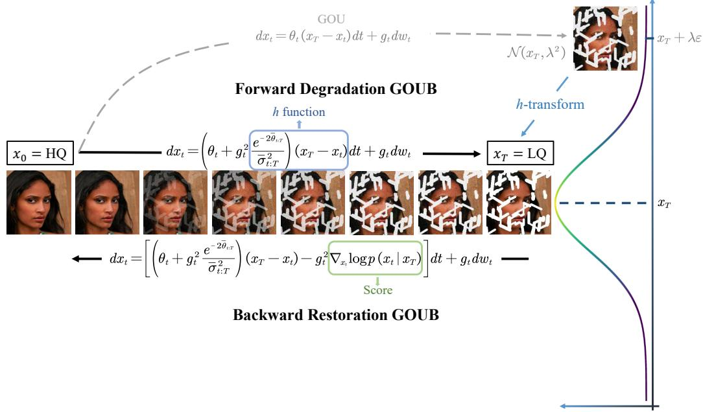
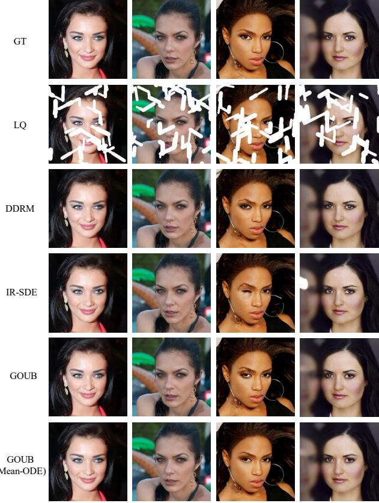
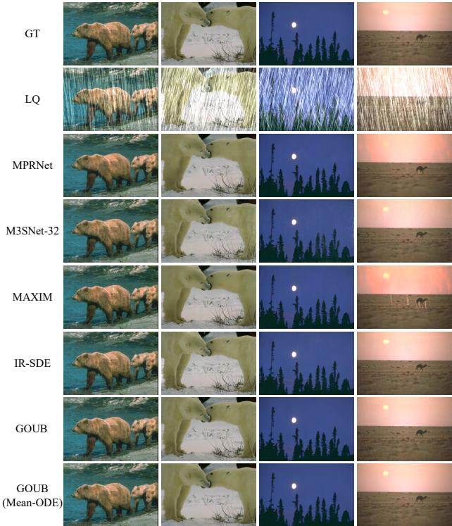
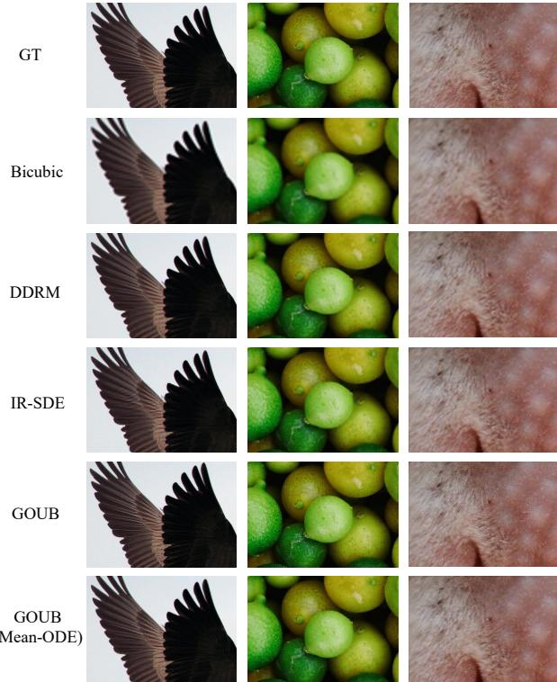
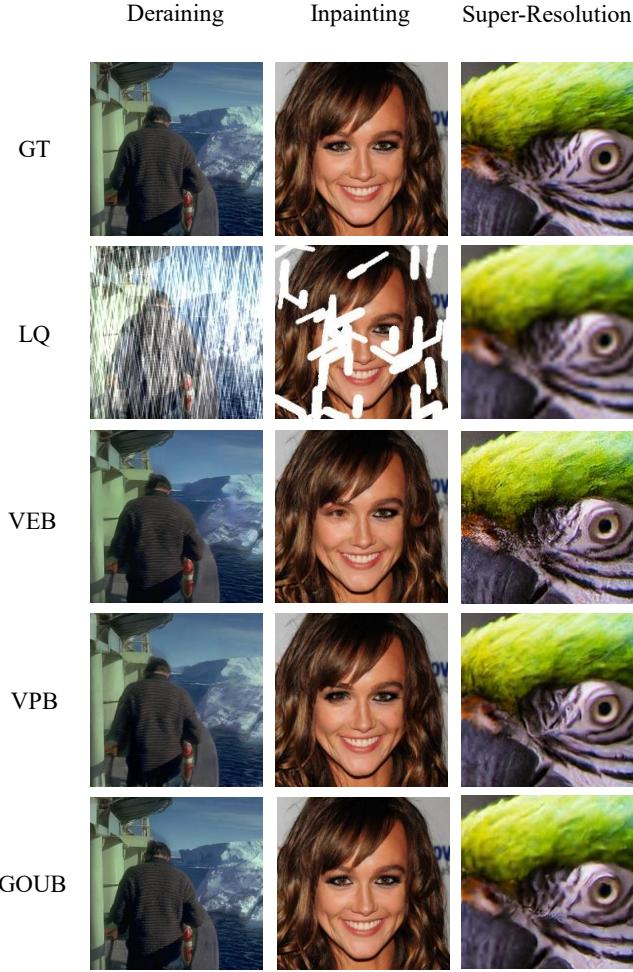
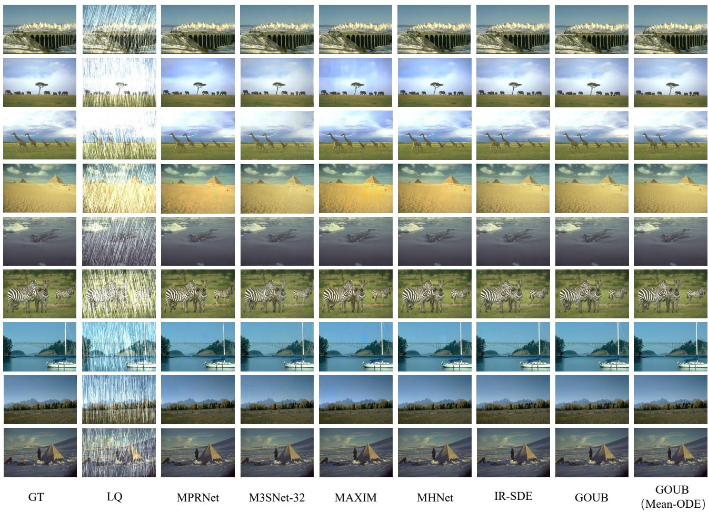
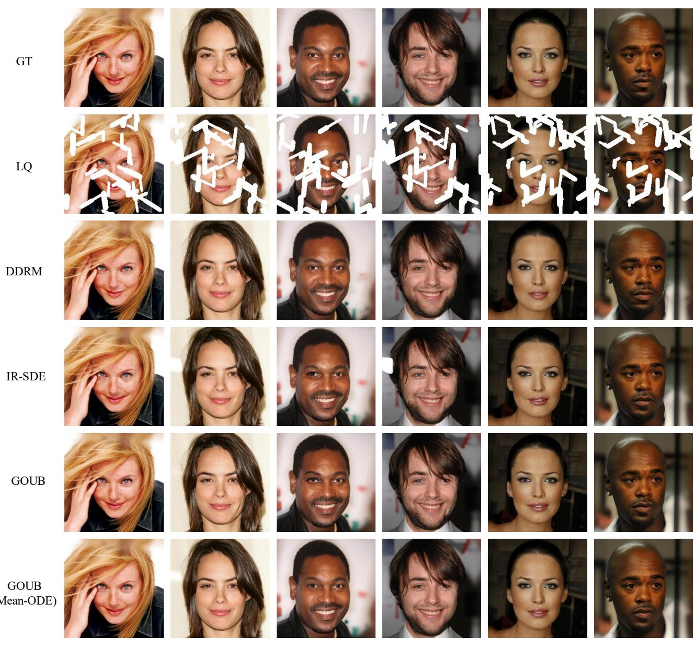
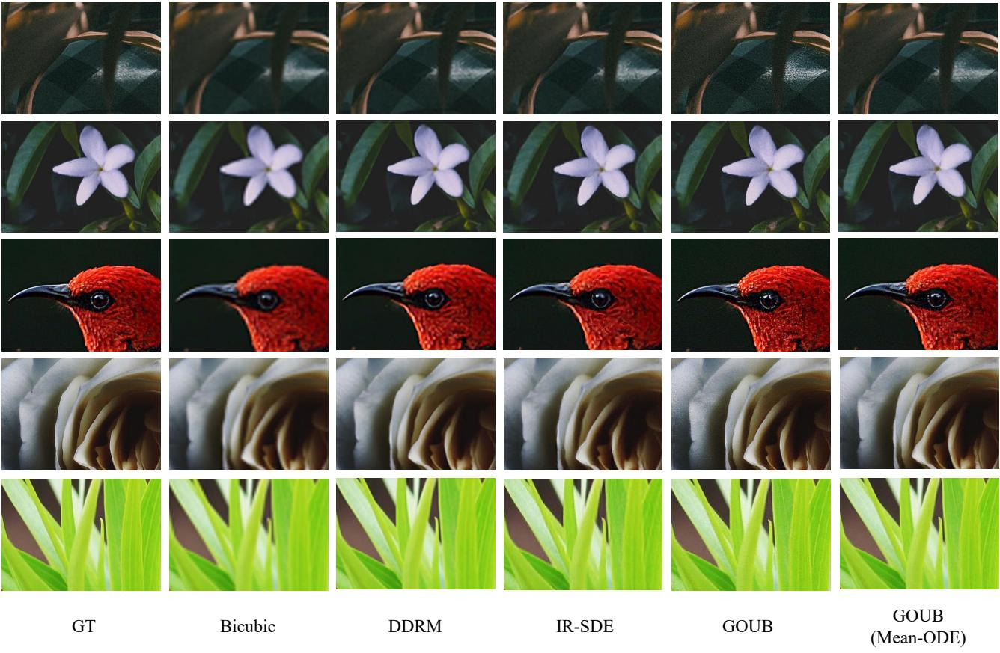

# Image Restoration Through Generalized Ornstein-Uhlenbeck Bridge

Conghan Yue 1 Zhengwei Peng 1 Junlong Ma 1 Shiyan Du 1 Pengxu Wei 1 2 Dongyu Zhang 1

# Abstract

Diffusion models exhibit powerful generative capabilities enabling noise mapping to data via reverse stochastic differential equations. However, in image restoration, the focus is on the mapping relationship from low-quality to high-quality images. Regarding this issue, we introduce the Generalized Ornstein-Uhlenbeck Bridge (GOUB) model. By leveraging the natural mean-reverting property of the generalized OU process and further eliminating the variance of its steady-state distribution through the Doob’s $h _ { \mathbf { \alpha } }$ –transform, we achieve diffusion mappings from point to point enabling the recovery of high-quality images from low-quality ones. Moreover, we unravel the fundamental mathematical essence shared by various bridge models, all of which are special instances of GOUB and empirically demonstrate the optimality of our proposed models. Additionally, we present the corresponding MeanODE model adept at capturing both pixel-level details and structural perceptions. Experimental outcomes showcase the state-of-the-art performance achieved by both models across diverse tasks, including inpainting, deraining, and super-resolution. Code is available at https: //github.com/Hammour-steak/GOUB.

2020; Xiao et al., 2022), denoising (Zhang et al., 2018a; Li et al., 2022; Soh & Cho, 2022; Zhang et al., 2023a), deblurring (Yuan et al., 2007; Kong et al., 2023), inpainting (Jain et al., 2023; Zhang et al., 2023b), and super-resolution (Dong et al., 2015; Zamfir et al., 2023; Wei et al., 2023), among others.

Diffusion models (Sohl-Dickstein et al., 2015; Ho et al., 2020; Song & Ermon, 2019; Song et al., 2021b; Karras et al., 2022) have also been applied to image restoration, yielding favorable results (Ho & Salimans, 2021; Wang et al., 2023; Su et al., 2022; Shi et al., 2024). They mainly follow the standard forward process, diffusing images to pure noise and using low-quality images as conditions to facilitate the generation process of high-quality images (Dhariwal & Nichol, 2021; Ho & Salimans, 2021; Kawar et al., 2021; Saharia et al., 2022; Kawar et al., 2022; Chung et al., 2022b;a; Wang et al., 2023). However, these approaches require the integration of substantial prior knowledge specific to each task such as degradation matrices, limiting their universality.

# 1. Introduction

Image restoration involves the restoring of high-quality (HQ) images from their low-quality (LQ) version (Banham & Katsaggelos, 1997; Zhou et al., 1988; Liang et al., 2021; Luo et al., 2023b), which is often characterized as an ill-posed inverse problem due to the loss of crucial information during the degradation from high-quality images to low-quality images. It encompasses a suite of classical tasks, including image deraining (Zhang & Patel, 2017; Yang et al.,

Furthermore, some studies have attempted to establish a point-to-point mapping from low-quality to high-quality images, learning the general degradation and restoration process and thus circumventing the need for additional prior information for modeling specific tasks (Chen et al., 2022; Cui et al., 2023; Lee et al., 2024). In terms of diffusion models, this mapping can be realized through the bridge (Liu et al., 2022; Su et al., 2022; Liu et al., 2023a), a stochastic process with fixed starting and ending points. By assigning high-quality and low-quality images to the starting and ending points, and initiating with the low-quality images, high-quality images can be obtained by applying the reverse diffusion process, thereby enabling image restoration. However, some bridge models face challenges in learning likelihoods (Liu et al., 2022), necessitating reliance on cumbersome iterative approximation methods (De Bortoli et al., 2021; Su et al., 2022; Shi et al., 2024), which pose significant constraints in practical applications; others do not consider the selection of diffusion process and ignore the optimality of diffusion process (Liu et al., 2023a; Li et al., 2023; Zhou et al., 2024), thus may introducing unnecessary costs and limiting the performance of the model.

This paper proposed a novel image restoration bridge model, the Generalized Ornstein-Uhlenbeck Bridge (GOUB), depicted in Figure 1. Owing to the mean-reverting properties of the Generalized Ornstein-Uhlenbeck (GOU) process, it gradually diffuses the HQ image into a noisy LQ state (denoted as ${ \bf x } _ { T } + \lambda \epsilon$ in Figure 1). By applying Doob’s $h$ -transform on GOU, we modify the diffusion process to eliminate noise on $\mathbf { x } _ { T }$ to directly bridge the HQ image and its LQ counterpart. The model initiates a point-to-point forward diffusion process and learns its reverse through maximum likelihood estimation, thereby ensuring it can restore a low-quality image to the corresponding high-quality image avoiding the limitation of generality and costly iterative approximation. Our main contributions can be summarized as follows:

• We introduce a novel image restoration bridge model GOUB which eliminates variance of the ending point on the GOU process, directly connecting the high and low-quality images and is particularly expressive in deep visual features and diversity.

• Benefiting from the distinctive features of the parameterization mechanism, we introduce the corresponding Mean-ODE model, demonstrating a strong ability to capture pixel-level details and structural perceptions.

• We uncover the mathematical essence of several bridge models, all of which are special cases of the GOUB, and empirically demonstrate the optimality of our proposed models.

• Our model has achieved state-of-the-art results on numerous image restoration tasks, such as inpainting, deraining, and super-resolution.

# 2. Preliminaries

# 2.1. Score-based Diffusion Model

The score-based diffusion model (Sohl-Dickstein et al., 2015; Ho et al., 2020; Song et al., 2021b) is a category of generative model that seamlessly transitions data into noise via a diffusion process and generates samples by learning and adapting the reverse process (Anderson, 1982). Assuming a dataset consists of $n$ dimensional independent identically distributed (i.i.d.) samples, following an unknown distribution denoted by $p ( \mathbf { x _ { 0 } } )$ . The time-dependent forward process of the diffusion model can be described by the following SDE:

$$
\mathrm { d } \mathbf { x } _ { t } = \mathbf { f } \left( \mathbf { x } _ { t } , t \right) \mathrm { d } t + g _ { t } \mathrm { d } \mathbf { w } _ { t } ,
$$

where $\mathbf { f } : \mathbb { R } ^ { n }  \mathbb { R } ^ { n }$ is the drift coefficient, $g _ { t } : \mathbb { R }  \mathbb { R }$ is the scalar diffusion coefficient and $\mathbf { w } _ { t }$ denotes the standard Brownian motion. Typically, $p ( \mathbf { x } _ { 0 } )$ evolves over time $t$ from 0 to a sufficiently large $T$ into $p ( \mathbf { x } _ { T } )$ through the

SDE, such that $p ( \mathbf { x } _ { T } )$ will approximate a standard Gaussian distribution $p _ { \mathrm { p r i o r } } ( \mathbf { x } )$ . Meanwhile, the forward SDE has a corresponding reverse time SDE (Anderson, 1982) whose closed form is given by:

$$
\mathrm { d } \mathbf { x } _ { t } = \left[ \mathbf { f } \left( \mathbf { x } _ { t } , t \right) - g _ { t } ^ { 2 } \nabla _ { \mathbf { x } _ { t } } \log p ( \mathbf { x } _ { t } ) \right] \mathrm { d } t + g _ { t } \mathrm { d } \mathbf { w } _ { t } .
$$

Starting from time $T$ , $p ( \mathbf { x } _ { T } )$ can progressively transform to $p ( \mathbf { x } _ { 0 } )$ by traversing the trajectory of the reverse SDE. The score $\nabla _ { \mathbf { x } _ { t } } \log p ( \mathbf { x } _ { t } )$ can generally be parameterized as $\mathbf { s } _ { \theta } ( \mathbf { x } _ { t } , t )$ and employ conditional score matching (Vincent, 2011) as the loss function for training:

$$
\begin{array} { l } { \displaystyle \mathcal { L } = \frac { 1 } { 2 } \int _ { 0 } ^ { T } \mathbb { E } _ { \mathbf { x } _ { t } } \left[ \lambda \left( t \right) \left. \nabla _ { \mathbf { x } _ { t } } \log p \left( \mathbf { x } _ { t } \right) - \mathbf { s } _ { \theta } \left( \mathbf { x } _ { t } , t \right) \right. ^ { 2 } \right] \mathrm { d } t } \\ { \displaystyle \propto \frac { 1 } { 2 } \int _ { 0 } ^ { T } \mathbb { E } _ { \mathbf { x } _ { 0 } , \mathbf { x } _ { t } } \left[ \lambda \left( t \right) \left. \nabla _ { \mathbf { x } _ { t } } \log p \left( \mathbf { x } _ { t } \mid \mathbf { x } _ { 0 } \right) - \mathbf { s } _ { \theta } \left( \mathbf { x } _ { t } , t \right) \right. ^ { 2 } \right] \mathrm { d } t , } \end{array}
$$

where $\lambda ( t )$ serves as a weighting function, and if selected as $g _ { t } ^ { 2 }$ that yields a more optimal upper bound on the negative log-likelihood (Song et al., 2021a). The second line is actually the most commonly used, as the conditional probability $p ( \mathbf { x } _ { t } \mid \mathbf { x } _ { 0 } )$ is generally accessible. Ultimately, one can sample $\mathbf { x } _ { T }$ from the prior distribution $p ( \mathbf { x } _ { T } ) \approx p _ { \mathrm { p r i o r } } ( \mathbf { x } )$ and obtain the $\mathbf { x } _ { \mathrm { 0 } }$ through the numerical solution of Equation (2) via iterative steps, thereby completing the generation process.

# 2.2. Generalized Ornstein-Uhlenbeck process

The Generalized Ornstein-Uhlenbeck (GOU) process is the time-varying OU process (Ahmad, 1988). It is a stationary Gaussian-Markov process, whose marginal distribution gradually tends towards a stable mean and variance over time. The GOU process is generally defined as follows:

$$
\mathrm { d } \mathbf { x } _ { t } = \theta _ { t } \left( \pmb { \mu } - \mathbf { x } _ { t } \right) \mathrm { d } t + g _ { t } \mathrm { d } \mathbf { w } _ { t } ,
$$

where $\pmb { \mu }$ is a given state vector, $\theta _ { t }$ denotes a scalar drift coefficient and $g _ { t }$ represents the diffusion coefficient. At the same time, we require $\theta _ { t } , g _ { t }$ to satisfy the specified relationship $2 \lambda ^ { 2 } = g _ { t } ^ { 2 } / \theta _ { t }$ , where $\lambda ^ { 2 }$ is a given constant scalar. As a result, its transition probability possesses a closed-form analytical solution:

$$
\begin{array} { c } { p \left( \mathbf { x } _ { t } \mid \mathbf { x } _ { s } \right) = N ( \mathbf { \bar { m } } _ { s : t } , \bar { \sigma } _ { s : t } ^ { 2 } I ) = } \\ { N \left( \mu + \left( \mathbf { x } _ { s } - \mu \right) e ^ { - \bar { \theta } _ { s : t } } , \displaystyle \frac { g _ { t } ^ { 2 } } { 2 \theta _ { t } } \left( 1 - e ^ { - 2 \bar { \theta } _ { s : t } } \right) I \right) , } \\ { \bar { \theta } _ { s : t } = \displaystyle \int _ { s } ^ { t } \theta _ { z } d z . } \end{array}
$$

A simple proof is provided in Appendix C. For the sake of simplicity in subsequent representations, we denote $\bar { \theta } _ { 0 : t }$ and $\bar { \sigma } _ { 0 : t }$ as ${ \bar { \theta } } _ { t }$ and $\bar { \sigma } _ { t }$ respectively. Consequently, $p ( \mathbf { x } _ { t } )$ will steadily converge towards a Gaussian distribution with the mean of $\pmb { \mu }$ and the variance of $\lambda ^ { 2 }$ as time $t$ progresses meaning that it exhibits the mean-reverting property.

  
Figure 1. Overview of the proposed GOUB for image restoration. The GOU process is capable of transferring an HQ image into a noisy LQ image. Additionally, through the application of $h$ -transform, we can eliminate the noise on LQ, enabling the GOUB model to precisely bridge the gap between HQ and LQ.

# 2.3. Doob’s $\pmb { h }$ -transform

Doob’s $h$ -transform (Sarkk ¨ a & Solin ¨ , 2019) is a mathematical technique applied to stochastic processes. It involves transforming the original process by incorporating a specific $h$ -function into the drift term of the SDE, modifying the process to pass through a predetermined terminal point. More precisely, given the SDE (1), if it is desired to pass through the given fixed point $\mathbf { x } _ { T }$ at $t = T$ , an additional drift term must be incorporated into the original SDE:

$$
\mathrm { d } \mathbf { x } _ { t } = \left[ \mathbf { f } ( \mathbf { x } _ { t } , t ) + g _ { t } ^ { 2 } \mathbf { h } ( \mathbf { x } _ { t } , t , \mathbf { x } _ { T } , T ) \right] \mathrm { d } t + g _ { t } \mathrm { d } \mathbf { w } _ { t } ,
$$

where $\mathbf { h } ( \mathbf { x } _ { t } , t , \mathbf { x } _ { T } , T ) = \nabla _ { \mathbf { x } _ { t } } \log p ( \mathbf { x } _ { T } \mid \mathbf { x } _ { t } )$ and $\mathbf { x } _ { \mathrm { 0 } }$ starts from $p \left( \mathbf { x } _ { 0 } \mid \mathbf { x } _ { T } \right)$ . A simple proof can be found in Appendix D. In comparison to (1), the marginal distribution of (6) is conditioned on $\mathbf { x } _ { T }$ , with its forward conditional probability density given by $p ( \mathbf { x } _ { t } \mid \mathbf { x } _ { 0 } , \mathbf { x } _ { T } )$ satisfying the forward Kolmogorov equation that is defined by (6). Intuitively, $p ( \mathbf { x } _ { T } \mid \mathbf { x } _ { 0 } , \mathbf { x } _ { T } ) = 1$ at $t = T$ , ensuring that the SDE invariably passes through the specified point $\mathbf { x } _ { T }$ for any initial state $\mathbf { x } _ { \mathrm { 0 } }$ .

# 3. GOUB

The GOU process (4) is characterized by mean-reverting properties that if we consider the initial state $\mathbf { x } _ { \mathrm { 0 } }$ to represent a high-quality image and the corresponding low-quality image $\mathbf { x } _ { T } = \mu$ as the final condition, then the high-quality image will gradually converge to a Gaussian distribution with the low-quality image as its mean and a stable variance $\lambda ^ { 2 }$ . This naturally connects some information between high and low-quality images, offering an inherent advantage in image restoration. However, the initial state of the reverse process necessitates the artificial addition of noise to lowquality images, resulting in certain information loss and thus affecting the performance (Luo et al., 2023a).

In actuality, we are more focused on the connections between points (Liu et al., 2022; De Bortoli et al., 2021; Su et al., 2022; Li et al., 2023; Zhou et al., 2024) in image restoration. Coincidentally, the Doob’s $h$ -transform technique can modify an SDE such that it passes through a specified $\mathbf { x } _ { T }$ at terminal time $T$ . Accordingly, it is crucial to note that the application of the $h$ -transform to the GOU process effectively eliminates the impact of terminal noise, directly bridging a point-to-point relationship between highquality and low-quality images.

# 3.1. Forward and backward process

Applying the $h$ -transform, we can readily derive the forward process of the GOUB, leading to the following proposition:

Proposition 3.1. Let $\mathbf { x } _ { t }$ be a finite random variable describing by the given generalized Ornstein-Uhlenbeck process (4), suppose $\mathbf { x } _ { T } = \mu$ , the evolution of its marginal distribution $p ( \mathbf { x } _ { t } \mid \mathbf { x } _ { T } )$ satisfies the following $S D E$ :

$$
\mathrm { d } { \mathbf { x } } _ { t } = \left( \theta _ { t } + g _ { t } ^ { 2 } \frac { e ^ { - 2 \bar { \theta } _ { t : T } } } { \bar { \sigma } _ { t : T } ^ { 2 } } \right) ( { \mathbf { x } } _ { T } - { \mathbf { x } } _ { t } ) \mathrm { d } t + g _ { t } \mathrm { d } { \mathbf { w } } _ { t } .
$$

Additionally, the forward transition $p ( \mathbf { x } _ { t } \mid \mathbf { x } _ { 0 } , \mathbf { x } _ { T } )$ is given

by:

$$
\begin{array} { c } { { p ( { \bf x } _ { t } \mid { \bf x } _ { 0 } , { \bf x } _ { T } ) = N ( \bar { \bf m } _ { t } ^ { \prime } , \bar { \sigma } _ { t } ^ { \prime 2 } { \bf I } ) , } } \\ { { \bar { \bf m } _ { t } ^ { \prime } = e ^ { - \bar { \theta } _ { t } } \frac { \bar { \sigma } _ { t : T } ^ { 2 } } { \bar { \sigma } _ { T } ^ { 2 } } { \bf x } _ { 0 } + \left[ \left( 1 - e ^ { - \bar { \theta } _ { t } } \right) \frac { \bar { \sigma } _ { t : T } ^ { 2 } } { \bar { \sigma } _ { T } ^ { 2 } } + e ^ { - 2 \bar { \theta } _ { t : T } } \frac { \bar { \sigma } _ { t } ^ { 2 } } { \bar { \sigma } _ { T } ^ { 2 } } \right] { \bf x } _ { T } } } \\ { { \bar { \sigma } _ { t } ^ { \prime 2 } = \frac { \bar { \sigma } _ { t } ^ { 2 } \bar { \sigma } _ { t : T } ^ { 2 } } { \bar { \sigma } _ { T } ^ { 2 } } } } \end{array}
$$

The derivation of the proposition is provided in the Appendix A.1. With Proposition 3.1, there is no need to perform multi-step forward iteration using the SDE; instead, we can directly use its closed-form solution for one-step forward sampling.

Similarly, applying the previous SDE theory enables us to easily derive the reverse process, which leads to the following Proposition 3.2:

Proposition 3.2. The reverse SDE of equation (7) has a marginal distribution $p ( \mathbf { x } _ { t } \mid \mathbf { x } _ { T } )$ , and is given by:

$$
\begin{array} { r l } & { \mathrm { d } \mathbf { x } _ { t } = \Bigg [ \left( \theta _ { t } + g _ { t } ^ { 2 } \frac { e ^ { - 2 \overline { { \theta } } _ { t : T } } } { \overline { { \sigma } } _ { t : T } ^ { 2 } } \right) \left( \mathbf { x } _ { T } - \mathbf { x } _ { t } \right) } \\ & { \qquad - g _ { t } ^ { 2 } \nabla _ { \mathbf { x } _ { t } } \log p ( \mathbf { x } _ { t } \mid \mathbf { x } _ { T } ) \Bigg ] \mathrm { d } t + g _ { t } \mathrm { d } \mathbf { w } _ { t } , } \end{array}
$$

and exists a probability flow ODE:

$$
\begin{array} { l } { \displaystyle \mathrm { d } \mathbf { x } _ { t } = \Bigg [ \left( \theta _ { t } + g _ { t } ^ { 2 } \frac { e ^ { - 2 \bar { \theta } _ { t : T } } } { \bar { \sigma } _ { t : T } ^ { 2 } } \right) \left( \mathbf { x } _ { T } - \mathbf { x } _ { t } \right) } \\ { \displaystyle \qquad - \left. \frac { 1 } { 2 } g _ { t } ^ { 2 } \nabla _ { \mathbf { x } _ { t } } \log p ( \mathbf { x } _ { t } \mid \mathbf { x } _ { T } ) \right] \mathrm { d } t . } \end{array}
$$

We are capable of initiating from a low-quality image $\mathbf { x } _ { T }$ and proceeding to utilize Euler sampling solving the reverse SDE or ODE for restoration purposes.

# 3.2. Training object

The score term $\nabla _ { \mathbf { x } _ { t } } \log p ( \mathbf { x } _ { t } \mid \mathbf { x } _ { T } )$ can be parameterized by a neural network $\mathbf { s } _ { \pmb { \theta } } ( \mathbf { x } _ { t } , \mathbf { x } _ { T } , t )$ and can be estimated using the loss function (3). Unfortunately, training the score function for SDEs generally presents a significant challenge. Nevertheless, since the analytical form of GOUB is directly obtainable, we will introduce the use of maximum likelihood for training, which yields a more stable loss function.

We first discretize the continuous time interval $[ 0 , T ]$ into $N$ sufficiently fine-grained intervals in a reasonable manner, denoted as $\{ \mathbf { x } _ { t } \} _ { t \in [ 0 , N ] }$ , ${ \bf x } _ { N } = { \bf x } _ { T }$ . We are concerned with maximizing the log-likelihood, which leads us to the following proposition:

Proposition 3.3. Let $\mathbf { x } _ { t }$ be a finite random variable describing by the given generalized Ornstein-Uhlenbeck process (4), for a fixed $\mathbf { x } _ { T }$ , the expectation of log-likelihood $\mathbb { E } _ { p ( \mathbf { x } _ { 0 } ) } [ \log p _ { \pmb { \theta } } ( \mathbf { x } _ { 0 } \mid \mathbf { x } _ { T } ) ]$ possesses an Evidence Lower Bound $( E L B O )$ :

$$
\begin{array} { l } { E L B O = \mathbb { E } _ { p ( \mathbf { x } _ { 0 } ) } \Bigg [ \mathbb { E } _ { p ( \mathbf { x } _ { 1 } \mid \mathbf { x } _ { 0 } ) } \left[ \log p _ { \theta } \left( \mathbf { x } _ { 0 } \mid \mathbf { x } _ { 1 } , \mathbf { x } _ { T } \right) \right] - } \\ { \displaystyle \sum _ { t = 2 } ^ { T } \mathbb { E } _ { p ( x _ { t } \mid x _ { 0 } ) } [ K L \left( p \left( \mathbf { x } _ { t - 1 } \mid \mathbf { x } _ { 0 } , \mathbf { x } _ { t } , \mathbf { x } _ { T } \right) \mid \left| p _ { \theta } \left( \mathbf { x } _ { t - 1 } \mid \mathbf { x } _ { t } , \mathbf { x } _ { T } \right) \right) \right] \Bigg ] } \end{array}
$$

Assuming $p _ { \pmb { \theta } } \left( \mathbf { x } _ { t - 1 } \mid \mathbf { x } _ { t } , \mathbf { x } _ { T } \right)$ is a Gaussian distribution with a constant variance $N ( \pmb { \mu } _ { \pmb { \theta } , t - 1 } , \sigma _ { \pmb { \theta } , t - 1 } ^ { 2 } \pmb { I } )$ , maximizing the ELBO is equivalent to minimizing:

$$
\mathcal { L } = \mathbb { E } _ { t , \mathbf { x } _ { 0 } , \mathbf { x } _ { t } , \mathbf { x } _ { T } } \left[ \frac { 1 } { 2 \sigma _ { \pmb { \theta } , t - 1 } ^ { 2 } } \lVert \pmb { \mu } _ { t - 1 } - \pmb { \mu } _ { \pmb { \theta } , t - 1 } \rVert ^ { 2 } \right] ,
$$

where $\pmb { \mu } _ { t - 1 }$ represents the mean of $p \left( \mathbf { x } _ { t - 1 } \mid \mathbf { x } _ { 0 } , \mathbf { x } _ { t } , \mathbf { x } _ { T } \right)$ :

$$
\pmb { \mu } _ { t - 1 } = \frac { 1 } { \bar { \sigma } _ { t } ^ { \prime 2 } } \left[ \bar { \sigma } _ { t - 1 } ^ { \prime 2 } ( \mathbf { x } _ { t } - b \mathbf { x } _ { T } ) a + ( \bar { \sigma } _ { t } ^ { \prime 2 } - \bar { \sigma } _ { t - 1 } ^ { \prime 2 } a ^ { 2 } ) \bar { \mathbf { m } } _ { t } ^ { \prime } \right] ,
$$

where,

$$
\begin{array} { l } { { a = \displaystyle \frac { e ^ { - \bar { \theta } _ { t - 1 : t } } \bar { \sigma } _ { t : T } ^ { 2 } } { \bar { \sigma } _ { t - 1 : T } ^ { 2 } } , } } \\ { { b = \displaystyle \frac { 1 } { \bar { \sigma } _ { T } ^ { 2 } } \left\{ ( 1 - e ^ { - \bar { \theta } _ { t } } ) \bar { \sigma } _ { t : T } ^ { 2 } + e ^ { - 2 \bar { \theta } _ { t : T } } \bar { \sigma } _ { t } ^ { 2 } \right. } } \\ { { \left. \quad - \left[ ( 1 - e ^ { - \bar { \theta } _ { t - 1 } } ) \bar { \sigma } _ { t - 1 : T } ^ { 2 } + e ^ { - 2 \bar { \theta } _ { t - 1 : T } } \bar { \sigma } _ { t - 1 } ^ { 2 } \right] a \right\} } } \end{array}
$$

The derivation of the proposition is provided in the Appendix A.2. With Proposition 3.3, we can easily construct the training objective. In this work, we try to parameterized $\pmb { \mu _ { \pmb { \theta } , t - 1 } }$ from differential of SDE which can be derived from equation (9):

$$
\begin{array} { r l r } {  { \mathbf { x } _ { t - 1 } = \mathbf { x } _ { t } - ( \theta _ { t } + g _ { t } ^ { 2 } \frac { e ^ { - 2 \bar { \theta } _ { t : T } } } { \bar { \sigma } _ { t : T } ^ { 2 } } ) ( \mathbf { x } _ { T } - \mathbf { x } _ { t } ) } } \\ & { } & { + g _ { t } ^ { 2 } \nabla _ { \mathbf { x } _ { t } } \log p ( \mathbf { x } _ { t } \mid \mathbf { x } _ { T } ) - g _ { t } \boldsymbol { \epsilon } _ { t } , } \end{array}
$$

where $\epsilon _ { t } \sim N ( \mathbf { 0 } , \mathrm { d } t I )$ , therefore:

$$
\begin{array} { r l } & { \mu _ { \boldsymbol { \theta } , t - 1 } = \mathbf { x } _ { t } - \left( \theta _ { t } + g _ { t } ^ { 2 } \frac { e ^ { - 2 \overline { { \theta } } _ { t : T } } } { \overline { { \sigma } } _ { t : T } ^ { 2 } } \right) ( \mathbf { x } _ { T } - \mathbf { x } _ { t } ) } \\ & { \qquad + g _ { t } ^ { 2 } \nabla _ { \mathbf { x } _ { t } } \log p _ { \boldsymbol { \theta } } ( \mathbf { x } _ { t } \mid \mathbf { x } _ { T } ) , } \\ & { \sigma _ { \boldsymbol { \theta } , t - 1 } = g _ { t } . } \end{array}
$$

Inspired by conditional score matching, we can parameterize noise as $\epsilon _ { \theta } ( \mathbf { x } _ { t } , \mathbf { x } _ { T } , t )$ , thus the score $\nabla _ { \mathbf { x } _ { t } } \log p _ { \theta } ( \mathbf { x } _ { t } \mid \mathbf { x } _ { T } )$ can be represented as $- \epsilon _ { \theta } ( { \bf x } _ { t } , { \bf x } _ { T } , t ) / \bar { \sigma } _ { t } ^ { \prime }$ . In addition, during our empirical research, we found that utilizing L1 loss yields enhanced image reconstruction outcomes (Boyd & Vandenberghe, 2004; Hastie et al., 2009). This approach enables the model to learn pixel-level details more easily, resulting in markedly improved visual quality. Therefore, the final training object is:

$$
\begin{array} { r l } & { \mathcal { L } = \mathbb { E } _ { t , \mathbf { x } _ { 0 } , \mathbf { x } _ { t } , \mathbf { x } _ { T } } \left[ \displaystyle \frac { 1 } { 2 g _ { t } ^ { 2 } } \right] \frac { 1 } { \sigma _ { t } ^ { \prime 2 } } \left[ \bar { \sigma } _ { t - 1 } ^ { \prime 2 } ( \mathbf { x } _ { t } - b \mathbf { x } _ { T } ) a \right. } \\ & { \qquad \left. + ( \bar { \sigma } _ { t } ^ { \prime 2 } - \bar { \sigma } _ { t - 1 } ^ { \prime 2 } a ^ { 2 } ) \mathbf { \bar { m } } _ { t } ^ { \prime } \right] - \mathbf { x } _ { t } } \\ & { \qquad + \left( \theta _ { t } + g _ { t } ^ { 2 } \frac { e ^ { - 2 \bar { \theta } _ { t , T } } } { \bar { \sigma } _ { t , T } ^ { 2 } } \right) ( \mathbf { x } _ { T } - \mathbf { x } _ { t } ) } \\ & { \qquad + \displaystyle \frac { g _ { t } ^ { 2 } } { \sigma _ { t } ^ { \prime } } \epsilon ( \mathbf { x } _ { t } , \mathbf { x } _ { T } , t ) \left| \right] } \end{array}
$$

Consequently, if we obtain the optimal $\epsilon _ { \theta } ^ { * } ( \mathbf { x } _ { t } , \mathbf { x } _ { T } , t )$ , we can compute the score $\begin{array} { r l } { \nabla _ { \mathbf { x } _ { t } } \log p ( \mathbf { x } _ { t } } & { { } | \quad \mathbf { x } _ { T } ) } \end{array} \approx$ $- \mathbf { \epsilon } _ { \theta } ^ { * } ( \mathbf { x } _ { t } , \mathbf { x } _ { T } , t ) / \bar { \sigma } _ { t } ^ { \prime }$ for reverse process. Starting from a lowquality image $\mathbf { x } _ { T }$ , we can recover $\mathbf { x } _ { \mathrm { 0 } }$ by using Equation (9) to perform reverse iteration.

# 3.3. Mean-ODE

Unlike normal diffusion models, our parameterization of the mean $\pmb { \mu _ { \pmb { \theta } , t - 1 } }$ is derived from the differential of SDE which effectively combines the characteristics of discrete diffusion models and continuous score-based generative models. In the reverse process, the value of each sampling step will approximated to the true mean during training. Therefore, we propose a Mean-ODE model, which omits the Brownian drift term:

$$
\begin{array} { l } { \displaystyle \mathrm { d } \mathbf { x } _ { t } = \Bigg [ \left( \theta _ { t } + g _ { t } ^ { 2 } \frac { e ^ { - 2 \bar { \theta } _ { t : T } } } { \bar { \sigma } _ { t : T } ^ { 2 } } \right) \left( \mathbf { x } _ { T } - \mathbf { x } _ { t } \right) } \\ { \displaystyle ~ - g _ { t } ^ { 2 } \nabla _ { \mathbf { x } _ { t } } \log p ( \mathbf { x } _ { t } \mid \mathbf { x } _ { T } ) \Bigg ] \mathrm { d } t , } \end{array}
$$

To simplify the expression, we use GOUB to represent the GOUB (SDE) sampling model and Mean-ODE to represent the GOUB (Mean-ODE) sampling model. Our following experiments have demonstrated that the Mean-ODE is more effective than the corresponding Score-ODE at capturing the pixel details and structural perceptions of images, playing a pivotal role in image restoration tasks. Concurrently, the SDE model (9) is more focused on deep visual features and diversity.

# 4. Experiments

We conduct experiments under three popular image restoration tasks: image inpainting, image deraining, and image super-resolution. Four metrics are employed for the model evaluation, i.e., Peak Signal-to-Noise Ratio (PSNR) for assessing reconstruction quality, Structural Similarity Index (SSIM) (Wang et al., 2004) for gauging structural perception, Learned Perceptual Image Patch Similarity (LPIPS) (Zhang et al., 2018b) for evaluating the depth and quality of features, and Frechet Inception Distance (FID) ( ´ Heusel et al., 2017) to measure the diversity in generated images. More experiment details are present in Appendix E.

Table 1. Image Inpainting. Qualitative comparison with the relevant baselines on CelebA-HQ.   

<table><tr><td>METHOD</td><td>PSNR↑</td><td>SSIM↑</td><td>LPIPS↓</td><td>FID↓</td></tr><tr><td>PromptIR</td><td>30.22</td><td>0.9180</td><td>0.068</td><td>32.69</td></tr><tr><td>DDRM</td><td>27.16</td><td>0.8993</td><td>0.089</td><td>37.02</td></tr><tr><td>IR-SDE</td><td>28.37</td><td>0.9166</td><td>0.046</td><td>25.13</td></tr><tr><td>GOUB</td><td>28.98</td><td>0.9067</td><td>0.037</td><td>4.30</td></tr><tr><td>Mean-ODE</td><td>31.39</td><td>0.9392</td><td>0.052</td><td>12.24</td></tr></table>

Image Inpainting. Image inpainting involves filling in missing or damaged parts of an image, to restore or enhance the overall visual effect of the image. We have selected the CelebA-HQ $2 5 6 \times 2 5 6$ datasets (Karras et al., 2018) for both training and testing with 100 thin masks. We compare our models with several current baseline inpainting approaches such as PromptIR (Potlapalli et al., 2023), DDRM (Kawar et al., 2022) and IR-SDE (Luo et al., 2023a). The relevant experimental results are shown in the Table 1 and Figure 2. It is observed that the two proposed models achieved stateof-the-art results in their respective areas of strength and also delivered highly competitive outcomes on other metrics. From a visual perspective, our model excels in capturing details such as eyebrows, eyes, and image backgrounds.

Image Deraining. We have selected the Rain100H datasets (Yang et al., 2017) for our training and testing, which includes 1800 pairs of training data and 100 images for testing. It is important to note that in this task, similar to other deraining models, we present the PSNR and SSIM scores specifically on the Y channel (YCbCr space). We report state-of-the-art approaches for comparison: MPRNet (Zamir et al., 2021), M3SNet-32 (Gao et al., 2023), MAXIM (Tu et al., 2022), MHNet (Gao & Dang, 2023), IR-SDE (Luo et al., 2023a). The relevant experimental results are shown in the Table 2 and Figure 3. Similarly, both models achieved SOTA results respectively in the deraining task. Visually, it can be also observed that our model excels in capturing details such as the moon, the sun, and tree branches.

Image Super-Resolution. Single image super-resolution aims to recover a higher resolution and clearer version from a low-resolution image. We conducted training and evaluation on the DIV2K validation set for $4 \times$ upscaling (Agustsson & Timofte, 2017) and all low-resolution images were bicubically rescaled to the same size as their corresponding high-resolution images. To show that our models are in line with the state-of-the-art, we compare to the DDRM (Kawar et al., 2022) and IR-SDE (Luo et al., 2023a). The relevant experimental results are provided in Table 3 and Figure 4. As can be seen, our GOUB is superior to benchmarks in various indicators and handles visual details better such as edges and hair.

  
Figure 2. Qualitative comparison of the visual results of different inpainting methods on the CelebA-HQ dataset with thin mask.

Superiority of Mean-ODE. Additionally, we conduct ablation experiments using the corresponding Score-ODE (10) model to demonstrate the superiority of our proposed Mean-ODE model in image restoration. From Table 4, it is evident that the performance of Mean-ODE is significantly superior to that of the corresponding Score-ODE. This is because the sampling results of each sampling step of MeanODE directly approximate the true mean during the training process, as opposed to the parameterized approach such as DDPM, which relies on expectations. Consequently, our proposed Mean-ODE demonstrates better reconstruction effects and is more suitable for image restoration tasks.

Table 2. Image Deraining. Qualitative comparison with the relevant baselines on Rain100H.   

<table><tr><td>METHOD</td><td>PSNR↑</td><td>SSIM↑</td><td>LPIPS↓</td><td>FID↓</td></tr><tr><td>MPRNet</td><td>30.41</td><td>0.8906</td><td>0.158</td><td>61.59</td></tr><tr><td>M3SNet-32</td><td>30.64</td><td>0.8920</td><td>0.154</td><td>60.26</td></tr><tr><td>MAXIM</td><td>30.81</td><td>0.9027</td><td>0.133</td><td>58.72</td></tr><tr><td>MHNet</td><td>31.08</td><td>0.8990</td><td>0.126</td><td>57.93</td></tr><tr><td>IR-SDE</td><td>31.65</td><td>0.9041</td><td>0.047</td><td>18.64</td></tr><tr><td>GOUB</td><td>31.96</td><td>0.9028</td><td>0.046</td><td>18.14</td></tr><tr><td>Mean-ODE</td><td>34.56</td><td>0.9414</td><td>0.077</td><td>32.83</td></tr></table>

Table 3. Image $4 \times$ Super-Resolution. Qualitative comparison with the relevant baselines on DIV2K.   

<table><tr><td>METHOD</td><td>PSNR↑</td><td>SSIM↑</td><td>LPIPS↓</td><td>FID↓</td></tr><tr><td>DDRM</td><td>24.35</td><td>0.5927</td><td>0.364</td><td>78.71</td></tr><tr><td>IR-SDE</td><td>25.90</td><td>0.6570</td><td>0.231</td><td>45.36</td></tr><tr><td>GOUB</td><td>26.89</td><td>0.7478</td><td>0.220</td><td>20.85</td></tr><tr><td>Mean-ODE</td><td>28.50</td><td>0.8070</td><td>0.328</td><td>22.14</td></tr></table>

# 5. Analysis

The Doob’s $h$ -transform of the generalized OrnsteinUhlenbeck process, also known as the conditional GOU process has been an intriguing topic in previous applied mathematical research (Salminen, 1984; Cheridito et al., 2003; Heng et al., 2021). On account of the mean-reverting property of the GOU process, applying the $h$ -transform makes it most straightforward to eliminate the variance and drive it towards a Dirac distribution in its steady state which is highly advantageous for its applications in image restoration. In previous research on diffusion models, there has been limited focus on the cases of $\mathbf { f }$ or $g$ , and generally used the VE process (Song et al., 2021b) represented by NCSN (Song & Ermon, 2019) or the VP process (Song et al., 2021b) represented by DDPM (Ho et al., 2020).

In this section, we demonstrate that the mathematical essence of several recent meaningful diffusion bridge models is the same (Li et al., 2023; Zhou et al., 2024; Liu et al., 2023a) and they all represent Brownian bridge (Chow, 2009) models, details are provided in the Appendix B.1. Then, we also found that the VE and VP processes are special cases of GOU, leading to the following proposition:

Proposition 5.1. For a given GOU process (4), there exists relationships:

$$
\begin{array} { r } { \underset { \theta _ { t }  0 } { \mathrm { l i m } } G O U = V E } \\ { \underset { \mu  0 , \lambda  1 } { \mathrm { l i m } } G O U = V P } \end{array}
$$

Details are provided in the Appendix B.2. Therefore, we conduct experiments on VE Bridge (VEB) (Li et al., 2023; Zhou et al., 2024; Liu et al., 2023a) and VP Bridge (VPB) (Zhou et al., 2024) to demonstrate the optimality of our proposed GOUB model in image restoration. We keep all the model hyperparameters consistent and results are shown in Table 5 and Figure 5.

Table 4. Qualitative comparison with the corresponding Score-ODE on various tasks.   

<table><tr><td rowspan="2">METHOD</td><td colspan="4">Image Inapinting</td><td colspan="4">Image Deraining</td><td colspan="4">Image 4× Super-Resolution</td></tr><tr><td>PSNR↑</td><td>SSIM↑</td><td>LPIPS↓</td><td>FID↓</td><td>PSNR↑</td><td>SSIM↑</td><td>LPIPS↓</td><td>FID↓</td><td>PSNR↑</td><td>SSIM↑</td><td>LPIPS↓</td><td>FID↓</td></tr><tr><td>Score-ODE</td><td>18.23</td><td>0.6266</td><td>0.389</td><td>161.54</td><td>13.64</td><td>0.7404</td><td>0.338</td><td>191.15</td><td>28.14</td><td>0.7993</td><td>0.344</td><td>25.51</td></tr><tr><td>Mean-ODE</td><td>31.39</td><td>0.9392</td><td>0.052</td><td>12.24</td><td>34.56</td><td>0.9414</td><td>0.077</td><td>32.83</td><td>28.50</td><td>0.8070</td><td>0.328</td><td>22.14</td></tr></table>

Table 5. Qualitative comparison with the different bridge models on CelebA-HQ, Rain100H, and DIV2K datasets.   

<table><tr><td rowspan="2">METHOD</td><td colspan="4">Image Inapinting</td><td colspan="4">Image Deraining</td><td colspan="4">Image 4× Super-Resolution</td></tr><tr><td>PSNR↑</td><td>SSIM↑</td><td>LPIPS↓</td><td>FID↓</td><td>PSNR↑</td><td>SSIM↑</td><td>LPIPS↓</td><td>FID↓</td><td>PSNR↑</td><td>SSIM↑</td><td>LPIPS↓</td><td>FID↓</td></tr><tr><td>VEB</td><td>27.75</td><td>0.8943</td><td>0.056</td><td>13.70</td><td>30.39</td><td>0.8975</td><td>0.059</td><td>28.54</td><td>24.21</td><td>0.5808</td><td>0.384</td><td>36.55</td></tr><tr><td>VPB</td><td>27.32</td><td>0.8841</td><td>0.049</td><td>11.87</td><td>30.89</td><td>0.8847</td><td>0.051</td><td>23.36</td><td>25.40</td><td>0.6041</td><td>0.342</td><td>29.17</td></tr><tr><td>GOUB</td><td>28.98</td><td>0.9067</td><td>0.037</td><td>4.30</td><td>31.96</td><td>0.9028</td><td>0.046</td><td>18.14</td><td>26.89</td><td>0.7478</td><td>0.220</td><td>20.85</td></tr></table>

  
Figure 3. Qualitative comparison of the visual results of different deraining methods on the Rain100H dataset.

  
Figure 4. Qualitative comparison of the visual results of different $4 \mathbf { x }$ super-resolution methods on the DIV2K dataset.

It can be seen that under the same configuration of model hyperparameters, the performance of the GOUB is notably superior to the other two types of bridge models, which demonstrates the optimality of GOUB and also highlights the importance of the choice of diffusion process in diffusion models.

# 6. Related Works

Conditional Generation. As previously highlighted, in the work of image restoration using diffusion models, the focus of some research has predominantly been on using lowquality images as conditional inputs $y$ to guide the generation process. They (Kawar et al., 2021; Saharia et al., 2022; Kawar et al., 2022; Chung et al., 2022a;b; 2023; Zhao et al., 2023; Murata et al., 2023; Feng et al., 2023) all endeavor to solve or approximate the classifier $\log \nabla _ { \mathbf { x } _ { t } } p ( \mathbf { y } \mid \mathbf { x } _ { t } )$ , necessitating the incorporation of additional prior knowledge to model specific degradation processes which both complex and lacking in universality.

  
Figure 5. Qualitative comparison with the different bridge models in many tasks.

Diffusion Bridge. This segment of work obviates the need for prior knowledge, constructing a diffusion bridge model from high-quality to low-quality images, thereby learning the degradation process. The previously mentioned approach (Liu et al., 2022; De Bortoli et al., 2021; Su et al., 2022; Liu et al., 2023a; Shi et al., 2024; Li et al., 2023; Zhou et al., 2024; Albergo et al., 2023) fall into this class and are characterized by the issues of significant computational expense in solution seeking and also not the optimal model framework. Additionally, some models of flow category (Lipman et al., 2023; Liu et al., 2023b; Tong et al., 2023;

Albergo & Vanden-Eijnden, 2023; Delbracio & Milanfar, 2023) also belong to the diffusion bridge models and face the similar issue.

# 7. Conclusion

In this paper, we introduced the Generalized OrnsteinUhlenbeck Bridge (GOUB) model, a diffusion bridge model that applies the Doob’s $h$ -transform to the GOU process. This model can address general image restoration tasks without the need for specific prior knowledge. Furthermore, we have uncovered the mathematical essence of several bridge models and empirically demonstrated the optimality of our proposed model. In addition, considering our unique mean parameterization mechanism, we proposed the MeanODE model. Experimental results indicate that both models achieve state-of-the-art results in their respective areas of strength on various tasks, including inpainting, deraining, and super-resolution. We believe that the exploration of diffusion process and bridge models holds significant importance not only in the field of image restoration but also in advancing the study of generative diffusion models.

# Acknowledgements

This work is supported in part by National Natural Science Foundation of China (NSFC) under Grant No. 62376292, U21A20470, and Guangdong Basic and Applied Basic Research Foundation under Grant No. 2024A1515011741.

# Impact Statement

This paper presents work whose goal is to advance the field of Machine Learning. There are many potential societal consequences of our work, none which we feel must be specifically highlighted here.

# References

Agustsson, E. and Timofte, R. Ntire 2017 challenge on single image super-resolution: Dataset and study. In Proceedings of the IEEE conference on computer vision and pattern recognition workshops, pp. 126–135, 2017.   
Ahmad, R. Introduction to stochastic differential equations, 1988.   
Albergo, M. and Vanden-Eijnden, E. Building normalizing flows with stochastic interpolants. In In Proceedigns of International Conference on Learning Representations (ICLR), 2023.   
Albergo, M. S., Boffi, N. M., and Vanden-Eijnden, E. Stochastic interpolants: A unifying framework for flows and diffusions. arXiv preprint arXiv:2303.08797, 2023.

Anderson, B. D. Reverse-time diffusion equation models. Stochastic Processes and their Applications, 12(3):313– 326, 1982.

Banham, M. R. and Katsaggelos, A. K. Digital image restoration. IEEE signal processing magazine, 14(2): 24–41, 1997.

Boyd, S. P. and Vandenberghe, L. Convex optimization. Cambridge university press, 2004.

Chen, L., Chu, X., Zhang, X., and Sun, J. Simple baselines for image restoration. In European Conference on Computer Vision, pp. 17–33. Springer, 2022.

Cheridito, P., Kawaguchi, H., and Maejima, M. Fractional ornstein-uhlenbeck processes. 2003.

Chow, W. C. Brownian bridge. Wiley interdisciplinary reviews: computational statistics, 1(3):325–332, 2009.

Chung, H., Kim, J., Mccann, M. T., Klasky, M. L., and Ye, J. C. Diffusion posterior sampling for general noisy inverse problems. In The Eleventh International Conference on Learning Representations, 2022a.

Chung, H., Sim, B., Ryu, D., and Ye, J. C. Improving diffusion models for inverse problems using manifold constraints. Advances in Neural Information Processing Systems, 35:25683–25696, 2022b.

Chung, H., Kim, J., Kim, S., and Ye, J. C. Parallel diffusion models of operator and image for blind inverse problems. In Proceedings of the IEEE/CVF Conference on Computer Vision and Pattern Recognition, pp. 6059–6069, 2023.

Cui, Y., Ren, W., Cao, X., and Knoll, A. Focal network for image restoration. In Proceedings of the IEEE/CVF international conference on computer vision, pp. 13001– 13011, 2023.

De Bortoli, V., Thornton, J., Heng, J., and Doucet, A. Diffusion schrodinger bridge with applications to score-based ¨ generative modeling. Advances in Neural Information Processing Systems, 34:17695–17709, 2021.

Delbracio, M. and Milanfar, P. Inversion by direct iteration: An alternative to denoising diffusion for image restoration. Transactions on Machine Learning Research, 2023.

Dhariwal, P. and Nichol, A. Diffusion models beat gans on image synthesis. Advances in neural information processing systems, 34:8780–8794, 2021.

Dong, C., Loy, C. C., He, K., and Tang, X. Image superresolution using deep convolutional networks. IEEE transactions on pattern analysis and machine intelligence, 38(2):295–307, 2015.

Feng, B. T., Smith, J., Rubinstein, M., Chang, H., Bouman, K. L., and Freeman, W. T. Score-based diffusion models as principled priors for inverse imaging. In Proceedings of the IEEE/CVF International Conference on Computer Vision, pp. 10520–10531, 2023.

Gao, H. and Dang, D. Mixed hierarchy network for image restoration. arXiv preprint arXiv:2302.09554, 2023.

Gao, H., Yang, J., Zhang, Y., Wang, N., Yang, J., and Dang, D. A mountain-shaped single-stage network for accurate image restoration. arXiv preprint arXiv:2305.05146, 2023.

Hastie, T., Tibshirani, R., Friedman, J. H., and Friedman, J. H. The elements of statistical learning: data mining, inference, and prediction, volume 2. Springer, 2009.

Heng, J., De Bortoli, V., Doucet, A., and Thornton, J. Simulating diffusion bridges with score matching. arXiv preprint arXiv:2111.07243, 2021.

Heusel, M., Ramsauer, H., Unterthiner, T., Nessler, B., and Hochreiter, S. Gans trained by a two time-scale update rule converge to a local nash equilibrium. Advances in neural information processing systems, 30, 2017.

Ho, J. and Salimans, T. Classifier-free diffusion guidance. In NeurIPS 2021 Workshop on Deep Generative Models and Downstream Applications, 2021.

Ho, J., Jain, A., and Abbeel, P. Denoising diffusion probabilistic models. Advances in neural information processing systems, 33:6840–6851, 2020.

Jain, J., Zhou, Y., Yu, N., and Shi, H. Keys to better image inpainting: Structure and texture go hand in hand. In Proceedings of the IEEE/CVF Winter Conference on Applications of Computer Vision, pp. 208–217, 2023.

Karras, T., Aila, T., Laine, S., and Lehtinen, J. Progressive growing of gans for improved quality, stability, and variation. In Proceedigns of International Conference on Learning Representations (ICLR), 2018.

Karras, T., Aittala, M., Aila, T., and Laine, S. Elucidating the design space of diffusion-based generative models. Advances in Neural Information Processing Systems, 35: 26565–26577, 2022.

Kawar, B., Vaksman, G., and Elad, M. Snips: Solving noisy inverse problems stochastically. Advances in Neural Information Processing Systems, 34:21757–21769, 2021.

Kawar, B., Elad, M., Ermon, S., and Song, J. Denoising diffusion restoration models. Advances in Neural Information Processing Systems, 35:23593–23606, 2022.

Kingma, D. P. and Ba, J. Adam: A method for stochastic optimization. In Proceedigns of International Conference on Learning Representations (ICLR), 2015.

Kong, L., Dong, J., Ge, J., Li, M., and Pan, J. Efficient frequency domain-based transformers for high-quality image deblurring. In Proceedings of the IEEE/CVF Conference on Computer Vision and Pattern Recognition, pp. 5886–5895, 2023.

Lee, H., Kang, K., Lee, H., Baek, S.-H., and Cho, S. Ugpnet: Universal generative prior for image restoration. In Proceedings of the IEEE/CVF Winter Conference on Applications of Computer Vision, pp. 1598–1608, 2024.

Li, B., Liu, X., Hu, P., Wu, Z., Lv, J., and Peng, X. Allin-one image restoration for unknown corruption. In Proceedings of the IEEE/CVF Conference on Computer Vision and Pattern Recognition, pp. 17452–17462, 2022.

Li, B., Xue, K., Liu, B., and Lai, Y.-K. Bbdm: Image-toimage translation with brownian bridge diffusion models. In Proceedings of the IEEE/CVF Conference on Computer Vision and Pattern Recognition, pp. 1952–1961, 2023.

Liang, J., Cao, J., Sun, G., Zhang, K., Van Gool, L., and Timofte, R. Swinir: Image restoration using swin transformer. In Proceedings of the IEEE/CVF international conference on computer vision, pp. 1833–1844, 2021.

Lipman, Y., Chen, R. T., Ben-Hamu, H., Nickel, M., and Le, M. Flow matching for generative modeling. In Proceedigns of International Conference on Learning Representations (ICLR), 2023.

Liu, G.-H., Chen, T., So, O., and Theodorou, E. Deep generalized schrodinger bridge. ¨ Advances in Neural Information Processing Systems, 35:9374–9388, 2022.

Liu, G.-H., Vahdat, A., Huang, D.-A., Theodorou, E. A., Nie, W., and Anandkumar, A. I2sb: image-to-image schrodinger bridge. In ¨ Proceedings of the 40th International Conference on Machine Learning, pp. 22042– 22062, 2023a.

Liu, X., Gong, C., and Liu, Q. Flow straight and fast: Learning to generate and transfer data with rectified flow. In Proceedigns of International Conference on Learning Representations (ICLR), 2023b.

Luo, Z., Gustafsson, F. K., Zhao, Z., Sjolund, J., and Sch ¨ on, ¨ T. B. Image restoration with mean-reverting stochastic differential equations. In International Conference on Machine Learning, pp. 23045–23066. PMLR, 2023a.

Luo, Z., Gustafsson, F. K., Zhao, Z., Sjolund, J., and ¨ Schon, T. B. Refusion: Enabling large-size realistic im-¨ age restoration with latent-space diffusion models. In Proceedings of the IEEE/CVF Conference on Computer Vision and Pattern Recognition, pp. 1680–1691, 2023b.

Murata, N., Saito, K., Lai, C.-H., Takida, Y., Uesaka, T., Mitsufuji, Y., and Ermon, S. Gibbsddrm: a partially collapsed gibbs sampler for solving blind inverse problems with denoising diffusion restoration. In Proceedings of the 40th International Conference on Machine Learning, pp. 25501–25522, 2023.

Nichol, A. Q. and Dhariwal, P. Improved denoising diffusion probabilistic models. In International Conference on Machine Learning, pp. 8162–8171. PMLR, 2021.

Potlapalli, V., Zamir, S. W., Khan, S., and Khan, F. S. Promptir: Prompting for all-in-one blind image restoration. arXiv preprint arXiv:2306.13090, 2023.

Risken, H. and Risken, H. Fokker-planck equation. Springer, 1996.

Saharia, C., Ho, J., Chan, W., Salimans, T., Fleet, D. J., and Norouzi, M. Image super-resolution via iterative refinement. IEEE Transactions on Pattern Analysis and Machine Intelligence, 45(4):4713–4726, 2022.

Salminen, P. On conditional ornstein-uhlenbeck processes. Advances in Applied Probability, 16(4):920–922, 1984. ISSN 00018678. URL http://www.jstor.org/ stable/1427347.

Sarkk ¨ a, S. and Solin, A. ¨ Applied stochastic differential equations, volume 10. Cambridge University Press, 2019.

Shi, Y., De Bortoli, V., Campbell, A., and Doucet, A. Diffusion schrodinger bridge matching. ¨ Advances in Neural Information Processing Systems, 36, 2024.

Soh, J. W. and Cho, N. I. Variational deep image restoration. IEEE Transactions on Image Processing, 31:4363–4376, 2022.

Sohl-Dickstein, J., Weiss, E., Maheswaranathan, N., and Ganguli, S. Deep unsupervised learning using nonequilibrium thermodynamics. In International conference on machine learning, pp. 2256–2265. PMLR, 2015.

Song, Y. and Ermon, S. Generative modeling by estimating gradients of the data distribution. Advances in neural information processing systems, 32, 2019.

Song, Y., Durkan, C., Murray, I., and Ermon, S. Maximum likelihood training of score-based diffusion models. Advances in Neural Information Processing Systems, 34: 1415–1428, 2021a.

Song, Y., Sohl-Dickstein, J., Kingma, D. P., Kumar, A., Ermon, S., and Poole, B. Score-based generative modeling through stochastic differential equations. In Proceedigns of International Conference on Learning Representations (ICLR), 2021b.

Su, X., Song, J., Meng, C., and Ermon, S. Dual diffusion implicit bridges for image-to-image translation. In The Eleventh International Conference on Learning Representations, 2022.

Tong, A., Malkin, N., FATRAS, K., Atanackovic, L., Zhang, Y., Huguet, G., Wolf, G., and Bengio, Y. Simulationfree schrodinger bridges via score and flow matching. In ¨ ICML Workshop on New Frontiers in Learning, Control, and Dynamical Systems, 2023.

Tu, Z., Talebi, H., Zhang, H., Yang, F., Milanfar, P., Bovik, A., and Li, Y. Maxim: Multi-axis mlp for image processing. In Proceedings of the IEEE/CVF Conference on Computer Vision and Pattern Recognition, pp. 5769– 5780, 2022.

Vincent, P. A connection between score matching and denoising autoencoders. Neural computation, 23(7):1661– 1674, 2011.

Wang, Y., Yu, J., Yu, R., and Zhang, J. Unlimited-size diffusion restoration. In Proceedings of the IEEE/CVF Conference on Computer Vision and Pattern Recognition, pp. 1160–1167, 2023.

Wang, Z., Bovik, A. C., Sheikh, H. R., and Simoncelli, E. P. Image quality assessment: from error visibility to structural similarity. IEEE transactions on image processing, 13(4):600–612, 2004.

Wei, P., Xie, Z., Li, G., and Lin, L. Taylor neural network for real-world image super-resolution. IEEE Transactions on Image Processing, 32:1942–1951, 2023.

Xiao, J., Fu, X., Liu, A., Wu, F., and Zha, Z.-J. Image de-raining transformer. IEEE Transactions on Pattern Analysis and Machine Intelligence, 2022.

Yang, W., Tan, R. T., Feng, J., Liu, J., Guo, Z., and Yan, S. Deep joint rain detection and removal from a single image. In Proceedings of the IEEE conference on computer vision and pattern recognition, pp. 1357–1366, 2017.

Yang, W., Tan, R. T., Wang, S., Fang, Y., and Liu, J. Single image deraining: From model-based to data-driven and beyond. IEEE Transactions on pattern analysis and machine intelligence, 43(11):4059–4077, 2020.

Yuan, L., Sun, J., Quan, L., and Shum, H.-Y. Image deblurring with blurred/noisy image pairs. In ACM SIGGRAPH 2007 papers, pp. 1–es. 2007.

Zamfir, E., Conde, M. V., and Timofte, R. Towards realtime 4k image super-resolution. In Proceedings of the IEEE/CVF Conference on Computer Vision and Pattern Recognition, pp. 1522–1532, 2023.

Zamir, S. W., Arora, A., Khan, S., Hayat, M., Khan, F. S., Yang, M.-H., and Shao, L. Multi-stage progressive image restoration. In Proceedings of the IEEE/CVF conference on computer vision and pattern recognition, pp. 14821– 14831, 2021.

Zhang, D., Zhou, F., Jiang, Y., and Fu, Z. Mm-bsn: Selfsupervised image denoising for real-world with multimask based on blind-spot network. In Proceedings of the IEEE/CVF Conference on Computer Vision and Pattern Recognition, pp. 4188–4197, 2023a.

Zhang, G., Ji, J., Zhang, Y., Yu, M., Jaakkola, T. S., and Chang, S. Towards coherent image inpainting using denoising diffusion implicit models. 2023b.

Zhang, H. and Patel, V. M. Convolutional sparse and lowrank coding-based rain streak removal. In 2017 IEEE Winter conference on applications of computer vision (WACV), pp. 1259–1267. IEEE, 2017.

Zhang, K., Zuo, W., and Zhang, L. Ffdnet: Toward a fast and flexible solution for cnn-based image denoising. IEEE Transactions on Image Processing, 27(9):4608– 4622, 2018a.

Zhang, R., Isola, P., Efros, A. A., Shechtman, E., and Wang, O. The unreasonable effectiveness of deep features as a perceptual metric. In Proceedings of the IEEE conference on computer vision and pattern recognition, pp. 586–595, 2018b.

Zhao, Z., Bai, H., Zhu, Y., Zhang, J., Xu, S., Zhang, Y., Zhang, K., Meng, D., Timofte, R., and Van Gool, L. Ddfm: denoising diffusion model for multi-modality image fusion. In Proceedings of the IEEE/CVF International Conference on Computer Vision, pp. 8082–8093, 2023.

Zhou, L., Lou, A., Khanna, S., and Ermon, S. Denoising diffusion bridge models. In Proceedigns of International Conference on Learning Representations (ICLR), 2024.

Zhou, Y.-T., Chellappa, R., Vaid, A., and Jenkins, B. K. Image restoration using a neural network. IEEE transactions on acoustics, speech, and signal processing, 36(7): 1141–1151, 1988.

# A. Proof

# A.1. Proof of Proposition 3.1

Proposition 3.1. Let $\mathbf { x } _ { t }$ be a finite random variable describing by the given generalized Ornstein-Uhlenbeck process (4), suppose $\mathbf { x } _ { T } = \mu$ , the evolution of its marginal distribution $p ( \mathbf { x } _ { t } \mid \mathbf { x } _ { T } )$ satisfies the following SDE:

$$
\mathrm { d } { \mathbf { x } } _ { t } = \left( \theta _ { t } + g _ { t } ^ { 2 } \frac { e ^ { - 2 \bar { \theta } _ { t : T } } } { \bar { \sigma } _ { t : T } ^ { 2 } } \right) ( { \mathbf { x } } _ { T } - { \mathbf { x } } _ { t } ) \mathrm { d } t + g _ { t } \mathrm { d } { \mathbf { w } } _ { t } ,
$$

additionally, the forward transition $p ( \mathbf { x } _ { t } \mid \mathbf { x } _ { 0 } , \mathbf { x } _ { T } )$ is given by:

$$
\begin{array} { l } { { p ( { \bf x } _ { t } \mid { \bf x } _ { 0 } , { \bf x } _ { T } ) = N ( \bar { \bf m } _ { t } ^ { \prime } , \bar { \sigma } _ { t } ^ { \prime 2 } { \bf I } ) } } \\ { { \mathrm { } = N \left( e ^ { - \bar { \theta } _ { t } } \frac { \bar { \sigma } _ { t \bar { \it \tau } T } ^ { 2 } } { \bar { \sigma } _ { T } ^ { 2 } } { \bf x } _ { 0 } + \left[ \left( 1 - e ^ { - \bar { \theta } _ { t } } \right) \frac { \bar { \sigma } _ { t \bar { \it \tau } T } ^ { 2 } } { \bar { \sigma } _ { T } ^ { 2 } } + e ^ { - 2 \bar { \theta } _ { t : T } } \frac { \bar { \sigma } _ { t } ^ { 2 } } { \bar { \sigma } _ { T } ^ { 2 } } \right] { \bf x } _ { T } , \frac { \bar { \sigma } _ { t } ^ { 2 } \bar { \sigma } _ { t : T } ^ { 2 } } { \bar { \sigma } _ { T } ^ { 2 } } { \bf I } \right) } } \end{array}
$$

Proof : Based on (5), we have:

$$
p \left( \mathbf { x } _ { t } \mid \mathbf { x } _ { 0 } \right) = N \left( \mathbf { x } _ { T } + \left( \mathbf { x } _ { 0 } - \mathbf { x } _ { T } \right) e ^ { - \bar { \theta } _ { t } } , \bar { \sigma } _ { t } ^ { 2 } \pmb { I } \right)
$$

$$
p \left( \mathbf { x } _ { T } \mid \mathbf { x } _ { t } \right) = N \left( \mathbf { x } _ { T } + \left( \mathbf { x } _ { t } - \mathbf { x } _ { T } \right) e ^ { - \bar { \theta } _ { t : T } } , \bar { \sigma } _ { t : T } ^ { 2 } \pmb { I } \right)
$$

$$
p \left( \mathbf { x } _ { T } \mid \mathbf { x } _ { 0 } \right) = N \left( \mathbf { x } _ { T } + \left( \mathbf { x } _ { 0 } - \mathbf { x } _ { T } \right) e ^ { - \bar { \theta } _ { T } } , \bar { \sigma } _ { T } ^ { 2 } \pmb { I } \right)
$$

Firstly, the $h$ function can be directly compute:

$$
\begin{array} { r l } & { \mathbf { h } ( \mathbf { x } _ { t } , t , \mathbf { x } _ { T } , T ) = \nabla _ { \mathbf { x } _ { t } } \log p ( \mathbf { x } _ { T } \mid \mathbf { x } _ { t } ) } \\ & { \qquad = - \nabla _ { \mathbf { x } _ { t } } \frac { \left( \mathbf { x } _ { t } - \mathbf { x } _ { T } \right) ^ { 2 } e ^ { - 2 \bar { \theta } _ { t : T } } } { 2 \sigma _ { t : T } ^ { 2 } } } \\ & { \qquad = ( \mathbf { x } _ { T } - \mathbf { x } _ { t } ) \frac { e ^ { - 2 \bar { \theta } _ { t : T } } } { \bar { \sigma } _ { t : T } ^ { 2 } } } \end{array}
$$

Therefore, followed by Doob’s $h$ -transform (6), the SDE of marginal distribution $p ( \mathbf { x } _ { t } \mid \mathbf { x } _ { T } )$ satisfied is :

$$
\begin{array} { r } { \mathrm { d } { \mathbf { x } } _ { t } = \left[ \mathbf { f } ( \mathbf { x } _ { t } , t ) + g _ { t } ^ { 2 } \mathbf { h } ( \mathbf { x } _ { t } , t , \mathbf { x } _ { T } , T ) \right] \mathrm { d } t + g _ { t } \mathrm { d } \mathbf { w } _ { t } } \\ { = \left( \theta _ { t } + g _ { t } ^ { 2 } \frac { e ^ { - 2 \bar { \theta } _ { t : T } } } { \bar { \sigma } _ { t : T } ^ { 2 } } \right) ( \mathbf { x } _ { T } - \mathbf { x } _ { t } ) \mathrm { d } t + g _ { t } \mathrm { d } \mathbf { w } _ { t } } \end{array}
$$

Furthermore, we can derive the following transition probability of $\mathbf { x } _ { t }$ using Bayes’ formula:

$$
\begin{array} { r l } & { p ( \mathbf { x } _ { t } \mid \mathbf { x } _ { 0 } , \mathbf { x } _ { T } ) = \frac { p ( \mathbf { x } _ { T } \mid \mathbf { x } _ { t } , \mathbf { x } _ { 0 } ) p ( \mathbf { x } _ { t } \mid \mathbf { x } _ { 0 } ) } { p ( \mathbf { x } _ { T } \mid \mathbf { x } _ { 0 } ) } } \\ & { \qquad = \frac { p ( \mathbf { x } _ { T } \mid \mathbf { x } _ { t } ) p ( \mathbf { x } _ { t } \mid \mathbf { x } _ { 0 } ) } { p ( \mathbf { x } _ { T } \mid \mathbf { x } _ { 0 } ) } } \end{array}
$$

Since each component is independently and identically distributed (i.i.d), by considering a single dimension, we have:

$$
\begin{array} { r l } & { \mathbf { x } _ { T } ) \propto \frac { 1 } { \sqrt { 2 \pi } \bar { \sigma } _ { t } \bar { \sigma } _ { t : T } / \bar { \sigma } _ { T } } \exp - \{ \frac { ( \mathbf { x } _ { t } - [ \mathbf { x } _ { T } + ( \mathbf { x } _ { 0 } - \mathbf { x } _ { T } ) e ^ { - \bar { \theta } _ { t } } ] ) ^ { 2 } } { 2 \bar { \sigma } _ { t } ^ { 2 } } + \frac { ( \mathbf { x } _ { T } - [ \mathbf { x } _ { T } + ( \mathbf { x } _ { t } - \mathbf { x } _ { T } ) e ^ { - \bar { \theta } _ { t } } ] ) e ^ { - \bar { \theta } _ { t : T } } } { 2 \bar { \sigma } _ { t : T } ^ { 2 } } \} , } \\ & { \qquad = \frac { 1 } { \sqrt { 2 \pi } \bar { \sigma } _ { t } \bar { \sigma } _ { t : T } / \bar { \sigma } _ { T } } \exp - \{ \frac { ( \mathbf { x } _ { t } - [ \mathbf { x } _ { T } + ( \mathbf { x } _ { 0 } - \mathbf { x } _ { T } ) e ^ { - \bar { \theta } _ { t } } ] ) ^ { 2 } } { 2 \bar { \sigma } _ { t } ^ { 2 } } + \frac { ( \mathbf { x } _ { t } - \mathbf { x } _ { T } ) ^ { 2 } e ^ { - 2 \bar { \theta } _ { t : T } } } { 2 \bar { \sigma } _ { t : T } ^ { 2 } } \} } \\ &  \qquad \propto \frac { 1 } { \sqrt { 2 \pi } \bar { \sigma } _ { t } \bar { \sigma } _ { t : T } / \bar { \sigma } _ { T } } \exp - \{ ( \frac { 1 } { 2 \bar { \sigma } _ { t } ^ { 2 } } + \frac { e ^ { - 2 \bar { \theta } _ { t : T } } } { 2 \bar { \sigma } _ { t : T } ^ { 2 } } ) \mathbf { x } _ { t } ^ { 2 } - ( \frac  \mathbf { x } _ { T } - ( \mathbf { x } _ { 0 } - \mathbf \end{array}
$$

Notice that:

$$
\begin{array} { r l } & { \frac { 1 } { 2 \overline { { \sigma } } _ { t } ^ { 2 } } + \frac { e ^ { - 2 \tilde { \theta } _ { t : T } } } { 2 \overline { { \sigma } } _ { t : T } ^ { 2 } } = \frac { \sigma _ { t : T } ^ { 2 } + \overline { { \sigma } } _ { t } ^ { 2 } e ^ { - 2 \tilde { \theta } _ { t : T } } } { 2 \overline { { \sigma } } _ { t } ^ { 2 } \overline { { \sigma } } _ { t : T } ^ { 2 } } } \\ & { \quad \quad \quad \quad \quad \quad \quad \quad \quad \quad \quad \quad \quad \quad \quad \quad \quad \quad \quad \quad \quad \quad \quad \quad \quad \quad \quad \quad \quad \quad } \\ & { \quad \quad \quad \quad \quad \quad \quad \quad \quad \quad \quad \quad \quad \quad \quad \quad \quad \quad \quad \quad \quad \quad \quad \quad \quad \quad \quad \quad \quad \quad \quad \quad \quad \quad \quad \quad } \\ & { \quad \quad \quad \quad \quad \quad \quad \quad \quad \quad \quad \quad \quad \quad \quad \quad \quad \quad \quad \quad \quad \quad \quad \quad \quad \quad \quad \quad \quad \quad \quad \quad \quad \quad \quad \quad } \\ & { \quad \quad \quad \quad \quad \quad \quad \quad \quad \quad \quad \quad \quad \quad \quad \quad \quad \quad \quad \quad \quad \quad \quad \quad \quad \quad \quad \quad \quad \quad \quad \quad \quad \quad \quad \quad } \\ & { \quad \quad \quad \quad \quad \quad \quad \quad \quad \quad \quad \quad \quad \quad \quad \quad \quad \quad \quad \quad \quad \quad \quad \quad \quad \quad \quad \quad \quad \quad \quad \quad \quad \quad \quad } \\ & { \quad \quad \quad \quad \quad \quad \quad \quad \quad \quad \quad \quad \quad \quad \quad \quad \quad \quad \quad \quad \quad \quad \quad \quad \quad \quad \quad \quad \quad \quad \quad \quad \quad \quad \quad } \\ & { \quad \quad \quad \quad \quad \quad \quad \quad \quad \quad \quad \quad \quad \quad \quad \quad \quad \quad \quad \quad \quad \quad \quad \quad \quad \quad \quad \quad \quad \quad \quad \quad \quad \quad \quad \quad } \\ &  \quad \quad \quad \quad \quad \quad \quad \quad \quad \quad \quad \quad \quad \quad \quad \quad \quad \quad \quad \ \end{array}
$$

Bringing it back to (25), squaring the terms and reorganizing the equation, we obtain:

$$
\begin{array} { l } { p ( \mathbf { x } _ { t } \mid \mathbf { x } _ { 0 } , \mathbf { x } _ { T } ) \propto \frac { 1 } { \sqrt { 2 \pi } \bar { \sigma } _ { t } \bar { \sigma } _ { t ; T } / \bar { \sigma } _ { T } } \exp { - \{ \frac { \bar { \sigma } _ { T } ^ { 2 } } { 2 \bar { \sigma } _ { t } ^ { 2 } \bar { \sigma } _ { t ; T } ^ { 2 } } \mathbf { x } _ { t } ^ { 2 } - ( \frac { \mathbf { x } _ { T } - ( \mathbf { x } _ { 0 } - \mathbf { x } _ { T } ) e ^ { - \bar { \theta } _ { t } } } { \bar { \sigma } _ { t } ^ { 2 } } + \frac { \mathbf { x } _ { T } e ^ { - 2 \bar { \theta } _ { t ; T } } } { \bar { \sigma } _ { t } ^ { 2 } } ) \mathbf { x } } }   \\ { \displaystyle \qquad = \frac { 1 } { \sqrt { 2 \pi } \bar { \sigma } _ { t } \bar { \sigma } _ { t ; T } / \bar { \sigma } _ { T } } \exp { - \{ \frac { \mathbf { x } _ { t } ^ { 2 } - ( [ \mathbf { x } _ { T } - ( \mathbf { x } _ { 0 } - \mathbf { x } _ { T } ) e ^ { - \bar { \theta } _ { t } } ] \frac { 2 \bar { \sigma } _ { t ; T } ^ { 2 } } { \bar { \sigma } _ { T } ^ { 2 } } + e ^ { - 2 \bar { \theta } _ { t ; T } } \frac { 2 \bar { \sigma } _ { t } ^ { 2 } } { \bar { \sigma } _ { T } ^ { 2 } } \mathbf { x } _ { T } ) } { 2 ( \bar { \sigma } _ { t } \bar { \sigma } _ { t ; T } / \bar { \sigma } _ { T } ) ^ { 2 } }  } } \\  \displaystyle \qquad \propto \frac { 1 } { \sqrt { 2 \pi } \bar { \sigma } _ { t } \bar { \sigma } _ { t ; T } / \bar { \sigma } _ { T } } \exp  - \frac  \{ \mathbf { x } _ { t } - e ^  - \bar { \theta } _ \end{array}
$$

This concludes the proof of the Proposition 3.1.

# A.2. Proof of Proposition 3.3

Proposition 3.3. Let $\mathbf { x } _ { t }$ be a finite random variable describing by the given generalized Ornstein-Uhlenbeck process (4), for $a$ fixed $\mathbf { x } _ { T }$ , the expectation of log-likelihood $\mathbb { E } _ { p ( \mathbf { x } _ { 0 } ) } [ \log p _ { \pmb { \theta } } ( \mathbf { x } _ { 0 } \mid \mathbf { x } _ { T } ) ]$ possesses an Evidence Lower Bound (ELBO):

$$
^ { 3 } O = \mathbb { E } _ { p ( \mathbf { x } _ { 0 } ) } \left[ \mathbb { E } _ { p ( \mathbf { x } _ { 1 } | \mathbf { x } _ { 0 } ) } \left[ \log p _ { \pmb { \theta } } \left( \mathbf { x } _ { 0 } \mid \mathbf { x } _ { 1 } , \mathbf { x } _ { T } \right) \right] - \sum _ { t = 2 } ^ { T } K L \left( p \left( \mathbf { x } _ { t - 1 } \mid \mathbf { x } _ { 0 } , \mathbf { x } _ { t } , \mathbf { x } _ { T } \right) \| p _ { \pmb { \theta } } \left( \mathbf { x } _ { t - 1 } \mid \mathbf { x } _ { t } , \mathbf { x } _ { T } \right) \right) \right]
$$

Assuming pθ $\left( \mathbf { x } _ { t - 1 } \mid \mathbf { x } _ { t } , \mathbf { x } _ { T } \right)$ is a Gaussian distribution with a constant variance $N ( \pmb { \mu } _ { \pmb { \theta } , t - 1 } , \sigma _ { \pmb { \theta } , t - 1 } ^ { 2 } \pmb { I } )$ , maximizing the ELBO is equivalent to minimizing:

$$
\mathcal { L } = \mathbb { E } _ { t , \mathbf { x } _ { 0 } , \mathbf { x } _ { t } , \mathbf { x } _ { T } } \left[ \frac { 1 } { 2 \sigma _ { \theta , t - 1 } ^ { 2 } } \lVert \pmb { \mu } _ { t - 1 } - \pmb { \mu } _ { \theta , t - 1 } \rVert ^ { 2 } \right] ,
$$

where $\pmb { \mu } _ { t - 1 }$ represents the mean of $p \left( \mathbf { x } _ { t - 1 } \mid \mathbf { x } _ { 0 } , \mathbf { x } _ { t } , \mathbf { x } _ { T } \right)$ :

$$
{ \pmb \mu } _ { t - 1 } = \frac { 1 } { \bar { \sigma } _ { t } ^ { \prime 2 } } \left[ \bar { \sigma } _ { t - 1 } ^ { \prime 2 } ( { \bf x } _ { t } - b { \bf x } _ { T } ) a + ( \bar { \sigma } _ { t } ^ { \prime 2 } - \bar { \sigma } _ { t - 1 } ^ { \prime 2 } a ^ { 2 } ) \bar { \bf m } _ { t } ^ { \prime } \right] ,
$$

where,

$$
\begin{array} { c } { { a = \displaystyle \frac { e ^ { - \bar { \theta } _ { t - 1 : t } } \bar { \sigma } _ { t : T } ^ { 2 } } { \bar { \sigma } _ { t - 1 : T } ^ { 2 } } , } } \\ { { b = \displaystyle \frac { 1 } { \bar { \sigma } _ { T } ^ { 2 } } \left\{ ( 1 - e ^ { - \bar { \theta } _ { t } } ) \bar { \sigma } _ { t : T } ^ { 2 } + e ^ { - 2 \bar { \theta } _ { t : T } } \bar { \sigma } _ { t } ^ { 2 } - \left[ ( 1 - e ^ { - \bar { \theta } _ { t - 1 } } ) \bar { \sigma } _ { t - 1 : T } ^ { 2 } + e ^ { - 2 \bar { \theta } _ { t - 1 : T } } \bar { \sigma } _ { t - 1 } ^ { 2 } \right] a \right\} . } } \end{array}
$$

Proof : Firstly, followed by the theorem in DDPM (Ho et al., 2020):

$$
\begin{array} { r l } & { \mathbb { E } _ { p ( \mathbf { x } _ { 0 } ) } \left[ \log p _ { \theta } ( \mathbf { x } _ { 0 } ) \right] \geq \mathbb { E } _ { p ( \mathbf { x } _ { 0 } ) } \Bigg [ - K L ( p ( \mathbf { x } _ { T } \mid \mathbf { x } _ { 0 } ) | | p ( \mathbf { x } _ { T } ) ) + \mathbb { E } _ { p ( \mathbf { x } _ { 1 } \mid \mathbf { x } _ { 0 } ) } \left[ \log p _ { \theta } \left( \mathbf { x } _ { 0 } \mid \mathbf { x } _ { 1 } \right) \right] } \\ & { \qquad - \displaystyle \sum _ { t = 2 } ^ { T } \mathbb { E } _ { p ( \mathbf { x } _ { t } \mid \mathbf { x } _ { 0 } ) } [ K L \left( p \left( \mathbf { x } _ { t - 1 } \mid \mathbf { x } _ { 0 } , \mathbf { x } _ { t } \right) \mid | p _ { \theta } \left( \mathbf { x } _ { t - 1 } \mid \mathbf { x } _ { t } \right) \right) ] \Bigg ] } \end{array}
$$

Similarly, we have:

$$
\begin{array} { l } { \displaystyle \mathbb { E } _ { p ( \mathbf { x } _ { 0 } ) } \big [ \log p \theta ( \mathbf { x } _ { 0 } \mid \mathbf { x } _ { T } ) \big ] \geq \mathbb { E } _ { p ( \mathbf { x } _ { 0 } ) } \Bigg [ - K L \big ( p ( \mathbf { x } _ { T } \mid \mathbf { x } _ { 0 } , \mathbf { x } _ { T } ) \big | \big | p \big ( \mathbf { x } _ { T } \mid \mathbf { x } _ { T } \big ) \big ) + \mathbb { E } _ { p ( \mathbf { x } _ { 1 } \mid \mathbf { x } _ { 0 } ) } \big [ \log p \theta ( \mathbf { x } _ { 0 } \mid \mathbf { x } _ { T } ) } \\ { \displaystyle \quad \quad - \sum _ { t = 2 } ^ { T } \mathbb { E } _ { p ( \mathbf { x } _ { 1 } \mid \mathbf { z } _ { 0 } ) } \big [ K L \big ( p \big ( \mathbf { x } _ { t - 1 } \big \mid \mathbf { x } _ { 0 } , \mathbf { x } _ { t } , \mathbf { x } _ { T } \big ) \big | \big | p \varrho \big ( \mathbf { x } _ { t - 1 } \big \mid \mathbf { x } _ { t } , \mathbf { x } _ { T } \big ) \big ) \big ] \Bigg ] } \\ { \displaystyle = \mathbb { E } _ { p ( \mathbf { x } _ { 0 } ) } \Bigg [ \mathbb { E } _ { p ( \mathbf { x } _ { 1 } \mid \mathbf { x } _ { 0 } ) } \big [ \log p \theta \big ( \mathbf { x } _ { 0 } \mid \mathbf { x } _ { 1 } , \mathbf { x } _ { T } \big ) \big ] } \\ { \displaystyle \quad \quad - \sum _ { t = 2 } ^ { T } \mathbb { E } _ { p ( \mathbf { x } _ { 1 } \mid \mathbf { z } _ { 0 } ) } \big [ K L \big ( p \big ( \mathbf { x } _ { t - 1 } \big \mid \mathbf { x } _ { 0 } , \mathbf { x } _ { t } , \mathbf { x } _ { T } \big ) \big | \big | p \varrho \big ( \mathbf { x } _ { t - 1 } \mid \mathbf { x } _ { t } , \mathbf { x } _ { T } \big ) \big ) \Big ] \Bigg ] } \\  \displaystyle = E L B \mathcal  D \end{array}
$$

From Bayes’ formula, we can infer that:

$$
\begin{array} { r l } & { p \left( \mathbf { x } _ { t - 1 } \mid \mathbf { x } _ { 0 } , \mathbf { x } _ { t } , \mathbf { x } _ { T } \right) = \frac { p \left( \mathbf { x } _ { t } \mid \mathbf { x } _ { 0 } , \mathbf { x } _ { t - 1 } , \mathbf { x } _ { T } \right) p \left( \mathbf { x } _ { t - 1 } \mid \mathbf { x } _ { 0 } , \mathbf { x } _ { T } \right) } { p \left( \mathbf { x } _ { t } \mid \mathbf { x } _ { 0 } , \mathbf { x } _ { T } \right) } } \\ & { \qquad = \frac { p \left( \mathbf { x } _ { t } \mid \mathbf { x } _ { t - 1 } , \mathbf { x } _ { T } \right) p \left( \mathbf { x } _ { t - 1 } \mid \mathbf { x } _ { 0 } , \mathbf { x } _ { T } \right) } { p \left( \mathbf { x } _ { t } \mid \mathbf { x } _ { 0 } , \mathbf { x } _ { T } \right) } } \end{array}
$$

Since $p ( \mathbf { x } _ { t - 1 } \mid \mathbf { x } _ { 0 } , \mathbf { x } _ { T } )$ and $p ( \mathbf { x } _ { t } \mid \mathbf { x } _ { 0 } , \mathbf { x } _ { T } )$ are Gaussian distributions (8), by employing the reparameterization technique:

$$
\begin{array} { r l } & { \mathbf { x } _ { t - 1 } = e ^ { - \bar { \theta } _ { t - 1 } } \frac { \bar { \sigma } _ { t - 1 : T } ^ { 2 } } { \bar { \sigma } _ { T } ^ { 2 } } \mathbf { x } _ { 0 } + \left[ \left( 1 - e ^ { - \bar { \theta } _ { t - 1 } } \right) \frac { \bar { \sigma } _ { t - 1 : T } ^ { 2 } } { \bar { \sigma } _ { T } ^ { 2 } } + e ^ { - 2 \bar { \theta } _ { t - 1 : T } } \frac { \bar { \sigma } _ { t - 1 } ^ { 2 } } { \bar { \sigma } _ { T } ^ { 2 } } \right] \mathbf { x } _ { T } + \bar { \sigma } _ { t - 1 } ^ { \prime } \epsilon _ { t - 1 } } \\ & { \qquad = m ( t - 1 ) \mathbf { x } _ { 0 } + n ( t - 1 ) \mathbf { x } _ { T } + \bar { \sigma } _ { t - 1 } ^ { \prime } \epsilon _ { t - 1 } } \\ & { \mathbf { x } _ { t } = e ^ { - \bar { \theta } _ { t } } \frac { \bar { \sigma } _ { t : T } ^ { 2 } } { \bar { \sigma } _ { T } ^ { 2 } } \mathbf { x } _ { 0 } + \left[ \left( 1 - e ^ { - \bar { \theta } _ { t } } \right) \frac { \bar { \sigma } _ { t : T } ^ { 2 } } { \bar { \sigma } _ { T } ^ { 2 } } + e ^ { - 2 \bar { \theta } _ { t : T } } \frac { \bar { \sigma } _ { t } ^ { 2 } } { \bar { \sigma } _ { T } ^ { 2 } } \right] \mathbf { x } _ { T } + \bar { \sigma } _ { t } ^ { \prime } \epsilon _ { t } } \\ & { \qquad = m ( t ) \mathbf { x } _ { 0 } + n ( t ) \mathbf { x } _ { T } + \bar { \sigma } _ { t } ^ { \prime } \epsilon _ { t } } \end{array}
$$

Therefore,

$$
\begin{array} { l } { { \displaystyle { \bf x } _ { t } = \frac { m ( t ) } { m ( t - 1 ) } { \bf x } _ { t - 1 } + \left[ n ( t ) - \frac { m ( t ) } { m ( t - 1 ) } n ( t - 1 ) \right] { \bf x } _ { T } + \sqrt { \bar { \sigma } _ { t } ^ { \prime 2 } - \frac { m ( t ) ^ { 2 } } { m ( t - 1 ) ^ { 2 } } \bar { \sigma } _ { t - 1 } ^ { \prime 2 } } \epsilon } \ ~ } \\ { { \displaystyle ~ = a { \bf x } _ { t - 1 } + \left[ n ( t ) - a n ( t - 1 ) \right] { \bf x } _ { T } + \sqrt { \bar { \sigma } _ { t } ^ { \prime 2 } - a ^ { 2 } \bar { \sigma } _ { t - 1 } ^ { \prime 2 } } \epsilon } \ ~ } \\ { { \displaystyle ~ = a { \bf x } _ { t - 1 } + b { \bf x } _ { T } + \sqrt { \bar { \sigma } _ { t } ^ { \prime 2 } - a ^ { 2 } \bar { \sigma } _ { t - 1 } ^ { \prime 2 } } \epsilon } \ ~ } \end{array}
$$

Thus, $p ( \mathbf { x } _ { t } \mid \mathbf { x } _ { t - 1 } , \mathbf { x } _ { T } ) = N ( a \mathbf { x } _ { t - 1 } + b \mathbf { x } _ { T } , ( \bar { \sigma } _ { t } ^ { \prime 2 } - a ^ { 2 } \bar { \sigma } _ { t - 1 } ^ { \prime 2 } ) I )$ is also a Gaussian distribution. Bring it back to equation (30) we can easily obtain :

$$
\pmb { \mu } _ { t - 1 } = \frac { 1 } { \bar { \sigma } _ { t } ^ { \prime 2 } } \left[ \bar { \sigma } _ { t - 1 } ^ { \prime 2 } ( \mathbf { x } _ { t } - b \mathbf { x } _ { T } ) a + ( \bar { \sigma } _ { t } ^ { \prime 2 } - \bar { \sigma } _ { t - 1 } ^ { \prime 2 } a ^ { 2 } ) \bar { \mathbf { m } } _ { t } ^ { \prime } \right] ,
$$

Accordingly,

$$
\begin{array} { l } { { \displaystyle \phantom { \displaystyle } K L ( p ( \mathbf { x } _ { t - 1 } \mid \mathbf { x } _ { 0 } , \mathbf { x } _ { t } , \mathbf { x } _ { T } ) \| p _ { \theta } ( \mathbf { x } _ { t - 1 } \mid \mathbf { x } _ { t } , \mathbf { x } _ { T } ) ) } \ ~ } \\  { \displaystyle = \mathbb E _ { p ( \mathbf { x } _ { t - 1 } \mid \mathbf { x } _ { 0 } , \mathbf { x } _ { t } , \mathbf { x } _ { T } ) } [ \log \frac { \frac { 1 } { \sqrt { 2 \pi } \sigma _ { t - 1 } } e ^ { - ( \mathbf { x } _ { t - 1 } - { \boldsymbol \mu } _ { t - 1 } ) ^ { 2 } / 2 \sigma _ { t - 1 } ^ { 2 } } } { \sqrt { 2 \pi } \sigma _ { \theta , t - 1 } } e ^ { - ( \mathbf { x } _ { t - 1 } - { \boldsymbol \mu } _ { \theta , t - 1 } ) ^ { 2 } / 2 \sigma _ { \theta , t - 1 } ^ { 2 } } ] \ ~ } \\ { { \displaystyle = \mathbb E _ { p ( \mathbf { x } _ { t - 1 } \mid \mathbf { x } _ { 0 } , \mathbf { x } _ { t } , \mathbf { x } _ { T } ) } [ \log \sigma _ { \theta , t - 1 } - \log \sigma _ { t - 1 } - ( \mathbf { x } _ { t - 1 } - { \boldsymbol \mu } _ { t - 1 } ) ^ { 2 } / 2 \sigma _ { t - 1 } ^ { 2 } + ( \mathbf { x } _ { t - 1 } - { \boldsymbol \mu } _ { \theta , t - 1 } ) ^ { 2 } / 2 \sigma _ { \theta , t - 1 } ^ { 2 } ] } \ ~ } \\   \displaystyle = \log \sigma _ { \theta , t - 1 } - \log \sigma _ { t - 1 } - \frac { 1 } { 2 } + \frac { \sigma _ { t - 1 } ^ { 2 } } { 2 \sigma _ { \theta , t - 1 } ^ { 2 } } + \frac { ( { \boldsymbol \mu } _ { t - 1 } - { \boldsymbol \mu } _ { \theta , t - 1 } ) ^ { 2 } }  2 \end{array}
$$

Ignoring unlearnable constant, the training object that involves minimizing the negative ELBO is :

$$
\mathcal { L } = \mathbb { E } _ { t , \mathbf { x } _ { 0 } , \mathbf { x } _ { t } , \mathbf { x } _ { T } } \left[ \frac { 1 } { 2 \sigma _ { \pmb { \theta } , t - 1 } ^ { 2 } } \lVert \pmb { \mu } _ { t - 1 } - \pmb { \mu } _ { \pmb { \theta } , t - 1 } \rVert ^ { 2 } \right] ,
$$

This concludes the proof of the Proposition 3.3.

# B. Theoretical Results

# B.1. Brownian Bridge

In this section, we will show the mathematical essence of some other bridge models, some of which are all equivalent.

Proposition B.1. The mathematical essence of BBDM (Li et al., 2023), DDBM (VE) (Zhou et al., 2024) and $I ^ { 2 } S B$ (Liu et al., 2023a) are all equivalent to the Brownian bridge.

Proof : Firstly, it is easy to understand that BBDM uses the Brownian bridge as its fundamental model architecture.

The DDBM (VE) model is derived as the Doob’s $h _ { - }$ –transform of VE-SDE, and we begin by specifying the SDE:

$$
\mathrm { d } \mathbf { x } _ { t } = \mathrm { d } \mathbf { w } _ { t }
$$

Its transition probability is given by:

$$
p \left( \mathbf { x } _ { t } \mid \mathbf { x } _ { s } \right) = N ( \mathbf { x } _ { s } , t - s )
$$

Since, the $h _ { - }$ –function of SDE (35) is:

$$
\begin{array} { l } { \displaystyle { \bf h } ( { \bf x } _ { t } , t , { \bf x } _ { T } , T ) = \nabla _ { { \bf x } _ { t } } \log p ( { \bf x } _ { T } \mid { \bf x } _ { t } ) } \\ { \displaystyle = \frac { { \bf x } _ { T } - { \bf x } _ { t } } { T - t } } \end{array}
$$

Therefore, the Doob’s $h \cdot$ –transform of (35) is:

$$
\mathrm { d } \mathbf { x } _ { t } = \frac { \mathbf { x } _ { T } - \mathbf { x } _ { t } } { T - t } \mathrm { d } t + \mathrm { d } \mathbf { w } _ { t }
$$

That is the definition of Brownian bridge. Hence, DDBM (VE) is a Brownian bridge model.

Furthermore, the transition kernel of (38) is:

$$
\begin{array} { r l } & { p ( \mathbf { x } _ { t } \mid \mathbf { x } _ { 0 } , \mathbf { x } _ { T } ) = \frac { p \left( \mathbf { x } _ { T } \mid \mathbf { x } _ { t } , \mathbf { x } _ { 0 } \right) p \left( \mathbf { x } _ { t } \mid \mathbf { x } _ { 0 } \right) } { p \left( \mathbf { x } _ { T } \mid \mathbf { x } _ { 0 } \right) } } \\ & { \qquad = \frac { p \left( \mathbf { x } _ { T } \mid \mathbf { x } _ { t } \mid \right) p \left( \mathbf { x } _ { t } \mid \mathbf { x } _ { 0 } \right) } { p \left( \mathbf { x } _ { T } \mid \mathbf { x } _ { 0 } \right) } } \\ & { \qquad = \frac { N \left( \mathbf { x } _ { t } , T - t \right) N \left( \mathbf { x } _ { 0 } , t \right) } { N \left( \mathbf { x } _ { 0 } , T \right) } } \\ & { \qquad = N \left( \left( 1 - \frac { t } { T } \right) \mathbf { x } _ { 0 } + \frac { t } { T } \mathbf { x } _ { T } , \frac { t \left( T - t \right) } { T } I \right) } \end{array}
$$

This precisely corresponds to the sampling process of $\mathrm { I } ^ { 2 } { \bf S } \mathbf { B }$ , thus confirming that $\mathrm { I } ^ { 2 } { \bf S } \mathbf { B }$ also represents a Brownian bridge.

This concludes the proof of the Proposition B.1.

# B.2. Connections Between GOU, VE and VP

The following proposition will show us that both VE and VP processes are special cases of GOU process:

Proposition 5.1. For a given GOU process (4), there exists relationships:

$$
\begin{array} { r } { \underset { \theta _ { t }  0 } { \mathrm { l i m } } \mathrm { G O U } = \mathrm { V E } } \\ { \underset { \mu  0 , \lambda  1 } { \mathrm { l i m } } \mathrm { G O U } = \mathrm { V P } } \end{array}
$$

Proof : It’s easy to know:

$$
\begin{array} { r l } & { \displaystyle \operatorname* { l i m } _ { \theta _ { t } \to 0 } \mathrm { G O U } = \operatorname* { l i m } _ { \theta _ { t } \to 0 } \left\{ \mathrm { d } \mathbf { x } _ { t } = \theta _ { t } \left( \pmb { \mu } - \mathbf { x } _ { t } \right) \mathrm { d } t + g _ { t } \mathrm { d } \mathbf { w } _ { t } \right\} } \\ & { \qquad \quad = \displaystyle \operatorname* { l i m } _ { \theta _ { t } \to 0 } \left\{ \mathrm { d } \mathbf { x } _ { t } = g _ { t } \mathrm { d } \mathbf { w } _ { t } \right\} } \\ & { \qquad \quad = \mathrm { V E } , } \end{array}
$$

where $g _ { t }$ will be controlled by $\lambda ^ { 2 }$ .

Besides, we have:

$$
\begin{array} { r l } { \underset { \mu  0 , \lambda  1 } { \operatorname* { l i m } } \mathrm { G O U } = \underset { \mu  0 , \lambda  1 } { \operatorname* { l i m } }  \mathrm { d } \mathbf { x } _ { t } = \theta _ { t } ( \mu - \mathbf { x } _ { t } ) \mathrm { d } t + g _ { t } \mathrm { d } \mathbf { w } _ { t }  } & { } \\ { = \underset { \mu  0 , \lambda  1 } { \operatorname* { l i m } }  \mathrm { d } \mathbf { x } _ { t } = \theta _ { t } \mu \mathrm { d } t - \theta _ { t } \mathbf { x } _ { t } \mathrm { d } t + g _ { t } \mathrm { d } \mathbf { w } _ { t }  } & { } \\ { = \underset { \mu  0 , \lambda  1 } { \operatorname* { l i m } }  \mathrm { d } \mathbf { x } _ { t } = - \frac { 1 } { 2 } g _ { t } ^ { 2 } \mathbf { x } _ { t } \mathrm { d } t + g _ { t } \mathrm { d } \mathbf { w } _ { t }  } & { } \\ { = \mathrm { V P } , } \end{array}
$$

where $g _ { t }$ will be controlled by $\theta _ { t }$ .

This concludes the proof of the Proposition 5.1.

# C. GOU Process

Theorem C.1. For a given GOU process:

$$
\mathrm { d } \mathbf { x } _ { t } = \theta _ { t } \left( \pmb { \mu } - \mathbf { x } _ { t } \right) \mathrm { d } t + g _ { t } \mathrm { d } \mathbf { w } _ { t }
$$

where $\pmb { \mu }$ is a given state vector, $\theta _ { t }$ denotes a scalar drift coefficient and $g _ { t }$ represents the diffusion coefficient. It possesses a closed-form analytical solution:

$$
p \left( \mathbf { x } _ { t } \mid \mathbf { x } _ { s } \right) = N \left( \mu + \left( \mathbf { x } _ { s } - \mu \right) e ^ { - { \bar { \theta } } _ { s \ast t } } , { \frac { g _ { t } ^ { 2 } } { 2 \theta _ { t } } } \left( 1 - e ^ { - 2 { \bar { \theta } } _ { s \ast t } } \right) I \right) , \qquad { \bar { \theta } } _ { s \ast t } = \int _ { s } ^ { t } \theta _ { z } d z
$$

Proof : Writing:

$$
\mathbf { f } ( \mathbf { x } _ { t } , t ) = \mathbf { x } _ { t } e ^ { \bar { \theta } _ { t } }
$$

Using Ito differential formula, we get:

$$
\begin{array} { r l } & { \mathrm { d } { \bf f } ( { \bf x } _ { t } , t ) = { \bf x } _ { t } \theta _ { t } e ^ { \bar { \theta } _ { t } } \mathrm { d } t + e ^ { \bar { \theta } _ { t } } \mathrm { d } { \bf x } _ { t } } \\ & { \quad \quad \quad = { \bf x } _ { t } \theta _ { t } e ^ { \bar { \theta } _ { t } } \mathrm { d } t + e ^ { \bar { \theta } _ { t } } \left[ \theta _ { t } \left( \mu - { \bf x } _ { t } \right) \mathrm { d } t + g _ { t } \mathrm { d } { \bf w } _ { t } \right] } \\ & { \quad \quad \quad = e ^ { \bar { \theta } _ { t } } \theta _ { t } \mu + e ^ { \bar { \theta } _ { t } } g _ { t } \mathrm { d } { \bf w } _ { t } } \end{array}
$$

Integrating from $s$ to $t$ we get:

$$
\begin{array} { r l r } & { } & { \qquad \mathbf { x } _ { t } e ^ { \bar { \theta } _ { t } } - \mathbf { x } _ { s } e ^ { \bar { \theta } _ { s } } = \displaystyle \int _ { s } ^ { t } e ^ { \bar { \theta } _ { z } } \theta _ { z } \mu \mathrm { d } z + \int _ { s } ^ { t } e ^ { \bar { \theta } _ { z } } g _ { z } \mathrm { d } \mathbf { w } _ { z } } \\ & { } & { \qquad = \left( e ^ { \bar { \theta } _ { t } } - e ^ { \bar { \theta } _ { s } } \right) \displaystyle \mu + \int _ { s } ^ { t } e ^ { \bar { \theta } _ { z } } g _ { z } \mathrm { d } \mathbf { w } _ { z } } \end{array}
$$

It’s obvious that the transition kernel is a Gaussian distribution. Since $\mathrm { d } \mathbf { w } _ { z } \sim N ( \mathbf { 0 } , \mathrm { d } z I )$ , we have:

$$
\begin{array} { c }  { { \displaystyle { \int _ { s } ^ { t } e ^ { \bar { \theta } _ { z } } g _ { z } \mathrm { d } { \bf w } _ { z } = N \left( { \bf 0 } , { \displaystyle \int _ { s } ^ { t } e ^ { 2 \bar { \theta } _ { z } } g _ { z } ^ { 2 } \mathrm { d } z I  } } } } \\right)\ { { { { } } } } \\  { { { } = N \left( { \bf 0 } , { \lambda ^ { 2 } } { \displaystyle \int _ { s } ^ { t } e ^ { 2 \bar { \theta } _ { z } } 2 \theta _ { t } \mathrm { d } z I  } } } \\ \right){ { { { } } } } \\ { { { { } = N \left( { \bf 0 } , { \lambda ^ { 2 } } \left( e ^ { 2 \bar { \theta } _ { t } } - e ^ { 2 \bar { \theta } _ { s } } \right) I \right) } } } \end{array}
$$

Therefore:

$$
\begin{array} { r } { \mathbf { x } _ { t } e ^ { \bar { \theta } _ { t } } - \mathbf { x } _ { s } e ^ { \bar { \theta } _ { s } } = \left( e ^ { \bar { \theta } _ { t } } - e ^ { \bar { \theta } _ { s } } \right) \boldsymbol { \mu } + N \left( \mathbf { 0 } , \lambda ^ { 2 } \left( e ^ { 2 \bar { \theta } _ { t } } - e ^ { 2 \bar { \theta } _ { s } } \right) \boldsymbol { I } \right) } \\ { \mathbf { x } _ { t } = \boldsymbol { \mu } + \left( \mathbf { x } _ { s } - \boldsymbol { \mu } \right) e ^ { - \bar { \theta } _ { s : t } } + N \left( \mathbf { 0 } , \frac { g _ { t } ^ { 2 } } { 2 \theta _ { t } } \left( 1 - e ^ { - 2 \bar { \theta } _ { s : t } } \right) \boldsymbol { I } \right) } \end{array}
$$

This concludes the proof of the Theorem C.1.

# D. Doob’s $\pmb { h }$ –transform

Theorem D.1. For a given SDE:

$$
\mathrm { d } \mathbf { x } _ { t } = \mathbf { f } \left( \mathbf { x } _ { t } , t \right) \mathrm { d } t + g _ { t } \mathrm { d } \mathbf { w } _ { t } , \qquad \mathbf { x } _ { 0 } \sim p \left( \mathbf { x } _ { 0 } \right) ,
$$

For a fixed $\mathbf { x } _ { T }$ , the evolution of conditional probability $p ( \mathbf { x } _ { t } \mid \mathbf { x } _ { T } )$ follows:

$$
\mathrm { d } \mathbf { x } _ { t } = \left[ \mathbf { f } ( \mathbf { x } _ { t } , t ) + g _ { t } ^ { 2 } \mathbf { h } ( \mathbf { x } _ { t } , t , \mathbf { x } _ { T } , T ) \right] \mathrm { d } t + g _ { t } \mathrm { d } \mathbf { w } _ { t } , \qquad \mathbf { x } _ { 0 } \sim p \left( \mathbf { x } _ { 0 } \mid \mathbf { x } _ { T } \right) ,
$$

where $\begin{array} { r } { \mathbf { h } ( \mathbf { x } _ { t } , t , \mathbf { x } _ { T } , T ) = \nabla _ { \mathbf { x } _ { t } } \log p ( \mathbf { x } _ { T } \mid \mathbf { x } _ { t } ) . } \end{array}$

Proof : $p ( \mathbf { x } _ { t } \mid \mathbf { x } _ { 0 } )$ satisfies Kolmogorov Forward Equation (KFE) also called Fokker-Planck equation (Risken & Risken, 1996):

$$
{ \frac { \partial } { \partial t } } p ( \mathbf { x } _ { t } \mid \mathbf { x } _ { 0 } ) = - \nabla _ { \mathbf { x } _ { t } } \cdot [ \mathbf { f } ( \mathbf { x } _ { t } , t ) p ( \mathbf { x } _ { t } \mid \mathbf { x } _ { 0 } ) ] + { \frac { 1 } { 2 } } g _ { t } ^ { 2 } \nabla _ { \mathbf { x } _ { t } } \cdot \nabla _ { \mathbf { x } _ { t } } p ( \mathbf { x } _ { t } \mid \mathbf { x } _ { 0 } )
$$

Similarly, $p ( \mathbf { x } _ { T } \mid \mathbf { x } _ { t } )$ satisfies Kolmogorov Backward Equation (KBE) (Risken & Risken, 1996):

$$
- \frac { \partial } { \partial t } p ( \mathbf { x } _ { T } \mid \mathbf { x } _ { t } ) = \mathbf { f } ( \mathbf { x } _ { t } , t ) \cdot \nabla _ { \mathbf { x } _ { t } } p ( \mathbf { x } _ { T } \mid \mathbf { x } _ { t } ) + \frac { 1 } { 2 } g _ { t } ^ { 2 } \nabla _ { \mathbf { x } _ { t } } \cdot \nabla _ { \mathbf { x } _ { t } } p ( \mathbf { x } _ { T } \mid \mathbf { x } _ { t } )
$$

Using Bayes’ rule, we have:

$$
\begin{array} { r l } & { p ( \mathbf { x } _ { t } \mid \mathbf { x } _ { 0 } , \mathbf { x } _ { T } ) = \frac { p ( \mathbf { x } _ { T } \mid \mathbf { x } _ { t } , \mathbf { x } _ { 0 } ) p ( \mathbf { x } _ { t } \mid \mathbf { x } _ { 0 } ) } { p ( \mathbf { x } _ { T } \mid \mathbf { x } _ { 0 } ) } } \\ & { \qquad = \frac { p ( \mathbf { x } _ { T } \mid \mathbf { x } _ { t } ) p ( \mathbf { x } _ { t } \mid \mathbf { x } _ { 0 } ) } { p ( \mathbf { x } _ { T } \mid \mathbf { x } _ { 0 } ) } } \end{array}
$$

Therefore, the derivative of conditional transition probability $p ( \mathbf { x } _ { t } \mid \mathbf { x } _ { 0 } , \mathbf { x } _ { T } )$ with time follows:

$$
\begin{array} { r l } { \frac { \partial } { \partial x } \beta ^ { \mu } ( \mathbf { x } _ { 1 } , \mathbf { x } _ { 2 } ) } & { = \frac { \partial } { \partial y } ( \mathbf { x } _ { 1 } , \mathbf { x } _ { 2 } ) \beta ^ { \nu } ( \mathbf { x } _ { 2 } , \theta ^ { \nu } ) \mathbf { x } _ { 1 } \left[ \begin{array} { l } { \mu ( \mathbf { x } _ { 2 } , \mathbf { x } _ { 3 } ) } \\ { \mu ( \mathbf { x } _ { 3 } , \mathbf { x } _ { 4 } ) } \end{array} \right] + \frac { \partial } { \partial y } ( \mathbf { x } _ { 2 } , \mathbf { x } _ { 3 } ) \beta ^ { \nu } ( \mathbf { x } _ { 3 } ) } \\ & { = \frac { \partial } { \partial y } ( \mathbf { x } _ { 3 } , \mathbf { x } _ { 4 } ) \beta ^ { \nu } \left[ \begin{array} { l } { \mathbf { x } _ { 3 } } \\ { \mathbf { x } _ { 4 } ( \mathbf { x } _ { 4 } , \mathbf { x } _ { 5 } ) } \end{array} \right] + \beta ( \mathbf { x } _ { 3 } , \mathbf { x } _ { 4 } ) \beta ^ { \nu } ( \mathbf { x } _ { 4 } , \mathbf { x } _ { 5 } ) \beta ^ { \nu } ( \mathbf { x } _ { 5 } ) } \\ & { \quad - \beta ( \mathbf { x } _ { 5 } , \mathbf { x } _ { 4 } ) \beta ^ { \nu } \left[ \begin{array} { l } { \mathbf { x } _ { 1 } ( \mathbf { x } _ { 2 } , \mathbf { x } _ { 3 } ) } \\ { \mathbf { x } _ { 5 } } \end{array} \right] } \\ &  \quad + \frac { \partial } { \partial y } ( \mathbf { x } _ { 1 } , \mathbf { x } _ { 2 } ) \beta ^ { \nu } \left[ \begin{array} { l } { \mathbf { x } _ { 2 } } \\ { \mathbf { x } _ { 5 } } \end{array} \right] + \frac { \partial } { \partial x } \left[ \begin{array} { l } { \mathbf { x } _ { 3 } } \\ { \mathbf { x } _ { 4 } } \end{array} \right] + \frac { \partial } { \partial y } (  \end{array}
$$

For the second term, we have:

$$
\begin{array} { r l } & { \frac { 1 } { 2 } \frac { \partial } { \partial x } \left[ \frac { \partial \mathbf { x } } { \partial x } \right] _ { x = 1 } \nabla _ { x x } \otimes \mathbf { x } _ { x \in \mathcal { N } _ { x } } ( \mathbf { x } _ { x } ) - \frac { \partial ^ { 2 } \mathbf { x } \otimes \mathbf { x } _ { x \in \mathcal { N } _ { x } } ( \mathbf { x } _ { x } ) } { \partial x ^ { 2 } } \mathbf { x } _ { x \in \mathcal { N } _ { x } } \otimes \mathbf { x } _ { x \in \mathcal { N } _ { x } } ( \mathbf { x } _ { x } ) \right] } \\ & { = \frac { 1 } { 2 } \frac { \partial } { \partial x ^ { 2 } } \left[ \frac { \partial \mathbf { x } } { \partial x ^ { 2 } } \cdot \mathbf { x } _ { x \in \mathcal { N } _ { x } } ( \mathbf { x } _ { x } ) \otimes \mathbf { x } _ { x \in \mathcal { N } _ { x } } ( \mathbf { x } _ { x } ) \otimes \mathbf { x } _ { x \in \mathcal { N } _ { x } } ( \mathbf { x } _ { x } ) \right] - \frac { \partial ^ { 2 } \mathbf { x } _ { x \in \mathcal { N } _ { x } } ( \mathbf { x } _ { x } ) } { \partial x ^ { 2 } } \mathbf { x } _ { x \in \mathcal { N } _ { x } } \otimes \mathbf { x } _ { x \in \mathcal { N } _ { x } } ( \mathbf { x } _ { x } ) \otimes \mathbf { x } _ { x \in \mathcal { N } _ { x } } ( \mathbf { x } _ { x } ) } \\ & { \qquad - \frac { \partial ^ { 2 } \mathbf { x } ^ { 2 } } { \partial x ^ { 2 } } \left[ \frac { \partial \mathbf { x } } { \partial x ^ { 2 } } \cdot \mathbf { x } _ { x \in \mathcal { N } _ { x } } ( \mathbf { x } _ { x } ) \otimes \mathbf { x } _ { x \in \mathcal { N } _ { x } } ( \mathbf { x } _ { x } ) \otimes \mathbf { x } _ { x \in \mathcal { N } _ { x } } ( \mathbf { x } _ { x } ) \right] } \\ &  \qquad \times \left. \left( \mathbf { x } _ { x } \right) \otimes \end{array}
$$

Bring it back to (50):

$$
\begin{array} { l } { \displaystyle \frac { \partial } { \partial t } p ( \mathbf { x } _ { t } \mid \mathbf { x } _ { 0 } , \mathbf { x } _ { T } ) = - \nabla _ { \mathbf { x } _ { t } } \cdot [ \mathbf { f } ( \mathbf { x } _ { t } , t ) p ( \mathbf { x } _ { t } \mid \mathbf { x } _ { 0 } , \mathbf { x } _ { T } ) ] + \frac { 1 } { 2 } g _ { t } ^ { 2 } \nabla _ { \mathbf { x } _ { t } } \cdot \nabla _ { \mathbf { x } _ { t } } p ( \mathbf { x } _ { t } \mid \mathbf { x } _ { 0 } , \mathbf { x } _ { T } ) } \\ { \displaystyle ~ - g _ { t } ^ { 2 } \nabla _ { \mathbf { x } _ { t } } \cdot [ p ( \mathbf { x } _ { t } \mid \mathbf { x } _ { 0 } , \mathbf { x } _ { T } ) \nabla _ { \mathbf { x } _ { t } } \log p ( \mathbf { x } _ { T } \mid \mathbf { x } _ { t } ) ] } \\ { = - \nabla _ { \mathbf { x } _ { t } } \cdot \left[ [ \mathbf { f } ( \mathbf { x } _ { t } , t ) + g _ { t } ^ { 2 } \nabla _ { \mathbf { x } _ { t } } \log p ( \mathbf { x } _ { T } \mid \mathbf { x } _ { t } ) ] p ( \mathbf { x } _ { t } \mid \mathbf { x } _ { 0 } , \mathbf { x } _ { T } ) \right] + \frac { 1 } { 2 } g _ { t } ^ { 2 } \nabla _ { \mathbf { x } _ { t } } \cdot \nabla _ { \mathbf { x } _ { t } } p ( \mathbf { x } _ { t } \mid \mathbf { x } _ { 0 } , \mathbf { x } _ { T } ) , } \end{array}
$$

This is the definition of FP equation of conditional transition probability $p ( \mathbf { x } _ { t } \mid \mathbf { x } _ { 0 } , \mathbf { x } _ { T } )$ , which represents the evolution follows the SDE:

$$
\mathrm { d } \mathbf { x } _ { t } = \left[ \mathbf { f } ( \mathbf { x } _ { t } , t ) + g _ { t } ^ { 2 } \nabla _ { \mathbf { x } _ { t } } \log p ( \mathbf { x } _ { T } \mid \mathbf { x } _ { t } ) \right] \mathrm { d } t + g _ { t } \mathrm { d } \mathbf { w } _ { t }
$$

This concludes the proof of the Theorem D.1.

# E. Experimental Details

For all experiments, we use the same noise network, with the network architecture and mainly training parameters consistent with the paper (Luo et al., 2023a). This network is similar to a U-Net structure but without group normalization layers and self-attention layers. The steady variance level $\lambda ^ { 2 }$ was set to 30 (over 255), and the sampling step number T was set to 100. In the training process, we set the patch size $= 1 2 8$ with batch size $= 8$ and use Adam (Kingma & Ba, 2015) optimizer with parameters $\beta _ { 1 } = 0 . 9$ and $\beta _ { 2 } = 0 . 9 9$ . The total training steps are 900 thousand with the initial learning rate set to $1 0 ^ { - 4 }$ , and it decays by half at iterations 300, 500, 600, and 700 thousand. For the setting of $\theta _ { t }$ , we employ a flipped version of cosine noise schedule (Nichol & Dhariwal, 2021), enabling $\theta _ { t }$ to change from 0 to 1 over time. Notably, to address the issue of $\theta _ { t }$ being too smooth when $t$ closed to 1, we let the coefficient $e ^ { \textstyle { \frac { \mathbf { \sigma } } { - { \boldsymbol { \theta } } _ { T } } } }$ to be a small enough value $\delta = 0 . 0 0 5$ instead of zero, which represents $\begin{array} { r } { \bar { \theta } _ { T } \approx \sum _ { i = 0 } ^ { T } \theta _ { i } \mathrm { d } t = - \log \delta } \end{array}$ , as well as $\begin{array} { r } { \mathrm { d } t = - \log \delta / \sum _ { i = 0 } ^ { T } \theta _ { i } } \end{array}$ . Our models are trained on a single 3090 GPU with 24GB memory for about 2.5 days.

# F. Additional Experiments

Table 6. Image Inpainting. Qualitative comparison with the relevant baselines on CelebA-HQ with thick mask.   

<table><tr><td>METHOD</td><td>PSNR↑</td><td>SSIM↑</td><td>LPIPS↓</td><td>FID↓</td></tr><tr><td>DDRM</td><td>19.48</td><td>0.8154</td><td>0.1487</td><td>26.24</td></tr><tr><td>IRSDE</td><td>21.12</td><td>0.8499</td><td>0.1046</td><td>11.12</td></tr><tr><td>GOUB</td><td>22.27</td><td>0.8754</td><td>0.0914</td><td>5.64</td></tr></table>

Table 7. Image Deraining. Qualitative comparison with the relevant baselines on Rain100L.   

<table><tr><td>METHOD</td><td>PSNR↑</td><td>SSIM↑</td><td>LPIPS↓</td><td>FID↓</td></tr><tr><td>PRENET</td><td>37.48</td><td>0.9792</td><td>0.020</td><td>10.9</td></tr><tr><td>MAXIM</td><td>38.06</td><td>0.9770</td><td>0.048</td><td>19.0</td></tr><tr><td>IRSDE</td><td>38.30</td><td>0.9805</td><td>0.014</td><td>7.94</td></tr><tr><td>GOUB</td><td>39.79</td><td>0.9830</td><td>0.009</td><td>5.18</td></tr></table>

Table 8. Image $\mathbf { 8 \times }$ Super-Resolution. Qualitative comparison with the relevant baselines on DIV2K.   

<table><tr><td>METHOD</td><td>PSNR↑</td><td>SSIM↑</td><td>LPIPS↓</td><td>Training Datasets</td></tr><tr><td>SRFlow</td><td>23.05</td><td>0.57</td><td>0.272</td><td>DIV2K + Flickr2K</td></tr><tr><td>IRSDE</td><td>22.34</td><td>0.55</td><td>0.331</td><td>DIV2K</td></tr><tr><td>GOUB</td><td>23.17</td><td>0.60</td><td>0.310</td><td>DIV2K</td></tr></table>

# G. Additional Visual Results

  
Figure 6. Additional visual results on deraining with Rain100H datasets.

  
Figure 7. Additional visual results on thin mask inpainting with CelebA-HQ datasets.

  
Figure 8. Additional visual results on $4 \mathbf { x }$ super-resolution with DIV2K datasets.