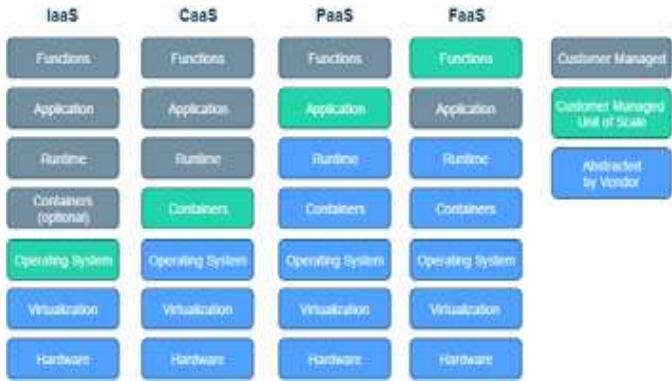
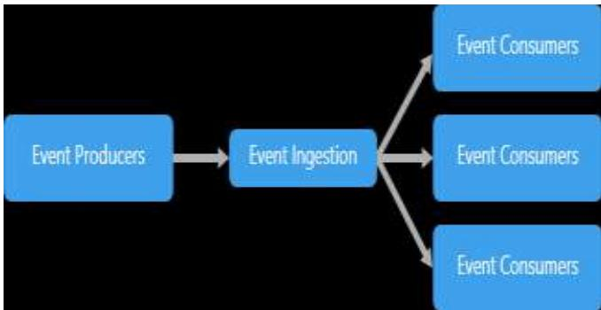
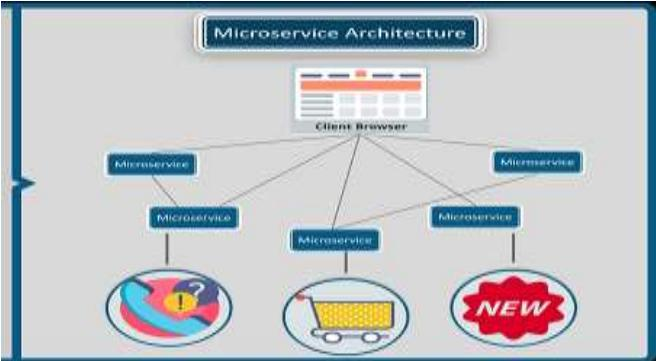

# Software Architecture and Software Design

Manishaben Jaiswal

Researcher and IT Consultant, MD, USA, Pursuing Ph.D. University of Cumberland, KY, USA, IT Consultant, MD, USA

Abstract - Software architecture defined as strategic design of an activity concerned with global requirements and its solution is implemented such as programming paradigms, architectural styles, component-based software engineering standards, architectural patterns, security, scale, integration, and law-governed regularities. Functional design, also described as tactical design, is an activity concerned with local requirements governing what a solution does such as algorithms, design patterns, programming idioms, refactoring, and low-level implementation. In this paper I would like to introduce some concepts of software architecture, and software design as well as relationship between them.

# Key Words: Architecture, Design, Components, Element, Principle, Serverless

# 1. Introduction

Architecture is driven by non-functional requirements, while functional design is driven by functional requirements. Pseudo-code belongs in the detailed design document. UML component, deployment, and package diagrams generally appear in software architecture documents; UML class, object, and behavior diagrams appear in detailed functional design documents.so, ultimately both are dependent on each other. Some important stage of the software architecture is as follows. Firstly, what is software architecture and the characteristics of it. Secondly, what is software design and its principle, and finally relationship between software architecture and software design.

# 1. Software Architecture

Architecture is a blueprint for a system. It provides an associate abstraction to manage the system complexness and establish a communication and coordination mechanism among elements. It defines a structured resolution to fulfill all the technical and operational necessities, whereas optimizing the common quality attributes like performance and security. Further, it involves a collection of serious selections regarding the organization associated with software system development and each of those selections will have a substantial impact on quality, maintainability, performance, and the overall success of the ultimate product.

# 1.1Characteristic of the Software Architecture:

Characteristics describe the expectations of code in operational and technical levels. The performance and low fault tolerance, quantifiability, and responsibility of area unit are the key of characteristics. It is also referred as quality attribute or patterns. Microservices is one in all several different code design patterns Event-Driven Pattern, Serverless

Pattern and lots of additional. The Microservices pattern received its name when being adopted by Amazon and Netflix and showing its nice impact.

# 1.2. Serverless Architecture

Serverless Architecture is alienated into two main groups. The first is “Backend as a service” which is known as ‘Baas’. Other is “Functions as a Service (FaaS).” Which is known as FaaS. The serverless architecture will help you save a lot of time taking care and fixing bugs of deployment and servers regular tasks.

# 1.3 Event-Driven Architecture

This architecture is reckoning on Event Producers and Event customers. The most plan is to decouple your system’s components and every half are going to be triggered once a remarkable event from another half possesses triggered. As an example, an internet store system has two components. First a sale module and second a merchant module. If a client makes a sale, the acquisition module would generate an occasion of “order Pending” Since the seller module is attention-grabbing within the “order Pending” event, it'll be listening, just in case one is triggered. Once the seller module gets this event, it'll execute some tasks or even fireplace another event to order a lot of the merchandise from a merchant.

# 1.4 Microservices Architecture

Microservices architecture is a famous architecture now a days it depends on developing tiny, freelance standard services wherever every service solves a downside or performs a singular task and these modules communicate with one another through well-defined API to serve the business goal.

  
Fig -1: Name of the figure

# 2. Software Design

Software architecture is in authority for the skeleton and the high-level infrastructure of a software, the software design is responsible for the code level design such as, what each module is doing, the classes scope, and the functions purposes, etc. Every structure contains code parts, relations among them, and properties of each part and relations. The design of a system depicts the system organization or structure and provides an evidence of how it behaves. A series of design selections are impact of quality, performance, maintainability, and overall success of the system. A system represents the gathering of elements which accomplish a set of functions.

A computer code design is an associate abstraction of the run-time components of a package throughout some part of its operation. Elements like components and data constrained in their relationships to realize the desired set of properties.

Elements: An element is the associate abstract unit of computer code directions and internal state that gives a transformation of information via its interface. For example, transformations embrace loading into memory from auxiliary storage, playing some calculation, translating to a special format, encapsulation with alternative knowledge, etc.

Components: Components are the foremost simply recognized side of computer code design which embrace process, data, and connecting components

Data-A data point is a data that is transferred from a component, or received by an element, via an instrumentality. Examples embrace byte-sequences, messages, marshaled parameters, and serialized objects, however, don't embrace info that's for good resident or hidden among an element.

It is working on several principal which are as follows.

2.1 Single responsibility principle: It indicates that each class must have one single purpose, a concern and a reason to change.

2.2 Open closed principle: It is open for extension but closed for adjustment. It indicates that, designer will be able to add more functionality to the class but do not edit current functions in a way that breaks existing code that uses it.

# 2.3 Liskov substitution principle:

This principle guides the developer to use inheritance in an exceeding method which will not break the appliance logic at any purpose. Thus, if a toddler category referred to as “XyClass” inherits from a parent category “class”, the child category shall not replicate the practicality of the parent category in an exceedingly method that changes the behavior parent category. thus, you'll be able to simply use the article of Class rather than the article of complexity while not breaking the appliance logic.

# 2.4 Interface segregation principle:

We can implement multiple interfaces, then structure your code in an exceedingly manner that a category can ne'er be forced to implement a perform that's not necessary to its purpose. So, we can categorize interfaces.

# 2.5 Dependency inversion principle:

If you ever followed TDD for your application development, then you recognize however decoupling your code is vital for testability and modularity. In alternative words, If a definite category “ex: Purchase” depends on the “Users” category then the User object internal representation ought to return from outside the “Purchase” category.

# 3. Relationship between software architecture and software design

Software design exposes the structure of a system whereas activity the implementation details. The design additionally focuses on however the weather and parts at intervals a system moves with each other. package style delves deeper into the implementation details of the system. style issues exemplify the choice of knowledge structures and algorithms or the implementation details of individual parts. Architecture and style issues typically overlap. Instead of using laborious and quick rules to tell apart between design and style, it is sensible to mix them. In some cases, selections square measure clearly a lot of study in nature. In alternative cases, selections focus heavily on style and the way it helps to comprehend that design.

# 4. Conclusion

According to my research on and the points as we discussed above, conclusion is there is no any specific rules and regulation applied on software design. An important detail to notice is that design is style, however not all style studies. In observe, the designer is that the one United Nations agency attracts the road tween package design (architectural style) and elaborated design (non-architectural design). There aren’t any rules or tips that work all cases, although, there are tries to formalize the excellence.

# References

[1] (Evelyn J. Barry et. al. 2003) Evelyn J. Barry, Chris F. Kemerer, Sanda A. Slaughter, On the Uniformity of Software Evolution Patterns, IEEE, 2003, pp. 106 – 113   
[2] (Kruchten 2000) Philippe Kruchten, “Rational Unified Process – An Introduction”, Addison-Wesley, 2000.   
[3] Software Engineering by M.Jaiswal, and S. J. Patel , Thakur publisher, ED 2014, chapter Design Concepts; and Architectural Design pg.100-108, Component-Level design.pg. 122-126.   
[4] (Kruchten 1995) Philippe Kruchten, The $4 { + 1 }$ View Model of Architecture, IEEE, 1995, pp. 42 – 50   
[5] https://www.sciencedirect.com/topics/computerscience/software-architecture.

# Biographies

Manishaben is an author, researcher as well as IT consultant. She published books, about “software Engineering”, 2014 and Computer Concepts and Application- lI, 2019. Published papers in state, National Conferences, and active in online journals publication. Pursuing ph. D in Information Technology and working as IT consultant in wellknown software company, USA.