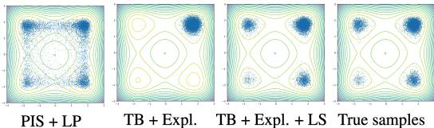
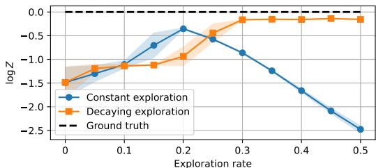
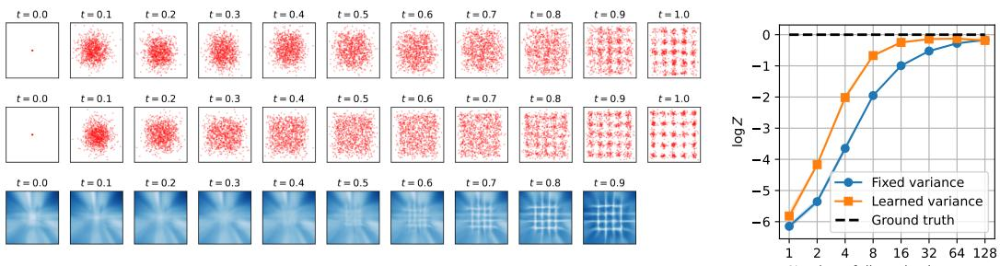
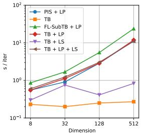
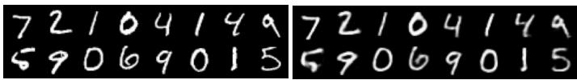
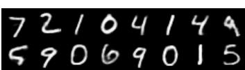
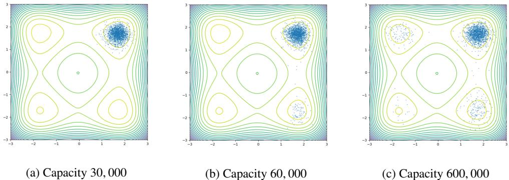
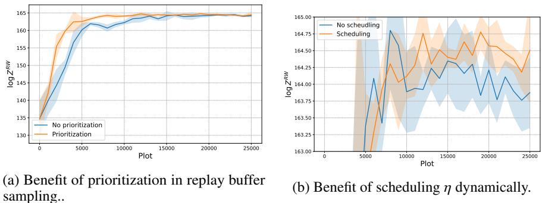

# Improved off-policy training of diffusion samplers

Marcin Sendera Mila, Université de Montréal Jagiellonian University

Minsu Kim Mila, Université de Montréal KAIST

Sarthak Mittal Mila, Université de Montréal

Pablo Lemos Mila, Université de Montréal Ciela Institute Dreamfold

Luca Scimeca Mila, Université de Montréal

Jarrid Rector-Brooks Mila, Université de Montréal Dreamfold

Alexandre Adam Mila, Université de Montréal Ciela Institute

Yoshua Bengio Mila, Université de Montréal CIFAR

Nikolay Malkin Mila, Université de Montréal University of Edinburgh

{marcin.sendera,...,nikolay.malkin}@mila.quebec

# Abstract

We study the problem of training diffusion models to sample from a distribution with a given unnormalized density or energy function. We benchmark several diffusion-structured inference methods, including simulation-based variational approaches and off-policy methods (continuous generative flow networks). Our results shed light on the relative advantages of existing algorithms while bringing into question some claims from past work. We also propose a novel exploration strategy for off-policy methods, based on local search in the target space with the use of a replay buffer, and show that it improves the quality of samples on a variety of target distributions. Our code for the sampling methods and benchmarks studied is made public at (link) as a base for future work on diffusion models for amortized inference.

# 1 Introduction

Approximating and sampling from complex multivariate distributions is a fundamental problem in probabilistic deep learning [e.g., 27, 35, 26, 48, 57] and in scientific applications [3, 52, 38, 1, 32]. The problem of drawing samples from a distribution given only an unnormalized probability density or energy is particularly challenging in high-dimensional spaces and when the distribution of interest has many separated modes [5]. Sampling methods based on Markov chain Monte Carlo (MCMC) – such as Metropolis-adjusted Langevin [MALA; 24, 65, 64] and Hamiltonian MC [HMC; 20, 31] – may be slow to mix between modes and have a high cost per sample. While variants such as sequential MC [SMC; 25, 13, 16] and nested sampling [69, 10, 43] have better mode coverage, their cost may grow prohibitively with the dimensionality of the problem. This motivates the use of amortized variational inference, i.e., fitting parametric models that sample the target distribution.

Diffusion models, continuous-time stochastic processes that gradually evolve a simple distribution to a complex target, are powerful density estimators with proven mode-mixing properties [15]; as such, they have been widely used in the setting of generative models learned from data [70, 72, 28, 50, 66]. However, the problem of training diffusion models to sample from a distribution with a given blackbox density or energy function has attracted less attention. Recent work has drawn connections between diffusion (learning the denoising process) and stochastic control (learning the Föllmer drift [21]), leading to approaches such as the path integral sampler [PIS; 88], denoising diffusion sampler [DDS; 78], and time-reversed diffusion sampler [DIS; 8]; such approaches were recently unified by [63] and [79]. Another line of work [42, 86] is based on continuous generative flow networks (GFlowNets), which are deep reinforcement learning algorithms adapted to variational inference that offer stable off-policy training and thus flexible exploration [46].

Despite the advances in sampling methods and attempts to unify them theoretically [63, 79], the field suffers from some failures in benchmarking and reproducibility, with the works differing in the choice of model architectures, using unstated hyperparameters, and even disagreeing in their definitions of the same target densities (see $\ S _ { \mathrm { B } . 1 }$ ). The first main contribution of this paper is a unified library for diffusion-structured samplers. The library has a focus on off-policy methods (continuous GFlowNets) but also includes simulation-based variational objectives such as PIS. Using this codebase, we are able to benchmark methods from past work under comparable conditions and confirm claims about exploration strategies and desirable inductive biases, while calling into question other claims on robustness and sample efficiency. Our library also includes several new modeling and training techniques, and we provide preliminary evidence of their utility in possible future work (§5.3).

Our second contribution is a study of methods for improving exploration and credit assignment – the propagation of learning signals from the target density to the parameters of earlier sampling steps – in diffusion-structured samplers (§4). First, our results (§5.2) suggest that the technique of utilizing partial trajectory information [44, 55], as done in the diffusion setting by [86], offers little benefit, and a higher training cost, over on-policy [88] or off-policy [42] trajectory-based optimization. Second, we examine the utility of a gradient-based variant which parametrizes the denoising distribution as a correction to a Langevin process [88]. We show that this inductive bias is also beneficial in the offpolicy (GFlowNet) setting despite higher computational cost. Finally, motivated by recent approaches in discrete sampling, we propose an efficient exploration technique based on local search in the target space with the use of a replay buffer, which improves sample quality across various target distributions.

# 2 Prior work

Amortized variational inference approaches use a parametric model $q _ { \theta }$ to approximate a given target density $p _ { \mathrm { t a r g e t } }$ , typically through stochastic optimization [30, 58, 2]. Notably, explicit density models like autoregressive models and normalizing flows have been extensively utilized in density estimation [60, 19, 81, 22, 51]. However, these models impose structural constraints, thereby limiting their expressive power [14, 23, 87]. The adoption of diffusion processes in generative models has stimulated a renewed interest in hierarchical models as density estimators [80, 28, 76]. Approaches like PIS [88] leverage stochastic optimal control for sampling from unnormalized densities, albeit still struggling with scalability in high-dimensional spaces.

Generative flow networks, originally defined in the discrete case by [6, 7], view hierarchical sampling (i.e., stepwise generation) as a sequential decision-making process and represent a synthesis of reinforcement learning and variational inference approaches [46, 90, 73, 18], expanding from specific scientific domains [e.g., 36, 4, 89] to amortized inference over a broader array of latent structures [e.g., 77, 34]. Their ability to efficiently navigate trajectory spaces via off-policy exploration has been crucial, yet they encounter challenges in training dynamics, such as credit assignment and exploration efficiency [45, 44, 55, 59, 68, 39, 37]. These challenges have repercussions in the scalability of these methods in more complex scenarios, which this paper addresses in the continuous case.

# 3 Setting: Diffusion-structured sampling

Let $\mathcal { E } : \mathbb { R } ^ { d }  \mathbb { R }$ be a differentiable energy function and define $R ( \mathbf { x } ) = \exp ( - \mathcal { E } ( \mathbf { x } ) )$ , the reward or unnormalized target density. Assuming the integral $\begin{array} { r } { Z : = \int _ { \mathbb { R } ^ { d } } R ( \mathbf { x } ) d \mathbf { x } } \end{array}$ exists, $\varepsilon$ defines a Boltzmann density $p _ { \mathrm { t a r g e t } } ( \mathbf { x } ) = R ( \mathbf { x } ) / Z$ on $\mathbb { R } ^ { d }$ . We are interested in the problems of sampling from $p _ { \mathrm { t a r g e t } }$ and approximating the partition function $Z$ given access only to $\varepsilon$ and possibly to its gradient $\nabla \mathcal { E }$ .

We describe two closely related perspectives on this problem: via neural SDEs and stochastic control (§3.1) and via continuous generative flow networks (§3.2).

# 3.1 Euler-Maruyama hierarchical samplers

Generative modeling with SDEs. Diffusion models assume a continuous-time generative process given by a neural stochastic differential equation [SDE; 75, 54, 67]:

$$
d \mathbf { x } _ { t } = u ( \mathbf { x } _ { t } , t ; \theta ) d t + g ( \mathbf { x } _ { t } , t ; \theta ) d \mathbf { w } _ { t } ,
$$

where $\mathbf { X } _ { 0 }$ follows a fixed tractable distribution $\mu _ { 0 }$ (such as a Gaussian or a point mass). The initial distribution $\mu _ { 0 }$ and the stochastic dynamics specified by (1) induce marginal densities $p _ { t }$ on $\mathbb { R } ^ { d }$ for each $t > 0$ . The functions $u$ and $g$ have learnable parameters that we wish to optimize, using some objective, so as to make the terminal density $p _ { 1 }$ close to $p _ { \mathrm { t a r g e t } }$ . Samples can be drawn from $p _ { 1 }$ by sampling $\mathbf { X } _ { 0 } \sim \mu _ { 0 }$ and simulating the SDE (1) to time $t = 1$ .

The SDE driving $\mu _ { 0 }$ to $p _ { \mathrm { t a r g e t } }$ is not unique. However, if one fixes a reverse-time SDE, or noising process, that pushes $p _ { \mathrm { t a r g e t } }$ at $t = 1$ to $\mu _ { 0 }$ at $t = 0$ , then its reverse, the forward SDE (1), is uniquely determined under mild conditions and is called the denoising process. For usual choices of the noising process, there are stochastic regression objectives for learning the drift $u$ of the denoising process given samples from $p _ { \mathrm { t a r g e t } }$ , and the diffusion rate $g$ is available in closed form [28, 72].

Time discretization. In practice, the integration of the SDE (1) is approximated by a discrete-time scheme, the simplest of which is Euler-Maruyama integration. The process (1) is replaced by a discrete-time Markov chain ${ \bf x } _ { 0 } \to { \bf x } _ { \Delta t } \to { \bf x } _ { 2 \Delta t } \to \cdot \cdot \cdot \to { \bf x } _ { 1 }$ , where $\begin{array} { r } { \Delta t { } = \frac { 1 } { T } } \end{array}$ is the time increment and and $T$ is the number of steps:

$$
\begin{array} { r } { \mathbf { x } _ { 0 } \sim \mu _ { 0 } , \quad \mathbf { x } _ { t + \Delta t } = \mathbf { x } _ { t } + u ( \mathbf { x } _ { t } , t ; \theta ) \Delta t + g ( \mathbf { x } _ { t } , t ; \theta ) \sqrt { \Delta t } \mathbf { z } _ { t } \quad \mathbf { z } _ { t } \sim \mathcal { N } ( \mathbf { 0 } , \mathbf { I } _ { d } ) . } \end{array}
$$

The density of the transition kernel from $\mathbf { X } _ { t }$ to $\mathbf { X } _ { t + \Delta t }$ can explicitly be written as

$$
p _ { F } ( \mathbf { x } _ { t + \Delta t } \mid \mathbf { x } _ { t } ) = \mathcal { N } ( \mathbf { x } _ { t + \Delta t } ; \mathbf { x } _ { t } + u ( \mathbf { x } _ { t } , t ; \boldsymbol { \theta } ) \Delta t , g ( \mathbf { x } _ { t } , t ; \boldsymbol { \theta } ) ^ { 2 } \Delta t \mathbf { I } _ { d } ) ,
$$

where $p _ { F }$ denotes the transition density of the discretized forward SDE. This density defines a joint distribution over trajectories starting at $\mathbf { X } _ { 0 }$ :

$$
p _ { F } ( \mathbf { x } _ { \Delta t } , \dots , \mathbf { x } _ { 1 } \mid \mathbf { x } _ { 0 } ) = \prod _ { i = 0 } ^ { T - 1 } p _ { F } ( \mathbf { x } _ { ( i + 1 ) \Delta t } \mid \mathbf { x } _ { i \Delta t } ) .
$$

Similarly, a discrete-time reverse process $\mathbf { x } _ { 1 } \to \mathbf { x } _ { 1 - \Delta t } \to \mathbf { x } _ { 1 - 2 \Delta t } \to \cdot \cdot \cdot \to \mathbf { x } _ { 0 }$ with transition densities $p _ { B } ( \mathbf { x } _ { t - \Delta t } \mid \mathbf { x } _ { t } )$ defines a joint distribution1 via

$$
p _ { B } ( \mathbf { x } _ { 0 } , \ldots , \mathbf { x } _ { 1 - \Delta t } \mid \mathbf { x } _ { 1 } ) = \prod _ { t = 1 } ^ { T } p _ { B } ( \mathbf { x } _ { ( i - 1 ) \Delta t } \mid \mathbf { x } _ { i \Delta t } ) .
$$

If the forward and backward processes (starting from $\mu _ { 0 }$ and $p _ { \mathrm { t a r g e t } }$ , respectively) are reverses of each other, then they define the same distribution over trajectories, $i . e .$ , for all ${ \bf x } _ { 0 } \to { \bf x } _ { \Delta t } \to \cdot \cdot \cdot \to { \bf x } _ { 1 }$ ,

$$
\mu _ { 0 } ( { \bf x } _ { 0 } ) p _ { F } ( { \bf x } _ { \Delta t } , \ldots , { \bf x } _ { 1 } \mid { \bf x } _ { 0 } ) = p _ { \mathrm { t a r g e t } } ( { \bf x } _ { 1 } ) p _ { B } ( { \bf x } _ { 0 } , \ldots , { \bf x } _ { 1 - \Delta t } \mid { \bf x } _ { 1 } ) .
$$

In particular, the marginal densities of $\mathbf { X } _ { 1 }$ under the forward and backward processes are then equal to $p _ { \mathrm { t a r g e t } }$ , and the forward process can be used to sample the target distribution.

Because the reverse of a process with Gaussian increments is, in general, not itself Gaussian, (6) can be enforced only approximately, but the discrepancy vanishes as $\Delta t \to 0$ (i.e., increments are infinitesimally Gaussian), an application of the central limit theorem that is key to stochastic calculus [54].

SDE learning as hierarchical variational inference. The problem of learning the parameters $\theta$ of the forward process so as to enforce (6) is one of hierarchical variational inference. The backward process transforms $\mathbf { X } _ { 1 }$ into $\mathbf { X } _ { 0 }$ via a sequence of latent variables $\mathbf { X } _ { 1 - \Delta t } , \ldots . . . , \mathbf { X } _ { 0 }$ , and the forward process aims to match the posterior distribution over these variables and thus to approximately enforce (6).

In the setting of diffusion models learned from data, where one has samples from $p _ { \mathrm { t a r g e t } }$ , one can optimize the forward process by minimizing the KL divergence $D _ { \mathrm { K L } } ( p _ { \mathrm { t a r g e t } } \cdot p _ { B } \lVert \mu _ { 0 } \cdot \dot { p _ { F } } )$ between the distribution over trajectories given by the reverse process and that given by the forward process.

This is equivalent to the typical training of diffusion models, which optimizes a variational bound on the data log-likelihood (see [71]). However, in the setting of an intractable density $p _ { \mathrm { t a r g e t } }$ , unbiased estimators of this divergence are not available. Instead, one can optimize the reverse KL:2

$$
\begin{array} { l } { { \displaystyle { \cal D } _ { \mathrm { K L } } \left( \mu _ { 0 } \cdot p _ { F } \| p _ { \mathrm { t a r g e t } } \cdot p _ { B } \right) } \ ~ } \\ { { \displaystyle = \int \log \frac { \mu _ { 0 } ( { \bf x } _ { 0 } ) p _ { F } ( { \bf x } _ { \Delta t } , \ldots , { \bf x } _ { 1 } \mid { \bf x } _ { 0 } ) } { p _ { \mathrm { t a r g e t } } ( { \bf x } _ { 1 } ) p _ { B } ( { \bf x } _ { 0 } , \ldots , { \bf x } _ { 1 - \Delta t } \mid { \bf x } _ { 1 } ) } d \mu _ { 0 } ( { \bf x } _ { 0 } ) p _ { F } ( { \bf x } _ { \Delta t } , \ldots , { \bf x } _ { 1 } \mid { \bf x } _ { 0 } ) ~ d { \bf x } _ { \Delta t } \ldots d { \bf x } _ { 1 } . } } \end{array}
$$

Various estimators of this objective are available. For instance, the path integral sampler objective [PIS; 88] uses the reparametrization trick to express (7) as an expectation over noise variables $\mathbf { z } _ { t }$ that participate in the hierarchical sampling of $\mathbf { X } _ { \Delta t } , \ldots . \ldots , \mathbf { X } _ { 1 }$ , yielding an unbiased gradient estimator, but one that requires backpropagation into the simulation of the forward process. The related denoising diffusion sampler [DDS; 78] applies the same principle in a different integration scheme.

# 3.2 Euler-Maruyama samplers as GFlowNets

Continuous generative flow networks (GFlowNets) [42] express the problem of enforcing (6) as a reinforcement learning task. In this section, we summarize this interpretation, its connection to neural SDEs, the associated learning objectives, and their relative advantages and disadvantages.

The connection between generative flow networks and diffusion models or SDEs was first made informally by [46] in the distribution-matching setting and by [84] in the maximum-likelihood setting, while the theoretical foundations for continuous GFlowNets were later laid down by [42].

State and action space. To formulate sampling as a sequential decision-making problem, one must define the spaces of states and actions. In the case of sampling by $T$ -step Euler-Maruyama integration, assuming $\mu _ { 0 }$ is a point mass at 0, the state space is

$$
S = \left\{ ( \mathbf { 0 } , 0 ) \cup \left\{ ( \mathbf { x } , t ) : \mathbf { x } \in \mathbb { R } ^ { d } , t \in \left\{ \Delta t , 2 \Delta t , \dots , 1 \right\} \right\} , \right.
$$

with the point $\mathbf { \Psi } ( \mathbf { x } , t )$ representing that the sampling agent is at position $\mathbf { X }$ at time $t$

Sampling begins with the initial state $\mathbf { x } _ { 0 } : = ( \mathbf { 0 } , 0 )$ , proceeds through a sequence of states $( \mathbf { x } _ { \Delta t } , \Delta t )$ , $\left( \mathbf { x } _ { 2 \Delta t } , 2 \Delta t \right)$ , . . . , and ends at a state $( \mathbf { x } _ { 1 } , 1 )$ ; states $\mathbf { \Psi } ( \mathbf { x } , t )$ with $t = 1$ are called terminal states and their collection is denoted $\chi$ . From now on, we will often write $\mathbf { X } _ { t }$ in place of the state $\left( \mathbf { x } _ { t } , t \right)$ when the time $t$ is clear from context. The sequence of states ${ \bf x } _ { 0 } \to { \bf x } _ { \Delta t } \to \cdot \cdot \cdot \to { \bf x } _ { 1 }$ is called a complete trajectory.

The actions from a nonterminal state $\left( \mathbf { x } _ { t } , t \right)$ correspond to the possible next states $( \mathbf { x } _ { t + \Delta t } , t + \Delta t )$ that can be reached from $\left( \mathbf { x } _ { t } , t \right)$ by a single step of the Euler-Maruyama integrator.3

Forward policy and learning problem. A (forward) policy is a collection of continuous distributions over the successor states – states reachable by a single action – of every nonterminal state $\mathbf { \Psi } ( \mathbf { x } , t )$ . In our context, this amounts to a collection of conditional probability densities $p _ { F } ( \mathbf { x } _ { t + \Delta t } \mid \mathbf { x } _ { t } ; \boldsymbol { \theta } )$ , representing the density of the transition kernel from $\mathbf { X } _ { t }$ to $\mathbf { X } _ { t + \Delta t }$ . GFlowNet training optimizes the parameters $\theta$ , which may be the weights of a neural network specifying a density over ${ \bf X } _ { t + \Delta t }$ conditioned on $\mathbf { X } _ { \Delta t }$ .

A policy $p _ { F }$ induces a distribution over complete trajectories $\tau = ( \mathbf { x } _ { 0 } \to \mathbf { x } _ { \Delta t } \to \cdot \cdot \cdot \to \mathbf { x } _ { 1 }$ ) via

$$
p _ { F } ( \tau ; \boldsymbol { \theta } ) = \prod _ { i = 0 } ^ { T - 1 } p _ { F } ( \mathbf { x } _ { ( i + 1 ) \Delta t } \mid \mathbf { x } _ { i \Delta t } ; \boldsymbol { \theta } ) .
$$

In particular, we get a marginal density over terminal states:

$$
p _ { F } ^ { \top } ( \mathbf { x } _ { 1 } ; \theta ) = \int p _ { F } ( \mathbf { x } _ { 0 } \longrightarrow \mathbf { x } _ { \Delta t } \longrightarrow \cdot \cdot \cdot \longrightarrow \mathbf { x } _ { 1 } ; \theta ) d \mathbf { x } _ { \Delta t } \dots d \mathbf { x } _ { 1 - \Delta t } .
$$

The learning problem solved by GFlowNets is to find the parameters $\theta$ of a policy $p _ { F }$ whose terminating density $p _ { F } ^ { \top }$ is equal to $p _ { \mathrm { t a r g e t } }$ , i.e.,

$$
p _ { F } ^ { \top } ( \mathbf { x } _ { 1 } ; \boldsymbol { \theta } ) = \frac { R ( \mathbf { x } _ { 1 } ) } { Z } \quad \forall \mathbf { x } _ { 1 } \in \mathbb { R } ^ { d } .
$$

However, because the integral (8) is intractable and $Z$ is unknown, auxiliary objects must be introduced into optimization objectives to enforce (9), as discussed below.

Notably, if the policy is a Gaussian with mean and variance given by neural networks taking $\mathbf { X } _ { t }$ and $t$ as input, then learning the policy amounts to learning the drift $u ( \mathbf { x } _ { t } , t ; \theta )$ and diffusion $g ( \mathbf { x } _ { t } , t ; \theta )$ of a SDE (1), i.e., fitting a neural SDE. The SDE learning problem in $\ S 3 . 1$ is thus the same as that of fitting a GFlowNet with Gaussian policies.

Backward policy and trajectory balance. A backward policy is a collection of conditional probability densities $p _ { B } ( \mathbf { x } _ { t - \Delta t } \mid \mathbf { x } _ { t } ; \psi )$ , representing a probability density of transitioning from $\mathbf { X } _ { t }$ to an ancestor state $\mathbf { X } _ { t - \Delta t }$ . The backward policy induces a distribution over complete trajectories $\tau$ conditioned on their terminal state (cf. (5)):

$$
p _ { B } ( \tau \mid \mathbf { x } _ { 1 } ; \boldsymbol { \psi } ) = \prod _ { i = 1 } ^ { T } p _ { B } ( \mathbf { x } _ { ( i - 1 ) \Delta t } \mid \mathbf { x } _ { i \Delta t } ; \boldsymbol { \psi } ) ,
$$

where exceptionally $p _ { B } ( \mathbf { x } _ { 0 } \mid \mathbf { x } _ { \Delta t } ) = 1$ as $\mu _ { 0 }$ is a point mass.

Generalizing a result in the discrete-space setting [45], [42] show that $p _ { F }$ samples from the target distribution (i.e., satisfies (9)) if and only if there exists a backward policy $p _ { B }$ and a scalar $Z _ { \theta }$ such that the trajectory balance conditions are fulfilled for every complete trajectory $\tau = ( \mathbf { x } _ { 0 } \to \mathbf { x } _ { \Delta t } \to \cdot \cdot \cdot \to \mathbf { x } _ { 1 }$ ) :

$$
Z _ { \theta } p _ { F } ( \tau ; \theta ) = R ( { \bf x } _ { 1 } ) p _ { B } ( \tau \mid { \bf x } _ { 1 } ; \psi ) .
$$

If these conditions hold, then $Z _ { \theta }$ equals the true partition function $\begin{array} { r } { Z = \int _ { \mathbf { x } } R ( \mathbf { x } ) d \mathbf { x } } \end{array}$ . The trajectory balance objective for a trajectory $\tau$ is the squared log-ratio of the two sides of (10), that is:

$$
\mathcal { L } _ { \mathrm { T B } } ( \tau ; \theta , \psi ) = \left( \log \frac { Z _ { \theta } p _ { F } ( \tau ; \theta ) } { R ( \mathbf { x } _ { 1 } ) p _ { B } ( \tau \mid \mathbf { x } _ { 1 } ; \psi ) } \right) ^ { 2 } .
$$

One can thus achieve (9) by minimizing to zero the loss $\mathcal { L } _ { \mathrm { T B } } ( \tau ; \theta , \psi )$ with respect to the parameters $\theta$ and $\psi$ , where the trajectories $\tau$ used for training are sampled from some training policy $\pi ( \tau )$ . While it is possible to optimize (11) with respect to the parameters of both the forward and backward policies, in some learning problems, one fixes the backward policy and only optimizes the parameters of $p _ { F }$ and the estimate of the partition function $Z _ { \theta }$ . For example, for most experiments in $\ S 5$ , we fix the backward policy to a discretized Brownian bridge, following past work.

Off-policy optimization. Unlike the KL objective (7), whose gradient involves an expectation over the distribution of trajectories under the current forward process, (11) can be optimized off-policy, i.e., using trajectories sampled from an arbitrary distribution $\pi$ . Because minimizing $\mathcal { L } _ { \mathrm { T B } } ( \tau ; \theta , \psi )$ to 0 for all $\tau$ in the support of $\pi$ will achieve (9), $\pi$ can be taken be any distribution with full support, so as to promote discovery of modes of the target distribution. Various choices motivated by reinforcement learning techniques have been proposed, including noisy exploration or tempering [6], replay buffers [17], Thompson sampling [59], and backward traces from terminal states obtained by MCMC [43]. In the continuous case, [46, 42] proposed to simply add a small constant to the policy variance when sampling trajectories for training. Off-policy optimization is a key advantage of GFlowNets over variational methods such as PIS, which require on-policy optimization [46].

However, when $\mathcal { L } _ { \mathrm { T B } }$ happens to be optimized on-policy, i.e., using trajectories sampled from the policy $p _ { F }$ itself, we get an unbiased estimator of the gradient of the KL divergence (7) with respect to $p _ { F }$ ’s parameters up to a constant [62, 46, 90], that is:

$$
\mathbb { E } _ { \tau \sim p _ { F } ( \tau ) } \left[ \nabla _ { \theta ^ { \prime } } \mathcal { L } _ { \mathrm { T B } } ( \tau ; \theta , \psi ) \right] = 2 \nabla _ { \theta ^ { \prime } } D _ { \mathrm { K L } } ( p _ { F } ( \tau ; \theta ) \| p _ { \mathrm { t a r g e t } } ( \mathbf { x } _ { 1 } ) p _ { B } ( \tau \mid \mathbf { x } _ { 1 } ; \psi ) ) ,
$$

where $\nabla _ { \theta ^ { \prime } }$ denotes the gradient with respect to the parameters of $p _ { F }$ , but not $Z _ { \theta }$ . This unbiased estimator tends to have higher variance than the reparametrization-based estimator used by PIS. On the other hand, it does not require backpropagation through the simulation of the forward process and can be used to optimize the parameters of both the forward and backward policies.

Other objectives. The trajectory balance objective (11) is not the only possible objective that can be used to enforce (9). A notable generalization is subtrajectory balance [SubTB; 44], which involves modeling a scalar state flow $f ( \mathbf { x } _ { t } ; \theta )$ associated with each state $\mathbf { X } _ { t }$ – intended to model the marginal density of the forward process at $\mathbf { X } _ { t }$ – and enforcing subtrajectory balance conditions for all partial trajectories ${ \bf x } _ { m \Delta t } \to { \bf x } _ { ( m + 1 ) \Delta t } \to \cdot \cdot \cdot \to { \bf x } _ { n \Delta t }$ :

$$
f ( \mathbf { x } _ { m \Delta t } ; \theta ) \prod _ { i = m } ^ { n - 1 } p _ { F } ( \mathbf { x } _ { ( i + 1 ) \Delta t } \mid \mathbf { x } _ { i \Delta t } ; \theta ) = f ( \mathbf { x } _ { n \Delta t } ; \theta ) \prod _ { i = m + 1 } ^ { n } p _ { B } ( \mathbf { x } _ { ( i - 1 ) \Delta t } \mid \mathbf { x } _ { i \Delta t } ; \psi ) ,
$$

where for terminal states $f ( \mathbf { x } _ { 1 } ) = R ( \mathbf { x } _ { 1 } )$ . This approach has some computational overhead associated with training the state flow, but has been shown to be effective in discrete-space settings, especially when combined with the forward-looking reward shaping scheme proposed by [55]. It has also been tested in the continuous case, but our experimental results suggest that it offers little benefit over the TB objective in the diffusion setting (see $\ S 4 . 1$ and $\ S \mathrm { B } . 1$ ).

It is also worth noting the off-policy VarGrad estimator [53, 62], rediscovered for GFlowNets by [85]. Like TB, VarGrad can be optimized over trajectories drawn off-policy. Rather than enforcing (10) for every trajectory, VarGrad optimizes the empirical variance (over a minibatch) of the log-ratio of the two sides of (10). As noted by [46], this is equivalent to minimizing $\mathcal { L } _ { \mathrm { T B } }$ first with respect to $\log Z _ { \theta }$ to optimality over the batch, then with respect to the parameters of $p _ { F }$ .

# 4 Exploration and credit assignment in continuous GFlowNets

The main challenges in training off-policy sampling models are exploration efficiency (discovery of high-reward states) and credit assignment (propagation of reward signals to the actions that led to them). We describe several new and existing methods for addressing these challenges in the context of diffusion-structured GFlowNets. These techniques will be empirically studied and compared in $\ S 5$ .

# 4.1 Credit assignment methods

Partial energies and subtrajectory-based learning. [86] studied the diffusion sampler learning problem introduced by [42], but replaced the TB learning objective with the SubTB objective.4 In addition, an inductive bias resembling the geometric interpolation in [47] was used for the state flow function:

$$
\log f ( \mathbf { x } _ { t } ; \theta ) = ( 1 - t ) \log p _ { t } ^ { \mathrm { r e f } } ( \mathbf { x } _ { t } ) + t \log R ( \mathbf { x } _ { t } ) + \mathrm { N N } ( \mathbf { x } _ { t } , t ; \theta ) ,
$$

where NN is a neural network and $p _ { t } ^ { \mathrm { r e f } } ( \mathbf { x } _ { t } ) = N ( \mathbf { x } _ { t } ; 0 , \sigma ^ { 2 } t I _ { d } )$ is the marginal density of a Brownian motion with rate $\sigma$ at $\mathbf { X } _ { t }$ . The use of the target density $\log R ( \mathbf { x } _ { t } ) = - \mathcal { E } ( \mathbf { x } _ { t } )$ in the state flow function was hypothesized to provide an effective signal driving the sampler to high-density states at early steps in the trajectory. Such an inductive bias on the state flow was called forward-looking (FL) by [55], and we will refer to this method as FL-SubTB in $\ S 5$ .

Langevin dynamics inductive bias. [88] proposed an inductive bias on the architecture of the drift of the neural SDE $u ( \mathbf { x } _ { t } , t ; \theta )$ (in GFlowNet terms, the mean of the Gaussian density $p _ { F } ( \mathbf { x } _ { t + \Delta t } \mid \mathbf { x } _ { t } ; \boldsymbol { \theta } ) )$ that resembles a Langevin process on the target distribution. One writes

$$
\begin{array} { r } { u ( \mathbf { x } _ { t } , t ; \theta ) = \mathrm { N N } _ { 1 } ( \mathbf { x } _ { t } , t ; \theta ) + \mathrm { N N } _ { 2 } ( t ; \theta ) \nabla \mathcal { E } ( \mathbf { x } _ { t } ) , } \end{array}
$$

where $\mathrm { N N } _ { 1 }$ and $\mathrm { N N } _ { 2 }$ are neural networks outputting a vector and a scalar, respectively. The second term in (14) is a scaled gradient of the target energy – the drift of a Langevin SDE – and the first term is a learned correction. This inductive bias, which we name the Langevin parametrization (LP), was shown to improve the efficiency of PIS. We will study its effect on continuous GFlowNets in $\ S 5$ .

The inductive bias (14) placed on policies represents a different way of incorporating the reward signal at intermediate steps in the trajectory and can steer the sampler towards low-energy regions. It contrasts with (13) in that it provides the gradient of the energy directly to the policy, rather than just using the energy to provide a learning signal to policies via the parametrization of the log-state flow (13).

Considerations of the continuous-time limit lead us to conjecture that the Langevin parametrization (14) with $\mathrm { N N } _ { 1 }$ independent of $\mathbf { X } _ { t }$ is equivalent to the forward-looking flow (13) in the limit of small time increments $\Delta t \to 0$ , i.e., they induce the same asymptotics of the discrepancy in the SubTB constraints (12) over short partial trajectories. Such theoretical analysis can be the subject of future work.

# 4.2 A new method for off-policy exploration with local search and replay buffer

Local search with parallel MALA. The FL and LP inductive biases both induce computational overhead: either in the evaluation and optimization of a state flow or in the need to evaluate the energy gradient at every step of sampling (see $\ S { \bf C } . 3$ ). We present an alternative technique that does not induce additional computation cost per training trajectory.

Table 1: Log-partition function estimation errors for unconditional modeling tasks (mean and standard deviation over 5 runs). The four groups of models are: MCMC-based samplers, simulation-driven variational methods, baseline GFlowNet methods with different learning objectives, and methods augmented with Langevin parametrization and local search. See $\ S { \bf C } . 1$ for additional metrics.   

<table><tr><td>Energy →</td><td colspan="2">25GMM (d = 2)</td><td colspan="2">Funnel (d = 10)</td><td colspan="2">Manywell (d = 32)</td><td colspan="2">LGCP (d = 1600)</td></tr><tr><td>Algorithm ↓ Metric →</td><td>Δ log Z</td><td>Δ log ZW</td><td>Δ log Z</td><td>Δ log ZRW</td><td>Δ log Z</td><td>Δ log ZRW</td><td>log</td><td>log RW</td></tr><tr><td>SMC</td><td colspan="2">0.569±0.010</td><td colspan="2">0.561±0.801</td><td colspan="2">14.99±1.078</td><td colspan="2">See discussion in §B.1</td></tr><tr><td>GS [43]</td><td>0.016±0.042</td><td></td><td>0.033±0.173</td><td></td><td>0.292±0.454</td><td></td><td>N/A</td><td></td></tr><tr><td>DIS [8]</td><td>1.125±0.056</td><td>0.986±0.011</td><td>0.839±0.169</td><td>0.093±0.038</td><td>10.52±1.02</td><td>3.05±0.46</td><td>299.83±0.67</td><td>361.15±6.48</td></tr><tr><td>DDS [78]</td><td>1.760±0.08</td><td>0.746±0.389</td><td>0.424±0.049</td><td>0.206±0.033</td><td>7.36±2.43</td><td>0.23±0.05</td><td>471.64±1.20</td><td>489.30±0.62</td></tr><tr><td>PIS [88]</td><td>1.769±0.104</td><td>1.274±0.218</td><td>0.534±0.008</td><td>0.262±0.008</td><td>3.85±0.03</td><td>2.69±0.04</td><td>381.14±1.42</td><td>414.42±2.06</td></tr><tr><td>+ LP [88]</td><td>1.799±0.051</td><td>0.225±0.583</td><td>0.587±0.012</td><td>0.285±0.044</td><td>13.19±0.82</td><td>0.07±0.85</td><td>471.45±0.18</td><td>487.82±2.26</td></tr><tr><td>TB [42]</td><td>1.176±0.109</td><td>1.071±0.112</td><td>0.690±0.018</td><td>0.239±0.192</td><td>4.01±0.04</td><td>2.67±0.02</td><td>336.70±56.22</td><td>379.50±49.99</td></tr><tr><td>TB + Expl. [42]</td><td>0.560±0.302</td><td>0.422±0.320</td><td>0.749±0.015</td><td>0.226±0.138</td><td>4.01±0.05</td><td>2.68±0.06</td><td>346.10±55.54</td><td>389.21±44.13</td></tr><tr><td>VarGrad + Expl.</td><td>0.615±0.241</td><td>0.487±0.250</td><td>0.642±0.010</td><td>0.250±0.112</td><td>4.01±0.05</td><td>2.69±0.06</td><td>370.37±0.26</td><td>410.37±6.70</td></tr><tr><td>FL-SubTB</td><td>1.127±0.010</td><td>1.020±0.010</td><td>0.527±0.011</td><td>0.182±0.142</td><td>3.98±0.07</td><td>2.72±0.05</td><td>365.20±6.08</td><td>402.65±8.36</td></tr><tr><td>+ LP [86]</td><td>0.209±0.025</td><td>0.011±0.024</td><td>0.563±0.021</td><td>0.155±±0.317</td><td>4.23±0.12</td><td>2.66±0.22</td><td>465.44±1.26</td><td>483.90±1.95</td></tr><tr><td>TB + Expl. + LS (ours)</td><td>0.171±0.013</td><td>0.004±0.011</td><td>0.653±0.025</td><td>0.285±0.099</td><td>4.57±2.13</td><td>0.19±0.29</td><td>384.90±0.83</td><td>419.55±2.14</td></tr><tr><td>TB + Expl. + LP (ours)</td><td>0.206±0.018</td><td>0.011±0.010</td><td>0.666±0.615</td><td>0.051±0.616</td><td>7.46±1.74</td><td>1.06±1.11</td><td>452.82±1.50</td><td>477.62±1.79</td></tr><tr><td>TB + Expl. + LP + LS (ours)</td><td>0.190±0.013</td><td>0.007±0.011</td><td>0.768±0.052</td><td>0.264±0.063</td><td>4.68±0.49</td><td>0.07±0.17</td><td>471.14±0.25</td><td>489.03±1.38</td></tr><tr><td>VarGrad + Expl. + LP + LS (ours)</td><td>0.207±0.016</td><td>0.015±0.015</td><td>0.920±0.118</td><td>0.256±0.037</td><td>4.11±0.45</td><td>0.02±0.21</td><td>468.65±0.63</td><td>487.34±1.34</td></tr></table>

Highlight $\boldsymbol { : }$ mean indistinguishable from best in column with $p < 0 . 0 5$ under one-sided Welch unpaired $t$ -test.

To enhance the quality of samples during training, we incorporate local search into the exploration process, motivated by the success of local exploration [83, 33, 40] and replay buffer [e.g., 17] methods for GFlowNets in discrete spaces. Unlike these methods, which define MCMC kernels via the GFlowNet policies, our method leverages parallel Metropolis-adjusted Langevin (MALA) directly in the target space.

  
Figure 1: Two-dimensional projections of Manywell samples from models trained by different algorithms. Our proposed replay buffer with local search is capable of preventing mode collapse.

In detail, we initially sample $M$ candidates from the sampler: $\{ \mathbf { x } ^ { ( 1 ) } , \ldots , \mathbf { x } ^ { ( M ) } \} \sim p _ { F } ^ { \top } ( \cdot )$ . Subsequently, we run parallel MALA across $M$ chains over $K$ transitions , with the initial states of the Markov chain being $\{ \mathbf { x } ^ { ( 1 ) } , \ldots , \mathbf { x } ^ { ( M ) } \}$ . After the $K _ { \mathrm { b u r n - i n } }$ burn-in transitions, the accepted samples are stored in a local search buffer $\mathcal { D } _ { \mathrm { L S } }$ . We occasionally update the buffer using MALA steps and replay samples from it to minimize the computational demands of iterative local search. MALA steps are far more parallelizable than sampler training and need to be made only rarely (as the buffer is much larger than the training batch size), so the overhead of local search is small.

Training with local search and replay buffer. To train samplers with the aid of the buffer, we draw a sample $\mathbf { X }$ from $\mathcal { D } _ { \mathrm { L S } }$ (uniformly or using a prioritization scheme, $\ S \mathrm { E }$ , sample a trajectory $\tau$ leading to $\mathbf { X }$ from the backward process, and make a gradient update on the objective (e.g., TB) associated with $\tau$

When training with local search guidance, we alternate two steps, inspired by [43], who alternate training on forward trajectories and backward trajectories initialized at a fixed set of MCMC samples. Step A involves training with on-policy or exploratory forward sampling while Step B uses samples drawn from the local search buffer described above. This allows the sampler to explore both diversified samples (Step A) and low-energy samples (Step B). See $\ S \mathrm { E }$ for detailed pseudocode of adaptive-step parallel MALA and local search-guided GFlowNet training.

# 5 Experiments

We conduct comprehensive benchmarks of various diffusion-structured samplers, encompassing both GFlowNet samplers and methods such as PIS. For the GFlowNet samplers, we investigate a range of techniques, including different exploration strategies and loss functions. Additionally, we examine the efficacy of the Langevin parametrization and the newly proposed local search with buffer.

# 5.1 Tasks and baselines

We explore two types of tasks, with more details provided in $\ S _ { \mathbf { B } }$ : sampling from energy distributions – a 2-dimensional mixture of Gaussians with 25 modes (25GMM), the 10-dimensional Funnel, the 32-dimensional Manywell distribution, and the 1600-dimensional Log-Gaussian Cox process –

and conditional sampling from the latent posterior of a variational autoencoder (VAE; [41, 61]).   
This allows us to investigate both unconditional and conditional generative modeling techniques.

We evaluate three algorithm categories:

(1) Traditional sampling methods: We consider a standard Sequential Monte Carlo (SMC) implementation and a state-of-the-art nested sampling method (GGNS, [43]).   
(2) Simulation-driven variational approaches: DIS [8], DDS [78], and PIS [88].   
(3) Diffusion-based GFlowNet samplers: Our evaluation focuses on TB-based training and the enhancements described in $\ S 4$ : the VarGrad estimator (VarGrad), off-policy exploration (Expl.), Langevin parametrization (LP), and local search (LS). Additionally, we assess the FL-SubTBbased continuous GFlowNet as studied by [86] for a comprehensive comparison.

For (2) and (3), we employ a consistent neural architecture across methods (details in $\ S _ { \mathrm { { D } } }$ ).

Learning problem and fixed backward process. In our main experiments, we borrow the modeling setting from [88]. We aim to learn a Gaussian forward policy $p _ { F }$ that samples from the target distribution in $T = 1 0 0$ steps $\Delta t = 0 . 0 1$ ). Just as in past work [88, 42, 86], the backward process is fixed to a discretized Brownian bridge with a noise rate $\sigma$ that depends on the domain; explicitly,

$$
p _ { B } ( \mathbf { x } _ { t - \Delta t } \mid \mathbf { x } _ { t } ) = N \left( \mathbf { x } _ { t - \Delta t } ; \frac { t - \Delta t } { t } \mathbf { x } _ { t } , \frac { t - \Delta t } { t } \sigma ^ { 2 } \Delta t \mathbf { I } _ { d } \right) ,
$$

understood to be a point mass at 0 when $t = \Delta t$ . To keep the learning problem consistent with past work, we fix the variance of the forward policy $p _ { F }$ to $\sigma ^ { 2 }$ . This simplification is justified in continuous time, when the forward and reverse SDEs have the same diffusion rate. However, in $\ S 5 . 3$ , we will provide evidence that learning the forward policy’s variance is quite beneficial for shorter trajectories.

Benchmarking metrics. To evaluate diffusion-based samplers, we use two metrics from past work [88, 42], which we restate in our notation. Given any forward policy $p _ { F }$ , we have a variational lower bound on the log-partition function $\begin{array} { r } { \log Z = \int _ { \mathbb { R } ^ { d } } R ( \mathbf { \dot { x } } ) d \mathbf { x } . } \end{array}$ :

$$
\log \int _ { \mathbb { R } ^ { d } } R ( \mathbf { x } ) d \mathbf { x } = \log \underset { \tau = ( \cdots  \mathbf { x } _ { 1 } ) \sim p _ { F } ( \tau ) } { \mathbb { B } } [ \frac { R ( \mathbf { x } _ { 1 } ) p _ { B } ( \tau \mid \mathbf { x } _ { 1 } ) } { p _ { F } ( \tau ) } ] \geq \underset { \tau = ( \cdots  \mathbf { x } _ { 1 } ) \sim p _ { F } ( \tau ) } { \mathbb { B } } [ \log \frac { R ( \mathbf { x } _ { 1 } ) p _ { B } ( \tau \mid \mathbf { x } _ { 1 } ) } { p _ { F } ( \tau ) } ] .
$$

We use a $K$ -sample $( K \ : = \ : 2 0 0 0 )$ Monte Carlo estimate of this expectation, $\log { \hat { Z } }$ , as a metric, which equals the true $\log Z$ if $p _ { F }$ and $p _ { B }$ jointly satisfy (10) and thus $p _ { F }$ samples from the target distribution. We also employ an importance-weighted variant, which emphasizes mode coverage over accurate local modeling:

$$
\log \hat { Z } ^ { \mathrm { R W } } : = \log \sum _ { i = 1 } ^ { K } \left[ \frac { R ( \mathbf { x } _ { 1 } ^ { ( i ) } ) p _ { B } ( \tau ^ { ( i ) } \mid \mathbf { x } _ { 1 } ^ { ( i ) } ) } { p _ { F } ( \tau ^ { ( i ) } ) } \right] ,
$$

where $\tau ^ { ( 1 ) } , \dots , \tau ^ { ( K ) }$ are trajectories sampled from $p _ { F }$ and leading to terminal states $\mathbf { x } _ { 1 } ^ { ( 1 ) } , \ldots , \mathbf { x } _ { 1 } ^ { ( K ) }$ . The estimator $\log \hat { Z } ^ { \mathrm { R W } }$ is also a lower bound on $\log Z$ and approaches it as $K  \infty$ [11]. In the unconditional modeling benchmarks, we compare both estimators to the true log-partition function, which is known analytically for all tasks except LGCP (leading to discrepancies in past work; see $\ S _ { \mathrm { B } . 1 } ^ { \mathrm { ~ } }$ ).

In addition, we include a sample-based metric (2-Wasserstein distance); see $\ S { \bf C } . 1$

# 5.2 Results

Unconditional sampling. We report the metrics for all algorithms and energies in Table 1.

We observe that TB’s performance is generally modest without additional exploration and credit assignment mechanisms, except on the Funnel task, where variations in performance across methods are negligible. This confirms hypotheses from past work about the importance of offpolicy exploration [46, 42] and the importance of improved credit assignment [86]. On the other hand, our results do not show a consistent

  
Figure 2: Effect of exploration variance on models trained with TB on the 25GMM energy. Exploration promotes mode discovery, but should be decayed over time to optimally allocate the modeling power to high-likelihood trajectories.

  
Figure 3: Left: Distribution of $\mathbf { x } _ { 0 } , \mathbf { x } _ { 0 . 1 } , \ldots . . . , \mathbf { x } _ { 1 }$ learned by 10-step samplers with fixed $( t o p )$ and learned (middle) forward policy variance on the 25GMM energy. The last step of sampling the fixed-variance model adds Gaussian noise of a variance close to that of the components of the target distribution, preventing the the sampler from sharply capturing the modes. The last row shows the policy variance learned as a function of $\mathbf { X } _ { t }$ at various time steps $t$ (white is high variance, blue is low), showing that less noise is added around the peaks near $t = 1$ . The two models’ log-partition function estimates are $- 1 . 6 7$ and $- 0 . 6 2$ , respectively. Right: For varying number of steps $T$ , we plot the $\log { \hat { Z } }$ obtained by models with fixed and learned variance. Learning policy variances gives similar samplers with fewer steps.

and significant improvement of the FL-SubTB objective used by [86] over TB. Replacing TB with the VarGrad objective yields similar results.

The simple off-policy exploration method of adding variance to the policy notably enhances performance on the 25GMM task. We investigate this phenomenon in more detail in Fig. 2, finding that exploration that slowly decreases over the course of training is the best strategy.

On the other hand, our local search-guided exploration with a replay buffer (LS) leads to a substantial improvement in performance, surpassing or competing with GFlowNet baselines, non-GFlowNet baselines, and non-amortized sampling methods in most tasks and metrics. This advantage is attributed to efficient exploration and the ability to replay past low-energy regions, thus preventing mode collapse during training (Fig. 1). Further details on LS enhancements are discussed in $\ S \mathrm { E }$ with ablation studies in $\ S \mathrm { E } . 2$ .

Incorporating Langevin parametrization (LP) into TB or FL-SubTB results in notable performance improvements (despite being $2 \cdot 3 \times$ slower per iteration), indicating that previous observations [88] transfer to off-policy algorithms. Compared to FL-SubTB, which aims for enhanced credit assignment through partial energy, LP achieves superior credit assignment leveraging gradient information, akin to partial energy in continuous time. LP is either superior or competitive across most tasks and metrics.

In $\ S { \bf C } . 3$ , we study the scaling of the algorithms with dimension, showing efficiency of the proposed LS.

Conditional sampling. For the VAE task, we observe that the performance of the baseline GFlowNet-based samplers is generally worse

Table 2: Log-likelihood estimates on a test set for a pretrained VAE decoder on MNIST. The latent being sampled is 20-dimensional. The VAE’s training ELBO (Gaussian encoder) was $\approx - 1 0 1$ .   

<table><tr><td>Algorithm ↓ Metric →</td><td>logz</td><td>log </td></tr><tr><td>GGNS [43]</td><td colspan="2">−82.406±0.882</td></tr><tr><td>PIS [88]</td><td>−102.54±0.437</td><td>−47.753±2.821</td></tr><tr><td>+ LP [88]</td><td>-99.890±0.373</td><td>−47.326±0.777</td></tr><tr><td>TB [42]</td><td>−162.73±35.55</td><td>-61.407±17.83</td></tr><tr><td>VarGrad</td><td>−102.54±0.934</td><td>−46.502±1.018</td></tr><tr><td>TB + Expl. [42]</td><td>−148.04±4.046</td><td>−49.967±5.683</td></tr><tr><td>FL-SubTB</td><td>−147.992±22.671</td><td>−54.196±3.996</td></tr><tr><td>+ LP [86]</td><td>−111.536±1.027</td><td>−47.640±1.313</td></tr><tr><td>TB + Expl. + LS (ours)</td><td>−245.78±13.80</td><td>-55.378±9.125</td></tr><tr><td>TB + Expl. + LP (ours)</td><td>−112.45±0.671</td><td>−48.827±1.787</td></tr><tr><td>TB + Expl. + LP + LS (ours)</td><td>−117.26±2.502</td><td>−49.157±2.051</td></tr><tr><td>VarGrad + Expl. (ours)</td><td>−103.39±0.691</td><td>−47.318±1.981</td></tr><tr><td>VarGrad + Expl. + LS (ours)</td><td>−105.40±0.882</td><td>−48.235±0.891</td></tr><tr><td>VarGrad + Expl. + LP (ours)</td><td>−99.472±0.259</td><td>−46.574±0.736</td></tr><tr><td>VarGrad + Expl. + LP + LS (ours)</td><td>−99.783±0.312</td><td>−46.245±0.543</td></tr></table>

than that of the simulation-based PIS (Table 2). While LP and LS improve the performance of TB, they do not close the gap in likelihood estimation; however, with the VarGrad objective, the performance is competitive with or superior to PIS. We hypothesize that this discrepancy is due to the difficulty of fitting the conditional log-partition function estimator, which is required for the TB objective but not for VarGrad, which only learns the policy. (In Fig. D.1 we show decoded samples encoded using the best-performing diffusion encoder.)

# 5.3 Extensions to general SDE learning problems

Our implementation of diffusion-structured generative flow networks includes several additional options that diverge from the modeling assumptions made in most past work in the field. Notably, it features the ability to:

• optimize the backward (noising) process – not only the denoising process – as was done for related learning problems in [12, 63, 79];   
• learn the forward process’s diffusion rate $g ( \mathbf { x } _ { t } , t ; \theta )$ , not only the mean $u ( \mathbf { x } _ { t } , t ; \theta )$ ;   
• assume a varying noise schedule for the backward process, making it possible to train models with standard noising SDEs used for diffusion models for images.

These extensions will allow others to build on our implementation and apply it to problems such as finetuning diffusion models trained on images with a GFlowNet objective.

As noted in $\ S 5 . 1$ , in the main experiments we fixed the diffusion rate of the learned forward process, an assumption inherited from all past work and justified in the continuous-time limit. However, we perform an experiment to show the importance of extensions such as learning the forward variance in discrete time. Fig. 3 shows the samples of models on the 25GMM energy following the experimental setup of [43]. We see that when the forward policy’s variance is learned, the model can better capture the details of the target distributions, choosing a low variance in the vicinity of the peaks to avoid ‘blurring’ them through the noise added in the last step of sampling.

In $\ S { \bf C } . 2$ , we include preliminary results using a variance-preserving backward process, as commonly used in diffusion models, in place of the reversed Brownian motion used in the main experiments.

The ability to model distributions accurately in fewer steps is important for computational efficiency. Future work can consider ways to improve performance in coarse time discretizations, such as nonGaussian transitions, whose utility in diffusion models trained from data has been demonstrated [82].

# 6 Conclusion

We have presented a study of diffusion-structured samplers for amortized inference over continuous variables. Our results suggest promising techniques for improving the mode coverage and efficiency of these models. Future work on applications can consider inference of high-dimensional parameters of dynamical systems and inverse problems. In probabilistic machine learning, extensions of this work should study integration of our amortized sequential samplers as variational posteriors in an expectation-maximization loop for training latent variable models, as was recently done for discrete compositional latents by [33], and for sampling Bayesian posteriors over high-dimensional model parameters. The most important direction of theoretical work is understanding the continuous-time limit $( T \to \infty$ ) of all the algorithms we have studied.

Note added in final version: In a paper that appeared subsequently to the publication of this work, Berner et al. [9] have shown connections among the families of diffusion sampling algorithms considered here and analyzed their continuous-time limits.

# Acknowledgments

We thank Cheng-Hao Liu for assistance with methods from prior work, as well as Julius Berner, Víctor Elvira, Lorenz Richter, Alexander Tong, and Siddarth Venkatraman for helpful discussions and suggestions.

The authors acknowledge funding from UNIQUE, CIFAR, NSERC, Intel, Recursion Pharmaceuticals, and Samsung. The research was enabled in part by computational resources provided by the Digital Research Alliance of Canada (https://alliancecan.ca), Mila (https://mila.quebec), and NVIDIA. The research of M.S. was in part funded by National Science Centre, Poland, 2022/45/N/ST6/03374.

# References

[1] Adam, A., Coogan, A., Malkin, N., Legin, R., Perreault-Levasseur, L., Hezaveh, Y., and Bengio, Y. Posterior samples of source galaxies in strong gravitational lenses with score-based priors. arXiv preprint arXiv:2211.03812, 2022.

[2] Agrawal, A. and Domke, J. Amortized variational inference for simple hierarchical models. Neural Information Processing Systems (NeurIPS), 2021.   
[3] Albergo, M. S., Kanwar, G., and Shanahan, P. E. Flow-based generative models for Markov chain Monte Carlo in lattice field theory. Physical Review D, 100(3):034515, 2019. [4] Atanackovic, L., Tong, A., Wang, B., Lee, L. J., Bengio, Y., and Hartford, J. DynGFN: Towards bayesian inference of gene regulatory networks with GFlowNets. Neural Information Processing Systems (NeurIPS), 2023.   
[5] Bandeira, A. S., Maillard, A., Nickl, R., and Wang, S. On free energy barriers in Gaussian priors and failure of cold start MCMC for high-dimensional unimodal distributions. Philosophical transactions. Series A, Mathematical, physical, and engineering sciences, 381, 2022.   
[6] Bengio, E., Jain, M., Korablyov, M., Precup, D., and Bengio, Y. Flow network based generative models for non-iterative diverse candidate generation. Neural Information Processing Systems (NeurIPS), 2021.   
[7] Bengio, Y., Lahlou, S., Deleu, T., Hu, E. J., Tiwari, M., and Bengio, E. GFlowNet foundations. Journal of Machine Learning Research, 24(210):1–55, 2023.   
[8] Berner, J., Richter, L., and Ullrich, K. An optimal control perspective on diffusion-based generative modeling. arXiv preprint arXiv:2211.01364, 2022.   
[9] Berner, J., Richter, L., Sendera, M., Rector-Brooks, J., and Malkin, N. From discrete-time policies to continuous-time diffusion samplers: Asymptotic equivalences and faster training. arXiv preprint arXiv:2501.06148, 2025.   
[10] Buchner, J. Nested sampling methods. arXiv preprint arXiv:2101.09675, 2021.   
[11] Burda, Y., Grosse, R. B., and Salakhutdinov, R. Importance weighted autoencoders. International Conference on Learning Representations (ICLR), 2016.   
[12] Chen, T., Liu, G.-H., and Theodorou, E. A. Likelihood training of Schrödinger bridge using forward-backward SDEs theory. International Conference on Learning Representations (ICLR), 2022.   
[13] Chopin, N. A sequential particle filter method for static models. Biometrika, 89(3):539–552, 2002.   
[14] Cornish, R., Caterini, A., Deligiannidis, G., and Doucet, A. Relaxing bijectivity constraints with continuously indexed normalising flows. International Conference on Machine Learning (ICML), 2020.   
[15] De Bortoli, V. Convergence of denoising diffusion models under the manifold hypothesis. Transactions on Machine Learning Research (TMLR), 2022.   
[16] Del Moral, P., Doucet, A., and Jasra, A. Sequential Monte Carlo samplers. Journal of the Royal Statistical Society Series B: Statistical Methodology, 68(3):411–436, 2006.   
[17] Deleu, T., Góis, A., Emezue, C., Rankawat, M., Lacoste-Julien, S., Bauer, S., and Bengio, Y. Bayesian structure learning with generative flow networks. Uncertainty in Artificial Intelligence (UAI), 2022.   
[18] Deleu, T., Nouri, P., Malkin, N., Precup, D., and Bengio, Y. Discrete probabilistic inference as control in multi-path environments. Uncertainty in Artificial Intelligence (UAI), 2024.   
[19] Dinh, L., Sohl-Dickstein, J., and Bengio, S. Density estimation using Real NVP. International Conference on Learning Representations (ICLR), 2017.   
[20] Duane, S., Kennedy, A., Pendleton, B. J., and Roweth, D. Hybrid Monte Carlo. Physics Letters B, 195(2):216–222, 1987.   
[21] Föllmer, H. An entropy approach to the time reversal of diffusion processes. pp. 156–163, 1985.   
[22] Gao, C., Isaacson, J., and Krause, C. i-flow: High-dimensional integration and sampling with normalizing flows. Machine Learning: Science and Technology, 1(4):045023, 2020.   
[23] Grathwohl, W., Chen, R. T., Bettencourt, J., Sutskever, I., and Duvenaud, D. FFJORD: Freeform continuous dynamics for scalable reversible generative models. International Conference on Learning Representations (ICLR), 2019.   
[24] Grenander, U. and Miller, M. I. Representations of knowledge in complex systems. Journal of the Royal Statistical Society: Series B (Methodological), 56(4):549–581, 1994.   
[25] Halton, J. H. Sequential Monte Carlo. In Mathematical Proceedings of the Cambridge Philosophical Society, volume 58, pp. 57–78. Cambridge University Press, 1962.   
[26] Harrison, J., Willes, J., and Snoek, J. Variational Bayesian last layers. International Conference on Learning Representations (ICLR), 2024.   
[27] Hernández-Lobato, J. M. and Adams, R. Probabilistic backpropagation for scalable learning of Bayesian neural networks. International Conference on Machine Learning (ICML), 2015.   
[28] Ho, J., Jain, A., and Abbeel, P. Denoising diffusion probabilistic models. Neural Information Processing Systems (NeurIPS), 2020.   
[29] Hoffman, M., Sountsov, P., Dillon, J. V., Langmore, I., Tran, D., and Vasudevan, S. NeuTralizing bad geometry in Hamiltonian Monte Carlo using neural transport. arXiv preprint arXiv:1903.03704, 2019.   
[30] Hoffman, M. D., Blei, D. M., Wang, C., and Paisley, J. W. Stochastic variational inference. Journal of Machine Learning Research (JMLR), 14:1303–1347, 2013.   
[31] Hoffman, M. D., Gelman, A., et al. The No-U-Turn sampler: adaptively setting path lengths in Hamiltonian Monte Carlo. Journal of Machine Learning Research (JMLR), 15(1):1593–1623, 2014.   
[32] Holdijk, L., Du, Y., Hooft, F., Jaini, P., Ensing, B., and Welling, M. Stochastic optimal control for collective variable free sampling of molecular transition paths. Neural Information Processing Systems (NeurIPS), 2023.   
[33] Hu, E. J., Malkin, N., Jain, M., Everett, K., Graikos, A., and Bengio, Y. GFlowNet-EM for learning compositional latent variable models. International Conference on Machine Learning (ICML), 2023.   
[34] Hu, E. J., Jain, M., Elmoznino, E., Kaddar, Y., Lajoie, G., Bengio, Y., and Malkin, N. Amortizing intractable inference in large language models. International Conference on Learning Representations (ICLR), 2024.   
[35] Izmailov, P., Vikram, S., Hoffman, M. D., and Wilson, A. G. What are Bayesian neural network posteriors really like? International Conference on Machine Learning (ICML), 2021.   
[36] Jain, M., Bengio, E., Hernandez-Garcia, A., Rector-Brooks, J., Dossou, B. F., Ekbote, C. A., Fu, J., Zhang, T., Kilgour, M., Zhang, D., et al. Biological sequence design with gflownets. International Conference on Machine Learning (ICML), 2022.   
[37] Jang, H., Kim, M., and Ahn, S. Learning energy decompositions for partial inference of GFlowNets. International Conference on Learning Representations (ICLR), 2024.   
[38] Jing, B., Corso, G., Chang, J., Barzilay, R., and Jaakkola, T. Torsional diffusion for molecular conformer generation. Neural Information Processing Systems (NeurIPS), 2022.   
[39] Kim, M., Ko, J., Zhang, D., Pan, L., Yun, T., Kim, W., Park, J., and Bengio, Y. Learning to scale logits for temperature-conditional GFlowNets. arXiv preprint arXiv:2310.02823, 2023.   
[40] Kim, M., Yun, T., Bengio, E., Zhang, D., Bengio, Y., Ahn, S., and Park, J. Local search GFlowNets. International Conference on Learning Representations (ICLR), 2024.   
[41] Kingma, D. P. and Welling, M. Auto-encoding variational Bayes. International Conference on Learning Representations (ICLR), 2014.   
[42] Lahlou, S., Deleu, T., Lemos, P., Zhang, D., Volokhova, A., Hernández-Garcıa, A., Ezzine, L. N., Bengio, Y., and Malkin, N. A theory of continuous generative flow networks. International Conference on Machine Learning (ICML), 2023.   
[43] Lemos, P., Malkin, N., Handley, W., Bengio, Y., Hezaveh, Y., and Perreault-Levasseur, L. Improving gradient-guided nested sampling for posterior inference. arXiv preprint arXiv:2312.03911, 2023.   
[44] Madan, K., Rector-Brooks, J., Korablyov, M., Bengio, E., Jain, M., Nica, A., Bosc, T., Bengio, Y., and Malkin, N. Learning GFlowNets from partial episodes for improved convergence and stability. International Conference on Machine Learning (ICML), 2022.   
[45] Malkin, N., Jain, M., Bengio, E., Sun, C., and Bengio, Y. Trajectory balance: Improved credit assignment in gflownets. Neural Information Processing Systems (NeurIPS), 2022.   
[46] Malkin, N., Lahlou, S., Deleu, T., Ji, X., Hu, E., Everett, K., Zhang, D., and Bengio, Y. GFlowNets and variational inference. International Conference on Learning Representations (ICLR), 2023.   
[47] Máté, B. and Fleuret, F. Learning interpolations between Boltzmann densities. Transactions on Machine Learning Research (TMLR), 2023.   
[48] Mittal, S., Bracher, N. L., Lajoie, G., Jaini, P., and Brubaker, M. A. Exploring exchangeable dataset amortization for bayesian posterior inference. In ICML 2023 Workshop on Structured Probabilistic Inference $\{ \backslash \& \}$ Generative Modeling, 2023.   
[49] Møller, J., Syversveen, A., and Waagepetersen, R. Log Gaussian Cox processes. Scandinavian Journal of Statistics, 25(3):451–482, 1998. ISSN 0303-6898.   
[50] Nichol, A. and Dhariwal, P. Improved denoising diffusion probabili1stic models. International Conference on Machine Learning (ICML), 2021.   
[51] Nicoli, K. A., Nakajima, S., Strodthoff, N., Samek, W., Müller, K.-R., and Kessel, P. Asymptotically unbiased estimation of physical observables with neural samplers. Physical Review E, 101(2):023304, 2020.   
[52] Noé, F., Olsson, S., Köhler, J., and Wu, H. Boltzmann generators: Sampling equilibrium states of many-body systems with deep learning. Science, 365(6457):eaaw1147, 2019.   
[53] Nüsken, N. and Richter, L. Solving high-dimensional Hamilton–Jacobi–Bellman PDEs using neural networks: perspectives from the theory of controlled diffusions and measures on path space. Partial Differential Equations and Applications, 2(4):48, 2021.   
[54] Øksendal, B. Stochastic Differential Equations: An Introduction with Applications. Springer, 2003.   
[55] Pan, L., Malkin, N., Zhang, D., and Bengio, Y. Better training of GFlowNets with local credit and incomplete trajectories. International Conference on Machine Learning (ICML), 2023.   
[56] Pillai, N. S., Stuart, A. M., and Thiéry, A. H. Optimal scaling and diffusion limits for the langevin algorithm in high dimensions. The Annals of Applied Probability, 22(6), December 2012.   
[57] Radev, S. T., Mertens, U. K., Voss, A., Ardizzone, L., and Köthe, U. Bayesflow: Learning complex stochastic models with invertible neural networks. IEEE transactions on neural networks and learning systems, 33(4):1452–1466, 2020.   
[58] Ranganath, R., Gerrish, S., and Blei, D. Black box variational inference. Artificial Intelligence and Statistics (AISTATS), 2014.   
[59] Rector-Brooks, J., Madan, K., Jain, M., Korablyov, M., Liu, C.-H., Chandar, S., Malkin, N., and Bengio, Y. Thompson sampling for improved exploration in GFlowNets. arXiv preprint arXiv:2306.17693, 2023.   
[60] Rezende, D. and Mohamed, S. Variational inference with normalizing flows. International Conference on Machine Learning (ICML), 2015.   
[61] Rezende, D. J., Mohamed, S., and Wierstra, D. Stochastic backpropagation and approximate inference in deep generative models. International Conference on Machine Learning (ICML), 2014.   
[62] Richter, L., Boustati, A., Nüsken, N., Ruiz, F. J. R., and Ömer Deniz Akyildiz. VarGrad: A low-variance gradient estimator for variational inference. Neural Information Processing Systems (NeurIPS), 2020.   
[63] Richter, L., Berner, J., and Liu, G.-H. Improved sampling via learned diffusions. International Conference on Learning Representations (ICLR), 2023.   
[64] Roberts, G. O. and Rosenthal, J. S. Optimal scaling of discrete approximations to langevin diffusions. Journal of the Royal Statistical Society: Series B (Statistical Methodology), 60(1): 255–268, 1998.   
[65] Roberts, G. O. and Tweedie, R. L. Exponential convergence of Langevin distributions and their discrete approximations. Bernoulli, pp. 341–363, 1996.   
[66] Rombach, R., Blattmann, A., Lorenz, D., Esser, P., and Ommer, B. High-resolution image synthesis with latent diffusion models. Conference on Computer Vision and Pattern Recognition (CVPR), 2021.   
[67] Särkkä, S. and Solin, A. Applied stochastic differential equations. Cambridge University Press, 2019.   
[68] Shen, M. W., Bengio, E., Hajiramezanali, E., Loukas, A., Cho, K., and Biancalani, T. Towards understanding and improving GFlowNet training. International Conference on Machine Learning (ICML), 2023.   
[69] Skilling, J. Nested sampling for general Bayesian computation. Bayesian Analysis, 1(4):833 – 859, 2006. doi: 10.1214/06-BA127. URL https://doi.org/10.1214/06-BA127.   
[70] Sohl-Dickstein, J., Weiss, E. A., Maheswaranathan, N., and Ganguli, S. Deep unsupervised learning using nonequilibrium thermodynamics. International Conference on Machine Learning (ICML), 2015.   
[71] Song, Y., Durkan, C., Murray, I., and Ermon, S. Maximum likelihood training of score-based diffusion models. Neural Information Processing Systems (NeurIPS), 2021.   
[72] Song, Y., Sohl-Dickstein, J., Kingma, D. P., Kumar, A., Ermon, S., and Poole, B. Score-based generative modeling through stochastic differential equations. International Conference on Learning Representations (ICLR), 2021.   
[73] Tiapkin, D., Morozov, N., Naumov, A., and Vetrov, D. Generative flow networks as entropyregularized RL. arXiv preprint arXiv:2310.12934, 2023.   
[74] Tripp, A., Daxberger, E., and Hernández-Lobato, J. M. Sample-efficient optimization in the latent space of deep generative models via weighted retraining. Neural Information Processing Systems (NeurIPS), 2020.   
[75] Tzen, B. and Raginsky, M. Neural stochastic differential equations: Deep latent Gaussian models in the diffusion limit. arXiv preprint arXiv:1905.09883, 2019.   
[76] Tzen, B. and Raginsky, M. Theoretical guarantees for sampling and inference in generative models with latent diffusions. Conference on Learning Theory (CoLT), 2019.   
[77] van Krieken, E., Thanapalasingam, T., Tomczak, J., van Harmelen, F., and ten Teije, A. A-NeSI: A scalable approximate method for probabilistic neurosymbolic inference. Neural Information Processing Systems (NeurIPS), 2023.   
[78] Vargas, F., Grathwohl, W., and Doucet, A. Denoising diffusion samplers. International Conference on Learning Representations (ICLR), 2023.   
[79] Vargas, F., Padhy, S., Blessing, D., and Nüsken, N. Transport meets variational inference: Controlled Monte Carlo diffusions. International Conference on Learning Representations (ICLR), 2024.   
[80] Vincent, P. A connection between score matching and denoising autoencoders. Neural computation, 23(7):1661–1674, 2011.   
[81] Wu, H., Köhler, J., and Noé, F. Stochastic normalizing flows. Neural Information Processing Systems (NeurIPS), 2020.   
[82] Xiao, Z., Kreis, K., and Vahdat, A. Tackling the generative learning trilemma with denoising diffusion GANs. International Conference on Leraning Representations (ICLR), 2022.   
[83] Zhang, D., Malkin, N., Liu, Z., Volokhova, A., Courville, A., and Bengio, Y. Generative flow networks for discrete probabilistic modeling. International Conference on Machine Learning (ICML), 2022.   
[84] Zhang, D., Chen, R. T. Q., Malkin, N., and Bengio, Y. Unifying generative models with GFlowNets and beyond. arXiv preprint arXiv:2209.02606, 2023.   
[85] Zhang, D., Rainone, C., Peschl, M., and Bondesan, R. Robust scheduling with GFlowNets. International Conference on Learning Representations (ICLR), 2023.   
[86] Zhang, D., Chen, R. T. Q., Liu, C.-H., Courville, A., and Bengio, Y. Diffusion generative flow samplers: Improving learning signals through partial trajectory optimization. International Conference on Learning Representations (ICLR), 2024.   
[87] Zhang, Q. and Chen, Y. Diffusion normalizing flow. Neural Information Processing Systems (NeurIPS), 2021.   
[88] Zhang, Q. and Chen, Y. Path integral sampler: a stochastic control approach for sampling. International Conference on Learning Representations (ICLR), 2022.   
[89] Zhu, Y., Wu, J., Hu, C., Yan, J., Hsieh, C.-Y., Hou, T., and Wu, J. Sample-efficient multiobjective molecular optimization with GFlowNets. Neural Information Processing Systems (NeurIPS), 2023.   
[90] Zimmermann, H., Lindsten, F., van de Meent, J.-W., and Naesseth, C. A. A variational perspective on generative flow networks. Transactions on Machine Learning Research (TMLR), 2023.

# A Code and hyperparameters

Code is available at https://github.com/GFNOrg/gfn-diffusion and will continue to be maintained and extended.

Below are commands to reproduce some of the results on Manywell and VAE with PIS and GFlowNet models as an example, showing the hyperparameters:

PIS:

--mode_fwd pis --lr_policy 1e-3

PIS $^ +$ Langevin:

--mode_fwd pis --lr_policy 1e-3 --langevin

GFlowNet TB:

python train.py  
--t_scale 1. --energy many_well --pis_architectures --zero_init --clipping  
--mode_fwd tb --lr_policy 1e-3 --lr_flow 1e-1

GFlowNet TB $^ +$ Expl.:

python train.py  
--t_scale 1. --energy many_well --pis_architectures --zero_init --clipping  
--mode_fwd tb --lr_policy 1e-3 --lr_flow 1e-1  
--exploratory --exploration_wd --exploration_factor 0.2

GFlowNet VarGrad $^ +$ Expl.:

python train.py  
--t_scale 1. --energy many_well --pis_architectures --zero_init --clipping  
--mode_fwd tb-avg --lr_policy 1e-3 --lr_flow 1e-1  
--exploratory --exploration_wd --exploration_factor 0.2

GFlowNet FL-SubTB:

python train.py  
--t_scale 1. --energy many_well --pis_architectures --zero_init --clipping  
--mode_fwd subtb --lr_policy 1e-3 --lr_flow 1e-2  
--partial_energy --conditional_flow_model

GFlowNet FL-SubTB $^ +$ LP:

python train.py  
--t_scale 1. --energy many_well --pis_architectures --zero_init --clipping  
--mode_fwd subtb --lr_policy 1e-3 --lr_flow 1e-2  
--partial_energy --conditional_flow_model  
--langevin --epochs 10000

GFlowNet TB $^ +$ Expl. + LS:

python train.py  
--t_scale 1. --energy many_well --pis_architectures --zero_init --clipping  
--mode_fwd tb --lr_policy 1e-3 --lr_back 1e-3 --lr_flow 1e-1  
--exploratory --exploration_wd --exploration_factor 0.1  
--both_ways --local_search  
--buffer_size 600000 --prioritized rank --rank_weight 0.01  
--ld_step 0.1 --ld_schedule --target_acceptance_rate 0.574

GFlowNet TB $^ +$ Expl. $+ \mathrm { L P }$ :

python train.py  
--t_scale 1. --energy many_well --pis_architectures --zero_init --clipping  
--mode_fwd tb --lr_policy 1e-3 --lr_flow 1e-1  
--exploratory --exploration_wd --exploration_factor 0.2  
--langevin --epochs 10000

GFlowNet TB $^ +$ Expl. $^ +$ LS (VAE):

python train.py  
--energy vae --pis_architectures --zero_init --clipping  
--mode_fwd cond-tb-avg --mode_bwd cond-tb-avg --repeats 5  
--lr_policy 1e-3 --lr_flow 1e-1 --lr_back 1e-3  
--exploratory --exploration_wd --exploration_factor 0.1  
--both_ways --local_search  
--max_iter_ls 500 --burn_in 200  
--buffer_size 90000 --prioritized rank --rank_weight 0.01  
--ld_step 0.001 --ld_schedule --target_acceptance_rate 0.574

GFlowNet TB $^ +$ Expl. $+ \mathrm { L P } + \mathrm { L S }$ (VAE):

python train.py  
--energy vae --pis_architectures --zero_init --clipping  
--mode_fwd cond-tb-avg --mode_bwd cond-tb-avg --repeats 5  
--lr_policy 1e-3 --lr_flow 1e-1  
--lgv_clip 1e2 --gfn_clip 1e4 --epochs 10000  
--exploratory --exploration_wd --exploration_factor 0.1  
--both_ways --local_search  
--lr_back 1e-3 --max_iter_ls 500 --burn_in 200  
--buffer_size 90000 --prioritized rank --rank_weight 0.01  
--langevin  
--ld_step 0.001 --ld_schedule --target_acceptance_rate 0.574

# B Target densities

Gaussian Mixture Model with 25 modes (25GMM). The model, termed as 25GMM, consists of a two-dimensional Gaussian mixture model with 25 distinct modes. Each mode exhibits an identical variance of 0.3. The centers of these modes are strategically positioned on a grid formed by the Cartesian product $\{ - 1 0 , - 5 , 0 , 5 , 1 0 \} \times \{ - 1 0 , - 5 , 0 , 5 , \bar { 1 0 } \}$ , effectively distributing them across the coordinate space.

Funnel [29]. The funnel represents a classical benchmark in sampling techniques, characterized by a ten-dimensional distribution defined as follows: The first dimension, $x _ { 0 }$ , follows a normal distribution with mean 0 and variance 9, denoted as $x _ { 0 } \sim \mathcal { N } ( 0 , 9 )$ . Conditional on $x _ { 0 }$ , the remaining dimensions, $x _ { 1 : 9 }$ , are distributed according to a multivariate normal distribution with mean vector 0 and a covariance matrix $\exp ( x _ { 0 } ) \mathbf { I }$ , where I is the identity matrix. This is succinctly represented as $\boldsymbol { x } _ { 1 : 9 } \mid \boldsymbol { x } _ { 0 } \sim N \left( \mathbf { 0 } , \exp \left( x _ { 0 } \right) \mathbf { I } \right)$ .

Manywell [52]. The manywell is characterized by a 32-dimensional distribution, which is constructed as the product of 16 identical two-dimensional double well distributions. Each of these two-dimensional components is defined by a potential function, $\mu ( x _ { 1 } , x _ { 2 } )$ , expressed as $\mu ( x _ { 1 } , x _ { 2 } ) = \exp \left( - x _ { 1 } ^ { 4 } + 6 x _ { 1 } ^ { 2 } + \mathrm { \bar { 0 } } . 5 x _ { 1 } - 0 . 5 x _ { 2 } ^ { 2 } \right)$ .

VAE [41]. This task involves sampling from a 20-dimensional latent posterior $p ( z | x ) \propto p ( z ) p ( x | z )$ , where $p ( z )$ is a fixed prior and $p ( x | z )$ is a pretrained VAE decoder, using a conditional sampler $q ( \boldsymbol { z } | \boldsymbol { x } )$ dependent on input data (image) $x$ .

LGCP [49]. This density over a 1600-dimensional variable is a Log-Gaussian Cox process fit to a distribution of pine saplings in Finland.

# B.1 Discrepancies in past work

Wrong definitions of the Funnel density. As already noted by [78], [88] uses a different variance of the first component in the Funnel density, 1 instead of 9. This apparent bug in the task definition has been propagated to subsequent work, including [42].

Evaluation on LGCP. The LGCP benchmark suffers from the lack of a consistent ground truth $\log Z$ to compare against. Previous work has compared the value of the partition function $\log Z$ against a “long run of Sequential Monte Carlo” [88]. We note that this approach produces noisy estimates of the partition function, especially in high-dimensional problems (indeed, SMC has rarely been used in problems with over a thousand dimensions); therefore, it is unclear how long the SMC needs to be run to produce an accurate estimate. We found that two different values are being used in the literature: $\log Z = 5 1 2 . 6$ in one repository and $\log Z = 5 0 1 . 8$ in another.

On FL-SubTB as used in [86]. We make two observations calling into question the main results of [86].

First, the only substantial difference between the algorithm used by [86] and the one from the past work [42] – which first proposed the use of GFlowNet objectives to train diffusion samplers – is the substitution of the FL-SubTB objective [55, 44] for TB [45]. However, [86] elects to compare FL-SubTB with the Langevin parameterization to TB without the Langevin parameterization. Our results in Table 1 show that while the Langevin parameterization is crucial for the performance of all objectives; FL-SubTB does not provide any consistent benefit over TB or VarGrad.

Second, the results are not reproducible, neither with the published code from [86] run ‘out of the box’, nor with our reimplementation. In particular, on the LGCP density, the training did not converge within the allotted training time. We have contacted the authors of [86], who confirmed that running their published code does not reproduce the results in the paper but could not provide any further explanation or a working implementation.

# C Additional results

# C.1 Expanded unconditional sampling results

Table C.1 is an expanded version of Table 1, showing Wasserstein distances between sets of $K$ samples from the true distribution and generated by a trained sampler. (Note that ground truth for LGCP is not available.)

Table C.1: Log-partition function estimation errors and 2-Wasserstein distances for unconditional modeling tasks (mean and standard deviation over 5 runs). The four groups of models are: MCMCbased samplers, simulation-driven variational methods, baseline GFlowNet methods with different learning objectives, and methods augmented with Langevin parametrization and local search.   

<table><tr><td>Energy →</td><td colspan="3">25GMM (d = 2)</td><td colspan="3">Funnel (d = 10)</td><td colspan="3">Manywell (d = 32)</td></tr><tr><td>Algorithm ↓ Metric →</td><td>Δ log Z</td><td>Δ log ZRW</td><td>W2}</td><td>Δ log Z</td><td>Δ log ZRW</td><td>W2}$</td><td>Δ log Z</td><td>Δ log ZRW</td><td>W2</td></tr><tr><td>SMC</td><td colspan="2">0.569±0.010</td><td>0.86±0.10</td><td colspan="2">0.561±0.801</td><td>50.3±18.9</td><td colspan="2">14.99±1.078</td><td>8.28±0.32</td></tr><tr><td>GGNS [43]</td><td>0.016±0.042</td><td></td><td>1.19±0.17</td><td>0.033±0.173</td><td></td><td>25.6±4.75</td><td>0.292±0.454</td><td></td><td>6.51±0.32</td></tr><tr><td>DIS [8]</td><td>1.125±0.056</td><td>0.986±0.011</td><td>4.71±0.06</td><td>0.839±0.169</td><td>0.093±0.038</td><td>20.7±2.1</td><td>10.52±1.02</td><td>3.05±0.46</td><td>5.98±0.46</td></tr><tr><td>DDS [78]</td><td>1.760±0.08</td><td>0.746±0.389</td><td>7.18±0.044</td><td>0.424±0.049</td><td>0.206±0.033</td><td>29.3±9.5</td><td>7.36±2.43</td><td>0.23±0.05</td><td>5.71±0.16</td></tr><tr><td>PIS [88]</td><td>1.769±0.104</td><td>1.274±0.218</td><td>6.37±0.65</td><td>0.534±0.008</td><td>0.262±0.008</td><td>22.0±4.0</td><td>3.85±0.03</td><td>2.69±0.04</td><td>6.15±0.02</td></tr><tr><td>+LP [88]</td><td>1.799±0.051</td><td>0.225±0.583</td><td>7.16±0.11</td><td>0.587±0.012</td><td>0.285±0.044</td><td>22.1±4.0</td><td>13.19±0.82</td><td>0.07±0.85</td><td>6.55±0.34</td></tr><tr><td>TB [42]</td><td>1.176±0.109</td><td>1.071±0.112</td><td>4.83±0.45</td><td>0.690±0.018</td><td>0.239±0.192</td><td>22.4±4.0</td><td>4.01±0.04</td><td>2.67±0.02</td><td>6.14±0.02</td></tr><tr><td>TB + Expl. [42]</td><td>0.560±0.302</td><td>0.422±0.320</td><td>3.61±1.41</td><td>0.749±0.015</td><td>0.226±0.138</td><td>21.3±4.0</td><td>4.01±0.05</td><td>2.68±0.06</td><td>6.15±0.02</td></tr><tr><td>VarGrad + Expl.</td><td>0.615±0.241</td><td>0.487±0.250</td><td>3.89±0.85</td><td>0.642±0.010</td><td>0.250±0.112</td><td>22.1±4.0</td><td>4.01±0.05</td><td>2.69±0.06</td><td>6.15±0.02</td></tr><tr><td>FL-SubTB</td><td>1.127±0.010</td><td>1.020±0.010</td><td>4.64±0.09</td><td>0.527±0.011</td><td>0.182±0.142</td><td>22.1±4.0</td><td>3.98±0.07</td><td>2.72±0.05</td><td>6.15 ±0.01</td></tr><tr><td>+ LP [86]</td><td>0.209±0.025</td><td>0.011±0.024</td><td>1.45±0.29</td><td>0.563±0.021</td><td>0.155±0.317</td><td>22.2±4.0</td><td>4.23±0.12</td><td>2.66±0.22</td><td>6.10±0.02</td></tr><tr><td>TB + Expl. + LS (ours)</td><td>0.171±0.013</td><td>0.004±0.011</td><td>1.25±0.18</td><td>0.653±0.025</td><td>0.285±0.099</td><td>21.9±4.0</td><td>4.57±2.13</td><td>0.19±0.29</td><td>5.66±0.05</td></tr><tr><td>TB + Expl. + LP (ours)</td><td>0.206±0.018</td><td>0.011±0.010</td><td>1.29±0.07</td><td>0.666±0.615</td><td>0.051±0.616</td><td>22.3±3.9</td><td>7.46±1.74</td><td>1.06±1.11</td><td>5.73±0.31</td></tr><tr><td>TB + Expl. + LP + LS (ours)</td><td>0.190±0.013</td><td>0.007±0.011</td><td>1.31±0.07</td><td>0.768±0.052</td><td>0.264±0.063</td><td>21.8±3.9</td><td>4.68±0.49</td><td>0.07±0.17</td><td>5.33±0.03</td></tr><tr><td>VarGrad + Expl. + LP + LS (ours)</td><td>0.207±0.016</td><td>0.015±0.015</td><td>1.13±0.13</td><td>0.920±0.118</td><td>0.256±0.037</td><td>21.2±4.0</td><td>4.11±0.45</td><td>0.02±0.21</td><td>5.30±0.02</td></tr></table>

Highlight $\boldsymbol { : }$ mean indistinguishable from minimum in column with $p < 0 . 0 5$ under one-sided Welch unpaired ??-test.

Table C.2: Log-partition function estimation errors and empirical 2-Wasserstein distances on the 32-dimensional Manywell with Brownian and variance-preserving noising processes.   

<table><tr><td>Backward process →</td><td colspan="3">Brownian</td><td colspan="3">VP</td></tr><tr><td>Objective ↓ Metric →</td><td>Δ log Z</td><td>Δ log ZRW</td><td>W2</td><td>Δ log Z</td><td>Δ log ZRW</td><td>W2}$</td></tr><tr><td>TB + Expl. + LP</td><td>7.46±1.74</td><td>1.06±1.11</td><td>5.73±0.31</td><td>7.55±2.85</td><td>1.49±1.30</td><td>5.68±0.42</td></tr><tr><td>TB + Expl. + LP + LS</td><td>4.68±0.49</td><td>0.07±0.17</td><td>5.33±0.03</td><td>4.52±0.21</td><td>1.23±0.07</td><td>5.75±0.01</td></tr><tr><td>VarGrad + Expl.</td><td>4.01±0.05</td><td>2.69±0.06</td><td>6.15±0.02</td><td>4.04±0.05</td><td>2.65±0.08</td><td>6.17±0.02</td></tr></table>

# C.2 Variance-preserving noising process

Following the recent results by [8, 63, 78], we perform an additional set of experiments with a different successful noise schedule. We replace the Brownian motion by the variance-preserving SDEs from Song et al. [72], given by an Ornstein-Uhlenbeck process:

$$
\boldsymbol { \sigma } ( t ) : = \nu \sqrt { 2 \beta ( t ) } \mathbf { I } \quad \mathrm { a n d } \quad \mu ( \boldsymbol { x } , t ) : = - \beta ( t ) \boldsymbol { x }
$$

with $\nu \in ( 0 , \infty )$

In particular, we follow the common procedure - use $\nu : = 1$ and

$$
\beta ( t ) : = ( 1 - t ) \beta _ { m i n } + t \beta _ { m a x } , \quad t \in [ 0 , 1 ] ,
$$

with $\beta _ { m i n } = 0 . 0 1$ and $\beta _ { m a x } = 4 . 0$ .

We evaluate three representative methods using this variance-preserving backward process. The results, in Table C.2, are similar to those using the Brownian bridge process. We expect that the choice of noising process gains importance in challenging high-dimensional problems.

# C.3 Scalability study

The Manywell energy (§B) is defined in any even number of dimensions and thus allows to study the scaling of the methods with dimension. We evaluate several representative methods in dimension 8, 128, and 512 (in addition to the 32 studied in the main text). All experimental settings are kept the same as as for $d = 3 2$ . Due to the large runtime, some runs in dimensions 128 and 512 had to be limited at 12 hours, while in dimensions 8 and 32 all run in under 3 hours on a RTX8000 GPU.

These results are shown in Table C.3. We observe:

• The overhead of the Langevin parametrization grows with dimension, but is critical to performance.   
• The even higher overhead of FL-SubTB as used by [86].   
• The relatively high efficiency and low overhead of our newly proposed local search.

Table C.3: Scaling with dimension on Manywell: log-partition function estimation errors and time per training iteration on a RTX8000 GPU.   

<table><tr><td>Dimension →</td><td colspan="2"> = 8</td><td colspan="2"> = 32</td><td colspan="2"> = 128</td><td colspan="2"> = 512</td></tr><tr><td>Objective ↓ Metric →</td><td>Δ log Z</td><td>Δ log ZRW</td><td>Δ log Z</td><td>Δ log ZRw</td><td>Δ log Z</td><td>Δ log ZRw</td><td>Δlog Z</td><td>Δ log ZRW</td></tr><tr><td>PIS + LP [88]</td><td>0.86</td><td>0.14</td><td>13.19</td><td>0.07</td><td>58.0</td><td>23.7</td><td>251</td><td>169</td></tr><tr><td>TB [42]</td><td>0.95</td><td>0.70</td><td>4.01</td><td>2.68</td><td>205.6</td><td>119.8</td><td>1223</td><td>957</td></tr><tr><td>FL-SubTB + LP [86]</td><td>0.57</td><td>0.67</td><td>4.23</td><td>2.66</td><td>48.9</td><td>21.7</td><td>198</td><td>107</td></tr><tr><td>TB + LP</td><td>0.25</td><td>0.04</td><td>7.46</td><td>1.06</td><td>46.4</td><td>14.0</td><td>259</td><td>169</td></tr><tr><td>TB + LS</td><td>0.44</td><td>0.00</td><td>4.57</td><td>0.19</td><td>458.7</td><td>139.3</td><td>1626</td><td>1077</td></tr><tr><td>TB + LP + LS</td><td>0.25</td><td>0.02</td><td>4.68</td><td>0.07</td><td>66.6</td><td>14.9</td><td>326</td><td>209</td></tr></table>

# D Experiment details

Sampling energies. In this section, we detail the hyperparameters used for our experiments. An important parameter is the diffusion coefficient of the forward policy, which is denoted by $\sigma$ and also used in the definition of the fixed backward process. The base diffusion rate $\sigma ^ { 2 }$ (parameter t_scale) is set to 5 for 25GMM and 1 for Funnel and Manywell, consistent with past work.

For LGCP, we found that using too small diffusion rate $\sigma ^ { 2 }$ (e.g., $\sigma ^ { 2 } = 1$ ) prevents the methods from achieving reasonable results. We tested different values of $\sigma ^ { 2 } = \{ 1 , 3 , 5 \}$ , and selected $\sigma ^ { 2 } = 5$ , which gives the best results, which follows the findings in Zhang & Chen [88].

For all our experiments, we used a learning rate of $1 0 ^ { - 3 }$ . Additionally, we used a higher learning rate for learning the flow parameterization, which is set as $1 0 ^ { - 1 }$ when using the TB loss and $1 0 ^ { - 2 }$ with the SubTB loss. These settings were found to be consistently stable (unlike those with higher learning rates) and converge within the allotted number of steps (unlike those with lower learning rates).

For the SubTB loss, we experimented with the settings of $1 0 \times$ lower learning rates for both flow and policy models communicated by the authors of [86], but found the results to be inferior both using their published code (and other unstated hyperparameters communicated by the authors) and using our reimplementation.

For models with exploration, we use an exploration factor of 0.2 (that is, noise with a variance of 0.2 is added to the policy when sampling trajectories for training), which decays linearly over the first half of training, consistent with [42].

We train all our models for 25, 000 iterations except those using Langevin dynamics, which are trained for 10, 000 iterations. This results in approximately equal computation time owing to the overhead from computation of the score at each sampling step.

We use the same neural network architecture for the GFlowNet as one of our baselines [88]. Similar to [88], we also use an initialization scheme with last-layer weights set to 0 at the start of training. Since the SubTB requires the flow function to be conditioned on the current state $\mathbf { X } _ { t }$ and time $t$ , we follow [86] and parametrize the flow model with the same architecture as the Langevin scaling model $\mathrm { N N } _ { 2 }$ in [88]. Additionally, we perform clipping on the output of the network as well as the score obtained from the energy function, typically setting the clipping parameter of Langevin scaling model to $1 0 ^ { 2 }$ and policy network to $1 0 ^ { 4 }$ , similarly to [78]:

$$
f _ { \theta } ( k , x ) = \mathrm { c l i p } \Big ( \mathrm { N N } _ { 1 } ( k , x ; \theta ) + \mathrm { N N } _ { 2 } ( k ; \theta ) \odot \qquad \nabla \ln \pi ( x ) \qquad , - 1 0 ^ { 4 } , 1 0 ^ { 4 } \Big ) .
$$

All models were trained with a batch size of 300. In each experiment, we train models on a single NVIDIA A100-Large GPU, if not stated explicitly otherwise.

VAE experiment. In the VAE experiment, we used a standard VAE model pretrained for 100 epochs on the MNIST dataset. The encoder $q ( \boldsymbol { z } | \boldsymbol { x } )$ contains an input linear layer (784 neurons) followed by hidden linear layer (400 neurons), ReLU activation function, and two linear heads (20 neurons each) whose outputs were reparametrized to be means and scales of multivariate Normal distribution. The decoder consists of 20-dimensional input, one hidden layer (400 neurons), followed by the ReLU activation, and 784-dimensional output. The output is processed by the sigmoid function to be scaled properly into [0, 1].

The goal is to sample conditionally on $x$ the latent $z$ from the unnormalized density $p ( z , x ) =$ $p ( z ) { \bar { p } } ( x \mid z )$ (where $p ( z )$ is the prior and $p ( x | z )$ is the likelihood computed from the decoder), which is proportional to the posterior $p ( z \mid x )$ . We reuse the model architectures from the unconditional sampling experiments, but also provide $x$ as an input to the first layer of the models expressing the policy drift (as well as the flow, for FL-SubTB) and add one hidden layer to process high-dimensional conditions. For models trained with TB, $\log Z _ { \theta }$ also becomes a MLP taking $x$ as input.

The VarGrad and LS techniques require adaptations in the conditional setting. For LS, buffers ${ \mathcal { D } } _ { \mathrm { b u f f e r } }$ and $\mathcal { D } _ { \mathrm { L S } }$ ) must store the associated conditions $x$ together with the samples $z$ and the corresponding unnormalized density $R ( z ; x )$ , i.e., a tuple of $( x , z , R ( z ; x ) )$ . For VarGrad, because the partition function depends on the conditioning information $x$ , it is necessary to compute variance over many trajectories sharing the same condition. We choose to sample 10 trajectories for each condition occurring in a minibatch and compute the VarGrad loss for each such set of 10 trajectories.

The VAE model was trained on the entire MNIST training set and never updated on the test part of MNIST. In order to evaluate samplers (with respect to the variational lower bound) on a unique set of examples, we chose the first 100 elements of MNIST test data. All of the samplers were trained having access to the MNIST training data and the frozen VAE decoder. For a fair comparison, samplers utilizing the LP were trained for 10, 000, whereas the remaining for 25, 000 iterations. In each iteration, a batch of 300 examples from MNIST was given as conditions. In each experiment, we train models on a single NVIDIA A100-Large GPU, if not stated explicitly otherwise.

  
(a) Conditioning data (MNIST test (b) VarGrad $^ +$ Expl. $+ \mathrm { L P }$ samples set) decoded

  
(c) VAE reconstruction

Figure D.1: Our sampler $( \mathrm { V a r G r a d } + \mathrm { E x p l . ~ + L P } )$ is conditioned by a subset of never-seen data coming from the ground truth distribution (left). The conditional samples were then decoded by the the fixed VAE (middle). For the comparison, we show the reconstruction of the real data by VAE (right). We observed that the decoded samples are visually very similar to the reconstructions making these two pictures almost indistinguishable. Both, decoded samples and reconstruction, are more blurry than the ground truth data, which is caused by a limited capacity of the VAE’s latent space.

# E Local search-guided GFlowNet

Prioritized sampling scheme. We can use uniform or prioritized sampling to draw samples from the buffer for training. We found prioritized sampling to work slightly better in our experiments (see ablation study in $\ S \mathrm { E } . 2 \AA ,$ ), although the choice should be investigated more thoroughly in future work.

We use rank-based prioritization [74], which follows a probabilistic approach defined as:

$$
p ( \mathbf { x } ; \mathcal { D } _ { \mathrm { b u f f e r } } ) \propto \left( k | \mathcal { D } _ { \mathrm { b u f f e r } } | + \mathrm { r a n k } _ { \mathcal { D } _ { \mathrm { b u f f e r } } } ( \mathbf { x } ) \right) ^ { - 1 } ,
$$

where rank ${ \mathcal { D } } _ { \mathrm { b u f f e r } } ( \mathbf { x } )$ represents the relative rank of a sample $x$ based on a ranking function $R ( \mathbf { x } )$ (in our case, the unnormalized target density at sample $\mathbf { x }$ ). The parameter $k$ is a hyperparameter for prioritization, where a lower value of $k$ assigns a higher probability to samples with higher ranks, thereby introducing a more greedy selection approach. We set $k = 0 . 0 1$ for every task. Given that the sampling is proportional to the size of $\mathcal { D } _ { \mathrm { b u f f e r } }$ , we impose a constraint on the maximum size of the buffer: $| \mathcal { D } _ { \mathrm { b u f f e r } } | = 6 0 0 , 0 0 0$ with first-in first out (FIFO) data structure for every task, except we use $| \mathcal { D } _ { \mathrm { b u f f e r } } | = 9 0 , 0 0 0$ for VAE task. See the algorithm below for a detailed pseudocode.

# Algorithm 1 GFlowNet Training with Local search

1: Initialize policy parameters $\theta$ for $P _ { F }$ , and empty buffers $\mathcal { D } _ { \mathrm { b u f f e r } } , \mathcal { D } _ { \mathrm { L S } }$   
2: for $i = 1 , 2 , \dots , I$ do   
3: if $i ^ { 9 } \% 2 = = 0$ then   
4: Sample $M$ trajectories $\{ \tau _ { 1 } , \dots , \tau _ { M } \} \sim P _ { F } ( \cdot | \epsilon$ -greedy)   
5: Update ${ \mathcal { D } } _ { \mathrm { b u f f e r } } \left. { \mathcal { D } } _ { \mathrm { b u f f e r } } \cup \{ x | \tau \right. x \}$   
6: Minimize $L ( \tau ; \theta )$ using $\{ \tau _ { 1 } , . . . , \tau _ { M } \}$ to update $P _ { F }$   
7: else   
8: if $i \% 1 0 0 = = 0$ then   
9: Sample $\{ x _ { 1 } , \hdots , x _ { M } \} \sim { \mathcal { D } } _ { \mathrm { b u f f e r } }$   
10: $\mathcal { D } _ { \mathrm { { L S } } }  \mathrm { { L o c a l S e a r c h } } ( \{ x _ { 1 } , . . . , x _ { M } \} ; \mathcal { D } _ { \mathrm { { L S } } } )$   
11: end if   
12: Sample $\{ x _ { 1 } ^ { \prime } , \ldots , x _ { M } ^ { \prime } \} \sim p _ { \mathrm { b u f f e r } } ( \cdot \cdot \cdot ; \mathcal { D } _ { \mathrm { L S } } )$   
13: Sample $\{ \tau _ { 1 } ^ { \bar { \prime } } , \ldots , \tau _ { M } ^ { \prime } \} \sim P _ { B } ( \cdot \cdot \cdot | x ^ { \prime } )$   
14: Minimize $L ( \tau ^ { \prime } ; \theta )$ using $\{ \tau _ { 1 } ^ { \prime } , \ldots , \tau _ { M } ^ { \prime } \}$ to update $P _ { F }$   
15: end if   
16: end for

We use the number of total iterations $I = 2 5 , 0 0 0$ for every task as default. Note as local search is performed to update $\mathcal { D } _ { \mathrm { L S } }$ occasionally that per 100 iterations, the number of local search updates is done $2 5 , 0 0 0 / 1 0 0 = 2 5 0$ .

# E.1 Local search algorithm

This section describes a detailed algorithm for local search, which provides an updated buffer $\mathcal { D } _ { \mathrm { L S } }$ , which contains low-energy samples.

Dynamic adjustment of step size $\eta$ . To enhance local search using parallel MALA, we dynamically select the Langevin step size $( \eta )$ , which governs the MH acceptance rate. Our objective is to attain an average acceptance rate of 0.574, which is theoretically optimal for high-dimensional MALA’s efficiency [56]. While the user can customize the target acceptance rate, the adaptive approach eliminates the need for manual tuning.

Computational cost of local search. The computational cost of local search is not significant. Local search for iteration of $K = 2 0 0$ requires 6.04 seconds (averaged with five trials in Manywell), where we only occasionally (every 100 iterations) update $\mathcal { D } _ { \mathrm { L S } }$ with MALA. The speed is evaluated using the computational resources of the Intel Xeon Scalable Gold 6338 CPU (2.00GHz) and the NVIDIA RTX 4090 GPU.

# Algorithm 2 Local search (Parallel MALA)

input Initial states $\{ x _ { 1 } ^ { ( 0 ) } , \ldots , x _ { M } ^ { ( 0 ) } \}$ , current buffer $\mathcal { D } _ { \mathrm { L S } }$ , total steps $K$ , burn in steps $K _ { \mathrm { b u r n - i n } }$ , initi $\eta _ { 0 }$ , amplifying factor $f _ { \mathrm { i n c r e a s e } }$ , damping factor $f _ { \mathrm { d e c r e a s e } }$ , unnormalized target density $R$ b   
output Updated buffer $\mathcal { D } _ { \mathrm { L S } }$ Initialize acceptance counter $a = 0$ Set $\eta  \eta _ { 0 }$ for $k = 1 : K$ do Initialize step acceptance count $a _ { k } = 0$ for $m = 1 : M$ do Sample $\sigma \sim { \cal N } ( 0 , I )$ Propose $x _ { m } ^ { * }  x _ { m } ^ { ( k - 1 ) } + \eta \nabla \log R ( x _ { m } ^ { ( k - 1 ) } ) + \sqrt { 2 \eta } \sigma$ Compute acceptance ratio $\begin{array} { r } { r  \operatorname* { m i n } ( 1 , \frac { R ( x _ { m } ^ { * } ) \exp ( - \frac { 1 } { 4 \eta } \| x _ { m } ^ { ( k - 1 ) } - x _ { m } ^ { * } - \eta \nabla \log R ( x _ { m } ^ { * } ) \| ^ { 2 } ) } { R ( x _ { m } ^ { ( k - 1 ) } ) \exp ( - \frac { 1 } { 4 \eta } \| x _ { m } ^ { * } - x _ { m } ^ { ( k - 1 ) } - \eta \nabla \log R ( x _ { m } ^ { ( k - 1 ) } ) \| ^ { 2 } ) } ) } \end{array}$ With probability ??, accept the proposal: ?? (??)?? $x _ { m } ^ { ( k ) } \gets x _ { m } ^ { * }$ and increment $a _ { k } \gets a _ { k } + 1$ if $k > K _ { \mathrm { b u r n - i n } }$ then Update buffer: $\mathcal { D } _ { \mathrm { { L S } } }  \mathcal { D } _ { \mathrm { { L S } } } \cup \{ x _ { m } ^ { * } \}$ end if end for Compute step acceptance rate $\alpha _ { k } = a _ { k } / M$ if $\alpha _ { k } > \alpha _ { \mathrm { t a r g e t } }$ then $\eta \gets \eta \times \mathcal { I }$ increase else if $\alpha _ { k } < \alpha$ target then $\eta \gets \eta \times f _ { \mathrm { ~ \normalfont ~ \cdot ~ } }$ decrease end if end for

We adopt default parameters: $f _ { \mathrm { i n c r e a s e } } = 1 . 1$ , $f _ { \mathrm { d e c r e a s e } } = 0 . 9$ , $\eta _ { 0 } = 0 . 0 1$ , $K = 2 0 0$ , $K _ { \mathrm { b u r n - i n } } = 1 0 0$ , and $\alpha _ { \mathrm { t a r g e t } } = 0 . 5 7 4$ for three unconditional tasks. For conditional tasks of VAE, we give more iterations of local search: $K = 5 0 0$ , $K _ { \mathrm { b u r n - i n } } = 2 0 0$ .

It is noteworthy that by adjusting the inverse temperature $\beta$ into $R ^ { \beta }$ during the computation of the Metropolis-Hastings acceptance ratio $r$ , we can facilitate a greedier local search strategy aimed at exploring samples with lower energy (i.e., higher density $p _ { \mathrm { t a r g e t } } \mathrm { , }$ ). This approach proves advantageous for navigating high-dimensional and steep landscapes, which are typically challenging for locating low-energy samples. For unconditional tasks, we set $\beta = 1$ .

In the context of the VAE task (Table 2), we utilize two GFlowNet loss functions: TB and VarGrad. For local search within TB, we set $\beta = 1$ , while for VarGrad, we employ $\beta = 5$ . As illustrated in Table 2, employing a local search with $\beta = 1$ fails to enhance the performance of the TB method. Conversely, a local search with $\beta = 5$ results in improvements at the $\operatorname { l o g } \hat { Z } ^ { \mathrm { R W } }$ metric over the VarGrad $+ \mathrm { E x p l . + L P } ,$ even though the performance of $\mathrm { V a r G r a d + E x p l . + L P }$ surpasses that of TB substantially. This underscores the importance of selecting an appropriate $\beta$ value, which is critical for optimizing the exploration-exploitation balance depending on the target objectives.

# E.2 Ablation study for local search-guided GFlowNets

Increasing capacity of buffer. The capacity of the replay buffer influences the duration for which it retains past experiences, enabling it to replay these experiences to the policy. This mechanism helps in preventing mode collapse during training. Table E.1 demonstrates that enhancing the buffer’s capacity leads to improved sampling quality. Furthermore, Figure 1 illustrates that increasing the buffer’s capacity—thereby encouraging the model to recall past low-energy experiences—enhances its mode-seeking capability.

Table E.1: Comparison of the sampling quality of each sampler trained with varying replay buffer capacities in Manywell. Five independent runs have been conducted, with both the mean and standard deviation reported.   

<table><tr><td>Buffer Capacity ↓ Metric →</td><td>Δ log Z</td><td>Δ log ZW</td><td>W2$</td></tr><tr><td>30, 000</td><td>4.41±0.10</td><td>2.73±0.15</td><td>6.17±0.02</td></tr><tr><td>60, 000</td><td>4.06±0.05</td><td>2.38±0.38</td><td>6.14±0.04</td></tr><tr><td>600, 000</td><td>4.57±2.13</td><td>0.19±0.29</td><td>5.66±0.05</td></tr></table>

  
Figure E.1: Illustration of each sampler trained with varying capacities of replay buffers, depicting 2,000 samples. As the capacity of the buffer increases, the number of modes captured by the sampler also increases.

# Benefit of prioritization.

Rank-prioritized sampling gives faster convergence compared with no prioritization (uniform sampling), as shown in Fig. E.2a.

Dynamic adjustment of $\eta$ vs. fixed $\eta = 0 . 0 1$ . As shown in Fig. E.2b, dynamic adjustment to target acceptance rate $\alpha _ { \mathrm { t a r g e t } } = 0 . 5 7 4$ gives better performances than fixed Langevin step size of $\eta$ showcasing the effectiveness of the dynamic adjustment.

  
Figure E.2: Ablation study for prioritized replay buffer and step size $\eta$ scheduling of local search. Mean and standard deviation are plotted based on five independent runs.

# NeurIPS Paper Checklist

# 1. Claims

Question: Do the main claims made in the abstract and introduction accurately reflect the paper’s contributions and scope?

Answer: [Yes]

Justification: See theory and experiment sections.

Guidelines:

• The answer NA means that the abstract and introduction do not include the claims made in the paper.   
• The abstract and/or introduction should clearly state the claims made, including the contributions made in the paper and important assumptions and limitations. A No or NA answer to this question will not be perceived well by the reviewers.   
• The claims made should match theoretical and experimental results, and reflect how much the results can be expected to generalize to other settings.   
• It is fine to include aspirational goals as motivation as long as it is clear that these goals are not attained by the paper.

# 2. Limitations

Question: Does the paper discuss the limitations of the work performed by the authors?

Answer: [Yes]

Justification: Yes, see section 5.3 and conclusion, as well as references to appendix material where relevant.

Guidelines:

• The answer NA means that the paper has no limitation while the answer No means that the paper has limitations, but those are not discussed in the paper.   
• The authors are encouraged to create a separate "Limitations" section in their paper.   
• The paper should point out any strong assumptions and how robust the results are to violations of these assumptions (e.g., independence assumptions, noiseless settings, model well-specification, asymptotic approximations only holding locally). The authors should reflect on how these assumptions might be violated in practice and what the implications would be. The authors should reflect on the scope of the claims made, e.g., if the approach was only tested on a few datasets or with a few runs. In general, empirical results often depend on implicit assumptions, which should be articulated. The authors should reflect on the factors that influence the performance of the approach. For example, a facial recognition algorithm may perform poorly when image resolution is low or images are taken in low lighting. Or a speech-to-text system might not be used reliably to provide closed captions for online lectures because it fails to handle technical jargon.   
• The authors should discuss the computational efficiency of the proposed algorithms and how they scale with dataset size.   
• If applicable, the authors should discuss possible limitations of their approach to address problems of privacy and fairness.   
• While the authors might fear that complete honesty about limitations might be used by reviewers as grounds for rejection, a worse outcome might be that reviewers discover limitations that aren’t acknowledged in the paper. The authors should use their best judgment and recognize that individual actions in favor of transparency play an important role in developing norms that preserve the integrity of the community. Reviewers will be specifically instructed to not penalize honesty concerning limitations.

# 3. Theory Assumptions and Proofs

Question: For each theoretical result, does the paper provide the full set of assumptions and a complete (and correct) proof?

Answer: [NA]

Justification: No new theoretical results. For exposition of the mathematical basis for our algorithms, we state the assumptions.

Guidelines:

• The answer NA means that the paper does not include theoretical results.   
• All the theorems, formulas, and proofs in the paper should be numbered and crossreferenced.   
• All assumptions should be clearly stated or referenced in the statement of any theorems.   
• The proofs can either appear in the main paper or the supplemental material, but if they appear in the supplemental material, the authors are encouraged to provide a short proof sketch to provide intuition.   
• Inversely, any informal proof provided in the core of the paper should be complemented by formal proofs provided in appendix or supplemental material.   
• Theorems and Lemmas that the proof relies upon should be properly referenced.

# 4. Experimental Result Reproducibility

Question: Does the paper fully disclose all the information needed to reproduce the main experimental results of the paper to the extent that it affects the main claims and/or conclusions of the paper (regardless of whether the code and data are provided or not)?

Answer: [Yes]

Justification: See experiment sections and references to appendix material.

Guidelines:

• The answer NA means that the paper does not include experiments.   
• If the paper includes experiments, a No answer to this question will not be perceived well by the reviewers: Making the paper reproducible is important, regardless of whether the code and data are provided or not. If the contribution is a dataset and/or model, the authors should describe the steps taken to make their results reproducible or verifiable.   
• Depending on the contribution, reproducibility can be accomplished in various ways. For example, if the contribution is a novel architecture, describing the architecture fully might suffice, or if the contribution is a specific model and empirical evaluation, it may be necessary to either make it possible for others to replicate the model with the same dataset, or provide access to the model. In general. releasing code and data is often one good way to accomplish this, but reproducibility can also be provided via detailed instructions for how to replicate the results, access to a hosted model (e.g., in the case of a large language model), releasing of a model checkpoint, or other means that are appropriate to the research performed.   
• While NeurIPS does not require releasing code, the conference does require all submissions to provide some reasonable avenue for reproducibility, which may depend on the nature of the contribution. For example (a) If the contribution is primarily a new algorithm, the paper should make it clear how to reproduce that algorithm. (b) If the contribution is primarily a new model architecture, the paper should describe the architecture clearly and fully. (c) If the contribution is a new model (e.g., a large language model), then there should either be a way to access this model for reproducing the results or a way to reproduce the model (e.g., with an open-source dataset or instructions for how to construct the dataset). (d) We recognize that reproducibility may be tricky in some cases, in which case authors are welcome to describe the particular way they provide for reproducibility. In the case of closed-source models, it may be that access to the model is limited in some way (e.g., to registered users), but it should be possible for other researchers to have some path to reproducing or verifying the results.

# 5. Open access to data and code

Question: Does the paper provide open access to the data and code, with sufficient instructions to faithfully reproduce the main experimental results, as described in supplemental material?

Answer: [Yes]

Justification: We provide code to reproduce nearly all of our experimental results.

Guidelines:

• The answer NA means that paper does not include experiments requiring code.   
• Please see the NeurIPS code and data submission guidelines (https://nips.cc/ public/guides/CodeSubmissionPolicy) for more details.   
• While we encourage the release of code and data, we understand that this might not be possible, so “No” is an acceptable answer. Papers cannot be rejected simply for not including code, unless this is central to the contribution (e.g., for a new open-source benchmark).   
• The instructions should contain the exact command and environment needed to run to reproduce the results. See the NeurIPS code and data submission guidelines (https: //nips.cc/public/guides/CodeSubmissionPolicy) for more details.   
• The authors should provide instructions on data access and preparation, including how to access the raw data, preprocessed data, intermediate data, and generated data, etc.   
• The authors should provide scripts to reproduce all experimental results for the new proposed method and baselines. If only a subset of experiments are reproducible, they should state which ones are omitted from the script and why.   
• At submission time, to preserve anonymity, the authors should release anonymized versions (if applicable).   
• Providing as much information as possible in supplemental material (appended to the paper) is recommended, but including URLs to data and code is permitted.

# 6. Experimental Setting/Details

Question: Does the paper specify all the training and test details (e.g., data splits, hyperparameters, how they were chosen, type of optimizer, etc.) necessary to understand the results?

Answer: [Yes]

Justification: See the experiment sections and references to appendix material.

Guidelines:

• The answer NA means that the paper does not include experiments. • The experimental setting should be presented in the core of the paper to a level of detail that is necessary to appreciate the results and make sense of them. • The full details can be provided either with the code, in appendix, or as supplemental material.

# 7. Experiment Statistical Significance

Question: Does the paper report error bars suitably and correctly defined or other appropriate information about the statistical significance of the experiments?

Answer: [Yes]

Justification: All results tables and plots show standard deviation and indicate significance of the best metric.

Guidelines:

• The answer NA means that the paper does not include experiments.   
• The authors should answer "Yes" if the results are accompanied by error bars, confidence intervals, or statistical significance tests, at least for the experiments that support the main claims of the paper.   
The factors of variability that the error bars are capturing should be clearly stated (for example, train/test split, initialization, random drawing of some parameter, or overall run with given experimental conditions).   
• The method for calculating the error bars should be explained (closed form formula, call to a library function, bootstrap, etc.)   
• The assumptions made should be given (e.g., Normally distributed errors).   
• It should be clear whether the error bar is the standard deviation or the standard error of the mean.   
• It is OK to report 1-sigma error bars, but one should state it. The authors should preferably report a 2-sigma error bar than state that they have a $96 \%$ CI, if the hypothesis of Normality of errors is not verified.   
• For asymmetric distributions, the authors should be careful not to show in tables or figures symmetric error bars that would yield results that are out of range (e.g. negative error rates).   
• If error bars are reported in tables or plots, The authors should explain in the text how they were calculated and reference the corresponding figures or tables in the text.

# 8. Experiments Compute Resources

Question: For each experiment, does the paper provide sufficient information on the computer resources (type of compute workers, memory, time of execution) needed to reproduce the experiments?

Answer: [Yes]

Justification: See experiment sections and references to appendix material.

Guidelines:

• The answer NA means that the paper does not include experiments.   
• The paper should indicate the type of compute workers CPU or GPU, internal cluster, or cloud provider, including relevant memory and storage.   
• The paper should provide the amount of compute required for each of the individual experimental runs as well as estimate the total compute.   
• The paper should disclose whether the full research project required more compute than the experiments reported in the paper (e.g., preliminary or failed experiments that didn’t make it into the paper).

# 9. Code Of Ethics

Question: Does the research conducted in the paper conform, in every respect, with the NeurIPS Code of Ethics https://neurips.cc/public/EthicsGuidelines?

Answer: [Yes]

Justification: We believe there are no violations of the CoE.

Guidelines:

• The answer NA means that the authors have not reviewed the NeurIPS Code of Ethics.   
• If the authors answer No, they should explain the special circumstances that require a deviation from the Code of Ethics.   
• The authors should make sure to preserve anonymity (e.g., if there is a special consideration due to laws or regulations in their jurisdiction).

# 10. Broader Impacts

Question: Does the paper discuss both potential positive societal impacts and negative societal impacts of the work performed?

Answer: [NA]

Justification: The paper studies a ML problem with no immediate societal impacts.

Guidelines:

• The answer NA means that there is no societal impact of the work performed.   
• If the authors answer NA or No, they should explain why their work has no societal impact or why the paper does not address societal impact.   
• Examples of negative societal impacts include potential malicious or unintended uses (e.g., disinformation, generating fake profiles, surveillance), fairness considerations (e.g., deployment of technologies that could make decisions that unfairly impact specific groups), privacy considerations, and security considerations.   
• The conference expects that many papers will be foundational research and not tied to particular applications, let alone deployments. However, if there is a direct path to any negative applications, the authors should point it out. For example, it is legitimate to point out that an improvement in the quality of generative models could be used to generate deepfakes for disinformation. On the other hand, it is not needed to point out that a generic algorithm for optimizing neural networks could enable people to train models that generate Deepfakes faster.   
• The authors should consider possible harms that could arise when the technology is being used as intended and functioning correctly, harms that could arise when the technology is being used as intended but gives incorrect results, and harms following from (intentional or unintentional) misuse of the technology.   
If there are negative societal impacts, the authors could also discuss possible mitigation strategies (e.g., gated release of models, providing defenses in addition to attacks, mechanisms for monitoring misuse, mechanisms to monitor how a system learns from feedback over time, improving the efficiency and accessibility of ML).

# 11. Safeguards

Question: Does the paper describe safeguards that have been put in place for responsible release of data or models that have a high risk for misuse (e.g., pretrained language models, image generators, or scraped datasets)?

Answer: [NA]

Justification: The paper studies a ML problem with no immediate application to generation of new image or text content, nor other functions that have the potential for misuse, to the best of our knowledge.

Guidelines:

• The answer NA means that the paper poses no such risks.   
• Released models that have a high risk for misuse or dual-use should be released with necessary safeguards to allow for controlled use of the model, for example by requiring that users adhere to usage guidelines or restrictions to access the model or implementing safety filters.   
• Datasets that have been scraped from the Internet could pose safety risks. The authors should describe how they avoided releasing unsafe images.   
• We recognize that providing effective safeguards is challenging, and many papers do not require this, but we encourage authors to take this into account and make a best faith effort.

# 12. Licenses for existing assets

Question: Are the creators or original owners of assets (e.g., code, data, models), used in the paper, properly credited and are the license and terms of use explicitly mentioned and properly respected?

Answer: [Yes]

Justification: We cite the works introducing all datasets we study.

Guidelines:

• The answer NA means that the paper does not use existing assets.   
• The authors should cite the original paper that produced the code package or dataset.   
• The authors should state which version of the asset is used and, if possible, include a URL.   
• The name of the license (e.g., CC-BY 4.0) should be included for each asset.   
• For scraped data from a particular source (e.g., website), the copyright and terms of service of that source should be provided.   
• If assets are released, the license, copyright information, and terms of use in the package should be provided. For popular datasets, paperswithcode.com/datasets has curated licenses for some datasets. Their licensing guide can help determine the license of a dataset.   
• For existing datasets that are re-packaged, both the original license and the license of the derived asset (if it has changed) should be provided.   
• If this information is not available online, the authors are encouraged to reach out to the asset’s creators.

# 13. New Assets

Question: Are new assets introduced in the paper well documented and is the documentation provided alongside the assets?

Answer: [NA]

Justification: No new assets.

Guidelines:

• The answer NA means that the paper does not release new assets.   
• Researchers should communicate the details of the dataset/code/model as part of their submissions via structured templates. This includes details about training, license, limitations, etc.   
• The paper should discuss whether and how consent was obtained from people whose asset is used.   
• At submission time, remember to anonymize your assets (if applicable). You can either create an anonymized URL or include an anonymized zip file.

# 14. Crowdsourcing and Research with Human Subjects

Question: For crowdsourcing experiments and research with human subjects, does the paper include the full text of instructions given to participants and screenshots, if applicable, as well as details about compensation (if any)?

Answer: [NA]

Justification: No human studies.

Guidelines:

• The answer NA means that the paper does not involve crowdsourcing nor research with human subjects.   
• Including this information in the supplemental material is fine, but if the main contribution of the paper involves human subjects, then as much detail as possible should be included in the main paper.   
• According to the NeurIPS Code of Ethics, workers involved in data collection, curation, or other labor should be paid at least the minimum wage in the country of the data collector.

# 15. Institutional Review Board (IRB) Approvals or Equivalent for Research with Human Subjects

Question: Does the paper describe potential risks incurred by study participants, whether such risks were disclosed to the subjects, and whether Institutional Review Board (IRB) approvals (or an equivalent approval/review based on the requirements of your country or institution) were obtained?

Answer: [NA]

Justification: No human studies.

Guidelines:

• The answer NA means that the paper does not involve crowdsourcing nor research with human subjects.   
• Depending on the country in which research is conducted, IRB approval (or equivalent) may be required for any human subjects research. If you obtained IRB approval, you should clearly state this in the paper.   
• We recognize that the procedures for this may vary significantly between institutions and locations, and we expect authors to adhere to the NeurIPS Code of Ethics and the guidelines for their institution.   
• For initial submissions, do not include any information that would break anonymity (if applicable), such as the institution conducting the review.