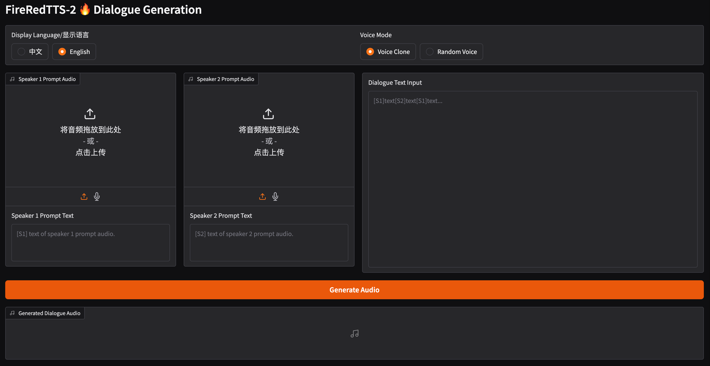

<div align="center">
    <h1>
    FireRedTTS-2
    </h1>
    <p>
    Official PyTorch code for <br>
    <b><em>FireRedTTS-2: Towards Long Conversational Speech Generation for Podcast and Chatbot</em></b>
    </p>
    <p>
    <!--  -->
    
    </p>
    <p>
    </p>
    <a href="https://arxiv.org/abs/2509.02020"></a>
    <a href="https://fireredteam.github.io/demos/firered_tts_2/"></a>
    <a href="https://huggingface.co/FireRedTeam/FireRedTTS2"></a>
    <a href="https://github.com/FireRedTeam/FireRedTTS"></a>
</div>

## Overview

FireRedTTS‑2 is a long-form streaming TTS system for **multi-speaker dialogue generation**, delivering stable, natural speech with reliable speaker switching and context-aware prosody.

## Highlight🔥

- **Long Conversational Speech Generation**: It currently supports 3 minutes dialogues with 4 speakers and can be easily scaled to longer conversations
with more speakers by extending training corpus.
- **Multilingual Support**: It supports multiple languages including English, Chinese, Japanese, Korean, French, German, and Russian. Support zero-shot voice cloning for cross-lingual and code-switching scenarios.
- **Ultra-Low Latency**: Building on the new **12.5Hz streaming** speech tokenizer, we employ a dual-transformer architecture that operates on a text–speech interleaved sequence, enabling flexible sentence-bysentence generation and reducing first-packet latency，Specifically, on an L20 GPU, our first-packet latency as low as 140ms while maintaining high-quality audio output.
- **Strong Stability**：Our model achieves high similarity and low WER/CER in both monologue and dialogue tests.
- **Random Timbre Generation**:Useful for creating ASR/speech interaction data.

## Demo Examples

**Random Timbre Generation & Multilingual Support**
<div align="center">

<https://github.com/user-attachments/assets/804e9e67-fb15-4557-9715-43cd46a1b3e8>

</div>

**Zero-Shot Podcast Generation**
<div align="center">

<https://github.com/user-attachments/assets/e68b1b7e-1329-47bb-a16f-8589cf227579>

</div>

**Speaker-Specific Finetuned Podcast Generation**

⚠️ Speaker voices: hosts "肥杰" and "惠子" from the podcast "肥话连篇". Use without authorization is forbidden.

⚠️ 声音来源：播客 "肥话连篇" 主播 "肥杰" 和 "惠子"，未经授权不能使用。
<div align="center">

<https://github.com/user-attachments/assets/21f626cb-eaf4-4f5c-920c-3d5d4c8cfa8b>

</div>

For more examples, see [demo page](https://fireredteam.github.io/demos/firered_tts_2/).

## News

- [2025/10/26] 🔥 **We have released comprehensive [fine-tuning](<https://github.com/FireRedTeam/FireRedTTS2/blob/main/bin/finetune_example/tutorial.md>) code and tutorials (based on the LJSpeech dataset).** You can easily adapt this foundation to fine-tune models for multilingual or even conversational datasets. With conversational data, you can achieve podcast generation results comparable to our demo showcase.
- [2025/10/11] **We now support streaming dialogue generation.**
- [2025/09/28] **Supports bf16 inference, reducing VRAM usage from 14GB to 9GB and enabling consumer-grade GPU deployment.**
- [2025/09/12] We have added a UI tool to the dialogue generation.
- [2025/09/08] We release the [pre-trained checkpoints](https://huggingface.co/FireRedTeam/FireRedTTS2) and inference code.
- [2025/09/02] We release the [technical report](https://arxiv.org/abs/2509.02020) and [demo page](https://fireredteam.github.io/demos/firered_tts_2/)

## Roadmap

- [x] 2025/09
  - [x] Release the pre-trained checkpoints and inference code.
  - [x] Add web UI tool.

- [ ] 2025/10
  - [ ] Release a base model with enhanced multilingual support.
  - [x] **Provide fine-tuning code & tutorial for specific dialogue/multilingual data.**
  - [ ] **End-to-end text-to-podcast pipeline.**

## Install & Model Download

### Clone and install

- **Clone the repo**

    ``` sh
    git clone https://github.com/FireRedTeam/FireRedTTS2.git
    cd FireRedTTS2
    ```

- **Create env**:

    Setup environment with Conda:

    ``` sh
    conda create --name fireredtts2 python==3.11
    conda activate fireredtts2

    # Step 1. PyTorch Installation (if required)
    pip install torch==2.7.1 torchvision==0.22.1 torchaudio==2.7.1 --index-url https://download.pytorch.org/whl/cu126

    # Step 2. Install Dependencies
    pip install -e .
    pip install -r requirements.txt
    ```

    or use Docker:

    ``` sh
    # Build docker image
    docker build -t fireredtts2:v1.0 docker
    
    # Launch docker container
    docker run -v=${PWD}:/workspace/FireRedTTS2 --ipc=host --net=host --gpus=all -it fireredtts2:v1.0 bash
    ```

- **Model download**

    ```sh
    git lfs install
    git clone https://huggingface.co/FireRedTeam/FireRedTTS2 pretrained_models/FireRedTTS2
    ```

## Basic Usage

**Dialogue Generation with Web UI**

Generate dialogue through an easy-to-use web interface that supports both voice cloning and randomized voices.

```sh
python gradio_demo.py --pretrained-dir "./pretrained_models/FireRedTTS2"
```

<div align="center">

<p>

</p>

</div>

**Dialogue Generation**

```python
import os
import sys
import torch
import torchaudio
from fireredtts2.fireredtts2 import FireRedTTS2

device = "cuda"

fireredtts2 = FireRedTTS2(
    pretrained_dir="./pretrained_models/FireRedTTS2",
    gen_type="dialogue",
    device=device,
)

text_list = [
    "[S1]那可能说对对，没有去过美国来说去去看到美国线下。巴斯曼也好，沃尔玛也好，他们线下不管说，因为深圳出去的还是电子周边的会表达，会发现哇对这个价格真的是很高呀。都是卖三十五美金、四十美金，甚至一个手机壳，就是二十五美金开。",
    "[S2]对，没错，我每次都觉得不不可思议。我什么人会买三五十美金的手机壳？但是其实在在那个target啊，就塔吉特这种超级市场，大家都是这样的，定价也很多人买。",
    "[S1]对对，那这样我们再去看说亚马逊上面卖卖卖手机壳也好啊，贴膜也好，还包括说车窗也好，各种线材也好，大概就是七块九九或者说啊八块九九，这个价格才是卖的最多的啊。因为亚马逊的游戏规则限定的。如果说你卖七块九九以下，那你基本上是不赚钱的。",
    "[S2]那比如说呃除了这个可能去到海外这个调查，然后这个调研考察那肯定是最直接的了。那平时我知道你是刚才建立了一个这个叫做呃rean的这样的一个一个播客，它是一个英文的。然后平时你还听一些什么样的东西，或者是从哪里获取一些这个海外市场的一些信息呢？",
    "[S1]嗯，因为做做亚马逊的话呢，我们会关注很多行业内的东西。就比如说行业有什么样亚马逊有什么样新的游戏规则呀。呃，物流的价格有没有波动呀，包括说有没有什么新的评论的政策呀，广告有什么新的打法呀？那这些我们会会关关注很多行业内部的微信公众号呀，还包括去去查一些知乎专栏的文章呀，以及说我们周边有很多同行。那我们经常会坐在一起聊天，看看信息有什么共享。那这个是关注内内的一个方式。",
]
prompt_wav_list = [
    "examples/chat_prompt/zh/S1.flac",
    "examples/chat_prompt/zh/S2.flac",
]

prompt_text_list = [
    "[S1]啊，可能说更适合美国市场应该是什么样子。那这这个可能说当然如果说有有机会能亲身的去考察去了解一下，那当然是有更好的帮助。",
    "[S2]比如具体一点的，他觉得最大的一个跟他预想的不一样的是在什么地方。",
]

all_audio = fireredtts2.generate_dialogue(
    text_list=text_list,
    prompt_wav_list=prompt_wav_list,
    prompt_text_list=prompt_text_list,
    temperature=0.9,
    topk=30,
)
torchaudio.save("chat_clone.wav", all_audio, 24000)
```

**Dialogue Generation (Sreaming)**

**NOTE:** Each audio chunk is 0.08 seconds, except the first (a little shorter) and last (a little longer).

```python
import torch
import torchaudio
from fireredtts2.fireredtts2 import FireRedTTS2_Stream

device = "cuda"

fireredtts2 = FireRedTTS2_Stream(
    pretrained_dir="./pretrained_models",
    gen_type="dialogue",
    device=device,
)

text_list = [
    "[S1]那可能说对对，没有去过美国来说去去看到美国线下。巴斯曼也好，沃尔玛也好，他们线下不管说，因为深圳出去的还是电子周边的会表达，会发现哇对这个价格真的是很高呀。都是卖三十五美金、四十美金，甚至一个手机壳，就是二十五美金开。",
    "[S2]对，没错，我每次都觉得不不可思议。我什么人会买三五十美金的手机壳？但是其实在在那个target啊，就塔吉特这种超级市场，大家都是这样的，定价也很多人买。",
    "[S1]对对，那这样我们再去看说亚马逊上面卖卖卖手机壳也好啊，贴膜也好，还包括说车窗也好，各种线材也好，大概就是七块九九或者说啊八块九九，这个价格才是卖的最多的啊。因为亚马逊的游戏规则限定的。如果说你卖七块九九以下，那你基本上是不赚钱的。",
    "[S2]那比如说呃除了这个可能去到海外这个调查，然后这个调研考察那肯定是最直接的了。那平时我知道你是刚才建立了一个这个叫做呃rean的这样的一个一个播客，它是一个英文的。然后平时你还听一些什么样的东西，或者是从哪里获取一些这个海外市场的一些信息呢？",
    "[S1]嗯，因为做做亚马逊的话呢，我们会关注很多行业内的东西。就比如说行业有什么样亚马逊有什么样新的游戏规则呀。呃，物流的价格有没有波动呀，包括说有没有什么新的评论的政策呀，广告有什么新的打法呀？那这些我们会会关关注很多行业内部的微信公众号呀，还包括去去查一些知乎专栏的文章呀，以及说我们周边有很多同行。那我们经常会坐在一起聊天，看看信息有什么共享。那这个是关注内内的一个方式。",
]
prompt_wav_list = [
    "examples/chat_prompt/zh/S1.flac",
    "examples/chat_prompt/zh/S2.flac",
]

prompt_text_list = [
    "[S1]啊，可能说更适合美国市场应该是什么样子。那这这个可能说当然如果说有有机会能亲身的去考察去了解一下，那当然是有更好的帮助。",
    "[S2]比如具体一点的，他觉得最大的一个跟他预想的不一样的是在什么地方。",
]

all_audio = []
audio_generator = fireredtts2.generate_dialogue(
    text_list=text_list,
    prompt_wav_list=prompt_wav_list,
    prompt_text_list=prompt_text_list,
    temperature=0.9,
    topk=30,
)
for audio_chunk in audio_generator:
    all_audio.append(audio_chunk)
all_audio = torch.cat(all_audio, dim=1)

torchaudio.save("chat_clone_stream.wav", all_audio, 24000)
```

**Monologue Generation**

```python
import os
import sys
import torch
import torchaudio
from fireredtts2.fireredtts2 import FireRedTTS2

device = "cuda"
lines = [
    "Hello everyone, welcome to our newly launched FireRedTTS2. It supports multiple languages including English, Chinese, Japanese, Korean, French, German, and Russian. Additionally, this TTS model features long-context dialogue generation capabilities.",
    "如果你厌倦了千篇一律的AI音色，不满意于其他模型语言支持不够丰富，那么本项目将会成为你绝佳的工具。",
    "ランダムな話者と言語を選択して合成できます",
    "이는 많은 인공지능 시스템에 유용합니다. 예를 들어, 제가 다양한 음성 데이터를 대량으로 생성해 여러분의 ASR 모델이나 대화 모델에 풍부한 데이터를 제공할 수 있습니다.",
    "J'évolue constamment et j'espère pouvoir parler davantage de langues avec plus d'aisance à l'avenir.",
]

fireredtts2 = FireRedTTS2(
    pretrained_dir="./pretrained_models/FireRedTTS2",
    gen_type="monologue",
    device=device,
)

# random speaker
for i in range(len(lines)):
    text = lines[i].strip()
    audio = fireredtts2.generate_monologue(text=text)
    # adjust temperature & topk
    # audio = fireredtts2.generate_monologue(text=text, temperature=0.8, topk=30)
    torchaudio.save(str(i) + ".wav", audio.cpu(), 24000)


# # voice clone
# for i in range(len(lines)):
#     text = lines[i].strip()

#     audio = fireredtts2.generate_monologue(
#         text=text,
#         prompt_wav=<prompt_wav_path>,
#         prompt_text=<prompt_wav_text>,
#     )
#     torchaudio.save(str(i) + ".wav", audio.cpu(), 24000)
```

## Acknowledgements

- We thank [**Moshi**](https://github.com/kyutai-labs/moshi) and [**Sesame CSM**](https://github.com/SesameAILabs/csm) for their novel dual-transformer approach. Additionally, we adapted [**Sesame CSM's**](https://github.com/SesameAILabs/csm) structure and core inference code.

- We referred to [**Qwen2.5-1.5B**](https://huggingface.co/Qwen/Qwen2.5-1.5B) text tokenizer solution.

- We referred to [**Xcodec2**](https://github.com/zhenye234/X-Codec-2.0) Vocos-based acoustic decoder.

## ⚠️ Usage Disclaimer ❗️❗️❗️❗️❗️❗️

- The project incorporates zero-shot voice cloning functionality; Please note that this capability is intended **solely for academic research purposes**.
- **DO NOT** use this model for **ANY illegal activities**❗️❗️❗️❗️❗️❗️
- The developers assume no liability for any misuse of this model.
- If you identify any instances of **abuse**, **misuse**, or **fraudulent** activities related to this project, **please report them to our team immediately.**


## Star History

[](https://www.star-history.com/#FireRedTeam/FireRedTTS2&type=date&legend=top-left)


