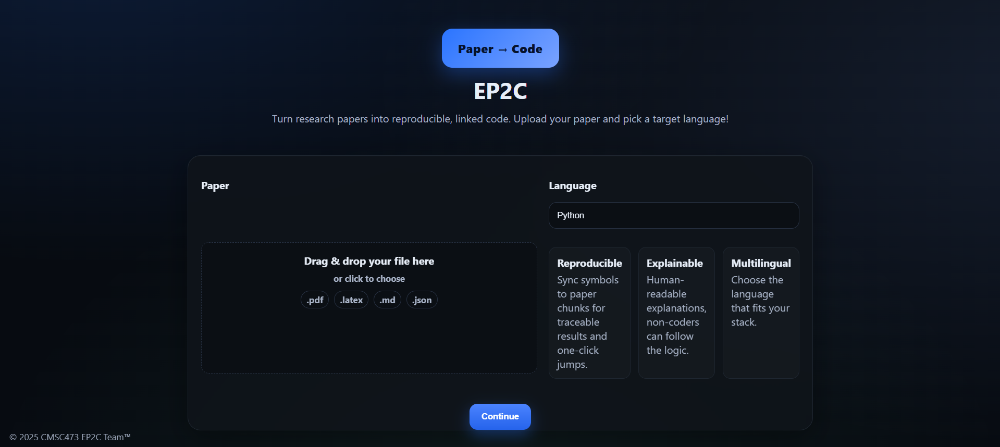
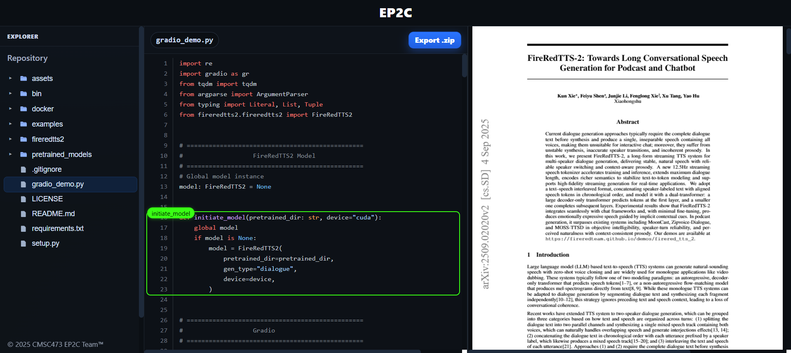

# EP2C Frontend
**EP2C (Explainable Paper-to-Code)** is a web interface that bridges research papers and reproducible code. This frontend provides a sleek experience for uploading papers, selecting target languages, and exploring code-paper connections side-by-side.

## Landing Page:

## Viewer Page:

© 2025 CMSC473 EP2C Team™ — All rights reserved.