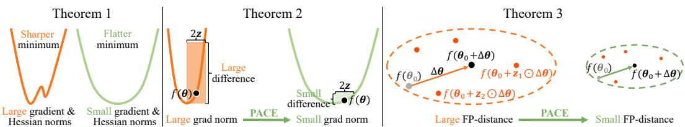
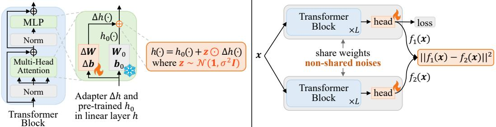
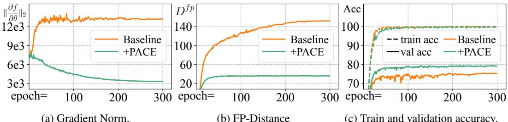
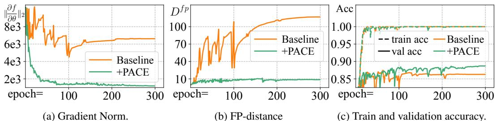
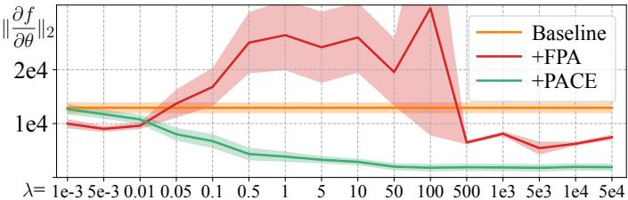
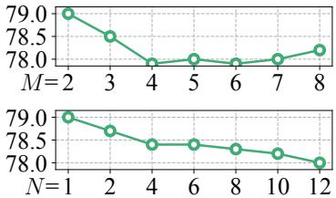
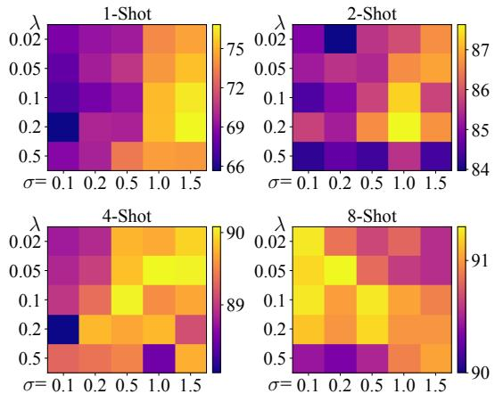
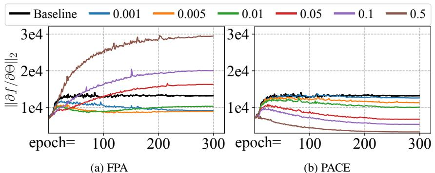
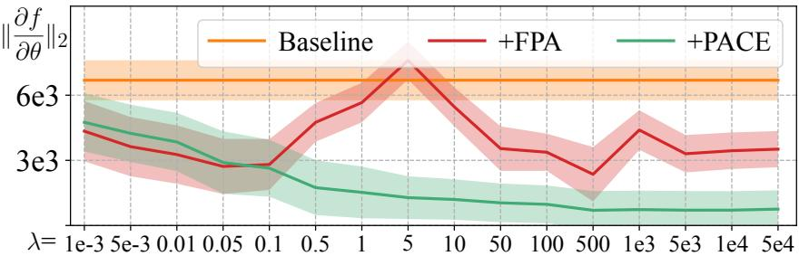

# PACE: Marrying generalization in PArameter-efficient fine-tuning with Consistency rEgularization

Yao Ni† Shan Zhang‡,† Piotr Koniusz∗,§,† †The Australian National University §Data61 CSIRO ‡Australian Institute for Machine Learning, The University of Adelaide †yao.ni@anu.edu.au ‡shan.zhang@adelaide.edu.au §piotr.koniusz@data61.csiro.au

# Abstract

Parameter-Efficient Fine-Tuning (PEFT) effectively adapts pre-trained transformers to downstream tasks. However, the optimization of tasks performance often comes at the cost of generalizability in fine-tuned models. To address this issue, we theoretically connect smaller weight gradient norms during training and larger datasets to the improvements in model generalization. Motivated by this connection, we propose reducing gradient norms for enhanced generalization and aligning finetuned model with the pre-trained counterpart to retain knowledge from large-scale pre-training data. Yet, naive alignment does not guarantee gradient reduction and can potentially cause gradient explosion, complicating efforts to manage gradients. To address such an issue, we propose PACE, marrying generalization of PArameterefficient fine-tuning with Consistency rEgularization. We perturb features learned from the adapter with the multiplicative noise and ensure the fine-tuned model remains consistent for same sample under different perturbations. Theoretical analysis shows that PACE not only implicitly regularizes gradients for enhanced generalization, but also implicitly aligns the fine-tuned and pre-trained models to retain knowledge. Experimental evidence supports our theories. PACE surpasses existing PEFT methods in visual adaptation tasks (VTAB-1k, FGVC, few-shot learning, domain adaptation) showcasing its potential for resource-efficient finetuning. It also improves LoRA in text classification (GLUE) and mathematical reasoning (GSM-8K). The code is available at github.com/MaxwellYaoNi/PACE.

# 1 Introduction

Transformers [68], with the self-attention mechanism [3] capturing long-range dependencies in data, succeed in various deep learning tasks, including image classification (ViT [16]), multimodal learning (CLIP [55]), image synthesis (StableDiffusion [57]), semantic segmentation (SAM [33]) and text generation (LLaMA [65]). The success of transformers can be largely attributed to the availability of abundant data, such as ImageNet [11] and Laion5B [60], which empower researchers to scale up these models by training them under an enormous number of parameters.

Such huge models, with knowledge from large-scale pre-training [63], constitute on foundation models that can be easily adapted to various downstream tasks through full fine-tuning or linear probing [20], eliminating the need for task-specific model design [8]. However, full fine-tuning is storage-intensive and infeasible for maintaining separate model weights as the number of tasks grows, while linear probing, which only trains the last head layer, yields inferior adaptation performance.

To overcome these limitations, Parameter-Efficient Fine-Tuning (PEFT) [24] fine-tunes only a small subset of parameters, thereby reducing storage requirements while surpassing the performance of full fine-tuning and linear probing. These advantages have popularized PEFT and inspired the development of various PEFT methods for deep learning tasks, which can be categorized into two groups: those increasing inference cost and cost-efficient ones. The first group introduces additional learning branches, such as non-linear adapters [25, 8], or concatenates learnable parameters with input tokens, e.g., visual prompts [28, 82, 52], increasing inference cost. The second group, focuses on cost-efficiency by lower-rank adaptation in linear layers [7, 26], or affine transformations such as SSF [41] and RepAdapters [45], which can be reparameterized during inference for efficiency.

Despite the superiority and efficiency of PEFT, prioritizing optimization for downstream tasks compromises the generalizability of fine-tuned models, yielding suboptimal performance. Although some analyses have been conducted on PEFT [63, 27, 18, 72, 39], they fail to fully explain the generalization of PEFT, leading to ineffective strategies for improving generalization.

To address this gap in understanding generalization in PEFT, we establish a theoretical connection from generalization theory: smaller weight gradient norms and larger data volumes contribute to better generalization. Motivated by this, we propose reducing weight gradient norms and aligning output space of the fine-tuned model with the pre-trained one to retain knowledge captured from large pre-training data. Yet, theoretical analyses reveal this naive alignment does not guarantee gradient regularization and can even cause gradient explosion, complicating efforts for gradient management. To address this issue, we propose perturbing features learned from the adapter with multiplicative noise and constraining the network output to be consistent across different perturbations.

Our method, called PACE, marries generalization of PArameter-efficient fine-tuning with Consistency rEgularization. Its name, PACE, reflects our goal of keeping the output behavior of the fine-tuned model in pace with the pre-trained one. Despite its simplicity, theoretical analysis confirms that PACE not only implicitly regularizes weight gradients for better generalization but also implicitly aligns the fine-tuned model with the pre-trained counterpart to retain knowledge from large-scale pre-training data. Experimental evidence supports our theories. PACE improves existing PEFT methods, achieving superior results across six adaptation benchmarks. Our key contributions are:

i. We establish a theory connecting smaller weight gradient norms and larger datasets with enhanced generalization, motivating gradient reduction and model alignment for fine-tuning.   
ii. We propose PACE, a simple yet effective method perturbing features from adapters with multiplicative noise and constraining output of fine-tuned model to be consistent across perturbations.   
iii. Our theoretical and empirical evidence confirms that PACE implicitly regularizes gradients and aligns the fine-tuned model with the pre-trained one. PACE excels on 4 visual adaptation tasks.   
iv. We provide novel theoretical explanations of how gradient penalization and consistency regularization benefit generalization, offering fundamental insights applicable across deep learning.

# 2 Related work

Parameter-Efficient Fine-Tuning (PEFT). LoRA [26] uses low-rank decomposition to reduce parameters and treats adapters as side paths. SSF [41] proposes affine transformations on latent features. FacT [30] decomposes and reassembles parameter matrices in ViT. Surgical fine-tuning [36] of different network parts improves adaptation to distribution shifts. FLoRA [74] performs a batched low-rank adaptation. GLoRA [7] unifies cost-efficient PEFT methods. NOAH [82] uses parameter search on neural prompts. ARC [14] leverages cross-layer ViT similarity, parameter-sharing adapter and scaling factors for lower fine-tuning cost. RLRR [15] incorporates a residual term for flexibility while preserving pre-trained representation. RepAdapter [45] reparameterizes adapters for efficient inference. Res-tuning [29] unbinds tuners from the backbone for memory efficiency. Zhao et al. [84] show impressive fine-tuning results by tuning layernorm in attention. OFT [54] and BOFT [42] propose orthogonal fine-tuning to preserve hypersphere energy between neurons.

Consistency Regularization. Fixmatch [61] applies consistency regularization over augmented images for semi-supervised learning. Openmatch [59] utilizes it on outlier predictions for open-set semi-supervised learning. R-Drop [76] applies it to transformers [68] with dropout for NLP tasks. CR [79] applies it over augmented real and fake images for GAN training. CAGAN [50] enforces consistency on discriminators with dropout for GAN training. Despite the empirical success of consistency regularization demonstrated by previous works, theoretical analysis is lacking. While NICE [47] demonstrates that consistency regularization lowers latent feature gradients for stable

GAN training, it fails to reveal reduced weight gradient for enhanced generalization. Our study goes beyond prior works by providing a theoretical link between smaller weight gradients and improved generalization, effectively marrying generalization of PEFT with consistency regularization.

Generalization of Fine-Tuning. Li et al. [38] constrain the fine-tuned model’s closeness to the pretrained model in weight space. Fu et al. [18] induce sparsity on PEFT for better generalization. Wang et al. [72] studies generalization of PEFT fine-tuning graph neural network. Zhang et al. [83] employ rank-1 gradient boosting (GB) updates supported by the GB theoretical framework. VioLET [73], PromptSRC [31] and CoPrompt [58] naively align the fine-tuned model with the pre-trained one for enhanced generalization or avoiding forgetting. Additionally, L2SP [77], DELTA [40], and FTP [64] aim to retain pre-trained knowledge by aligning fine-tuned models with pre-trained ones, reducing distance in weight space, feature space and using projected gradient descent, respectively. However, they fail to provide a theoretical analysis for this alignment. Our study goes beyond understanding generalization of PEFT by discovering the benefits of gradient regularization and model alignment. We propose PACE to match both requirements, paving a comprehensive understanding for PEFT.

Gradient regularization. Previous studies have empirically shown that gradient regularization improves performance [67, 85, 48, 49] and adversarially robust accuracy [13]. However, they lack theoretical connection between smaller gradient norms and better generalization [17, 81, 6]. We bridge this gap by establishing a fundamental theory between reduced gradient norms and improved generalization, providing a solid foundation for future research on enhancing generalization.

# 3 Approach

We begin with a unified perspective on cost-efficient PEFT based on GLoRA [7], linking generalization with gradients and large-scale data, and motivating the alignment of the fine-tuned model with the pre-trained model to leverage its knowledge. We identify limitations of naive alignment in gradient regularization and introduce PACE, which implicitly enhances gradient regularization and model alignment. We conclude with theoretical justification and efficient implementations.

# 3.1 A unified perspective on cost-efficient PEFT methods

The transformer architectures [68, 16] have excelled in natural language processing and computer vision tasks through their powerful sequential modeling capabilities. This success stems from their ability to process text/image tokens through $L$ transformer blocks, where each block contains selfattention and MLP modules primarily composed of linear layers. These linear layers enable the self-attention mechanism to capture long-range dependencies, allowing transformers to achieve superior performance when scaled to a huge number of parameters and trained on extensive datasets.

With massive parameters, pre-trained on large-scale data, transformers serve as foundation models that can be fine-tuned for downstream tasks using limited data. However, fully fine-tuning all parameters for various downstream tasks requires substantial memory and can lead the forgetting of pre-trained knowledge. To alleviate this without increasing inference cost, adapters with lightweight parameters are often preferred for fine-tuning. Let $\bar { h } _ { 0 } ( \cdot )$ be a transformation within the pre-trained transformer. Current adapters can be unified as introducing a residual branch $\Delta \bar { h }$ to form a new transformation $\bar { h }$ :

$$
\bar { h } ( { \mathbf { a } } ) = \bar { h } _ { 0 } ( { \mathbf { a } } ) + \Delta \bar { h } ( { \mathbf { a } } ) .
$$

Here, $\textbf { \em a }$ is the input and $\bar { h } _ { 0 } ( \cdot )$ can represent MLP modules, as in Adapter [25] and AdaptFormer [8], or linear layers in self-attention and MLP modules, as in [26, 7, 12, 34]. In SSF [41], $\bar { h } _ { 0 } ( \cdot )$ is the identity mapping and $\Delta { \bar { h } } ( a ) = a \odot ( \gamma - 1 ) + \beta$ with $\gamma$ and $\beta$ as affine transformation parameters.

Given that linear layers are key components in transformer, tuning them offers a flexible and effective way to adapt models to downstream tasks. This work focuses on methods that tune the linear layer without increasing inference cost. Let $\left( W _ { 0 } , b _ { 0 } \right)$ , $( \Delta W , \Delta b )$ , and $( W , b )$ be the parameters of pre-trained model, adapter and fine-tuned model, respectively, where $W _ { 0 } , \Delta W$ , $W \in \mathbb { R } ^ { d _ { \mathrm { o u t } } \times d _ { \mathrm { i n } } }$ and $\dot { \pmb { b } } _ { 0 } , \Delta \pmb { b } , \pmb { b } \in \mathbb { R } ^ { d _ { \mathrm { o u t } } }$ . Fine-tuning a linear layer in self-attention or MLP module can be formed as:

$$
\begin{array} { r l } & { h ( \pmb { a } ) = W \pmb { a } + b = ( W _ { 0 } + \Delta W ) \pmb { a } + ( b _ { 0 } + \Delta \pmb { b } ) } \\ & { \qquad = h _ { 0 } ( \pmb { a } ) + \Delta h ( \pmb { a } ) = ( W _ { 0 } \pmb { a } + b _ { 0 } ) + ( \Delta W \pmb { a } + \Delta \pmb { b } ) . } \end{array}
$$

Based on GLoRA [7], cost-efficient PEFT methods for linear layers vary in the form of $\Delta W , \Delta b$

$\mathbf { L o R A _ { a d d } }$ : $\Delta W = W _ { \mathrm { d } } W _ { \mathrm { u } } , \Delta b = b _ { \mathrm { l o r a } }$ where $W _ { \mathrm { d } } \in \mathbb { R } ^ { d _ { \mathrm { o u t } } \times r }$ , $W _ { \mathrm { u } } \in \mathbb { R } ^ { r \times d _ { \mathrm { i n } } }$ , and $r$ is the rank.

$\mathbf { L o R A } _ { \mathbf { m u l } }$ : $\Delta { W } = W _ { \mathrm { 0 } } { \odot } ( W _ { \mathrm { d } } W _ { \mathrm { u } } )$ , $\Delta \boldsymbol { b } = \boldsymbol { b } _ { 0 } \odot \boldsymbol { b } _ { \mathrm { { l o r a } } }$ , including RepAdapter [45] via reparameterization.

$\mathbf { V P T _ { a d d } }$ : $\Delta \mathbf { W }$ is zero, $\Delta \boldsymbol { b } = \boldsymbol { W } _ { 0 } \boldsymbol { P }$ , with learnable $\pmb { P } \in \mathbb { R } ^ { d _ { \mathrm { i n } } \times 1 }$ as layer-wise visual prompt. We use $\mathrm { V P T _ { a d d } }$ to differentiate from VPT [28], which concatenates $_ { P }$ with tokens, increasing inference cost.

# 3.2 Generalization of deep neural networks

Having established a unified perspective on cost-efficient PEFT, we now motivate our method from a perspective on improving generalization of neural networks to enhance performance on unseen data. Consider a network $f : = { \bar { \phi } } ( g ( x ) )$ with $l$ layers, where $g$ is feature extractor and $\phi$ is the classification head. Let $\pmb \theta : = \{ ( \boldsymbol W ^ { ( i ) } , \boldsymbol b ^ { ( i ) } ) \} _ { i = 1 } ^ { l }$ be the parameter set with dimension $d$ and $\mathcal { D } ^ { n } : = \{ ( \boldsymbol { \mathbf { \mathit { x } } } _ { i } , \boldsymbol { \mathbf { \mathit { y } } } _ { i } ) \} _ { i = 1 } ^ { n }$ be the training set of size $n$ drawn i.i.d. from distribution $\mathcal { D }$ , which contains infinite data. The following lemma from [17] explains the relationship between the empirical and population loss.

Lemma 1 (Theorem 1 from [17]) Let ${ \mathcal { L } } _ { D ^ { n } } ( \pmb { \theta } )$ be the empirical loss function over $f$ on training set $\mathcal { D } ^ { n }$ and $\mathcal { L } _ { \mathcal { D } } ( \pmb { \theta } )$ be the population loss. For any $\rho > 0$ , with high probability over $\mathcal { D } ^ { n } \sim \mathcal { D }$ , we have

$$
\mathcal L _ { \mathcal D } ( \pmb \theta ) \leq \operatorname* { m a x } _ { \| \epsilon \| _ { 2 } \leq \rho } \mathcal L _ { \mathcal D ^ { n } } ( \pmb \theta + \epsilon ) + R \Big ( \frac { \| \pmb \theta \| _ { 2 } ^ { 2 } } { \rho ^ { 2 } } , \frac { 1 } { n } \Big ) ,
$$

where $R : ( \mathbb { R } _ { + } , \mathbb { R } _ { + } )  \mathbb { R } _ { + }$ is an increasing function (under conditions on $\mathcal { L } _ { \mathcal { D } } ( \pmb { \theta } )$ and n as in $\textrm { \tiny \left\{ \begin{array} { r l r l } \end{array} \right. } , $

Lemma 1 bounds the population loss by the empirical loss with perturbed weights, indicating that a minimal empirical loss increase from small weight perturbations implies low population loss.

By observing that the maximum of $\mathcal { L } _ { \mathcal { D } ^ { n } }$ is achieved at $\begin{array} { r } { \epsilon = \frac { \rho \pmb { \nabla } _ { \pmb { \theta } } } { \| \pmb { \nabla } _ { \pmb { \theta } } \| _ { 2 } } } \end{array}$ , where $\nabla _ { \theta }$ is the gradient of $\mathcal { L } _ { \mathcal { D } ^ { n } }$ at $\pmb { \theta }$ , and performing a Taylor expansion of $\mathcal { L } _ { \mathcal { D } ^ { n } }$ around $\pmb \theta$ , we formulate the following theorem.

Theorem 1 Denote $\nabla _ { \theta }$ as the gradient and $\lambda _ { m a x } ^ { H }$ as the largest eigenvalue of the Hessian matrix $\scriptstyle { H _ { \theta } }$ of $\mathcal { L } _ { \mathcal { D } ^ { n } }$ at . For any $\rho > 0$ , with high probability over training set , we have

$$
\mathcal { L } _ { \mathcal { D } } ( \pmb { \theta } ) \leq \mathcal { L } _ { \mathcal { D } ^ { n } } ( \pmb { \theta } ) + \rho \| \nabla _ { \pmb { \theta } } \| _ { 2 } + \frac { \rho ^ { 2 } } { 2 } \lambda _ { m a x } ^ { H } + R \Big ( \frac { \| \pmb { \theta } \| _ { 2 } ^ { 2 } } { \rho ^ { 2 } } , \frac { 1 } { n } \Big ) .
$$

Here, higher-order terms from the Taylor expansion are incorporated into $R \left( \frac { \| \pmb { \theta } \| _ { 2 } ^ { 2 } } { \rho ^ { 2 } } , \frac { 1 } { n } \right)$ which is related to weights norm and inversely related to the training data size $n$ .

Theorem 1 (proof in $\ S _ { \mathrm { B . 1 } }$ ) outlines strategies for enhancing generalization. They involve regularizing weight norms and the largest Hessian eigenvalues, and crucially, increasing data size $n$ and reducing the weight gradient norms (illustrated in Figure 1). However, excessive reduction should be avoided as it could impair network’s representation capacity, yielding higher empirical and population loss.

# 3.3 Motivation and limitation of aligning the fine-tuned model with the pre-trained model

Theorem 1 emphasizes that large-scale data and smaller gradient magnitudes are essential for better generalization in neural network training. Therefore, aligning the fine-tuned model with the pretrained one is crucial, as it ensures retention of knowledge obtained from large-scale data, preserving generalization. PEFT methods, often outperforming full fine-tuning, achieve this alignment by limiting the number of trainable parameters, restricting the model’s capacity to deviate from the pretrained one. However, the training objective prioritizes downstream task performance, compromising alignment with pre-trained knowledge. While sparsity regularization [18] and weight decay on adapter weights help, they do not ensure alignment, as even small weight changes can lead to significant divergence in output space [75, 21, 17]. Therefore, we propose to achieve the alignment by reducing the FP-distance (output distance between fine-tuned and pre-trained models on training samples):

$$
D ^ { \mathrm { f p } } ( \pmb \theta ) = \frac { 1 } { n } \sum _ { i = 1 } ^ { n } \lVert f ( \pmb x _ { i } ; \pmb \theta ) - f ( \pmb x _ { i } ; \pmb \theta _ { 0 } ) \rVert _ { 2 } ^ { 2 } , \quad \pmb \theta = \pmb \theta _ { 0 } + \Delta \pmb \theta ,
$$

where $\theta , \theta _ { 0 } , \Delta \theta \in \mathbb { R } ^ { d }$ are parameters for the fine-tuned model, pre-trained model and the adapter.

While reducing FP-distance keeps the fine-tuned model close to the pre-trained model, thus preserving its knowledge, it does not ensure reduced gradient magnitudes, leading to suboptimal generalization.

  
Figure 1: Thm. 1: A flatter minimum has smaller gradient and Hessian norms, yielding better generalization. Thm. 2: Large gradient norms indicate large differences among perturbations. PACE minimizes these differences, reducing gradient norms. Thm. 3: Minimizing all pairs of distances between $f ( \pmb { \theta } _ { 0 } + z _ { 1 } \odot \Delta \pmb { \theta } )$ and $f ( \pmb { \theta } _ { 0 } + z _ { 2 } \odot \Delta \pmb { \theta } )$ where $z _ { 1 } , z _ { 2 } \sim \mathcal { N } ( 1 , \sigma ^ { 2 } I )$ also reduces FP-distance (between fine-tuned $f ( \pmb { \theta } _ { 0 } { + } \Delta \pmb { \theta } )$ and pre-trained $f ( \pmb \theta _ { 0 } ) ) ,$ ), especially when $z _ { 1 } { = } 1$ , $z _ { \mathrm { 2 } } = \mathbf { 0 }$ or vice versa.

To understand the gradient-related limitations in this alignment, we assume $\Delta \theta$ is small enough for a Taylor expansion approximation. Following standard practices [17, 80, 2], we perform the expansion up to the second-order terms. Given the independence between elements in squared $L _ { 2 }$ distances $\textup { ( \ S ) }$ and to simplify our theories, we analyze a one-dimensional output for a single i.i.d. sample, which leads us to the following proposition.

Proposition 1 Assuming $\Delta \theta$ is small, denote $f ( \pmb { \theta } ) \in \mathbb { R }$ as the one-dimensional output for $_ { \textbf { \em x } }$ , with $\mathbf { v }$ and $\pmb { H }$ as its gradient and Hessian at $\pmb \theta$ . FP-distance over $_ { \textbf { \em x } }$ can be decomposed as follows:

$$
\begin{array} { r l } & { [ f ( \theta ) - f ( \theta _ { 0 } ) ] ^ { 2 } = [ f ( \theta ) - f ( \theta - \Delta \theta ) ] ^ { 2 } \approx \left[ f ( \theta ) - [ f ( \theta ) - \Delta \theta ^ { T } \nabla + \frac { 1 } { 2 } \Delta \theta ^ { T } H \Delta \theta ] \right] ^ { 2 } } \\ & { \quad \quad \quad \quad \approx [ \Delta \theta ^ { T } \nabla - \frac { 1 } { 2 } \Delta \theta ^ { T } H \Delta \theta ] ^ { 2 } . } \end{array}
$$

Prop. 1 establishes the relationship between weight gradients, adapter weights, and FP-distance. However, it remains unclear if it regulates gradients. Our experiments show that minimizing FPdistance can sometimes increase gradient magnitude, complicating efforts for managing gradient.

# 3.4 Consistency regularization

To achieve better generalization by both regularizing gradients and aligning the fine-tuned model with the pre-trined model, we propose a consistency regularization loss for $f$ , encouraging invariance of $f$ to the same input under varying multiplicative noise perturbations on the adapter weights, as follows:

$$
D ^ { \mathrm { p a c e } } ( \pmb { \theta } ) = \frac { 1 } { n } \sum _ { i = 1 } ^ { n } \mathbb { E } _ { z _ { 1 } , z _ { 2 } } \| f ( \pmb { x } _ { i } ; \pmb { \theta } _ { 0 } + z _ { 1 } \odot \Delta \pmb { \theta } ) - f ( \pmb { x } _ { i } ; \pmb { \theta } _ { 0 } + z _ { 2 } \odot \Delta \pmb { \theta } ) \| _ { 2 } ^ { 2 } ,
$$

where $z _ { 1 } , z _ { 2 } \sim \mathcal { N } ( 1 , \sigma ^ { 2 } I )$ is the multiplicative noise applied on adapter weight. To understand the generalization benefits in this consistency regularization, we simplify the analysis by focusing on one-dimensional output for a single sample, resulting in the following theorem.

Theorem 2 Using notations from Prop. 1, let $f ( \pmb \theta _ { 0 } + z \odot \Delta \pmb \theta ) \in \mathbb { R }$ be the one-dimensional output for $_ { \textbf { \em x } }$ . Define $\Delta \theta _ { j }$ as $j$ -th element in $\Delta \theta$ , $\nabla _ { j }$ as the $j$ -th element in $\mathbf { v }$ and $H _ { j k }$ as the $( j , k )$ -entry $i n$ $\pmb { H }$ . With $z _ { 1 } , z _ { 2 } \sim \mathcal { N } ( 1 , \sigma ^ { 2 } I )$ , the consistency loss over $_ { \textbf { \em x } }$ can be approximated as:

$$
\begin{array} { r l } & { \quad \mathbb E _ { z _ { 1 } , z _ { 2 } } [ f ( \theta _ { 0 } + z _ { 1 } \odot \Delta \theta ) - f ( \theta _ { 0 } + z _ { 2 } \odot \Delta \theta ) ] ^ { 2 } } \\ & { \quad \approx 2 \sigma ^ { 2 } \sum _ { j } \Delta \theta _ { j } ^ { 2 } \nabla _ { j } ^ { 2 } + \sigma ^ { 4 } \sum _ { j , k } \Delta \theta _ { k } ^ { 2 } \Delta \theta _ { j } ^ { 2 } H _ { j k } ^ { 2 } = 2 \sigma ^ { 2 } \| \Delta \theta \odot \nabla \| _ { 2 } ^ { 2 } + \sigma ^ { 4 } \| ( \Delta \theta \Delta \theta ^ { T } ) \odot H \| _ { F } ^ { 2 } . } \end{array}
$$

Theorem 2 (proof in $\ S \_$ shows that the consistency regularization essentially penalizes the first- and second-order gradients of $f$ at $\pmb \theta$ (illustrated in Figure 1), with the regularization strength controlled by the noise variance $\sigma ^ { 2 }$ and adaptively influenced by the magnitude of elements in adapter weight $\Delta \theta$ . Thus, minimizing the consistency loss implicitly regularizes the gradients, improving generalization.

With the FP-distance in Prop. 1 and consistency loss in Theorem 2, we establish their relationship as:

Theorem 3 With d as the dimension of $\pmb \theta$ , Eq. 6 can be upper-bounded as:

$$
[ \Delta \boldsymbol { \theta } ^ { T } \boldsymbol { \nabla } - \frac { 1 } { 2 } \Delta \boldsymbol { \theta } ^ { T } \boldsymbol { H } \Delta \boldsymbol { \theta } ] ^ { 2 } \leq 2 d \| \Delta \boldsymbol { \theta } \odot \boldsymbol { \nabla } \| _ { 2 } ^ { 2 } + d ^ { 2 } \| \big ( \Delta \boldsymbol { \theta } \Delta \boldsymbol { \theta } ^ { T } \big ) \odot \boldsymbol { H } \| _ { F } ^ { 2 } .
$$

Transformer block with adapter perturbed by noise

Consistency regularization between two outputs of $_ { x }$

  
Figure 2: Our pipeline. Adapter $\Delta h ( \cdot )$ and $h _ { 0 } ( \cdot )$ from pre-trained model form the linear layer $h$ of Multi-Head Attention and MLP in fine-tuned model. We perturb $\Delta h ( \cdot )$ with multiplicative noise and ensure the network remains consistent to same inputs under varying perturbations.

Theorem 3 (proof in B.3) establishes the relationship between Eq. 6 and Eq. 8, showing Eq. 6 is upperbounded by terms involving $\| \Delta \pmb { \theta } \odot \nabla \| _ { 2 } ^ { 2 }$ and $\| ( \Delta \mathbf { \bar { \omega } } \Delta \pmb { \theta } ^ { T } ) \odot \pmb { H } \| _ { F } ^ { 2 }$ which appear in Eq. 8. Reducing these terms results in a decrease in Eq. 6. Thus minimizing the consistency loss implicitly aligns the fine-tuned and pre-trained models (illustrated in Figure 1), preserving pre-trained knowledge.

# 3.5 Efficient implementation of PACE

Providing different weight perturbations for each input in a mini-batch increases memory and computational demands. To avoid this, we perturb feature outputs from the adapter $\Delta h ( \cdot )$ , effectively simulating perturbation that shares noise across each row in the weight matrix $\Delta \mathbf { W }$ . Our simple pipeline is shown in Figure 2. Consider $\pmb { X } \in \mathbb { R } ^ { B \times T \times d _ { \mathrm { i n } } }$ as a batch of data where $B$ and $T$ are the batch and token sizes. The calculation for the linear layer of the fine-tuned model, which utilizes pre-trained weights $W _ { 0 } , b _ { 0 }$ and adapter weights $\Delta W , \Delta b$ , processes an output size of $d _ { \mathrm { o u t } }$ as:

$$
\begin{array} { c } { { h _ { 0 } ( { \pmb X } ) = W _ { 0 } { \pmb X } + b _ { 0 } ; \quad \Delta h ( { \pmb X } ) = \Delta W { \pmb X } + \Delta b , } } \\ { { h ( { \pmb X } ) = h _ { 0 } ( { \pmb X } ) + { \pmb Z } \odot \Delta h ( { \pmb X } ) . } } \end{array}
$$

Operator $\odot$ is the element-wise multiplication after expanding the left matrix $Z ~ \in ~ \mathbb { R } ^ { B \times d _ { \mathrm { o u t } } } ~ \sim$ ${ \bar { \mathcal { N } } } ( \mathbf { 1 } , \sigma ^ { 2 } I )$ into $B \times T \times d _ { \mathrm { o u t } }$ where tokens within the same example share the same noise. Motivated by [37], the $\sigma$ decreases linearly as block depth increases. Let $f _ { 1 } ( \cdot )$ and $f _ { 2 } ( \cdot )$ be two networks share same weights but do not share the noise patterns. The loss function for PACE is:

$$
\mathcal { L } ^ { \mathrm { P A C E } } = \frac { 1 } { n } \sum _ { i = 1 } ^ { n } \ell ( f _ { 1 } ( \pmb { x } _ { i } ) , \pmb { y } _ { i } ) + \lambda \| f _ { 1 } ( \pmb { x } _ { i } ) - f _ { 2 } ( \pmb { x } _ { i } ) \| _ { 2 } ^ { 2 } ,
$$

where $\ell$ is the classification loss and $\lambda$ is a hyperparameter controlling regularization strength. During inference, noise and regularization are ommitted, $\Delta W , \Delta b$ are integrated with $W _ { 0 } , b _ { 0 }$ for efficiency:

$$
{ \pmb W } = { \pmb W } _ { 0 } + \Delta { \pmb W } ; \quad { \pmb b } = { \pmb b } _ { 0 } + \Delta { \pmb b } ; \quad { \pmb h } ( { \pmb X } ) = { \pmb W } { \pmb X } + { \pmb b } .
$$

Efficient PACE variants. In $\ S$ , we present two variants that match the computational/memory costs of the baseline while achieving superior performance with substantially reduced resources.

# 4 Experiments

We combine $\mathrm { L o R A _ { \mathrm { m u l } } }$ and $\mathrm { { V P T } _ { a d d } }$ to form a strong baseline $\mathrm { L o R A _ { \mathrm { m u l } } + V P T _ { \mathrm { a d d } } }$ , outperforming other combinations in most cases. We evaluate our method across four visual classification adaptation tasks: VTAB-1K [78], few-shot learning [30], FGVC [28] and domain adaptation [82]. We demonstrate PACE improves LoRA on GLUE [70] for text classification and GSM-8K [9] for text generation.

Datasets and evluations. VTAB-1K comprises 19 datasets organized into (i) Natural images, (ii) Specialized datasets (remote sensing, medical) and (iii) Structured datasets (scene structure) domains. Each dataset has 1K training examples. Following [78, 28], we use the provided 800-200 train split for hyperparameter selection, evaluate using the full training set and report average accuracy across three trails. Few-shot learning involves 5 fine-grained datasets: FGVC-Aircraft [46], Food101 [4], OxfordFlowers102 [51], OxfordPets [53] and StanfordCars [35]. Following [30], we evaluate 1,

Table 1: Results on VTAB-1K with ViT-B/16. Mean Acc. is the average of group mean values.   

<table><tr><td rowspan="3">Method</td><td>Natural</td><td>Specialized</td><td>Structured</td><td></td><td></td></tr><tr><td>ROM Catcc CirrOO</td><td>Rhund Cammrn UMS Ressg</td><td>Ceroe-rn HIT-II CecC-r</td><td>507-1sp</td><td>SZ-Am NOSOE</td><td>We are</td></tr><tr><td>0 Re</td><td>NHAS L6unS</td><td></td><td>CM</td><td>0-Jdsp</td><td></td></tr><tr><td>Full Linear</td><td>68.9 87.7 64.3 97.3 86.9 87.4 38.8 64.4 85.0 63.2 97.0 86.3 36.6 51.0</td><td>79.7 95.7 84.2 73.9 78.5 87.5 68.5 74.0</td><td>56.3 58.6 41.7 34.3 30.6 33.2 55.4 12.5 20.0</td><td>65.5 57.5 46.7</td><td>25.7 29.1 9.6 19.2</td><td>68.9 57.6</td></tr><tr><td>VPT-Deep</td><td>78.8 90.8 65.8 98.0 88.3 78.1 49.6</td><td>81.8 96.1 83.4 68.4</td><td>68.5 60.0 46.5 72.8 73.6</td><td>47.9</td><td>32.9 37.8</td><td>72.0</td></tr><tr><td>Adapter</td><td>69.2 90.1 68.0 98.8 89.9 82.8 54.3</td><td>84.0 94.9 81.9 75.5</td><td>80.9 65.3 48.6 78.3 74.8 48.5</td><td></td><td>29.9 41.6</td><td>73.9</td></tr><tr><td>AdaptFormer</td><td>70.8 91.2 70.5 99.1 90.9 86.6 54.8</td><td>83.0 95.8 84.4 76.3</td><td>81.9 64.3 49.3 80.3 76.3 45.7</td><td></td><td>31.7 41.1</td><td>74.7</td></tr><tr><td>LoRA</td><td>67.1 91.4 69.4 98.8 90.4 85.3 54.0</td><td>84.9 95.3 84.4 73.6</td><td>82.9 69.2 49.8 78.5</td><td>75.7 47.1</td><td>31.0 44.0</td><td>74.5</td></tr><tr><td>NOAH</td><td>69.6 92.7 70.2 99.1 90.4 86.1 53.7</td><td>84.4 95.4 83.9 75.8</td><td>82.8 68.9 49.9 81.7</td><td>81.8 48.3</td><td>32.8 44.2</td><td>74.2</td></tr><tr><td>RepAdapter</td><td>69.0 92.6 75.1 99.4 91.8 90.2 52.9</td><td>87.4 95.9 87.4 75.5</td><td>75.9 62.3 53.3 80.6 77.3</td><td>54.9</td><td>29.5 37.9</td><td>76.1</td></tr><tr><td>RLR</td><td>75.6 92.4 72.9 99.3 91.5 89.8 57.0</td><td>86.8 95.2 85.3 75.9</td><td>79.7 64.2 53.9</td><td>82.1 83.9 53.7</td><td>33.4 43.6</td><td>76.7</td></tr><tr><td>GLoRA</td><td>76.4 92.9 74.6 99.6 92.5 91.5 57.8</td><td>87.3 96.8 88.0 76.0</td><td>83.1</td><td>67.3 54.5 86.2 83.8 52.9 37.0 41.4</td><td></td><td>78.0</td></tr><tr><td>Baseline</td><td>74.9 93.3 72.0 99.4 91.0 91.5 54.8</td><td>83.2 95.7 86.9 74.2</td><td>83.0 70.5 51.9 81.4 77.9 51.7 33.6 44.4</td><td></td><td></td><td>76.4</td></tr><tr><td>+PACE</td><td>79.0 94.2 73.6 99.4 92.4 93.7 58.0 </td><td>87.4 96.4 89.3 77.1</td><td></td><td>84.9 70.9 54.9 84.3 84.7 57.3 39.3 44.8</td><td></td><td> 79.0</td></tr><tr><td></td><td></td><td></td><td></td><td></td><td></td><td></td></tr></table>

Table 2: Classification accuracy on Few-shot learning with ViT-B/16 pre-trained on ImageNet-21K.   

<table><tr><td rowspan="2">Shot Method</td><td colspan="5">FGVCAircraft</td><td colspan="5">Food101</td><td colspan="5">Flowers102</td></tr><tr><td>1</td><td>2</td><td>4</td><td>8</td><td>16</td><td>1</td><td>2</td><td>4</td><td>8 16</td><td></td><td>1</td><td>2</td><td>4</td><td>8</td><td>16</td></tr><tr><td>LoRAadd</td><td>10.4</td><td>15.2</td><td>27.2</td><td>41.7</td><td>59.2</td><td>33.9</td><td>51.9</td><td>59.3</td><td>66.0</td><td>71.3</td><td>93.3</td><td>96.4</td><td>98.0</td><td>98.6</td><td>98.7</td></tr><tr><td>+PACE</td><td>10.7</td><td>16.3</td><td>28.2</td><td>42.1</td><td>61.0</td><td></td><td>40.6 55.9</td><td>63.8</td><td>70.3</td><td>75.2</td><td>95.0</td><td>98.0</td><td>98.9</td><td>99.5</td><td>99.6</td></tr><tr><td>VPTadd</td><td>11.2</td><td>15.1</td><td>23.7</td><td>36.3</td><td>51.5</td><td>34.3</td><td>56.6</td><td>64.8</td><td>71.7</td><td>75.4</td><td>94.3</td><td>97.6</td><td>98.2</td><td>99.3</td><td>99.6</td></tr><tr><td>+PACE</td><td>11.6</td><td>16.2</td><td>24.0</td><td>37.0</td><td>52.4</td><td>39.9</td><td>57.2</td><td>66.7</td><td>72.4</td><td>76.1</td><td>95.3</td><td>97.8</td><td>98.6</td><td>99.4</td><td>99.6</td></tr><tr><td>LoRAmul+VPTadd</td><td>10.5</td><td>15.6</td><td>28.4</td><td>44.8</td><td>61.8</td><td></td><td>35.4 54.3</td><td>64.8</td><td>72.1</td><td>76.4</td><td>90.4</td><td>97.3</td><td>98.4</td><td>99.4</td><td>99.5</td></tr><tr><td>+PACE</td><td>12.3</td><td>. 16.8</td><td>. 29.9</td><td>. 45.7</td><td>62.5</td><td>39.3</td><td>57.2</td><td>66.7</td><td>73.4</td><td>77.8</td><td>93.4</td><td>98.1</td><td>99.1 </td><td>99.5 .</td><td>99.7</td></tr><tr><td></td><td></td><td colspan="4">OxfordPets</td><td colspan="4">StanfordCars</td><td></td><td colspan="4">Average</td><td></td></tr><tr><td>LoRAadd</td><td>73.2</td><td>83.1</td><td>87.5</td><td>89.2</td><td>91.1</td><td>8.7</td><td>15.3</td><td></td><td>30.2 55.3</td><td>74.5</td><td>43.9</td><td>52.3</td><td></td><td>60.4 70.1</td><td>78.9</td></tr><tr><td>+PACE</td><td>75.3</td><td>85.0</td><td>90.7</td><td>90.8</td><td>92.4</td><td>9.4</td><td>16.0</td><td>30.9</td><td>56.1</td><td>75.9</td><td></td><td>46.2 54.2</td><td>62.5 .</td><td>71.7</td><td>80.8</td></tr><tr><td>VPTadd</td><td>75.9</td><td>85.6</td><td>90.3</td><td>90.6</td><td>92.3</td><td>9.3</td><td>15.0</td><td></td><td>27.8 46.6</td><td>65.1</td><td></td><td>45.0 53.9</td><td>60.9</td><td>68.9</td><td>76.7</td></tr><tr><td>+PACE</td><td>78.2</td><td>87.4</td><td>90.3</td><td>91.1</td><td>92.3</td><td>9.9</td><td>15.4</td><td>27.9</td><td></td><td>947.0 65.9</td><td></td><td>46.9 54.8</td><td>61.5</td><td>69.3</td><td>77.2</td></tr><tr><td>LoRAmul+VPTadd</td><td>69.9</td><td>84.1</td><td>89.1</td><td>91.3</td><td>91.9</td><td>9.0</td><td>16.3</td><td>32.7</td><td>59.0</td><td>76.4</td><td></td><td>43.0 53.5</td><td>62.6</td><td>73.2</td><td>81.2</td></tr><tr><td>+PACE</td><td>76.5 88.0 90.3 91.4 92.4</td><td></td><td></td><td></td><td></td><td>9.7 16.4 33.7 59.8 77.3</td><td></td><td></td><td></td><td></td><td></td><td>46.2 55.3 63.9 73.9 81.9</td><td></td><td></td><td></td></tr></table>

2, 4, 8 and 16 shots, train on the provided training set, tune hyperparameters using validation and report average test accuracy over three random seeds. FGVC includes 5 fine-grained datasets: CUB200-2011 [69], NABirds [66], OxfordFlowers [51], StanfordDogs [10] and StanfordCars [35]. We follow [28] to use validation set for hyperparameter and report test results. For domain adaptation, following [82, 7], we train on ImageNet [11] with a 16-shot setting, use the validation split by [82] for hyperparameter selection and report the results on the official validation set and 4 out-of-domain datasets: ImageNet-Sketch [71], ImageNet-V2 [56], ImageNet-A [23] and ImageNet-R [22]. We evaluate on GLUE [70] for text classification and GSM-8K [9] for mathematical reasoning.

Pre-trained backbones. We experiment with two vision transformers, Vision Transforms (ViT-B/16) [16] and Swin Transformer (Swin-B) [44]. These two are pre-trained on ImageNet-21K [11]. We test a ViT-B-Laion-IN12K model, pre-trained on Laion-2B [60] and fine-tuned on ImageNet-12K [11]. We use $\mathrm { R o B E R T a _ { b a s e } }$ [43] and Phi-3-mini-4k-instruct [1] for text classification and generation.

Implementation details. We follow [28] for image processing: $2 2 4 \times 2 2 4$ resizing for VTAB-1K; random flips and crops to $2 2 4 \times 2 2 4$ for FGVC and few-shot learning; stronger augmentation for domain adaptation task, following [16, 82, 41]. We use the Adam optimizer [32] with cosine learning rate decay and linear warm-up (first 10 epochs). Models are fine-tuned for 300 epochs on VTAB-1K and 100 epochs on other vision adaptation tasks, with batch size 64. For text classification we follow [26]. See $\ S$ for mathematical reasoning details. All experiments used an NVIDIA H100 GPU.

Baseline. For each dataset, we identified the better method $\mathrm { ( L o R A _ { m u l } + V P T _ { a d d } }$ or $\mathrm { L o R A _ { a d d } }$ ) and tuned the rank, learning rate, and weight decay to form a strong baseline. The detailed baseline settings for each task and the number of trainable parameters are provided in $\ S \mathrm { F }$ , where $\mathrm { L o R A _ { \mathrm { m u l } } + V P T _ { \mathrm { a d d } } }$ generally outperformed other variants. Building on the strong $\mathrm { L o R A _ { \mathrm { m u l } } + V P T _ { \mathrm { a d d } } }$ , we use the grid search for our $\lambda$ and $\sigma$ , following strategies from previous studies [28, 41, 26]. Beyond $\mathrm { L o R A _ { \mathrm { m u l } } + V P T _ { \mathrm { a d d } } }$ PACE also enhances PEFT methods such as AdaptFormer, GLoRA, COFT, and BOFT $( \ S _ { \mathrm { D . 4 ) } }$ .

Table 3: Results on FGVC with ViT-B/16. \* denotes using augmented ViT by AugReg [62].   

<table><tr><td>Method</td><td>CUB NA- -2011</td><td>Oxford Birds Flowers</td><td>Stan. Dogs</td><td>Stan. Mean Cars</td><td>Acc.</td></tr><tr><td>Full Linear</td><td>87.3 82.7</td><td>98.8</td><td>89.4</td><td>84.5</td><td>85.9</td></tr><tr><td>VPT</td><td>85.3 75.9</td><td>97.9</td><td>86.2</td><td>51.3</td><td>79.3</td></tr><tr><td></td><td>88.5 84.2</td><td>99.0</td><td>90.2</td><td>83.6</td><td>89.1</td></tr><tr><td>LoRA</td><td>88.3 85.6</td><td>99.2</td><td>91.0</td><td>83.2</td><td>89.5</td></tr><tr><td>SSF*</td><td>89.5 85.7</td><td>99.6</td><td>89.6</td><td>89.2</td><td>90.7</td></tr><tr><td>ARC*</td><td>89.3 85.7</td><td>99.7</td><td>89.1</td><td>89.5</td><td>90.7</td></tr><tr><td>RLRR*</td><td>89.8 85.3</td><td>99.6</td><td>90.0</td><td>90.4</td><td>91.0</td></tr><tr><td>LoRAmul+VPTadd</td><td>88.9 87.1</td><td>99.4</td><td>91.2</td><td>87.5</td><td>90.8</td></tr><tr><td>+PACE</td><td>89.8 87.3</td><td>99.5</td><td></td><td>92.2 88.8 91.5</td><td></td></tr></table>

Table 4: Results on domain adaptation with ViTB/16 pre-trained on ImageNet-21K.   

<table><tr><td rowspan=2 colspan=2>Method</td><td rowspan=1 colspan=1>Source</td><td rowspan=1 colspan=2>Target</td><td rowspan=2 colspan=1>MeanAcc.</td></tr><tr><td rowspan=1 colspan=1>ImageNet</td><td rowspan=1 colspan=2>-Sketch-V2-A-R</td></tr><tr><td rowspan=1 colspan=2>Full</td><td rowspan=1 colspan=1>63.9</td><td rowspan=1 colspan=2>18.552.53.221.2</td><td rowspan=7 colspan=1>31.835.634.734.736.040.544.1</td></tr><tr><td rowspan=1 colspan=2>Linear</td><td rowspan=1 colspan=1>67.9</td><td rowspan=6 colspan=2>14.460.89.425.616.459.15.522.118.358.04.623.220.059.36.923.324.866.1 11.928.530.667.5 13.3 31.0</td></tr><tr><td rowspan=4 colspan=2>AdapterVPTLoRANOAH</td><td rowspan=1 colspan=1></td><td rowspan=1 colspan=1>70.5</td></tr><tr><td rowspan=1 colspan=1>70.5</td><td rowspan=1 colspan=1>18.320.0</td></tr><tr><td rowspan=1 colspan=1>70.8</td><td rowspan=1 colspan=1>20.0</td></tr><tr><td rowspan=1 colspan=1>71.5</td></tr><tr><td rowspan=1 colspan=2>GLoRA</td><td rowspan=1 colspan=1>78.3</td></tr><tr><td rowspan=1 colspan=2>LoRAmul+VPTadd</td><td rowspan=1 colspan=1>78.3</td><td rowspan=1 colspan=2>30.668.5 14.1 32.5</td><td rowspan=1 colspan=1>44.8</td></tr><tr><td rowspan=1 colspan=2>+PACE</td><td rowspan=1 colspan=1>79.0</td><td rowspan=1 colspan=2>31.869.4 16.3 35.2</td><td rowspan=1 colspan=1>46.3</td></tr></table>

Table 5: Results for GLUE w/ $\mathrm { R o B E R T a _ { b a s e } }$ . Matthew’s correlation for COLA, Pearson correlation for STSB, and accuracy for others.   

<table><tr><td>Method</td><td>COLA</td><td>STSB</td><td>MRPC</td><td>RTE</td><td>QNLI</td><td>SST2</td><td>Avg.</td></tr><tr><td>Full BitFit</td><td>63.6</td><td>91.2</td><td>90.2</td><td>78.7</td><td>92.8</td><td>94.8</td><td>85.2</td></tr><tr><td rowspan="3">Adapt VeRA</td><td>62.0</td><td>90.8</td><td>92.7</td><td>81.5</td><td>91.8</td><td>93.7</td><td>85.4</td></tr><tr><td>62.6</td><td>90.3</td><td>88.4</td><td>75.9</td><td>93.0</td><td>94.7</td><td>84.2</td></tr><tr><td>65.6</td><td>90.7</td><td>89.5</td><td>78.7</td><td>91.8</td><td>94.6</td><td>85.2</td></tr><tr><td>LoRA</td><td>63.4</td><td>91.5</td><td>89.7</td><td>86.6</td><td>93.3</td><td>95.1</td><td>86.6</td></tr><tr><td>+PACE</td><td>66.2</td><td>92.0</td><td>91.4</td><td>86.9</td><td>93.6</td><td>95.6</td><td>87.6</td></tr></table>

Table 6: Results for GSM-8K using Phi-3-mini-4k-instruct.   

<table><tr><td rowspan=1 colspan=1>Method</td><td rowspan=1 colspan=1>Accuracy</td></tr><tr><td rowspan=1 colspan=1>Pre-trainedFull</td><td rowspan=1 colspan=1>62.0173.16</td></tr><tr><td rowspan=1 colspan=1>LoRA</td><td rowspan=1 colspan=1>75.66</td></tr><tr><td rowspan=1 colspan=1>+PACE</td><td rowspan=1 colspan=1>78.77</td></tr></table>

Table 7: Classification results on domain adaptation and CIFAR-100 in VTAB-1K based different pre-trained models. Src. is short for ‘source’ in Table 4.   

<table><tr><td rowspan="3">Method</td><td colspan="4">ViT-B (ImageNet-21K)</td><td colspan="4">ViT-B (Laion2B-ImageNet-12K)</td><td colspan="4">Swin-B (ImageNet-21K)</td></tr><tr><td colspan="2">CIFAR</td><td colspan="2">ImageNet-1K</td><td colspan="2">CIFAR</td><td colspan="2">ImageNet-1K</td><td colspan="2">CIFAR</td><td colspan="2">ImageNet-1K -S -V -A-R</td></tr><tr><td>-100</td><td>Src. -S</td><td>-V</td><td>-A -R</td><td>-100</td><td></td><td>Src. -s -V</td><td>-A -R</td><td>-100</td><td>Src.</td><td></td></tr><tr><td>Full</td><td>51.6</td><td>63.9 18.5 52.5</td><td></td><td>3.2 21.2</td><td></td><td>51.2</td><td>66.0 29.0 56.1 8.1 27.9</td><td></td><td>65.6</td><td></td><td>71.7 27.0 61.1 10.8 24.4</td><td></td></tr><tr><td>Linear</td><td>63.4</td><td></td><td>67.9 14.4 60.8 9.4 25.6</td><td></td><td></td><td>61.9</td><td></td><td>79.2 43.2 69.5 23.4 40.9</td><td></td><td>65.0</td><td></td><td>78.8 36.7 68.8 23.2 35.9</td></tr><tr><td>LoRAadd</td><td>71.2</td><td></td><td>73.8 27.1 64.8 13.6 25.0</td><td></td><td></td><td>71.3</td><td></td><td>77.5 39.8 67.8 20.4 35.6</td><td>74.3</td><td></td><td>76.3 30.7 65.7 16.8 28.9</td><td></td></tr><tr><td>VPTadd</td><td>73.6</td><td></td><td>74.3 27.1 65.9 11.5 26.7</td><td></td><td></td><td>71.8</td><td></td><td>78.4 40.4 68.7 22.4 38.4</td><td>72.7</td><td></td><td>76.2 30.6 66.2 17.6 29.1</td><td></td></tr><tr><td>LoRAmul</td><td>73.4</td><td></td><td>78.1 31.2 68.3 13.4 32.7</td><td></td><td></td><td>73.2</td><td></td><td>78.6 41.9 68.8 22.6 37.8</td><td>73.9</td><td></td><td>76.1 30.8 65.7 18.1 28.9</td><td></td></tr><tr><td>LoRAadd+VPTadd</td><td>70.3</td><td></td><td>76.8 28.7 66.6 13.7 29.9</td><td></td><td></td><td>71.8</td><td></td><td>78.0 41.4 68.3 20.6 36.9</td><td>74.5</td><td></td><td>76.3 30.7 65.7 16.8 28.9</td><td></td></tr><tr><td>LoRAmul+VPTadd</td><td>74.9</td><td></td><td>78.3 30.6 68.5 14.1 32.5</td><td></td><td></td><td>73.8</td><td></td><td>78.3 41.5 68.6 21.6 38.2</td><td>74.6</td><td></td><td>76.6 31.2 66.5 18.5 29.4</td><td></td></tr><tr><td>+PACE</td><td>79.0</td><td></td><td>79.0 31.8 69.4 16.3 35.2</td><td></td><td></td><td>78.0</td><td></td><td>80.1 45.8 71.2 24.6 43.6</td><td>78.9</td><td></td><td></td><td>79.6 39.2 70.1 25.2 38.0</td></tr></table>

# 4.1 Comparison with the State of the Arts

Results on VTAB-1K. Table 1 presents the results comparing PACE with recent state-of-the-art PEFT methods. PACE improves the strong baseline by $2 . 6 \%$ accuracy, surpassing the previous SOTA GLoRA [7] by $1 \%$ , which uses two stages for parameter search. In $\ S$ , we show that reducing training epochs to 50 or 100 has minimal impact on PACE performance.

Results on Few-shot Learning. Table 2 compares performance w/ and w/o our PACE. PACE improves $\mathrm { L o R A } _ { \mathrm { a d d } }$ , $\mathrm { { V P T } _ { a d d } }$ , $\mathrm { L o R A _ { \mathrm { m u l } } + V P T _ { \mathrm { a d d } } }$ , with $\mathrm { L o R A _ { \mathrm { m u l } } \mathrm { + V P T _ { \mathrm { a d d } } \mathrm { + P A C E } } }$ performing best in most cases. PACE yields notable improvement, especially when the number of shot is small.

Results on FGVC. Table 3 shows that PACE improves the strong $\mathrm { L o R A _ { \mathrm { m u l } } + V P T _ { \mathrm { a d d } } }$ by $0 . 7 \%$ , outperforming SSF [41], ARC [14] and RLRR [15] that use strongly pre-trained ViT with augmentations. In $\ S _ { \mathrm { D } . 2 }$ , PACE achieves larger improvements on smaller datasets.

Results on domain adaptation. Table 4 compares PACE with others. $\mathrm { L o R A _ { \mathrm { m u l } } + V P T _ { \mathrm { a d d } } }$ outperforms GLoRA [7] which relies on parameter search. Meanwhile, PACE improves $\mathrm { L o R A _ { \mathrm { m u l } } + V P T _ { \mathrm { a d d } } }$ by $1 . 5 \%$ , outperforming other PEFT methods, demonstrating superior performance on domain adaptation.

Results on text classification and mathematical reasoning. Table 5 shows that PACE outperforms LoRA by $1 \%$ on GLUE text classification and by $3 . 1 1 \%$ on GSM-8K mathematical reasoning.

Generalization on other backbones. We evaluate PACE on CIFAR-100 (VTAB-1K) and domain adaptation using Swin-B [44] pre-trained on ImageNet-21K and ViT-B (pre-trained on Laion 2B, then fine-tuned on ImageNet-12K). Table 7 shows PACE outperforms $\mathrm { L o R A _ { \mathrm { m u l } } + V P T _ { \mathrm { a d d } } }$ and other PEFT methods across all backbones, demonstrating its strong generalizability. Further experiments in $\ S _ { \mathrm { D } . 3 }$ show PACE works effectively with self-supervised models such as MAE [19] and DINO [5].

# 4.2 Analyses

To verify our theories, we conduct experiments on CIFAR-100 (VTAB-1K) using ViT-B/16 and Camelyon (VTAB-1K) on Swin-B. Figures 3 & 4 show the gradient norm (summed across all layers) and FP-distance (Eq. 5) and the train & validation accuracy during training for baseline $\mathrm { L o R A _ { \mathrm { m u l } } + V P T _ { \mathrm { a d d } } }$ and PACE on validation set. Figures 3a & 4a show that PACE has a smaller gradient norm than baseline, verifying Theorem 2 that PACE can implicitly lower the weight gradient norm for better generalization. Figures 3b & 4b demonstrate that PACE maintains a lower FP-distance than the baseline, verifying Theorem 3 that PACE can implicitly align the fine-tuned model with pre-trained model, retaining knowledge from large-scale pre-training. Owing to the advantages of the gradient regularization and model alignment, PACE shortens the performance gap between seen and unseen data, yielding higher accuracy on the unseen validation set, as shown in Figures 3c & 4c.

  
Figure 3: Analysis for PACE. (a) gradient norm, (b) FP-Distance and (c) train & val. accuracy are evaluated on validation set of CIFAR-100 (VTAB-1K) with baseline $\mathrm { L o R A _ { \mathrm { m u l } } + V P T _ { \mathrm { a d d } } }$ on ViT-B/16.

  
Figure 4: Analysis for PACE. (a) gradient norm, (b) FP-Distance and (c) train $\&$ val. accuracy are evaluated on the validation set of Camelyon (VTAB-1K) with baseline $\mathrm { L o R A _ { \mathrm { m u l } } + V P T _ { \mathrm { a d d } } }$ on Swin-B.

To clarify why naive alignment is problematic, we vary the regularization strength $\lambda$ over a wide range (1e-3 to 5e4) for both Fine-tuned Pre-trained model Alignment (FPA) by minimizing $D ^ { \mathrm { f p } }$ in Eq. 5 and PACE. Figure 5 shows the averaged gradient norm over training (see also Figures 8 & 9 for more visualizations). PACE robustly lowers gradient norms with larger $\lambda$ , while FPA exhibits unpredictable behavior, even causing gradient explosion. This verifies Prop. 1 that minimizing $D ^ { \mathrm { f p } }$ is problematic for gradient regularization, complicating gradient management.

  
Figure 5: Gradient norms of models across wide range of regularization strengths $\lambda$ on CIFAR-100 (VTAB-1K) w/ ViT-B/16. Line and shadow represent mean and std across training epochs.

  
Figure 6: Ablation results for applying PACE among $M$ nets and lazily at every $N$ steps.

# 4.3 Ablation studies

We ablate PACE based on the baseline $\mathrm { L o R A _ { \mathrm { m u l } } + V P T _ { \mathrm { a d d } } }$ on CIFAR-100 (VTAB-1K) and ImageNet1K in domain adaption as shown in Table 8. The ablations include Noise (baseline w/ noise perturbing adapter), $\mathrm { P A C E _ { a d d } }$ (replacing the multiplicative noise with the additive noise), $\mathrm { P A C E } _ { h }$ (perturbing $h ( \cdot ) \bar { }$ instead of $\Delta h ( \cdot )$ in Eq. 11), $\mathrm { P A C E _ { d r o p } }$ (replacing the Gaussian noise with the dropout noise), $\mathrm { P A C E } _ { \sigma = }$ (all transformer blocks share the same $\sigma$ ), $\mathrm { P A C E } _ { \sigma \uparrow }$ $\cdot \sigma$ increases linearly with depth), FPA (fine-tuned and pre-trined alignment by minimizing Eq. 5), SAM (sharpness-aware minimization [17]), GP (gradient penalization), $\ell _ { 1 }$ (sparsity regularization), and transfer learning methods L2SP [77], DELTA [40] and FTP [64]. We grid-search hyperparameters and report the best results.

Table 8 presents the results for all variants. PACE improves over Noise, which itself is better than baseline, justifying our adapter perturbation and consistency regularization. $\mathrm { P A C E _ { a d d } }$ performs worse than PACE, showing the superiority of the multiplicative noise. Although $\mathrm { P A C E } _ { h }$ can implicitly regularize gradients, it performs worse than PACE, verifying the advantages of perturbing adapter to implicitly align models. $\mathrm { P A C E _ { d r o p } }$ is worse than PACE, indicating the dropout noise is suboptimal. $\mathrm { P A C E } _ { \sigma = }$ and $\mathrm { P A C E } _ { \sigma \uparrow }$ perform worse, justifying our design of linearly decreasing $\sigma$ . FPA, SAM and GP, which either only align models or only regularize gradients, are outperformed by PACE. Despite combining $\mathrm { F P A + G P }$ , it still performs worse than ours, suggesting ineffective combination. $\ell _ { 1 }$ , L2SP, DELTA, and FTP obtain worse results than PACE, showing their limitations in improving generalization. PACE regularizes gradients for better generalization and aligns models to retain knowledge, surpassing all other variants.

<table><tr><td>Method</td><td>CIFAR -100</td><td>ImageNet-1K Source -Sketch -V2 -A -R</td></tr><tr><td>LoRAmul+VPTadd</td><td>74.9</td><td>78.3 30.6 68.5 14.1 32.5</td></tr><tr><td>+Noise</td><td>77.4</td><td>78.3 31.3</td></tr><tr><td>PACE</td><td>79.0 79.0</td><td>68.6 14.3 33.0 31.8 69.4 16.3 35.2</td></tr><tr><td>+PACEadd +PCh +PACEdrop</td><td>75.7 78.3 75.9 78.4</td><td>31.2 68.7 13.7 32.7 31.2 68.1 13.8 32.6</td></tr><tr><td>+PACEσ</td><td>78.3 78.9 77.9 78.8 77.3</td><td>31.2 68.9 16.0 34.6 31.6 68.3 16.6 34.7</td></tr><tr><td>+PACEσ↑ +FPA</td><td>78.7 31.3 31.2</td><td>68.9 14.0 33.6</td></tr><tr><td>+SAM [17]</td><td>78.8</td><td>68.6 14.7 33.5</td></tr><tr><td>+GP</td><td>78.4 31.4</td><td>68.5 13.8 32.9</td></tr><tr><td>+FPA+GP</td><td>78.3 31.7</td><td>68.4 14.2 32.1</td></tr><tr><td></td><td>78.1 31.5</td><td>68.1 13.5 32.6</td></tr><tr><td>+l1</td><td>78.2 30.6</td><td>68.6 13.7 32.8</td></tr><tr><td>+L2SP [77]</td><td>78.5 30.4</td><td>68.7 14.9 33.5</td></tr><tr><td>+DELTA [40]</td><td>78.4</td><td>30.8 68.7 14.6 33.7</td></tr><tr><td>+FTP [64]</td><td>78.6</td><td>30.8 68.6 15.8 33.6</td></tr></table>

  
Table 8: Accuracy results on domain adaptation Figure 7: Results for varied $\lambda$ and $\sigma$ as well as and VTAB-1K based different pre-trained models. shot on OxfordPets in few-shot learning.

We further evaluate applying PACE across multiple $M$ networks during training or applying it lazily with half-batch size at every $N$ steps $( \mathrm { P A C E _ { l a z y } ^ { h a l f } }$ in $\ S \ O \ ,$ ). Figure 6 presents the results, showing that applying PACE among two networks at every training step performs best. However, lazy regularization applied every few steps can still provide reasonable results while saving computational/memory costs.

We test the sensitivity of hyperparameters $\lambda$ and $\sigma$ introduced in our PACE on OxfordPets for few-shot learning across 1, 2, 4, 8 shots. The results presented in Figure 7 demonstrate that with less data, larger $\lambda$ and $\sigma$ are favored, verifying the effectiveness of PACE in improving generalization.

# 5 Conclusions

We have introduced PACE, a novel and effective method that combines generalization of PArameterefficient fine-tuning with Consistency rEgularization. Through rigorous theoretical analyses, we have shown PACE reduces weight gradient for improved generalization and it aligns the fine-tuned model with the pre-trained model for retaining pre-training knowledge. Our experimental results support the theoretical analyses, justifying the generalization advantages of PACE over other PEFT methods. With its dual advantages, PACE consistently outperforms other variants across different backbones, firmly establishing PACE as a powerful solution for enhancing generalization for PEFT methods. Limitations and border impacts are discussed in $\ S$ .

Acknowledgments. We thank Moyang Liu, Melody Ip, Chenyi Du, and Yinuo Xu for their valuable discussions and support. PK is funded by CSIRO’s Science Digital.

# References

Nguyen Bach, Amit Bahree, Arash Bakhtiari, Harkirat Behl, et al. Phi-3 technical report: A highly capable language model locally on your phone. arXiv preprint arXiv:2404.14219, 2024. 7, 23   
[2] Guillaume Alain and Yoshua Bengio. What regularized auto-encoders learn from the data-generating distribution. JMLR, 15(110):3743–3773, 2014. 5   
[3] Dzmitry Bahdanau, Kyunghyun Cho, and Yoshua Bengio. Neural machine translation by jointly learning to align and translate. arXiv preprint arXiv:1409.0473, 2014. 1 [4] Lukas Bossard, Matthieu Guillaumin, and Luc Van Gool. Food-101–mining discriminative components with random forests. In Computer Vision–ECCV 2014: 13th European Conference, Zurich, Switzerland, September 6-12, 2014, Proceedings, Part VI 13, pages 446–461. Springer, 2014. 6 [5] Mathilde Caron, Hugo Touvron, Ishan Misra, Hervé Jégou, Julien Mairal, Piotr Bojanowski, and Armand Joulin. Emerging properties in self-supervised vision transformers. In Proceedings of the IEEE/CVF international conference on computer vision, pages 9650–9660, 2021. 8 [6] Junbum Cha, Sanghyuk Chun, Kyungjae Lee, Han-Cheol Cho, Seunghyun Park, Yunsung Lee, and Sungrae Park. Swad: Domain generalization by seeking flat minima. Advances in Neural Information Processing Systems, 34:22405–22418, 2021. 3   
[7] Arnav Chavan, Zhuang Liu, Deepak Gupta, Eric Xing, and Zhiqiang Shen. One-for-all: Generalized lora for parameter-efficient fine-tuning. arXiv preprint arXiv:2306.07967, 2023. 2, 3, 7, 8, 22 [8] Shoufa Chen, Chongjian Ge, Zhan Tong, Jiangliu Wang, Yibing Song, Jue Wang, and Ping Luo. Adaptformer: Adapting vision transformers for scalable visual recognition. Advances in Neural Information Processing Systems, 35:16664–16678, 2022. 1, 2, 3, 22   
[9] Karl Cobbe, Vineet Kosaraju, Mohammad Bavarian, Mark Chen, Heewoo Jun, Lukasz Kaiser, Matthias Plappert, Jerry Tworek, Jacob Hilton, Reiichiro Nakano, et al. Training verifiers to solve math word problems. arXiv preprint arXiv:2110.14168, 2021. 6, 7, 23   
[10] E Dataset. Novel datasets for fine-grained image categorization. In First Workshop on Fine Grained Visual Categorization, CVPR. Citeseer. Citeseer. Citeseer, 2011. 7   
[11] Jia Deng, Wei Dong, Richard Socher, Li-Jia Li, Kai Li, and Li Fei-Fei. Imagenet: A large-scale hierarchical image database. In 2009 IEEE conference on computer vision and pattern recognition, pages 248–255. Ieee, 2009. 1, 7, 21   
[12] Tim Dettmers, Artidoro Pagnoni, Ari Holtzman, and Luke Zettlemoyer. Qlora: Efficient finetuning of quantized llms. Advances in Neural Information Processing Systems, 36, 2024. 3   
[13] Junhao Dong, Piotr Koniusz, Xinghua Qu, and Yew-Soon Ong. Stabilizing modality gap & lowering gradient norms improves zero-shot adversarial robustness of vlms. 31st SIGKDD Conference on Knowledge Discovery and Data Mining, 2025. 3   
[14] Wei Dong, Dawei Yan, Zhijun Lin, and Peng Wang. Efficient adaptation of large vision transformer via adapter re-composing. Advances in Neural Information Processing Systems, 36, 2024. 2, 8   
[15] Wei Dong, Xing Zhang, Bihui Chen, Dawei Yan, Zhijun Lin, Qingsen Yan, Peng Wang, and Yang Yang. Low-rank rescaled vision transformer fine-tuning: A residual design approach. arXiv preprint arXiv:2403.19067, 2024. 2, 8   
[16] Alexey Dosovitskiy, Lucas Beyer, Alexander Kolesnikov, Dirk Weissenborn, Xiaohua Zhai, Thomas Unterthiner, Mostafa Dehghani, Matthias Minderer, Georg Heigold, Sylvain Gelly, Jakob Uszkoreit, and Neil Houlsby. An image is worth 16x16 words: Transformers for image recognition at scale. In International Conference on Learning Representations, 2021. 1, 3, 7   
[17] Pierre Foret, Ariel Kleiner, Hossein Mobahi, and Behnam Neyshabur. Sharpness-aware minimization for efficiently improving generalization. In International Conference on Learning Representations, 2021. 3, 4, 5, 10, 18   
[18] Zihao Fu, Haoran Yang, Anthony Man-Cho So, Wai Lam, Lidong Bing, and Nigel Collier. On the effectiveness of parameter-efficient fine-tuning. In Proceedings of the AAAI Conference on Artificial Intelligence, volume 37, pages 12799–12807, 2023. 2, 3, 4   
[19] Kaiming He, Xinlei Chen, Saining Xie, Yanghao Li, Piotr Dollár, and Ross Girshick. Masked autoencoders are scalable vision learners. In Proceedings of the IEEE/CVF conference on computer vision and pattern recognition, pages 16000–16009, 2022. 8, 21   
[20] Kaiming He, Haoqi Fan, Yuxin Wu, Saining Xie, and Ross Girshick. Momentum contrast for unsupervised visual representation learning. In Proceedings of the IEEE/CVF conference on computer vision and pattern recognition, pages 9729–9738, 2020. 1   
[21] Zhezhi He, Adnan Siraj Rakin, Jingtao Li, Chaitali Chakrabarti, and Deliang Fan. Defending and harnessing the bit-flip based adversarial weight attack. In Proceedings of the IEEE/CVF Conference on Computer Vision and Pattern Recognition, pages 14095–14103, 2020. 4   
[22] Dan Hendrycks, Steven Basart, Norman Mu, Saurav Kadavath, Frank Wang, Evan Dorundo, Rahul Desai, Tyler Zhu, Samyak Parajuli, Mike Guo, et al. The many faces of robustness: A critical analysis of out-of-distribution generalization. In Proceedings of the IEEE/CVF international conference on computer 83408349, 2021   
[23] Dan Hendrycks, Kevin Zhao, Steven Basart, Jacob Steinhardt, and Dawn Song. Natural adversarial examples. In Proceedings of the IEEE/CVF conference on computer vision and pattern recognition, pages 15262–15271, 2021. 7   
[24] Neil Houlsby, Andrei Giurgiu, Stanislaw Jastrzebski, Bruna Morrone, Quentin De Laroussilhe, Andrea Gesmundo, Mona Attariyan, and Sylvain Gelly. Parameter-efficient transfer learning for nlp. In International conference on machine learning, pages 2790–2799. PMLR, 2019. 1   
[25] Neil Houlsby, Andrei Giurgiu, Stanislaw Jastrzebski, Bruna Morrone, Quentin De Laroussilhe, Andrea Gesmundo, Mona Attariyan, and Sylvain Gelly. Parameter-efficient transfer learning for nlp. In International conference on machine learning, pages 2790–2799. PMLR, 2019. 2, 3   
[26] Edward J Hu, yelong shen, Phillip Wallis, Zeyuan Allen-Zhu, Yuanzhi Li, Shean Wang, Lu Wang, and Weizhu Chen. LoRA: Low-rank adaptation of large language models. In International Conference on Learning Representations, 2022. 2, 3, 7   
[27] Shengding Hu, Zhen Zhang, Ning Ding, Yadao Wang, Yasheng Wang, Zhiyuan Liu, and Maosong Sun. Sparse structure search for delta tuning. In Alice H. Oh, Alekh Agarwal, Danielle Belgrave, and Kyunghyun Cho, editors, Advances in Neural Information Processing Systems, 2022. 2   
[28] Menglin Jia, Luming Tang, Bor-Chun Chen, Claire Cardie, Serge Belongie, Bharath Hariharan, and Ser-Nam Lim. Visual prompt tuning. In European Conference on Computer Vision, pages 709–727. Springer, 2022. 2, 4, 6, 7, 22   
[29] Zeyinzi Jiang, Chaojie Mao, Ziyuan Huang, Ao Ma, Yiliang Lv, Yujun Shen, Deli Zhao, and Jingren Zhou. Res-tuning: A flexible and efficient tuning paradigm via unbinding tuner from backbone. Advances in Neural Information Processing Systems, 36, 2024. 2   
[30] Shibo Jie and Zhi-Hong Deng. Fact: Factor-tuning for lightweight adaptation on vision transformer. In Proceedings of the AAAI Conference on Artificial Intelligence, volume 37, pages 1060–1068, 2023. 2, 6   
[31] Muhammad Uzair Khattak, Syed Talal Wasim, Muzammal Naseer, Salman Khan, Ming-Hsuan Yang, and Fahad Shahbaz Khan. Self-regulating prompts: Foundational model adaptation without forgetting. In Proceedings of the IEEE/CVF International Conference on Computer Vision, pages 15190–15200, 2023. 3   
[32] Diederik P Kingma and Jimmy Ba. Adam: A method for stochastic optimization. arXiv preprint arXiv:1412.6980, 2014. 7   
[33] Alexander Kirillov, Eric Mintun, Nikhila Ravi, Hanzi Mao, Chloe Rolland, Laura Gustafson, Tete Xiao, Spencer Whitehead, Alexander C Berg, Wan-Yen Lo, et al. Segment anything. In Proceedings of the IEEE/CVF International Conference on Computer Vision, pages 4015–4026, 2023. 1   
[34] Dawid Jan Kopiczko, Tijmen Blankevoort, and Yuki M Asano. VeRA: Vector-based random matrix adaptation. In The Twelfth International Conference on Learning Representations, 2024. 3   
[35] Jonathan Krause, Michael Stark, Jia Deng, and Li Fei-Fei. 3d object representations for fine-grained categorization. In Proceedings of the IEEE international conference on computer vision workshops, pages 554–561, 2013. 6, 7   
[36] Yoonho Lee, Annie S Chen, Fahim Tajwar, Ananya Kumar, Huaxiu Yao, Percy Liang, and Chelsea Finn. Surgical fine-tuning improves adaptation to distribution shifts. In The Eleventh International Conference on Learning Representations, 2023. 2   
[37] Bonan Li, Yinhan Hu, Xuecheng Nie, Congying Han, Xiangjian Jiang, Tiande Guo, and Luoqi Liu. Dropkey for vision transformer. In Proceedings of the IEEE/CVF Conference on Computer Vision and Pattern Recognition, pages 22700–22709, 2023. 6   
[38] Dongyue Li and Hongyang Zhang. Improved regularization and robustness for fine-tuning in neural networks. Advances in Neural Information Processing Systems, 34:27249–27262, 2021. 3   
[39] Shengrui Li, Xueting Han, and Jing Bai. Adaptergnn: Parameter-efficient fine-tuning improves generalization in gnns. In Proceedings of the AAAI Conference on Artificial Intelligence, volume 38, pages 13600–13608, 2024. 2   
[40] Xingjian Li, Haoyi Xiong, Hanchao Wang, Yuxuan Rao, Liping Liu, Zeyu Chen, and Jun Huan. Delta: Deep learning transfer using feature map with attention for convolutional networks. arXiv preprint arXiv:1901.09229, 2019. 3, 10   
[41] Dongze Lian, Daquan Zhou, Jiashi Feng, and Xinchao Wang. Scaling & shifting your features: A new baseline for efficient model tuning. In Advances in Neural Information Processing Systems (NeurIPS), 2022. 2, 3, 7, 8, 22   
[42] Weiyang Liu, Zeju Qiu, Yao Feng, Yuliang Xiu, Yuxuan Xue, Longhui Yu, Haiwen Feng, Zhen Liu, Juyeon Heo, Songyou Peng, Yandong Wen, Michael J. Black, Adrian Weller, and Bernhard Schölkopf. Parameter-efficient orthogonal finetuning via butterfly factorization. In ICLR, 2024. 2, 22   
[43] Yinhan Liu. Roberta: A robustly optimized bert pretraining approach. arXiv preprint arXiv:1907.11692, 2019. 7   
[44] Ze Liu, Yutong Lin, Yue Cao, Han Hu, Yixuan Wei, Zheng Zhang, Stephen Lin, and Baining Guo. Swin transformer: Hierarchical vision transformer using shifted windows. In Proceedings of the IEEE/CVF International Conference on Computer Vision (ICCV), 2021. 7, 8   
[45] Towards efficient visual adaption via structural re-parameterization. arXiv preprint arXiv:2302.08106, 2023. 2, 4, 22   
[46] Subhransu Maji, Esa Rahtu, Juho Kannala, Matthew Blaschko, and Andrea Vedaldi. Fine-grained visual classification of aircraft. arXiv preprint arXiv:1306.5151, 2013. 6   
[47] Yao Ni and Piotr Koniusz. Nice: Noise-modulated consistency regularization for data-efficient gans. Advances in Neural Information Processing Systems, 36:13773–13801, 2023. 2, 16   
[48] Yao Ni and Piotr Koniusz. Chain: Enhancing generalization in data-efficient gans via lipschitz continuity constrained normalization. In Proceedings of the IEEE/CVF Conference on Computer Vision and Pattern Recognition (CVPR), pages 6763–6774, June 2024. 3   
[49] Yao Ni, Piotr Koniusz, Richard Hartley, and Richard Nock. Manifold learning benefits gans. In Proceedings of the IEEE/CVF Conference on Computer Vision and Pattern Recognition, pages 11265–11274, 2022. 3   
[50] Yao Ni, Dandan Song, Xi Zhang, Hao Wu, and Lejian Liao. Cagan: Consistent adversarial training enhanced gans. In IJCAI, pages 2588–2594, 2018. 2   
[51] Maria-Elena Nilsback and Andrew Zisserman. A visual vocabulary for flower classification. In IEEE Conference on Computer Vision and Pattern Recognition, volume 2, pages 1447–1454, 2006. 6, 7   
[52] Changdae Oh, Hyeji Hwang, Hee-young Lee, YongTaek Lim, Geunyoung Jung, Jiyoung Jung, Hosik Choi, and Kyungwoo Song. Blackvip: Black-box visual prompting for robust transfer learning. In Proceedings of the IEEE/CVF Conference on Computer Vision and Pattern Recognition, pages 24224–24235, 2023. 2   
[53] Omkar M. Parkhi, Andrea Vedaldi, Andrew Zisserman, and C. V. Jawahar. Cats and dogs. In IEEE Conference on Computer Vision and Pattern Recognition, 2012. 6   
[54] Zeju Qiu, Weiyang Liu, Haiwen Feng, Yuxuan Xue, Yao Feng, Zhen Liu, Dan Zhang, Adrian Weller, and Bernhard Schölkopf. Controlling text-to-image diffusion by orthogonal finetuning. In NeurIPS, 2023. 2, 22   
[55] Alec Radford, Jong Wook Kim, Chris Hallacy, Aditya Ramesh, Gabriel Goh, Sandhini Agarwal, Girish Sastry, Amanda Askell, Pamela Mishkin, Jack Clark, et al. Learning transferable visual models from natural language supervision. In International conference on machine learning, pages 8748–8763. PMLR, 2021. 1   
[56] Benjamin Recht, Rebecca Roelofs, Ludwig Schmidt, and Vaishaal Shankar. Do imagenet classifiers generalize to imagenet? In International conference on machine learning, pages 5389–5400. PMLR, 2019. 7   
[57] Robin Rombach, Andreas Blattmann, Dominik Lorenz, Patrick Esser, and Björn Ommer. High-resolution image synthesis with latent diffusion models. In Proceedings of the IEEE/CVF conference on computer vision and pattern recognition, pages 10684–10695, 2022. 1   
[58] Shuvendu Roy and Ali Etemad. Consistency-guided prompt learning for vision-language models. In The Twelfth International Conference on Learning Representations, 2024. 3   
[59] Kuniaki Saito, Donghyun Kim, and Kate Saenko. Openmatch: Open-set semi-supervised learning with open-set consistency regularization. Advances in Neural Information Processing Systems, 34:25956–25967, 2021. 2   
[60] Christoph Schuhmann, Romain Beaumont, Richard Vencu, Cade W Gordon, Ross Wightman, Mehdi Cherti, Theo Coombes, Aarush Katta, Clayton Mullis, Mitchell Wortsman, Patrick Schramowski, Srivatsa R Kundurthy, Katherine Crowson, Ludwig Schmidt, Robert Kaczmarczyk, and Jenia Jitsev. LAION-5b: An open large-scale dataset for training next generation image-text models. In Thirty-sixth Conference on Neural Information Processing Systems Datasets and Benchmarks Track, 2022. 1, 7   
[61] Kihyuk Sohn, David Berthelot, Nicholas Carlini, Zizhao Zhang, Han Zhang, Colin A Raffel, Ekin Dogus Cubuk, Alexey Kurakin, and Chun-Liang Li. Fixmatch: Simplifying semi-supervised learning with consistency and confidence. Advances in neural information processing systems, 33:596–608, 2020. 2   
[62] Andreas Peter Steiner, Alexander Kolesnikov, Xiaohua Zhai, Ross Wightman, Jakob Uszkoreit, and Lucas Beyer. How to train your vit? data, augmentation, and regularization in vision transformers. Transactions on Machine Learning Research, 2022. 8   
[63] Yusheng Su, Xiaozhi Wang, Yujia Qin, Chi-Min Chan, Yankai Lin, Huadong Wang, Kaiyue Wen, Zhiyuan Liu, Peng Li, Juanzi Li, et al. On transferability of prompt tuning for natural language processing. arXiv preprint arXiv:2111.06719, 2021. 1, 2   
[64] Junjiao Tian, Yen-Cheng Liu, James S Smith, and Zsolt Kira. Fast trainable projection for robust fine-tuning. Advances in Neural Information Processing Systems, 36, 2024. 3, 10   
[65] Hugo Touvron, Thibaut Lavril, Gautier Izacard, Xavier Martinet, Marie-Anne Lachaux, Timothée Lacroix, Baptiste Rozière, Naman Goyal, Eric Hambro, Faisal Azhar, et al. Llama: Open and efficient foundation language models. arXiv preprint arXiv:2302.13971, 2023. 1   
[66] Grant Van Horn, Steve Branson, Ryan Farrell, Scott Haber, Jessie Barry, Panos Ipeirotis, Pietro Perona, and Serge Belongie. Building a bird recognition app and large scale dataset with citizen scientists: The fine print in fine-grained dataset collection. In Proceedings of the IEEE conference on computer vision and pattern recognition, pages 595–604, 2015. 7   
[67] Dániel Varga, Adrián Csiszárik, and Zsolt Zombori. Gradient regularization improves accuracy of discriminative models. arXiv preprint arXiv:1712.09936, 2017. 3   
[68] Ashish Vaswani, Noam Shazeer, Niki Parmar, Jakob Uszkoreit, Llion Jones, Aidan N Gomez, Ł ukasz Kaiser, and Illia Polosukhin. Attention is all you need. In I. Guyon, U. Von Luxburg, S. Bengio, H. Wallach, R. Fergus, S. Vishwanathan, and R. Garnett, editors, Advances in Neural Information Processing Systems, volume 30. Curran Associates, Inc., 2017. 1, 2, 3   
[69] C. Wah, S. Branson, P. Welinder, P. Perona, and S. Belongie. Thecaltech-ucsdbirds-200-2011 dataset. Technical Report CNS-TR-2011-001, California Institute of Technology, 2011. 7   
[70] Alex Wang. Glue: A multi-task benchmark and analysis platform for natural language understanding. arXiv preprint arXiv:1804.07461, 2018. 6, 7   
[71] Haohan Wang, Songwei Ge, Zachary Lipton, and Eric P Xing. Learning robust global representations by penalizing local predictive power. Advances in Neural Information Processing Systems, 32, 2019. 7   
[72] Yihan Wang, Jatin Chauhan, Wei Wang, and Cho-Jui Hsieh. Universality and limitations of prompt tuning. Advances in Neural Information Processing Systems, 36, 2024. 2, 3   
[73] Yaoming Wang, Yuchen Liu, Xiaopeng Zhang, Jin Li, Bowen Shi, Chenglin Li, Wenrui Dai, Hongkai Xiong, and Qi Tian. Violet: Vision-language efficient tuning with collaborative multi-modal gradients. In Proceedings of the 31st ACM International Conference on Multimedia, pages 4595–4605, 2023. 3   
[74] Yeming Wen and Swarat Chaudhuri. Batched low-rank adaptation of foundation models. arXiv preprint arXiv:2312.05677, 2023. 2   
[75] Dongxian Wu, Shu-Tao Xia, and Yisen Wang. Adversarial weight perturbation helps robust generalization. Advances in neural information processing systems, 33:2958–2969, 2020. 4   
[76] Lijun Wu, Juntao Li, Yue Wang, Qi Meng, Tao Qin, Wei Chen, Min Zhang, Tie-Yan Liu, et al. Rdrop: Regularized dropout for neural networks. Advances in Neural Information Processing Systems, 34:10890–10905, 2021. 2   
[77] LI Xuhong, Yves Grandvalet, and Franck Davoine. Explicit inductive bias for transfer learning with convolutional networks. In International Conference on Machine Learning, pages 2825–2834. PMLR, 2018. 3, 10   
[78] Xiaohua Zhai, Joan Puigcerver, Alexander Kolesnikov, Pierre Ruyssen, Carlos Riquelme, Mario Lucic, Josip Djolonga, Andre Susano Pinto, Maxim Neumann, Alexey Dosovitskiy, et al. A large-scale study of representation learning with the visual task adaptation benchmark. arXiv preprint arXiv:1910.04867, 2019. 6   
[79] Han Zhang, Zizhao Zhang, Augustus Odena, and Honglak Lee. Consistency regularization for generative adversarial networks. arXiv preprint arXiv:1910.12027, 2019. 2   
[80] Linjun Zhang, Zhun Deng, Kenji Kawaguchi, Amirata Ghorbani, and James Zou. How does mixup help with robustness and generalization? In ICLR, 2021. 5   
[81] Shan Zhang, Yao Ni, Jinhao Du, Yanxia Liu, and Piotr Koniusz. Semantic transfer from head to tail: Enlarging tail margin for long-tailed visual recognition. In Proceedings of the IEEE/CVF Winter Conference on Applications of Computer Vision, pages 1350–1360, 2024. 3   
[82] Yuanhan Zhang, Kaiyang Zhou, and Ziwei Liu. Neural prompt search. arXiv preprint arXiv:2206.04673, 2022. 2, 6, 7   
[83] Yifei Zhang, Hao Zhu, Aiwei Liu, Han Yu, Piotr Koniusz, and Irwin King. Less is more: Extreme gradient boost rank-1 adaption for efficient finetuning of llms. arXiv preprint arXiv:2410.19694, 2024. 3   
[84] Bingchen Zhao, Haoqin Tu, Chen Wei, Jieru Mei, and Cihang Xie. Tuning layernorm in attention: Towards efficient multi-modal LLM finetuning. In The Twelfth International Conference on Learning Representations, 2024. 2   
[85] Yang Zhao, Hao Zhang, and Xiuyuan Hu. Penalizing gradient norm for efficiently improving generalization in deep learning. In International Conference on Machine Learning, pages 26982–26992. PMLR, 2022. 3

# PACE: Marrying generalization of PArameter-efficient fine-tuning with Consistency rEgularization (Supplementary Material)

Yao Ni† Shan Zhang‡,† Piotr Koniusz $^ { * , \ S , \dagger }$ †The Australian National University §Data61 CSIRO ‡Australian Institute for Machine Learning, The University of Adelaide †yao.ni@anu.edu.au ‡shan.zhang@adelaide.edu.au §piotr.koniusz@data61.csiro.au

# A Broader impacts and limitations

# A.1 Broader impacts

Our work provides a powerful solution for improving generalization in Parameter Efficient FineTuning (PEFT), allowing for effective fine-tuning of pre-trained models while reducing the heavily reliance on pre-training from scratch using large scale data. Our advancements in PEFT, supported by Theorems 1, 2 and 3, offer novel insights into gradient regularization and model alignment. These insights extend beyond PEFT and can be applied to other areas such as continual learning and transfer learning, potentially enhancing the performance and efficiency of models in various domains. By leveraging our findings, practitioners can develop more robust and adaptable models that generalize well to new tasks and environments, leading to more intelligent and versatile AI systems. In terms of negative impacts, the robustness of our fine-tuning method could potentially be misused to create more convincing deepfakes, raising concerns about the spread of misinformation, manipulation of public opinion, and malicious activities such as fraud, blackmail, or harassment. However, potential misuse is a downside with any improvements that have universal nature.

# A.2 Limitations

While our work effectively improves generalization ability, it introduces additional computational costs by requiring input samples to be passed through the network twice for regularization. However, this can be mitigated by using two efficient variants, $\mathrm { P A C E } _ { \mathrm { f a s t } }$ and $\mathrm { P A C E _ { l a Z y } ^ { h a l f } }$ , proposed in $\ S C$ , where we demonstrate the potential for resource-efficient fine-tuning. Additionally, our method introduces extra hyperparameters $\lambda$ and $\sigma$ , which require caution during hyperparameter search. Nonetheless, Figure 7 suggests that fewer training data requires larger $\lambda$ and $\sigma$ values, providing insight for hyperparameter tuning.

# B Proofs

# B.1 Proof of Theorem 1

Settting $\begin{array} { r } { \epsilon = \frac { \rho \pmb { \nabla } _ { \pmb { \theta } } } { \| \pmb { \nabla } _ { \pmb { \theta } } \| _ { 2 } } } \end{array}$ , we perform a second-order Taylor expansion of $\mathcal { L } _ { \mathcal { D } ^ { n } }$ around $\pmb \theta$ . By incorporating the higher-order terms from the Taylor expansion into $R \left( \frac { \| \pmb { \theta } \| _ { 2 } ^ { 2 } } { \rho ^ { 2 } } , \frac { 1 } { n } \right)$ , we derive:

$$
\begin{array} { r l } & { { \mathcal { L } } _ { { \mathcal { D } } } ( \theta ) \leq { \mathcal { L } } _ { { \mathcal { D } } ^ { n } } \Big ( \theta + \frac { \rho \nabla _ { \theta } } { \| \nabla _ { \theta } \| _ { 2 } } \Big ) + R \Big ( \frac { \| \theta \| _ { 2 } ^ { 2 } } { \rho ^ { 2 } } , \frac { 1 } { n } \Big ) } \\ & { \qquad \approx { \mathcal { L } } _ { { \mathcal { D } } ^ { n } } ( \theta ) + \rho \| \nabla _ { \theta } \| _ { 2 } + \frac { \rho ^ { 2 } } { 2 \| \nabla _ { \theta } \| _ { 2 } ^ { 2 } } \nabla _ { \theta } ^ { T } H _ { \theta } \nabla _ { \theta } + R \Big ( \frac { \| \theta \| _ { 2 } ^ { 2 } } { \rho ^ { 2 } } , \frac { 1 } { n } \Big ) . } \end{array}
$$

Assuming that the approximation does not alter the inequality relationship, i.e., it preserves the $\leq$ relation on both sides and considering the largest eigenvalue of $\scriptstyle { H _ { \theta } }$ as $\lambda _ { \operatorname* { m a x } } ^ { \hat { H } }$ , implying ${ \pmb v } ^ { T } { \pmb H } _ { \pmb \theta } { \pmb v } \le$ $\lambda _ { \operatorname* { m a x } } ^ { H } \Vert v \Vert _ { 2 } ^ { 2 }$ for any $\textbf {  { v } }$ , we further bound Eq. 14 as follows and arrive at:

$$
\mathcal { L } _ { \mathcal { D } } ( \pmb { \theta } ) \leq \mathcal { L } _ { \mathcal { D } ^ { n } } ( \pmb { \theta } ) + \rho \| \nabla _ { \pmb { \theta } } \| _ { 2 } + \frac { \rho ^ { 2 } } { 2 } \lambda _ { \operatorname* { m a x } } ^ { H } + R \Big ( \frac { \| \pmb { \theta } \| _ { 2 } ^ { 2 } } { \rho ^ { 2 } } , \frac { 1 } { n } \Big ) .
$$

# B.2 Proof of Theorem 2

The proof is motivated by $\mathbf { N i }$ and Koniusz [47]. We include the proof process for completeness. Denote

$$
\begin{array} { r l } & { m _ { 1 } = z _ { 1 } - 1 , m _ { 2 } = z _ { 2 } - 1 \operatorname { t h u s } m _ { 1 } , m _ { 2 } \sim \mathcal { N } ( \mathbf { 0 } , \sigma ^ { \angle } ) } \\ & { d ^ { \mathrm { p a c e } } = \mathbb { E } _ { z _ { 1 } , z _ { 2 } } [ f ( \pmb { \theta } _ { 0 } + z _ { 1 } \odot \Delta \pmb { \theta } ) - f ( \pmb { \theta } _ { 0 } + z _ { 2 } \odot \Delta \pmb { \theta } ) ] ^ { 2 } } \\ & { \qquad = \mathbb { E } _ { z _ { 1 } , z _ { 2 } } [ f ( \pmb { \theta } _ { 0 } + \Delta \pmb { \theta } + ( z _ { 1 } - 1 ) \odot \Delta \pmb { \theta } ) - f ( \pmb { \theta } _ { 0 } + \Delta \pmb { \theta } + ( z _ { 2 } - 1 ) \odot \Delta \pmb { \theta } ) ] ^ { 2 } } \\ & { \qquad = \mathbb { E } _ { m _ { 1 } , m _ { 2 } } [ f ( \pmb { \theta } + m _ { 1 } \odot \Delta \pmb { \theta } ) - f ( \pmb { \theta } + m _ { 2 } \odot \Delta \pmb { \theta } ) ] ^ { 2 } . } \end{array}
$$

Defining $\pmb { v } : = \pmb { m } _ { 1 } \odot \Delta \pmb { \theta }$ and $\pmb { u } : = { \pmb { m } } _ { 2 } \odot \Delta { \pmb { \theta } }$ , where $\pmb { v } , \pmb { u } \sim \mathcal { N } ( \mathbf { 0 } , \sigma ^ { 2 } \mathrm { d i a g } ( \Delta \pmb { \theta } \odot \Delta \pmb { \theta } ) )$ , we can rewrite Eq. 15 as follows:

$$
\begin{array} { r l } & { \mathbb { E } _ { u , u } [ f ( \theta + v ) - f ( \theta + u ) ] ^ { 2 } } \\ & { \approx \mathbb { E } _ { u , v } [ f ( \theta ) + v ^ { T } \nabla + \frac { 1 } { 2 } v ^ { T } H v - f ( \theta ) - u ^ { T } \nabla - \frac { 1 } { 2 } u ^ { T } H u ] ^ { 2 } } \\ & { = \mathbb { E } _ { u , v } [ v ^ { T } \nabla + \frac { 1 } { 2 } v ^ { T } H v - u ^ { T } \nabla - \frac { 1 } { 2 } u ^ { T } H u ] ^ { 2 } } \\ & { = \mathbb { E } _ { u , v } [ ( v - u ) ^ { T } \nabla + \frac { 1 } { 2 } v ^ { T } H v - \frac { 1 } { 2 } u ^ { T } H u ] ^ { 2 } } \\ & { = \mathbb { E } _ { v , u } [ ( v - u ) ^ { T } \nabla ] ^ { 2 } } \\ & { \quad + \mathbb { E } _ { u , u } [ ( ( v - u ) ^ { T } \nabla ) \left( v ^ { T } H v - u ^ { T } H u \right) ] } \\ & { \quad + \frac { 1 } { 4 } \mathbb { E } _ { v } [ v ^ { T } H v ] ^ { 2 } + \frac { 1 } { 4 } \mathbb { E } _ { u , v } [ u ^ { T } H u ] ^ { 2 } } \\ & { \quad - \frac { 1 } { 2 } \mathbb { E } _ { v , u } [ ( v ^ { T } H v ) ( u ^ { T } H u ) ] . } \end{array}
$$

Next, we derive the four terms, Eq. 16, 17, 18, and 19, respectively as follows:

Eq. 16. Using $\mathbb { E } _ { z _ { 1 } , z _ { 2 } } [ ( z _ { 1 } - z _ { 2 } ) ^ { 2 } ] = 2 \sigma ^ { 2 }$ for $z _ { 1 } , z _ { 2 } \sim \mathcal { N } ( 0 , \sigma ^ { 2 } )$ , we can simplify (Eq. 16) as follows, noting that terms related to different dimensions are canceled due to zero-mean independent Gaussian noise:

$$
\mathbb { E } _ { \boldsymbol { v } , \boldsymbol { u } } \big [ ( \boldsymbol { v } - \boldsymbol { u } ) ^ { T } \boldsymbol { \nabla } \big ] ^ { 2 } = \mathbb { E } _ { \boldsymbol { v } , \boldsymbol { u } } \big [ \sum _ { j } ( v _ { j } - u _ { j } ) ^ { 2 } \nabla _ { j } ^ { 2 } \big ] = 2 \sigma ^ { 2 } \sum _ { j } \Delta \theta _ { j } ^ { 2 } \nabla _ { k } ^ { 2 } .
$$

Eq. 17. Utilizing $E [ z ^ { 3 } ] = \mu ^ { 3 } + 3 \mu \sigma ^ { 2 }$ for $z \sim \mathcal { N } ( \mu , \sigma ^ { 2 } )$ , and noting that $E [ z ^ { 3 } ] = 0$ for $\mu = 0$ , Eq. 17 is derived as:

$$
\begin{array} { r l } & { \mathbb { E } _ { v , u } \left[ \left( ( v - u ) ^ { T } \nabla \right) \left( v ^ { T } H v - u ^ { T } H u \right) \right] } \\ & { = \mathbb { E } _ { v } \left[ \left( v ^ { T } \nabla \right) ( v ^ { T } H v ) \right] + \mathbb { E } _ { u } \left[ ( u ^ { T } \nabla ) ( u ^ { T } H u ) \right] - \mathbb { E } _ { v , u } \left[ ( v ^ { T } \nabla ) ( u ^ { T } H u ) \right] - \mathbb { E } _ { v , u } \left[ ( u ^ { T } \nabla ) ( v ^ { T } H v ) \right] } \\ & { = 2 \mathbb { E } _ { v } \left[ ( v ^ { T } \nabla ) ( v ^ { T } H v ) \right] = 0 . \qquad ( 2 } \end{array}
$$

Eq. 18. We first decompose Eq. 18, then discuss each case and obtain the final result:

$$
\frac { 1 } { 4 } \mathbb { E } _ { v } [ v ^ { T } H v ] ^ { 2 } + \frac { 1 } { 4 } \mathbb { E } _ { u } [ u ^ { T } H u ] ^ { 2 } = \frac { 1 } { 2 } \mathbb { E } _ { v } [ v ^ { T } H v ] ^ { 2 } = \frac { 1 } { 2 } \mathbb { E } _ { v } \big [ \sum _ { j , k , p , q } v _ { j } H _ { j k } v _ { k } v _ { p } H _ { p q } v _ { q } \big ] .
$$

Given the independence of elements in $\textbf {  { v } }$ , only terms with an element repeated two or four times contribute non-zero results, leading to four distinct, non-overlapping cases. Using $\mathbb { E } [ z ^ { 2 } ] = \sigma ^ { 2 } + \mu ^ { 2 }$ and $\mathbb { E } [ z ^ { 4 } ] = \mu ^ { 4 } + 6 \mu ^ { 2 } \sigma ^ { 2 } + 3 \sigma ^ { 4 }$ for $z \sim \mathcal { N } ( \mu , \sigma ^ { 2 } )$ , and simplifying to $\mathbb { E } [ z ^ { 2 } ] = \sigma ^ { \mathsf { \tilde { 2 } } }$ and $\bar { \mathbb { E } } [ z ^ { 4 } ] = 3 \sigma ^ { 4 }$ when $\mu = 0$ , we have:

Case $\pmb { I }$ : $j = k \neq p = q$ , given the independence of $v _ { j }$ and $v _ { p }$ , we have:

$$
\mathbb { E } _ { v } \Big [ \sum _ { j } \sum _ { p \neq j } v _ { j } ^ { 2 } H _ { j j } v _ { p } ^ { 2 } H _ { p p } \Big ] = \sum _ { j , p \neq j } H _ { j j } H _ { p p } \mathbb { E } [ v _ { j } ^ { 2 } ] \mathbb { E } [ v _ { p } ^ { 2 } ] = \sigma ^ { 4 } \sum _ { j , k \neq j } H _ { j j } H _ { k k } \Delta \theta _ { j } ^ { 2 } \Delta \theta _ { k } ^ { 2 } .
$$

Case 2: For $j = p \neq k = q$ , the independence of $v _ { j }$ and $v _ { k }$ simplifies our calculation, leading to:

$$
\mathbb { E } _ { v } \big [ \sum _ { j } \sum _ { k \neq j } v _ { j } H _ { j k } v _ { k } v _ { j } H _ { j k } v _ { k } \big ] = \sum _ { j , k \neq j } H _ { j k } ^ { 2 } \mathbb { E } [ v _ { j } ^ { 2 } ] \mathbb { E } [ v _ { k } ^ { 2 } ] = \sigma ^ { 4 } \sum _ { j , k \neq j } H _ { j k } ^ { 2 } \Delta \theta _ { j } ^ { 2 } \Delta \theta _ { k } ^ { 2 } .
$$

Case 3: For $j = q \neq k = p$ , utilizing the independence of $v _ { j }$ and $v _ { k }$ as well as the symmetry $H _ { j k } = H _ { k j }$ , we obtain:

$$
\mathbb { E } _ { v } \big [ \sum _ { j } \sum _ { k \neq j } v _ { j } H _ { j k } v _ { k } v _ { k } H _ { k j } v _ { j } \big ] = \sum _ { j , k \neq j } H _ { j k } ^ { 2 } \mathbb { E } [ v _ { j } ^ { 2 } ] \mathbb { E } [ v _ { k } ^ { 2 } ] = \sigma ^ { 4 } \sum _ { j , k \neq j } H _ { j k } ^ { 2 } \Delta \theta _ { j } ^ { 2 } \Delta \theta _ { k } ^ { 2 } .
$$

Case $\ast \ast$ For $j = q = k = p$ , using $\mathbb { E } [ z ^ { 4 } ] = 3 \sigma ^ { 4 }$ where $z \sim \mathcal { N } ( 0 , \sigma ^ { 2 } )$ , we have:

$$
\mathbb { E } _ { \pmb { v } } \Big [ \sum _ { j } v _ { j } H _ { j j } v _ { j } v _ { j } H _ { j j } v _ { j } \Big ] = \sum _ { j } H _ { j j } ^ { 2 } \mathbb { E } [ v _ { j } ^ { 4 } ] = 3 \sigma ^ { 4 } \sum _ { j } H _ { j j } ^ { 2 } \Delta \theta _ { j } ^ { 4 } .
$$

Combining above four cases together, we have the result for Eq. 18:

$$
\frac { \sigma ^ { 4 } } { 2 } \Big ( \sum _ { j } 3 H _ { j j } ^ { 2 } \Delta \theta _ { j } ^ { 4 } + \sum _ { j , k \neq j } ( H _ { j j } H _ { k k } + 2 H _ { j k } ^ { 2 } ) \Delta \theta _ { j } ^ { 2 } \Delta \theta _ { k } ^ { 2 } \Big ) .
$$

Eq. 19:

$$
\begin{array} { r l } & { \quad - \frac { 1 } { 2 } \mathbb { E } _ { v , u } \big [ ( v ^ { T } H v ) ( u ^ { T } H u ) \big ] } \\ & { = - \frac { 1 } { 2 } \mathbb { E } _ { v } \big [ ( v ^ { T } H v ) \big ] \mathbb { E } _ { u } \big [ ( u ^ { T } H u ) \big ] } \\ & { = - \frac { 1 } { 2 } \mathbb { E } _ { v } \Big [ \displaystyle \sum _ { j } H _ { j j } v _ { j } ^ { 2 } \Big ] \mathbb { E } _ { u } \Big [ \displaystyle \sum _ { k } H _ { k k } v _ { k } ^ { 2 } \Big ] } \\ & { = - \frac { 1 } { 2 } \Big ( \displaystyle \sum _ { j } H _ { j j } \mathbb { E } [ v _ { j } ^ { 2 } ] \Big ) \Big ( \displaystyle \sum _ { k } H _ { k k } \mathbb { E } [ v _ { k } ^ { 2 } ] \Big ) } \\ & { = - \frac { \sigma ^ { 4 } } { 2 } \Big ( \displaystyle \sum _ { j } H _ { j j } ^ { 2 } \Delta \theta _ { j } ^ { 4 } + \displaystyle \sum _ { j , k \neq j } H _ { j j } H _ { k k } \Delta \theta _ { j } ^ { 2 } \Delta \theta _ { k } ^ { 2 } \Big ) . } \end{array}
$$

With results of Eq. 20, 21, 27, 28, we have the final results:

$$
\begin{array} { l } { { \displaystyle { \ l ^ { p ^ { \mathrm { a c e } } } \approx 2 \sigma ^ { 2 } \sum _ { j } \Delta \theta _ { j } ^ { 2 } \nabla _ { j } ^ { 2 } + 0 } } } \\ { { \displaystyle \quad \quad + \frac { \sigma ^ { 4 } } { 2 } \Bigl ( \sum _ { j } 3 H _ { j j } ^ { 2 } \Delta \theta _ { j } ^ { 4 } + \sum _ { j , k \neq j } ( H _ { j k } + 2 H _ { j k } ^ { 2 } ) \Delta \theta _ { j } ^ { 2 } \Delta \theta _ { k } ^ { 2 } - \sum _ { j } H _ { j j } ^ { 2 } \Delta \theta _ { j } ^ { 4 } - \sum _ { j , k \neq j } H _ { j k } \Delta \theta _ { j } ^ { 2 } \Delta \theta _ { k } ^ { 2 } \Bigr ) } } \\ { { \displaystyle \quad = 2 \sigma ^ { 2 } \sum _ { j } \Delta \theta _ { j } ^ { 2 } \nabla _ { j } ^ { 2 } + \sigma ^ { 4 } \Bigl ( \sum _ { j } H _ { j j } ^ { 2 } \Delta \theta _ { j } ^ { 4 } + \sum _ { j , k \neq j } H _ { j k } ^ { 2 } \Delta \theta _ { j } ^ { 2 } \Delta \theta _ { k } ^ { 2 } \Bigr ) } } \\ { { \displaystyle \quad = 2 \sigma ^ { 2 } \sum _ { j } \Delta \theta _ { j } ^ { 2 } \nabla _ { k } ^ { 2 } + \sigma ^ { 4 } \sum _ { j , k } H _ { j k } ^ { 2 } \Delta \theta _ { j } ^ { 2 } \Delta \theta _ { k } ^ { 2 } = 2 \sigma ^ { 2 } \| \Delta \theta \odot \nabla \| _ { 2 } ^ { 2 } + \sigma ^ { 4 } \| ( \Delta \theta \Delta \theta ^ { T } ) \odot H \| _ { F } ^ { 2 } . } } \end{array}
$$

# B.3 Proof of Theorem 3

The Cauchy-Schwarz inequality states that for $\boldsymbol { u } , \boldsymbol { v } \in \mathbb { R } ^ { d }$ , we have $\begin{array} { r } { ( \sum _ { j } u _ { j } v _ { j } ) ^ { 2 } \leq ( \sum _ { j } u _ { j } ^ { 2 } ) ( \sum _ { j } v _ { j } ^ { 2 } ) } \end{array}$ Let ${ \pmb u } = { \bf 1 }$ , it follows that $( \textstyle \sum _ { j } v _ { j } ) ^ { 2 } \leq d \| \pmb { v } \| _ { 2 } ^ { 2 }$ . Using this inequality, we then prove the following:

$$
[ \Delta \pmb { \theta } ^ { T } \pmb { \nabla } - \frac { 1 } { 2 } \Delta \pmb { \theta } ^ { T } \pmb { H } \Delta \pmb { \theta } ] ^ { 2 } \leq 2 [ \Delta \pmb { \theta } ^ { T } \pmb { \nabla } ] ^ { 2 } + [ \Delta \pmb { \theta } ^ { T } \pmb { H } \Delta \pmb { \theta } ] ^ { 2 }
$$

$$
[ \Delta \pmb { \theta } ^ { T } \pmb { \nabla } ] ^ { 2 } = \Big ( \sum _ { j } \Delta \theta _ { j } \nabla _ { j } \Big ) ^ { 2 } \leq d \| \Delta \pmb { \theta } \odot \pmb { \nabla } \| _ { 2 } ^ { 2 } .
$$

$$
[ \Delta \theta ^ { T } H \Delta \theta ] ^ { 2 } = \bigg ( \sum _ { j , k } \Delta \theta _ { j } \Delta \theta _ { k } H _ { j k } \bigg ) ^ { 2 } \leq d ^ { 2 } \big \| \big ( \Delta \theta \Delta \theta ^ { T } \big ) \odot H \big \| _ { F } ^ { 2 }
$$

Here, the inequality is obtained by treating $\Delta \theta _ { j } \Delta \theta _ { k } H _ { j k }$ as an element of a vector with size of $d ^ { 2 }$ .   
This leads to the final results.

# B.4 Rationale for one-dimensional output analysis

We use the squared $L _ { 2 }$ distance for multi-dimensional outputs for $D ^ { \mathrm { f p } }$ and $D ^ { \mathrm { p a c e } }$ , which allows our one-dimensional analysis to naturally generalize to multiple dimensions. For example, for a vector-valued function in the naive alignment, $f ( \pmb \theta ) = [ f _ { 1 } ( \pmb \theta ) , . . . , f _ { m } ( \pmb \theta ) ]$ , where $m$ is the output dimension, we have:

$$
\lVert f ( \pmb \theta _ { 0 } ) - f ( \pmb \theta _ { 0 } + \Delta \pmb \theta ) \rVert _ { 2 } ^ { 2 } = \sum _ { i = 1 } ^ { m } [ f _ { i } ( \pmb \theta _ { 0 } ) - f _ { i } ( \pmb \theta _ { 0 } + \Delta \pmb \theta ) ] ^ { 2 } .
$$

This equality shows that the squared $L _ { 2 }$ distance in multiple dimensions is simply the sum of nonnegative squared differences in each dimension. Consequently, this additive nature enables our one-dimensional analysis to extend seamlessly to multiple dimensions in practice, aligning with our empirical observations.

# B.5 R increases with $\frac { 1 } { n }$

According to [17], the function R ∥θ∥22ρ2 , in Eq. 3 is defined as:

$$
R \Big ( \frac { \| \theta \| _ { 2 } ^ { 2 } } { \rho ^ { 2 } } , \frac { 1 } { n } \Big ) = \sqrt { \frac { k \log \Big ( 1 + \frac { \| \theta \| _ { 2 } ^ { 2 } } { \rho ^ { 2 } } \big ( 1 + \sqrt { \frac { \log n } { k } } \big ) ^ { 2 } \Big ) + 4 \log \frac { n } { \delta } + 8 \log ( 6 n + 3 k ) } { n - 1 } } .
$$

Here $k$ is the number of parameters, $n$ is the number of training samples, $\delta \in ( 0 , 1 ]$ is the confidence level and $\rho$ is the max norm of the Gaussian perturbation noise.

To ensure $R$ is valid, we require $n > 1$ . To analyze how $R$ changes with $n$ , we fix $\frac { \| \pmb { \theta } \| _ { 2 } ^ { 2 } } { \rho ^ { 2 } }$ and break the expression under the square root of $R$ into three terms:

$$
R _ { 1 } = \frac { k \log \left( 1 + \frac { \| \theta \| _ { 2 } ^ { 2 } } { \rho ^ { 2 } } \big ( 1 + \sqrt { \frac { \log n } { k } } \big ) ^ { 2 } \right) } { n - 1 } , \quad R _ { 2 } = \frac { 4 \log n - 4 \log \delta } { n - 1 } , \quad R _ { 3 } = \frac { 8 \log ( 6 n + 3 k ) } { n - 1 }
$$

We analyze each term separately to determine whether it decreases with increasing $n$

Analysis for $\scriptstyle { R _ { 1 } }$ : The derivative for $R _ { 1 }$ w.r.t. $n$ is:

$$
\begin{array} { r l } & { \quad \quad \frac { 1 } { \sqrt { \pi ^ { 2 } } } \frac { \sqrt { 2 } } { ( 1 + \sqrt { \pi ^ { 2 } \pi ^ { 2 } } ) ^ { 2 } } \cdot \frac { \sqrt { 2 } \alpha _ { \mathrm { { e } } } ^ { 2 } } { \sqrt { ( 1 + \sqrt { \pi ^ { 2 } \pi ^ { 2 } } ) ^ { 2 } } } \cdot \frac { \sqrt { 2 } } { \sqrt { ( 1 + \sqrt { \pi ^ { 2 } \pi ^ { 2 } } ) ^ { 2 } } } \cdot \frac { \sqrt { 2 } } { \sqrt { ( 1 + \sqrt { \pi ^ { 2 } \pi ^ { 2 } } ) ^ { 2 } } } \cdot \frac { \sqrt { 2 } } { \sqrt { ( 1 + \sqrt { \pi ^ { 2 } \pi ^ { 2 } } ) ^ { 2 } } } } \\ & { = \frac { \sqrt { 2 } \cdot \sqrt { 2 } \cdot \sqrt { 2 } \cdot \sqrt { 2 } } { ( 1 + \sqrt { \pi ^ { 2 } \pi ^ { 2 } } ) ^ { 2 } } \cdot \frac { 1 } { \sqrt { ( 1 + \sqrt { \pi ^ { 2 } \pi ^ { 2 } } ) ^ { 2 } } } \cdot \frac { \sqrt { 2 } } { ( 1 + \sqrt { \pi ^ { 2 } \pi ^ { 2 } } ) ^ { 2 } } \cdot \frac { \sqrt { 2 } } { ( 1 + \sqrt { \pi ^ { 2 } \pi ^ { 2 } } ) ^ { 2 } } } \\ & { \quad \quad \frac { \sqrt { 2 } \cdot \sqrt { 2 } } { ( 1 + \sqrt { \pi ^ { 2 } \pi ^ { 2 } } ) ^ { 2 } } \cdot \frac { \sqrt { 2 } } { ( 1 + \sqrt { \pi ^ { 2 } \pi ^ { 2 } } ) ^ { 2 } } } \\ &  \quad \quad \times \frac { \sqrt { 2 } \cdot \sqrt { 2 } \cdot \sqrt { 2 } \cdot \sqrt { 2 } \cdot \sqrt { 2 } \cdot \sqrt { 2 } \cdot \sqrt { 2 } \cdot \sqrt { 2 } \cdot \sqrt { 2 } \cdot \sqrt { 2 } \cdot \sqrt { 2 } \cdot \sqrt { 2 } \cdot \sqrt { 2 } \cdot \sqrt { 2 } \cdot \sqrt { 2 } } \\ &  \quad \quad \frac  \sqrt { 2 } \cdot  \end{array}
$$

Since $\frac { \| \pmb { \theta } \| _ { 2 } ^ { 2 } } { \rho ^ { 2 } }$ is generally large, the smallest $n$ is 2 and $\log { \left( 1 + \sqrt { \frac { \log { n } } { k } } \right) ^ { 2 } } > 0$ . Therefore, for $n > 1$ $R _ { 1 } ^ { \prime } < 0$ , meaning $R _ { 1 }$ decreases as $n$ increase.

Analysis of $R _ { 2 }$ : The derivative for $R _ { 2 }$ w.r.t. $n$ is

$$
R _ { 2 } ^ { \prime } = \frac { 4 } { ( n - 1 ) ^ { 2 } } ( 1 - \frac { 1 } { n } - \log n + \log \delta ) .
$$

Since $\delta \leq 1$ , for $n > 1$ , $R _ { 2 } ^ { \prime } < 0$ , indicating that $R _ { 2 }$ decreases with increasing $n$

Analysis of $R _ { 3 }$ : The derivative for $R _ { 3 }$ w.r.t. $n$ is

$$
R _ { 3 } ^ { \prime } = \frac { 8 \bigl ( \frac { 6 ( n - 1 ) } { 6 n + 3 k } - \log ( 6 n + 3 k ) \bigr ) } { ( n - 1 ) ^ { 2 } } < \frac { 8 \bigl ( 1 - \log ( 6 n + 3 k ) \bigr ) } { ( n - 1 ) ^ { 2 } } .
$$

For $n > 1$ , $\log ( 6 n + 3 k ) > 1$ , implying that $R _ { 3 } ^ { \prime } < 0$ and $R _ { 3 }$ decrease as $n$ increases.

Conclusion. For $n > 1$ , all terms $R _ { 1 }$ , $R _ { 2 }$ and $R _ { 3 }$ decreases as $n$ increases. Thus $R \big ( \frac { \| \pmb { \theta } \| _ { 2 } ^ { 2 } } { \rho ^ { 2 } } , \frac { 1 } { n } \big )$ is a decreasing function of $n$ .

# C Efficient PACE variants

Building upon strong theoretical foundation of PACE for generalization, we demonstrate that simple two efficient variants, modifications can reduce memory and training time requirements of PACE. In this section, we explore $\mathrm { P A C E } _ { \mathrm { f a s t } }$ and $\mathrm { P A C E _ { l a z y } ^ { h a l F } }$ , both maintaining similar computational and memory requirements as the baseline while improving performance. We then provide empirical results which show that $\mathrm { P A C E _ { f a s t } }$ slightly outperforms $\mathrm { P A C E _ { l a Z y } ^ { h a l f } }$ while requiring no additional hyperparameters and using fewer computational resources. Given its superior efficiency, we further explore the potential of $\mathrm { P A C E } _ { \mathrm { f a s t } }$ for resource-efficient fine-tuning. By simply reducing the batch size and epochs, $\mathrm { P A C E } _ { \mathrm { f a s t } }$ outperforms the baseline while using significantly less GPU memory and training time.

$\mathbf { P A C E _ { f a s t } }$ : Building on the observation that only small datasets are typically available for fine-tuning, we assume that the model behavior changes gradually across epochs. Under this assumption, we store the model outputs from the previous epoch $( f _ { e - 1 } ( \pmb { x } ) )$ , which contain inherent noise due to the adapter perturbation, and compute the consistency regularization loss between these stored outputs and the current epoch’s noised outputs:

$$
d _ { \mathrm { f a s t } } ^ { \mathrm { p a c e } } ( \pmb { x } ) = \| f ( \pmb { x } ) - o _ { e - 1 } \| _ { 2 } ^ { 2 } ; \quad \mathrm { w h e r e } \quad o _ { e - 1 } = f _ { e - 1 } ( \pmb { x } ) .
$$

Here the output vector $\textbf { \em o } \in \mathbb { R } ^ { C }$ , where $C$ is the number of classes. Since $f ( \cdot )$ applies noise perturbation to the adapter and changes gradually between epochs, $f _ { e - 1 } ( { \pmb x } )$ and $f ( { \pmb x } )$ can be seen as applying different i.i.d. noises to similar model states. This approach preserves the theoretical foundation of PACE while incurring minimal storage and computation costs. With typically few classes $C$ and a limited number of samples in fine-tuning, storing $\mathbf { \delta } _ { o - 1 }$ within GPU or CPU memory is manageable.

$\mathbf { P A C E _ { l a z y } ^ { h a l f } }$ : During training, the network always applies noise perturbations. Every $N$ -th iteration uses a half batch size and consistency regularization, while all other iterations use the full batch size.

Memory and computational efficiency of two variants. Both variants maintain similar computational and memory requirements as the baseline. To demonstrate this, we conduct experiments on CIFAR-100 (VTAB-1K) using ViT-B/16, Camelyon (VTAB-1K) with Swin-B, and ImageNet (domain adaptation) with ViT-B/16. Table 9 compares maximum GPU memory usage, total training time, and accuracy for each task, showing that $\mathrm { P A C E } _ { \mathrm { f a s t } }$ and $\mathrm { P A C E _ { l a z y } ^ { h a l f } }$ significantly improve upon the baseline while maintaining similar computational demands.

We find that $\mathrm { P A C E } _ { \mathrm { f a s t } }$ slightly outperforms $\mathrm { P A C E _ { l a z y } ^ { h a l f } }$ without requiring additional hyperparameters, yet it needs to store outputs from the previous epoch. We therefore analyze its memory requirements.

Table 9: GPU memory usage, training time, and accuracy for $\mathrm { P A C E } _ { \mathrm { f a s t } }$ and $\mathrm { P A C E _ { l a z y } ^ { h a l f } }$ . here, ‘m’ denotes minutes, Both variants outperform the baseline while maintaining similar computational demands.   

<table><tr><td rowspan="2">Method</td><td colspan="3">CIFAR-100 (ViT/16-B)</td><td colspan="3">Camelyon (Swin-B)</td><td colspan="3">ImageNet (ViT/16-B)</td></tr><tr><td>GPU Memory</td><td>Time</td><td> Accuray</td><td>GPU Memory</td><td>Time</td><td>Accuracy</td><td>GPU Memory</td><td>Time</td><td>Mean Acc.</td></tr><tr><td>LoRAmul+VPTadd</td><td>8.9GB</td><td>29m</td><td>74.6</td><td>15.7GB</td><td>33m</td><td>86.7</td><td>8.9GB</td><td>161m</td><td>44.8</td></tr><tr><td>+PACE</td><td></td><td>17.7GB 53m</td><td>79.0</td><td>29.4GB</td><td>60m</td><td>89.3</td><td>17.7GB</td><td>278m</td><td>46.3</td></tr><tr><td>+PACEfast</td><td></td><td>9.0GB 29m</td><td>78.3</td><td>15.7GB</td><td>34m</td><td>88.8</td><td>9.0GB</td><td>162m</td><td>46.1</td></tr><tr><td>+PACEhalf lazy</td><td>(N =2)</td><td>9.3GB 29m</td><td>78.7</td><td>15.7GB</td><td>36m</td><td>89.2</td><td>9.0GB</td><td>165m</td><td>46.0</td></tr><tr><td>+PACEhalf (N = 4) lazy</td><td>9.3GB</td><td>29m</td><td>78.4</td><td>15.7GB</td><td>35m</td><td>88.9</td><td>9.0GB</td><td>163m</td><td>45.6</td></tr><tr><td></td><td>(N =6) 9.3GB</td><td>29m</td><td>78.4</td><td>15.7GB</td><td>35m</td><td>89.0</td><td>9.0GB</td><td>163m</td><td>45.7</td></tr><tr><td>+PACEhal</td><td>(N = 10)</td><td>9.3GB 29m</td><td>78.2</td><td>15.7GB</td><td>35m</td><td>88.9</td><td>9.0GB</td><td>162m</td><td>45.6</td></tr></table>

Memory efficiency of $\mathbf { P A C E _ { f a s t } }$ . We compare the additional memory requirement of $\mathrm { P A C E } _ { \mathrm { f a s t } }$ with the baseline GPU memory consumption. Table 10 shows that the memory overhead of $\mathrm { P A C E } _ { \mathrm { f a s t } }$ is negligible compared to the baseline GPU memory requirements and can be easily stored in GPU. Moreover, even in the rare scenario of fine-tuning on the full ImageNet 1K dataset (1.2 million samples), $\mathrm { P A C E } _ { \mathrm { f a s t } }$ requires only 4.8GB of additional memory for storing the output of the model’s classification head. This is significantly smaller than the dataset itself $\left( > 1 0 0 \mathbf { G B } \right)$ and can be easily accommodated in the CPU/GPU memory.

Table 10: Comparison of $\mathrm { P A C E } _ { \mathrm { f a s t } }$ memory overhead and the baseline GPU memory requirements.   

<table><tr><td>Dataset</td><td>Memory of PACEfast</td><td>Baseline GPU Memory</td><td>Ratio</td></tr><tr><td>CIFAR-100 (VTAB-1K w/ ViT/16-B)</td><td>390KB</td><td>8.9GB</td><td>0.0042%</td></tr><tr><td>Camelyon (VTAB-1K w/ Swin-B)</td><td>7.81KB</td><td>15.7GB</td><td>0.000047%</td></tr><tr><td>ImageNet (Domain adaptation w/ ViT/16-B)</td><td>61MB</td><td>8.9GB</td><td>0.67%</td></tr></table>

Resource-Efficient training with $\mathbf { P A C E _ { f a s t } }$ . Given the superior performance, minimal memory overhead, and no need for additional hyperparameters of $\mathrm { P A C E } _ { \mathrm { f a s t } }$ , we explore its potential for resource-efficient training by maintaining the same number of updates with reduced batch size and proportionally reduced epochs. Table 11 shows that even with 1/8 batch size and epochs, $\mathrm { P A C E } _ { \mathrm { f a s t } }$ still outperforms the baseline by $1 . 7 \%$ while only using ${ \sim } 1 / 3$ GPU memory and ${ \sim } 1 / 4$ training time. This demonstrates the robustness and generalization benefits that $\mathrm { P A C E } _ { \mathrm { f a s t } }$ brings to models, enabling them to excel under constrained training configurations. Such an efficiency is particularly valuable for fine-tuning large foundation models, where resource constraints necessitate small batch sizes and typically lead to sharp loss landscapes, yet the theoretical guarantee of PACE for smooth loss landscapes provides a promising solution for these challenges.

Table 11: Results of $\mathrm { P A C E } _ { \mathrm { f a s t } }$ with a reduced batch size and epochs on CIFAR-100 (VTAB-1K w/ ViT-B/16), Camelyon (VTAB-1K w/ Swin-B), ImageNet (Domain adaptaion w/ ViT-B/16). PACEfast outperforms baseline while using less GPU memory and training time.   

<table><tr><td rowspan="2" colspan="2">Method</td><td colspan="2">CIFAR-100</td><td colspan="2">Camelyon</td><td colspan="2"></td><td colspan="2">ImageNet</td><td colspan="2">Average</td></tr><tr><td>Mem.</td><td>Time Acc.</td><td></td><td>Mem.</td><td>Time Acc.</td><td>Mem.</td><td>Time MeanAcc.</td><td></td><td>Mem.</td><td>Time Acc.</td></tr><tr><td>LoRAmul+VPTadd</td><td></td><td>8.9GB</td><td>29m 74.6</td><td>15.7GB</td><td>33m</td><td>86.7</td><td>8.9GB</td><td>161m</td><td>44.8</td><td>11.1GB 74m</td><td>68.7</td></tr><tr><td>+PACEfast ( 1 batch size,</td><td>, 2 epochs)</td><td>5.4GB</td><td>17m 78.1</td><td>8.6GB</td><td>21m</td><td>88.9</td><td>5.4GB 85m</td><td>45.8</td><td>6.5GB</td><td>41m</td><td>70.9</td></tr><tr><td>+PACEfast (1 batch size,</td><td>$\frac{ { }$ </td><td>3.5GB</td><td>10m 77.8</td><td>6.0GB</td><td>14m</td><td>88.7</td><td>3.5GB 50m</td><td>45.6</td><td></td><td>4.3GB 25m</td><td>70.7</td></tr><tr><td>+PACEfast ( 1 batch size, </td><td></td><td>2.9GB</td><td>6m 77.2</td><td>5.2GB</td><td>10m</td><td>88.6</td><td>2.9GB</td><td>32m</td><td>45.5</td><td>3.7GB 16m</td><td>70.4</td></tr></table>

Table 12: Classification results for different methods on VTAB-1K with different training epochs.   

<table><tr><td>#Epoch</td><td>Method</td><td>Natural</td><td>Specialized</td><td>Structured</td><td>Avg.</td></tr><tr><td>530</td><td>GLoRA</td><td>83.61</td><td>87.02</td><td>63.27</td><td>77.97</td></tr><tr><td>100 100</td><td>Baseline +PACE</td><td>81.94 83.94</td><td>85.40 87.44</td><td>61.40 64.62</td><td>76.24 78.67</td></tr><tr><td>50</td><td>+PACE (half batch size)</td><td>83.77</td><td>87.32</td><td>63.92</td><td>78.34</td></tr><tr><td>200 200</td><td>Baseline +PACE</td><td>82.28 84.13</td><td>85.30 87.57</td><td>61.64 64.85</td><td>76.40 78.85</td></tr><tr><td>300</td><td>Baseline</td><td>82.41</td><td></td><td></td><td></td></tr><tr><td></td><td></td><td></td><td>85.00</td><td>61.80</td><td>76.40</td></tr><tr><td>300</td><td>+PACE</td><td>84.32</td><td>87.55</td><td>65.13</td><td>79.00</td></tr></table>

# D Additional Experiments

In this section, we provide additional experiments of PACE on VTAB-1K with different epochs, varying training data sizes on FGVC benchmarks, self-supervised pre-trained backbones and combinations with other PEFT methods.

# D.1 Experiments of VTAB-1K with different epochs

In Table 1, We use 300 epochs for VTAB-1K tasks as we observed slight improvements over 100 epochs. However, this does not mean PACE requires longer training to converge. Since the optimizer uses the cosine learning rate decay, reducing the number of training epochs to 100 has a minimal impact on performance, as shown in Table 12.

To ensure fair memory and computational budgets, we also tested PACE with half the batch size and 50 epochs. Table 12 shows that under these conditions, PACE still improves baseline accuracy by $2 . 1 0 \%$ , and outperforms the previous SOTA GLoRA, which uses 500 epochs for training and 30 for parameter search. These results demonstrate PACE’s efficiency and effectiveness across various training configurations.

# D.2 Experiments on FGVC with limited training data

To validate generalization benefits of PACE on limited data settings, we conduct experiments on FGVC using $50 \%$ , $20 \%$ , and $10 \%$ of the original training samples. Table 13 shows that PACE achieves larger improvements with smaller data sizes, aligning with our theoretical analyses.

Table 13: Classification results on FGVC using varying percentages of data based on ViT-B/16.   

<table><tr><td rowspan="2">Method</td><td colspan="3">CUB</td><td colspan="3">NAB</td><td colspan="3">Flowers</td><td colspan="3">Stanford Dogs</td><td colspan="3">Stanford Cars</td></tr><tr><td>50%</td><td>20%</td><td>10%</td><td>50%</td><td>20%</td><td>10%</td><td>50%</td><td>20%</td><td>10%</td><td>50%</td><td>20%</td><td>10%</td><td>50% 20%</td><td>10%</td></tr><tr><td>baseline</td><td>87.1</td><td>83.9</td><td>79.1</td><td>80.7</td><td>75.0</td><td>70.2</td><td>98.5</td><td>96.5</td><td>93.1</td><td>90.6</td><td>88.7</td><td>86.9</td><td>78.7 54.9</td><td>30.1</td></tr><tr><td>+PACE</td><td>88.4</td><td>85.5</td><td>81.4</td><td>82.9</td><td>77.5</td><td>73.8</td><td>99.2</td><td>97.9</td><td>96.1</td><td>91.8 90.9</td><td>89.8</td><td>80.5</td><td>57.3</td><td>33.2</td></tr></table>

# D.3 Experiments on self-supervised pre-trained backbones

To further verify the effectiveness of PACE on a self-supervised pre-trained backbone, we conduct VTAB-1K experiments on SVHN, Camelyon, and Clevr-Count using MAE [19] and DINO [19], with ViT-B/16 pre-trained on ImageNet-1K [11]. Table 14 shows that PACE improves the baseline on these self-supervised backbones, confirming its applicability to fine-tuning self-supervised models.

Table 14: Classification results on VTAB-1K using self-supervised DINO and MAE, with ViT-B/16 pre-trained on the ImageNet-1K dataset.   

<table><tr><td rowspan="2">Method</td><td colspan="3">MAE</td><td colspan="3">DINO</td></tr><tr><td>SVHN</td><td>Camelyon</td><td>Clevr-Count</td><td>SVHN</td><td>Camelyon</td><td>Clevr-Count</td></tr><tr><td>Full</td><td>90.1</td><td>74.6</td><td>52.5</td><td>89.7</td><td>73.1</td><td>34.5</td></tr><tr><td>Linear</td><td>44.5</td><td>79.9</td><td>57.1</td><td>50.7</td><td>82.5</td><td>44.2</td></tr><tr><td>LoRAmul+VPTadd</td><td>89.3</td><td>82.7</td><td>82.1</td><td>90.0</td><td>85.4</td><td>55.7</td></tr><tr><td>+PACE</td><td>93.5</td><td>85.8</td><td>86.4</td><td>91.7</td><td>88.1</td><td>61.0</td></tr></table>

# D.4 Experiments of Combining PACE with Other PEFT

We conducted experiments combining PACE with several PEFT methods, including AdaptFormer [8], GLoRA [7], COFT [54], and BOFT [42], on CIFAR-100 (VTAB-1K) and ImageNet (domain adaptation) using ViT-B/16. Table 15 shows that integrating PACE improves the baseline performance.

Table 15: Classification results of different PEFT methods based on ViT-B/16.   

<table><tr><td rowspan="2">Method</td><td rowspan="2">CIFAR-100 (VTAB-1K)</td><td colspan="6">ImageNet (Domain Adaptation)</td></tr><tr><td>Source</td><td>-Sketch</td><td>-V2</td><td>-A</td><td>-R</td><td>Avg.</td></tr><tr><td>AdaptFormer</td><td>70.6</td><td>77.4</td><td>26.5</td><td>67.4</td><td>12.4</td><td>28.7</td><td>42.4</td></tr><tr><td>+PACE</td><td>74.8</td><td>78.2</td><td>27.4</td><td>67.9</td><td>13.9</td><td>31.7</td><td>43.8</td></tr><tr><td>GLoRA</td><td>75.9</td><td>78.2</td><td>30.3</td><td>68.1</td><td>13.5</td><td>31.6</td><td>44.3</td></tr><tr><td>+PACE</td><td>78.6</td><td>78.8</td><td>31.7</td><td>69.0</td><td>15.9</td><td>34.4</td><td>45.9</td></tr><tr><td>COFT</td><td>71.8</td><td>76.9</td><td>26.4</td><td>66.7</td><td>13.1</td><td>30.7</td><td>42.7</td></tr><tr><td>+PACE</td><td>75.3</td><td>77.8</td><td>227.9</td><td>68.2</td><td>14.9</td><td>32.9</td><td>44.3</td></tr><tr><td>BOFT</td><td>72.3</td><td>77.1</td><td>27.0</td><td>66.8</td><td>12.8</td><td>31.1</td><td>42.9</td></tr><tr><td>+PACE</td><td>75.7</td><td>77.9</td><td>28.3</td><td>68.2</td><td>14.7</td><td>33.4</td><td>44.5</td></tr></table>

# E Additional Plots

Figures 8 and 9 show the gradient issues in FPA and the gradient regularization effects of PACE.

  
Figure 8: Gradient norms of (a) FPA and (b) PACE with different regularization strengths $\lambda$ during training on CIFAR-100 (VTAB-1K) w/ ViT-B/16. Figure 5 illustrates the average gradient norm over training epochs.

# F Hyperparameter settings

For each dataset, we follow strategies from previous works [41, 28, 7, 45] to apply grid search on the rank, learning rate and weight decay to establish strong baselines. Table 16, 17, 18 and 19 present the hyperparameters and number of trainable parameters used in our strong baseline for VTAB-1K, few-shot learning, FGVC and domain adaptation tasks.

With these strong baselines, we apply grid search on $\lambda \in \{ 0 . 0 2 , 0 . 0 5 , 0 . 1 , 0 . 2 , 0 . 5 , 1 \}$ and $\sigma \in$ $\{ 0 . 1 , 0 . 5 , 1 , 1 . 5 , \bar { 2 } \}$ for PACE to optimize its performance.

  
Figure 9: Gradient norms of models across wide range of regularization strengths $\lambda$ on Camelyon (VTAB-1K) w/ Swin-B. Line and shadow represent mean and std over training epochs. While gradient explosion is less frequent for FPA in this setting, it exhibits unpredictable gradient norm with varied regularization strengths. In contrast, PACE reliably lowers gradient norms as regularization strength $\lambda$ increases, demonstrating its robustness for effective gradient control.

Table 16: Hyperparameters for baseline on VTAB-1K with ViT-B/16. A: $\mathrm { L o R A _ { \mathrm { m u l } } + V P T _ { \mathrm { a d d } } }$ , B: $\mathrm { L o R A _ { a d d } }$ . lr: learning rate. WD: weight decay.   

<table><tr><td rowspan="2">Hee.mrrr</td><td colspan="7">Natural</td><td colspan="4">Specialized</td><td colspan="8">Structured</td><td rowspan="2"></td><td colspan="8"></td></tr><tr><td>iiffO</td><td>Catcec</td><td>0</td><td>ROr</td><td></td><td></td><td>NHAS</td><td>L6unS</td><td>camwn</td><td>BUS</td><td>SsssC</td><td>Rheoun</td><td>Cero-cnt</td><td></td><td>Ci-</td><td>eTE</td><td>KT-IIT</td><td></td><td>507-1sp</td><td>o-sp</td><td>S-m</td><td>NO-OE</td><td>M Mee ra</td></tr><tr><td rowspan="3">Method Rank br</td><td rowspan="3">A 10 1e-3 le-3</td><td rowspan="3">A 14</td><td rowspan="3">A 12</td><td rowspan="3"></td><td rowspan="3"></td><td colspan="2">Ae</td><td></td><td></td><td></td><td></td><td></td><td></td><td></td><td></td><td></td><td></td><td></td><td></td><td></td><td></td><td></td><td></td><td rowspan="3"></td></tr><tr><td>A</td><td></td><td>A</td><td>A</td><td>A</td><td>B</td><td>B</td><td>B</td><td></td><td>A</td><td></td><td>A</td><td>A</td><td>A</td><td>B</td><td>1.81</td></tr><tr><td></td><td>A 18</td><td>A 18</td><td>A 14</td><td>10</td><td>8</td><td></td><td>8 10</td><td></td><td>2 5e-4 5e-4</td><td>2</td><td>8</td><td>18</td><td>A 5e-3 5e-3</td><td>10 5e-3</td><td>10 5e-3</td><td>22</td><td>4 2e-4</td></tr></table>

Table 17: Ranks for baselines in Few-shot learning. Weight decay is fixed at 1e-4.   

<table><tr><td>learning rate</td><td>FGVCAircraft</td><td>Food101</td><td>Flowers102</td><td>OxfordPets</td><td>StanfordCars</td><td>Mean</td></tr><tr><td>Baseline</td><td>5e-3</td><td>5e-3</td><td>5e-3</td><td>2e-3</td><td>2e-3</td><td>Parameter (M)</td></tr><tr><td>LoRAadd</td><td>4</td><td>4</td><td>4</td><td>4</td><td>10</td><td>0.93</td></tr><tr><td>VPTadd</td><td>1</td><td>1</td><td>1</td><td>1</td><td>1</td><td>0.14</td></tr><tr><td>LoRAmul+VPTadd</td><td>14</td><td>10</td><td>18</td><td>18</td><td>24</td><td>2.70</td></tr></table>

Table 18: Hyperparameters for the baseline L $\mathrm { \ o R A _ { m u l } + V P T _ { a d d } }$ in FGVC.   

<table><tr><td>Hyperparameter</td><td>CUB-200-2011</td><td>NABirds</td><td>OxfordFlowers</td><td>StanfordDogs</td><td>StanfordCars</td><td>Mean Parameter (M)</td></tr><tr><td>learning rate</td><td>5e-3</td><td>5e-4</td><td>5e-3</td><td>5e-3</td><td>2e-4</td><td rowspan="2">2.80</td></tr><tr><td>weight decay</td><td>1e-2</td><td>1e-3</td><td>1e-3</td><td>1e-2</td><td>1e-3</td></tr><tr><td>rank</td><td>14</td><td>18</td><td>18</td><td>24</td><td>14</td><td></td></tr></table>

Table 19: Hyperparameters for baseline $\mathrm { L o R A _ { \mathrm { m u l } } + V P T _ { \mathrm { a d d } } }$ in domain adaptation.   

<table><tr><td>Baseline</td><td>rank</td><td>learning rate</td><td>weight decay</td><td>Parameter (M)</td></tr><tr><td>LoRAmul+VPTadd</td><td>10</td><td>5e-4</td><td>1e-2</td><td>2.39</td></tr></table>

# G Experiment details for GSM-8K

We conduct experiments on text generation tasks by fine-tuning Phi-3-mini- $4 \mathrm { k }$ -instruct [1] on the GSM-8K [9] dataset using causal language modeling. We use learning rate of 2e-6, batch size of 4, LoRA rank of 16, prompt “Answer below question. First think step-by-step and then answer the final number:\n\n<Question>” as instruction and fine-tune models on the training set and evaluated the performance on the test set.

# NeurIPS Paper Checklist

# 1. Claims

Question: Do the main claims made in the abstract and introduction accurately reflect the paper’s contributions and scope?

Answer: [Yes]

Justification: We theoretically and empirically verify the claims and contributions made in the abstract and introduction.

Guidelines:

• The answer NA means that the abstract and introduction do not include the claims made in the paper.   
• The abstract and/or introduction should clearly state the claims made, including the contributions made in the paper and important assumptions and limitations. A No or NA answer to this question will not be perceived well by the reviewers.   
• The claims made should match theoretical and experimental results, and reflect how much the results can be expected to generalize to other settings.   
• It is fine to include aspirational goals as motivation as long as it is clear that these goals are not attained by the paper.

# 2. Limitations

Question: Does the paper discuss the limitations of the work performed by the authors?

Answer: [Yes]

Justification: The limitations of our work are discussed in $\ S \mathrm { A }$

Guidelines:

• The answer NA means that the paper has no limitation while the answer No means that the paper has limitations, but those are not discussed in the paper.   
• The authors are encouraged to create a separate "Limitations" section in their paper.   
• The paper should point out any strong assumptions and how robust the results are to violations of these assumptions (e.g., independence assumptions, noiseless settings, model well-specification, asymptotic approximations only holding locally). The authors should reflect on how these assumptions might be violated in practice and what the implications would be. The authors should reflect on the scope of the claims made, e.g., if the approach was only tested on a few datasets or with a few runs. In general, empirical results often depend on implicit assumptions, which should be articulated. The authors should reflect on the factors that influence the performance of the approach. For example, a facial recognition algorithm may perform poorly when image resolution is low or images are taken in low lighting. Or a speech-to-text system might not be used reliably to provide closed captions for online lectures because it fails to handle technical jargon.   
• The authors should discuss the computational efficiency of the proposed algorithms and how they scale with dataset size.   
• If applicable, the authors should discuss possible limitations of their approach to address problems of privacy and fairness.   
• While the authors might fear that complete honesty about limitations might be used by reviewers as grounds for rejection, a worse outcome might be that reviewers discover limitations that aren’t acknowledged in the paper. The authors should use their best judgment and recognize that individual actions in favor of transparency play an important role in developing norms that preserve the integrity of the community. Reviewers will be specifically instructed to not penalize honesty concerning limitations.

# 3. Theory Assumptions and Proofs

Question: For each theoretical result, does the paper provide the full set of assumptions and a complete (and correct) proof?

Answer: [Yes]

ustification: Complete proofs for each theorem are provided in $\ S$

Guidelines:

• The answer NA means that the paper does not include theoretical results.   
• All the theorems, formulas, and proofs in the paper should be numbered and crossreferenced.   
• All assumptions should be clearly stated or referenced in the statement of any theorems.   
• The proofs can either appear in the main paper or the supplemental material, but if they appear in the supplemental material, the authors are encouraged to provide a short proof sketch to provide intuition.   
• Inversely, any informal proof provided in the core of the paper should be complemented by formal proofs provided in appendix or supplemental material.   
• Theorems and Lemmas that the proof relies upon should be properly referenced.

# 4. Experimental Result Reproducibility

Question: Does the paper fully disclose all the information needed to reproduce the main experimental results of the paper to the extent that it affects the main claims and/or conclusions of the paper (regardless of whether the code and data are provided or not)?

Answer: [Yes]

Justification: Training details and hyperparameter selection are presented in Sec. 4 and $\ S$ , respectively.

Guidelines:

• The answer NA means that the paper does not include experiments.   
• If the paper includes experiments, a No answer to this question will not be perceived well by the reviewers: Making the paper reproducible is important, regardless of whether the code and data are provided or not.   
• If the contribution is a dataset and/or model, the authors should describe the steps taken to make their results reproducible or verifiable.   
• Depending on the contribution, reproducibility can be accomplished in various ways. For example, if the contribution is a novel architecture, describing the architecture fully might suffice, or if the contribution is a specific model and empirical evaluation, it may be necessary to either make it possible for others to replicate the model with the same dataset, or provide access to the model. In general. releasing code and data is often one good way to accomplish this, but reproducibility can also be provided via detailed instructions for how to replicate the results, access to a hosted model (e.g., in the case of a large language model), releasing of a model checkpoint, or other means that are appropriate to the research performed.   
• While NeurIPS does not require releasing code, the conference does require all submissions to provide some reasonable avenue for reproducibility, which may depend on the nature of the contribution. For example (a) If the contribution is primarily a new algorithm, the paper should make it clear how to reproduce that algorithm. (b) If the contribution is primarily a new model architecture, the paper should describe the architecture clearly and fully. (c) If the contribution is a new model (e.g., a large language model), then there should either be a way to access this model for reproducing the results or a way to reproduce the model (e.g., with an open-source dataset or instructions for how to construct the dataset). (d) We recognize that reproducibility may be tricky in some cases, in which case authors are welcome to describe the particular way they provide for reproducibility. In the case of closed-source models, it may be that access to the model is limited in some way (e.g., to registered users), but it should be possible for other researchers to have some path to reproducing or verifying the results.

# 5. Open access to data and code

Question: Does the paper provide open access to the data and code, with sufficient instructions to faithfully reproduce the main experimental results, as described in supplemental material?

Answer: [Yes]

Justification: We will release our code.

Guidelines:

• The answer NA means that paper does not include experiments requiring code.   
• Please see the NeurIPS code and data submission guidelines (https://nips.cc/ public/guides/CodeSubmissionPolicy) for more details.   
• While we encourage the release of code and data, we understand that this might not be possible, so “No” is an acceptable answer. Papers cannot be rejected simply for not including code, unless this is central to the contribution (e.g., for a new open-source benchmark).   
• The instructions should contain the exact command and environment needed to run to reproduce the results. See the NeurIPS code and data submission guidelines (https: //nips.cc/public/guides/CodeSubmissionPolicy) for more details.   
• The authors should provide instructions on data access and preparation, including how to access the raw data, preprocessed data, intermediate data, and generated data, etc.   
• The authors should provide scripts to reproduce all experimental results for the new proposed method and baselines. If only a subset of experiments are reproducible, they should state which ones are omitted from the script and why.   
• At submission time, to preserve anonymity, the authors should release anonymized versions (if applicable).   
• Providing as much information as possible in supplemental material (appended to the paper) is recommended, but including URLs to data and code is permitted.

# 6. Experimental Setting/Details

Question: Does the paper specify all the training and test details (e.g., data splits, hyperparameters, how they were chosen, type of optimizer, etc.) necessary to understand the results?

Answer: [Yes]

Justification: Experimental settings and details are presented in Sec. 4.

Guidelines:

• The answer NA means that the paper does not include experiments. • The experimental setting should be presented in the core of the paper to a level of detail that is necessary to appreciate the results and make sense of them. • The full details can be provided either with the code, in appendix, or as supplemental material.

# 7. Experiment Statistical Significance

Question: Does the paper report error bars suitably and correctly defined or other appropriate information about the statistical significance of the experiments?

Answer: [Yes]

Justification: All reported results are averaged over three random seeds.

Guidelines:

• The answer NA means that the paper does not include experiments.   
• The authors should answer "Yes" if the results are accompanied by error bars, confidence intervals, or statistical significance tests, at least for the experiments that support the main claims of the paper.   
The factors of variability that the error bars are capturing should be clearly stated (for example, train/test split, initialization, random drawing of some parameter, or overall run with given experimental conditions).   
• The method for calculating the error bars should be explained (closed form formula, call to a library function, bootstrap, etc.)   
• The assumptions made should be given (e.g., Normally distributed errors).   
• It should be clear whether the error bar is the standard deviation or the standard error of the mean.   
• It is OK to report 1-sigma error bars, but one should state it. The authors should preferably report a 2-sigma error bar than state that they have a $96 \%$ CI, if the hypothesis of Normality of errors is not verified.   
• For asymmetric distributions, the authors should be careful not to show in tables or figures symmetric error bars that would yield results that are out of range (e.g. negative error rates).   
• If error bars are reported in tables or plots, The authors should explain in the text how they were calculated and reference the corresponding figures or tables in the text.

# 8. Experiments Compute Resources

Question: For each experiment, does the paper provide sufficient information on the computer resources (type of compute workers, memory, time of execution) needed to reproduce the experiments?

Answer: [Yes]

Justification: All experiments were conducted on a single NVIDIA H100 GPU with 96 GB memory, with each experiment completing within 8 hours.

Guidelines:

• The answer NA means that the paper does not include experiments.   
• The paper should indicate the type of compute workers CPU or GPU, internal cluster, or cloud provider, including relevant memory and storage.   
• The paper should provide the amount of compute required for each of the individual experimental runs as well as estimate the total compute.   
• The paper should disclose whether the full research project required more compute than the experiments reported in the paper (e.g., preliminary or failed experiments that didn’t make it into the paper).

# 9. Code Of Ethics

Question: Does the research conducted in the paper conform, in every respect, with the NeurIPS Code of Ethics https://neurips.cc/public/EthicsGuidelines?

Answer: [Yes] ,

Justification: We have carefully reviewed and adhered to the code of ethics throughout our research and writing process.

Guidelines:

• The answer NA means that the authors have not reviewed the NeurIPS Code of Ethics.   
• If the authors answer No, they should explain the special circumstances that require a deviation from the Code of Ethics.   
• The authors should make sure to preserve anonymity (e.g., if there is a special consideration due to laws or regulations in their jurisdiction).

# 10. Broader Impacts

Question: Does the paper discuss both potential positive societal impacts and negative societal impacts of the work performed?

Answer: [Yes]

Justification: Potential impacts are discussed in $\ S \mathrm { A }$

Guidelines:

• The answer NA means that there is no societal impact of the work performed.   
• If the authors answer NA or No, they should explain why their work has no societal impact or why the paper does not address societal impact.   
• Examples of negative societal impacts include potential malicious or unintended uses (e.g., disinformation, generating fake profiles, surveillance), fairness considerations (e.g., deployment of technologies that could make decisions that unfairly impact specific groups), privacy considerations, and security considerations.   
• The conference expects that many papers will be foundational research and not tied to particular applications, let alone deployments. However, if there is a direct path to any negative applications, the authors should point it out. For example, it is legitimate to point out that an improvement in the quality of generative models could be used to generate deepfakes for disinformation. On the other hand, it is not needed to point out that a generic algorithm for optimizing neural networks could enable people to train models that generate Deepfakes faster.   
• The authors should consider possible harms that could arise when the technology is being used as intended and functioning correctly, harms that could arise when the technology is being used as intended but gives incorrect results, and harms following from (intentional or unintentional) misuse of the technology.   
If there are negative societal impacts, the authors could also discuss possible mitigation strategies (e.g., gated release of models, providing defenses in addition to attacks, mechanisms for monitoring misuse, mechanisms to monitor how a system learns from feedback over time, improving the efficiency and accessibility of ML).

# 11. Safeguards

Question: Does the paper describe safeguards that have been put in place for responsible release of data or models that have a high risk for misuse (e.g., pre-trained language models, image generators, or scraped datasets)?

Answer: [NA] .

Justification: Our work poses no such risks.

Guidelines:

• The answer NA means that the paper poses no such risks.   
• Released models that have a high risk for misuse or dual-use should be released with necessary safeguards to allow for controlled use of the model, for example by requiring that users adhere to usage guidelines or restrictions to access the model or implementing safety filters.   
• Datasets that have been scraped from the Internet could pose safety risks. The authors should describe how they avoided releasing unsafe images.   
• We recognize that providing effective safeguards is challenging, and many papers do not require this, but we encourage authors to take this into account and make a best faith effort.

# 12. Licenses for existing assets

Question: Are the creators or original owners of assets (e.g., code, data, models), used in the paper, properly credited and are the license and terms of use explicitly mentioned and properly respected?

Answer: [Yes]

Justification: All publicly available assets (models, code, and data) used in this work have been properly credited, and their respective licenses and terms of use have been explicitly mentioned and adhered to.

Guidelines:

• The answer NA means that the paper does not use existing assets.   
• The authors should cite the original paper that produced the code package or dataset.   
• The authors should state which version of the asset is used and, if possible, include a URL.   
• The name of the license (e.g., CC-BY 4.0) should be included for each asset.   
• For scraped data from a particular source (e.g., website), the copyright and terms of service of that source should be provided.   
• If assets are released, the license, copyright information, and terms of use in the package should be provided. For popular datasets, paperswithcode.com/datasets has curated licenses for some datasets. Their licensing guide can help determine the license of a dataset.   
• For existing datasets that are re-packaged, both the original license and the license of the derived asset (if it has changed) should be provided.   
• If this information is not available online, the authors are encouraged to reach out to the asset’s creators.

# 13. New Assets

Question: Are new assets introduced in the paper well documented and is the documentation provided alongside the assets?

Answer: [NA]

Justification: We do not release new assets in the submission.

Guidelines:

• The answer NA means that the paper does not release new assets.   
• Researchers should communicate the details of the dataset/code/model as part of their submissions via structured templates. This includes details about training, license, limitations, etc.   
• The paper should discuss whether and how consent was obtained from people whose asset is used.   
• At submission time, remember to anonymize your assets (if applicable). You can either create an anonymized URL or include an anonymized zip file.

# 14. Crowdsourcing and Research with Human Subjects

Question: For crowdsourcing experiments and research with human subjects, does the paper include the full text of instructions given to participants and screenshots, if applicable, as well as details about compensation (if any)?

Answer: [NA]

Justification: the paper does not involve crowdsourcing nor research with human subjects.

Guidelines:

• The answer NA means that the paper does not involve crowdsourcing nor research with human subjects.   
• Including this information in the supplemental material is fine, but if the main contribution of the paper involves human subjects, then as much detail as possible should be included in the main paper.   
• According to the NeurIPS Code of Ethics, workers involved in data collection, curation, or other labor should be paid at least the minimum wage in the country of the data collector.

# 15. Institutional Review Board (IRB) Approvals or Equivalent for Research with Human Subjects

Question: Does the paper describe potential risks incurred by study participants, whether such risks were disclosed to the subjects, and whether Institutional Review Board (IRB) approvals (or an equivalent approval/review based on the requirements of your country or institution) were obtained?

Answer: [NA]

Justification: the paper does not involve crowdsourcing nor research with human subjects.

Guidelines:

• The answer NA means that the paper does not involve crowdsourcing nor research with human subjects.   
• Depending on the country in which research is conducted, IRB approval (or equivalent) may be required for any human subjects research. If you obtained IRB approval, you should clearly state this in the paper.   
• We recognize that the procedures for this may vary significantly between institutions and locations, and we expect authors to adhere to the NeurIPS Code of Ethics and the guidelines for their institution.   
• For initial submissions, do not include any information that would break anonymity (if applicable), such as the institution conducting the review.