# Smoothed Energy Guidance: Guiding Diffusion Models with Reduced Energy Curvature of Attention

Susung Hong∗ University of Washington

# Abstract

Conditional diffusion models have shown remarkable success in visual content generation, producing high-quality samples across various domains, largely due to classifier-free guidance (CFG). Recent attempts to extend guidance to unconditional models have relied on heuristic techniques, resulting in suboptimal generation quality and unintended effects. In this work, we propose Smoothed Energy Guidance (SEG), a novel training- and condition-free approach that leverages the energybased perspective of the self-attention mechanism to enhance image generation. By defining the energy of self-attention, we introduce a method to reduce the curvature of the energy landscape of attention and use the output as the unconditional prediction. Practically, we control the curvature of the energy landscape by adjusting the Gaussian kernel parameter while keeping the guidance scale parameter fixed. Additionally, we present a query blurring method that is equivalent to blurring the entire attention weights without incurring quadratic complexity in the number of tokens. In our experiments, SEG achieves a Pareto improvement in both quality and the reduction of side effects. The code is available at https://github.com/SusungHong/SEG-SDXL.

# 1 Introduction

Diffusion models [12, 45, 46] have emerged as a promising tool for visual content generation, producing high-quality and diverse samples across various domains, including image [38, 40, 42, 8, 13, 30, 2, 24, 9, 29, 34, 33, 4, 41, 5, 20, 22], video [11, 50, 23, 18, 15, 3, 19, 44], and 3D generation [36, 27, 6, 26, 49, 43, 48, 16]. The success of these models can be largely attributed to the use of classifier-free guidance (CFG) [14], which enables sampling from a sharper distribution, resulting in improved sample quality. However, CFG is not applicable to unconditional image generation, where no specific conditions are provided, creating a disparity between the capabilities of text-conditioned sampling and sampling without text. This disparity results in a restriction in application, e.g., synthesizing images with ControlNet[51] without a text prompt (see the last two columns of Fig. 1).

Recent literature [17, 1] has attempted to decouple CFG and image quality by extending guidance to general diffusion models, leveraging their inherent representations [25, 32, 17]. Self-attention guidance (SAG) [17] proposes leveraging the intermediate self-attention map of diffusion models to blur the input pixels and provide guidance, while perturbed attention guidance (PAG) [1] perturbs the attention map itself by replacing it with an identity attention map. Despite these efforts, these methods rely on heuristics to make perturbed predictions, resulting in unintended effects such as smoothed-out details, saturation, color shifts, and significant changes in the image structure when given a large guidance scale. Notably, the mathematical underpinnings of these unconditional guidance approaches are not well elucidated.

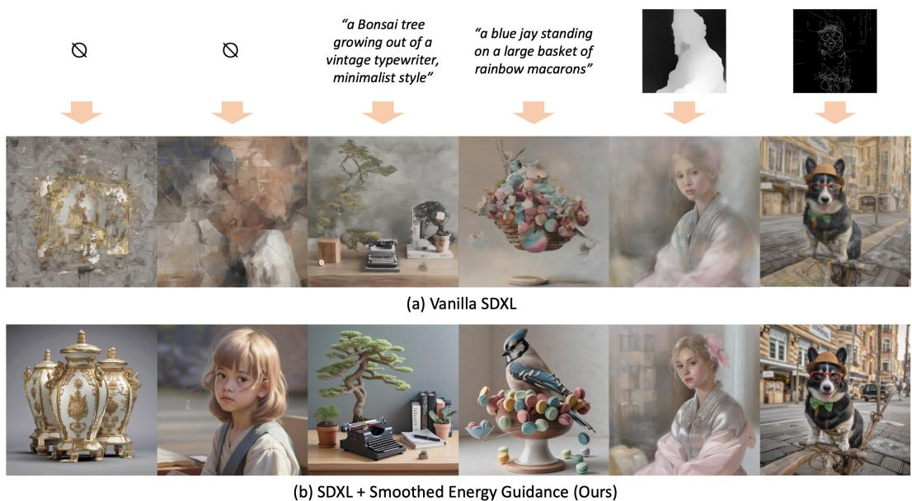  
Figure 1: Teaser. (a) Images sampled from vanilla SDXL [35] without any guidance. (b) Images sampled with Smoothed Energy Guidance (Ours). $\mathcal { D }$ denotes that there is no condition given. With various input conditions, and even without any, SEG supports the diffusion model in generating plausible and high-quality images without any training.

In this work, we approach the objective from an energy-based perspective of the self-attention mechanism, which has been previously explored based on its close connection to the Hopfield energy [39, 31, 7]. Specifically, we start from the definition of the energy of self-attention, where performing a self-attention operation is equivalent to taking a gradient step. In light of this, we propose a tuning- and condition-free method that reduces the curvature of the underlying energy function by directly blurring the attention weights, and then leverages the output as the negative prediction. We call this method Smoothed Energy Guidance (SEG).

SEG does not merely rely on the guidance scale parameter that cause side effects when its value becomes large. Instead, we can continuously control the original and maximally attenuated curvature of the energy landscape behind the self-attention by simply adjusting the parameter of the Gaussian kernel, with the guidance scale parameter fixed. Additionally, we introduce a novel query blurring technique, which is equivalent to blurring the entire attention weights without incurring quadratic cost in the number of tokens.

We validate the effectiveness of SEG throughout the various experiments without and with text conditions, and ControlNet [51] trained on canny and depth maps. Based on the attention modulation, SEG results in less structural change from the original prediction compared to previous approaches [17, 1], while achieving better sample quality.

# 2 Preliminaries

# 2.1 Diffusion models

Diffusion models [12, 45, 46] are a class of generative models that generate data through an iterative denoising process. The process of adding noise to an image $\mathbf { x }$ over time $t \in [ 0 , T ]$ is governed by the forward stochastic differential equation (SDE):

$$
\begin{array} { r } { d \mathbf { x } = \mathbf { f } ( \mathbf { x } , t ) d t + g ( t ) d \mathbf { w } , } \end{array}
$$

where f and $g$ are predefined functions that determine the manner in which the noise is added, and dw denotes a standard Wiener process.

Correspondingly, the denoising process can be described by the reverse SDE:

$$
d \mathbf { x } = [ \mathbf { f } ( \mathbf { x } , t ) - g ( t ) ^ { 2 } \nabla _ { \mathbf { x } } \log p _ { t } ( \mathbf { x } ) ] d t + g ( t ) d \bar { \mathbf { w } } ,
$$

where $\nabla _ { \mathbf { x } } \log p _ { t } ( \mathbf { x } )$ represents the score of the noisy data distribution and $d \bar { \bf w }$ denotes the standard Wiener process for the reversed time.

Diffusion models are trained to approximate the score function with $\mathbf { s } _ { \theta } ( \mathbf { x } , t ) \approx \nabla _ { \mathbf { x } } \log p _ { t } ( \mathbf { x } )$ . To generate an image based on a condition $c$ , e.g., a class label or text, one simply needs to train diffusion models to approximate the conditional score function with $\mathbf { s } _ { \theta } ( \mathbf { x } , t , c ) \approx \bar { \nabla } _ { \mathbf { x } } \log p _ { t } ( \mathbf { x } | c )$ and replace $\nabla _ { \mathbf { x } } \log p _ { t } ( \mathbf { \bar { x } } )$ with it in the denoising process. To enhance the quality and faithfulness of the generated samples, classifier-free guidance (CFG) [14] is widely adopted. Accordingly, the reverse process becomes:

$$
d \mathbf { x } = [ \mathbf { f } ( \mathbf { x } , t ) - g ( t ) ^ { 2 } ( \gamma _ { \mathrm { c f g } } \mathbf { s } _ { \theta } ( \mathbf { x } , t , c ) - ( \gamma _ { \mathrm { c f g } } - 1 ) \mathbf { s } _ { \theta } ( \mathbf { x } , t ) ) ] d t + g ( t ) d \bar { \mathbf { w } } .
$$

Here, $\mathbf { s } _ { \theta } ( \mathbf { x } , t )$ is learned by dropping the label by a certain proportion, and $\gamma _ { \mathrm { c f g } }$ is a hyperparameter that controls the strength of the guidance. Intuitively, CFG helps us to sample from sharper distribution by conditioning on a class label or text.

# 2.2 Energy-based view of attention mechanism

The attention mechanism [47], which has been widely adopted in diffusion models [12], has been interpreted through the lens of energy-based models (EBMs) [31, 39, 7], especially through its close connection with the Hopfield energy [7, 39]. In the modern (continuous) Hopfield network, the attention operation can be derived based on the concave-convex procedure (CCCP) from the following energy function [39]:

$$
E ( \pmb \xi ) = - \mathrm { l s e } ( \mathbf X \pmb \xi ^ { \top } ) + \frac 1 2 \pmb \xi \pmb \xi ^ { \top } ,
$$

where $\pmb { \xi } \in \mathbb { R } ^ { 1 \times d }$ , $\mathbf { X } \in \mathbb { R } ^ { N \times d }$ , and lse stands for the log-sum-exp function, defined as $\mathrm { l s e } ( \mathbf { v } ) : =$ $\begin{array} { r } { \log \left( \sum _ { i = 1 } ^ { N } e ^ { v _ { i } } \right) } \end{array}$ . The quadratic term acts as a regularizer to prevent $\boldsymbol { \xi }$ from exploding [39], while $- \mathrm { l s e } ( \mathbf { X } \xi ^ { \top } )$ penalizes misalignment between $\mathbf { X }$ and $\boldsymbol { \xi }$ .

Mathematically, it turns out that the attention mechanism is equivalent to the update rule of the modern Hopfield network [7, 39]. Specifically, inspired by the Hopfield energy in (4), and noticing that the first term depends on the attention weights, we propose the following energy function for entire self-attention weights in diffusion models:

Definition 2.1 (Energy Function for Self-Attention). Let $\mathbf { Q } \in \mathbb { R } ^ { ( H W ) \times d }$ be a matrix of query vectors and $\mathbf { K } \in \mathbb { R } ^ { ( H W ) \times d }$ be a matrix of key vectors, where $H , W$ , and $d$ represent the height, width, and dimension, respectively. Let $\mathbf { A } \in \mathbb { R } ^ { ( H W ) \times ( H W ) } : = \mathbf { Q K } ^ { \top }$ . The energy function with respect to entire self-attention weights in diffusion models is defined as:

$$
E ( \mathbf { A } ) : = \sum _ { i = 1 } ^ { H } \sum _ { j = 1 } ^ { W } E ^ { \prime } ( \mathbf { a } _ { : ( i , j ) } ) , \quad E ^ { \prime } ( \mathbf { a } ) : = - \mathrm { l s e } \left( \mathbf { a } \right) = - \log \left( \sum _ { k = 1 } ^ { H } \sum _ { l = 1 } ^ { W } e ^ { a _ { ( k , l ) } } \right) .
$$

Note that to explicitly denote the spatial dimension, we use the subscript $( x , y )$ to represent the index of a row or column of the matrices. Despite using the definition in (5) for the rest of the paper for simplicity, we additionally discuss the dual case, where we use the swapped indexing, in Appendix B.

This view leads us to an important intuition: the attention operation can be seen as a minimization step on the energy landscape, considering that the first derivative represents the softmax operation which also appears in the attention operation. Building upon this intuition, we argue that Gaussian blurring on the attention weights modulates the underlying landscape to have less curvature, and we demonstrate this in the following sections by analyzing the second derivatives.

# 3 Method

Our aim is to theoretically derive the effect of Gaussian blur applied on the attention weights, which in the end attenuates the curvature of the underlying energy function. Then, utilizing this fact, we develop attention-based drop-in diffusion guidance that enhances the quality of the generated samples, regardless of whether an explicit condition is given. In Section 3.1, we claim some useful properties of Gaussian blur: that it preserves mean, reduces variance, and thus decreases the lse value. In

Section 3.2, we find that the curvature of the energy landscape is attenuated by the attention blur operation, leading naturally to a blunter prediction for guidance. And finally, in Section 3.3, built upon this fact, we define Smoothed Energy Guidance (SEG) and propose the equivalent query blurring method, which can perform attention blurring while avoiding quadratic complexity in the number of tokens.

# 3.1 Gaussian blur to attention weights

In this section, we derive some important properties of the Gaussian blur with the aim of figuring out the variation of the energy landscape. To this end, we start from some mathematical underpinnings on applying Gaussian blur to attention weights.

A 2D Gaussian filter is a convolution kernel that uses a 2D Gaussian function to assign weights to neighboring pixels. The 2D Gaussian function is defined as:

$$
G ( x , y ) = \frac { 1 } { 2 \pi \sigma ^ { 2 } } e ^ { - \frac { ( x - \mu _ { x } ) ^ { 2 } + ( y - \mu _ { y } ) ^ { 2 } } { 2 \sigma ^ { 2 } } }
$$

where $\mu _ { x }$ and $\mu _ { y }$ are the means in the $x$ and $y$ directions, and $\sigma$ is the standard deviation. The 2D Gaussian filter possesses symmetry, i.e., $G ( x , y ) ~ = ~ G ( - x , - y )$ , and normalization, i.e., $\begin{array} { r } { \int \int G ( x , y ) d x d y = \bar { 1 } } \end{array}$ . In practice, we use a discretized version of the Gaussian filter with a finite kernel size depending on $\sigma$ , normalized to sum to 1.

Lemma 3.1. Spatially applying a $2 D$ Gaussian blur to the attention weights $\mathbf { a } : = \mathbf { Q } \mathbf { k } ^ { \top }$ preserves the average $\mathbb { E } _ { i , j } [ a _ { ( i , j ) } ]$ . In addition, the variance monotonically decreases every time we apply the Gaussian blur.

Proof sketch. Applying a 2D Gaussian filter to the attention weights $a _ { ( i , j ) }$ yields the blurred values $\tilde { a } _ { ( i , j ) }$ :

$$
\tilde { a } _ { ( i , j ) } = \sum _ { m = - k } ^ { k } \sum _ { n = - k } ^ { k } G ( m , n ) \cdot a _ { ( i + m , j + n ) }
$$

where $k$ is the filter size, $G ( m , n )$ is the Gaussian filter value at position $( m , n )$ , and $a _ { ( i + m , j + n ) }$ is the attention weight at position $( i + m , j + n )$ . Since the Gaussian filter is symmetric and normalized, it can be shown that the mean of the blurred attention weights is equal to the mean of the original attention weights. Similarly, we can show that the variance monotonically decreases when we apply a 2D Gaussian filter. See Appendix A.1 for the complete proof.

Note that this fact also implies that blurring with a Gaussian filter with a larger standard deviation causes a greater decrease in the variance of attention weights. This is because a Gaussian filter with a larger standard deviation can always be represented as a convolution of two filters with smaller standard deviations, due to the associativity of the convolution operation.

Finally, we show that applying a 2D Gaussian blur to attention weights increases the lse value in (5), i.e., increases the energy in (5). This provides a bit of intuition about the underlying energy landscape, yet it is more prominently utilized in the claims in the following sections.

Lemma 3.2. Applying a $2 D$ Gaussian blur to attention weights $\mathbf { a } : = \mathbf { Q } \mathbf { k } ^ { \top }$ increases the lse term when we consider the second-order Taylor series approximation of the exponential function around the mean $\mu : = \mathbb { E } _ { i , j } [ a _ { ( i , j ) } ]$ . Consequently, the maximum is achieved when the attention is uniform, i.e., $a _ { ( i , j ) } = a _ { ( k , l ) } \ \forall i , j , k , l$ . This corresponds to the case when we apply the Gaussian blur with $\sigma \to \infty$ .

Proof sketch. Applying the second-order Taylor series approximation around the mean $\mu$ , and using Proposition 3.1, we show that the second-order approximation of $\mathrm { l s e } ( \mathbf { a } )$ is larger than or equal to that of lse(a˜). Subsequently, we introduce Lagrange multipliers to find the maximum, which gives us the result, $a _ { ( i , j ) } = a _ { ( k , l ) } \forall i , j , k , l .$ We leave the full proof in Appendix A.2.

# 3.2 Analysis of the energy landscape

In this section, we demonstrate that applying a 2D Gaussian blur to the attention weights before the softmax operation results in computing the updated value with reduced curvature of the underlying energy function. To this end, we analyze the Gaussian curvature before and after blurring the attention weights. This is closely related to the Hessian of the energy function.

Theorem 3.1. Let the attention weights be defined as $\mathbf { a } : = \mathbf { Q } \mathbf { k } ^ { \top }$ . Consider the energy function in (5). Then, applying a Gaussian blur to the attention weights a before the softmax operation results in the attenuation of the Gaussian curvature of the underlying energy function where gradient descent is performed.

Proof sketch. Let $\mathbf { H }$ denote the Hessian of the original energy function, i.e., the derivative of the negative softmax, and $\tilde { \bf H }$ denote the Hessian of the new energy function associated with blurred attention weights. Furthermore, let $b _ { i j }$ denote the $i$ -th row, $j$ -th column entry in the Toeplitz matrix $\mathbf { B }$ representing the Gaussian blur. Calculating the derivatives, we have the elements of the Hessians, $h _ { i j } = ( \xi ( { \bf a } ) _ { i } - \delta _ { i j } ) \xi ( { \bf a } ) _ { j }$ and $\tilde { h } _ { i j } = ( \xi ( \tilde { \mathbf { a } } ) _ { i } - \delta _ { i j } ) \xi ( \tilde { \mathbf { a } } ) _ { j } b _ { i j }$ . Using Lemmas 3.1 and 3.2 and under reasonable assumptions, we observe that $| \operatorname* { d e t } ( \mathbf { H } ) | > | \operatorname* { d e t } ( \tilde { \mathbf { H } } ) |$ , which implies that the minimization step is performed on a smoother energy landscape with attenuated Gaussian curvature. The full proof is in Appendix A.3.

To provide more intuition about what is actually happening and how we utilize this property in the later section, it is intriguing to consider the attenuating effect on the curvature in analogy to classifier-free guidance (CFG). CFG uses the difference between the prediction based on the sharper conditional distribution and the prediction based on the smoother unconditional distribution to guide the sampling process. By analogy, we propose a method to make the landscape of the energy function smoother to guide the sampling process, as opposed to the original (sharper) energy landscape.

From a probabilistic perspective, the energy is associated with the likelihood of the attention weights in terms of the Boltzmann distribution conditioned on a given configuration, i.e., the feature map. Blurring the attention weights diminishes this likelihood as shown in Lemma 3.2, and also reduces the curvature of the distribution as shown in Theorem 3.1.

# 3.3 Smoothed energy guidance for diffusion models

Based on the above observation that the Gaussian blur on attention weights attenuates the curvature of the energy function, we propose Smoothed Energy Guidance (SEG) in this section. For brevity, we redefine the unconditional score prediction as $\mathbf { s } _ { \theta } ( \mathbf { x } , t )$ , and the unconditional score prediction with the energy curvature reduced as $\tilde { \mathbf { s } } _ { \theta } ( \mathbf { x } , t )$ . Specifically, $\tilde { \mathbf { s } } _ { \theta } ( \mathbf { x } , t )$ is the prediction with the attention weights blurred using a 2D Gaussian filter $G$ with the standard deviation $\sigma$ . We formulate the process as:

$$
( \mathbf { Q K } ^ { \top } ) _ { \mathrm { s e g } } = G \ast ( \mathbf { Q K } ^ { \top } ) ,
$$

where $^ *$ denotes the 2D convolution operator. Then, we replace the original attention weights with $( \mathbf { Q K } ^ { \top } ) _ { \mathrm { s e g } }$ and compute the final value as in ordinary self-attention.

For practical purposes when the number of tokens is large, we propose an efficient computation of (6) using the property of a linear map, since the convolution operation is linear. Concretely, blurring queries is exactly the same as blurring the entire attention weights, and we propose the following proposition to justify our claim.

Proposition 3.1. Let $\mathbf { Q }$ and $\mathbf { K }$ be the query and key matrices in self-attention, and let $G$ be a $2 D$ Gaussian filter. Blurring the attention weights with $G$ is equivalent to blurring the query matrix $\mathbf { Q }$ with $G$ and then computing the attention weights.

Proof. Since the convolution operation is linear, we can always find a Toeplitz matrix $\mathbf { B }$ such that:

$$
G \ast ( \mathbf { Q K } ^ { \top } ) = \mathbf { B } ( \mathbf { Q K } ^ { \top } ) ,
$$

where $^ *$ denotes the 2D convolution operation. Using the properties of matrix multiplication, we can rewrite (7) as:

$$
\mathbf { B } ( \mathbf { Q K } ^ { \top } ) = ( \mathbf { B Q } ) \mathbf { K } ^ { \top } = ( G * \mathbf { Q } ) \mathbf { K } ^ { \top } .
$$

Finally, SEG is formulated as follows:

$$
d \mathbf { x } = [ \mathbf { f } ( \mathbf { x } , t ) - g ( t ) ^ { 2 } ( \gamma _ { \mathrm { s e g } } \mathbf { s } _ { \theta } ( \mathbf { x } , t ) - ( \gamma _ { \mathrm { s e g } } - 1 ) \tilde { \mathbf { s } } _ { \theta } ( \mathbf { x } , t ) ) ] d t + g ( t ) d \bar { \mathbf { w } } ,
$$

where $\gamma _ { \mathrm { s e g } }$ denotes the guidance scale of SEG.

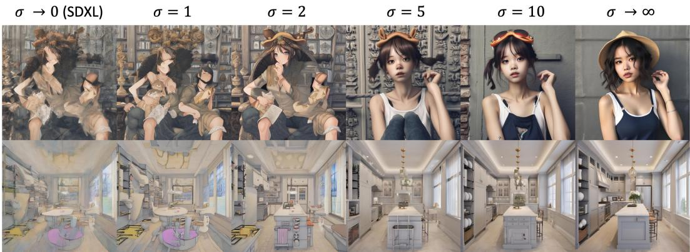  
Figure 2: Unconditional generation using SEG.

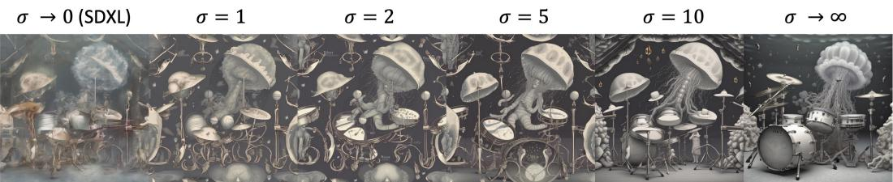  
"a jellyfish playing the drums in an underwater concert"

  
"a high-resolution satellite image of a bustling shipping port, countless colorful containers"   
Figure 3: Text-conditional generation using SEG.

In a straightforward manner, as SEG does not rely on external conditions, it can be used for conditional sampling strategies such as CFG [14] and ControlNet [51]. For the combinatorial sampling with CFG, following [17], we simply extend (9) for improved conditional sampling with both SEG and CFG as follows:

$$
\begin{array} { r } { d \mathbf { x } = [ \mathbf { f } ( \mathbf { x } , t ) - g ( t ) ^ { 2 } ( ( 1 - \gamma _ { \mathrm { c f g } } + \gamma _ { \mathrm { s e g } } ) \mathbf { s } _ { \theta } ( \mathbf { x } , t ) + \gamma _ { \mathrm { c f g } } \mathbf { s } _ { \theta } ( \mathbf { x } , t , c ) - \gamma _ { \mathrm { s e g } } \tilde { \mathbf { s } } _ { \theta } ( \mathbf { x } , t ) ) ] d t + g ( t ) d \bar { \mathbf { w } } , } \end{array}
$$

which is an intuitive result, as the update rule moves $x$ towards the conditional prediction while keeping it far from the prediction with blurred attention weights.

We are likely to get a result with saturation when using a large guidance scale, such as with classifierfree guidance (CFG) [14], self-attention guidance (SAG) [17], and perturbed attention guidance (PAG) [1]. This is a significant caveat since we need to increase the scale to achieve a maximum effect with these methods. Contrary to this, we can fix the scale of SEG as justified in Sec. 5.5 and control its maximum effect through $\sigma$ of the Gaussian blur, making the choice more flexible. For $\sigma$ , two extreme cases are recognized. If $\sigma  0$ , the blurred attention weights remain the same as the original, while when $\sigma \to \infty$ , the attention weights merely adopt a single mean value across spatial axes. We find that even the latter extreme case results in a high-quality outcome, corroborating that we can control the quality to the limit without saturation.

# 4 Discussion on related work

Classifier-free guidance (CFG) [14], first proposed as a replacement for classifier guidance (CG) [8] is controlled by a scale parameter. The higher we set classifier-free guidance, the more we get faithful, high-quality images. However, it requires external labels, such as text [30] or class [8] labels, making it impossible to apply to unconditional diffusion models. Also, it requires specific traning procedure with label dropping and it is known that high CFG causes saturation [42].

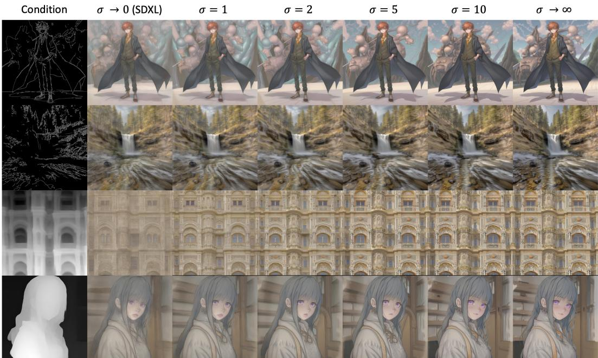  
Figure 4: Conditional generation using ControlNet [51] and SEG. Table 1: Quantitative comparison of SEG with vanilla SDXL [35], SAG [17], and PAG [1] for unconditional generation.

<table><tr><td>Metric</td><td>Vanilla SDXL [35]</td><td>SAG [17]</td><td>PAG [1]</td><td>SEG σ = 10</td><td>SEG σ → ∞</td></tr><tr><td>FID↓</td><td>129.496</td><td>106.683</td><td>105.271</td><td>95.316</td><td>88.215</td></tr><tr><td>LPIPSvgg </td><td>-</td><td>0.706</td><td>0.542</td><td>0.522</td><td>0.536</td></tr><tr><td>LPIPSalex ↓</td><td>-</td><td>0.644</td><td>0.472</td><td>0.454</td><td>0.472</td></tr></table>

Tackling the caveats of CFG, unconditional approaches such as self-attention guidance (SAG) [17] and perturbed attention guidance (PAG) [1] have been proposed. SAG selectively blurs images with the mask obtained from the attention map and guides the generation process given the prediction. This indirect approach causes saturation and noisy images when given a large guidance scale, leading to the selection of a guidance scale less than or equal to 1. PAG guides images using prediction with identity attention, where the attention map is an identity matrix. However, the reliance on heuristics to make perturbed predictions results in unintended side effects. As an example of the side effects of replacing the attention map with identity attention, PAG changes the visual structure and color distribution of an image, as evidenced in Figs. 5, 8, and 9.

Contrary to these, we control the effect of SEG through the standard deviation of the Gaussian filter, $\sigma$ . Moreover, while being theory-inspired, SEG is relatively free from unintended effects. In the following section, we corroborate our claim with extensive experiments.

# 5 Experiments

# 5.1 Implementation details

We build upon the current open-source state-of-the-art diffusion model, Stable Diffusion XL (SDXL) [35], as our baseline, and do not change the configuration. To sample with SEG, we choose the same attention layers (mid-blocks) and guidance scale as PAG [1]. For SEG and PAG sampling, we use the Euler discrete scheduler [21], while for SAG [17], we instead use the DDIM scheduler [45] since the current implementation of SAG does not support the Euler discrete sampler. For SAG and PAG, we use the same configurations they used in the experiments with the previous version of Stable Diffusion, with guidance scales of 1.0 and 3.0, respectively. We set $\gamma _ { \mathrm { s e g } }$ to 3.0, except in the ablation study.

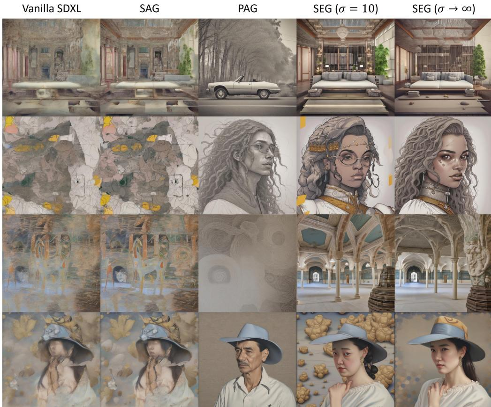  
Figure 5: Qualitative comparison of SEG with vanilla SDXL [35], SAG [17], and PAG [1].

Table 2: Text-conditional sampling with different $\sigma$ .   

<table><tr><td rowspan="3">Metric</td><td rowspan="3">Vanilla SDXL [35]</td><td colspan="5">SEG</td></tr><tr><td>1</td><td>2</td><td>5</td><td>10</td><td>∞</td></tr><tr><td>FID↓</td><td>53.423</td><td>48.284</td><td>41.784</td><td>33.819</td><td>29.325</td><td>26.169</td></tr><tr><td>CLIP Score↑</td><td>0.271</td><td>0.273</td><td>0.278</td><td>0.285</td><td>0.290</td><td>0.292</td></tr><tr><td>LPIPSvgg </td><td>-</td><td>0.361</td><td>0.410</td><td>0.449</td><td>0.472</td><td>0.493</td></tr><tr><td>LPIPSalex ↓</td><td>-</td><td>0.295</td><td>0.347</td><td>0.390</td><td>0.416</td><td>0.440</td></tr></table>

# 5.2 Metrics

We use various metrics to evaluate quality (FID [10] and CLIP score [37], calculated with $3 0 \mathrm { k }$ references from the MS-COCO 2014 validation set [28]) and to assess the extent of change due to applied guidance $( \mathrm { L P I P S } _ { \mathrm { v g g } }$ , alex [52]). The latter metric, calculated using the outputs of vanilla SDXL, measures the extent of side effects by comparing guided images to their unguided counterparts.

# 5.3 Controlling image generation with the standard deviation

In this section, our aim is to demonstrate that with SEG, we can sample plausible images using vanilla SDXL [35] under various conditions and even without any conditions, as demonstrated in Fig. 1. Furthermore, without the risk of saturation, we can control the quality and plausibility of the samples. For the results, we use $\sigma \in \{ 1 , 2 , 5 , 1 0 \}$ . Additionally, as mentioned in Sec. 3.3, we present two extreme cases, $\sigma  0$ (vanilla SDXL) and $\sigma \to \infty$ (uniform queries).

Unconditional generation In this section, our aim is to demonstrate that with SEG, we can sample plausible images from the unconditional mode of the vanilla SDXL, which was originally trained on a large-scale text-to-image dataset. The results are presented in Fig. 1, Fig. 2, and Table 1. The results show a clear tendency to draw higher quality samples by utilizing the differences between the two energy landscapes with different curvatures derived from self-attention mechanisms.

In Fig. 2 and Fig. 13, we show the effectiveness of generating more plausible images, while vanilla SDXL is unable to generate high-quality images without any conditions. The results show a clear tendency to draw higher quality samples by utilizing the differences between the two energy landscapes with different curvatures derived from self-attention mechanisms. When $\sigma$ is larger, the definition and expression of the samples improve, as the difference in curvature becomes more pronounced.

Conditional generation In Figs. 3, 4, 10, 11, and 14, we display sampling results conditioned on text, Canny, and depth map. Using text (Fig. 3), the vanilla SDXL without CFG is unable to generate high-quality images and produces noisy results. Canny and depth map conditioning on SDXL (Fig. 4, 10, and 11) is achieved through ControlNet [51], trained on such maps. The results show that SEG enhances the quality and fidelity of the generated images while preserving the textual and structural information provided by the conditioning inputs. Notably, as $\sigma$ increases, the generated images exhibit improved definition and quality without introducing significant artifacts or deviations from the original condition. The combination with higher CFG scales is shown in Figs. 15–19.

In Table 2, we show the quantitative results for text-conditional generation in terms of $\sigma$ . We observe a clear trade-off between image quality (represented by FID and CLIP score) and the deviation from the original sample (represented by LPIPS). We sample $3 0 \mathrm { k }$ images for each $\sigma$ to compute the metrics.

# 5.4 Comparison with previous methods

Since the results are visually favorable when we use $\sigma = 1 0$ and $\sigma  \infty$ , and they are the best in terms of CLIP score and FID, respectively, we adopt those configurations for comparison of unconditional guidance methods. The results are presented in Figs. 5, 8, 9, and Table 1. Notably, our method achieves better image quality in terms of FID, while remaining similar to the original output of vanilla SDXL as measured by LPIPS, implying a Pareto improvement.

# 5.5 Ablation study

In this section, we address two parameters, $\gamma _ { \mathrm { s e g } }$ and $\sigma$ , and justify that fixing $\gamma _ { \mathrm { s e g } }$ is a reasonable choice. In Fig. 6, we present the results from our testing. The results reveal that increasing $\gamma _ { \mathrm { s e g } }$ does not generally lead to improved sample quality in terms of FID and CLIP score, due to various issues such as saturation. In contrast, increasing $\sigma$ tends to improve sample quality and plausibility. This supports the claim that image quality should be controlled by $\sigma$ , instead of the guidance scale parameter. We sample $3 0 \mathrm { k }$ images for each combination to calculate the metrics.

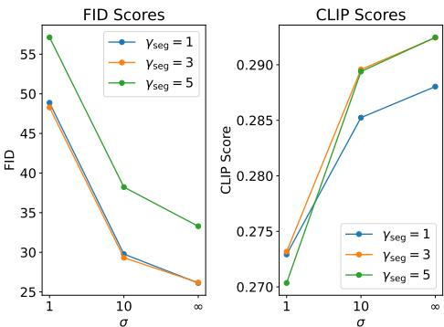  
Figure 6: Ablation study on $\gamma _ { \mathrm { s e g } }$ and $\sigma$ .

# 6 Conclusion, limitations and societal impacts

Conclusion We introduce Smoothed Energy Guidance (SEG), a novel training- and condition-free guidance method for image generation with diffusion models. The key advantages of SEG lie in its flexibility and the theoretical foundation, allowing us to significantly enhance sample quality without side effects by adjusting the standard deviation of the Gaussian filter. We hope our method inspires further research on improving generative models, and extending the approach beyond image generation, for example, to video or natural language processing.

Limitations and societal impacts The paper proposes guidance to enhance quality outcomes. Consequently, the attainable quality of our approach is contingent upon the baseline model employed. Furthermore, the application of SEG to temporal attention mechanisms in video or multi-view diffusion models is not addressed, remaining a promising avenue for future research. It is important to note that the improvements achieved through this method may potentially lead to unintended negative societal consequences by inadvertently amplifying existing stereotypes or harmful biases.

# Acknowledgements

I would like to express my gratitude to Yong-Hyun Park, Junha Hyung, and Donghoon Ahn for their valuable feedback and insights. Their thoughtful comments and suggestions have been instrumental in improving this work.

# References

[1] Donghoon Ahn, Hyoungwon Cho, Jaewon Min, Wooseok Jang, Jungwoo Kim, SeonHwa Kim, Hyun Hee Park, Kyong Hwan Jin, and Seungryong Kim. Self-rectifying diffusion sampling with perturbed-attention guidance. arXiv preprint arXiv:2403.17377, 2024.   
[2] Georgios Batzolis, Jan Stanczuk, Carola-Bibiane Schönlieb, and Christian Etmann. Conditional image generation with score-based diffusion models. arXiv preprint arXiv:2111.13606, 2021.   
[3] Andreas Blattmann, Robin Rombach, Huan Ling, Tim Dockhorn, Seung Wook Kim, Sanja Fidler, and Karsten Kreis. Align your latents: High-resolution video synthesis with latent diffusion models. In Proceedings of the IEEE/CVF Conference on Computer Vision and Pattern Recognition, pages 22563– 22575, 2023.   
[4] Andreas Blattmann, Robin Rombach, Kaan Oktay, Jonas Müller, and Björn Ommer. Retrieval-augmented diffusion models. Advances in Neural Information Processing Systems, 35:15309–15324, 2022.   
[5] Manuel Brack, Felix Friedrich, Katharia Kornmeier, Linoy Tsaban, Patrick Schramowski, Kristian Kersting, and Apolinário Passos. Ledits $^ { + + }$ : Limitless image editing using text-to-image models. In Proceedings of the IEEE/CVF Conference on Computer Vision and Pattern Recognition, pages 8861–8870, 2024.   
[6] Rui Chen, Yongwei Chen, Ningxin Jiao, and Kui Jia. Fantasia3d: Disentangling geometry and appearance for high-quality text-to-3d content creation. In Proceedings of the IEEE/CVF International Conference on Computer Vision, pages 22246–22256, 2023.   
[7] Mete Demircigil, Judith Heusel, Matthias Löwe, Sven Upgang, and Franck Vermet. On a model of associative memory with huge storage capacity. Journal of Statistical Physics, 168:288–299, 2017.   
[8] Prafulla Dhariwal and Alexander Nichol. Diffusion models beat gans on image synthesis. Advances in neural information processing systems, 34:8780–8794, 2021.   
[9] Dave Epstein, Allan Jabri, Ben Poole, Alexei Efros, and Aleksander Holynski. Diffusion self-guidance for controllable image generation. Advances in Neural Information Processing Systems, 36:16222–16239, 2023.   
[10] Martin Heusel, Hubert Ramsauer, Thomas Unterthiner, Bernhard Nessler, and Sepp Hochreiter. Gans trained by a two time-scale update rule converge to a local nash equilibrium. Advances in neural information processing systems, 30, 2017.   
[11] Jonathan Ho, William Chan, Chitwan Saharia, Jay Whang, Ruiqi Gao, Alexey Gritsenko, Diederik P Kingma, Ben Poole, Mohammad Norouzi, David J Fleet, et al. Imagen video: High definition video generation with diffusion models. arXiv preprint arXiv:2210.02303, 2022.   
[12] Jonathan Ho, Ajay Jain, and Pieter Abbeel. Denoising diffusion probabilistic models. Advances in neural information processing systems, 33:6840–6851, 2020.   
[13] Jonathan Ho, Chitwan Saharia, William Chan, David J Fleet, Mohammad Norouzi, and Tim Salimans. Cascaded diffusion models for high fidelity image generation. Journal of Machine Learning Research, 23(47):1–33, 2022.   
[14] Jonathan Ho and Tim Salimans. Classifier-free diffusion guidance. arXiv preprint arXiv:2207.12598, 2022.   
[15] Jonathan Ho, Tim Salimans, Alexey Gritsenko, William Chan, Mohammad Norouzi, and David J Fleet. Video diffusion models. Advances in Neural Information Processing Systems, 35:8633–8646, 2022.   
[16] Susung Hong, Donghoon Ahn, and Seungryong Kim. Debiasing scores and prompts of 2d diffusion for view-consistent text-to-3d generation. Advances in Neural Information Processing Systems, 36, 2024.   
[17] Susung Hong, Gyuseong Lee, Wooseok Jang, and Seungryong Kim. Improving sample quality of diffusion models using self-attention guidance. In Proceedings of the IEEE/CVF International Conference on Computer Vision, pages 7462–7471, 2023.   
[18] Susung Hong, Junyoung Seo, Heeseong Shin, Sunghwan Hong, and Seungryong Kim. Direct2v: Large language models are frame-level directors for zero-shot text-to-video generation. arXiv preprint arXiv:2305.14330, 2023.   
[19] Hanzhuo Huang, Yufan Feng, Cheng Shi, Lan Xu, Jingyi Yu, and Sibei Yang. Free-bloom: Zero-shot text-to-video generator with llm director and ldm animator. Advances in Neural Information Processing Systems, 36, 2024.   
[20] Ziqi Huang, Kelvin CK Chan, Yuming Jiang, and Ziwei Liu. Collaborative diffusion for multi-modal face generation and editing. In Proceedings of the IEEE/CVF Conference on Computer Vision and Pattern Recognition, pages 6080–6090, 2023.   
[21] Tero Karras, Miika Aittala, Timo Aila, and Samuli Laine. Elucidating the design space of diffusion-based generative models. Advances in Neural Information Processing Systems, 35:26565–26577, 2022.   
[22] Bahjat Kawar, Shiran Zada, Oran Lang, Omer Tov, Huiwen Chang, Tali Dekel, Inbar Mosseri, and Michal Irani. Imagic: Text-based real image editing with diffusion models. In Proceedings of the IEEE/CVF Conference on Computer Vision and Pattern Recognition, pages 6007–6017, 2023.   
[23] Levon Khachatryan, Andranik Movsisyan, Vahram Tadevosyan, Roberto Henschel, Zhangyang Wang, Shant Navasardyan, and Humphrey Shi. Text2video-zero: Text-to-image diffusion models are zero-shot video generators. In Proceedings of the IEEE/CVF International Conference on Computer Vision, pages 15954–15964, 2023.   
[24] Gwanghyun Kim, Taesung Kwon, and Jong Chul Ye. Diffusionclip: Text-guided diffusion models for robust image manipulation. In Proceedings of the IEEE/CVF Conference on Computer Vision and Pattern Recognition, pages 2426–2435, 2022.   
[25] Mingi Kwon, Jaeseok Jeong, and Youngjung Uh. Diffusion models already have a semantic latent space. arXiv preprint arXiv:2210.10960, 2022.   
[26] Weiyu Li, Rui Chen, Xuelin Chen, and Ping Tan. Sweetdreamer: Aligning geometric priors in 2d diffusion for consistent text-to-3d. arXiv preprint arXiv:2310.02596, 2023.   
[27] Chen-Hsuan Lin, Jun Gao, Luming Tang, Towaki Takikawa, Xiaohui Zeng, Xun Huang, Karsten Kreis, Sanja Fidler, Ming-Yu Liu, and Tsung-Yi Lin. Magic3d: High-resolution text-to-3d content creation. In Proceedings of the IEEE/CVF Conference on Computer Vision and Pattern Recognition, pages 300–309, 2023.   
[28] Tsung-Yi Lin, Michael Maire, Serge Belongie, James Hays, Pietro Perona, Deva Ramanan, Piotr Dollár, and C Lawrence Zitnick. Microsoft coco: Common objects in context. In Computer Vision–ECCV 2014: 13th European Conference, Zurich, Switzerland, September 6-12, 2014, Proceedings, Part V 13, pages 740–755. Springer, 2014.   
[29] Nan Liu, Shuang Li, Yilun Du, Antonio Torralba, and Joshua B Tenenbaum. Compositional visual generation with composable diffusion models. In European Conference on Computer Vision, pages 423–439. Springer, 2022.   
[30] Alex Nichol, Prafulla Dhariwal, Aditya Ramesh, Pranav Shyam, Pamela Mishkin, Bob McGrew, Ilya Sutskever, and Mark Chen. Glide: Towards photorealistic image generation and editing with text-guided diffusion models. arXiv preprint arXiv:2112.10741, 2021.   
[31] Geon Yeong Park, Jeongsol Kim, Beomsu Kim, Sang Wan Lee, and Jong Chul Ye. Energy-based cross attention for bayesian context update in text-to-image diffusion models. Advances in Neural Information Processing Systems, 36, 2024.   
[32] Yong-Hyun Park, Mingi Kwon, Jaewoong Choi, Junghyo Jo, and Youngjung Uh. Understanding the latent space of diffusion models through the lens of riemannian geometry. Advances in Neural Information Processing Systems, 36:24129–24142, 2023.   
[33] William Peebles and Saining Xie. Scalable diffusion models with transformers. In Proceedings of the IEEE/CVF International Conference on Computer Vision, pages 4195–4205, 2023.   
[34] Hao Phung, Quan Dao, and Anh Tran. Wavelet diffusion models are fast and scalable image generators. In Proceedings of the IEEE/CVF Conference on Computer Vision and Pattern Recognition, pages 10199– 10208, 2023.   
[35] Dustin Podell, Zion English, Kyle Lacey, Andreas Blattmann, Tim Dockhorn, Jonas Müller, Joe Penna, and Robin Rombach. Sdxl: Improving latent diffusion models for high-resolution image synthesis. arXiv preprint arXiv:2307.01952, 2023.   
[36] Ben Poole, Ajay Jain, Jonathan T Barron, and Ben Mildenhall. Dreamfusion: Text-to-3d using 2d diffusion. arXiv preprint arXiv:2209.14988, 2022.   
[37] Alec Radford, Jong Wook Kim, Chris Hallacy, Aditya Ramesh, Gabriel Goh, Sandhini Agarwal, Girish Sastry, Amanda Askell, Pamela Mishkin, Jack Clark, et al. Learning transferable visual models from natural language supervision. In International conference on machine learning, pages 8748–8763. PMLR, 2021.   
[38] Aditya Ramesh, Prafulla Dhariwal, Alex Nichol, Casey Chu, and Mark Chen. Hierarchical text-conditional image generation with clip latents. arXiv preprint arXiv:2204.06125, 1(2):3, 2022.   
[39] Hubert Ramsauer, Bernhard Schäfl, Johannes Lehner, Philipp Seidl, Michael Widrich, Thomas Adler, Lukas Gruber, Markus Holzleitner, Milena Pavlovic, Geir Kjetil Sandve, et al. Hopfield networks is all ´ you need. arXiv preprint arXiv:2008.02217, 2020.   
[40] Robin Rombach, Andreas Blattmann, Dominik Lorenz, Patrick Esser, and Björn Ommer. High-resolution image synthesis with latent diffusion models. In Proceedings of the IEEE/CVF conference on computer vision and pattern recognition, pages 10684–10695, 2022.   
[41] Chitwan Saharia, William Chan, Huiwen Chang, Chris Lee, Jonathan Ho, Tim Salimans, David Fleet, and Mohammad Norouzi. Palette: Image-to-image diffusion models. In ACM SIGGRAPH 2022 conference proceedings, pages 1–10, 2022.   
[42] Chitwan Saharia, William Chan, Saurabh Saxena, Lala Li, Jay Whang, Emily L Denton, Kamyar Ghasemipour, Raphael Gontijo Lopes, Burcu Karagol Ayan, Tim Salimans, et al. Photorealistic text-toimage diffusion models with deep language understanding. Advances in neural information processing systems, 35:36479–36494, 2022.   
[43] Junyoung Seo, Susung Hong, Wooseok Jang, Inès Hyeonsu Kim, Minseop Kwak, Doyup Lee, and Seungryong Kim. Retrieval-augmented score distillation for text-to-3d generation. arXiv preprint arXiv:2402.02972, 2024.   
[44] Uriel Singer, Adam Polyak, Thomas Hayes, Xi Yin, Jie An, Songyang Zhang, Qiyuan Hu, Harry Yang, Oron Ashual, Oran Gafni, et al. Make-a-video: Text-to-video generation without text-video data. arXiv preprint arXiv:2209.14792, 2022.   
[45] Jiaming Song, Chenlin Meng, and Stefano Ermon. Denoising diffusion implicit models. arXiv preprint arXiv:2010.02502, 2020.   
[46] Yang Song, Jascha Sohl-Dickstein, Diederik P Kingma, Abhishek Kumar, Stefano Ermon, and Ben Poole. Score-based generative modeling through stochastic differential equations. arXiv preprint arXiv:2011.13456, 2020.   
[47] Ashish Vaswani, Noam Shazeer, Niki Parmar, Jakob Uszkoreit, Llion Jones, Aidan N Gomez, Łukasz Kaiser, and Illia Polosukhin. Attention is all you need. Advances in neural information processing systems, 30, 2017.   
[48] Haochen Wang, Xiaodan Du, Jiahao Li, Raymond A Yeh, and Greg Shakhnarovich. Score jacobian chaining: Lifting pretrained 2d diffusion models for 3d generation. In Proceedings of the IEEE/CVF Conference on Computer Vision and Pattern Recognition, pages 12619–12629, 2023.   
[49] Zhengyi Wang, Cheng Lu, Yikai Wang, Fan Bao, Chongxuan Li, Hang Su, and Jun Zhu. Prolificdreamer: High-fidelity and diverse text-to-3d generation with variational score distillation. Advances in Neural Information Processing Systems, 36, 2024.   
[50] Sihyun Yu, Kihyuk Sohn, Subin Kim, and Jinwoo Shin. Video probabilistic diffusion models in projected latent space. In Proceedings of the IEEE/CVF Conference on Computer Vision and Pattern Recognition, pages 18456–18466, 2023.   
[51] Lvmin Zhang, Anyi Rao, and Maneesh Agrawala. Adding conditional control to text-to-image diffusion models. In Proceedings of the IEEE/CVF International Conference on Computer Vision, pages 3836–3847, 2023.   
[52] Richard Zhang, Phillip Isola, Alexei A Efros, Eli Shechtman, and Oliver Wang. The unreasonable effectiveness of deep features as a perceptual metric. In Proceedings of the IEEE conference on computer vision and pattern recognition, pages 586–595, 2018.

# A Full proofs

# A.1 Proof of Lemma 3.1

Let $a _ { ( i , j ) }$ denote the original attention weights and $\tilde { a } _ { ( i , j ) }$ denote the blurred attention weights, as in the main paper. Assume that the original attention weights are properly padded to maintain consistent statistics. Then, the following shows that the mean of the blurred attention weights remains the same.

$$
\begin{array} { l } { \displaystyle \mathbb { E } _ { i , j } [ \tilde { a } _ { ( i , j ) } ] = \frac { 1 } { H W } \sum _ { i = 1 } ^ { H } \sum _ { j = 1 } ^ { W } \tilde { a } _ { ( i , j ) } = \frac { 1 } { H W } \sum _ { i = 1 } ^ { H } \sum _ { j = 1 } ^ { W } \sum _ { m = - k } ^ { k } \sum _ { n = - k } ^ { k } G ( m , n ) \cdot a _ { ( i + m , j + n ) } } \\ { = \displaystyle \sum _ { m = - k } ^ { k } \sum _ { n = - k } ^ { k } G ( m , n ) \cdot \left( \frac { 1 } { H W } \sum _ { i = 1 } ^ { H } \sum _ { j = 1 } ^ { W } a _ { ( i + m , j + n ) } \right) } \\ { = \displaystyle \sum _ { m = - k } ^ { k } \sum _ { n = - k } ^ { k } G ( m , n ) \cdot \mathbb { E } _ { i , j } [ a _ { ( i , j ) } ] = \mathbb { E } _ { i , j } [ a _ { ( i , j ) } ] \cdot \sum _ { m = - k } ^ { k } \sum _ { n = - k } ^ { k } G ( m , n ) = \mathbb { E } _ { i , j } [ a _ { ( i , j ) } ] } \end{array}
$$

In addition, the variance of the blurred attention weights is smaller than or equal to the variance of the original attention weights.

$$
\begin{array} { l } { \displaystyle \mathrm { V a r } _ { i , j } [ \widetilde { a } _ { ( i , j ) } ] = \frac { 1 } { H W } \displaystyle \sum _ { i = 1 } ^ { H } \sum _ { j = 1 } ^ { W } ( \widetilde { a } _ { ( i , j ) } - \mathbb { E } _ { i , j } [ \widetilde { a } _ { ( i , j ) } ] ) ^ { 2 } } \\ { \displaystyle = \frac { 1 } { H W } \displaystyle \sum _ { i = 1 } ^ { H } \sum _ { j = 1 } ^ { W } \left( \sum _ { m = - k } ^ { k } \sum _ { n = - k } ^ { k } G ( m , n ) \cdot ( a _ { ( i + m , j + n ) } - \mathbb { E } _ { i , j } [ a _ { ( i , j ) } ] ) \right) ^ { 2 } } \\ { \displaystyle = \sum _ { m = - k } ^ { k } \sum _ { n = - k } ^ { k } \sum _ { r = - k } ^ { k } \sum _ { k = - k } ^ { k } G ( m , n ) \cdot G ( r , s ) \cdot \operatorname { C o v } [ a _ { ( i + m , j + n ) } , a _ { ( i + r , j + s ) } ] } \end{array}
$$

Using the Cauchy-Schwarz inequality and the normalization property of the 2D Gaussian filter, we can show that the variance monotonically decreases when we apply Gaussian blur.

$$
\begin{array} { r l } { \operatorname { V a r } _ { i , j } \Big [ \widetilde { u } _ { ( i , j ) } \Big ] \le \displaystyle \sum _ { m = - k } ^ { k } \displaystyle \sum _ { n = - k } ^ { k } \displaystyle \sum _ { m = - k } ^ { k } \displaystyle \sum _ { s = - k } ^ { k } G ( m , n ) \cdot G ( r , s ) \cdot \sqrt { \operatorname { V a r } [ a _ { ( i + m , j + n ) } ] } \cdot \operatorname { V a r } [ a _ { ( i + m , j + s ) } ] } \\ { = \left( \displaystyle \sum _ { m = - k } ^ { k } \displaystyle \sum _ { n = - k } ^ { k } G ( m , n ) \cdot \sqrt { \operatorname { V a r } [ a _ { ( i + m , j + n ) } ] } \right) ^ { 2 } } \\ { \le \left( \displaystyle \sum _ { m = - k } ^ { k } \displaystyle \sum _ { n = - k } ^ { k } G ( m , n ) \right) \cdot \left( \displaystyle \sum _ { m = - k } ^ { k } \displaystyle \sum _ { m = - k } ^ { k } G ( m , n ) \cdot \operatorname { V a r } [ a _ { ( i + m , j + n ) } ] \right) } \\ { = \displaystyle \sum _ { m = - k } ^ { k } \displaystyle \sum _ { m = - k } ^ { k } G ( m , n ) \cdot \operatorname { V a r } [ a _ { ( i + m , j + n ) } ] } \\ { = \operatorname* { V a r } _ { i + k } ( a _ { i + k } ) } \end{array}
$$

# A.2 Proof of Lemma 3.2

Applying the second-order Taylor series approximation of $e ^ { x }$ to our function $f$ around the mean $\mu$ , we get:

$$
\begin{array} { l } { { \displaystyle \sum _ { i = 1 } ^ { H } \sum _ { j = 1 } ^ { W } e ^ { a _ { ( i , j ) } } \approx \sum _ { i = 1 } ^ { H } \sum _ { j = 1 } ^ { W } \left( e ^ { \mu } + e ^ { \mu } \big ( a _ { ( i , j ) } - \mu \big ) + \frac { 1 } { 2 } e ^ { \mu } \big ( a _ { ( i , j ) } - \mu \big ) ^ { 2 } \right) } } \\ { { \mathrm { } } } \\ { { \mathrm { } = H W \cdot e ^ { \mu } + \frac { 1 } { 2 } e ^ { \mu } \sum _ { i = 1 } ^ { H } \displaystyle \sum _ { j = 1 } ^ { W } \big ( a _ { ( i , j ) } - \mu \big ) ^ { 2 } } } \end{array}
$$

In the last step, we used the fact that $\begin{array} { r } { \sum _ { i = 1 } ^ { H } \sum _ { j = 1 } ^ { W } ( a _ { ( i , j ) } - \mu ) = 0 } \end{array}$ because $\mu$ is the mean. Similarly,

$$
\sum _ { i = 1 } ^ { H } \sum _ { j = 1 } ^ { W } e ^ { \tilde { a } _ { ( i , j ) } } \approx H W \cdot e ^ { \mu } + \frac { 1 } { 2 } e ^ { \mu } \sum _ { i = 1 } ^ { H } \sum _ { j = 1 } ^ { W } ( \tilde { a } _ { ( i , j ) } - \mu ) ^ { 2 }
$$

Since $\mathrm { V a r } [ a ] > \mathrm { V a r } [ \tilde { a } ]$ , we have:

$$
\sum _ { i = 1 } ^ { H } \sum _ { j = 1 } ^ { W } ( a _ { ( i , j ) } - \mu ) ^ { 2 } \geq \sum _ { i = 1 } ^ { H } \sum _ { j = 1 } ^ { W } ( \tilde { a } _ { ( i , j ) } - \mu ) ^ { 2 }
$$

Therefore, the second-order approximation of $\mathrm { l s e } ( \mathbf { a } )$ is larger than that of $\mathrm { l s e } ( \tilde { \mathbf { a } } )$ .

Note that this fact also implies blurring with a Gaussian filter with a bigger variance causes more decrease in the variance of attention weights, because Gaussian filter with a larger variance can always be represented as a convolution of two filters with smaller variances, and the convolution operation is associative.

To find the maximum value subject to the constraint $a _ { ( 1 , 1 ) } + a _ { ( 1 , 2 ) } + . . . + a _ { ( H , W ) } = c$ for some constant $c$ , we introduce Lagrange multipliers. Let $g ( a _ { ( 1 , 1 ) } , a _ { ( 1 , 2 ) } , \ldots , a _ { ( H , W ) } ) = a _ { ( 1 , 1 ) } + a _ { ( 1 , 2 ) } +$ $\cdots + a _ { ( H , W ) }$ . The Lagrangian function is defined as:

$$
\bigl : \iota ( a _ { ( 1 , 1 ) } , a _ { ( 1 , 2 ) } , \ldots , a _ { ( H , W ) } , \lambda ) = e ^ { a _ { ( 1 , 1 ) } } + e ^ { a _ { ( 1 , 2 ) } } + \ldots + e ^ { a _ { ( H , W ) } } - \lambda \bigl ( a _ { ( 1 , 1 ) } + a _ { ( 1 , 2 ) } + \ldots + a _ { ( H , W ) } - c \bigr ) \bigr )
$$

Taking partial derivatives and setting them to zero yields:

$$
\frac { \partial { \cal { L } } } { \partial a _ { ( i , j ) } } = e ^ { a _ { ( i , j ) } } - \lambda = 0
$$

Solving for $a _ { ( i , j ) }$ , we obtain $a _ { ( i , j ) } = \ln ( \lambda )$ for all $i = 1 , 2 , \dots , H$ and $j = 1 , 2 , \dots , W$ Summing these equations results in:

$$
\lambda = e ^ { \frac { c } { H W } }
$$

Substituting $\lambda$ back into $a _ { ( i , j ) } = \ln ( \lambda )$ gives $\textstyle a _ { ( 1 , 1 ) } = a _ { ( 1 , 2 ) } = \dotsc = a _ { ( H , W ) } = { \frac { c } { H W } }$ . Therefore, the minimum value of $\begin{array} { r } { \sum _ { i = 1 } ^ { H } \sum _ { j = 1 } ^ { W } e ^ { a ( i , j ) } } \end{array}$ is achieved when $a _ { ( 1 , 1 ) } = a _ { ( 1 , 2 ) } = . . . = a _ { ( H , W ) }$ . □

# A.3 Proof of Theorem 3.1

Let $\mathbf { a } ~ = ~ ( a _ { 1 } , \ldots , a _ { n } )$ denote the attention values before the softmax operation, and let $\tilde { \textbf { a } } =$ $( \tilde { a } _ { 1 } , \dots , \tilde { a } _ { n } )$ denote the attention values after applying the 2D Gaussian blur. Let $\mathbf { H }$ denote the Hessian of the original energy, i.e., the derivative of the negative softmax, and $\tilde { \bf H }$ denote the Hessian of the underlying energy associated with the blurred weights.

The elements in the $i$ -th row and $j$ -th column of the Hessian matrices are given by:

$$
h _ { i j } = ( \xi ( { \bf a } ) _ { i } - \delta _ { i j } ) \xi ( { \bf a } ) _ { j } ,
$$

$$
\tilde { h } _ { i j } = ( \xi ( \tilde { \mathbf { a } } ) _ { i } - \delta _ { i j } ) \xi ( \tilde { \mathbf { a } } ) _ { j } b _ { i j } ,
$$

respectively, where $b _ { i j }$ are the elements of the Toeplitz matrix corresponding to the Gaussian blur kernel, and $\delta _ { i j }$ denotes the Kronecker delta.

Assuming $\xi ( \tilde { \mathbf { a } } ) _ { i } \xi ( \tilde { \mathbf { a } } ) _ { j } \approx 0$ and $\xi ( { \bf a } ) _ { i } \xi ( { \bf a } ) _ { j } \approx 0$ for all $i$ and $j$ , which is a reasonable assumption when the number of token is large and the softmax values get small, the non-diagonal elements of the Hessians approximate to 0 and the diagonal elements dominate. Therefore, the determinants of the Hessian matrices are approximated as the product of the dominant terms:

$$
| \operatorname* { d e t } ( \mathbf { H } ) | \approx \prod _ { i = 1 } ^ { n } \xi ( \mathbf { a } ) _ { i } , \quad | \operatorname* { d e t } ( \tilde { \mathbf { H } } ) | \approx \prod _ { i = 1 } ^ { n } \xi ( \tilde { \mathbf { a } } ) _ { i } b _ { i i }
$$

We have the following inequality:

$$
\begin{array} { r l r } {  { \prod _ { i = 1 } ^ { n } \xi ( \tilde { \mathbf { a } } ) _ { i } b _ { i i } < \prod _ { i = 1 } ^ { n } \xi ( \tilde { \mathbf { a } } ) _ { i } = \frac { e ^ { \sum _ { j = 1 } ^ { n } \tilde { a } _ { j } } } { ( \sum _ { j = 1 } ^ { n } e ^ { \tilde { a } _ { j } } ) ^ { n } } } } \\ & { } & { \leq \frac { e ^ { \sum _ { j = 1 } ^ { n } a _ { j } } } { ( \sum _ { j = 1 } ^ { n } e ^ { a _ { j } } ) ^ { n } } = \prod _ { i = 1 } ^ { n } \xi ( \mathbf { a } ) _ { i } , } \end{array}
$$

where the first inequality follows from the property of the Gaussian blur kernel, $0 \leq b _ { i i } < 1$ , and the second inequality is derived from Lemmas 3.1 and 3.2, which demonstrate the mean-preserving property and the decrease in the lse value when applying a blur. The monotonicity of the logarithm function implies that the denominator involving the blurred attention weights is smaller. Eventually, we obtain the following inequality:

$$
| \operatorname* { d e t } ( \tilde { \mathbf { H } } ) | < | \operatorname* { d e t } ( \mathbf { H } ) | .
$$

This implies that the updated value is derived with attenuated curvature of the energy function underlying the blurred softmax operation compared to that of the original softmax operation.

# B Dual definition

As we previously stated in Section 2.2, we have the dual definition regarding (5), where we use swapped indexing. Importantly, the swapped indices can be interpreted as altering the definition of attention weights to $\mathbf { A } : = \mathbf { K } \dot { \mathbf { Q } } ^ { \top }$ .

A similar conclusion can be drawn as in the main paper, except that query blurring becomes key blurring with this definition. To see this, Eq. 7 changes slightly with this definition, using the symmetry of the Toeplitz matrix $\mathbf { B }$ :

$$
\begin{array} { r l } & { G * ( \mathbf { K Q } ^ { \top } ) = \mathbf { B } ( \mathbf { K Q } ^ { \top } ) } \\ & { \qquad = ( ( \mathbf { K Q } ^ { \top } ) ^ { \top } \mathbf { B } ^ { \top } ) ^ { \top } } \\ & { \qquad = ( \mathbf { Q } \mathbf { K } ^ { \top } \mathbf { B } ^ { \top } ) ^ { \top } } \\ & { \qquad = ( \mathbf { Q } ( \mathbf { B K } ) ^ { \top } ) ^ { \top } } \\ & { \qquad = ( \mathbf { Q } ( G * \mathbf { K } ) ^ { \top } ) ^ { \top } } \\ & { \qquad = ( G * \mathbf { K } ) \mathbf { Q } ^ { \top } , } \end{array}
$$

where $^ *$ denotes the 2D convolution operation. Empirically, this altered definition does not introduce a significant difference in the overall image quality, as shown in Fig. 12.

# C Additional qualitative results

In this section, we present further qualitative results to demonstrate the effectiveness and versatility of our Smoothed Energy Guidance (SEG) method across various generation tasks and in comparison with other approaches.

Comparison with previous methods Figs. 8 and 9 provide a qualitative comparison of SEG against vanilla SDXL [35], Self-Attention Guidance (SAG) [17], and Perturbed Attention Guidance (PAG) [1]. These comparisons highlight the superior performance of SEG in terms of image quality, coherence, and adherence to the given prompts. SEG consistently produces sharper details, more realistic textures, and better overall composition compared to the other methods.

Conditional generation with ControlNet Figs. 10 and 11 showcase the application of SEG in conjunction with ControlNet [51] for conditional image generation. These results illustrate how SEG can enhance the quality and coherence of generated images while maintaining fidelity to the provided control signals. The images demonstrate improved detail, texture, and overall visual appeal compared to standard ControlNet outputs without prompts.

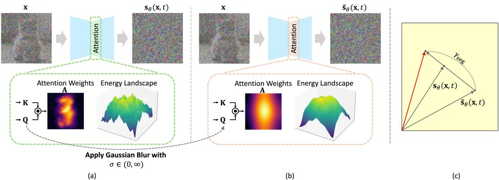  
Figure 7: Pipeline of SEG. (a) Original sampling process, self-attention weights, and the corresponding energy landscape. (b) Our modified sampling process with blurred queries where $\sigma \in ( 0 , \infty )$ , inducing blurred attention weights and the corresponding smoothed energy landscape. (c) A conceptual figure of $\gamma _ { \mathrm { s e g } }$ . Note that since the guidance linearly extrapolates predictions from (a) and (b), a high guidance scale causes samples to be out of the manifold.

Unconditional and text-conditional generation Fig. 13 demonstrates the capability of SEG in unconditional image generation, showcasing its ability to produce high-quality, diverse images without text prompts. Fig. 14 exhibits text-conditional generation results using SEG, illustrating its effectiveness in translating textual descriptions into visually appealing and accurate images.

Interaction with classifier-free guidance Figs. 15–19 present a series of experiments exploring the combination of SEG with CFG. In these experiments, the SEG guidance scale $( \gamma _ { \mathrm { s e g } } )$ is fixed at 3.0, while the CFG scale is varied. The results demonstrate that SEG consistently improves image quality across different CFG scales without causing saturation or significant changes in the general structure of the images.

Ablation study Fig. 20 displays a visual example of unconditional generation with controlled $\gamma _ { \mathrm { s e g } }$ and $\sigma$ . Consistent with results in Sec. 5.5, controlling image quality with $\sigma$ has fewer side effects than controlling with γseg.

# D Pipeline figure

The overall pipeline and conceptual framework of SEG are presented in Fig. 7. Fig. 7 (a) and Fig. 7 (b) depict the original sampling process and the modified sampling process with smoothed energy, respectively. Fig. 7 (c) illustrates the the final prediction (the red arrow) with the guidance scale.

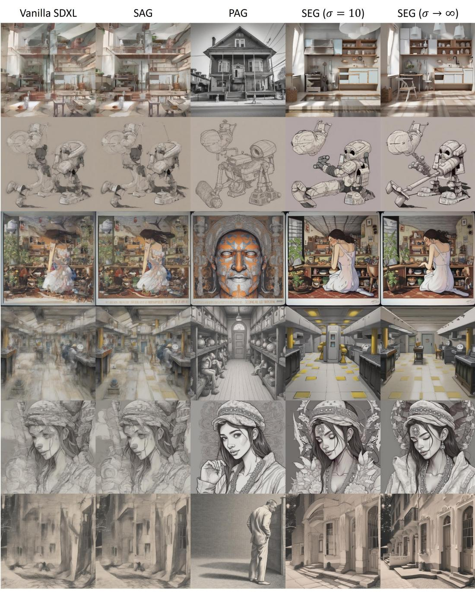  
Figure 8: Qualitative comparison of SEG with vanilla SDXL [35], SAG [17], and PAG [1].

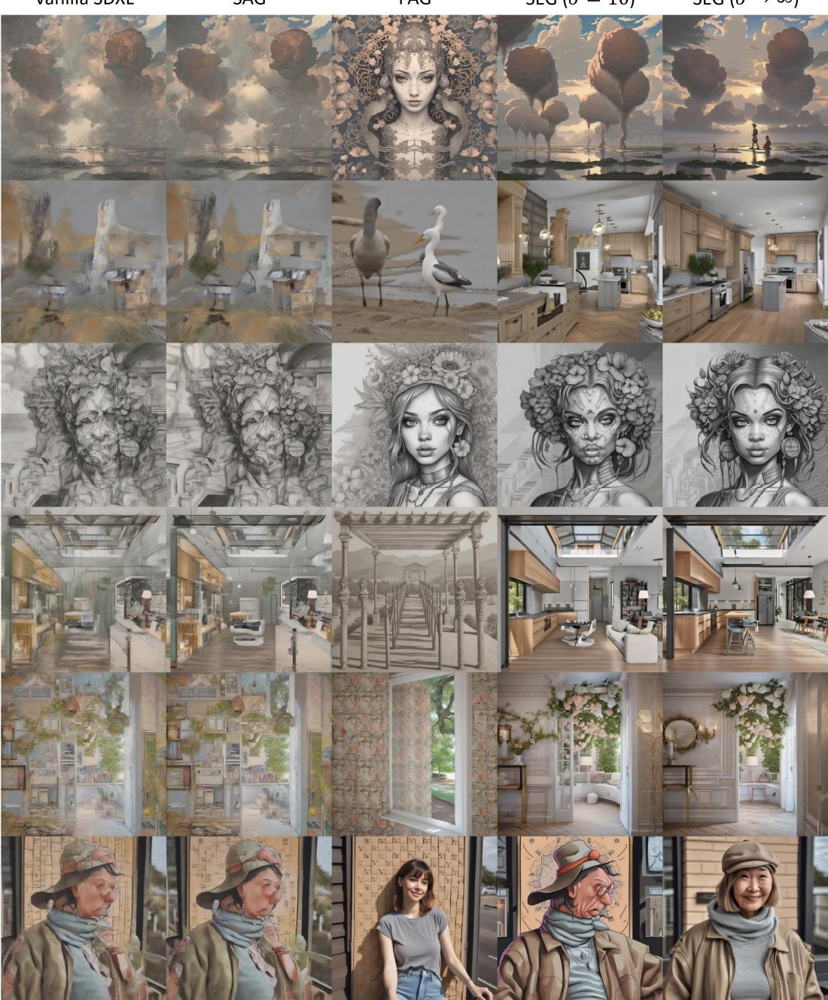  
Figure 9: Qualitative comparison of SEG with vanilla SDXL [35], SAG [17], and PAG [1].

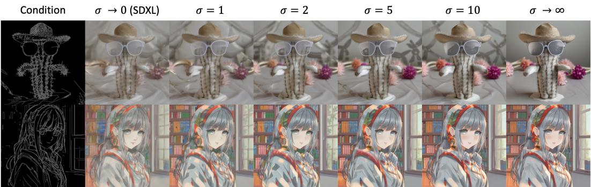  
Figure 10: Conditional generation using ControlNet [51] and SEG.

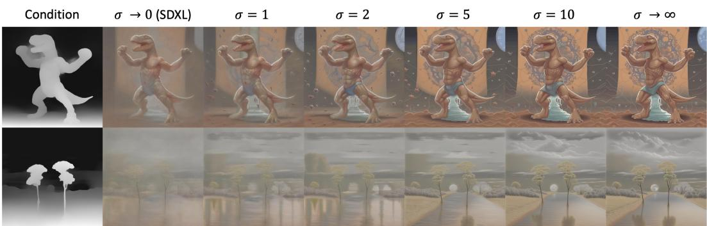  
Figure 11: Conditional generation using ControlNet [51] and SEG.

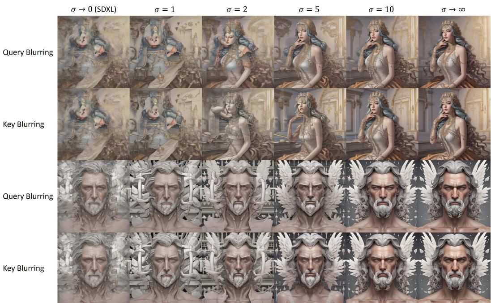  
Figure 12: Comparison between query and key blur across different values of $\sigma$ .

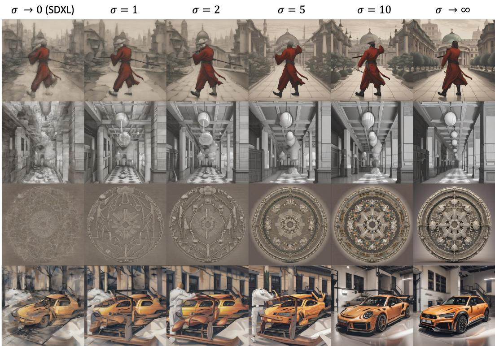  
Figure 13: Unconditional generation using SEG.

σ → 0 (SDXL) σ = 1 σ = 2 σ = 5 σ = 10 σ → ∞

  
"a Victorian-era pocket watch with gears made of candy, macro photography",

  
"a Banksy-inspired graffiti of a child letting go of a balloon shaped like Earth"

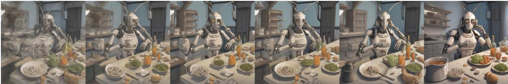  
"an insect robot preparing a delicious meal, anime style"

  
Figure 14: Text-conditional generation using SEG.

ue pal decorated with wallpaper."

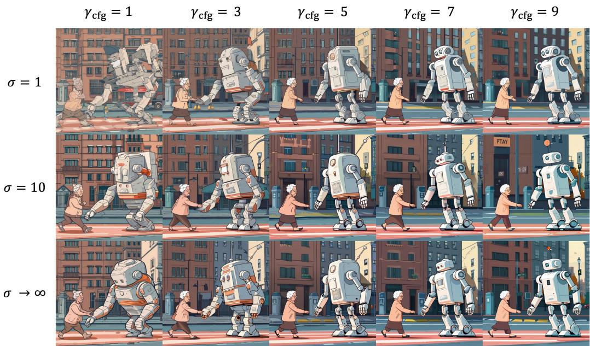  
Figure 15: Experiment on the combination of SEG and CFG. $\gamma _ { \mathrm { s e g } }$ is fixed to 3.0. The prompt is $" a$ friendly robot helping an old lady cross the street." Without causing saturation or significant changes in the general structure, SEG improves the image quality.

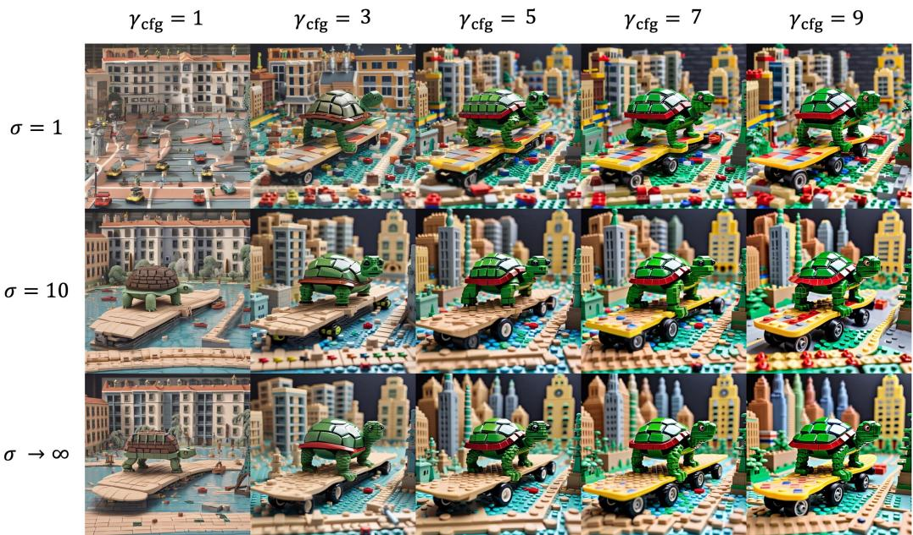  
Figure 16: Experiment on the combination of SEG and CFG. $\gamma _ { \mathrm { s e g } }$ is fixed to 3.0. The prompt is $" a$ skateboarding turtle zooming through a mini city made of Legos."

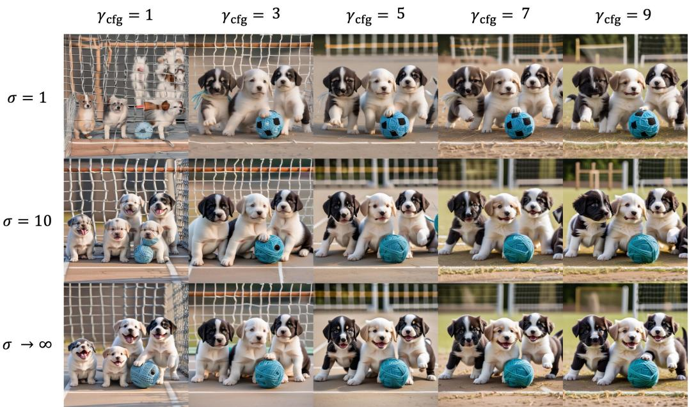  
Figure 17: Experiment on the combination of SEG and CFG. $\gamma _ { \mathrm { s e g } }$ is fixed to 3.0. The prompt is $" a$ group of puppies playing soccer with a ball of yarn."

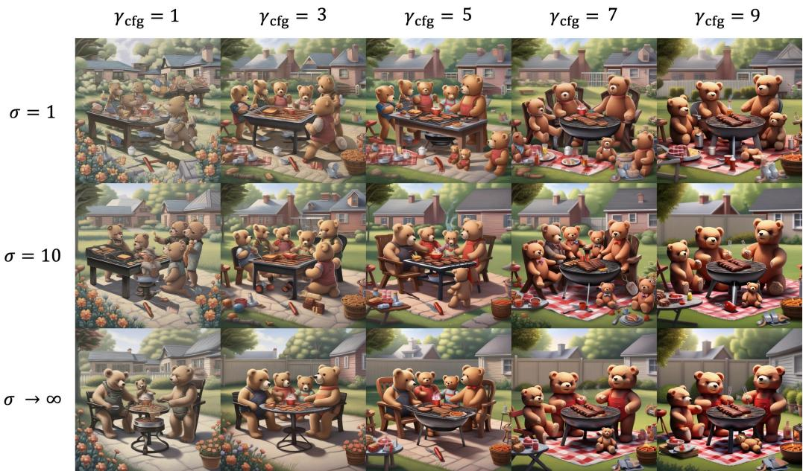  
Figure 18: Experiment on the combination of SEG and CFG. $\gamma _ { \mathrm { s e g } }$ is fixed to 3.0. The prompt is "a family of teddy bears having a barbecue in their backyard."

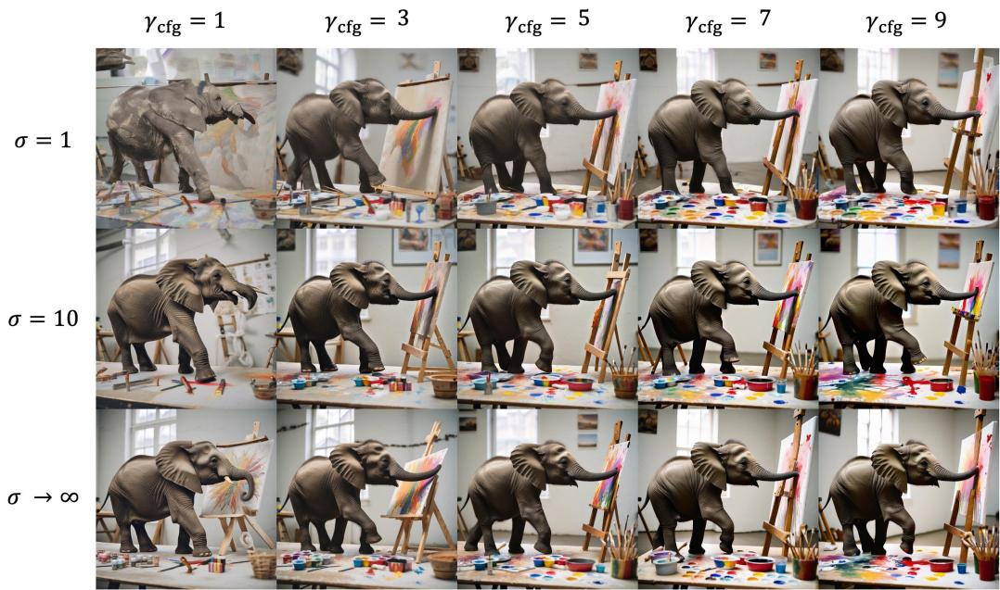  
Figure 19: Experiment on the combination of SEG and CFG. $\gamma _ { \mathrm { s e g } }$ is fixed to 3.0. The prompt is $" a$ baby elephant learning to paint with its trunk in an art studio."

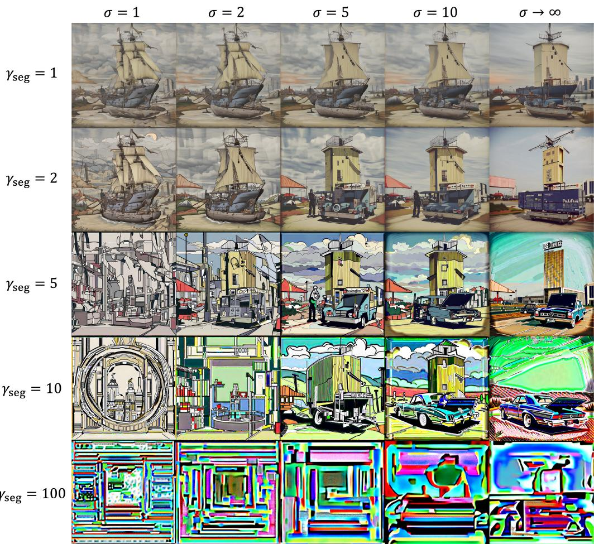  
Figure 20: Unconditional generation result with controlled $\gamma _ { \mathrm { s e g } }$ and $\sigma$

# NeurIPS Paper Checklist

# 1. Claims

Question: Do the main claims made in the abstract and introduction accurately reflect the paper’s contributions and scope?

Answer: [Yes]

Justification: The abstract and introduction state the main claims and contributions of the paper.

Guidelines:

• The answer NA means that the abstract and introduction do not include the claims made in the paper.   
• The abstract and/or introduction should clearly state the claims made, including the contributions made in the paper and important assumptions and limitations. A No or NA answer to this question will not be perceived well by the reviewers.   
• The claims made should match theoretical and experimental results, and reflect how much the results can be expected to generalize to other settings.   
• It is fine to include aspirational goals as motivation as long as it is clear that these goals are not attained by the paper.

# 2. Limitations

Question: Does the paper discuss the limitations of the work performed by the authors?

Answer: [Yes]

Justification: The limitations are discussed the paper.

Guidelines:

• The answer NA means that the paper has no limitation while the answer No means that the paper has limitations, but those are not discussed in the paper.   
• The authors are encouraged to create a separate "Limitations" section in their paper.   
• The paper should point out any strong assumptions and how robust the results are to violations of these assumptions (e.g., independence assumptions, noiseless settings, model well-specification, asymptotic approximations only holding locally). The authors should reflect on how these assumptions might be violated in practice and what the implications would be.   
The authors should reflect on the scope of the claims made, e.g., if the approach was only tested on a few datasets or with a few runs. In general, empirical results often depend on implicit assumptions, which should be articulated.   
• The authors should reflect on the factors that influence the performance of the approach. For example, a facial recognition algorithm may perform poorly when image resolution is low or images are taken in low lighting. Or a speech-to-text system might not be used reliably to provide closed captions for online lectures because it fails to handle technical jargon.   
• The authors should discuss the computational efficiency of the proposed algorithms and how they scale with dataset size.   
• If applicable, the authors should discuss possible limitations of their approach to address problems of privacy and fairness.   
• While the authors might fear that complete honesty about limitations might be used by reviewers as grounds for rejection, a worse outcome might be that reviewers discover limitations that aren’t acknowledged in the paper. The authors should use their best judgment and recognize that individual actions in favor of transparency play an important role in developing norms that preserve the integrity of the community. Reviewers will be specifically instructed to not penalize honesty concerning limitations.

# 3. Theory Assumptions and Proofs

Question: For each theoretical result, does the paper provide the full set of assumptions and a complete (and correct) proof?

Answer: [Yes]

Justification: The paper provide the full set of assumptions and a complete proof.

Guidelines:

• The answer NA means that the paper does not include theoretical results.   
• All the theorems, formulas, and proofs in the paper should be numbered and crossreferenced.   
• All assumptions should be clearly stated or referenced in the statement of any theorems.   
• The proofs can either appear in the main paper or the supplemental material, but if they appear in the supplemental material, the authors are encouraged to provide a short proof sketch to provide intuition.   
• Inversely, any informal proof provided in the core of the paper should be complemented by formal proofs provided in appendix or supplemental material.   
• Theorems and Lemmas that the proof relies upon should be properly referenced.

# 4. Experimental Result Reproducibility

Question: Does the paper fully disclose all the information needed to reproduce the main experimental results of the paper to the extent that it affects the main claims and/or conclusions of the paper (regardless of whether the code and data are provided or not)?

Answer: [Yes]

Justification: The paper fully disclose all the information needed to reproduce the results.

Guidelines:

• The answer NA means that the paper does not include experiments.   
• If the paper includes experiments, a No answer to this question will not be perceived well by the reviewers: Making the paper reproducible is important, regardless of whether the code and data are provided or not.   
• If the contribution is a dataset and/or model, the authors should describe the steps taken to make their results reproducible or verifiable. Depending on the contribution, reproducibility can be accomplished in various ways. For example, if the contribution is a novel architecture, describing the architecture fully might suffice, or if the contribution is a specific model and empirical evaluation, it may be necessary to either make it possible for others to replicate the model with the same dataset, or provide access to the model. In general. releasing code and data is often one good way to accomplish this, but reproducibility can also be provided via detailed instructions for how to replicate the results, access to a hosted model (e.g., in the case of a large language model), releasing of a model checkpoint, or other means that are appropriate to the research performed.   
• While NeurIPS does not require releasing code, the conference does require all submissions to provide some reasonable avenue for reproducibility, which may depend on the nature of the contribution. For example (a) If the contribution is primarily a new algorithm, the paper should make it clear how to reproduce that algorithm. (b) If the contribution is primarily a new model architecture, the paper should describe the architecture clearly and fully. (c) If the contribution is a new model (e.g., a large language model), then there should either be a way to access this model for reproducing the results or a way to reproduce the model (e.g., with an open-source dataset or instructions for how to construct the dataset). (d) We recognize that reproducibility may be tricky in some cases, in which case authors are welcome to describe the particular way they provide for reproducibility. In the case of closed-source models, it may be that access to the model is limited in some way (e.g., to registered users), but it should be possible for other researchers to have some path to reproducing or verifying the results.

# 5. Open access to data and code

Question: Does the paper provide open access to the data and code, with sufficient instructions to faithfully reproduce the main experimental results, as described in supplemental material?

Answer: [Yes]

Justification: The paper provide open access to the data and code.

Guidelines:

• The answer NA means that paper does not include experiments requiring code.   
• Please see the NeurIPS code and data submission guidelines (https://nips.cc/ public/guides/CodeSubmissionPolicy) for more details.   
• While we encourage the release of code and data, we understand that this might not be possible, so “No” is an acceptable answer. Papers cannot be rejected simply for not including code, unless this is central to the contribution (e.g., for a new open-source benchmark).   
• The instructions should contain the exact command and environment needed to run to reproduce the results. See the NeurIPS code and data submission guidelines (https: //nips.cc/public/guides/CodeSubmissionPolicy) for more details.   
• The authors should provide instructions on data access and preparation, including how to access the raw data, preprocessed data, intermediate data, and generated data, etc.   
• The authors should provide scripts to reproduce all experimental results for the new proposed method and baselines. If only a subset of experiments are reproducible, they should state which ones are omitted from the script and why.   
• At submission time, to preserve anonymity, the authors should release anonymized versions (if applicable).   
• Providing as much information as possible in supplemental material (appended to the paper) is recommended, but including URLs to data and code is permitted.

# 6. Experimental Setting/Details

Question: Does the paper specify all the training and test details (e.g., data splits, hyperparameters, how they were chosen, type of optimizer, etc.) necessary to understand the results?

Answer: [Yes]

Justification: The paper specify all the training and test details.

Guidelines:

• The answer NA means that the paper does not include experiments. • The experimental setting should be presented in the core of the paper to a level of detail that is necessary to appreciate the results and make sense of them. • The full details can be provided either with the code, in appendix, or as supplemental material.

# 7. Experiment Statistical Significance

Question: Does the paper report error bars suitably and correctly defined or other appropriate information about the statistical significance of the experiments?

Answer: [Yes]

Justification: The paper reports statistical information.

Guidelines:

• The answer NA means that the paper does not include experiments.   
• The authors should answer "Yes" if the results are accompanied by error bars, confidence intervals, or statistical significance tests, at least for the experiments that support the main claims of the paper.   
The factors of variability that the error bars are capturing should be clearly stated (for example, train/test split, initialization, random drawing of some parameter, or overall run with given experimental conditions).   
• The method for calculating the error bars should be explained (closed form formula, call to a library function, bootstrap, etc.)   
• The assumptions made should be given (e.g., Normally distributed errors).   
• It should be clear whether the error bar is the standard deviation or the standard error of the mean.   
• It is OK to report 1-sigma error bars, but one should state it. The authors should preferably report a 2-sigma error bar than state that they have a $96 \%$ CI, if the hypothesis of Normality of errors is not verified.   
• For asymmetric distributions, the authors should be careful not to show in tables or figures symmetric error bars that would yield results that are out of range (e.g. negative error rates).   
• If error bars are reported in tables or plots, The authors should explain in the text how they were calculated and reference the corresponding figures or tables in the text.

# 8. Experiments Compute Resources

Question: For each experiment, does the paper provide sufficient information on the computer resources (type of compute workers, memory, time of execution) needed to reproduce the experiments?

Answer: [Yes]

Justification: The paper provide sufficient information on the computer resources.

Guidelines:

• The answer NA means that the paper does not include experiments.   
• The paper should indicate the type of compute workers CPU or GPU, internal cluster, or cloud provider, including relevant memory and storage.   
• The paper should provide the amount of compute required for each of the individual experimental runs as well as estimate the total compute.   
• The paper should disclose whether the full research project required more compute than the experiments reported in the paper (e.g., preliminary or failed experiments that didn’t make it into the paper).

# 9. Code Of Ethics

Question: Does the research conducted in the paper conform, in every respect, with the NeurIPS Code of Ethics https://neurips.cc/public/EthicsGuidelines?

Answer: [Yes]

Justification: The research conducted in the paper conform with the NeurIPS Code of Ethics.

Guidelines:

• The answer NA means that the authors have not reviewed the NeurIPS Code of Ethics.   
• If the authors answer No, they should explain the special circumstances that require a deviation from the Code of Ethics.   
• The authors should make sure to preserve anonymity (e.g., if there is a special consideration due to laws or regulations in their jurisdiction).

# 10. Broader Impacts

Question: Does the paper discuss both potential positive societal impacts and negative societal impacts of the work performed?

Answer: [Yes]

Justification: The paper discuss potential societal impacts.

Guidelines:

• The answer NA means that there is no societal impact of the work performed.   
• If the authors answer NA or No, they should explain why their work has no societal impact or why the paper does not address societal impact.   
• Examples of negative societal impacts include potential malicious or unintended uses (e.g., disinformation, generating fake profiles, surveillance), fairness considerations (e.g., deployment of technologies that could make decisions that unfairly impact specific groups), privacy considerations, and security considerations.   
• The conference expects that many papers will be foundational research and not tied to particular applications, let alone deployments. However, if there is a direct path to any negative applications, the authors should point it out. For example, it is legitimate to point out that an improvement in the quality of generative models could be used to generate deepfakes for disinformation. On the other hand, it is not needed to point out that a generic algorithm for optimizing neural networks could enable people to train models that generate Deepfakes faster.   
The authors should consider possible harms that could arise when the technology is being used as intended and functioning correctly, harms that could arise when the technology is being used as intended but gives incorrect results, and harms following from (intentional or unintentional) misuse of the technology.   
If there are negative societal impacts, the authors could also discuss possible mitigation strategies (e.g., gated release of models, providing defenses in addition to attacks, mechanisms for monitoring misuse, mechanisms to monitor how a system learns from feedback over time, improving the efficiency and accessibility of ML).

# 11. Safeguards

Question: Does the paper describe safeguards that have been put in place for responsible release of data or models that have a high risk for misuse (e.g., pretrained language models, image generators, or scraped datasets)?

Answer: [NA]

Justification: The paper proposes a guidance method for the current model; therefore, the paper itself poses no such risks.

Guidelines:

• The answer NA means that the paper poses no such risks.   
• Released models that have a high risk for misuse or dual-use should be released with necessary safeguards to allow for controlled use of the model, for example by requiring that users adhere to usage guidelines or restrictions to access the model or implementing safety filters.   
• Datasets that have been scraped from the Internet could pose safety risks. The authors should describe how they avoided releasing unsafe images.   
• We recognize that providing effective safeguards is challenging, and many papers do not require this, but we encourage authors to take this into account and make a best faith effort.

# 12. Licenses for existing assets

Question: Are the creators or original owners of assets (e.g., code, data, models), used in the paper, properly credited and are the license and terms of use explicitly mentioned and properly respected?

Answer: [Yes]

Justification: The creators or original owners of assets are properly credited and the license and terms of use are explicitly mentioned and properly respected.

Guidelines:

• The answer NA means that the paper does not use existing assets.   
• The authors should cite the original paper that produced the code package or dataset.   
• The authors should state which version of the asset is used and, if possible, include a URL.   
• The name of the license (e.g., CC-BY 4.0) should be included for each asset.   
• For scraped data from a particular source (e.g., website), the copyright and terms of service of that source should be provided.   
• If assets are released, the license, copyright information, and terms of use in the package should be provided. For popular datasets, paperswithcode.com/datasets has curated licenses for some datasets. Their licensing guide can help determine the license of a dataset.   
• For existing datasets that are re-packaged, both the original license and the license of the derived asset (if it has changed) should be provided.   
• If this information is not available online, the authors are encouraged to reach out to the asset’s creators.

# 13. New Assets

Question: Are new assets introduced in the paper well documented and is the documentation provided alongside the assets?

Answer: [NA]

Justification: The paper does not release new assets.

Guidelines:

• The answer NA means that the paper does not release new assets.   
• Researchers should communicate the details of the dataset/code/model as part of their submissions via structured templates. This includes details about training, license, limitations, etc.   
• The paper should discuss whether and how consent was obtained from people whose asset is used.   
• At submission time, remember to anonymize your assets (if applicable). You can either create an anonymized URL or include an anonymized zip file.

# 14. Crowdsourcing and Research with Human Subjects

Question: For crowdsourcing experiments and research with human subjects, does the paper include the full text of instructions given to participants and screenshots, if applicable, as well as details about compensation (if any)?

Answer: [NA]

Justification: The paper does not involve crowdsourcing nor research with human subjects.

Guidelines:

• The answer NA means that the paper does not involve crowdsourcing nor research with human subjects.   
• Including this information in the supplemental material is fine, but if the main contribution of the paper involves human subjects, then as much detail as possible should be included in the main paper.   
• According to the NeurIPS Code of Ethics, workers involved in data collection, curation, or other labor should be paid at least the minimum wage in the country of the data collector.

# 15. Institutional Review Board (IRB) Approvals or Equivalent for Research with Human Subjects

Question: Does the paper describe potential risks incurred by study participants, whether such risks were disclosed to the subjects, and whether Institutional Review Board (IRB) approvals (or an equivalent approval/review based on the requirements of your country or institution) were obtained?

Answer: [NA]

Justification: The paper does not involve crowdsourcing nor research with human subjects.

Guidelines:

• The answer NA means that the paper does not involve crowdsourcing nor research with human subjects.   
• Depending on the country in which research is conducted, IRB approval (or equivalent) may be required for any human subjects research. If you obtained IRB approval, you should clearly state this in the paper.   
• We recognize that the procedures for this may vary significantly between institutions and locations, and we expect authors to adhere to the NeurIPS Code of Ethics and the guidelines for their institution.   
• For initial submissions, do not include any information that would break anonymity (if applicable), such as the institution conducting the review.