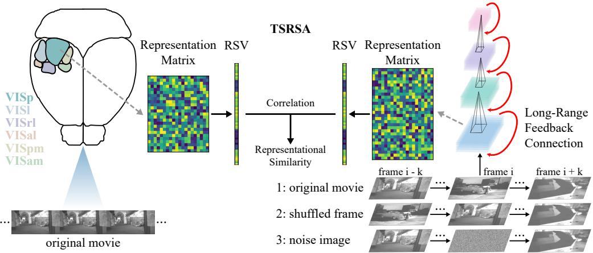
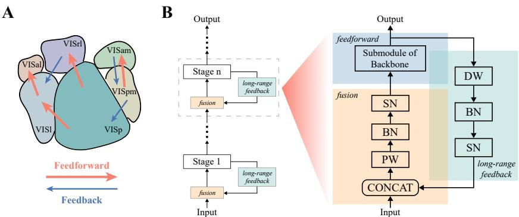
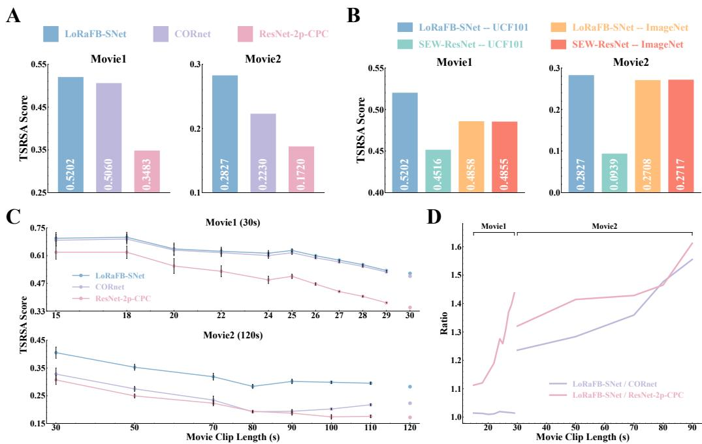
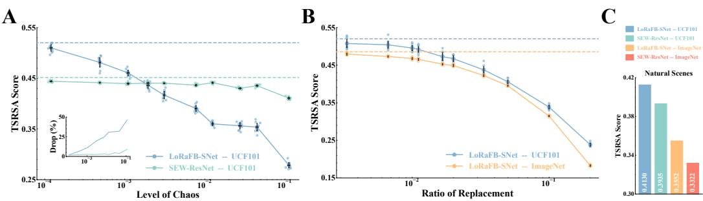
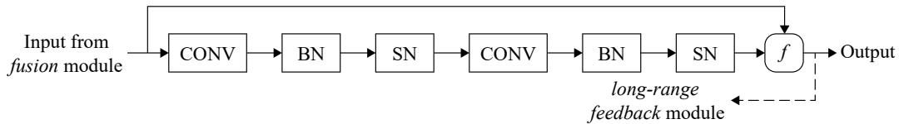
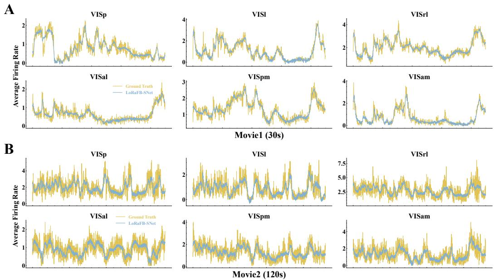
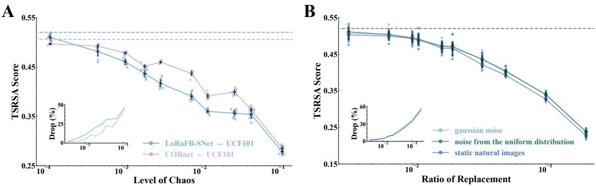

# Long-Range Feedback Spiking Network Captures Dynamic and Static Representations of the Visual Cortex under Movie Stimuli

Liwei Huang1,2, Zhengyu $\mathbf { M } \mathbf { a } ^ { 2 * }$ , Liutao $\mathbf { Y } \mathbf { u } ^ { 2 }$ , Huihui Zhou2, Yonghong Tian1,2,3∗

1School of Computer Science, Peking University, China 2Peng Cheng Laboratory, China 3School of Electronic and Computer Engineering, Shenzhen Graduate School, Peking University, China huanglw20@stu.pku.edu.cn, {mazhy, yult, zhouhh}@pcl.ac.cn, yhtian@pku.edu.cn

# Abstract

Deep neural networks (DNNs) are widely used models for investigating biological visual representations. However, existing DNNs are mostly designed to analyze neural responses to static images, relying on feedforward structures and lacking physiological neuronal mechanisms. There is limited insight into how the visual cortex represents natural movie stimuli that contain context-rich information. To address these problems, this work proposes the long-range feedback spiking network (LoRaFB-SNet), which mimics top-down connections between cortical regions and incorporates spike information processing mechanisms inherent to biological neurons. Taking into account the temporal dependence of representations under movie stimuli, we present Time-Series Representational Similarity Analysis (TSRSA) to measure the similarity between model representations and visual cortical representations of mice. LoRaFB-SNet exhibits the highest level of representational similarity, outperforming other well-known and leading alternatives across various experimental paradigms, especially when representing long movie stimuli. We further conduct experiments to quantify how temporal structures (dynamic information) and static textures (static information) of the movie stimuli influence representational similarity, suggesting that our model benefits from longrange feedback to encode context-dependent representations just like the brain. Altogether, LoRaFB-SNet is highly competent in capturing both dynamic and static representations of the mouse visual cortex and contributes to the understanding of movie processing mechanisms of the visual system. Our codes are available at https://github.com/Grasshlw/SNN-Neural-Similarity-Movie.

# 1 Introduction

Understanding how the biological visual cortex processes information under natural stimuli with computational models is a critical scientific goal in visual neuroscience. In this realm, deep neural networks have emerged as the predominant tools [28, 32, 57], surpassing traditional models, due to their profound success in matching neural representations [58, 5, 4, 7, 6, 40], revealing functional hierarchies [19, 46, 8, 53, 47], and explaining functionally specialized processing mechanisms [1, 11] of the biological visual cortex. Despite these advancements, research has mainly focused on static image stimuli, leaving a gap in the understanding of neural responses to dynamic, contextrich movie stimuli. This oversight is particularly critical given that the visual system receives predominantly dynamic information and integrates the information in both spatial [23, 24] and temporal [20] dimensions. To address this challenge, there is a need for models with enhanced biological plausibility, capable of encoding the varied types of information inherent in movie stimuli, in order to deepen our comprehension of the processing mechanisms of the visual cortex.

While bottom-up (feedforward) connections dominate visual processing [15, 10], many studies have emphasized the crucial role of top-down (feedback) and lateral connections, which are widespread in the visual cortex [18, 27, 48], providing diverse coding mechanisms and augmenting temporal representation protocols [51, 16, 25, 52]. This has inspired significant strides in incorporating recurrent structures into computational models, effectively enhancing their ability to emulate brain-like neural representations and biological behavioral patterns [39, 35, 30, 43]. Meanwhile, spiking neural networks (SNNs) [37] with brain-like neuronal computational mechanisms have been developed as more biologically plausible models [21, 17, 26, 3]. Using deep SNNs to model the visual cortex has yielded preliminary success [22, 60]. Nonetheless, attempts to combine these biologically plausible structures and mechanisms are lacking.

In this work, we introduce the long-range feedback spiking network (LoRaFB-SNet) to capture both dynamic and static representations of the mouse visual cortex under movie stimuli. To demonstrate the effectiveness of the long-range feedback and the spike mechanism in explaining the information processing mechanisms of the visual system, we design a series of experiments for analyses based on representational similarity (Figure 1). The main contributions are as follows.

• To mimic top-down connections between cortical regions and to utilize the spike mechanism with dynamic properties, we construct a novel deep spiking network with long-range feedback connections, significantly improving the biological plausibility of the model.   
• Considering time-dependent sequences of spikes, we propose Time-Series Representational Similarity Analysis (TSRSA) to measure representational similarity between models and the mouse visual cortex.   
• For neural representations of the mouse visual cortex under movie stimuli, LoRaFB-SNet trained on the UCF101 dataset significantly outperforms other outstanding alternatives in all experiments, demonstrating the critical role of the structures and mechanisms of our model and the training task.   
• By varying temporal structures or static textures of movie stimuli fed to models, we quantify the effects of dynamic and static information on representational similarity. The results show that LoRaFB-SNet processes movie stimuli to form context-dependent representations in a brain-like manner, providing a deeper insight into the movie processing mechanisms of the visual cortex.

Overall, our proposed novel model achieves the highest neural similarity under movie stimuli and better captures brain-like dynamic and static representations, shedding light on the movie coding strategy of the mouse visual cortex.

# 2 Related Work

As deep neural networks have attracted widespread interest as computational models in visual neuroscience, incorporating more biologically plausible structures and mechanisms has become a major avenue to advance the study of neural representations. We summarize some prominent work.

The deep recurrent network models Efforts to construct reasonable recurrent structures [39, 35, 30] have yielded models good at fitting neural representations and revealing neural dynamics. Recurrent cells from an automated search have aided models in predicting the dynamics of neural activity [39]. Notably, CORnet with manually designed architectures has matched the hierarchy of the visual cortex, earning recognition as a leading model in this community [35]. However, most work has focused on studying neural representations under static stimuli, a limited aspect of stimuli. Besides, while some studies have explored neural responses to movie stimuli [49, 1, 29], they have only exploited localized lateral connections.

The deep spiking network models Early studies have applied shallow, even single-layer spiking networks to perform simple temporal tasks [31, 2, 59, 44] and to investigate biological properties [36, 50, 56]. Some recurrent spiking models have not only emphasized the criticality of homeostatic regulation in biological neurons [36], but also explained the dynamic regime in the brain associated with cognition and working memory [56]. Recently, deep spiking networks have begun to be used to analyze neural representations, demonstrating enhanced representational similarity [22] and more accurate prediction of the temporal-dynamic trajectories of cortical activity [60] on various neural datasets compared to traditional network counterparts. However, these spiking models are pure feedforward networks and are confined to the study of static stimuli.

  
Figure 1: The overview of our experiments. Six visual cortical regions of the mouse and the longrange feedback spiking network receive the same original movie stimuli to generate the representation matrices. TSRSA is applied to two representation matrices to measure representational similarity. In addition, the network receives two modified versions of the movie stimuli (one with broken temporal structures and the other with varied static textures), while the visual cortex still receives the original movie. These two additional experiments are used to quantify the effects of dynamic (temporal) and static (textural) information on representational similarity. See Section 3 for details.

# 3 Methods

# 3.1 Long-Range Feedback Spiking Network

# 3.1.1 Architecture

We develop LoRaFB-SNet guided by two principles of biological plausibility. First, we use the LIF neuron (see Appendix A) as the basic unit of our network, which models the membrane potential dynamics of biological neurons [55] and encodes information through spike sequences like the visual cortex. Second, we design the long-range feedback structure to mimic cross-regional top-down connections that are widespread in the mouse visual cortex (Figure 2A). This long-range recurrence is complementary to spiking neurons with self-accumulation for representing temporal information.

As feedforward connections are dominant in the visual cortex, the backbone of LoRaFB-SNet is still feedforward, with the recurrent module embedded to introduce long-range feedback (Figure 2B). In particular, the construction of the recurrent module is described as follows.

The recurrent module consists of three components: a feedforward module, a long-range feedback module, and a fusion module. The feedforward module is a submodule of the backbone network, consisting of a stack of convolution, pooling, batch normalization, and spiking neurons, which plays a major role in abstracting spatial features from visual stimuli and encoding the visual content. This module receives the fused features of the outputs from the long-range feedback module and the previous stage. The long-range feedback module is composed of depthwise transposed convolution, batch normalization, and spiking neurons. On the one hand, depthwise transposed convolution effectively reduces the number of network parameters and upsamples the feature map to match the inputs. On the other hand, some work has shown that such a structure might mimic parallel information processing streams in mouse cortical regions and improve representational similarity [22]. The fusion module first concatenates the inputs of the current module (the outputs of the previous stage) and the outputs of the long-range feedback module in the channel dimension, and then integrates the feedforward and feedback information through pointwise convolution, batch normalization, and spiking neurons. The recurrent module can be formulated as:

  
Figure 2: A. The schematic of six visual cortical regions in the mouse. For brevity, we show parts of the cross-regional feedforward and feedback connections reported from physiological research. B. The schematic of LoRaFB-SNet with the embedded recurrent module. See Section 3.1 for details.

$$
\begin{array} { r l } & { R _ { t } ^ { l } = \mathrm { S N } ( \mathrm { B N } ( \mathrm { D W } ( O _ { t - 1 } ^ { l } ) ) ) , } \\ & { A _ { t } ^ { l } = \mathrm { S N } ( \mathrm { B N } ( \mathrm { P W } ( \mathrm { C O N C A T } ( O _ { t } ^ { l - 1 } , R _ { t } ^ { l } ) ) ) ) , } \\ & { O _ { t } ^ { l } = \mathrm { F } ^ { l } ( A _ { t } ^ { l } ) , } \end{array}
$$

where SN is spiking neurons, BN is batch normalization, DW is depthwise transposed convolution, PW is pointwise convolution, CONCAT is channel-wise concatenation. $O _ { t } ^ { l }$ denotes the outputs of stage $l$ at time step $t$ . Similarly, $R _ { t } ^ { l }$ and $A _ { t } ^ { l }$ denote the outputs of the long-range feedback and fusion modules respectively. $\mathrm { F } ^ { l }$ denotes all operations in the feedforward module (Appendix B).

# 3.1.2 Pre-Training and Representation Extraction

We pre-train LoRaFB-SNet on the UCF101 dataset and the ImageNet dataset using SpikingJelly [12]. Specifically, for training the video action recognition task on UCF101, each sample (a video clip) contains 16 frames, and one frame is the input at each time step (the simulating time steps $T = 1 6$ ). For training the object recognition task on ImageNet, each sample (an image) is input to networks 4 times (the simulating time steps $T = 4$ ). See Appendix C for details.

After pre-training the networks, we feed them with the same movie stimuli used in the neural dataset and obtain features from all selected layers. For networks trained on UCF101, the entire movie is continuously and uninterruptedly fed into networks in the form of one frame per time step. For networks trained on ImageNet, all frames in the movie are considered as independent images and are fed into networks separately. Each movie frame is input 4 times, which is consistent with training.

# 3.2 Representational Similarity Metric

To assess representational similarity between models and the mouse visual cortex at the population level under temporal sequential stimuli, two main problems need to be addressed. First, the metric can not only analyze static properties of representations, but also preserve temporal relationships of time-series representations to facilitate the analysis of dynamic properties. Second, neurons recorded from the visual cortex are far fewer than units in a network layer, making it difficult to directly compare representations between the two systems.

We present Time-Series Representational Similarity Analysis (TSRSA) based on Representational Similarity Analysis (RSA) [34, 33], which has been widely used for the comparison of neural representations [30, 38, 46, 1, 7]. The original RSA focuses on the similarity between neural representations corresponding to each pair of independent stimuli, whereas TSRSA quantifies the similarity between representations corresponding to sequential stimuli, taking into account temporal sequential relationships. We detail the implementation of TSRSA as follows. First, we acquire representation matrices $\mathbf { R } = \left( \mathbf { r } _ { 1 } , \mathbf { r } _ { 2 } , \ldots , { \dot { \mathbf { r } } } _ { t } , \ldots , \mathbf { r } _ { T } \right) \in \mathbb { R } ^ { N \times T }$ from each layer of networks and each cortical region, where $N$ is the number of units/neurons and $T$ is the number of movie frames. The columns are arranged in chronological order, i.e. $\mathbf { r } _ { t }$ represents population responses to the movie frame $t$ . Second, we use the Pearson correlation coefficient to compute the similarity between each given column $\mathbf { r } _ { t }$ and all subsequent columns, yielding the representational similarity vector $\mathbf { s } _ { t } = ( s _ { t 1 } , s _ { t 2 } , \ldots , s _ { t p } , \ldots )$ . The element $s _ { t p }$ is $\mathrm { C o r r } \left( \mathbf { r } _ { t } , \mathbf { r } _ { t + p } \right)$ , where $0 < p < T - t$ . We then concatenate all vectors to obtain the complete representational similarity vectors $\mathbf { S } _ { \mathrm { m o d e l } }$ for a network layer and $\mathbf { S } _ { \mathrm { c o r t e x } }$ for a cortical region, which extract both static features and temporal relationships of neural representations. Finally, we compute the Spearman rank correlation coefficient between $\mathbf { S } _ { \mathrm { m o d e l } }$ and $\mathbf { S } _ { \mathrm { c o r t e x } }$ to quantify the similarity. Using this metric, we perform a layer-by-layer measurement for a network, evaluating all selected layers to visual cortical regions. Notably, when obtaining similarity vectors, we choose the Pearson correlation coefficient for computational efficiency, since both model features and neural data are very high-dimensional. On the other hand, the Spearman rank correlation coefficient is chosen to quantify the similarity between two visual systems due to its ability to better capture nonlinear relations.

# 3.3 Quantifying Effects of Dynamic and Static Information on Representational Similarity

To analyze how visual models process diverse types of information in movie stimuli, we modify temporal structures (dynamic) and static textures (static) of the original movie and obtain variant dynamic or static representations of networks. Meanwhile, cortical representations are maintained since the movie presented to mice is unchanged. By measuring the similarity between the modified network outputs and the unaltered cortical representations, we quantify the effects of dynamic and static information on representational similarity and attempt to glimpse movie processing mechanisms of the visual cortex from the encoding properties of our model. The methods for modifying temporal structures and static textures are as follows.

Dynamic information We disrupt the frame order of the movie and feed the shuffled movie into networks, producing network representations that differ from the original due to distinct dynamic sequential information. To obtain frame order with different levels of alteration while avoiding extreme chaos (e.g., moving the first frame to the last), we divide the entire movie into multiple windows with the same number of frames and randomly shuffle the frames only within each window. We conduct 10 sets of experiments with different window sizes. Each set comprises 10 trials to provide enough statistical power. We calculate the level of chaos for every trial, which is defined as $1 - r$ , where $r$ is the Spearman rank correlation coefficient between the disrupted frame order and the original order. Since the movie presented to mice is invariant, we rearrange the network representation matrix to the original order to ensure that it matches the order of the mouse representation matrix when conducting TSRSA. In this way, we maintain the correspondence between static representations of two systems, while isolating changes in dynamic representations of networks. This allows us to focus on evaluating the effects of dynamic information.

Static information We randomly select a certain proportion of movie frames and replace them with Gaussian noise images whose static textures are completely different from both network training scenes and biological experiment stimuli. We then feed the new movie into networks to obtain variant static representations. To minimize dense local replacement and preserve as much dynamic information as possible, the movie is divided into equal-sized windows and only one frame in each window is replaced. We similarly run 10 experimental sets with different window sizes, each consisting of 10 trials. The ratio of replacement is the inverse of the number of frames per window. Replacing movie frames results in a change in static representations of networks, while the overall frame order remains the same as the original. Admittedly, changing static information will inevitably change temporal structures as well. We attenuate this influence by distributing noise images as sporadically as possible and emphasize how static information affects representational similarity.

# 4 Experiments

# 4.1 Neural Dataset

We conduct analyses using a subset of the Allen Brain Observatory Visual Coding dataset [9, 48]. This dataset, recorded by Neuropixel probes, consists of neural spikes with high temporal resolution from 6 mouse visual cortical regions (VISp, VISl, VISrl, VISal, VISpm, VISam, see Appendix D for details). Each region contains hundreds of recorded neurons to minimize the effects of neuronal variability, facilitating the analysis of neural population representations. The visual stimuli presented to the mice consist of two movies, one for 30s (Movie1), repeated for 20 trials, and the other for 120s (Movie2), repeated for 10 trials. The frame rate of both movies is $3 0 \mathrm { H z }$ . To pre-process neural responses with the peristimulus time histogram (PSTH), we sum the number of spikes in each movie frame and take the average over all trials for each neuron. To focus on neurons that are more responsive to visual input, we excluded those firing less than an empirical threshold of 0.5 spikes/second [42, 54].

  
Figure 3: A. The TSRSA scores of three models pre-trained on UCF101. B. The TSRSA scores of feedback/feedforward spiking networks pre-trained on UCF101/ImageNet. C. The TSRSA score curves of three models pre-trained on UCF101 for different movie clip lengths. We randomly select continuous movie clips of different lengths and plot TSRSA scores between models’ and the visual cortex’s representations corresponding to these clips. The error bar is the standard error over 10 random seeds. D. The ratios of our model’s scores to those of the alternative models for different clip lengths. The ratio tends to increase for longer clips.

As discussed in the study [9] proposing this dataset, the class of neurons responsive to movie stimuli is found in all six cortical regions. Therefore, for a given model, we take the maximum scores across layers per region and report the average score over six regions as the model’s TSRSA score.

# 4.2 Models for Comparisons

We select three models for comprehensive comparisons to demonstrate the effectiveness of each character in LoRaFB-SNet.

CORnet It is one of the most influential recurrent networks [35] for modeling the visual cortex and has been used as a benchmark in many studies [6, 7]. The prototype was trained on ImageNet and here we pre-train it on UCF101 with the same training procedure as LoRaFB-SNet. The comparison with CORnet, which has recurrent connections but lacks the spike mechanism, aims to show the critical role of spiking neurons in our model.

ResNet-2p-CPC This model emulates the ventral and dorsal pathways of the mouse visual cortex with parallel pathway architectures [1] pre-trained on UCF101. While our model incorporates spiking neurons and recurrent connections to handle sequential inputs of any length, ResNet-2p-CPC uses fixed-length filters to process temporal data, allowing comparison between different approaches to dynamic information processing.

Table 1: The neural ceilings and the scores of all models under two movie stimuli. In brackets are the percentages of model scores compared to the neural ceiling.   

<table><tr><td></td><td>Neural Ceiling</td><td>CORnet</td><td>ResNet-2p-CPC</td><td>SEW-ResNet</td><td>LoRaFB-SNet</td></tr><tr><td>Movie1</td><td>0.821±0.006</td><td>0.506 (61.6%)</td><td>0.348 (42.4%)</td><td>0.452 (55.0%)</td><td>0.520 (63.3%)</td></tr><tr><td>Movie2</td><td>0.616±0.009</td><td>0.223 (36.2%)</td><td>0.172 (27.9%)</td><td>0.094 (15.2%)</td><td>0.283 (45.9%)</td></tr></table>

SEW-ResNet It is a pure feedforward spiking network [13] that has shown the best performance in fitting neural representations of the visual cortex [22, 60]. We pre-train it on both UCF101 and ImageNet. Since the comparison with it focuses on the role of feedback connections, our model adopts identical feedforward structures to its.

# 4.3 Results

# 4.3.1 Comparisons of Representational Similarity

We perform representational similarity analyses on the neural dataset under two movie stimuli respectively, and refer to the two cases as Movie1 and Movie2.

As shown in Figure 3A, among the three models pre-trained on UCF101, LoRaFB-SNet outperforms the other two well-known bio-inspired models. Specifically, our model performs moderately better than CORnet (Movie1: $+ 2 . 8 \%$ ; Movie2: $+ 2 6 . 8 \%$ ) and significantly better than ResNet-2p-CPC (Movie1: $+ 4 9 . 3 \%$ ; Movie2: $+ 6 4 . 4 \%$ ). To further quantify how similar our model’s representations are to brain representations, we obtain neural ceilings by randomly splitting the neural data into two halves and computing the TSRSA score (Table 1). Our model attains $6 3 . 3 \%$ and $4 5 . 9 \%$ of the ceilings and achieves a great improvement over other models, which suggests that our model effectively captures neural representations of the brain and is meaningfully closer to the mouse visual cortex. We also report similarity scores of our model to each cortical region (Appendix E) and show that our model yields robustness across different regions. In addition to the population representation analysis, we use linear regression to fit model representations to temporal profiles of individual biological neurons and compute $R ^ { 2 }$ as the similarity, the results of which also demonstrate the superiority of our models (Appendix F).

To emphasize the joint role of long-range feedback connections and pre-training on a video dataset, we compare feedback/feedforward spiking networks pre-trained on image/video datasets (Figure 3B). For models trained on ImageNet, LoRaFB-SNet and SEW-ResNet achieve comparable TSRSA scores, suggesting that feedback connections do not have a significant effect on models trained on static images. For models trained on UCF101, LoRaFB-SNet performs significantly better than SEW-ResNet (Movie1: $+ 1 5 . 2 \%$ ; Movie2: $+ 2 0 1 . 1 \%$ ). Besides, when comparing models trained on UCF101 and ImageNet, we find that our model outperforms those trained on ImageNet, while SEW-ResNet instead performs worse. This may be explained by the fact that SEW-ResNet trained on a video dataset not only fails to capture dynamic information effectively, but also is compromised on the ability to represent static information. Taken together, it is the combination of long-range feedback connections and pre-training on a video dataset that enables our model to better extract temporal features and capture representations of the visual cortex under movie stimuli.

Notably, from the above results, we find that our model gains more pronounced advantages in similarity when the movie stimuli are longer. To further corroborate this phenomenon, we randomly select movie clips of different lengths from the original movie stimuli and compute TSRSA scores between models’ and the visual cortex’s representations corresponding to these movie clips. As shown in Figure 3C, TSRSA scores show a decreasing trend with increasing clip length, suggesting that it is more difficult for models to capture brain-like representations when movie stimuli are longer. This result is reasonable since longer movie stimuli increase the diversity of neural response patterns in the visual cortex. Nonetheless, our model consistently outperforms the other two models across all clip lengths and shows increasing improvement ratios as movie clips get longer (Figure 3D). These results suggest that the more biologically plausible structure and mechanism may allow LoRaFBSNet to efficiently process accumulated visual information on longer time scales, just like the brain.

  
Figure 4: A. The TSRSA score curves of LoRaFB-SNet and SEW-ResNet trained on UCF101 with different levels of chaos (the main plot) and the drop rate curves of experimental scores compared with the original score (the subplot). The horizontal coordinates in both plots are the level of chaos. In the main plot, the dashed horizontal lines indicate the original scores between models and the mouse visual cortex under the original movie. Each large point on the curve indicates the average result of a set of experiments, and each small point indicates the result of one trial in a set. The vertical error bar is the $9 9 \%$ confidence interval of the score over 10 trials, while the horizontal error bar is the $9 9 \%$ confidence interval of the level of chaos. In the subplot, the curves show the average drop rate and the average level of chaos over 10 trials for all experimental sets. LoRaFB-SNet shows a large drop in scores while SEW-ResNet shows a small drop. B. The TSRSA score curves of LoRaFB-SNet trained on UCF101/ImageNet with different ratios of replacement. The elements in the main plot indicate similar content as in A. LoRaFB-SNet trained on UCF101 and ImageNet both exhibit a similar decreasing trend in scores. C. The TSRSA scores of feedback/feedforward spiking networks trained on UCF101/ImageNet for the neural dataset under natural scene stimuli.

Specifically, compared to CORnet which also has recurrent connections, LoRaFB-SNet utilizes the spike firing mechanism to form spike-sequential coding and incorporates long-range feedback to enhance the ability to extract temporal features. Compared to ResNet-2p-CPC, LoRaFB-SNet exploits membrane potential dynamics and recurrent modules to process dynamic information, more flexibly handling movies of different lengths without being limited by the temporal filter size.

Overall, our model, LoRaFB-SNet, outperforms other influential and outstanding alternatives across multiple experimental paradigms, suggesting that biologically plausible long-range feedback connections and spiking neurons significantly contribute to better modeling neural representations of the mouse visual cortex, especially when processing long-duration movies.

# 4.3.2 Experiments to Analyze the Effects of Dynamic and Static Information

For the experiments of shuffling movie frames to change dynamic information, we compare the results of LoRaFB-SNet and SEW-ResNet trained on UCF101 (Figure 4A) to investigate the importance of brain-like dynamic representations for modeling the visual cortex. As the curves in the main plot show, any alteration from the original frame order results in a lower TSRSA score between models and the mouse visual cortex than the original score, and the score decreases as the level of chaos increases. Frame shuffling disrupts the continuity and temporal structures of the movie, leading to changes in dynamic representations of models. Considering that we align representation matrices of models and the visual cortex along the movie frame dimension when applying TSRSA, the decrease in similarity is mostly attributed to variations in dynamic representations, while the effect of static representations is negligible.

Furthermore, by comparing drop rate curves between LoRaFB-SNet and SEW-ResNet, we find out that the drop rate of LoRaFB-SNet increases with the level of chaos and eventually reaches a staggering $4 6 . { \bar { 5 } } \%$ . However, the drop rate of SEW-ResNet is consistently lower than that of LoRaFB-SNet and the maximum is even lower than $9 \%$ . These results reveal two significant findings. First, our model captures biological dynamic representations very well and is sensitive to disruptions in dynamic information. Second, although SEW-ResNet is also trained on a video dataset, the vast majority of its representations depend on static rather than dynamic information. Therefore, its similarity score is less affected by temporal structure distortions. In addition, we perform the same experiment on CORnet that also has recurrent connections (Figure 7A of Appendix G), which shows a similar result to our model. In conclusion, these results underscore the superior capability of LoRaFB-SNet, due to its long-range feedback connections, to capture temporal relationships and represent dynamic information in a more context-dependent manner, which is likely to be the potentially crucial mechanism for processing movie stimuli in the mouse visual cortex.

Table 2: The TSRSA scores in different cases for ablation studies under Movie1.   

<table><tr><td></td><td>Continuous</td><td>Discontinuous</td><td>ImageNet</td><td>No-spike</td><td>SEW-ResNet</td><td>LoRaFB-SNet</td></tr><tr><td>Score</td><td>0.524</td><td>0.474</td><td>0.486</td><td>0.498</td><td>0.452</td><td>0.520</td></tr></table>

In addition to the analysis of dynamic representations, the role of static representations in modeling the visual cortex should not be overlooked. In the experiments of replacing frames to modify static information, we compare the results of LoRaFB-SNet trained on UCF101 and ImageNet (Figure 4B). Similar to the results in the experiments of shuffling movie frames, TSRSA scores are mostly lower than the original in the case of replacing noise frames, and the score decreases as the ratio of replacement increases. We also use other types of noise images for replacement, which exhibits a similar impact (Figure 7B of Appendix G). Obviously, static representations of models change a lot due to the totally different static textures between the original movie frames and the noise images, resulting in a decrease in similarity. While scores of both LoRaFB-SNet trained on UCF101 and ImageNet show a similar decreasing trend with the increasing replacement rate, the former is steadily higher than the latter. For the model trained on an image dataset, the movie frames are treated as independent individuals, so model representations completely depend on static information and there is no temporal relationship between representations of two frames. In contrast, the model trained on a video dataset encodes both static and dynamic information to form representations. Consequently, although the high replacement ratio also affects static representations of the UCF101-trained LoRaFBSNet, its dynamic representations to original movie frames may moderate the drop in similarity score to some extent.

In addition to natural movie stimuli, we measure the representational similarity between models and the mouse visual cortex under static natural scene stimuli (the neural data are also from the Allen Brain Observatory Visual Coding dataset). As shown in Figure 4C and Table 6 of Appendix G, our model also outperforms other models in encoding static information and yields more brain-like representations under static stimuli. Besides, models trained on UCF101 perform better than those trained on ImageNet, even in representing static natural scene stimuli.

In summary, LoRaFB-SNet trained on a video dataset is able to extract spatio-temporal features simultaneously and represent dynamic and static information of movie stimuli in a way more similar to the mouse visual cortex. In particular, the powerful ability to encode temporal relationships makes LoRaFB-SNet’s representations more context-dependent, which may provide new insights into the mechanisms of movie information processing in the visual system.

# 4.3.3 Ablation Studies for Training Datasets and Model Structures

To figure out whether the static content of UCF101 data or the temporal structure of continuous videos benefits LoRaFB-SNet to capture brain-like representations, we build two datasets based on UCF101 to pre-train LoRaFB-SNet and compare their similarity. One dataset consists of continuous videos from UCF101, while the other consists of disordered and discontinuous videos made up of randomly selected frames from UCF101. As shown in Table 2, LoRaFB-SNet trained on continuous videos outperforms that trained on discontinuous videos, suggesting that the temporal structure rather than the static content plays an important role. Furthermore, LoRaFB-SNet trained on discontinuous videos performs even worse than that trained on ImageNet, showing that the static content of UCF101 is not closer to the test movie stimuli than that of ImageNet in terms of data distribution.

To consolidate the conclusion about the effectiveness of spiking neurons and long-range feedback connections, we perform direct comparisons with two models trained on UCF101, one without spiking neurons but with the same structure as LoRaFB-SNet (No-spike), and the second with the same spiking neurons and feed-forward structure but without feedback connections (SEW-ResNet). The results in Table 2 show that the model lacking either of these characters performs worse than our model, providing further evidence that both characters of our model play a critical role.

# 5 Discussion

In this work, we propose LoRaFB-SNet (Long-Range Feedback Spiking Network) to model neural representations of the mouse visual cortex under movie stimuli. Incorporating long-range feedback connections and spiking neurons, LoRaFB-SNet offers more biologically plausible architectures and processing mechanisms. Tested on the mouse neural dataset with TSRSA, LoRaFB-SNet significantly surpasses existing outstanding and influential computational models across multiple experimental paradigms. We extend the analysis to dynamic and static information representations of networks and the visual cortex with two meticulously designed experiments, providing evidence that LoRaFB-SNet is able to encode dynamic and static information in a more brain-like manner. Specifically, our model efficiently processes visual stimuli with long duration and forms context-dependent representations. Overall, LoRaFB-SNet effectively captures dynamic and static representations of the visual cortex and helps to reveal movie processing mechanisms in the visual system.

For spiking neurons in our model, we hypothesize that membrane potential dynamics and spike information encoding are helpful to better capture brain-like representations, which may require further analyses to support. Benefiting from feedback connections, our model gains particular advantages in representing dynamic information. Some studies [45] have suggested that the effects of recurrent connections in the visual cortex vary over time, influencing dynamic representations. The specific contributions and interplay of feedforward and feedback connections to the encoding protocol remain to be explored. In conclusion, while our model explains some mechanisms of information processing in the visual cortex, more biologically plausible mechanisms, such as local recurrent connections and sophisticated neuronal models, deserve to be introduced and studied.

LoRaFB-SNet demonstrates significant efficacy in modeling visual representations of mice. As a biologically plausible spiking network, it holds potential as a general and promising framework for studying the visual cortex of other species and investigating other sensory modalities, helping to understand more intricate neural computations.

# Acknowledgments and Disclosure of Funding

This work is supported by grants from the Beijing Science and Technology Plan: Z (No. 241100004224011), the National Natural Science Foundation of China (No. 62027804, No. 62425101, No. 62332002, No. 62088102, No. 62206141, and No. 62236009), and the major key project of the Peng Cheng Laboratory (PCL2021A13).

# References

[1] Shahab Bakhtiari, Patrick Mineault, Timothy Lillicrap, Christopher Pack, and Blake Richards. The functional specialization of visual cortex emerges from training parallel pathways with self-supervised predictive learning. In Advances in Neural Information Processing Systems 34, pages 25164–25178, 2021.   
[2] Guillaume Bellec, Franz Scherr, Anand Subramoney, Elias Hajek, Darjan Salaj, Robert Legenstein, and Wolfgang Maass. A solution to the learning dilemma for recurrent networks of spiking neurons. Nature communications, 11(1):3625, 2020.   
[3] Romain Brette, Michelle Rudolph, Ted Carnevale, Michael Hines, David Beeman, James M Bower, Markus Diesmann, Abigail Morrison, Philip H Goodman, Frederick C Harris, et al. Simulation of networks of spiking neurons: a review of tools and strategies. Journal of computational neuroscience, 23(3):349–398, 2007.   
[4] Santiago A Cadena, George H Denfield, Edgar Y Walker, Leon A Gatys, Andreas S Tolias, Matthias Bethge, and Alexander S Ecker. Deep convolutional models improve predictions of macaque v1 responses to natural images. PLoS computational biology, 15(4):e1006897, 2019.   
[5] Charles F Cadieu, Ha Hong, Daniel LK Yamins, Nicolas Pinto, Diego Ardila, Ethan A Solomon, Najib J Majaj, and James J DiCarlo. Deep neural networks rival the representation of primate it cortex for core visual object recognition. PLoS computational biology, 10(12):e1003963, 2014.

[6] Le Chang, Bernhard Egger, Thomas Vetter, and Doris Y Tsao. Explaining face representation in the primate brain using different computational models. Current Biology, 31(13):2785–2795, 2021.

[7] Colin Conwell, David Mayo, Andrei Barbu, Michael Buice, George Alvarez, and Boris Katz. Neural regression, representational similarity, model zoology & neural taskonomy at scale in rodent visual cortex. In Advances in Neural Information Processing Systems 34, pages 5590–5607, 2021.

[8] Joel Dapello, Tiago Marques, Martin Schrimpf, Franziska Geiger, David Cox, and James J DiCarlo. Simulating a primary visual cortex at the front of cnns improves robustness to image perturbations. In Advances in Neural Information Processing Systems 33, pages 13073–13087, 2020.

[9] Saskia EJ de Vries, Jerome A Lecoq, Michael A Buice, Peter A Groblewski, Gabriel K Ocker, Michael Oliver, David Feng, Nicholas Cain, Peter Ledochowitsch, Daniel Millman, et al. A large-scale standardized physiological survey reveals functional organization of the mouse visual cortex. Nature neuroscience, 23(1):138–151, 2020.

[10] James J DiCarlo, Davide Zoccolan, and Nicole C Rust. How does the brain solve visual object recognition? Neuron, 73(3):415–434, 2012.

[11] Katharina Dobs, Julio Martinez, Alexander JE Kell, and Nancy Kanwisher. Brain-like functional specialization emerges spontaneously in deep neural networks. Science advances, 8(11):eabl8913, 2022.

[12] Wei Fang, Yanqi Chen, Jianhao Ding, Zhaofei Yu, Timothée Masquelier, Ding Chen, Liwei Huang, Huihui Zhou, Guoqi Li, and Yonghong Tian. Spikingjelly: An open-source machine learning infrastructure platform for spike-based intelligence. Science Advances, 9(40):eadi1480, 2023.

[13] Wei Fang, Zhaofei Yu, Yanqi Chen, Tiejun Huang, Timothée Masquelier, and Yonghong Tian. Deep residual learning in spiking neural networks. In Advances in Neural Information Processing Systems 34, pages 21056–21069, 2021.

[14] Wei Fang, Zhaofei Yu, Yanqi Chen, Timothée Masquelier, Tiejun Huang, and Yonghong Tian. Incorporating learnable membrane time constant to enhance learning of spiking neural networks. In Proceedings of the IEEE/CVF International Conference on Computer Vision (ICCV), pages 2661–2671, 2021.

[15] Daniel J Felleman and David C Van Essen. Distributed hierarchical processing in the primate cerebral cortex. Cerebral cortex (New York, NY: 1991), 1(1):1–47, 1991.

[16] Winrich A Freiwald and Doris Y Tsao. Functional compartmentalization and viewpoint generalization within the macaque face-processing system. Science, 330(6005):845–851, 2010.

[17] Wulfram Gerstner and Werner M Kistler. Spiking neuron models: Single neurons, populations, plasticity. Cambridge university press, 2002.

[18] Charles D Gilbert and Wu Li. Top-down influences on visual processing. Nature Reviews Neuroscience, 14(5):350–363, 2013.

[19] Umut Güçlü and Marcel AJ van Gerven. Deep neural networks reveal a gradient in the complexity of neural representations across the ventral stream. Journal of Neuroscience, 35(27):10005–10014, 2015.

[20] Uri Hasson, Eunice Yang, Ignacio Vallines, David J Heeger, and Nava Rubin. A hierarchy of temporal receptive windows in human cortex. Journal of Neuroscience, 28(10):2539–2550, 2008.

[21] Alan L Hodgkin and Andrew F Huxley. A quantitative description of membrane current and its application to conduction and excitation in nerve. The Journal of physiology, 117(4):500, 1952.

[22] Liwei Huang, Zhengyu Ma, Liutao Yu, Huihui Zhou, and Yonghong Tian. Deep spiking neural networks with high representation similarity model visual pathways of macaque and mouse. In The Thirty-Seventh AAAI Conference on Artificial Intelligence, pages 31–39, 2023.

[23] David H Hubel and Torsten N Wiesel. Receptive fields of single neurones in the cat’s striate cortex. The Journal of physiology, 148(3):574, 1959.

[24] David H Hubel and Torsten N Wiesel. Receptive fields and functional architecture of monkey striate cortex. The Journal of physiology, 195(1):215–243, 1968.

[25] Jean-Michel Hupe, Andrew C James, Pascal Girard, Stephen G Lomber, Bertram R Payne, and Jean Bullier. Feedback connections act on the early part of the responses in monkey visual cortex. Journal of neurophysiology, 85(1):134–145, 2001.

[26] Eugene M Izhikevich. Which model to use for cortical spiking neurons? IEEE Transactions on Neural Networks, 15(5):1063–1070, 2004.

[27] Kohitij Kar, Jonas Kubilius, Kailyn Schmidt, Elias B Issa, and James J DiCarlo. Evidence that recurrent circuits are critical to the ventral stream’s execution of core object recognition behavior. Nature neuroscience, 22(6):974–983, 2019.

[28] Seyed-Mahdi Khaligh-Razavi and Nikolaus Kriegeskorte. Deep supervised, but not unsupervised, models may explain it cortical representation. PLoS computational biology, 10(11):e1003915, 2014.

[29] Meenakshi Khosla, Gia H Ngo, Keith Jamison, Amy Kuceyeski, and Mert R Sabuncu. Cortical response to naturalistic stimuli is largely predictable with deep neural networks. Science Advances, 7(22):eabe7547, 2021.

[30] Tim C Kietzmann, Courtney J Spoerer, Lynn KA Sörensen, Radoslaw M Cichy, Olaf Hauk, and Nikolaus Kriegeskorte. Recurrence is required to capture the representational dynamics of the human visual system. Proceedings of the National Academy of Sciences, 116(43):21854–21863, 2019.

[31] Robert Kim, Yinghao Li, and Terrence J Sejnowski. Simple framework for constructing functional spiking recurrent neural networks. Proceedings of the national academy of sciences, 116(45):22811–22820, 2019.

[32] Nikolaus Kriegeskorte. Deep neural networks: a new framework for modeling biological vision and brain information processing. Annual review of vision science, 1:417–446, 2015.

[33] Nikolaus Kriegeskorte, Marieke Mur, and Peter A Bandettini. Representational similarity analysis-connecting the branches of systems neuroscience. Frontiers in systems neuroscience, 2:4, 2008.

[34] Nikolaus Kriegeskorte, Marieke Mur, Douglas A Ruff, Roozbeh Kiani, Jerzy Bodurka, Hossein Esteky, Keiji Tanaka, and Peter A Bandettini. Matching categorical object representations in inferior temporal cortex of man and monkey. Neuron, 60(6):1126–1141, 2008.

[35] Jonas Kubilius, Martin Schrimpf, Kohitij Kar, Rishi Rajalingham, Ha Hong, Najib Majaj, Elias Issa, Pouya Bashivan, Jonathan Prescott-Roy, Kailyn Schmidt, et al. Brain-like object recognition with high-performing shallow recurrent anns. In Advances in Neural Information Processing Systems 32, pages 12785–12796, 2019.

[36] Zhengyu Ma, Gina G Turrigiano, Ralf Wessel, and Keith B Hengen. Cortical circuit dynamics are homeostatically tuned to criticality in vivo. Neuron, 104(4):655–664, 2019.

[37] Wolfgang Maass. Networks of spiking neurons: the third generation of neural network models. Neural networks, 10(9):1659–1671, 1997.

[38] Johannes Mehrer, Courtney J Spoerer, Nikolaus Kriegeskorte, and Tim C Kietzmann. Individual differences among deep neural network models. Nature communications, 11(1):5725, 2020.

[39] Aran Nayebi, Daniel Bear, Jonas Kubilius, Kohitij Kar, Surya Ganguli, David Sussillo, James J DiCarlo, and Daniel L Yamins. Task-driven convolutional recurrent models of the visual system. In Advances in Neural Information Processing Systems 31, pages 5295–5306, 2018.   
[40] Aran Nayebi, Nathan CL Kong, Chengxu Zhuang, Justin L Gardner, Anthony M Norcia, and Daniel LK Yamins. Mouse visual cortex as a limited resource system that self-learns an ecologically-general representation. PLOS Computational Biology, 19(10):e1011506, 2023.   
[41] Emre O Neftci, Hesham Mostafa, and Friedemann Zenke. Surrogate gradient learning in spiking neural networks: Bringing the power of gradient-based optimization to spiking neural networks. IEEE Signal Processing Magazine, 36(6):51–63, 2019.   
[42] Lucas Pinto, Michael J Goard, Daniel Estandian, Min Xu, Alex C Kwan, Seung-Hee Lee, Thomas C Harrison, Guoping Feng, and Yang Dan. Fast modulation of visual perception by basal forebrain cholinergic neurons. Nature neuroscience, 16(12):1857–1863, 2013.   
[43] Rishi Rajalingham, Aída Piccato, and Mehrdad Jazayeri. Recurrent neural networks with explicit representation of dynamic latent variables can mimic behavioral patterns in a physical inference task. Nature Communications, 13(1):5865, 2022.   
[44] Arjun Rao, Philipp Plank, Andreas Wild, and Wolfgang Maass. A long short-term memory for ai applications in spike-based neuromorphic hardware. Nature Machine Intelligence, 4(5):467–479, 2022.   
[45] João D Semedo, Anna I Jasper, Amin Zandvakili, Aravind Krishna, Amir Aschner, Christian K Machens, Adam Kohn, and Byron M Yu. Feedforward and feedback interactions between visual cortical areas use different population activity patterns. Nature communications, 13(1):1099, 2022.   
[46] Jianghong Shi, Eric Shea-Brown, and Michael Buice. Comparison against task driven artificial neural networks reveals functional properties in mouse visual cortex. In Advances in Neural Information Processing Systems 32, pages 5765–5775, 2019.   
[47] Jianghong Shi, Bryan Tripp, Eric Shea-Brown, Stefan Mihalas, and Michael A. Buice. Mousenet: A biologically constrained convolutional neural network model for the mouse visual cortex. PLOS Computational Biology, 18(9):e1010427, 2022.   
[48] Joshua H Siegle, Xiaoxuan Jia, Séverine Durand, Sam Gale, Corbett Bennett, Nile Graddis, Greggory Heller, Tamina K Ramirez, Hannah Choi, Jennifer A Luviano, et al. Survey of spiking in the mouse visual system reveals functional hierarchy. Nature, 592(7852):86–92, 2021.   
[49] Fabian Sinz, Alexander S Ecker, Paul Fahey, Edgar Walker, Erick Cobos, Emmanouil Froudarakis, Dimitri Yatsenko, Zachary Pitkow, Jacob Reimer, and Andreas Tolias. Stimulus domain transfer in recurrent models for large scale cortical population prediction on video. In Advances in Neural Information Processing Systems 31, 2018.   
[50] Laura E Suárez, Blake A Richards, Guillaume Lajoie, and Bratislav Misic. Learning function from structure in neuromorphic networks. Nature Machine Intelligence, 3(9):771–786, 2021.   
[51] Yasuko Sugase, Shigeru Yamane, Shoogo Ueno, and Kenji Kawano. Global and fine information coded by single neurons in the temporal visual cortex. Nature, 400(6747):869–873, 1999.   
[52] Hanlin Tang, Martin Schrimpf, William Lotter, Charlotte Moerman, Ana Paredes, Josue Ortega Caro, Walter Hardesty, David Cox, and Gabriel Kreiman. Recurrent computations for visual pattern completion. Proceedings of the National Academy of Sciences, 115(35):8835–8840, 2018.   
[53] Kasper Vinken and Hans Op de Beeck. Using deep neural networks to evaluate object vision tasks in rats. PLoS computational biology, 17(3):e1008714, 2021.   
[54] Brice Williams, Joseph Del Rosario, Tomaso Muzzu, Kayla Peelman, Stefano Coletta, Edyta K Bichler, Anderson Speed, Lisa Meyer-Baese, Aman B Saleem, and Bilal Haider. Spatial modulation of dark versus bright stimulus responses in the mouse visual system. Current Biology, 31(18):4172–4179, 2021.   
[55] Yujie Wu, Lei Deng, Guoqi Li, Jun Zhu, Yuan Xie, and Luping Shi. Direct training for spiking neural networks: Faster, larger, better. In The Thirty-Third AAAI Conference on Artificial Intelligence, pages 1311–1318, 2019.   
[56] Xiaohe Xue, Ralf D Wimmer, Michael M Halassa, and Zhe Sage Chen. Spiking recurrent neural networks represent task-relevant neural sequences in rule-dependent computation. Cognitive Computation, pages 1–23, 2022.   
[57] Daniel LK Yamins and James J DiCarlo. Using goal-driven deep learning models to understand sensory cortex. Nature neuroscience, 19(3):356–365, 2016.   
[58] Daniel LK Yamins, Ha Hong, Charles F Cadieu, Ethan A Solomon, Darren Seibert, and James J DiCarlo. Performance-optimized hierarchical models predict neural responses in higher visual cortex. Proceedings of the national academy of sciences, 111(23):8619–8624, 2014.   
[59] Bojian Yin, Federico Corradi, and Sander M Bohté. Accurate and efficient time-domain classification with adaptive spiking recurrent neural networks. Nature Machine Intelligence, 3(10):905–913, 2021.   
[60] Jie Zhang, Liwei Huang, Zhengyu Ma, and Huihui Zhou. Predicting the temporal-dynamic trajectories of cortical neuronal responses in non-human primates based on deep spiking neural network. Cognitive Neurodynamics, pages 1–12, 2023.

# A Spiking Neuron Model

The spiking neuron model we used in LoRaFB-SNet is the Leaky Integrate-and-Fire (LIF) model. As mentioned in [14, 13], $V _ { t }$ , $X _ { t }$ and $S _ { t }$ denote the state (membrane voltage), input (current) and output (spike) of the spiking neuron model respectively at time step $t$ , and the dynamics of the LIF model can be described as follows:

$$
\begin{array} { l } { { \displaystyle H _ { t } = V _ { t - 1 } + \frac { 1 } { \tau } ( X _ { t } - ( V _ { t - 1 } - V _ { r e s e t } ) ) } , } \\ { { \displaystyle S _ { t } = \Theta ( H _ { t } - V _ { t h r e s h } ) , } } \\ { { \displaystyle V _ { t } = H _ { t } ( 1 - S _ { t } ) + V _ { r e s e t } S _ { t } . } } \end{array}
$$

While $V _ { t }$ is the membrane voltage after the trigger of a spike, $H _ { t }$ is also the membrane voltage, but after charging and before a spike firing. $\tau$ is the membrane time constant to control the rate of spiking neuron leakage. $\Theta ( x )$ is the unit step function, so $S _ { t }$ equals 1 if $H _ { t }$ is greater than or equal to the threshold voltage $V _ { t h r e s h }$ and 0 otherwise. Meanwhile, $V _ { t }$ is reset to $V _ { r e s e t }$ when a spike fires. Here, we set $\tau = 2$ , $V _ { t h r e s h } = 1$ , and $V _ { r e s e t } = 0$ , which are widely used empirical values for the visual task training.

Considering that $\Theta ( x )$ is non-differentiable at 0, we use the inverse tangent function as the surrogate gradient function [41] to approximate the derivative function during back-propagation.

# B Detailed Structure of Feedforward Module

The feedforward module is a submodule of the backbone network, which is made up of a stack of convolution, pooling, batch normalization, and spiking neurons. We adopt the residual block in SEW-ResNet [13], which cures the vanishing/exploding gradient problems of spiking networks. The feedforward modules of all stages in LoRaFB-SNet share this structure but with different hyperparameters (Figure 5).

  
Figure 5: Detailed structure of the feedforward module. CONV is convolution. BN is batch normalization. SN is spiking neurons. $f$ denotes an element-wise operation with two spike features.

# C Pre-Training Implementation

In order for networks to extract meaningful features from the visual input, we pre-train them with two visual tasks. Specifically, LoRaFB-SNet, SEW-ResNet and CORnet are pre-trained with the video action recognition task on UCF101, and the first two are also pre-trained with the object recognition task on ImageNet. Notably, ResNet- $\cdot 2 \mathfrak { p }$ -CPC has already been pre-trained on UCF101 in the original paper [1] and we directly adopt its open-source parameters. The pre-training implementation is detailed as follows.

Pre-Training on UCF101 In the pre-training procedure on UCF101, all video frames are resized to $2 2 4 \times 2 2 4$ and each sample is a video clip of 16 frames that are continuously fed into networks. Since the input at each time step is a video frame, the simulating time steps $T$ of networks are 16. All networks are trained on UCF101 for 100 epochs on 8 GPUs (NVIDIA V100) with a mini-batch size of 32. The optimizer is SGD with a momentum of 0.9 and a weight decay of 0.0001. The initial learning rate is 0.1 and we apply a linear warm-up for 10 epochs. We decay the learning rate with cosine annealing, where the maximum number of iterations is equal to the number of epochs.

Pre-Training on ImageNet In the pre-training procedure on ImageNet, each image is resized to $2 2 4 \times 2 2 4$ and fed into spiking networks 4 times. In other words, for each sample, spiking networks are simulated with time steps $T = 4$ , and the input is the same image at each time step. We train all spiking networks on ImageNet for 320 epochs on 8 GPUs (NVIDIA V100) with a mini-batch size of 32. We also use SGD as the optimizer and set the momentum to 0.9 and the weight decay to 0. The initial learning rate is 0.1 with a linear warm-up for 5 epochs. Cosine annealing with the maximum number of iterations equal to the number of epochs is also applied to decay the learning rate.

# D Supplementary Information of the Neural Dataset

In this work, we use a subset of the Allen Brain Observatory Visual Coding dataset [9, 48] recorded from six visual cortical regions of the mouse with Neuropixel probes. The full names and abbreviations of all cortical regions are listed in Table 3. Besides, we present the number of neurons before and after the exclusion of those firing less than 0.5 spikes/s under two movie stimuli. The exclusion criteria resulted in the removal of no more than $1 0 \%$ of neurons from each region, suggesting that most neurons are responsive.

Table 3: Detailed information of the neural dataset.   

<table><tr><td>Cortical Region</td><td>Abbreviation</td><td>Total Neurons</td><td>Neurons after Exclusion (Movie1/Movie2)</td></tr><tr><td>primary visual cortex</td><td>VISp</td><td>2015</td><td>1880/1854</td></tr><tr><td>lateromedial area</td><td>VIS1</td><td>933</td><td>861/851</td></tr><tr><td>rostrolateral area</td><td>VISrl</td><td>1415</td><td>1302/1267</td></tr><tr><td>anterolateral area</td><td>VISal</td><td>1553</td><td>1445/1420</td></tr><tr><td>posteromedial area</td><td>VISpm</td><td>879</td><td>820/807</td></tr><tr><td>anteromedial area</td><td>VISam</td><td>1506</td><td>1394/1366</td></tr></table>

# E TSRSA Scores of LoRaFB-SNet to Each Cortical Region

We report TSRSA scores of our model to each cortical region of the mouse. The results show that our model achieves stable scores across regions and there is no significant difference.

Table 4: The scores of LoRaFB-SNet to each cortical region under two movie stimuli.   

<table><tr><td></td><td>VISp</td><td>VISI</td><td>VISrl</td><td>VISal</td><td>VISpm</td><td>VISam</td></tr><tr><td>Movie1</td><td>0.527</td><td>0.501</td><td>0.505</td><td>0.515</td><td>0.530</td><td>0.544</td></tr><tr><td>Movie2</td><td>0.222</td><td>0.262</td><td>0.296</td><td>0.300</td><td>0.301</td><td>0.315</td></tr></table>

# F Results of Linear Regression for Individual Neurons

We use linear regression to fit model representations to temporal profiles of individual neurons and report $R ^ { 2 }$ as the similarity. The results show that our model consistently performs better than alternative models on this metric (Table 5). In addition, we present some examples of real temporal profiles of biological neurons and the regressed results of our model (Figure 6), which also demonstrate the good fitting performance of our model.

Table 5: The similarity scores of all models using the regression-based metric.   

<table><tr><td></td><td>CORnet</td><td>ResNet-2p-CPC</td><td>SEW-ResNet</td><td>LoRaFB-SNet</td></tr><tr><td>Movie1</td><td>0.4326</td><td>0.4167</td><td>0.4241</td><td>0.4335</td></tr><tr><td>Movie2</td><td>0.1790</td><td>0.1751</td><td>0.1720</td><td>0.1836</td></tr></table>

  
Figure 6: The real and regressed temporal profiles of individual biological neurons. We choose one neuron in each cortical region as an example.

# G Additional Results of Experiments for Dynamic and Static Information

For the experiments of changing dynamic information, CORnet yields a similar result to our model (Figure 7A), which solidifies our conclusion about the effectiveness of feedback connections. For the experiments of modifying static information, we use two other types of images for replacing frame experiments, including noise images from the uniform distribution and static natural images from the Allen Brain Observatory Visual Coding dataset. The results of UCF101-trained LoRaFB-SNet are shown in Figure 7B, suggesting that various noise images for replacement all have a similar impact on representational similarity. Besides, we report similarity scores of all models under static natural scenes stimuli in Table 6 and show that our model achieves the highest score.

  
Figure 7: A. The TSRSA score curves of LoRaFB-SNet and CORnet trained on UCF101 with different levels of chaos. The elements in the plot indicate similar content as in Figure 4A. B. The TSRSA score curves of LoRaFB-SNet trained on UCF101 with different ratios of replacement. There are three types of noise images. The elements in the plot indicate similar content as in Figure 4B.

Table 6: The similarity scores of all models under static natural scenes stimuli.   

<table><tr><td></td><td>CORnet</td><td>ResNet-2p-CPC</td><td>SEW-ResNet</td><td>LoRaFB-SNet</td></tr><tr><td>Static Scene</td><td>0.3544</td><td>0.3435</td><td>0.3935</td><td>0.4130</td></tr></table>

# NeurIPS Paper Checklist

The checklist is designed to encourage best practices for responsible machine learning research, addressing issues of reproducibility, transparency, research ethics, and societal impact. Do not remove the checklist: The papers not including the checklist will be desk rejected. The checklist should follow the references and follow the (optional) supplemental material. The checklist does NOT count towards the page limit.

Please read the checklist guidelines carefully for information on how to answer these questions. For each question in the checklist:

• You should answer [Yes] , [No] , or [NA] .   
• [NA] means either that the question is Not Applicable for that particular paper or the relevant information is Not Available.   
• Please provide a short (1–2 sentence) justification right after your answer (even for NA).

The checklist answers are an integral part of your paper submission. They are visible to the reviewers, area chairs, senior area chairs, and ethics reviewers. You will be asked to also include it (after eventual revisions) with the final version of your paper, and its final version will be published with the paper.

The reviewers of your paper will be asked to use the checklist as one of the factors in their evaluation. While "[Yes] " is generally preferable to "[No] ", it is perfectly acceptable to answer "[No] " provided a proper justification is given (e.g., "error bars are not reported because it would be too computationally expensive" or "we were unable to find the license for the dataset we used"). In general, answering "[No] " or "[NA] " is not grounds for rejection. While the questions are phrased in a binary way, we acknowledge that the true answer is often more nuanced, so please just use your best judgment and write a justification to elaborate. All supporting evidence can appear either in the main paper or the supplemental material, provided in appendix. If you answer [Yes] to a question, in the justification please point to the section(s) where related material for the question can be found.

IMPORTANT, please:

• Delete this instruction block, but keep the section heading “NeurIPS paper checklist", • Keep the checklist subsection headings, questions/answers and guidelines below. • Do not modify the questions and only use the provided macros for your answers.

# 1. Claims

Question: Do the main claims made in the abstract and introduction accurately reflect the paper’s contributions and scope?

Answer: [Yes]

Justification: Please see abstract.

Guidelines:

• The answer NA means that the abstract and introduction do not include the claims made in the paper.   
• The abstract and/or introduction should clearly state the claims made, including the contributions made in the paper and important assumptions and limitations. A No or NA answer to this question will not be perceived well by the reviewers.   
• The claims made should match theoretical and experimental results, and reflect how much the results can be expected to generalize to other settings.   
• It is fine to include aspirational goals as motivation as long as it is clear that these goals are not attained by the paper.

# 2. Limitations

Question: Does the paper discuss the limitations of the work performed by the authors?

Answer: [Yes]

Justification: Please see Section 5.

# Guidelines:

• The answer NA means that the paper has no limitation while the answer No means that the paper has limitations, but those are not discussed in the paper.   
• The authors are encouraged to create a separate "Limitations" section in their paper.   
• The paper should point out any strong assumptions and how robust the results are to violations of these assumptions (e.g., independence assumptions, noiseless settings, model well-specification, asymptotic approximations only holding locally). The authors should reflect on how these assumptions might be violated in practice and what the implications would be.   
• The authors should reflect on the scope of the claims made, e.g., if the approach was only tested on a few datasets or with a few runs. In general, empirical results often depend on implicit assumptions, which should be articulated.   
The authors should reflect on the factors that influence the performance of the approach. For example, a facial recognition algorithm may perform poorly when image resolution is low or images are taken in low lighting. Or a speech-to-text system might not be used reliably to provide closed captions for online lectures because it fails to handle technical jargon.   
• The authors should discuss the computational efficiency of the proposed algorithms and how they scale with dataset size.   
• If applicable, the authors should discuss possible limitations of their approach to address problems of privacy and fairness.   
• While the authors might fear that complete honesty about limitations might be used by reviewers as grounds for rejection, a worse outcome might be that reviewers discover limitations that aren’t acknowledged in the paper. The authors should use their best judgment and recognize that individual actions in favor of transparency play an important role in developing norms that preserve the integrity of the community. Reviewers will be specifically instructed to not penalize honesty concerning limitations.

# 3. Theory Assumptions and Proofs

Question: For each theoretical result, does the paper provide the full set of assumptions and a complete (and correct) proof?

Answer: [NA]

Justification: The work does not involve proof of theory.

Guidelines:

• The answer NA means that the paper does not include theoretical results.   
• All the theorems, formulas, and proofs in the paper should be numbered and crossreferenced.   
• All assumptions should be clearly stated or referenced in the statement of any theorems.   
• The proofs can either appear in the main paper or the supplemental material, but if they appear in the supplemental material, the authors are encouraged to provide a short proof sketch to provide intuition.   
• Inversely, any informal proof provided in the core of the paper should be complemented by formal proofs provided in appendix or supplemental material.   
• Theorems and Lemmas that the proof relies upon should be properly referenced.

# 4. Experimental Result Reproducibility

Question: Does the paper fully disclose all the information needed to reproduce the main experimental results of the paper to the extent that it affects the main claims and/or conclusions of the paper (regardless of whether the code and data are provided or not)?

Answer:[Yes]

Justification: We detail all the techniques for reproducing the results of our work in Section 3.

Guidelines:

• The answer NA means that the paper does not include experiments.

• If the paper includes experiments, a No answer to this question will not be perceived well by the reviewers: Making the paper reproducible is important, regardless of whether the code and data are provided or not.   
• If the contribution is a dataset and/or model, the authors should describe the steps taken to make their results reproducible or verifiable.   
Depending on the contribution, reproducibility can be accomplished in various ways. For example, if the contribution is a novel architecture, describing the architecture fully might suffice, or if the contribution is a specific model and empirical evaluation, it may be necessary to either make it possible for others to replicate the model with the same dataset, or provide access to the model. In general. releasing code and data is often one good way to accomplish this, but reproducibility can also be provided via detailed instructions for how to replicate the results, access to a hosted model (e.g., in the case of a large language model), releasing of a model checkpoint, or other means that are appropriate to the research performed.   
While NeurIPS does not require releasing code, the conference does require all submissions to provide some reasonable avenue for reproducibility, which may depend on the nature of the contribution. For example (a) If the contribution is primarily a new algorithm, the paper should make it clear how to reproduce that algorithm. (b) If the contribution is primarily a new model architecture, the paper should describe the architecture clearly and fully. (c) If the contribution is a new model (e.g., a large language model), then there should either be a way to access this model for reproducing the results or a way to reproduce the model (e.g., with an open-source dataset or instructions for how to construct the dataset). (d) We recognize that reproducibility may be tricky in some cases, in which case authors are welcome to describe the particular way they provide for reproducibility. In the case of closed-source models, it may be that access to the model is limited in some way (e.g., to registered users), but it should be possible for other researchers to have some path to reproducing or verifying the results.

# 5. Open access to data and code

Question: Does the paper provide open access to the data and code, with sufficient instructions to faithfully reproduce the main experimental results, as described in supplemental material?

Answer: [Yes]

Justification: The codes are available at https://github.com/Grasshlw/SNN-Neural-SimilarityMovie.

Guidelines:

• The answer NA means that paper does not include experiments requiring code.   
• Please see the NeurIPS code and data submission guidelines (https://nips.cc/ public/guides/CodeSubmissionPolicy) for more details.   
• While we encourage the release of code and data, we understand that this might not be possible, so “No” is an acceptable answer. Papers cannot be rejected simply for not including code, unless this is central to the contribution (e.g., for a new open-source benchmark).   
• The instructions should contain the exact command and environment needed to run to reproduce the results. See the NeurIPS code and data submission guidelines (https: //nips.cc/public/guides/CodeSubmissionPolicy) for more details.   
• The authors should provide instructions on data access and preparation, including how to access the raw data, preprocessed data, intermediate data, and generated data, etc.   
• The authors should provide scripts to reproduce all experimental results for the new proposed method and baselines. If only a subset of experiments are reproducible, they should state which ones are omitted from the script and why.   
At submission time, to preserve anonymity, the authors should release anonymized versions (if applicable).

• Providing as much information as possible in supplemental material (appended to the paper) is recommended, but including URLs to data and code is permitted.

# 6. Experimental Setting/Details

Question: Does the paper specify all the training and test details (e.g., data splits, hyperparameters, how they were chosen, type of optimizer, etc.) necessary to understand the results?

Answer: [Yes]

Justification: Please see Appendix C.

Guidelines:

• The answer NA means that the paper does not include experiments. • The experimental setting should be presented in the core of the paper to a level of detail that is necessary to appreciate the results and make sense of them. • The full details can be provided either with the code, in appendix, or as supplemental material.

# 7. Experiment Statistical Significance

Question: Does the paper report error bars suitably and correctly defined or other appropriate information about the statistical significance of the experiments?

Answer: [Yes]

Justification: Please see Figure 3 and 4.

Guidelines:

• The answer NA means that the paper does not include experiments.   
• The authors should answer "Yes" if the results are accompanied by error bars, confidence intervals, or statistical significance tests, at least for the experiments that support the main claims of the paper.   
• The factors of variability that the error bars are capturing should be clearly stated (for example, train/test split, initialization, random drawing of some parameter, or overall run with given experimental conditions).   
• The method for calculating the error bars should be explained (closed form formula, call to a library function, bootstrap, etc.)   
• The assumptions made should be given (e.g., Normally distributed errors).   
• It should be clear whether the error bar is the standard deviation or the standard error of the mean.   
• It is OK to report 1-sigma error bars, but one should state it. The authors should preferably report a 2-sigma error bar than state that they have a $96 \%$ CI, if the hypothesis of Normality of errors is not verified.   
• For asymmetric distributions, the authors should be careful not to show in tables or figures symmetric error bars that would yield results that are out of range (e.g. negative error rates).   
• If error bars are reported in tables or plots, The authors should explain in the text how they were calculated and reference the corresponding figures or tables in the text.

# 8. Experiments Compute Resources

Question: For each experiment, does the paper provide sufficient information on the computer resources (type of compute workers, memory, time of execution) needed to reproduce the experiments?

Answer: [Yes]

Justification: Please see Appendix C.

Guidelines:

• The answer NA means that the paper does not include experiments. • The paper should indicate the type of compute workers CPU or GPU, internal cluster, or cloud provider, including relevant memory and storage.

• The paper should provide the amount of compute required for each of the individual experimental runs as well as estimate the total compute.   
• The paper should disclose whether the full research project required more compute than the experiments reported in the paper (e.g., preliminary or failed experiments that didn’t make it into the paper).

# 9. Code Of Ethics

Question: Does the research conducted in the paper conform, in every respect, with the NeurIPS Code of Ethics https://neurips.cc/public/EthicsGuidelines?

Answer: [Yes]

Justification: Our work conforms with the NeurIPS Code of Ethics.

Guidelines:

• The answer NA means that the authors have not reviewed the NeurIPS Code of Ethics.   
• If the authors answer No, they should explain the special circumstances that require a deviation from the Code of Ethics.   
• The authors should make sure to preserve anonymity (e.g., if there is a special consideration due to laws or regulations in their jurisdiction).

# 10. Broader Impacts

Question: Does the paper discuss both potential positive societal impacts and negative societal impacts of the work performed?

Answer: [NA]

Justification: Our work does not involve social impact.

Guidelines:

• The answer NA means that there is no societal impact of the work performed.   
• If the authors answer NA or No, they should explain why their work has no societal impact or why the paper does not address societal impact.   
• Examples of negative societal impacts include potential malicious or unintended uses (e.g., disinformation, generating fake profiles, surveillance), fairness considerations (e.g., deployment of technologies that could make decisions that unfairly impact specific groups), privacy considerations, and security considerations.   
• The conference expects that many papers will be foundational research and not tied to particular applications, let alone deployments. However, if there is a direct path to any negative applications, the authors should point it out. For example, it is legitimate to point out that an improvement in the quality of generative models could be used to generate deepfakes for disinformation. On the other hand, it is not needed to point out that a generic algorithm for optimizing neural networks could enable people to train models that generate Deepfakes faster.   
• The authors should consider possible harms that could arise when the technology is being used as intended and functioning correctly, harms that could arise when the technology is being used as intended but gives incorrect results, and harms following from (intentional or unintentional) misuse of the technology.   
• If there are negative societal impacts, the authors could also discuss possible mitigation strategies (e.g., gated release of models, providing defenses in addition to attacks, mechanisms for monitoring misuse, mechanisms to monitor how a system learns from feedback over time, improving the efficiency and accessibility of ML).

# 11. Safeguards

Question: Does the paper describe safeguards that have been put in place for responsible release of data or models that have a high risk for misuse (e.g., pretrained language models, image generators, or scraped datasets)?

Answer: [NA]

Justification: Our work does not release data or models with a high risk of misuse.

Guidelines:

• The answer NA means that the paper poses no such risks.

• Released models that have a high risk for misuse or dual-use should be released with necessary safeguards to allow for controlled use of the model, for example by requiring that users adhere to usage guidelines or restrictions to access the model or implementing safety filters.   
• Datasets that have been scraped from the Internet could pose safety risks. The authors should describe how they avoided releasing unsafe images.   
• We recognize that providing effective safeguards is challenging, and many papers do not require this, but we encourage authors to take this into account and make a best faith effort.

# 12. Licenses for existing assets

Question: Are the creators or original owners of assets (e.g., code, data, models), used in the paper, properly credited and are the license and terms of use explicitly mentioned and properly respected?

Answer: [Yes]

Justification: We describe in Section 4.1.

Guidelines:

• The answer NA means that the paper does not use existing assets.   
• The authors should cite the original paper that produced the code package or dataset.   
• The authors should state which version of the asset is used and, if possible, include a URL.   
• The name of the license (e.g., CC-BY 4.0) should be included for each asset.   
• For scraped data from a particular source (e.g., website), the copyright and terms of service of that source should be provided.   
• If assets are released, the license, copyright information, and terms of use in the package should be provided. For popular datasets, paperswithcode.com/datasets has curated licenses for some datasets. Their licensing guide can help determine the license of a dataset.   
• For existing datasets that are re-packaged, both the original license and the license of the derived asset (if it has changed) should be provided.   
• If this information is not available online, the authors are encouraged to reach out to the asset’s creators.

# 13. New Assets

Question: Are new assets introduced in the paper well documented and is the documentation provided alongside the assets?

Answer: [NA]

Justification: Our work does not introduce new assets.

Guidelines:

• The answer NA means that the paper does not release new assets.   
• Researchers should communicate the details of the dataset/code/model as part of their submissions via structured templates. This includes details about training, license, limitations, etc.   
• The paper should discuss whether and how consent was obtained from people whose asset is used.   
• At submission time, remember to anonymize your assets (if applicable). You can either create an anonymized URL or include an anonymized zip file.

# 14. Crowdsourcing and Research with Human Subjects

Question: For crowdsourcing experiments and research with human subjects, does the paper include the full text of instructions given to participants and screenshots, if applicable, as well as details about compensation (if any)?

Answer: [NA]

Justification: Our work does not involve crowdsourcing experiments and research with human subjects.

# Guidelines:

• The answer NA means that the paper does not involve crowdsourcing nor research with human subjects.   
• Including this information in the supplemental material is fine, but if the main contribution of the paper involves human subjects, then as much detail as possible should be included in the main paper.   
• According to the NeurIPS Code of Ethics, workers involved in data collection, curation, or other labor should be paid at least the minimum wage in the country of the data collector.

# 15. Institutional Review Board (IRB) Approvals or Equivalent for Research with Human Subjects

Question: Does the paper describe potential risks incurred by study participants, whether such risks were disclosed to the subjects, and whether Institutional Review Board (IRB) approvals (or an equivalent approval/review based on the requirements of your country or institution) were obtained?

Answer: [NA]

Justification: Our work does not study participants.

Guidelines:

• The answer NA means that the paper does not involve crowdsourcing nor research with human subjects.   
• Depending on the country in which research is conducted, IRB approval (or equivalent) may be required for any human subjects research. If you obtained IRB approval, you should clearly state this in the paper.   
• We recognize that the procedures for this may vary significantly between institutions and locations, and we expect authors to adhere to the NeurIPS Code of Ethics and the guidelines for their institution.   
• For initial submissions, do not include any information that would break anonymity (if applicable), such as the institution conducting the review.