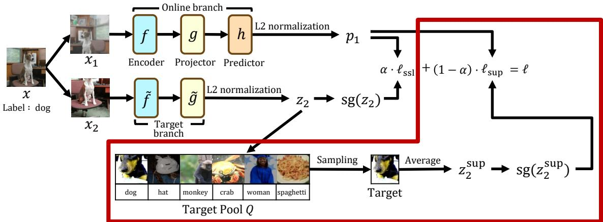
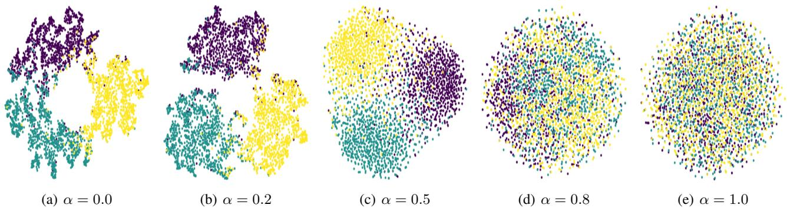
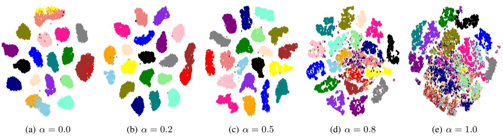

# On the Effectiveness of Supervision in Asymmetric Non-Contrastive Learning

Jeongheon Oh 1 Kibok Lee 1

# Abstract

Supervised contrastive representation learning has been shown to be effective in various transfer learning scenarios. However, while asymmetric non-contrastive learning (ANCL) often outperforms its contrastive learning counterpart in selfsupervised representation learning, the extension of ANCL to supervised scenarios is less explored. To bridge the gap, we study ANCL for supervised representation learning, coined SUPSIAM and SUPBYOL, leveraging labels in ANCL to achieve better representations. The proposed supervised ANCL framework improves representation learning while avoiding collapse. Our analysis reveals that providing supervision to ANCL reduces intraclass variance, and the contribution of supervision should be adjusted to achieve the best performance. Experiments demonstrate the superiority of supervised ANCL across various datasets and tasks. The code is available at: https: //github.com/JH-Oh-23/Sup-ANCL.

on negative samples. To prevent learned representations from collapsing, ANCL employs an asymmetric structure by placing a predictor after one side of the projector.

A key component in both CL and ANCL is acquisition of positive pairs, which is typically achieved through data augmentation. Given that datasets for pretraining often include labels, Khosla et al. (2020) proposed to incorporate supervision into CL by treating samples with the same class label as positive pairs as well. Supervised CL has demonstrated superior performance across diverse tasks, such as few-shot learning (Majumder et al., 2021), long-tail recognition (Kang et al., 2021), continual learning (Cha et al., 2021), and natural language processing (Gunel et al., 2021).

While supervision helps to discover more positive samples, it does not directly help to identify effective negative samples. Consequently, ANCL has a better potential to benefit from supervision, as it focuses on positive pairs only. However, in contrast to CL, there are a limited number of studies on leveraging supervision to improve ANCL, despite its strong performance in self-supervised learning. To bridge this gap, we study the effect of supervision in ANCL by introducing the supervised ANCL framework and investigating its behavior through theoretical and empirical analysis.

# 1. Introduction

Self-supervised learning has recently been proven to be an effective paradigm for representation learning (Chen et al., 2020a; Chen & He, 2021; He et al., 2022). Among various pretext tasks for self-supervised learning, contrastive learning (CL) (van den Oord et al., 2018; Chen et al., 2020a; He et al., 2020) first promised outstanding performance, surpassing the transfer learning performance of supervised pretraining (Razavian et al., 2014), which learns representations by attracting positive pairs while repelling negative pairs. However, CL requires negative samples to ensure good performance, which might not be possible under limited batch sizes. On the other hand, asymmetric non-contrastive learning (ANCL) (Grill et al., 2020; Chen & He, 2021) has emerged as a promising alternative to CL, which maximizes the similarity between positive pairs without relying

To the best of our knowledge, our work is the first to conduct a theoretical analysis of the behavior of representations learned through supervised ANCL. Our experiments confirm the effectiveness of supervision observed through our theoretical analysis, as well as the superiority of representations learned via supervised ANCL across various datasets and tasks. Specifically, as illustrated in Figure 1, we consider SUPSIAM and SUPBYOL, which are supervised adaptations of the two popular ANCL methods, SIMSIAM (Chen & He, 2021) and BYOL (Grill et al., 2020), respectively. Our contributions are summarized as follows:

• We propose a supervised ANCL framework for representation learning while avoiding collapse, which surpasses the performance of its self-supervised counterpart when supervision is available. • Our analysis demonstrates that incorporating supervision into ANCL reduces the intra-class variance of latent features, and that learning to capture both intra- and interclass variance is crucial for representation learning.

  
Figure 1. Our proposed supervised ANCL framework. The components we added to the standard ANCL are highlighted with a red box. We manage a target pool to ensure the existence of positive samples sharing the same class label in the form of $z _ { 2 } ^ { \mathrm { s u p } }$ . Stop-gradient (sg) applied to $z _ { 2 }$ and $z _ { 2 } ^ { \mathrm { s u p } }$ ensures that the gradients propagate through the online branch with the predictor only. The target branch without the predictor either shares parameters with the online branch (SUPSIAM), or exhibits a momentum network (SUPBYOL).

• Our experiments validate our analysis and demonstrate the superiority of representations learned via supervised ANCL across various datasets and tasks.

# 2. Related Works

Supervised CL. Although SUPCON (Khosla et al., 2020) demonstrated remarkable linear probing performance on pretrained datasets, its efficacy on other downstream datasets is comparable or inferior to that of self-supervised methods. In response, subsequent works have been underway to better utilize supervision to enhance representation learning. Wei et al. (2021) proposed to improve CL by taking top- $K$ positive neighbors into account and assigning soft labels to positive samples based on similarity, such that it better reflects task-specific semantic features and task-agnostic appearance features. Wang et al. (2023) argued that naively incorporating supervised signals might conflict with the self-supervised signals. To address this issue, Wang et al. (2023) proposed to impose hierarchical supervisions with an additional projector. Graf et al. (2021) provided both theoretical and empirical evidence demonstrating that the SUPCON loss is minimized when each class collapses to a single point, resulting in poor generalization of learned representations. Chen et al. (2022) found that the SUPCON loss is invariant to class-fixing permutations, indicating that the loss remains unchanged when data points within the same class are arbitrarily permuted in representation space, which also leads to poor generalization of learned representations. Chen et al. (2022) proposed incorporating a weighted class-conditional InfoNCE loss to avoid class collapse, and constraining the encoder, adding a class-conditional autoencoder, and using data augmentation to break permutation invariance. Xue et al. (2023) argued that features learned through supervised CL are prone to class collapse, whereas those learned through self-supervised CL suffer from feature suppression, i.e., easy and class-irrelevant features suppress to learn harder and class-relevant features. They claimed that balancing the losses of supervised and self-supervised CL is crucial for improving the quality of learned representations. Notably, these efforts have concentrated on CL, motivating us to investigate the effect of supervision in ANCL. Although several studies on supervised ANCL exist, such as Asadi et al. (2022) and Maser et al. (2023), their contributions lack a theoretical understanding of the effect of supervision and/or are limited to specific domains.

Theoretical Analysis on ANCL. While the initial ANCL works (Grill et al., 2020; Chen & He, 2021) have demonstrated impressive performance, the learning dynamics that enable effective representation learning without negative pairs while avoiding collapse to trivial solutions remain unclear. Tian et al. (2021) elucidated the dynamics of ANCL through the spectral decomposition of the correlation matrix. Specifically, assuming the predictor is linear, they proved that the eigenspace of the learned predictor aligns with the eigenspace of the correlation matrix of the latent features. Liu et al. (2022) empirically observed that, as learning progresses, both the linear predictor and the correlation matrix of latent features converge to a (scaled) identity matrix in ANCL. Based on this observation, they argued that the asymmetric architecture in ANCL implicitly encourages feature decorrelation, achieving a similar effect to symmetric non-CL methods that explicitly decorrelate features such as Barlow Twins (Zbontar et al., 2021) and VICReg (Bardes et al., 2022). Zhuo et al. (2023) suggested that the predictor in ANCL operates as a low-pass filter, thereby decreasing the rank of the predictor outputs. They argued that the rank difference between the correlation matrix of the projector outputs and that of the predictor outputs mitigates dimensional collapse by gradually increasing the effective rank of them as training progresses. Inspired by the prior works on self-supervised ANCL, we analyze supervised ANCL under a similar framework with additional assumptions. On the other hand, Halvagal et al. (2023) found that prior works overlook the L2 normalization of projector/predictor outputs, which is a common practice in ANCL, before computing the loss. They investigated the learning dynamics by incorporating the L2 normalization and compared it with the case without the L2 normalization. Our work also considers the L2 normalization; however, instead of normalizing the features directly, we consider it as a constraint and employ a Lagrangian formulation.

# 3. Method

In this section, we first review the problem setting of selfsupervised ANCL. Then, we introduce supervised ANCL. The overall framework is illustrated in Figure 1.

# 3.1. Preliminary: Self-Supervised ANCL

Let $f , g$ , and $h$ be the encoder, projector, and predictor of the online branch, respectively, and $\tilde { f }$ and $\tilde { g }$ be the encoder and projector of the target branch, respectively. For a data point $x$ , let $z = ( g \circ f ) ( x )$ and $p = ( h \circ g \circ f ) ( x )$ be the output of the projector and predictor, respectively. In self-supervised ANCL, two views $x _ { 1 }$ and $x _ { 2 }$ are generated from the data $x$ through augmentation, and the model learns to minimize the distance between these views encoded at different levels: it compares the prediction of the first view $p _ { 1 } = ( h \circ g \circ f ) ( x _ { 1 } )$ with the projection of the second view $z _ { 2 } = ( \tilde { g } \circ \tilde { f } ) ( x _ { 2 } )$ . It has been observed that the asymmetric architecture introduced by the predictor $h$ helps prevent representation collapse by predicting the latent feature of the second view $z _ { 2 }$ from that of the first view $z _ { 1 }$ , i.e., $z _ { 2 } \simeq$ $p _ { 1 } = h ( z _ { 1 } )$ (Chen & He, 2021). The self-supervised ANCL loss $\ell _ { \mathrm { s s l } }$ is expressed as:

$$
\ell _ { \mathrm { s s l } } ( p _ { 1 } , z _ { 2 } ) = \| p _ { 1 } - \mathrm { s g } \left( z _ { 2 } \right) \| _ { 2 } ^ { 2 } ,
$$

where sg is the stop-gradient operation and $p _ { 1 }$ and $z _ { 2 }$ are L2- normalized. The inclusion of stop-gradient is also crucial for preventing collapsing, making it an essential component of the loss formulation (Chen & He, 2021).

The target branch can either share parameters with the online branch (Chen & He, 2021), or exhibit a momentum network (Grill et al., 2020). When a momentum network is employed, its parameters follow the exponential moving average (EMA) update rule: $\theta _ { \tilde { g } \circ \tilde { f } }  m \cdot \theta _ { \tilde { g } \circ \tilde { f } } + ( 1 - m ) \cdot \theta _ { g \circ f }$ where $m$ is the momentum, ${ \dot { \theta } } _ { g \circ f }$ is the set of learnable parameters in $f$ and $g$ . The parameters of the target model $\theta _ { \tilde { g } \circ \tilde { f } }$ are initialized to those of the online model $\theta _ { g \circ f }$ .

# 3.2. Supervised ANCL

We propose to enhance supervised ANCL by integrating supervision through an additional loss function: for an anchor $x _ { 1 }$ and its supervised target $x _ { 2 } ^ { \mathrm { { s u p } } }$ sharing the same label $y$ , the loss minimizes the distance between $p _ { 1 } = ( h \circ g \circ f ) ( x _ { 1 } )$ and $z _ { 2 } ^ { \mathrm { s u p } } = ( \tilde { g } \circ \tilde { f } ) ( x _ { 2 } ^ { \mathrm { s u p } } )$ . However, the additional loss may not always be effective, because the current batch might not contain any samples sharing the same label as the anchor, particularly when the batch size is small.

To address this issue, we introduce a target pool to ensure the presence of targets sharing the same label as each anchor in the batch, regardless of batch size. Similar to the memory bank utilized in prior works (Wu et al., 2018), the target pool $Q$ is a queue storing targets $z _ { 2 }$ along with their corresponding labels. The target pool offers another advantage that positive samples from the target pool help mitigate collapse because they are updated more slowly than those sampled from the batch, as empirically observed in Table 8. The proposed target pool is flexible in its design, such that it can be a vanilla queue, a collection of per-class queues ensuring the presence of targets from all labels even when the queue size is small, or a set of learnable class prototypes; the impact of these design choices is investigated in Table 7.

Now, we sample the supervised target $z _ { 2 } ^ { \mathrm { s u p } }$ sharing the same class as the anchor $x$ from the target pool $Q$ . Specifically, we sample $M$ targets and average them to formulate the supervised ANCL loss $\ell _ { \mathrm { s u p } }$ :

$$
\ell _ { \mathrm { s u p } } ( p _ { 1 } , z _ { 2 } ^ { \mathrm { s u p } } ) = \left\| p _ { 1 } - \mathrm { s g } \left( z _ { 2 } ^ { \mathrm { s u p } } \right) \right\| _ { 2 } ^ { 2 } , z _ { 2 } ^ { \mathrm { s u p } } = \frac { 1 } { M } \sum _ { z _ { 2 } ^ { \prime } \in Q _ { y } } z _ { 2 } ^ { \prime } ,
$$

where $p _ { 1 }$ and $z _ { 2 } ^ { \prime }$ are L2-normalized and $Q _ { y } \subseteq Q$ is the set of $M$ targets sampled from $Q$ sharing the same label $y$ as $x$ We sample all positives in $Q$ in experiments, and the effect of $M$ is discussed in Appendix F.2. Finally, the total loss is defined by the convex combination of $\ell _ { \mathrm { s s l } }$ and $\ell _ { \mathrm { s u p } }$ :

$$
\ell ( p _ { 1 } , z _ { 2 } , z _ { 2 } ^ { \operatorname { s u p } } ) = \alpha \cdot \ell _ { \mathrm { s s l } } ( p _ { 1 } , z _ { 2 } ) + ( 1 - \alpha ) \cdot \ell _ { \operatorname { s u p } } ( p _ { 1 } , z _ { 2 } ^ { \operatorname { s u p } } ) ,
$$

where $\alpha \in [ 0 , 1 ]$ adjusts the contribution of $\ell _ { \mathrm { s s l } }$ and $\ell _ { \mathrm { s u p } }$ and we symmetrize the loss in experiments following the convention. We argue that the introduction of $\ell _ { \mathrm { s u p } }$ reduces intra-class variance and $\alpha$ adjusts the amount of reduction, where details can be found in Section 4.3.

Note that our strategy for incorporating supervision into the loss differs from that of SUPCON (Khosla et al., 2020). We first average the supervised loss before combining it with the self-supervised loss, whereas SUPCON weights all persample losses equally, regardless of whether they are selfsupervised or supervised. Since our focus is on analyzing the overall effects of self-supervised and supervised losses rather than per-sample losses, our strategy aligns with the analysis presented in the following section.

# 4. Analysis of the Effect of Supervision

In this section, we analyze the effect of supervision in ANCL. We argue that incorporating supervision into ANCL reduces intra-class variance, and that its contribution should be adjusted to achieve better representations. Detailed mathematical proofs are provided in Appendix A.

# 4.1. Problem Setup

For simplicity in our analysis, we adopt several assumptions from Tian et al. (2021); Zhuo et al. (2023):

Assumption 4.1. The encoder followed by the projector $g \circ f$ and the predictor $h$ are linear: $z = ( g \circ f ) ( x ) = W x$ and $p = h ( z ) = W _ { p } z$ , where $W _ { p }$ is a symmetric matrix.

Assumption 4.2. The distribution of the data augmentation $P ( { \tilde { X } } | { \tilde { X } } )$ has a mean $X$ and a covariance matrix $\sigma _ { e } ^ { 2 } I$ .

While previous studies on self-supervised ANCL assume that the distribution of the input data has a zero mean and a scaled identity covariance matrix, class-conditional distributions should be considered when incorporating supervision. Specifically, we assume the class-conditional and class-prior distributions over $C$ classes as follows:

Assumption 4.3. The class-prior distribution follows the uniform distribution: $P ( Y = y ) = 1 / C$ .

Assumption 4.4. For an input data $X$ and its class $Y$ , the conditional distribution $P ( X | Y )$ is characterized by a mean $\mu _ { y }$ and a covariance matrix $\Sigma _ { y }$ , where the total mean and total covariance matrix are zero and the identity matrix, respectively: $\textstyle \sum _ { y } \mu _ { y } = 0$ and $\begin{array} { r } { S _ { T } = \frac { 1 } { C } \sum _ { y } \left( \mu _ { y } \mu _ { y } ^ { \dagger } + \Sigma _ { y } \right) = \bar { I } } \end{array}$ .

Assumption 4.3 is made for simplicity of analysis; our analysis holds without this assumption, albeit the derivation becomes more complex. Assumption 4.4 can be naturally satisfied through data whitening.

# 4.2. Supervision Reduces Intra-Class Variance

For simplicity, assume we sample one target from the pool, i.e., $M \ = \ 1$ . We first express the loss in Eq. (3) with constraints to ensure the L2 normalization of features:

$$
\begin{array} { r l r } & { \ell = \alpha \left\| { W _ { p } z _ { 1 } - z _ { 2 } } \right\| _ { 2 } ^ { 2 } + ( 1 - \alpha ) \left\| { W _ { p } z _ { 1 } - z _ { 2 } ^ { \operatorname* { s u p } } } \right\| _ { 2 } ^ { 2 } } & \\ & { = \left\| { W _ { p } z _ { 1 } - \left( \alpha \cdot z _ { 2 } + ( 1 - \alpha ) \cdot z _ { 2 } ^ { \operatorname* { s u p } } \right) } \right\| _ { 2 } ^ { 2 } + \mathrm { c o n s t } } & \\ & { \mathrm { s . t . } \left\| { z _ { 2 } } \right\| _ { 2 } ^ { 2 } = \left\| { z _ { 2 } ^ { \operatorname* { s u p } } } \right\| _ { 2 } ^ { 2 } = \left\| { W _ { p } z _ { 1 } } \right\| _ { 2 } ^ { 2 } = 1 , } & \end{array}
$$

where we omit stop-gradient applied to $z _ { 2 }$ and $z _ { 2 } ^ { \mathrm { s u p } }$ for brevity, and the equality in the second line holds due to the linearity of the L2 loss between L2-normalized features with respect to the target (Lee et al., 2021b). Hence, this optimization can be interpreted as mapping one view $z _ { 1 }$ to an interpolated target between another view $z _ { 2 }$ and the supervised target $z _ { 2 } ^ { \mathrm { s u p } }$ . Intuitively, when $\alpha = 1$ , the model cannot determine the exact augmentation applied to $x _ { 2 }$ by observing $x _ { 1 }$ , such that it predicts $z _ { 2 }$ from $z _ { 1 }$ through low-rank approximation via principal component analysis (PCA) (Richemond et al., 2023). Similarly, when $\alpha = 0$ the model cannot infer the exact supervised target zsu2 by observing z1; instead, it predicts zsu2 by mapping $z _ { 1 }$ to the class centroid. Here, it has been known that least squares with targets independent of each other (ignoring centering, if applied) is equivalent to linear discriminant analysis (LDA) (Lee & Kim, 2015), where LDA simultaneously maximizes between-class scatter and minimizes within-class scatter. Hence, we can hypothesize that incorporating supervision into ANCL reduces intra-class variance, and the degree of reduction is controlled by $\alpha$ .

To prove that incorporating supervision into ANCL reduces intra-class variance, we establish the following: 1) the optimal predictor $W _ { p } ^ { * }$ generates features of data with reduced intra-class variance by a factor of $\alpha$ , and 2) the optimal $W _ { p }$ and $W$ share the same eigenspace, thereby $W$ learns to reduce intra-class variance of features.

First, we formulate the Lagrangian function of Eq. (4) and take the expectation over $x _ { 1 } , x _ { 2 }$ , and $x _ { 2 } ^ { \mathrm { { s u p } } }$ :

$$
\begin{array} { r l r } {  { \mathcal { L } = 2 - 2 \alpha \cdot \mathrm { t r } \big ( W _ { p } ^ { \top } \mathbb { E } [ z _ { 2 } z _ { 1 } ^ { \top } ] \big ) - 2 \big ( 1 - \alpha \big ) \cdot \mathrm { t r } \big ( W _ { p } ^ { \top } \mathbb { E } [ z _ { 2 } ^ { \operatorname* { s u p } } z _ { 1 } ^ { \top } ] \big ) } } \\ & { } & { + \lambda _ { 1 } ( \mathrm { t r } ( \mathbb { E } [ z _ { 2 } z _ { 2 } ^ { \top } ] ) - 1 ) + \lambda _ { 2 } ( \mathrm { t r } ( \mathbb { E } [ z _ { 2 } ^ { \operatorname* { s u p } } z _ { 2 } ^ { \operatorname* { s u p } \top } ] ) - 1 ) } \\ & { } & { + \lambda _ { 3 } ( \mathrm { t r } ( W _ { p } ^ { \top } W _ { p } \mathbb { E } [ z _ { 1 } z _ { 1 } ^ { \top } ] ) - 1 ) , \qquad ( 5 ) } \end{array}
$$

where $\lambda _ { 1 } , \lambda _ { 2 }$ , and $\lambda _ { 3 }$ are the Lagrange multipliers. Note that $x$ and $x ^ { \mathrm { s u p } }$ are independently sampled from the conditional distribution $P ( X | Y = y )$ , $x _ { 1 }$ and $x _ { 2 }$ are independently sampled from $P ( \widetilde { X } | X \ = \ x )$ , and $x _ { 2 } ^ { \mathrm { { s u p } } }$ is sampled from $P ( \widetilde X | X = x ^ { \mathrm { s u p } } )$ .

Proposition 4.5. The covariance matrices of features $\mathbb { E } \left[ \bar { z _ { 1 } } z _ { 1 } ^ { \top } \right] , \mathbb { E } \left[ z _ { 2 } z _ { 1 } ^ { \top } \right]$ , and $\mathbb { E } \left[ z _ { 2 } ^ { \mathrm { s u p } } z _ { 1 } ^ { \top } \right]$ share the same eigenspace in the data space.

Proof. From Assumptions 4.1 to 4.4,

$$
\begin{array} { r l } & { \mathbb { E } \left[ z _ { 1 } z _ { 1 } ^ { \top } \right] = W \left( S _ { B } + S _ { W } + S _ { e } \right) W ^ { \top } , } \\ & { \mathbb { E } \left[ z _ { 2 } z _ { 1 } ^ { \top } \right] = W \left( S _ { B } + S _ { W } \right) W ^ { \top } = W W ^ { \top } , } \\ & { \mathbb { E } \left[ z _ { 2 } ^ { \operatorname* { s u p } } z _ { 1 } ^ { \top } \right] = W S _ { B } W ^ { \top } , } \end{array}
$$

where $\begin{array} { r } { S _ { B } \ = \ \frac 1 C \sum _ { y } \mu _ { y } \mu _ { y } ^ { \top } } \end{array}$ is the inter-class covariance, $\begin{array} { r } { S _ { W } = \frac { 1 } { C } \sum _ { y } \sum _ { y } } \end{array}$ is the intra-class covariance, and $S _ { e } =$ $\sigma _ { e } ^ { 2 } I$ is the variance of the augmentation noise. Let $S _ { B } =$ $V \Lambda _ { B } V ^ { \top }$ be the eigendecomposition, where $V$ is an orthogonal matrix and $\Lambda _ { B }$ is a diagonal matrix of the eigenvalues. Then, $S _ { T } = S _ { B } + S _ { W }$ and $S _ { e }$ share the same eigenspace with $S _ { B }$ , as they are (scaled) identity matrices.

$$
\begin{array} { r l } & { \mathbb { E } \left[ z _ { 1 } z _ { 1 } ^ { \top } \right] = W V \left( \Lambda _ { B } + \Lambda _ { W } + \sigma _ { e } ^ { 2 } I \right) V ^ { \top } W ^ { \top } , } \\ & { \mathbb { E } \left[ z _ { 2 } z _ { 1 } ^ { \top } \right] = W V \left( \Lambda _ { B } + \Lambda _ { W } \right) V ^ { \top } W ^ { \top } , } \\ & { \mathbb { E } \left[ z _ { 2 } ^ { \operatorname* { s u p } } z _ { 1 } ^ { \top } \right] = W V \Lambda _ { B } V ^ { \top } W ^ { \top } , } \end{array}
$$

where $\Lambda _ { W } = I - \Lambda _ { B }$ is the eigenvalue matrix of $S _ { W }$ . It can be seen that the covariance matrices of features in Eq. (7) share the same eigenspace in the data space.

Then, we apply the expressions in Proposition 4.5 to the optimal predictor $W _ { p } ^ { * }$ obtained from Eq. (5):

Theorem 4.6. For an arbitrary $W$ , the optimal predictor $W _ { p } ^ { * }$ that minimizes the loss in Eq. (5) is given by

$$
W _ { p } ^ { * } = \frac { 1 } { \lambda _ { 3 } } W V \big ( \Lambda _ { B } + \alpha \Lambda _ { W } \big ) \big ( \Lambda _ { B } + \Lambda _ { W } + \sigma _ { e } ^ { 2 } I \big ) ^ { - 1 } V ^ { \top } W ^ { + } ,
$$

where $W ^ { + }$ is the Moore-Penrose inverse (Penrose, 1955).

From Theorem 4.6, the optimal predictor $W _ { p } ^ { * }$ can be interpreted through a sequence of hypothetical transformations: 1) mapping features to the data space, 2) eliminating the augmentation noise and reducing the intra-class variance by a factor of $\alpha$ , and 3) mapping back to the feature space.

Next, we show that $W _ { p } ^ { * }$ and $W ^ { * }$ share the same eigenspace.

Theorem 4.7. The optimal predictor $W _ { p } ^ { * }$ and the optimal model $W ^ { * }$ that minimizes the loss in Eq. (5) satisfy

$$
\begin{array} { r } { W _ { p } ^ { * \top } W _ { p } ^ { * } \approx W ^ { * } W ^ { * \top } . } \end{array}
$$

Note that Theorem 4.7 holds in self-supervised ANCL as shown in Tian et al. (2021); Liu et al. (2022), and it remains valid when supervision is incorporated.

Finally, we conclude that $W ^ { * }$ learns to reduce intra-class variance, as $W _ { p } ^ { * }$ generates features of data with reduced intra-class variance by a factor of $\alpha$ from Theorem 4.6, and $W ^ { * }$ imitates this behavior according to Theorem 4.7.

# 4.3. Effect of Reducing Intra-Class Variance

In the proposed supervised ANCL loss in Eq. (3), the coefficient $\alpha$ adjusts the contribution of supervision: decreasing $\alpha$ results in increasing this contribution, thereby reducing intra-class variance, as proved in Section 4.2. Ideally, when intra-class variance is too small, all data within each class converge to a single point, leading to class collapse: data within each class become indistinguishable (Papyan et al., 2020). Thus, we argue that balancing the contributions of supervision and self-supervision is crucial to achieve semantically aligned yet well-distributed representations in supervised ANCL, leading to the generalization of learned representations; intuitively, the ideal semantic latent space should retain intra-class variance to distinguish data instances.

Table 1. SUPSIAM results with different $\alpha$ on the toy dataset and ImageNet-100 in several metrics: the self-supervised loss in Eq. (1), the supervised loss in Eq. (2), the intra-class variance, the relative intra-class variance $( \% )$ , and the accuracy of $k$ -NN and linear probing $( \% )$ . For the accuracies, the best results are highlighted in bold and the second-best results are underlined.

<table><tr><td>α</td><td>(lss, lsup)</td><td>Sw</td><td>Sw / ST</td><td>k-NN</td><td>Linear</td></tr><tr><td>Toy dataset</td><td></td><td></td><td></td><td></td><td></td></tr><tr><td>0.0</td><td>(-0.7115, -0.4212)</td><td>0.338</td><td>33.94</td><td>60.51</td><td>60.78</td></tr><tr><td>0.2</td><td>(-0.7423, -0.4140)</td><td>0.363</td><td>36.36</td><td>61.35</td><td>61.58</td></tr><tr><td>0.5</td><td>(-0.8116, -0.1654)</td><td>0.799</td><td>79.97</td><td>61.18</td><td>61.89</td></tr><tr><td>0.8</td><td>(-0.8473, -0.0231)</td><td>0.971</td><td>97.14</td><td>55.93</td><td>61.18</td></tr><tr><td>1.0</td><td>(-0.8519, -0.0024)</td><td>0.997</td><td>99.70</td><td>38.02</td><td>45.91</td></tr><tr><td>ImageNet-100</td><td colspan="5"></td></tr><tr><td>0.0</td><td>(-0.9048, -0.8932)</td><td>0.070</td><td>7.01</td><td>80.79</td><td>85.92</td></tr><tr><td>0.2</td><td>(-0.9231, -0.9096)</td><td>0.057</td><td>5.72</td><td>82.72</td><td>86.85</td></tr><tr><td>0.5</td><td>(-0.9321, -0.8823)</td><td>0.108</td><td>10.79</td><td>82.89</td><td>87.31</td></tr><tr><td>0.8</td><td>(-0.9349, -0.5118)</td><td>0.515</td><td>51.58</td><td>80.19</td><td>86.65</td></tr><tr><td>1.0</td><td>(-0.9290, -0.2341)</td><td>0.743</td><td>74.53</td><td>75.23</td><td>82.15</td></tr></table>

To verify our claim, we conduct an experiment on a synthetic toy dataset with three classes, each following a Gaussian distribution by training SUPSIAM models with varying $\alpha$ The details of the toy dataset and SUPSIAM models are described in Appendix B. After training, we compare the selfsupervised and supervised training losses $\ell _ { \mathrm { s s l } }$ and $\ell _ { \mathrm { s u p } }$ ), the absolute and relative intra-class variance of latent features ( $\widetilde { S } _ { W }$ and $\widetilde { S } _ { W } / \widetilde { S } _ { T } )$ , and the accuracy of $k$ -nearest neighbors ( $k$ -NN) and linear probing (Linear) in Table 1. Here, $\widetilde { S } _ { W }$ and $\widetilde { S } _ { T }$ represent the empirical intra-class variance and the total variance, respectively:

$$
\widetilde { S } _ { W } = \mathbb { E } _ { y , z } \left[ \Vert z - \tilde { \mu } _ { y } \Vert _ { 2 } ^ { 2 } \right] , \widetilde { S } _ { T } = \mathbb { E } _ { z } \left[ \Vert z - \tilde { \mu } \Vert _ { 2 } ^ { 2 } \right] ,
$$

where $\tilde { \mu } _ { y }$ is the $y$ -th class mean and $\tilde { \mu }$ is the total mean of features, and the expectation is taken over training dataset.

In Table 1, $\ell _ { \mathrm { s s l } }$ decreases while $\ell _ { \mathrm { s u p } }$ increases as $\alpha$ increases, which confirms that the contribution of each loss is adjusted as expected. Additionally, the intra-class variance is proportional to $\alpha$ , as proved in Section 4.2. However, the accuracy of $k$ -NN and linear probing exhibits different trends, with the best accuracy achieved when $\alpha$ is between 0 and 1. This supports our claim that while incorporating supervision into ANCL aids in learning semantically aligned representations, excessively reducing intra-class variance may hinder the generalization of learned representations, resulting in diminishing performance on unseen test data.

Figure 2 visualizes the feature space via t-SNE (Maaten & Hinton, 2008). When $\alpha = 0 . 5$ , the class distributions are well-separated while retaining intra-class variance. Decreasing $\alpha$ results in more densely clustered results by skewing the feature space, which might be detrimental to generalization; e.g., the model is overconfident in its predictions for downstream classification tasks. Conversely, increasing $\alpha$ leads to mixed class distributions, impairing classification.

  
Figure 2. t-SNE visualization of SUPSIAM features with different $\alpha$ on the toy dataset.

Table 2. Transfer learning results on toy downstream datasets with different means and varying scale of covariance $\sigma$ , with SUPSIAMpretraining on the toy dataset. For each scenario, the best results are in bold and the second-best results are underlined.   

<table><tr><td rowspan="3">α</td><td colspan="3">Interpolation</td><td colspan="3">Extrapolation</td></tr><tr><td>σ = 0.2</td><td>σ = 0.5</td><td>σ = 0.8</td><td>σ = 0.2</td><td>σ = 0.5</td><td>σ = 0.8</td></tr><tr><td>0.0</td><td>43.60</td><td>37.44</td><td>35.40</td><td>96.67</td><td>83.76</td><td>74.42</td></tr><tr><td>0.2</td><td>44.02</td><td>37.24</td><td>35.31</td><td>97.13</td><td>84.71</td><td>75.09</td></tr><tr><td>0.5</td><td>44.25</td><td>37.96</td><td>35.69</td><td>97.60</td><td>85.87</td><td>76.00</td></tr><tr><td>0.8</td><td>44.24</td><td>37.65</td><td>35.98</td><td>97.07</td><td>83.69</td><td>73.73</td></tr><tr><td>1.0</td><td>40.40</td><td>36.60</td><td>35.67</td><td>75.84</td><td>59.67</td><td>53.00</td></tr></table>

To assess the transferability of learned representations, we conduct transfer learning scenarios in Table 2. Specifically, we consider three downstream classes, where their means are either interpolated or extrapolated from the pretraining classes, and the scale of the covariance matrix of downstream classes is adjusted by $\sigma$ to control the difficulty of downstream tasks. As shown in Table 2, supervised ANCL consistently outperforms self-supervised ANCL $( \alpha = 1$ ) across all scenarios, highlighting the effectiveness of incorporating supervision into ANCL. Moreover, the best performance is achieved when $0 < \alpha < 1$ , suggesting that balancing the contributions of supervision and self-supervision is crucial, i.e., excessively reducing intra-class variance is detrimental to representation learning.

Next, to confirm the scalability of our observations to real-world scenarios, we conduct a similar experiment on ImageNet-100 (Deng et al., 2009; Tian et al., 2020) by replacing the encoder with ResNet-50 (He et al., 2016) and the projector and predictor with MLPs, respectively. As shown in the bottom of Table 1, the observations remain mostly consistent; although both supervised loss and intra-class variance slightly decrease when $\alpha$ increases from 0.0 to 0.2, we conjecture that this is due to the non-linearity of the optimization. These results further support our claim that balancing the contributions of supervision and self-supervision is crucial for the generalization of representations learned via supervised ANCL.

Table 3. Transfer learning results on fine-grained classification datasets, where the model is SUPSIAM-pretrained with different $\alpha$ on ImageNet-100. For each dataset, the best results are in bold and the second-best results are underlined.   

<table><tr><td>α</td><td>CUB200</td><td>Dogs</td><td>Pets</td></tr><tr><td>0.0</td><td>41.46</td><td>61.51</td><td>80.09</td></tr><tr><td>0.2</td><td>42.07</td><td>64.28</td><td>82.27</td></tr><tr><td>0.5</td><td>43.48</td><td>64.65</td><td>82.38</td></tr><tr><td>0.8</td><td>42.16</td><td>62.94</td><td>81.76</td></tr><tr><td>1.0</td><td>36.10</td><td>54.57</td><td>75.13</td></tr></table>

Similar to the toy experiments, we evaluate the transferability of learned representations in real-world scenarios by conducting transfer learning experiments. Specifically, we apply linear probing to the SUPSIAM-pretrained models on downstream datasets for fine-grained classification tasks, including CUB-200-2011 (Welinder et al., 2010), Stanford Dogs (Khosla et al., 2011), and Oxford-IIIT Pets (Parkhi et al., 2012). As shown in Table 3, the transfer learning performance exhibits trends similar to those in Table 1: incorporating supervision into ANCL is beneficial, and balancing the contributions of supervision and self-supervision improves the generalization of representations.

To further elucidate the effect of $\alpha$ in real-world scenarios, we present t-SNE visualizations of latent features from 20 classes, consisting of 15 dogs and 5 birds, subsampled from ImageNet-100. As shown in Figure 3, classes overlap when no supervision is provided, i.e., when $\alpha = 1$ , and the latent features form more compact clusters as $\alpha$ decreases. Notably, some dog classes (e.g., “Doberman” and “Rottweiler”) overlap when $\alpha$ is small, around 0.0 and 0.2, while they are well-separated when $\alpha = 0 . 5$ . This implies that excessively reducing intra-class variance with small $\alpha$ might result in collapsing fine-grained classes, which could be detrimental to downstream tasks.

  
Figure 3. t-SNE visualization of SUPSIAM features with different $\alpha$ on $1 5 \mathrm { d o g }$ and 5 bird classes from ImageNet-100.

# 5. Experiment

In this section, we provide experimental results across various datasets and tasks to demonstrate the effectiveness of supervision in ANCL. We also compare CL methods to confirm that ANCL performance is competitive to CL. Detailed experimental settings are provided in Appendix C.

# 5.1. Pretraining

We consider two ANCL methods, SIMSIAM (Chen & He, 2021) and BYOL (Grill et al., 2020), as our baselines, along with their supervised variations, SUPSIAM and SUPBYOL, as our proposed methods. Additionally, we compare two CL methods, SIMCLR (Chen et al., 2020a) and MOCOV2 (Chen et al., 2020b), and their supervised variations, SUPCON (Khosla et al., 2020) and SUPMOCO (Majumder et al., 2021). Each model consists of a ResNet-50 encoder (He et al., 2016) followed by a 2-layer MLP projector and predictor, except for SIMSIAM and SUPSIAM, which utilize a 3-layer MLP projector following the original configuration by Chen & He (2021). We pretrain models on ImageNet100 (Deng et al., 2009; Tian et al., 2020) for 200 epochs with a batch size of 128. For data augmentation, we apply random crop, random horizontal flip, color jitter, random grayscale, and Gaussian blur, following Chen et al. (2020a). For methods utilizing the target pool, we set the size of the target pool $| Q |$ to 8192 and obtain the supervised target $z _ { 2 } ^ { \mathrm { s u p } }$ by sampling and averaging all positives in the target $\mathrm { p o o l } ^ { 1 }$ unless otherwise stated. The coefficient $\alpha$ adjusting the contribution of the self-supervised and supervised loss is 0.5, unless otherwise stated. We repeat all experiments with three pretrained models with different random seeds and report the average performance.

# 5.2. Linear Evaluation

We evaluate the quality of representations on the pretrained distribution through a comparison of linear probing performance on ImageNet-100. Specifically, we take the pretrained and frozen backbone, and train a linear classifier on top of it, following the common protocol in prior works (Chen et al., 2020a;b; Grill et al., 2020; Chen & He, 2021).

Table 4. Top-1 linear probing accuracy on ImageNet-100 and transfer learning performance on VOC object detection. The best results are in bold and the second-best results are underlined. Our proposed methods are marked with $^ \dagger$ .   

<table><tr><td>Dataset</td><td>ImageNet-100</td><td colspan="2">VOC</td></tr><tr><td>Method</td><td>Top-1</td><td>AP</td><td>AP50</td></tr><tr><td>SimCLR SUPCON</td><td>77.35 87.40</td><td>52.06 ± 0.31 52.53 ± 0.47</td><td>78.70 ± 0.16 79.44 ± 0.21</td></tr><tr><td>MoCo-v2 SUPMoCo</td><td>78.37 86.33</td><td>52.68 ± 0.04 52.67 ± 0.04</td><td>79.08 ± 0.24 79.52 ± 0.15</td></tr><tr><td>SimSiam SUPSIAM†</td><td>82.15 87.31</td><td>53.56 ± 0.10 53.89 ± 0.26</td><td>79.82 ± 0.10 80.28 ± 0.06</td></tr><tr><td>BYOL SUPByOLt</td><td>84.93 87.43</td><td>53.54 ± 0.04 53.69 ± 0.24</td><td>79.57 ± 0.01 80.26 ± 0.17</td></tr></table>

As shown in Table 4, incorporating supervision into ANCL enhances linear probing performance on the pretraining dataset. This suggests that representations learned with supervision more effectively encode the semantic information of the pretrained data distribution.

# 5.3. Object Detection

To assess the generalizability beyond classification tasks, we evaluate pretraining methods on an object detection task. Following He et al. (2020), we initialize Faster R-CNN (Ren et al., 2015) with each pretrained model and fine-tune it on the $\mathrm { v o c } 0 7 { + } 1 2$ training dataset (Everingham et al., 2010). We measure performance using the COCO evaluation metrics (Lin et al., 2014) on the VOC07 test dataset.

As shown on the right side of Table 4, incorporating supervision into ANCL improves object detection performance, resulting in the best overall performance. In contrast, the performance gain from supervision in CL is marginal or often detrimental, which aligns with the findings from prior works (Khosla et al., 2020). This suggests that supervised ANCL yields more generalizable representations, with the potential to achieve superior performance across various downstream tasks.

Table 5. Transfer learning via linear evaluation results on various downstream datasets, where models are pretrained on ImageNet-100. CL, Sup., EMA stand for the cases when negative samples are considered, labels are used for pretraining, and the momentum network is adopted, respectively. Avg. Rank represents the average performance ranking across all datasets. For each dataset, the best results are in bold and the second-best results are underlined. Our proposed methods are marked with $\dagger$ .   

<table><tr><td>Method</td><td>CL</td><td>Sup</td><td>EMA</td><td>Avg.Rank</td><td>CIFAR10</td><td>CIFAR100</td><td>DTD</td><td>Food</td><td>MIT67</td><td>SUN397</td><td>Caltech</td><td>CUB200</td><td>Dogs</td><td>Flowers</td><td>Pets</td></tr><tr><td>SImCLR</td><td>\</td><td></td><td></td><td>7.00</td><td>84.69</td><td>62.86</td><td>64.18</td><td>60.91</td><td>61.81</td><td>47.10</td><td>77.89</td><td>28.76</td><td>44.33</td><td>84.30</td><td>65.10</td></tr><tr><td>SUPCoN</td><td></td><td>✓</td><td></td><td>4.73</td><td>88.82</td><td>68.89</td><td>65.18</td><td>59.34</td><td>63.76</td><td>50.09</td><td>87.30</td><td>35.84</td><td>61.68</td><td>89.05</td><td>80.12</td></tr><tr><td>MoCo-v2</td><td>✓</td><td></td><td>✓</td><td>7.82</td><td>83.43</td><td>61.54</td><td>61.81</td><td>57.36</td><td>59.55</td><td>45.07</td><td>77.26</td><td>27.79</td><td>46.67</td><td>82.35</td><td>68.52</td></tr><tr><td>SUPMoCo</td><td>✓</td><td>✓</td><td>✓</td><td>4.09</td><td>89.05</td><td>69.29</td><td>65.44</td><td>59.04</td><td>63.46</td><td>50.05</td><td>87.54</td><td>37.75</td><td>62.80</td><td>89.69</td><td>80.81</td></tr><tr><td>SimSiam</td><td></td><td></td><td></td><td>4.91</td><td>87.28</td><td>66.41</td><td>66.06</td><td>63.44</td><td>64.68</td><td>50.69</td><td>85.00</td><td>36.10</td><td>54.57</td><td>88.38</td><td>75.13</td></tr><tr><td>SPSIAMt</td><td></td><td>✓</td><td></td><td>2.27</td><td>89.95</td><td>70.88</td><td>66.51</td><td>61.46</td><td>64.45</td><td>51.50</td><td>88.86</td><td>43.48</td><td>64.65</td><td>90.27</td><td>82.38</td></tr><tr><td>BYOL</td><td></td><td></td><td></td><td>3.82</td><td>88.26</td><td>68.08</td><td>67.52</td><td>64.63</td><td>65.70</td><td>51.21</td><td>85.85</td><td>37.10</td><td>57.80</td><td>88.14</td><td>78.78</td></tr><tr><td>SUPBYOL</td><td></td><td>✓</td><td>;</td><td>1.36</td><td>90.85</td><td>72.04</td><td>67.38</td><td>64.58</td><td>66.64</td><td>52.95</td><td>88.79</td><td>43.24</td><td>65.02</td><td>91.09</td><td>82.68</td></tr></table>

# 5.4. Transfer Learning via Linear Evaluation

For transfer learning, we evaluate the top-1 accuracy across 11 downstream datasets: CIFAR10/CIFAR100 (Krizhevsky & Hinton, 2009), DTD (Cimpoi et al., 2014), Food (Bossard et al., 2014), MIT67 (Quattoni & Torralba, 2009), SUN397 (Xiao et al., 2010), Caltech101 (Fei-Fei et al., 2004), CUB200 (Welinder et al., 2010), Dogs (Khosla et al., 2011; Deng et al., 2009), Flowers (Nilsback & Zisserman, 2008), and Pets (Parkhi et al., 2012), where detailed information is described in Appendix D. For evaluation, we follow the linear probing protocol for transfer learning in prior works (Kornblith et al., 2019; Lee et al., 2021a).

As shown in Table 5, incorporating supervision improves performance across all pretraining methods. Among them, supervised ANCL methods achieve the best performance: SUPBYOL and SUPSIAM outperform others on 9 out of 11 datasets, demonstrating the superiority of supervised ANCL. Between supervised ANCL methods, SUPBYOL exhibits better performance than SUPSIAM in terms of the average rank, which might be due to the effect of momentum network. Notably, while the performance gain from incorporating supervision into ANCL is relatively small compared to CL because the self-supervised versions of ANCL already exhibit strong performance, we observe a significant improvement on fine-grained datasets, such as CUB200, Dogs, and Pets. This suggests that learning semantically aligned representations while retaining intra-class variance in ANCL is crucial for recognizing fine-grained information.

# 5.5. Few-Shot Classification

To assess the generalizability of learned representations under limited conditions, we conduct transfer learning experiments on few-shot classification tasks following the linear probing protocol for few-shot learning in Lee et al. (2021a). We evaluate the accuracy of 5-way 1-shot and 5-way 5-shot scenarios over 2000 episodes across 8 downstream datasets: Aircraft (Maji et al., 2013), CUB200 (Welinder et al., 2010), FC100 (Oreshkin et al., 2018), Flowers (Nilsback & Zisserman, 2008), Fungi (Schroeder & Cui, 2018), Omniglot (Lake et al., 2015), DTD (Cimpoi et al., 2014), and Traffic Signs (Houben et al., 2013). Table 6 shows a similar trend to other experiments that incorporating supervision improves both CL and ANCL, while supervised ANCL achieves the best performance in most cases.

# 5.6. Ablation Study on Target Pool Design

In this section, we investigate the design choices for the target pool. In our experiments, the pretraining dataset ImageNet-100 consists of 100 classes, such that the probability of missing any class in the target pool is negligible with a target pool size of 8192. However, with a larger number of classes, some classes might not exist in the target pool if it is updated in a class-agnostic manner. To address this concern, we consider two alternative target pool designs: 1) managing class-wise queues as the target pool, and 2) maintaining learnable class prototypes using the EMA update rule. Additionally, we adjust the size of the class-wise queues to determine the optimal number of latent features required to ensure good performance.

As shown in Table 7, performance remains consistent regardless of the target pool design. For the class-wise queues, increasing the number of features stored per class slightly enhances performance, with the best performance observed at 20 features per class, though the gain is overall marginal. In all designs, the size of the target pool grows proportionally to the number of classes and/or the feature dimension, which is equivalent to a linear classifier, such that its memory consumption is negligible; e.g., the linear classifier takes only $2 \%$ of the parameters in ResNet-50. Nonetheless, a more sophisticated design of the target pool might be effective, which we leave for future works.

Table 6. Few-shot classification accuracy averaged over 2000 episodes on various datasets, where models are pretrained on ImageNet-100. CL, Sup, EMA stand for the cases when negative samples are considered, labels are used for pretraining, and the momentum network is adopted, respectively. Avg.Rank represents the average performance ranking across all datasets. For each dataset, the best results are in bold and the second-best results are underlined. Our proposed methods are marked with $\dagger$ .

<table><tr><td>Method</td><td>CL</td><td>Sup</td><td>EMA</td><td>Avg.Rank</td><td>Aircraft</td><td>CUB200</td><td>FC100</td><td>Flowers</td><td>Fungi</td><td>Omniglot</td><td>DTD</td><td>Traffic Signs</td></tr><tr><td>5-way 1-shot</td><td></td><td></td><td></td><td></td><td></td><td></td><td></td><td></td><td></td><td></td><td></td><td></td></tr><tr><td>SimCLR</td><td></td><td></td><td></td><td>7.25</td><td>29.22 ± 0.34</td><td>40.61 ± 0.43</td><td>35.53 ± 0.37</td><td>68.26 ± 0.50</td><td>42.44 ± 0.44</td><td>70.46 ± 0.54</td><td>55.43 ± 0.45</td><td>48.33 ± 0.43</td></tr><tr><td>SUPCoN</td><td>;</td><td>✓</td><td></td><td>3.63</td><td>31.44 ± 0.35</td><td>48.75 ± 0.49</td><td>45.32 ± 0.41</td><td>77.99 ± 0.44</td><td>47.42 ± 0.45</td><td>80.66 ± 0.45</td><td>57.57 ± 0.47</td><td>68.66 ± 0.47</td></tr><tr><td>MoCo-v2</td><td>✓</td><td></td><td>✓</td><td>7.38</td><td>25.54 ± 0.28</td><td>41.24 ± 0.46</td><td>36.73 ± 0.36</td><td>66.48 ± 0.50</td><td>41.84 ± 0.44</td><td>71.12 ± 0.51</td><td>54.75 ± 0.46</td><td>51.05 ± 0.43</td></tr><tr><td>SUPMoCo</td><td>✓</td><td>✓</td><td>✓</td><td>3.25</td><td>31.12 ± 0.35</td><td>49.04 ± 0.49</td><td>44.13 ± 0.41</td><td>78.90 ± 0.43</td><td>47.12 ± 0.45</td><td>83.43 ± 0.42</td><td>56.62 ± 0.46</td><td>71.17 ± 0.47</td></tr><tr><td>SimSiam</td><td></td><td></td><td></td><td>5.00</td><td>30.67 ± 0.35</td><td>45.06 ± 0.47</td><td>41.51 ± 0.40</td><td>75.68 ± 0.47</td><td>45.22 ± 0.46</td><td>74.64 ± 0.50</td><td>58.28 ± 0.47</td><td>60.03 ± 0.45</td></tr><tr><td>SUPSiaM†</td><td></td><td>✓</td><td></td><td>1.88</td><td>33.12 ± 0.37</td><td>49.58 ± 0.49</td><td>45.56 ± 0.41</td><td>78.12 ± 0.44</td><td>47.74±0.46</td><td>84.02 ± 0.41</td><td>58.06 ± 0.48</td><td>71.00 ± 0.48</td></tr><tr><td>BYOL</td><td></td><td></td><td>;</td><td>5.63</td><td>26.38 ± 0.30</td><td>46.45 ± 0.49</td><td>40.92 ± 0.40</td><td>74.27 ± 0.47</td><td>45.96 ± 0.46</td><td>68.13 ± 0.52</td><td>59.75 ± 0.48</td><td>57.44 ± 0.46</td></tr><tr><td>SUPBYOLt</td><td></td><td>✓</td><td></td><td>2.00</td><td>32.66 ± 0.37</td><td>49.26 ± 0.48</td><td>45.28 ± 0.41</td><td>78.94 ± 0.43</td><td>47.81 ± 0.46</td><td>82.62 ± 0.44</td><td>59.98 ± 0.48</td><td>70.34 ± 0.48</td></tr><tr><td>5-way 5-shot</td><td></td><td></td><td></td><td></td><td></td><td></td><td></td><td></td><td></td><td></td><td></td><td></td></tr><tr><td>SiMCLR</td><td>✓</td><td></td><td></td><td>7.13</td><td>39.21 ± 0.44</td><td>54.33 ± 0.45</td><td>50.96 ± 0.37</td><td>86.98 ± 0.30</td><td>59.40 ± 0.47</td><td>86.72 ± 0.35</td><td>73.95 ± 0.36</td><td>69.27 ± 0.40</td></tr><tr><td>SUPCon</td><td>✓</td><td>✓</td><td></td><td>3.38</td><td>44.63 ± 0.44</td><td>64.99 ± 0.46</td><td>64.04 ± 0.39</td><td>92.80 ± 0.23</td><td>66.75 ± 0.47</td><td>93.36 ± 0.25</td><td>75.60 ± 0.36</td><td>85.93 ± 0.36</td></tr><tr><td>MoCo-v2</td><td>✓</td><td></td><td>✓</td><td>7.50</td><td>32.84 ± 0.35</td><td>53.42 ± 0.47</td><td>52.70 ± 0.36</td><td>84.72 ± 0.32</td><td>57.54 ± 0.48</td><td>87.74 ± 0.34</td><td>72.66 ± 0.37</td><td>71.93 ± 0.39</td></tr><tr><td>SUPMoCo</td><td>✓</td><td>✓</td><td>✓</td><td>2.63</td><td>44.43 ± 0.44</td><td>65.63 ± 0.46</td><td>64.30 ± 0.39</td><td>93.35 ± 0.21</td><td>66.64 ± 0.47</td><td>94.77 ± 0.22</td><td>74.73 ± 0.36</td><td>87.64 ± 0.34</td></tr><tr><td>SimSiam</td><td></td><td></td><td></td><td>5.25</td><td>40.34 ± 0.44</td><td>60.66 ± 0.48</td><td>58.68 ± 0.38</td><td>91.04 ± 0.26</td><td>62.19 ± 0.49</td><td>88.92 ± 0.32</td><td>76.22 ± 0.36</td><td>79.50 ± 0.39</td></tr><tr><td>SUPSiaM</td><td></td><td>✓</td><td></td><td>2.38</td><td>45.98 ± 0.47</td><td>66.70 ± 0.45</td><td>64.54 ± 0.39</td><td>92.42 ± 0.23</td><td>66.61 ± 0.48</td><td>94.38 ± 0.23</td><td>76.43 ± 0.36</td><td>86.88 ± 0.36</td></tr><tr><td>BYOL</td><td></td><td></td><td>✓</td><td>5.38</td><td>35.30 ± 0.40</td><td>60.96 ± 0.49</td><td>59.33 ± 0.38</td><td>90.38 ± 0.26</td><td>63.12 ± 0.49</td><td>85.68 ± 0.35</td><td>77.60 ± 0.36</td><td>77.07 ± 0.40</td></tr><tr><td>SUPBYOLt</td><td></td><td>✓</td><td>✓</td><td>2.38</td><td>45.81 ± 0.48</td><td>66.72 ± 0.46</td><td>65.72 ± 0.38</td><td>92.78 ± 0.22</td><td>66.47 ± 0.48</td><td>94.06 ± 0.24</td><td>77.57 ± 0.36</td><td>86.21 ± 0.37</td></tr></table>

Table 7. Transfer learning via linear evaluation results on various downstream datasets, where the model is SUPSIAM-pretrained with different target pool design on ImageNet-100. Avg represents the average performance across each dataset. For each dataset, the best results are in bold and the second-best results are underlined.

<table><tr><td>Target Pool</td><td>Size</td><td>Avg</td><td>CIFAR10</td><td>CIFAR100</td><td>DTD</td><td>Food</td><td>MIT67</td><td>SUN397</td><td>Caltech</td><td>CUB200</td><td>Dogs</td><td>Flowers</td><td>Pets</td></tr><tr><td>Class-agnostic</td><td>8192</td><td>70.40</td><td>89.95</td><td>70.88</td><td>66.51</td><td>61.46</td><td>64.45</td><td>51.50</td><td>88.86</td><td>43.48</td><td>64.65</td><td>90.27</td><td>82.38</td></tr><tr><td>Class-wise</td><td>80 × 100</td><td>70.21</td><td>89.78</td><td>70.58</td><td>66.49</td><td>61.54</td><td>64.85</td><td>51.22</td><td>88.64</td><td>42.68</td><td>65.03</td><td>89.86</td><td>81.61</td></tr><tr><td>Class-wise</td><td>20 × 100</td><td>70.44</td><td>90.02</td><td>71.07</td><td>66.92</td><td>61.49</td><td>65.11</td><td>51.15</td><td>88.67</td><td>43.19</td><td>65.16</td><td>89.27</td><td>82.39</td></tr><tr><td>Class-wise</td><td>5 × 100</td><td>70.27</td><td>89.67</td><td>70.88</td><td>66.17</td><td>61.32</td><td>64.30</td><td>51.49</td><td>88.96</td><td>42.80</td><td>64.82</td><td>89.86</td><td>82.75</td></tr><tr><td>Class-wise</td><td>1 × 100</td><td>70.23</td><td>89.70</td><td>70.73</td><td>66.06</td><td>61.45</td><td>64.82</td><td>51.02</td><td>88.97</td><td>43.42</td><td>64.26</td><td>89.71</td><td>82.37</td></tr><tr><td>Learnable</td><td>100</td><td>70.37</td><td>89.91</td><td>70.41</td><td>67.00</td><td>61.36</td><td>65.15</td><td>51.58</td><td>88.81</td><td>42.97</td><td>65.08</td><td>89.57</td><td>82.28</td></tr></table>

Table 8. Ablation study on the target pool (Pool) and the momentum network (EMA) for avoiding collapse while improving representations learned via supervised ANCL on CIFAR100.   

<table><tr><td>Pool</td><td>EMA</td><td>Collapse</td><td>k-NN</td></tr><tr><td>X</td><td>X</td><td>✓</td><td>1.00</td></tr><tr><td>✓</td><td>X</td><td>X</td><td>73.92</td></tr><tr><td></td><td>✓</td><td>X</td><td>73.32</td></tr><tr><td>✗</td><td>✓</td><td>X</td><td>74.55</td></tr></table>

# 5.7. Ablation Study on Representation Collapse

In this section, we investigate when collapse occurs in supervised ANCL. Specifically, we investigate the effect of the target pool and the momentum network, where the method only with the target pool is essentially SUPSIAM, and the one with both components corresponds to SUPBYOL. We pretrain ResNet-18 followed by a 2-layer MLP projector and predictor on CIFAR100.

As observed in Table 8, employing either the target pool or the momentum network effectively prevents collapse. We hypothesize that updating the target differently from the anchor helps to prevent collapse, which is the common behavior of both strategies.

# 6. Conclusion

In this paper, we study supervised asymmetric noncontrastive learning (ANCL) for representation learning. We demonstrate that introducing supervision to ANCL reduces intra-class variance, and that balancing the contributions of the supervised and self-supervised losses is crucial to learn good representations. We experiment the proposed supervised ANCL methods with baselines across various datasets and tasks, demonstrating the effectiveness of supervised ANCL. We believe our work motivates future research to integrate supervised ANCL into their applications.

# Acknowledgements

This work was supported by the National Research Foundation of Korea (NRF) grant funded by the Korea government (MSIT) (2022R1A4A1033384) and the Yonsei University Research Fund (2024-22-0148). We thank Jy-yong Sohn and Chungpa Lee for helpful discussions.

# Impact Statement

(Non-)contrastive learning typically requires substantial training costs; for instance, training ResNet-50 with MoCov2 (Chen et al., 2020b) for 800 epochs requires 9 days on 8 V100 GPUs, raising concerns about environmental impacts, such as carbon emissions. However, the proposed idea of incorporating supervision leads to learning better representations while maintaining similar computational complexity comparable to that of self-supervised learning. This suggests that supervision can mitigate computational demands and potentially address associated environmental concerns.

# References

Asadi, N., Mudur, S., and Belilovsky, E. Tackling online one-class incremental learning by removing negative contrasts. arXiv preprint arXiv:2203.13307, 2022.

Bardes, A., Ponce, J., and LeCun, Y. Vicreg: Varianceinvariance-covariance regularization for self-supervised learning. In ICLR, 2022.

Bossard, L., Guillaumin, M., and Gool, L. V. Food-101 – mining discriminative components with random forests. In ECCV, 2014.

Cha, H., Lee, J., and Shin, J. Co2l: Contrastive continual learning. In ICCV, 2021.

Chen, M. F., Fu, D. Y., Narayan, A., Zhang, M., Song, Z., Fatahalian, K., and Re, C. Perfectly balanced: Improving ´ transfer and robustness of supervised contrastive learning. In ICML, 2022.

Chen, T., Kornblith, S., Norouzi, M., and Hinton, G. A simple framework for contrastive learning of visual representations. In ICML, 2020a.

Chen, X. and He, K. Exploring simple siamese representation learning. In CVPR, 2021.

Chen, X., Fan, H., Girshick, R., and He, K. Improved baselines with momentum contrastive learning. arXiv preprint arXiv:2101.11058, 2020b.

Chen, X., Xie, S., and He, K. An empirical study of training self-supervised vision transformers. In ICCV, 2021.

Cimpoi, M., Maji, S., Kokkinos, I., Mohamed, S., and Vedaldi, A. Describing textures in the wild. In CVPR, 2014.

Deng, J., Dong, W., Socher, R., Li, L.-J., Li, K., and Fei-Fei, L. Imagenet: A large-scale hierarchical image database. In CVPR, 2009.

Dosovitskiy, A., Beyer, L., Kolesnikov, A., Weissenborn, D., Zhai, X., Unterthiner, T., Dehghani, M., Minderer, M., Heigold, G., Gelly, S., Uszkoreit, J., and Houlsby, N. An image is worth 16x16 words: Transformers for image recognition at scale. In ICLR, 2021.

Everingham, M., Gool, L. V., Williams, C. K. I., Winn, J., and Zisserman, A. The pascal visual object classes (voc) challenge. IJCV, 2010.

Fei-Fei, L., Fergus, R., and Perona, P. Learning generative visual models from few training examples: An incremental bayesian approach tested on 101 object categories. In CVPR Workshop, 2004.

Goyal, P., Dollar, P., Girshick, R., Noordhuis, P., ´ Wesolowski, L., Kyrola, A., Tulloch, A., Jia, Y., and He, K. Accurate, large minibatch SGD: training imagenet in 1 hour. arXiv preprint arXiv:1706.02677, 2017.

Graf, F., Hofer, C., Niethammer, M., and Kwitt, R. Dissecting supervised constrastive learning. In ICML, 2021.

Grill, J.-B., Strub, F., Altche, F., Tallec, C., Richemond, P., ´ Buchatskaya, E., Doersch, C., Avila Pires, B., Guo, Z., Gheshlaghi Azar, M., et al. Bootstrap your own latent: A new approach to self-supervised learning. In NeurIPS, 2020.

Gunel, B., Du, J., Conneau, A., and Stoyanov, V. Supervised contrastive learning for pre-trained language model finetuning. In ICLR, 2021.

Halvagal, M. S., Laborieux, A., and Zenke, F. Implicit variance regularization in non-contrastive ssl. In NeurIPS, 2023.

He, K., Zhang, X., Ren, S., and Sun, J. Deep residual learning for image recognition. In CVPR, 2016.

He, K., Fan, H., Wu, Y., Xie, S., and Girshick, R. Momentum contrast for unsupervised visual representation learning. In CVPR, 2020.

He, K., Chen, X., Xie, S., Li, Y., Dollar, P., and Girshick, ´ R. Masked autoencoders are scalable vision learners. In CVPR, 2022.

Houben, S., Stallkamp, J., Salmen, J., Schlipsing, M., and Igel, C. Detection of traffic signs in real-world images: The german traffic sign detection benchmark. In International Joint Conference on Neural Networks, 2013.

Ioffe, S. and Szegedy, C. Batch normalization: Accelerating deep network training by reducing internal covariate shift. In ICML, 2015.

Kang, B., Li, Y., Xie, S., Yuan, Z., and Feng, J. Exploring balanced feature spaces for representation learning. In ICLR, 2021.

Khosla, A., Jayadevaprakash, N., Yao, B., and Fei-Fei, L. Novel dataset for fine-grained image categorization. In CVPR Workshop, 2011.

Khosla, P., Teterwak, P., Wang, C., Sarna, A., Tian, Y., Isola, P., Maschinot, A., Liu, C., and Krishnan, D. Supervised contrastive learning. In NeurIPS, 2020.

Kornblith, S., Shlens, J., and Le, Q. V. Do better imagenet models transfer better? In CVPR, 2019.

Krizhevsky, A. and Hinton, G. Learning multiple layers of features from tiny images. Technical report, University of Toronto, 2009.

Lake, B. M., Salakhutdinov, R., and Tenenbaum, J. B. Human-level concept learning through probabilistic program induction. Science, 350(6266):1332–1338, 2015.

Lee, H., Lee, K., Lee, K., Lee, H., and Shin, J. Improving transferability of representations via augmentation-aware self-supervision. In NeurIPS, 2021a.

Lee, K. and Kim, J. On the equivalence of linear discriminant analysis and least squares. In AAAI, 2015.

Lee, K., Zhu, Y., Sohn, K., Li, C.-L., Shin, J., and Lee, H. i-mix: A domain-agnostic strategy for contrastive representation learning. In ICLR, 2021b.

Lin, T.-Y., Maire, M., Belongie, S., Bourdev, L., Girshick, R., Hays, J., Perona, P., Ramanan, D., Zitnick, C. L., and Dollar, P. Microsoft coco: Common objects in context. ´ In ECCV, 2014.

Liu, D. C. and Nocedal, J. On the limited memory bfgs method for large scale optimization. Mathematical programming, 45(1-3):503–528, 1989.

Liu, K.-J., Suganuma, M., and Okatani, T. Bridging the gap from asymmetry tricks to decorrelation principles in non-contrastive self-supervised learning. In NeurIPS, 2022.

Loshchilov, I. and Hutter, F. Sgdr: Stochastic gradient descent with warm restarts. In ICLR, 2017.

Loshchilov, I. and Hutter, F. Decoupled weight decay regularization. In ICLR, 2019.

Maaten, L. v. d. and Hinton, G. Visualizing data using t-sne. JMLR, 9(Nov), 2008.

Maji, S., Rahtu, E., Kannala, J., Blaschko, M., and Vedaldi, A. Fine-grained visual classification of aircraft. arXiv preprint arXiv:1306.5151, 2013.

Majumder, O., Ravichandran, A., Maji, S., Achille, A., Polito, M., and Soatto, S. Supervised momentum contrastive learning for few-shot classification. arXiv preprint arXiv:2101.11058, 2021.

Maser, M., Park, J. W., Lin, J. Y.-Y., Lee, J. H., Frey, N. C., and Watkins, A. Supsiam: Non-contrastive auxiliary loss for learning from molecular conformers. arXiv preprint arXiv:2302.07754, 2023.

Nilsback, M.-E. and Zisserman, A. Automated flower classification over a large number of classes. In Proceedings of the Indian Conference of Computer Visions, Graphics and Image Processing, 2008.

Oreshkin, B. N., Rodriguez, P., and Lacoste, A. Tadam: Task dependent adaptive metric for improved few-shot learning. In NeurIPS, 2018.

Papyan, V., Han, X., and Donoho, D. L. Prevalence of neural collapse during the terminal phase of deep learning training. Proceedings of the National Academy of Sciences, 117(40):24652–24663, 2020.

Parkhi, O. M., Vedaldi, A., Zisserman, A., and Jawahar, C. Cats and dogs. In CVPR, 2012.

Penrose, R. A generalized inverse for matrices. In Mathematical proceedings of the Cambridge philosophical society, 1955.

Quattoni, A. and Torralba, A. Recognizing indoor scenes. In CVPR, 2009.

Razavian, A. S., Azizpour, H., Sullivan, J., and Carlsson, S. Cnn features off-the-shelf: an astounding baseline for recognition. In CVPR DeepVision Workshop, 2014.

Ren, S., He, K., Girshick, R., and Sun, J. Faster r-cnn: Towards real-time object detection with region proposal networks. In NeurIPS, 2015.

Richemond, P. H., Tam, A., Tang, Y., Strub, F., Piot, B., and Hill, F. The edge of orthogonality: a simple view of what makes byol tick. In ICML, 2023.

Schroeder, B. and Cui, Y. Fgvcx fungi classification challenge 2018. github.com/visipedia/fgvcx_ fungi_comp, 2018.

Tian, Y., Krishnan, D., and Isola, P. Contrastive multiview coding. In ECCV, 2020.

Tian, Y., Chen, X., and Ganguli, S. Understanding selfsupervised learning dynamics without contrastive pairs. In ICML, 2021.

van den Oord, A., Li, Y., and Vinyals, O. Representation learning with contrastive predictive coding. arXiv preprint arXiv:1807.03748, 2018.   
Wang, C., Zheng, W., Zhu, Z., Zhou, J., and Lu, J. Opera: Omni-supervised representation learning with hierarchical supervisions. In ICCV, 2023.   
Wei, L., Xie, L., He, J., Chang, J., Zhang, X., Zhou, W., Li, H., and Tian, Q. Can semantic labels assist selfsupervised visual representation learning? In AAAI, 2021.   
Welinder, P., Branson, S., Mita, T., Wah, C., Schroff, F., Belongie, S., and Perona, P. Caltech-UCSD Birds 200. Technical report, California Institute of Technology, 2010.   
Wu, Z., Xiong, Y., Yu, S. X., and Lin, D. Unsupervised feature learning via non-parametric instance discrimination. In CVPR, 2018.   
Xiao, J., abd Krista A. Ehinger abd Aude Oliva, J. H., and Torralba, A. Sun database: Large-scale scene recognition from abbey to zoo. In CVPR, 2010.   
Xue, Y., Joshi, S., Gan, E., Chen, P.-Y., and Mirzasoleiman, B. Which features are learnt by contrastive learning? on the role of simplicity bias in class collapse and feature suppression. In ICML, 2023.   
Zbontar, J., Jing, L., Misra, I., LeCun, Y., and Deny, S. Barlow twins: Self-supervised learning via redundancy reduction. In ICML, 2021.   
Zhuo, Z., Wang, Y., Ma, J., and Wang, Y. Towards a unified theoretical understanding of non-contrastive learning via rank differential mechanism. In ICLR, 2023.

# A. Detailed Proofs for Section 4

# A.1. Derivation of Eq. (5)

To derive this, recall the supervised ANCL loss with constraints in Eq. (4):

$$
\ell = \alpha \left\| \boldsymbol { W } _ { p } \boldsymbol { z } _ { 1 } - \boldsymbol { z } _ { 2 } \right\| _ { 2 } ^ { 2 } + \left( 1 - \alpha \right) \left\| \boldsymbol { W } _ { p } \boldsymbol { z } _ { 1 } - \boldsymbol { z } _ { 2 } ^ { \mathrm { s u p } } \right\| _ { 2 } ^ { 2 } \quad \mathrm { s . t . } \quad \left\| \boldsymbol { z } _ { 2 } \right\| _ { 2 } ^ { 2 } = \left\| \boldsymbol { z } _ { 2 } ^ { \mathrm { s u p } } \right\| _ { 2 } ^ { 2 } = \left\| \boldsymbol { W } _ { p } \boldsymbol { z } _ { 1 } \right\| _ { 2 } ^ { 2 } = 1 .
$$

We first expand the loss in Eq. (4) and apply constraints to simplify the expression:

$$
\begin{array} { r l } & { \ell = \alpha \left( \| W _ { p } z _ { 1 } \| _ { 2 } ^ { 2 } + \| z _ { 2 } \| _ { 2 } ^ { 2 } - 2 z _ { 1 } ^ { \top } W _ { p } ^ { \top } z _ { 2 } \right) + ( 1 - \alpha ) \left( \| W _ { p } z _ { 1 } \| _ { 2 } ^ { 2 } + \left\| z _ { 2 } ^ { \operatorname* { s u p } } \right\| _ { 2 } ^ { 2 } - 2 z _ { 1 } ^ { \top } W _ { p } ^ { \top } z _ { 2 } ^ { \operatorname* { s u p } } \right) } \\ & { \quad = \alpha \left( 2 - 2 z _ { 1 } ^ { \top } W _ { p } ^ { \top } z _ { 2 } \right) + ( 1 - \alpha ) \left( 2 - 2 z _ { 1 } ^ { \top } W _ { p } ^ { \top } z _ { 2 } ^ { \operatorname* { s u p } } \right) } \\ & { \quad = 2 - 2 \alpha \cdot z _ { 1 } ^ { \top } W _ { p } ^ { \top } z _ { 2 } + 2 ( 1 - \alpha ) \cdot z _ { 1 } ^ { \top } W _ { p } ^ { \top } z _ { 2 } ^ { \operatorname* { s u p } } . } \end{array}
$$

Then, the Lagrangian function is formulated as follows:

$$
\begin{array} { r l } & { 2 - 2 \alpha \cdot z _ { 1 } ^ { \top } W _ { p } ^ { \top } z _ { 2 } - 2 ( 1 - \alpha ) \cdot z _ { 1 } ^ { \top } W _ { p } ^ { \top } z _ { 2 } ^ { \mathrm { s u p } } + \lambda _ { 1 } \left( z _ { 2 } ^ { \top } z _ { 2 } - 1 \right) + \lambda _ { 2 } \left( z _ { 2 } ^ { \mathrm { s u p } \top } z _ { 2 } ^ { \mathrm { s u p } } - 1 \right) + \lambda _ { 3 } \left( z _ { 1 } ^ { \top } W _ { p } ^ { \top } W _ { p } z _ { 2 } ^ { \top } \right) } \\ & { 2 - 2 \alpha \cdot \operatorname { t r } \left( W _ { p } ^ { \top } z _ { 2 } z _ { 1 } ^ { \top } \right) - 2 ( 1 - \alpha ) \cdot \operatorname { t r } \left( W _ { p } ^ { \top } z _ { 2 } ^ { \mathrm { s u p } } z _ { 1 } ^ { \top } \right) } \\ & { \vdash \lambda _ { 1 } \left( \operatorname { t r } \left( z _ { 2 } z _ { 2 } ^ { \top } \right) - 1 \right) + \lambda _ { 2 } \left( \operatorname { t r } \left( z _ { 2 } ^ { \mathrm { s u p } } z _ { 2 } ^ { \mathrm { s u p } \top } \right) - 1 \right) + \lambda _ { 3 } \left( \operatorname { t r } \left( W _ { p } ^ { \top } W _ { p } z _ { 1 } z _ { 1 } ^ { \top } \right) - 1 \right) , } \end{array}
$$

where $\lambda _ { 1 } , \lambda _ { 2 }$ and $\lambda _ { 3 }$ are the Lagrange multipliers. Finally, taking the expectation over $x _ { 1 } , x _ { 2 }$ , and $x _ { 2 } ^ { \mathrm { { s u p } } }$ yields Eq. (5):

$$
\begin{array} { r l } & { \mathcal { L } = 2 - 2 \alpha \cdot \mathrm { t r } \left( W _ { p } ^ { \top } \mathbb { E } \left[ z _ { 2 } z _ { 1 } ^ { \top } \right] \right) - 2 ( 1 - \alpha ) \cdot \mathrm { t r } \left( W _ { p } ^ { \top } \mathbb { E } \left[ z _ { 2 } ^ { \mathrm { s u p } } z _ { 1 } ^ { \top } \right] \right) } \\ & { \qquad + \lambda _ { 1 } \left( \mathrm { t r } \left( \mathbb { E } \left[ z _ { 2 } z _ { 2 } ^ { \top } \right] \right) - 1 \right) + \lambda _ { 2 } \left( \mathrm { t r } \left( \mathbb { E } \left[ z _ { 2 } ^ { \mathrm { s u p } } z _ { 2 } ^ { \mathrm { s u p } \top } \right] \right) - 1 \right) + \lambda _ { 3 } \left( \mathrm { t r } \left( W _ { p } ^ { \top } W _ { p } \mathbb { E } \left[ z _ { 1 } z _ { 1 } ^ { \top } \right] \right) - 1 \right) . } \end{array}
$$

# A.2. Proof of Proposition 4.5

Proposition 4.5. The covariance matrices of features $\mathbb { E } \left[ z _ { 1 } z _ { 1 } ^ { \top } \right] , \mathbb { E } \left[ z _ { 2 } z _ { 1 } ^ { \top } \right]$ , and $\mathbb { E } \left[ z _ { 2 } ^ { \mathrm { s u p } } z _ { 1 } ^ { \top } \right]$ share the same eigenspace in the data space.

Proof. Let $\begin{array} { r } { S _ { B } = \frac { 1 } { C } \sum _ { y } \mu _ { y } \mu _ { y } ^ { \top } } \end{array}$ be the inter-class covariance, $\begin{array} { r } { S _ { W } = \frac { 1 } { C } \sum _ { y } \sum _ { y } } \end{array}$ be the intra-class covariance, and $S _ { e } = \sigma _ { e } ^ { 2 } I$ be the variance of the augmentation noise.

$$
\begin{array} { r l } { \mathbb { E } _ { \lambda _ { 1 } } \Big [ \mathbb { S } _ { 1 } \Big [ z _ { 1 } ^ { n } \Big ] - \eta \mathbb { E } _ { \lambda _ { 1 } } \Big [ \mathbb { E } _ { \lambda _ { 1 } } \Big [ \mathbb { S } _ { 2 } ^ { n } \Big ] - \eta \mathbb { E } _ { \lambda _ { 1 } } ^ { n } - \eta \mathbb { E } _ { \lambda _ { 1 } } \Big [ \mathbb { S } _ { 1 } ^ { n } \Big [ + \mathcal { A } _ { 2 } ^ { n } \Big ] \Big ] \mathbb { V } ^ { n } } \\ { = \eta \mathbb { E } _ { \lambda _ { 1 } } \Big [ \mathbb { E } _ { \lambda _ { 1 } } \Big [ \mathbb { E } _ { \lambda _ { 1 } } ^ { n } - \Big \lVert \mathcal { E } _ { \lambda _ { 1 } } ^ { n } \Big [ \Big ] \Big ] \Big ] \mathbb { V } ^ { n } \mathbb { E } _ { \lambda _ { 1 } } \Big [ \mathbb { E } _ { \lambda _ { 1 } } \Big [ \mathbb { E } _ { \lambda _ { 1 } } ^ { n } + \mathbb { E } _ { \lambda _ { 1 } } ^ { n } - \mathbb { E } _ { \lambda _ { 1 } } ^ { n } \Big ] \Big ] \mathbb { V } ^ { n } } \\ { = \mathbb { V } ^ { n } \Bigg \{ \frac { 1 } { \lambda _ { 2 } } \sum _ { \lbrace \vert \omega _ { 0 } \rbrace \leq 1 } \mathbb { E } _ { \lambda _ { 1 } } \Big [ \mathbb { S } _ { 2 } ^ { n } \Big ] \mathbb { E } _ { \lambda _ { 1 } } \Big [ \mathbb { E } _ { \lambda _ { 1 } } ^ { n } \Big ] \mathbb { V } ^ { n } } \\ { = \mathbb { V } ^ { n } \mathbb { E } _ { \lambda _ { 1 } } \mathbb { E } _ { \lambda _ { 1 } } + \mathbb { S } _ { \lambda _ { 1 } } \mathbb { V } ^ { n } \mathbb { E } _ { \lambda _ { 1 } } ^ { n } - ( \lambda _ { 1 } ^ { n } \mathbb { V } ) ^ { n } \mathbb { E } _ { \lambda _ { 1 } } ^ { n } } \\  \mathbb  E  \end{array}
$$

Let $S _ { B } = V \Lambda _ { B } V ^ { \top }$ be the eigendecomposition, where $V$ is an orthogonal matrix and $\Lambda _ { B }$ is a diagonal matrix of the eigenvalues. Then, $S _ { T } = S _ { B } + S _ { W }$ and $S _ { e }$ share the same eigenspace with $S _ { B }$ , as they are (scaled) identity matrices.

$$
\begin{array} { r l } & { \mathbb { E } \left[ z _ { 1 } z _ { 1 } ^ { \top } \right] = W \left( S _ { B } + S _ { W } + S _ { e } \right) W ^ { \top } = W V \left( \Lambda _ { B } + \Lambda _ { W } + \sigma _ { e } ^ { 2 } I \right) V ^ { \top } W ^ { \top } , } \\ & { \mathbb { E } \left[ z _ { 2 } z _ { 1 } ^ { \top } \right] = W \left( S _ { B } + S _ { W } \right) W ^ { \top } = W V \left( \Lambda _ { B } + \Lambda _ { W } \right) V ^ { \top } W ^ { \top } , } \\ & { \mathbb { E } \left[ z _ { 2 } ^ { \operatorname* { s u p } } z _ { 1 } ^ { \top } \right] = W S _ { B } W ^ { \top } = W V \Lambda _ { B } V ^ { \top } W ^ { \top } , } \end{array}
$$

where $\Lambda _ { W } = I - \Lambda _ { B }$ is the eigenvalue matrix of $S _ { W }$ . It can be seen that the covariance matrices of features in Eq. (7) share the same eigenspace in the data space.

# A.3. Proof of Theorem 4.6

Theorem 4.6. For an arbitrary $W$ , the optimal predictor $W _ { p } ^ { * }$ that minimizes the loss in Eq. (5) is given by

$$
W _ { p } ^ { * } = \frac { 1 } { \lambda _ { 3 } } W V \big ( \Lambda _ { B } + \alpha \Lambda _ { W } \big ) \big ( \Lambda _ { B } + \Lambda _ { W } + \sigma _ { e } ^ { 2 } I \big ) ^ { - 1 } V ^ { \top } W ^ { + } ,
$$

where $W ^ { + }$ is the Moore-Penrose inverse (Penrose, 1955).

Proof. Recall Eq. (5):

$$
\begin{array} { r l } & { \mathcal { L } = 2 - 2 \alpha \cdot \mathrm { t r } \left( W _ { p } ^ { \top } \mathbb { E } \left[ z _ { 2 } z _ { 1 } ^ { \top } \right] \right) - 2 ( 1 - \alpha ) \cdot \mathrm { t r } \left( W _ { p } ^ { \top } \mathbb { E } \left[ z _ { 2 } ^ { \mathrm { s u p } } z _ { 1 } ^ { \top } \right] \right) } \\ & { \qquad + \lambda _ { 1 } \left( \mathrm { t r } \left( \mathbb { E } \left[ z _ { 2 } z _ { 2 } ^ { \top } \right] \right) - 1 \right) + \lambda _ { 2 } \left( \mathrm { t r } \left( \mathbb { E } \left[ z _ { 2 } ^ { \mathrm { s u p } } z _ { 2 } ^ { \mathrm { s u p } \top } \right] \right) - 1 \right) + \lambda _ { 3 } \left( \mathrm { t r } \left( W _ { p } ^ { \top } W _ { p } \mathbb { E } \left[ z _ { 1 } z _ { 1 } ^ { \top } \right] \right) - 1 \right) . } \end{array}
$$

To derive the optimal $W _ { p } ^ { * }$ , we take the partial derivative $\frac { \partial \mathcal { L } } { \partial W _ { p } }$ and replace the expression of covariance matrices with Eq. (6):

$$
\begin{array} { r l r } {  { \frac { \partial \mathcal { L } } { \partial W _ { p } } = - 2 \alpha \cdot \mathbb { E } [ z _ { 2 } z _ { 1 } ^ { \top } ] - 2 ( 1 - \alpha ) \cdot \mathbb { E } [ z _ { 2 } ^ { \operatorname* { s u p } } z _ { 1 } ^ { \top } ] + 2 \lambda _ { 3 } W _ { p } \mathbb { E } [ z _ { 1 } z _ { 1 } ^ { \top } ] } } \\ & { } & \\ & { } & { = - 2 \alpha \cdot W W ^ { \top } - 2 ( 1 - \alpha ) \cdot W S _ { B } W ^ { \top } + 2 \lambda _ { 3 } ( 1 + \sigma _ { e } ^ { 2 } ) \cdot W _ { p } W W ^ { \top } . } \end{array}
$$

By setting $\begin{array} { r } { \frac { \partial \mathcal { L } } { \partial W _ { p } } = 0 } \end{array}$ , we obtain the optimal predictor $W _ { p } ^ { * }$

$$
\begin{array} { r l } & { \lambda _ { 3 } \left( 1 + \sigma _ { e } ^ { 2 } \right) \cdot W _ { p } ^ { * } W W ^ { \top } = W \left( \alpha I + ( 1 - \alpha ) S _ { B } \right) W ^ { \top } } \\ & { \qquad = W \left( S _ { B } + \alpha S _ { W } \right) W ^ { \top } . } \\ & { \qquad \therefore W _ { p } ^ { * } = \cfrac { 1 } { \lambda _ { 3 } \left( 1 + \sigma _ { e } ^ { 2 } I \right) } W \left( S _ { B } + \alpha S _ { W } \right) W ^ { + } . } \end{array}
$$

Finally, by substituting the covariance matrices with the eigendecomposition as in Eq. (6), we obtain the following expression:

$$
W _ { p } ^ { * } = \frac { 1 } { \lambda _ { 3 } } W V \left( \Lambda _ { B } + \alpha \Lambda _ { W } \right) \left( \Lambda _ { B } + \Lambda _ { W } + \sigma _ { e } ^ { 2 } I \right) ^ { - 1 } V ^ { \top } W ^ { + } .
$$

From this expression, the optimal predictor $W _ { p } ^ { * }$ can be interpreted through a sequence of hypothetical transformations: 1) mapping features to the data space, 2) eliminating the augmentation noise and reducing the intra-class variance by a factor of $\alpha$ , and 3) mapping back to the feature space. □

It is noteworthy that Zhuo et al. (2023) derived an optimal predictor similar to Theorem 4.6. However, their focus was on the elimination of augmentation noise in the feature space in the context of self-supervised learning.

# A.4. Proof of Theorem 4.7

Theorem 4.7. The optimal predictor $W _ { p } ^ { * }$ and the optimal model $W ^ { * }$ that minimizes the loss in Eq. (5) satisfy

$$
W _ { p } ^ { * \top } W _ { p } ^ { * } \approx W ^ { * } W ^ { * \top } .
$$

Proof. Recall Eq. (5):

$$
\begin{array} { r l } & { \mathcal { L } = 2 - 2 \alpha \cdot \mathrm { t r } \left( W _ { p } ^ { \top } \mathbb { E } \left[ z _ { 2 } z _ { 1 } ^ { \top } \right] \right) - 2 ( 1 - \alpha ) \cdot \mathrm { t r } \left( W _ { p } ^ { \top } \mathbb { E } \left[ z _ { 2 } ^ { \mathrm { s u p } } z _ { 1 } ^ { \top } \right] \right) } \\ & { \qquad + \lambda _ { 1 } \left( \mathrm { t r } \left( \mathbb { E } \left[ z _ { 2 } z _ { 2 } ^ { \top } \right] \right) - 1 \right) + \lambda _ { 2 } \left( \mathrm { t r } \left( \mathbb { E } \left[ z _ { 2 } ^ { \mathrm { s u p } } z _ { 2 } ^ { \mathrm { s u p } \top } \right] \right) - 1 \right) + \lambda _ { 3 } \left( \mathrm { t r } \left( W _ { p } ^ { \top } W _ { p } \mathbb { E } \left[ z _ { 1 } z _ { 1 } ^ { \top } \right] \right) - 1 \right) , } \end{array}
$$

where stop-gradient is applied to $z _ { 2 }$ and $z _ { 2 } ^ { \mathrm { s u p } }$ . Recall the partial derivative $\frac { \partial \mathcal { L } } { \partial W _ { p } }$ is derived in Eq. (A.3):

$$
\begin{array} { r l r } {  { \frac { \partial \mathcal { L } } { \partial W _ { p } } = - 2 \alpha \cdot \mathbb { E } [ z _ { 2 } z _ { 1 } ^ { \top } ] - 2 ( 1 - \alpha ) \cdot \mathbb { E } [ z _ { 2 } ^ { \operatorname* { s u p } } z _ { 1 } ^ { \top } ] + 2 \lambda _ { 3 } W _ { p } \mathbb { E } [ z _ { 1 } z _ { 1 } ^ { \top } ] } } \\ & { } & \\ & { } & { = - 2 \alpha \cdot W W ^ { \top } - 2 ( 1 - \alpha ) \cdot W S _ { B } W ^ { \top } + 2 \lambda _ { 3 } ( 1 + \sigma _ { e } ^ { 2 } ) \cdot W _ { p } W W ^ { \top } . } \end{array}
$$

To derive the partial derivative $\textstyle { \frac { \partial { \mathcal { L } } } { \partial W } }$ , we express Eq. (5) in terms of $W$ ’s and $x$

$$
\begin{array} { r l } & { \mathcal { L } = 2 - 2 \alpha \cdot \mathrm { t r } \left( W _ { p } ^ { \top } \widehat { W } \mathbb { E } \left[ x _ { 2 } x _ { 1 } ^ { \top } \right] W ^ { \top } \right) - 2 ( 1 - \alpha ) \cdot \mathrm { t r } \left( W _ { p } ^ { \top } \widehat { W } \mathbb { E } \left[ x _ { 2 } ^ { \operatorname* { s u p } } x _ { 1 } ^ { \top } \right] W ^ { \top } \right) } \\ & { \qquad + \lambda _ { 1 } \left( \mathrm { t r } \left( \widehat { W } \mathbb { E } \left[ x _ { 2 } x _ { 2 } ^ { \top } \right] \widehat { W } ^ { \top } \right) - 1 \right) + \lambda _ { 2 } \left( \mathrm { t r } \left( \widehat { W } \mathbb { E } \left[ x _ { 2 } ^ { \operatorname* { s u p } } x _ { 2 } ^ { \operatorname* { s u p } } \right] \widehat { W } ^ { \top } \right) - 1 \right) } \\ & { \qquad + \lambda _ { 3 } \left( \mathrm { t r } \left( W _ { p } ^ { \top } W _ { p } W \mathbb { E } \left[ x _ { 1 } x _ { 1 } ^ { \top } \right] W ^ { \top } \right) - 1 \right) , } \end{array}
$$

where $W$ ’s with stop-gradient are emphasized by ${ \widehat { W } } = \operatorname { s g } ( W )$ , which are regarded as constants when taking the derivative. Then, the partial derivative $\textstyle { \frac { \partial { \mathcal { L } } } { \partial W } }$ cis derived as follows:

$$
\begin{array} { r l } & { \frac { \partial \mathcal { L } } { \partial W } = - 2 \alpha \cdot W _ { p } ^ { \top } W \mathbb { E } \left[ x _ { 2 } x _ { 1 } ^ { \top } \right] - 2 ( 1 - \alpha ) \cdot W _ { p } ^ { \top } W \mathbb { E } \left[ x _ { 2 } ^ { \operatorname* { s u p } } x _ { 1 } ^ { \top } \right] + 2 \lambda _ { 3 } \cdot W _ { p } ^ { \top } W _ { p } W \mathbb { E } \left[ x _ { 1 } x _ { 1 } ^ { \top } \right] } \\ & { \phantom { \frac { \partial ^ { 2 } \mathcal { L } } { \partial W } = } = - 2 \alpha \cdot W _ { p } ^ { \top } W - 2 ( 1 - \alpha ) \cdot W _ { p } ^ { \top } W S _ { B } + 2 \lambda _ { 3 } \left( 1 + \sigma _ { e } ^ { 2 } \right) \cdot W _ { p } ^ { \top } W _ { p } W . } \end{array}
$$

Left-multiplying Eq. (A.3) by $W _ { p } ^ { \top }$ and right-multiplying Eq. (A.7) by $W ^ { \top }$ establishes the equality of them:

$$
\begin{array} { l } { { W _ { p } ^ { \top } \displaystyle \frac { \partial \mathcal { L } } { \partial W _ { p } } = - 2 \alpha \cdot W _ { p } ^ { \top } W W ^ { \top } - 2 ( 1 - \alpha ) \cdot W _ { p } ^ { \top } W S _ { B } W ^ { \top } + 2 \lambda _ { 3 } \left( 1 + \sigma _ { e } ^ { 2 } \right) \cdot W _ { p } ^ { \top } W _ { p } W W ^ { \top } } } \\ { { \ } } \\ { { \displaystyle \qquad = \displaystyle \frac { \partial \mathcal { L } } { \partial W } W ^ { \top } . } } \end{array}
$$

Now, we consider the update rule with the current iteration number $t$ , the learning rate $\beta$ , and the weight decay $\eta$

$$
\frac { d W _ { p } } { d t } = - \beta \frac { \partial \mathcal { L } } { \partial W _ { p } } - \eta W _ { p } , \quad \frac { d W } { d t } = - \beta \frac { \partial \mathcal { L } } { \partial W } - \eta W .
$$

Substituting this expression into Eq. (A.8) results in the following equality:

$$
W _ { p } ^ { \top } \frac { d W _ { p } } { d t } + \eta W _ { p } ^ { \top } W _ { p } = - \beta W _ { p } ^ { \top } \frac { \partial \mathcal { L } } { \partial W _ { p } } = - \beta \frac { \partial \mathcal { L } } { \partial W } W ^ { \top } = \frac { d W } { d t } W ^ { \top } + \eta W W ^ { \top } .
$$

Note that this is a differential equation, where it can be solved by multiplying both side by $e ^ { 2 \eta t }$ :

$$
\frac { d } { d t } \left( e ^ { 2 \eta t } { W _ { p } ^ { \top } } W _ { p } \right) = \frac { d } { d t } \left( e ^ { 2 \eta t } { W W ^ { \top } } \right) ,
$$

then, integrating with respect to $t$ and multiplying by $e ^ { - 2 \eta t }$ yields the solution:

$$
\boldsymbol { W _ { p } ^ { \intercal } W _ { p } } = \boldsymbol { W } \boldsymbol { W } ^ { \intercal } + e ^ { - 2 \eta t } \boldsymbol { c } ,
$$

where $c$ is a constant with respect to $t$ . Finally, the constant becomes negligible as $t \to \infty$ , i.e., at the optimal state, such that we obtain the following expression:

$$
\begin{array} { r } { W _ { p } ^ { * \top } W _ { p } ^ { * } \approx W ^ { * } W ^ { * \top } . } \end{array}
$$

The equality implies that they share the eigenspace.

Note that Theorem 4.7 holds in self-supervised ANCL as shown in Tian et al. (2021); Liu et al. (2022), and it remains valid when supervision is incorporated.

# B. Toy Experiment Setup

We provide a detailed description of toy experiments in Section 4.3. We generate a synthetic toy dataset to verify that balancing the contributions of supervision and self-supervision is crucial for the generalization of learned representations. The dataset consists of three classes, each following a Gaussian distribution with orthogonal mean vectors and a shared isotropic covariance matrix with a scale of 0.35. The mean vectors are obtained by taking the left singular vectors of a random matrix sampled from a standard Gaussian distribution. The synthetic data has 2048 dimensions, and data augmentation is performed by replacing $60 \%$ of the dimensions with the corresponding dimensions of the overall data mean vector. The training dataset consists of 3000 samples, with 1000 samples per class, and similarly, the test dataset consists of 1500 samples, with 500 samples per class.

For the supervised ANCL approach, SUPSIAM is utilized with varying $\alpha$ , where the encoder, projector, and predictor each consist of a linear layer without batch normalization (Ioffe & Szegedy, 2015). The output dimension of the projector/predictor is set to 128. The model is trained for 200 epochs using the SGD optimizer, with a batch size of 256, learning rate of 0.05, momentum of 0.9, and weight decay of 5e-4. A cosine learning rate schedule (Loshchilov & Hutter, 2017) is applied except for the predictor, following the prior work (Chen & He, 2021).

# C. Pretraining Setup

We provide a detailed description of the pretraining setup. Each model consists of a ResNet-50 encoder (He et al., 2016) followed by a 2-layer MLP projector and predictor, except for SIMSIAM and SUPSIAM, which utilize a 3-layer MLP projector following the original configuration by Chen & He (2021). We pretrain models on ImageNet-100 (Deng et al., 2009; Tian et al., 2020) for 200 epochs with a batch size of 128. We utilize the SGD optimizer with a momentum of 0.9, and a weight decay of 1e-4. A cosine learning rate schedule (Loshchilov & Hutter, 2017) is applied to the encoder and projector. We maintain a constant learning rate without decay for the predictor, following the prior work (Chen & He, 2021). Other method-specific details are provided below:

• SIMCLR (Chen et al., 2020a). The learning rate is set to 0.1 and the temperature parameter for contrastive loss is 0.1. The projector consists of 2 MLP layers with an output dimension of 128.

$$
\ell _ { \mathrm { S i m C L R } } = - \log \frac { \exp ( z _ { 1 } \cdot z _ { 2 } / \tau ) } { \sum _ { z _ { a } \in z _ { 2 } \cup Z _ { n } } \exp ( z _ { 1 } \cdot z _ { a } / \tau ) } ,
$$

where $z _ { 2 }$ and $z _ { a }$ are L2-normalized and $Z _ { n }$ is the set of negative pairs of $z _ { 1 }$ obtained from the same batch.

• SUPCON (Khosla et al., 2020). The learning rate is set to 0.15 and the temperature parameter for contrastive loss is 0.1. The projector consists of 2 MLP layers with an output dimension of 128.

$$
\mathrm { s u p c o n } = - \frac { 1 } { M + 1 } \mathrm { l o g } \frac { \exp ( z _ { 1 } \cdot z _ { 2 } / \tau ) } { \sum _ { z _ { a } \in B ^ { \prime } \cup Z _ { n } } \exp ( z _ { 1 } \cdot z _ { a } / \tau ) } - \frac { 1 } { M + 1 } \sum _ { z _ { j } \in B ^ { \prime } \backslash z _ { 2 } } \log \frac { \exp ( z _ { 1 } \cdot z _ { j } / \tau ) } { \sum _ { z _ { a } \in B ^ { \prime } \cup Z _ { n } } \exp ( z _ { 1 } \cdot z _ { a } / \tau ) }
$$

where $z _ { 2 }$ and $z _ { a }$ are L2-normalized, $B ^ { \prime }$ is the set of positive pairs of $z _ { 1 }$ obtained from the same batch, with a cardinality of $M + 1$ and $Z _ { n }$ is the set of negative pairs of $z _ { 1 }$ obatined from the same batch.

• MOCO-V2 (Chen et al., 2020b). The learning rate is set to 0.03 and the temperature parameter for contrastive loss is 0.2. The size of memory bank (target pool) $| Q |$ is 8192, and the exponential moving average (EMA) parameter is

0.999. The projector consists of 2 MLP layers with an output dimension of 128.

$$
\ell _ { \mathrm { M o C o } } = - \log \frac { \exp ( z _ { 1 } \cdot z _ { 2 } / \tau ) } { \sum _ { z _ { a } \in z _ { 2 } \cup Z _ { n } } \exp ( z _ { 1 } \cdot z _ { a } / \tau ) } ,
$$

where $z _ { 2 }$ and $z _ { a }$ are L2-normalized and $Z _ { n }$ is the set of negative pairs of $z _ { 1 }$ obtained from the queue.

• SUPMOCO (Majumder et al., 2021). The learning rate is set to 0.1 and temperature parameter is 0.07. The size of memory bank (target pool) $| Q |$ is 8192 and the EMA parameter is 0.999. The projector consists of 2 MLP layers with an output dimension of 128.

$$
\mathrm { s u p M o C o } = - \frac { 1 } { M + 1 } \mathrm { l o g } \frac { \exp ( z _ { 1 } \cdot z _ { 2 } / \tau ) } { \sum _ { z _ { a } \in Q ^ { \prime } \cup \mathrm { Z } _ { n } } \exp ( z _ { 1 } \cdot z _ { a } / \tau ) } - \frac { 1 } { M + 1 } \sum _ { z _ { j } \in Q ^ { \prime } \setminus z _ { 2 } } \log \frac { \exp ( z _ { 1 } \cdot z _ { j } / \tau ) } { \sum _ { z _ { a } \in Q ^ { \prime } \cup \mathrm { Z } _ { n } } \exp ( z _ { 1 } \cdot z _ { a } / \tau ) }
$$

where $z _ { 2 } , z _ { a }$ and $z _ { j }$ are L2-normalized, $Q ^ { \prime }$ is the set of positive pairs of $z _ { 1 }$ obtained from the same batch and the queue, with a cardinality of $M + 1$ and $Z _ { n }$ is the set of negative pairs of $z _ { 1 }$ obtained from the same batch and the queue.

• BYOL (Grill et al., 2020). The learning rate is set to 0.2. The EMA parameter starts from 0.996 and is increased to one during training. The projector consists of 2 MLP layers with an output dimension of 256. The predictor has 2 MLP layers with a hidden dimension of 4096.

$$
\ell _ { \mathrm { B Y O L } } = \left\| p _ { 1 } - \mathrm { s g } ( z _ { 2 } ) \right\| _ { 2 } ^ { 2 } ,
$$

where $p _ { 1 }$ and $z _ { 2 }$ are L2-normalized and sg denotes the stop-gradient.

• SUPBYOL. The learning rate is set to 0.2. The size of target pool $| Q |$ is 8192 and the supervised target $z _ { 2 } ^ { \mathrm { s u p } }$ is obtained by sampling and averaging all positives in the target pool. The EMA parameter starts from 0.996 and is increased to one during training. The projector consists of 2 MLP layers with an output dimension of 256, and the predictor has 2 MLP layers with a hidden dimension of 4096.

$$
\ell _ { \mathrm { S u p B Y O L } } = \alpha \cdot \Vert p _ { 1 } - \mathrm { s g } ( z _ { 2 } ) \Vert _ { 2 } ^ { 2 } + ( 1 - \alpha ) \cdot \left. p _ { 1 } - \mathrm { s g } \left( z _ { 2 } ^ { \mathrm { s u p } } \right) \right. _ { 2 } ^ { 2 } , \ z _ { 2 } ^ { \mathrm { s u p } } = \frac { 1 } { M } \sum _ { z _ { 2 } ^ { \prime } \in Q _ { y } } z _ { 2 } ^ { \prime } ,
$$

where $p _ { 1 } , z _ { 2 }$ and $z _ { 2 } ^ { \prime }$ are L2-normalized, sg denotes the stop-gradient, and $Q _ { y } \subseteq Q$ is the set of targets of $p _ { 1 }$ sampled from the target pool sharing the sample label with $p _ { 1 }$ , with a cardinality of $M$ .

• SIMSIAM (Chen et al., 2020a). The learning rate is set to 0.2 with a linear learning rate warm-up for the first 40 epochs. The projector consists of 3 MLP layers with an output dimension of 2048. The predictor has 2 MLP layers with a hidden dimension of 512.

$$
\ell _ { \mathrm { S i m S i a m } } = \left\| p _ { 1 } - \mathrm { s g } ( z _ { 2 } ) \right\| _ { 2 } ^ { 2 } ,
$$

where $p _ { 1 }$ and $z _ { 2 }$ are L2-normalized and sg denotes the stop-gradient.

• SUPSIAM. The learning rate is set to 0.2 with a linear learning rate warm-up for the first 40 epochs. The size of target pool $| Q |$ is 8192 and the supervised target $z _ { 2 } ^ { \mathrm { s u p } }$ is obtained by sampling and averaging all positives in the target pool. The projector consists of 3 MLP layers with an output dimension of 2048, and the predictor has 2 MLP layers with a hidden dimension of 512.

$$
\ell _ { \mathrm { S u p S i a m } } = \alpha \cdot \Vert p _ { 1 } - \mathrm { s g } ( z _ { 2 } ) \Vert _ { 2 } ^ { 2 } + ( 1 - \alpha ) \cdot \Vert p _ { 1 } - \mathrm { s g } ( z _ { 2 } ^ { \mathrm { s u p } } ) \Vert _ { 2 } ^ { 2 } , ~ z _ { 2 } ^ { \mathrm { s u p } } = \frac { 1 } { M } \sum _ { z _ { 2 } ^ { \prime } \in Q _ { y } } z _ { 2 } ^ { \prime } ,
$$

where $p _ { 1 } , z _ { 2 }$ and $z _ { 2 } ^ { \prime }$ are L2-normalized, sg denotes the stop-gradient, and $Q _ { y } \subseteq Q$ is the set of targets of $p _ { 1 }$ sampled from the target pool sharing the sample label with $p _ { 1 }$ , with a cardinality of $M$ .

# D. Datasets

Table D.1 provides a comprehensive overview of datasets, including evaluation metrics for both (a) transfer learning via linear evaluation and (b) few-shot classification. For datasets without an official validation set, a random split is performed using the entire training set. For the few-shot task, the complete dataset is utilized for all datasets except FC100 (Oreshkin et al., 2018). In the case of FC100 (Oreshkin et al., 2018), a meta-test split is used. Detailed evaluation protocols are outlined in Appendix E.

Table D.1. Detailed summary of datasets.   

<table><tr><td>Category</td><td>Dataset</td><td># of classes</td><td>Train set</td><td>Valid set</td><td>Test set</td><td>Metric</td></tr><tr><td rowspan="10">(a) Transfer learning via linear evaluation</td><td>CIFAR10 (Krizhevsky &amp; Hinton, 2009)</td><td>10</td><td>45000</td><td>5000</td><td>10000</td><td>Top-1 accuracy</td></tr><tr><td>CIFAR100 (Krizhevsky &amp; Hinton, 2009)</td><td>100</td><td>45000</td><td>5000</td><td>10000</td><td>Top-1 accuracy</td></tr><tr><td>DTD (split 1) (Cimpoi et al., 2014)</td><td>47</td><td>1880</td><td>1880</td><td>1880</td><td>Top-1 accuracy</td></tr><tr><td>Food (Bossard et al., 2014)</td><td>101</td><td>68175</td><td>7575</td><td>25250</td><td>Top-1 accuracy</td></tr><tr><td>MIT67 (Quattoni &amp; Torralba, 2009)</td><td>67</td><td>4690</td><td>670</td><td>1340</td><td>Top-1 accuracy</td></tr><tr><td>SUN397 (split 1) (Xiao et al., 2010)</td><td>397</td><td>15880</td><td>3970</td><td>19850</td><td>Top-1 accuracy</td></tr><tr><td>Caltech101 (Fei-Fei et al., 2004)</td><td>101</td><td>2525</td><td>505</td><td>5647</td><td>Mean per-class accuracy</td></tr><tr><td>CUB200 (Welinder et al., 2010)</td><td>200</td><td>4990</td><td>1000</td><td>5794</td><td>Mean per-class accuracy</td></tr><tr><td>Dogs (Khosla et al., 2011; Deng et al., 2009)</td><td>120</td><td>10800</td><td>1200</td><td>8580</td><td>Mean per-class accuracy</td></tr><tr><td>Flowers (Nilsback &amp; Zisserman, 2008)</td><td>102</td><td>1020</td><td>1020</td><td>6149</td><td>Mean per-class accuracy</td></tr><tr><td rowspan="8">(b) Few-shot classification</td><td>Aircraft (Maji et al., 2013)</td><td>100</td><td></td><td></td><td>10000</td><td>Average accuracy</td></tr><tr><td>CUB200 (Welinder et al., 2010)</td><td>200</td><td></td><td></td><td>11745</td><td>Average accuracy</td></tr><tr><td>FC100 (Oreshkin et al., 2018)</td><td>20</td><td></td><td></td><td>12000</td><td>Average accuracy</td></tr><tr><td>Flowers (Nilsback &amp; Zisserman, 2008)</td><td>102</td><td></td><td></td><td>8189</td><td>Average accuracy</td></tr><tr><td>Fungi (Schroeder &amp; Cui, 2018)</td><td>1394</td><td></td><td></td><td>89760</td><td>Average accuracy</td></tr><tr><td>Omniglot (Lake et al., 2015)</td><td>1623</td><td></td><td></td><td>32460</td><td>Average accuracy</td></tr><tr><td>DTD (Cimpoi et al., 2014)</td><td>47</td><td></td><td></td><td>5640</td><td>Average accuracy</td></tr><tr><td>Traffic Signs (Houben et al., 2013)</td><td>43</td><td></td><td></td><td>12630</td><td>Average accuracy</td></tr></table>

# E. Evaluation Protocol

# E.1. Transfer Learning via Linear Evaluation

The linear evaluation protocol for transfer learning follows from Kornblith et al. (2019) and Lee et al. (2021a). Specifically, we divide the entire training dataset into a train set and a validation set to tune the regularization parameter by minimizing the L2-regularized cross-entropy loss using L-BFGS (Liu & Nocedal, 1989). Train and validation set splits are shown in Table D.1. With the best parameter, we extract the frozen representations of $2 2 4 \times 2 2 4$ center-cropped images without data augmentation and train the linear classifier with the entire training dataset, including the validation set.

# E.2. Few-Shot Classfication

We adhere to the few-shot classification evaluation protocol outlined by Lee et al. (2021a). Specifically, we conduct logistic regression using the frozen representations extracted from $2 2 4 \times 2 2 4$ images without data augmentation in an $N$ -way $K$ -shot episode. It’s important to note that as the encoder remains frozen, this protocol does not involve a fine-tuning approach.

# F. Additional Experiments

We conduct additional experiments with SUPSIAM, varying the loss parameter $\alpha$ , the number of positives, denoted as $M$ and the batch size. During the experiments on batch size, we also incorporate contrastive learning, specifically SUPCON. Given that the performance recorded in the Table 5 might be suboptimal due to pretraining with a batch size of 128, which could be too small, we re-pretrain SUPCON using an increased batch size. Unless specified otherwise, the remaining settings follow the setup outlined in Appendix C. We apply the evaluation methodology outlined in Appendix E to the dataset introduced in Appendix D.

# F.1. Transfer Learning with Different $\alpha$

We conduct experiments with various $\alpha$ values to explore the relationship between intra-class variance reduction and representation quality. Table F.1 presents the linear evaluation performances for different $\alpha$ values. The model performs best in most cases when $\alpha$ is set to 0.5. Interestingly, the optimal $\alpha$ appears to vary depending on the downstream dataset. Nevertheless, it is crucial to note that $\alpha$ should always fall within the range $( 0 , 1 )$ to effectively capture within-class diversity, thereby proving beneficial for downstream tasks.

Table F.1. Transfer learning via linear evaluation results on various downstream datasets, where the model is SUPSIAM pretrained with different $\alpha$ on ImageNet-100. Avg represents the average performance across each dataset. For each dataset, the best results are in bold and the second-best results are underlined.

<table><tr><td>α</td><td>Avg</td><td>CIFAR10</td><td>CIFAR100</td><td>DTD</td><td>Food</td><td>MIT67</td><td>SUN397</td><td>Caltech</td><td>CUB200</td><td>Dogs</td><td>Flowers</td><td>Pets</td></tr><tr><td>0.0</td><td>69.33</td><td>89.18</td><td>69.41</td><td>65.53</td><td>60.72</td><td>65.05</td><td>50.81</td><td>88.83</td><td>41.46</td><td>61.51</td><td>90.04</td><td>80.09</td></tr><tr><td>0.2</td><td>70.14</td><td>89.89</td><td>70.56</td><td>65.89</td><td>61.03</td><td>65.25</td><td>51.34</td><td>88.85</td><td>42.07</td><td>64.28</td><td>90.12</td><td>82.27</td></tr><tr><td>0.5</td><td>70.40</td><td>89.95</td><td>70.88</td><td>66.51</td><td>61.46</td><td>64.45</td><td>51.50</td><td>88.86</td><td>43.48</td><td>64.65</td><td>90.27</td><td>82.38</td></tr><tr><td>0.8</td><td>70.28</td><td>89.39</td><td>70.04</td><td>67.08</td><td>64.06</td><td>66.00</td><td>51.98</td><td>87.45</td><td>42.16</td><td>62.94</td><td>90.26</td><td>81.76</td></tr><tr><td>1.0</td><td>67.07</td><td>87.28</td><td>66.41</td><td>66.06</td><td>63.44</td><td>64.68</td><td>50.69</td><td>85.00</td><td>36.10</td><td>54.57</td><td>88.38</td><td>75.13</td></tr></table>

# F.2. Ablation Study: Number of Positives from Target Pool

We conduct a study on $M$ , which represents the number of positive samples from the target pool. As shown in Table F.2, the model demonstrates robustness to the number of positives. Even when sampling only one positive from the target pool, the performance is similar to sampling many positives.

Table F.2. Transfer learning via linear evaluation results on various downstream datasets, where the model is SUPSIAM-pretrained with different $M$ on ImageNet-100. all stands for sampling all positives in the target pool. Avg represents the average performance across each dataset. For each dataset, the best results are in bold and the second-best results are underlined.   

<table><tr><td>M</td><td>Avg</td><td>CIFAR10</td><td>CIFAR100</td><td>DTD</td><td>Food</td><td>MIT67</td><td>SUN397</td><td>Caltech</td><td>CUB200</td><td>Dogs</td><td>Flowers</td><td>Pets</td></tr><tr><td>1</td><td>70.13</td><td>89.58</td><td>70.59</td><td>65.75</td><td>61.39</td><td>64.85</td><td>51.41</td><td>88.57</td><td>42.80</td><td>64.52</td><td>89.92</td><td>82.07</td></tr><tr><td>4</td><td>70.40</td><td>89.94</td><td>70.63</td><td>66.59</td><td>61.66</td><td>65.07</td><td>51.32</td><td>88.82</td><td>42.88</td><td>64.78</td><td>89.85</td><td>82.88</td></tr><tr><td>16</td><td>70.31</td><td>89.94</td><td>70.86</td><td>65.64</td><td>61.40</td><td>64.95</td><td>51.54</td><td>88.65</td><td>43.17</td><td>65.13</td><td>89.66</td><td>82.42</td></tr><tr><td>all</td><td>70.40</td><td>89.95</td><td>70.88</td><td>66.51</td><td>61.46</td><td>64.45</td><td>51.50</td><td>88.86</td><td>43.48</td><td>64.65</td><td>90.27</td><td>82.38</td></tr></table>

# F.3. Transfer Learning with Different Batch Size

We pretrain SUPSIAM using an increased batch size 256. Additionally, we pretrain SUPCON with a batch size of 256, as the performance in Table 5 pre-trained with a batch size of 128 might be suboptimal. Moreover, to enhance the diversity of positive and negative samples, we also pretrain SUPCON with an additional memory bank (target pool) of size 8192, as described in Khosla et al. (2020). The learning rate scaled linearly (Goyal et al., 2017) with the batch size, i.e., for a batch size of 256, the learning rates are set to 0.3 for SUPCON and 0.4 for SUPSIAM, respectively.

Table F.3. Transfer learning via linear evaluation results on various downstream datasets, where the model is pretrained with different batch size on ImageNet-100. Bsz refers to the batch size during pretraining. Avg represents the average performance across each dataset. The model marked with $^ *$ indicates the inclusion of a memory bank.   

<table><tr><td>Bsz</td><td>Model</td><td>Avg</td><td>CIFAR10</td><td>CIFAR100</td><td>DTD</td><td>Food</td><td>MIT67</td><td>SUN397</td><td>Caltech</td><td>CUB200</td><td>Dogs</td><td>Flowers</td><td>Pets</td></tr><tr><td rowspan="3">128</td><td>SuPCon</td><td>68.19</td><td>88.82</td><td>68.89</td><td>65.18</td><td>59.34</td><td>63.76</td><td>50.09</td><td>87.30</td><td>35.84</td><td>61.68</td><td>89.05</td><td>80.12</td></tr><tr><td>SUPCoN*</td><td>68.97</td><td>89.70</td><td>70.48</td><td>65.65</td><td>59.06</td><td>63.43</td><td>49.86</td><td>87.97</td><td>38.76</td><td>63.74</td><td>89.22</td><td>80.83</td></tr><tr><td>SUPSiaM</td><td>70.40</td><td>89.95</td><td>70.88</td><td>66.51</td><td>61.46</td><td>64.45</td><td>51.50</td><td>88.86</td><td>43.48</td><td>64.65</td><td>90.27</td><td>82.38</td></tr><tr><td rowspan="3">256</td><td>SupCon</td><td>68.42</td><td>89.10</td><td>69.40</td><td>65.32</td><td>59.21</td><td>63.25</td><td>50.63</td><td>88.22</td><td>36.05</td><td>62.60</td><td>89.10</td><td>79.80</td></tr><tr><td>SupCon*</td><td>68.86</td><td>89.46</td><td>70.06</td><td>65.88</td><td>58.73</td><td>63.92</td><td>50.04</td><td>87.84</td><td>38.28</td><td>63.02</td><td>89.06</td><td>81.22</td></tr><tr><td>SUPSIAM</td><td>70.44</td><td>90.07</td><td>70.77</td><td>66.28</td><td>61.89</td><td>65.18</td><td>51.77</td><td>88.83</td><td>43.09</td><td>64.90</td><td>89.99</td><td>82.11</td></tr></table>

As shown in Table F.3, supervised ANCL shows a slight improvement in performance when the batch size is increased to 256, though the gain is overall marginal, and it is not heavily influenced by batch size, similar to its self-supervised counterpart (Chen & He, 2021). In the case of SUPCON, performance improves as the batch size increases, and memory bank provides performance gain, although this gain seems to be slightly reduced as the batch size increases. However, it still shows lower performance compared to supervised ANCL, which performs well even with a smaller batch size.

# G. ViT Backbone

To verify the independence of our proposed method from the encoder backbone, we conduct experiments using the ViT backbone (Dosovitskiy et al., 2021). In contrastive learning, MOCO-V3 (Chen et al., 2021) utilizes ViT as its backbone, and we benchmark this for implementing models such as SUPMOCO, BYOL, and SUPBYOL. In MOCO-V3, unlike the previous MOCO-V2 (Chen et al., 2020b), the queue is removed and a predictor is added, resembling ANCL (Grill et al., 2020; Chen & He, 2021). For SUPMOCO with the ViT backbone, we also incorporate the predictor but retain a queue to ensure the existence of features sharing the same label with a size of 8192. Similarly, SUPBYOL employs a target pool with a size of 8192.

We pretrain ViT-Small on ImageNet-100 (Deng et al., 2009; Tian et al., 2020) for 200 epochs with a batch size of 256. Common parameter settings include using the AdamW optimizer (Loshchilov & Hutter, 2019) with a linear learning rate warm-up for the first 40 epochs, a momentum of 0.9, and a weight decay of 0.1. A cosine learning rate schedule (Loshchilov & Hutter, 2017) is applied to the encoder and projector. We maintain a constant learning rate without decay for BYOL and SUPBYOL following the prior work (Chen & He, 2021), while we apply a cosine learning rate schedule to the predictor of MOCO-V3 and SUPMOCO.

• MOCO-V3 (Chen et al., 2021). We follow the original parameter settings, where the learning rate is set to 1.5e-4 and the temperature parameter for contrastive loss is 0.2. The exponential moving average (EMA) parameter starts from 0.99 and is increased to one during training. The projector consists of 3 MLP layers with an output dimension of 256 and a hidden dimension of 4096. The predictor has 2 MLP layers with a hidden dimension of 4096.

• SUPMOCO (Majumder et al., 2021). The learning rate is set to $1 . 5 \mathrm { e } { \cdot } 3$ and the temperature parameter for contrastive loss is 0.2. The EMA parameter starts from 0.99 and is increased to one during training. The projector consists of 3 MLP layers with an output dimension of 256 and a hidden dimension of 4096. The predictor has 2 MLP layers with a hidden dimension of 4096.

• BYOL (Grill et al., 2020). The learning rate is set to 1.5e-3 and the EMA parameter starts from 0.996 and is increased to one during training. The projector consists of 2 MLP layers with an output dimension of 256 and a hidden dimension of 4096. The predictor has 2 MLP layers with a hidden dimension of 4096.

• SUPBYOL. The learning rate is set to 1.5e-3 and the EMA parameter starts from 0.996 and is increased to one during training. The loss parameter $\alpha$ is set to 0.5 and all supervised target is obtained by sampling and averaging all positives in the target pool. The projector consists of 2 MLP layers with an output dimension of 256 and a hidden dimension of 4096. The predictor has 2 MLP layers with a hidden dimension of 4096.

Table G.1. Transfer learning via linear evaluation results on various downstream datasets, where the models trained with the ViT-Small backbone on ImageNet-100. CL, Sup, EMA stand for the cases when negative samples are considered, labels are used for pretraining, and the momentum network is adopted, respectively. Avg.Rank represents the average performance ranking across all datasets. For each dataset, the best results are in bold and the second-best results are underlined. Our proposed methods are marked with $\dagger$ .   

<table><tr><td>Method</td><td>CL</td><td>Sup</td><td>EMA</td><td>Avg.Rank</td><td>CIFAR10</td><td>CIFAR100</td><td>DTD</td><td>Food</td><td>MIT67</td><td>SUN397</td><td>Caltech</td><td>CUB200</td><td>Dogs</td><td>Flowers</td><td>Pets</td></tr><tr><td>MoCo-v3</td><td>✓</td><td></td><td>✓</td><td>4.00</td><td>84.79</td><td>64.66</td><td>60.27</td><td>59.52</td><td>56.34</td><td>45.17</td><td>75.08</td><td>37.10</td><td>44.71</td><td>85.98</td><td>64.87</td></tr><tr><td>SUPMoCo</td><td>✓</td><td>✓</td><td>✓</td><td>2.18</td><td>89.68</td><td>71.07</td><td>60.90</td><td>59.84</td><td>59.18</td><td>47.45</td><td>83.13</td><td>47.69</td><td>57.83</td><td>89.35</td><td>77.94</td></tr><tr><td>BYOL</td><td></td><td></td><td>✓</td><td>2.36</td><td>87.61</td><td>66.48</td><td>65.48</td><td>63.36</td><td>59.48</td><td>48.41</td><td>80.69</td><td>41.13</td><td>53.49</td><td>88.32</td><td>75.12</td></tr><tr><td>SUPBYOLt</td><td></td><td>✓</td><td>✓</td><td>1.45</td><td>90.29</td><td>71.05</td><td>62.87</td><td>61.61</td><td>60.07</td><td>48.36</td><td>84.37</td><td>47.24</td><td>62.03</td><td>90.31</td><td>81.70</td></tr></table>

We observe a slightly lower performance in Table G.1 compared to Table 5, where results are presented using ResNet-50 (He et al., 2016) as the backbone. This discrepancy is likely due to pretraining with ImageNet-100. ViT typically requires more data for effective learning compared to ResNet, and the number of data samples in ImageNet-100 may be slightly insufficient. Nevertheless, supervision in the ANCL framework with the ViT backbone proves effective in enhancing performance. Notably, when compared to supervised contrastive learning, proposed method exhibits slightly better performance across all datasets except one. This underscores the effectiveness of the supervised ANCL approach, which is applicable to the ViT backbone and remains independent of the underlying architecture.

# H. Pretraining on CIFAR

We conduct additional experiments on the CIFAR (Krizhevsky & Hinton, 2009) dataset, where the image size was reduced to $3 2 \times 3 2$ . The encoder employes a CIFAR variant of ResNet-18 (He et al., 2016) and is trained for a total of 1000 epochs with a batch size of 256. For the ANCL approach, specifically SIMSIAM and SUPSIAM, we utilize a 2-layer MLP projector, and Gaussian blurring is excluded from the augmentation. For contrastive learning, we select SIMCLR (Chen et al., 2020a) and its supervised version SUPCON (Khosla et al., 2020). For ANCL, SIMSIAM (Chen & He, 2021) and BYOL (Grill et al., 2020) and their supervised counterparts SUPSIAM and SUPBYOL are chosen as models. Learning rates are tuned individually for each model: SIMCLR (0.7), SUPCON (0.6), BYOL (0.6), SUPBYOL (0.5), SIMSIAM (0.7), and SUPSIAM (0.7). For supervised ANCL, the target pool size is reduced to 4096, and the loss parameter $\alpha$ is set to 0.5 for SUPSIAM and 0.8 for SUPBYOL.

Table H.1. Comparision of CL and ANCL with their self-supervised / supervised versions with ResNet-18 on CIFAR10 and 100. We run all experiments for 1000 epochs. If the pretext and downstream datasets are aligned, the supervised version shows improved performance. In contrast, when there is a mismatch, performance gains are observed only in the ANCL scenario.   

<table><tr><td>Pretext</td><td>Downstream</td><td>SimCLR</td><td>SuPCoN</td><td>SimSiam</td><td>SUPSiaM</td><td>BYOL</td><td>SUPBYOL</td></tr><tr><td>CIFAR10</td><td>CIFAR10 CIFAR100</td><td>89.58</td><td>95.15</td><td>93.36</td><td>94.73</td><td>91.56</td><td>94.88</td></tr><tr><td></td><td>CIFAR10</td><td>56.36 80.36</td><td>53.82 79.99</td><td>60.51 78.81</td><td>61.76 85.19</td><td>50.20 78.35</td><td>55.47 80.09</td></tr><tr><td>CIFAR100</td><td>CIFAR100</td><td>64.77</td><td>74.03</td><td>70.63</td><td>75.05</td><td>65.42</td><td>74.36</td></tr></table>

The results in Table H.1 indicate that when the pretext and downstream datasets are the same, the introduction of supervision leads to an increase in linear accuracy. Conversely, in cases where they differ, contrastive learning shows a decline or slight increase in performance. Asymmetric non-contrastive learning, on the other hand, benefits from labels, resulting in increased accuracy and showcasing the best performance. Thus, our proposed supervised ANCL proves to be an effective method for obtaining high-quality representations across various datasets.