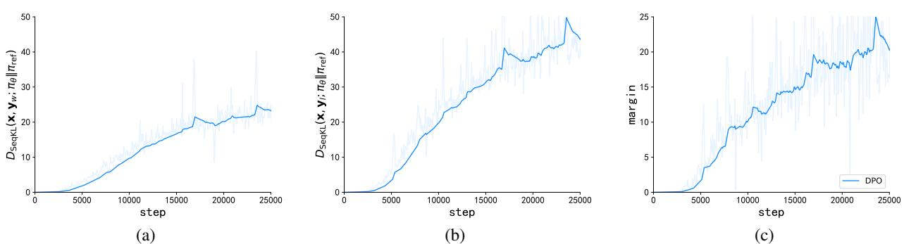
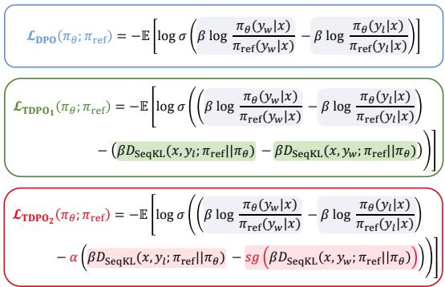
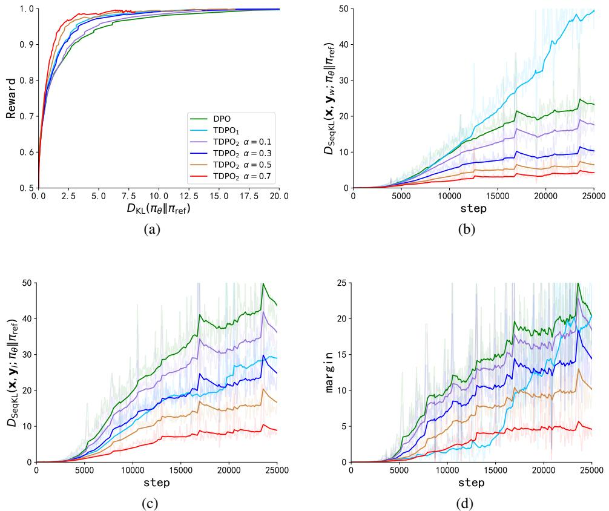
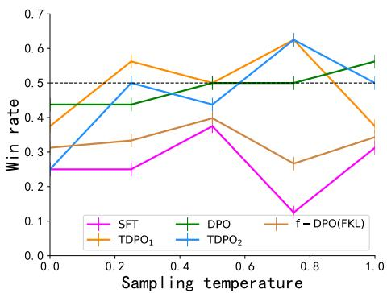
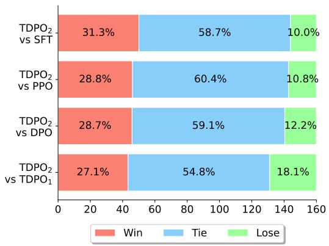
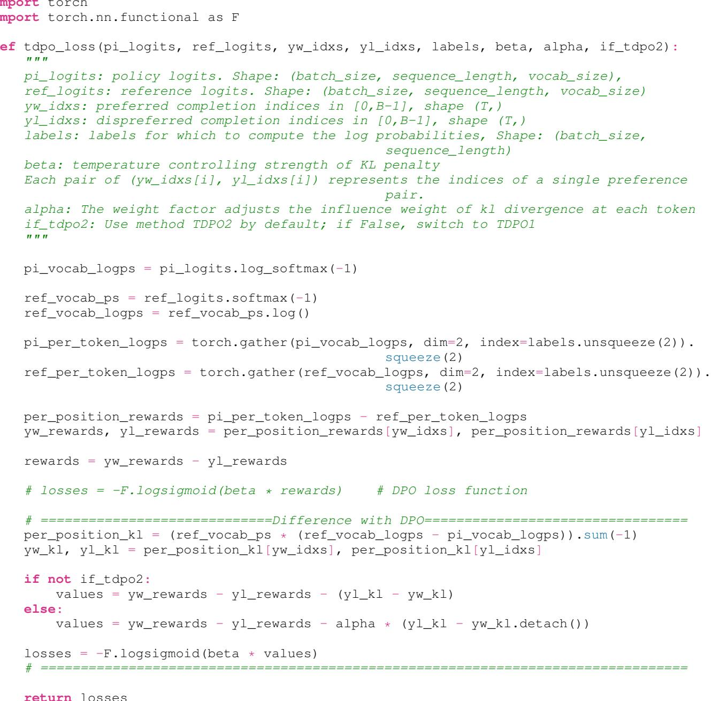
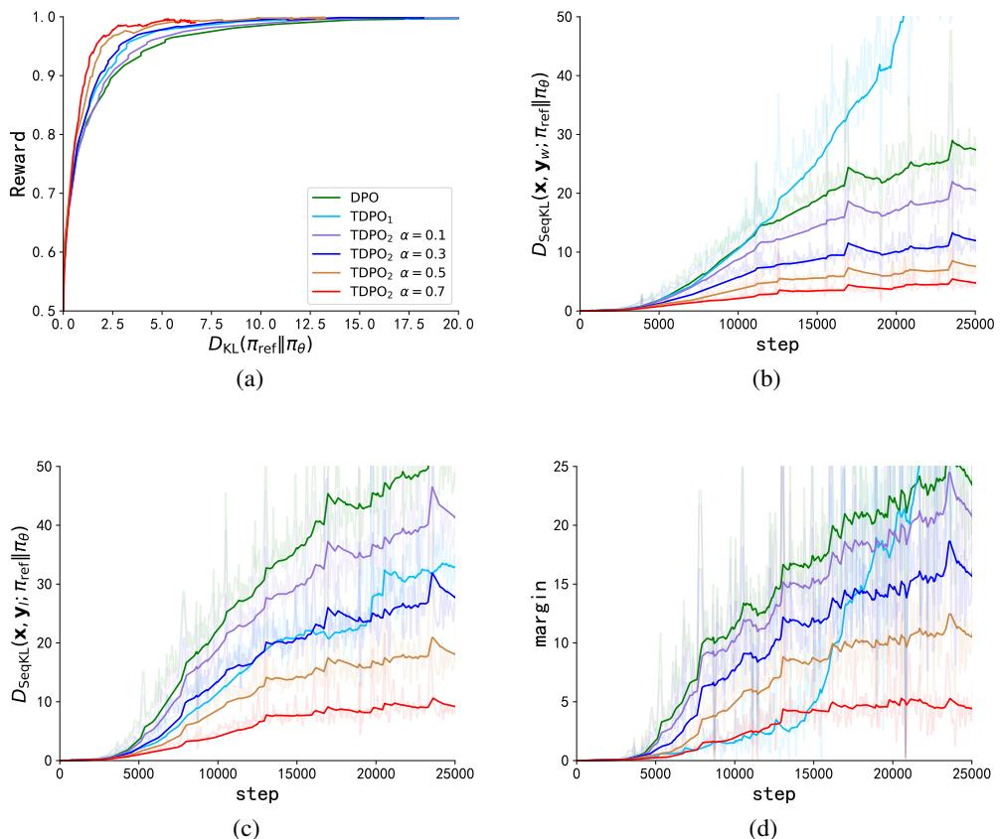

# Token-level Direct Preference Optimization

Yongcheng Zeng 1 2 Guoqing Liu 3 Weiyu Ma 1 2 Ning Yang 1 Haifeng Zhang 1 Jun Wang 4

# Abstract

# 1. Introduction

Fine-tuning pre-trained Large Language Models (LLMs) is essential to align them with human values and intentions. This process often utilizes methods like pairwise comparisons and KL divergence against a reference LLM, focusing on the evaluation of full answers generated by the models. However, the generation of these responses occurs in a token level, following a sequential, auto-regressive fashion. In this paper, we introduce Token-level Direct Preference Optimization (TDPO), a novel approach to align LLMs with human preferences by optimizing policy at the token level. Unlike previous methods, which face challenges in divergence efficiency, TDPO incorporates forward KL divergence constraints for each token, improving alignment and diversity. Utilizing the Bradley-Terry model for a token-based reward system, TDPO enhances the regulation of KL divergence, while preserving simplicity without the need for explicit reward modeling. Experimental results across various text tasks demonstrate TDPO’s superior performance in balancing alignment with generation diversity. Notably, fine-tuning with TDPO strikes a better balance than DPO in the controlled sentiment generation and single-turn dialogue datasets, and significantly improves the quality of generated responses compared to both DPO and PPO-based RLHF methods. Our code is opensourced at https://github.com/Vance0124/Tokenlevel-Direct-Preference-Optimization.

Large language models (LLMs) (Achiam et al., 2023; Bubeck et al., 2023) have demonstrated significant generalization capabilities in various domains including text summarization (Stiennon et al., 2022; Koh et al., 2022), coding writing (Chen et al., 2021; Gao et al., 2023), and even following human instructions (Chung et al., 2022; Ouyang et al., 2022). In order to align LLMs with human intentions, Reinforcement Learning from Human Feedback (RLHF) (Christiano et al., 2017; Ouyang et al., 2022; Dong et al., 2023; Yuan et al., 2023; Liu et al., 2023) has emerged as a highly effective method, embodying both stylistic and ethical values (Bai et al., 2022; Ganguli et al., 2022). These approaches typically involve the training of a reward model followed by the fine-tuning of the policy model using reinforcement learning (RL).

Direct Preference Optimization (DPO) (Rafailov et al., 2023) introduces a straightforward and effective technique for training LLMs using pairwise comparisons, without the need for explicitly establishing a reward model. DPO utilizes KL divergence to ensure that the training process remains closely aligned with a reference Large Language Model (LLM), preventing significant deviations. In DPO, KL divergence is assessed at the sentence level, reflecting the fact that evaluations are based on complete responses (answers), typically comprising several sentences. However, the generation of these responses occurs sequentially, following an auto-regressive approach. A potential benefit is to examine divergence in relation to a reference LLM on a more granular, token-by-token basis. One approach involves using sequential KL divergence (as defined in Definition 4.3), which monitors the trajectory of the generated responses. As illustrated in Figure 1, DPO demonstrates a significantly faster increase in KL divergence within the subset of less preferred responses when compared to the subset that is preferred. This results in an expanding gap between the two subsets and also indicates that DPO does not effectively control the KL divergence of the dispreferred response subset. This impacts the model’s divergence efficiency and ultimately affects its linguistic capabilities and generative diversity. Such a limitation highlights the decreased effectiveness of employing KL divergence within the DPO framework, suggesting an area for improvement in its methodology.

  
Figure 1. Sequential KL (SeqKL) divergence of both preferred response and dispreferred responses on IMDb dataset. Figure 1(a) shows the progression of SeqKL divergence on the preferred responses over training steps. Figure 1(b) depicts the evolution of SeqKL divergence on the dispreferred responses over the training steps. Figure 1(c) illustrates the difference between the SeqKL divergence of the dispreferred responses and that of the preferred responses during the training process, namely margi $\begin{array} { r } { \imath = | D _ { \mathrm { S e q K L } } ( x , y _ { w } ; \pi _ { \mathrm { r e f } } | | \pi _ { \theta } ) - } \end{array}$ $D _ { \mathrm { S e q K L } } ( x , y \iota ; \pi _ { \mathrm { r e f } } \| \pi _ { \theta } ) |$ . The definition of SeqKL divergence refers to Definition 4.3.

The imbalance in the growth rates of the sequential KL divergence is potentially related to the reverse KL divergence constraint employed by DPO. The mode-seeking property of reverse KL divergence tends to induce diversity reduction during generation, limiting the model’s potential to produce diverse and effective responses (Wiher et al., 2022; Khalifa et al., 2020; Glaese et al., 2022; Perez et al., 2022). Built upon DPO, the f-DPO method (Wang et al., 2023) studies the trade-off between alignment performance and generation diversity of LLMs under different divergence constraints. It highlights the advantages of the mass-covering behavior of forward KL divergence in enhancing model diversity and explores the impact of different divergence constraints. Nevertheless, f-DPO only independently discusses the changes in model behavior under either the reverse KL divergence or the forward KL divergence constraints. Essentially, it does not fundamentally enhance the DPO algorithm itself but rather strikes a balance between alignment performance and generating diversity by simply swapping different KL divergence constraints.

Inspired by the aforementioned observations, we define and examine the problem of aligning with human preferences from a sequential and token-level standpoint. Some concurrent work has also been conducted in this direction (Rafailov et al., 2024; Zhong et al., 2024). We introduce a new method, referred to as Token-level Direct Preference Optimization (TDPO), which aims to strike a better balance between alignment performance and generation diversity by controlling the KL divergence for each token. In order to achieve this, we redefine the objective of maximising restricted rewards in a sequential manner. The connection between sentence-level reward and token-level generation is established by the use of the Bellman equation. Afterwards, the Bradley-Terry model (Bradley & Terry, 1952) is converted into a representation at the token level, demonstrating its close relationship with the Regret Preference Model (Knox et al., 2022; 2023). By utilizing this method, we effectively integrate forward KL divergence restrictions for each token in the final objective function, resulting in improved regulation of KL divergence.

TDPO maintains the simplicity of DPO while offering improved regulation of KL divergence for aligning LLMs with human preferences. Echoing the strategy of DPO, our method directly optimizes the policy without necessitating explicit reward model learning or policy sampling throughout the training phase. Our experimental results demonstrate the effectiveness of TDPO across multiple text tasks, and gain a notable enhancement in the quality of generated responses in comparison to both DPO and PPO-based RLHF methods. In conclusion, TDPO stands out for its ability to not only effectively address the issue of excessive KL divergence but also greatly improve divergence efficiency.

# 2. Related Works

The emergence of ChatGPT has catalyzed significant advancements in the field of Large Language Models (LLMs), such as OpenAI’s GPT-4 (Achiam et al., 2023), Mistral (Jiang et al., 2023), and Google’s Gemini (Team et al., 2023). Generally, the training of LLMs involves three stages: initial unsupervised pre-training on massive text corpora to grasp linguistic structures (Raffel et al., 2020; Brown et al., 2020; Workshop et al., 2022; Touvron et al., 2023), followed by supervised fine-tuning with task-specific datasets to enhance the LLMs’ probability of producing desired responses (Taori et al., 2023; Chiang et al., 2023; Vu et al., 2023). However, due to the typically limited and expensive availability of labeled datasets during the supervised fine-tuning stage, the model may retain biases and inaccuracies, manifesting as societal biases (Sheng et al., 2021), ethical concerns (Weidinger et al., 2021), toxicity (Rauh et al., 2022), and hallucinations (Huang et al., 2023), which necessitates a subsequent AI alignment phase. Noteworthy models achieving significant alignment, such as Zephyr (Tunstall et al., 2023) and GPT-4 (Achiam et al., 2023), have demonstrated the effectiveness of techniques like Reinforcement Learning from Human Feedback (RLHF) and Direct Preference Optimization (DPO) algorithms.

Reinforcement Learning from Human Feedback (RLHF) has emerged as a cornerstone in aligning LLMs with human values, providing a mechanism to refine model outputs based on qualitative feedback (Christiano et al., 2017; Ouyang et al., 2022; Bai et al., 2022; Song et al., 2023; Touvron et al., 2023). This approach has shown considerable promise in making models more responsive to human expectations and ethical considerations by iteratively improving their performance through human-generated feedback. However, the complexity of implementing RLHF, compounded by the inaccuracies in human-generated reward models (Wu et al., 2023), has prompted the exploration of alternative strategies. Methods like Reward Ranked FineTuning (RAFT) (Dong et al., 2023) and Rank Responses to align Human Feedback (RRHF) (Yuan et al., 2023) offer streamlined approaches to alignment, circumventing some of RLHF’s inherent challenges. Particularly, Direct Preference Optimization (DPO) (Rafailov et al., 2023) represents a breakthrough in direct policy optimization, addressing the intricacies of balancing model behavior through a nuanced approach to reward function optimization. Nevertheless, the challenge of maintaining linguistic diversity while aligning with human preferences remains a pivotal concern, prompting our proposed Token-level Direct Preference Optimization (TDPO), which seeks to harmonize the dual objectives of alignment accuracy and expressive range in model outputs.

# 3. Preliminaries

For language generation, a language model (LM) is prompted with prompt (question) $x$ to generate a response (answer) $y$ , where both $x$ and $y$ consist of a sequence of tokens. Direct Preference Optimization (DPO) (Rafailov et al., 2023) commences with the RL objective from the RLHF:

$$
\begin{array} { r l } & { \underset { \pi _ { \theta } } { \operatorname* { m a x } } ~ \mathbb { E } _ { { \boldsymbol x } \sim { \mathcal { D } } , { \boldsymbol y } \sim \pi _ { \theta } ( \cdot \vert { \boldsymbol x } ) } \big [ r ( { \boldsymbol x } , { \boldsymbol y } ) } \\ & { \qquad - \beta D _ { \mathrm { K L } } \big ( \pi _ { \theta } ( \cdot \vert { \boldsymbol x } ) \big \vert \big \vert \pi _ { \mathrm { r e f } } ( \cdot \vert { \boldsymbol x } ) \big ) \big ] , } \end{array}
$$

where $\mathcal { D }$ represents the human preference dataset, $r ( x , y )$ denotes the reward function, $\pi _ { \mathrm { r e f } } ( \cdot | x )$ serves as a reference model, typically chosen the language model after supervised fine-tuning, $\pi _ { \theta }$ represents the model undergoing RL finetuning, initialized with $\pi _ { \theta } = \pi _ { \mathrm { r e f } }$ , and $\beta$ is the coefficient for the reverse KL divergence penalty.

By directly deriving from Eq. 1, DPO establishes a mapping between the reward model and the optimal policy under the reverse KL divergence, obtaining a representation of the reward function concerning the policy:

$$
r ( x , y ) = \beta \log \frac { \pi _ { \theta } ( y | x ) } { \pi _ { \mathrm { r e f } } ( y | x ) } + \beta \log Z ( x ) .
$$

Here, $Z ( x )$ is the partition function.

To align with human preference, DPO uses the BradleyTerry model for pairwise comparisons:

$$
P _ { \mathrm { B T } } ( y _ { 1 } \succ y _ { 2 } | x ) = \frac { \exp ( r ( x , y _ { 1 } ) ) } { \exp ( r ( x , y _ { 1 } ) ) + \exp ( r ( x , y _ { 2 } ) ) } .
$$

By substituting Eq. 2 into Eq. 3 and leveraging the negative log-likelihood loss, DPO derives the objective function:

$$
\begin{array} { r } { u ( x , y _ { w } , y _ { l } ) = \beta \log \frac { \pi _ { \theta } ( y _ { w } \mid x ) } { \pi _ { \mathrm { r e f } } ( y _ { w } \mid x ) } - \beta \log \frac { \pi _ { \theta } ( y _ { l } \mid x ) } { \pi _ { \mathrm { r e f } } ( y _ { l } \mid x ) } , } \\ { \mathcal { L } _ { \mathrm { D P O } } ( \pi _ { \theta } ; \pi _ { \mathrm { r e f } } ) = - \mathbb { E } _ { ( x , y _ { w } , y _ { l } ) \sim \mathcal { D } } \left[ \log \sigma \left( u ( x , y _ { w } , y _ { l } ) \right) \right] , } \end{array}
$$

and the derivative is given as follows:

$$
\begin{array} { r } { \nabla _ { \theta } \mathcal { L } _ { \mathrm { D P O } } ( \pi _ { \theta } ; \pi _ { \mathrm { r e f } } ) = - \mathbb { E } _ { ( x , y _ { w } , y _ { l } ) \sim \mathcal { D } } \left[ \left( - u \right) \nabla _ { \theta } u \right] , } \end{array}
$$

where $u$ is the abbreviation of $u ( x , y _ { w } , y _ { l } )$ , $y _ { w }$ and $y _ { l }$ denotes the preferred and dispreferred completion.

# 4. Methodology

In this section, we initially reformulate the constrained reward maximization problem into a token-level form. From this, we derive the mapping between the state-action function and the optimal policy. Subsequently, we convert the Bradley-Terry model into token-level representation, establishing its equivalence with the Regret Preference Model. By substituting the mapping relationship into the reward model in token-level format, we obtain the optimization objective solely related to the policy. Finally, we conduct a formalized analysis of this optimization objective in terms of derivatives and, based on this, derive the ultimate loss function for TDPO.

# 4.1. Markov Decision Process under Token Rewards

To model the sequential, auto-regressive generation, we extend the sentence-level formulation in Section 3 by considering that the response consists of $T$ tokens $\begin{array} { r } { y = y ^ { < T + 1 } : = } \end{array}$ $[ y ^ { 1 } , y ^ { 2 } , . . . , y ^ { T } ]$ , where $y ^ { t } \in \mathcal { V }$ , and $\mathcal { V }$ represents the alphabet (vocabulary). Additionally, we assume $y ^ { < 1 } = \left[ \begin{array} { l l }  \right] \end{array}$ . Given a prompt $x$ and the first $t - 1$ tokens $y ^ { < t }$ of the response $y$ , the LM predicts the probability distribution of the next token $\pi _ { \boldsymbol { \theta } } ( \cdot | [ x , y ^ { < t } ] )$ .

When modeling text generation as a Markov decision process (Puterman, 2014), a state is a combination of the prompt and the generated response up to the current step, denoted as $\boldsymbol { s } _ { t } = \left[ \boldsymbol { x } , \boldsymbol { y } ^ { < t } \right]$ . An action corresponds to the next generated token, denoted as $a _ { t } = y ^ { t }$ , and the token-wise reward is defined as $R _ { t } : = R ( s _ { t } , a _ { t } ) = R ( [ x , y ^ { < t } ] , y ^ { t } )$ .

Expanding on the provided definitions, we establish the state-action function $Q _ { \pi }$ , the state value function $V _ { \pi }$ and the advantage function $A _ { \pi }$ for a policy $\pi$ :

$$
\begin{array} { r l } & { \displaystyle Q _ { \pi } ( [ x , y ^ { < t } ] , y ^ { t } ) = \mathbb { E } _ { \pi } \left[ \sum _ { k = 0 } ^ { \infty } \gamma ^ { k } R _ { t + k } \Big | s _ { t } = [ x , y ^ { < t } ] , a _ { t } = y ^ { t } \right] , } \\ & { \quad \quad V _ { \pi } ( [ x , y ^ { < t } ] ) = \mathbb { E } _ { \pi } \left[ Q _ { \pi } ( [ x , y ^ { < t } ] , y ^ { t } ) \big | s _ { t } = [ x , y ^ { < t } ] \right] , } \\ & { \quad A _ { \pi } ( [ x , y ^ { < t } ] , y ^ { t } ) = Q _ { \pi } ( [ x , y ^ { < t } ] , y ^ { t } ) - V _ { \pi } ( [ x , y ^ { < t } ] ) . } \end{array}
$$

where $\gamma$ represents the discount factor. In this paper, we set $\gamma = 1$ .

# 4.2. Token-Level Optimization

DPO’s objective function in Eq. 1 operates at the sentence level. In contrast, we propose an alternative token-level objective function:

$$
\begin{array} { r l } & { \underset { \pi _ { \theta } } { \operatorname* { m a x } } \mathbb { E } _ { \boldsymbol { x } , \boldsymbol { y } ^ { < t } \sim \mathcal { D } , \boldsymbol { z } \sim \pi _ { \theta } ( \cdot \vert \left[ \boldsymbol { x } , \boldsymbol { y } ^ { < t } \right] ) } \left[ A _ { \pi _ { \mathrm { r e f } } } ( \left[ \boldsymbol { x } , \boldsymbol { y } ^ { < t } \right] , \boldsymbol { z } ) \right. } \\ & { \left. \qquad - \left. \beta D _ { \mathrm { K L } } \left( \pi _ { \theta } ( \cdot \vert \left[ \boldsymbol { x } , \boldsymbol { y } ^ { < t } \right] ) \right. \vert \pi _ { \mathrm { r e f } } ( \cdot \vert \left[ \boldsymbol { x } , \boldsymbol { y } ^ { < t } \right] ) \right) \right] . } \end{array}
$$

The objective function is inspired by Trust Region Policy Optimization (TRPO) (Schulman et al., 2015). As demonstrated in Lemma 4.1, maximizing the objective function in Eq. 7 will result in policy improvements in terms of expected return.

Lemma 4.1. Given two policies $\pi$ and $\tilde { \pi }$ , if for any state $\boldsymbol { s } _ { t } ~ = ~ \left[ \boldsymbol { x } , \boldsymbol { y } ^ { < t } \right]$ , $\mathbb { E } _ { z \sim \tilde { \pi } } \left[ A _ { \pi } ( [ x , y ^ { < t } ] , z ) \right] \ge 0 \mathrm { ~ }$ , then we can conclude:

$$
\begin{array} { r } { \mathbb { E } _ { \boldsymbol { x } \sim \mathcal { D } } \left[ V _ { \tilde { \pi } } ( [ \boldsymbol { x } ] ) \right] \geq \mathbb { E } _ { \boldsymbol { x } \sim \mathcal { D } } \left[ V _ { \pi } ( [ \boldsymbol { x } ] ) \right] , } \end{array}
$$

The proof is provided in Appendix A.1.

Notably, to maintain generation diversity and prevent the model from hacking some high-reward answers, we incorporate reverse KL divergence for each token in our token-level objective function, which prevents the model from deviating too far from the reference model distribution.

Starting from the token-level objective function in Eq. 7, we can directly derive the mapping between the state-action function $Q _ { \pi }$ and the optimal policy $\pi _ { \theta } ^ { * }$ . We summarize this relationship in the following lemma.

Lemma 4.2. The constrained problem in Eq. 7 has the closed-form solution:

$$
\begin{array} { r l r } { \pi _ { \theta } ^ { * } ( z | [ x , y ^ { < t } ] ) = } & { } & \\ { \frac { \pi _ { \mathrm { r e f } } ( z | [ x , y ^ { < t } ] ) \exp \Big ( \frac { 1 } { \beta } Q _ { \pi _ { \mathrm { r e f } } } ( [ x , y ^ { < t } ] , z ) \Big ) } { Z ( [ x , y ^ { < t } ] ; \beta ) } , } \end{array}
$$

where ${ \cal Z } ( [ x , y ^ { < t } ] ; \beta ) = \mathbb { E } _ { z \sim \pi _ { \mathrm { r e f } } ( \cdot | [ x , y ^ { < t } ] ) } e ^ { \frac { 1 } { \beta } Q _ { \pi _ { \mathrm { r e f } } } ( [ x , y ^ { < t } ] , z ) }$ is the partition function.

See Appendix A.2 for more details.

To obtain the optimal policy $\pi _ { \theta } ^ { * }$ from Eq. 8, we must estimate the state-action function $Q _ { \pi _ { \mathrm { r e f } } }$ and the partition function $Z ( \cdot )$ . However, ensuring the accuracy of the stateaction function $Q _ { \pi }$ at each state and action is challenging, and estimating the partition function $Z ( \cdot )$ is also difficult. Therefore, we reorganize Eq. 8 to obtain the expression of the state-value function in terms of the policy:

$$
\begin{array} { r l r } {  { Q _ { \pi _ { \mathrm { r e f } } } ( [ x , y ^ { < t } ] , z ) = } } \\ & { } & { \beta \log \frac { \pi _ { \theta } ^ { * } ( z | [ x , y ^ { < t } ] ) } { \pi _ { \mathrm { r e f } } ( z | [ x , y ^ { < t } ] ) } + \beta \log Z ( [ x , y ^ { < t } ] ; \beta ) . } \end{array}
$$

# 4.3. BT Model Reformulation via Advantage Function

To facilitate subsequent derivations, we first introduce the sequential $\mathrm { K L }$ divergence, as defined in Definition 4.3.

Definition 4.3. Given two language models $\pi _ { 1 }$ and $\pi _ { 2 }$ , with the input prompt $x$ and output response $y$ , the sequential KL divergence is defined as:

$$
\begin{array} { l } { { \displaystyle { \cal D } _ { \mathrm { S e q K L } } ( x , y ; \pi _ { 1 } | | \pi _ { 2 } ) = } \ ~ } \\ { { \displaystyle ~ \sum _ { t = 1 } ^ { T } { \cal D } _ { \mathrm { K L } } ( \pi _ { 1 } ( \cdot | [ x , y ^ { < t } ] ) \| \pi _ { 2 } ( \cdot | [ x , y ^ { < t } ] ) ) . } } \end{array}
$$

Given prompts $x$ and pairwise responses $( y _ { 1 } , \ y _ { 2 } )$ , the Bradley-Terry model expresses the human preference probability. However, since the Bradley-Terry model is formulated at the sentence level, it cannot establish a connection with the token-level mapping presented in Eq. 9. Consequently, we need to derive a token-level preference model. Initiating from the Bradley-Terry model, we transform it into a token-level formulation and demonstrate its equivalence with the Regret Preference Model (Knox et al., 2023; 2022), as shown in the Lemma 4.4.

Lemma 4.4. Given a reward function $r ( \mathrm { x } , \mathrm { y } )$ , assuming a relationship between token-wise rewards $\begin{array} { r } { \sum _ { t = 1 } ^ { T } \gamma ^ { t - 1 } R ( [ x , y ^ { < t } ] , y ^ { t } ) } \end{array}$ n represented by , we can establish $\begin{array} { r l } { r ( x , y ) } & { { } = } \end{array}$ lence between the Bradley-Terry model and the Regret Preference Model in the task of text generation alignment, i.e.,

$$
\begin{array} { l } { { \displaystyle P _ { \mathrm { B T } } ( y _ { 1 } \succ y _ { 2 } | x ) = } } \\ { { \displaystyle \quad \sigma \left( \sum _ { t = 1 } ^ { T _ { 1 } } \gamma ^ { t - 1 } A _ { \pi } ( [ x , y _ { 1 } ^ { < t } ] , y _ { 1 } ^ { t } ) - \sum _ { t = 1 } ^ { T _ { 2 } } \gamma ^ { t - 1 } A _ { \pi } ( [ x , y _ { 2 } ^ { < t } ] , y _ { 2 } ^ { t } ) \right) , } } \end{array}
$$

where $\sigma ( x ) = 1 / ( 1 + e x p ( - x ) )$ is the logistic sigmoid function.

We prove this lemma in A.3.

In Lemma 4.4, we assume that $\begin{array} { r l r l } { r ( x , y ) } & { { } } & { = } \end{array}$ $\begin{array} { r } { \sum _ { t = 1 } ^ { T } \gamma ^ { t - 1 } R ( [ x , y ^ { < t } ] , y ^ { t } ) } \end{array}$ . This assumption is natural in the context of RL, where $r ( x , y )$ represents the overall reward for response $y$ given the prompt $x$ . Considering text generation as a sequential decision-making problem, $r ( x , y )$ can be viewed as the cumulative reward for the generated text.

According to the definition of the advantage function in Section 4.1, we can directly establish the relationship between the optimal solution in Eq. 9 and preference optimization objective in Eq. 11. One intractable aspect is that the stateaction function $Q _ { \pi }$ depends on a partition function, which is contingent on both the input prompt $x$ and the output response $y$ . This results in non-identical values of the partition function for a pair of responses $( y _ { w } , y _ { l } )$ , specifically, $Z ( [ x , y _ { w } ^ { < t } ] ; \beta ) \neq Z ( [ x , y _ { l } ^ { < t } ] ; \beta )$ . As a result, we cannot employ a cancellation strategy similar to DPO, which relies on the property that the Bradley-Terry model depends only on the difference in rewards between two completions.

Fortunately, by expanding the advantage function $A _ { \pi }$ and converting the state-value function $V _ { \pi }$ into a form exclusively related to the state-action function $Q _ { \pi }$ , we can offset the partition function naturally. In this way, we ultimately reformulate the Bradley-Terry model to be directly tied to the optimal policy $\pi _ { \theta } ^ { * }$ and the reference policy $\pi _ { \mathrm { r e f } }$ . This is summarized in the following theorem.

Theorem 4.5. In the KL-constrainted advantage function maximization problem corresponding to Eq.7, the BradleyTerry model express the human preference probability in terms of the optimal policy $\pi _ { \theta } ^ { * }$ and reference policy $\pi _ { \mathrm { r e f } }$ :

$$
P _ { \mathrm { B T } } ^ { * } ( y _ { 1 } \succ y _ { 2 } | x ) = \sigma ( u ^ { * } ( x , y _ { 1 } , y _ { 2 } ) - \delta ^ { * } ( x , y _ { 1 } , y _ { 2 } ) ) ,
$$

where, $u ( x , y _ { 1 } , y _ { 2 } )$ refers to the difference in rewards implicitly defined by the language model $\pi _ { \theta }$ and the reference model $\pi _ { \mathrm { r e f } }$ (Rafailov et al., 2023), represented as

$$
\begin{array} { r } { u ( x , y _ { 1 } , y _ { 2 } ) = \beta \log \frac { \pi _ { \theta } \left( y _ { 1 } \mid x \right) } { \pi _ { \mathrm { r e f } } \left( y _ { 1 } \mid x \right) } - \beta \log \frac { \pi _ { \theta } \left( y _ { 2 } \mid x \right) } { \pi _ { \mathrm { r e f } } \left( y _ { 2 } \mid x \right) } , } \end{array}
$$

and $\delta ( x , y _ { 1 } , y _ { 2 } )$ refers to the difference in sequential forward $K L$ divergence between two pairs $( x , y _ { 1 } )$ and $( x , y _ { 2 } )$ , weighted by $\beta$ , expressed as

$$
\begin{array} { r l } & { \delta ( x , y _ { 1 } , y _ { 2 } ) = \beta D _ { \mathrm { S e q K L } } \left( x , y _ { 2 } ; \pi _ { \mathrm { r e f } } \Vert \pi _ { \theta } \right) } \\ & { \qquad - \left. \beta D _ { \mathrm { S e q K L } } \left( x , y _ { 1 } ; \pi _ { \mathrm { r e f } } \Vert \pi _ { \theta } \right) . \right. } \end{array}
$$

The proof is provided in the Appendix A.4.

# 4.4. Loss Function and Formal Analysis

Drawing on Eq. 12, we reformulate the Bradley-Terry model into a structure solely relevant to the policy. This allows us to formulate a likelihood maximization objective for a parametrized policy $\pi _ { \theta }$ , leading to the derivation of the loss function for the initial version of our method, $\mathrm { T D P O _ { 1 } }$ :

$$
\begin{array} { r l } & { \mathcal { L } _ { \mathrm { T D P O } _ { 1 } } \left( \pi _ { \theta } ; \pi _ { \mathrm { r e f } } \right) = } \\ & { \quad \quad - \operatorname { \mathbb { E } } _ { ( x , y _ { w } , y _ { l } ) \sim \mathcal { D } } \left[ \log \sigma \left( u ( x , y _ { w } , y _ { l } ) - \delta ( x , y _ { w } , y _ { l } ) \right) \right] . } \end{array}
$$

Through this approach, we explicitly introduce sequential forward KL divergence into the loss function. Coupled with the implicitly integrated reverse KL divergence, we enhance our ability to balance alignment performance and generation diversity of LLMs.

Subsequently, we conduct a derivative analysis of our method and make specific modifications to the loss function of TDPO. For convenience, we use $u$ to denote $u ( x , y _ { w } , y _ { l } )$ , and $\delta$ to represent $\delta ( x , y _ { w } , y _ { l } )$ . By employing the formulation of the loss function presented in Eq.15, we compute the gradient of the loss function with respect to the parameters $\theta$ :

$$
\begin{array} { r l } { \nabla _ { \theta } \mathcal { L } _ { \mathrm { T D P O _ { 1 } } } ( \pi _ { \theta } ; \pi _ { \mathrm { r e f } } ) = } & { } \\ { - \mathbb { E } _ { ( x , y _ { w } , y _ { l } ) \sim \mathcal { D } } \left[ ( - u + \delta ) \left[ \nabla _ { \theta } u - \nabla _ { \theta } \delta \right] \right] . } \end{array}
$$

In Eq. 16, $\left( - u + \delta \right)$ serves as the weighting factor for the gradient. The first part $\left( - u \right)$ corresponds to the weight factor in the loss function of DPO. When the language model makes errors in predicting human preferences, i.e., $\begin{array} { r } { \log \frac { \pi _ { \theta } ( y _ { l } | x ) } { \pi _ { \mathrm { r e f } } ( y _ { l } | x ) } > \log \frac { \pi _ { \theta } \bar { ( } y _ { w } | x ) } { \pi _ { \mathrm { r e f } } ( y _ { w } | x ) } } \end{array}$ , the value of $\left( - u \right)$ will become larger, applying a stronger update for the comparison $( y _ { w } , y _ { l } )$ . While the second part $\delta$ is a distinctive component of our method. As shown in Figure 1, the KL divergence growth rate for the dispreferred response subset is faster than that for the preferred response subset. With the increasing disparity, the corresponding value of $\delta$ rises, thereby amplifying the weight factor $( - u + \delta )$ . Combined with the subsequent gradient term, our objective function can effectively suppress the difference in KL divergence between pairs of responses with large disparities in KL divergence. Through the collaborative influence of the weight factor $\delta$ and the gradient term $\left( - \nabla _ { \theta } \delta \right)$ , our method achieves the purpose of automatic control over the KL divergence balance.

The gradient of the loss function in Eq. 16 also consists of two components, $\nabla _ { \boldsymbol { \theta } } \boldsymbol { u }$ and $\left( - \nabla _ { \theta } \delta \right)$ . $\nabla _ { \boldsymbol { \theta } } \boldsymbol { u }$ represents the optimization direction of the gradient in DPO. Intuitively, $\nabla _ { \boldsymbol { \theta } } \boldsymbol { u }$ increases the likelihood of preferred completions $y _ { w }$ and decreases the likelihood of dispreferred completions $y _ { l }$ . While $\left( - \nabla _ { \theta } \delta \right)$ tends to narrow the gap between $D _ { \mathrm { S e q K L } } ( x , y _ { w } ; \pi _ { \mathrm { r e f } }  \pi _ { \theta } )$ and $D _ { \mathrm { S e q K L } } ( x , y _ { l } ; \pi _ { \mathrm { r e f } }  \pi _ { \theta } )$ .

However, when considered separately, the gradient of $D _ { \mathrm { S e q K L } } \left( x , y _ { w } ; \pi _ { \mathrm { r e f } } \vert \pi _ { \theta } \right)$ in the loss function tends to increase the sequential KL divergence between $\pi _ { \mathrm { r e f } }$ and $\pi _ { \theta }$ at $( x , y _ { w } )$ during the optimization process. This is because the sequential forward KL divergence in the loss function is introduced through the state-value function $V _ { \pi }$ , inherently introducing an expectation $\begin{array} { r } { \mathbb { E } _ { z \sim \pi _ { \mathrm { r e f } } } \left[ \log \frac { \pi _ { \theta } ( z | [ x , y ^ { < t } ] ) } { \pi _ { \mathrm { r e f } } ( z | [ x , y ^ { < t } ] ) } \right] } \end{array}$ as a baseline at each token. The negative value of this expectation corresponds precisely to a forward KL divergence $D _ { \mathrm { K L } } \left( \pi _ { \mathrm { r e f } } \left( \cdot | [ x , y ^ { < t } ] \right) | \pi _ { \theta } ( \cdot | [ x , y ^ { < t } ] ) \right)$ , which can be used to constrain the unbalanced growth of KL divergence. For the prompt $x$ and the preferred response $y _ { w }$ , at each token, the loss function in Eq. 16 tends to increase the likelihood of log $: \frac { \pi ( \boldsymbol { y } _ { w } ^ { t } | [ \boldsymbol { x } , \boldsymbol { y } _ { w } ^ { < t } ] ) } { \pi _ { \mathrm { r e f } } ( \boldsymbol { y } _ { w } ^ { t } | [ \boldsymbol { x } , \boldsymbol { y } _ { w } ^ { < t } ] ) }$ while simultaneously decreasing the expectation, enlarging the gap between the specified term $y _ { w } ^ { t }$ and the baseline to expedite training. The impact of decreasing the expectation is an increase in the forward KL divergence $D _ { \mathrm { K L } } \left( \pi _ { \mathrm { r e f } } ( \cdot | [ x , y _ { w } ^ { < t } ] ) | \pi _ { \theta } ( \cdot | [ x , y _ { w } ^ { < t } ] ) \right)$ at each token, leading to an increase in $D _ { \mathrm { S e q K L } } \left( x , y _ { w } ; \pi _ { \mathrm { r e f } } \vert \pi _ { \theta } \right)$ As we do not aim to accelerate the training speed and prefer to ensure training stability, we modify the loss function by discontinuing the gradient propagation of $D _ { \mathrm { S e q K L } } \left( x , y _ { w } ; \pi _ { \mathrm { r e f } } \vert \pi _ { \theta } \right)$ and treating it as a baseline term for alignment of $D _ { \mathrm { S e q K L } } \left( x , y _ { l } ; \pi _ { \mathrm { r e f } } | \pi _ { \theta } \right)$ .

Different from $D _ { \mathrm { S e q K L } } \left( x , y _ { w } ; \pi _ { \mathrm { r e f } } \vert \pi _ { \theta } \right)$ , the gradient of $D _ { \mathrm { S e q K L } } \left( x , y _ { l } ; \pi _ { \mathrm { r e f } } | \pi _ { \theta } \right)$ tends to reduce the sequential KL divergence between $\pi _ { \mathrm { r e f } }$ and $\pi _ { \theta }$ at $( x , y _ { l } )$ . For the prompt $x$ and the rejected response $y _ { l }$ , the loss function in Eq.16 tends to decrease the likelihood of log $\frac { \pi ( y _ { l } ^ { t } | [ x , y _ { l } ^ { < t } ] ) } { \pi _ { \mathrm { r e f } } ( y _ { l } ^ { t } | [ x , y _ { l } ^ { < t } ] ) }$ at each token while increasing the expectation $\begin{array} { r } { \mathbb { E } _ { z \sim \pi _ { \mathrm { r e f } } } \left[ \log \frac { \pi _ { \theta } ( z | [ x , y _ { l } ^ { < t } ] ) } { \pi _ { \mathrm { r e f } } ( z | [ x , y _ { l } ^ { < t } ] ) } \right] } \end{array}$ . The increase in the expectation implies a smaller forward KL divergence at that token, thereby acting to constrain the growth rate of sequential forward KL divergence. Therefore, for this term, we choose to retain its gradient updates.

In conclusion, we only propagate the gradient of the $D _ { \mathrm { S e q K L } } \left( x , y _ { l } ; \pi _ { \mathrm { r e f } } | \pi _ { \theta } \right)$ in $\left( - \nabla _ { \theta } \delta \right)$ . When the second part weight factor $\delta$ becomes larger, it imposes a stronger suppression on $D _ { \mathrm { S e q K L } } ( x , y _ { l } ; \pi _ { \mathrm { r e f } }  \pi _ { \theta } )$ to control the balance of KL divergence.

Furthermore, to achieve a better balance between alignment performance and generation diversity in TDPO, we introduce an additional parameter $\alpha$ into the loss function. By adjusting the magnitude of $\alpha$ , we can control the deviation between $D _ { \mathrm { S e q K L } } \left( x , y _ { w } ; \pi _ { \mathrm { r e f } } \Vert \pi _ { \theta } \right)$ and $D _ { \mathrm { S e q K L } } \left( x , y _ { l } ; \pi _ { \mathrm { r e f } } \Vert \pi _ { \theta } \right)$ .

In summary, we modify the loss function of $\mathrm { T D P O _ { 1 } }$ , resulting in the second version of our method, $\mathrm { T D P O _ { 2 } }$ , as

follows:

$$
\begin{array} { r l } & { \mathcal { L } _ { \mathrm { T D P O } _ { 2 } } \left( \pi _ { \boldsymbol { \theta } } ; \pi _ { \mathrm { r e f } } \right) = } \\ & { \quad - \operatorname { \mathbb { E } } _ { ( \boldsymbol { x } , y _ { w } , y _ { l } ) \sim \mathcal { D } } \left[ \log \sigma \left( u ( \boldsymbol { x } , y _ { w } , y _ { l } ) - \alpha \delta _ { 2 } ( \boldsymbol { x } , y _ { w } , y _ { l } ) \right) \right] , } \end{array}
$$

where $\alpha$ is a parameter, and

$$
\begin{array} { r l } & { \delta _ { 2 } ( x , y _ { 1 } , y _ { 2 } ) = \beta D _ { \mathrm { S e q K L } } \left( x , y _ { 2 } ; \pi _ { \mathrm { r e f } } \| \pi _ { \theta } \right) } \\ & { \qquad - s g \left( \beta D _ { \mathrm { S e q K L } } \left( x , y _ { 1 } ; \pi _ { \mathrm { r e f } } \| \pi _ { \theta } \right) \right) . } \end{array}
$$

The $s g$ represents the stop-gradient operator, which blocks the propagation of gradients.

We summarize the comparison of the loss functions for DPO, $\mathrm { T D P O _ { 1 } }$ , and $\mathrm { T D P O _ { 2 } }$ , as presented in Figure 2.

  
Figure 2. Comparison of Loss Functions for DPO, $\mathrm { T D P O _ { 1 } }$ and $\mathrm { T D P O _ { 2 } }$ Methods. The $s g$ denotes the stop-gradient operator. Both $\mathrm { T D P O _ { 1 } }$ and $\mathrm { T D P O _ { 2 } }$ incorporate an additional term for finer-grained control over the KL divergence, compared to DPO.

Leveraging the parameter $\beta$ to regulate the deviation of the language model from the base reference model, and $\alpha$ to control the balance of sequential KL divergence within the language model, our approach achieves superior alignment with human preferences while preserving model generation diversity effectively. We provided the pseudocode in Algorithm 1 and the Pytorch implementation version of TDPO loss in Appendix B.

# 5. Experiments

In this section, we demonstrate the superior performance of our algorithm in three different open-sourced datasets: the IMDb sentiment dataset (Maas et al., 2011), the Anthropic HH dataset (Bai et al., 2022), and MT-bench (Zheng et al., 2023). The IMDb dataset serves as a controlled semantic generation dataset where the model is presented with prompts consisting of prefixes from movie reviews, and required to generate responses with positive sentiment. The Anthropic HH dataset is a single-turn dialogue dataset where the model receives human queries, covering various

# Algorithm 1 Token-level Direct Preference Optimization (TDPO)

1: Input: Reference model $\pi _ { \mathrm { r e f } }$ , Policy model $\pi _ { \theta }$ , Coefficient $\alpha , \beta$ , Learning rate $\eta$   
2: Input: Dataset $\mathcal { D } = \{ ( x , y _ { w } , y _ { l } ) ^ { i } \} _ { i = 1 } ^ { N }$ of size $N$ , Method $\mathcal { M }$   
3: Initialize: πθ ← πref   
4: for each epoch do   
5: Sample mini-batch $\mathcal { D } _ { m } = \{ ( x , y _ { w } , y _ { l } ) ^ { m } \} _ { m = 1 } ^ { M }$ from $\mathcal { D }$   
6: Predict the probabilities $\pi _ { \boldsymbol { \theta } } ( y _ { w } | \boldsymbol { x } )$ and $\pi _ { \boldsymbol { \theta } } ( y _ { l } | \boldsymbol { x } )$ for $( x , y _ { w } , y _ { l } )$ in the mini-batch $\mathcal { D } _ { m }$ using the policy model   
7: 8: Predict the probabilitiCalculate the function $\pi _ { \mathrm { r e f } } ( y _ { w } | x )$ $\pi _ { \mathrm { r e f } } ( y _ { l } | x )$ $( x , y _ { w } , y _ { l } )$ mini-batch $\mathcal { D } _ { m }$ using eference model▷ Eq.13   
$\begin{array} { r } { u ( x , y _ { w } , y _ { l } ) = \beta \log \frac { \pi _ { \theta } ( y _ { w } | x ) } { \pi _ { \mathrm { r e f } } ( y _ { w } | x ) } - \beta \log \frac { \pi _ { \theta } ( y _ { l } | x ) } { \pi _ { \mathrm { r e f } } ( y _ { l } | x ) } } \end{array}$   
9: Compute the sequential KL divergence $D _ { \mathrm { S e q K L } } \left( x , y _ { w } ; \pi _ { \mathrm { r e f } } \Vert \pi _ { \theta } \right)$ for $( x , y _ { w } )$ in the mini-batch $\mathcal { D } _ { m }$   
10: Compute the sequential KL divergence $D _ { \mathrm { S e q K L } } \left( x , y _ { l } ; \pi _ { \mathrm { r e f } } \| \pi _ { \theta } \right)$ for $( x , y _ { l } )$ in the mini-batch $\mathcal { D } _ { m }$   
11: if Method $\mathcal { M }$ is $\mathrm { T D P O _ { 1 } }$ then   
12: Calculate the function $\delta ( x , y _ { w } , y _ { l } ) = \beta D _ { \mathrm { S e q K L } } \left( x , y _ { l } ; \pi _ { \mathrm { r e f } } \| \pi _ { \theta } \right) - \beta D _ { \mathrm { S e q K L } } \left( x , y _ { w } ; \pi _ { \mathrm { r e f } } \| \pi _ { \theta } \right)$ ▷ Eq.14   
13: . $\begin{array} { r } { \gets \theta + \eta \nabla _ { \theta } \mathbb { E } _ { ( { x } , { y } _ { w } , { y } _ { l } ) \sim \mathcal { D } _ { m } } \left[ \log \sigma \left( u ( { x } , { y } _ { w } , { y } _ { l } ) - \delta ( { x } , { y } _ { w } , { y } _ { l } ) \right) \right] } \end{array}$ ▷ Eq.15   
14: else if Method $\mathcal { M }$ is $\mathrm { T D P O _ { 2 } }$ then   
15: Calculate the function $\delta _ { 2 } ( x , y _ { w } , y _ { l } ) = \beta D _ { \mathrm { S e q K L } } \left( x , y _ { l } ; \pi _ { \mathrm { r e f } } \Vert \pi _ { \theta } \right) - s g \left( \beta D _ { \mathrm { S e q K L } } \left( x , y _ { w } ; \pi _ { \mathrm { r e f } } \Vert \pi _ { \theta } \right) \right)$ ▷ Eq.18   
16: $\theta \gets \theta + \eta \nabla _ { \theta } \mathbb { E } _ { ( x , y _ { w } , y _ { l } ) \sim \mathcal { D } _ { m } }$ $[ \log \sigma \left( u ( x , y _ { w } , y _ { l } ) - \alpha \delta _ { 2 } ( x , y _ { w } , y _ { l } ) \right) ]$ ▷ Eq.17   
17: end if   
18: end for   
19: Output: $\pi _ { \theta }$

topics such as academic questions or life guidance. The trained model is tasked with providing helpful answers to these questions while avoiding toxic responses. Finally, MT-Bench is a GPT-4-based evaluation benchmark, assessing the proficiency of LLMs in handling multi-turn openended questions. Questions in MT-Bench span eight distinct knowledge domains, from areas such as writing, mathematical reasoning, and humanities. Experimental results demonstrate that MT-Bench achieves consistency with human preferences exceeding $80 \%$ .

# 5.1. Experiments on IMDb Dataset

In this experiment, besides our proposed methods $\mathrm { T D P O _ { 1 } }$ and $\mathrm { T D P O _ { 2 } }$ , we also implemented the DPO algorithm for fair comparison. We employed GPT-2 Large (Radford et al., 2019) as our base model and the model checkpoint: insub/gpt2-large-IMDb-fine-tuned1 as the SFT model. During the evaluation, we utilized the pre-trained sentiment classifier siebert/sentiment-roberta-large-english2 to compute rewards. For DPO, we followed the official implementation (Rafailov et al., 2023), setting $\beta$ at 0.1. To analyze the effectiveness of each algorithm in optimizing the constrained reward maximization objective, we evaluated each algorithm after 100 training steps until convergence, computing its frontier of average reward and average sequential KL divergence with the reference policy.

The results are depicted in Figure 3(a). We implement the DPO, $\mathrm { T D P O _ { 1 } }$ , and different versions of $\mathrm { T D P O _ { 2 } }$ algorithms with varying the parameter $\alpha$ . From the figure, we notice that although DPO establishes an efficient frontier, $\mathrm { T D P O _ { 1 } }$ and $\mathrm { T D P O _ { 2 } }$ outperform DPO in terms of divergence versus reward on the frontier, achieving higher reward while maintaining low KL divergence. We also implemented versions of $\mathrm { T D P O _ { 2 } }$ with $\alpha \in \{ 1 , 1 . 5 , 2 , 5 \}$ . However, we found that higher values of $\alpha$ made it difficult to optimize the reward. In Figures 3(b) to 3(d), we illustrate the curves portraying the sequential KL divergence for different algorithms during the training process. The sequential KL divergence growth rate of DPO on the dispreferred response subset is significantly higher than that on the preferred response subset, leading to an increasing offset between them. In contrast, $\mathrm { T D P O _ { 2 } }$ exhibits superior control over KL divergence, achieving better divergence efficiency compared to DPO. As analyzed in Section 4.4, $\mathrm { T D P O _ { 1 } }$ tends to result in an increased sequential KL divergence on the preferred response subset, thereby exhibiting a weaker capacity for KL divergence adjustment compared to $\mathrm { T D P O _ { 2 } }$ . $\mathrm { T D P O _ { 2 } }$ maintains a more balanced sequential KL divergence on both dispreferred and preferred response subsets, contributing to its ability to achieve a superior frontier. Although a larger $\alpha$ enhances control over the sequential KL divergence, it also affects the speed and difficulty of optimization. For the remainder of this paper, we set $\alpha = 0 . 5$ . In Appendix C, we also present graphs of the frontier between the reward and forward KL divergence and the progression curves of the forward KL divergence throughout the training process.

  
Figure 3. The experiment on IMDb dataset. Figure 3(a) represents the frontier of expected reward and KL divergence with respect to the reference model. We implemented DPO, $\mathrm { T D P O _ { 1 } }$ , and different versions of $\mathrm { T D P O _ { 2 } }$ with respect to the parameter $\alpha$ . Both $\mathrm { T D P O _ { 1 } }$ and $\mathrm { T D P O _ { 2 } }$ outperform DPO in terms of the frontier, with $\mathrm { T D P O _ { 2 } }$ showing further improvement over $\mathrm { T D P O _ { 1 } }$ . This demonstrates the effectiveness of our analysis and modifications. Figure 3(b) and Figure 3(c) present the progression of sequential KL divergence on the preferred and dispreferred responses subset over training steps respectively. Figure 3(d) illustrates the difference between the sequential $\mathrm { K L }$ divergence on the dispreferred responses subset and that on the preferred responses subset throughout the training process, namely $m a r g i n = \left| D _ { \mathrm { S e q K L } } ( x , y _ { w } ; \pi _ { \mathrm { r e f } } \| \pi _ { \theta } ) - D _ { \mathrm { S e q K L } } ( x , y _ { l } ; \pi _ { \mathrm { r e f } } \| \pi _ { \theta } ) \right|$ . $\mathrm { T D P O _ { 2 } }$ exhibit superior regulation over KL divergence compared to the $\mathrm { T D P O _ { 1 } }$ and DPO algorithm.

Table 1. Comparison of DPO, $\mathrm { T D P O _ { 1 } }$ and $\mathrm { T D P O _ { 2 } }$ in terms of the trade-off between Alignment (accuracy) and Diversity (entropy) on the Anthropic HH dataset. The $\uparrow$ indicates higher values are preferable.   

<table><tr><td>Method</td><td>Alignment Accuracy(%) ↑</td><td>Diversity Entropy ↑</td></tr><tr><td rowspan="2">f-DPO(FKL) DPO</td><td>54.71</td><td>4.708</td></tr><tr><td>59.43</td><td>3.196</td></tr><tr><td>TDPO1(ours)</td><td>60.08</td><td>4.727</td></tr><tr><td>TDPO2(ours)</td><td>67.33</td><td>4.915</td></tr></table>

man et al., 2023) as the base model and fine-tune the base model on chosen completions to train a reference model, such that completions are within the distribution of the model. Subsequently, we train $\mathrm { T D P O _ { 1 } }$ , $\mathrm { T D P O _ { 2 } }$ , DPO (Rafailov et al., 2023) and f-DPO with forward KL divergence constraint (Wang et al., 2023) on this reference model. In this experiment, our primary focus is on two aspects: 1) the trade-off between alignment and diversity in generating responses among different algorithms, and 2) the ability of different algorithms to align with human preferences. For the first part, we utilize automatic metrics for evaluation, while for the second part, we rely on the GPT-4 evaluation. Both evaluations were conducted on the test set of the Anthropic HH dataset.

# 5.2. Experiments on Anthropic HH Dataset

Next, we evaluate the performance of $\mathrm { T D P O _ { 1 } }$ and $\mathrm { T D P O _ { 2 } }$ on the Anthropic HH dataset. We use Pythia-2.8B (Bider

To assess the alignment performance of different algorithms in generating responses, we compute the accuracy of generated responses relative to chosen completions in the test dataset. To measure the diversity, we employ nucleus sampling with $p = 0 . 9 5$ to generate 25 responses and utilize the predictive entropy as the evaluation metric. The tradeoff between alignment accuracy and diversity for different algorithms is summarized in Table 1. $\mathrm { T D P O _ { 2 } }$ not only surpasses DPO, f-DPO and $\mathrm { T D P O _ { 1 } }$ in terms of accuracy but also excels in entropy, achieving a superior balance between alignment and diversity.

To further assess the ability of $\mathrm { T D P O _ { 1 } }$ and $\mathrm { T D P O _ { 2 } }$ to align with human preferences, we evaluated the win rates of responses generated by models trained with different algorithms against chosen responses on the test set of the HH dataset, the result is illustrated in the Figure 4. Compared to the SFT model, the DPO, $\mathrm { T D P O _ { 1 } }$ , and $\mathrm { T D P O _ { 2 } }$ algorithms better align with human preferences, achieving win rates not less than $5 0 \%$ against chosen responses at temperature 0.75. This demonstrates that both $\mathrm { T D P O _ { 1 } }$ , and $\mathrm { T D P O _ { 2 } }$ possess a strong capability to align with human preferences.

  
Figure 4. The win rates, computed by GPT-4, in comparison to the chosen responses for Anthropic-HH one-step dialogue.

# 5.3. Experiments on MT-Bench

To comprehensively evaluate $\mathrm { T D P O _ { 1 } }$ , and $\mathrm { T D P O _ { 2 } }$ in terms of generation quality, we conducted pairwise comparisons on the MT-Bench using models trained on the Anthropic HH dataset. Following the official MT-Bench implementation, we sampled responses with a temperature coefficient of 0.7 and constrained the maximum number of newly generated tokens to 512. For the PPO baseline, we employed the trlx framework (Havrilla et al., 2023), utilizing the proxy reward model Dahoas/gptj-rm-static3 during training. The result is depicted in the Figure 5. It reveals that $\mathrm { T D P O _ { 2 } }$ achieves a higher win rate compared to other algorithms, indicating its ability to assist LLMs in generating higher-quality responses. This advantage is attributed to its exceptional ability to regulate KL divergence, facilitating a better balance between performance alignment and generation diversity.

  
Figure 5. MT-Bench comparison between SFT, PPO, DPO, $\mathrm { T D P O _ { 1 } }$ and $\mathrm { T D P O _ { 2 } }$ methods. The win, tie, and lose rates are evaluated based on GPT-4.

# 6. Conclusion

In this work, we introduced Token-level Direct Preference Optimization (TDPO), an innovative token-level fine-tuning approach for Large Language Models (LLMs) aimed at aligning more closely with human preferences. By employing the token-wise optimization with forward KL divergence constraints and converting the Bradley-Terry model into a token-level preference model, TDPO addresses key challenges in divergence efficiency and content diversity, surpassing traditional methods like Direct Preference Optimization (DPO) and PPO-based RLHF in tasks such as controlled sentiment generation and single-turn dialogues. This marks a substantial advancement in LLM training methodologies, demonstrating the potential of token-level optimization to enhance the alignment, quality, and diversity of LLM outputs, setting a new direction for AI alignment research and the development of nuanced, human-aligned AI systems.

Regarding the future prospects of alignment methodologies, we anticipate that iterative refinement approaches and multiturn conversational alignment strategies will significantly improve the alignment of large language models with human values. By continuously refining these models, we can achieve more precise alignment with complex human preferences. Moreover, multi-turn conversations enable deeper and more nuanced interactions, fostering comprehensive attunement to human intentions. These approaches aim to enhance the quality and relevance of AI responses, making AI systems more harmonized with human values and expectations.

# Acknowledgements

The research leading to these results received funding from National Key R&D Program of China (2022ZD0116402). In addition, it received funding from Science and Technology Research and Development Project of China State Railway Group Corporation Limited (P2022X012).

# Impact Statement

This paper presents work whose goal is to advance the field of Machine Learning. There are many potential societal consequences of our work, none which we feel must be specifically highlighted here.

# References

Achiam, J., Adler, S., Agarwal, S., Ahmad, L., Akkaya, I., Aleman, F. L., Almeida, D., Altenschmidt, J., Altman, S., Anadkat, S., et al. Gpt-4 technical report. arXiv preprint arXiv:2303.08774, 2023.

Bai, Y., Jones, A., Ndousse, K., Askell, A., Chen, A., DasSarma, N., Drain, D., Fort, S., Ganguli, D., Henighan, T., et al. Training a helpful and harmless assistant with reinforcement learning from human feedback. arXiv preprint arXiv:2204.05862, 2022.

Biderman, S., Schoelkopf, H., Anthony, Q. G., Bradley, H., O’Brien, K., Hallahan, E., Khan, M. A., Purohit, S., Prashanth, U. S., Raff, E., et al. Pythia: A suite for analyzing large language models across training and scaling. In International Conference on Machine Learning, pp. 2397–2430. PMLR, 2023.

Bradley, R. A. and Terry, M. E. Rank analysis of incomplete block designs: I. the method of paired comparisons. Biometrika, 39(3/4):324–345, 1952.

Brown, T., Mann, B., Ryder, N., Subbiah, M., Kaplan, J. D., Dhariwal, P., Neelakantan, A., Shyam, P., Sastry, G., Askell, A., et al. Language models are few-shot learners. Advances in neural information processing systems, 33: 1877–1901, 2020.

Bubeck, S., Chandrasekaran, V., Eldan, R., Gehrke, J., Horvitz, E., Kamar, E., Lee, P., Lee, Y. T., Li, Y., Lundberg, S., et al. Sparks of artificial general intelligence: Early experiments with gpt-4. arXiv preprint arXiv:2303.12712, 2023.

Chen, M., Tworek, J., Jun, H., Yuan, Q., de Oliveira Pinto, H. P., Kaplan, J., Edwards, H., Burda, Y., Joseph, N., Brockman, G., Ray, A., Puri, R., Krueger, G., Petrov, M., Khlaaf, H., Sastry, G., Mishkin, P., Chan, B., Gray, S., Ryder, N., Pavlov, M., Power, A., Kaiser, L., Bavarian, M., Winter, C., Tillet, P., Such, F. P., Cummings, D.,

Plappert, M., Chantzis, F., Barnes, E., Herbert-Voss, A., Guss, W. H., Nichol, A., Paino, A., Tezak, N., Tang, J., Babuschkin, I., Balaji, S., Jain, S., Saunders, W., Hesse, C., Carr, A. N., Leike, J., Achiam, J., Misra, V., Morikawa, E., Radford, A., Knight, M., Brundage, M., Murati, M., Mayer, K., Welinder, P., McGrew, B., Amodei, D., McCandlish, S., Sutskever, I., and Zaremba, W. Evaluating large language models trained on code, 2021.

Chiang, W.-L., Li, Z., Lin, Z., Sheng, Y., Wu, Z., Zhang, H., Zheng, L., Zhuang, S., Zhuang, Y., Gonzalez, J. E., et al. Vicuna: An open-source chatbot impressing gpt-4 with $9 0 \% *$ chatgpt quality. See https://vicuna. lmsys. org (accessed 14 April 2023), 2023.

Christiano, P. F., Leike, J., Brown, T., Martic, M., Legg, S., and Amodei, D. Deep reinforcement learning from human preferences. Advances in neural information processing systems, 30, 2017.

Chung, H. W., Hou, L., Longpre, S., Zoph, B., Tay, Y., Fedus, W., Li, Y., Wang, X., Dehghani, M., Brahma, S., et al. Scaling instruction-finetuned language models. arXiv preprint arXiv:2210.11416, 2022.

Dong, H., Xiong, W., Goyal, D., Pan, R., Diao, S., Zhang, J., Shum, K., and Zhang, T. Raft: Reward ranked finetuning for generative foundation model alignment. arXiv preprint arXiv:2304.06767, 2023.

Ganguli, D., Lovitt, L., Kernion, J., Askell, A., Bai, Y., Kadavath, S., Mann, B., Perez, E., Schiefer, N., Ndousse, K., et al. Red teaming language models to reduce harms: Methods, scaling behaviors, and lessons learned. arXiv preprint arXiv:2209.07858, 2022.

Gao, L., Madaan, A., Zhou, S., Alon, U., Liu, P., Yang, Y., Callan, J., and Neubig, G. Pal: Program-aided language models, 2023.

Glaese, A., McAleese, N., Tr˛ebacz, M., Aslanides, J., Firoiu, V., Ewalds, T., Rauh, M., Weidinger, L., Chadwick, M., Thacker, P., et al. Improving alignment of dialogue agents via targeted human judgements. arXiv preprint arXiv:2209.14375, 2022.

Havrilla, A., Zhuravinskyi, M., Phung, D., Tiwari, A., Tow, J., Biderman, S., Anthony, Q., and Castricato, L. trlx: A framework for large scale reinforcement learning from human feedback. In Proceedings of the 2023 Conference on Empirical Methods in Natural Language Processing, pp. 8578–8595, 2023.

Huang, L., Yu, W., Ma, W., Zhong, W., Feng, Z., Wang, H., Chen, Q., Peng, W., Feng, X., Qin, B., et al. A survey on hallucination in large language models: Principles, taxonomy, challenges, and open questions. arXiv preprint arXiv:2311.05232, 2023.

Jiang, A. Q., Sablayrolles, A., Mensch, A., Bamford, C., Chaplot, D. S., de las Casas, D., Bressand, F., Lengyel, G., Lample, G., Saulnier, L., Lavaud, L. R., Lachaux, M.- A., Stock, P., Scao, T. L., Lavril, T., Wang, T., Lacroix, T., and Sayed, W. E. Mistral 7b, 2023.

Khalifa, M., Elsahar, H., and Dymetman, M. A distributional approach to controlled text generation. arXiv preprint arXiv:2012.11635, 2020.

Knox, W. B., Hatgis-Kessell, S., Booth, S., Niekum, S., Stone, P., and Allievi, A. Models of human preference for learning reward functions. arXiv preprint arXiv:2206.02231, 2022.

Knox, W. B., Hatgis-Kessell, S., Adalgeirsson, S. O., Booth, S., Dragan, A., Stone, P., and Niekum, S. Learning optimal advantage from preferences and mistaking it for reward. arXiv preprint arXiv:2310.02456, 2023.

Koh, H. Y., Ju, J., Liu, M., and Pan, S. An empirical survey on long document summarization: Datasets, models, and metrics. ACM Computing Surveys, 55(8):1–35, December 2022. ISSN 1557-7341. doi: 10.1145/3545176. URL http://dx.doi.org/10.1145/3545176.

Langley, P. Crafting papers on machine learning. In Langley, P. (ed.), Proceedings of the 17th International Conference on Machine Learning (ICML 2000), pp. 1207–1216, Stanford, CA, 2000. Morgan Kaufmann.

Liu, T., Zhao, Y., Joshi, R., Khalman, M., Saleh, M., Liu, P. J., and Liu, J. Statistical rejection sampling improves preference optimization. arXiv preprint arXiv:2309.06657, 2023.

Maas, A., Daly, R. E., Pham, P. T., Huang, D., Ng, A. Y., and Potts, C. Learning word vectors for sentiment analysis. In Proceedings of the 49th annual meeting of the association for computational linguistics: Human language technologies, pp. 142–150, 2011.

Ouyang, L., Wu, J., Jiang, X., Almeida, D., Wainwright, C., Mishkin, P., Zhang, C., Agarwal, S., Slama, K., Ray, A., et al. Training language models to follow instructions with human feedback. Advances in Neural Information Processing Systems, 35:27730–27744, 2022.

Perez, E., Huang, S., Song, F., Cai, T., Ring, R., Aslanides, J., Glaese, A., McAleese, N., and Irving, G. Red teaming language models with language models, 2022. URL https://arxiv. org/abs/2202.03286, 2022.

Puterman, M. L. Markov decision processes: discrete stochastic dynamic programming. John Wiley & Sons, 2014.

Radford, A., Wu, J., Child, R., Luan, D., Amodei, D., Sutskever, I., et al. Language models are unsupervised multitask learners. OpenAI blog, 1(8):9, 2019.

Rafailov, R., Sharma, A., Mitchell, E., Ermon, S., Manning, C. D., and Finn, C. Direct preference optimization: Your language model is secretly a reward model. arXiv preprint arXiv:2305.18290, 2023.

Rafailov, R., Hejna, J., Park, R., and Finn, C. From $r$ to $Q ^ { * }$ Your Language Model is Secretly a Q-Function. arXiv preprint arXiv:2404.12358, 2024.

Raffel, C., Shazeer, N., Roberts, A., Lee, K., Narang, S., Matena, M., Zhou, Y., Li, W., and Liu, P. J. Exploring the limits of transfer learning with a unified text-to-text transformer. The Journal of Machine Learning Research, 21(1):5485–5551, 2020.

Rauh, M., Mellor, J., Uesato, J., Huang, P.-S., Welbl, J., Weidinger, L., Dathathri, S., Glaese, A., Irving, G., Gabriel, I., Isaac, W., and Hendricks, L. A. Characteristics of harmful text: Towards rigorous benchmarking of language models, 2022.

Schulman, J., Levine, S., Abbeel, P., Jordan, M., and Moritz, P. Trust region policy optimization. In International conference on machine learning, pp. 1889–1897. PMLR, 2015.

Sheng, E., Chang, K.-W., Natarajan, P., and Peng, N. Societal biases in language generation: Progress and challenges. arXiv preprint arXiv:2105.04054, 2021.

Song, F., Yu, B., Li, M., Yu, H., Huang, F., Li, Y., and Wang, H. Preference ranking optimization for human alignment. arXiv preprint arXiv:2306.17492, 2023.

Stiennon, N., Ouyang, L., Wu, J., Ziegler, D. M., Lowe, R., Voss, C., Radford, A., Amodei, D., and Christiano, P. Learning to summarize from human feedback, 2022.

Taori, R., Gulrajani, I., Zhang, T., Dubois, Y., Li, X., Guestrin, C., Liang, P., and Hashimoto, T. B. Alpaca: A strong, replicable instruction-following model. Stanford Center for Research on Foundation Models. https://crfm. stanford. edu/2023/03/13/alpaca. html, 3(6):7, 2023.

Team, G., Anil, R., Borgeaud, S., Wu, Y., Alayrac, J.-B., Yu, J., Soricut, R., Schalkwyk, J., Dai, A. M., Hauth, A., et al. Gemini: a family of highly capable multimodal models. arXiv preprint arXiv:2312.11805, 2023.

Touvron, H., Martin, L., Stone, K., Albert, P., Almahairi, A., Babaei, Y., Bashlykov, N., Batra, S., Bhargava, P., Bhosale, S., et al. Llama 2: Open foundation and finetuned chat models. arXiv preprint arXiv:2307.09288, 2023.

Tunstall, L., Beeching, E., Lambert, N., Rajani, N., Rasul, K., Belkada, Y., Huang, S., von Werra, L., Fourrier, C., Habib, N., et al. Zephyr: Direct distillation of lm alignment. arXiv preprint arXiv:2310.16944, 2023.

Vu, T.-T., He, X., Haffari, G., and Shareghi, E. Koala: An index for quantifying overlaps with pre-training corpora, 2023.

Wang, C., Jiang, Y., Yang, C., Liu, H., and Chen, Y. Beyond reverse kl: Generalizing direct preference optimization with diverse divergence constraints. arXiv preprint arXiv:2309.16240, 2023.

Weidinger, L., Mellor, J., Rauh, M., Griffin, C., Uesato, J., Huang, P.-S., Cheng, M., Glaese, M., Balle, B., Kasirzadeh, A., et al. Ethical and social risks of harm from language models. arXiv preprint arXiv:2112.04359, 2021.

Wiher, G., Meister, C., and Cotterell, R. On decoding strategies for neural text generators. Transactions of the Association for Computational Linguistics, 10:997–1012, 2022.

Workshop, B., Scao, T. L., Fan, A., Akiki, C., Pavlick, E., Ilic, S., Hesslow, D., Castagné, R., Luccioni, A. S., Yvon, ´ F., et al. Bloom: A 176b-parameter open-access multilingual language model. arXiv preprint arXiv:2211.05100, 2022.

Wu, Z., Hu, Y., Shi, W., Dziri, N., Suhr, A., Ammanabrolu, P., Smith, N. A., Ostendorf, M., and Hajishirzi, H. Finegrained human feedback gives better rewards for language model training. arXiv preprint arXiv:2306.01693, 2023.

Yuan, Z., Yuan, H., Tan, C., Wang, W., Huang, S., and Huang, F. Rrhf: Rank responses to align language models with human feedback without tears. arXiv preprint arXiv:2304.05302, 2023.

Zheng, L., Chiang, W.-L., Sheng, Y., Zhuang, S., Wu, Z., Zhuang, Y., Lin, Z., Li, Z., Li, D., Xing, E., et al. Judging llm-as-a-judge with mt-bench and chatbot arena. arXiv preprint arXiv:2306.05685, 2023.

Zhong, H., Feng, G., Xiong, W., Zhao, L., He, D., Bian, J., and Wang, L. Dpo meets ppo: Reinforced token optimization for rlhf. arXiv preprint arXiv:2404.18922, 2024.

# A. Mathematical Derivations

# A.1. Proving the Relationship between Maximizing the Advantage Function and Enhancing the Expected Returns

Lemma A.1. Given two policies $\pi$ and $\tilde { \pi }$ , if for any state $\boldsymbol { s } _ { t } = \left[ \boldsymbol { x } , \boldsymbol { y } ^ { < t } \right]$ $^ { < t } ] , \mathbb { E } _ { z \sim \tilde { \pi } } \left[ A _ { \pi } ( [ x , y ^ { < t } ] , z ) \right] \ge 0 ,$ , then we can conclude:

$$
\begin{array} { r } { \mathbb { E } _ { \boldsymbol { x } \sim \mathcal { D } } \left[ V _ { \tilde { \pi } } ( [ \boldsymbol { x } ] ) \right] \geq \mathbb { E } _ { \boldsymbol { x } \sim \mathcal { D } } \left[ V _ { \pi } ( [ \boldsymbol { x } ] ) \right] , } \end{array}
$$

Proof. Let trajectory $\tau : = ( x , y ^ { 1 } , y ^ { 2 } , \ldots )$ , and the notation $E _ { \tau | \tilde { \pi } } [ \cdot ]$ indicates that actions are sampled from $\tilde { \pi }$ to generate $\tau$ . So we can get

$$
\begin{array} { l } { \displaystyle \mathbb { E } _ { x \sim \mathcal { D } } [ V _ { \pi } ( [ x ] ) ] - \mathbb { E } _ { x \sim \mathcal { D } } [ V _ { \pi } ( [ x ] ) ] } \\ { = \mathbb { E } _ { \tau \mid \tau } \left[ \displaystyle \sum _ { t = 1 } ^ { \infty } \gamma ^ { t - 1 } R _ { t } - V _ { \pi } ( [ x ] ) \right] } \\ { = \mathbb { E } _ { \tau \mid \tau } \left[ \displaystyle \sum _ { t = 1 } ^ { \infty } \gamma ^ { t - 1 } \left( R _ { t } + \gamma V _ { \pi } ( [ x , y ^ { < t + 1 } ] ) - V _ { \pi } ( [ x , y ^ { < t } ] ) \right) \right] } \\ { = \mathbb { E } _ { \tau \mid \tau } \left[ \displaystyle \sum _ { t = 1 } ^ { \infty } \gamma ^ { t - 1 } A _ { \tau } ( [ x , y ^ { < t } ] , y ^ { t } ) \right] } \\ { = \mathbb { E } _ { \tau \mid \tau } \left[ \displaystyle \sum _ { t = 1 } ^ { \infty } \gamma ^ { t - 1 } \mathbb { E } _ { y ^ { t } \sim \pi } \left[ A _ { \pi } ( [ x , y ^ { < t } ] , y ^ { t } ) \right] \right] } \end{array}
$$

Since for any state $s _ { t } = [ x , y ^ { < t } ] , \mathbb { E } _ { z \sim \tilde { \pi } } \left[ A _ { \pi } ( [ x , y ^ { < t } ] , z ) \right] \geq 0$ , so we can obtain

$$
\mathbb { E } _ { x \sim \mathcal { D } } \left[ V _ { \tilde { \pi } } ( [ x ] ) \right] - \mathbb { E } _ { x \sim \mathcal { D } } \left[ V _ { \pi } ( [ x ] ) \right] \ge 0
$$

Our goal is to maximize the expected return of a parameterized policy $\pi _ { \theta }$ . According to Eq.23, what we need to do is maxπ $\mathbb { E } _ { x , y } < \boldsymbol { t } \sim \mathcal { D } , z \sim \pi _ { \theta } ( \cdot | [ x , y ^ { < { t } } ] ) \left[ A _ { \pi _ { \mathrm { r e f } } } \left( [ x , y ^ { < { t } } ] , z \right) \right]$ . To prevent the excessive degradation of language models, we introduce a reverse KL divergence constraint, forming our objective function:

$$
\operatorname* { m a x } _ { \pi _ { \alpha } } \mathbb { E } _ { x , y ^ { < t } \sim \mathcal { D } , z \sim \pi _ { \theta } ( \cdot \vert [ x , y ^ { < t } ] ) } \left[ A _ { \pi _ { \mathrm { r e f } } } ( [ x , y ^ { < t } ] , z ) - \beta D _ { \mathrm { K L } } \left( \pi _ { \theta } ( \cdot \vert [ x , y ^ { < t } ] ) \vert \vert \pi _ { \mathrm { r e f } } ( \cdot \vert [ x , y ^ { < t } ] ) \right) \right]
$$

# A.2. Deriving the Mapping between the State-Action Function and the Optimal Policy

Lemma A.2. The constrained problem in Eq. 7 has the closed-form solution:

$$
\pi _ { \theta } ^ { * } ( z | [ x , y ^ { < t } ] ) = \frac { \pi _ { \mathrm { r e f } } ( z | [ x , y ^ { < t } ] ) \exp \left( \frac { 1 } { \beta } Q _ { \pi _ { \mathrm { r e f } } } ( [ x , y ^ { < t } ] , z ) \right) } { Z ( [ x , y ^ { < t } ] ; \beta ) } ,
$$

where $\begin{array} { r } { Z ( [ x , y ^ { < t } ] ; \beta ) = \mathbb { E } _ { z \sim \pi _ { \mathrm { r e f } } ( \cdot | [ x , y ^ { < t } ] ) } e ^ { \frac { 1 } { \beta } Q _ { \pi _ { \mathrm { r e f } } } ( [ x , y ^ { < t } ] , z ) } } \end{array}$ is the partition function.

Proof.

$$
\begin{array} { r l } &  \begin{array} { r l } & { \operatorname* { m a x } \mathbb { E } _ { z \sim \pi q ( \cdot \vert  { [ x , y ^ { \epsilon } ] } ) } A _ { \pi _ { \mathrm { r e f } } } ( [ x , y ^ { \epsilon } ] , z ) - \beta D _ { \mathrm { K I } , \cdot } ( \pi _ { \mathcal { Q } } ( \cdot \vert  { [ x , y ^ { \epsilon } ] } ) ) \Vert \pi _ { \mathrm { r e f } } ( \cdot \vert  { [ x , y ^ { \epsilon } ] } ) } \\ & { = \operatorname* { m a x } \mathbb { E } _ { z \sim \pi q ( \cdot \vert  { x } , y ^ { \epsilon } ] ) } ( ( Q _ { \pi _ { \mathrm { e f f } } } ( [ x , y ^ { \epsilon } ] , z ) - V _ { \pi _ { \mathrm { r e f } } } ( [ x , y ^ { \epsilon } ] ] ) ) + \beta \log ( \frac { \pi _ { \mathrm { r e f } } ( z \vert [ x , y ^ { \epsilon } ] ) } { \pi _ { \mathcal { Q } } ( z \vert [ x , y ^ { \epsilon } ] ] } ) ) } \\ & { = \operatorname* { m a x } \beta \mathbb { E } _ { z \sim \pi _ { \mathcal { Q } } ( \cdot \vert  { [ x , y ^ { \epsilon } ] } ) } \log ( \frac { ( \mathcal { Q } ( z \vert [ x , y ^ { \epsilon } ] ) e ^ { \frac { - i \tau } { \delta t } } ) e ^ { \frac { - i \tau } { \delta t } } ) \tau _ { \mathrm { r e f } } ( \cdot  { x } y ^ { \epsilon } ] , } { \pi _ { \theta } ^ { 2 } ( z \vert [ x , y ^ { \epsilon } ] ) e ^ { \frac { - i \tau } { \delta t } } ) } ) - V _ { \pi _ { \mathrm { r e f } } } ( [ x , y ^ { \epsilon } ] ) } \\ &  = \operatorname* { m a x } \beta \mathbb { E } _ { z \sim \pi _ { \theta } ( \cdot \vert  { x } , y ^ { \epsilon } ] ) } \log ( \frac  \pi _ { \mathrm { r e f } } ( z \vert [ x , y ^ { \epsilon } ] ) \tau _  \mathrm  e f  \end{array} \end{array}
$$

where $Z ( [ x , y ^ { < t } ] ; \beta )$ is the partition function:

$$
Z ( [ x , y ^ { < t } ] ; \beta ) = \mathbb { E } _ { z \sim \pi _ { \mathrm { r e f } } ( \cdot | [ x , y ^ { < t } ] ) } \exp \left( \frac { 1 } { \beta } Q _ { \pi _ { \mathrm { r e f } } } ( [ x , y ^ { < t } ] , z ) \right)
$$

Based on the property of KL divergence, we can derive the relationship between the optimal policy and the state-action function:

$$
\pi _ { \theta } ^ { * } ( z | [ x , y ^ { < t } ] ) = \frac { \pi _ { \mathrm { r e f } } ( z | [ x , y ^ { < t } ] ) \exp \left( \frac { 1 } { \beta } Q _ { \pi _ { \mathrm { r e f } } } ( [ x , y ^ { < t } ] , z ) \right) } { Z ( [ x , y ^ { < t } ] ; \beta ) }
$$

# A.3. Proving the Equivalence of the Bradley-Terry Model and the Regret Preference Model

Lemma A.3. Given a reward function $r ( \mathrm { x } , \mathrm { y } )$ , assuming a relationship between token-wise rewards and the reward function represented by $\begin{array} { r } { r ( x , y ) = \sum _ { t = 1 } ^ { T } \gamma ^ { t - 1 } R ( [ x , y ^ { < t } ] , y ^ { t } ) . } \end{array}$ , we can establish the equivalence between the Bradley-Terry model and the Regret Preference Model in the task of text generation alignment, i.e.,

where $\sigma ( x ) = 1 / ( 1 + e x p ( - x ) )$ is the logistic sigmoid function.

Proof. According to the Bradley-Terry model, we have

$$
P _ { \mathrm { B T } } ( y _ { 1 } \succ y _ { 2 } | x ) = \frac { \exp ( r ( x , y _ { 1 } ) ) } { \exp ( r ( x , y _ { 1 } ) ) + \exp ( r ( x , y _ { 2 } ) ) } ,
$$

where $r ( x , y )$ represents the overall reward of the pair $( x , y )$ .

Based on assumption that $\begin{array} { r } { r ( x , y ) = \sum _ { t = 1 } ^ { T } \gamma ^ { t - 1 } R ( [ x , y ^ { < t } ] , y ^ { t } ) } \end{array}$ , we can get:

$$
\begin{array} { l } { \displaystyle r ( x , y ) = \sum _ { t = 1 } ^ { T } \gamma ^ { t - 1 } R ( [ x , y ^ { < t } ] , y ^ { t } ) } \\ { = \sum _ { t = 1 } ^ { T } \gamma ^ { t - 1 } ( R ( [ x , y ^ { < t } ] , y ^ { t } ) + \gamma V _ { \pi } ( [ x , y ^ { < t + 1 } ] ) - \gamma V _ { \pi } ( [ x , y ^ { < t + 1 } ] ) ) } \\ { = V _ { \pi } ( [ x , y ^ { < 1 } ] ) + \sum _ { t = 1 } ^ { T } \gamma ^ { t - 1 } \left( R ( [ x , y ^ { < t } ] , y ^ { t } ) + \gamma V _ { \pi } ( [ x , y ^ { < t + 1 } ] ) - V _ { \pi } ( [ x , y ^ { < t } ] ) \right) - \gamma ^ { T } V _ { \pi } ( [ x , y ^ { < t } ] ) } \end{array}
$$

Text generation is analogous to a deterministic contextual bandit, where the transition to the next state is certain given the current state and action, i.e., $p ( s _ { t + 1 } = [ x , y ^ { < t + 1 } ] | s _ { t } = [ x , y ^ { < t } ] , a _ { t } = y ^ { t } ) = 1$ , so we have:

$$
\begin{array} { r l } & { Q _ { \pi } ( [ x , y ^ { < t } ] , y ^ { t } ) = R ( [ x , y ^ { < t } ] , y ^ { t } ) + V _ { \pi } ( [ x , y ^ { < t + 1 } ] ) } \\ & { A _ { \pi } ( [ x , y ^ { < t } ] , y ^ { t } ) = Q _ { \pi } ( [ x , y ^ { < t } ] , y ^ { t } ) - V _ { \pi } ( [ x , y ^ { < t } ] ) } \end{array}
$$

Next, note that $y ^ { T } = \mathrm { E O S }$ denotes the end of the text sequence. Therefore,

$$
V _ { \pi } ( [ x , y ^ { < T + 1 } ] ) = \mathbb { E } _ { \pi } \left[ \sum _ { k = 0 } ^ { \infty } \gamma ^ { k } R ( [ x , y ^ { < T + 1 + k } ] , y ^ { T + 1 + k } ) \bigg | s _ { t } = [ x , y ^ { < T + 1 } ] \right] = 0
$$

Substituting Eq.38 to Eq.41 into the Bradley-Terry model, we obtain

$$
\begin{array} { l } { { \tiny \begin{array} { c } { { \displaystyle n \succ y _ { 2 } | x ) = \frac { \exp ( r ( x , y _ { 1 } ) ) } { \exp ( r ( x , y _ { 1 } ) ) + \exp ( r ( x , y _ { 2 } ) ) } } } \end{array} } } \\ { { \tiny \begin{array} { c } { { \displaystyle n = \sigma \left( \left( V _ { \pi } ( [ x , y _ { 1 } ^ { < 1 } ] ) + \sum _ { t = 1 } ^ { T _ { 1 } } \left( \gamma ^ { t - 1 } A _ { \pi } ( [ x , y _ { 1 } ^ { < t } ] , y ^ { t } ) \right) \right) - \left( V _ { \pi } ( [ x , y _ { 2 } ^ { < 1 } ] ) + \sum _ { t = 1 } ^ { T _ { 2 } } \left( \gamma ^ { t - 1 } A _ { \pi } ( [ x , y _ { t } ^ { > t } ] , y ^ { t } ) \right) \right) \right)} } \end{array}  ~ . } } \end{array}
$$

Additionally, note that $y ^ { < 1 } = \left[ \begin{array} { l l }  \right] \end{array}$ , so we can get

$$
V _ { \pi } ( [ x , y _ { 1 } ^ { < 1 } ] ) = V _ { \pi } ( [ x , [ ] ] ) = V _ { \pi } ( [ x , y _ { 2 } ^ { < 1 } ] )
$$

Therefore,

$$
\begin{array} { l } { { \displaystyle P _ { \mathrm { B T } } ( y _ { 1 } \succ y _ { 2 } | x ) = \sigma \left( \left( V _ { \pi } ( [ x , y _ { 1 } ^ { \le 1 } ] ) + \sum _ { t = 1 } ^ { T _ { 1 } } \left( \gamma ^ { t - 1 } A _ { \pi } ( [ x , y _ { 1 } ^ { \le t } ] , y _ { 1 } ^ { t } ) \right) \right) - \left( V _ { \pi } ( [ x , y _ { 2 } ^ { \le 1 } ] ) + \sum _ { t = 1 } ^ { T _ { 2 } } \left( \gamma ^ { t - 1 } - A _ { \pi } ( [ x , y _ { 1 } ^ { \le t } ] , y _ { 1 } ^ { t } ) \right) \right) \right) } } \\ { { \displaystyle \qquad = \sigma \left( \sum _ { t = 1 } ^ { T _ { 1 } } \left( \gamma ^ { t - 1 } A _ { \pi } ( [ x , y _ { 1 } ^ { \le t } ] , y _ { 1 } ^ { t } ) \right) - \sum _ { t = 1 } ^ { T _ { 2 } } \left( \gamma ^ { t - 1 } A _ { \pi } ( [ x , y _ { 2 } ^ { \le t } ] , y _ { 2 } ^ { t } ) \right) \right) } } \end{array}
$$

# A.4. Deriving the TDPO Objective Under the Bradley-Terry Model

Theorem A.4. In the KL-constrainted advantage function maximization problem corresponding to Eq.7, the Bradley-Terry model express the human preference probability in terms of the optimal policy $\pi _ { \theta } ^ { * }$ and reference policy $\pi _ { \mathrm { r e f } }$ :

$$
P _ { \mathrm { B T } } ^ { * } ( y _ { 1 } \succ y _ { 2 } | x ) = \sigma ( u ^ { * } ( x , y _ { 1 } , y _ { 2 } ) - \delta ^ { * } ( x , y _ { 1 } , y _ { 2 } ) ) ,
$$

where, $u ( x , y _ { 1 } , y _ { 2 } )$ refers to the difference in rewards implicitly defined by the language model $\pi _ { \theta }$ and the reference model $\pi _ { \mathrm { r e f } }$ (Rafailov et al., 2023), represented as

$$
\begin{array} { r } { u ( x , y _ { 1 } , y _ { 2 } ) = \beta \log \frac { \pi _ { \theta } \left( y _ { 1 } \mid x \right) } { \pi _ { \mathrm { r e f } } \left( y _ { 1 } \mid x \right) } - \beta \log \frac { \pi _ { \theta } \left( y _ { 2 } \mid x \right) } { \pi _ { \mathrm { r e f } } \left( y _ { 2 } \mid x \right) } , } \end{array}
$$

and $\delta ( x , y _ { 1 } , y _ { 2 } )$ refers to the difference in sequential forward KL divergence between two pairs $( x , y _ { 1 } )$ and $( x , y _ { 2 } )$ , weighted by $\beta$ , expressed as

$$
\delta ( x , y _ { 1 } , y _ { 2 } ) = \beta D _ { \mathrm { S e q K L } } \left( x , y _ { 2 } ; \pi _ { \mathrm { r e f } } \| \pi _ { \theta } \right) - \beta D _ { \mathrm { S e q K L } } \left( x , y _ { 1 } ; \pi _ { \mathrm { r e f } } \| \pi _ { \theta } \right) .
$$

Proof. According to the Lemma 4.2, we have

$$
\pi _ { \theta } ^ { * } ( z | [ x , y ^ { < t } ] ) = \frac { \pi _ { \mathrm { r e f } } ( z | [ x , y ^ { < t } ] ) \exp \left( \frac { 1 } { \beta } Q _ { \pi _ { \mathrm { r e f } } } ( [ x , y ^ { < t } ] , z ) \right) } { Z ( [ x , y ^ { < t } ] ; \beta ) }
$$

where $\begin{array} { r } { Z ( [ x , y ^ { < t } ] ; \beta ) = \mathbb { E } _ { z \sim \pi _ { \mathrm { r e f } } ( \cdot | [ x , y ^ { < t } ] ) } e ^ { \frac { 1 } { \beta } Q _ { \pi _ { \mathrm { r e f } } } ( [ x , y ^ { < t } ] , z ) } } \end{array}$ is the partition function.

Rearrange Eq.48, we obtain

$$
\begin{array} { r } { Q _ { \pi _ { \mathrm { r e f } } } ( [ x , y ^ { < t } ] , z ) = \beta \log \frac { \pi _ { \theta } ^ { * } \left( z | [ x , y ^ { < t } ] \right) } { \pi _ { \mathrm { r e f } } \left( z | [ x , y ^ { < t } ] \right) } + \beta \log Z ( [ x , y ^ { < t } ] ; \beta ) } \end{array}
$$

From Lemma 4.4, We can get

$$
P _ { \mathrm { { B T } } } ( y _ { 1 } \succ y _ { 2 } | x ) = \sigma \left( \sum _ { t = 1 } ^ { T _ { 1 } } \left( \gamma ^ { t - 1 } A _ { \pi } ( [ x , y _ { 1 } ^ { \le t } ] , y _ { 1 } ^ { t } ) \right) - \sum _ { t = 1 } ^ { T _ { 2 } } \left( \gamma ^ { t - 1 } A _ { \pi } ( [ x , y _ { 2 } ^ { \le t } ] , y _ { 2 } ^ { t } ) \right) \right)
$$

By leveraging Eq.49, we can derive

$$
\begin{array} { l } { \displaystyle \sum _ { t = 1 } ^ { T } \gamma ^ { t - 1 } A _ { \pi _ { \mathrm { r e f } } } ( [ x , y ^ { < t } ] , y ^ { t } ) } \\ { = \displaystyle \sum _ { t = 1 } ^ { T } \gamma ^ { t - 1 } \Big ( Q _ { \pi _ { \mathrm { r e f } } } ( [ x , y ^ { < t } ] , y ^ { t } ) - V _ { \pi _ { \mathrm { r e f } } } ( [ x , y ^ { < t } ] ) \Big ) } \\ { = \displaystyle \sum _ { t = 1 } ^ { T } \gamma ^ { t - 1 } \Big ( Q _ { \pi _ { \mathrm { r e f } } } ( [ x , y ^ { < t } ] , y ^ { t } ) - \mathbb { E } _ { z \sim \pi _ { \mathrm { r e f } } } \left[ Q _ { \pi _ { \mathrm { r e f } } } ( [ x , y ^ { < t } ] , z ) \right] \Big ) } \\ { = \displaystyle \sum _ { t = 1 } ^ { T } \gamma ^ { t - 1 } \Big ( \beta \log \frac { \pi _ { \mathrm { \theta } } ^ { \mathrm { i } } ( y ^ { t } | [ x , y ^ { < t } ] ) } { \pi _ { \mathrm { r e f } } ( y ^ { t } | [ x , y ^ { < t } ] ) } + \beta \log Z ( [ x , y ^ { < t } ] ; \beta ) - \mathbb { E } _ { z \sim \pi _ { \mathrm { r e f } } } \left[ \beta \log \frac { \pi _ { \mathrm { \theta } } ^ { \mathrm { i } } ( z | [ x , y ^ { < t } ] ) } { \pi _ { \mathrm { r e f } } ( z | [ x , y ^ { < t } ] ) } + \beta \log \pi _ { \mathrm { r e f } } ( [ x , y ^ { < t } ] ) \right] \Big ) } \end{array}
$$

Note that

$$
\mathbb { E } _ { z \sim \pi _ { \mathrm { r e f } } } \left[ \beta \log Z ( [ x , y ^ { < t } ] ; \beta ) \right] = \beta \log Z ( [ x , y ^ { < t } ] ; \beta )
$$

Therefore,

$$
\begin{array} { r l } & { ^ { t - 1 } A _ { \pi _ { \mathrm { r e f } } } ( [ x , y ^ { < t } ] , y ^ { t } ) = \beta \displaystyle \sum _ { t = 1 } ^ { T } \gamma ^ { t - 1 } \left( \log \frac { \pi _ { \theta } ^ { * } ( y ^ { t } | [ x , y ^ { < t } ] ) } { \pi _ { \mathrm { r e f } } ( y ^ { t } | [ x , y ^ { < t } ] ) } - \mathbb { E } _ { z \sim \pi _ { \mathrm { r e f } } } \left[ \log \frac { \pi _ { \theta } ^ { * } ( z | [ x , y ^ { < t } ] ) } { \pi _ { \mathrm { r e f } } ( z | [ x , y ^ { < t } ] ) } \right] \right) } \\ & { \quad \quad \quad \quad = \beta \displaystyle \sum _ { t = 1 } ^ { T } \gamma ^ { t - 1 } \left( \log \frac { \pi _ { \theta } ^ { * } ( y ^ { t } | [ x , y ^ { < t } ] ) } { \pi _ { \mathrm { r e f } } ( y ^ { t } | [ x , y ^ { < t } ] ) } + D _ { \mathrm { K L } } \left( \pi _ { \mathrm { r e f } } ( \cdot | [ x , y ^ { < t } ] ) | | \pi _ { \theta } ^ { * } ( \cdot | [ x , y ^ { < t } ] ) \right) \right) } \\ & { \quad \quad \quad \quad = \beta \displaystyle \sum _ { t = 1 } ^ { T } \gamma ^ { t - 1 } \log \frac { \pi _ { \theta } ^ { * } ( y ^ { t } | [ x , y ^ { < t } ] ) } { \pi _ { \mathrm { r e f } } ( y ^ { t } | [ x , y ^ { < t } ] ) } + \beta \displaystyle \sum _ { t = 1 } ^ { T } \gamma ^ { t - 1 } D _ { \mathrm { K L } } \left( \pi _ { \mathrm { r e f } } ( \cdot | [ x , y ^ { < t } ] ) | \pi _ { \theta } ^ { * } ( \cdot | [ x , y ^ { < t } ] ) \right) } \end{array}
$$

When substituting $\gamma = 1$ into the expression, we obtain a more concise form:

$$
\begin{array} { l } { \displaystyle \sum _ { t = 1 } ^ { T } A _ { \pi _ { \mathrm { r e f } } } ( [ x , y ^ { < t } ] , y ^ { t } ) = \beta \sum _ { t = 1 } ^ { T } \log \frac { \pi _ { \theta } ^ { * } ( y ^ { t } \mid [ x , y ^ { < t } ] ) } { \pi _ { \mathrm { r e f } } ( y ^ { t } \mid [ x , y ^ { < t } ] ) } + \beta \sum _ { t = 1 } ^ { T } D _ { \mathrm { K L } } \left( \pi _ { \mathrm { r e f } } ( \cdot \mid [ x , y ^ { < t } ] ) \| \pi _ { \theta } ^ { * } ( \cdot \mid [ x , y ^ { < t } ] ) \right) } \\ { = \beta \left( \log \frac { \pi _ { \theta } ^ { * } ( y | x ) } { \pi _ { \mathrm { r e f } } ( y | x ) } + D _ { \mathrm { S e q K L } } \left( x , y ; \pi _ { \mathrm { r e f } } \| \pi _ { \theta } ^ { * } \right) \right) } \end{array}
$$

We let

$$
\begin{array} { r l } & { u ( x , y _ { 1 } , y _ { 2 } ) = \beta \log \frac { \pi _ { \theta } ( y _ { 1 } \mid x ) } { \pi _ { \mathrm { r e f } } ( y _ { 1 } \mid x ) } - \beta \log \frac { \pi _ { \theta } ( y _ { 2 } \mid x ) } { \pi _ { \mathrm { r e f } } ( y _ { 2 } \mid x ) } , } \\ & { \delta ( x , y _ { 1 } , y _ { 2 } ) = \beta D _ { \mathrm { S e q K L } } ( x , y _ { 2 } ; \pi _ { \mathrm { r e f } }  \pi _ { \theta } ) - \beta D _ { \mathrm { S e q K L } } ( x , y _ { 1 } ; \pi _ { \mathrm { r e f } }  \pi _ { \theta } ) . } \end{array}
$$

Substituting Eq.59 to Eq.61 into Eq.50, we arrive at:

$$
P _ { \mathrm { B T } } ^ { * } ( y _ { 1 } \succ y _ { 2 } | x ) = \sigma ( u ^ { * } ( x , y _ { 1 } , y _ { 2 } ) - \delta ^ { * } ( x , y _ { 1 } , y _ { 2 } ) ) .
$$

# B. TDPO Implementation Details and Hyperparameters

PyTorch code for the TDPO loss is provided below:

import torch

Unless specified otherwise, we use a $\alpha = 0 . 5 , \beta = 0 . 1$ , batch size of 64, and the RMSprop optimizer with a learning rate of 5e-6. We linearly warm up the learning rate from 0 to 5e-6 over 150 steps.

# C. Additional Experimental Results

  
Figure 6. The experiment on IMDb dataset. Figure 6(a) represents the frontier of expected reward and forward KL divergence with respect to the reference model. Figure 6(b) and Figure 6(c) present the progression of sequential forward KL divergence on the preferred and dispreferred responses subset over training steps respectively. Figure 6(d) illustrates the difference between the sequential forward KL divergence on the dispreferred responses subset and that on the preferred responses subset throughout the training process.