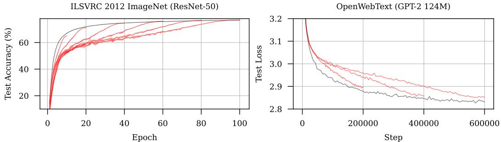
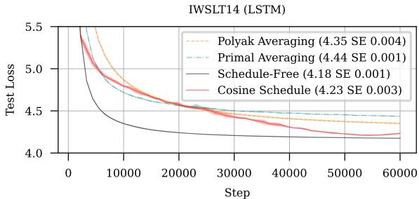
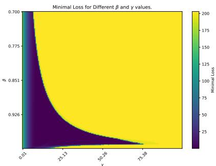
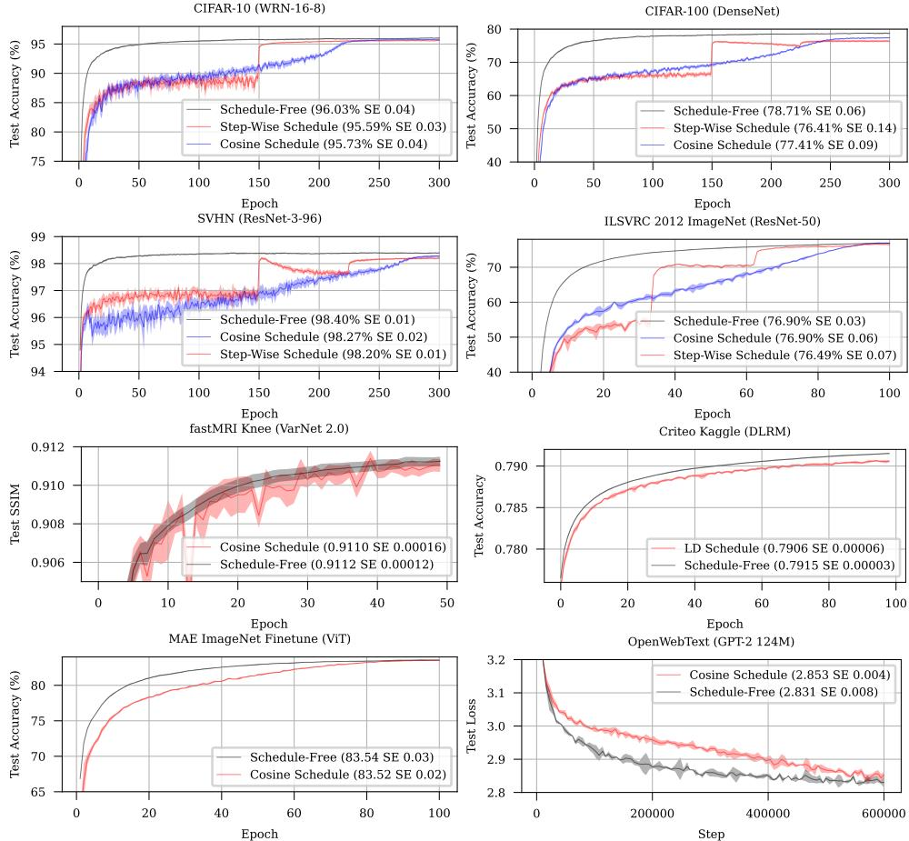
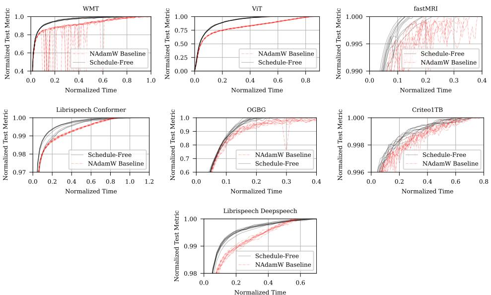
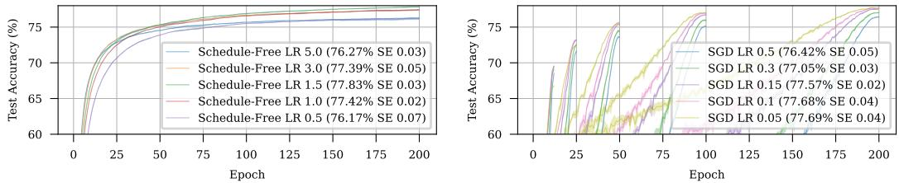
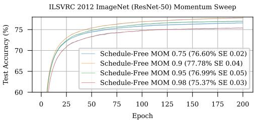
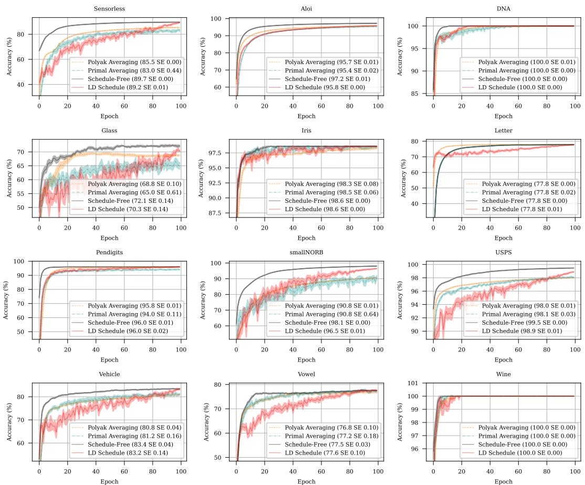
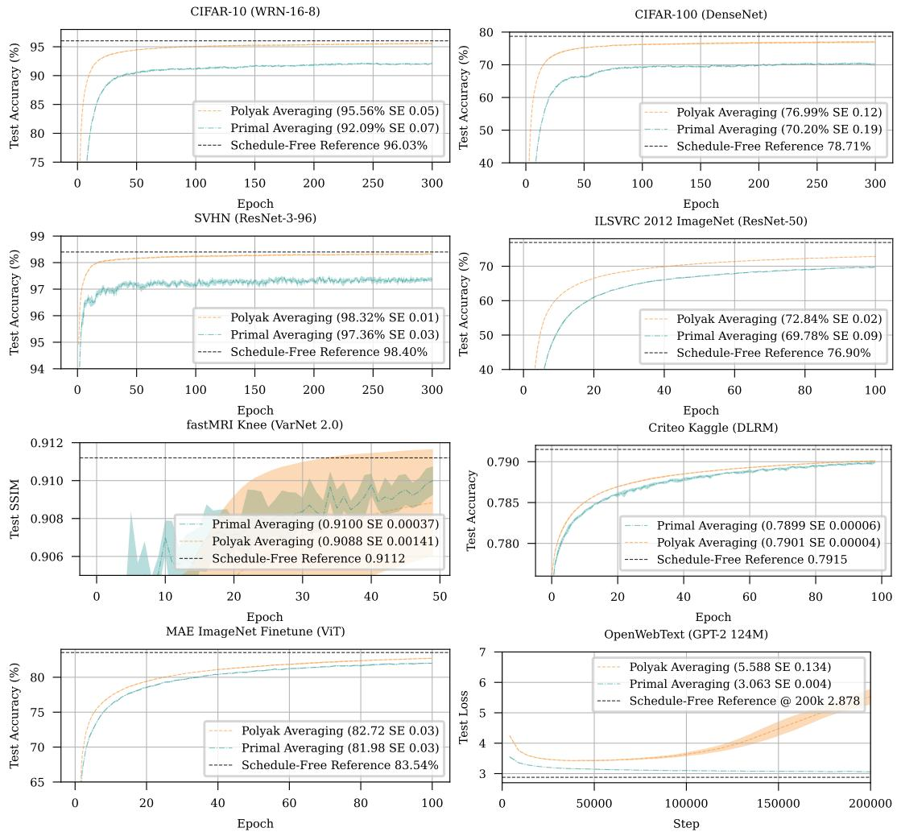
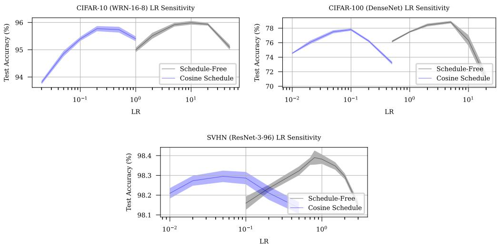

# The Road Less Scheduled

Aaron Defazio1 Fundamental AI Research Team, Meta

Xingyu (Alice) Yang2 Fundamental AI Research Team, Meta

Harsh Mehta Google Research

Konstantin Mishchenko Samsung AI Center

Ahmed Khaled Princeton University

Ashok Cutkosky3 Boston University 2 Engineering Co-lead

1Research Co-lead

3 Senior Author

# Abstract

Existing learning rate schedules that do not require specification of the optimization stopping step $T$ are greatly out-performed by learning rate schedules that depend on $T$ . We propose an approach that avoids the need for this stopping time by eschewing the use of schedules entirely, while exhibiting state-of-the-art performance compared to schedules across a wide family of problems ranging from convex problems to large-scale deep learning problems. Our Schedule-Free approach introduces no additional hyper-parameters over standard optimizers with momentum. Our method is a direct consequence of a new theory we develop that unifies scheduling and iterate averaging. An open source implementation of our method is available1. Schedule-Free AdamW is the core algorithm behind our winning entry to the MLCommons 2024 AlgoPerf Algorithmic Efficiency Challenge Self-Tuning track.

# 1 Introduction

The theory of optimization, as applied in machine learning, has been successful at providing precise, prescriptive results for many problems. However, even in the simplest setting of stochastic gradient descent (SGD) applied to convex Lipschitz functions, there are glaring gaps between what our current theory prescribes and the methods used in practice.

Consider the stochastic gradient descent (SGD) step with step size $\gamma > 0$ , $z _ { t + 1 } = z _ { t } - \gamma g _ { t }$ where $g _ { t }$ is the stochastic (sub-)gradient at time $t$ , computed at the point $z _ { t }$ (formally defined in Section 1.1) of a convex Lipschitz function $f$ . Although standard practice for many classes of problems, classical convergence theory suggests that the expected loss of this $z$ sequence is suboptimal, and that the Polyak-Ruppert (PR) average $x$ of the sequence should be returned instead (Polyak, 1990; Ruppert, 1988):

$$
\begin{array} { r l } & { z _ { t + 1 } = z _ { t } - \gamma g _ { t } } \\ & { x _ { t + 1 } = \left( 1 - c _ { t + 1 } \right) x _ { t } + c _ { t + 1 } z _ { t + 1 } , } \end{array}
$$

where using $c _ { t + 1 } = 1 / ( t + 1 )$ results in $\begin{array} { r } { x _ { t } = \frac { 1 } { T } \sum _ { t = 1 } ^ { T } z _ { t } } \end{array}$ . Despite their theoretical optimality, PR averages give much worse results in practice than using the last-iterate of SGD (Figures 2a,8) — a folk-law result in the field of optimization, and a large theory-practice gap that is often attributed to the mismatch between this simplified problem class and the complexity of problems addressed in practice.

  
Figure 1: Schedule-Free methods (black) closely track the Pareto frontier of loss v.s. training time in a single run. Both Schedule-Free SGD (left) and AdamW (right) match or exceed the performance of cosine learning rate schedules of varying lengths (red).

Recently, Zamani and Glineur (2023) and Defazio et al. (2023) showed that the exact worst-case optimal rates can be achieved via carefully chosen learning rate sequences (also known as schedules) alone, without the use of averaging. This result suggests that schedules have, in some sense, the same role to play as PR averaging in optimization. However, schedules have a critical disadvantage: they require setting the optimization stopping time $T$ in advance.

Motivated by the theory-practice gap for Polyak-Ruppert averaging, we ask the following question:

Do there exist iterate averaging approaches that match the empirical performance of learning rate schedules, without sacrificing theoretical guarantees?

By developing a new link between averaging and learning rate sequences, we introduce a new approach to averaging that maintains the worst-case convergence rate theory of PR averaging, while matching and often exceeding the performance of schedule-based approaches – firmly answering this question in the affirmative.

# Summary of Results

• Our approach does not require the stopping time $T$ to be known or set in advance. It closely tracks the Pareto frontier of loss versus training time during a single training run (Figure 1), while requiring no additional hyper-parameters over the base SGD (with momentum) or Adam optimizer.   
• Our approach uses an alternative form of momentum that replaces traditional momentum. This form has appealing theoretical properties: it is worst case optimal for any choice of the momentum parameter in the convex Lipschitz setting, a property that does not hold for traditional momentum.   
• Our key theoretical result is a new online-to-batch conversion theorem, which establishes the optimality of our method while also unifying several existing online-to-batch theorems.   
• We perform, to our knowledge, one of the largest machine learning optimization algorithm evaluations to date, consisting of 28 problems, ranging from logistic regression to large-scale deep learning problems. This evaluation contains more distinct and diverse largescale machine-learning problems than any other optimizer evaluation we are aware of in the literature. Schedule-Free methods show strong performance, matching or out-performing heavily-tuned cosine schedules.   
• Schedule-Free AdamW won the MLCommons 2024 AlgoPerf Algorithmic Efficiency Challenge Self-Tuning (Adaptive Algorithm) Track, providing independent verification of its SOTA performance against other optimization algorithms in cases where hyperparametertuning is limited. We provide details of our entry and plots comparing it to the competition baseline.

# 1.1 Notation

Consider the stochastic convex minimization $\begin{array} { r } { \operatorname* { m i n } _ { x \in \mathbb { R } ^ { d } } f ( x ) = \mathbb { E } _ { \zeta } [ f ( x , \zeta ) ] } \end{array}$ , where each $f ( x , \zeta )$ is Lipschitz and convex in $x$ , and the expectation is taken over the random variable $\zeta$ . With a slight abuse of notation, we assume we are given, at time step $t$ and any point $y$ that we choose, an arbitrary sub-gradient $\nabla f ( \boldsymbol { y } , \zeta _ { t } )$ from the sub-differential of $f$ .

(a) Schedule-Free learning converges faster than classical averaging approaches, often out-performing tuned schedules.

(b) Incorporating the momentum parameter $\beta$ allows for convergence despite using larger learning rates $\gamma$ on quadratic problems.

# 2 Method

We propose the following method, which we call Schedule-Free SGD:

$$
\begin{array} { r l } & { \quad y _ { t } = ( 1 - \beta ) z _ { t } + \beta x _ { t } , } \\ & { z _ { t + 1 } = z _ { t } - \gamma \nabla f ( y _ { t } , \zeta _ { t } ) , } \\ & { x _ { t + 1 } = \left( 1 - c _ { t + 1 } \right) x _ { t } + c _ { t + 1 } z _ { t + 1 } , } \end{array}
$$

where $c _ { t + 1 } = 1 / ( t + 1 )$ and $z _ { 1 } = x _ { 1 }$ is the initial point. Note that, with this weighting, the $x$ sequence is just a running average of the $z$ sequence. The $y$ sequence is the gradient location sequence (on which gradients are evaluated at each step). The $z$ sequence is the base sequence, which is where the base optimizer’s update is performed (in this case SGD). The $x$ sequence is the evaluation sequence, our best estimate of the weights so far.

This method has a momentum parameter $\beta$ that interpolates between Polyak-Ruppert averaging $( \beta = 0 )$ ) and Primal averaging $\begin{array} { r } { \beta = 1 , } \end{array}$ ). Primal averaging (Nesterov and Shikhman, 2015; Tao et al., 2018; Cutkosky, 2019; Kavis et al., 2019; Sebbouh et al., 2021; Defazio and Gower, 2021; Defazio and Jelassi, 2022), is an approach where the gradient is evaluated at the averaged point $x$ , instead of $z$ :

$$
\begin{array} { r l } & { z _ { t + 1 } = z _ { t } - \gamma \nabla f ( x _ { t } , \zeta _ { t } ) } \\ & { x _ { t + 1 } = \left( 1 - c _ { t + 1 } \right) x _ { t } + c _ { t + 1 } z _ { t + 1 } , } \end{array}
$$

this approach maintains the worst-case optimality of PR averaging but is generally considered to converge too slowly to be practical (Figures 2a,8). The advantage of our interpolation is that we get the best of both worlds. We can achieve the fast convergence of Polyak-Ruppert averaging (since the $z$ sequence moves much quicker than the $x$ sequence), while still keeping some coupling between the returned sequence $x$ and the gradient-evaluation locations $y$ , which increases stability. Values of $\beta$ similar to standard momentum values $\beta \approx 0 . 9$ appear to work well in practice. We will use the notation $\alpha = 1 - \beta$ when convenient.

In this formulation, $\beta = 0 . 9$ gives the practical advantages of momentum, dampening the immediate impact of large gradients, resulting in more stable training. To see this, notice that the immediate effect of the gradient $g _ { t }$ at step $t$ is to introduce $( 1 - \beta ) g _ { t } \stackrel { \textstyle } { = } 0 . 1 g _ { t }$ into the iterate sequence $y$ . This is similar to exponential-moving-average (EMA) momentum, where also $( 1 - \beta ) g _ { t }$ is added into the iterate sequence on step $t$ . However, here the remainder of $g _ { t }$ is very slowly added into $y$ over time, via its place in the average $x$ , whereas with an EMA with $\beta = 0 . 9$ , the majority of the gradient is incorporated within the next 10 steps. So from this viewpoint, the Schedule-Free updates can be seen as a version of momentum that has the same immediate effect, but with a greater delay for adding in the remainder of the gradient. This form of momentum (by interpolation) also has a striking advantage: it does not result in any theoretical slowdown; it gives the optimal worst case (Nesterov, 2013) convergence for the non-smooth convex setting (including constants), for any choice of momentum $\beta$ between 0 and 1 inclusive:

Theorem 1. Suppose $F$ is a convex function, and $\zeta _ { 1 } , \ldots , \zeta _ { T }$ is an i.i.d. sequence of random variables such that $F = \mathbb { E } [ f ( x , \zeta ) ]$ for some function $f$ that is $G$ -Lipschitz in $x$ . For any minimizer $x _ { \star }$ , define

$D = \| x _ { 1 } - x _ { \star } \|$ and $\gamma = D / ( G { \sqrt { T } } )$ . Then for any $\beta \in [ 0 , 1 ]$ , Schedule-Free SGD ensures:

$$
\mathbb { E } [ F ( x _ { T } ) - F ( x _ { \star } ) ] \le \frac { D G } { \sqrt { T } }
$$

In contrast, exponential-moving-average momentum in the non-smooth setting actually hurts the theoretical worst-case convergence rate. The Schedule-Free approach maintains the advantages of momentum (Sutskever et al., 2013) without the potential worst-case slow-down.

# 2.1 General Theory

The method analyzed in Theorem 1 is actually a special-case of a more general result that incorporates arbitrary online optimization algorithms rather than only SGD, as well as arbitrary time-varying sequences of $\beta _ { t }$ . The proof is provided in Appendix A.

Theorem 2. Let $F$ be a convex function. Let $\zeta _ { 1 } , \ldots , \zeta _ { T }$ be an iid sequence such that $F ( x ) =$ $\mathbb { E } _ { \zeta } [ f ( x , \zeta ) ]$ . Let $z _ { 1 } , \dots , z _ { T }$ be arbitrary vectors and let $w _ { 1 } , \ldots , w _ { T }$ and $\beta _ { 1 } , \ldots , \beta _ { T }$ be arbitrary numbers in $[ 0 , 1 ]$ such that $z _ { t } , \ w _ { t }$ and $\beta _ { t }$ are independent of $\zeta _ { t } , \ldots , \zeta _ { T }$ . Set:

$$
\begin{array} { l } { \displaystyle x _ { t } = \frac { \sum _ { i = 1 } ^ { t } w _ { i } z _ { i } } { \sum _ { i = 1 } ^ { t } w _ { i } } = x _ { t - 1 } \underbrace { \left( 1 - \frac { w _ { t } } { \sum _ { i = 1 } ^ { t } w _ { i } } \right) } _ { \triangleq 1 - c _ { t } } + \underbrace { \frac { w _ { t } } { \sum _ { i = 1 } ^ { t } w _ { i } } } _ { \triangleq c _ { t } } z _ { t } } \\ { \displaystyle y _ { t } = \beta _ { t } x _ { t } + ( 1 - \beta _ { t } ) z _ { t } } \\ { \displaystyle g _ { t } = \nabla f ( y _ { t } , \zeta _ { t } ) . } \end{array}
$$

Then we have for all $x _ { \star }$ :

$$
\mathbb { E } [ F ( x _ { T } ) - F ( x _ { \star } ) ] \leq \frac { \mathbb { E } [ \sum _ { t = 1 } ^ { T } w _ { t } \langle g _ { t } , z _ { t } - x _ { \star } \rangle ] } { \sum _ { i = 1 } ^ { T } w _ { i } } .
$$

To recover Theorem 1 from the above result, notice that the algorithm analyzed by Theorem 1 is captured by Theorem 2 with $w _ { t } = 1$ , $\beta _ { t }$ a constant $\beta$ and $z _ { t + 1 } = z _ { t } - \gamma g _ { t }$ for all $t$ . Next, observe that the sequence $z _ { 1 } , \dots , z _ { T }$ is performing online gradient descent (Zinkevich, 2003), for which it is well-known that the regret $\textstyle \sum _ { t = 1 } ^ { T } \langle g _ { t } , z _ { t } - x _ { \star } \rangle$ (appearing in the numerator of our result) is bounded by $D G { \sqrt { T } }$ and so the result of Theorem 1 immediately follows.

The regret is the principle object of study in online convex optimization (Hazan, 2022; Orabona, 2019). Viewed in this light, Theorem 2 provides a way to convert an online convex optimization algorithm into a stochastic optimization algorithm: it is a form of online-to-batch conversion (Cesa-Bianchi et al., 2004). Classical online-to-batch conversions are a standard technique for obtaining convergence bounds for many stochastic optimization algorithms, including stochastic gradient descent (Zinkevich, 2003), AdaGrad (Duchi et al., 2011), AMSGrad (Reddi et al., 2018), and Adam (Kingma and Ba, 2014). All of these algorithms can be analyzed as online convex optimization algorithms: they provide bounds on the regret $\begin{array} { r } { \sum _ { t = 1 } ^ { T } \langle g _ { t } , z _ { t } - x _ { \star } \rangle } \end{array}$ rather than direct convergence guarantees. It is convergence guarantees via an online-to-batch conversion. Our result provides a more versatile method for effecting this conversion.

Theorem 2 actually provides a “grand unification” of a number of different online-to-batch conversions that have been proposed over the years. Most of these conversion methods were first developed specifically to provide convergence analysis for SGD (or some variant such as dual averaging or mirror descent), and then generalized into techniques that apply to any online convex optimization algorithm. For example, the classical Polyak averaging method can be generalized to form the “standard” online-to-batch conversion of Cesa-Bianchi et al. (2004), and is immediately recovered from Theorem 2 by setting $w _ { t } = 1$ and $\beta _ { t } = 0$ for all $t$ . More recently Nesterov and Shikhman (2015); Tao et al. (2018) derived an alternative to Polyak averaging that was later generalized to work with arbitrarily online convex optimization algorithms by Cutkosky (2019); Kavis et al. (2019), and then observed to actually be equivalent to the heavy-ball momentum by Defazio (2020); Defazio and Gower (2021); Defazio and Jelassi (2022). This method is recovered by our Theorem 2 by setting $w _ { t } = 1$ and $\beta _ { t } = 1$ for all $t$ . Finally, very recently Zamani and Glineur (2023) discovered that gradient descent with a linear decay stepsize provides a last-iterate convergence guarantee, which was again generalized to an online-to-batch conversion by Defazio et al. (2023). This final result is also recovered by Theorem 2 by setting $w _ { t } = 1$ and $\begin{array} { r } { \beta _ { t } = \frac { t } { T } } \end{array}$ (see Appendix B).

In Appendix C, we give a further tightening of Theorem 2 – it can be improved to an equality by precisely tracking additional terms that appear on the right-hand-side. This tightened version can be used to show convergence rate results for smooth losses, both with and without strong-convexity. As an example application, we show that schedule-free optimistic-gradient methods (Rakhlin and Sridharan, 2013) converge with accelerated rates:

$$
\mathbb { E } [ F ( x _ { T } ) - F ( x _ { \star } ) ] = O \left( \frac { D ^ { 2 } L } { T ^ { 2 } } + \frac { D \sigma } { \sqrt { T } } \right) .
$$

# 2.2 On Large Learning Rates

Under classical worst-case convergence theory, the optimal choice of √ $\gamma$ for a fixed duration training time $T$ is $\gamma = D / ( G { \sqrt { T } } )$ . This is the rate used in our bounds for Theorem 1 above. For any-time convergence (i.e. when stopping is allowed at any timestep), our proposed method can, in theory, be used with the standard learning rate sequence:

$$
\gamma _ { t } = \frac { D } { G \sqrt { t } } .
$$

However, learning rate sequences of this form have poor practical performance (Defazio et al., 2023). Instead, much larger steps of the form $D / G$ give far better performance across virtually all problems in applications (Defazio and Mishchenko, 2023) — another theory-practice mismatch that is virtually undiscussed in the literature. Existing theory suggests that this step-size is too large to give $\mathcal { O } ( 1 / \sqrt { T } )$ convergence, however, as we show below, there is an important special case where such large step sizes also give optimal rates up to constant factors.

Theorem 3. Consider the online learning setting with bounded gradients $g _ { t }$ . Let $z _ { t + 1 } = z _ { t } - \gamma g _ { t }$ Let $D = \| z _ { 1 } - z _ { * } \|$ for arbitrary reference point $z _ { * }$ and define $G = \operatorname* { m a x } _ { t \leq T } \| g _ { t } \|$ . Suppose that the chosen step-size is $\gamma = D / G$ , then if it holds that:

$$
\sum _ { t = 1 } ^ { T } \left. g _ { t } , z _ { t } - z _ { 1 } \right. \leq D { \sqrt { \sum _ { t = 1 } ^ { T } \left\| g _ { t } \right\| ^ { 2 } } } ,
$$

then:

$$
\frac { 1 } { T } \sum _ { t = 1 } ^ { T } \left. g _ { t } , z _ { t } - z _ { * } \right. = \mathcal { O } \left( \frac { D } { T } \sqrt { \sum _ { t = 1 } ^ { T } \left. g _ { t } \right. ^ { 2 } } \right) .
$$

This regret bound for SGD implies a convergence rate bound for Schedule-Free SGD by application of our online-to-batch conversion. Condition 31 can be checked during a training run (Using reference point $z _ { * } = x _ { T }$ , and so $D = \| x _ { 1 } - x _ { T } \| )$ , and we find that it holds for every problem we consider in our experiments in Section 4. More generally, the full conditions under which large learning rates can be used are not yet fully understood for stochastic problems. In the quadratic case, Bach and Moulines (2013) established that large fixed step-sizes give optimal convergence rates, and we conjecture that the success of large learning rates may be attributed to asymptotic quadratic behavior of the learning process.

Empirically, we find that Schedule-Free momentum enables the use of larger learning rates $\gamma > 0$ even in quadratic minimization problems $\begin{array} { r } { f ( x ) = \frac { 1 } { 2 } x ^ { \top } A x - b ^ { \top } x } \end{array}$ . We generate 10 different such 20-dimensional problems with eigenvalues drawn log-uniformly in $[ 1 0 ^ { - 6 } , 1 ]$ . We plot the average minimal loss achieved as a function of the two parameters $\beta$ and $\gamma$ in Figure 2b. We can see that when the learning rate we use is small, what value of $\beta$ we choose has little to no effect on the convergence of the algorithm. However, when $\gamma$ is large, choosing $\beta < 1$ becomes crucial to achieving convergence.

# 3 Related Work

The proposed method has a striking resemblance to Nesterov’s accelerated method (Nesterov, 1983, 2013) for $L$ -smooth functions, which can be written in the AC-SA form (Lan, 2012):

$$
\begin{array} { c } { y _ { t } = ( 1 - c _ { t + 1 } ) x _ { t } + c _ { t + 1 } z _ { t } } \\ { \displaystyle z _ { t + 1 } = z _ { t } - \frac { k + 1 } { 2 L } \nabla f ( y _ { t } ) } \\ { x _ { t + 1 } = \left( 1 - c _ { t + 1 } \right) x _ { t } + c _ { t + 1 } z _ { t + 1 } , } \end{array}
$$

where $c _ { t + 1 } = 2 / ( t + 2 )$ . The averaging constant, and more generally

$$
c _ { t + 1 } = { \frac { r + 1 } { t + r + 1 } } ,
$$

for any real $r > - 1$ is equivalent to the weighted average (Shamir and Zhang, 2013; Defazio and Gower, 2021) $\begin{array} { r } { x _ { t } \propto \sum _ { t = 1 } ^ { T } t ^ { \bar { r } } z _ { t } } \end{array}$ , where $t ^ { \bar { r } }$ represents the $r$ th factorial power of $t$ . Our framework is compatible with factorial power averages without sacrificing theoretical guarantees.

Our approach differs from conventional accelerated methods by using a different weight for the $y _ { t }$ and $x _ { t }$ interpolations. We use a constant weight for $y _ { t }$ and a decreasing weight for $x _ { t }$ . Accelerated methods for strongly-convex problems use a constant weight for both, and those for non-strongly convex use an decreasing weight for both, so our approach doesn’t directly correspond to either class of accelerated method. Accelerated methods also use a much larger step size for the $z _ { t }$ sequence than our approach.

The use of equal-weighted averages is less common than the use of exponential weighting in the practical deep learning optimization literature. Exponential moving averages (EMA) of the iterate sequence are used in the popular Lookahead optimizer (Zhang et al., 2019). In the case of SGD, it performs $i = 1 \ldots k$ inner steps:

$$
z _ { t , i } = z _ { t , i - 1 } - \gamma \nabla f ( z _ { t , i - 1 } )
$$

followed by an outer step:

$$
x _ { t } = x _ { t - 1 } + \alpha \left( z _ { t , k } - x _ { t - 1 } \right) .
$$

The inner optimizer then starts at $z _ { t + 1 , 0 } ~ = ~ x _ { t - 1 }$ . The Lookahead method can be seen as the EMA version of primal averaging, just as exponential weight averaging is the EMA version of Polyak-Ruppert averaging.

Tail averaging, either using an exponential moving average or an equal-weighted average, is a common ‘folk-law’ technique that often yields a practical improvement. For instance, this kind of averaging is used without citation by the influential work of Szegedy et al. (2016): “Model evaluations are performed using a running average of the parameters computed over time.”, and by Vaswani et al. (2017): “...averaged the last 20 checkpoints”. Tail averages are typically “Polyak-Ruppert” style averaging as the average is not used for gradient evaluations during training.

More sophisticated tail averaging approaches such as Stochastic Weight Averaging (Izmailov et al., 2018) and LAtest Weight Averaging (Kaddour, 2022; Sanyal et al., 2023) combine averaging with large or cyclic learning rates. They are not a replacement for scheduling, instead they aim to improve final test metrics. They generally introduce additional hyper-parameters to tune, and require additional memory. It is possible to use SWA and LAWA on top of our approach, potentially giving further gains.

Sandler et al. (2023) show via a stochastic quadratic analysis framework that averaging and learning rate decreases achieve the same effective learning rate. For instance, and average of two points along the training trajectory can give almost identical results to using a learning rate two times smaller. Stochastic quadratic problems are particularly special, Bach and Moulines (2013) have shown that Polyak averaging gives optimal $\mathcal { O } ( \bar { 1 } / T )$ rates without the use of decreasing time-dependent step size sequences in this setting.

Within optimization theory, tail averages can be used to improve the convergence rate for stochastic non-smooth SGD in the strongly convex setting from $\mathcal { O } ( \log ( T ) / T )$ to $\mathcal { O } ( 1 / \bar { T } )$ (Rakhlin et al., 2012), although at the expense of worse constants compared to using weighted averages of the whole sequence (Lacoste-Julien et al., 2012).

Portes et al. (2022) use cyclic learning rate schedules with increasing cycle periods to give a method that explores multiple points along the Pareto frontier of training time vs eval performance. Each point at the end of a cycle is an approximation to the model from a tuned schedule ending at that time. Our method gives the entire frontier, rather than just a few points along the path. In addition, our method matches or improves upon best known schedules, whereas the “... cyclic trade-off curve underestimated the standard trade-off curve by a margin of $0 . 5 \%$ validation accuracy” (Portes et al., 2022).

# 4 Experiments

For our deep learning experiments, we evaluated Schedule-Free learning on a set benchmark tasks that are commonly used in the optimization research literature:

CIFAR10 A Wide ResNet (16-8) architecture (Zagoruyko and Komodakis, 2016) on the CIFAR10 image classification dataset.   
CIFAR100 A DenseNet (Huang et al., 2017) architecture on the CIFAR-100 (100-class) classification dataset.   
SVHN A deep ResNet architecture (3-96) on the Street View House Numbers (SVHN) dataset.   
ImageNet A standard ResNet-50 architecture (He et al., 2016) on the ILSVRC 2012 ImageNet (Russakovsky et al., 2015) classification dataset.   
IWSLT14 A LSTM architecture (Wiseman and Rush, 2016) on the IWSLT14 German-English translation dataset (Cettolo et al., 2014).   
DLRM The DLRM (Naumov et al., 2019) architecture on the Criteo Kaggle Display Advertising dataset (Jean-Baptiste Tien, 2014).   
MRI A stacked U-Net architecture (Sriram et al., 2020) on the fastMRI dataset (Zbontar et al., 2018).   
MAE Fine-tuning a pretrained Masked Autoencoder (He et al., 2021) ViT (patch16-512d-8b) on the ILSVRC 2012 ImageNet dataset.   
NanoGPT A 124M parameter GPT-2 (Radford et al., 2019) style decoder-only transformer on the OpenWebText dataset (Gokaslan and Cohen, 2019).

For each problem, both the baseline and the Schedule-Free method were tuned by sweeping both the weight decay and learning rate on a grid. We also swept $\beta$ over two values, 0.9 and 0.98. Final hyper-parameters are listed in the Appendix. Schedule-Free SGD was used for CIFAR10, CIFAR100, SVHN and ImageNet, and Schedule-Free AdamW (Loshchilov and Hutter, 2019) was used for the remaining tasks. We further include a step-wise schedule as a comparison on problems where step-wise schedules are customary. Further results for Polyak and Primal averaging are in Appendix I.

Our approach shows very strong performance (Figure 3) out-performing existing state-of-the-art cosine schedules on CIFAR-10, CIFAR-100, SVHN, IWSLT-14 (Figure 2a) and OpenWebText GPT-2 problems, as well as the state-of-the-art Linear Decay schedules on the fastMRI and Criteo DLRM tasks. On the remaining two problems, MAE fine-tuning and ImageNet ResNet-50 training, it ties with the existing best schedules.

In general, the optimal learning rates for the Schedule-Free variants were larger than the optimal values for the base optimizers. The ability to use larger learning rates without diverging may be a contributing factor to the faster convergence of Schedule-Free methods. The $\beta$ parameter works well at the default value of 0.9 for all problems except NanoGPT, where the loss started to increase rapidly when 0.9 was used (similar to the Polyak Averaging results in Appendix I). The larger $\beta = 0 . 9 8$ value in our sweep was stable.

# 4.1 MLCommons Algorithmic Efficiency benchmark

The AlgoPerf challenge (Dahl et al., 2023) is designed to be a large-scale and comprehensive benchmark for deep learning optimization algorithms, covering major data domains and architectures. It includes Transformers, ConvNets and U-Net models across image, language, graph and speech domains, and contains 8 problems total. We evaluated Schedule-Free AdamW following the competition guidelines, comparing against NAdamW, the competition reference Algorithm, running 10 seeds of each. As this is a time-to-target competition, traditional error bars are not appropriate so we instead plot all 10 seeds separately. Note that we excluded one benchmark problem, ResNet-50 training, as neither AdamW nor NAdamW can hit the target accuracy on that task.

  
Figure 3: Deep Learning Experiments

The self-tuning track restricts participants to provide a single set of hyper-parameters to use for all 8 problems. Given the large number of problems, this gives performance representative of a good default configuration.

Schedule-Free AdamW performs well across all considered tasks, out-performing the baseline on the WMT, VIT, FASTMRI and OGBG training, while tying on the Conformer and Criteo workloads, and marginally under-performing on the DeepSpeech workload. We attribute the performance on the Conformer and DeepSpeech tasks to their use of batch-norm - the AlgoPerf setup doesn’t easily allow us to update the BN running statistics on the $x$ sequence, which is necessary with our method to get the best performance (See Section 4.3).

# 4.2 Convex Problems

We validated the Schedule-Free learning approach on a set of standard logistic regression problems from the LibSVM repository. For each problem, and each method separately, we performed a full learning rate sweep on a power-of-two grid, and plotted mean and standard-error of the final train accuracy from 10 seeds using the best learning rate found.

Schedule-Free learning out-performs both averaging approaches and the state-of-the-art linear decay (LD) schedule baseline (Figure 7). It converges faster on all but 1 of 12 problems, has higher accuracy on 6 of the problems, and ties the baseline on the remaining problems. This demonstrates that the performance advantages of Schedule-Free methods are not limited to non-convex problems.

# 4.3 Implementation Concerns

The Schedule-Free variant of a method typically has the same memory requirements as the base method. For instance, Schedule-Free SGD requires no extra memory over standard SGD with momentum. Whereas SGDM tracks the current point $x$ and the momentum buffer $m$ , we can track $x$ and $z$ . The quantity $y$ can be computed directly from the latest values of $x$ and $z$ , and so doesn’t need

  
Figure 4: Schedule-Free Adam compared to target-setting baseline on the Algoperf competition self-tuning track.

# Algorithm 1 Schedule-Free AdamW

1: Input: $x _ { 1 }$ , learning rate $\gamma$ , decay $\lambda$ , warmup steps $T _ { \mathrm { w a r m u p } } , \beta _ { 1 } , \beta _ { 2 } , \epsilon$   
2: $z _ { 1 } = x _ { 1 }$   
3: $v _ { 0 } = 0$   
4: for $t = 1$ to T do   
5: $y _ { t } = ( 1 - \beta _ { 1 } ) z _ { t } + \beta _ { 1 } x _ { t }$ ▷ Momentum via interpolation   
6: $g _ { t } \in \partial f ( y _ { t } , \zeta _ { t } )$ $\triangleright$ Gradient is evaluated at $y$   
7: $v _ { t } = \beta _ { 2 } v _ { t - 1 } + ( 1 - \beta _ { 2 } ) g _ { t } ^ { 2 }$   
8: $\gamma _ { t } = \gamma \sqrt { 1 - \beta _ { 2 } ^ { t } } \mathrm { m i n } ( 1 , t / T _ { \mathrm { w a r m u p } } )$ ▷ LR includes warmup and Adam bias-correction   
9: $z _ { t + 1 } = z _ { t } - \gamma _ { t } g _ { t } / ( \sqrt { v _ { t } } + \epsilon ) - \gamma _ { t } \lambda y _ { t }$   
10: c t +1 = γ 2P tt γ 2   
11: $x _ { t + 1 } = \left( 1 - c _ { t + 1 } \right) x _ { t } + c _ { t + 1 } z _ { t + 1 }$ ▷ Update weighted iterate average   
12: end for   
13: Return $x _ { T }$   
xx

to be explicitly stored. It’s also possible to instead store $z$ and $y$ , and then compute $x$ when needed.   
This low memory usage is the case for AdamW also, see Algorithm 1.

Our efficient PyTorch implementation actually uses one buffer to always store $z$ and the primary parameter buffer to store either $x$ or $y$ , with the stored quantity flipping between the two for training and test/inference passes.

Our method requires extra code to handle models where batch norm is used. This is due to the fact that BatchNorm layers maintain a running_mean and running_var to track batch statistics which is calculated at $y$ . For model evaluation, these buffers need to be updated to match the statistics on the $x$ sequence. This can be done by evaluating a small number of training batches using $x$ right before each eval. More sophisticated approaches such as PreciseBN (Wu and Johnson, 2021) can also be used. This calculation is not needed for other normalization layers that do not use batch-statistics.

Learning rate warmup is still necessary for our method. We use a linear warmup for a fixed duration, and fuse the Adam bias-correction term into the learning rate for simplicity (this potentially impacts the effect of weight-decay during early iterations), giving a learning rate LR $\gamma _ { t } = \gamma \sqrt { 1 - \beta _ { 2 } ^ { t } } \mathrm { m i n } ( 1 , t / T _ { \mathrm { w a r m u p } } )$ that approaches $\gamma$ when the warmup and bias-correction period ends. We found that performance was greatly improved by using a weighted $c _ { t }$ sequence when warmup is used, weighted by the square of the $\gamma _ { t }$ used during warmup:

  
Figure 6: Comparison of the LR sensitivity of Schedule-Free training and cosine schedule training

$$
c _ { t + 1 } = \frac { \gamma _ { t } ^ { 2 } } { \sum _ { i = 1 } ^ { t } \gamma _ { i } ^ { 2 } } .
$$

This sequence decreases at a $1 / t$ rate after the learning rate warmup. It is shifted by one from the indexing used in Theorem 2, which is done to simplify the implementation. This sequence is motivated by Theorem 2’s weighting sequences, which suggest weights proportional to polynomials of the learning rate. This sequence was used for both SGD and AdamW experiments.

Weight decay for Schedule-Free methods can be computed at either the $y$ or $z$ sequences. We used decay at $y$ for our experiments, as this matches the interpretation of weight-decay as the use of an additional L2-regularizer term in the loss. We found that computing the regularization at $y$ gives significantly better performance on some problems including ImageNet and NanoGPT training.

# 5 Parameter Sensitivity

For Schedule-Free learning to be truly schedulefree, it’s important that the momentum hyperparameter doesn’t implicitly have a dependence on the time-horizon. If tuning this parameter gave different values depending on the training duration, then the problem of setting the horizon has just been shifted to setting the momentum value. In Figure 5 we run ImageNet training with Schedule-Free SGD for a longerthen-standard 200 epochs with a variety of momentum values, with the LR fixed to 1.5. We find that the best choice of momentum ${ \cal { B } } = 0 . 9 ,$ is the same for all durations of training.

  
Figure 5: Sensitivity to momentum values

Schedule-Free learning has a similar mild time-horizon dependency for the baseline learning rate value as schedule-based approaches. Figure 6 shows that the optimal learning rate stays the same for broad range of values, for both Schedule-Free and Schedule based training. For short duration training $\leq 2 5$ epochs), larger LR values begin to show the best performance. Appendix J shows the sensitivity of the final test accuracy to the baseline learning rate for a selection of our test problems, in comparison to the baseline optimizer with a cosine schedule. We see that the overall sensitivity is similar to the baseline optimizer in each problem.

# 6 Conclusion

Two roads diverged in a wood, and I— I took the one less traveled by, And that has made all the difference. - Robert Frost

We have presented Schedule-Free learning, an optimization approach that removes the need to specify a learning rate schedule while matching or outperforming schedule-based learning. The primary practical limitation is the need to sweep learning rate and weight decay, as the best values differ from the those used with a schedule. We provide a preliminary theoretical exploration of the method, establishing its worst-case optimal performance for non-smooth Lipschitz convex optimization.

# Funding Acknowledgments

AC is supported by NSF grant number CCF-2211718.

References   
Bach, F. and Moulines, E. (2013). Non-strongly-convex smooth stochastic approximation with convergence rate $O ( 1 / n )$ . In Burges, C., Bottou, L., Welling, M., Ghahramani, Z., and Weinberger, K., editors, Advances in Neural Information Processing Systems, volume 26. Curran Associates, Inc.   
Cesa-Bianchi, N., Conconi, A., and Gentile, C. (2004). On the generalization ability of on-line learning algorithms. IEEE Transactions on Information Theory, 50(9):2050–2057.   
Cettolo, M., Niehues, J., Stüker, S., Bentivogli, L., and Federico, M. (2014). Report on the 11th IWSLT evaluation campaign. In IWSLT.   
Chiang, C.-K., Yang, T., Lee, C.-J., Mahdavi, M., Lu, C.-J., Jin, R., and Zhu, S. (2012). Online optimization with gradual variations. In Conference on Learning Theory, pages 6–1. JMLR Workshop and Conference Proceedings.   
Cutkosky, A. (2019). Anytime online-to-batch, optimism and acceleration. In International conference on machine learning, pages 1446–1454. PMLR.   
Dahl, G. E., Schneider, F., Nado, Z., Agarwal, N., Sastry, C. S., Hennig, P., Medapati, S., Eschenhagen, R., Kasimbeg, P., Suo, D., Bae, J., Gilmer, J., Peirson, A. L., Khan, B., Anil, R., Rabbat, M., Krishnan, S., Snider, D., Amid, E., Chen, K., Maddison, C. J., Vasudev, R., Badura, M., Garg, A., and Mattson, P. (2023). Benchmarking Neural Network Training Algorithms.   
Defazio, A. (2020). Momentum via primal averaging: Theoretical insights and learning rate schedules for non-convex optimization.   
Defazio, A., Cutkosky, A., Mehta, H., and Mishchenko, K. (2023). When, why and how much? adaptive learning rate scheduling by refinement.   
Defazio, A. and Gower, R. M. (2021). The power of factorial powers: New parameter settings for (stochastic) optimization. In Balasubramanian, V. N. and Tsang, I., editors, Proceedings of The 13th Asian Conference on Machine Learning, volume 157 of Proceedings of Machine Learning Research, pages 49–64. PMLR.   
Defazio, A. and Jelassi, S. (2022). Adaptivity without compromise: A momentumized, adaptive, dual averaged gradient method for stochastic optimization. Journal of Machine Learning Research, 23:1–34.   
Defazio, A. and Mishchenko, K. (2023). Learning-rate-free learning by D-adaptation. The 40th International Conference on Machine Learning (ICML 2023).   
Duchi, J., Hazan, E., and Singer, Y. (2011). Adaptive subgradient methods for online learning and stochastic optimization. Journal of Machine Learning Research, 12(61).   
Gokaslan, A. and Cohen, V. (2019). Openwebtext corpus. http://Skylion007.github.io/ OpenWebTextCorpus.   
Hazan, E. (2022). Introduction to online convex optimization. MIT Press.   
Hazan, E. and Kale, S. (2010). Extracting certainty from uncertainty: Regret bounded by variation in costs. Machine learning, 80:165–188.   
He, K., Chen, X., Xie, S., Li, Y., Dollár, P., and Girshick, R. (2021). Masked autoencoders are scalable vision learners. arXiv:2111.06377.   
He, K., Zhang, X., Ren, S., and Sun, J. (2016). Deep residual learning for image recognition. In Proceedings of the IEEE conference on computer vision and pattern recognition.   
Huang, G., Liu, Z., Van Der Maaten, L., and Weinberger, K. Q. (2017). Densely connected convolutional networks. In 2017 IEEE Conference on Computer Vision and Pattern Recognition (CVPR), pages 2261–2269.   
Izmailov, P., Podoprikhin, D., Garipov, T., Vetrov, D., and Wilson, A. G. (2018). Averaging weights leads to wider optima and better generalization. In Conference on Uncertainty in Artificial Intelligence (UAI).   
Jean-Baptiste Tien, joycenv, O. C. (2014). Display advertising challenge.   
Joulani, P., György, A., and Szepesvári, C. (2017). A modular analysis of adaptive (non-) convex optimization: Optimism, composite objectives, and variational bounds. In International Conference on Algorithmic Learning Theory, pages 681–720. PMLR.   
Joulani, P., Raj, A., Gyorgy, A., and Szepesvári, C. (2020). A simpler approach to accelerated optimization: iterative averaging meets optimism. In International conference on machine learning, pages 4984–4993. PMLR.   
Kaddour, J. (2022). Stop wasting my time! saving days of ImageNet and BERT training with latest weight averaging.   
Kavis, A., Levy, K. Y., Bach, F., and Cevher, V. (2019). UniXGrad: A universal, adaptive algorithm with optimal guarantees for constrained optimization. Advances in neural information processing systems, 32.   
Kingma, D. P. and Ba, J. (2014). Adam: a method for stochastic optimization. In International Conference on Learning Representations.   
Lacoste-Julien, S., Schmidt, M., and Bach, F. (2012). A simpler approach to obtaining an $o ( 1 / t )$ convergence rate for the projected stochastic subgradient method.   
Lan, G. (2012). An optimal method for stochastic composite optimization. Mathematical Programming, 133(1):365–397.   
Loshchilov, I. and Hutter, F. (2019). Decoupled weight decay regularization. In International Conference on Learning Representations.   
Naumov, M., Mudigere, D., Shi, H. M., Huang, J., Sundaraman, N., Park, J., Wang, X., Gupta, U., Wu, C., Azzolini, A. G., Dzhulgakov, D., Mallevich, A., Cherniavskii, I., Lu, Y., Krishnamoorthi, R., Yu, A., Kondratenko, V., Pereira, S., Chen, X., Chen, W., Rao, V., Jia, B., Xiong, L., and Smelyanskiy, M. (2019). Deep learning recommendation model for personalization and recommendation systems. CoRR.   
Nesterov, Y. (1983). A method for solving a convex programming problem with convergence rate $O ( 1 / k ^ { 2 } )$ . Soviet Mathematics Doklady.   
Nesterov, Y. (2013). Lectures on Convex Optimization. Springer Nature.   
Nesterov, Y. and Shikhman, V. (2015). Quasi-monotone subgradient methods for nonsmooth convex minimization. Journal of Optimization Theory and Applications, 165(3):917–940.   
Orabona, F. (2019). A modern introduction to online learning. arXiv preprint arXiv:1912.13213.   
Polyak, B. (1990). New stochastic approximation type procedures. Avtomatica i Telemekhanika, 7:98–107.   
Portes, J., Blalock, D., Stephenson, C., and Frankle, J. (2022). Fast benchmarking of accuracy vs. training time with cyclic learning rates.   
Radford, A., Wu, J., Child, R., Luan, D., Amodei, D., and Sutskever, I. (2019). Language models are unsupervised multitask learners. Technical report, OpenAI.   
Rakhlin, A., Shamir, O., and Sridharan, K. (2012). Making gradient descent optimal for strongly convex stochastic optimization. In Proceedings of the 29th International Coference on International Conference on Machine Learning.

Rakhlin, A. and Sridharan, K. (2013). Online learning with predictable sequences. In Conference on Learning Theory, pages 993–1019. PMLR.

Reddi, S. J., Kale, S., and Kumar, S. (2018). On the convergence of Adam and beyond. In International Conference on Learning Representations.

Ruppert, D. (1988). Efficient estimations from a slowly convergent Robbins-Monro process. Technical Report, Cornell University.

Russakovsky, O., Deng, J., Su, H., Krause, J., Satheesh, S., Ma, S., Huang, Z., Karpathy, A., Khosla, A., Bernstein, M., Berg, A. C., and Fei-Fei, L. (2015). ImageNet Large Scale Visual Recognition Challenge. International Journal of Computer Vision (IJCV), 115(3).

Sandler, M., Zhmoginov, A., Vladymyrov, M., and Miller, N. (2023). Training trajectories, mini-batch losses and the curious role of the learning rate.

Sanyal, S., Neerkaje, A., Kaddour, J., Kumar, A., and Sanghavi, S. (2023). Early weight averaging meets high learning rates for LLM pre-training.

Sebbouh, O., Gower, R. M., and Defazio, A. (2021). On the (asymptotic) convergence of stochastic gradient descent and stochastic heavy ball. In Conference on Learning Theory, COLT 2021, Proceedings of Machine Learning Research. PMLR.

Shamir, O. and Zhang, T. (2013). Stochastic gradient descent for non-smooth optimization: Convergence results and optimal averaging schemes. In Proceedings of the 30th International Conference on Machine Learning.

Sriram, A., Zbontar, J., Murrell, T., Defazio, A., Zitnick, C. L., Yakubova, N., Knoll, F., and Johnson, P. (2020). End-to-end variational networks for accelerated MRI reconstruction. In International Conference on Medical Image Computing and Computer-Assisted Intervention. Springer.

Sutskever, I., Martens, J., Dahl, G., and Hinton, G. E. (2013). On the importance of initialization and momentum in deep learning. In Proceedings of the 30th International Conference on International Conference on Machine Learning - Volume 28. JMLR.org.

Szegedy, C., Vanhoucke, V., Ioffe, S., Shlens, J., and Wojna, Z. (2016). Rethinking the inception architecture for computer vision. In 2016 IEEE Conference on Computer Vision and Pattern Recognition (CVPR), pages 2818–2826.

Tao, W., Pan, Z., Wu, G., and Tao, Q. (2018). Primal averaging: A new gradient evaluation step to attain the optimal individual convergence. IEEE Transactions on Cybernetics, PP:1–11.

Vaswani, A., Shazeer, N., Parmar, N., Uszkoreit, J., Jones, L., Gomez, A. N., Kaiser, L. u., and Polosukhin, I. (2017). Attention is all you need. In Guyon, I., Luxburg, U. V., Bengio, S., Wallach, H., Fergus, R., Vishwanathan, S., and Garnett, R., editors, Advances in Neural Information Processing Systems, volume 30. Curran Associates, Inc.

Wiseman, S. and Rush, A. M. (2016). Sequence-to-sequence learning as beam-search optimization. In Proceedings of the 2016 Conference on Empirical Methods in Natural Language Processing. Association for Computational Linguistics.

Wu, Y. and Johnson, J. (2021). Rethinking "batch" in batchnorm.

Zagoruyko, S. and Komodakis, N. (2016). Wide residual networks. In Proceedings of the British Machine Vision Conference (BMVC).

Zamani, M. and Glineur, F. (2023). Exact convergence rate of the last iterate in subgradient methods.

Zbontar, J., Knoll, F., Sriram, A., Muckley, M. J., Bruno, M., Defazio, A., Parente, M., Geras, K. J., Katsnelson, J., Chandarana, H., et al. (2018). fastMRI: An open dataset and benchmarks for accelerated MRI. arXiv preprint arXiv:1811.08839.

Zhang, M., Lucas, J., Ba, J., and Hinton, G. E. (2019). Lookahead optimizer: $k$ steps forward, 1 step back. In Wallach, H., Larochelle, H., Beygelzimer, A., d'Alché-Buc, F., Fox, E., and Garnett, R., editors, Advances in Neural Information Processing Systems, volume 32. Curran Associates, Inc.

# Contributions

Aaron Defazio discovered the method, led research experimentation and proved initial versions of Theorems 1 and 7, with experimental/theoretical contributions by Alice Yang. Alice Yang led the development of the research codebase. Ashok Cutkosky proved key results including Theorem 2 and led the theoretical investigation of the method. Ahmed Khaled developed preliminary theory for obtaining accelerated rates which was later supplanted by Theorem 2, and investigated the utility of $\beta$ with large learning rates for quadratics. Additional derivations by Konstantin Mishchenko and Harsh Mehta are included in appendix sections. Discussions between Aaron Defazio, Ashok Cutkosky, Konstantin Mishchenko, Harsh Mehta, and Ahmed Khaled over the last year contributed to this scientific discovery.

# A Proof of Theorem 2

Theorem 2. Let $F$ be a convex function. Let $\zeta _ { 1 } , \ldots , \zeta _ { T }$ be an iid sequence such that $F ( x ) =$ $\mathbb { E } _ { \zeta } [ f ( x , \zeta ) ]$ . Let $z _ { 1 } , \dots , z _ { T }$ be arbitrary vectors and let $w _ { 1 } , \ldots , w _ { T }$ and $\beta _ { 1 } , \ldots , \beta _ { T }$ be arbitrary numbers in $[ 0 , 1 ]$ such that $z _ { t } , \ w _ { t }$ and $\beta _ { t }$ are independent of $\zeta _ { t } , \ldots , \zeta _ { T }$ . Set:

$$
\begin{array} { r l } & { x _ { t } = \cfrac { \sum _ { i = 1 } ^ { t } w _ { i } z _ { i } } { \sum _ { i = 1 } ^ { t } w _ { i } } = x _ { t - 1 } \underbrace { \left( 1 - \cfrac { w _ { t } } { \sum _ { i = 1 } ^ { t } w _ { i } } \right) } _ { \triangleq 1 - c _ { t } } + \underbrace { \frac { w _ { t } } { \sum _ { i = 1 } ^ { t } w _ { i } } } _ { \triangleq c _ { t } } z _ { t } } \\ & { y _ { t } = \beta _ { t } x _ { t } + ( 1 - \beta _ { t } ) z _ { t } } \\ & { g _ { t } = \nabla f ( y _ { t } , \zeta _ { t } ) . } \end{array}
$$

Then we have for all $x _ { \star }$

$$
\mathbb { E } [ F ( x _ { T } ) - F ( x _ { \star } ) ] \leq \frac { \mathbb { E } [ \sum _ { t = 1 } ^ { T } w _ { t } \langle g _ { t } , z _ { t } - x _ { \star } \rangle ] } { \sum _ { i = 1 } ^ { T } w _ { i } } .
$$

Proof. Throughout this proof, we will use the notation $\begin{array} { r } { w _ { 1 : t } = \sum _ { i = 1 } ^ { t } w _ { i } } \end{array}$ . The result is established by showing the following identity:

$$
w _ { 1 : t } F ( x _ { t } ) - w _ { 1 : t - 1 } F ( x _ { t - 1 } ) - w _ { t } F ( x _ { \star } ) \leq w _ { t } \langle \nabla F ( y _ { t } ) , z _ { t } - x _ { \star } \rangle .
$$

Where here $\nabla F ( y _ { t } )$ indicates a subgradient of $F$ at $y _ { t }$ with $\mathbb { E } [ g _ { t } | z _ { t } ] = \nabla F ( y _ { t } ) .$ . Given the identity (24), we sum over all $t$ from 1 to $T$ . Then the LHS will telescope to obtain:

$$
w _ { 1 : T } ( F ( x _ { T } ) - F ( x _ { \star } ) ) \leq \sum _ { t = 1 } ^ { T } w _ { t } \langle \nabla F ( y _ { t } ) , z _ { t } - x _ { \star } \rangle ,
$$

from which the conclusion immediately follows since $\mathbb { E } [ g _ { t } | z _ { t } ] = \nabla F ( y _ { t } )$ . So, let us establish (24). To do so, it will help to observe the following identities:

$$
\begin{array} { c } { { w _ { t } z _ { t } = w _ { 1 : t } x _ { t } - w _ { 1 : t - 1 } x _ { t - 1 } } } \\ { { w _ { 1 : t - 1 } ( x _ { t } - x _ { t - 1 } ) = w _ { t } ( z _ { t } - x _ { t } ) } } \\ { { z _ { t } - y _ { t } = \displaystyle \frac { \beta _ { t } } { 1 - \beta _ { t } } ( y _ { t } - x _ { t } ) . } } \end{array}
$$

Now, setting $\nabla F ( x _ { t } )$ to be an arbitrary subgradient of $F$ at $x _ { t }$ , we have:

$$
\begin{array} { r l } & { w _ { 1 : t } F ( x _ { t } ) - w _ { 1 : t - 1 } F ( x _ { t - 1 } ) - w _ { t } F ( x _ { \star } ) } \\ & { = w _ { 1 : t - 1 } ( F ( x _ { t } ) - F ( x _ { t - 1 } ) ) + w _ { t } ( F ( x _ { t } ) - F ( x _ { \star } ) ) } \\ & { \leq w _ { 1 : t - 1 } \langle \nabla F ( x _ { t } ) , x _ { t } - x _ { t - 1 } \rangle + w _ { t } ( F ( x _ { t } ) - F ( x _ { \star } ) ) } \end{array}
$$

using (25):

$$
\begin{array} { r l } & { = w _ { t } \langle \nabla F ( x _ { t } ) , z _ { t } - x _ { t } \rangle + w _ { t } ( F ( x _ { t } ) - F ( x _ { \star } ) ) } \\ & { = w _ { t } \langle \nabla F ( x _ { t } ) , z _ { t } - x _ { t } \rangle + w _ { t } ( F ( x _ { t } ) - F ( y _ { t } ) ) + w _ { t } ( F ( y _ { t } ) - F ( x _ { \star } ) ) } \\ & { \leq w _ { t } \langle \nabla F ( x _ { t } ) , z _ { t } - x _ { t } \rangle + w _ { t } \langle \nabla F ( x _ { t } ) , x _ { t } - y _ { t } \rangle + w _ { t } \langle \nabla F ( y _ { t } ) , y _ { t } - x _ { \star } \rangle } \\ & { = w _ { t } \langle \nabla F ( x _ { t } ) - \nabla F ( y _ { t } ) , z _ { t } - y _ { t } \rangle + w _ { t } \langle \nabla F ( y _ { t } ) , z _ { t } - x _ { \star } \rangle } \end{array}
$$

using (26):

$$
= w _ { t } \frac { \beta _ { t } } { 1 - \beta _ { t } } \langle \nabla F ( x _ { t } ) - \nabla F ( y _ { t } ) , y _ { t } - x _ { t } \rangle + w _ { t } \langle \nabla F ( y _ { t } ) , z _ { t } - x _ { \star } \rangle
$$

Finally, recall that any convex function satisfies $\langle \nabla F ( b ) - \nabla F ( a ) , a - b \rangle \leq 0$ for all $a , b$ . This classical fact can be established by adding the following two subgradient identities:

$$
\begin{array} { r } { F ( a ) \geq F ( b ) + \langle \nabla F ( b ) , a - b \rangle , } \\ { F ( b ) \geq F ( a ) + \langle \nabla F ( a ) , b - a \rangle . } \end{array}
$$

Then, since βt ∈ [0, 1], we have wt βt1−β ⟨ $\begin{array} { r } { w _ { t } \frac { \beta _ { t } } { 1 - \beta _ { t } } \langle \nabla F ( x _ { t } ) - \nabla F ( y _ { t } ) , y _ { t } - x _ { t } \rangle \leq 0 } \end{array}$ , which establishes the desired identity (24).

# B Recovering Prior Conversions, and Connections to Momentum

The following recursions provide an equivalent update to our main algorithm that casts the update in a more “momentum-like” form.

Theorem 4. Under the same assumptions and notation as Theorem 2, set:

$$
\begin{array} { r } { \Delta _ { t } = z _ { t + 1 } - z _ { t } , } \\ { m _ { t } = x _ { t + 1 } - x _ { t } , } \\ { u _ { t } = y _ { t + 1 } - y _ { t } . } \end{array}
$$

Then:

$$
\begin{array} { r l } & { m _ { t } = \frac { w _ { t + 1 } w _ { 1 : t - 1 } } { w _ { t } w _ { 1 : t + 1 } } m _ { t - 1 } + \frac { w _ { t + 1 } } { w _ { 1 : t + 1 } } \Delta _ { t } } \\ & { u _ { t } = \left( \beta _ { t } + ( \beta _ { t } - \beta _ { t + 1 } ) \frac { w _ { 1 : t } } { w _ { t + 1 } } \right) m _ { t } + ( 1 - \beta _ { t } ) \Delta _ { t } . } \end{array}
$$

Here $u _ { t }$ is playing the role of the “update vector”, as the sequence of points $y _ { t }$ are where we will be evaluating gradients. The $\Delta _ { t }$ value can be interpreted as a “base update” value: for the case that the $z _ { t }$ sequence is specified by SGD (as in Theorem 1), $\Delta _ { t } = - \eta g _ { t }$ . Thus, the update can be interpreted as a momentum term $m _ { t }$ , plus an extra “push” in the direction of $\Delta _ { t }$ scaled by $1 - \beta _ { t }$ .

Proof. Let’s solve for $m _ { t }$ in terms of previous values:

$$
\begin{array} { l } { m _ { t } = x _ { t + 1 } - x _ { t } } \\ { \displaystyle = \frac { w _ { t + 1 } } { w _ { 1 : t + 1 } } ( z _ { t + 1 } - x _ { t } ) } \\ { \displaystyle = \frac { w _ { t + 1 } } { w _ { 1 : t + 1 } } ( \Delta _ { t } + z _ { t } - x _ { t } ) } \\ { \displaystyle = \frac { w _ { t + 1 } } { w _ { 1 : t + 1 } } ( \Delta _ { t } + \frac { w _ { 1 : t - 1 } } { w _ { t } } ( x _ { t } - x _ { t - 1 } ) ) } \\ { \displaystyle = \frac { w _ { t + 1 } w _ { 1 : t - 1 } } { w _ { t } w _ { 1 : t + 1 } } m _ { t - 1 } + \frac { w _ { t + 1 } } { w _ { 1 : t + 1 } } \Delta _ { t } . } \end{array}
$$

Now let’s solve for $u _ { t }$ :

$$
\begin{array} { r l } {  { u _ { t } = \beta _ { t + 1 } x _ { t + 1 } + ( 1 - \beta _ { t + 1 } ) z _ { t + 1 } - \beta _ { t } x _ { t } - ( 1 - \beta _ { t } ) z _ { t } } } \\ & { = \beta _ { t } m _ { t } + ( 1 - \beta _ { t } ) \Delta _ { t } + ( \beta _ { t } - \beta _ { t + 1 } ) ( z _ { t + 1 } - x _ { t + 1 } ) } \\ & { = \beta _ { t } m _ { t } + ( 1 - \beta _ { t } ) \Delta _ { t } + ( \beta _ { t } - \beta _ { t + 1 } ) \frac { w _ { 1 : t } } { w _ { t + 1 } } ( x _ { t + 1 } - x _ { t } ) } \\ & { = \beta _ { t } m _ { t } + ( 1 - \beta _ { t } ) \Delta _ { t } + ( \beta _ { t } - \beta _ { t + 1 } ) \frac { w _ { 1 : t } } { w _ { t + 1 } } m _ { t } } \\ & { = ( \beta _ { t } + ( \beta _ { t } - \beta _ { t + 1 } ) \frac { w _ { 1 : t } } { w _ { t + 1 } } ) m _ { t } + ( 1 - \beta _ { t } ) \Delta _ { t } } \end{array}
$$

In the special case that $w _ { t } = 1$ for all $t$ , the updates simplify to:

$$
\begin{array} { l } { \displaystyle m _ { t } = \frac { t - 1 } { t + 1 } m _ { t - 1 } + \frac { 1 } { t + 1 } \Delta _ { t } } \\ { \displaystyle u _ { t } = ( \beta _ { t } + t ( \beta _ { t } - \beta _ { t + 1 } ) ) m _ { t } + ( 1 - \beta _ { t } ) \Delta _ { t } . } \end{array}
$$

In the special case that $\beta _ { t } = \beta$ for all $t$ , the update for $u _ { t }$ simplifies to:

$$
u _ { t } = \beta m _ { t } + ( 1 - \beta ) \Delta _ { t } .
$$

From this, it is clear that if $\beta = 1$ and $w _ { t } = 1$ , then we recover the standard Polyak momentum with a time-varying momentum factor $\begin{array} { r } { m _ { t } = \frac { t - 1 } { t + 1 } m _ { t - 1 } + \frac { 1 } { t + 1 } \Delta _ { t } } \end{array}$ , while if $\beta = 0$ , then we have ordinary SGD without momentum.

# B.1 Recovering Linear Decay

Let’s take a look at the update for $u _ { t } = y _ { t + 1 } - y _ { t }$ in the special case that $w _ { t } = 1$ for all $t$ :

Let us define $\alpha _ { t } = 1 - \beta _ { t }$ . Then we can re-write this update as:

$$
\boldsymbol { u } _ { t } = \left( 1 - \alpha _ { t } + t ( \alpha _ { t + 1 } - \alpha _ { t } ) \right) \boldsymbol { m } _ { t } + \alpha _ { t } \boldsymbol { \Delta } _ { t } .
$$

It looks like we might be able to set $\alpha _ { t }$ such that the coefficient of $m _ { t }$ vanishes. In this case, $\alpha _ { t }$ would play the role of a “schedule” as the update would just be $u _ { t } = \alpha _ { t } \Delta _ { t }$ . Solving the recursion we get:

$$
\begin{array} { r } { \alpha _ { t } - 1 = t ( \alpha _ { t + 1 } - \alpha _ { t } ) , } \\ { \alpha _ { t + 1 } = \frac { ( t + 1 ) \alpha _ { t } - 1 } { t } . } \end{array}
$$

Amazingly, this recursion is satisfied by $\begin{array} { r } { \alpha _ { t } = \frac { T - t } { T } } \end{array}$ , which is the linear decay schedule! Notably, this schedule has $\alpha _ { T } = 0$ , which in turn implies that $y _ { T } = x _ { T }$ , so that the last iterate of our algorithm is $x _ { T }$ , for which Theorem 2 provides a convergence guarantee.

The recursion is also satisfied by $\alpha _ { t } = 1$ for all $t$ (which recovers standard Polyak-Ruppert averaging). Notably, this recursion shows that $\alpha _ { 1 }$ will determine all subsequent $\alpha$ values. The values will decease linearly to zero, and then they will try to go negative, which is not allowed. So the linear decay schedule is the value of $\alpha _ { 1 }$ that is “just barely” allowed since it hits zero at $\alpha _ { T }$ .

In general with arbitrary $w _ { t }$ , the recursion is:

$$
1 - \alpha _ { t } + ( \alpha _ { t + 1 } - \alpha _ { t } ) \frac { w _ { 1 : t } } { w _ { t + 1 } } = 0 .
$$

If we insist that $\alpha _ { T } = 0$ (so that $y _ { T } = x _ { T }$ and we get a “last iterate” guarantee), then solving the recursion yields:

$$
\alpha _ { t } = \frac { w _ { t + 1 : T } } { w _ { 1 : T } } ,
$$

which exactly recovers the main result of Defazio et al. (2023).

# C Generalizing Theorem 2 via Bregman Divergences

Here, we provide a generalized version of Theorem 2 in the style of Joulani et al. (2020). This result employs Bregman divergences to tighten the inequality of Theorem 2 to an equality.

Theorem 5. Let $F$ be a convex function. Let $\zeta _ { 1 } , \ldots , \zeta _ { T }$ be a sequence of i.i.d. random variables, and let $g$ be a function such that $\mathbb { E } [ g ( x , \zeta _ { t } ) ] \in \partial F ( x )$ for all $x$ and $t$ . Let $z _ { 1 } , \dots , z _ { T }$ be arbitrary vectors and let $w _ { 1 } , \ldots , w _ { T }$ and $\alpha _ { 1 } , \ldots , \alpha _ { T }$ be arbitrary non-negative real numbers with $\alpha _ { t } \leq 1$ such that $z _ { t } , \ w _ { t }$ and $\alpha _ { t }$ are independent of $\zeta _ { t } , \ldots , \zeta _ { T }$ . Define the Bregman divergence of $F$ as $B _ { F } ( a , b ) = F ( a ) - F ( b ) - \langle \nabla F ( b ) , a - b \rangle ^ { 2 }$ . Set:

$$
\begin{array} { l } { \displaystyle x _ { t } = \frac { \sum _ { i = 1 } ^ { t } w _ { i } z _ { i } } { \sum _ { i = 1 } ^ { t } w _ { i } } = x _ { t - 1 } \left( 1 - \frac { w _ { t } } { \sum _ { i = 1 } ^ { t } w _ { i } } \right) + \frac { w _ { i } } { \sum _ { i = 1 } ^ { t } w _ { i } } z _ { t } } \\ { \displaystyle y _ { t } = ( 1 - \alpha _ { t } ) x _ { t } + \alpha _ { t } z _ { t } } \\ { \displaystyle g _ { t } = g ( y _ { t } , \zeta _ { t } ) . } \end{array}
$$

Define the “compressed sum” notation: $\begin{array} { r } { w _ { 1 : t } = \sum _ { i = 1 } ^ { t } w _ { i } } \end{array}$ , with $w _ { 1 : 0 } = 0$

Then we have for all $x _ { \star }$ :

$$
\begin{array} { r l } & { \mathbb { E } [ F ( x _ { T } ) - F ( x _ { \star } ) ] = \mathbb { E } \left[ \frac { \sum _ { t = 1 } ^ { T } w _ { t } \langle g _ { t } , z _ { t } - x _ { \star } \rangle } { w _ { 1 : T } } \right] } \\ & { \phantom { x x x x x x x x x x x x x x x x x x x x x x x x } - \mathbb { E } \left[ \frac { \sum _ { t = 1 } ^ { T } \frac { w _ { t } } { \alpha _ { t } } B _ { F } ( y _ { t } , x _ { t } ) + \frac { w _ { t } ( 1 - \alpha _ { t } ) } { \alpha _ { t } } B _ { F } ( x _ { t } , y _ { t } ) } { w _ { 1 : T } } \right] } \\ & { \phantom { x x x x x x x x x x x x x x x x x } - \mathbb { E } \left[ \frac { \sum _ { t = 1 } ^ { T } w _ { 1 : t - 1 } B _ { F } ( x _ { t - 1 } , x _ { t } ) + w _ { t } B _ { F } ( x _ { \star } , y _ { t } ) } { w _ { 1 : T } } \right] . } \end{array}
$$

Let’s take a minute to unpack this result since it is depressingly complicated. Recall that the Bregman divergence for a convex function must be positive, and so all the subtracted Bregman divergence terms can be dropped to make the bound only looser. This recovers Theorem 2. However, in Section D, we show how to exploit the negative Bregman terms to achieve accelerated rates when $F$ is smooth, and in Section $\mathrm { E }$ we show how to exploit the negative Bregman terms to achieve faster rates when $F$ is strongly-convex.

Proof. The proof is nearly the same as that of Theorem 2. The only difference is that we keep track of all the error terms in the inequalities via Bregman divergences.

Throughout this proof, we use $\nabla F ( x )$ to indicate $\mathbb { E } _ { \zeta } [ g ( x , \zeta ) ]$ . When $F$ is differentiable, this is simply the ordinary gradient at $x$ . When $F$ is non-differentiable, this reprents a specific choice of subgradient at $x$ .

Recall that any convex function satisfies $\langle \nabla F ( b ) - \nabla F ( a ) , a - b \rangle = - B _ { F } ( a , b ) - B _ { F } ( b , a )$ for all $a , b$ . This classical fact can be established by adding the following two subgradient identities:

$$
\begin{array} { r l r } & { } & { F ( a ) = F ( b ) + \langle \nabla F ( b ) , a - b \rangle + B _ { F } ( a , b ) } \\ & { } & { F ( b ) = F ( a ) + \langle \nabla F ( a ) , b - a \rangle + B _ { F } ( b , a ) } \\ & { } & { \langle \nabla F ( b ) - \nabla F ( a ) , a - b \rangle = - B _ { F } ( a , b ) - B _ { F } ( b , a ) . } \end{array}
$$

The Theorem is established by showing the following identity:

$$
\begin{array} { r l } { w _ { 1 : t } F ( x _ { t } ) - w _ { 1 : t - 1 } F ( x _ { t - 1 } ) - w _ { t } F ( x _ { \star } ) = w _ { t } \langle \nabla F ( y _ { t } ) , z _ { t } - x _ { \star } \rangle } & { } \\ { - \frac { w _ { t } } { \alpha _ { t } } B _ { F } ( y _ { t } , x _ { t } ) - \frac { w _ { t } ( 1 - \alpha _ { t } ) } { \alpha _ { t } } B _ { F } ( x _ { t } , y _ { t } ) } & { } \\ { - w _ { 1 : t - 1 } B _ { F } ( x _ { t - 1 } , x _ { t } ) - w _ { t } B _ { F } ( x _ { \star } , y _ { t } ) . } & { } \end{array}
$$

Given the identity (28), we sum over all $t$ from 1 to $T$ . Then the LHS will telescope to obtain:

$$
\begin{array} { l } { { w _ { 1 : T } ( F ( x _ { T } ) - F ( x _ { \star } ) ) = \displaystyle \sum _ { t = 1 } ^ { T } w _ { t } \langle \nabla F ( y _ { t } ) , z _ { t } - x _ { \star } \rangle } } \\ { { \displaystyle ~ - \sum _ { t = 1 } ^ { T } \frac { w _ { t } } { \alpha _ { t } } B _ { F } ( y _ { t } , x _ { t } ) - \frac { w _ { t } ( 1 - \alpha _ { t } ) } { \alpha _ { t } } B _ { F } ( x _ { t } , y _ { t } ) } } \\ { { \displaystyle ~ - \sum _ { t = 1 } ^ { T } w _ { 1 : t - 1 } B _ { F } ( x _ { t - 1 } , x _ { t } ) - w _ { t } B _ { F } ( x _ { \star } , y _ { t } ) , } } \end{array}
$$

from which the conclusion immediately follows since $\mathbb { E } [ g _ { t } | g _ { 1 } , \dots , g _ { t - 1 } ] = \mathbb { E } [ \nabla F ( y _ { t } ) | g _ { 1 } , \dots , g _ { t - 1 } ]$ . So, let us establish (28). To do so, it will help to observe the following identities:

$$
\begin{array} { c } { { w _ { t } z _ { t } = w _ { 1 : t } x _ { t } - w _ { 1 : t - 1 } x _ { t - 1 } } } \\ { { w _ { 1 : t - 1 } ( x _ { t } - x _ { t - 1 } ) = w _ { t } ( z _ { t } - x _ { t } ) } } \\ { { z _ { t } - y _ { t } = \displaystyle \frac { 1 - \alpha _ { t } } { \alpha _ { t } } ( y _ { t } - x _ { t } ) . } } \end{array}
$$

So, we have:

$$
\begin{array} { r l } & { w _ { 1 : t } F ( x _ { t } ) - w _ { 1 : t - 1 } F ( x _ { t - 1 } ) - w _ { t } F ( x _ { \star } ) } \\ & { = w _ { 1 : t - 1 } ( F ( x _ { t } ) - F ( x _ { t - 1 } ) + w _ { t } ( F ( x _ { t } ) - F ( x _ { \star } ) ) } \\ & { = w _ { 1 : t - 1 } \langle \nabla F ( x _ { t } ) , x _ { t } - x _ { t - 1 } \rangle + w _ { t } ( F ( x _ { t } ) - F ( x _ { \star } ) ) } \\ & { \qquad - w _ { 1 : t - 1 } B _ { F } ( x _ { t - 1 } , x _ { t } ) } \end{array}
$$

using (29):

$$
\begin{array} { r l } & { = w _ { t } \langle \nabla F ( x _ { t } ) , z _ { t } - x _ { t } \rangle + w _ { t } ( F ( x _ { t } ) - F ( x _ { \star } ) ) - w _ { 1 : t - 1 } B _ { F } ( x _ { t - 1 } , x _ { t } ) } \\ & { = w _ { t } \langle \nabla F ( x _ { t } ) , z _ { t } - x _ { t } \rangle + w _ { t } ( F ( x _ { t } ) - F ( y _ { t } ) ) + w _ { t } ( F ( y _ { t } ) - F ( x _ { \star } ) ) } \\ & { \qquad - w _ { 1 : t - 1 } B _ { F } ( x _ { t - 1 } , x _ { t } ) } \\ & { = w _ { t } \langle \nabla F ( x _ { t } ) , z _ { t } - x _ { t } \rangle + w _ { t } \langle \nabla F ( x _ { t } ) , x _ { t } - y _ { t } \rangle + w _ { t } \langle \nabla F ( y _ { t } ) , y _ { t } - x _ { \star } \rangle } \\ & { \qquad - w _ { 1 : t - 1 } B _ { F } ( x _ { t - 1 } , x _ { t } ) - w _ { t } B _ { F } ( y _ { t } , x _ { t } ) - w _ { t } B _ { F } ( x _ { \star } , y _ { t } ) } \\ & { = w _ { t } \langle \nabla F ( x _ { t } ) - \nabla F ( y _ { t } ) , z _ { t } - y _ { t } \rangle + w _ { t } \langle \nabla F ( y _ { t } ) , z _ { t } - x _ { \star } \rangle } \\ & { \qquad - w _ { 1 : t - 1 } B _ { F } ( x _ { t - 1 } , x _ { t } ) - w _ { t } B _ { F } ( y _ { t } , x _ { t } ) - w _ { t } B _ { F } ( x _ { \star } , y _ { t } ) } \end{array}
$$

using (30):

$$
\begin{array} { l } { \displaystyle = w _ { t } \frac { 1 - \alpha _ { t } } { \alpha _ { t } } \langle \nabla F ( x _ { t } ) - \nabla F ( y _ { t } ) , y _ { t } - x _ { t } \rangle + w _ { t } \langle \nabla F ( y _ { t } ) , z _ { t } - x _ { \star } \rangle } \\ { \displaystyle \quad - w _ { 1 : t - 1 } B _ { F } ( x _ { t - 1 } , x _ { t } ) - w _ { t } B _ { F } ( y _ { t } , x _ { t } ) - w _ { t } B _ { F } ( x _ { \star } , y _ { t } ) } \end{array}
$$

using (27):

$$
\begin{array} { r l } & { = w _ { t } \langle \nabla F ( y _ { t } ) , z _ { t } - x _ { \star } \rangle } \\ & { \phantom { = } - w _ { t } \frac { 1 - \alpha _ { t } } { \alpha _ { t } } ( B _ { F } ( x _ { t } , y _ { t } ) + B _ { F } ( y _ { t } , x _ { t } ) ) } \\ & { \phantom { = } - w _ { 1 : t - 1 } B _ { F } ( x _ { t - 1 } , x _ { t } ) - w _ { t } B _ { F } ( y _ { t } , x _ { t } ) - w _ { t } B _ { F } ( x _ { \star } , y _ { t } ) } \\ & { = w _ { t } \langle \nabla F ( y _ { t } ) , z _ { t } - x _ { \star } \rangle } \\ & { \phantom { = } - \frac { w _ { t } } { \alpha _ { t } } B _ { F } ( y _ { t } , x _ { t } ) - \frac { w _ { t } ( 1 - \alpha _ { t } ) } { \alpha _ { t } } B _ { F } ( x _ { t } , y _ { t } ) } \\ & { \phantom { = } - w _ { 1 : t - 1 } B _ { F } ( x _ { t - 1 } , x _ { t } ) - w _ { t } B _ { F } ( x _ { \star } , y _ { t } ) . } \end{array}
$$

# D Acceleration

In this section, we show that by instantiating our framework with an optimistic online learning algorithm (Rakhlin and Sridharan, 2013), we achieve accelerated convergence guarantees. Our results match those available in the prior literature (Kavis et al., 2019; Joulani et al., 2020). Our approach is inspired by Joulani et al. (2020),: their method is based upon a version of Theorem 5 for the special case that $\alpha _ { t } = 0$ . Our result simply extends their analysis to $\alpha _ { t } = O ( 1 / t )$ .

First, we establish an important technical Corollary that simplifies Theorem 5 in the case that $F$ is smooth and $\alpha _ { t }$ is sufficiently small.

Corollasuppose the samfor all conditions as Theore. Then we have for all , suppose additionally that : $F$ is $L$ -smooth and $\begin{array} { r } { \alpha _ { t } \leq \frac { w _ { t } } { 1 0 w _ { 1 : t } } } \end{array}$ $t$ $x _ { \star }$

$$
\begin{array} { r l } & { \mathbb { E } [ F ( \boldsymbol { x } _ { T } ) - F ( \boldsymbol { x } _ { \star } ) ] \le \mathbb { E } \left[ \frac { \sum _ { t = 1 } ^ { T } w _ { t } \langle \boldsymbol { g } _ { t } , \boldsymbol { z } _ { t } - \boldsymbol { x } _ { \star } \rangle } { w _ { 1 : T } } \right] } \\ & { \qquad - \mathbb { E } \left[ \frac { \sum _ { t = 1 } ^ { T } w _ { 1 : t - 1 } \left\| \nabla F ( \boldsymbol { y } _ { t } ) - \nabla F ( \boldsymbol { y } _ { t - 1 } ) \right\| ^ { 2 } } { 6 L w _ { 1 : T } } \right] , } \end{array}
$$

where above the value of $y _ { 0 }$ is arbitrary (since the coefficient is $w _ { 1 : 0 } = 0$ ).

Proof. The key thing is to observe that smoothness implies $B _ { F } ( a , b ) \geq 2 L \Vert \nabla F ( a ) - \nabla F ( b ) \Vert ^ { 2 } .$ . The rest of the argument is straightforward manipulation of the terms in Theorem 5:

$$
\begin{array} { r l r } {  { - \frac { w _ { t } } { \alpha _ { t } } B _ { F } ( y _ { t } , x _ { t } ) - \frac { w _ { t } ( 1 - \alpha _ { t } ) } { \alpha _ { t } } B _ { F } ( x _ { t } , y _ { t } ) \le - \frac { w _ { t } ( 2 - \alpha _ { t } ) } { 2 L \alpha _ { t } } \| \nabla F ( x _ { t } ) - \nabla F ( y _ { t } ) \| ^ { 2 } } } \\ & { } & { \quad - w _ { 1 : t - 1 } B _ { F } ( x _ { t - 1 } , x _ { t } ) - w _ { t } B _ { F } ( x _ { \star } , y _ { t } ) \le - \frac { w _ { 1 : t - 1 } } { 2 L } \| \nabla F ( x _ { t } ) - \nabla F ( x _ { t - 1 } ) \| ^ { 2 } . } \end{array}
$$

Next, observe that for any vectors $a , b , c$ , for any $\lambda > 0$ :

$$
\begin{array} { r l r } & { } & { - \| a + b + c \| ^ { 2 } = - \| a \| ^ { 2 } - \| b \| ^ { 2 } - \| c \| ^ { 2 } - 2 \langle a , b \rangle - 2 \langle b , c \rangle - 2 \langle a , c \rangle } \\ & { } & { \leq - ( 1 - 2 / \lambda ) \| a \| ^ { 2 } + ( 2 \lambda - 1 ) ( \| b \| ^ { 2 } + \| c \| ^ { 2 } ) , ~ } \end{array}
$$

where we have used Young’s inequality: obtain: $\begin{array} { r } { | \langle v , w \rangle | \leq \frac { \| v \| ^ { 2 } } { 2 \lambda } + \frac { \lambda \| w \| ^ { 2 } } { 2 } } \end{array}$ . Therefore, setting $\lambda _ { t } = 3$ we

$$
\begin{array} { r l } & { - w _ { 1 : t - 1 } B _ { F } ( x _ { t - 1 } , x _ { t } ) - w _ { t } B _ { F } ( x _ { \star } , y _ { t } ) } \\ & { \leq - \frac { w _ { 1 : t - 1 } } { 6 L } \| \nabla F ( y _ { t } ) - \nabla F ( y _ { t - 1 } ) \| ^ { 2 } } \\ & { \qquad + \frac { 5 w _ { 1 : t - 1 } } { 2 L } ( \| \nabla F ( x _ { t } ) - \nabla F ( y _ { t } ) \| ^ { 2 } + \| \nabla F ( x _ { t - 1 } ) - \nabla F ( y _ { t - 1 } ) \| ^ { 2 } ) . } \end{array}
$$

Now, since $\begin{array} { r } { \alpha _ { t } \leq \frac { w _ { t } } { 1 0 w _ { 1 : t } } \leq 1 } \end{array}$ , we obtain:

$$
\begin{array} { r l r } {  { - \frac { w _ { t } } { \alpha _ { t } } B _ { F } ( y _ { t } , x _ { t } ) - \frac { w _ { t } ( 1 - \alpha _ { t } ) } { \alpha _ { t } } B _ { F } ( x _ { t } , y _ { t } ) - w _ { 1 : t - 1 } B _ { F } ( x _ { t - 1 } , x _ { t } ) - w _ { t } B _ { F } ( x _ { \star } , y _ { t } ) } } \\ & { } & { \leq - \frac { w _ { 1 : t - 1 } } { 6 L } \| \nabla F ( y _ { t } ) - \nabla F ( y _ { t - 1 } ) \| ^ { 2 } } \\ & { } & { \quad - \frac { 5 w _ { 1 : t } } { 2 L } \| \nabla F ( x _ { t } ) - \nabla F ( y _ { t } ) \| ^ { 2 } + - \frac { 5 w _ { 1 : t - 1 } } { 2 L } \| \nabla F ( x _ { t - 1 } ) - \nabla F ( y _ { t - 1 } ) \| ^ { 2 } . } \end{array}
$$

Now summing over $t$ from 1 to $T$ (and dropping one negative term), the sum telescopes to:

$$
\sum _ { t = 1 } ^ { T } - \frac { w _ { 1 : t - 1 } } { 6 L } \Vert \nabla F ( y _ { t } ) - \nabla F ( y _ { t - 1 } ) \Vert ^ { 2 } .
$$

The result now follows from Theorem 5.

Now, we consider the case that $z _ { t }$ is given by an optimistic mirror descent algorithm:

Corollary 2. Suppose $F$ is $L$ -smooth. Define $g _ { 0 } = 0$ and suppose also that for some $D$ satisfying $D \geq \| y _ { 1 } - x _ { \star } \|$ :

$$
\sum _ { t = 1 } ^ { T } w _ { t } \langle g _ { t } , z _ { t } - x _ { \star } \rangle \leq D \sqrt { \sum _ { t = 1 } ^ { T } w _ { t } ^ { 2 } \| g _ { t } - g _ { t - 1 } \| ^ { 2 } } .
$$

Finally, suppose $\begin{array} { r } { \mathbb { E } [ \| g _ { t } - g _ { t - 1 } \| ^ { 2 } ] \le \| \nabla F ( y _ { t } ) - \nabla F ( y _ { t - 1 } ) \| ^ { 2 } + \sigma _ { t } ^ { 2 } } \end{array}$ for some constants $\sigma _ { 1 } , \dots , \sigma _ { T }$ (these are just variance bounds on the stochastic gradient oracle). Then with $w _ { t } = t$ and $\begin{array} { r } { \alpha _ { t } \leq \frac { 1 } { 5 ( t - 1 ) } } \end{array}$ we have:

$$
\begin{array} { c l } { \displaystyle \mathbb { E } [ F ( \boldsymbol { x } _ { T } ) - F ( \boldsymbol { x } _ { \star } ) ] \leq \frac { 1 4 D ^ { 2 } L } { T ( T + 1 ) } + \frac { 2 D \sqrt { \sum _ { t = 1 } ^ { T } t ^ { 2 } \sigma _ { t } ^ { 2 } } } { T ( T + 1 ) } } \\ { \displaystyle = O \left( \frac { D ^ { 2 } L } { T ^ { 2 } } + \frac { D \sigma } { \sqrt { T } } \right) , } \end{array}
$$

where $\sigma$ is uniform upper-bound on $\sigma _ { t }$ . Note that the algorithm does not need to know $L$ or $\sigma$ .

Algorithms producing $z$ sequences obtaining the guarantee stated here are called “optimistic online learning algorithms”.

Proof. Applying Corollary 1, we obtain immediately:

$$
\begin{array} { r l } &  \frac { \displaystyle { u ( T - 1 ) _ { \mathrm { R } } \varrho ( x _ { \mathrm { o r } } ) - \varrho ( x _ { \mathrm { o r } } ) } } { 2 } = \sum _ { \mathrm { s } } \bigg [ \underbrace { \sum _ { \substack { \sigma _ { 1 } ^ { \prime } = 1 \mathord { / { \vphantom { \sigma _ { 1 } ^ { \prime } ( 1 \mathrm { R e } ^ { \sigma _ { 1 } } ) - \sigma _ { 1 } ^ { \prime } ( 1 ) } }  \kern - delimiterspace } 2 } } } _ { \displaystyle { \sum _ { \mathrm { s } = 1 } ^ { T } ( 1 \mathrm { R e } ^ { \sigma _ { 1 } } ) [ ( 1 \mathrm { R e } ^ { \sigma _ { 1 } } ) - \mathrm { V e } ^ { \sigma _ { 1 } } ] ( 1 \mathrm { R e } ^ { \sigma _ { 1 } } ) } - \sum _ { \mathrm { e } = 1 } ^ { T } \frac { ( t - 1 ) ! } { 1 2 L \mathord { | \nabla { \vphantom { \sigma _ { 1 } ^ { \prime } ( 1 \mathrm { R e } ^ { \sigma _ { 1 } } ) - \sigma _ { 1 } ^ { \prime } ( 1 ) } } | } } { [ 1 \mathrm { R e } ^ { \sigma _ { 1 } } ] } - \mathrm { V e } ^ { \sigma _ { 1 } } \frac { ( t - 1 ) ! } { 2 L \mathord { | \nabla { \vphantom { \sigma _ { 1 } ^ { \prime } ( 1 \mathrm { R e } ^ { \sigma _ { 1 } } ) - \sigma _ { 1 } ^ { \prime } ( 1 ) } }  \kern - delimiterspace } 2 } } \\ &  \leq D \sqrt  \displaystyle { \sum _ { \mathrm { s } = 1 } ^ { T } \nu _ { \mathrm { o r } } ^ { \sigma _ { 1 } } [ ( 1 \mathrm { V e } ^ { \sigma _ { 1 } } ) - \mathrm { V e } ^ { \sigma _ { 1 } } ( y _ { \mathrm { s } - 1 } ) ] ^ { \sigma _ { 1 } ^ { \prime } } + \nu \sigma _ { \sigma } ^ { 2 } } + \frac  ( 1 \mathrm { V e } \end{array}
$$

$\begin{array} { r } { A \sqrt { C } - B C \le \frac { A ^ { 2 } } { 4 B } } \end{array}$

$$
\begin{array} { r l } & { \leq 6 D ^ { 2 } L + \frac { L \| y _ { 1 } - x _ { \star } \| ^ { 2 } } { 2 4 } + D \sqrt { \displaystyle \sum _ { t = 1 } ^ { T } t ^ { 2 } \sigma _ { t } ^ { 2 } } } \\ & { \leq 7 D ^ { 2 } L + D \sqrt { \displaystyle \sum _ { t = 1 } ^ { T } t ^ { 2 } \sigma _ { t } ^ { 2 } } . } \end{array}
$$

Divide by T (T +1) to conclude the result.

# D.1 An Optimistic Regret Bound

In this section we provide an algorithm that achieves the optimistic regret bound required for our acceleration result Corollary 2. This algorithm is a mild variation on the established literature (Rakhlin and Sridharan, 2013; Chiang et al., 2012; Hazan and Kale, 2010; Joulani et al., 2017) to slightly improve a technical dependence on the maximum gradient value.

Lemma 1. For a sequence of vectors g1, . . . , gT , set ηt = $\begin{array} { r } { \eta _ { t } = \frac { D } { \sqrt { 2 \sum _ { i = 1 } ^ { t } \| g _ { i } - g _ { i - 1 } \| ^ { 2 } } } } \end{array}$ with $g _ { 0 } = 0$ , define $m _ { t } = \operatorname* { m a x } _ { i \leq t } \| g _ { i } - g _ { i - 1 } \|$ and define the sequence of vectors $z _ { t } , z _ { t } ^ { \prime }$ and $\tilde { g } _ { t }$ by the recursions:

$$
\begin{array} { r l } & { z _ { 1 } = z _ { 1 } ^ { \prime } = 0 } \\ & { \tilde { g } _ { t } = g _ { t - 1 } + \operatorname* { m i n } \left( m _ { t - 1 } , \lVert g _ { t } - g _ { t - 1 } \rVert \right) \frac { g _ { t } - g _ { t - 1 } } { \lVert g _ { t } - g _ { t - 1 } \rVert } } \\ & { \eta _ { t } = \frac { D } { \sqrt { m _ { t } ^ { 2 } + \sum _ { i = 1 } ^ { t } \lVert \tilde { g } _ { i } - g _ { i - 1 } \rVert ^ { 2 } } } } \\ & { z _ { t + 1 } ^ { \prime } = \Pi _ { \lVert z _ { t + 1 } ^ { \prime } \rVert \leq D } z _ { t } ^ { \prime } - \eta _ { t } \tilde { g } _ { t } } \\ & { z _ { t + 1 } = \Pi _ { \lVert z _ { t + 1 } \rVert \leq D } z _ { t + 1 } ^ { \prime } - \eta _ { t } g _ { t } . } \end{array}
$$

Then:

$$
\sum _ { t = 1 } ^ { T } \langle g _ { t } , z _ { t } - x _ { \star } \rangle \leq 7 D \sqrt { 2 \sum _ { t = 1 } ^ { T } \| g _ { t } - g _ { t - 1 } \| ^ { 2 } } .
$$

Proof. For purposes of notation, define $g _ { 0 } = 0$ and $z _ { 0 } ^ { \prime } = 0$ . Further, observe that:

$$
\begin{array} { r l } & { \left. \tilde { g } _ { t } - g _ { t - 1 } \right. \leq m _ { t - 1 } } \\ & { \left. \tilde { g } _ { t } - g _ { t - 1 } \right. \leq \left. g _ { t } - g _ { t - 1 } \right. } \\ & { \qquad \left. \tilde { g } _ { t } - g _ { t } \right. = m _ { t } - m _ { t - 1 } } \\ & { \qquad \eta _ { t } \leq \frac { D } { \sqrt { \sum _ { i = 1 } ^ { t + 1 } \left. \tilde { g } _ { i } - g _ { i - 1 } \right. ^ { 2 } } } } \\ & { \qquad \frac { 1 } { \eta _ { T } } \leq \frac { \sqrt { 2 \sum _ { t = 1 } ^ { T } \left. g _ { t } - g _ { t - 1 } \right. ^ { 2 } } } { D } . } \end{array}
$$

Next, notice that $\begin{array} { r } { z _ { t + 1 } ^ { \prime } = \mathrm { a r g m i n } _ { \| \boldsymbol { z } \| \leq D } \langle \tilde { g } _ { t } , \boldsymbol { z } \rangle + \frac { 1 } { 2 \eta _ { t } } \| \boldsymbol { z } - \boldsymbol { z } _ { t } ^ { \prime } \| ^ { 2 } } \end{array}$ . Therefore since $\| x _ { \star } \| \leq D$ , by first order optimality conditions:

$$
\begin{array} { r l r } {  {  \tilde { g } _ { t } + \frac { z _ { t + 1 } ^ { \prime } - z _ { t } ^ { \prime } } { \eta _ { t } } , z _ { t + 1 } ^ { \prime } - x _ { \star }  \le 0 } } \\ & { } & { \quad \quad \langle \tilde { g } _ { t } , z _ { t + 1 } ^ { \prime } - x _ { \star } \rangle \le \frac { 1 } { \eta _ { t } } \langle z _ { t } ^ { \prime } - z _ { t + 1 } ^ { \prime } , z _ { t + 1 } ^ { \prime } - x _ { \star } \rangle \qquad } \\ & { } & { \quad \quad = \frac { \| z _ { t } ^ { \prime } - x _ { \star } \| ^ { 2 } } { 2 \eta _ { t } } - \frac { \| z _ { t + 1 } ^ { \prime } - x _ { \star } \| ^ { 2 } } { 2 \eta _ { t } } - \frac { \| z _ { t + 1 } ^ { \prime } - z _ { t } ^ { \prime } \| ^ { 2 } } { 2 \eta _ { t } } . } \end{array}
$$

Similarly, we have $\begin{array} { r } { z _ { t } = \operatorname * { a r g m i n } _ { \| \boldsymbol { z } \| \leq D } \langle g _ { t - 1 } , \boldsymbol { z } \rangle + \frac { 1 } { 2 \eta _ { t - 1 } } \| \boldsymbol { z } - \boldsymbol { z } _ { t } ^ { \prime } \| ^ { 2 } } \end{array}$ . From this we have:

$$
\begin{array} { r l r } {  {  g _ { t - 1 } + \frac { z _ { t } - z _ { t } ^ { \prime } } { \eta _ { t - 1 } } , z _ { t } - z _ { t + 1 } ^ { \prime }  \le 0 } } \\ & { } & { \quad \quad \langle g _ { t - 1 } , z _ { t } - z _ { t + 1 } ^ { \prime } \rangle \le \frac { \| z _ { t } ^ { \prime } - z _ { t + 1 } ^ { \prime } \| ^ { 2 } } { 2 \eta _ { t - 1 } } - \frac { \| z _ { t } - z _ { t + 1 } ^ { \prime } \| ^ { 2 } } { 2 \eta _ { t - 1 } } - \frac { \| z _ { t } - z _ { t } ^ { \prime } \| ^ { 2 } } { 2 \eta _ { t - 1 } } } \\ & { } & { \quad \quad \langle \tilde { g } _ { t } , z _ { t } - z _ { t + 1 } ^ { \prime } \rangle \le \frac { \| z _ { t } ^ { \prime } - z _ { t + 1 } ^ { \prime } \| ^ { 2 } } { 2 \eta _ { t - 1 } } - \frac { \| z _ { t } - z _ { t + 1 } ^ { \prime } \| ^ { 2 } } { 2 \eta _ { t - 1 } } - \frac { \| z _ { t } - z _ { t } ^ { \prime } \| ^ { 2 } } { 2 \eta _ { t - 1 } } } \\ & { } & { \quad \quad \quad +  \tilde { g } _ { t } - g _ { t - 1 } , z _ { t } - z _ { t + 1 } ^ { \prime }  } \end{array}
$$

by Young’s inequality:

$$
\begin{array} { r l } & { \leq \frac { \| z _ { t } ^ { \prime } - z _ { t + 1 } ^ { \prime } \| ^ { 2 } } { 2 \eta _ { t - 1 } } - \frac { \| z _ { t } - z _ { t + 1 } ^ { \prime } \| ^ { 2 } } { 2 \eta _ { t - 1 } } - \frac { \| z _ { t } - z _ { t } ^ { \prime } \| ^ { 2 } } { 2 \eta _ { t - 1 } } } \\ & { + \frac { \eta _ { t - 1 } \| \tilde { g } _ { t } - g _ { t - 1 } \| ^ { 2 } } { 2 } + \frac { \| z _ { t } - z _ { t + 1 } ^ { \prime } \| ^ { 2 } } { 2 \eta _ { t - 1 } } } \\ & { \leq \frac { \| z _ { t } ^ { \prime } - z _ { t + 1 } ^ { \prime } \| ^ { 2 } } { 2 \eta _ { t - 1 } } + \frac { \eta _ { t - 1 } \| \tilde { g } _ { t } - g _ { t - 1 } \| ^ { 2 } } { 2 } . } \end{array}
$$

So, combining these facts (and noticing that $\eta _ { t - 1 } \geq \eta _ { t }$ :)

$$
\begin{array} { r l r } {  { \langle \tilde { g } _ { t } , z _ { t } - x _ { \star } \rangle \leq \frac { \| z _ { t } ^ { \prime } - x _ { \star } \| ^ { 2 } } { 2 \eta _ { t } } - \frac { \| z _ { t + 1 } ^ { \prime } - x _ { \star } \| ^ { 2 } } { 2 \eta _ { t } } + \frac { \eta _ { t - 1 } \| \tilde { g } _ { t } - g _ { t - 1 } \| ^ { 2 } } { 2 } } } \\ & { } & { \langle g _ { t } , z _ { t } - x _ { \star } \rangle \leq \frac { \| z _ { t } ^ { \prime } - x _ { \star } \| ^ { 2 } } { 2 \eta _ { t } } - \frac { \| z _ { t + 1 } ^ { \prime } - x _ { \star } \| ^ { 2 } } { 2 \eta _ { t } } + \frac { \eta _ { t - 1 } \| \tilde { g } _ { t } - g _ { t - 1 } \| ^ { 2 } } { 2 } + \langle g _ { t } - \tilde { g } _ { t } , z _ { t } - x _ { \star } \rangle } \\ & { } & { \leq \frac { \| z _ { t } ^ { \prime } - x _ { \star } \| ^ { 2 } } { 2 \eta _ { t } } - \frac { \| z _ { t + 1 } ^ { \prime } - x _ { \star } \| ^ { 2 } } { 2 \eta _ { t } } + \frac { \eta _ { t - 1 } \| \tilde { g } _ { t } - g _ { t - 1 } \| ^ { 2 } } { 2 } + 2 D ( m _ { t } - m _ { t - 1 } ) . } \end{array}
$$

So, we have:

$$
\begin{array} { r l } { \sum _ { k = 0 } ^ { n } s _ { k } , a = - a , k \leq 2 \leq t o m _ { k + 1 } - \frac { \| \hat { \mathcal { X } } _ { k } \| ^ { 2 } } { 2 \sqrt { 2 } } - \frac { p _ { k } ^ { 2 } \| \mathcal { X } _ { k } \| ^ { 2 } } { 2 } - \frac { q _ { k } ^ { 2 } \| \mathcal { X } _ { k } \| ^ { 2 } } { 2 } \left( \frac { 1 } { \Phi _ { k } } - \frac { 1 } { \Psi _ { k } } \right) , } \\ { + \frac { 1 } { \log ^ { 3 } \sqrt { 2 } } - \frac { \| \mathcal { X } _ { k } \| \cdot \| \hat { \mathcal { X } } _ { k } - \| ^ { 2 } } { 2 } } \\ & { \leq 2 \widetilde { t } D _ { m } + 4 \mathrm { L } ^ { 2 } p _ { k } ^ { 2 } / 2 \gamma _ { m } - \frac { \mathcal { X } _ { m } } { 2 } \frac { \| \mathcal { X } _ { k } \| ^ { 2 } } { 2 } } \\ & { \leq 2 \widetilde { t } D _ { m } ^ { 2 } + 4 \widetilde { t } D _ { m } ^ { 2 } / 2 \gamma _ { m } - \frac { \mathcal { X } _ { m } } { 2 } \frac { \| \mathcal { X } _ { k } - \mathcal { Y } _ { m } \| ^ { 2 } } { 2 } } \\ & { \leq \omega \widetilde { t } D _ { m } ^ { 2 } / 2 \gamma _ { m } - \frac { \mathcal { X } _ { m } } { 2 } \left( \omega - \omega _ { k + 1 } \right) ^ { \frac { \| \mathcal { X } _ { k } \| ^ { 2 } } { 2 } } } \\ & { \leq 6 \omega ^ { 2 } \widetilde { t } D _ { m } + \frac { \| \mathcal { X } _ { m } \| ^ { 2 } } { 2 } - \frac { \| \mathcal { X } _ { m } \| ^ { 2 } } { 2 } } \\ &  \leq 6 \omega ^ { 2 } \widetilde { t } D _ { m } + \frac { \| \mathcal { X } _ { m } \| ^ { 2 } } { 2 } - \frac  \| \mathcal { X } _ { m } \| ^  \end{array}
$$

# E Strongly Convex Losses

Suppose that the expected loss $F$ is actually known to be $\mu$ -strongly convex. Then we’d like to have a convergence guarantee of $O ( 1 / \mu T )$ . This is achieved in Theorem 6 below.

Theorem 6. Under the same assumptions as Theorem $5$ , define $\begin{array} { r } { \ell _ { t } ( z ) = \langle g _ { t } , z \rangle + \frac { \mu } { 2 } \| y _ { t } - z \| ^ { 2 } } \end{array}$ . Define the “regret” of the sequence $z _ { t }$ as:

$$
R e g r e t _ { \ell } ( \boldsymbol { x } _ { \star } ) = \sum _ { t = 1 } ^ { T } w _ { t } ( \ell _ { t } ( \boldsymbol { z } _ { t } ) - \ell _ { t } ( \boldsymbol { x } _ { \star } ) ) .
$$

Then we have for $x _ { \star } = a r g m i n ~ F$ :

$$
\mathbb { E } [ F ( x _ { T } ) - F ( x _ { \star } ) ] \leq \mathbb { E } \left[ \frac { R e g r e t _ { \ell } ( x _ { \star } ) - \sum _ { t = 1 } ^ { T } \frac { w _ { t } \mu } { 2 } \| z _ { t } - y _ { t } \| ^ { 2 } } { w _ { 1 : T } } \right] .
$$

In particular, suppose $\| x _ { \star } \| \leq D$ for some known bound $D$ and $\| g _ { t } \| \leq G$ for all t for some $G$ so long as $\| y _ { t } \| \le D$ . Then if we define $w _ { t } = t$ for all $t$ and set $z _ { t }$ by:

$$
z _ { t + 1 } = \Pi _ { \| z \| \leq D } \left[ z _ { t } - \frac { 2 ( g _ { t } + \mu ( z _ { t } - y _ { t } ) ) } { \mu ( t + 1 ) } \right] .
$$

then we have:

$$
\mathbb { E } [ F ( x _ { T } ) - F ( x _ { \star } ) ] \leq \frac { 2 ( G + 2 \mu D ) ^ { 2 } } { \mu ( T + 1 ) } .
$$

Proof. From Theorem 5, we have:

$$
\mathbb { E } [ F ( x _ { T } ) - F ( x _ { \star } ) ] \leq \mathbb { E } \left[ \frac { \sum _ { t = 1 } ^ { T } w _ { t } \langle g _ { t } , z _ { t } - x _ { \star } \rangle } { w _ { 1 : T } } - \frac { \sum _ { t = 1 } ^ { T } w _ { t } B _ { F } ( x _ { \star } , y _ { t } ) } { w _ { 1 : T } } \right] .
$$

Now, since $F$ is $\mu$ -strongly convex, we have $\begin{array} { r } { B _ { F } ( x _ { \star } , y _ { t } ) \ge \frac { \mu } { 2 } \| y _ { t } - x _ { \star } \| ^ { 2 } } \end{array}$ . Further, we have:

$$
\sum _ { t = 1 } ^ { T } w _ { t } \langle g _ { t } , z _ { t } - x _ { \star } \rangle = \sum _ { t = 1 } ^ { T } w _ { t } ( \ell _ { t } ( z _ { t } ) - \ell _ { t } ( x _ { \star } ) ) - \frac { w _ { t } \mu } { 2 } \| z _ { t } - y _ { t } \| ^ { 2 } + \frac { w _ { t } \mu } { 2 } \| x _ { \star } - y _ { t } \| ^ { 2 } .
$$

From this we obtain the desired result:

$$
\mathbb { E } [ F ( x _ { T } ) - F ( x _ { \star } ) ] \leq \mathbb { E } \left[ \frac { \mathrm { R e g r e t } _ { \ell } ( x _ { \star } ) - \sum _ { t = 1 } ^ { T } \frac { w _ { t } \mu } { 2 } \| z _ { t } - y _ { t } \| ^ { 2 } } { w _ { 1 : T } } \right] .
$$

For the final statement, observe that with $w _ { t } = t$ , $\begin{array} { r } { w _ { t } \ell _ { t } ( z ) = t \langle g _ { t } , z \rangle + \frac { t \mu } { 2 } \| z - y _ { t } \| ^ { 2 } } \end{array}$ is $t \mu$ -strongly convex. Therefore if we use learning rate ηt = $\begin{array} { r } { \eta _ { t } = \frac { 1 } { \mu w _ { 1 : t } } = \frac { 2 } { \mu t ( t + 1 ) } } \end{array}$ , then standard analysis of projected OGD yields:

$$
\begin{array} { r l } { \displaystyle \sum _ { i = 1 } ^ { n } ( \delta ( k ( s ) - k ( s _ { i } ) ) \leq \sum _ { i = 1 } ^ { n } ( k ) \zeta _ { i } ( s _ { i } ) , \alpha _ { i } - \alpha _ { i } ) - \frac { \alpha _ { i } } { 2 } | s _ { i } - \alpha _ { i } | ^ { 2 } } \\ { \leq } & { \| \zeta _ { i } - \alpha _ { i } ) ^ { 2 } \left( \frac { 1 } { 2 \eta _ { i } } - \frac { \kappa _ { i } } { 2 } | s _ { i } - \alpha _ { i } | ^ { 2 } \right) - \frac { 1 } { 2 \eta _ { i } } \frac { \zeta _ { i } } { 2 \eta _ { i } } } \\ & { \qquad \quad \displaystyle \sum _ { i = 1 } ^ { n } \sum _ { j = 1 } ^ { n } \nu _ { i } \left( \frac { 1 } { 2 \eta _ { i } } - \frac { \kappa _ { i } } { 2 } | s _ { j } - \alpha _ { i } | ^ { 2 } \right) } \\ &  \leq \frac { \sum _ { i = 1 } ^ { n } \frac { \eta _ { i } d ^ { 2 } \eta _ { j } \zeta _ { i } ( s _ { i } ) d } { 2 \eta _ { i } } \Big \{ 2 _ { 2 \eta _ { i } } + \frac { \kappa _ { i } } { 2 } \Big \} \sum _ { i = 1 } ^ { n } \frac { \eta _ { i } d ^ { 2 } \eta _ { j } \zeta _ { i } ( s _ { i } ) d } { 2 \eta _ { i } } } \\ &  \leq \frac { \sum _ { i = 1 } ^ { n } \frac { \eta _ { i } d ^ { 2 } \eta _ { j } \zeta _ { i } ( s _ { i } ) d } { 2 \eta _ { i } } \Big \{ 2 _ { 2 \eta _ { i } } } \\ & { \leq \nu _ { i } \frac { 1 } { 2 \eta _ { i } } \sum _ { i = 1 } ^ { n } | \nabla _ { i } \zeta _ { i } ( s _ { i } ) | ^ { 2 } } \\ &  = \frac { 1 } { \mu _ { i } } \sum _ { i = 1 } ^ { n } | \eta _ { i } - \mu _ { i } \end{array}
$$

where in the last inequality we have observed that since $\| z _ { t } \| \leq D$ and $y _ { t }$ is a linear combination of past $z$ values, $\| y _ { t } \| \le D$ as well. Finally, observing that $\begin{array} { r } { w _ { 1 : T } = \frac { T ( T + 1 ) } { 2 } } \end{array}$ T (T +1) , the result follows. □

# F Large Step size convergence

Theorem 7. Consider the online learning setting with bounded gradients $g _ { t }$ . Let $z _ { t + 1 } = z _ { t } - \gamma g _ { t }$ . Let $D = \| z _ { 1 } - z _ { * } \|$ for arbitrary reference point $z _ { * }$ and define $G = \operatorname* { m a x } _ { t \leq T } \left\| g _ { t } \right\|$ . Suppose that the chosen step-size is $\gamma = D / G$ , then if it holds that:

$$
\sum _ { t = 1 } ^ { T } \left. g _ { t } , z _ { t } - z _ { 1 } \right. \leq D { \sqrt { \sum _ { t = 1 } ^ { T } \left\| g _ { t } \right\| ^ { 2 } } } ,
$$

then:

$$
\frac { 1 } { T } \sum _ { t = 1 } ^ { T } \left. g _ { t } , z _ { t } - z _ { * } \right. = \mathcal { O } \left( \frac { D } { T } \sqrt { \sum _ { t = 1 } ^ { T } \left. g _ { t } \right. ^ { 2 } } \right) .
$$

Proof. Consider SGD with fixed step size $\gamma$

$$
z _ { t + 1 } = z _ { t } - \gamma g _ { t } .
$$

Let

$$
s _ { T + 1 } = \sum _ { t = 1 } ^ { T } \gamma g _ { t } .
$$

Recall from D-Adaptation (Defazio and Mishchenko, 2023) theory that:

$$
\sum _ { t = 1 } ^ { T } \gamma \left. g _ { t } , z _ { t } - z _ { 1 } \right. = \frac { 1 } { 2 } \sum _ { t = 1 } ^ { T } \gamma ^ { 2 } \left. g _ { t } \right. ^ { 2 } - \frac { 1 } { 2 } \left. s _ { t + 1 } \right. ^ { 2 }
$$

and:

$$
\sum _ { t = 1 } ^ { T } \gamma \left. g _ { t } , z _ { t } - z _ { * } \right. \leq \left\| s _ { T + 1 } \right\| D + \sum _ { t = 1 } ^ { T } \gamma \left. g _ { t } , z _ { t } - z _ { 1 } \right. .
$$

Now suppose that the regret at time $\mathrm { T }$ is negative. Then trivially the theorem holds:

$$
\frac { 1 } { T } \sum _ { t = 1 } ^ { T } \left. g _ { t } , z _ { t } - z _ { * } \right. \leq 0 = \mathcal { O } \left( \frac { D } { T } \sqrt { \sum _ { t = 1 } ^ { T } \left. g _ { t } \right. ^ { 2 } } \right) ,
$$

therefore, without loss of generality we may assume that $\begin{array} { r } { \sum _ { t = 1 } ^ { T } \gamma \left. g _ { t } , z _ { t } - z _ { * } \right. \geq 0 } \end{array}$ . Then from combining Equation 34 with Equation 33 we have:

$$
0 \leq - \frac { 1 } { 2 } \left. s _ { T + 1 } \right. ^ { 2 } + \left. s _ { T + 1 } \right. D + \frac { 1 } { 2 } \sum _ { t = 1 } ^ { T } \gamma ^ { 2 } \left. g _ { t } \right. ^ { 2 } .
$$

This is a quadratic equation in $\| s _ { T + 1 } \|$ which we can solve explicitly via the quadratic formula, taking the largest root:

$$
\| s _ { T + 1 } \| \leq \frac { - b \pm \sqrt { b ^ { 2 } - 4 a c } } { 2 a } .
$$

Plugging in the values $a = - { \frac { 1 } { 2 } }$ , $b = D$ , $\begin{array} { r } { c = \frac { 1 } { 2 } \sum _ { t = 1 } ^ { T } \gamma ^ { 2 } \left. g _ { t } \right. ^ { 2 } } \end{array}$

$$
D \pm \sqrt { D ^ { 2 } + \sum _ { t = 1 } ^ { T } \gamma ^ { 2 } \left. g _ { t } \right. ^ { 2 } } \leq 2 D + \sqrt { \sum _ { t = 1 } ^ { T } \gamma ^ { 2 } \left. g _ { t } \right. ^ { 2 } } .
$$

Therefore:

$$
\left\| s _ { T + 1 } \right\| \leq 2 D + \gamma \sqrt { \sum _ { t = 1 } ^ { T } \left\| g _ { t } \right\| ^ { 2 } } .
$$

Substituting this into Equation 34:

$$
\sum _ { t = 1 } ^ { T } \gamma \left. g _ { t } , z _ { t } - z _ { * } \right. \leq 2 D ^ { 2 } + \gamma D \sqrt { \sum _ { t = 1 } ^ { T } \left. g _ { t } \right. ^ { 2 } } + \sum _ { t = 1 } ^ { T } \gamma \left. g _ { t } , z _ { t } - z _ { 1 } \right. .
$$

Therefore, if $\begin{array} { r } { \sum _ { t = 1 } ^ { T } \left. g _ { t } , z _ { t } - z _ { 1 } \right. \leq D \sqrt { \sum _ { t = 1 } ^ { T } \left. g _ { t } \right. ^ { 2 } } } \end{array}$ then:

$$
\sum _ { t = 1 } ^ { T } \gamma \left. g _ { t } , z _ { t } - z _ { * } \right. \leq 2 D ^ { 2 } + 2 \gamma D \sqrt { \sum _ { t = 1 } ^ { T } \left. g _ { t } \right. ^ { 2 } } .
$$

Plugging in $\gamma = D / G$ :

$$
\begin{array} { r l r } {  { \sum _ { t = 1 } ^ { T }  g _ { t } , z _ { t } - z _ { * }  \le 2 D G + 2 D \sqrt { \sum _ { t = 1 } ^ { T }  g _ { t }  ^ { 2 } } } } \\ & { } & { \le 4 D \sqrt { \sum _ { t = 1 } ^ { T }  g _ { t }  ^ { 2 } } , } \end{array}
$$

and the theorem follows.

# G Experimental Setup

# G.1 Convex experiments

Each dataset is obtained from the LIBSVM repository and used without modifications.

<table><tr><td rowspan=1 colspan=1>Hyper-parameter</td><td rowspan=1 colspan=1>Value</td></tr><tr><td rowspan=1 colspan=1>GPUs</td><td rowspan=1 colspan=1>1×V100</td></tr><tr><td rowspan=1 colspan=1>Batch size</td><td rowspan=1 colspan=1>16</td></tr><tr><td rowspan=1 colspan=1>Epochs</td><td rowspan=1 colspan=1>100</td></tr><tr><td rowspan=1 colspan=1>Seeds</td><td rowspan=1 colspan=1>10</td></tr><tr><td rowspan=1 colspan=1>Schedule-Free β1</td><td rowspan=1 colspan=1>0.9</td></tr></table>

<table><tr><td rowspan=1 colspan=1>Hyper-parameter</td><td rowspan=1 colspan=1>Value</td></tr><tr><td rowspan=1 colspan=1>Decay</td><td rowspan=1 colspan=1>0.0</td></tr><tr><td rowspan=1 colspan=1>Optimizer</td><td rowspan=1 colspan=1>Adam</td></tr><tr><td rowspan=1 colspan=1>Baseline β1</td><td rowspan=1 colspan=1>0.9</td></tr><tr><td rowspan=1 colspan=1>β2</td><td rowspan=1 colspan=1>0.95</td></tr></table>

# G.2 CIFAR-10

We used custom training code based on the PyTorch tutorial code for this problem. Following standard data-augmentation practises, we appliyed random horizontal flips and random offset cropping down to $3 2 \mathrm { x } 3 2 $ , using reflection padding of 4 pixels. Input pixel data was normalized by centering around 0.5.

<table><tr><td rowspan=1 colspan=1>Hyper-parameter</td><td rowspan=1 colspan=1>Value</td></tr><tr><td rowspan=1 colspan=1>Architecture</td><td rowspan=1 colspan=1>Wide ResNet 16-8</td></tr><tr><td rowspan=1 colspan=1>Epochs</td><td rowspan=1 colspan=1>300</td></tr><tr><td rowspan=1 colspan=1>GPUs</td><td rowspan=1 colspan=1>1×V100</td></tr><tr><td rowspan=1 colspan=1>Batch size per GPU</td><td rowspan=1 colspan=1>128</td></tr><tr><td rowspan=1 colspan=1>Cosine/Schedule-Free Warmup</td><td rowspan=1 colspan=1>5%</td></tr><tr><td rowspan=1 colspan=1>Baseline Stepwise LR</td><td rowspan=1 colspan=1>0.1</td></tr></table>

<table><tr><td rowspan=1 colspan=1>Hyper-parameter</td><td rowspan=1 colspan=1>Value</td></tr><tr><td rowspan=1 colspan=1>Seeds</td><td rowspan=1 colspan=1>10</td></tr><tr><td rowspan=1 colspan=1>decay</td><td rowspan=1 colspan=1>0.0001</td></tr><tr><td rowspan=1 colspan=1>Baseline Momentum</td><td rowspan=1 colspan=1>0.9</td></tr><tr><td rowspan=1 colspan=1>Schedule-Free LR</td><td rowspan=1 colspan=1>10</td></tr><tr><td rowspan=1 colspan=1>Schedule-Free β</td><td rowspan=1 colspan=1>0.9</td></tr><tr><td rowspan=1 colspan=1>Baseline Cosine LR</td><td rowspan=1 colspan=1>0.2</td></tr></table>

# G.3 CIFAR-100

We used the same codebase as for our CIFAR-10 experiments, with the same data augmentation.

We normalized each input image using fixed mean and standard error values derived from preprocessing the data.

<table><tr><td rowspan=1 colspan=1>Hyper-parameter</td><td rowspan=1 colspan=1>Value</td></tr><tr><td rowspan=1 colspan=1>Architecture</td><td rowspan=1 colspan=1>DenseNet [6,12,24,16],growth rate 12</td></tr><tr><td rowspan=1 colspan=1>Epochs</td><td rowspan=1 colspan=1>300</td></tr><tr><td rowspan=1 colspan=1>GPUs</td><td rowspan=1 colspan=1>1×V100</td></tr><tr><td rowspan=1 colspan=1>Schedule-Free β</td><td rowspan=1 colspan=1>0.9</td></tr><tr><td rowspan=1 colspan=1>Cosine/Schedule-Free Warmup</td><td rowspan=1 colspan=1>5%</td></tr><tr><td rowspan=1 colspan=1>Baseline Stepwise LR</td><td rowspan=1 colspan=1>0.05</td></tr></table>

<table><tr><td rowspan=1 colspan=1>Hyper-parameter</td><td rowspan=1 colspan=1>Value</td></tr><tr><td rowspan=1 colspan=1>Batch size per GPU</td><td rowspan=1 colspan=1>64</td></tr><tr><td rowspan=1 colspan=1>Seeds</td><td rowspan=1 colspan=1>10</td></tr><tr><td rowspan=1 colspan=1>Decay</td><td rowspan=1 colspan=1>0.0002</td></tr><tr><td rowspan=1 colspan=1>Baseline Momentum</td><td rowspan=1 colspan=1>0.9</td></tr><tr><td rowspan=1 colspan=1>Schedule-Free LR</td><td rowspan=1 colspan=1>5</td></tr><tr><td rowspan=1 colspan=1>Baseline Cosine LR</td><td rowspan=1 colspan=1>0.05</td></tr></table>

# G.4 SVHN

We used the same codebase as for our CIFAR experiments, and following the same data preprocessing.

<table><tr><td rowspan=1 colspan=1>Hyper-parameter</td><td rowspan=1 colspan=1>Value</td></tr><tr><td rowspan=1 colspan=1>Batch size</td><td rowspan=1 colspan=1>32</td></tr><tr><td rowspan=1 colspan=1>Weight decay Cosine</td><td rowspan=1 colspan=1>0.0001</td></tr><tr><td rowspan=1 colspan=1>Weight decay Step Sched</td><td rowspan=1 colspan=1>5e-5</td></tr><tr><td rowspan=1 colspan=1>Seeds</td><td rowspan=1 colspan=1>10</td></tr><tr><td rowspan=1 colspan=1>Baseline Stepwise LR</td><td rowspan=1 colspan=1>0.1</td></tr></table>

<table><tr><td rowspan=1 colspan=1>Hyper-parameter</td><td rowspan=1 colspan=1>Value</td></tr><tr><td rowspan=1 colspan=1>Cosine/Schedule-Free Warmup</td><td rowspan=1 colspan=1>5%</td></tr><tr><td rowspan=1 colspan=1>Schedule-Free decay</td><td rowspan=1 colspan=1>0.0002</td></tr><tr><td rowspan=1 colspan=1>Schedule-Free LR</td><td rowspan=1 colspan=1>1.0</td></tr><tr><td rowspan=1 colspan=1>Schedule-Free β</td><td rowspan=1 colspan=1>0.9</td></tr><tr><td rowspan=1 colspan=1>Baseline Cosine LR</td><td rowspan=1 colspan=1>0.1</td></tr></table>

# G.5 ImageNet

We used the same code-base as for our CIFAR-10 experiments, and applied the same preprocessing procedure. The data-augmentations consisted of PyTorch’s RandomResizedCrop, cropping to $2 2 4 \mathrm { x } 2 2 4$ followed by random horizontal flips. Test images used a fixed resize to 256x256 followed by a center crop to $2 2 4 \mathbf { x } 2 2 4$ .

<table><tr><td rowspan=1 colspan=1>Hyper-parameter</td><td rowspan=1 colspan=1>Value</td></tr><tr><td rowspan=1 colspan=1>Architecture</td><td rowspan=1 colspan=1>ResNet50</td></tr><tr><td rowspan=1 colspan=1>Epochs</td><td rowspan=1 colspan=1>100</td></tr><tr><td rowspan=1 colspan=1>GPUs</td><td rowspan=1 colspan=1>8×V100</td></tr><tr><td rowspan=1 colspan=1>Batch size per GPU</td><td rowspan=1 colspan=1>32</td></tr><tr><td rowspan=1 colspan=1>Schedule-Free Decay</td><td rowspan=1 colspan=1>0.00005</td></tr><tr><td rowspan=1 colspan=1>Baseline Stepwise LR</td><td rowspan=1 colspan=1>0.1</td></tr><tr><td rowspan=1 colspan=1>Baseline CosineLR</td><td rowspan=1 colspan=1>0.05</td></tr></table>

<table><tr><td rowspan=1 colspan=1>Hyper-parameter</td><td rowspan=1 colspan=1>Value</td></tr><tr><td rowspan=1 colspan=1>Seeds</td><td rowspan=1 colspan=1>5</td></tr><tr><td rowspan=1 colspan=1>Decay</td><td rowspan=1 colspan=1>0.0001</td></tr><tr><td rowspan=1 colspan=1>Baseline Momentum</td><td rowspan=1 colspan=1>0.9</td></tr><tr><td rowspan=1 colspan=1>Schedule-Free β</td><td rowspan=1 colspan=1>0.9</td></tr><tr><td rowspan=1 colspan=1>Cosine/Schedule-Free Warmup</td><td rowspan=1 colspan=1>5%</td></tr><tr><td rowspan=1 colspan=1>Schedule-Free LR</td><td rowspan=1 colspan=1>1.5</td></tr></table>

# G.6 IWSLT14

We used the FairSeq framework 3 for our experiments. Rather than a vanilla LSTM we use the variant from Wiseman and Rush (2016) provided in the FairSeq codebase.

<table><tr><td rowspan=1 colspan=1>Hyper-parameter</td><td rowspan=1 colspan=1>Value</td></tr><tr><td rowspan=1 colspan=1>Architecture</td><td rowspan=1 colspan=1>1stm_wiseman_iwslt_de_en</td></tr><tr><td rowspan=1 colspan=1>Max Epoch</td><td rowspan=1 colspan=1>55</td></tr><tr><td rowspan=1 colspan=1>GPUs</td><td rowspan=1 colspan=1>1×V100</td></tr><tr><td rowspan=1 colspan=1>Tokens per batch</td><td rowspan=1 colspan=1>4096</td></tr><tr><td rowspan=1 colspan=1>Warmup steps</td><td rowspan=1 colspan=1>4000</td></tr><tr><td rowspan=1 colspan=1>Dropout</td><td rowspan=1 colspan=1>0.3</td></tr><tr><td rowspan=1 colspan=1>Label smoothing</td><td rowspan=1 colspan=1>0.1</td></tr><tr><td rowspan=1 colspan=1>Schedule-Free LR</td><td rowspan=1 colspan=1>0.02</td></tr><tr><td rowspan=1 colspan=1>Schedule-Free warmup</td><td rowspan=1 colspan=1>5%</td></tr><tr><td rowspan=1 colspan=1>Baseline schedule</td><td rowspan=1 colspan=1>Linear Decay</td></tr></table>

<table><tr><td rowspan=1 colspan=1>Hyper-parameter</td><td rowspan=1 colspan=1>Value</td></tr><tr><td rowspan=1 colspan=1>Share decoder, input,output embed</td><td rowspan=1 colspan=1>True</td></tr><tr><td rowspan=1 colspan=1>Float16</td><td rowspan=1 colspan=1>True</td></tr><tr><td rowspan=1 colspan=1>Update Frequency</td><td rowspan=1 colspan=1>1</td></tr><tr><td rowspan=1 colspan=1>Seeds</td><td rowspan=1 colspan=1>10</td></tr><tr><td rowspan=1 colspan=1>Decay</td><td rowspan=1 colspan=1>0.05</td></tr><tr><td rowspan=1 colspan=1>Baseline β1</td><td rowspan=1 colspan=1>0.9</td></tr><tr><td rowspan=1 colspan=1>Schedule-Free β1</td><td rowspan=1 colspan=1>0.9</td></tr><tr><td rowspan=1 colspan=1>β2</td><td rowspan=1 colspan=1>0.98</td></tr><tr><td rowspan=1 colspan=1>Baseline LR</td><td rowspan=1 colspan=1>0.01</td></tr></table>

# G.7 NanoGPT

We followed the NanoGPT codebase 4 as closely as possible, matching the default batch-size, training length and schedule. Our runs replicate the stated 2.85 loss in the documentation. Disabling gradient norm clipping is crucial for the Schedule-Free runs.

<table><tr><td rowspan=1 colspan=1>Hyper-parameter</td><td rowspan=1 colspan=1>Value</td></tr><tr><td rowspan=1 colspan=1>Architecture</td><td rowspan=1 colspan=1>transformer_lm_gpt</td></tr><tr><td rowspan=1 colspan=1>Batch size per gpu</td><td rowspan=1 colspan=1>12</td></tr><tr><td rowspan=1 colspan=1>Max Iters</td><td rowspan=1 colspan=1>600,000</td></tr><tr><td rowspan=1 colspan=1>GPUs</td><td rowspan=1 colspan=1>40×V100</td></tr><tr><td rowspan=1 colspan=1>Tokens per sample</td><td rowspan=1 colspan=1>512</td></tr><tr><td rowspan=1 colspan=1>Dropout</td><td rowspan=1 colspan=1>0.0</td></tr><tr><td rowspan=1 colspan=1>Baseline LR</td><td rowspan=1 colspan=1>0.0005</td></tr><tr><td rowspan=1 colspan=1>Warmup</td><td rowspan=1 colspan=1>2,000</td></tr><tr><td rowspan=1 colspan=1>Schedule-Free LR</td><td rowspan=1 colspan=1>0.005</td></tr><tr><td rowspan=1 colspan=1>Schedule-Free β</td><td rowspan=1 colspan=1>0.98</td></tr><tr><td rowspan=1 colspan=1>Schedule-Free decay</td><td rowspan=1 colspan=1>0.05</td></tr></table>

<table><tr><td rowspan=1 colspan=1>Hyper-parameter</td><td rowspan=1 colspan=1>Value</td></tr><tr><td rowspan=1 colspan=1>Block Size</td><td rowspan=1 colspan=1>1024</td></tr><tr><td rowspan=1 colspan=1>Num layer</td><td rowspan=1 colspan=1>12</td></tr><tr><td rowspan=1 colspan=1>Num head</td><td rowspan=1 colspan=1>12</td></tr><tr><td rowspan=1 colspan=1>Num embd</td><td rowspan=1 colspan=1>768</td></tr><tr><td rowspan=1 colspan=1>Float16</td><td rowspan=1 colspan=1>True</td></tr><tr><td rowspan=1 colspan=1>Update Frequency</td><td rowspan=1 colspan=1>16</td></tr><tr><td rowspan=1 colspan=1>Seeds</td><td rowspan=1 colspan=1>5</td></tr><tr><td rowspan=1 colspan=1>Decay</td><td rowspan=1 colspan=1>0.1</td></tr><tr><td rowspan=1 colspan=1>Baseline β1, β2</td><td rowspan=1 colspan=1>0.9, 0.95</td></tr><tr><td rowspan=1 colspan=1>Gradient Clipping</td><td rowspan=1 colspan=1>0.0</td></tr></table>

# G.8 MAE

Our implementation uses the offical code5, with hyper-parameters following examples given in the repository.

<table><tr><td rowspan=1 colspan=1>Hyper-parameter</td><td rowspan=1 colspan=1>Value</td></tr><tr><td rowspan=1 colspan=1>Model</td><td rowspan=1 colspan=1>vit_base_patch16</td></tr><tr><td rowspan=1 colspan=1>Epochs</td><td rowspan=1 colspan=1>100</td></tr><tr><td rowspan=1 colspan=1>GPUs</td><td rowspan=1 colspan=1>32×V100</td></tr><tr><td rowspan=1 colspan=1>Batch Size</td><td rowspan=1 colspan=1>32</td></tr><tr><td rowspan=1 colspan=1>Baseline LR</td><td rowspan=1 colspan=1>5e-4</td></tr><tr><td rowspan=1 colspan=1>Layer Decay</td><td rowspan=1 colspan=1>0.65</td></tr><tr><td rowspan=1 colspan=1>Weight Decay</td><td rowspan=1 colspan=1>0.05</td></tr><tr><td rowspan=1 colspan=1>Baseline β1</td><td rowspan=1 colspan=1>0.9</td></tr></table>

<table><tr><td rowspan=1 colspan=1>Hyper-parameter</td><td rowspan=1 colspan=1>Value</td></tr><tr><td rowspan=1 colspan=1>β2</td><td rowspan=1 colspan=1>0.999</td></tr><tr><td rowspan=1 colspan=1>Schedule-Free LR</td><td rowspan=1 colspan=1>0.002</td></tr><tr><td rowspan=1 colspan=1>Schedule-Free decay</td><td rowspan=1 colspan=1>0.05</td></tr><tr><td rowspan=1 colspan=1>Schedule-Freeβ1</td><td rowspan=1 colspan=1>0.9</td></tr><tr><td rowspan=1 colspan=1>Drop Path</td><td rowspan=1 colspan=1>0.1</td></tr><tr><td rowspan=1 colspan=1>Reprob</td><td rowspan=1 colspan=1>0.25</td></tr><tr><td rowspan=1 colspan=1>Mixup</td><td rowspan=1 colspan=1>0.8</td></tr><tr><td rowspan=1 colspan=1>Cutmix</td><td rowspan=1 colspan=1>1.0</td></tr></table>

# G.9 DLRM

We used a custom implementation of the DLRM model based on the publicly available code. Our optimizer uses dense gradients for implementation simplicity, although sparse-gradients using AdaGrad is a more common baseline on this problem, we consider AdaGrad variants of our scheduling approach as future work.

<table><tr><td rowspan=1 colspan=1>Hyper-parameter</td><td rowspan=1 colspan=1>Value</td></tr><tr><td rowspan=1 colspan=1>Iterations</td><td rowspan=1 colspan=1>300 000</td></tr><tr><td rowspan=1 colspan=1>Batch Size</td><td rowspan=1 colspan=1>128</td></tr><tr><td rowspan=1 colspan=1>Emb Dimension</td><td rowspan=1 colspan=1>16</td></tr><tr><td rowspan=1 colspan=1>GPUs</td><td rowspan=1 colspan=1>8×V100</td></tr><tr><td rowspan=1 colspan=1>Schedule-Free LR</td><td rowspan=1 colspan=1>0.0005</td></tr><tr><td rowspan=1 colspan=1>Schedule-Free β1</td><td rowspan=1 colspan=1>0.9</td></tr><tr><td rowspan=1 colspan=1>β2</td><td rowspan=1 colspan=1>0.999</td></tr></table>

<table><tr><td rowspan=1 colspan=1>Hyper-parameter</td><td rowspan=1 colspan=1>Value</td></tr><tr><td rowspan=1 colspan=1>Seeds</td><td rowspan=1 colspan=1>5</td></tr><tr><td rowspan=1 colspan=1>Decay</td><td rowspan=1 colspan=1>0.0</td></tr><tr><td rowspan=1 colspan=1>Baseline β1</td><td rowspan=1 colspan=1>0.9</td></tr><tr><td rowspan=1 colspan=1>Warmup</td><td rowspan=1 colspan=1>0</td></tr><tr><td rowspan=1 colspan=1>Baseline LR</td><td rowspan=1 colspan=1>0.0002</td></tr><tr><td rowspan=1 colspan=1>Baseline schedule</td><td rowspan=1 colspan=1>Linear Decay</td></tr></table>

# G.10 MRI

We used the version of the the fastMRI code base at https://github.com/facebookresearch/ fastMRI/tree/main/banding_removal. Note that we found that training failed using PyTorch 2 or newer, and so we ran these experiments using PyTorch 1.9.

<table><tr><td rowspan=1 colspan=1>Hyper-parameter</td><td rowspan=1 colspan=1>Value</td></tr><tr><td rowspan=1 colspan=1>Architecture</td><td rowspan=1 colspan=1>12 layer VarNet 2.0</td></tr><tr><td rowspan=1 colspan=1>Epochs</td><td rowspan=1 colspan=1>50</td></tr><tr><td rowspan=1 colspan=1>GPUs</td><td rowspan=1 colspan=1>8×V100</td></tr><tr><td rowspan=1 colspan=1>Batch size per GPU</td><td rowspan=1 colspan=1>1</td></tr><tr><td rowspan=1 colspan=1>Acceleration factor</td><td rowspan=1 colspan=1>4</td></tr><tr><td rowspan=1 colspan=1>Baseline Schedule</td><td rowspan=1 colspan=1>Linear Decay</td></tr><tr><td rowspan=1 colspan=1>Baseline LR</td><td rowspan=1 colspan=1>0.005</td></tr><tr><td rowspan=1 colspan=1>β2</td><td rowspan=1 colspan=1>0.999</td></tr></table>

<table><tr><td rowspan=1 colspan=1>Hyper-parameter</td><td rowspan=1 colspan=1>Value</td></tr><tr><td rowspan=1 colspan=1>Low frequency lines</td><td rowspan=1 colspan=1>16</td></tr><tr><td rowspan=1 colspan=1>Mask type</td><td rowspan=1 colspan=1>Offset-1</td></tr><tr><td rowspan=1 colspan=1>Seeds</td><td rowspan=1 colspan=1>5</td></tr><tr><td rowspan=1 colspan=1>Decay</td><td rowspan=1 colspan=1>0.0</td></tr><tr><td rowspan=1 colspan=1>Baseline β1</td><td rowspan=1 colspan=1>0.9</td></tr><tr><td rowspan=1 colspan=1>Schedule-Free LR</td><td rowspan=1 colspan=1>0.005</td></tr><tr><td rowspan=1 colspan=1>Schedule-Free β</td><td rowspan=1 colspan=1>0.9</td></tr></table>

# G.11 Algoperf

Our full algoperf entry is availiable at https://github.com/facebookresearch/schedule_ free/tree/main/schedulefree/algoperf. The hyper-parameters used for the self-tuning track submission are listed below.

<table><tr><td rowspan=1 colspan=1>Hyper-parameter</td><td rowspan=1 colspan=1>Value</td></tr><tr><td rowspan=1 colspan=1>Learning Rate</td><td rowspan=1 colspan=1>0.0025</td></tr><tr><td rowspan=1 colspan=1>one-minus Beta1</td><td rowspan=1 colspan=1>0.1</td></tr><tr><td rowspan=1 colspan=1>Beta2 (default)</td><td rowspan=1 colspan=1>0.9955159689799007</td></tr><tr><td rowspan=1 colspan=1>Weight Decay (default)</td><td rowspan=1 colspan=1>0.08121616522670176</td></tr></table>

<table><tr><td rowspan=1 colspan=1>Hyper-parameter</td><td rowspan=1 colspan=1>Value</td></tr><tr><td rowspan=1 colspan=1>Dropout Rate</td><td rowspan=1 colspan=1>0.1</td></tr><tr><td rowspan=1 colspan=1>Warmup Percentage</td><td rowspan=1 colspan=1>2%</td></tr><tr><td rowspan=1 colspan=1>Label Smoothing</td><td rowspan=1 colspan=1>0.2</td></tr><tr><td rowspan=1 colspan=1>Polynomial in c average</td><td rowspan=1 colspan=1>0.75</td></tr></table>

  
Figure 7: Stochastic logistic regression experiments.

# I Polyak and Primal Averaging Runs

These experiments follow the same tuning setup as Figure 3, where the learning rate and momentum is tuned separately for each method. In each case the $c$ weighting sequence used for Schedule-Free training is also used to ensure a fair comparison. The Polyak averaging runs include momentum in the base optimizer as we found this gave the best results. We ran the NanoGPT experiment for a shorter 200,000 steps due to computational budget considerations. The NanoGPT Polyak averaging runs show a divergence in test loss for Polyak averaging.

  
Figure 8: Polyak and Primal Averaging Experiments

# J Additional LR Sensitivity Plots

# NeurIPS Paper Checklist

# 1. Claims

Question: Do the main claims made in the abstract and introduction accurately reflect the paper’s contributions and scope?

Answer: [Yes]

Justification: Our paper contains new theory as well as extensive experimental results for our method.

# 2. Limitations

Question: Does the paper discuss the limitations of the work performed by the authors?

Answer: [Yes]

Justification: We detail the limitations of our method in the conclusion section.

# 3. Theory Assumptions and Proofs

Question: For each theoretical result, does the paper provide the full set of assumptions and a complete (and correct) proof?

Answer: [Yes]

Justification: All theorems stated in the paper are proven in the Appendix.

# 4. Experimental Result Reproducibility

Question: Does the paper fully disclose all the information needed to reproduce the main experimental results of the paper to the extent that it affects the main claims and/or conclusions of the paper (regardless of whether the code and data are provided or not)?

Answer: [Yes]

Justification: Detailed results concerning the experimental setup are provided in the appendix.

# 5. Open access to data and code

Question: Does the paper provide open access to the data and code, with sufficient instructions to faithfully reproduce the main experimental results, as described in supplemental material?

Answer: [Yes]

Justification: We have already open sourced our method. Experiments can be replicated using our open source PyTorch optimizer implementation together with existing open source code bases implementing each method.

# 6. Experimental Setting/Details

Question: Does the paper specify all the training and test details (e.g., data splits, hyperparameters, how they were chosen, type of optimizer, etc.) necessary to understand the results?

Answer: [Yes]

Justification: To the best of our knowledge, we provide sufficient information about hyperparameter settings for all experiments to be reproducible.

# 7. Experiment Statistical Significance

Question: Does the paper report error bars suitably and correctly defined or other appropriate information about the statistical significance of the experiments?

Answer: [Yes]

Justification: All experiments reported use multiple seeds, and error bars are included in all plots.

# 8. Experiments Compute Resources

Question: For each experiment, does the paper provide sufficient information on the computer resources (type of compute workers, memory, time of execution) needed to reproduce the experiments?

Answer: [No]

Justification: As our method has no runtime overhead compared to existing approaches, we do not report computation times.

# 9. Code Of Ethics

Question: Does the research conducted in the paper conform, in every respect, with the NeurIPS Code of Ethics https://neurips.cc/public/EthicsGuidelines?

Answer: [Yes]

Justification: We have abided by the code of ethics.

# 10. Broader Impacts

Question: Does the paper discuss both potential positive societal impacts and negative societal impacts of the work performed?

Answer: [NA] .

Justification: There is no foreseeable societal impact from our work.

# 11. Safeguards

Question: Does the paper describe safeguards that have been put in place for responsible release of data or models that have a high risk for misuse (e.g., pretrained language models, image generators, or scraped datasets)?

Answer: [NA]

Justification: Not Applicable

# 12. Licenses for existing assets

Question: Are the creators or original owners of assets (e.g., code, data, models), used in the paper, properly credited and are the license and terms of use explicitly mentioned and properly respected?

Answer: [No]

Justification: We do not distribute any models or datasets with this work. Datasets used for evaluation have license information available at the cited source.

# 13. New Assets

Question: Are new assets introduced in the paper well documented and is the documentation provided alongside the assets?

Answer: [NA] .

Justification: No new assets are being released.

# 14. Crowdsourcing and Research with Human Subjects

Question: For crowdsourcing experiments and research with human subjects, does the paper include the full text of instructions given to participants and screenshots, if applicable, as well as details about compensation (if any)?

Answer: [NA] .

Justification: Not Applicable

15. Institutional Review Board (IRB) Approvals or Equivalent for Research with Human Subjects

Question: Does the paper describe potential risks incurred by study participants, whether such risks were disclosed to the subjects, and whether Institutional Review Board (IRB) approvals (or an equivalent approval/review based on the requirements of your country or institution) were obtained?

Answer: [NA] .

Justification: Not Applicable