# Scaling transformer neural networks for skillful and reliable medium-range weather forecasting

Tung Nguyen1 Rohan Shah1, 2 Hritik Bansal1 Troy Arcomano3 Romit Maulik3, 4 Veerabhadra Kotamarthi3 Ian Foster3 Sandeep Madireddy3 Aditya Grover1 1UCLA 2CMU 3Argonne National Laboratory 4Penn State University

# Abstract

Weather forecasting is a fundamental problem for anticipating and mitigating the impacts of climate change. Recently, data-driven approaches for weather forecasting based on deep learning have shown great promise, achieving accuracies that are competitive with operational systems. However, those methods often employ complex, customized architectures without sufficient ablation analysis, making it difficult to understand what truly contributes to their success. Here we introduce Stormer, a simple transformer model that achieves state-of-the-art performance on weather forecasting with minimal changes to the standard transformer backbone. We identify the key components of Stormer through careful empirical analyses, including weather-specific embedding, randomized dynamics forecast, and pressure-weighted loss. At the core of Stormer is a randomized forecasting objective that trains the model to forecast the weather dynamics over varying time intervals. During inference, this allows us to produce multiple forecasts for a target lead time and combine them to obtain better forecast accuracy. On WeatherBench 2, Stormer performs competitively at short to mediumrange forecasts and outperforms current methods beyond 7 days, while requiring orders-of-magnitude less training data and compute. Additionally, we demonstrate Stormer’s favorable scaling properties, showing consistent improvements with increases in model size and training tokens. Code and checkpoints are available at https://github.com/tung-nd/stormer.

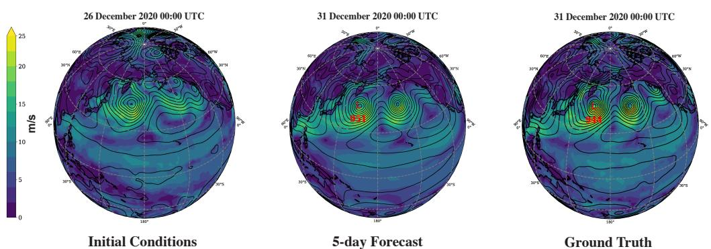  
Figure 1: Illustration of an example 5-day forecast of near-surface wind speed (color-fill) and mean sea level pressure (contours). On December 31, 2020, an extratropical cyclone impacted Alaska setting a new North Pacific low-pressure record. We evaluate the ability of Stormer to predict this record-breaking event 5 days in advance. Using initial conditions from 0000 UTC, 26 December 2011, Stormer successfully forecasts the location and strength of this extreme event with great accuracy.

# 1 Introduction

Weather forecasting is a fundamental problem for science and society. With increasing concerns about climate change, accurate weather forecasting helps prepare and recover from the effects of natural disasters and extreme weather events, while serving as an important tool for researchers to better understand the atmosphere. Traditionally, atmospheric scientists have relied on numerical weather prediction (NWP) models [2]. These models utilize systems of differential equations describing fluid flow and thermodynamics, which can be integrated over time to obtain future forecasts [29, 2]. Despite their widespread use, NWP models suffer from many challenges, such as parameterization errors of important small-scale physical processes, including cloud physics and radiation [44]. Numerical methods also incur high computation costs due to the complexity of integrating a large system of differential equations, especially when modeling at fine spatial and temporal resolutions. Furthermore, NWP forecast accuracy does not improve with more data, as the models rely on the expertise of climate scientists to refine equations, parameterizations, and algorithms [30].

To address the above challenges of NWP models, there has been an increasing interest in data-driven approaches based on deep learning for weather forecasting [11, 42, 48]. The key idea involves training deep neural networks to predict future weather conditions using historical data, such as the ERA5 reanalysis dataset [16, 17, 40, 41]. Once trained, these models can produce forecasts in a few seconds, as opposed to the hours required by typical NWP models. Because of the similar spatial structure between weather data and natural images, early works in this space attempted to adopt standard vision architectures such as ResNet [39, 8] and UNet [49] for weather forecasting, but their performances lagged behind those of numerical models. However, significant improvements have been made in recent years due to better model architectures and training recipes, and increasing data and compute [22, 35, 32, 3, 26, 5, 7]. Pangu-Weather [3], a 3D Earth-Specific Transformer model trained on $0 . 2 5 ^ { \circ }$ data $( 7 2 1 \times 1 4 4 0$ grids), was the first model to outperform operational IFS [47]. Shortly after, GraphCast [26] scaled up the graph neural network architecture proposed by Keisler [22] to $0 . 2 5 ^ { \circ }$ data and showed improvements over Pangu-Weather. Despite impressive forecast accuracy, existing methods often involve highly customized neural network architectures with minimal ablation studies, making it difficult to identify which components contribute to their success. For example, it is unclear what the benefits of 3D Earth-Specific Transformer over a standard Transformer are, and how critical the multi-mesh message-passing in GraphCast is to its performance. A deeper understanding, and ideally a simplification, of these existing approaches is essential for future progress in the field. Furthermore, establishing a common framework would facilitate the development of foundation models for weather and climate that extend beyond weather forecasting [32].

In this paper, we show that a simple architecture with a proper training recipe can achieve state-of-theart performance. We start with a standard vision transformer (ViT) architecture, and through extensive ablation studies, identify the three key components to the performance of the model: (1) a weatherspecific embedding layer that transforms the input data to a sequence of tokens by modeling the interactions among atmospheric variables; (2) a randomized dynamics forecasting objective that trains the model to predict the weather dynamics at random intervals; and (3) a pressure-weighted loss that weights variables at different pressure levels in the loss function to approximate the density at each pressure level. During inference, our proposed randomized dynamics forecasting objective allows a single model to produce multiple forecasts for a specified lead time by using different combinations of the intervals for which the model was trained. For example, one can obtain a 3-day forecast by rolling out the 6-hour predictions 12 times or 12-hour predictions 6 times. Combining these forecasts leads to significant accuracy improvements, especially for long lead times. We evaluate our proposed method, namely Scalable transformers for weather forecasting (Stormer), on WeatherBench 2 [41], a widely used benchmark for data-driven weather forecasting. Stormer achieves competitive forecast accuracy of key atmospheric variables for 1–7 days and outperforms the state-of-the-art beyond 7 days. Notably, Stormer achieves this performance by training on more than $5 \times$ lower-resolution data and orders-of-magnitude fewer GPU hours compared to the baselines. Finally, our scaling analysis shows that the performance of Stormer improves consistently with increases in model capacity and data size, demonstrating the potential for further improvements.

# 2 Background and Preliminaries

Given a dataset $\mathcal { D } = \{ X _ { i } \} _ { i = 1 } ^ { N }$ of historical weather data, the task of global weather forecasting is to forecast future weather conditions $X _ { T } \in \mathbb { R } ^ { V \times H \times W }$ given initial conditions $X _ { 0 } \in \mathbb { R } ^ { V \times H \times W }$ in which $T$ is the target lead time, e.g., 7 days; $V$ is the number of input and output atmospheric variables, such as temperature and humidity; and $H \times W$ is the spatial resolution of the data, which depends on how densely we grid the globe. This formulation is similar to many image-to-image tasks in computer vision such as segmentation or video frame prediction. However, unlike the RGB channels in natural images, weather data can contain up to 100s of channels. These channels represent actual physical variables that can be unbounded in values and follow complex laws governed by atmospheric physics. Therefore, the ability to model the spatial and temporal correlations between these variables is crucial to forecasting.

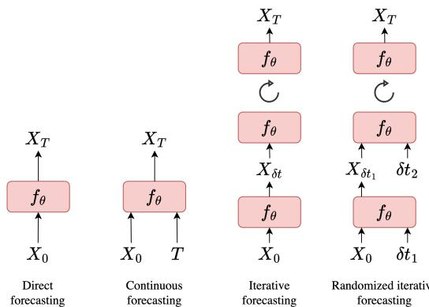  
Figure 2: Different approaches to weather forecasting. Direct and continuous methods output forecasts directly, but continuous forecasting is adaptable to various lead times by conditioning on $T$ . Iterative forecasting generates forecasts at small intervals $\delta t$ , which are rolled out for the final forecast. Our proposed randomized iterative forecasting combines continuous and iterative methods.

There are three major approaches to data-driven weather forecasting. The first and simplest is direct forecasting, which trains the model to directly output future weather ${ \widehat { X } } _ { T } = f _ { \theta } ( X _ { 0 } )$ for each target lead time $T$ . Most early works in the field adopt this approach [11, 42, 48, 39, 8, 49]. Since the weather is a chaotic system, forecasting the future directly for large $T$ is challenging, which may explain the poor performances of these early models. Moreover, direct forecasting requires training one neural network for each lead time, which can be computationally expensive when the number of target lead times increases. To avoid the latter issue, continuous forecasting uses $T$ as an additional input: $\widehat { X } _ { T } = f _ { \theta } ( X _ { 0 } , T )$ , allowing a single model to produce forecasts at any target lead time after training. MetNet [43, 12, 1] employed the continuous approach for nowcasting at different lead times up to 24 hours, WeatherBench [39] considered continuous forecasting as one of the baselines, and ClimaX [32] used this approach for pretraining. However, since this approach still attempts to forecast future weather directly, it suffers from the same challenging problem of forecasting the chaotic weather in one step. Finally, iterative forecasting trains the model to produce forecasts at a small interval $\widehat { X } _ { \delta t } = f _ { \theta } ( X _ { 0 } )$ , in which $\delta t$ is typically from 6 to 24 hours. To produce longer-horizon forecasts, we roll out the model by iteratively feeding its predictions back in as input. This is a common paradigm in both traditional NWP systems and the two state-of-the-art deep learning methods, Pangu-Weather and GraphCast. One drawback of this approach is error accumulation when the number of rollout steps increases, which can be mitigated by a multi-step loss function [22, 26, 5, 7]. In iterative forecasting, one can forecast either the weather conditions $X _ { \delta t }$ or the weather dynamics $\Delta _ { \delta t } = X _ { \delta t } - X _ { 0 }$ , and $X _ { \delta t }$ can be recovered by adding the predicted dynamics to the initial conditions. In this work, we adopt the latter approach, which we refer to as iterative dynamics forecasting. We show empirically that our approach achieves superior performance relative to the former approach in Section 4.2. Figure 2 summarizes these different approaches.

# 3 Methodology

We introduce Stormer, a skillful method for weather forecasting, and show that a simple architecture can achieve competitive forecast performances with a well-designed framework. We first present the overall training and inference procedure of Stormer, then describe the model architecture we use in practice. Section 4.2 empirically demonstrates the importance of each component of Stormer.

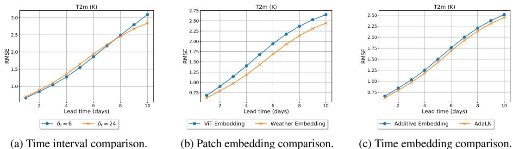  
Figure 3: Preliminary results on forecasting surface temperature that led to the design choices of Stormer: (a) Different intervals are better at different lead times, (b) Weather-specific embedding is superior to standard ViT embedding, and (c) Adaptive layer norm outperforms additive embedding.

# 3.1 Training

We adopt the iterative approach for Stormer, and train the model to forecast the weather dynamics $\Delta _ { \delta t } = X _ { \delta t } - X _ { 0 }$ , which is the difference between two consecutive weather conditions, $X _ { 0 }$ and $X _ { \delta t }$ , across the time interval $\delta t$ . A common practice in previous works [22, 26] is to use a small fixed value of $\delta t$ such as 6 hours. However, as we show in Figure 3a, while small intervals tend to work well for short lead times, larger intervals excel at longer lead times (beyond 7 days) due to less error accumulation. Therefore, having a model that can produce forecasts at different intervals and combine them in an effective manner has the potential to improve the performance of single-interval models. This motivates our randomized dynamics forecasting objective, which trains Stormer to forecast the dynamics at random intervals $\delta t$ by conditioning on $\delta t$ :

$$
\begin{array} { r } { \mathcal { L } ( \theta ) = \mathbb { E } _ { \delta t \sim P ( \delta t ) , ( X _ { 0 } , X _ { \delta t } ) \sim \mathcal { D } } \left[ | | f _ { \theta } ( X _ { 0 } , \delta t ) - \Delta _ { \delta t } | | _ { 2 } ^ { 2 } \right] , } \end{array}
$$

in which $P ( \delta t )$ is the distribution of the random interval. In our experiments, unless otherwise specified, $P ( \delta t )$ is a uniform distribution over three values $\delta t \sim \mathcal { U } \{ \bar { 6 } , 1 2 , 2 4 \}$ . These three time intervals play an important role in atmospheric dynamics. The 6 and 12-hour values help to encourage the model to learn and resolve the diurnal cycle (day-night cycle), one of the most important oscillations in the atmosphere driving short-term dynamics (e.g., temperature over the course of a day). The 24-hour value filters the effects of the diurnal cycle and allows the model to learn longer, synoptic-scale dynamics which are particularly important for medium-range weather forecasting [19].

From a practical standpoint, this randomized objective provides two benefits. First, randomizing $\delta t$ enlarges the training data, serving as data augmentation. Second, it allows a single trained model to generate various forecasts for a specified lead time $T$ by creating different combinations of intervals $\delta t$ that sum to $T$ . For example, to forecast 7 days ahead, one could use 12-hour forecasts 14 times or 24-hour forecasts 7 times. Our experiments show that combining these forecasts is crucial for achieving good accuracy, especially for longer lead times. While both our approach and the continuous approach use the time interval as an additional input, we perform iterative forecasting instead of direct forecasting. This avoids the challenge of directly modeling chaotic weather and offers more flexibility for combining different intervals at test time.

# 3.1.1 Pressure-weighted loss

Due to the large number of variables being predicted, we use a physics-based weighting function to weigh variables near the surface higher. Since each variable lies on a specific pressure level, we can use pressure as a proxy for the density of the atmosphere at each level. This weighting allows the model to prioritize near-surface variables, which are important for weather forecasting and have the most societal impact. The final objective function that we use for training is:

$$
\mathcal { L } ( \theta ) = \mathbb { E } \left[ \frac { 1 } { V H W } \sum _ { v = 1 } ^ { V } \sum _ { i = 1 } ^ { H } \sum _ { j = 1 } ^ { W } w ( v ) L ( i ) ( \widehat { \Delta } _ { \delta t } ^ { v i j } - \Delta _ { \delta t } ^ { v i j } ) ^ { 2 } \right] .
$$

The expectation is over $\delta t , X _ { 0 }$ , and $X _ { \delta t }$ which we omit for notational simplicity. In this equation, $w ( v )$ is the weight of variable $v$ , and $L ( i )$ is the latitude-weighting factor commonly used in previous

works to account for the non-uniformity when we grid the spherical globe [40, 22, 35, 32, 3, 26]. The pressure-weighted loss was first introduced by GraphCast [26], and we show that it also helps with a different architecture.

# 3.1.2 Multi-step finetuning

To produce forecasts at a lead time beyond the training intervals, we roll out the model several times. Since the model’s forecasts are fed back as input, the forecast error accumulates as we roll out more steps. To alleviate this issue, we finetune the model on a multi-step loss function. Specifically, for each gradient step, we roll out the model $K$ times, and average the objective (2) over the $K$ steps:

$$
\mathcal { L } ( \theta ) = \mathbb { E } \left[ \frac { 1 } { K V H W } \sum _ { k = 1 } ^ { K } \sum _ { v = 1 } ^ { V } \sum _ { i = 1 } ^ { H } \sum _ { j = 1 } ^ { W } w ( v ) L ( i ) ( \widehat { \Delta } _ { k \delta t } ^ { v i j } - \Delta _ { k \delta t } ^ { v i j } ) ^ { 2 } \right] .
$$

In practice, we implement a three-phase training procedure for Stormer. In the first phase, we train the model to perform single-step forecasting, which is equivalent to optimizing the objective in (2). In the second and third phases, we finetune the trained model from the preceding phase with $K =$ 4 and $K = 8$ , respectively. We use the same sampled value of the interval $\delta t$ for all $K$ steps. We tried randomizing $\delta t$ at each rollout step, but found that doing so destabilized training as the loss value at each step is of different magnitudes, hurting the final performance of the model. Multi-step finetuning was used in FourCastNet [35] and also adopted in more recent works [22, 26].

# 3.2 Inference

At test time, Stormer can produce forecasts at any time interval $\delta t$ used during training. Thus the model can generate multiple forecasts for a target lead time $T$ by creating different combinations of $\delta t$ that sum to $T$ . We consider two inference strategies for generating forecasts:

Homogeneous In this strategy, we only consider homogeneous combinations of $\delta t$ , i.e., combinations with just one value of $\delta t$ . For example, for $T = 2 4$ we consider [6, 6, 6, 6], [12, 12], and [24].

Best $\mathbf { \nabla } m$ in $\pmb { n }$ We generate $n$ different, possibly heterogeneous combinations of $\delta t$ , validate each combination, and pick $m$ combinations with the lowest validation losses for testing.

The two strategies offer a trade-off between efficiency and expressivity. The homogeneous strategy only requires running three combinations for each lead time $T$ , while best $m$ in $n$ provides greater expressivity. Upon determining these combinations and executing the model rollouts, we obtain the final forecast by averaging the individual predictions. This approach achieves a similar effect to ensembling in NWP, where multiple forecasts are generated by running NWP models with different perturbed versions of the initial condition [27]. As target lead times extend beyond 5–7 days and individual forecasts begin to diverge due to the chaotic nature of the atmosphere, averaging these forecasts is a Monte Carlo integration approach to handle this sensitivity to initial conditions and the uncertainty in the analyses used as initial conditions [31]. We note that our inference strategy is distinguished from that used in Pangu-Weather: while Pangu-Weather trains a separate model for each time interval $\delta t$ , we train a single model for all $\delta t$ values by conditioning on $\delta t$ . Additionally, while Pangu-Weather relies on a single combination of intervals to minimize rollout steps, our method improves forecast accuracy by averaging multiple forecasts derived from diverse combinations.

# 3.3 Model architecture

We instantiate the framework in Section 3.1 with a simple Transformer [45]-based architecture. Due to the similarity of weather forecasting to various dense prediction tasks in computer vision, one might consider applying Vision Transformer (ViT) [10] for this task. However, weather data is distinct from natural images, primarily due to its significantly higher number of input channels, representing atmospheric variables with intricate physical relationships. For example, the wind fields are closely related to the gradient and shape of the geopotential field, and redistribute moisture and heat around the globe. Effectively modeling these interactions is critical to forecast accuracy.

# 3.4 Weather-specific embedding

The standard patch embedding module in ViT, which uses a linear layer for embedding all input channels within a patch into a vector, may not sufficiently capture the complex interactions among input atmospheric variables. Therefore, we adopt for our architecture a weather-specific embedding module, consisting of two components, variable tokenization and variable aggregation.

Variable tokenization Given an input of shape $V \times H \times W$ , variable tokenization linearly embeds each variable independently to a sequence of shape $( H / p ) \times ( W / p ) \times D$ , in which $p$ is the patch size and $D$ is the hidden dimension. We then concatenate the output of all variables, resulting in a sequence of shape $( H / p ) \times ( W / p ) \times V \times D$ .

Variable aggregation We employ a single-layer cross-attention mechanism with a learnable query vector to aggregate information across variables. This module operates over the variable dimension on the output of the tokenization stage to produce a sequence of shape $( H / p ) \times ( W / p ) \times D$ . This module offers two primary advantages. First, it reduces the sequence length by a factor of $V$ , significantly alleviating the computational cost as we use transformer to process the sequence. Second, unlike standard patch embedding, the cross-attention layer allows the models to learn non-linear relationships among input variables, enhancing the model’s capacity to capture complex physical interactions. We present the complete implementation details of the weather-specific embedding in Section B.

Figure 3b shows the superior performance of weather-specific embedding to standard patch embedding at all lead times from 1 to 10 days. A similar weather-specific embedding module was introduced by ClimaX [32] to improve the model’s flexibility when handling diverse data sources with heterogeneous input variables. We show that this specialized embedding module outperforms the standard patch embedding even when trained on a single dataset, due to its ability to model interactions between atmospheric variables through cross-attention effectively.

# 3.4.1 Stormer Transformer block

Following weather-specific embedding, the tokens are processed by a stack of transformer blocks [45]. In addition to the input $X _ { 0 }$ , the block also needs to process the time interval $\delta t$ . We do this by replacing the standard layer normalization module used in transformer blocks with adaptive layer normalization (adaLN) [37]. In adaLN, instead of learning the scale and shift parameters $\gamma$ and $\beta$ as independent parameters of the network, we regress them with an one-layer MLP from the embedding of $\delta t$ . Compared to ClimaX [32] which only adds the lead time embedding to the tokens before the first attention layer, adaLN is applied to every transformer block, thus amplifying the conditioning signal. Figure 3c shows the consistent improvement of adaLN over the additive lead time embedding used in ClimaX. Adaptive layer norm was widely used in both GANs [21, 4] and Diffusion [9, 36] to condition on additional inputs such as time steps or class labels. Figure 7 illustrates Stormer’s architecture. We refer to [32] for illustrations of the weather-specific embedding block.

# 4 Experiments

We compare Stormer with state-of-the-art weather forecasting methods, and conduct extensive ablation analyses to understand the importance of each component in Stormer. We also study Stormer scalability by varying model size and the number of training tokens. We conduct all experiments on WeatherBench 2 (WB2) [41], a standard benchmark for data-driven weather forecasting.

Data: We train and evaluate Stormer on the ERA5 dataset from WB2, which is the curated version of the ERA5 reanalysis data provided by ECMWF [17]. In its raw form, ERA5 contains hourly data from 1979 to the current time at $0 . 2 5 ^ { \circ }$ $7 2 1 \times 1 4 4 0$ grids) resolution, with different atmospheric variables spanning 137 pressure levels plus the Earth’s surface. WB2 downsamples this data to 6-hourly with 13 pressure levels and provides different spatial resolutions. In this work, we use the $1 . 4 0 6 2 5 ^ { \circ }$ ( $1 2 8 \times 2 5 6$ grids) data. We use four surface-level variables – 2-meter temperature (T2m), 10-meter U and V components of wind (U10 and V10), and Mean sea-level pressure (MSLP), and five atmospheric variables – Geopotential $( Z )$ , Temperature (T), U and V components of wind (U and V), and Specific humidity (Q), each at 13 pressure levels {50, 100, 150, 200, 250, 300, 400, 500, 600, 700, 850, 925, 1000}. We use 1979 to 2018 for training, 2019 for validation, and 2020 for testing.

Stormer architecture: For the main comparison in Section 4.1, we report the results of our largest Stormer model with 24 transformer blocks, 1024 hidden dimensions, and a patch size of 2, which is equivalent to ViT-L except for the smaller patch size. We vary the model size and patch size in the scaling analysis. For the remaining experiments, we report the performance of the same model as for the main result, but with a larger patch size of 4 for faster training.

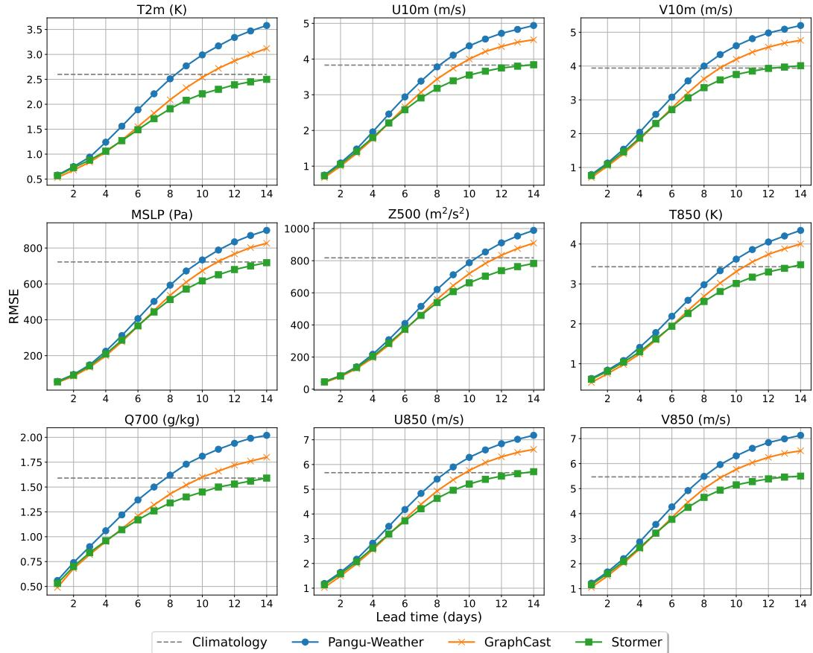  
Figure 4: Global forecast results of Stormer and the baselines. We show the latitude-weighted RMSE for select variables. Stormer is on par or outperforms the baselines for the shown variables. During the later portion of the forecasts, Stormer gains $\sim 1$ day of forecast skill with respect to climatology compared to the next best deep learning model. We note that Stormer was trained on much lower resolution data $( 1 . 4 0 6 2 5 ^ { \circ } ,$ ) compared to Pangu-Weather $( 0 . 2 5 ^ { \circ } )$ and GraphCast $( 0 . 2 5 ^ { \circ } )$ .

Training: For the main result in Section 4.1, we train Stormer in three phases, as described in Section 3.1.2. We train the model for 100 epochs for the first phase, 20 epochs for the second, and 20 epochs for the third. We perform early stopping on the validation loss aggregated across all variables, and evaluate the best checkpoint of the final phase on the test set. For the remaining experiments, we only train Stormer for the first phase due to computational constraints.

Evaluation: We evaluate Stormer and two deep learning baselines on forecasting nine key variables: T2m, U10, V10, MSLP, Z500, T850, Q700, U850, and V850. These variables are also used to report the headline scores in WB2. For each variable, we evaluate the forecast accuracy at lead times from 1 to 14 days, using the latitude-weighted root-mean-square error (RMSE) metric. For the main results, we use best $m$ in $n$ inference for rolling out Stormer as it yields the best result, with $m = 3 2$ and $n = 1 2 8$ chosen randomly from all possible combinations. For the remaining experiments, we use homogeneous inference for faster evaluations. We provide results on the non-ensemble version of Stormer, probabilistic metrics with IC perturbations, a comparison between two inference strategies, and additional ablation studies in Appendix C.

# 4.1 Comparison with State-of-the-art models

We compare the forecast performance of Stormer with Pangu-Weather [3] and GraphCast [26], two leading deep learning methods for weather forecasting. Pangu-Weather employs a 3D Earth-Specific Transformer architecture trained on the same variables as Stormer, but with hourly data and a higher spatial resolution of $0 . 2 5 ^ { \circ }$ . GraphCast is a graph neural network that was trained on 6-hourly ERA5 data at $0 . 2 5 ^ { \circ }$ , using 37 pressure levels for the atmospheric variables, and two additional variables, total precipitation and vertical wind speed. Both Pangu-Weather and GraphCast are iterative methods. GraphCast operates at 6-hour intervals, while Pangu-Weather uses four distinct models for 1-, 3-, 6-, and 24-hour intervals, and combines them to produce forecasts for specific lead times. We include Climatology as a simple baseline. We also compare Stormer with IFS HRES, the state-of-the-art numerical forecasting system, and IFS ENS (mean), which is the ensemble version of IFS. Since WB2 does not provide forecasts of these numerical models beyond 10 days, we defer the comparison against these models to Appendix C.1.

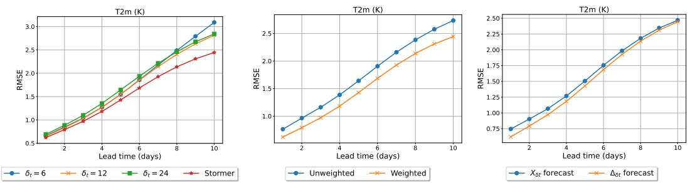  
(a) Impact of randomized forecasting. (b) Impact of weighted loss. (c) Absolute vs. dynamics forecast.   
Figure 5: Ablation studies showing the importance of different components in Stormer: (a) Randomized forecasting, (b) Pressure-weighted loss, and (c) Dynamics forecasting.

Results: Figure 4 evaluates different methods on forecasting nine key weather variables at lead times from 1 to 14 days. For short-range, 1–5 day forecasts, Stormer’s accuracy is on par with or exceeds that of Pangu-Weather, but lags slightly behind GraphCast. At longer lead times, Stormer excels, consistently outperforming both Pangu-Weather and GraphCast from day 6 onwards by a large margin. Moreover, the performance gap increases as we increase the lead time. At 14 day forecasts, Stormer performs better than GraphCast by $1 0 \% - 2 0 \%$ across all 9 key variables. Stormer is also the only model in this comparison that performs better than Climatology at long lead times, while other methods approach or even do worse than this simple baseline. The model’s superior performance at long lead times is attributed to the use of randomized dynamics training, which improves forecast accuracy by averaging out multiple forecasts, especially when individual forecasts begin to diverge.

Moreover, we also note that Stormer achieves this performance with much less compute and training data compared to the two deep learning baselines. We train Stormer on 6-hourly data of $1 . 4 0 6 2 5 ^ { \circ }$ with 13 pressure levels, which is approximately $1 9 0 \times$ less data than Pangu-Weather’s hourly data at $0 . 2 5 ^ { \circ }$ and $9 0 \times$ less than that used for GraphCast, which also uses 6-hourly data but at a $0 . 2 5 ^ { \circ }$ resolution with 37 pressure levels. The training of Stormer was completed in under 24 hours on 128 A100 GPUs. In contrast, Pangu-Weather took 60 days to train four models on 192 V100 GPUs, and GraphCast required 28 days on 32 TPUv4 devices. This training efficiency will facilitate future works that build upon our proposed framework.

# 4.2 Ablation studies

We analyze the significance of individual elements within Stormer by systematically omitting one component at a time and observing the difference in performance.

Impact of randomized forecasts: We evaluate the effectiveness of our proposed randomized iterative forecasting approach. Figure 5a compares the forecast accuracy on surface temperature of Stormer and three models trained with different values of $\delta t$ . Stormer consistently outperforms all singleinterval models at all lead times, and the performance gap widens as the lead time increases. We attribute this result to the ability of Stormer to produce multiple forecasts and combine them to improve accuracy. We note that Stormer achieves this improvement with no computational overhead compared to the single-interval models, as the different models share the same architecture and were trained for the same duration.

Impact of pressure-weighted loss: Figure 5b shows the superior performance of Stormer when trained with the pressure-weighted loss. Intuitively, the weighting factor prioritizes variables that are nearer to the surface, as these variables are more important for weather forecasting and climate science.

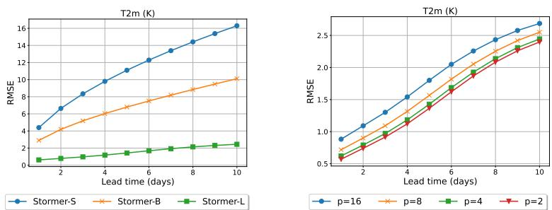  
Figure 6: Stormer improves consistently with larger models (left) and smaller patch sizes (right).

Dynamics vs. absolute forecasts: We justify our decision to forecast the dynamics $\Delta _ { \delta t }$ by comparing with a counterpart that forecasts $X _ { \delta t }$ . Figure 5c shows that forecasting the changes in weather conditions (dynamics) is consistently more accurate than predicting complete weather states. One possible explanation for this result is that it is simpler for the model to predict the changes between two consecutive weather conditions than the entire state of the weather; thus, the model can focus on learning the most significant signal, enhancing forecast accuracy.

# 4.3 Scaling analysis

We examine Stormer’s scalability in terms of model size and training tokens. We evaluate three variants – Stormer-S, Stormer-B, and Stormer-L, with parameter counts similar to ViT-S, ViT-B, and ViT-L, respectively. To understand the impact of training token count, we vary the patch size from 2 to 16, quadrupling the training tokens each time the patch size is halved. Figure 6 shows a significant improvement in forecast accuracy with larger models, and the performance gap widens with increased lead time. Since we do not perform multi-step fine-tuning for these models, minor performance differences at short intervals may magnify over time. While multi-step fine-tuning could potentially reduce this gap, it is unlikely to eliminate it entirely. Reducing the patch size also improves the performance of the model consistently. From a practical view, smaller patches mean more tokens and consequently more training data. From a climate perspective, smaller patches capture finer weather details and processes not evident in larger patches, allowing the model to more effectively capture physical dynamics that drive weather patterns.

# 5 Related Work

Deterministic weather forecasting Deep learning offers a promising approach to weather forecasting due to its fast inference and high expressivity. Early efforts [11, 42, 48] attempted training simple architectures on small weather datasets. To facilitate progress, WeatherBench [40] provided standard datasets and benchmarks, leading to subsequent works that trained Resnet [15] and UNet architectures [49] for weather forecasting. These works showed the potential of deep learning but still displayed inferior accuracy to numerical systems. However, significant improvements have been made in the last few years. Keisler [22] proposed a graph neural network (GNN) that performs iterative forecasting with 6-hour intervals, performing comparably with some NWP models. FourCastNet [35] trained an adaptive Fourier neural operator and was the first neural network to run on $0 . 2 5 ^ { \circ }$ data. Pangu-Weather [3], with its 3D Earth-Specific Transformer design, trained on high-resolution data, surpassed the benchmark IFS model. Following this, GraphCast [26] scaled up Keisler’s GNN architecture to $0 . 2 5 ^ { \circ }$ , achieving even better results than Pangu-Weather. FuXi [6] was a subsequent work that trained a SwinV2 [28] on $0 . 2 5 ^ { \circ }$ data and showed improvements over GraphCast at long lead times. However, $\mathrm { F u X i }$ requires finetuning multiple models specialized for different time ranges, increasing model complexity and computation. FengWu [5] was a concurrent work with $\mathrm { F u X i }$ that also focused on improving long-horizon forecasts, but has not revealed complete model architecture and training details. ClimODE [46] introduced physical inductive biases to provide better interpretability but was empirically inferior to existing methods.

Probabilistic weather forecasting In addition to high accuracy, a desired ability of a weather forecasting model is to quantify forecast uncertainty. One common approach to achieve this is to combine an existing architecture with a probabilistic loss function. Gencast [38] was one of the first works in this direction, combining the Graphcast architecture with a diffusion objective [18, 21], followed by Graph-EFM [33], which combined a hierarchical variant of Graphcast with the VAE objective [23]. This approach allows the model to generate multiple forecasts and estimate uncertainty after training. In an orthogonal approach, NeuralGCM [25] proposed a hybrid forecasting system that combined a differentiable dynamical core with ML components for end-to-end training. The dynamical core allows the method to leverage powerful general circulation models and generate forecast ensembles via IC perturbations similar to NWP. However, the dynamical core in NeuralGCM is more computationally expensive than forward-passing a neural network and can limit the method’s performance with an imperfect circulation model.

# 6 Conclusion and Future Work

This work proposes Stormer, a simple yet effective deep learning model for weather forecasting. We demonstrate that a standard vision architecture can achieve competitive results with a carefully designed training recipe. Our novel approach, randomized iterative forecasting, trains the model to forecast at different time intervals, enabling it to produce and combine multiple forecasts for each target lead time for better accuracy. Experiments show Stormer’s competitive accuracy in short-range forecasts and exceptional performance beyond 7 days, all with significantly less data and computing resources. Future research could explore using multiple forecasts to quantify uncertainty, randomizing other model components like input variables to increase variability and accuracy, and evaluating Stormer on higher-resolution data and larger model sizes due to its favorable scaling properties.

# 7 Acknowledgments

AG acknowledges support from Google, Cisco, and Meta. SM is supported by the U.S. Department of Energy, Office of Science, Advanced Scientific Computing Research, through the SciDAC-RAPIDS2 institute under Contract DE-AC02-06CH11357. RM and VK are supported under a Laboratory Directed Research and Development (LDRD) Program at Argonne National Laboratory, through U.S. Department of Energy (DOE) contract DE-AC02-06CH11357. TA is supported by the Global Change Fellowship in the Environmental Science Division at Argonne National Laboratory (grant no. LDRD 2023-0236). RM acknowledges support from DOE-FOA-2493: "Data intensive scientific machine learning". An award for computer time was provided by the U.S. Department of Energy’s (DOE) Innovative and Novel Computational Impact on Theory and Experiment (INCITE) Program and Argonne Leadership Computing Facility Director’s discretionary award. This research used resources from the Argonne Leadership Computing Facility, a U.S. DOE Office of Science user facility at Argonne National Laboratory, which is supported by the Office of Science of the U.S. DOE under Contract No. DE-AC02-06CH11357.

# References

[1] Marcin Andrychowicz, Lasse Espeholt, Di Li, Samier Merchant, Alex Merose, Fred Zyda, Shreya Agrawal, and Nal Kalchbrenner. Deep learning for day forecasts from sparse observations. arXiv preprint arXiv:2306.06079, 2023.

[2] Peter Bauer, Alan Thorpe, and Gilbert Brunet. The quiet revolution of numerical weather prediction. Nature, 525(7567):47–55, 2015.

[3] Kaifeng Bi, Lingxi Xie, Hengheng Zhang, Xin Chen, Xiaotao Gu, and Qi Tian. Accurate medium-range global weather forecasting with 3D neural networks. Nature, 619(7970):533– 538, 2023.

[4] Andrew Brock, Jeff Donahue, and Karen Simonyan. Large scale gan training for high fidelity natural image synthesis. arXiv preprint arXiv:1809.11096, 2018.

[5] Kang Chen, Tao Han, Junchao Gong, Lei Bai, Fenghua Ling, Jing-Jia Luo, Xi Chen, Leiming Ma, Tianning Zhang, Rui Su, et al. Fengwu: Pushing the skillful global medium-range weather forecast beyond 10 days lead. arXiv preprint arXiv:2304.02948, 2023.

[6] Lei Chen, Xiaohui Zhong, Feng Zhang, Yuan Cheng, Yinghui Xu, Yuan Qi, and Hao Li. Fuxi: a cascade machine learning forecasting system for 15-day global weather forecast. npj Climate and Atmospheric Science, 6(1):190, 2023. doi: 10.1038/s41612-023-00512-1. URL https://doi.org/10.1038/s41612-023-00512-1.

[7] Lei Chen, Xiaohui Zhong, Feng Zhang, Yuan Cheng, Yinghui Xu, Yuan Qi, and Hao Li. FuXi: A cascade machine learning forecasting system for 15-day global weather forecast. arXiv preprint arXiv:2306.12873, 2023.

[8] Mariana CA Clare, Omar Jamil, and Cyril J Morcrette. Combining distribution-based neural networks to predict weather forecast probabilities. Quarterly Journal of the Royal Meteorological Society, 147(741):4337–4357, 2021.

[9] Prafulla Dhariwal and Alexander Nichol. Diffusion models beat GANs on image synthesis. Advances in Neural Information Processing Systems, 34:8780–8794, 2021.

[10] Alexey Dosovitskiy, Lucas Beyer, Alexander Kolesnikov, Dirk Weissenborn, Xiaohua Zhai, Thomas Unterthiner, Mostafa Dehghani, Matthias Minderer, Georg Heigold, Sylvain Gelly, Jakob Uszkoreit, and Neil Houlsby. An image is worth 16x16 words: Transformers for image recognition at scale. arXiv preprint arXiv:2010.11929, 2020.

[11] P. D. Dueben and P. Bauer. Challenges and design choices for global weather and climate models based on machine learning. Geoscientific Model Development, 11(10):3999–4009, 2018. doi: 10.5194/gmd-11-3999-2018. URL https://gmd.copernicus.org/articles/ 11/3999/2018/.

[12] Lasse Espeholt, Shreya Agrawal, Casper Sønderby, Manoj Kumar, Jonathan Heek, Carla Bromberg, Cenk Gazen, Rob Carver, Marcin Andrychowicz, Jason Hickey, et al. Deep learning for twelve hour precipitation forecasts. Nature communications, 13(1):1–10, 2022.

[13] William A Falcon. PyTorch lightning. GitHub, 3, 2019.

[14] Charles R. Harris, K. Jarrod Millman, Stéfan J. van der Walt, Ralf Gommers, Pauli Virtanen, David Cournapeau, Eric Wieser, Julian Taylor, Sebastian Berg, Nathaniel J. Smith, Robert Kern, Matti Picus, Stephan Hoyer, Marten H. van Kerkwijk, Matthew Brett, Allan Haldane, Jaime Fernández del Río, Mark Wiebe, Pearu Peterson, Pierre Gérard-Marchant, Kevin Sheppard, Tyler Reddy, Warren Weckesser, Hameer Abbasi, Christoph Gohlke, and Travis E. Oliphant. Array programming with NumPy. Nature, 585(7825):357–362, September 2020. doi: 10.1038/s41586-020-2649-2. URL https://doi.org/10.1038/s41586-020-2649-2.

[15] Kaiming He, Xiangyu Zhang, Shaoqing Ren, and Jian Sun. Deep residual learning for image recognition. In Proceedings of the IEEE conference on computer vision and pattern recognition, pages 770–778, 2016.

[16] Hans Hersbach, Bill Bell, Paul Berrisford, Gionata Biavati, András Horányi, Joaquín Muñoz Sabater, Julien Nicolas, Carole Peubey, Raluca Radu, Iryna Rozum, Dinand Schepers, Adrian Simmons, Cornel Soci, Dick Dee, and Jean-Noël Thépaut. ERA5 hourly data on single levels from 1979 to present. Copernicus Climate Change Service (C3S) Climate Data Dtore (CDS), 10(10.24381), 2018.   
[17] Hans Hersbach, Bill Bell, Paul Berrisford, Shoji Hirahara, András Horányi, Joaquín MuñozSabater, Julien Nicolas, Carole Peubey, Raluca Radu, Dinand Schepers, , Adrian Simmons, Cornel Soci, Saleh Abdalla, Xavier Abellan, Gianpaolo Balsamo, Peter Bechtold, Gionata Biavati, Jean Bidlot, Massimo Bonavita, Giovanna De Chiara, Per Dahlgren, Dick Dee, Michail Diamantakis, Rossana Dragani, Johannes Flemming, Richard Forbes, Manuel Fuentes, Alan Geer, Leo Haimberger, Sean Healy, Robin J. Hogan, Elías Hólm, Marta Janisková, Sarah Keeley, Patrick Laloyaux, Philippe Lopez, Cristina Lupu, Gabor Radnoti, Patricia de Rosnay, Iryna Rozum, Freja Vamborg, Sebastien Villaume, and Jean-Noël Thépaut. The ERA5 global reanalysis. Quarterly Journal of the Royal Meteorological Society, 146(730):1999–2049, 2020.   
[18] Jonathan Ho, Ajay Jain, and Pieter Abbeel. Denoising diffusion probabilistic models. Advances in neural information processing systems, 33:6840–6851, 2020.   
[19] James R. Holton. An Introduction to Dynamic Meteorology. International Geophysics Series. Elsevier Academic Press, Burlington, MA, 4 edition, 2004. ISBN 9780123540157.   
[20] Stephan Hoyer and Joe Hamman. xarray: N-D labeled arrays and datasets in Python. Journal of Open Research Software, 5(1):10, April 2017. doi: 10.5334/jors.148.   
[21] Tero Karras, Samuli Laine, and Timo Aila. A style-based generator architecture for generative adversarial networks. In Proceedings of the IEEE/CVF Conference on Computer Vision and Pattern Recognition, pages 4401–4410, 2019.   
[22] Ryan Keisler. Forecasting global weather with graph neural networks. arXiv preprint arXiv:2202.07575, 2022.   
[23] Diederik P Kingma. Auto-encoding variational bayes. arXiv preprint arXiv:1312.6114, 2013.   
[24] Diederik P Kingma and Jimmy Ba. Adam: A method for stochastic optimization. arXiv preprint arXiv:1412.6980, 2014.   
[25] Dmitrii Kochkov, Janni Yuval, Ian Langmore, Peter Norgaard, Jamie Smith, Griffin Mooers, Milan Klöwer, James Lottes, Stephan Rasp, Peter Düben, et al. Neural general circulation models for weather and climate. Nature, 632(8027):1060–1066, 2024.   
[26] Remi Lam, Alvaro Sanchez-Gonzalez, Matthew Willson, Peter Wirnsberger, Meire Fortunato, Ferran Alet, Suman Ravuri, Timo Ewalds, Zach Eaton-Rosen, Weihua Hu, Alexander Merose, Stephan Hoyer, George Holland, Oriol Vinyals, Jacklynn Stott, Alexander Pritzel, Shakir Mohamed, and Peter Battaglia. Learning skillful medium-range global weather forecasting. Science, 0(0):eadi2336, 2023. doi: 10.1126/science.adi2336. URL https://www.science. org/doi/abs/10.1126/science.adi2336.   
[27] John M. Lewis. Roots of ensemble forecasting. Monthly Weather Review, 133(7):1865 – 1885, 2005. doi: https://doi.org/10.1175/MWR2949.1. URL https://journals.ametsoc.org/ view/journals/mwre/133/7/mwr2949.1.xml.   
[28] Ze Liu, Han Hu, Yutong Lin, Zhuliang Yao, Zhenda Xie, Yixuan Wei, Jia Ning, Yue Cao, Zheng Zhang, Li Dong, et al. Swin transformer v2: Scaling up capacity and resolution. In Proceedings of the IEEE/CVF conference on computer vision and pattern recognition, pages 12009–12019, 2022.   
[29] Peter Lynch. The origins of computer weather prediction and climate modeling. Journal of Computational Physics, 227(7):3431–3444, 2008.   
[30] Linus Magnusson and Erland Källén. Factors influencing skill improvements in the ecmwf forecasting system. Monthly Weather Review, 141(9):3142–3153, 2013.

[31] N. Metropolis and S. Ulam. The Monte Carlo method. Journal of the American Statistical Association, 44:335, 1949.

[32] Tung Nguyen, Johannes Brandstetter, Ashish Kapoor, Jayesh K Gupta, and Aditya Grover. ClimaX: A foundation model for weather and climate. arXiv preprint arXiv:2301.10343, 2023.

[33] Joel Oskarsson, Tomas Landelius, Marc Peter Deisenroth, and Fredrik Lindsten. Probabilistic weather forecasting with hierarchical graph neural networks. arXiv preprint arXiv:2406.04759, 2024.

[34] Adam Paszke, Sam Gross, Francisco Massa, Adam Lerer, James Bradbury, Gregory Chanan, Trevor Killeen, Zeming Lin, Natalia Gimelshein, Luca Antiga, Alban Desmaison, Andreas Köpf, Edward Yang, Zach DeVito, Martin Raison, Alykhan Tejani, Sasank Chilamkurthy, Benoit Steiner, Lu Fang, Junjie Bai, and Soumith Chintala. PyTorch: An imperative style, high-performance deep learning library. Advances in Neural Information Processing Systems, 32, 2019.

[35] Jaideep Pathak, Shashank Subramanian, Peter Harrington, Sanjeev Raja, Ashesh Chattopadhyay, Morteza Mardani, Thorsten Kurth, David Hall, Zongyi Li, Kamyar Azizzadenesheli, Pedram Hassanzadeh, Karthik Kashinath, and Animashree Anandkumar. FourCastNet: A global datadriven high-resolution weather model using adaptive Fourier neural operators. arXiv preprint arXiv:2202.11214, 2022.

[36] William Peebles and Saining Xie. Scalable diffusion models with transformers. In Proceedings of the IEEE/CVF International Conference on Computer Vision, pages 4195–4205, 2023.

[37] Ethan Perez, Florian Strub, Harm De Vries, Vincent Dumoulin, and Aaron Courville. FiLM: Visual reasoning with a general conditioning layer. In Proceedings of the AAAI Conference on Artificial Intelligence, volume 32, 2018.

[38] Ilan Price, Alvaro Sanchez-Gonzalez, Ferran Alet, Timo Ewalds, Andrew El-Kadi, Jacklynn Stott, Shakir Mohamed, Peter Battaglia, Remi Lam, and Matthew Willson. Gencast: Diffusionbased ensemble forecasting for medium-range weather. arXiv preprint arXiv:2312.15796, 2023.

[39] Stephan Rasp and Nils Thuerey. Data-driven medium-range weather prediction with a resnet pretrained on climate simulations: A new model for WeatherBench. Journal of Advances in Modeling Earth Systems, 13(2):e2020MS002405, 2021.

[40] Stephan Rasp, Peter D Dueben, Sebastian Scher, Jonathan A Weyn, Soukayna Mouatadid, and Nils Thuerey. WeatherBench: a benchmark data set for data-driven weather forecasting. Journal of Advances in Modeling Earth Systems, 12(11):e2020MS002203, 2020.

[41] Stephan Rasp, Stephan Hoyer, Alexander Merose, Ian Langmore, Peter Battaglia, Tyler Russel, Alvaro Sanchez-Gonzalez, Vivian Yang, Rob Carver, Shreya Agrawal, Matthew Chantry, Zied Ben Bouallegue, Peter Dueben, Carla Bromberg, Jared Sisk, Luke Barrington, Aaron Bell, and Fei Sha. WeatherBench 2: A benchmark for the next generation of data-driven global weather models. arXiv preprint arXiv:2308.15560, 2023.

[42] Sebastian Scher. Toward data-driven weather and climate forecasting: Approximating a simple general circulation model with deep learning. Geophysical Research Letters, 45(22):12–616, 2018.

[43] Casper Kaae Sønderby, Lasse Espeholt, Jonathan Heek, Mostafa Dehghani, Avital Oliver, Tim Salimans, Shreya Agrawal, Jason Hickey, and Nal Kalchbrenner. Metnet: A neural weather model for precipitation forecasting. arXiv preprint arXiv:2003.12140, 2020.

[44] David J Stensrud. Parameterization Schemes: Keys to Understanding Numerical Weather Prediction Models. Cambridge University Press, 2009.

[45] Ashish Vaswani, Noam Shazeer, Niki Parmar, Jakob Uszkoreit, Llion Jones, Aidan N Gomez, Łukasz Kaiser, and Illia Polosukhin. Attention is all you need. Advances in Neural Information Processing Systems, 30, 2017.

[46] Yogesh Verma, Markus Heinonen, and Vikas Garg. Climode: Climate and weather forecasting with physics-informed neural odes. In The Twelfth International Conference on Learning Representations.   
[47] NP Wedi, P Bauer, W Denoninck, M Diamantakis, M Hamrud, C Kuhnlein, S Malardel, K Mogensen, G Mozdzynski, and PK Smolarkiewicz. The modelling infrastructure of the Integrated Forecasting System: Recent advances and future challenges. European Centre for Medium-Range Weather Forecasts, 2015.   
[48] Jonathan A Weyn, Dale R Durran, and Rich Caruana. Can machines learn to predict weather? Using deep learning to predict gridded 500-hPa geopotential height from historical weather data. Journal of Advances in Modeling Earth Systems, 11(8):2680–2693, 2019.   
[49] Jonathan A Weyn, Dale R Durran, and Rich Caruana. Improving data-driven global weather prediction using deep convolutional neural networks on a cubed sphere. Journal of Advances in Modeling Earth Systems, 12(9):e2020MS002109, 2020.   
[50] Ross Wightman. PyTorch image models. https://github.com/rwightman/ pytorch-image-models, 2019.

# A Borader impacts

Weather and climate modeling is crucial for understanding and tackling climate change. Creating better models based on deep learning could offer faster and cheaper alternatives to expensive numerical simulations. These models could improve weather predictions, extreme event forecasts, and climate projections. They might also help reduce the carbon footprint, better prepare for natural disasters, and enhance our knowledge of the Earth. However, relying only on deep learning models requires careful checks and monitoring, especially when predicting new or uncertain scenarios.

# B Experiment details

# B.1 Stormer architecture

Figure 7 illustrates the architecture of Stormer. The variable tokenization module tokenizes each variable of the input X0 ∈ RV ×H×W separately, resulting in a sequence of $V \times ( H / p ) \times ( W / p )$ tokens, where $p$ is the patch size. The variable aggregation module then performs cross-attention over the variable dimension and outputs a sequence of $\bar { ( H / p ) } \times ( W / p )$ tokens. The interval $\delta t$ is embedded and fed to the Stormer backbone together with the tokens. The output of the last Stormer block is then passed through a linear layer and reshaped to produce the prediction $\Delta _ { \delta t }$ . Each Stormer block employs adaptive layer normalization to condition on additional information from $\delta t$ . Specifically, the scale and shift parameters $( \gamma _ { 1 } , \beta _ { 1 } )$ and $( \gamma _ { 2 } , \beta _ { 2 } )$ are output by an MLP which takes $\delta t$ embedding as input. This MLP network additionally outputs $\alpha _ { 1 }$ and $\alpha _ { 2 }$ to scale the output of the attention and fully connected layers, respectively.

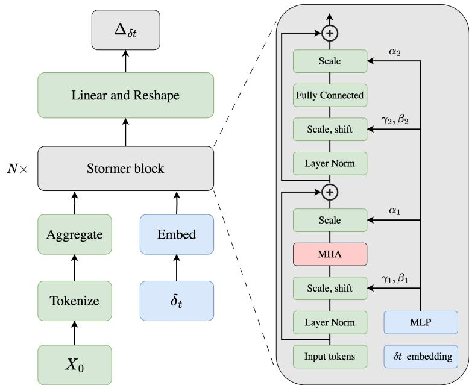  
Figure 7: Stormer architecture. The initial condition goes through tokenization and aggregation, before being fed to a stack of $N$ Stormer blocks together with $\delta t$ . Each Stormer block employs adaLN for $\delta t$ conditioning.

In all experiments, the variable tokenization module is a standard patch embedding layer usually used in ViT, and the aggregation module is a single-layer multi-head cross-attention. The first embedding of $\delta t$ is a linear layer, and the adaLN module in each block employs a 2-layer MLP. For the main comparison with the current methods, we train a Stormer model with a patch size of 2, 1024 hidden dimensions, and 24 Stormer blocks. For the scaling experiments, we vary the hidden dimensions, number of blocks, and patch size. For the rest of the ablation studies, we use a patch size of 4, hidden dimension of 1024, and 24 blocks.

# B.2 Training and evaluation details

# B.2.1 Data normalization

Input normalization We compute the mean and standard deviation for each variable in the input across all spatial positions and all data points in the training set. This means each variable is associated with a scalar mean and scalar standard deviation. During training, we standardize each variable by subtracting it from the associated mean and dividing it by the standard deviation.

Output normalization Unlike the input, the output that the model learns to predict is the difference between two consecutive steps. Therefore, for each variable, we compute the mean and standard deviation of the difference between two consecutive steps in the training set. What it means to be "consecutive" depends on the time interval $\delta t$ . If $\delta t = 6$ , we collect all pairs in training data that are 6-hour apart, compute the difference between two data points in each pair, and then compute the mean and standard deviation of these differences. Since we train Stormer with randomized $\delta t$ , we repeat the same process for each value of $\delta t$ .

# B.2.2 Three-phase training

As mentioned in Section 3, we train Stormer in three phases with the following objective:

$$
\mathcal { L } ( \theta ) = \mathbb { E } \left[ \frac { 1 } { K V H W } \sum _ { k = 1 } ^ { K } \sum _ { v = 1 } ^ { V } \sum _ { i = 1 } ^ { H } \sum _ { j = 1 } ^ { W } w ( v ) L ( i ) ( \widehat { \Delta } _ { k \delta t } ^ { v i j } - \Delta _ { k \delta t } ^ { v i j } ) ^ { 2 } \right] ,
$$

where the number of rollout steps $K$ is equal to 1, 4, and 8 in phase 1, 2, and 3, respectively. For phases 2 and 3, we finetune the best checkpoint from the preceding phase.

# B.2.3 Pressure weights

For pressure-level variables, we assign weights proportionally to the pressure level of each variable. For 4 surface variables, we assign $w = 1$ for $\mathrm { T } 2 \mathrm { m }$ and $w = 0 . 1$ for the remaining variables U10, V10, and MSLP. The surface weights were proposed by GraphCast [26] and we did not perform any additional hyperparameter tuning.

# B.2.4 Optimization

For the 1st phase, we train the model for 100 epochs. We optimize the model using AdamW [24] with learning rate of $5 e - 4$ , parameters $( \beta _ { 1 } 1 = 0 . 9 , \beta _ { 2 } = 0 . 9 5 )$ ) and weight decay of $1 e - 5$ . We used a linear warmup schedule for 10 epochs, followed by a cosine schedule for 90 epochs.

For the 2nd and 3rd phases, we train the model for 20 epochs with a learning rate of $5 e - 6$ and $5 e - 7$ , respectively. We used a linear warmup schedule for 5 epochs, followed by a cosine schedule for 15 epochs. Other hyperparameters remain the same.

We perform early stopping for all phases, where the criterion is the validation loss aggregated across all variables at lead times of 1 day, 3 days, and 5 days for phases 1, 2, and 3, respectively. We save the best checkpoint for each phase using the same criterion.

# B.2.5 Software and hardware stack

We use PyTorch [34], Pytorch Lightning [13], timm [50], numpy [14] and xarray [20] for data processing and model training. We trained Stormer on 128 40GB A100 devices. We leverage mixed-precision training, Fully Sharded Data Parallel, and gradient checkpointing to reduce memory.

# B.3 Evaluation protocol

As different models are trained on different resolutions of data, we follow the practice in WB2 to regrid the forecasts of all models to the same resolution of $1 . 4 0 6 2 5 ^ { \circ }$ $1 2 8 \times 2 5 6$ grid points). We then calculate evaluation metrics on this shared resolution. Similarly to WB2, we evaluate forecasts with initial conditions at 00/12UTC for all days in 2020.

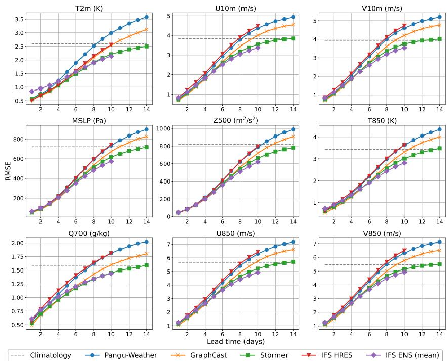  
Figure 8: Global forecast verification results of Stormer and the baselines from 1- to 14-day lead times. We show the latitude-weighted RMSE for select variables. Stormer is on par or outperforms each of the benchmark models for the shown variables. During the later portion of the forecasts, Stormer significantly outperforms the current methods.

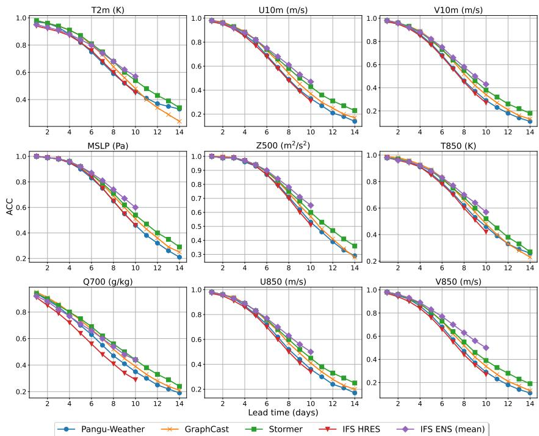  
Figure 9: Global forecast verification results of Stormer and the baselines from 1- to 14-day lead times. We show the latitude-weighted ACC for select variables. Stormer is on par or outperforms each of the benchmark models for the shown variables. During the later portion of the forecasts, Stormer significantly outperforms the current methods.

# C Additional results

# C.1 Complete comparison with SoTA models

Figure 8 compares Stormer with both deep learning and numerical methods. We take IFS and IFS ENS from WB2 which is only available until day 10. Similar to its deep learning counterparts, Stormer achieves lower RMSE compared to the IFS model for most variables, except for near-surface temperature $( \mathrm { T } 2 \mathrm { m } )$ at initial lead times, and only performs slightly worse than IFS ENS. To the best of our knowledge, Stormer is the first model trained on $1 . 4 0 6 2 5 ^ { \circ }$ data to surpass IFS.

Additionally, we compare Stormer and the baselines on latitude-weighted ACC, another common verification metric for weather forecast models. ACC represents the Pearson correlation coefficient between forecast anomalies relative to climatology and ground truth anomalies relative to climatology. ACC ranges from $- 1$ to 1, where 1 indicates perfect correlation, and $- 1$ indicates perfect anticorrelation. We refer to WB2 [41] for the formulation of ACC. Figure 9 shows that similarly to RMSE, Stormer achieves competitive performance from 1 to 5 days, and outperforms the baselines by a large margin beyond 6 days.

# C.2 Impact of multi-step fine-tuning

We verify the importance of multi-step fine-tuning by comparing Stormer after the 1st phase $( K = 1$ ) and after the 3rd phase $K = 8$ ). Figure 10 shows that multi-step fine-tuning significantly improves performance at long lead times.

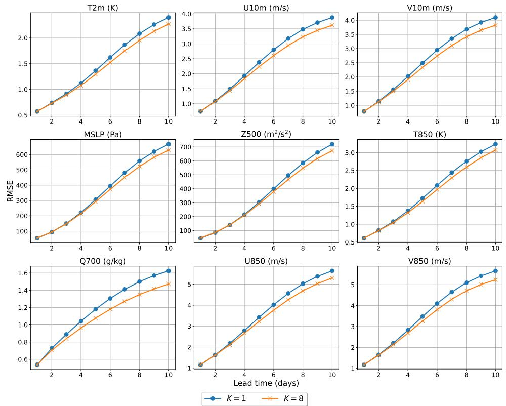  
Figure 10: Performance of Stormer without $K = 1$ ) and with $K = 8$ ) multi-step fine-tuning.

# C.3 Non-ensemble performance of Stormer

Even though our inference strategy can be considered ensemble forecasting, we note that it is much cheaper and more efficient than common techniques such as training multiple networks, dropout, or IC perturbations, as we only have to train a single neural network and do not need extensive hyperparameter tuning. However, to provide more insights into the performance of Stormer, we additionally compare the non-ensemble version of Stormer with the baselines. Specifically, we performed the Pangu-style inference, where we only used the 24-hour interval forecasts to roll out into the future, instead of combining different intervals. Figure 11 shows that non-ensemble Stormer outperforms Pangu and performs competitively with Graphcast.

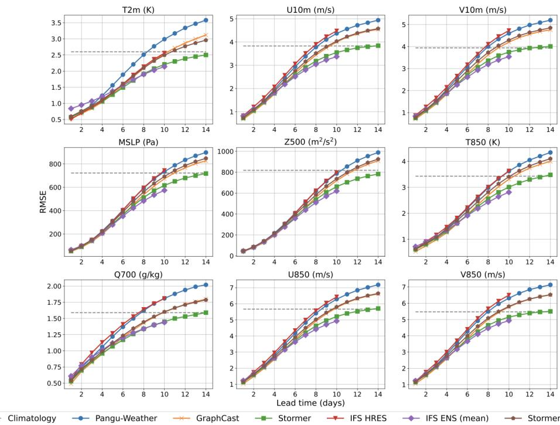  
Figure 11: Non-ensemble version Stormer vs the baselines.

# C.4 Probabilistic forecasting with IC perturbations

Since Stormer can produce forecast ensembles after training, we can consider it a probabilistic forecast system. However, our preliminary results suggested that different forecasts from Stormer are underdispersive and should not be used for uncertainty estimation. To make Stormer a probabilistic forecast system, we need to introduce more randomization to the forecasts via IC perturbations. To do this, for each combination of intervals during the Best m in n inference, we added 4 different noises sampled from a Gaussian distribution, resulting in a total of 128 ensemble members.

Figure 12 shows that IC perturbations improve the probabilistic metric significantly, but may hurt the deterministic performance at short lead times. Moreover, it is difficult to find an optimal noise level for the spread-skill ratio across different variables and lead times. We can further improve this by using a better noise distribution or variable-dependent and lead-time-dependent noise scheduling, which we defer to future works.

# C.5 Comparison of different inference strategies

Our two inference strategies, Homogeneous and Best $m$ in $n$ , provide a tradeoff between efficiency and forecast accuracy. Figure 13 compares the performance of these two strategies across different variables at different lead times. The results show that Homogeneous performs competitively with Best $m$ in $n$ , while being much more efficient, requiring only 3 forward passes compared to $n$ .

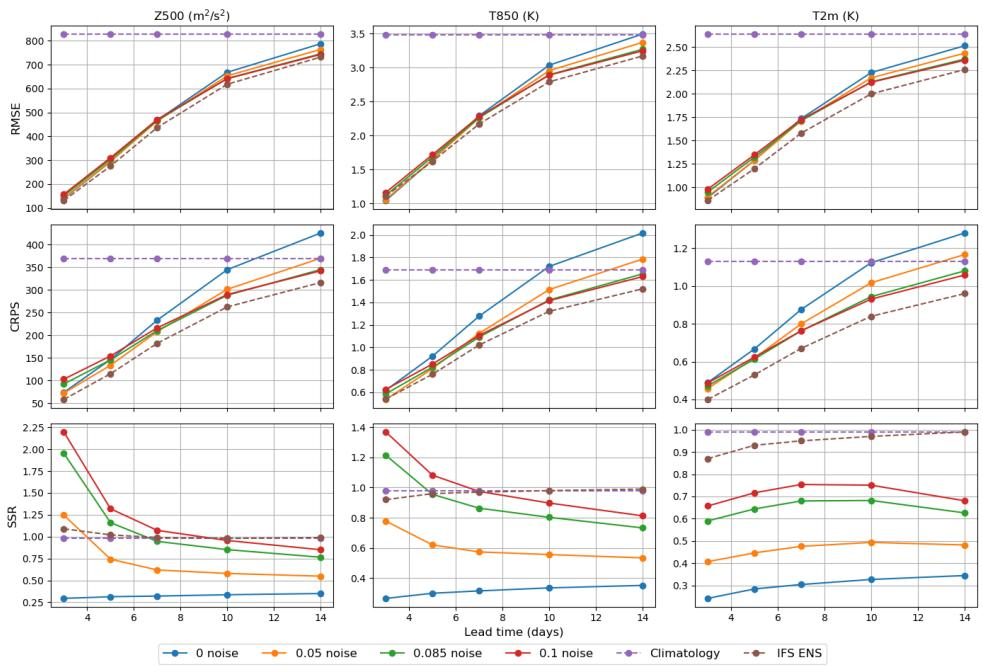  
Figure 12: Probabilistic performance of Stormer with different levels of IC perturbations.

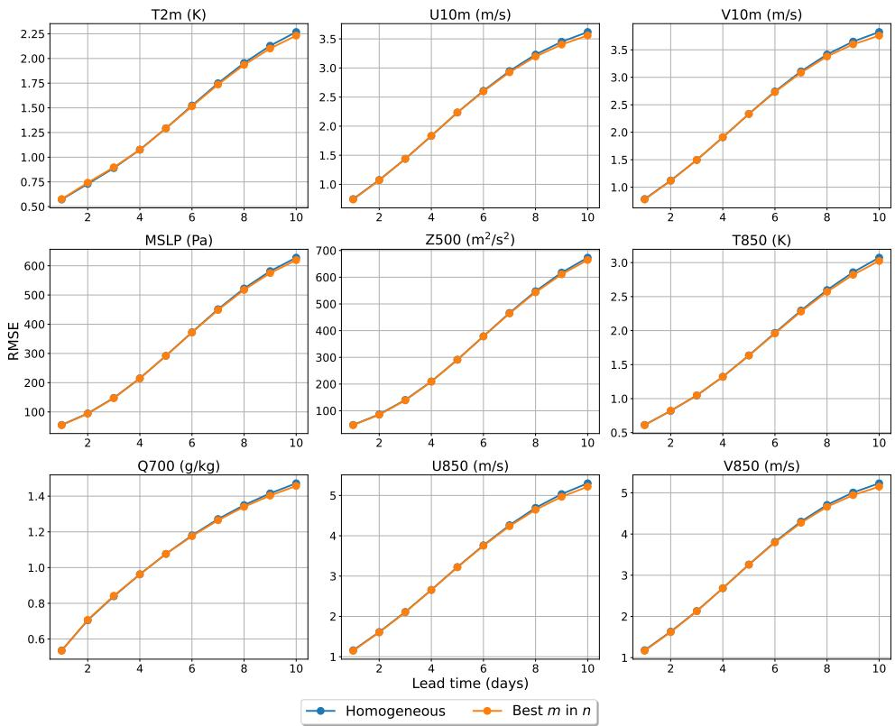  
Figure 13: Comparsion of Homogeneous vs Best $m$ in $n$ inference strategies.

# C.6 Qualitative results

We visualize forecasts produced by Stormer at lead times from 1 days to 14 days for 9 key variables. All forecasts are initialized at 0UTC January 26th 2020. Each figure illustrates one lead time, where each row is for each variable. The first column shows the initial condition, the second column shows the ground truth at that lead time, the third column shows the forecast, and the last column shows the bias, which is the difference between the forecast and the ground truth.

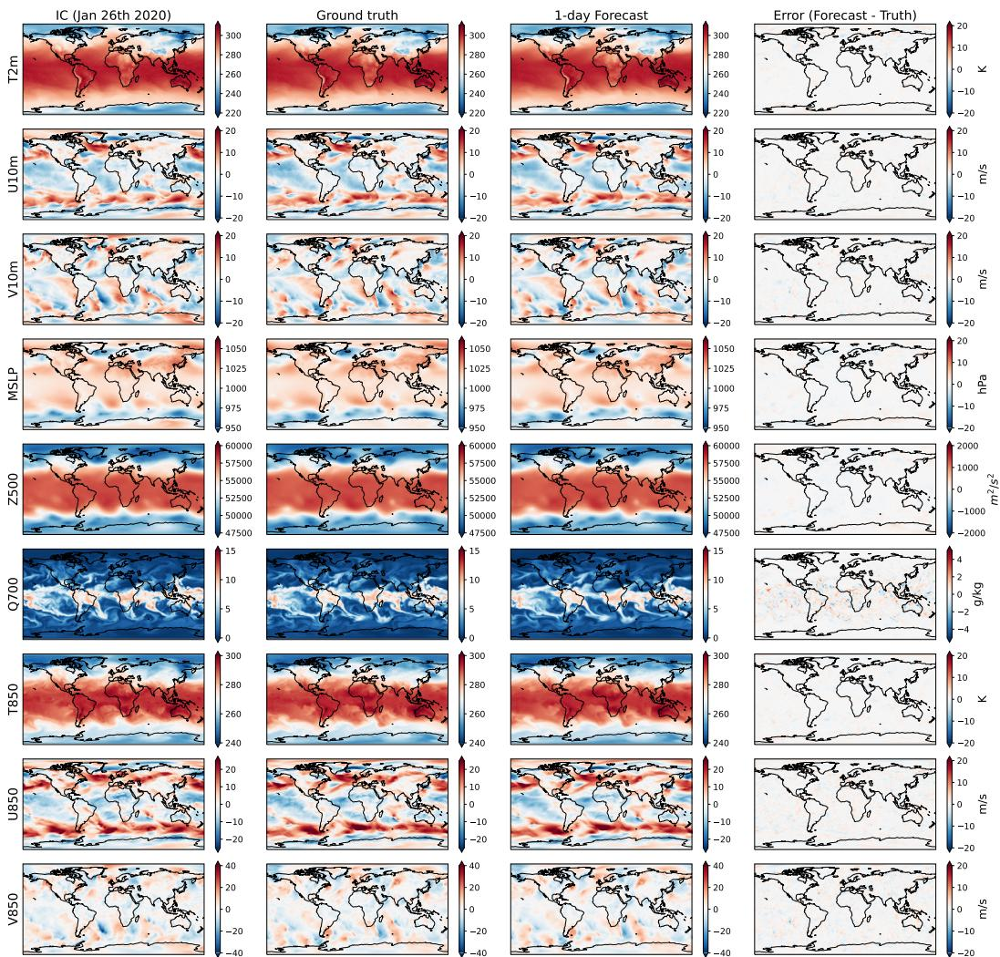  
Figure 14: 1-day lead time

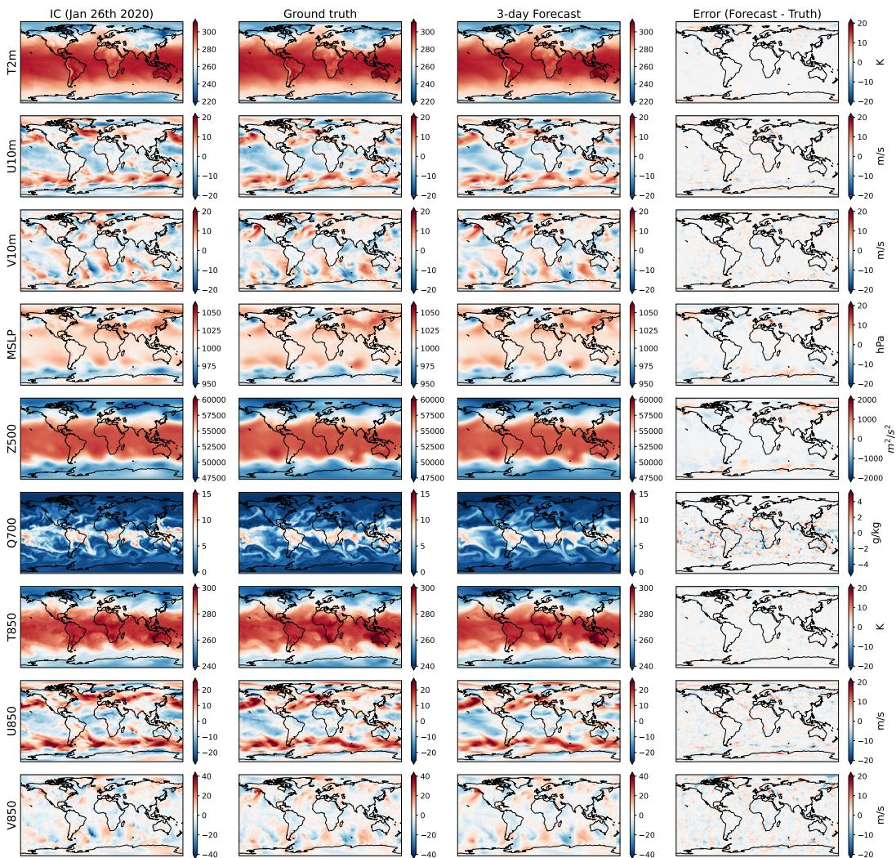  
Figure 15: 3-day lead time

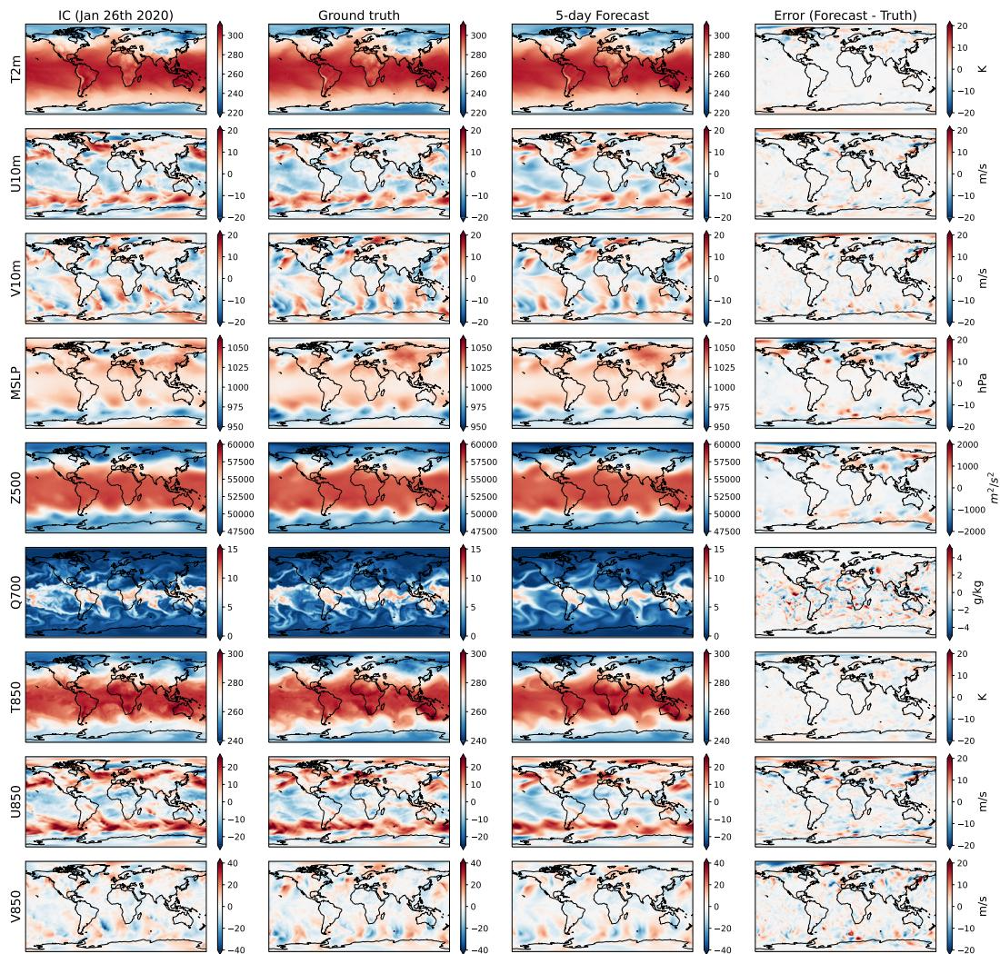  
Figure 16: 5-day lead time

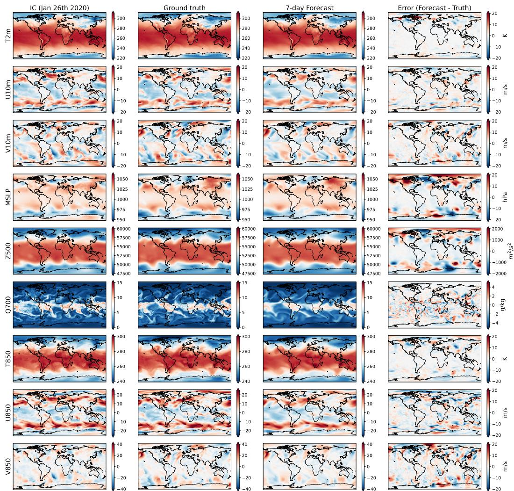  
Figure 17: 7-day lead time

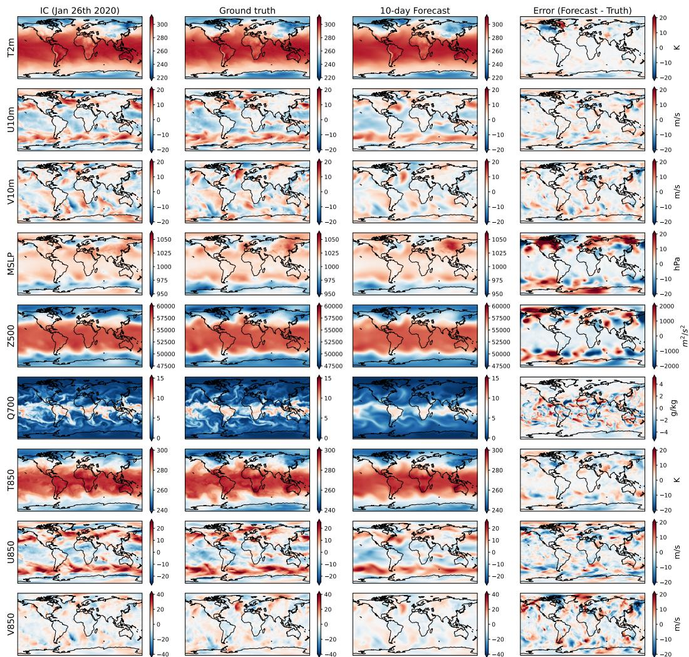  
Figure 18: 10-day lead time

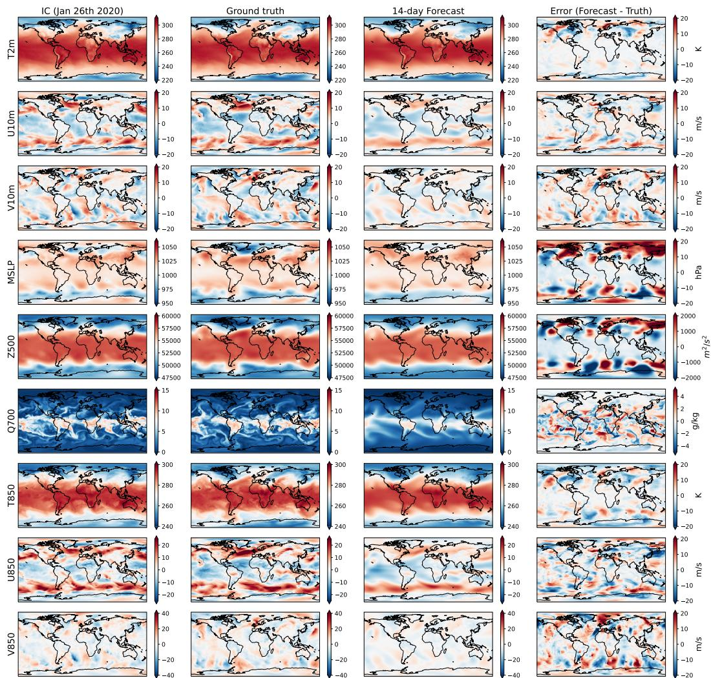  
Figure 19: 14-day lead time

# NeurIPS Paper Checklist

# 1. Claims

Question: Do the main claims made in the abstract and introduction accurately reflect the paper’s contributions and scope?

Answer: [Yes]

Justification: This paper introduces Stormer, a scalable and skillful method for mediumrange weather forecasting. Both the abstract and introduction reflect this contribution.

Guidelines:

• The answer NA means that the abstract and introduction do not include the claims made in the paper.   
• The abstract and/or introduction should clearly state the claims made, including the contributions made in the paper and important assumptions and limitations. A No or NA answer to this question will not be perceived well by the reviewers.   
• The claims made should match theoretical and experimental results, and reflect how much the results can be expected to generalize to other settings.   
• It is fine to include aspirational goals as motivation as long as it is clear that these goals are not attained by the paper.

# 2. Limitations

Question: Does the paper discuss the limitations of the work performed by the authors?

Answer: [Yes]

Justification: Stormer currently operates on $1 . 4 0 6 2 5 ^ { \circ }$ data which is lower-resolution than other leading methods. We mention this limitation in Section 6.

Guidelines:

• The answer NA means that the paper has no limitation while the answer No means that the paper has limitations, but those are not discussed in the paper.   
• The authors are encouraged to create a separate "Limitations" section in their paper.   
• The paper should point out any strong assumptions and how robust the results are to violations of these assumptions (e.g., independence assumptions, noiseless settings, model well-specification, asymptotic approximations only holding locally). The authors should reflect on how these assumptions might be violated in practice and what the implications would be. The authors should reflect on the scope of the claims made, e.g., if the approach was only tested on a few datasets or with a few runs. In general, empirical results often depend on implicit assumptions, which should be articulated.   
• The authors should reflect on the factors that influence the performance of the approach. For example, a facial recognition algorithm may perform poorly when image resolution is low or images are taken in low lighting. Or a speech-to-text system might not be used reliably to provide closed captions for online lectures because it fails to handle technical jargon.   
• The authors should discuss the computational efficiency of the proposed algorithms and how they scale with dataset size.   
• If applicable, the authors should discuss possible limitations of their approach to address problems of privacy and fairness.   
• While the authors might fear that complete honesty about limitations might be used by reviewers as grounds for rejection, a worse outcome might be that reviewers discover limitations that aren’t acknowledged in the paper. The authors should use their best judgment and recognize that individual actions in favor of transparency play an important role in developing norms that preserve the integrity of the community. Reviewers will be specifically instructed to not penalize honesty concerning limitations.

# 3. Theory Assumptions and Proofs

Question: For each theoretical result, does the paper provide the full set of assumptions and a complete (and correct) proof?

Answer: [NA]

Justification: NA

Guidelines:

• The answer NA means that the paper does not include theoretical results.   
• All the theorems, formulas, and proofs in the paper should be numbered and crossreferenced.   
• All assumptions should be clearly stated or referenced in the statement of any theorems.   
• The proofs can either appear in the main paper or the supplemental material, but if they appear in the supplemental material, the authors are encouraged to provide a short proof sketch to provide intuition. Inversely, any informal proof provided in the core of the paper should be complemented by formal proofs provided in appendix or supplemental material.   
• Theorems and Lemmas that the proof relies upon should be properly referenced.

# 4. Experimental Result Reproducibility

Question: Does the paper fully disclose all the information needed to reproduce the main experimental results of the paper to the extent that it affects the main claims and/or conclusions of the paper (regardless of whether the code and data are provided or not)?

Answer: [Yes]

Justification: We provide architectural, training, and evaluation details in Section 3, 4, and Appendix B.

Guidelines:

• The answer NA means that the paper does not include experiments.   
• If the paper includes experiments, a No answer to this question will not be perceived well by the reviewers: Making the paper reproducible is important, regardless of whether the code and data are provided or not.   
• If the contribution is a dataset and/or model, the authors should describe the steps taken to make their results reproducible or verifiable.   
Depending on the contribution, reproducibility can be accomplished in various ways. For example, if the contribution is a novel architecture, describing the architecture fully might suffice, or if the contribution is a specific model and empirical evaluation, it may be necessary to either make it possible for others to replicate the model with the same dataset, or provide access to the model. In general. releasing code and data is often one good way to accomplish this, but reproducibility can also be provided via detailed instructions for how to replicate the results, access to a hosted model (e.g., in the case of a large language model), releasing of a model checkpoint, or other means that are appropriate to the research performed.   
While NeurIPS does not require releasing code, the conference does require all submissions to provide some reasonable avenue for reproducibility, which may depend on the nature of the contribution. For example (a) If the contribution is primarily a new algorithm, the paper should make it clear how to reproduce that algorithm. (b) If the contribution is primarily a new model architecture, the paper should describe the architecture clearly and fully. (c) If the contribution is a new model (e.g., a large language model), then there should either be a way to access this model for reproducing the results or a way to reproduce the model (e.g., with an open-source dataset or instructions for how to construct the dataset). (d) We recognize that reproducibility may be tricky in some cases, in which case authors are welcome to describe the particular way they provide for reproducibility. In the case of closed-source models, it may be that access to the model is limited in some way (e.g., to registered users), but it should be possible for other researchers to have some path to reproducing or verifying the results.

# 5. Open access to data and code

Question: Does the paper provide open access to the data and code, with sufficient instructions to faithfully reproduce the main experimental results, as described in supplemental material?

Answer: [Yes]

Justification: Code, data, and checkpoints will be released publicly upon acceptance.

Guidelines:

• The answer NA means that paper does not include experiments requiring code.   
• Please see the NeurIPS code and data submission guidelines (https://nips.cc/ public/guides/CodeSubmissionPolicy) for more details.   
• While we encourage the release of code and data, we understand that this might not be possible, so “No” is an acceptable answer. Papers cannot be rejected simply for not including code, unless this is central to the contribution (e.g., for a new open-source benchmark).   
• The instructions should contain the exact command and environment needed to run to reproduce the results. See the NeurIPS code and data submission guidelines (https: //nips.cc/public/guides/CodeSubmissionPolicy) for more details.   
• The authors should provide instructions on data access and preparation, including how to access the raw data, preprocessed data, intermediate data, and generated data, etc.   
• The authors should provide scripts to reproduce all experimental results for the new proposed method and baselines. If only a subset of experiments are reproducible, they should state which ones are omitted from the script and why.   
• At submission time, to preserve anonymity, the authors should release anonymized versions (if applicable).   
• Providing as much information as possible in supplemental material (appended to the paper) is recommended, but including URLs to data and code is permitted.

# 6. Experimental Setting/Details

Question: Does the paper specify all the training and test details (e.g., data splits, hyperparameters, how they were chosen, type of optimizer, etc.) necessary to understand the results?

Answer: [Yes]

Justification: We provide architectural, training, and evaluation details in Section 3, 4, and Appendix B.

Guidelines:

• The answer NA means that the paper does not include experiments. • The experimental setting should be presented in the core of the paper to a level of detail that is necessary to appreciate the results and make sense of them. • The full details can be provided either with the code, in appendix, or as supplemental material.

# 7. Experiment Statistical Significance

Question: Does the paper report error bars suitably and correctly defined or other appropriate information about the statistical significance of the experiments?

Answer: [No]

Justification: No, reporting error bars is too computationally expensive and is not standard in data-driven weather forecasting.

Guidelines:

• The answer NA means that the paper does not include experiments.   
• The authors should answer "Yes" if the results are accompanied by error bars, confidence intervals, or statistical significance tests, at least for the experiments that support the main claims of the paper.   
• The factors of variability that the error bars are capturing should be clearly stated (for example, train/test split, initialization, random drawing of some parameter, or overall run with given experimental conditions).   
• The method for calculating the error bars should be explained (closed form formula, call to a library function, bootstrap, etc.)   
• The assumptions made should be given (e.g., Normally distributed errors).   
• It should be clear whether the error bar is the standard deviation or the standard error of the mean.   
• It is OK to report 1-sigma error bars, but one should state it. The authors should preferably report a 2-sigma error bar than state that they have a $96 \%$ CI, if the hypothesis of Normality of errors is not verified.   
• For asymmetric distributions, the authors should be careful not to show in tables or figures symmetric error bars that would yield results that are out of range (e.g. negative error rates).   
• If error bars are reported in tables or plots, The authors should explain in the text how they were calculated and reference the corresponding figures or tables in the text.

# 8. Experiments Compute Resources

Question: For each experiment, does the paper provide sufficient information on the computer resources (type of compute workers, memory, time of execution) needed to reproduce the experiments?

Answer: [Yes]

Justification: We specify the compute resources for training Stormer in Section 4.1.

Guidelines:

• The answer NA means that the paper does not include experiments.   
• The paper should indicate the type of compute workers CPU or GPU, internal cluster, or cloud provider, including relevant memory and storage.   
• The paper should provide the amount of compute required for each of the individual experimental runs as well as estimate the total compute.   
• The paper should disclose whether the full research project required more compute than the experiments reported in the paper (e.g., preliminary or failed experiments that didn’t make it into the paper).

# 9. Code Of Ethics

Question: Does the research conducted in the paper conform, in every respect, with the NeurIPS Code of Ethics https://neurips.cc/public/EthicsGuidelines?

Answer: [Yes]

Justification: The research conforms with the NeurIPS Code of Ethics.

Guidelines:

• The answer NA means that the authors have not reviewed the NeurIPS Code of Ethics.   
• If the authors answer No, they should explain the special circumstances that require a deviation from the Code of Ethics.   
• The authors should make sure to preserve anonymity (e.g., if there is a special consideration due to laws or regulations in their jurisdiction).

# 10. Broader Impacts

Question: Does the paper discuss both potential positive societal impacts and negative societal impacts of the work performed?

Answer: [Yes]

Justification: We discuss the broader impacts of the paper in Section A.

Guidelines:

• The answer NA means that there is no societal impact of the work performed.   
• If the authors answer NA or No, they should explain why their work has no societal impact or why the paper does not address societal impact.   
Examples of negative societal impacts include potential malicious or unintended uses (e.g., disinformation, generating fake profiles, surveillance), fairness considerations (e.g., deployment of technologies that could make decisions that unfairly impact specific groups), privacy considerations, and security considerations.   
• The conference expects that many papers will be foundational research and not tied to particular applications, let alone deployments. However, if there is a direct path to any negative applications, the authors should point it out. For example, it is legitimate to point out that an improvement in the quality of generative models could be used to generate deepfakes for disinformation. On the other hand, it is not needed to point out that a generic algorithm for optimizing neural networks could enable people to train models that generate Deepfakes faster.   
• The authors should consider possible harms that could arise when the technology is being used as intended and functioning correctly, harms that could arise when the technology is being used as intended but gives incorrect results, and harms following from (intentional or unintentional) misuse of the technology.   
If there are negative societal impacts, the authors could also discuss possible mitigation strategies (e.g., gated release of models, providing defenses in addition to attacks, mechanisms for monitoring misuse, mechanisms to monitor how a system learns from feedback over time, improving the efficiency and accessibility of ML).

# 11. Safeguards

Question: Does the paper describe safeguards that have been put in place for responsible release of data or models that have a high risk for misuse (e.g., pretrained language models, image generators, or scraped datasets)?

Answer: [NA]

Justification: NA

Guidelines:

• The answer NA means that the paper poses no such risks.   
• Released models that have a high risk for misuse or dual-use should be released with necessary safeguards to allow for controlled use of the model, for example by requiring that users adhere to usage guidelines or restrictions to access the model or implementing safety filters.   
• Datasets that have been scraped from the Internet could pose safety risks. The authors should describe how they avoided releasing unsafe images.   
• We recognize that providing effective safeguards is challenging, and many papers do not require this, but we encourage authors to take this into account and make a best faith effort.

# 12. Licenses for existing assets

Question: Are the creators or original owners of assets (e.g., code, data, models), used in the paper, properly credited and are the license and terms of use explicitly mentioned and properly respected?

Answer: [Yes]

Justification: We used and cited Weatherbench 2, an open-source benchmark for data-driven weather forecasting.

Guidelines:

• The answer NA means that the paper does not use existing assets.   
• The authors should cite the original paper that produced the code package or dataset.   
• The authors should state which version of the asset is used and, if possible, include a URL.   
• The name of the license (e.g., CC-BY 4.0) should be included for each asset.   
• For scraped data from a particular source (e.g., website), the copyright and terms of service of that source should be provided.   
• If assets are released, the license, copyright information, and terms of use in the package should be provided. For popular datasets, paperswithcode.com/datasets has curated licenses for some datasets. Their licensing guide can help determine the license of a dataset.   
• For existing datasets that are re-packaged, both the original license and the license of the derived asset (if it has changed) should be provided.

• If this information is not available online, the authors are encouraged to reach out to the asset’s creators.

# 13. New Assets

Question: Are new assets introduced in the paper well documented and is the documentation provided alongside the assets?

Answer: [NA]

Justification: NA

Guidelines:

• The answer NA means that the paper does not release new assets.   
• Researchers should communicate the details of the dataset/code/model as part of their submissions via structured templates. This includes details about training, license, limitations, etc.   
• The paper should discuss whether and how consent was obtained from people whose asset is used.   
• At submission time, remember to anonymize your assets (if applicable). You can either create an anonymized URL or include an anonymized zip file.

# 14. Crowdsourcing and Research with Human Subjects

Question: For crowdsourcing experiments and research with human subjects, does the paper include the full text of instructions given to participants and screenshots, if applicable, as well as details about compensation (if any)?

Answer: [NA]

Justification: NA

Guidelines:

• The answer NA means that the paper does not involve crowdsourcing nor research with human subjects.   
• Including this information in the supplemental material is fine, but if the main contribution of the paper involves human subjects, then as much detail as possible should be included in the main paper.   
• According to the NeurIPS Code of Ethics, workers involved in data collection, curation, or other labor should be paid at least the minimum wage in the country of the data collector.

# 15. Institutional Review Board (IRB) Approvals or Equivalent for Research with Human Subjects

Question: Does the paper describe potential risks incurred by study participants, whether such risks were disclosed to the subjects, and whether Institutional Review Board (IRB) approvals (or an equivalent approval/review based on the requirements of your country or institution) were obtained?

Answer: [NA]

Justification: NA

Guidelines:

• The answer NA means that the paper does not involve crowdsourcing nor research with   
human subjects.   
• Depending on the country in which research is conducted, IRB approval (or equivalent) may be required for any human subjects research. If you obtained IRB approval, you should clearly state this in the paper.   
• We recognize that the procedures for this may vary significantly between institutions and locations, and we expect authors to adhere to the NeurIPS Code of Ethics and the guidelines for their institution.   
• For initial submissions, do not include any information that would break anonymity (if applicable), such as the institution conducting the review.