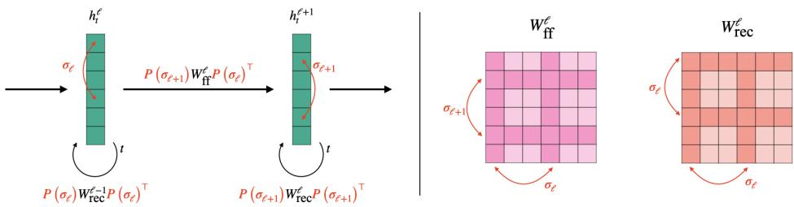
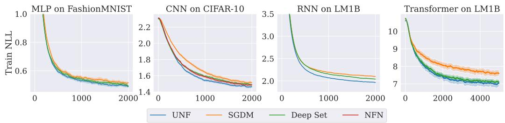

# Universal Neural Functionals

Chelsea Finn Stanford University

Allan Zhou Stanford University ayz@cs.stanford.edu

James Harrison Google DeepMind jamesharrison@google.com

# Abstract

A challenging problem in many modern machine learning tasks is to process weight-space features, i.e., to transform or extract information from the weights and gradients of a neural network. Recent works have developed promising weight-space models that are equivariant to the permutation symmetries of simple feedforward networks. However, they are not applicable to general architectures, since the permutation symmetries of a weight space can be complicated by recurrence or residual connections. This work proposes an algorithm that automatically constructs permutation equivariant models, which we refer to as universal neural functionals (UNFs), for any weight space. Among other applications, we demonstrate how UNFs can be substituted into existing learned optimizer designs, and find promising improvements over prior methods when optimizing small image classifiers and language models. Our results suggest that learned optimizers can benefit from considering the (symmetry) structure of the weight space they optimize. We open-source our library for constructing UNFs at https://github.com/AllanYangZhou/universal_neural_functional.

# 1 Introduction

Many problems in machine learning require handling weight-space features, such as the weights, gradients, or sparsity masks of neural networks. For example, optimizers iteratively map the current weights and gradient history to updated weights. Taking this perspective, researchers have proposed a variety of data-driven methods that train a neural network to process these weight-space features. Examples applications of these neural functionals [Zhou et al., 2023a] include training neural networks to predict classifier generalization from weights [Eilertsen et al., 2020], to optimize other networks [Metz et al., 2022], and to classify or edit implicit neural representations (INRs) [De Luigi et al., 2023].

Until recently, researchers lacked a unifying and principled framework for designing neural functionals, and would implement a custom model for their particular weight-space task. A significant recent advance was the development of weight-space models that are permutation equivariant [Navon et al., 2023, Zhou et al., 2023a]. Neuron permutation symmetries arise in a neural network’s weight space because re-ordering hidden neurons has no effect on the network’s function [Hecht-Nielsen, 1990]. A permutation equivariant neural functional can guarantee that under a neuron permutation of its input, its output permutes accordingly.

Navon et al. [2023] showed that permutation equivariance significantly improves performance on weight-space tasks, but their models only apply to the weight spaces of simple feedforward multilayer perceptrons (MLPs). Permutation equivariant neural functionals [Zhou et al., 2023a] added the ability to process weights from simple feedforward convolutional networks (CNNs). However, in practice we may deal with the weight spaces of complex networks that have residual connections, recurrence, normalization layers, and so on. Extending existing approaches to each possible weight space would be tedious and challenging.

  
Figure 1: Illustration of the permutation symmetries in the weight space of a recurrent neural network (Example 2.2). Left: Each layer contains feedforward (ff) weights mapping between different layer’s activations, and recurrent (rec) weights transforming activations over time. We can permute the hidden activations as illustrated without changing the final outputs $h _ { t } ^ { L }$ . Right: Permuting the hidden activations induces a permutation on the weights. Here, the rows and columns of the feedforward weights are permuted by $\left( \sigma _ { \ell + 1 } , \sigma _ { \ell } \right)$ , while the recurrent weights are permuted by $\left( \sigma _ { \ell } , \sigma _ { \ell } \right)$ . Our algorithm automatically constructs permutation equivariant models for any collection of weight tensors given a description of its symmetries (Appendix A).

We propose an approach that automatically constructs permutation equivariant models for any collection of tensors whose dimensions can permute according to a shared set of permutations. This naturally encompasses the permutation equivariance we might desire for any given weight space. We show that our algorithm constructs the most general linear layer that operates on a given weight space while guaranteeing equivariance to the specified permutation symmetries. Stacking multiple such layers with pointwise nonlinearities produces a deep permutation equivariant model, which we refer to as a universal neural functional.

To evaluate the empirical effectiveness of UNFs, we apply them to tasks that require processing networks with complex architectures containing recurrence, layer normalization, residual connections, and more. We use UNFs to implement learned optimizers and then optimize small image classifiers, RNNs, and Transformer language models, observing promising improvements over prior methods. In a generalization prediction task, we use UNF to predict the performance of sequence-to-sequence RNN models from their weights. Our experiments show that universal neural functionals are flexible, can be easily applied to different weight spaces, and improve upon prior weight-space methods.

# 2 Preliminaries

We largely follow or extend the notation and naming of Zhou et al. [2023a]. Given a fixed neural network architecture, there is a weight space $\mathcal { W }$ of possible parameters (weights, biases, normalization scalings, etc.). We refer to all such parameters as “weights”. A particular set of weights $W = \left( W ^ { ( 1 ) } , \bar { \cdot } \cdot \cdot , W ^ { ( L ) } \right)$ contains multiple “tensors”, or multidimensional arrays. Depending on the architecture, $\mathcal { W }$ contains numerous symmetries [Hecht-Nielsen, 1990, Godfrey et al., 2022], i.e., transformations on the weight space that do not affect the network’s behavior. Following prior work [Navon et al., 2023, Zhou et al., 2023a], this work focuses only on the permutation symmetries, which are called neuron permutations.

Neuron permutations correspond to re-arranging the neurons within (hidden) layers, which have no canonical ordering. We make the simplifying assumption that all layers can be re-arranged–this assumption can be later corrected using positional encodings [Zhou et al., 2023a]. Assuming there are $N$ independently permutable layers of neurons, the neuron permutation group is the direct product $S = S _ { n _ { 1 } } \times \cdot \cdot \cdot \times S _ { n _ { N } }$ , where $n _ { i }$ is the number of neurons being permuted in each layer.

In general, each weight is a “tensor” (multi-dimensional array) of real numbers. Using $M ( a , b , \cdot \cdot \cdot )$ to denote arrays Ra×b×···, consider a rank-Dℓ tensor W (ℓ) ∈ M ndℓ1 , · · · , ndℓD  . Each dimension $d _ { i } ^ { \ell }$ is permuted by $\sigma _ { d _ { i } ^ { \ell } }$ . That is, the action of $\sigma$ on the indices of the weight tensor is:

$$
\sigma \left( i _ { 1 } , \cdots , i _ { D _ { \ell } } \right) : = \left( \sigma _ { d _ { 1 } ^ { \ell } } ( i _ { 1 } ) , \cdots , \sigma _ { d _ { D _ { \ell } } ^ { \ell } } ( i _ { D _ { \ell } } ) \right) .
$$

Defining the multi-index $\vec { i } : = ( i _ { 1 } , \cdot \cdot \cdot , i _ { D _ { \ell } } )$ , the action on the weight tensor is to permute the entries: $\big [ \sigma W ^ { ( \ell ) } \big ] _ { \vec { i } } : = W _ { \sigma ^ { - 1 } \big ( \vec { i } \big ) } ^ { ( \ell ) }$ , and the action on $\mathcal { W }$ is $\sigma W : = \left( \sigma W ^ { ( 1 ) } , \cdot \cdot \cdot , \sigma W ^ { ( L ) } \right)$ .

We now elaborate on the definition of the group and action in several common cases.

Example 2.1 (Multilayer perceptron). $A$ multilayer perceptron $( M L P )$ with $L + 1$ layers has activations $h ^ { \ell + 1 } = s \left( W ^ { \left( \ell \right) } h ^ { \bar { \ell } } + b ^ { ( \bar { \ell } + 1 ) } \right)$ , with $h ^ { 1 }$ being the first (input) layer and $h ^ { L + 1 }$ the output. If each $h ^ { \ell }$ is a vector of length $n _ { \ell }$ , then the weights are matrices $W ^ { ( \ell ) } \in { \cal M } ( n _ { \ell + 1 } , n _ { \ell } )$ and the biases are vectors $b ^ { ( \ell ) } \in M ( n _ { \ell } )$ . Then we have a neuron permutation group $\begin{array} { r } { S = S _ { n 1 } \times \cdots \times S _ { n _ { L + 1 } } } \end{array}$ , and $\sigma \in { \mathcal { S } }$ can be written $\sigma = ( \sigma _ { \ell } ) _ { \ell = 1 } ^ { L + 1 }$ . The action on the weights and biases is:

$$
W ^ { ( \ell ) } \mapsto P \left( \sigma _ { \ell + 1 } \right) W ^ { ( \ell ) } P \left( \sigma _ { \ell } \right) ^ { \top } \quad a n d \quad b ^ { ( \ell ) } \mapsto P \left( \sigma _ { \ell } \right) b ^ { ( \ell ) } ,
$$

where $P \left( \sigma _ { \ell } \right)$ is the $n _ { \ell } \times n _ { \ell }$ permutation matrix corresponding to $\sigma _ { \ell }$ . This corresponds exactly to the “NP” setting in Zhou et al. [2023a].

Example 2.2 (Recurrent neural network). Consider a deep recurrent neural network (RNN) [Elman, 1990] without biases. We follow the presentation of Wang et al. [2023]:

$$
h _ { t } ^ { \ell + 1 } = s \left( W _ { r e c } ^ { \ell + 1 } h _ { t - 1 } ^ { \ell + 1 } + W _ { f f } ^ { \ell } h _ { t } ^ { \ell } \right) ,
$$

where $h _ { t } ^ { 1 }$ are the inputs and $h _ { t } ^ { L + 1 }$ are the outputs at each timestep, with $h _ { 0 } ^ { \ell }$ initialized to 0. The weight space consists of feedforward $( \mathcal { H } )$ weights $W _ { \mathcal { H } } ^ { \ell } \in M \left( n _ { \ell + 1 } , n _ { \ell } \right)$ and recurrent (rec) weights $W _ { r e c } ^ { \ell } \in { \cal M } \left( n _ { \ell } , n _ { \ell } \right)$ . We again define the neuron permutation group $S : = S _ { n _ { 1 } } \times \cdot \cdot \cdot \times S _ { n _ { L + 1 } }$ , but the action of the group on the weight space is now different. Here, re-arranging the neurons corresponds to transforming the weights:

$$
W _ { f f } ^ { \ell } \mapsto P \left( \sigma _ { \ell + 1 } \right) W _ { f f } ^ { \ell } P \left( \sigma _ { \ell } \right) ^ { \top } \quad a n d \quad W _ { r e c } ^ { \ell } \mapsto P \left( \sigma _ { \ell } \right) W _ { r e c } ^ { \ell } P \left( \sigma _ { \ell } \right) ^ { \top } .
$$

As illustrated by Figure $^ { l }$ , the feedforward weights transform just as in the MLP case (Eq. 2), but the recurrent weights’ rows and columns must be transformed by the same permutation.

Example 2.3 (Convolutional neural network). Consider a $1 D$ convolutional neural network (CNN) without biases. Using $\star$ to denote cross-correlation, we have activations $h ^ { \ell + 1 } = s \left( W ^ { ( \ell ) } \star h ^ { \ell } \right)$ , where the input is $h ^ { 1 }$ and the output is $h ^ { L + 1 }$ . If each filter has spatial dimension $k _ { \ell }$ and each $h ^ { \ell }$ has nℓ channels, then we have rank-3 weight tensors $W ^ { ( \ell ) } \in \dot { \cal M } ( n _ { \ell + 1 } , n _ { \ell } , k _ { \ell } )$ and neuron permutation group $\begin{array} { r } { \boldsymbol { S } = \prod _ { \ell = 1 } ^ { L } S _ { n _ { \ell } } \times S _ { k _ { \ell } } } \end{array}$ . Looking at how each dimension of $W ^ { ( \ell ) }$ permutes, we would have $\sigma _ { n _ { \ell + 1 } } \in S _ { n _ { \ell + 1 } }$ permute the first dimension (output channels), $\sigma _ { n _ { \ell } } \in S _ { n _ { \ell } }$ permute the second dimension (input channels), and $\sigma _ { k \ell } \in S _ { k \ell }$ permute the third dimension (spatial).

We note that permutating the spatial dimensions of a convolution filter would change the CNN’s behavior and is not a true symmetry of the weight space. This is a notable difference between how our framework handles convolutional weight spaces compared to NFNs [Zhou et al., 2023a], where the action of the neuron permutation group does not affect the spatial dimensions at all. Assuming that all dimensions of each weight tensor can permute simplifies the development of our framework, and undesired symmetry can be broken (if desired) by positional encodings of the input [Zhou et al., 2023a, Lim et al., 2023].

Equivariance and invariance. We are interested in functions $T : \mathcal { W } \to \mathcal { W }$ that are equivariant, meaning that it doesn’t matter whether we apply a neuron permutation to the input or the output. We define $\mathbb { L } _ { \boldsymbol { S } } \left( \boldsymbol { \mathcal { W } } , \boldsymbol { \mathcal { W } } \right)$ as the space of equivariant linear maps, i.e., those $T$ satisfying:

$$
T \left( \sigma W \right) = \sigma T \left( W \right) , \forall \sigma \in S , W \in \mathcal { W } .
$$

Our goal is to design a layer (i.e., a parameterized space of functions) that is equivalent to $\mathbb { L } _ { \boldsymbol { S } } \left( \boldsymbol { \mathcal { W } } , \boldsymbol { \mathcal { W } } \right)$ . In some applications, we may instead desire invariance, that is a function $P$ satisfying

$$
P \left( \sigma W \right) = P \left( W \right) , \forall \sigma \in S , W \in \mathcal { W } .
$$

Following prior work [Navon et al., 2023, Zhou et al., 2023a], we can build invariant neural functionals by composing several equivariant layers with an invariant pooling layer, e.g., one that sums over every dimension of each weight tensor and concatenates the results.

# 3 Universal neural functionals

Since equivariance is preserved under composition, and pointwise non-linearities are already permutation equivariant, we can build deep equivariant models as long as we have an equivariant linear layer. Additionally, composing equivariant layers with an invariant pooling operation produces a deep invariant model. This section introduces a method for producing equivariant weight-space layers for any given weight space, which enables the flexible construction of universal neural functionals.

# 3.1 Decomposing equivariant weight-space maps

The weight space is a direct sum of individual weight subspaces $\mathcal { W } = \mathcal { W } ^ { ( 1 ) } \oplus \cdots \oplus \mathcal { W } ^ { ( L ) }$ , so the problem of defining an equivariant layer on $\mathcal { W }$ can be decomposed into defining equivariant layers between each pair of weight subspaces ${ \mathcal { W } } ^ { ( m ) }$ and $\mathscr { W } ^ { ( \ell ) }$ , for all $\ell$ and $m$ [Navon et al., 2023].

We re-state this result in our own notation. For any $\ell , m$ pair we define $\mathbb { L } _ { S } \left( \mathcal { W } ^ { ( m ) } , \mathcal { W } ^ { ( \ell ) } \right)$ as the space of equivariant maps between the two weight subspaces. It contains all $T ^ { \ell m } : \mathcal { W } ^ { ( m ) } \to \mathcal { W } ^ { ( \ell ) }$ satisfying

$$
T ^ { \ell m } \left( \boldsymbol { \sigma } W ^ { ( m ) } \right) = \sigma T ^ { \ell m } \left( W ^ { ( m ) } \right) \quad \forall \boldsymbol { \sigma } , W ^ { ( m ) } ,
$$

noting that the action on the left and right hand sides of the equivariance condition are not, in general, the same.

Assume that we already have a basis $B ^ { s p }$ for $\mathbb { L } _ { \boldsymbol { s } } \left( \mathcal { W } ^ { \left( { p } \right) } , \mathcal { W } ^ { \left( { s } \right) } \right)$ . A basis function $E \in B ^ { s p }$ can be extended to $\bar { E } : \mathcal { W } \to \mathcal { W }$ by defining:

$$
\bar { E } ( W ) ^ { \ell } : = \left\{ \begin{array} { l l } { E \left( W ^ { ( p ) } \right) } & { \ell = s } \\ { 0 } & { \mathrm { o t h e r w i s e } } \end{array} \right. ,
$$

where $\bar { E } ( W ) : = \left( \bar { E } ^ { 1 } ( W ) , \cdots , \bar { E } ^ { L } ( W ) \right)$

Theorem 3.1 (Navon et al. [2023]). Let $\{ B ^ { \ell m } \}$ be bases for each $\mathbb { L } _ { S } \left( \mathcal { W } ^ { ( m ) } , \mathcal { W } ^ { ( \ell ) } \right)$ . Then the union of these bases (extended by Eq. 7) is a basis for linear equivariant maps on $\mathcal { W }$ . That is, we have the basis $\boldsymbol { B }$ for $\mathbb { L } _ { \boldsymbol { S } } \left( \boldsymbol { \mathcal { W } } , \boldsymbol { \mathcal { W } } \right)$ defined:

$$
B = \bigcup _ { \ell , m \in [ [ L ] ] ^ { 2 } } \left\{ \bar { E } \mid E \in \mathcal { B } ^ { \ell m } \right\} .
$$

This result tells us that we can construct an equivariant basis $\boldsymbol { B }$ for $\mathbb { L } _ { \boldsymbol { S } } \left( \boldsymbol { \mathcal { W } } , \boldsymbol { \mathcal { W } } \right)$ by simply combining the equivariant bases $\{ B ^ { \ell m } \}$ for each pair of weight subspaces.

# 3.2 Equivariant layers between tensors

Since weights are tensors, our decomposed problem involves finding bases for permutation equivariant maps between tensors. Variants of this problem have been studied by numerous prior works–in particular, Maron et al. [2018] theoretically characterize a basis for equivariant maps between arbitrary-rank tensors, and provide a concrete implementation of the basis functions in the rank-2 case. Here, we describe a general algorithm that automatically constructs a basis for permutation equivariant maps between arbitrary-rank tensors. Concretely, it implements each basis function in terms of simple array operations that are amenable to efficient computation with modern deep learning frameworks.

# Algorithm 1 Basis for equivariant $\mathcal { W } ^ { ( m ) } \to \mathcal { W } ^ { ( \ell ) }$ layer

1: Initialize basis $B ^ { \ell m }  \{ \}$   
2: $\mathcal { T }  \{ o _ { 1 } , \cdot \cdot \cdot , o _ { D _ { \ell } } , i _ { 1 } , \cdot \cdot \cdot , i _ { D _ { m } } \}$   
3: for $\mathcal { P }$ in VALIDPARTITIONS $( \mathcal { T } )$ do   
4: Label each subset $s _ { p } \in \mathcal { P }$ by unique character   
$\operatorname { C H A R } ( s _ { p } )$   
5: for $\alpha \in \mathbb { Z }$ do   
6: Map index $c [ \alpha ] \gets \mathrm { { C H A R } } \big ( s _ { p } \big )$ where $\alpha \in s _ { p }$   
7: end for   
8: $\begin{array} { r } { E _ { \mathcal { P } } ( X ) _ { c [ o _ { 1 } ] , \cdots , c _ { o [ D _ { \ell } ] } } : = \sum _ { \mathcal { R } } X _ { c [ i _ { 1 } ] , \cdots , c [ i _ { D _ { m } } ] } } \end{array}$   
9: $B ^ { \ell m } \gets B ^ { \ell m } \cup \{ E _ { \mathcal { P } } \}$   
10: end for   
11: return Bℓm

Functions in $\mathbb { L } _ { s } \left( \mathcal { W } ^ { ( m ) } , \mathcal { W } ^ { ( \ell ) } \right)$ take input tensors indexed by $\{ i _ { 1 } , \cdots , i _ { D _ { m } } \}$ and produces output tensors indexed by $\{ o _ { 1 } , \cdot \cdot \cdot , o _ { D _ { \ell } } \}$ . We can construct a basis $B ^ { \ell m }$ for this space where each element is identified by a valid partition $\mathcal { P }$ of these indices. Recall that the indices $( i _ { 1 } , i _ { 2 } , \cdots )$ of $W ^ { ( m ) }$ are permuted by $\left( \sigma _ { d _ { 1 } ^ { m } } , \sigma _ { d _ { 2 } ^ { m } } , \cdot \cdot \cdot \right)$ . We say that two indices $i _ { 1 }$ and $i _ { 2 }$ “permute simultaneously” if $d _ { 1 } ^ { m } = d _ { 2 } ^ { m }$ .

Definition 1. $A$ valid partition is a partition $\mathcal { P }$ of the output and input indices $\begin{array} { r l } { \mathcal { Z } } & { { } = } \end{array}$ $\left\{ o _ { 1 } , \cdot \cdot \cdot , o _ { D _ { \ell } } , i _ { 1 } , \cdot \cdot \cdot , i _ { D _ { m } } \right\}$ into non-empty subsets, such that each subset only contains indices that are permuted simultaneously.

Example 3.1 $( \mathcal { W } ^ { ( m ) } = \mathcal { W } ^ { ( \ell ) } = \mathbb { R } ^ { n _ { 1 } \times n _ { 2 } } )$ . Here the output and input indices are $\left\{ o _ { 1 } , o _ { 2 } , i _ { 1 } , i _ { 2 } \right\}$ . The partition $\left\{ \left\{ o _ { 1 } , o _ { 2 } \right\} , \left\{ i _ { 1 } , i _ { 2 } \right\} \right\}$ is not valid because $o _ { 1 } , o _ { 2 }$ are permuted by $\sigma _ { 1 } , \sigma _ { 2 }$ , so they $d o$ not permute simultaneously. On the other hand, $\left\{ \left\{ o _ { 1 } , i _ { 1 } \right\} , \left\{ o _ { 2 } , i _ { 2 } \right\} \right\}$ is a valid partition.

Example 3.2 $( \mathcal { W } ^ { ( m ) } = \mathcal { W } ^ { ( \ell ) } = \mathbb { R } ^ { n _ { 1 } \times n _ { 1 } } )$ . This time, the partition $\left\{ \left\{ o _ { 1 } , o _ { 2 } \right\} , \left\{ i _ { 1 } , i _ { 2 } \right\} \right\}$ is valid because $o _ { 1 } , o _ { 2 }$ are both permuted by $\sigma _ { 1 }$ , as are $i _ { 1 } , i _ { 2 }$ .

To construct the equivariant basis, we enumerate all valid partitions and then map each partition $\mathcal { P }$ to a basis function $E _ { \mathcal { P } }$ . Concretely, we label each subset of $\mathcal { P }$ with a distinct character $\alpha , \beta , \gamma , \cdots$ and then remap each of our original indices $\left\{ o _ { 1 } , \cdot \cdot \cdot , o _ { D _ { \ell } } , i _ { 1 } , \cdot \cdot \cdot , i _ { D _ { m } } \right\}$ to a a character based on which subset the index was in. This mapping is best illustrated by continuing our previous example.

Example 3.3 $( \mathcal { W } ^ { ( m ) } = \mathcal { W } ^ { ( \ell ) } = \mathbb { R } ^ { n _ { 1 } \times n _ { 2 } } )$ ). Here input and output are both matrices, with combined indices $\left\{ o _ { 1 } , o _ { 2 } , i _ { 1 } , i _ { 2 } \right\}$ . We have two permutations $( \sigma _ { 1 } , \sigma _ { 2 } ) \in S _ { n _ { 1 } } \times S _ { n _ { 2 } }$ that can act on the rows and columns of the input and output matrices. There are four valid partitions:

$$
\begin{array} { r l r } & { \mathcal { P } _ { 1 } = \left\{ \left\{ o _ { 1 } , i _ { 1 } \right\} , \left\{ o _ { 2 } , i _ { 2 } \right\} \right\} , } & { \qquad \mathcal { P } _ { 2 } = \left\{ \left\{ o _ { 1 } , i _ { 1 } \right\} , \left\{ o _ { 2 } \right\} , \left\{ i _ { 2 } \right\} \right\} , } \\ & { \mathcal { P } _ { 3 } = \left\{ \left\{ o _ { 1 } \right\} , \left\{ i _ { 1 } \right\} , \left\{ o _ { 2 } , i _ { 2 } \right\} \right\} , } & { \qquad \mathcal { P } _ { 4 } = \left\{ \left\{ o _ { 1 } \right\} , \left\{ o _ { 2 } \right\} , \left\{ i _ { 1 } \right\} , \left\{ i _ { 2 } \right\} \right\} . } \end{array}
$$

Consider $\mathcal { P } _ { 2 }$ –we assign a character to each subset:

$$
\mathcal { P } _ { 2 } = \{ \underbrace { \left\{ o _ { 1 } , i _ { 1 } \right\} } _ { \alpha } , \underbrace { \left\{ o _ { 2 } \right\} } _ { \beta } , \underbrace { \left\{ i _ { 2 } \right\} } _ { \gamma } \} .
$$

which tells us to remap the output indices $\left( o _ { 1 } , o _ { 2 } \right) \mapsto \left( \alpha , \beta \right)$ and the input indices $( i _ { 1 } , i _ { 2 } ) \mapsto ( \alpha , \gamma )$ , producing the basis function EP2 W (m)αβ := Pγ W (m)αγ , where summation over γ can be inferred because it only contains an input index.

Repeating this index-remapping process for each valid partition will generate a total of four basis functions $E _ { \mathcal { P } _ { 1 } } , \cdot \cdot \cdot , E _ { \mathcal { P } _ { 4 } }$ for $\mathbb { L } _ { S }$ b $( \dot { \mathcal { W } } ^ { ( m ) } , \dot { \mathcal { W } } ^ { ( \ell ) } )$ . Our equivariant $\mathcal { W } ^ { ( m ) } \to \mathcal { W } ^ { ( \ell ) }$ layer will be defined as the linear combination $\begin{array} { r } { T ^ { \ell m } \left( \dot { W } ^ { ( m ) } ; \lambda \right) : = \sum _ { k = 1 } ^ { 4 } \lambda _ { k } \cdot E _ { \mathcal { P } _ { k } } \left( W ^ { ( m ) } \right) } \end{array}$ , which is the layer introduced in Hartford et al. [2018].

To generalize the previous example, for each valid partition of the indices $\mathcal { P }$ we label its subsets with characters $\alpha , \beta , \gamma , \cdots$ and then construct a basis function:

$$
E ( W ^ { ( m ) } ) _ { c [ o _ { 1 } ] , \cdots , c [ o _ { D _ { \ell } } ] } = \sum _ { \mathcal { R } } W _ { c [ i _ { 1 } ] , \cdots , c [ i _ { D _ { m } } ] } ^ { ( m ) } ,
$$

where $c [ \cdot ]$ maps each index to the subset of $\mathcal { P }$ that contains it. We sum over the characters in $\mathcal { R }$ , which is the (possibly empty) subset of characters that only contain input indices (i.e., only appear on the right-hand side). Entries that are not explicitly assigned by the left-hand side are 0. Algorithm 1 gives a formal description of the complete process for generating $B ^ { \ell m }$ .

Theorem 3.2. Algorithm 1 produces a basis for the equivariant linear maps from $\mathscr { W } ^ { ( m ) } ~ t o ~ \mathscr { W } ^ { ( \ell ) }$ Proof. See Appendix B.1.

Once Algorithm 1 has generated a basis of equivariant functions $B ^ { \ell m }$ , we can implement an equivariant layer using a vector $\lambda ^ { \ell m } \in \mathbb { R } ^ { | B ^ { \ell m } | }$ of learned coefficients:

$$
T ^ { \ell m } \left( W ^ { ( m ) } ; \lambda ^ { \ell m } \right) : = \sum _ { b = 1 } ^ { | \mathcal { B } ^ { \ell m } | } \lambda _ { b } ^ { \ell m } \cdot E _ { \mathcal { P } _ { b } } \left( W ^ { ( m ) } \right) .
$$

# 3.3 Equivariant layers on weight spaces

Theorem 3.1 now tells us that we may now construct the equivariant weight-space layer by combining the bases $\{ B ^ { \ell m } \}$ into a basis $\boldsymbol { B }$ of functions on $\mathcal { W }$ . The weight-space layer $T ( \cdot , \lambda )$ can then be defined by a linear combination of the basis functions with learned coefficients $\lambda$ . Explicitly, the full layer is defined:

$$
T \left( W , \lambda \right) = \left( T ^ { 1 } \left( W , \lambda ^ { 1 , : } \right) , \cdot \cdot \cdot , T ^ { L } \left( W , \lambda ^ { L , : } \right) \right) ,
$$

where $\lambda ^ { \ell , : } = \{ \lambda ^ { \ell m } \ | \ \ell = 1 , \cdot \cdot \cdot , L \}$ and $\begin{array} { r } { T ^ { \ell } \left( W , \lambda ^ { \ell , : } \right) = \sum _ { m = 1 } ^ { L } T ^ { \ell m } \left( W ^ { ( m ) } , \lambda ^ { \ell m } \right) \mathrm { . } } \end{array}$

Appendix A provides a concrete description of how we specify the weight space in code and how the algorithm is then used to automatically construct an equivariant weight space layer. Our open-source implementation is compatible with most JAX [Bradbury et al., 2018] neural network libraries.

Theorem 3.3. The weight-space layer (Eq.-13) is $s$ -equivariant, and can express any linear equivariant function on $\mathcal { W }$ .

Proof. Each $T ^ { \ell m }$ is a linear combination of basis functions in $B ^ { \ell m }$ . Then, as described by Thm 3.1, Eq. 13 is a linear combination of functions that form a basis for $\mathbb { L } _ { \boldsymbol { S } } \left( \boldsymbol { \mathcal { W } } , \boldsymbol { \mathcal { W } } \right)$ .

For an MLP weight space with neuron permutation group defined as in Example 2.1, this approach will generate the exact same layer as $\mathrm { N F N _ { N P } }$ [Zhou et al., 2023a]. This is because the layers each parameterize all possible linear maps equivariant to the same symmetry group, and hence can express the same set of functions.

# 3.4 Multiple feature channels

In practice, we may be interested in simultaneously processing multiple weight-space features, such as the weights and a history of gradients. These features can be stacked into a “channel” dimension analogous to the channels of convolutional networks. In that case, we must consider direct sums of weight spaces of the form $\mathcal { W } ^ { c } = \oplus _ { k = 1 } ^ { c } \mathcal { W }$ , with elements that can be written as1 $W = ( W [ 1 ] , \cdots , \bar { W } [ c ] )$ , for $W [ k ] \in \mathcal { W }$ . Then the action is $\sigma W : = ( \sigma W [ 1 ] , \cdot \cdot \cdot , \sigma W [ c ] )$ for $\sigma \in { \mathcal { S } }$ , extending the (single channel) definition. The definition of equivariance can then be extended to layers of the form $\begin{array} { r } { T ( \cdot ) : \mathcal { W } ^ { c _ { i } }  \mathcal { W } ^ { c _ { o } } } \end{array}$ , where $c _ { i } , c _ { o }$ are the number of input and output channels.

Extending equivariant layers to the multi-channel setting is quite common in the geometric deep learning literature and simply involves taking linear combinations along the channel dimension [Cohen and Welling, 2016, Ravanbakhsh et al., 2017]. That is, we modify the equivariant layer between subspaces as:

$$
T ^ { \ell m } \left( W ^ { ( m ) } ; \lambda ^ { \ell m } \right) [ k ^ { \prime } ] : = \sum _ { b = 1 } ^ { | \mathcal { B } ^ { \ell m } | } \sum _ { k = 1 } ^ { c _ { i } } \lambda _ { b } ^ { \ell m } [ k ^ { \prime } , k ] \cdot E _ { \mathcal { P } _ { b } } \left( W ^ { ( m ) } \right) [ k ] ,
$$

where each $\lambda _ { b } ^ { \ell m }$ is now a learned $c _ { o } \times c _ { i }$ matrix instead of a scalar.

# 3.5 Deep models

The previous sections describes the construction of $s$ -equivariant layers that operate operate on weight-space features in $\mathcal { W } ^ { c }$ . We construct universal neural functionals by stacking multiple such layers (interleaved with pointwise non-linearities) into a deep, permutation equivariant model that can process weights. To construct a permutation invariant model, we can add an invariant pooling layer after the equivariant layers, as in prior work [Navon et al., 2023, Zhou et al., 2023a].

# 4 Experiments

In this section, we refer to weight-space models constructed using our algorithm as universal neural functionals (UNFs). We compare their performance to prior methods on two types of weight-space tasks: predicting the generalization of recurrent sequence-to-sequence models, and training learned optimizers for a variety of architectures and datasets.

# 4.1 RNN generalization prediction

One promising application of neural functionals is in predicting the generalization of neural network models from their weights Eilertsen et al. [2020]. We construct Tiny RNN $\mathbf { Z 0 0 } ^ { 2 }$ , a dataset of recurrent neural networks trained to do arithmetic by completing given questions character-by-character. For example, given the input string “ $1 5 + 2 0 = '$ the correct completion would be $^ { \bullet \bullet } 3 5 { < } \mathrm { E O S } { > } ^ { \bullet }$ . To construct the dataset, we train $\bar { 1 0 ^ { 4 } }$ sequence-to-sequence [Sutskever et al., 2014] models on example problems with input numbers up to five input digits. Both encoder and decoder RNNs contain a single GRU cell [Chung et al., 2014] with hidden size 128. Each model is trained with a distinct learning rate and batch size, and it’s test success rate (SR) is recorded. The learning rate is sampled from a log-uniform distribution over $[ 1 0 ^ { - 4 } , 1 0 ^ { - 2 } ]$ , and the batch size is sampled uniformly from $\{ 6 4 , 1 2 8 , 2 5 6 \}$ . With the goal of predicting test SR from weights, we split the Tiny RNN Zoo into $8 0 0 0 / 1 0 0 0 / 1 0 0 0$ training, validation, and test examples.

The success rate of each RNN model is clearly invariant under permutation symmetries of its weights, so invariance is a natural inductive bias for any generalization predictor. We evaluate STATNN [Unterthiner et al., 2020] and a UNF-based predictor (note that NFNs are not applicable to the weights of recurrent networks). STATNN is operates on basic statistical features3 of the weights, and has been shown to be a very strong baseline on previous generalization prediction tasks [Unterthiner et al., 2020]. On the other hand, UNF operates on raw weight inputs and may be able to extract more nuanced signals than STATNN, as was shown (for CNN classifiers) in Zhou et al. [2023a].

<table><tr><td>Method</td><td>Test τ</td></tr><tr><td>Deep Set</td><td>0.8306 ± 0.0006</td></tr><tr><td>STATNN</td><td>0.8839 ± 0.0007</td></tr><tr><td>UNF (Ours)</td><td>0.8968 ± 0.0006</td></tr></table>

Table 1: Rank correlation between predicted and actual success rates of RNNs on an arithmetic task. Predicting with UNF significantly outperforms STATNN [Unterthiner et al., 2020].

In particular, STATNN computes the mean, variance, and $( 0 , 2 5 , 5 0 , 7 5 , 1 0 0 )$ -percentiles of each weight tensor in the RNN and feeds them into a six-layer MLP with hidden width 600. UNF is a permutation invariant model, implemented using a three-layer equivariant backbone (16 hidden channels) followed by invariant pooling and a three-layer MLP (512 hidden neurons). We train each predictor with binary cross entropy loss (since the target SR is in [0, 1]), using the Adam optimizer with learning rate 0.001, batch size 10, and training for up to 10 epochs. We use the validation data only for early stopping, and assess the performance of each predictor on the test inputs using Kendall’s $\tau$ , the rank correlation between predicted and actual success rate.

Results. Table 1 shows the performance of each predictor on held out weight inputs. Our UNF-based predictor achieves significantly higher rank correlation between predicted and actual success rate, suggesting that the equivariant layers are able to extract more informative features from the raw weights compared to STATNN.

# 4.2 Learned optimizers

Choosing the optimizer is a key step in training any modern neural network. Though most popular optimizers are variants of stochastic descent, the non-convexity of neural network training leaves few rigorous guidelines for ideal optimizer design. This has led some researchers to propose training good optimizers using some form of meta-learning [Bengio et al., 1990, 2013, Andrychowicz et al., 2016, Wichrowska et al., 2017, Metz et al., 2019].

Common optimizers today (including the learned ones) are equivariant to any permutation of the weights. This is because permuting the weights also permutes the gradients, so stochastic gradient descent and similar optimizers will produce permuted updates. However, equivariance to any permutation ignores the actual symmetry structure of the optimized neural network. Arguably the more appropriate constraint is to only require equivariance to the neuron permutation group, which enables more expressive optimizers while still respecting the symmetries of the weight space. As we will see, this can be achieved by using UNFs to implement a learned optimizer.

Training learned optimizers that generalize well is extremely compute-intensive [Metz et al., 2022], so we conduct our experiments in several smaller settings to analyze the impact of architecture choice on learned optimizer performance. In each setting, an optimizer is meta-trained to optimize an architecture type on a task from random initializations. Following Harrison et al. [2022], our learned optimizers track momentum terms $m _ { t } ^ { \gamma } \gets \gamma m _ { t - 1 } + \nabla _ { t }$ and produce updates of the form:

  
Figure 2: Training loss (negative log-likelihood) curves for different tasks and architectures using meta-learned optimizers. We implement learned optimizers with either universal neural functionals (UNFs), NFNs [Zhou et al., 2023a], or Deep Sets [Zaheer et al., 2017]. Deep Sets are the current standard choice for implementing learned optimizers. Note that NFN is identical to UNF in the MLP case, different for CNN case, and not applicable to RNNs or Transformers. All loss curves are smoothed and averaged over 5 random initializations (3 for Transformer), with shaded regions showing standard error.

$$
\boldsymbol { W } _ { t + 1 }  \boldsymbol { W } _ { t } - \alpha ( m _ { t } ^ { \gamma _ { 0 } } + \beta f ( \boldsymbol { W } _ { t } , \boldsymbol { \nabla } _ { t } , \{ m _ { t } ^ { \gamma _ { i } } \} _ { i } , t ) ) .
$$

Here $\alpha m _ { t } ^ { \gamma _ { 0 } }$ is a “nominal term” that biases the learned optimizer to behave like stochastic gradient descent with momentum coefficient $\gamma _ { 0 }$ . The neural functional $f ( \cdot )$ ingests weights $W _ { t }$ , gradients $\nabla _ { t }$ , momentum terms at several coefficients $\{ m _ { t } ^ { \gamma _ { i } } \} _ { i }$ , and the iteration $t$ .

During meta-training, we optimize network $f$ and scalars $\alpha , \beta , \gamma _ { 0 }$ to minimize the task training loss after a fixed number of training steps $T$ , the “inner training horizion.” To avoid the issue of backpropagating through an optimization process, we estimate meta-gradients using persistent evolutionary strategies [Vicol et al., 2021].

Comparisons. The default architecture choice for $f ( \cdot )$ in prior work is Deep Sets [Zaheer et al., 2017], which offers equivariance to any permutation symmetry. We study the effect of replacing Deep Sets by UNFs. We also try the $\mathbf { N F N _ { N P } }$ architecture [Zhou et al., 2023a] where applicable, though it cannot be used on the RNN and Transformer experiments. Finally, we consider stochastic gradient descent with momentum (SGDM), which is equivalent to fixing $\beta = 0$ in Eq. 15. The SGDM baseline is also meta-trained to tune the learning rate $\alpha$ and momentum decay rate $\gamma _ { 0 }$ . We compare the different learned optimizers in four tasks:

MLP on FashionMNIST. Each optimizer trains an MLP classifier on a downsized and flattened version of the FashionMNIST dataset [Xiao et al., 2017]. We note that for MLP weight spaces, UNF are identical to $\mathrm { N F N _ { N P } }$ [Zhou et al., 2023a].

CNN on CIFAR-10. Each optimizer trains a convolutional classifier on a downsized $1 6 \times 1 6$ CIFAR10. In this setting our algorithm produces a UNF that is different to $\mathrm { N F N _ { N P } }$ (see Example 2.3).

RNN on LM1B. Each optimizer trains a character-level RNN-based language model (LM) on the One Billion Word Language Model Benchmark (LM1B) dataset [Chelba et al., 2013].

Transformer on LM1B. Each optimizer trains a Transformer LM on LM1B, this time predicting tokens instead of characters.

We use an inner training horizon $T = 2 { , } 0 0 0$ for the first three tasks and $T = 5 { , } 0 0 0$ for the Transformer task, since it takes longer to train. When implementing $f ( \cdot )$ for each method, we use a network with four layers, 32 hidden channels, and ReLU nonlinearities. The Deep Set optimizer uses exclusively Deep Set layers [Zaheer et al., 2017, Eq. 4], while the UNF and NFN optimizers uses three Deep Set layers followed by a single UNF or NFN layer. See Appendix C.1-C.2 for full descriptions of the tasks and meta-training.

Results. Figure 2 shows the training curves produced by each of the meta-trained optimizers in each experiment. Learned optimizers with deep architectures (UNF, Deep Set, or NFN) outperform SGDM, even after tuning SGDM’s learning rate and momentum decay. UNF typically learns fastest and achieves the lowest training loss across all methods, though Deep Set and NFN can be comparable in some settings. One interesting observation is that UNF outperforms NFN in the CNN experiment. As noted in Example 2.3, UNFs make the stronger assumption that all tensor dimensions–including the spatial dimensions of the convolution filter–are permutable, while NFNs do not. Although the UNF assumption is technically incorrect, the stronger assumption leads to a lower parameter count (see Table 3 in the appendix) which may be easier for meta-optimization.

Overall, our results show the promise of using UNFs to create more expressive learned optimizers that utilize the specific symmetry structure of the weight spaces they optimize. Further work could investigate their capacity for generalization to new tasks and architectures, for example by metatraining on diverse tasks [Metz et al., 2022]. Moreover, as Table 3 in the appendix shows, a necessary trade-off of UNFs being more expressive is that they require more parameters for an equivalent number of layers and hidden channels. Since learned optimizers are still much smaller than the networks they could optimize, this may not be a significant computational constraint in practice. Still, it could be a challenge to meta-optimization, since evolutionary strategies are known to struggle in higher dimensions. Hence, further work on efficient high-dimensional meta-gradient estimators would complement the development of expressive weight-space models like UNF.

# 5 Related Work

There is a long history of neural network architectures that are equivariant to various symmetry groups [LeCun et al., 1995, Cohen and Welling, 2016, Ravanbakhsh et al., 2017, Kondor and Trivedi, 2018, Cohen et al., 2018]. Existing frameworks for automatically constructing equivariant models [Finzi et al., 2021] produce equivariant matrices, which would be intractable for our task. Our work constructs efficient equivariant basis functions for a particular class of permutation symmetries that arise in the weight spaces of neural networks. Permutation equivariant networks have been developed for sets [Zaheer et al., 2017], matrices whose rows and columns permute independently [Hartford et al., 2018], and tensors under higher-order permutation actions [Thiede et al., 2020, Pan and Kondor, 2022]–the latter may also be viewed as equivariant models on graphs or polytopes [Maron et al., 2018, Albooyeh et al., 2019]. This work observes that a weight space is a collection of tensors under higher-order permutation symmetries, and develops equivariant models for that setting.

There has been significant interest in designing architectures that that either optimize or generate neural network weights [Schmidhuber, 1993, Ha et al., 2016, Krueger et al., 2017, Kirsch and Schmidhuber, 2021, Peebles et al., 2022, Metz et al., 2022]. Some works have identified the importance of respecting the relevant symmetries when implementing black box meta-learners [Kirsch et al., 2022]. However, precise characterizations of equivariant models on neural weight spaces are relatively recent and were initially restricted to simple feedforward models [Navon et al., 2023, Zhou et al., 2023a,b].

A recent alternative approach has been to leverage message passing neural networks (MPNNs) [Zhang et al., 2023] to process weights as edges of a graph. Concurrent to this work, Kofinas et al. [2024] demonstrated applications of MPNNs to learned optimization for MLPs and CNNs and Lim et al. [2023] extended MPNNs to process general weight-spaces. MPNN-based approaches benefit from more flexible adaptation to heterogenous inputs, and the computational cost of message passing does not grow as rapidly as our basis–this is because our approach guarantees each linear layer to be maximally expressive while MPNNs do not. We give a more detailed exposition of this trade-off in Appendix B.3

# 6 Conclusion

We introduce a method for constructing permutation-equivariant neural functionals that operate on arbitrary weight spaces, removing a major limitation of previous frameworks that were only applicable to the weight spaces of simple MLPs and CNNs. Our algorithm constructs maximally expressive equivariant linear layers for processing any collection of tensors given a description of their permutation symmetries, and implements these layers in terms of efficient array operations in standard deep learning frameworks. We empirically validate that the resulting universal neural functionals (UNFs) are effective at tasks that involve processing the weights and gradients of convolutional image classifiers, recurrent sequence-to-sequence models, and Transformer language models. In particular, we find that UNFs show promising improvements over existing learned optimizer designs in small scale experiments.

Limitations and future work. It remains to be demonstrated how UNFs can be applied to heterogenous weight-space inputs, e.g., to have a single UNF act as a learned optimizer for any input architecture. Moreover, our experimental results only validate the promise of UNF-based learned optimizers in relatively limited settings, and more work would needed to test generalization across arbitrary tasks. Finally, computational tractability may be a significant challenge for more complex architectures as the number of basis terms generated by Alg. 1 would grow rapidly for higher rank tensors with higher-order interactions (see Appendix B.2). Resolving these challenges would further improve the scalability and applicability of neural functionals to weight-space tasks.

# 7 Acknowledgements

We thank Jascha Sohl-Dickstein and Yiding Jiang for insightful general discussions about the project, and Louis Kirsch for helpful feedback on early drafts. AZ is supported by the NSF Graduate Research Fellowship Program. We are grateful to the TPU Research Cloud (TRC) for providing compute for some of the experiments.

# References

M. Albooyeh, D. Bertolini, and S. Ravanbakhsh. Incidence networks for geometric deep learning. arXiv preprint arXiv:1905.11460, 2019.   
M. Andrychowicz, M. Denil, S. Gomez, M. W. Hoffman, D. Pfau, T. Schaul, B. Shillingford, and N. De Freitas. Learning to learn by gradient descent by gradient descent. Advances in neural information processing systems, 29, 2016.   
S. Bengio, Y. Bengio, J. Cloutier, and J. Gescei. On the optimization of a synaptic learning rule. In Optimality in Biological and Artificial Networks?, pages 281–303. Routledge, 2013.   
Y. Bengio, S. Bengio, and J. Cloutier. Learning a synaptic learning rule. Université de Montréal, Département d’informatique et de recherche . . . , 1990.   
J. Bradbury, R. Frostig, P. Hawkins, M. J. Johnson, C. Leary, D. Maclaurin, G. Necula, A. Paszke, J. VanderPlas, S. Wanderman-Milne, and Q. Zhang. JAX: composable transformations of Python+NumPy programs, 2018. URL http://github.com/google/jax.   
C. Chelba, T. Mikolov, M. Schuster, Q. Ge, T. Brants, P. Koehn, and T. Robinson. One billion word benchmark for measuring progress in statistical language modeling. arXiv preprint arXiv:1312.3005, 2013.   
J. Chung, C. Gulcehre, K. Cho, and Y. Bengio. Empirical evaluation of gated recurrent neural networks on sequence modeling. arXiv preprint arXiv:1412.3555, 2014.   
T. Cohen and M. Welling. Group equivariant convolutional networks. In International conference on machine learning, pages 2990–2999. PMLR, 2016.   
T. S. Cohen, M. Geiger, J. Köhler, and M. Welling. Spherical CNNs. arXiv preprint arXiv:1801.10130, 2018.   
L. De Luigi, A. Cardace, R. Spezialetti, P. Zama Ramirez, S. Salti, and L. Di Stefano. Deep learning on implicit neural representations of shapes. In International Conference on Learning Representations (ICLR), 2023.   
G. Eilertsen, D. Jönsson, T. Ropinski, J. Unger, and A. Ynnerman. Classifying the classifier: dissecting the weight space of neural networks. arXiv preprint arXiv:2002.05688, 2020.   
J. L. Elman. Finding structure in time. Cognitive science, 14(2):179–211, 1990.   
M. Finzi, M. Welling, and A. G. Wilson. A practical method for constructing equivariant multilayer perceptrons for arbitrary matrix groups. In International Conference on Machine Learning, pages 3318–3328. PMLR, 2021.   
C. Godfrey, D. Brown, T. Emerson, and H. Kvinge. On the symmetries of deep learning models and their internal representations. Advances in Neural Information Processing Systems, 35:11893– 11905, 2022.   
D. Ha, A. Dai, and Q. V. Le. Hypernetworks. arXiv preprint arXiv:1609.09106, 2016.   
J. Harrison, L. Metz, and J. Sohl-Dickstein. A closer look at learned optimization: Stability, robustness, and inductive biases. Advances in Neural Information Processing Systems, 35:3758–3773, 2022.   
J. Hartford, D. Graham, K. Leyton-Brown, and S. Ravanbakhsh. Deep models of interactions across sets. In International Conference on Machine Learning, pages 1909–1918. PMLR, 2018.   
R. Hecht-Nielsen. On the algebraic structure of feedforward network weight spaces. In Advanced Neural Computers, pages 129–135. Elsevier, 1990.   
L. Kirsch and J. Schmidhuber. Meta learning backpropagation and improving it. Advances in Neural Information Processing Systems, 34:14122–14134, 2021.   
L. Kirsch, S. Flennerhag, H. van Hasselt, A. Friesen, J. Oh, and Y. Chen. Introducing symmetries to black box meta reinforcement learning. In Proceedings of the AAAI Conference on Artificial Intelligence, volume 36, pages 7202–7210, 2022.   
M. Kofinas, B. Knyazev, Y. Zhang, Y. Chen, G. J. Burghouts, E. Gavves, C. G. Snoek, and D. W. Zhang. Graph Neural Networks for Learning Equivariant Representations of Neural Networks. In 12th International Conference on Learning Representations (ICLR), 2024.   
R. Kondor and S. Trivedi. On the generalization of equivariance and convolution in neural networks to the action of compact groups. In International Conference on Machine Learning, pages 2747–2755. PMLR, 2018.   
D. Krueger, C.-W. Huang, R. Islam, R. Turner, A. Lacoste, and A. Courville. Bayesian hypernetworks. arXiv preprint arXiv:1710.04759, 2017.   
Q. V. Le, N. Jaitly, and G. E. Hinton. A simple way to initialize recurrent networks of rectified linear units. arXiv preprint arXiv:1504.00941, 2015.   
Y. LeCun, Y. Bengio, et al. Convolutional networks for images, speech, and time series. The handbook of brain theory and neural networks, 3361(10):1995, 1995.   
D. Lim, H. Maron, M. T. Law, J. Lorraine, and J. Lucas. Graph metanetworks for processing diverse neural architectures. arXiv preprint arXiv:2312.04501, 2023.   
H. Maron, H. Ben-Hamu, N. Shamir, and Y. Lipman. Invariant and equivariant graph networks. arXiv preprint arXiv:1812.09902, 2018.   
L. Metz, N. Maheswaranathan, J. Nixon, D. Freeman, and J. Sohl-Dickstein. Understanding and correcting pathologies in the training of learned optimizers. In International Conference on Machine Learning, pages 4556–4565. PMLR, 2019.   
L. Metz, J. Harrison, C. D. Freeman, A. Merchant, L. Beyer, J. Bradbury, N. Agrawal, B. Poole, I. Mordatch, A. Roberts, et al. Velo: Training versatile learned optimizers by scaling up. arXiv preprint arXiv:2211.09760, 2022.   
A. Navon, A. Shamsian, I. Achituve, E. Fetaya, G. Chechik, and H. Maron. Equivariant architectures for learning in deep weight spaces. arXiv preprint arXiv:2301.12780, 2023.   
H. Pan and R. Kondor. Permutation equivariant layers for higher order interactions. In International Conference on Artificial Intelligence and Statistics, pages 5987–6001. PMLR, 2022.   
W. Peebles, I. Radosavovic, T. Brooks, A. A. Efros, and J. Malik. Learning to learn with generative models of neural network checkpoints. arXiv preprint arXiv:2209.12892, 2022.   
S. Ravanbakhsh, J. Schneider, and B. Poczos. Equivariance through parameter-sharing. In International conference on machine learning, pages 2892–2901. PMLR, 2017.   
J. Schmidhuber. A ‘self-referential’weight matrix. In ICANN’93: Proceedings of the International Conference on Artificial Neural Networks Amsterdam, The Netherlands 13–16 September 1993 3, pages 446–450. Springer, 1993.   
I. Sutskever, O. Vinyals, and Q. V. Le. Sequence to sequence learning with neural networks. Advances in neural information processing systems, 27, 2014.   
E. H. Thiede, T. S. Hy, and R. Kondor. The general theory of permutation equivarant neural networks and higher order graph variational encoders. arXiv preprint arXiv:2004.03990, 2020.   
T. Unterthiner, D. Keysers, S. Gelly, O. Bousquet, and I. Tolstikhin. Predicting neural network accuracy from weights. arXiv preprint arXiv:2002.11448, 2020.   
P. Vicol, L. Metz, and J. Sohl-Dickstein. Unbiased gradient estimation in unrolled computation graphs with persistent evolution strategies. In International Conference on Machine Learning, pages 10553–10563. PMLR, 2021.   
L. Wang, K. Zhang, A. Zhou, M. Simchowitz, and R. Tedrake. Fleet policy learning via weight merging and an application to robotic tool-use. arXiv preprint arXiv:2310.01362, 2023.   
O. Wichrowska, N. Maheswaranathan, M. W. Hoffman, S. G. Colmenarejo, M. Denil, N. Freitas, and J. Sohl-Dickstein. Learned optimizers that scale and generalize. In International conference on machine learning, pages 3751–3760. PMLR, 2017.   
H. Xiao, K. Rasul, and R. Vollgraf. Fashion-mnist: a novel image dataset for benchmarking machine learning algorithms, 2017.   
M. Zaheer, S. Kottur, S. Ravanbakhsh, B. Poczos, R. Salakhutdinov, and A. Smola. Deep sets. doi: 10.48550. arXiv preprint ARXIV.1703.06114, 2017.   
D. W. Zhang, M. Kofinas, Y. Zhang, Y. Chen, G. J. Burghouts, and C. G. Snoek. Neural networks are graphs! graph neural networks for equivariant processing of neural networks. 2023.   
A. Zhou, K. Yang, K. Burns, Y. Jiang, S. Sokota, J. Z. Kolter, and C. Finn. Permutation equivariant neural functionals. arXiv preprint arXiv:2302.14040, 2023a.   
A. Zhou, K. Yang, Y. Jiang, K. Burns, W. Xu, S. Sokota, J. Z. Kolter, and C. Finn. Neural functional transformers. arXiv preprint arXiv:2305.13546, 2023b.

# A Weight-space specifications

Here we discuss the concrete specification that precisely describes a weight space and must be provided as input to the algorithm before it can construct equivariant weight-space layers. Our implementation is compatible with most JAX [Bradbury et al., 2018] neural network libraries.

Suppose we wish to process an MLP’s weights that are stored in a (nested) Python dictionary:

params $= \downarrow$ "layer1": {"weight": Array[64, 32], "bias": Array[64]}, "layer2": {"weight": Array[64, 64], "bias": Array[64]},   
}

Then a specification should match the nested dictionary structure but provide a string or integer name for each dimension of each array. The name tells the algorithm which permutation affects which dimensions of each array.

In this example, the specification closely follows the MLP description in Example 2.1, where $W ^ { ( 1 ) } \in M ( n _ { 2 } , n _ { 1 } )$ is permuted as $W ^ { ( 1 ) } \mapsto P \left( \sigma _ { 2 } \right) W ^ { ( 1 ) } P \left( \sigma _ { 1 } \right) ^ { \top }$ .

specification $= \downarrow$ "layer1": {"weight": ("n2", "n1"), "bias": ("n2",)}, "layer2": {"weight": ("n3", "n2"), "bias": $( " \mathtt { n 3 " } , ) \mathtt { j }$ ,   
}

Providing this specification object to our algorithm is sufficient for it to deduce the symmetry group, its action, and construct the corresponding equivariant layer.

Since most neural networks consist of repeating layers or blocks, the process of constructing the specification can be semi-automated by first defining a function that creates the specification for a single layer or block and then re-using that function for each block. Although we did not find this necessary for our experiments, it may also be possible to automatically deduce the specifications for a network in common deep learning frameworks by analyzing its computation graph.

# B Further analysis of UNFs

# B.1 Algorithm 1 generates a basis for $\mathbb { L } _ { s } \left( \mathcal { W } ^ { ( m ) } , \mathcal { W } ^ { ( \ell ) } \right)$

Here we show that Algorithm 1 produces a basis $B ^ { \ell m }$ for $\mathbb { L } _ { S } \left( \mathcal { W } ^ { ( m ) } , \mathcal { W } ^ { ( \ell ) } \right)$ , the space of linear equivariant maps between ${ \mathcal { W } } ^ { ( m ) }$ and $\mathscr { W } ^ { ( \ell ) }$ . Consider instantiating these linear maps as matrices multiplying flattened input $\mathrm { v e c } \big ( W ^ { ( m ) } \big )$ . Maron et al. [2018] characterize a basis $\left\{ B ^ { \mu } \right\} _ { \mu }$ for these matrices, where the entries of each basis matrix are defined:

$$
B _ { a , b } ^ { \mu } = \left\{ \begin{array} { l l } { 1 } & { ( a , b ) \in \mu } \\ { 0 } & { \mathrm { o t h e r w i s e } } \end{array} . \right.
$$

Here $a \in \mathbb { I } _ { m }$ and $b \in \mathbb { I } _ { \ell }$ are multi-indexes for the input and output spaces, and $\mu \in \mathbb { I } _ { m } \times \mathbb { I } _ { \ell } / \sim$ is an equivalence class of the combined input-output index space $\mathbb { I } _ { m } \times \mathbb { I } _ { \ell }$ under the equivalence relation $\sim$ defined by $a \sim a ^ { \prime }$ if and only if $a _ { i } = a _ { j } \iff a _ { i } ^ { \prime } = a _ { j } ^ { \prime }$ for all $i , j$ , i.e. the two multi-indexes $a , a ^ { \prime }$ have the same equality pattern.

Re-arranging Maron et al. [2018, Eq. 10b], any equivariant linear map is defined:

$$
L ( W ^ { ( m ) } ) _ { b } = \sum _ { a \in \mathbb { I } _ { m } } \sum _ { \mu \in \mathbb { I } _ { m } \times \mathbb { I } _ { \ell } / \sim } w _ { \mu } B _ { a , b } ^ { \mu } W _ { a } ^ { ( m ) } = \sum _ { \mu \in \mathbb { I } _ { m } \times \mathbb { I } _ { \ell } / \sim } w _ { \mu } \sum _ { a \in \mathbb { I } _ { m } } I \{ ( a , b ) \in \mu \} W _ { a } ^ { ( m ) } ,
$$

where $I \{ \cdot \}$ is an indicator function for the given condition.

Notice that each equivalence class $\mu$ is represented by what we call a valid partition of $\left[ D _ { m } + D _ { \ell } \right] : =$ $\{ 1 , \cdots , D _ { m } + D _ { \ell } \}$ , so this is already a sum over valid partitions as in Eq. 12. We can now observe

that each term on the RHS is equivalent to one of our basis functions $\mathrm { \ A l g \ 1 }$ Line 8). That is, for a given equivalence class $\mu$ represented by valid partition $\mathcal { P }$ :

$$
\sum _ { a } I \{ ( a , b ) \in \mu \} W _ { a } ^ { ( m ) } = E _ { \mathcal { P } } ( W ^ { ( m ) } ) .
$$

This is because for any $\mathcal { T } : = ( a , b )$ yielding a nonzero term on the LHS, if $i , j \in [ D _ { m } + D \varrho$ are grouped together by partition $\mathcal { P }$ then $\mathcal { T } _ { i } = \mathcal { T } _ { j }$ , otherwise they would violate the equality pattern of $\mu$ . Therefore, we can replace all indices grouped together in a partition with a single shared symbol, i.e. the characters in Eq. 11.

Hence, Algorithm 1 produces a basis that spans the same space of equivariant functions defined in Maron et al. [2018], but constructs the basis functions in terms of efficient array operations instead of as matrices. Note that this is similar to the construction in Pan and Kondor [2022], but generalized to multi-node sets (non-square tensors whose axes can potentially permute independently).

# B.2 Size of basis produced by Algorithm 1

Suppose we have a neuron permutation symmetry group $S = S _ { n _ { 1 } } \times \cdot \cdot \cdot \times S _ { n _ { N } }$ , i.e., every neuron permutation $\sigma$ is composed of $N$ distinct permutations $( \sigma _ { 1 } , \cdots , \sigma _ { N } )$ . For each $i = 1 , \cdots , N$ we define $c _ { i } \left( \mathcal { W } ^ { \left( \ell \right) } \right)$ to be the number of indices that $\sigma _ { i } \in S _ { n _ { i } }$ permutes in weight tensors $W ^ { ( \ell ) } \in \mathcal { W } ^ { ( \ell ) }$ (which could be 0). Finally, denote $b ( k )$ to be the $\mathbf { k }$ ’th Bell number. Then the number of basis functions generated by Algorithm 1 is:

$$
| \mathcal { B } ^ { \ell m } | = \sum _ { \ell , m } \prod _ { i = 1 } ^ { N } b \left( c _ { i } \left( \mathcal { W } ^ { ( \ell ) } \right) + c _ { i } \left( \mathcal { W } ^ { ( m ) } \right) \right) .
$$

# B.3 Comparison to MPNN-based approaches

Each UNF layer can express any linear equivariant function on a given weight space $\mathrm { T h m } \ 3 . 3 )$ . Compared to methods based on message-passing neural networks (MPNNs), this means UNFs can have very expressive individual layers, but may also be more computationally challenging due to the growth in the size of the basis (see next section).

As an example, consider a simple “RNN” where $h _ { t + 1 } = W h _ { t }$ and $\boldsymbol { h } _ { t } \in \mathbb { R } ^ { n }$ has exchangeable entries, meaning that $W \mapsto P W P ^ { T }$ is a symmetry. Algorithm 1 would produce an equivariant basis with $b ( 2 + 2 ) = 1 5$ terms4.

On the other hand, we could construct a parameter graph [Lim et al., 2023] with $n$ nodes and $2 n ^ { 2 }$ directed edges between them (allowing a forward and backward edge for each weight, equivalently $n ^ { 2 }$ undirected edges). Then using a similar construction to Lim et al. [2023, Appendix C.1.2], we would get a linear GNN that computes:

$$
f ( W ) = a W _ { \star , \star } + b W _ { j , \star } + c W _ { \star , k } + d W _ { k , \star } + e W _ { \star , j } + f W _ { j k } ,
$$

which is a linear combination of 6 equivariant basis functions, instead of 15. This leads to a potientially interesting trade-off between expressivity vs tractability. However, we also note that in practice MPNNs use non-linear MLPs in their message passing updates, and the comparison between UNF and MPNN-style approaches remains an open empirical question.

# C Experimental details

# C.1 Learned optimization tasks

Here we describe each of the experimental settings we evaluated the learned optimizers on. Across all experiments, the training loss is negative log-likelihood.

Figure 3: Number of parameters used by $f ( \cdot )$ in each learned optimizer, for each task. Note that NFN and UNF are identical for the MLP task. This count does not include the other meta-learned scalars in Eq. 15, which are $\alpha , \gamma _ { 0 } , \beta$ .   

<table><tr><td rowspan=1 colspan=1>Task</td><td rowspan=1 colspan=1>UNF</td><td rowspan=1 colspan=1>Deep Set</td><td rowspan=1 colspan=1>NFN</td></tr><tr><td rowspan=1 colspan=1>MLP on FashionMNIST</td><td rowspan=1 colspan=1>3,783</td><td rowspan=1 colspan=1>2,788</td><td rowspan=1 colspan=1>3,783</td></tr><tr><td rowspan=1 colspan=1>CNN on CIFAR-10</td><td rowspan=1 colspan=1>7,369</td><td rowspan=1 colspan=1>2,788</td><td rowspan=1 colspan=1>41,603</td></tr><tr><td rowspan=1 colspan=1>RNN on LM1B</td><td rowspan=1 colspan=1>8,043</td><td rowspan=1 colspan=1>2,788</td><td rowspan=1 colspan=1>N/A</td></tr><tr><td rowspan=1 colspan=1>Transformer on LM1B</td><td rowspan=1 colspan=1>64,168</td><td rowspan=1 colspan=1>2,788</td><td rowspan=1 colspan=1>N/A</td></tr></table>

MLP on FashionMNIST. Train a three-layer MLP classifier on a downsized $( 8 \times 8 )$ and flattened version of the FashionMNIST dataset [Xiao et al., 2017]. The MLP has a hidden size of 32 and ReLU activation function. We use a batch size of 128.

CNN on CIFAR-10. Train a convolutional classifier on a downsized $1 6 \times 1 6$ CIFAR-10. The classifier has two convolutional layers (16 and 32 channels), followed by global average pooling and a linear classification head, and is trained with a batch size of 128.

RNN on LM1B. Trains a character-level RNN-based language model (LM) on LM1B [Chelba et al., 2013]. The RNN itself has one hidden layer with size 64, and uses identity-initialization [Le et al., 2015]. An embedding layer with dimension 32 maps tokens to embeddings before feeding into the RNN, and an output layer produces token predictions from the RNN output. The LM is trained to predict the next token with teacher forcing at batch size 64, on sequences of length 16.

Transformer on LM1B. Train a Transformer LM on LM1B, this time predicting tokens instead of characters. The Transformer has two blocks with an embedding dimension of 32, and uses four self-attention heads. We train with a batch size of 8 on length-8 sequences.

# C.2 Learned optimization meta-training

Call DS[c] a single equivariant Deep Set layer [Zaheer et al., 2017, Eq 4] with $c$ output channels (similarly for UNF[c] and NFN[c]). Then $f ( \cdot )$ in our learned optimizers (Eq. 15) is always implemented as a feedforward architecture:

DeepSetOpt $=$ DS[32] $- >$ ReLU $- >$ DS[32] $- >$ ReLU $^ { - > }$ DS[32] $^ { - > }$ ReLU $^ { - > }$ DS[1] UNFOpt $=$ DS[32] $- >$ ReLU $- >$ DS[32] $- >$ ReLU $^ { - > }$ DS[32] $^ { - > }$ ReLU $^ { - > }$ UNF[1] NFNOpt $=$ DS[32] $- >$ ReLU $- >$ DS[32] $- >$ ReLU $^ { - > }$ DS[32] $^ { - > }$ ReLU $^ { - > }$ NFN[1]

For all methods, we initialize $\alpha = 0 . 1$ and $\gamma _ { 0 } = 0 . 9$ before starting meta-training. For non-SGDM methods, we initialize $\beta = 0 . 0 0 1$ , and provide six momentum values $\{ m _ { t } ^ { \gamma _ { i } } \} _ { i } ^ { - }$ with coefficients $\gamma _ { i } = 0 . 1 , 0 . 5 , 0 . 9 , 0 . 9 9 , 0 . 9 9 9 , 0 . 9 9 9 9 .$ The iteration number $t$ is converted into an 11-dimensional sinusoidal encoding, and all inputs to $f ( \cdot )$ are concatenated along the channel dimension. Concretely, this results in an input in $\mathcal { W } ^ { 1 9 }$ . The output is in $\mathcal { W } ^ { 1 }$ .

We meta-train for 50,000 steps using Adam, estimating meta-gradients over 16 parallel training runs using persistent evolutionary strategies (PES) [Vicol et al., 2021] with a truncation length of 50 and a noise standard deviation of 0.01. The meta-training objective is training loss at the end of the inner training horizon $\mathcal { T } = 5 , 0 0 0$ for the Transformer setting, and $T = 2 { , } 0 0 0$ otherwise), and we apply a gradient clipping of 1.0.

Size of each learned optimizer $f ( \cdot )$ . Since Deep Set layers are agnostic to the specific weight space being optimized, the Deep Set learned optimizer uses the same number of parameters in each task. The same is not true of UNF layers, where the number of parameters grows in proportion to the size of the bases generated by Algorithm 1. Table 3 lists the number of parameters in $f ( \cdot )$ for each learned optimizer.

# C.3 Compute

Experiments were run on a mix of TPU v3 and v4 accelerators. On a TPU v3-8, training a UNF for our RNN generalization prediction task takes $< 3$ hours. Also on a TPU v3-8, meta-training a UNF

for one of our learned optimizers takes $\sim 4$ hours for the MLP task, $\sim 7$ hours for the CNN task, and $\sim 2 0$ hours for the RNN task.

# NeurIPS Paper Checklist

# 1. Claims

Question: Do the main claims made in the abstract and introduction accurately reflect the paper’s contributions and scope?

Answer: [Yes]

Justification: The abstract contains exactly the description of the algorithm we developed and experiments we ran.

Guidelines:

• The answer NA means that the abstract and introduction do not include the claims made in the paper.   
• The abstract and/or introduction should clearly state the claims made, including the contributions made in the paper and important assumptions and limitations. A No or NA answer to this question will not be perceived well by the reviewers.   
• The claims made should match theoretical and experimental results, and reflect how much the results can be expected to generalize to other settings.   
• It is fine to include aspirational goals as motivation as long as it is clear that these goals are not attained by the paper.

# 2. Limitations

Question: Does the paper discuss the limitations of the work performed by the authors?

Answer: [Yes]

Justification: This is discussed at various points of the paper, including in the Conclusion (final section of the main paper).

Guidelines:

• The answer NA means that the paper has no limitation while the answer No means that the paper has limitations, but those are not discussed in the paper.   
• The authors are encouraged to create a separate "Limitations" section in their paper.   
• The paper should point out any strong assumptions and how robust the results are to violations of these assumptions (e.g., independence assumptions, noiseless settings, model well-specification, asymptotic approximations only holding locally). The authors should reflect on how these assumptions might be violated in practice and what the implications would be.   
• The authors should reflect on the scope of the claims made, e.g., if the approach was only tested on a few datasets or with a few runs. In general, empirical results often depend on implicit assumptions, which should be articulated. The authors should reflect on the factors that influence the performance of the approach. For example, a facial recognition algorithm may perform poorly when image resolution is low or images are taken in low lighting. Or a speech-to-text system might not be used reliably to provide closed captions for online lectures because it fails to handle technical jargon.   
• The authors should discuss the computational efficiency of the proposed algorithms and how they scale with dataset size.   
• If applicable, the authors should discuss possible limitations of their approach to address problems of privacy and fairness.   
• While the authors might fear that complete honesty about limitations might be used by reviewers as grounds for rejection, a worse outcome might be that reviewers discover limitations that aren’t acknowledged in the paper. The authors should use their best judgment and recognize that individual actions in favor of transparency play an important role in developing norms that preserve the integrity of the community. Reviewers will be specifically instructed to not penalize honesty concerning limitations.

# 3. Theory Assumptions and Proofs

Question: For each theoretical result, does the paper provide the full set of assumptions and a complete (and correct) proof?

Answer: [Yes]

Justification: We provide proofs for both Thm 3.2 and 3.3.

Guidelines:

• The answer NA means that the paper does not include theoretical results.   
• All the theorems, formulas, and proofs in the paper should be numbered and crossreferenced.   
• All assumptions should be clearly stated or referenced in the statement of any theorems.   
• The proofs can either appear in the main paper or the supplemental material, but if they appear in the supplemental material, the authors are encouraged to provide a short proof sketch to provide intuition.   
• Inversely, any informal proof provided in the core of the paper should be complemented by formal proofs provided in appendix or supplemental material.   
• Theorems and Lemmas that the proof relies upon should be properly referenced.

# 4. Experimental Result Reproducibility

Question: Does the paper fully disclose all the information needed to reproduce the main experimental results of the paper to the extent that it affects the main claims and/or conclusions of the paper (regardless of whether the code and data are provided or not)?

Answer: [Yes]

Justification: We provide code to implement the proposed method as well as details in the paper.

Guidelines:

• The answer NA means that the paper does not include experiments.   
• If the paper includes experiments, a No answer to this question will not be perceived well by the reviewers: Making the paper reproducible is important, regardless of whether the code and data are provided or not.   
• If the contribution is a dataset and/or model, the authors should describe the steps taken to make their results reproducible or verifiable. Depending on the contribution, reproducibility can be accomplished in various ways. For example, if the contribution is a novel architecture, describing the architecture fully might suffice, or if the contribution is a specific model and empirical evaluation, it may be necessary to either make it possible for others to replicate the model with the same dataset, or provide access to the model. In general. releasing code and data is often one good way to accomplish this, but reproducibility can also be provided via detailed instructions for how to replicate the results, access to a hosted model (e.g., in the case of a large language model), releasing of a model checkpoint, or other means that are appropriate to the research performed. While NeurIPS does not require releasing code, the conference does require all submissions to provide some reasonable avenue for reproducibility, which may depend on the nature of the contribution. For example (a) If the contribution is primarily a new algorithm, the paper should make it clear how to reproduce that algorithm. (b) If the contribution is primarily a new model architecture, the paper should describe the architecture clearly and fully. (c) If the contribution is a new model (e.g., a large language model), then there should either be a way to access this model for reproducing the results or a way to reproduce the model (e.g., with an open-source dataset or instructions for how to construct the dataset). (d) We recognize that reproducibility may be tricky in some cases, in which case authors are welcome to describe the particular way they provide for reproducibility. In the case of closed-source models, it may be that access to the model is limited in some way (e.g., to registered users), but it should be possible for other researchers to have some path to reproducing or verifying the results.

# 5. Open access to data and code

Question: Does the paper provide open access to the data and code, with sufficient instructions to faithfully reproduce the main experimental results, as described in supplemental material?

Answer: [No]

Justification: We provide code for implementing the proposed algorithms, but data and code for some of the experiments could not be released due to proprietary restrictions. However, we do include details for how to implement these experiments in the paper.

Guidelines:

• The answer NA means that paper does not include experiments requiring code.   
• Please see the NeurIPS code and data submission guidelines (https://nips.cc/ public/guides/CodeSubmissionPolicy) for more details.   
• While we encourage the release of code and data, we understand that this might not be possible, so “No” is an acceptable answer. Papers cannot be rejected simply for not including code, unless this is central to the contribution (e.g., for a new open-source benchmark).   
• The instructions should contain the exact command and environment needed to run to reproduce the results. See the NeurIPS code and data submission guidelines (https: //nips.cc/public/guides/CodeSubmissionPolicy) for more details.   
• The authors should provide instructions on data access and preparation, including how to access the raw data, preprocessed data, intermediate data, and generated data, etc.   
• The authors should provide scripts to reproduce all experimental results for the new proposed method and baselines. If only a subset of experiments are reproducible, they should state which ones are omitted from the script and why.   
• At submission time, to preserve anonymity, the authors should release anonymized versions (if applicable).   
• Providing as much information as possible in supplemental material (appended to the paper) is recommended, but including URLs to data and code is permitted.

# 6. Experimental Setting/Details

Question: Does the paper specify all the training and test details (e.g., data splits, hyperparameters, how they were chosen, type of optimizer, etc.) necessary to understand the results?

Answer: [Yes]

Justification: See Appendix C.

Guidelines:

• The answer NA means that the paper does not include experiments. • The experimental setting should be presented in the core of the paper to a level of detail that is necessary to appreciate the results and make sense of them. • The full details can be provided either with the code, in appendix, or as supplemental material.

# 7. Experiment Statistical Significance

Question: Does the paper report error bars suitably and correctly defined or other appropriate information about the statistical significance of the experiments?

Answer: [Yes]

Justification: Our results report error bars.

Guidelines:

• The answer NA means that the paper does not include experiments.   
• The authors should answer "Yes" if the results are accompanied by error bars, confidence intervals, or statistical significance tests, at least for the experiments that support the main claims of the paper.   
• The factors of variability that the error bars are capturing should be clearly stated (for example, train/test split, initialization, random drawing of some parameter, or overall run with given experimental conditions).   
• The method for calculating the error bars should be explained (closed form formula, call to a library function, bootstrap, etc.)   
• The assumptions made should be given (e.g., Normally distributed errors).   
• It should be clear whether the error bar is the standard deviation or the standard error of the mean.   
• It is OK to report 1-sigma error bars, but one should state it. The authors should preferably report a 2-sigma error bar than state that they have a $96 \%$ CI, if the hypothesis of Normality of errors is not verified.   
• For asymmetric distributions, the authors should be careful not to show in tables or figures symmetric error bars that would yield results that are out of range (e.g. negative error rates).   
• If error bars are reported in tables or plots, The authors should explain in the text how they were calculated and reference the corresponding figures or tables in the text.

# 8. Experiments Compute Resources

Question: For each experiment, does the paper provide sufficient information on the computer resources (type of compute workers, memory, time of execution) needed to reproduce the experiments?

Answer: [Yes]

Justification: See Appendix C.3.

Guidelines:

• The answer NA means that the paper does not include experiments.   
• The paper should indicate the type of compute workers CPU or GPU, internal cluster, or cloud provider, including relevant memory and storage.   
• The paper should provide the amount of compute required for each of the individual experimental runs as well as estimate the total compute.   
• The paper should disclose whether the full research project required more compute than the experiments reported in the paper (e.g., preliminary or failed experiments that didn’t make it into the paper).

# 9. Code Of Ethics

Question: Does the research conducted in the paper conform, in every respect, with the NeurIPS Code of Ethics https://neurips.cc/public/EthicsGuidelines?

Answer: [Yes]

Justification: We have reviewed the Code of Ethics.

Guidelines:

• The answer NA means that the authors have not reviewed the NeurIPS Code of Ethics.   
• If the authors answer No, they should explain the special circumstances that require a deviation from the Code of Ethics.   
• The authors should make sure to preserve anonymity (e.g., if there is a special consideration due to laws or regulations in their jurisdiction).

# 10. Broader Impacts

Question: Does the paper discuss both potential positive societal impacts and negative societal impacts of the work performed?

Answer: [NA]

Justification: There are no obvious relevant societal impacts.

Guidelines:

• The answer NA means that there is no societal impact of the work performed.   
• If the authors answer NA or No, they should explain why their work has no societal impact or why the paper does not address societal impact.   
Examples of negative societal impacts include potential malicious or unintended uses (e.g., disinformation, generating fake profiles, surveillance), fairness considerations (e.g., deployment of technologies that could make decisions that unfairly impact specific groups), privacy considerations, and security considerations.   
• The conference expects that many papers will be foundational research and not tied to particular applications, let alone deployments. However, if there is a direct path to any negative applications, the authors should point it out. For example, it is legitimate to point out that an improvement in the quality of generative models could be used to generate deepfakes for disinformation. On the other hand, it is not needed to point out that a generic algorithm for optimizing neural networks could enable people to train models that generate Deepfakes faster.   
• The authors should consider possible harms that could arise when the technology is being used as intended and functioning correctly, harms that could arise when the technology is being used as intended but gives incorrect results, and harms following from (intentional or unintentional) misuse of the technology.   
If there are negative societal impacts, the authors could also discuss possible mitigation strategies (e.g., gated release of models, providing defenses in addition to attacks, mechanisms for monitoring misuse, mechanisms to monitor how a system learns from feedback over time, improving the efficiency and accessibility of ML).

# 11. Safeguards

Question: Does the paper describe safeguards that have been put in place for responsible release of data or models that have a high risk for misuse (e.g., pretrained language models, image generators, or scraped datasets)?

Answer: [NA]

Justification: No relevant risks.

Guidelines:

• The answer NA means that the paper poses no such risks.   
• Released models that have a high risk for misuse or dual-use should be released with necessary safeguards to allow for controlled use of the model, for example by requiring that users adhere to usage guidelines or restrictions to access the model or implementing safety filters.   
• Datasets that have been scraped from the Internet could pose safety risks. The authors should describe how they avoided releasing unsafe images.   
• We recognize that providing effective safeguards is challenging, and many papers do not require this, but we encourage authors to take this into account and make a best faith effort.

# 12. Licenses for existing assets

Question: Are the creators or original owners of assets (e.g., code, data, models), used in the paper, properly credited and are the license and terms of use explicitly mentioned and properly respected?

Answer: [NA]

Justification: No third-party assets used.

Guidelines:

• The answer NA means that the paper does not use existing assets.   
• The authors should cite the original paper that produced the code package or dataset.   
• The authors should state which version of the asset is used and, if possible, include a URL.   
• The name of the license (e.g., CC-BY 4.0) should be included for each asset.   
• For scraped data from a particular source (e.g., website), the copyright and terms of service of that source should be provided.   
• If assets are released, the license, copyright information, and terms of use in the package should be provided. For popular datasets, paperswithcode.com/datasets has curated licenses for some datasets. Their licensing guide can help determine the license of a dataset.   
• For existing datasets that are re-packaged, both the original license and the license of the derived asset (if it has changed) should be provided.

• If this information is not available online, the authors are encouraged to reach out to the asset’s creators.

# 13. New Assets

Question: Are new assets introduced in the paper well documented and is the documentation provided alongside the assets?

Answer: [NA]

Justification: We do not release new assets.

Guidelines:

• The answer NA means that the paper does not release new assets.   
• Researchers should communicate the details of the dataset/code/model as part of their submissions via structured templates. This includes details about training, license, limitations, etc.   
• The paper should discuss whether and how consent was obtained from people whose asset is used.   
• At submission time, remember to anonymize your assets (if applicable). You can either create an anonymized URL or include an anonymized zip file.

# 14. Crowdsourcing and Research with Human Subjects

Question: For crowdsourcing experiments and research with human subjects, does the paper include the full text of instructions given to participants and screenshots, if applicable, as well as details about compensation (if any)?

Answer: [NA]

Justification: No human subjects.

Guidelines:

• The answer NA means that the paper does not involve crowdsourcing nor research with human subjects.   
• Including this information in the supplemental material is fine, but if the main contribution of the paper involves human subjects, then as much detail as possible should be included in the main paper.   
• According to the NeurIPS Code of Ethics, workers involved in data collection, curation, or other labor should be paid at least the minimum wage in the country of the data collector.

# 15. Institutional Review Board (IRB) Approvals or Equivalent for Research with Human Subjects

Question: Does the paper describe potential risks incurred by study participants, whether such risks were disclosed to the subjects, and whether Institutional Review Board (IRB) approvals (or an equivalent approval/review based on the requirements of your country or institution) were obtained?

Answer: [NA]

Justification: No crowdsourcing or human subjects.

Guidelines:

• The answer NA means that the paper does not involve crowdsourcing nor research with human subjects.   
• Depending on the country in which research is conducted, IRB approval (or equivalent) may be required for any human subjects research. If you obtained IRB approval, you should clearly state this in the paper.   
• We recognize that the procedures for this may vary significantly between institutions and locations, and we expect authors to adhere to the NeurIPS Code of Ethics and the guidelines for their institution.   
• For initial submissions, do not include any information that would break anonymity (if applicable), such as the institution conducting the review.