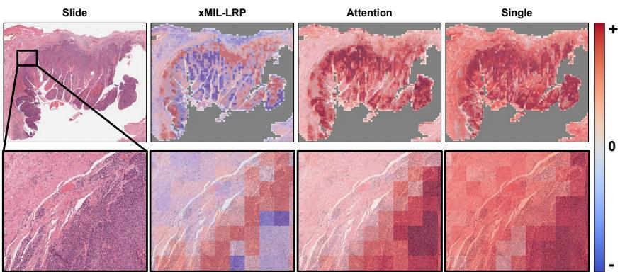
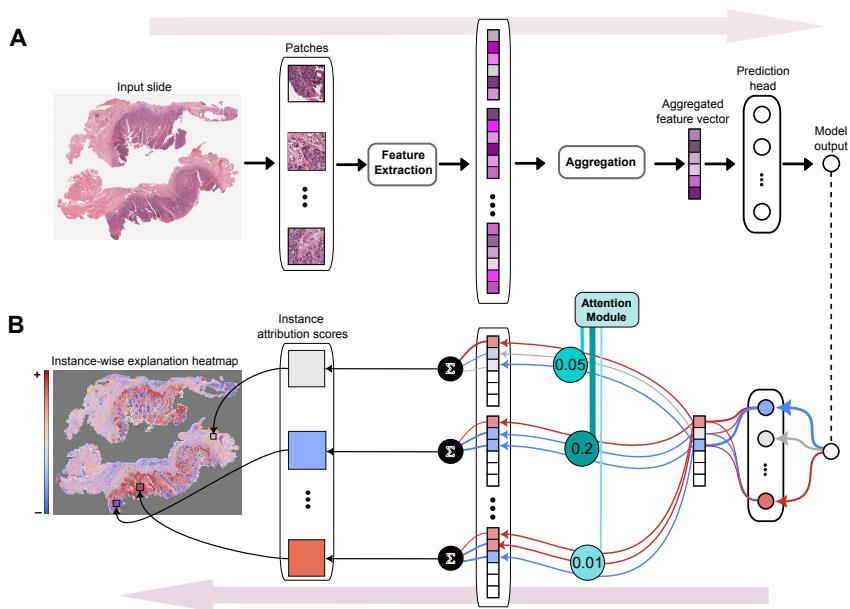
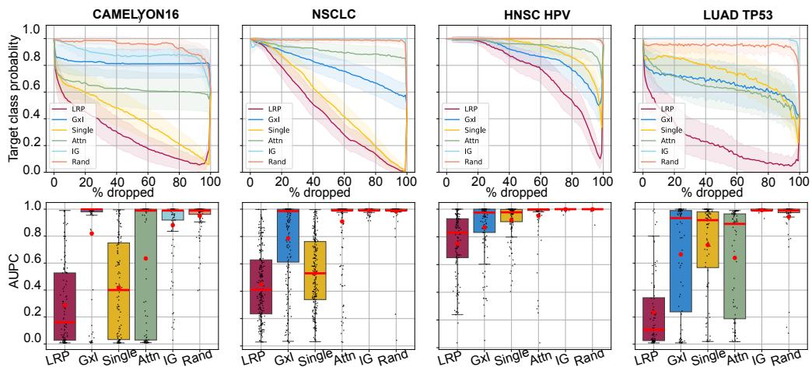
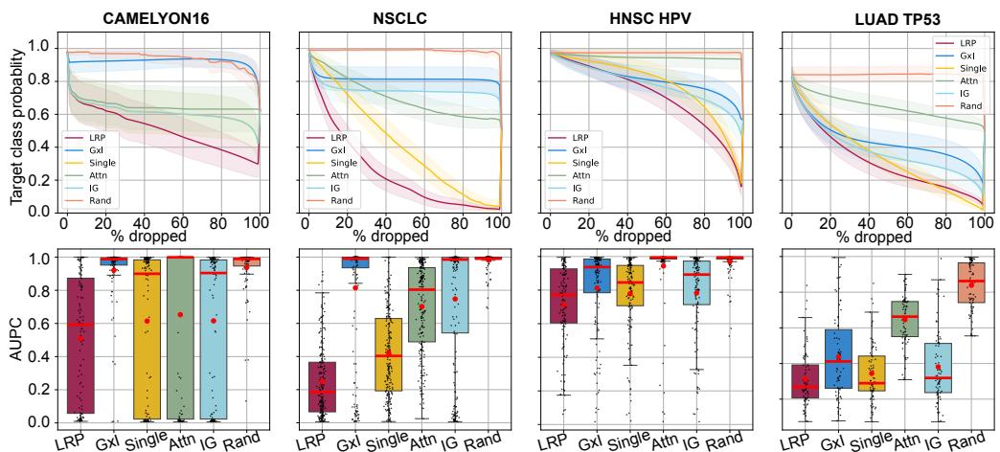
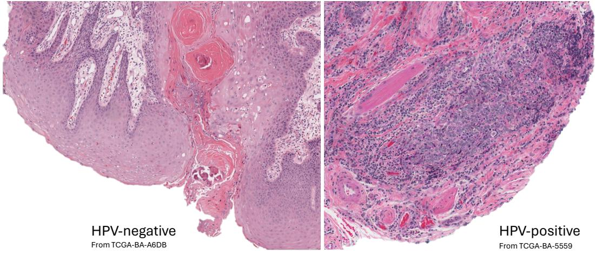
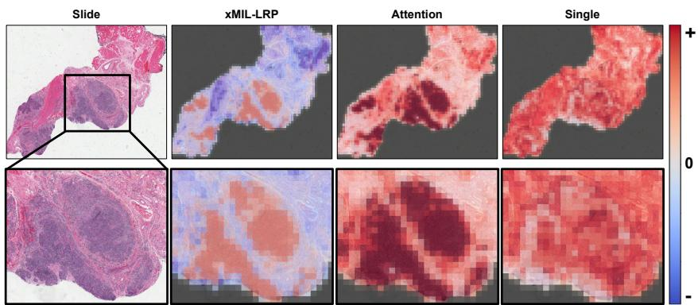
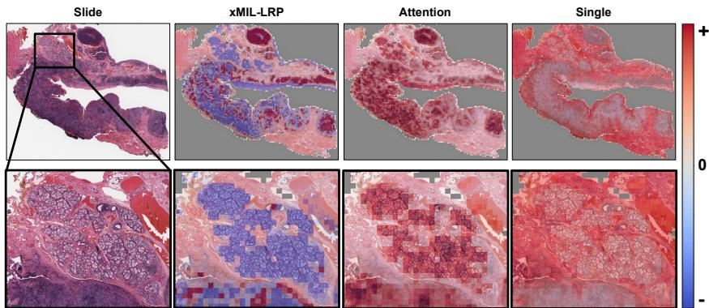
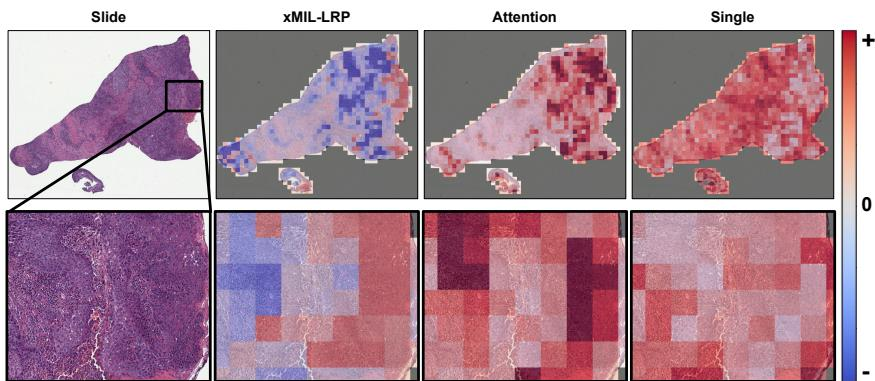

# xMIL: Insightful Explanations for Multiple Instance Learning in Histopathology

Julius Hense1,2,∗,† Mina Jamshidi Idaji1,2,∗,† Oliver Eberle1,2 Thomas Schnake1,2 Jonas Dippel1,2,3 Laure Ciernik1,2 Oliver Buchstab4 Andreas Mock4,5 Frederick Klauschen1,4,5,6 Klaus-Robert Müller1,2,7,8,†

1Berlin Institute for the Foundations of Learning and Data, Berlin, Germany 2Machine Learning Group, Technische Universität Berlin, Berlin, Germany 3Aignostics GmbH, Berlin, Germany 4Institute of Pathology, Ludwig Maximilian University, Munich, Germany 5German Cancer Research Center, Heidelberg, and German Cancer Consortium, Munich, Germany 6Institute of Pathology, Charité Universitätsmedizin, Berlin, Germany 7Department of Artificial Intelligence, Korea University, Seoul, Korea 8Max-Planck Institute for Informatics, Saarbrücken, Germany ∗Equal contribution †{ j.hense, mina.jamshidi.idaji, klaus-robert.mueller }@tu-berlin.de

# Abstract

Multiple instance learning (MIL) is an effective and widely used approach for weakly supervised machine learning. In histopathology, MIL models have achieved remarkable success in tasks like tumor detection, biomarker prediction, and outcome prognostication. However, MIL explanation methods are still lagging behind, as they are limited to small bag sizes or disregard instance interactions. We revisit MIL through the lens of explainable AI (XAI) and introduce xMIL, a refined framework with more general assumptions. We demonstrate how to obtain improved MIL explanations using layer-wise relevance propagation (LRP) and conduct extensive evaluation experiments on three toy settings and four real-world histopathology datasets. Our approach consistently outperforms previous explanation attempts with particularly improved faithfulness scores on challenging biomarker prediction tasks. Finally, we showcase how xMIL explanations enable pathologists to extract insights from MIL models, representing a significant advance for knowledge discovery and model debugging in digital histopathology. Codes are available at: https://github.com/bifold-pathomics/xMIL.

# 1 Introduction

Multiple instance learning (MIL) [1, 2] is a learning paradigm in which a single label is predicted from a bag of instances. Various MIL methods have been proposed, differing in how they aggregate instances into bag information [3, 4, 5, 6, 7, 8, 9, 10, 11, 12]. MIL has become particularly popular in histopathology, where gigapixel microscopy slides are cut into patches representing small tissue regions. From these patches, MIL models can learn to detect tumor [13] or classify disease subtypes [6], aiming to support pathologists in their routine diagnostic workflows. They have further demonstrated remarkable success at tasks that even pathologists cannot perform reliably due to a lack of known histopathological patterns associated with the target, e.g., predicting clinically relevant biomarkers [14, 15, 16] or outcomes like survival [17, 18] directly from whole slide images.

  
Figure 1: In digital pathology, heatmaps guide the identification of tissue slide areas most important for a model prediction. The figure displays heatmaps from different MIL explanation methods (columns) for a head and neck tumor slide (top row) with a selected zoomed-in region (bottom row). The MIL model has been trained to predict HPV status. The xMIL-LRP heatmap shows that the model identified evidence in favor of an HPV infection at the tumor border (red area) and evidence against an HPV infection inside the tumor (blue area, lower half of the tissue). The dominant blue region explains why the model mispredicted the slide as HPV-negative. Investigation of the tumor border by a pathologist revealed a higher lymphocyte density, which is one of the known recurrent but not always defining visual features of HPV infection in head and neck tumors. xMIL-LRP allows pathologists to extract fine-grained insights about the model strategy. In contrast, the “attention” and “single” methods neither explain the negative prediction nor distinguish the relevant areas.

Explaining which visual features a MIL model uses for its prediction is highly relevant in this context. It allows experts to sanity-check the model strategy [19], e.g., whether a model focuses on the disease area for making a diagnosis. This is particularly important in histopathology, where models operating in high-stake environments are prone to learning confounding factors like artifacts or staining differences instead of actual signal [20, 21, 22]. On top of that, MIL explanations can enable pathologists to discover novel connections between visual features and prediction targets. For example, the explanations could reveal a previously unknown association of a histopathological pattern with poor survival, leading to the identification of a targetable disease mechanism. Previous works have shown the potential of scientific knowledge discovery from explainable AI (XAI) [22, 23, 24, 25, 26].

Most studies have used attention scores as MIL explanations [3, 4, 6, 27, 28, 29]. However, it has been shown that attention heatmaps are limited in faithfully reflecting model predictions [30, 31, 32, 33]. Further MIL explanation methods have been proposed, including perturbation schemes passing modified bags through the model [34] and architectural changes towards fully additive MIL models [33]. Nevertheless, these methods do not account for the complexities inherent to many histopathological prediction tasks, as they are limited to small bag sizes or disregard instance interactions.

We revisit MIL through the lens of XAI and introduce xMIL, a more general and realistic multiple instance learning framework including requirements for good explanations. We then present xMIL-LRP, an adaptation of layer-wise relevance propagation (LRP) [35, 36] to MIL. xMIL-LRP distinguishes between positive and negative evidence, disentangles instance interactions, and scales to large bag sizes. It applies to various MIL models without requiring architecture modifications, including Attention MIL [3] and TransMIL [4]. We assess the performance of multiple explanation techniques via three toy experiments, which can serve as a novel benchmarking tool for MIL explanations in complex tasks with instance interactions and context-sensitive targets. We further perform faithfulness experiments on four real-world histopathology datasets covering tumor detection, disease subtyping, and biomarker prediction. xMIL-LRP consistently outperforms previous attempts across all tasks and model architectures, with the biggest advantages observed for Transformer-based biomarker prediction.

Figure 1 showcases the importance of understanding positive and negative evidence for a prediction. Only xMIL-LRP uncovers that the model found evidence for the presence of the biomarker, but stronger evidence against it. This explains why it predicted the biomarker to be absent and enables pathologists to extract insights about the visual features that support or reject the presence of the biomarker according to the model. The example illustrates the strength of our approach, suggesting that xMIL-LRP represents a significant advance for model debugging and knowledge discovery in histopathology.

The paper is structured as follows: In Section 2, we review MIL assumptions, models, and explanation methods related to this work. In Section 3, we introduce xMIL as a general form of MIL, and xMILLRP as a solution for it. In Section 4, we experimentally show the improved explanation quality of our approach. We demonstrate how to extract insights from example heatmaps in Section 5. Our contributions are summarized as follows:

• Methodical: Despite attempts to apply XAI to MIL models in histopathology (e.g. [6, 27, 28, 29, 33, 34, 37, 38, 39, 40]), there exists no formalism guiding the interpretation of the heatmaps and defining their desired properties. xMIL is a novel framework addressing this gap. Within xMIL, heatmaps estimate the instances’ impact on the bag label, which makes their interpretation straightforward and insightful.

• Empirical: Our extensive empirical evaluation of XAI methods for MIL on synthetic and realworld histopathology datasets is the first of its kind. It reveals that the widely used MIL explanation methods regularly yield misleading results. In contrast, xMIL-LRP sets a new state-of-the-art for explainability in AttnMIL and TransMIL models in histopathology.

• Insight generation: Previous studies [33, 34] conducted qualitative assessments of heatmaps on easy-to-learn datasets like CAMELYON or TCGA NSCLC. The insights gained in these settings are limited to model debugging, i.e., “Does the model focus on the disease area?” To our knowledge, we are the first to present a method generating heatmaps that enable pathologists to extract fine-grained insights about the model in a difficult biomarker prediction task.

# 2 Background

# 2.1 Multiple instance learning (MIL)

MIL formulations. In MIL, a sample is represented by a bag of instances $X = \{ \mathbf { x } _ { 1 } , \cdots , \mathbf { x } _ { K } \}$ with a bag label $y$ , where $\mathbf { x } _ { k } \in \mathbb { R } ^ { D }$ is the $k$ -th instance. The number of instances per bag $K$ may vary across samples. In its standard formulation [1, 2, 3], the instances of a bag exhibit neither dependency nor ordering among each other. It is further assumed that binary instance labels $y _ { k } \in \{ 0 , 1 \}$ exist but are not necessarily known. The binary bag label is 1 if and only if at least one instance label is 1, i.e., $y = \operatorname* { m a x } _ { k } \{ y _ { k } \}$ . Various extensions have been proposed [41, 42], each making different assumptions about the relationships between instances and bag labels.

MIL models. MIL architectures typically consist of three components as illustrated in Figure 2: a backbone extracting instance representations, an aggregation function fusing the instance representations into a bag representation, and a prediction head inferring the final bag prediction. As recent foundation models for histopathology have become powerful feature extractors suitable for a wide range of tasks [29, 43, 44, 45, 46], the weights of the backbone are often frozen, allowing for a more efficient training. For aggregation, earlier works used parameter-free mean or max pooling approaches [47, 48, 49]. Recently, attention mechanisms could improve performance, flexibly extracting relevant instance-level information using non-linear weighting [3, 6, 50] and self-attention [4, 51]. Attention MIL (AttnMIL) [3] computes a weighted average of the instances’ feature vectors via a single attention head. TransMIL [4] uses a custom two-layer Transformer architecture, viewing instance representations as tokens. The bag representation is extracted from the class token at the final layer. TransMIL allows for computing arbitrary pairwise interactions between all instances relevant to the prediction task. While various extensions of AttnMIL and TransMIL have been proposed (e.g., [5, 6, 7, 8, 9, 52, 53, 10, 11, 12]), these two methods are arguably prototypical and among the most commonly used in the digital histopathology community.

MIL explanation methods. From the few studies investigating MIL interpretability, most of them use attention heatmaps [3, 4, 6, 27, 28, 29]. Moreover, basic gradient- and propagation-based methods have been explored for specific architectures and applications [54, 55]. Sadafi et al. [55] applied LRP to generate pixel-level attributions for single-cell images in a blood cancer diagnosis task, but did not consider its potential for instance-level explanations. Perturbation-based methods, building on model-agnostic approaches like SHAP [56], perturb bag instances and compute importance scores from the resulting change in the model prediction; Early et al. [34] proposed passing bags of single instances through the model (“single”), dropping single instances from bags (“one-removed”), and sampling coalitions of instances to be removed (“MILLI”). Javed et al. [33] introduced “additive MIL”, providing directly interpretable instance scores while constraining the model’s ability to capture instance interactions.

# 2.2 Limitations of MIL in histopathology

Histopathological datasets and prediction tasks are diverse and come with various inherent challenges.   
We highlight the following three features.   
• Instance ambiguity. Instances are small high-resolution patches from large images. Their individual information content may be limited, as they can be subject to noise or only be interpretable as part of a larger structure. For example, it is not always possible to distinguish a benign high-grade adenoma from a malignant adenocarcinoma on a patch level due to their similar morphology.   
• Positive, negative, and class-wise evidence. A single bag may contain evidence for multiple classes that a MIL model needs to weigh for correct decision-making. In survival prediction, for example, a strong immune response may support longer survival, while an aggressive tumor pattern speaks for shorter survival.   
• Instance interactions. In many prediction tasks, it may be necessary to consider interactions between instances. A gene mutation may generate morphological alterations in the tumor area, the tumor microenvironment, and the healthy tissue, all of which may need to be considered together to reliably predict the biomarker.

Existing MIL formulations make explicit assumptions about the relationship between instances and bag labels [42], limiting their ability to capture the full complexity of a histopathological prediction task. The standard MIL formulation, in particular, does not consider any of the aforementioned aspects, rendering it an unsuitable framework for most histopathological settings.

Similarly, previous MIL explanation methods suffer from various shortcomings that limit their applicability in real-world histopathology datasets. The direct interpretability of attention scores is insufficient to faithfully reflect the model predictions [30, 31, 32]. Moreover, they cannot distinguish between positive, negative, or class-wise evidence [33]. Purely gradient-based explanations may suffer from shattered gradients, resulting in unreliable explanations [57]. Perturbation-based approaches come with high computational complexity. While the linear “single” and “one removed” methods require $K$ forward passes per bag, MILLI scales quadratically with the number of instances [34]. In histopathology, where bags typically contain more than 1,000 and frequently more than 10,000 instances, quadratic runtime is practically infeasible. Additive MIL and linear perturbation-based methods do not consider higher-order instance interactions. In prediction tasks depending on interactions, linear perturbation-based explanations may fail to provide faithful explanations, while additive models may not achieve competitive performances.

# 3 Methods

Notation. We denote vectors with boldface lowercase letters (e.g., x), scalars with lowercase letters (e.g., $x$ ), and sets with uppercase letters (e.g., $X$ ).

# 3.1 xMIL: An XAI-based framework for multiple instance learning

We address the limitations discussed in Section 2.2 and introduce a more general formulation of MIL: explainable multiple instance learning $\mathbf { \Gamma } ( \mathbf { x M I L } )$ ). At its core, we propose moving away from the notion of instance labels towards context-aware evidence scores, which better reflect the intricacies of histopathology while laying the foundation for developing and evaluating MIL explanation methods.

Definition 3.1 (Explainable multiple instance learning). Let $X = \{ \mathbf { x } _ { 1 } , \ldots , \mathbf { x } _ { K } \}$ be a bag of instances with a bag label $y \in \mathbb R$ .

(1) There exists an aggregation function $\mathcal { A }$ that maps the bag to its label, i.e., $\boldsymbol { \mathcal { A } } ( \boldsymbol { X } ) = \boldsymbol { y }$ . We make no assumptions about the relationship among the instances or between the instances and the label $y$ . (2) There exists an evidence function $\mathcal { E }$ assigning an evidence score $\mathcal { E } ( X , y , \mathbf { x } _ { k } ) = \epsilon _ { k } \in \mathbb { R }$ to any instance $\mathbf { x } _ { k }$ in the bag, quantifying the impact the instance has on the bag label $y$ .

  
Figure 2: The two steps of xMIL: estimating the aggregation function (A) and the evidence function (B). Panel A shows a block diagram of a MIL model applied to a histopathology slide. The feature extraction module is typically a combination of a frozen foundation model followed by a shallow MLP. In most of the recent MIL models, the aggregation module uses attention mechanisms for combining the instance feature vectors into a single feature representation per bag. The prediction head is a linear layer or an MLP. Panel B schematically shows xMIL-LRP for explaining AttnMIL. In xMIL-LRP, the model output is backpropagated to the input instances. The colored lines represent the relevance flow. Red and blue colors encode the positive and negative values. The attention module is handled via the AH-rule as described in Section 3.2. As discussed in Section 3.3, the instance explanation scores can be computed at the output of the foundation model or at the input level.

The aim of xMIL is to estimate (i) the aggregation function $\mathcal { A }$ and (ii) the evidence function $\mathcal { E }$ .

Definition 3.2 (Properties of the evidence function). Let $\mathbf { x } _ { k } , \mathbf { x } _ { k ^ { \prime } }$ be instances from a bag $X$ . We assume that $\mathcal { E }$ has the following properties.

(1) Context sensitivity. The evidence score $\epsilon _ { k }$ of instance $\mathbf { x } _ { k }$ may depend on other instances from $X$ .   
(2) Positive and negative evidence. If $\epsilon _ { k } > 0$ , the instance $\mathbf { x } _ { k }$ has a positive impact on the bag label $y$ .   
If $\epsilon _ { k } < 0$ , then $\mathbf { x } _ { k }$ has a negative impact on $y$ . If $\epsilon _ { k } = 0$ , then $\mathbf { x } _ { k }$ is irrelevant to $y$ .   
(3) Ordering. If $\epsilon _ { k } > \epsilon _ { k ^ { \prime } } \geq 0$ , then instance $\mathbf { x } _ { k }$ has a higher positive impact on $y$ than $\mathbf { x } _ { k ^ { \prime } }$ . If $0 \geq \epsilon _ { k ^ { \prime } } > \epsilon _ { k }$ , then instance $\mathbf { x } _ { k }$ has a higher negative impact on $y$ than $\mathbf { x } _ { k ^ { \prime } }$ .

Similar to our definition, previous works described context sensitivity and accounting for positive and negative evidence as desirable properties of MIL explanation methods [33, 34]. However, xMIL integrates these principles directly into the formalization of the MIL problem.

In contrast to previous MIL formulations, xMIL addresses the potential complexities within histopathological prediction tasks by refraining from posing strict assumptions on $\mathcal { A }$ . Via the evidence function $\mathcal { E }$ , we suggest that instances may vary in their ability to support or refute a class and that their influence may depend on the context within the bag. In practice, the evidence function is often unknown, as the notion of an “impact” on the bag label is hard to quantify. For the standard MIL setting, however, the binary instance labels fulfill the criteria of the evidence function. Therefore, xMIL is a more general and realistic formulation of multiple instance learning for histopathology.

We can learn the aggregation function $\mathcal { A }$ via training a MIL model. To gain deeper insights into the prediction task by estimating the evidence function $\mathcal { E }$ , we design an explanation method for the learned aggregation function with characteristics suitable to the properties of the evidence function.

# 3.2 xMIL-LRP: Estimating the evidence function

We introduce xMIL-LRP as an efficient solution to $\bf { x M I L }$ , bringing layer-wise relevance propagation (LRP) to MIL. LRP is a well-established XAI method [35, 58] with a large body of literature supporting its performance in explaining various types of architectures in different tasks [32, 36, 59, 60, 61, 62]. Starting from the prediction score of a selected class, the LRP attribution of neuron $i$ in layer $l$ receives incoming messages from neurons $j$ from subsequent layer $l + 1$ , resulting in relevance scores r(l)i $\begin{array} { r } { r _ { i } ^ { ( l ) } = \sum _ { j } \frac { q _ { i j } } { \sum _ { i ^ { \prime } } q _ { i ^ { \prime } j } } \cdot r _ { j } ^ { ( l + 1 ) } } \end{array}$ , with $q _ { i j }$ being the contribution of neuron $i$ of layer $l$ to relevance $r _ { j . } ^ { ( l + 1 ) }$ 1. A variety of so-called “propagation rules” have been proposed [36] to specify the contribution $q _ { i j }$ in specific model layers. For the attention mechanism, as a core component of many MIL architectures, we employ the AH-rule introduced by Ali et al. [32]. In a general attention mechanism, let $\mathbf { z } _ { k } = [ z _ { k d } ] _ { d }$ be the embedding vector of the $k$ -th token and $p _ { k j }$ the attention score between tokens $k$ and $j$ . The output vector of the attention module is $\begin{array} { r } { { \bf y } _ { j } = \sum _ { k } \overset { \cdot } { p _ { k j } } { \bf z } _ { k } } \end{array}$ . The AH-rule of LRP treats attention scores as a constant weighting matrix during the backpropagation pass of LRP. If $R ( y _ { j d } )$ is the relevance of the $d$ -th dimension of $\bar { \bf y } _ { j } = [ y _ { j d } ] _ { d }$ , the AH-rule computes the relevance of the $d$ -th feature of $\mathbf { z } _ { k }$ as:

$$
R ( z _ { k d } ) = \sum _ { j } \frac { z _ { k d } p _ { k j } } { \sum _ { i } z _ { i d } p _ { i j } } R ( y _ { j d } ) .
$$

This formulation can be directly applied to AttnMIL, and also adapted to a QKV attention block in a transformer, where $\mathbf { z } _ { k }$ is the embedding associated with the value representation.

We illustrate the effect of this rule in AttnMIL in Figure 2-B. The relevance flow separates the instances weighted by the attention mechanism into positive, negative, and neutral instances, resulting in more descriptive heatmaps that better show the relevant tissue regions compared to attention scores.

We further implement the LRP- $\cdot \epsilon$ rule for linear layers followed by ReLU activation function [58], as well as the LN-rule to address the break of conservation in layer norm [32], with details presented in Appendix A.2.

At the instance-level, xMIL-LRP assigns each instance $\mathbf { x } _ { k } = [ x _ { k d } ] _ { d } \in \mathbb { R } ^ { D }$ a relevance vector $\mathbf { r } _ { k } = [ r _ { k d } ] _ { d }$ with $r _ { k d } = R ( x _ { k d } ) = r _ { k d } ^ { ( 0 ) }$ being the relevance score of the $d .$ -th feature of $\mathbf { x } _ { k }$ . We define the instance-wise relevance score as an estimate for the evidence score of the instance as $\begin{array} { r } { \hat { \epsilon } _ { k } = \sum _ { d } r _ { k d } } \end{array}$ .

# 3.3 Properties of xMIL-LRP and other explanation methods

The properties of xMIL-LRP are particularly suitable for estimating the evidence function:

Context sensitivity: xMIL-LRP disentangles instance interactions and contextual information as it jointly considers the relevance flow across the whole bag. LRP and Gradient $\times$ Input $( \mathrm { G } \times \mathrm { I } )$ are rooted in a deep Taylor decomposition of the model prediction [63] and consequently capture dependencies between features by tracing relevance flow through the components of the MIL model. While attention is context-aware, it is limited to considering dependencies of features at a specific layer. The “single” method is unaware of context. “One-removed” and additive MIL can only capture the impact of individual instances on the prediction.

Positive and negative evidence: xMIL-LRP relevance scores are real-valued and can identify whether an instance supports or refutes the model prediction. Features irrelevant to the prediction will receive an explanation score close to zero. Therefore, the range of explanation scores matches the range of the assumed evidence function. The same holds for additive MIL, MILLI, and “one-removed”. Attention and “single” do not distinguish between positive and negative evidence.

Conservation: Following the conservation principle of LRP, xMIL-LRP provides an instance-wise decomposition of the model output, i.e., $\begin{array} { r } { \sum _ { k } \hat { \epsilon } _ { k } = \sum _ { k , d } r _ { k d } = y } \end{array}$ . This instance-level conservation also holds for additive MIL, but not for the other discussed methods. The local conservation principle of LRP [36] further allows us to analyze attribution scores at the instance feature vector level without requiring propagation through the foundation model—the instance-wise attribution scores are the same at any layer of the model.

# 4 Experiments and results

Baseline methods. We compared several explanation methods to our xMIL-LRP (see Appendix A.1 for details). For AttnMIL and TransMIL, we selected Gradient $\times$ Input $( { \bf G } \times { \bf I } )$ [64, 65] and Integrated gradients (IG) [66] as gradient-based baselines. We further included the “single” perturbation method (single) [34], which involves using predictions for individual instances as explanation scores. Single is the only computationally feasible perturbation-based approach for the bag sizes considered here (up to 24,000). We evaluated raw attention scores for AttnMIL and attention rollout [67] for TransMIL (attn). In the random baseline (rand), instance scores were randomly sampled from a standard normal distribution. For additive attention MIL (AddMIL) [33], we assessed raw attention scores (attn) and the model-intrinsic instance-wise predictions (logits).

# 4.1 Toy experiments

We designed novel toy experiments to assess and compare the characteristics of xMIL-LRP and the baseline methods for AttnMIL, TransMIL, and AddMIL in controlled settings. We focused on evaluating to what extent the explanations account for context sensitivity and positive and negative evidence, i.e., the first two characteristics of the evidence function according to Definition 3.2, which we consider crucial aspects for explaining real-world histopathology prediction tasks.

Inspired by previous works [3, 34], we sampled bags of MNIST images [68], with each instance representing a number between 0 and 9. We defined three MIL tasks for these bags:

• 4-Bags: The bag label is class 1 if 8 is in the bag, class 2 if 9 is in the bag, class 3 if 8 and 9 are in the bag, and class 0 otherwise. The dataset was proposed by Early et al. [34]. In this setting, the model needs to learn basic instance interactions.   
• Pos-Neg: We define 4, 6, 8 as positive and 5, 7, 9 as negative numbers. The bag label is class 1 if the amount of unique positive numbers is strictly greater than that of unique negative numbers, and class 0 otherwise. The model needs to adequately weigh positive and negative evidence to make correct predictions.   
• Adjacent Pairs: The bag label is class 1 if it contains any pair of consecutive numbers between 0 and 4, i.e., (0,1), (1,2), (2,3) or (3,4), and class 0 otherwise. In this case, the impact of an instance is contextual, as it depends on the presence or absence of adjacent numbers.

To assess the explanation quality, we first defined valid evidence scores as ground truths according to Definition 3.2. For each dataset, we require one evidence function per predicted class $\mathcal { E } ^ { ( c ) } ( X , y , \mathbf { x } _ { k } ) = \epsilon _ { k } ^ { ( c ) }$ . We assigned $\epsilon _ { k } ^ { ( c ) } = 1$ = 1 if xk supports class c, ϵ(c)k $\epsilon _ { k } ^ { ( c ) } = - 1$ if the instance refutes $c$ , denoted by class c, and ϵ(c)k $\epsilon _ { k } ^ { ( c ) } = 0$ if it is irrelevant. We aimed to measure whether an explanation method correctly distinguishes instances with positive, neutral, and negative evidence scores. Therefore, we computed a two-class averaged area under the precision-recall curve (AUPRC-2), measuring if the positive instances received the highest and the negative instances the lowest explanation scores. We assessed AttnMIL and TransMIL models and repeated each experiment 30 times. The details of the ground truth, the evaluation metric, and the experimental setup are provided in Appendix A.3.

Table 1 displays the test AUROC scores of the three models across datasets, demonstrating that the models solve the tasks to varying degrees, alongside the performances of the explanation methods. We find that xMIL-LRP outperformed the other explanation approaches across MIL models and datasets in all but one setting. It reached particularly high AUPRC-2 scores in the 4-Bags and Pos-Neg datasets while being most robust in the more difficult Adjacent Pairs setting. Attention severely suffered from the presence of positive and negative evidence, which it cannot distinguish by design. While IG performed comparably to xMIL-LRP for AttnMIL models, it was inferior for TransMIL. Notably, the test AUROC of AddMIL was worse in all settings, resulting in explanations that are not competitive with the post-hoc explanation methods on AttnMIL and TransMIL. This supports our point that AddMIL may not perform competitively in difficult prediction tasks. The single perturbation method provided good explanations in the Pos-Neg setting, where numbers have a fixed evidence score irrespective of the other instances in the bag. However, in 4-Bags and Adjacent Pairs, the method’s performance decreased, as it always assigns the same score to the same instance regardless of the bag context. In contrast, xMIL-LRP is both context-sensitive and identifies positive and negative instances. Since we expect that these aspects are common features of many real-world histopathological datasets, we conclude that our method is the only suitable approach for such complex settings.

Table 1: Results of the toy experiments. We report AUPRC-2 scores of MIL explanation methods on three toy datasets measuring how well a method identified instances with positive and negative evidence scores (mean $\pm$ std. over 30 repetitions). The highest mean scores are bold and the second highest are underlined. We also display the model performances ("Test AUROC", mean $\pm$ std.).   

<table><tr><td></td><td colspan="3">4-Bags</td><td colspan="3">Pos-Neg</td><td colspan="3">Adjacent Pairs</td></tr><tr><td>Test AUROC</td><td>AttnMIL 1.00 ± 0.00</td><td>TransMIL 1.00 ± 0.00</td><td>AddMIL 0.98 ± 0.02</td><td>AttnMIL 0.97 ± 0.00</td><td>TransMIL 0.98 ± 0.00</td><td>AddMIL 0.89 ± 0.03</td><td>AttnMIL 0.88 ± 0.08</td><td>TransMIL 0.92 ± 0.06</td><td>AddMIL 0.77 ± 0.07</td></tr><tr><td>Rand</td><td>0.31 ± 0.00</td><td>0.31 ± 0.00</td><td></td><td>0.42 ± 0.00</td><td>0.42 ± 0.00</td><td></td><td>0.54 ± 0.00</td><td>0.54 ± 0.00</td><td></td></tr><tr><td>Attn</td><td>0.53 ± 0.00</td><td>0.52 ± 0.00</td><td>0.54 ± 0.01</td><td>0.45 ± 0.00</td><td>0.46 ± 0.03</td><td>0.48 ± 0.02</td><td>0.61 ± 0.01</td><td>0.60 ± 0.01</td><td>0.63 ± 0.04</td></tr><tr><td>Single</td><td>0.87 ± 0.02</td><td>0.85 ± 0.07</td><td></td><td>0.89 ± 0.00</td><td>0.91 ± 0.02</td><td></td><td>0.73 ± 0.06</td><td>0.77 ± 0.06</td><td></td></tr><tr><td>Logits</td><td></td><td></td><td>0.79 ± 0.11</td><td></td><td></td><td>0.68 ± 0.17</td><td></td><td></td><td>0.71 ± 0.09</td></tr><tr><td>G×I</td><td>0.72 ± 0.08</td><td>0.40 ± 0.07</td><td></td><td>0.72 ± 0.14</td><td>0.44 ± 0.06</td><td></td><td>0.63 ± 0.05</td><td>0.57 ± 0.05</td><td></td></tr><tr><td>IG</td><td>0.88 ± 0.01</td><td>0.80 ± 0.09</td><td></td><td>0.93 ± 0.00</td><td>0.82 ± 0.08</td><td></td><td>0.75 ± 0.03</td><td>0.72 ± 0.07</td><td></td></tr><tr><td>xMIL-LRP</td><td>0.91 ± 0.01</td><td>0.90 ± 0.02</td><td></td><td>0.91 ± 0.01</td><td>0.92 ± 0.01</td><td></td><td>0.77 ± 0.04</td><td>0.81 ± 0.04</td><td></td></tr></table>

# 4.2 Histopathology experiments

Datasets and model training. To evaluate the performance of explanations on real-world histopathology prediction tasks, we considered four diverse datasets of increasing task difficulty covering tumor detection, disease subtyping, and biomarker prediction. These datasets had previously been used for benchmarking in multiple studies [12, 33, 46, 69].

• CAMELYON16 [70] consists of 400 sentinel lymph node slides, of which 160 carry to-berecognized metastatic lesions of different sizes. It is a well-established tumor detection dataset.   
• The TCGA NSCLC dataset (abbreviated as NSCLC) contains 529 slides with lung adenocarcinoma (LUAD) and 512 with lung squamous cell carcinoma (LUSC). The prediction task is to distinguish these two non-small cell lung cancer (NSCLC) subtypes.   
• The TCGA HNSC HPV dataset [12] (abbreviated as HNSC HPV) has 433 slides of head and neck squamous cell carcinoma (HNSC). 43 of them were affected by a human papillomavirus (HPV) infection diagnosed via additional testing [71]. HPV infection is an essential biomarker guiding prognosis and treatment [12]. The task is to identify the HPV status directly from the slides. Label imbalances and the complexity of the predictive signature are key challenges in this task.   
• The TCGA LUAD TP53 (abbreviated as LUAD TP53) dataset contains 529 lung adenocarcinoma (LUAD) slides, 263 of which exhibit a mutation of the TP53 gene, which is one of the most common mutations across cancers. In lung cancer, it is associated with poorer prognosis and resistance to chemotherapy and radiation [72]. Previous works showed that TP53 mutation can be predicted from LUAD slides [69, 73].

We generated patches at $2 0 \mathrm { x }$ magnification and obtained $1 0 , 4 5 4 \pm 6 , 2 3 6$ patches per slide across all datasets (mean $\pm$ std.). Features were extracted using the pre-trained CTransPath [43] foundation model and aggregated using AttnMIL or TransMIL.2 Additional details regarding the datasets and training procedure are described in Appendix A.4.

We report the mean and standard deviation of the test set AUROC over 5 repetitions in Table 2. In all but one case, TransMIL outperformed AttnMIL, with the largest margin observed in the difficult TP53 dataset. Our results generally align with performances reported in previous works [12, 46, 69].

Faithfulness evaluation. As the evidence functions $\mathcal { E }$ of our histopathology datasets are unknown, we resorted to assessing faithfulness, i.e., how accurately explanation scores reflect the model prediction [74, 75]. The primary goal of the faithfulness experiments is to evaluate the ordering of relevance scores (Property 3 of the evidence function in Definition 3.2). Faithfulness can be quantified by progressively excluding instances from the most relevant first (MORF) to the least relevant last and measuring the change in prediction score. The area under the resulting perturbation curve (AUPC)

Table 2: Results of the faithfulness experiments. AUPC values per dataset, MIL model, and explanation method (mean $\pm$ std. over all slides). Lower scores indicate higher faithfulness. The best performance per setting (significant minimum based on the paired t-tests) is highlighted in bold. We also display the model performances (“Test AUROC”, mean $\pm$ std. over 5 repetitions).   

<table><tr><td></td><td colspan="4">AttnMIL</td><td colspan="4">TransMIL</td></tr><tr><td></td><td>CAMELYON16</td><td>NSCLC</td><td>HNSC HPV</td><td>LUAD TP53</td><td>CAMELYON16</td><td>NSCLC</td><td>HNSC HPV</td><td>LUAD TP53</td></tr><tr><td>Test AUROC</td><td>0.93 ± 0.00</td><td>0.95 ± 0.00</td><td>0.88 ± 0.06</td><td>0.71 ± 0.01</td><td>0.95 ± 0.01</td><td>0.96 ± 0.00</td><td>0.88 ± 0.05</td><td>0.75 ± 0.01</td></tr><tr><td>Rand</td><td>0.94 ± 0.13</td><td>0.98 ± 0.04</td><td>0.97 ± 0.07</td><td>0.84 ± 0.14</td><td>0.95 ± 0.11</td><td>0.98 ± 0.08</td><td>1.00 ± 0.01</td><td>0.94 ± 0.17</td></tr><tr><td>Attn</td><td>0.65 ± 0.46</td><td>0.70 ± 0.27</td><td>0.94 ± 0.18</td><td>0.65 ± 0.14</td><td>0.63 ± 0.45</td><td>0.91 ± 0.22</td><td>0.95 ± 0.15</td><td>0.64 ± 0.38</td></tr><tr><td>Single</td><td>0.61 ± 0.43</td><td>0.42 ± 0.26</td><td>0.78 ± 0.23</td><td>0.34 ± 0.16</td><td>0.42 ± 0.35</td><td>0.53 ± 0.26</td><td>0.92 ± 0.13</td><td>0.73 ± 0.33</td></tr><tr><td>GxI</td><td>0.92 ± 0.19</td><td>0.81 ± 0.35</td><td>0.81 ± 0.25</td><td>0.44 ± 0.23</td><td>0.82 ± 0.36</td><td>0.79 ± 0.30</td><td>0.87 ± 0.20</td><td>0.66 ± 0.40</td></tr><tr><td>IG</td><td>0.62 ± 0.44</td><td>0.75 ± 0.38</td><td>0.78 ± 0.25</td><td>0.38 ± 0.20</td><td>0.88 ± 0.23</td><td>0.99 ± 0.01</td><td>1.00 ± 0.00</td><td>0.99 ± 0.01</td></tr><tr><td>xMIL-LRP</td><td>0.51 ± 0.38</td><td>0.25 ± 0.22</td><td>0.71 ± 0.24</td><td>0.31 ± 0.16</td><td>0.29 ± 0.30</td><td>0.45 ± 0.26</td><td>0.75 ± 0.23</td><td>0.24 ± 0.28</td></tr></table>

indicates how faithfully the identified ordering of the instances affects the model prediction. The lower the AUPC score, the more faithful the method. We calculated AUPC for correctly classified slides. Further methodological details are provided in Appendix A.5.

In Figure 3, we show the perturbation curves and AUPC boxplots for the patch-dropping experiment for TransMIL in our four datasets (Figure 4 shows the results for AttnMIL). Additionally, we summarize our results in Table 2. To test the difference in the AUPC values among the baseline explanation methods, we performed paired t-tests between the random baseline vs. all methods and xMIL-LRP vs. all other baselines. The p-values were corrected using the Bonferroni method for multiple comparison correction. All tests resulted in significant differences except for random baseline vs. $\mathrm { G } { \times } \mathrm { I }$ for CAMELYON16 and attention for HNSC HPV.

xMIL-LRP significantly achieved the lowest average AUPC compared to the baselines, providing the most faithful explanations across all tasks and model architectures. Especially evident with the TransMIL model, xMIL-LRP accurately decomposed the mixing of patch information via selfattention. Notably, the largest margin of xMIL-LRP to other methods could be observed in the more challenging biomarker prediction tasks of the HNSC HPV and LUAD TP53 datasets.

The results also reflect whether the explanation scores contain meaningful positive/negative evidence for the target class (Property 2 of the evidence function in Definition 3.2): if so, we expect the model’s prediction to flip when all patches supporting the target class are excluded. In Figure 3, the model decision always flips when patches are excluded based on xMIL-LRP scores, whereas other methods show inconsistent results.

Attention scores, as the most widely used explanation approach for MIL in histopathology, did not provide faithful explanations outside the simple tumor detection setting in the CAMELYON16 dataset. This remarkably highlights their limited usefulness as model explanations and confirms previously reported results in other domains [30, 31, 32]. Passing single instances through the model (“single”) achieved good faithfulness scores for simpler tasks and AttnMIL, but performed worse for Transformer-based biomarker prediction.

# 5 Extracting insights from xMIL-LRP heatmaps

The identification of predictive features for HPV infection in head and neck carcinoma from histopathological slides is a challenging task for pathologists. In this task, there are partially known morphological patterns associated with the class label. We provide a brief overview of the known histological features differentiating HPV-negative and HPV-positive HNSC in Appendix A.7 and Figure 5. In the following, we demonstrate how faithful xMIL-LRP explanations can support pathologists in gaining insights about the model strategy and inferring task-relevant features.

We extracted explanation scores for the best-performing TransMIL models. To increase the readability of resulting heatmaps, we clipped the scores per slide at the whiskers of their boxplots, which extended 1.5 times the interquartile range from the first and third quartiles. We then translated them into a zero-centered red-blue color map, with red indicating positive and blue negative scores. Notice that the explanation methods operate on different scales. For xMIL-LRP, a positive relevance score indicates support for the explained label, while a negative score contradicts it.

  
Figure 3: Patch dropping results for TransMIL. The first row depicts the perturbation curves, where the solid lines are the average perturbation curve and the shaded area is the standard error of the mean at each perturbation step. Each boxplot on the second row shows the distribution of AUPC values for all test set slides per explanation methods. In each boxplot, the red line marks the median and the red dot marks the mean. Lower perturbation curves and AUPCs represent higher faithfulness.

We revisit the example of the HNSC tumor with a false-positive prediction of an HPV infection in Figure 1. As previously noted, only xMIL-LRP indicates that the model recognizes evidence of HPV infection in the tumor border, but not the remaining tumor. Despite a prediction score close to 0, all relevance scores from the single method were between 0.95–0.97, suggesting that context-free single-instance bags may not be informative in this task. We observed this phenomenon across various slides.

Heatmaps of additional examples are provided in Appendix A.7. In Figure 6, xMIL-LRP accurately delineates and distinguishes HPV-positive tumor islands from the surrounding stroma. In this simple case, attention also provides a reasonable explanation. Figure 7 presents another correctly classified HPV-positive sample. Here, xMIL-LRP outlines spatially consistent slide regions with clear positive evidence, distinct from regions of negative or mixed evidence (top row). Most notably, the subepithelial mucous glands (bottom row), which are not associated with HPV, are correctly highlighted in blue, unlike in the attention map. In Figure 8, we display a false positive slide. In this case, xMIL-LRP allowed us to identify that the evidence of HPV-positivity can be attributed to an unusual morphology of an HPV-negative tumor that shares some morphological features usually associated with HPV infection (e.g., smaller tumor cells with hyperchromatic nuclei, dense lymphocyte infiltrates).

# 6 Conclusion

We introduced xMIL, a more general and realistic MIL framework for histopathology, formalizing requirements for MIL explanations via the evidence function. We adapted LRP to MIL as xMIL-LRP, experimentally demonstrated its advantages over previous explanation approaches, and showed how access to faithful explanations can enable pathologists to extract insights from a biomarker prediction model. Thus, xMIL is a step toward increasing the reliability of clinical ML systems and driving medical knowledge discovery, particularly in histopathology. Despite being motivated by the challenges in histopathology, our approach presented here can be directly transferred to other problem settings that require explaining complex MIL models, e.g., in video, audio, or text domains. Furthermore, a detailed analysis of potentially complex dependencies between instances, especially in the context of multi-modal inputs, represents a promising direction for future research.

# Acknowledgements

The results shown here are in whole or part based upon data generated by the TCGA Research Network: https://www.cancer.gov/tcga. This work was in part supported by the German Ministry for Education and Research (BMBF) under Grants 01IS14013A-E, 01GQ1115, 01GQ0850, 01IS18025A, 031L0207D, 01IS18037A, and BIFOLD24B and by the Institute of Information & Communications Technology Planning & Evaluation (IITP) grants funded by the Korea government (MSIT) (No. 2019- 0-00079, Artificial Intelligence Graduate School Program, Korea University and No. 2022-0-00984, Development of Artificial Intelligence Technology for Personalized Plug-and-Play Explanation and Verification of Explanation).

# References

[1] Thomas G. Dietterich, Richard H. Lathrop, and Tomás Lozano-Pérez. Solving the multiple instance problem with axis-parallel rectangles. Artificial Intelligence, 89(1):31–71, 1997.   
[2] Oded Maron and Tomás Lozano-Pérez. A framework for multiple-instance learning. Advances in Neural Information Processing Systems, 10, 1997.   
[3] Maximilian Ilse, Jakub Tomczak, and Max Welling. Attention-based deep multiple instance learning. In International Conference on Machine Learning, pages 2127–2136. PMLR, 2018.   
[4] Zhuchen Shao, Hao Bian, Yang Chen, Yifeng Wang, Jian Zhang, Xiangyang Ji, et al. Transmil: Transformer based correlated multiple instance learning for whole slide image classification. Advances in Neural Information Processing Systems, 34:2136–2147, 2021.   
[5] Bin Li, Yin Li, and Kevin W Eliceiri. Dual-stream multiple instance learning network for whole slide image classification with self-supervised contrastive learning. In Proceedings of the IEEE/CVF Conference on Computer Vision and Pattern Recognition, pages 14318–14328, 2021. [6] Ming Y Lu, Drew FK Williamson, Tiffany Y Chen, Richard J Chen, Matteo Barbieri, and Faisal Mahmood. Data-efficient and weakly supervised computational pathology on whole-slide images. Nature Biomedical Engineering, 5(6):555–570, 2021.   
[7] Yash Sharma, Aman Shrivastava, Lubaina Ehsan, Christopher A Moskaluk, Sana Syed, and Donald Brown. Cluster-to-conquer: A framework for end-to-end multi-instance learning for whole slide image classification. In Medical Imaging with Deep Learning, pages 682–698. PMLR, 2021.   
[8] Jiawei Yang, Hanbo Chen, Yu Zhao, Fan Yang, Yao Zhang, Lei He, and Jianhua Yao. Remix: A general and efficient framework for multiple instance learning based whole slide image classification. In International Conference on Medical Image Computing and Computer-Assisted Intervention, pages 35–45. Springer, 2022.   
[9] Hongrun Zhang, Yanda Meng, Yitian Zhao, Yihong Qiao, Xiaoyun Yang, Sarah E Coupland, and Yalin Zheng. Dtfd-mil: Double-tier feature distillation multiple instance learning for histopathology whole slide image classification. In Proceedings of the IEEE/CVF Conference on Computer Vision and Pattern Recognition, pages 18802–18812, 2022.   
[10] Leo Fillioux, Joseph Boyd, Maria Vakalopoulou, Paul-Henry Cournède, and Stergios Christodoulidis. Structured state space models for multiple instance learning in digital pathology. In International Conference on Medical Image Computing and Computer-Assisted Intervention, pages 594–604. Springer, 2023.   
[11] Olga Fourkioti, Matt De Vries, and Chris Bakal. Camil: Context-aware multiple instance learning for cancer detection and subtyping in whole slide images. In The Twelfth International Conference on Learning Representations, 2024.   
[12] Mohsin Bilal, Robert Jewsbury, Ruoyu Wang, Hammam M AlGhamdi, Amina Asif, Mark Eastwood, and Nasir Rajpoot. An aggregation of aggregation methods in computational pathology. Medical Image Analysis, 2023.

[13] Gabriele Campanella, Matthew G Hanna, Luke Geneslaw, Allen Miraflor, Vitor Werneck Krauss Silva, Klaus J Busam, Edi Brogi, Victor E Reuter, David S Klimstra, and Thomas J Fuchs. Clinical-grade computational pathology using weakly supervised deep learning on whole slide images. Nature Medicine, 25(8):1301–1309, 2019.

[14] Jakob Nikolas Kather, Lara R Heij, Heike I Grabsch, Chiara Loeffler, Amelie Echle, Hannah Sophie Muti, Jeremias Krause, Jan M Niehues, Kai AJ Sommer, Peter Bankhead, et al. Pan-cancer image-based detection of clinically actionable genetic alterations. Nature Cancer, 1(8):789–799, 2020.

[15] Amelie Echle, Niklas Timon Rindtorff, Titus Josef Brinker, Tom Luedde, Alexander Thomas Pearson, and Jakob Nikolas Kather. Deep learning in cancer pathology: a new generation of clinical biomarkers. British Journal of Cancer, 124(4):686–696, 2021.

[16] Salim Arslan, Julian Schmidt, Cher Bass, Debapriya Mehrotra, Andre Geraldes, Shikha Singhal, Julius Hense, Xiusi Li, Pandu Raharja-Liu, Oscar Maiques, et al. A systematic pan-cancer study on deep learning-based prediction of multi-omic biomarkers from routine pathology images. Communications Medicine, 4(1):48, 2024.

[17] Charlie Saillard, Benoit Schmauch, Oumeima Laifa, Matahi Moarii, Sylvain Toldo, Mikhail Zaslavskiy, Elodie Pronier, Alexis Laurent, Giuliana Amaddeo, Hélène Regnault, et al. Predicting survival after hepatocellular carcinoma resection using deep learning on histological slides. Hepatology, 72(6):2000–2013, 2020.

[18] Ole-Johan Skrede, Sepp De Raedt, Andreas Kleppe, Tarjei S Hveem, Knut Liestøl, John Maddison, Hanne A Askautrud, Manohar Pradhan, John Arne Nesheim, Fritz Albregtsen, et al. Deep learning for prediction of colorectal cancer outcome: a discovery and validation study. The Lancet, 395(10221):350–360, 2020.

[19] Sebastian Lapuschkin, Stephan Wäldchen, Alexander Binder, Grégoire Montavon, Wojciech Samek, and Klaus-Robert Müller. Unmasking clever hans predictors and assessing what machines really learn. Nature Communications, 10(1):1096, 2019.

[20] Frederick M Howard, James Dolezal, Sara Kochanny, Jefree Schulte, Heather Chen, Lara Heij, Dezheng Huo, Rita Nanda, Olufunmilayo I Olopade, Jakob N Kather, et al. The impact of site-specific digital histology signatures on deep learning model accuracy and bias. Nature Communications, 12(1):4423, 2021.

[21] Miriam Hägele, Philipp Seegerer, Sebastian Lapuschkin, Michael Bockmayr, Wojciech Samek, Frederick Klauschen, Klaus-Robert Müller, and Alexander Binder. Resolving challenges in deep learning-based analyses of histopathological images using explanation methods. Scientific Reports, 10(1):6423, 2020.

[22] Frederick Klauschen, Jonas Dippel, Philipp Keyl, Philipp Jurmeister, Michael Bockmayr, Andreas Mock, Oliver Buchstab, Maximilian Alber, Lukas Ruff, Grégoire Montavon, and Klaus-Robert Müller. Toward explainable artificial intelligence for precision pathology. Annual Review of Pathology: Mechanisms of Disease, 19:541—-570, 2024.

[23] Alexander Binder, Michael Bockmayr, Miriam Hägele, Stephan Wienert, Daniel Heim, Katharina Hellweg, Masaru Ishii, Albrecht Stenzinger, Andreas C. Hocke, Carsten Denkert, KlausRobert Müller, and Frederick Klauschen. Morphological and molecular breast cancer profiling through explainable machine learning. Nature Machine Intelligence, 3:355 – 366, 2021.

[24] Leonille Schweizer, Philipp Seegerer, Hee-yeong Kim, René Saitenmacher, Amos Muench, Liane Barnick, Anja Osterloh, Carsten Dittmayer, Ruben Jödicke, Debora Pehl, et al. Analysing cerebrospinal fluid with explainable deep learning: From diagnostics to insights. Neuropathology and Applied Neurobiology, 49(1):e12866, 2023.

[25] Kristof T Schütt, Farhad Arbabzadah, Stefan Chmiela, Klaus-Robert Müller, and Alexandre Tkatchenko. Quantum-chemical insights from deep tensor neural networks. Nature Communications, 8(1):13890, 2017.

[26] John A Keith, Valentin Vassilev-Galindo, Bingqing Cheng, Stefan Chmiela, Michael Gastegger, Klaus-Robert Müller, and Alexandre Tkatchenko. Combining machine learning and computational chemistry for predictive insights into chemical systems. Chemical Reviews, 121(16):9816– 9872, 2021.

[27] Jana Lipkova, Tiffany Y Chen, Ming Y Lu, Richard J Chen, Maha Shady, Mane Williams, Jingwen Wang, Zahra Noor, Richard N Mitchell, Mehmet Turan, et al. Deep learning-enabled assessment of cardiac allograft rejection from endomyocardial biopsies. Nature Medicine, 28(3):575–582, 2022.

[28] Ming Y Lu, Tiffany Y Chen, Drew FK Williamson, Melissa Zhao, Maha Shady, Jana Lipkova, and Faisal Mahmood. Ai-based pathology predicts origins for cancers of unknown primary. Nature, 594(7861):106–110, 2021.

[29] Sophia J Wagner, Daniel Reisenbüchler, Nicholas P West, Jan Moritz Niehues, Jiefu Zhu, Sebastian Foersch, Gregory Patrick Veldhuizen, Philip Quirke, Heike I Grabsch, Piet A van den Brandt, et al. Transformer-based biomarker prediction from colorectal cancer histology: A large-scale multicentric study. Cancer Cell, 41(9):1650–1661, 2023.

[30] Sarah Wiegreffe and Yuval Pinter. Attention is not not explanation. In Proceedings of the 2019 Conference on Empirical Methods in Natural Language Processing and the 9th International Joint Conference on Natural Language Processing (EMNLP-IJCNLP), pages 11–20, Hong Kong, China, 2019. Association for Computational Linguistics.

[31] Sarthak Jain and Byron C. Wallace. Attention is not Explanation. In Proceedings of the 2019 Conference of the North American Chapter of the Association for Computational Linguistics: Human Language Technologies, pages 3543–3556, Minneapolis, Minnesota, June 2019. Association for Computational Linguistics.

[32] Ameen Ali, Thomas Schnake, Oliver Eberle, Grégoire Montavon, Klaus-Robert Müller, and Lior Wolf. Xai for transformers: Better explanations through conservative propagation. In International Conference on Machine Learning, pages 435–451. PMLR, 2022.

[33] Syed Ashar Javed, Dinkar Juyal, Harshith Padigela, Amaro Taylor-Weiner, Limin Yu, and Aaditya Prakash. Additive mil: Intrinsically interpretable multiple instance learning for pathology. Advances in Neural Information Processing Systems, 35:20689–20702, 2022.

[34] Joseph Early, Christine Evers, and Sarvapali Ramchurn. Model agnostic interpretability for multiple instance learning. In International Conference on Learning Representations, 2022.

[35] Sebastian Bach, Alexander Binder, Grégoire Montavon, Frederick Klauschen, Klaus-Robert Müller, and Wojciech Samek. On pixel-wise explanations for non-linear classifier decisions by layer-wise relevance propagation. PLoS ONE, 10(7), 07 2015.

[36] Grégoire Montavon, Alexander Binder, Sebastian Lapuschkin, Wojciech Samek, and KlausRobert Müller. Layer-wise relevance propagation: an overview. Explainable AI: interpreting, explaining and visualizing deep learning, pages 193–209, 2019.

[37] Richard J Chen, Ming Y Lu, Drew FK Williamson, Tiffany Y Chen, Jana Lipkova, Zahra Noor, Muhammad Shaban, Maha Shady, Mane Williams, Bumjin Joo, et al. Pan-cancer integrative histology-genomic analysis via multimodal deep learning. Cancer Cell, 40(8):865–878, 2022.

[38] Julien Calderaro, Narmin Ghaffari Laleh, Qinghe Zeng, Pascale Maille, Loetitia Favre, Anaïs Pujals, Christophe Klein, Céline Bazille, Lara R Heij, Arnaud Uguen, et al. Deep learning-based phenotyping reclassifies combined hepatocellular-cholangiocarcinoma. Nature Communications, 14(1):8290, 2023.

[39] Andrew H Song, Mane Williams, Drew FK Williamson, Sarah SL Chow, Guillaume Jaume, Gan Gao, Andrew Zhang, Bowen Chen, Alexander S Baras, Robert Serafin, et al. Analysis of 3d pathology samples using weakly supervised ai. Cell, 187(10):2502–2520, 2024.

[40] Omar SM El Nahhas, Chiara ML Loeffler, Zunamys I Carrero, Marko van Treeck, Fiona R Kolbinger, Katherine J Hewitt, Hannah S Muti, Mara Graziani, Qinghe Zeng, Julien Calderaro, et al. Regression-based deep-learning predicts molecular biomarkers from pathology slides. Nature Communications, 15(1):1253, 2024.

[41] Marc-André Carbonneau, Veronika Cheplygina, Eric Granger, and Ghyslain Gagnon. Multiple instance learning: A survey of problem characteristics and applications. Pattern Recognition, 77:329–353, 2018.   
[42] James Foulds and Eibe Frank. A review of multi-instance learning assumptions. The Knowledge Engineering Review, 25(1):1–25, 2010.   
[43] Xiyue Wang, Sen Yang, Jun Zhang, Minghui Wang, Jing Zhang, Wei Yang, Junzhou Huang, and Xiao Han. Transformer-based unsupervised contrastive learning for histopathological image classification. Medical Image Analysis, 81, 2022.   
[44] Jonas Dippel, Barbara Feulner, Tobias Winterhoff, Simon Schallenberg, Gabriel Dernbach, Andreas Kunft, Stephan Tietz, Philipp Jurmeister, David Horst, Lukas Ruff, et al. Rudolfv: A foundation model by pathologists for pathologists. arXiv preprint arXiv:2401.04079, 2024.   
[45] Eugene Vorontsov, Alican Bozkurt, Adam Casson, George Shaikovski, Michal Zelechowski, Kristen Severson, Eric Zimmermann, James Hall, Neil Tenenholtz, Nicolo Fusi, et al. A foundation model for clinical-grade computational pathology and rare cancers detection. Nature Medicine, pages 1–12, 2024.   
[46] Richard J Chen, Tong Ding, Ming Y Lu, Drew FK Williamson, Guillaume Jaume, Andrew H Song, Bowen Chen, Andrew Zhang, Daniel Shao, Muhammad Shaban, et al. Towards a generalpurpose foundation model for computational pathology. Nature Medicine, 30(3):850–862, 2024.   
[47] Pedro O. Pinheiro and Ronan Collobert. From image-level to pixel-level labeling with convolutional networks. In 2015 IEEE Conference on Computer Vision and Pattern Recognition (CVPR), pages 1713–1721, 2015.   
[48] Ji Feng and Zhi-Hua Zhou. Deep miml network. In Proceedings of the Thirty-First AAAI Conference on Artificial Intelligence, AAAI’17, page 1884–1890. AAAI Press, 2017.   
[49] Wentao Zhu, Qi Lou, Yeeleng Scott Vang, and Xiaohui Xie. Deep multi-instance networks with sparse label assignment for whole mammogram classification. In Medical Image Computing and Computer Assisted Intervention- MICCAI 2017: 20th International Conference, Quebec City, QC, Canada, September 11-13, 2017, Proceedings, Part III 20, pages 603–611. Springer, 2017.   
[50] Nikolaos Pappas and Andrei Popescu-Belis. Explicit document modeling through weighted multiple-instance learning. Journal of Artificial Intelligence Research, 58:591–626, 2017.   
[51] Dawid Rymarczyk, Adriana Borowa, Jacek Tabor, and Bartosz Zielinski. Kernel self-attention ´ for weakly-supervised image classification using deep multiple instance learning. In 2021 IEEE Winter Conference on Applications of Computer Vision (WACV), pages 1720–1729, 2021.   
[52] Dawid Rymarczyk, Adam Pardyl, Jarosław Kraus, Aneta Kaczynska, Marek Skomorowski, and ´ Bartosz Zielinski. Protomil: Multiple instance learning with prototypical parts for whole-slide ´ image classification. In Joint European Conference on Machine Learning and Knowledge Discovery in Databases, pages 421–436. Springer, 2022.   
[53] Łukasz Struski, Dawid Rymarczyk, Arkadiusz Lewicki, Robert Sabiniewicz, Jacek Tabor, and Bartosz Zielinski. Promil: Probabilistic multiple instance learning for medical imaging. In ´ ECAI 2023, pages 2210–2217. IOS Press, 2023.   
[54] Antoine Pirovano, Hippolyte Heuberger, Sylvain Berlemont, Saïd Ladjal, and Isabelle Bloch. Improving interpretability for computer-aided diagnosis tools on whole slide imaging with multiple instance learning and gradient-based explanations. In Interpretable and AnnotationEfficient Learning for Medical Image Computing: Third International Workshop, iMIMIC 2020,

Second International Workshop, MIL3ID 2020, and 5th International Workshop, LABELS 2020, Held in Conjunction with MICCAI 2020, Lima, Peru, October 4–8, 2020, Proceedings 3, pages 43–53. Springer, 2020.

[55] Ario Sadafi, Oleksandra Adonkina, Ashkan Khakzar, Peter Lienemann, Rudolf Matthias Hehr, Daniel Rueckert, Nassir Navab, and Carsten Marr. Pixel-level explanation of multiple instance learning models in biomedical single cell images. In International Conference on Information Processing in Medical Imaging, pages 170–182. Springer, 2023.

[56] Scott M Lundberg and Su-In Lee. A unified approach to interpreting model predictions. Advances in Neural Information Processing Systems, 30, 2017.

[57] David Balduzzi, Marcus Frean, Lennox Leary, J. P. Lewis, Kurt Wan-Duo Ma, and Brian McWilliams. The shattered gradients problem: If resnets are the answer, then what is the question? In ICML, volume 70 of Proceedings of Machine Learning Research, pages 342–350. PMLR, 2017.

[58] Grégoire Montavon, Wojciech Samek, and Klaus-Robert Müller. Methods for interpreting and understanding deep neural networks. Digital Signal Processing, 73:1–15, 2018.

[59] Leila Arras, José Arjona-Medina, Michael Widrich, Grégoire Montavon, Michael Gillhofer, Klaus-Robert Müller, Sepp Hochreiter, and Wojciech Samek. Explaining and interpreting lstms. Explainable AI: Interpreting, Explaining and Visualizing Deep Learning, pages 211–238, 2019.

[60] Oliver Eberle, Jochen Büttner, Florian Kräutli, Klaus-Robert Müller, Matteo Valleriani, and Grégoire Montavon. Building and interpreting deep similarity models. IEEE Transactions on Pattern Analysis and Machine Intelligence, 44(3):1149–1161, 2020.

[61] Thomas Schnake, Oliver Eberle, Jonas Lederer, Shinichi Nakajima, Kristof T Schütt, KlausRobert Müller, and Grégoire Montavon. Higher-order explanations of graph neural networks via relevant walks. IEEE Transactions on Pattern Analysis and Machine Intelligence, 44(11):7581– 7596, 2021.

[62] Simon Letzgus, Patrick Wagner, Jonas Lederer, Wojciech Samek, Klaus-Robert Müller, and Grégoire Montavon. Toward explainable artificial intelligence for regression models: A methodological perspective. IEEE Signal Processing Magazine, 39(4):40–58, 2022.

[63] Grégoire Montavon, Sebastian Bach, Alexander Binder, Wojciech Samek, and Klaus-Robert Müller. Explaining nonlinear classification decisions with deep taylor decomposition. Pattern Recognition, 65:211–222, 2017.

[64] David Baehrens, Timon Schroeter, Stefan Harmeling, Motoaki Kawanabe, Katja Hansen, and Klaus-Robert Müller. How to explain individual classification decisions. The Journal of Machine Learning Research, 11:1803–1831, 2010.

[65] Avanti Shrikumar, Peyton Greenside, and Anshul Kundaje. Learning important features through propagating activation differences. In Proceedings of the 34th International Conference on Machine Learning - Volume 70, ICML’17, page 3145–3153, 2017.

[66] Mukund Sundararajan, Ankur Taly, and Qiqi Yan. Axiomatic attribution for deep networks. In International Conference on Machine Learning, pages 3319–3328. PMLR, 2017.

[67] Samira Abnar and Willem Zuidema. Quantifying attention flow in transformers. In Dan Jurafsky, Joyce Chai, Natalie Schluter, and Joel Tetreault, editors, Proceedings of the 58th Annual Meeting of the Association for Computational Linguistics, pages 4190–4197, Online, July 2020. Association for Computational Linguistics.

[68] Li Deng. The mnist database of handwritten digit images for machine learning research [best of the web]. IEEE Signal Processing Magazine, 29(6):141–142, 2012.

[69] Yanan Wang, Nicolas Coudray, Yun Zhao, Fuyi Li, Changyuan Hu, Yao-Zhong Zhang, Seiya Imoto, Aristotelis Tsirigos, Geoffrey I Webb, Roger J Daly, et al. Heal: an automated deep learning framework for cancer histopathology image analysis. Bioinformatics, 37(22):4291– 4295, 2021.

[70] Babak Ehteshami Bejnordi, Mitko Veta, Paul Johannes Van Diest, Bram Van Ginneken, Nico Karssemeijer, Geert Litjens, Jeroen AWM Van Der Laak, Meyke Hermsen, Quirine F Manson, Maschenka Balkenhol, et al. Diagnostic assessment of deep learning algorithms for detection of lymph node metastases in women with breast cancer. JAMA, 318(22):2199–2210, 2017.

[71] Joshua D Campbell, Christina Yau, Reanne Bowlby, Yuexin Liu, Kevin Brennan, Huihui Fan, Alison M Taylor, Chen Wang, Vonn Walter, Rehan Akbani, et al. Genomic, pathway network, and immunologic features distinguishing squamous carcinomas. Cell Reports, 23(1):194–212, 2018.

[72] Akira Mogi, Hiroyuki Kuwano, et al. Tp53 mutations in nonsmall cell lung cancer. BioMed Research International, 2011, 2011.

[73] Nicolas Coudray, Paolo Santiago Ocampo, Theodore Sakellaropoulos, Navneet Narula, Matija Snuderl, David Fenyö, Andre L Moreira, Narges Razavian, and Aristotelis Tsirigos. Classification and mutation prediction from non–small cell lung cancer histopathology images using deep learning. Nature Medicine, 24(10):1559–1567, 2018.

[74] Wojciech Samek, Alexander Binder, Grégoire Montavon, Sebastian Lapuschkin, and KlausRobert Müller. Evaluating the visualization of what a deep neural network has learned. IEEE Transactions on Neural Networks and Learning Systems, 28(11):2660–2673, 2016.

[75] Stefan Bluecher, Johanna Vielhaben, and Nils Strodthoff. Decoupling pixel flipping and occlusion strategy for consistent XAI benchmarks. Transactions on Machine Learning Research, 2024.

[76] Ashish Vaswani, Noam Shazeer, Niki Parmar, Jakob Uszkoreit, Llion Jones, Aidan N Gomez, Ł ukasz Kaiser, and Illia Polosukhin. Attention is all you need. In I. Guyon, U. V. Luxburg, S. Bengio, H. Wallach, R. Fergus, S. Vishwanathan, and R. Garnett, editors, Advances in Neural Information Processing Systems, volume 30. Curran Associates, Inc., 2017.

[77] Narine Kokhlikyan, Vivek Miglani, Miguel Martin, Edward Wang, Bilal Alsallakh, Jonathan Reynolds, Alexander Melnikov, Natalia Kliushkina, Carlos Araya, Siqi Yan, et al. Captum: A unified and generic model interpretability library for pytorch. arXiv preprint arXiv:2009.07896, 2020.

[78] Marco Tulio Ribeiro, Sameer Singh, and Carlos Guestrin. Model-agnostic interpretability of machine learning. arXiv preprint arXiv:1606.05386, 2016.

[79] TorchVision maintainers and contributors. Torchvision: Pytorch’s computer vision library. https://github.com/pytorch/vision, 2016.

[80] Ethan Cerami, Jianjiong Gao, Ugur Dogrusoz, Benjamin E Gross, Selcuk Onur Sumer, Bü- lent Arman Aksoy, Anders Jacobsen, Caitlin J Byrne, Michael L Heuer, Erik Larsson, et al. The cbio cancer genomics portal: an open platform for exploring multidimensional cancer genomics data. Cancer Discovery, 2(5):401–404, 2012.

[81] Jianjiong Gao, Bülent Arman Aksoy, Ugur Dogrusoz, Gideon Dresdner, Benjamin Gross, S Onur Sumer, Yichao Sun, Anders Jacobsen, Rileen Sinha, Erik Larsson, et al. Integrative analysis of complex cancer genomics and clinical profiles using the cbioportal. Science Signaling, 6(269):pl1–pl1, 2013.

[82] Ino de Bruijn, Ritika Kundra, Brooke Mastrogiacomo, Thinh Ngoc Tran, Luke Sikina, Tali Mazor, Xiang Li, Angelica Ochoa, Gaofei Zhao, Bryan Lai, et al. Analysis and visualization of longitudinal genomic and clinical data from the aacr project genie biopharma collaborative in cbioportal. Cancer Research, 83(23):3861–3867, 2023.

[83] Nobuyuki Otsu et al. A threshold selection method from gray-level histograms. Automatica, 11(285-296):23–27, 1975.

# A Appendix

# A.1 Baseline MIL explanation methods

Attention maps Attention scores have commonly been used as an explanation of the model by considering attention heatmaps, assuming that they reflect the importance of input features [76].

In AttnMIL, a bag representation is computed as an attention-weighted average of instance-level representations, i.e.,

$$
g ( X ) = \sum _ { k = 1 } ^ { K } a _ { k } f ( \mathbf { x } _ { k } ) , \quad a _ { k } = \mathrm { s o f t m a x } \left( \mathbf { w } ^ { T } \left( \operatorname { t a n h } ( V f ( \mathbf { x } _ { k } ) ^ { T } ) \odot \mathsf { s i g m } ( U f ( \mathbf { x } _ { k } ) ^ { T } ) \right) \right)
$$

where $f ( \mathbf { x } _ { k } )$ is an instance and $g ( X )$ the bag representation. The attention scores $a _ { k }$ assign to each patch an attribution with $0 \leq a _ { k } \leq 1$ , and have been used as instance-wise explanation scores [3].

In TransMIL, the attention heads deliver self-attention vectors $\mathbf { A } _ { h } ^ { l } \in \mathbb { R } ^ { ( K + 1 ) \times ( K + 1 ) }$ for each head $h$ and Transformer layer $l$ , recalling that the first token is the class token. Mean pooling is often used for fusing the self-attention matrices of different heads, i.e., $\mathbf { A } ^ { l } = \left. \mathbf { A } _ { h } ^ { l } \right. _ { h }$ . The attention scores from hthe class token to the instance tokens can be used as attribution scores, i.e., $\mathbf { A } _ { ( 1 , 2 : ) } ^ { l }$ . Alternatively, attention rollout has been proposed to summarize the self-attention matrices over layers [67]. For a model with $L$ Transformer layers, attention rollout combines $\{ \mathbf { A } ^ { l } \} _ { l = 1 } ^ { L }$ as $\begin{array} { r } { \tilde { \mathbf { A } } = \prod _ { l = 1 } ^ { L } \check { \mathbf { A } } ^ { l } } \end{array}$ where $\check { \mathbf { A } } ^ { l } = 0 . 5 \mathbf { A } ^ { l } + 0 . 5 \mathbf { I }$ , with I being the identity matrix. Then, similar to the layer-wise attention scores, the heatmap is defined as the attention rollout of the class token to the instances, i.e., $\tilde { \mathbf { A } } _ { ( 1 , 2 : ) }$ .

Gradient-based methods Gradient-based methods utilize gradient information to derive feature relevance scores. Pirovano et el. [54] combined raw gradients to identify the most relevant features and derive tiles that activate these features the most.

Various other gradient-based methods have been proposed in the XAI literature, including saliency maps and Gradient $\times$ Input $( \mathrm { G } \times \mathrm { I } )$ [64, 65] and Integrated Gradients (IG) [66]. These methods can easily be adapted to compute explanations in MIL. We obtain the gradient of a MIL model prediction $\hat { y }$ with respect to a patch $\nabla \widehat { y } ( \mathbf x _ { k } )$ .

For $\mathrm { G } { \times } \mathrm { I }$ , we can then define the relevance score of the $k$ -th instance as $\begin{array} { r } { \sum _ { d } [ \nabla \hat { y } ( \mathbf x _ { k } ) ] _ { d } x _ { k d } } \end{array}$ , with $x _ { k d }$ being the $d$ -th feature of $\mathbf { x } _ { k }$ .

Integrated gradients (IG) [66] computes the gradients of the model’s output with respect to the input, integrated over a path from a baseline to the actual input. The baseline is typically set to zero, and so we do. The explanation score of the $k$ -th instance is computed as $\textstyle \sum _ { d } \operatorname { I G } ( { \bar { x } } _ { k d } )$ , where the relevance score of the $d$ -th feature of the $k$ -th instance $\operatorname { I G } ( x _ { k d } )$ is computed as

$$
\operatorname { I G } ( x _ { k d } ) = x _ { k d } \cdot \int _ { \alpha = 0 } ^ { 1 } \frac { f ( \alpha \mathbf { X } ) } { \partial x _ { k d } } d \alpha ,
$$

where $f$ is the model and $\mathbf { X }$ is the $K \times D$ feature matrix of the bag (with $K$ being the number of instances and $D$ being the number of features for each instance). We used the implementation of IG available in Captum [77] with the internal batch size set to the number of instances in a bag.

Perturbation-based methods The idea of perturbation-based explanation methods is to perturb selected instances of a bag and derive importance scores from the resulting change in the model prediction. It builds on model-agnostic post-hoc local interpretability methods like LIME [78] and SHAP [56].

Early et al. [34] proposed and evaluated multiple perturbation-based methods of different complexity. The “single” method passes bags of single patches $X _ { k } = \left\{ \mathbf { x } _ { k } \right\}$ for $k = 1 , \dots , K$ through the model and uses the outcome $f ( X _ { k } )$ as explanation score. “One removed” drops single patches, i.e. constructs bags $\check { X } _ { k } = X \backslash X _ { k }$ for $k = 1 , \ldots , K$ and defines the difference to the original prediction score $f ( X ) - f ( { \check { X } } _ { k } )$ as explanation. The “combined” approach takes the mean of these two scores. As these methods cannot account for patch interactions, Early et al. also propose an algorithm to sample coalitions of patches to be perturbed, called MILLI. They show that MILLI outperforms the baselines on toy datasets when instance interactions need to be considered. The complexity of MILLI is $O ( n K ^ { 2 } )$ , where $n$ is the number of coalitions and $\mathrm { K }$ is the bag size.

Additive MIL The idea of additive MIL [33] is to make the MIL model inherently interpretable by designing the bag-level prediction to be a sum of individual instance predictions. Let function $f$ be a feature extractor and $\psi _ { m } , \psi _ { p }$ MLPs. In many cases, particularly for Attention MIL [3], a MIL model $p$ can be written as

$$
p ( { \cal X } ) = \psi _ { p } \left( \sum _ { k = 1 } ^ { K } a _ { k } f \left( { \bf x } _ { k } \right) \right) \quad \mathrm { w i t h } \quad a _ { k } = \mathrm { s o f t m a x } _ { k } ( \psi _ { m } ( { \cal X } ) ) ,
$$

where $a _ { k }$ is the attention score of instance $k$ . For Attention MIL, $\psi _ { m }$ is defined as the inner part of the softmax function of Equation 2, and $\psi _ { p }$ as prediction head outputting class logits. To obtain an additive model, the authors suggest to instead compute

$$
p ( X ) = \sum _ { k = 1 } ^ { K } \psi _ { p } \left( a _ { k } f \left( \mathbf { x } _ { k } \right) \right) .
$$

This way, the bag prediction becomes the sum of the individual instance predictions $\psi _ { p } \left( a _ { k } f \left( \mathbf { x } _ { k } \right) \right)$ , which can be used as instance explanation scores. These instance logits are proportional to the Shapley values of the instances [33]. In our experiments, we consider the proposed additive variant of Attention MIL (AddMIL).

# A.2 Layer-wise Relevance Propagation (LRP)

LRP is a method for explaining neural network predictions by redistributing the output’s relevance back through the network to the input features. The redistribution follows a relevance conservation principle, where the total relevance of each layer is preserved as it propagates backward. If r(l)j denotes the relevance of neuron $j$ in layer $l$ , conservation means that $\begin{array} { r } { \sum _ { j } r _ { j } ^ { ( l _ { 1 } ) } = \sum _ { i } r _ { i } ^ { ( l _ { 2 } ) } } \end{array}$ holds for any two layers $l _ { 1 }$ and $l _ { 2 }$ . As a general principle, LRP posits

$$
r _ { i } ^ { ( l ) } = \sum _ { j } \frac { q _ { i j } } { \sum _ { i ^ { \prime } } q _ { i ^ { \prime } j } } \cdot r _ { j } ^ { ( l + 1 ) } ,
$$

with $q _ { i j }$ being the contribution of neuron $i$ of layer $l$ relevance r(l+1)j . There are “propagation rules” for various layer types [36, 58] that specify $q _ { i j }$ for different setups.

Feed forward neural network. The following generic rule holds for propagating relevance through linear layers followed by ReLU [36]:

$$
r _ { i } ^ { ( l ) } = \sum _ { j } \frac { a _ { j } \rho ( w _ { i j } ) } { \epsilon + \sum _ { i ^ { \prime } } a _ { i ^ { \prime } } \rho ( w _ { i ^ { \prime } j } ) } \cdot r _ { j } ^ { ( l + 1 ) } ,
$$

where $a _ { j }$ is the activation of neuron $j$ in layer $l$ , $w _ { i j }$ the weight from neuron $i$ of layer $l$ to neuron $j$ of layer $l + 1$ , $\epsilon$ a stabilizing term to prevent numerical instabilities, and $\rho ( w _ { i j } )$ a modification of the weights of the linear layer. For example, if $\rho ( w _ { i j } ) = w _ { i j } + \gamma \mathrm { m a x } ( w _ { i j } , 0 )$ , then Equation 7 is called LRP- $\gamma$ rule. For $\gamma = 0$ , this equation is called LRP- $\epsilon$ rule.

LayerNorm. Assume $\mathbf { z } _ { k }$ is the embedding of the $k$ -th token and $\mathbf y _ { k } = \mathrm { L a y e r N o r m } ( \mathbf z _ { k } )$ as:

$$
{ \bf y } _ { k } = \frac { { \bf z } _ { k } - { \bf E } \{ { \bf z } \} } { \mathrm { s t d } \{ { \bf z } \} + \epsilon } ,
$$

where $\mathbf { E } \{ \mathbf { z } \}$ and std $\{ \mathbf { z } \}$ are the expected values and standard deviation of the tokens.

For propagating relevance through LayerNorm, Ali et al. [32] suggested the LN-rule as the following:

$$
R ( z _ { k d } ) = \sum _ { j } \frac { z _ { k d } ( \delta _ { k j } - \frac { 1 } { N } ) } { \sum _ { i } z _ { i d } ( \delta _ { i j } - \frac { 1 } { N } ) } R ( y _ { j d } ) ,
$$

where $\delta _ { k j } = { \displaystyle \int _ { 0 } } 1 _ { \displaystyle }$ , if , ot $k = j$ e and $z _ { k d }$ is the $d$ -th dimension of $\mathbf { z } _ { k }$ and $R ( z _ { k d } )$ is the relevance assigned to it. In practice, LN-rule is implemented by detaching std $\{ \mathbf { z } \}$ and handling it as a constant.

# A.3 Toy experiments: Training and evaluation details

Evidence functions. We define the evidence functions for the three datasets as follows. We write $\mathbf { x } _ { k } \sim \mathbf { n }$ to indicate that instance $k$ represents MNIST number $n$ .

• In the $_ 4$ -Bags dataset, 8 supports classes 1 and 3 but refutes classes 0 and 2, while 9 supports classes 2 and 3 but refutes classes 0 and 1. Hence, for $\mathbf { x } _ { k } \sim \mathbf { 8 }$ , we define $\epsilon _ { k } ^ { ( c ) } = 1$ for $c \in \{ 1 , 3 \}$ and ϵ(c)k $\epsilon _ { k } ^ { ( c ) } = - 1$ for $c \in \{ 0 , 2 \}$ . For $\mathbf { x } _ { k } \sim \mathbf { y }$ , we set $\epsilon _ { k } ^ { ( c ) } = 1$ = 1 for c ∈ {2, 3} and ϵ(c)k $\epsilon _ { k } ^ { ( c ) } = - 1$ for $c \in \{ 0 , 1 \}$ . In all other cases, $\epsilon _ { k } ^ { ( c ) } = 0$ .   
• In Pos-Neg, 4, 6, and 8 instances support class 1 and refute class 0, and vice versa for 5, 7, 9. Hence, we set ϵ(1)k $\epsilon _ { k } ^ { ( 1 ) } = 1$ = 1 and ϵ(0)k $\epsilon _ { k } ^ { ( 0 ) } = - 1$ if $\mathbf { x } _ { k } \sim \{ 4 , 6 , 8 \}$ , $\epsilon _ { k } ^ { ( 1 ) } = - 1$ and $\epsilon _ { k } ^ { ( 0 ) } = 1$ if $\mathbf { x } _ { k } \sim \{ \mathbf { 5 } , 7 , \mathbf { 9 } \}$ , and ϵ(c)k $\epsilon _ { k } ^ { ( c ) } = 0$ otherwise.   
• In Adjacent Pairs, 4 supports class 1 and refutes class 0 if 3 is also present, but is irrelevant   
otherwise. That is, for $\mathbf { x } _ { k } \sim 4$ , we set ) = 1 and ϵ(0)k $\epsilon _ { k } ^ { ( 0 ) } = - 1$ if 3 is also in in the bag, and $\epsilon _ { k } ^ { ( 0 ) } = 0$ otherwise. The evidence scores for the other numbers are defined accordingly.

Evaluation metric. We aim to measure whether an explanation method correctly distinguishes instances with positive, neutral, and negative evidence scores. We separate this into two steps: quantify the separation between positive and non-positive instances, and quantify the separation between negative and non-negative instances. Let $\bar { \bf e } ^ { ( c ) } = [ \epsilon _ { 1 } ^ { ( c ) } , \dots , \epsilon _ { K } ^ { ( c ) } ]$ be the evidence scores for some bag $X = \{ \mathbf { x } _ { 1 } , \ldots , \mathbf { x } _ { K } \}$ and class $c$ , and $\mathbf { s } ^ { ( c ) } = [ \hat { \epsilon } _ { 1 } ^ { ( c ) } , \dots , \hat { \epsilon } _ { K } ^ { ( c ) } ]$ be the class-wise explanation scores from some explanation method. We define ${ \bf e } _ { p o s } ^ { ( c ) } = \mathrm { m i n } ( { \bf e } ^ { ( c ) } , { \bf 0 } )$ and ${ \bf e } _ { n e g } ^ { ( c ) } = \operatorname* { m i n } ( - { \bf e } ^ { ( c ) } , { \bf 0 } )$ as the binarized positive and negative evidence, and compute

$$
\mathrm { A U P R C - } 2 = \frac { 1 } { 2 } \cdot \left( \mathrm { A U P R C } ( \mathbf { e } _ { p o s } ^ { ( c ) } , \mathbf { s } ^ { ( c ) } ) + \mathrm { A U P R C } ( \mathbf { e } _ { n e g } ^ { ( c ) } , - \mathbf { s } ^ { ( c ) } ) \right) .
$$

We utilize the area under the precision-recall curve (AUPRC) to account for potential imbalances. Our AUPRC-2 metric can be interpreted as the one-vs-all AUPRC score for detecting positive and negative instances. It becomes 1 if all instances with positive / negative evidence have been assigned the highest / lowest evidence scores. For each dataset and explanation method, we computed the AUPRC-2 across all classes and test bags and report the average score.

Experimental details. Instead of training end-to-end MIL models, we obtained feature vectors with 512 dimensions for each MNIST image via a ResNet18 model pre-trained on Imagenet from the TorchVision library [79]. For each bag, we first sampled a subset of numbers, where each number was selected with a probability of 0.5, and then randomly drew 30 MNIST feature vectors from this subset. We used 2,000 bags for training, 500 for validation, and 1,000 for testing. We trained AttnMIL and TransMIL models with a learning rate of 0.0001 for a maximum of 1000 and 200 epochs for AttnMIL and TransMIL, respectively. We finally selected the model with the lowest validation loss. We repeated each model training 30 times and report means and standard deviations across repetitions. Each experiment with its repetitions was run on single CPUs in less than 24 hours, respectively. We used the same setting for training AddMIL, but with an Adam optimizer as in the original paper [33].

# A.4 Histopathology experiments: Data and training details

Dataset details. We downloaded TCGA HNSC, LUAD, and LUSC datasets from TCGA website. The HPV status of HNSC dataset and the TP53 mutations of LUAD dataset were downloaded from cBioPortal [80, 81, 82]. We applied the following splits.

• CAMELYON16: We used the pre-defined test set of 130 slides, and randomly split the remaining slides into 230 for training and 40 for validation.   
• NSCLC: As in previous works [4, 33], we randomly split the slides into $60 \%$ training, $15 \%$ validation, and $2 5 \%$ test data.   
• HNSC HPV: Due to the low number of HPV-positive samples, we uniformly split the dataset into three cross-validation folds like in previous work [12].   
• LUAD TP53: We randomly split the slides into $60 \%$ training, $15 \%$ validation, and $2 5 \%$ test data.

Preprocessing details. We extracted patches from the slides of $2 5 6 \times 2 5 6$ pixels without overlap at 20x magnification (0.5 microns per pixel). We identified and excluded background patches via Otsu’s method [83] on slide thumbnails and applied a patch-level minimum standard deviation of 8.

Training details. For training, we sampled bags of 2048 patches per slide and passed their feature representations through the MIL model. For validation and testing, we simultaneously exposed all patches of a slide to the model to avoid sampling biases and statistical instabilities. Due to the computational complexity of TransMIL, we excluded slides with more than 24,000 patches $\approx 6 \%$ of all slides). We did this for all methods to ensure fair comparisons. AttnMIL models were trained for up to 1,000 epochs with batch size 32, and the TransMIL models for up to 200 epochs with batch size 5. We selected the checkpoint with the highest validation AUC. In the HNSC HPV dataset, we used one fold as validation and test fold and two folds as training folds and repeated this procedure for all possible assignments of folds. We applied a grid search over learning rates and dropout schemes and selected the hyper-parameter settings with the highest mean validation AUCs over 5 repetitions. For AttnMIL, we found that the best configuration was always a learning rate of 0.002 and no dropout. For TransMIL, we ended up with a learning rate of 0.0002 and high dropout (0.2 after the feature extractor, 0.5 after the self-attention blocks and before the final classification layer) for CAMELYON16 and NSCLC, and a learning rate of 0.002 without dropout for HNSC HPV and LUAD TP53. The training was done on an A100 80GB GPU.

# A.5 Faithfulness evaluation: Patch flipping

Given a slide $X = \{ \mathbf { x } _ { k } \} _ { k = 1 } ^ { K }$ and a heatmaping function $\mathcal { H }$ producing the explanation scores of the instances in $X$ , i.e., $\ddot { \mathcal { H } } ( \bar { \mathbf { x } } _ { k } ) = \hat { \epsilon } _ { k }$ , we binned the patches of slide $X$ into 100 ordered groups $\left( E _ { 1 } , \cdots , E _ { 1 0 0 } \right)$ , where $E _ { i }$ is the set of all patches whose attribution scores are between the $( 1 0 0 - i )$ - th and $( 1 0 0 - i + 1 ) $ -th percentiles of the explanation scores of the instances of $X$ , for example, $E _ { 1 }$ is the set of the most relevant $1 \%$ patches of $X$ and ${ \cal E } _ { 1 0 0 }$ is the least relevant $1 \%$ of the patches.

Patch dropping. Following the region perturbation strategy introduced in [74], we progressively excluded the most relevant regions from slide $X$ , i.e. in the $n$ -th iteration, the most relevant $n \%$ of patches were excluded. Formally, the perturbation procedure can be formulated as the following:

$$
\begin{array} { c } { { X _ { \mathrm { m o r f } } ^ { ( 0 ) } = X } } \\ { { X _ { \mathrm { m o r f } } ^ { ( n ) } = { \mathcal P } ( X , n ) } } \\ { { { \mathcal P } ( X , n ) = \displaystyle \bigcup _ { i = n + 1 } ^ { 1 0 0 } E _ { i } } } \end{array}
$$

where ${ \mathcal { P } } ( X , n )$ is a perturbation function that excludes the most relevant $n \%$ of patches from slide $X$ . Note that at step $n = 1 0 0$ all the patches are excluded and therefore, $X _ { \mathrm { m o r f } } ^ { ( 1 0 0 ) } = \varnothing$ , where $\varnothing$ is an empty set, for which we pass an array of zeros to the model.

Comparing heatmaps. We define the quantity of interest for the comparison of different heatmaps as the area under the perturbation curve (AUPC) as the following:

$$
\operatorname { A U P C } ( X , { \mathcal { H } } ) = { \frac { 1 } { 1 0 0 } } \sum _ { n = 0 } ^ { 1 0 1 } f ( X _ { \mathrm { m o r f } } ^ { ( n ) } )
$$

where $f$ is the model’s function.

Heatmap $\mathcal { H } _ { 1 }$ is more faithful than $\mathcal { H } _ { 2 }$ if AU $\Re ( X , \mathcal { H } _ { 1 } ) < \operatorname { A U P C } ( X , \mathcal { H } _ { 2 } )$ . That is, the lower AUPC, the more faithful the explanation method.

We ran all the AttnMIL experiments on an A100 40GB GPU and the TransMIL experiments on a single CPU.

# A.6 Faithfulness evaluation: Additional results

We present the patch dropping results for AttnMIL in Figure 4.

  
Figure 4: Patch dropping results for AttnMIL. The first row depicts the perturbation curves, where the solid lines are the average perturbation curve and the shaded area is the standard error of the mean at each perturbation step. Each boxplot on the second row shows the distribution of AUPC values for all test set slides per explanation methods. In each boxplot, the red line marks the median and the red dot marks the mean. Lower perturbation curves and AUPCs represent higher faithfulness.

# A.7 Extracting insights from xMIL-LRP heatmaps: Additional results

Figure 5 summarizes and compares the appearance (pathologists call this morphology or histological features) of HPV-negative and HPV-positive HNSCC. HPV-positive HNSCC generally do not produce keratin (non-keratinizing morphology) and unlike HPV-negative do not origin from the surface epithelium but crypt epithelium of palatine and lingual tonsils. HPV-positive tumor nests are often embedded in lymphocyte rich parts of the tissue (lymphoid stroma) and the tumor nuclei show a darker, denser staining (i.e. hyperchromatic nuclei).

  
Figure 5: Exemplary histological features of HPV-negative and -positive HNSC.

We display further exemplary heatmaps of TransMIL model predictions in the HNSC HPV dataset in Figures 6, 7, and 8.

  
Figure 6: Heatmaps from different explanation methods for a TransMIL model predicting HPV-status. The model correctly predicted the slide HPV-positive (prediction score: 0.9215). For xMIL-LRP, red indicates evidence for and blue against the HPV-positive class.

  
Figure 7: Heatmaps from different explanation methods for a TransMIL model predicting HPV-status. The model correctly predicted the slide HPV-positive (prediction score: 0.9048). For xMIL-LRP, red indicates evidence for and blue against the HPV-positive class.

  
Figure 8: Heatmaps from different explanation methods for a TransMIL model predicting HPV-status. The slide is HPV-negative, but the model predicted HPV-positive (prediction score: 0.9997). For xMIL-LRP, red indicates evidence for and blue against the HPV-negative class.

# NeurIPS Paper Checklist

# 1. Claims

Question: Do the main claims made in the abstract and introduction accurately reflect the paper’s contributions and scope?

Answer: [Yes]

Justification: The contributions, claims, and the scope of the paper are made clear in the abstract and introduction (cf. Section 1).

Guidelines:

• The answer NA means that the abstract and introduction do not include the claims made in the paper.   
• The abstract and/or introduction should clearly state the claims made, including the contributions made in the paper and important assumptions and limitations. A No or NA answer to this question will not be perceived well by the reviewers.   
• The claims made should match theoretical and experimental results, and reflect how much the results can be expected to generalize to other settings.   
• It is fine to include aspirational goals as motivation as long as it is clear that these goals are not attained by the paper.

# 2. Limitations

Question: Does the paper discuss the limitations of the work performed by the authors?

Answer: [Yes]

Justification: The limitations of the framework and previous works are extensively discussed in the paper, especially in Section 2.2. Additionally, we list further limitations in the discussions.

Guidelines:

• The answer NA means that the paper has no limitation while the answer No means that the paper has limitations, but those are not discussed in the paper.   
• The authors are encouraged to create a separate "Limitations" section in their paper.   
• The paper should point out any strong assumptions and how robust the results are to violations of these assumptions (e.g., independence assumptions, noiseless settings, model well-specification, asymptotic approximations only holding locally). The authors should reflect on how these assumptions might be violated in practice and what the implications would be.   
• The authors should reflect on the scope of the claims made, e.g., if the approach was only tested on a few datasets or with a few runs. In general, empirical results often depend on implicit assumptions, which should be articulated. The authors should reflect on the factors that influence the performance of the approach. For example, a facial recognition algorithm may perform poorly when image resolution is low or images are taken in low lighting. Or a speech-to-text system might not be used reliably to provide closed captions for online lectures because it fails to handle technical jargon.   
The authors should discuss the computational efficiency of the proposed algorithms and how they scale with dataset size.   
If applicable, the authors should discuss possible limitations of their approach to address problems of privacy and fairness.   
While the authors might fear that complete honesty about limitations might be used by reviewers as grounds for rejection, a worse outcome might be that reviewers discover limitations that aren’t acknowledged in the paper. The authors should use their best judgment and recognize that individual actions in favor of transparency play an important role in developing norms that preserve the integrity of the community. Reviewers will be specifically instructed to not penalize honesty concerning limitations.

# 3. Theory Assumptions and Proofs

Question: For each theoretical result, does the paper provide the full set of assumptions and a complete (and correct) proof?

Answer: [NA]

Justification: [NA]

Guidelines:

• The answer NA means that the paper does not include theoretical results.   
• All the theorems, formulas, and proofs in the paper should be numbered and crossreferenced.   
• All assumptions should be clearly stated or referenced in the statement of any theorems.   
• The proofs can either appear in the main paper or the supplemental material, but if they appear in the supplemental material, the authors are encouraged to provide a short proof sketch to provide intuition.   
• Inversely, any informal proof provided in the core of the paper should be complemented by formal proofs provided in appendix or supplemental material.   
• Theorems and Lemmas that the proof relies upon should be properly referenced.

# 4. Experimental Result Reproducibility

Question: Does the paper fully disclose all the information needed to reproduce the main experimental results of the paper to the extent that it affects the main claims and/or conclusions of the paper (regardless of whether the code and data are provided or not)?

Answer: [Yes]

Justification: All codes are publicly accessible on GitHub. The experiment pipelines are clearly described in Sections 4.1 and 4.2 of the manuscript. Further description of data processing pipelines is given in the main paper in Section 4.2 and in the supplemental material in Section A.4.

Guidelines:

• The answer NA means that the paper does not include experiments.   
• If the paper includes experiments, a No answer to this question will not be perceived well by the reviewers: Making the paper reproducible is important, regardless of whether the code and data are provided or not.   
• If the contribution is a dataset and/or model, the authors should describe the steps taken to make their results reproducible or verifiable.   
Depending on the contribution, reproducibility can be accomplished in various ways. For example, if the contribution is a novel architecture, describing the architecture fully might suffice, or if the contribution is a specific model and empirical evaluation, it may be necessary to either make it possible for others to replicate the model with the same dataset, or provide access to the model. In general. releasing code and data is often one good way to accomplish this, but reproducibility can also be provided via detailed instructions for how to replicate the results, access to a hosted model (e.g., in the case of a large language model), releasing of a model checkpoint, or other means that are appropriate to the research performed. While NeurIPS does not require releasing code, the conference does require all submissions to provide some reasonable avenue for reproducibility, which may depend on the nature of the contribution. For example (a) If the contribution is primarily a new algorithm, the paper should make it clear how to reproduce that algorithm. (b) If the contribution is primarily a new model architecture, the paper should describe the architecture clearly and fully. (c) If the contribution is a new model (e.g., a large language model), then there should either be a way to access this model for reproducing the results or a way to reproduce the model (e.g., with an open-source dataset or instructions for how to construct the dataset). (d) We recognize that reproducibility may be tricky in some cases, in which case authors are welcome to describe the particular way they provide for reproducibility. In the case of closed-source models, it may be that access to the model is limited in some way (e.g., to registered users), but it should be possible for other researchers to have some path to reproducing or verifying the results.

# 5. Open access to data and code

Question: Does the paper provide open access to the data and code, with sufficient instructions to faithfully reproduce the main experimental results, as described in supplemental material?

Answer: [No]

Justification: Our code for reproducing our results and implementation of the used methods is made publicly accessible. Datasets used in this work are public datasets properly described and cited in Sections 4.2 and A.4.

Guidelines:

• The answer NA means that paper does not include experiments requiring code.   
• Please see the NeurIPS code and data submission guidelines (https://nips.cc/ public/guides/CodeSubmissionPolicy) for more details.   
• While we encourage the release of code and data, we understand that this might not be possible, so “No” is an acceptable answer. Papers cannot be rejected simply for not including code, unless this is central to the contribution (e.g., for a new open-source benchmark).   
• The instructions should contain the exact command and environment needed to run to reproduce the results. See the NeurIPS code and data submission guidelines (https: //nips.cc/public/guides/CodeSubmissionPolicy) for more details.   
• The authors should provide instructions on data access and preparation, including how to access the raw data, preprocessed data, intermediate data, and generated data, etc.   
• The authors should provide scripts to reproduce all experimental results for the new proposed method and baselines. If only a subset of experiments are reproducible, they should state which ones are omitted from the script and why.   
• At submission time, to preserve anonymity, the authors should release anonymized versions (if applicable).   
• Providing as much information as possible in supplemental material (appended to the paper) is recommended, but including URLs to data and code is permitted.

# 6. Experimental Setting/Details

Question: Does the paper specify all the training and test details (e.g., data splits, hyperparameters, how they were chosen, type of optimizer, etc.) necessary to understand the results?

Answer: [Yes]

Justification: All the details in this regard are provided in Sections 4.2 and A.4.

Guidelines:

• The answer NA means that the paper does not include experiments. • The experimental setting should be presented in the core of the paper to a level of detail that is necessary to appreciate the results and make sense of them. • The full details can be provided either with the code, in appendix, or as supplemental material.

# 7. Experiment Statistical Significance

Question: Does the paper report error bars suitably and correctly defined or other appropriate information about the statistical significance of the experiments?

Answer: [Yes]

Justification: In our experimental results in Section 4.2 we used paired t-tests with multiple comparison corrections for comparing the methods, as well as the standard error of the mean to plot the error bars on the perturbation curves of Figures 3 and 4.

Guidelines:

• The answer NA means that the paper does not include experiments. • The authors should answer "Yes" if the results are accompanied by error bars, confidence intervals, or statistical significance tests, at least for the experiments that support the main claims of the paper.

• The factors of variability that the error bars are capturing should be clearly stated (for example, train/test split, initialization, random drawing of some parameter, or overall run with given experimental conditions).   
• The method for calculating the error bars should be explained (closed form formula, call to a library function, bootstrap, etc.)   
• The assumptions made should be given (e.g., Normally distributed errors).   
• It should be clear whether the error bar is the standard deviation or the standard error of the mean.   
• It is OK to report 1-sigma error bars, but one should state it. The authors should preferably report a 2-sigma error bar than state that they have a $96 \%$ CI, if the hypothesis of Normality of errors is not verified.   
• For asymmetric distributions, the authors should be careful not to show in tables or figures symmetric error bars that would yield results that are out of range (e.g. negative error rates).   
• If error bars are reported in tables or plots, The authors should explain in the text how they were calculated and reference the corresponding figures or tables in the text.

# 8. Experiments Compute Resources

Question: For each experiment, does the paper provide sufficient information on the computer resources (type of compute workers, memory, time of execution) needed to reproduce the experiments?

Answer: [Yes]

Justification: The compute resources are mentioned in Sections A.3 and A.4.

Guidelines:

• The answer NA means that the paper does not include experiments.   
• The paper should indicate the type of compute workers CPU or GPU, internal cluster, or cloud provider, including relevant memory and storage.   
• The paper should provide the amount of compute required for each of the individual experimental runs as well as estimate the total compute.   
• The paper should disclose whether the full research project required more compute than the experiments reported in the paper (e.g., preliminary or failed experiments that didn’t make it into the paper).

# 9. Code Of Ethics

Question: Does the research conducted in the paper conform, in every respect, with the NeurIPS Code of Ethics https://neurips.cc/public/EthicsGuidelines?

Answer: [Yes]

Justification: (1) our data are from public datasets that have followed the guidelines of their corresponding ethics committee. (2) we declare no known potential harmful consequence of our submitted work regarding the mentioned points in the code of ethics. (3) if applicable, we implemented all the impact mitigation measures mentioned in the code of ethics, such as disclosing essential elements for reproducibility.

Guidelines:

• The answer NA means that the authors have not reviewed the NeurIPS Code of Ethics.   
• If the authors answer No, they should explain the special circumstances that require a deviation from the Code of Ethics.   
• The authors should make sure to preserve anonymity (e.g., if there is a special consideration due to laws or regulations in their jurisdiction).

# 10. Broader Impacts

Question: Does the paper discuss both potential positive societal impacts and negative societal impacts of the work performed?

Answer: [NA]

Justification: We anticipate no negative societal impact for our work.

# Guidelines:

• The answer NA means that there is no societal impact of the work performed.   
• If the authors answer NA or No, they should explain why their work has no societal impact or why the paper does not address societal impact.   
• Examples of negative societal impacts include potential malicious or unintended uses (e.g., disinformation, generating fake profiles, surveillance), fairness considerations (e.g., deployment of technologies that could make decisions that unfairly impact specific groups), privacy considerations, and security considerations.   
• The conference expects that many papers will be foundational research and not tied to particular applications, let alone deployments. However, if there is a direct path to any negative applications, the authors should point it out. For example, it is legitimate to point out that an improvement in the quality of generative models could be used to generate deepfakes for disinformation. On the other hand, it is not needed to point out that a generic algorithm for optimizing neural networks could enable people to train models that generate Deepfakes faster.   
• The authors should consider possible harms that could arise when the technology is being used as intended and functioning correctly, harms that could arise when the technology is being used as intended but gives incorrect results, and harms following from (intentional or unintentional) misuse of the technology. If there are negative societal impacts, the authors could also discuss possible mitigation strategies (e.g., gated release of models, providing defenses in addition to attacks, mechanisms for monitoring misuse, mechanisms to monitor how a system learns from feedback over time, improving the efficiency and accessibility of ML).

# 11. Safeguards

Question: Does the paper describe safeguards that have been put in place for responsible release of data or models that have a high risk for misuse (e.g., pretrained language models, image generators, or scraped datasets)?

Answer: [NA]

Justification: We are aware of no potential risk for any misuse of our work.

Guidelines:

• The answer NA means that the paper poses no such risks.   
• Released models that have a high risk for misuse or dual-use should be released with necessary safeguards to allow for controlled use of the model, for example by requiring that users adhere to usage guidelines or restrictions to access the model or implementing safety filters.   
• Datasets that have been scraped from the Internet could pose safety risks. The authors should describe how they avoided releasing unsafe images.   
• We recognize that providing effective safeguards is challenging, and many papers do not require this, but we encourage authors to take this into account and make a best faith effort.

# 12. Licenses for existing assets

Question: Are the creators or original owners of assets (e.g., code, data, models), used in the paper, properly credited and are the license and terms of use explicitly mentioned and properly respected?

Answer: [Yes]

Justification: (1) We cited the open datasets properly in Section 4.2. (2) if some parts of other repositories have been used in our codes, we have cited the repository properly. These repositories have MIT license or GPLv3 license for non-commercial academic use.

Guidelines:

• The answer NA means that the paper does not use existing assets. • The authors should cite the original paper that produced the code package or dataset. • The authors should state which version of the asset is used and, if possible, include a URL.

• The name of the license (e.g., CC-BY 4.0) should be included for each asset.   
• For scraped data from a particular source (e.g., website), the copyright and terms of service of that source should be provided.   
• If assets are released, the license, copyright information, and terms of use in the package should be provided. For popular datasets, paperswithcode.com/datasets has curated licenses for some datasets. Their licensing guide can help determine the license of a dataset.   
• For existing datasets that are re-packaged, both the original license and the license of the derived asset (if it has changed) should be provided.   
• If this information is not available online, the authors are encouraged to reach out to the asset’s creators.

# 13. New Assets

Question: Are new assets introduced in the paper well documented and is the documentation provided alongside the assets?

Answer: [NA]

Justification: We do not release any new assets, except for our codes, which are made publicly accessible alongside documentation.

Guidelines:

• The answer NA means that the paper does not release new assets.   
• Researchers should communicate the details of the dataset/code/model as part of their submissions via structured templates. This includes details about training, license, limitations, etc.   
• The paper should discuss whether and how consent was obtained from people whose asset is used.   
• At submission time, remember to anonymize your assets (if applicable). You can either create an anonymized URL or include an anonymized zip file.

# 14. Crowdsourcing and Research with Human Subjects

Question: For crowdsourcing experiments and research with human subjects, does the paper include the full text of instructions given to participants and screenshots, if applicable, as well as details about compensation (if any)?

Answer: [NA]

Justification: The paper does not involve crowdsourcing. The human data are acquired from public datasets, properly cited in the manuscript (please see points 5, 9, 12 of this checklist.).

Guidelines:

• The answer NA means that the paper does not involve crowdsourcing nor research with human subjects.   
• Including this information in the supplemental material is fine, but if the main contribution of the paper involves human subjects, then as much detail as possible should be included in the main paper.   
• According to the NeurIPS Code of Ethics, workers involved in data collection, curation, or other labor should be paid at least the minimum wage in the country of the data collector.

# 15. Institutional Review Board (IRB) Approvals or Equivalent for Research with Human Subjects

Question: Does the paper describe potential risks incurred by study participants, whether such risks were disclosed to the subjects, and whether Institutional Review Board (IRB) approvals (or an equivalent approval/review based on the requirements of your country or institution) were obtained?

Answer: [NA]

Justification: Please see point 14.

Guidelines:

• The answer NA means that the paper does not involve crowdsourcing nor research with human subjects.   
• Depending on the country in which research is conducted, IRB approval (or equivalent) may be required for any human subjects research. If you obtained IRB approval, you should clearly state this in the paper.   
• We recognize that the procedures for this may vary significantly between institutions and locations, and we expect authors to adhere to the NeurIPS Code of Ethics and the guidelines for their institution.   
• For initial submissions, do not include any information that would break anonymity (if applicable), such as the institution conducting the review.